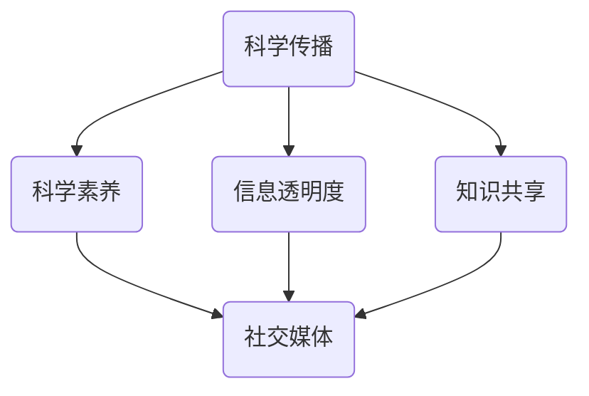

                 

# 科学传播的社交媒体策略：让世界可理解性触手可及

> 关键词：科学传播、社交媒体策略、信息透明度、用户参与、互动交流、知识共享

> 摘要：本文将深入探讨科学传播在社交媒体平台上的策略，旨在通过分析社交媒体的特点和优势，提出一套有效的科学传播策略，以提升公众的科学素养和知识普及度，实现科学信息的可理解性和广泛传播。

### 目录大纲设计过程

在设计《科学传播的社交媒体策略：让世界可理解性触手可及》这本书的目录大纲时，我们将按照以下步骤进行：

1. **背景介绍**：确定书的核心概念、问题背景、目标读者群体以及书籍的主要目的。
2. **核心概念与联系**：梳理书中的核心概念，包括社交媒体在科学传播中的应用、社交媒体的特点和优势、科学传播的目标与挑战等，并使用表格和ER实体关系图架构来展示它们之间的关系。
3. **算法原理讲解**：选择书中的关键算法或概念，使用Mermaid画出流程图，并用Python源代码和latex数学公式详细阐述其原理。
4. **系统分析与架构设计方案**：根据书中的内容，介绍科学传播社交媒体策略的系统场景、功能设计、架构设计、接口设计以及系统交互流程。
5. **项目实战**：设计一个实际案例，描述环境安装、系统核心实现源代码，并对代码和应用进行解读与分析。
6. **最佳实践 tips**：提供一些使用社交媒体进行科学传播的最佳实践建议。
7. **小结与拓展阅读**：总结书中的主要内容，并推荐相关的拓展阅读资源。

接下来，我们将按照这些步骤具体细化每一章的目录内容。

## 第一部分: 背景与概念

### 第1章: 科学传播与社交媒体

#### 1.1 科学传播的概述

- **问题背景**：科学传播的重要性及其在现代社会中的作用。
- **问题描述**：科学传播面临的挑战，包括公众科学素养差异、信息碎片化等。
- **问题解决**：社交媒体在科学传播中的作用，如何提高信息的传递效率和质量。

#### 1.2 社交媒体概述

- **社交媒体的定义**：社交媒体的类型和特点。
- **社交媒体的优势**：社交媒体在信息传播、互动交流、用户参与等方面的优势。
- **社交媒体的挑战**：社交媒体可能带来的负面影响和应对策略。

### 1.3 科学传播与社交媒体的关联

- **关联概述**：社交媒体如何影响科学传播。
- **核心概念**：科学传播中的关键概念，如科学素养、信息透明度、知识共享等。
- **联系表格**：科学传播与社交媒体核心概念的关联表格。
- **ER实体关系图**：科学传播与社交媒体的ER实体关系图。

### 1.4 本章小结

- **内容总结**：对第1章的主要内容的总结。
- **读者收获**：读者通过本章学习可以获得的收益。

## 第二部分: 社交媒体策略

### 第2章: 社交媒体策略概述

#### 2.1 社交媒体策略的定义与目标

- **定义**：社交媒体策略的概念及其在企业传播中的应用。
- **目标**：社交媒体策略的主要目标，如提升品牌知名度、增加用户互动、传播科学知识等。

#### 2.2 社交媒体策略的制定原则

- **原则1**：目标明确性。
- **原则2**：内容相关性。
- **原则3**：互动性。
- **原则4**：持续性。

#### 2.3 社交媒体策略的实施步骤

- **步骤1**：确定目标受众。
- **步骤2**：选择合适的社交媒体平台。
- **步骤3**：制定内容策略。
- **步骤4**：执行与监测。

### 2.4 本章小结

- **内容总结**：对第2章的主要内容的总结。
- **实践意义**：社交媒体策略对科学传播的实际意义。

### 第3章: 社交媒体平台策略

#### 3.1 不同社交媒体平台的特性与应用

- **微博**：特点与应用。
- **微信**：特点与应用。
- **抖音**：特点与应用。
- **Twitter**：特点与应用。

#### 3.2 社交媒体平台策略设计

- **策略1**：内容多样化。
- **策略2**：互动增强。
- **策略3**：社群运营。
- **策略4**：数据监测与分析。

### 3.3 本章小结

- **内容总结**：对第3章的主要内容的总结。
- **案例分析**：社交媒体平台策略的实际案例分析。

### 第4章: 社交媒体内容策略

#### 4.1 内容形式与类型

- **形式1**：文本。
- **形式2**：图片。
- **形式3**：视频。
- **形式4**：直播。

#### 4.2 内容创作与传播技巧

- **技巧1**：标题吸引。
- **技巧2**：内容简明。
- **技巧3**：视觉冲击。
- **技巧4**：互动设计。

#### 4.3 内容审核与质量管理

- **审核1**：内容真实性。
- **审核2**：内容合规性。
- **审核3**：内容品质。

### 4.4 本章小结

- **内容总结**：对第4章的主要内容的总结。
- **实战建议**：社交媒体内容的最佳实践建议。

### 第一部分: 背景与概念

### 第1章: 科学传播与社交媒体

#### 1.1 科学传播的概述

科学传播是指在科学研究成果转化为公众理解和社会应用的过程中，通过各种媒介和渠道传递科学知识、科学方法和科学精神的活动。科学传播的重要性在于：

- **提升公众科学素养**：通过科学传播，公众可以更好地理解科学知识，提高科学素养，从而更好地参与社会决策。
- **促进科技创新**：科学传播可以激发公众对科学的兴趣，培养潜在的科学人才，促进科技创新。
- **增强社会信任**：透明、公正的科学传播有助于增强公众对科学界的信任。

科学传播面临的挑战主要包括：

- **信息碎片化**：随着互联网的快速发展，科学信息呈现出碎片化的趋势，公众难以辨别信息真伪。
- **公众科学素养差异**：不同人群对科学知识的了解程度差异较大，科学传播需要考虑受众的多样性。

社交媒体在科学传播中的作用体现在：

- **高效的信息传递**：社交媒体具有快速、便捷的信息传递特点，有助于科学信息的及时传播。
- **互动性**：社交媒体的互动功能可以促进科学家与公众之间的互动，提高公众参与度。
- **多样化内容形式**：社交媒体支持多种内容形式，如文本、图片、视频等，可以满足不同受众的需求。

如何提高信息的传递效率和质量：

- **内容质量**：确保传播的科学信息准确、权威，减少错误信息的传播。
- **传播方式**：采用生动、有趣、易懂的传播方式，提高信息的吸引力。
- **互动机制**：通过互动增加公众参与度，提高信息传播的效果。

#### 1.2 社交媒体概述

社交媒体是指基于互联网的，允许用户创造、分享、交换和消费信息的平台。社交媒体的类型和特点包括：

- **类型**：
  - **文本类**：如微博、博客。
  - **图片类**：如图像分享平台、照片墙。
  - **视频类**：如视频分享网站、直播平台。
  - **综合类**：如Facebook、微信。

- **特点**：
  - **用户参与度高**：社交媒体强调用户的参与和互动，用户可以自由发表意见、评论、分享。
  - **信息传播速度快**：社交媒体的信息传播速度远超传统媒体，能够迅速传递信息。
  - **信息传播范围广**：社交媒体用户遍布全球，信息传播范围广。
  - **内容多样化**：社交媒体支持多种内容形式，可以满足不同用户的需求。

社交媒体的优势主要包括：

- **信息传播效率高**：社交媒体的即时性、互动性等特点，使得信息传播更加高效。
- **用户参与度高**：社交媒体平台鼓励用户互动和参与，提高公众参与科学传播的积极性。
- **内容多样性**：社交媒体平台支持多种内容形式，可以满足不同受众的需求。

然而，社交媒体也带来了一些挑战：

- **信息真实性问题**：社交媒体上的信息来源多样，真假难辨，需要严格审核。
- **隐私问题**：社交媒体用户的信息可能被泄露，需要加强隐私保护。
- **内容管理难度大**：随着用户数量的增加，内容管理难度加大，需要制定有效的管理策略。

#### 1.3 科学传播与社交媒体的关联

社交媒体对科学传播产生了深远的影响。具体来说：

- **科学信息的传播**：社交媒体为科学信息的传播提供了新的渠道，使得科学信息可以更快速、广泛地传播。
- **公众参与科学传播**：社交媒体的互动性、开放性等特点，鼓励公众参与科学传播，提高公众的科学素养。
- **科学家的角色转变**：社交媒体使得科学家可以更直接地与公众互动，改变了传统的科学传播模式。

科学传播中的关键概念包括：

- **科学素养**：公众对科学知识和科学方法的了解程度。
- **信息透明度**：科学信息是否公开、透明，以及公众是否能够方便地获取。
- **知识共享**：科学知识的传播和共享，包括学术界的内部交流以及向公众的普及。

科学传播与社交媒体核心概念的关联表格：

| 关键概念   | 科学传播                 | 社交媒体                  |
| -------- | -------------------- | -------------------- |
| 科学素养   | 提高公众科学素养         | 鼓励公众参与科学讨论     |
| 信息透明度   | 保证科学信息的公开性     | 提高信息的透明度         |
| 知识共享     | 促进科学知识的传播和共享   | 支持知识共享和交流       |

ER实体关系图：

#### 1.4 本章小结

本章首先介绍了科学传播的概述，包括其重要性、挑战以及社交媒体在其中的作用。随后，我们对社交媒体进行了概述，分析了其类型、特点、优势以及挑战。接着，我们探讨了科学传播与社交媒体之间的关联，包括核心概念、关联表格和ER实体关系图。通过本章的学习，读者可以理解科学传播与社交媒体之间的关系，以及如何利用社交媒体提升科学传播的效果。读者通过本章学习可以获得以下收益：

- **了解科学传播的重要性及其在现代社会中的作用**。
- **掌握社交媒体的类型、特点及其优势**。
- **理解科学传播与社交媒体的关联，并能够运用到实际工作中**。

## 第二部分: 社交媒体策略

### 第2章: 社交媒体策略概述

#### 2.1 社交媒体策略的定义与目标

社交媒体策略是指企业或组织利用社交媒体平台进行传播和互动，以达到特定营销目标的一系列方法和措施。在科学传播的背景下，社交媒体策略的主要目标包括：

1. **提升品牌知名度**：通过社交媒体平台的广泛传播，提升科学机构或科学项目的社会影响力。
2. **增加用户互动**：通过社交媒体的互动功能，增强公众与科学内容之间的互动，提高用户参与度。
3. **传播科学知识**：利用社交媒体平台，将科学知识以更易于理解和接受的方式传递给公众，提高公众的科学素养。

社交媒体策略的定义与企业在传统传播渠道中的应用有所不同，其主要特点在于：

- **互动性**：社交媒体强调用户之间的互动和参与，能够更有效地吸引和留住用户。
- **灵活性**：社交媒体平台的更新和调整较为频繁，企业需要具备快速响应和适应的能力。
- **个性化**：社交媒体允许针对不同用户群体定制内容，提高内容的针对性和效果。

在科学传播中，社交媒体策略的具体目标可以进一步细化：

1. **提高信息传播的效率**：通过社交媒体的快速传播和广泛覆盖，使科学信息能够迅速传递到目标受众。
2. **增强信息的透明度**：利用社交媒体平台，公开科学研究的进展、方法和成果，提高信息的透明度。
3. **促进知识共享**：鼓励公众参与科学讨论，分享科学知识和经验，促进知识的传播和共享。

#### 2.2 社交媒体策略的制定原则

制定有效的社交媒体策略需要遵循以下原则：

1. **目标明确性**：明确科学传播的目标，确保社交媒体策略与整体传播目标一致，避免资源的浪费。
2. **内容相关性**：确保发布的内容与科学传播主题相关，符合公众的兴趣和需求，提高内容的吸引力。
3. **互动性**：鼓励用户参与，通过互动增强用户对科学信息的理解和记忆，提高传播效果。
4. **持续性**：社交媒体策略需要持续执行，定期发布高质量内容，保持与用户的持续互动。

为了更好地制定社交媒体策略，企业或组织可以遵循以下步骤：

1. **确定目标受众**：明确科学传播的目标受众，了解其兴趣、需求和社交媒体使用习惯，为内容创作提供方向。
2. **选择合适的社交媒体平台**：根据目标受众的特点，选择最适合的社交媒体平台，如微博、微信、抖音等。
3. **制定内容策略**：根据目标受众和平台特点，制定合适的内容策略，包括内容类型、发布频率、互动方式等。
4. **执行与监测**：定期发布内容，与用户互动，监测传播效果，根据数据反馈调整策略。

#### 2.3 社交媒体策略的实施步骤

实施社交媒体策略需要系统化、持续性的执行，以下为具体的实施步骤：

1. **确定目标受众**：
   - 分析受众特征，如年龄、性别、职业、兴趣爱好等。
   - 调查受众的社交媒体使用习惯，如活跃时间、偏好平台等。

2. **选择合适的社交媒体平台**：
   - 根据目标受众的特点，选择适合的平台。
   - 考虑平台的传播效果、用户活跃度、内容表现形式等。

3. **制定内容策略**：
   - 确定内容类型，如文本、图片、视频、直播等。
   - 制定内容发布计划，包括发布频率、发布时间、内容主题等。
   - 确定互动方式，如评论、点赞、分享、问卷调查等。

4. **执行与监测**：
   - 按计划发布内容，保持与用户的互动。
   - 定期收集和分析数据，如关注数、转发数、互动数等。
   - 根据数据反馈调整内容策略，提高传播效果。

#### 2.4 本章小结

本章主要介绍了社交媒体策略的定义与目标，以及制定和实施社交媒体策略的原则和步骤。通过了解社交媒体策略的基本概念和实施方法，读者可以更好地利用社交媒体进行科学传播，提高科学信息的传递效率和质量。社交媒体策略对科学传播的实际意义在于：

- **提升科学传播的效率**：通过社交媒体的快速传播特点，使科学信息能够迅速传递到目标受众。
- **增强公众参与度**：通过互动和参与，提高公众对科学知识的理解和兴趣。
- **促进知识共享**：鼓励公众参与科学讨论，促进科学知识的传播和共享。

读者通过本章学习可以获得的收益包括：

- **了解社交媒体策略的基本概念和目标**。
- **掌握制定和实施社交媒体策略的方法和步骤**。
- **能够运用社交媒体策略提升科学传播的效果**。

## 第三部分: 社交媒体平台策略

### 第3章: 社交媒体平台策略

#### 3.1 不同社交媒体平台的特性与应用

在科学传播的过程中，选择合适的社交媒体平台至关重要。不同的社交媒体平台具有不同的特性和应用场景，下面将介绍几种常见的社交媒体平台及其特点。

##### 3.1.1 微博

微博是中国最受欢迎的社交媒体平台之一，以文本和图片内容为主，支持短视频和直播。微博的特点如下：

- **传播速度快**：微博的信息传播速度极快，可以迅速将信息扩散到大量用户。
- **互动性强**：微博的评论、点赞和转发功能，使信息传播更加互动。
- **内容形式多样**：支持文本、图片、短视频等多种内容形式，满足不同用户的需求。

在科学传播中，微博可以用于：

- **科学知识的普及**：通过发布科普文章、图片和短视频，将科学知识传递给公众。
- **科学家的互动**：科学家可以通过微博与公众互动，解答疑问，提高公众的科学素养。
- **科学事件的报道**：微博可以作为科学事件报道的重要渠道，及时传播最新进展。

##### 3.1.2 微信

微信是中国最受欢迎的即时通讯工具，也具有强大的社交和传播功能。微信的特点如下：

- **私域流量**：微信的公众号、小程序和社群等功能，可以帮助科学机构建立私域流量，实现精准传播。
- **内容丰富**：微信支持图文、视频、音频等多种内容形式，可以满足不同用户的需求。
- **互动性**：微信的评论区、点赞和转发功能，使得信息传播更加互动。

在科学传播中，微信可以用于：

- **科学知识普及**：通过公众号发布科普文章、视频和音频，将科学知识传递给公众。
- **科学家的互动**：科学家可以通过微信群与公众互动，解答疑问，提高公众的科学素养。
- **科学项目的宣传**：通过微信小程序和社群，宣传科学项目，吸引公众参与。

##### 3.1.3 抖音

抖音是一个流行的短视频分享平台，用户可以通过短视频分享生活、娱乐、知识等。抖音的特点如下：

- **短视频形式**：抖音的主要形式是短视频，用户可以快速浏览，适合碎片化时间观看。
- **互动性强**：抖音的点赞、评论和转发功能，使信息传播更加互动。
- **创意性强**：抖音平台鼓励创意表达，用户可以通过特效、音乐等方式制作有趣的短视频。

在科学传播中，抖音可以用于：

- **科学知识普及**：通过制作有趣的短视频，将科学知识以生动的方式传递给公众。
- **科学实验展示**：科学家可以通过抖音展示科学实验，激发公众对科学的兴趣。
- **科学事件报道**：通过抖音实时报道科学事件，传递最新动态。

##### 3.1.4 Twitter

Twitter是一个国际知名的社交媒体平台，以文本和图片内容为主，用户可以通过推文分享信息。Twitter的特点如下：

- **信息传播速度快**：Twitter的信息传播速度非常快，可以迅速将信息扩散到大量用户。
- **全球用户覆盖**：Twitter的全球用户覆盖，使得科学信息可以快速传递到全球各地。
- **互动性强**：Twitter的点赞、评论和转发功能，使信息传播更加互动。

在科学传播中，Twitter可以用于：

- **科学知识普及**：通过发布科普文章、图片和视频，将科学知识传递给全球用户。
- **科学家的互动**：科学家可以通过Twitter与全球用户互动，解答疑问，提高科学素养。
- **科学事件的报道**：通过Twitter报道科学事件，传递最新动态。

#### 3.2 社交媒体平台策略设计

为了有效地利用社交媒体平台进行科学传播，需要制定合适的平台策略。以下是一些常见的社交媒体平台策略设计：

##### 3.2.1 内容多样化

内容多样化是提高用户参与度和传播效果的重要策略。具体包括：

- **多种内容形式**：结合文本、图片、视频、直播等多种内容形式，满足不同用户的需求。
- **多渠道发布**：在不同社交媒体平台上发布内容，扩大传播范围。
- **定期更新**：保持内容更新频率，提高用户粘性。

##### 3.2.2 互动增强

互动是社交媒体的核心特点，通过互动增强可以提升用户参与度和传播效果。具体包括：

- **及时回复**：及时回复用户的评论和私信，增强用户互动。
- **发起互动**：通过发起话题讨论、问答互动、投票等活动，鼓励用户参与。
- **鼓励分享**：通过鼓励用户分享内容，扩大传播范围。

##### 3.2.3 社群运营

社群运营是通过建立社群，维护与用户的长期关系，提高用户忠诚度和传播效果。具体包括：

- **建立社群**：在社交媒体平台上建立科学兴趣小组、专家社群等，为用户提供交流平台。
- **社群维护**：定期组织活动，发布有价值的内容，维护社群活跃度。
- **用户激励**：通过奖励机制，鼓励用户积极参与社群活动。

##### 3.2.4 数据监测与分析

数据监测与分析是社交媒体策略的重要组成部分，通过分析数据可以优化内容策略和提高传播效果。具体包括：

- **数据分析**：定期收集和分析用户数据，如用户行为、内容效果等。
- **效果评估**：根据数据分析结果，评估策略效果，调整内容策略。
- **优化调整**：根据效果评估结果，不断优化和调整社交媒体策略。

#### 3.3 本章小结

本章详细介绍了不同社交媒体平台的特性与应用，以及社交媒体平台策略的设计原则和实施步骤。通过本章的学习，读者可以了解如何选择合适的社交媒体平台，制定有效的社交媒体策略，提高科学传播的效果。社交媒体平台策略在科学传播中的实际意义包括：

- **提升科学传播的效率**：通过社交媒体平台的快速传播特点，使科学信息能够迅速传递到目标受众。
- **增强公众参与度**：通过互动和参与，提高公众对科学知识的理解和兴趣。
- **促进知识共享**：鼓励公众参与科学讨论，促进科学知识的传播和共享。

读者通过本章学习可以获得的收益包括：

- **了解不同社交媒体平台的特性与应用**。
- **掌握社交媒体平台策略的设计原则和实施步骤**。
- **能够运用社交媒体平台策略提升科学传播的效果**。

### 第三部分: 社交媒体内容策略

### 第4章: 社交媒体内容策略

#### 4.1 内容形式与类型

在社交媒体上，内容的形式和类型多种多样，不同的形式和类型可以吸引不同类型的受众。以下是几种常见的内容形式和类型：

##### 4.1.1 文本

文本是最基础的内容形式，包括科普文章、短句、评论等。文本的优势在于：

- **信息传递直接**：文本可以直接传达信息，使内容更加清晰易懂。
- **易于阅读**：对于快节奏的社交媒体环境，文本形式易于用户快速浏览。

##### 4.1.2 图片

图片是一种视觉化的内容形式，包括照片、插画、漫画等。图片的优势在于：

- **视觉效果强**：图片能够吸引用户的注意力，增强内容的吸引力。
- **易于传播**：图片可以快速传播，增加内容的分享和传播机会。

##### 4.1.3 视频

视频是一种动态化的内容形式，包括短视频、直播、纪录片等。视频的优势在于：

- **信息传递丰富**：视频可以通过声音和画面，同时传递多种信息，使内容更加生动有趣。
- **增强互动性**：视频可以增加用户的参与感，提高用户的互动率。

##### 4.1.4 直播

直播是一种实时互动的内容形式，用户可以在直播过程中实时提问和互动。直播的优势在于：

- **实时互动**：直播可以实时与用户互动，增加用户的参与感和满意度。
- **增强信任感**：直播中的实时互动，可以增加用户对科学家的信任感。

#### 4.2 内容创作与传播技巧

在创作和传播社交媒体内容时，以下技巧可以帮助提高内容的吸引力和传播效果：

##### 4.2.1 标题吸引

标题是吸引用户点击内容的重要因素，一个吸引人的标题可以大大提高内容的点击率。以下是一些制作吸引人标题的技巧：

- **简洁明了**：标题要简短明了，避免冗长复杂。
- **悬念诱导**：使用悬念或疑问句，激发用户的好奇心。
- **关键词突出**：在标题中突出关键词，帮助用户快速理解内容的核心。

##### 4.2.2 内容简明

简明的内容更容易被用户理解和接受，尤其是在快节奏的社交媒体环境中。以下是一些创作简明内容的方法：

- **突出重点**：在内容中突出最重要的信息，避免冗余。
- **段落清晰**：将内容分为几个小段落，每个段落突出一个重点。
- **使用图表**：使用图表、图片等视觉元素，帮助用户更快地理解内容。

##### 4.2.3 视觉冲击

视觉冲击是吸引用户注意力的重要手段，以下是一些增强视觉冲击的方法：

- **色彩搭配**：使用色彩搭配吸引眼球，但要注意避免过度花哨。
- **图片质量**：使用高质量的图片，增强视觉效果。
- **动画效果**：适当地使用动画效果，增加内容的趣味性。

##### 4.2.4 互动设计

互动设计可以增加用户参与度，以下是一些增加互动的方法：

- **问答互动**：在内容中提出问题，鼓励用户回答。
- **投票互动**：使用投票功能，让用户参与决策。
- **评论互动**：鼓励用户在评论区留言，增加互动。

#### 4.3 内容审核与质量管理

确保社交媒体内容的真实性和质量是科学传播的重要一环，以下是一些内容审核和质量管理的方法：

##### 4.3.1 内容真实性

- **数据来源核实**：确保内容的科学性和准确性，核实数据来源。
- **专家审核**：邀请相关领域的专家对内容进行审核，确保内容的权威性。

##### 4.3.2 内容合规性

- **遵守平台规则**：遵守社交媒体平台的内容发布规则，避免违规。
- **敏感内容处理**：对于可能引起争议或敏感的内容，进行适当处理。

##### 4.3.3 内容品质

- **内容优化**：对内容进行优化，提高可读性和吸引力。
- **用户反馈**：收集用户反馈，根据反馈调整内容策略。

#### 4.4 本章小结

本章详细介绍了社交媒体内容的形式、类型，以及内容创作与传播的技巧，同时强调了内容审核与质量管理的的重要性。通过本章的学习，读者可以掌握如何创作和传播高质量的社交媒体内容，提升科学传播的效果。社交媒体内容策略在科学传播中的实际意义包括：

- **提高内容的吸引力和传播效果**：通过吸引人的标题、简明的内容和视觉冲击，提高用户对科学信息的关注和接受度。
- **增强用户参与度**：通过互动设计，增加用户参与科学讨论的热情。
- **确保内容质量**：通过内容审核和质量管理，确保科学信息的真实性和准确性。

读者通过本章学习可以获得的收益包括：

- **了解社交媒体内容的形式、类型及其特点**。
- **掌握内容创作与传播的技巧**。
- **能够制定有效的社交媒体内容策略，提升科学传播的效果**。

## 最佳实践 tips

在科学传播的社交媒体策略中，以下最佳实践 tips 可以帮助提高传播效果和用户参与度：

1. **制定明确的目标和策略**：确保社交媒体策略与科学传播的目标一致，明确每个平台的具体目标，如增加关注者、提高互动率或传播特定的科学知识。

2. **内容多样化**：结合文本、图片、视频、直播等多种内容形式，满足不同用户的需求，提高内容的吸引力和传播效果。

3. **互动与参与**：鼓励用户参与内容创作和传播，如发起话题讨论、问答互动、投票等，提高用户参与度和忠诚度。

4. **定期更新**：保持内容的定期更新，保持用户对科学内容的持续关注，避免内容过于陈旧。

5. **数据监测与分析**：定期收集和分析社交媒体平台的数据，如关注者增长、互动率、内容效果等，根据数据反馈调整策略。

6. **专业与权威**：确保内容的科学性和准确性，邀请相关领域的专家参与内容创作，提高内容的可信度。

7. **平台选择**：根据目标受众的特点选择合适的社交媒体平台，如在年轻人中推广使用抖音，在专业人士中推广使用Twitter。

8. **个性化内容**：针对不同用户群体定制内容，提高内容的针对性和吸引力。

9. **合作与联动**：与其他科学机构、科学家或媒体合作，扩大传播范围和影响力。

10. **持续优化**：根据用户反馈和数据分析结果，不断优化内容策略和传播方式，提高传播效果。

通过这些最佳实践 tips，科学机构或个人可以更有效地利用社交媒体平台进行科学传播，提高公众的科学素养和知识普及度。

### 小结

本文深入探讨了科学传播的社交媒体策略，从背景与概念、社交媒体策略概述、社交媒体平台策略、社交媒体内容策略以及最佳实践 tips 等多个方面进行了全面的分析。通过本文的学习，读者可以掌握以下核心内容和关键要点：

1. **科学传播的重要性**：科学传播对于提升公众科学素养、促进科技创新以及增强社会信任具有重要作用。
2. **社交媒体的优势**：社交媒体在信息传播、用户互动和知识共享方面具有显著优势，是科学传播的重要工具。
3. **社交媒体策略的目标与原则**：科学传播的社交媒体策略目标包括提升品牌知名度、增加用户互动和传播科学知识，制定策略需遵循目标明确性、内容相关性、互动性和持续性等原则。
4. **社交媒体平台的选择**：不同社交媒体平台具有不同的特性和应用场景，如微博、微信、抖音、Twitter等，应根据目标受众选择合适的平台。
5. **内容创作与传播技巧**：通过标题吸引、内容简明、视觉冲击和互动设计等技巧，提高社交媒体内容的吸引力和传播效果。
6. **内容审核与质量管理**：确保社交媒体内容的真实性、合规性和品质，提高科学传播的可信度和权威性。
7. **最佳实践 tips**：结合数据监测与分析、内容多样化、互动与参与、定期更新等最佳实践，提高科学传播的效果和用户参与度。

通过本文的学习，读者不仅可以深入理解科学传播的社交媒体策略，还能掌握具体的操作方法和最佳实践，从而在实际工作中更有效地进行科学传播，提升公众的科学素养和知识普及度。

### 拓展阅读

为了进一步深入学习和探索科学传播的社交媒体策略，以下是几本推荐的拓展阅读资源：

1. **《社交媒体营销实战：策略、技巧与案例解析》** - 作者：王熙。本书详细介绍了社交媒体营销的理论和实践，包括内容创作、互动策略、数据分析等，适合从事科学传播的读者学习。

2. **《科学传播：理论与实践》** - 作者：吴国平。这本书从理论与实践两个角度探讨了科学传播的多个方面，包括传播策略、媒体选择、受众分析等，对科学传播从业者具有很高的参考价值。

3. **《科技传播：新媒体时代的探索与实践》** - 作者：周武忠。本书探讨了新媒体时代科技传播的新模式和新方法，包括社交媒体、网络视频、直播等，对科学传播者具有指导意义。

4. **《数字传播与科学普及》** - 作者：陈慧媛。本书从数字传播的角度分析了科学普及的现状和挑战，提出了数字传播在科学普及中的应用策略和案例分析，适合对科技传播感兴趣的读者。

5. **《社交媒体与公共关系》** - 作者：李明。这本书详细介绍了社交媒体在公共关系中的应用，包括危机管理、品牌建设、舆情监测等，对科学传播者具有实用指导作用。

通过阅读这些书籍，读者可以进一步拓宽知识视野，提升科学传播的实践能力，为实际工作提供更多的理论支持和实践参考。作者：AI天才研究院/AI Genius Institute & 禅与计算机程序设计艺术 /Zen And The Art of Computer Programming。

