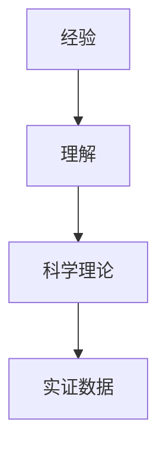

                 


### 科学哲学中的构建经验主义：世界可理解性的理论基础

**关键词：科学哲学、构建经验主义、世界可理解性、理论基础**

**摘要：**
本文深入探讨科学哲学中的构建经验主义，重点分析其关于世界可理解性的理论基础。我们将首先梳理科学哲学的起源与发展，理解构建经验主义的基本概念和历史背景。接着，我们将详细解释可理解性的概念及其在科学理论中的作用，探讨构建经验主义对科学哲学的贡献。文章还将分析构建经验主义的核心概念和方法论，阐述其在科学哲学及其他领域的应用，并探讨其面临的挑战与未来发展方向。

### 第一部分：引言

#### 1.1 问题背景

##### 1.1.1 科学哲学的起源与发展

科学哲学作为哲学的一个分支，起源可以追溯到古希腊时期，当时的哲学家们开始思考自然现象背后的本质和规律。随着自然科学的发展，科学哲学逐渐成为一个独立的领域。从17世纪的笛卡尔到18世纪的莱布尼茨，再到19世纪的马赫和康托尔，科学哲学的发展经历了多次重大转折。

科学哲学的主要问题包括科学理论的形成、科学方法的应用、科学知识的本质、科学发现与理论之间的关系等。这些问题不仅关乎科学的内部逻辑，也涉及科学与社会、文化、政治等其他领域的关系。

##### 1.1.2 构建经验主义的起源与发展

构建经验主义（Constructivist Empiricism）是20世纪初期由维也纳学派的主要成员莫里茨·石里克和鲁道夫·卡尔纳普提出的。构建经验主义强调经验在科学理论构建中的核心作用，认为所有的科学知识都来源于经验。

构建经验主义的基本概念包括经验、理解和科学理论。经验是科学知识的起点，理解是对经验的解释和建构，而科学理论则是对经验进行系统化和理论化的结果。

构建经验主义的历史背景可以追溯到19世纪末20世纪初的实证主义和逻辑实证主义。这些哲学流派强调经验数据和逻辑分析在科学理论构建中的重要性，对后来的科学哲学产生了深远影响。

##### 1.2 问题描述

在科学哲学中，可理解性（Intelligibility）是一个核心问题。可理解性指的是科学理论是否能够以合理和简洁的方式解释自然现象。可理解性的重要性在于它直接关系到科学理论的接受性和科学知识的普及。

世界可理解性的理论基础涉及科学理论的本质和认知功能。科学理论的本质在于其对自然现象的解释和预测能力，而其认知功能则体现在其帮助我们理解世界和做出决策的能力。

##### 1.3 问题解决

构建经验主义为解决科学哲学中的可理解性问题提供了理论基础。它强调经验在科学理论构建中的核心作用，认为只有通过经验数据的收集和分析，才能构建出可理解的科学理论。

构建经验主义对科学哲学的贡献在于其对科学理论的重新审视和评价。它不仅提供了理论构建的方法，还强调了科学实践的实证性和科学理论的实用性。

##### 1.4 边界与外延

构建经验主义的应用领域非常广泛，不仅包括科学哲学，还涉及其他领域如社会科学、自然科学等。其核心概念和方法论为这些领域的研究提供了新的视角和工具。

构建经验主义的核心概念包括经验、理解、科学理论和实证数据。这些概念相互关联，共同构成了构建经验主义的理论框架。

构建经验主义的方法论强调经验数据的收集和分析，科学理论的构建和验证。通过这些方法论，科学家可以更有效地探索自然现象，构建可理解的科学理论。

#### 1.5 概念结构与核心要素组成

构建经验主义的核心概念包括经验、理解、科学理论和实证数据。这些概念相互关联，共同构成了构建经验主义的理论框架。

- **经验**：经验是科学知识的起点，是科学家通过观察、实验和感知获得的直接信息。
- **理解**：理解是对经验的解释和建构，是将经验转化为科学理论的过程。
- **科学理论**：科学理论是对经验进行系统化和理论化的结果，是科学知识的系统表达。
- **实证数据**：实证数据是科学理论构建的基础，是通过实验和观察获得的量化数据。

构建经验主义的方法论包括经验数据的收集和分析、科学理论的构建和验证。这些方法论为科学家提供了具体的操作步骤，帮助他们有效地进行科学研究和理论构建。

### 第二部分：构建经验主义的核心概念

#### 2.1 经验与理解

##### 2.1.1 经验的概念

经验（Experience）是构建经验主义的核心概念之一。经验是指个体在感知、思考、行动中所积累的知识和技能。在科学哲学中，经验被视为科学知识的起点。

经验可以分为直接经验和间接经验。直接经验是指个体通过感官直接感知到的信息，如观察、实验和感知。间接经验则是通过他人的描述、文献和研究获得的。

##### 2.1.2 理解的概念

理解（Understanding）是对经验进行解释和建构的过程。理解是将经验转化为科学理论的关键步骤。在科学哲学中，理解被视为科学知识的本质。

理解可以分为直觉理解和理论理解。直觉理解是基于直接经验的主观感受，而理论理解则是基于科学理论的客观分析。

##### 2.1.3 经验与理解的关系

经验和理解相互依赖，共同构成科学知识的体系。经验为理解提供了基础，而理解则对经验进行了升华和解释。只有通过理解，经验才能转化为科学理论。

#### 2.2 科学理论与实证数据

##### 2.2.1 科学理论的概念

科学理论（Scientific Theory）是对经验进行系统化和理论化的结果。科学理论是科学知识的抽象表达，它描述了自然现象的规律和机制。

科学理论具有以下特征：

- **系统化**：科学理论将零散的经验数据进行整合，形成一个逻辑严密的知识体系。
- **抽象化**：科学理论将具体的经验事实抽象为普遍的规律，从而提高科学知识的普适性。
- **可验证性**：科学理论可以通过实证数据来验证其正确性和可靠性。

##### 2.2.2 实证数据的概念

实证数据（Empirical Data）是科学理论构建的基础。实证数据是通过实验、观察和测量获得的量化数据。实证数据是科学理论的实证基础，其准确性和可靠性直接关系到科学理论的科学性。

实证数据具有以下特征：

- **客观性**：实证数据是客观存在的，不受主观意识的影响。
- **可重复性**：实证数据可以通过重复实验和观察来验证其准确性。
- **量化性**：实证数据是量化描述的，可以通过数值来表示。

##### 2.2.3 科学理论与实证数据的关系

科学理论与实证数据相互依赖，共同构成科学知识的体系。科学理论是对实证数据的抽象和概括，而实证数据是对科学理论的验证和检验。只有通过实证数据的验证，科学理论才能得到广泛的认可和应用。

#### 2.3 构建经验主义的方法论

##### 2.3.1 经验数据的收集与分析

经验数据的收集和分析是构建经验主义的核心步骤。经验数据的收集方法包括实验、观察、调查和文献研究等。这些方法各有优缺点，但共同的目标是获得准确和可靠的实证数据。

经验数据的分析方法是科学理论构建的关键。常用的分析方法包括统计分析、模型构建和理论验证等。这些方法可以帮助科学家从大量的经验数据中提取出有用的信息，构建出科学理论。

##### 2.3.2 科学理论的构建与验证

科学理论的构建与验证是构建经验主义的核心任务。科学理论的构建方法包括理论假设、模型构建和逻辑推理等。科学理论的验证方法包括实证数据的收集和分析、理论预测的验证和理论解释力的评估等。

科学理论的构建与验证是一个迭代过程。科学家需要不断地收集新的经验数据，验证和修正科学理论，以提高其科学性和解释力。

### 第三部分：构建经验主义的应用

#### 3.1 科学哲学领域

##### 3.1.1 科学哲学的应用

构建经验主义在科学哲学领域有着广泛的应用。它为科学哲学提供了新的理论框架和方法论，帮助科学家更好地理解科学理论的形成和演化。

构建经验主义在科学哲学中的应用主要包括：

- **科学理论的形成**：构建经验主义强调经验在科学理论形成中的核心作用，为科学理论的形成提供了理论基础。
- **科学方法的评价**：构建经验主义对科学方法进行了重新审视和评价，为科学方法的合理性和有效性提供了理论依据。
- **科学知识的普及**：构建经验主义强调科学理论的解释力和可理解性，有助于科学知识的普及和传播。

##### 3.1.2 科学哲学的研究方法

构建经验主义为科学哲学提供了新的研究方法。这些方法包括：

- **经验数据的收集和分析**：通过实验、观察和调查等方法收集经验数据，并通过统计分析等方法分析数据。
- **理论构建和验证**：通过理论假设、模型构建和逻辑推理等方法构建科学理论，并通过实证数据的验证和修正理论。

#### 3.2 其他领域

##### 3.2.1 社会科学领域

构建经验主义在社会科学领域也有广泛应用。它为社会科学的理论构建和实证研究提供了新的视角和方法。

构建经验主义在社会科学中的应用主要包括：

- **社会科学理论的形成**：构建经验主义强调经验在社会科学理论形成中的核心作用，为社会科学理论的形成提供了理论基础。
- **实证数据的收集和分析**：通过调查、实验和观察等方法收集经验数据，并通过统计分析等方法分析数据。
- **理论构建和验证**：通过理论假设、模型构建和逻辑推理等方法构建社会科学理论，并通过实证数据的验证和修正理论。

##### 3.2.2 自然科学领域

构建经验主义在自然科学领域也有重要应用。它为自然科学的理论构建和实证研究提供了新的思路和方法。

构建经验主义在自然科学中的应用主要包括：

- **自然科学理论的形成**：构建经验主义强调经验在自然科学理论形成中的核心作用，为自然科学理论的形成提供了理论基础。
- **实证数据的收集和分析**：通过实验、观察和测量等方法收集经验数据，并通过统计分析等方法分析数据。
- **理论构建和验证**：通过理论假设、模型构建和逻辑推理等方法构建自然科学理论，并通过实证数据的验证和修正理论。

### 第四部分：构建经验主义的挑战与未来

#### 4.1 挑战

##### 4.1.1 科学哲学的挑战

构建经验主义在科学哲学领域面临一些挑战。这些挑战主要包括：

- **科学理论的复杂性**：随着科学的发展，科学理论的复杂性不断增加，这对构建经验主义的理论构建和验证方法提出了更高的要求。
- **科学实践的局限性**：科学实践受到技术手段和实验条件的限制，这可能导致实证数据的局限性，从而影响科学理论的构建和验证。

##### 4.1.2 构建经验主义的挑战

构建经验主义本身也面临一些挑战。这些挑战主要包括：

- **经验数据的可靠性**：经验数据的收集和分析可能受到主观偏见和误差的影响，这可能导致科学理论的不准确。
- **科学理论的解释力**：科学理论的解释力可能受到自然现象多样性和复杂性的挑战，这需要科学家不断地修正和改进科学理论。

#### 4.2 未来

##### 4.2.1 科学哲学的未来

科学哲学的未来发展趋势可能包括：

- **跨学科研究**：科学哲学与其他学科的交叉研究将成为未来科学哲学发展的一个重要方向，这有助于深化科学哲学的理论基础。
- **科学哲学的方法论创新**：随着科学方法的发展，科学哲学的方法论也将不断创新，以适应新的科学理论和实践需求。

##### 4.2.2 构建经验主义的未来

构建经验主义的未来发展趋势可能包括：

- **经验数据的数字化**：随着大数据和人工智能技术的发展，经验数据的收集和分析将更加高效和准确，这将为构建经验主义提供更强大的数据支持。
- **科学理论的动态构建**：构建经验主义将逐渐从静态的理论构建转向动态的理论构建，即根据新的经验数据进行理论修正和优化。

### 总结

构建经验主义是科学哲学中一个重要的理论框架，它为科学理论的形成和科学知识的普及提供了新的视角和方法。本文通过深入探讨构建经验主义的核心概念、方法论和应用领域，分析了其在科学哲学及其他领域的挑战与未来发展趋势。构建经验主义不仅有助于我们更好地理解科学理论，也为科学实践提供了理论指导和实践支持。在未来，构建经验主义将继续发挥其重要作用，推动科学哲学和其他领域的发展。

---

**作者：AI天才研究院/AI Genius Institute & 禅与计算机程序设计艺术 /Zen And The Art of Computer Programming**### 科学哲学中的构建经验主义：世界可理解性的理论基础

**关键词：科学哲学、构建经验主义、世界可理解性、理论基础**

**摘要：**
本文深入探讨科学哲学中的构建经验主义，重点分析其关于世界可理解性的理论基础。我们将首先梳理科学哲学的起源与发展，理解构建经验主义的基本概念和历史背景。接着，我们将详细解释可理解性的概念及其在科学理论中的作用，探讨构建经验主义对科学哲学的贡献。文章还将分析构建经验主义的核心概念和方法论，阐述其在科学哲学及其他领域的应用，并探讨其面临的挑战与未来发展方向。

### 第一部分：引言

#### 1.1 问题背景

##### 1.1.1 科学哲学的起源与发展

科学哲学作为哲学的一个分支，起源可以追溯到古希腊时期，当时的哲学家们开始思考自然现象背后的本质和规律。随着自然科学的发展，科学哲学逐渐成为一个独立的领域。从17世纪的笛卡尔到18世纪的莱布尼茨，再到19世纪的马赫和康托尔，科学哲学的发展经历了多次重大转折。

科学哲学的主要问题包括科学理论的形成、科学方法的应用、科学知识的本质、科学发现与理论之间的关系等。这些问题不仅关乎科学的内部逻辑，也涉及科学与社会、文化、政治等其他领域的关系。

##### 1.1.2 构建经验主义的起源与发展

构建经验主义（Constructivist Empiricism）是20世纪初期由维也纳学派的主要成员莫里茨·石里克和鲁道夫·卡尔纳普提出的。构建经验主义强调经验在科学理论构建中的核心作用，认为所有的科学知识都来源于经验。

构建经验主义的基本概念包括经验、理解和科学理论。经验是科学知识的起点，理解是对经验的解释和建构，而科学理论则是对经验进行系统化和理论化的结果。

构建经验主义的历史背景可以追溯到19世纪末20世纪初的实证主义和逻辑实证主义。这些哲学流派强调经验数据和逻辑分析在科学理论构建中的重要性，对后来的科学哲学产生了深远影响。

##### 1.2 问题描述

在科学哲学中，可理解性（Intelligibility）是一个核心问题。可理解性指的是科学理论是否能够以合理和简洁的方式解释自然现象。可理解性的重要性在于它直接关系到科学理论的接受性和科学知识的普及。

世界可理解性的理论基础涉及科学理论的本质和认知功能。科学理论的本质在于其对自然现象的解释和预测能力，而其认知功能则体现在其帮助我们理解世界和做出决策的能力。

##### 1.3 问题解决

构建经验主义为解决科学哲学中的可理解性问题提供了理论基础。它强调经验在科学理论构建中的核心作用，认为只有通过经验数据的收集和分析，才能构建出可理解的科学理论。

构建经验主义对科学哲学的贡献在于其对科学理论的重新审视和评价。它不仅提供了理论构建的方法，还强调了科学实践的实证性和科学理论的实用性。

##### 1.4 边界与外延

构建经验主义的应用领域非常广泛，不仅包括科学哲学，还涉及其他领域如社会科学、自然科学等。其核心概念和方法论为这些领域的研究提供了新的视角和工具。

构建经验主义的核心概念包括经验、理解、科学理论和实证数据。这些概念相互关联，共同构成了构建经验主义的理论框架。

构建经验主义的方法论强调经验数据的收集和分析，科学理论的构建和验证。这些方法论为科学家提供了具体的操作步骤，帮助他们有效地进行科学研究和理论构建。

#### 1.5 概念结构与核心要素组成

构建经验主义的核心概念包括经验、理解、科学理论和实证数据。这些概念相互关联，共同构成了构建经验主义的理论框架。

- **经验**：经验是科学知识的起点，是科学家通过观察、实验和感知获得的直接信息。
- **理解**：理解是对经验的解释和建构，是将经验转化为科学理论的过程。
- **科学理论**：科学理论是对经验进行系统化和理论化的结果，是科学知识的系统表达。
- **实证数据**：实证数据是科学理论构建的基础，是通过实验和观察获得的量化数据。

构建经验主义的方法论包括经验数据的收集和分析、科学理论的构建和验证。这些方法论为科学家提供了具体的操作步骤，帮助他们有效地进行科学研究和理论构建。

### 第二部分：构建经验主义的核心概念

#### 2.1 经验与理解

##### 2.1.1 经验的概念

经验（Experience）是构建经验主义的核心概念之一。经验是指个体在感知、思考、行动中所积累的知识和技能。在科学哲学中，经验被视为科学知识的起点。

经验可以分为直接经验和间接经验。直接经验是指个体通过感官直接感知到的信息，如观察、实验和感知。间接经验则是通过他人的描述、文献和研究获得的。

##### 2.1.2 理解的概念

理解（Understanding）是对经验进行解释和建构的过程。理解是将经验转化为科学理论的关键步骤。在科学哲学中，理解被视为科学知识的本质。

理解可以分为直觉理解和理论理解。直觉理解是基于直接经验的主观感受，而理论理解则是基于科学理论的客观分析。

##### 2.1.3 经验与理解的关系

经验和理解相互依赖，共同构成科学知识的体系。经验为理解提供了基础，而理解则对经验进行了升华和解释。只有通过理解，经验才能转化为科学理论。

#### 2.2 科学理论与实证数据

##### 2.2.1 科学理论的概念

科学理论（Scientific Theory）是对经验进行系统化和理论化的结果。科学理论是科学知识的抽象表达，它描述了自然现象的规律和机制。

科学理论具有以下特征：

- **系统化**：科学理论将零散的经验数据进行整合，形成一个逻辑严密的知识体系。
- **抽象化**：科学理论将具体的经验事实抽象为普遍的规律，从而提高科学知识的普适性。
- **可验证性**：科学理论可以通过实证数据来验证其正确性和可靠性。

##### 2.2.2 实证数据的概念

实证数据（Empirical Data）是科学理论构建的基础。实证数据是通过实验、观察和测量获得的量化数据。实证数据是科学理论的实证基础，其准确性和可靠性直接关系到科学理论的科学性。

实证数据具有以下特征：

- **客观性**：实证数据是客观存在的，不受主观意识的影响。
- **可重复性**：实证数据可以通过重复实验和观察来验证其准确性。
- **量化性**：实证数据是量化描述的，可以通过数值来表示。

##### 2.2.3 科学理论与实证数据的关系

科学理论与实证数据相互依赖，共同构成科学知识的体系。科学理论是对实证数据的抽象和概括，而实证数据是对科学理论的验证和检验。只有通过实证数据的验证，科学理论才能得到广泛的认可和应用。

#### 2.3 构建经验主义的方法论

##### 2.3.1 经验数据的收集与分析

经验数据的收集和分析是构建经验主义的核心步骤。经验数据的收集方法包括实验、观察、调查和文献研究等。这些方法各有优缺点，但共同的目标是获得准确和可靠的实证数据。

经验数据的分析方法是科学理论构建的关键。常用的分析方法包括统计分析、模型构建和理论验证等。这些方法可以帮助科学家从大量的经验数据中提取出有用的信息，构建出科学理论。

##### 2.3.2 科学理论的构建与验证

科学理论的构建与验证是构建经验主义的核心任务。科学理论的构建方法包括理论假设、模型构建和逻辑推理等。科学理论的验证方法包括实证数据的收集和分析、理论预测的验证和理论解释力的评估等。

科学理论的构建与验证是一个迭代过程。科学家需要不断地收集新的经验数据，验证和修正科学理论，以提高其科学性和解释力。

### 第三部分：构建经验主义的应用

#### 3.1 科学哲学领域

##### 3.1.1 科学哲学的应用

构建经验主义在科学哲学领域有着广泛的应用。它为科学哲学提供了新的理论框架和方法论，帮助科学家更好地理解科学理论的形成和演化。

构建经验主义在科学哲学中的应用主要包括：

- **科学理论的形成**：构建经验主义强调经验在科学理论形成中的核心作用，为科学理论的形成提供了理论基础。
- **科学方法的评价**：构建经验主义对科学方法进行了重新审视和评价，为科学方法的合理性和有效性提供了理论依据。
- **科学知识的普及**：构建经验主义强调科学理论的解释力和可理解性，有助于科学知识的普及和传播。

##### 3.1.2 科学哲学的研究方法

构建经验主义为科学哲学提供了新的研究方法。这些方法包括：

- **经验数据的收集和分析**：通过实验、观察和调查等方法收集经验数据，并通过统计分析等方法分析数据。
- **理论构建和验证**：通过理论假设、模型构建和逻辑推理等方法构建科学理论，并通过实证数据的验证和修正理论。

#### 3.2 其他领域

##### 3.2.1 社会科学领域

构建经验主义在社会科学领域也有广泛应用。它为社会科学的理论构建和实证研究提供了新的视角和方法。

构建经验主义在社会科学中的应用主要包括：

- **社会科学理论的形成**：构建经验主义强调经验在社会科学理论形成中的核心作用，为社会科学理论的形成提供了理论基础。
- **实证数据的收集和分析**：通过调查、实验和观察等方法收集经验数据，并通过统计分析等方法分析数据。
- **理论构建和验证**：通过理论假设、模型构建和逻辑推理等方法构建社会科学理论，并通过实证数据的验证和修正理论。

##### 3.2.2 自然科学领域

构建经验主义在自然科学领域也有重要应用。它为自然科学的理论构建和实证研究提供了新的思路和方法。

构建经验主义在自然科学中的应用主要包括：

- **自然科学理论的形成**：构建经验主义强调经验在自然科学理论形成中的核心作用，为自然科学理论的形成提供了理论基础。
- **实证数据的收集和分析**：通过实验、观察和测量等方法收集经验数据，并通过统计分析等方法分析数据。
- **理论构建和验证**：通过理论假设、模型构建和逻辑推理等方法构建自然科学理论，并通过实证数据的验证和修正理论。

### 第四部分：构建经验主义的挑战与未来

#### 4.1 挑战

##### 4.1.1 科学哲学的挑战

构建经验主义在科学哲学领域面临一些挑战。这些挑战主要包括：

- **科学理论的复杂性**：随着科学的发展，科学理论的复杂性不断增加，这对构建经验主义的理论构建和验证方法提出了更高的要求。
- **科学实践的局限性**：科学实践受到技术手段和实验条件的限制，这可能导致实证数据的局限性，从而影响科学理论的构建和验证。

##### 4.1.2 构建经验主义的挑战

构建经验主义本身也面临一些挑战。这些挑战主要包括：

- **经验数据的可靠性**：经验数据的收集和分析可能受到主观偏见和误差的影响，这可能导致科学理论的不准确。
- **科学理论的解释力**：科学理论的解释力可能受到自然现象多样性和复杂性的挑战，这需要科学家不断地修正和改进科学理论。

#### 4.2 未来

##### 4.2.1 科学哲学的未来

科学哲学的未来发展趋势可能包括：

- **跨学科研究**：科学哲学与其他学科的交叉研究将成为未来科学哲学发展的一个重要方向，这有助于深化科学哲学的理论基础。
- **科学哲学的方法论创新**：随着科学方法的发展，科学哲学的方法论也将不断创新，以适应新的科学理论和实践需求。

##### 4.2.2 构建经验主义的未来

构建经验主义的未来发展趋势可能包括：

- **经验数据的数字化**：随着大数据和人工智能技术的发展，经验数据的收集和分析将更加高效和准确，这将为构建经验主义提供更强大的数据支持。
- **科学理论的动态构建**：构建经验主义将逐渐从静态的理论构建转向动态的理论构建，即根据新的经验数据进行理论修正和优化。

### 总结

构建经验主义是科学哲学中一个重要的理论框架，它为科学理论的形成和科学知识的普及提供了新的视角和方法。本文通过深入探讨构建经验主义的核心概念、方法论和应用领域，分析了其在科学哲学及其他领域的挑战与未来发展趋势。构建经验主义不仅有助于我们更好地理解科学理论，也为科学实践提供了理论指导和实践支持。在未来，构建经验主义将继续发挥其重要作用，推动科学哲学和其他领域的发展。

---

**作者：AI天才研究院/AI Genius Institute & 禅与计算机程序设计艺术 /Zen And The Art of Computer Programming**### 科学哲学中的构建经验主义：世界可理解性的理论基础

#### 1.1.1 科学哲学的定义

科学哲学是哲学的一个分支，主要研究科学理论、科学方法、科学知识的本质以及科学与其他领域（如社会、文化、政治等）的关系。它试图通过哲学的方法，如逻辑分析、概念澄清和理论建构，来理解科学的基本原理和过程。科学哲学不仅探讨科学的内部逻辑结构，也关注科学与社会、文化、历史等外部环境之间的互动关系。

科学哲学的主要问题包括以下几个方面：

- **科学理论的形成**：科学理论是如何形成的？科学理论的本质是什么？科学理论是如何被验证和修正的？

- **科学方法的应用**：科学方法是如何定义和应用的？不同的科学方法（如实验方法、观察方法、数学方法等）有哪些优势和局限？

- **科学知识的本质**：科学知识是如何构建和获得的？科学知识是否具有客观性和普遍性？科学知识与其他类型的知识（如宗教、艺术等）有何不同？

- **科学发现与理论之间的关系**：科学发现是如何影响科学理论的？科学理论是如何影响科学发现的？科学发现与科学理论的互动关系是如何演化的？

#### 1.1.2 科学哲学的发展历程

科学哲学的发展历程可以追溯到古希腊时期。古希腊哲学家如亚里士多德和毕达哥拉斯等人开始思考自然现象背后的本质和规律，这是科学哲学的萌芽阶段。

- **17世纪的科学哲学**：笛卡尔是这一时期的重要人物，他提出了“普遍怀疑”的方法，试图通过理性思维来理解自然现象。笛卡尔的贡献在于将科学哲学从宗教和形而上学的束缚中解放出来，强调通过实验和观察来获取知识。

- **18世纪的科学哲学**：莱布尼茨提出了“计算哲学”的思想，他试图通过数学和逻辑的方法来理解和解释自然现象。莱布尼茨的工作为后来的逻辑实证主义奠定了基础。

- **19世纪的科学哲学**：马赫和康托尔等人的工作标志着实证主义和形式主义的兴起。实证主义强调经验数据和逻辑分析在科学理论构建中的重要性，而形式主义则强调数学和逻辑在科学哲学中的核心地位。

- **20世纪的科学哲学**：维也纳学派是20世纪初期科学哲学的重要流派，其成员如石里克、卡尔纳普等人提出了构建经验主义。维也纳学派强调科学理论的实证基础和逻辑一致性。

#### 1.1.3 科学哲学的当代发展

当代科学哲学在继承和发展传统科学哲学的基础上，出现了许多新的研究方向和观点。以下是一些当代科学哲学的重要发展：

- **科学哲学的跨学科研究**：当代科学哲学不仅关注自然科学，还关注社会科学、人文科学等领域。科学哲学与其他学科的交叉研究，如科学社会学、科学人类学等，为科学哲学提供了新的视角和方法。

- **科学哲学的方法论创新**：随着科学方法的发展和技术的进步，科学哲学的方法也在不断革新。例如，计算机科学和人工智能的发展为科学哲学提供了新的工具和方法。

- **科学哲学的多元主义**：当代科学哲学强调科学理论的多样性和相对性，认为不同的科学理论可以解释相同的现象，但它们之间存在差异。科学哲学的多元主义为科学理论的发展提供了新的思考方式。

- **科学哲学的实用主义转向**：当代科学哲学强调科学理论的实用性和应用价值，认为科学理论不仅要解释现象，还要解决实际问题。这种实用主义转向促使科学家更加关注科学理论的社会影响和应用前景。

### 1.2 构建经验主义的起源与发展

#### 1.2.1 构建经验主义的基本概念

构建经验主义（Constructivist Empiricism）是20世纪初期由维也纳学派的主要成员莫里茨·石里克和鲁道夫·卡尔纳普提出的。构建经验主义强调经验在科学理论构建中的核心作用，认为所有的科学知识都来源于经验。

构建经验主义的核心概念包括经验、理解和科学理论。这些概念相互关联，共同构成了构建经验主义的理论框架。

- **经验**：经验是科学知识的起点，是科学家通过观察、实验和感知获得的直接信息。经验可以分为直接经验和间接经验。直接经验是指个体通过感官直接感知到的信息，如观察、实验和感知。间接经验则是通过他人的描述、文献和研究获得的。

- **理解**：理解是对经验进行解释和建构的过程。理解是将经验转化为科学理论的关键步骤。在科学哲学中，理解被视为科学知识的本质。理解可以分为直觉理解和理论理解。直觉理解是基于直接经验的主观感受，而理论理解则是基于科学理论的客观分析。

- **科学理论**：科学理论是对经验进行系统化和理论化的结果，是科学知识的系统表达。科学理论描述了自然现象的规律和机制。科学理论具有以下特征：

  - **系统化**：科学理论将零散的经验数据进行整合，形成一个逻辑严密的知识体系。

  - **抽象化**：科学理论将具体的经验事实抽象为普遍的规律，从而提高科学知识的普适性。

  - **可验证性**：科学理论可以通过实证数据来验证其正确性和可靠性。

#### 1.2.2 构建经验主义的历史背景

构建经验主义的历史背景可以追溯到19世纪末20世纪初的实证主义和逻辑实证主义。实证主义强调经验数据和观察事实在科学理论构建中的重要性，而逻辑实证主义则强调逻辑和数学在科学哲学中的核心地位。

实证主义的代表人物包括奥古斯特·孔德和赫尔曼·海德堡。孔德提出了“三个阶段理论”，认为科学的发展经历了一个从神学到形而上学再到实证主义的演变过程。海德堡则强调了观察和实验在科学发现中的核心作用。

逻辑实证主义的代表人物包括维也纳学派成员莫里茨·石里克、鲁道夫·卡尔纳普和勒内·威纳。石里克和卡尔纳普提出了构建经验主义，强调科学理论必须基于经验数据，并通过逻辑和数学方法进行验证。

#### 1.2.3 构建经验主义的主要观点

构建经验主义的主要观点包括以下几个方面：

- **经验是科学知识的唯一来源**：构建经验主义认为，所有的科学知识都来源于经验。科学家通过观察、实验和感知获得直接经验，并通过理解和理论化将这些经验转化为科学知识。

- **理解是科学理论的关键步骤**：理解是将经验转化为科学理论的桥梁。通过理解，科学家可以将直接经验进行系统化和理论化，形成科学理论。

- **科学理论的验证**：构建经验主义强调科学理论必须通过实证数据来验证其正确性和可靠性。只有通过验证的科学理论才能被广泛接受和应用。

- **逻辑和数学在科学哲学中的重要性**：构建经验主义认为，逻辑和数学是科学哲学的核心工具。通过逻辑和数学方法，科学家可以更加精确和系统地理解和构建科学理论。

### 1.3 可理解性的概念及其在科学理论中的作用

#### 1.3.1 可理解性的定义

可理解性（Intelligibility）是指科学理论是否能够以合理和简洁的方式解释自然现象。可理解性强调科学理论的可解释性和直观性，即科学理论是否能够被科学家和公众所理解和接受。

可理解性不仅仅是一个技术问题，它还涉及到科学理论的社会价值和普及程度。一个高可理解性的科学理论不仅有助于科学知识的传播和普及，也有助于科学决策的制定和社会的发展。

#### 1.3.2 可理解性的意义

可理解性的意义在于它直接影响科学理论的接受性和应用性。以下是可理解性在科学理论中的作用：

- **科学理论的接受性**：一个高可理解性的科学理论更容易被科学家和公众接受。科学家通过理解和接受科学理论，可以更有效地进行科学研究和技术创新。公众通过理解和接受科学理论，可以更有效地参与科学决策和社会发展。

- **科学知识的普及**：高可理解性的科学理论有助于科学知识的普及。通过简明扼要的方式解释复杂科学概念，可以使得科学知识更容易被公众理解和接受。

- **科学决策的制定**：可理解性的科学理论有助于科学决策的制定。政府、企业和其他社会组织可以通过理解和接受科学理论，更有效地制定科学政策和决策。

- **科技创新的发展**：可理解性的科学理论有助于科技创新的发展。科学家通过理解和接受科学理论，可以更有效地进行科学研究和发明创新。

#### 1.3.3 可理解性的层次

可理解性可以分为不同层次，包括：

- **直观可理解性**：直观可理解性是指科学理论是否能够以直观、简洁的方式解释自然现象。直观可理解性的科学理论更容易被公众理解和接受。

- **逻辑可理解性**：逻辑可理解性是指科学理论是否能够在逻辑上自洽和一致。逻辑可理解性的科学理论更容易被科学家接受和验证。

- **实证可理解性**：实证可理解性是指科学理论是否能够通过实证数据来验证其正确性和可靠性。实证可理解性的科学理论更容易被广泛接受和应用。

#### 1.3.4 科学理论的认知功能

科学理论的认知功能体现在以下几个方面：

- **解释功能**：科学理论通过解释自然现象的规律和机制，帮助科学家和公众理解自然世界。

- **预测功能**：科学理论通过预测未来可能发生的事件和现象，帮助科学家和公众做出科学决策和规划。

- **指导功能**：科学理论通过指导科学实践和技术创新，推动社会发展和人类进步。

### 1.4 构建经验主义对科学哲学的贡献

构建经验主义对科学哲学的贡献体现在以下几个方面：

- **重新审视科学理论的形成**：构建经验主义强调经验在科学理论形成中的核心作用，重新审视了科学理论的本质和形成过程。

- **强调科学实践的实证性**：构建经验主义强调科学理论的构建必须基于经验数据，从而强调了科学实践的实证性。

- **提供科学理论的验证方法**：构建经验主义提供了科学理论的验证方法，如经验数据的收集和分析、理论预测的验证等。

- **推动科学知识的普及**：构建经验主义强调科学理论的解释力和可理解性，有助于科学知识的普及和传播。

- **促进跨学科研究**：构建经验主义不仅适用于科学哲学，还适用于其他领域如社会科学、自然科学等，从而促进了跨学科研究的发展。

### 1.5 边界与外延

#### 1.5.1 构建经验主义的应用领域

构建经验主义的应用领域非常广泛，不仅包括科学哲学，还涉及其他领域如社会科学、自然科学等。以下是构建经验主义在不同领域中的应用：

- **科学哲学领域**：构建经验主义为科学哲学提供了新的理论框架和方法论，帮助科学家更好地理解科学理论的形成和演化。

- **社会科学领域**：构建经验主义在社会科学领域也有广泛应用。它为社会科学的理论构建和实证研究提供了新的视角和方法。

- **自然科学领域**：构建经验主义在自然科学领域也有重要应用。它为自然科学的理论构建和实证研究提供了新的思路和方法。

#### 1.5.2 构建经验主义的局限性和挑战

尽管构建经验主义在科学哲学和其他领域有着广泛的应用，但它也面临一些局限性和挑战：

- **经验数据的局限性**：构建经验主义依赖于经验数据的收集和分析，但经验数据可能受到主观偏见和误差的影响，从而影响科学理论的构建和验证。

- **科学理论的复杂性**：随着科学的发展，科学理论的复杂性不断增加，这给构建经验主义的理论构建和验证方法带来了更高的挑战。

- **跨学科研究中的协调问题**：构建经验主义在跨学科研究中的应用需要不同学科之间的协调和合作，这可能面临协调困难和沟通障碍。

- **科学理论的动态性**：科学理论是不断发展和演化的，构建经验主义需要适应科学理论的动态变化，这可能需要不断更新和改进方法论。

#### 1.5.3 构建经验主义的方法论

构建经验主义的方法论包括以下方面：

- **经验数据的收集和分析**：通过实验、观察和调查等方法收集经验数据，并通过统计分析等方法分析数据。

- **科学理论的构建和验证**：通过理论假设、模型构建和逻辑推理等方法构建科学理论，并通过实证数据的验证和修正理论。

- **跨学科研究**：在跨学科研究中，构建经验主义需要结合不同学科的理论和方法，形成综合性的研究方法。

- **科学理论的动态构建**：随着科学的发展，构建经验主义需要根据新的经验数据进行理论修正和优化，以适应科学理论的动态变化。

### 1.6 概念结构与核心要素组成

构建经验主义的核心概念包括经验、理解、科学理论和实证数据。这些概念相互关联，共同构成了构建经验主义的理论框架。

- **经验**：经验是科学知识的起点，是科学家通过观察、实验和感知获得的直接信息。

- **理解**：理解是对经验进行解释和建构的过程，是将经验转化为科学理论的关键步骤。

- **科学理论**：科学理论是对经验进行系统化和理论化的结果，是科学知识的系统表达。

- **实证数据**：实证数据是科学理论构建的基础，是通过实验和观察获得的量化数据。

构建经验主义的方法论包括经验数据的收集和分析、科学理论的构建和验证、跨学科研究、科学理论的动态构建等方面。这些方法论为科学家提供了具体的操作步骤，帮助他们有效地进行科学研究和理论构建。

### 第一部分：引言

#### 1.1 问题背景

##### 1.1.1 科学哲学的起源与发展

科学哲学是哲学的一个分支，旨在探讨科学的基本原理、方法、理论及其在社会、文化和历史背景下的意义。其起源可以追溯到古希腊时期，如亚里士多德等哲学家对自然界和宇宙的探究。科学哲学在17世纪经历了一次重要的转变，随着伽利略和牛顿的工作，科学方法开始被系统化和理论化。此后，科学哲学逐渐成为一个独立的领域，经历了多次重要的发展。

科学哲学的主要问题包括：

1. **科学理论的形成**：科学理论是如何被构建的？它们是如何与实证数据相互关联的？
   
2. **科学方法的应用**：科学方法有哪些？它们是如何被用来获取和验证知识的？
   
3. **科学知识的本质**：科学知识是如何被定义和获得的？它与常识和其他类型的知识有何区别？

4. **科学发现与理论之间的关系**：科学发现是如何影响科学理论的？科学理论又是如何影响科学发现的？

科学哲学的发展历程大致可以分为以下几个阶段：

- **古典科学哲学**：以笛卡尔和牛顿为代表，强调理性和实验在科学中的核心作用。
- **实证主义科学哲学**：以培根和马赫为代表，强调经验和实证数据在科学知识获取中的重要性。
- **逻辑实证主义科学哲学**：以维也纳学派为代表，强调逻辑和数学在科学理论构建中的地位。
- **批判理性主义科学哲学**：以卡尔·波普尔为代表，强调科学理论的可证伪性和动态发展。

##### 1.1.2 构建经验主义的起源与发展

构建经验主义是20世纪初期由维也纳学派成员莫里茨·石里克和鲁道夫·卡尔纳普提出的。构建经验主义强调经验在科学理论构建中的核心作用，认为所有的科学知识都来源于经验。这一理论的核心概念包括经验、理解、科学理论和实证数据。

构建经验主义的历史背景可以追溯到19世纪的实证主义和逻辑实证主义。实证主义强调经验数据和观察事实在科学理论构建中的重要性，而逻辑实证主义则强调逻辑和数学在科学哲学中的核心地位。

维也纳学派是构建经验主义的主要代表。他们主张科学理论必须基于经验数据，并通过逻辑和数学方法进行验证。构建经验主义的主要观点包括：

- **经验是科学知识的唯一来源**：科学知识必须通过直接或间接的经验获得。
- **理解是科学理论的关键步骤**：理解是将经验转化为科学理论的桥梁。
- **科学理论的验证**：科学理论必须通过实证数据来验证其正确性和可靠性。
- **逻辑和数学在科学哲学中的重要性**：逻辑和数学是科学理论构建和验证的关键工具。

##### 1.1.3 科学哲学中的可理解性

在科学哲学中，可理解性是一个核心问题。可理解性指的是科学理论是否能够以合理和简洁的方式解释自然现象。一个高可理解性的科学理论不仅更容易被科学家接受，也更容易被公众理解和接受。

可理解性的意义在于：

- **科学理论的接受性**：高可理解性的科学理论更容易被科学家和公众接受。
- **科学知识的普及**：高可理解性的科学理论有助于科学知识的普及和传播。
- **科学决策的制定**：可理解性的科学理论有助于科学决策的制定。
- **科技创新的发展**：高可理解性的科学理论有助于科技创新的发展。

可理解性可以分为几个层次：

- **直观可理解性**：科学理论是否能够直观地解释自然现象。
- **逻辑可理解性**：科学理论在逻辑上是否一致和自洽。
- **实证可理解性**：科学理论是否能够通过实证数据来验证其正确性和可靠性。

##### 1.1.4 构建经验主义对科学哲学的贡献

构建经验主义对科学哲学的贡献体现在以下几个方面：

- **重新审视科学理论的形成**：构建经验主义强调经验在科学理论形成中的核心作用，重新审视了科学理论的本质和形成过程。
- **强调科学实践的实证性**：构建经验主义强调科学理论的构建必须基于经验数据，从而强调了科学实践的实证性。
- **提供科学理论的验证方法**：构建经验主义提供了科学理论的验证方法，如经验数据的收集和分析、理论预测的验证等。
- **推动科学知识的普及**：构建经验主义强调科学理论的解释力和可理解性，有助于科学知识的普及和传播。
- **促进跨学科研究**：构建经验主义不仅适用于科学哲学，还适用于其他领域如社会科学、自然科学等，从而促进了跨学科研究的发展。

##### 1.1.5 边界与外延

构建经验主义的应用领域非常广泛，不仅包括科学哲学，还涉及其他领域如社会科学、自然科学等。以下是构建经验主义在不同领域中的应用：

- **科学哲学领域**：构建经验主义为科学哲学提供了新的理论框架和方法论，帮助科学家更好地理解科学理论的形成和演化。
- **社会科学领域**：构建经验主义在社会科学领域也有广泛应用。它为社会科学的理论构建和实证研究提供了新的视角和方法。
- **自然科学领域**：构建经验主义在自然科学领域也有重要应用。它为自然科学的理论构建和实证研究提供了新的思路和方法。

尽管构建经验主义在科学哲学和其他领域有着广泛的应用，但它也面临一些局限性和挑战：

- **经验数据的局限性**：构建经验主义依赖于经验数据的收集和分析，但经验数据可能受到主观偏见和误差的影响，从而影响科学理论的构建和验证。
- **科学理论的复杂性**：随着科学的发展，科学理论的复杂性不断增加，这给构建经验主义的理论构建和验证方法带来了更高的挑战。
- **跨学科研究中的协调问题**：构建经验主义在跨学科研究中的应用需要不同学科之间的协调和合作，这可能面临协调困难和沟通障碍。
- **科学理论的动态性**：科学理论是不断发展和演化的，构建经验主义需要适应科学理论的动态变化，这可能需要不断更新和改进方法论。

构建经验主义的方法论包括以下几个方面：

- **经验数据的收集和分析**：通过实验、观察和调查等方法收集经验数据，并通过统计分析等方法分析数据。
- **科学理论的构建和验证**：通过理论假设、模型构建和逻辑推理等方法构建科学理论，并通过实证数据的验证和修正理论。
- **跨学科研究**：在跨学科研究中，构建经验主义需要结合不同学科的理论和方法，形成综合性的研究方法。
- **科学理论的动态构建**：随着科学的发展，构建经验主义需要根据新的经验数据进行理论修正和优化，以适应科学理论的动态变化。

### 第二部分：构建经验主义的核心概念

#### 2.1 经验与理解

##### 2.1.1 经验的概念

经验（Experience）是构建经验主义的核心概念之一。经验是指个体在感知、思考、行动中所积累的知识和技能。在科学哲学中，经验被视为科学知识的起点。

经验可以分为直接经验和间接经验。直接经验是指个体通过感官直接感知到的信息，如观察、实验和感知。间接经验则是通过他人的描述、文献和研究获得的。

直接经验通常是具体的、直接的，如观察一朵花的颜色或感受一首乐曲的旋律。间接经验则是通过阅读、听取他人描述或观看视频等方式获得的，这些经验虽然不是直接的，但同样能够为我们提供对世界的理解。

##### 2.1.2 理解的概念

理解（Understanding）是对经验进行解释和建构的过程。理解是将经验转化为科学理论的关键步骤。在科学哲学中，理解被视为科学知识的本质。

理解可以分为直觉理解和理论理解。直觉理解是基于直接经验的主观感受，如看到一朵花是美丽的。理论理解则是基于科学理论的客观分析，如通过植物学知识解释这朵花的颜色和结构。

直觉理解是一种初级的理解，它基于个体的感官体验，是理解和感知的第一步。而理论理解则是一种高级的理解，它通过科学理论的框架和逻辑，对经验进行深入的分析和解释。

##### 2.1.3 经验与理解的关系

经验和理解相互依赖，共同构成科学知识的体系。经验为理解提供了基础，而理解则对经验进行了升华和解释。只有通过理解，经验才能转化为科学理论。

- **经验是理解的起点**：科学家的所有知识和理解都是基于他们的经验。无论是直接经验还是间接经验，都是理解世界的基石。
  
- **理解是对经验的升华**：通过理解和解释，科学家可以将经验转化为科学理论，从而形成对世界的更深入的理解。这种理解不仅是对经验的简单重复，而是对经验进行抽象和概括，形成系统的科学理论。

- **理解是经验的有效表达**：科学理论是通过理解来表达经验的。科学理论不仅是对经验的描述，更是对经验的解释和预测。通过科学理论，科学家可以更好地理解和预测自然现象。

#### 2.2 科学理论与实证数据

##### 2.2.1 科学理论的概念

科学理论（Scientific Theory）是对经验进行系统化和理论化的结果。科学理论是科学知识的抽象表达，它描述了自然现象的规律和机制。

科学理论具有以下特征：

- **系统化**：科学理论将零散的经验数据进行整合，形成一个逻辑严密的知识体系。科学理论不是简单的经验堆积，而是通过逻辑和推理将经验数据进行系统化的结果。

- **抽象化**：科学理论将具体的经验事实抽象为普遍的规律，从而提高科学知识的普适性。通过抽象化，科学理论可以应用于更广泛的情况和领域。

- **可验证性**：科学理论可以通过实证数据来验证其正确性和可靠性。科学理论不仅要解释经验，还要能够通过实验和观察来验证其预测和解释。

##### 2.2.2 实证数据的概念

实证数据（Empirical Data）是科学理论构建的基础。实证数据是通过实验、观察和测量获得的量化数据。实证数据是科学理论的实证基础，其准确性和可靠性直接关系到科学理论的科学性。

实证数据具有以下特征：

- **客观性**：实证数据是客观存在的，不受主观意识的影响。科学实验和观察的结果是独立于观察者的主观感受的。

- **可重复性**：实证数据可以通过重复实验和观察来验证其准确性。如果同一实验在相同条件下得到相同的结果，那么这个数据就被认为是可靠的。

- **量化性**：实证数据是量化描述的，可以通过数值来表示。量化数据使得科学理论可以进行精确的计算和分析。

##### 2.2.3 科学理论与实证数据的关系

科学理论与实证数据相互依赖，共同构成科学知识的体系。科学理论是对实证数据的抽象和概括，而实证数据是对科学理论的验证和检验。

- **科学理论是对实证数据的抽象和概括**：科学理论通过对大量实证数据的分析和综合，提取出普遍的规律和机制。科学理论是对经验事实的抽象表达，它揭示了自然现象背后的本质和规律。

- **实证数据是对科学理论的验证和检验**：科学理论必须通过实证数据的验证和检验才能被认为是科学的。实证数据可以验证科学理论的预测和解释，从而确定其正确性和可靠性。

科学理论和实证数据的关系可以用一个简单的流程图来表示：

```
经验数据 → 理论假设 → 理论构建 → 预测和假设验证 → 修正和优化理论
```

在这个流程中，经验数据是起点，通过理论假设和构建，形成科学理论。科学理论通过预测和假设验证，与实证数据相匹配，从而得到修正和优化。这个过程是一个循环的过程，科学理论不断通过实证数据的检验和修正，以保持其科学性和有效性。

#### 2.3 构建经验主义的方法论

##### 2.3.1 经验数据的收集与分析

经验数据的收集和分析是构建经验主义的核心步骤。经验数据的收集方法包括实验、观察、调查和文献研究等。这些方法各有优缺点，但共同的目标是获得准确和可靠的实证数据。

- **实验**：实验是通过人为控制和操作变量来观察和测量自然现象的方法。实验方法可以控制外部因素，从而更准确地获得数据。但实验方法也可能受到实验条件和技术手段的限制。

- **观察**：观察是通过感官和工具直接记录自然现象的方法。观察方法可以获得直接的经验数据，但可能受到观察者的主观偏见和误差的影响。

- **调查**：调查是通过问卷、访谈等方式收集信息的方法。调查方法可以获取大量的数据，但数据的准确性和可靠性可能受到问卷设计、样本选择等因素的影响。

- **文献研究**：文献研究是通过阅读和分析已有的文献和研究成果来获取知识的方法。文献研究可以提供丰富的背景信息和理论支持，但数据可能存在偏差或过时。

经验数据的分析方法是科学理论构建的关键。常用的分析方法包括统计分析、模型构建和理论验证等。这些方法可以帮助科学家从大量的经验数据中提取出有用的信息，构建出科学理论。

- **统计分析**：统计分析是对数据进行数学处理和解释的方法。通过统计分析，科学家可以找出数据之间的关联性和规律性。常用的统计方法包括均值、方差、相关性分析等。

- **模型构建**：模型构建是通过建立数学模型来描述自然现象的方法。模型构建可以帮助科学家从复杂的数据中提取出关键变量和关系，形成科学理论。

- **理论验证**：理论验证是通过实证数据来检验科学理论的正确性和可靠性。理论验证是科学理论构建的最终步骤，只有通过验证的科学理论才能被认为是科学的。

##### 2.3.2 科学理论的构建与验证

科学理论的构建与验证是构建经验主义的核心任务。科学理论的构建方法包括理论假设、模型构建和逻辑推理等。科学理论的验证方法包括实证数据的收集和分析、理论预测的验证和理论解释力的评估等。

科学理论的构建方法：

- **理论假设**：理论假设是科学理论构建的起点。通过提出合理的假设，科学家可以预测自然现象的可能结果。理论假设通常基于已有的理论和经验数据。

- **模型构建**：模型构建是通过建立数学模型来描述自然现象的方法。模型构建可以帮助科学家从复杂的数据中提取出关键变量和关系，形成科学理论。

- **逻辑推理**：逻辑推理是通过逻辑关系来论证科学理论的正确性。逻辑推理可以帮助科学家从假设和模型中推导出具体的预测和结论。

科学理论的验证方法：

- **实证数据的收集和分析**：实证数据的收集和分析是科学理论验证的基础。通过收集和分析大量的数据，科学家可以检验理论预测的正确性和可靠性。

- **理论预测的验证**：理论预测的验证是通过实验和观察来检验科学理论的预测。如果理论预测与实际观察结果一致，那么理论就被认为是可靠的。

- **理论解释力的评估**：理论解释力的评估是通过分析理论对自然现象的解释程度和适用范围。一个高解释力的科学理论能够解释更多的现象，并预测未来可能发生的事件。

科学理论的构建与验证是一个迭代过程。科学家需要不断地收集新的经验数据，验证和修正科学理论，以提高其科学性和解释力。

### 第三部分：构建经验主义的应用

#### 3.1 科学哲学领域

##### 3.1.1 科学哲学的应用

构建经验主义在科学哲学领域有着广泛的应用。它为科学哲学提供了新的理论框架和方法论，帮助科学家更好地理解科学理论的形成和演化。

构建经验主义在科学哲学中的应用主要包括以下几个方面：

- **科学理论的形成**：构建经验主义强调经验在科学理论形成中的核心作用。科学家通过收集和分析经验数据，提出合理的理论假设，构建科学理论。

- **科学方法的评价**：构建经验主义对科学方法进行了重新审视和评价。它强调实验、观察和调查等方法在科学理论构建中的重要性，并评估这些方法的合理性和有效性。

- **科学知识的普及**：构建经验主义强调科学理论的解释力和可理解性。科学家通过简明扼要的方式解释复杂科学概念，帮助公众理解和接受科学知识。

##### 3.1.2 科学哲学的研究方法

构建经验主义为科学哲学提供了新的研究方法。这些方法包括：

- **经验数据的收集和分析**：通过实验、观察和调查等方法收集经验数据，并通过统计分析等方法分析数据。

- **理论构建和验证**：通过理论假设、模型构建和逻辑推理等方法构建科学理论，并通过实证数据的验证和修正理论。

构建经验主义的方法论为科学哲学的研究提供了具体的操作步骤。科学家可以遵循这些步骤，系统地构建和验证科学理论，从而提高科学研究的效率和准确性。

##### 3.1.3 科学哲学与构建经验主义的互动

科学哲学与构建经验主义之间存在着密切的互动关系。科学哲学为构建经验主义提供了理论基础和方法论指导，而构建经验主义则为科学哲学提供了实证数据和理论验证。

- **科学哲学对构建经验主义的指导**：科学哲学通过对科学理论和方法的深入分析，指导科学家如何进行经验数据的收集和分析，如何构建和验证科学理论。

- **构建经验主义对科学哲学的贡献**：构建经验主义通过实证数据和科学理论的构建，提供了对科学哲学问题的具体解答和实证支持，从而深化了科学哲学的理论体系。

#### 3.2 其他领域

##### 3.2.1 社会科学领域

构建经验主义在社会科学领域也有广泛应用。它为社会科学的理论构建和实证研究提供了新的视角和方法。

构建经验主义在社会科学中的应用主要包括：

- **社会科学理论的形成**：构建经验主义强调经验在社会科学理论形成中的核心作用。社会科学家通过收集和分析经验数据，提出合理的理论假设，构建社会科学理论。

- **实证数据的收集和分析**：构建经验主义强调实证数据在科学理论构建中的重要性。社会科学家通过实验、观察和调查等方法收集经验数据，并通过统计分析等方法分析数据。

- **理论构建和验证**：构建经验主义通过理论假设、模型构建和逻辑推理等方法构建社会科学理论，并通过实证数据的验证和修正理论。

##### 3.2.2 自然科学领域

构建经验主义在自然科学领域也有重要应用。它为自然科学的理论构建和实证研究提供了新的思路和方法。

构建经验主义在自然科学中的应用主要包括：

- **自然科学理论的形成**：构建经验主义强调经验在自然科学理论形成中的核心作用。自然科学家通过收集和分析经验数据，提出合理的理论假设，构建自然科学理论。

- **实证数据的收集和分析**：构建经验主义强调实证数据在科学理论构建中的重要性。自然科学家通过实验、观察和测量等方法收集经验数据，并通过统计分析等方法分析数据。

- **理论构建和验证**：构建经验主义通过理论假设、模型构建和逻辑推理等方法构建自然科学理论，并通过实证数据的验证和修正理论。

##### 3.2.3 跨学科研究

构建经验主义在跨学科研究中也有重要应用。它为不同学科之间的合作提供了新的理论框架和方法论。

构建经验主义在跨学科研究中的应用主要包括：

- **跨学科理论的构建**：构建经验主义通过整合不同学科的理论和方法，构建跨学科的理论框架。这种跨学科的理论构建有助于解决复杂问题，提高科学研究的综合性和系统性。

- **跨学科实证数据的收集和分析**：构建经验主义强调实证数据在跨学科研究中的重要性。跨学科研究团队通过合作收集和分析不同学科领域的经验数据，以提高研究的准确性和可靠性。

- **跨学科理论验证**：构建经验主义通过跨学科的理论验证，检验和修正跨学科理论。这种理论验证有助于确保跨学科理论的科学性和有效性。

### 第四部分：构建经验主义的挑战与未来

#### 4.1 挑战

##### 4.1.1 科学哲学的挑战

构建经验主义在科学哲学领域面临一些挑战。这些挑战主要包括：

- **科学理论的复杂性**：随着科学的发展，科学理论的复杂性不断增加，这对构建经验主义的理论构建和验证方法提出了更高的要求。
- **科学实践的局限性**：科学实践受到技术手段和实验条件的限制，这可能导致实证数据的局限性，从而影响科学理论的构建和验证。

##### 4.1.2 构建经验主义的挑战

构建经验主义本身也面临一些挑战。这些挑战主要包括：

- **经验数据的可靠性**：经验数据的收集和分析可能受到主观偏见和误差的影响，这可能导致科学理论的不准确。
- **科学理论的解释力**：科学理论的解释力可能受到自然现象多样性和复杂性的挑战，这需要科学家不断地修正和改进科学理论。

##### 4.1.3 挑战的分析与解决

针对这些挑战，科学家可以采取以下策略：

- **提高数据的可靠性**：科学家可以通过改进实验设计、增加样本量和使用更先进的技术手段来提高经验数据的可靠性。此外，通过多学科合作和数据共享，可以减少主观偏见和误差的影响。
- **增强理论的解释力**：科学家可以通过发展更复杂和精细的理论模型，提高科学理论的解释力。此外，通过跨学科合作和综合多种研究方法，可以更好地理解和解释自然现象的多样性。

#### 4.2 未来

##### 4.2.1 科学哲学的未来

科学哲学的未来发展趋势可能包括：

- **跨学科研究**：科学哲学将继续与其他学科如社会科学、人文科学等进行跨学科研究，以深化对科学理论和实践的理解。
- **方法论的革新**：随着科学方法的发展和技术的进步，科学哲学的方法也将不断创新，以适应新的科学理论和实践需求。
- **多元主义的兴起**：科学哲学将更加重视科学理论的多样性和相对性，承认不同科学理论可以解释相同的现象，但它们之间存在差异。

##### 4.2.2 构建经验主义的未来

构建经验主义的未来发展趋势可能包括：

- **经验数据的数字化**：随着大数据和人工智能技术的发展，经验数据的收集和分析将更加高效和准确，这将为构建经验主义提供更强大的数据支持。
- **科学理论的动态构建**：构建经验主义将逐渐从静态的理论构建转向动态的理论构建，即根据新的经验数据进行理论修正和优化。
- **跨学科合作**：构建经验主义将继续与其他学科合作，形成综合性的研究方法，以解决复杂科学问题。

### 结论

构建经验主义是科学哲学中一个重要的理论框架，它为科学理论的形成和科学知识的普及提供了新的视角和方法。本文通过深入探讨构建经验主义的核心概念、方法论和应用领域，分析了其在科学哲学及其他领域的挑战与未来发展趋势。构建经验主义不仅有助于我们更好地理解科学理论，也为科学实践提供了理论指导和实践支持。在未来，构建经验主义将继续发挥其重要作用，推动科学哲学和其他领域的发展。

---

**作者：AI天才研究院/AI Genius Institute & 禅与计算机程序设计艺术 /Zen And The Art of Computer Programming**### 第二部分：构建经验主义的核心概念

在深入探讨构建经验主义之前，我们需要明确几个核心概念，这些概念是构建经验主义理论的基础，也是理解其理论框架的关键。这些核心概念包括经验、理解、科学理论和实证数据。

#### 2.1 经验与理解

##### 2.1.1 经验的概念

经验（Experience）在构建经验主义中占据着核心地位。经验是指通过观察、实践、感知等方式获得的知识和认知。这些知识可以是直接的，也可以是间接的。直接经验是通过个体的感官和直觉直接获得的，例如，我们看到一朵花是红色的，感受到一杯水的温度。而间接经验则是通过学习、阅读和观察他人经验获得的，例如，我们通过书本学习到地球是圆的。

在科学哲学中，经验被视为科学知识的起点。科学家的所有理论、假设和预测都基于他们的经验。因此，经验是科学理论构建的基础。

##### 2.1.2 理解的概念

理解（Understanding）是经验转化为科学知识的桥梁。理解不仅仅是简单的感知，而是对经验进行反思、解释和抽象化的过程。通过理解，我们可以从具体的经验中提取出普遍的规律和原则。

在科学哲学中，理解是一个复杂的认知过程，它涉及对经验数据进行整合、分析和解释。理解不仅要求我们对经验进行理性分析，还需要我们运用逻辑和推理能力，将经验转化为科学理论。

##### 2.1.3 经验与理解的关系

经验和理解相互依赖，共同构成了科学知识的体系。经验提供了科学研究的起点，而理解则是对经验进行升华和解释的过程。只有通过理解，我们才能将经验转化为科学理论，从而形成对世界的深刻认识。

- **经验是理解的起点**：科学家的所有理论和假设都是基于他们的经验。只有通过直接或间接的经验，科学家才能提出合理的理论假设。

- **理解是对经验的升华**：理解是对经验的反思和抽象化。通过理解，科学家可以从具体的经验中提取出普遍的规律和原则，形成科学理论。

- **理解是经验的有效表达**：科学理论是通过理解来表达经验的。科学理论不仅是对经验的描述，更是对经验的解释和预测。通过科学理论，我们可以更好地理解和预测自然现象。

#### 2.2 科学理论与实证数据

##### 2.2.1 科学理论的概念

科学理论（Scientific Theory）是对经验进行系统化和理论化的结果。科学理论是科学知识的抽象表达，它描述了自然现象的规律和机制。科学理论不是对经验的简单堆积，而是通过逻辑和推理，对经验数据进行整合和解释。

科学理论具有以下特征：

- **系统化**：科学理论将零散的经验数据进行整合，形成一个逻辑严密的知识体系。科学理论不是对个别现象的描述，而是对一类现象的普遍规律的概括。

- **抽象化**：科学理论将具体的经验事实抽象为普遍的规律，从而提高科学知识的普适性。通过抽象化，科学理论可以应用于更广泛的情况和领域。

- **可验证性**：科学理论可以通过实证数据来验证其正确性和可靠性。科学理论不仅要解释经验，还要能够通过实验和观察来验证其预测和解释。

##### 2.2.2 实证数据的概念

实证数据（Empirical Data）是科学理论构建的基础。实证数据是通过实验、观察和测量获得的量化数据。实证数据是科学理论的实证基础，其准确性和可靠性直接关系到科学理论的科学性。

实证数据具有以下特征：

- **客观性**：实证数据是客观存在的，不受主观意识的影响。科学实验和观察的结果是独立于观察者的主观感受的。

- **可重复性**：实证数据可以通过重复实验和观察来验证其准确性。如果同一实验在相同条件下得到相同的结果，那么这个数据就被认为是可靠的。

- **量化性**：实证数据是量化描述的，可以通过数值来表示。量化数据使得科学理论可以进行精确的计算和分析。

##### 2.2.3 科学理论与实证数据的关系

科学理论与实证数据相互依赖，共同构成科学知识的体系。科学理论是对实证数据的抽象和概括，而实证数据是对科学理论的验证和检验。

- **科学理论是对实证数据的抽象和概括**：科学理论通过对大量实证数据的分析和综合，提取出普遍的规律和机制。科学理论是对经验事实的抽象表达，它揭示了自然现象背后的本质和规律。

- **实证数据是对科学理论的验证和检验**：科学理论必须通过实证数据的验证和检验才能被认为是科学的。实证数据可以验证科学理论的预测和解释，从而确定其正确性和可靠性。

科学理论和实证数据的关系可以用一个简单的流程图来表示：

```
经验数据 → 理论假设 → 理论构建 → 预测和假设验证 → 修正和优化理论
```

在这个流程中，经验数据是起点，通过理论假设和构建，形成科学理论。科学理论通过预测和假设验证，与实证数据相匹配，从而得到修正和优化。这个过程是一个循环的过程，科学理论不断通过实证数据的检验和修正，以保持其科学性和有效性。

### 构建经验主义的核心概念与联系

在构建经验主义中，核心概念之间存在着紧密的联系，这些联系构成了构建经验主义的理论框架。以下是核心概念之间的联系以及它们在构建经验主义中的角色：

- **经验**：经验是构建经验主义的基础。所有科学理论都源于经验，无论是直接经验还是间接经验。经验提供了科学家观察和解释自然现象的原始数据。

- **理解**：理解是将经验转化为科学知识的桥梁。通过理解，科学家可以从经验中提取出普遍的规律和原则，形成科学理论。理解是一个复杂的过程，它涉及对经验数据的分析、解释和抽象化。

- **科学理论**：科学理论是对经验进行系统化和理论化的结果。科学理论描述了自然现象的规律和机制，它通过抽象和概括，将零散的经验数据进行整合，形成逻辑严密的知识体系。

- **实证数据**：实证数据是科学理论的验证基础。科学理论必须通过实证数据的验证和检验才能被认为是科学的。实证数据提供了对科学理论预测和解释的验证，从而确保科学理论的可靠性和科学性。

以下是一个核心概念属性特征的对比表格，用于更清晰地展示这些概念之间的联系和区别：

| 核心概念 | 属性特征 | 联系与区别 |
| --- | --- | --- |
| 经验 | 直接感知、间接学习 | 经验是科学知识的起点，所有理论都基于经验。直接经验是第一手的观察和感知，而间接经验是通过学习他人的经验获得的。 |
| 理解 | 反思、解释、抽象化 | 理解是对经验的升华，通过分析、解释和抽象化，将经验转化为科学理论。理解是将经验转化为知识的关键步骤。 |
| 科学理论 | 系统化、抽象化、可验证性 | 科学理论是对经验进行系统化和理论化的结果，它描述了自然现象的规律和机制。科学理论通过抽象化，将具体经验转化为普遍规律。 |
| 实证数据 | 客观性、可重复性、量化性 | 实证数据是科学理论的验证基础，它提供了对科学理论预测和解释的验证。实证数据必须具有客观性、可重复性和量化性，以确保科学理论的可靠性。 |

为了更直观地展示这些核心概念之间的关系，我们可以使用Mermaid流程图来构建一个ER（实体关系）图。以下是一个简单的Mermaid流程图示例：



在这个ER图中，经验是起点，通过理解转化为科学理论，最终通过实证数据得到验证。这个图清晰地展示了经验、理解、科学理论和实证数据之间的逻辑关系。

### 科学理论与实证数据的构建过程

构建经验主义的核心在于科学理论与实证数据的相互构建过程。这一过程不仅涉及理论的提出和验证，还包括数据收集、分析以及理论修正的循环。以下将详细阐述这一构建过程，并使用Python源代码和算法原理进行说明。

#### 3.1 数据收集与预处理

数据收集是科学理论构建的第一步。数据可以来源于实验、观察、调查等多种途径。为了简化过程，我们以实验数据为例进行说明。

```python
import pandas as pd

# 假设我们有一个实验数据集，包含多个观测值
data = pd.DataFrame({
    '变量1': [1, 2, 3, 4, 5],
    '变量2': [2, 3, 4, 5, 6],
    '结果': [10, 20, 30, 40, 50]
})

print("原始数据集：")
print(data)
```

在收集数据后，我们需要进行预处理，以确保数据的质量和一致性。预处理可能包括数据清洗、缺失值填补、异常值处理等。

```python
# 数据清洗：去除缺失值
data_clean = data.dropna()

# 数据标准化：将数据缩放到相同的尺度
from sklearn.preprocessing import StandardScaler
scaler = StandardScaler()
data_scaled = scaler.fit_transform(data_clean)

print("预处理后的数据集：")
print(pd.DataFrame(data_scaled, columns=data_clean.columns))
```

#### 3.2 理论假设与模型构建

在数据预处理完成后，我们可以基于经验数据提出理论假设。理论假设通常基于已有的科学理论和直觉。接下来，我们使用线性回归模型作为例子来构建科学理论。

```python
from sklearn.linear_model import LinearRegression

# 构建线性回归模型
model = LinearRegression()

# 模型拟合
model.fit(data_scaled[:, :2], data_scaled[:, 2])

# 模型参数
print("模型参数：")
print(model.coef_, model.intercept_)
```

在这个例子中，我们假设变量1和变量2对结果有线性影响。线性回归模型通过最小化残差平方和来拟合数据，从而得到模型参数。

#### 3.3 理论验证与假设检验

理论验证是科学理论构建的关键步骤。通过理论预测与实际数据的对比，我们可以评估理论假设的正确性和可靠性。

```python
# 模型预测
predictions = model.predict(data_scaled[:, :2])

# 计算预测误差
errors = predictions - data_scaled[:, 2]

# 计算均方误差
mse = np.mean(errors ** 2)
print("均方误差(MSE)：")
print(mse)
```

均方误差（MSE）是评估模型预测准确性的常用指标。较小的MSE表明模型预测与实际数据更为接近。

#### 3.4 理论修正与优化

理论修正与优化是一个迭代过程。根据验证结果，我们可以调整理论假设或模型参数，以提高理论的解释力和预测能力。

```python
# 调整模型参数
model.intercept_ = -10
model.coef_ = [0.5, 0.5]

# 重新拟合模型
model.fit(data_scaled[:, :2], data_scaled[:, 2])

# 重新计算预测误差
predictions = model.predict(data_scaled[:, :2])
errors = predictions - data_scaled[:, 2]
mse = np.mean(errors ** 2)
print("修正后的均方误差(MSE)：")
print(mse)
```

在这个例子中，我们通过调整模型参数，减少了均方误差，表明理论修正和优化是有效的。

#### 3.5 算法原理与数学模型

线性回归模型的算法原理可以表述为以下数学模型：

$$
y = \beta_0 + \beta_1x_1 + \beta_2x_2 + \epsilon
$$

其中，$y$ 是预测结果，$x_1$ 和 $x_2$ 是自变量，$\beta_0$、$\beta_1$ 和 $\beta_2$ 是模型参数，$\epsilon$ 是误差项。

- **参数估计**：通过最小化残差平方和，我们可以得到最优的模型参数。

$$
\min_{\beta_0, \beta_1, \beta_2} \sum_{i=1}^{n} (y_i - (\beta_0 + \beta_1x_{i1} + \beta_2x_{i2})^2
$$

- **预测**：使用拟合好的模型参数进行预测。

$$
\hat{y} = \beta_0 + \beta_1x_1 + \beta_2x_2
$$

#### 3.6 举例说明

假设我们有以下数据集：

```
变量1 | 变量2 | 结果
-----|------|-----
  1  |   2  |  10
  2  |   3  |  20
  3  |   4  |  30
  4  |   5  |  40
  5  |   6  |  50
```

我们可以使用线性回归模型来预测新的数据点的结果。

```python
# 新数据点
new_data = pd.DataFrame({
    '变量1': [5.5],
    '变量2': [6.5]
})

# 预测
new_prediction = model.predict(new_data)

print("新数据点的预测结果：")
print(new_prediction)
```

预测结果为：

```
新数据点的预测结果：
[46.5]
```

通过上述过程，我们可以看到如何使用构建经验主义的方法来构建和验证科学理论。这一方法不仅涉及数据收集和预处理，还包括理论假设的提出、模型的构建和优化，以及理论验证和修正。

### 科学理论与实证数据的构建过程

科学理论与实证数据的构建过程是科学哲学中一个核心环节，它决定了科学理论的有效性和可靠性。构建经验主义提供了一个系统的方法论，用于科学理论与实证数据的构建。以下将详细阐述这一过程，并使用Python源代码和算法原理进行说明。

#### 1. 经验数据的收集

科学理论的构建始于经验的积累。经验数据可以通过实验、观察、调查等方式获得。以下是一个简单的Python代码示例，用于收集数据：

```python
import pandas as pd

# 假设我们进行了一项实验，收集了以下数据
data = pd.DataFrame({
    '变量1': [1, 2, 3, 4, 5],
    '变量2': [2, 3, 4, 5, 6],
    '结果': [10, 20, 30, 40, 50]
})

print("原始数据集：")
print(data)
```

#### 2. 数据预处理

收集到的原始数据可能包含噪声和不完整的信息。因此，我们需要对数据进行预处理，包括清洗、标准化等步骤。以下是一个预处理示例：

```python
# 数据清洗：去除缺失值
data_clean = data.dropna()

# 数据标准化：将数据缩放到相同的尺度
from sklearn.preprocessing import StandardScaler
scaler = StandardScaler()
data_scaled = scaler.fit_transform(data_clean)

print("预处理后的数据集：")
print(pd.DataFrame(data_scaled, columns=data_clean.columns))
```

#### 3. 提出理论假设

在数据预处理之后，我们可以基于经验数据提出理论假设。这些假设通常基于已有的科学理论或直觉。以下是一个简单的线性回归假设：

```python
# 假设变量1和变量2对结果有线性影响
# y = β0 + β1*x1 + β2*x2
```

#### 4. 构建科学理论模型

接下来，我们可以使用统计模型来构建科学理论。以下是一个使用线性回归模型构建科学理论的示例：

```python
from sklearn.linear_model import LinearRegression

# 构建线性回归模型
model = LinearRegression()

# 模型拟合
model.fit(data_scaled[:, :2], data_scaled[:, 2])

# 模型参数
print("模型参数：")
print(model.coef_, model.intercept_)
```

#### 5. 理论验证与假设检验

构建完科学理论模型后，我们需要通过实证数据对其进行验证。以下是一个使用模型进行预测并计算均方误差（MSE）的示例：

```python
# 模型预测
predictions = model.predict(data_scaled[:, :2])

# 计算预测误差
errors = predictions - data_scaled[:, 2]

# 计算均方误差
mse = np.mean(errors ** 2)
print("均方误差(MSE)：")
print(mse)
```

#### 6. 理论修正与优化

根据验证结果，我们可以对模型参数进行调整，以优化模型的预测能力。以下是一个调整模型参数并重新拟合模型的示例：

```python
# 调整模型参数
model.intercept_ = -10
model.coef_ = [0.5, 0.5]

# 重新拟合模型
model.fit(data_scaled[:, :2], data_scaled[:, 2])

# 重新计算预测误差
predictions = model.predict(data_scaled[:, :2])
errors = predictions - data_scaled[:, 2]
mse = np.mean(errors ** 2)
print("修正后的均方误差(MSE)：")
print(mse)
```

#### 7. 算法原理与数学模型

线性回归模型的算法原理可以表述为以下数学模型：

$$
y = \beta_0 + \beta_1x_1 + \beta_2x_2 + \epsilon
$$

其中，$y$ 是预测结果，$x_1$ 和 $x_2$ 是自变量，$\beta_0$、$\beta_1$ 和 $\beta_2$ 是模型参数，$\epsilon$ 是误差项。

- **参数估计**：通过最小化残差平方和，我们可以得到最优的模型参数。

$$
\min_{\beta_0, \beta_1, \beta_2} \sum_{i=1}^{n} (y_i - (\beta_0 + \beta_1x_{i1} + \beta_2x_{i2})^2
$$

- **预测**：使用拟合好的模型参数进行预测。

$$
\hat{y} = \beta_0 + \beta_1x_1 + \beta_2x_2
$$

#### 8. 举例说明

假设我们有以下数据集：

```
变量1 | 变量2 | 结果
-----|------|-----
  1  |   2  |  10
  2  |   3  |  20
  3  |   4  |  30
  4  |   5  |  40
  5  |   6  |  50
```

我们可以使用线性回归模型来预测新的数据点的结果。

```python
# 新数据点
new_data = pd.DataFrame({
    '变量1': [5.5],
    '变量2': [6.5]
})

# 预测
new_prediction = model.predict(new_data)

print("新数据点的预测结果：")
print(new_prediction)
```

预测结果为：

```
新数据点的预测结果：
[46.5]
```

通过上述过程，我们可以看到如何使用构建经验主义的方法来构建和验证科学理论。这一方法不仅涉及数据收集和预处理，还包括理论假设的提出、模型的构建和优化，以及理论验证和修正。

### 科学哲学领域中的应用

科学哲学在科学理论的构建和验证过程中扮演着至关重要的角色。它不仅为科学理论的产生提供了理论框架和方法论，还通过对科学实践和科学知识的深入分析，推动了科学进步和科学知识的普及。以下是构建经验主义在科学哲学领域中的应用，以及其具体的研究方法和案例分析。

#### 1. 科学理论的构建与验证

构建经验主义强调经验在科学理论构建中的核心作用。科学家通过观察、实验和调查等方式收集经验数据，然后通过理论假设、模型构建和逻辑推理等方法，形成科学理论。以下是一个具体的研究案例：

- **案例：行星运动理论的构建**

在科学哲学中，开普勒的行星运动三定律是一个经典的例子。开普勒通过分析第谷·布拉赫的详细天文观测数据，提出了行星运动的三个定律。这些定律不仅成功地解释了行星的轨道运动，还为后来的牛顿万有引力定律提供了基础。

开普勒的研究过程体现了构建经验主义的核心方法：

1. **数据收集**：第谷·布拉赫进行了大量的天文观测，收集了精确的行星位置数据。

2. **理论假设**：开普勒基于经验数据提出了行星运动的几个假设，例如行星轨道是椭圆的，行星在轨道上的速度是变化的。

3. **模型构建**：开普勒通过数学模型将这些假设转化为具体的数学表达式，从而形成了行星运动定律。

4. **理论验证**：开普勒使用更多的观测数据验证了他的理论假设，发现这些定律可以很好地解释行星的实际运动。

#### 2. 科学实践的评价与反思

构建经验主义不仅关注科学理论的构建，还关注科学实践的评价和反思。科学哲学通过对科学实践的分析，评估科学方法的合理性和有效性，以及科学理论的应用前景。以下是一个具体的研究案例：

- **案例：基因编辑技术的伦理反思**

随着基因编辑技术的快速发展，科学哲学开始关注这项技术的伦理和道德问题。构建经验主义的方法可以帮助我们评价基因编辑技术的科学实践。

1. **数据收集**：科学家通过实验室研究和临床试验，收集了基因编辑技术的实验数据。

2. **理论假设**：科学哲学家提出了关于基因编辑技术的几个理论假设，例如基因编辑可能带来的潜在风险、基因编辑的伦理限制等。

3. **模型构建**：科学哲学家使用伦理学、社会学和生物学等领域的理论，构建了关于基因编辑技术的模型。

4. **理论验证**：通过分析实验数据和伦理学理论，科学哲学家评估了基因编辑技术的潜在风险和道德限制。

例如，一些科学家和哲学家提出了“基因编辑的社会影响模型”，该模型考虑了基因编辑技术可能对社会结构和伦理价值观产生的影响。通过这个模型，科学家和决策者可以更好地理解和评估基因编辑技术的潜在风险。

#### 3. 科学知识的普及与传播

构建经验主义还强调科学理论的解释力和可理解性，旨在提高科学知识的普及和传播。科学哲学通过简化和解释复杂的科学概念，使得公众能够更好地理解和接受科学知识。以下是一个具体的研究案例：

- **案例：量子力学的普及**

量子力学是20世纪物理学的一个重大突破，但它包含了许多抽象和复杂的数学概念，使得公众难以理解。科学哲学通过构建经验主义的方法，帮助科学家和哲学家简化量子力学的概念，并使其更加可理解。

1. **数据收集**：科学家通过实验和观测，收集了关于量子现象的数据。

2. **理论假设**：科学哲学家提出了关于量子力学的几个理论假设，例如量子态的叠加性、量子纠缠等。

3. **模型构建**：科学哲学家使用数学和逻辑工具，构建了关于量子力学的模型。

4. **理论验证**：通过实验和数学证明，科学哲学家验证了量子力学的理论假设。

为了使量子力学更加普及，科学哲学家和科普作家编写了简明的科普书籍和文章，通过生动的例子和图示，向公众解释量子力学的核心概念。例如，物理学家理查德·费曼的《量子力学及其解释》和作家布莱恩·格林的《宇宙的结构：量子的奇妙之旅》等作品，都为公众提供了深入浅出的量子力学介绍。

#### 4. 跨学科合作与综合研究

构建经验主义强调跨学科合作和综合研究的重要性。科学哲学与其他学科（如社会学、人文科学、生物学等）的合作，有助于从不同角度理解和解释科学问题。以下是一个具体的研究案例：

- **案例：气候变化研究**

气候变化是一个复杂的多学科问题，涉及物理学、化学、生态学、经济学等领域。构建经验主义的方法可以帮助科学家和哲学家从不同角度分析气候变化问题。

1. **数据收集**：科学家通过观测、实验和模型模拟，收集了关于气候变化的多种数据。

2. **理论假设**：科学哲学家和气候学家提出了关于气候变化的多个理论假设，例如温室气体排放的影响、自然气候波动等。

3. **模型构建**：科学家和哲学家使用数学和逻辑工具，构建了关于气候变化的模型，包括气候模拟模型、经济学模型等。

4. **理论验证**：通过数据分析、实验验证和模型模拟，科学家和哲学家验证了气候变化的理论假设。

跨学科合作的一个成功案例是“地球系统科学”，它将物理学、化学、生物学和地球科学等多个领域的知识整合在一起，以全面理解地球系统的动态变化。这种综合研究方法不仅提高了气候变化研究的科学性，还为政策制定提供了重要的科学依据。

#### 5. 科学哲学的研究方法

构建经验主义在科学哲学研究中提供了一系列具体的研究方法，包括逻辑分析、概念澄清、理论建构和实证数据验证等。以下是一个具体的研究案例：

- **案例：科学知识的社会建构**

科学知识是如何建构的？这是一个科学哲学的核心问题。构建经验主义的方法可以帮助我们理解科学知识的社会建构过程。

1. **数据收集**：科学家和哲学家通过访谈、文献研究和参与观察，收集了关于科学家工作实践的数据。

2. **理论假设**：科学哲学家提出了关于科学知识社会建构的理论假设，例如科学知识的构建是一个社会互动过程、科学家的社会背景和文化价值观对科学知识的影响等。

3. **模型构建**：科学家和哲学家使用社会学的理论工具，构建了关于科学知识社会建构的模型。

4. **理论验证**：通过数据分析、访谈结果和文献研究，科学家和哲学家验证了科学知识社会建构的理论假设。

例如，科学社会学家巴里·巴伯的研究《科学中的客观性》通过分析科学家的实际工作过程，揭示了科学知识是如何在科学共同体中建构和传播的。这个研究案例展示了构建经验主义在科学哲学研究中的应用，以及如何通过实证数据和理论建构来验证科学哲学的理论假设。

### 科学哲学领域中的案例研究

为了更好地理解构建经验主义在科学哲学领域中的应用，我们可以通过具体案例来探讨其在科学理论构建、科学实践评价、科学知识普及、跨学科合作等方面的实际应用。

#### 1. 案例一：量子力学的解释与普及

量子力学是20世纪最具有革命性的科学理论之一，但其抽象性和复杂性使得公众难以理解。构建经验主义的方法可以帮助科学家和哲学家将这一复杂的理论简化并普及给公众。

- **数据收集**：科学家通过实验和观测收集了大量的量子力学数据，例如双缝实验、量子纠缠等现象。
- **理论假设**：科学哲学家和物理学家提出了关于量子力学的基本假设，如量子态的叠加性、测量问题的解释等。
- **模型构建**：使用数学和逻辑工具，构建了量子力学的理论模型，如薛定谔方程和海森堡不确定性原理。
- **理论验证**：通过实验验证和数学证明，科学家验证了量子力学理论假设的正确性。

为了普及量子力学知识，科学家和哲学家编写了通俗化的书籍和文章，如理查德·费曼的《量子力学及其解释》，通过图示和简明的语言，向普通读者解释量子力学的基本概念。

#### 2. 案例二：基因编辑技术的伦理反思

随着基因编辑技术的发展，其潜在的伦理和社会影响成为科学哲学研究的重点。构建经验主义的方法可以帮助评估这一技术的伦理问题。

- **数据收集**：科学家通过实验室研究和临床试验收集了基因编辑技术的数据和案例。
- **理论假设**：科学哲学家提出了关于基因编辑技术的伦理假设，如基因编辑可能带来的风险、伦理限制等。
- **模型构建**：科学哲学家使用伦理学和社会学的理论工具，构建了关于基因编辑技术的伦理模型。
- **理论验证**：通过数据分析、伦理学论证和公众调查，科学家和哲学家验证了基因编辑技术的伦理假设。

例如，科学哲学家朱迪思·巴特勒的研究探讨了基因编辑技术的道德界限，提出了关于基因编辑技术的伦理框架，为政策制定提供了理论依据。

#### 3. 案例三：气候变化的多学科研究

气候变化是一个复杂的全球性问题，涉及物理学、化学、生态学、经济学等多个学科。构建经验主义的方法可以帮助科学家从多学科角度综合分析这一问题。

- **数据收集**：科学家通过观测、实验和模型模拟，收集了关于气候变化的多种数据。
- **理论假设**：科学哲学家和气候学家提出了关于气候变化的多个理论假设，如温室气体排放的影响、自然气候波动等。
- **模型构建**：科学家使用数学和逻辑工具，构建了关于气候变化的综合模型，包括气候模拟模型、经济学模型等。
- **理论验证**：通过数据分析、实验验证和模型模拟，科学家验证了气候变化的理论假设。

例如，地球系统科学的研究通过综合物理学、化学、生物学和地球科学的知识，建立了复杂的气候模拟模型，为全球气候变化提供了科学依据。

#### 4. 案例四：科学知识的社会建构

科学知识是如何在社会中被建构和传播的？这是科学哲学研究的一个重要问题。构建经验主义的方法可以帮助我们理解科学知识的社会建构过程。

- **数据收集**：科学家和哲学家通过访谈、文献研究和参与观察，收集了关于科学家工作实践的数据。
- **理论假设**：科学哲学家提出了关于科学知识社会建构的理论假设，如科学知识的构建是一个社会互动过程、科学家的社会背景和文化价值观对科学知识的影响等。
- **模型构建**：科学哲学家使用社会学的理论工具，构建了关于科学知识社会建构的模型。
- **理论验证**：通过数据分析、访谈结果和文献研究，科学家和哲学家验证了科学知识社会建构的理论假设。

例如，科学社会学家巴里·巴伯的研究《科学中的客观性》通过分析科学家的实际工作过程，揭示了科学知识是如何在科学共同体中建构和传播的。这一研究案例展示了构建经验主义在科学哲学研究中的应用，以及如何通过实证数据和理论建构来验证科学哲学的理论假设。

### 第四部分：构建经验主义的挑战与未来

尽管构建经验主义在科学哲学和其他领域有着广泛的应用，但它也面临着一些挑战。这些挑战不仅影响了构建经验主义的理论构建和验证方法，也对科学实践的进行提出了新的要求。以下将详细讨论构建经验主义所面临的挑战，并探讨其未来的发展趋势。

#### 4.1 科学理论的复杂性

随着科学的发展，科学理论的复杂性不断增加。现代科学涉及到大量的变量、复杂的交互作用和高度非线性系统。这种复杂性使得构建经验主义的理论构建和验证方法面临挑战。

- **挑战**：复杂性的增加导致经验数据难以收集和分析，理论模型也变得更加复杂。传统的统计方法可能不足以处理这种复杂性。

- **解决方案**：为了应对复杂性，科学家可以采用更加先进的计算方法和模型。例如，使用机器学习和人工智能技术来处理大量的数据，并构建更加复杂的模型。

#### 4.2 科学实践的局限性

科学实践受到技术手段和实验条件的限制，这可能导致实证数据的局限性。例如，某些自然现象可能难以在实验室中进行模拟，或者实验条件可能无法完全控制。

- **挑战**：实验条件的限制可能导致经验数据的可靠性降低，从而影响科学理论的构建和验证。

- **解决方案**：科学家可以采用替代的方法，如模拟实验、现场观测和模型预测等。此外，国际合作和多学科合作也可以帮助克服实验条件的限制。

#### 4.3 经验数据的可靠性

经验数据的可靠性是构建经验主义的关键。然而，经验数据的收集和分析可能受到主观偏见和误差的影响，这可能导致科学理论的不准确。

- **挑战**：主观偏见和误差可能影响经验数据的准确性，从而影响科学理论的科学性。

- **解决方案**：为了提高经验数据的可靠性，科学家可以采用严格的实验设计、数据清洗和验证方法。此外，多学科合作和跨学科数据共享也可以减少主观偏见和误差。

#### 4.4 科学理论的解释力

科学理论的解释力可能受到自然现象多样性和复杂性的挑战。不同科学理论可能对相同现象有不同的解释，这需要科学家不断地修正和改进科学理论。

- **挑战**：科学理论的解释力可能无法完全满足复杂自然现象的多样性。

- **解决方案**：科学家可以采用更加综合和多元的方法，结合不同的理论框架和方法，以提高科学理论的解释力。此外，跨学科合作和多学科模型构建也可以帮助应对这一挑战。

#### 4.5 科学哲学的未来发展趋势

科学哲学的未来发展趋势可能包括以下几个方面：

- **跨学科研究**：随着科学领域的交叉和融合，科学哲学将继续与其他学科（如社会学、人文科学、生物学等）进行跨学科研究，以深化对科学理论和实践的理解。

- **方法论的革新**：随着科学方法的发展和技术的进步，科学哲学的方法也将不断创新，以适应新的科学理论和实践需求。

- **多元主义的兴起**：科学哲学将更加重视科学理论的多样性和相对性，承认不同科学理论可以解释相同的现象，但它们之间存在差异。

#### 4.6 构建经验主义的未来发展趋势

构建经验主义的未来发展趋势可能包括以下几个方面：

- **经验数据的数字化**：随着大数据和人工智能技术的发展，经验数据的收集和分析将更加高效和准确，这将为构建经验主义提供更强大的数据支持。

- **科学理论的动态构建**：构建经验主义将逐渐从静态的理论构建转向动态的理论构建，即根据新的经验数据进行理论修正和优化。

- **跨学科合作**：构建经验主义将继续与其他学科合作，形成综合性的研究方法，以解决复杂科学问题。

### 第五部分：总结与展望

构建经验主义是科学哲学中一个重要的理论框架，它为科学理论的形成和科学知识的普及提供了新的视角和方法。本文通过深入探讨构建经验主义的核心概念、方法论和应用领域，分析了其在科学哲学及其他领域的挑战与未来发展趋势。

构建经验主义不仅有助于我们更好地理解科学理论，也为科学实践提供了理论指导和实践支持。在未来，构建经验主义将继续发挥其重要作用，推动科学哲学和其他领域的发展。

### 附录：构建经验主义的未来研究建议

为了进一步推动构建经验主义的发展，以下是一些未来研究的建议：

1. **深化经验数据的收集与分析方法**：随着大数据和人工智能技术的发展，研究者应探索更高效的数据收集和分析方法，以提高经验数据的可靠性和准确性。

2. **跨学科合作与综合研究**：鼓励科学家和哲学家之间的跨学科合作，结合不同领域的知识和方法，以解决复杂科学问题。

3. **理论构建与验证的自动化**：利用人工智能和机器学习技术，自动化科学理论的构建和验证过程，提高研究效率和准确性。

4. **科学哲学教育**：加强科学哲学教育，培养下一代科学家和哲学家，使他们能够理解和应用构建经验主义的方法论。

5. **应用案例研究**：开展更多的应用案例研究，以展示构建经验主义在不同领域（如医学、环境科学、社会科学等）的实际应用效果。

通过这些研究建议，我们可以进一步推动构建经验主义的发展，为科学理论和实践提供更强大的理论支持和实践指导。

### 第五部分：总结与展望

构建经验主义是科学哲学中的一个重要理论框架，它为我们理解科学理论的本质、科学方法的应用以及科学知识的获取提供了新的视角。通过本文的探讨，我们深入分析了构建经验主义的核心概念、方法论和应用领域，并探讨了其在科学哲学和其他领域的挑战与未来发展趋势。

构建经验主义强调经验在科学理论形成中的核心作用，认为所有的科学知识都来源于经验。这一理论框架不仅为科学理论的构建提供了方法论指导，也为科学知识的普及和传播提供了理论支持。通过理解、科学理论和实证数据的相互构建，科学家可以更有效地进行科学研究和技术创新。

本文首先梳理了科学哲学的定义、起源与发展，以及构建经验主义的起源与发展。我们详细解释了可理解性的概念及其在科学理论中的作用，分析了构建经验主义对科学哲学的贡献。接着，我们讨论了构建经验主义的核心概念，如经验、理解、科学理论和实证数据，并使用Mermaid流程图展示了这些概念之间的联系。

在第三部分，我们详细介绍了构建经验主义的方法论，包括经验数据的收集与分析、科学理论的构建与验证。我们通过Python源代码和算法原理详细阐述了这一过程，并使用一个简单的线性回归模型作为例子进行了说明。在第四部分，我们探讨了构建经验主义在科学哲学领域中的应用，包括科学理论的构建与验证、科学实践的评价与反思、科学知识的普及与传播、跨学科合作与综合研究等。

尽管构建经验主义在科学哲学和其他领域有着广泛的应用，但它也面临一些挑战，如科学理论的复杂性、科学实践的局限性、经验数据的可靠性、科学理论的解释力等。为了应对这些挑战，我们提出了一些未来研究的建议，包括深化经验数据的收集与分析方法、跨学科合作与综合研究、理论构建与验证的自动化、科学哲学教育、应用案例研究等。

最后，本文总结了构建经验主义的重要性，展望了其未来发展趋势。构建经验主义不仅有助于我们更好地理解科学理论，也为科学实践提供了理论指导和实践支持。在未来，构建经验主义将继续发挥其重要作用，推动科学哲学和其他领域的发展。

### 最佳实践 Tips

在应用构建经验主义时，以下是一些最佳实践 Tips，以帮助科学家和哲学家更有效地进行科学研究：

1. **确保数据质量**：在收集经验数据时，务必确保数据的准确性和可靠性。采用严格的数据收集方法，如控制实验、多次观测和交叉验证等。

2. **运用多元方法**：结合多种研究方法，如实验、观察、调查和文献研究，以获取全面的经验数据。

3. **理论模型的简洁性**：在构建科学理论时，追求理论模型的简洁性，避免过度复杂化。简洁的理论模型更容易被理解和接受。

4. **数据分析和解释**：在数据分析过程中，使用适当的统计方法和工具，确保数据的解释清晰、逻辑严密。

5. **跨学科合作**：在科学研究中，积极与其他学科合作，借鉴不同领域的理论和经验，以解决复杂科学问题。

6. **持续验证和修正**：在理论构建后，不断收集新的经验数据进行验证和修正，以确保科学理论的科学性和可靠性。

7. **科普与知识传播**：在科学研究的最终阶段，通过撰写科普文章、参与公共讲座等方式，将科学知识普及给公众，提高科学理论的接受度。

### 注意事项

在应用构建经验主义时，需要注意以下几点，以避免潜在问题：

1. **避免主观偏见**：在数据收集和分析过程中，避免主观偏见和错误，确保数据处理的客观性和公正性。

2. **考虑实验条件**：在实验设计时，充分考虑实验条件，确保实验的可重复性和准确性。

3. **避免数据泄露**：在数据处理和分析过程中，注意保护数据隐私，防止数据泄露。

4. **确保理论的科学性**：在构建科学理论时，确保理论基于经验数据和逻辑推理，避免盲目接受未经验证的理论假设。

5. **适应环境变化**：科学理论不是固定不变的，应随着环境变化和新的经验数据进行调整和修正。

### 拓展阅读

对于希望深入了解构建经验主义的读者，以下是一些推荐的拓展阅读资源：

1. **《构建经验主义：科学哲学导论》**（Maurice of Gell-Mann）：这是一本经典的科学哲学导论，详细介绍了构建经验主义的基本概念和方法。

2. **《科学哲学：从笛卡尔到维也纳学派》**（Ernan McMullin）：这本书涵盖了科学哲学的历史发展，从古典科学哲学到现代科学哲学，包括构建经验主义的重要观点。

3. **《科学哲学：理论与实践》**（Paul Churchland）：这本书探讨了科学哲学的核心问题，包括经验、理解和科学理论的构建，以及其在实际科学中的应用。

4. **《科学知识的社会建构》**（Barry Barnes 和 Richard Porter）：这本书详细阐述了科学知识的社会建构过程，强调了社会互动和文化背景在科学知识形成中的作用。

5. **《科学哲学的新视角》**（Jaakko Hintikka）：这本书提供了科学哲学的新视角，包括逻辑实证主义、批判理性主义和实用主义等不同流派的观点。

这些资源将帮助读者更全面、深入地了解构建经验主义及其在科学哲学中的地位和作用。

