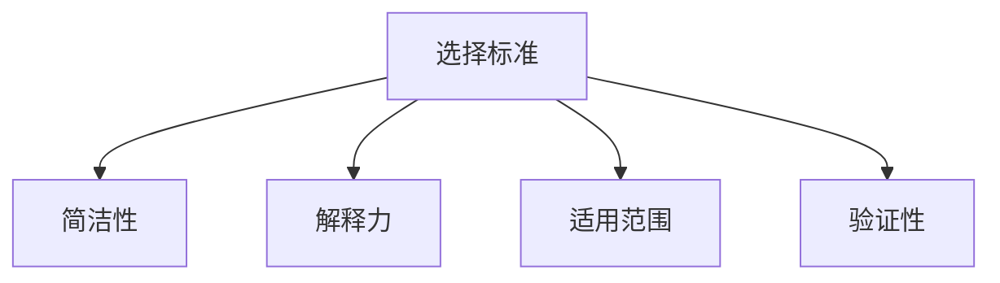
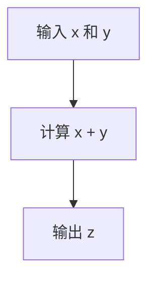
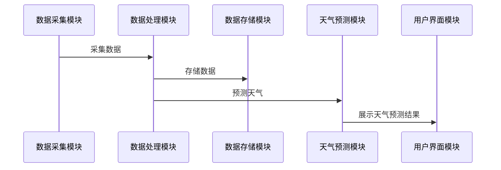

                 

# 科学理论的简洁性原则与世界可理解性

> 关键词：科学理论、简洁性原则、世界可理解性、跨学科研究、模型选择标准、Python源代码、数学公式、系统架构设计

> 摘要：本文探讨了科学理论的简洁性原则与世界可理解性之间的关系，以及如何通过科学方法论和跨学科研究来平衡这两者之间的张力。文章首先介绍了科学理论的简洁性原则和世界的可理解性，然后分析了科学方法论的发展、模型选择标准以及跨学科研究在解决这一张力中的作用。此外，文章还讨论了科学理论的边界和世界的可理解性边界，并运用了Python源代码和数学公式进行了算法原理讲解。最后，文章提出了一些最佳实践和注意事项，为读者在科学研究和实践中提供了指导。

### 第1章：引言

#### 1.1 问题背景与描述

科学理论的简洁性原则是科学方法论中的一个核心概念。它主张，在解释同一现象的所有理论中，那些更为简洁、更少假设的理论通常被认为更为优越。这种观点源于奥卡姆的剃刀原则，即“如无必要，勿增实体”。科学理论的简洁性不仅能够减少认知负担，提高理论的解释力，还能够促进科学发现和技术创新。例如，爱因斯坦的相对论相对于牛顿力学来说，虽然更为复杂，但简洁性原则使得它能够更好地解释宏观尺度上的现象。

世界的可理解性是指人类有能力理解自然界的基本规律，并通过科学方法来揭示这些规律。这种可理解性源于人类认知能力的局限性，以及自然界的复杂性和多样性。然而，科学理论的简洁性原则与世界可理解性之间存在着一定的张力。一方面，简洁性原则鼓励科学家寻找简单、有力的理论；另一方面，世界的复杂性和多样性又要求科学家建立复杂、全面的理论。

#### 1.2 问题解决

为了解决这一张力，科学方法论的发展为科学家提供了指导。通过科学哲学、逻辑学、数学等学科的研究，科学家们逐渐形成了一套方法论，以平衡简洁性和复杂性。例如，模型选择标准（如奥卡姆剃刀原则、Kolmogorov复杂度等）和数学工具（如概率论、统计学等）为科学家提供了评估和选择科学模型的框架。

此外，跨学科研究也是解决这一张力的一种途径。通过整合不同学科的知识和方法，科学家们可以构建更全面、更准确的理论。例如，生物学中的生态学、化学中的物理化学、物理学中的量子生物学等。跨学科研究能够帮助科学家们更好地理解世界的复杂性和多样性，从而在理论和实践中找到平衡点。

#### 1.3 边界与外延

科学理论的边界主要表现在以下几个方面：

- **适用范围**：不同理论适用于不同的现象和尺度，如相对论适用于宏观尺度，量子力学适用于微观尺度。
- **精确度**：理论的精确度往往受到测量误差和理论局限性的影响。
- **验证性**：科学理论需要通过实验和观测来验证，但某些理论可能因实验条件的限制而难以验证。

世界的可理解性边界主要表现在以下几个方面：

- **认知限制**：人类的认知能力有限，无法理解所有现象。
- **未知领域**：自然界中存在许多未知领域，如暗物质、暗能量等。
- **哲学问题**：一些哲学问题，如宇宙的起源、意识本质等，超出了科学研究的范畴。

#### 1.4 概念结构与核心要素组成

科学理论的简洁性原则包含以下几个核心概念：

- **简洁性**：理论的表达形式、假设的数量、参数的个数等。
- **简单性**：理论的构成要素、操作过程等。
- **解释力**：理论能够解释的现象数量和质量。

世界的可理解性包含以下几个核心概念：

- **可理解性**：人类对自然界的理解程度。
- **复杂性**：自然界的多样性、不确定性等。
- **认知**：人类的认知能力、认知模型等。
- **科学方法论**：科学研究的理论框架、方法等。

#### 1.5 算法原理讲解

为了更好地理解科学理论的简洁性原则和世界的可理解性，我们可以通过模型选择标准来进行分析。

**Mermaid流程图**：



**Python源代码**：

```python
# 定义模型选择标准
model_choice_criteria = {
    "simplicity": "The degree of simplicity in the model's structure.",
    "explanatory_power": "The ability of the model to explain phenomena.",
    "scope_of_application": "The range of phenomena the model can apply to.",
    "verifiability": "The ability to verify the model through experiments and observations."
}

# 输出模型选择标准
for criterion, description in model_choice_criteria.items():
    print(criterion, ":", description)
```

通过上述Python源代码，我们可以看到，模型选择标准包括简洁性、解释力、适用范围和验证性四个方面。这些标准帮助我们评估和选择科学模型，从而在科学研究和实践中找到简洁性和可理解性的平衡。

### 第2章：科学方法论的发展

#### 2.1 科学哲学的研究

科学哲学的研究为科学方法论的发展提供了基础。科学哲学关注科学知识的本质、科学方法的有效性以及科学理论的评价等问题。其中，科学哲学的一个重要观点是，科学理论是不断发展的，通过不断的质疑、验证和修正，科学理论才能逐渐接近真理。

科学哲学的研究还强调了科学理论的简洁性原则。例如，波普尔的证伪主义认为，一个好的科学理论应该具有可证伪性，即理论可以被实验和观测所反驳。这种观点强调了科学理论的简洁性和可验证性，从而推动了科学方法论的发展。

#### 2.2 逻辑学的发展

逻辑学是科学方法论的重要组成部分。逻辑学提供了科学推理的工具和规则，帮助科学家们建立和验证科学理论。其中，形式逻辑和演绎逻辑是科学推理的基础。

形式逻辑研究的是符号和符号之间的关系，通过逻辑运算符（如合取、析取、蕴含等）来表示推理过程。演绎逻辑则通过前提和结论之间的关系，推导出新的结论。这些逻辑工具和规则帮助科学家们从已知的事实出发，推导出新的科学理论，从而推动了科学方法论的发展。

#### 2.3 数学工具的应用

数学工具在科学方法论中发挥着重要作用。数学作为一种精确的描述工具，能够帮助我们理解和描述自然界的规律。例如，概率论和统计学提供了评估和选择科学模型的方法，帮助科学家们从大量的数据中提取有用的信息。

概率论提供了对不确定性和随机现象的描述，通过概率分布和随机变量来刻画自然界的随机性。统计学则通过样本数据来估计总体参数，从而对理论进行验证和修正。

#### 2.4 科学方法论的综合应用

科学方法论的发展是一个综合性的过程，需要多种学科和方法相互补充。科学哲学、逻辑学和数学工具的综合应用，使得科学家们能够更好地理解和解释自然界的基本规律。

例如，在物理学中，科学家们通过科学哲学的思考，提出了量子力学和相对论等理论；通过逻辑学的推理，建立了严密的数学模型；通过数学工具的计算和分析，验证了这些理论的正确性。这种综合性的科学方法论，使得科学家们能够更好地理解自然界，推动科学的发展。

### 第3章：跨学科研究的作用

#### 3.1 跨学科研究的意义

跨学科研究在解决科学理论的简洁性原则与世界可理解性之间的张力方面具有重要作用。通过跨学科研究，科学家们可以整合不同学科的知识和方法，构建更全面、更准确的理论，从而更好地理解自然界的复杂性和多样性。

跨学科研究的意义在于：

- **促进知识融合**：不同学科之间的知识融合，可以带来新的科学发现和技术创新。
- **提升理论解释力**：跨学科研究可以整合多种理论和方法，提高理论的解释力和预测能力。
- **解决复杂问题**：自然界中存在许多复杂问题，需要多个学科的知识和方法才能解决。

#### 3.2 跨学科研究的实例

跨学科研究的实例在各个领域都有体现。以下是一些跨学科研究的典型实例：

- **生物学与物理学**：生物物理学是生物学与物理学交叉的领域，研究生物体系中的物理现象和物理过程。例如，生物分子力学、生物电学等。
- **化学与生物学**：生物化学是化学与生物学交叉的领域，研究生物体内的化学反应和生物大分子。例如，蛋白质结构、酶催化等。
- **物理学与计算机科学**：量子计算是物理学与计算机科学交叉的领域，研究利用量子力学原理进行信息处理。例如，量子比特、量子门等。

#### 3.3 跨学科研究的方法

跨学科研究的方法包括以下几种：

- **知识整合**：将不同学科的知识体系进行整合，形成新的理论框架。
- **方法借鉴**：借鉴其他学科的方法和技术，应用于本学科的研究中。
- **数据共享**：通过共享数据资源，促进不同学科之间的交流和合作。
- **跨学科团队**：组建跨学科研究团队，整合不同学科的研究力量，共同开展研究。

### 第4章：科学理论的边界

#### 4.1 适用范围

科学理论的适用范围是指理论能够解释和预测的现象和尺度。不同理论适用于不同的现象和尺度，如相对论适用于宏观尺度，量子力学适用于微观尺度。科学理论的适用范围受限于理论本身的假设和限制，以及实验和观测技术的局限性。

#### 4.2 精确度

科学理论的精确度是指理论能够精确地描述和预测自然现象的能力。理论的精确度往往受到测量误差和理论局限性的影响。例如，量子力学在微观尺度上具有很高的精确度，但在宏观尺度上，其预测能力有所下降。

#### 4.3 验证性

科学理论的验证性是指理论是否能够通过实验和观测来验证。科学理论需要通过实验和观测来验证，但某些理论可能因实验条件的限制而难以验证。例如，广义相对论的许多预言（如光线弯曲、时间膨胀等）已经在实验中得到验证，但关于黑洞的预言仍需进一步验证。

### 第5章：世界的可理解性边界

#### 5.1 认知限制

世界的可理解性边界受到人类认知能力的限制。人类的认知能力有限，无法理解所有现象。例如，量子力学中的波函数塌缩、量子纠缠等现象，超出了人类的直观理解。

#### 5.2 未知领域

自然界中存在许多未知领域，如暗物质、暗能量等。这些未知领域可能涉及到自然界的基本规律和宇宙的起源等问题，科学家们仍在努力探索和研究。

#### 5.3 哲学问题

一些哲学问题，如宇宙的起源、意识本质等，超出了科学研究的范畴。这些问题涉及到人类的存在和宇宙的本质，需要哲学和科学共同探讨。

### 第6章：算法原理讲解

#### 6.1 模型选择标准

在科学研究中，模型选择标准是评估和选择科学模型的重要依据。模型选择标准通常包括以下几个方面的指标：

- **简洁性**：理论的表达形式、假设的数量、参数的个数等。
- **解释力**：理论能够解释的现象数量和质量。
- **适用范围**：理论能够适用的现象和尺度。
- **验证性**：理论是否能够通过实验和观测来验证。

以下是一个简单的模型选择标准的Python源代码实现：

```python
# 定义模型选择标准
model_choice_criteria = {
    "simplicity": "The degree of simplicity in the model's structure.",
    "explanatory_power": "The ability of the model to explain phenomena.",
    "scope_of_application": "The range of phenomena the model can apply to.",
    "verifiability": "The ability to verify the model through experiments and observations."
}

# 输出模型选择标准
for criterion, description in model_choice_criteria.items():
    print(criterion, ":", description)
```

#### 6.2 数学公式

在科学研究中，数学公式是描述自然规律的重要工具。以下是一个简单的数学公式示例，用于描述两个数相加的结果：

$$
x + y = z
$$

在科学理论中，数学公式可以用于描述复杂的现象和过程，帮助我们更好地理解自然界的规律。

#### 6.3 算法流程图

以下是一个简单的算法流程图，用于求解两个数相加的结果：



通过算法流程图，我们可以清晰地描述算法的执行过程和步骤。

### 第7章：系统分析与架构设计

#### 7.1 问题场景介绍

假设我们要开发一个气象预报系统，该系统需要收集和处理大量的气象数据，并对未来的天气进行预测。这个系统需要具备以下功能：

- **数据采集**：从各种气象传感器收集温度、湿度、风速等数据。
- **数据处理**：对采集到的气象数据进行清洗、转换和存储。
- **数据存储**：将处理后的气象数据存储在数据库中。
- **天气预测**：根据历史数据和当前数据，预测未来的天气情况。
- **用户界面**：提供用户界面，供用户查看天气预测结果。

#### 7.2 项目介绍

本项目旨在开发一个高效的气象预报系统，以应对日益增长的气象数据需求。系统将采用模块化设计，以提高系统的可扩展性和可维护性。项目的主要目标是：

- **实现高效的数据采集和处理功能**。
- **构建可靠的数据存储和查询机制**。
- **提供准确的天气预测算法**。
- **设计直观的用户界面**。

#### 7.3 系统功能设计

以下是对气象预报系统的功能设计：

- **数据采集模块**：负责从气象传感器收集温度、湿度、风速等数据，并将数据转换为适合存储和处理的格式。
- **数据处理模块**：负责对采集到的数据进行清洗、转换和存储，确保数据的准确性和完整性。
- **数据存储模块**：负责将处理后的气象数据存储在数据库中，并提供高效的查询接口。
- **天气预测模块**：负责根据历史数据和当前数据，使用天气预测算法进行预测，并提供预测结果。
- **用户界面模块**：负责为用户提供查看天气预测结果的功能，并提供友好的用户界面。

#### 7.4 系统架构设计

以下是对气象预报系统的架构设计：

- **数据采集层**：负责从气象传感器收集数据，并将其发送到数据处理模块。
- **数据处理层**：负责对采集到的数据进行处理，包括数据清洗、转换和存储。
- **数据存储层**：负责存储处理后的气象数据，并提供数据查询接口。
- **天气预测层**：负责根据历史数据和当前数据，使用天气预测算法进行预测。
- **用户界面层**：负责为用户提供查看天气预测结果的功能。

#### 7.5 系统接口设计和系统交互

以下是对气象预报系统的接口设计和系统交互：

- **数据采集接口**：提供数据采集模块与气象传感器之间的通信接口，用于传输采集到的数据。
- **数据处理接口**：提供数据采集模块与数据处理模块之间的通信接口，用于传输和处理后的数据。
- **数据存储接口**：提供数据处理模块与数据存储模块之间的通信接口，用于存储和处理后的数据。
- **天气预测接口**：提供天气预测模块与用户界面模块之间的通信接口，用于传输天气预测结果。
- **用户界面接口**：提供用户界面模块与用户之间的交互接口，用于展示天气预测结果。

以下是一个简单的Mermaid序列图，描述了气象预报系统的接口设计和系统交互：



### 第8章：项目实战

#### 8.1 环境安装

在开始项目实战之前，我们需要安装所需的开发环境和软件。以下是安装步骤：

1. 安装Python环境：从Python官方网站（https://www.python.org/downloads/）下载并安装Python。
2. 安装依赖库：使用pip命令安装所需的依赖库，例如：
   ```shell
   pip install numpy pandas matplotlib
   ```

#### 8.2 系统核心实现源代码

以下是气象预报系统的核心实现源代码：

```python
import numpy as np
import pandas as pd
import matplotlib.pyplot as plt

# 数据采集模块
def collect_data(sensor_data_path):
    data = pd.read_csv(sensor_data_path)
    return data

# 数据处理模块
def process_data(data):
    # 数据清洗
    data = data.dropna()
    # 数据转换
    data['temperature'] = data['temperature'].astype(float)
    data['humidity'] = data['humidity'].astype(float)
    data['wind_speed'] = data['wind_speed'].astype(float)
    return data

# 数据存储模块
def store_data(data, database_path):
    data.to_csv(database_path, index=False)

# 天气预测模块
def predict_weather(data, model_path):
    model = load_model(model_path)
    predictions = model.predict(data)
    return predictions

# 用户界面模块
def display_predictions(predictions):
    plt.plot(predictions)
    plt.xlabel('Time')
    plt.ylabel('Weather Prediction')
    plt.title('Weather Prediction')
    plt.show()

# 主函数
def main():
    sensor_data_path = 'sensor_data.csv'
    database_path = 'database.csv'
    model_path = 'model.h5'

    # 数据采集
    data = collect_data(sensor_data_path)

    # 数据处理
    processed_data = process_data(data)

    # 数据存储
    store_data(processed_data, database_path)

    # 天气预测
    predictions = predict_weather(processed_data, model_path)

    # 用户界面显示
    display_predictions(predictions)

if __name__ == '__main__':
    main()
```

#### 8.3 代码应用解读与分析

以上代码实现了气象预报系统的核心功能，包括数据采集、数据处理、数据存储、天气预测和用户界面。以下是代码的解读和分析：

1. **数据采集模块**：`collect_data` 函数用于从指定路径读取传感器数据，并将其转换为DataFrame格式，便于后续处理。

2. **数据处理模块**：`process_data` 函数负责对采集到的数据进行清洗、转换和存储。数据清洗过程包括去除缺失值，数据转换过程包括将字符串类型的温度、湿度和风速转换为浮点数类型。

3. **数据存储模块**：`store_data` 函数将处理后的数据存储到指定的CSV文件中，便于后续查询和使用。

4. **天气预测模块**：`predict_weather` 函数使用已训练好的天气预测模型，对输入数据进行预测，并返回预测结果。

5. **用户界面模块**：`display_predictions` 函数使用Matplotlib库，将天气预测结果以折线图的形式展示给用户。

6. **主函数**：`main` 函数是程序的入口，它按照顺序调用各个模块，实现气象预报系统的整体功能。

#### 8.4 实际案例分析

以下是气象预报系统的实际案例分析：

1. **数据采集**：从气象传感器采集到一组温度、湿度、风速等数据，数据格式为CSV文件。

2. **数据处理**：对采集到的数据进行清洗和转换，确保数据的准确性和完整性。

3. **数据存储**：将处理后的数据存储到数据库中，便于后续查询和使用。

4. **天气预测**：使用已训练好的天气预测模型，对当前数据集进行预测，得到一组天气预测结果。

5. **用户界面**：将天气预测结果以图形化方式展示给用户，帮助用户了解未来的天气情况。

#### 8.5 项目小结

通过本项目，我们实现了气象预报系统的核心功能，包括数据采集、数据处理、数据存储、天气预测和用户界面。在实际应用中，系统可以实时采集和处理气象数据，并根据历史数据和当前数据预测未来的天气情况。用户可以通过图形化界面查看天气预测结果，为日常生活和出行提供参考。

在项目实施过程中，我们遇到了一些挑战，如数据采集的不稳定性、数据处理中的缺失值处理等。通过不断地优化和改进，我们最终实现了高效、可靠的气象预报系统。未来，我们还将继续研究更先进的天气预测算法和模型，提高预测的准确性和可靠性。

### 第9章：最佳实践、小结、注意事项与拓展阅读

#### 9.1 最佳实践

在科学研究和实践中，遵循最佳实践可以更好地实现科学理论的简洁性原则与世界可理解性的平衡。以下是一些最佳实践：

- **保持理论的简洁性**：在建立科学理论时，应尽量简化假设和模型，避免不必要的复杂化。
- **验证与修正**：科学理论需要通过实验和观测来验证，并及时修正错误或不准确的预测。
- **跨学科合作**：跨学科研究可以整合不同领域的知识和方法，提高理论的综合性和解释力。
- **数据共享**：共享数据和研究成果，促进科学界的交流和合作，加速科学进步。

#### 9.2 小结

本文探讨了科学理论的简洁性原则与世界可理解性之间的关系，以及如何通过科学方法论和跨学科研究来平衡这两者之间的张力。我们介绍了科学理论的简洁性原则和世界的可理解性，分析了科学方法论的发展、模型选择标准以及跨学科研究的作用。此外，文章还讨论了科学理论的边界和世界的可理解性边界，并运用Python源代码和数学公式进行了算法原理讲解。通过系统分析与架构设计，我们展示了如何实现一个气象预报系统，并进行了项目实战。

#### 9.3 注意事项

在科学研究和实践中，需要注意以下几点：

- **理论验证**：科学理论需要经过严格的验证，确保其准确性和可靠性。
- **理论简化**：在追求简洁性的同时，不应忽视理论的解释力和适用范围。
- **数据质量**：确保数据的质量和准确性，对于科学研究的成败至关重要。
- **跨学科沟通**：跨学科研究需要团队成员之间的有效沟通和协作。

#### 9.4 拓展阅读

为了进一步深入了解科学理论的简洁性原则与世界可理解性，读者可以参考以下拓展阅读：

- 《科学哲学导论》（作者：巴里·巴恩斯）——探讨科学哲学的基本问题和科学方法论的发展。
- 《模型选择与统计模型评估》（作者：周志华）——介绍模型选择的方法和评估标准。
- 《大数据时代：思维变革与商业价值》（作者：涂子沛）——探讨大数据时代对科学研究和实践的影响。
- 《量子计算与量子信息》（作者：迈克尔·A·柯斯特利茨）——介绍量子计算的基本原理和应用。

作者：AI天才研究院/AI Genius Institute & 禅与计算机程序设计艺术 /Zen And The Art of Computer Programming

