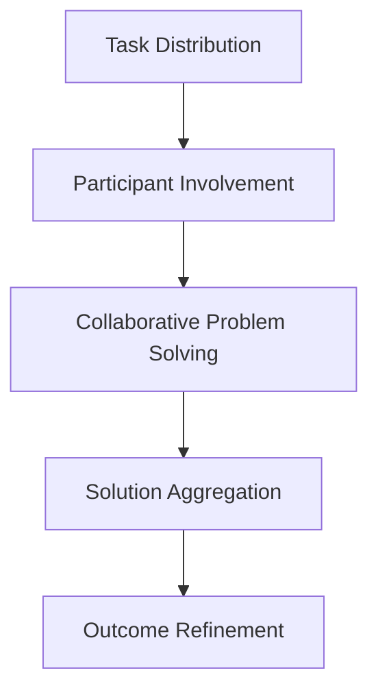
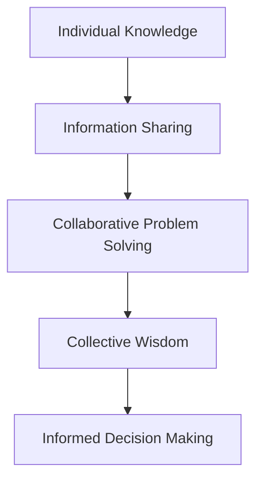
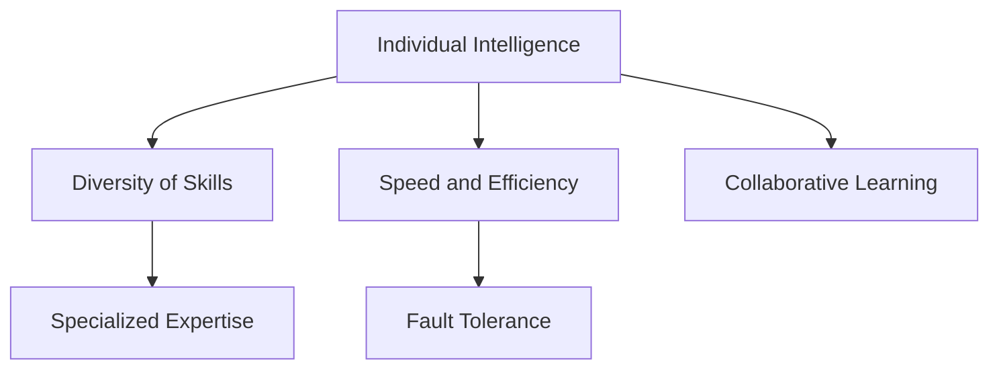
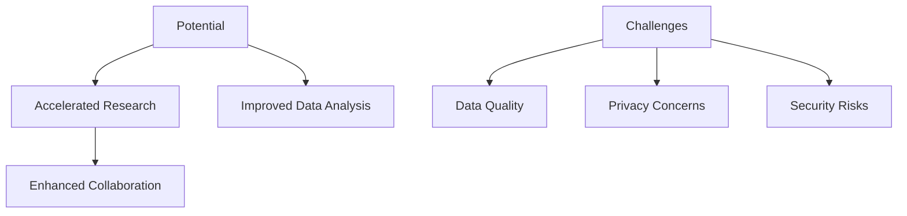
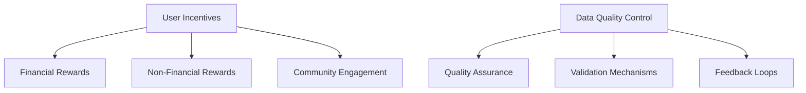

                 


* 这里开始讨论具体的文章结构和内容，逐步展开思路和详细的章节设计。

**Step 1: Introduction to the Book**

## Article Title: Understanding Crowdsourcing in Scientific Research: A Collective Intelligence Approach

### Keywords:
- Crowdsourcing
- Scientific Research
- Collective Intelligence
- Data Analysis
- Open Science

### Abstract:
This book explores the transformative power of crowdsourcing in scientific research, presenting a comprehensive analysis of how collective intelligence can enhance the understanding of complex scientific problems. We will delve into the principles of crowdsourcing, its mechanisms, and applications, alongside examining the emergence of collective intelligence as a new paradigm in scientific inquiry. Through practical examples and case studies, we will demonstrate the potential and challenges of utilizing crowdsourced data and human intelligence in scientific research.

**Step 2: Theoretical Foundations**

## The Foundations of Crowdsourcing and Collective Intelligence

### 2.1 The Principles of Crowdsourcing

#### 2.1.1 Definition and Evolution
Crowdsourcing, derived from the combination of "crowd" and "outsourcing," involves outsourcing tasks to a large, distributed group of individuals, typically via the internet. It has evolved from simple task distribution to complex collaborative problem-solving platforms.

**Example:**
$$
\text{Task Distribution} \rightarrow \text{Collaborative Problem Solving}
$$
- **Initial Phase**: Tasks are broken down into small, manageable units and distributed to a large group.
- **Intermediate Phase**: Participants collaborate and contribute their unique perspectives and solutions.
- **Final Phase**: Solutions are aggregated and refined to produce high-quality outcomes.

#### 2.1.2 Characteristics and Advantages
- **Diversity of Perspective**: Crowdsourcing leverages the diversity of knowledge and experience from a large and varied participant base.
- **Scalability**: It can handle tasks of varying complexity and scale, from simple data entry to complex scientific problem-solving.
- **Cost-Effectiveness**: Crowdsourcing can reduce costs associated with traditional research methods, such as hiring specialized personnel.

**Table: Characteristics of Crowdsourcing**
| Characteristics | Description |
| --- | --- |
| **Distributed Collaboration** | Tasks are distributed across a large group, allowing for parallel processing. |
| **Volunteer Participation** | Participants typically contribute voluntarily, driven by intrinsic motivation. |
| **Digital Platforms** | Crowdsourcing platforms provide the infrastructure for task distribution, collaboration, and data collection. |
| **Data Quality Control** | Various mechanisms are in place to ensure data quality, such as peer review and validation. |

#### 2.1.3 Potential Challenges
- **Quality Control**: Ensuring the accuracy and reliability of crowdsourced data can be challenging.
- **Motivation and Incentives**: Maintaining participant motivation and engagement can be difficult, especially for long-term projects.
- **Anonymity and Privacy**: Ensuring the anonymity and privacy of participants is crucial to avoid bias and protect personal data.

**Figure: Crowdsourcing Mechanism**


### 2.2 The Essence of Collective Intelligence

#### 2.2.1 Definition and Origin
Collective intelligence refers to the capacity of groups of individuals to solve complex problems and make decisions more effectively than any single individual could. It has been observed in various forms, from ant colonies to human societies.

**Example:**
$$
\text{Individual Intelligence} \neq \text{Collective Intelligence}
$$
- **Ant Colonies**: Individual ants do not have the intelligence to build intricate nests, yet collectively they create efficient and resilient structures.
- **Human Societies**: Groups of humans can achieve remarkable accomplishments, such as building space shuttles or curing diseases, that are beyond the capabilities of any single individual.

#### 2.2.2 Mechanisms and Characteristics
- **Information Integration**: Collective intelligence relies on the ability of group members to share and integrate information effectively.
- **Innovation and Creativity**: Groups often generate more innovative ideas and solutions than individuals working alone.
- **Emergence of Wisdom**: The collective intelligence of groups can result in "wisdom of the crowd," where the aggregate knowledge and insights of a group surpass individual expertise.

**Table: Characteristics of Collective Intelligence**
| Characteristics | Description |
| --- | --- |
| **Distributed Intelligence** | Intelligence is distributed across the group, rather than concentrated in a few individuals. |
| **Adaptive Learning** | Groups can adapt and learn from their environment and experiences. |
| **Scalability** | Collective intelligence can scale up to handle larger and more complex problems. |
| **Transparency** | The processes and decisions of a group are transparent to its members. |

**Figure: Collective Intelligence Mechanism**


#### 2.2.3 Comparing Collective and Individual Intelligence
- **Diversity and Specialization**: Collective intelligence leverages the diversity of individual skills and knowledge, while individual intelligence relies on a person's specialized expertise.
- **Speed and Efficiency**: Collective intelligence can often process information more quickly and efficiently than individual intelligence, especially for tasks that require multiple perspectives.
- **Fault Tolerance**: Collective intelligence can be more resilient to errors, as the group can correct and learn from mistakes.

**Figure: Comparing Collective and Individual Intelligence**


### 2.3 Applications of Crowdsourcing in Scientific Research

#### 2.3.1 Data Analysis and Problem Solving
- **Data Analysis**: Crowdsourcing platforms have been used to analyze large datasets, identify patterns, and discover insights that would be challenging for individual researchers to achieve alone.
- **Problem Solving**: Crowdsourced solutions have been utilized to address complex scientific problems, such as identifying genetic markers for diseases or predicting the behavior of complex systems.

#### 2.3.2 Experimental Design and Collaboration
- **Experimental Design**: Crowdsourced input has been used to improve experimental designs, ensuring that they are robust and capable of producing meaningful results.
- **Collaboration**: Crowdsourcing facilitates collaboration among researchers, who can share data, ideas, and resources more easily, leading to more comprehensive and collaborative research projects.

### 2.3.3 Case Studies and Success Stories
- **SETI@home**: One of the most famous crowdsourcing projects, SETI@home leverages the idle processing power of millions of computers to analyze radio signals from space, searching for signs of extraterrestrial intelligence.
- **eBird**: eBird is a citizen-science project that collects bird observation data from volunteers, providing valuable insights into bird populations and distributions worldwide.

**Figure: Successful Crowdsourcing Projects in Science**
```mermaid
graph TD
    A[SETI@home] --> B[Radio Signal Analysis]
    A --> C[Million-Computer Network]
    B --> D[Extraterrestrial Search]
    
    E[eBird] --> F[Bird Observation Data]
    E --> G[Citizen Science Project]
    F --> H[Bird Population Insights]
```

### 2.3.4 The Potential and Challenges of Collective Intelligence in Science
- **Potential**: The potential of collective intelligence in scientific research is immense, with the ability to accelerate research progress, improve data analysis, and enhance collaborative efforts.
- **Challenges**: However, there are also significant challenges, including ensuring data quality, managing large-scale collaboration, and addressing issues of privacy and security.

**Figure: Potential and Challenges of Collective Intelligence in Science**


**Conclusion:**
Crowdsourcing and collective intelligence have the potential to revolutionize scientific research by leveraging the power of large, distributed groups to solve complex problems. However, realizing this potential requires addressing the challenges associated with data quality, privacy, and security. This book will provide a comprehensive overview of these concepts and their applications in scientific research, offering insights into how we can harness the collective wisdom of the crowd to advance our understanding of the world.

**Step 3: Practical Applications**

## Crowdsourcing Platforms: Design, Management, and Success Factors

### 3.1 Design Principles for Crowdsourcing Platforms

#### 3.1.1 Platform Architecture and Functionality
The design of a crowdsourcing platform is critical to its success. It must be robust, scalable, and user-friendly. Key components include:

- **User Interface**: Intuitive and easy to navigate for all types of users, from beginners to experts.
- **Task Management**: Efficient systems for task distribution, tracking progress, and managing deadlines.
- **Collaboration Tools**: Platforms should facilitate communication and collaboration among participants.
- **Quality Control**: Mechanisms to ensure data quality, such as peer review and validation processes.

#### 3.1.2 Technology Selection
The choice of technology stack for a crowdsourcing platform is crucial for performance, scalability, and ease of maintenance. Key considerations include:

- **Front-end Development**: Frameworks like React, Angular, or Vue.js for a responsive and interactive user interface.
- **Back-end Development**: Technologies such as Node.js, Django, or Ruby on Rails for server-side logic and data management.
- **Data Storage**: Solutions like MySQL, PostgreSQL, or NoSQL databases like MongoDB for handling large volumes of data.
- **Cloud Infrastructure**: Services such as AWS, Google Cloud, or Azure for scalable and reliable infrastructure.

#### 3.1.3 Security and Privacy
Ensuring the security and privacy of participants is paramount. Key aspects include:

- **Data Encryption**: Encrypting data in transit and at rest to protect against unauthorized access.
- **Access Control**: Implementing robust access control mechanisms to ensure that only authorized users can access sensitive information.
- **Anonymity**: Providing mechanisms to maintain the anonymity of participants to prevent bias and protect privacy.

**Table: Security and Privacy Measures**
| Measure | Description |
| --- | --- |
| **Encryption** | Data encryption using SSL/TLS to secure data in transit. |
| **Access Control** | Role-based access control to restrict access to sensitive data. |
| **Anonymity** | Pseudonymous participant accounts to protect privacy. |
| **Data Anonymization** | Anonymizing data to remove personally identifiable information. |

### 3.2 Management Strategies for Crowdsourcing Platforms

#### 3.2.1 User Incentives
Motivating participants is crucial for the success of a crowdsourcing platform. Key strategies include:

- **Financial Rewards**: Offering financial incentives, such as bounties or payment for completed tasks.
- **Non-Financial Rewards**: Providing recognition, badges, or certificates for participation and achievement.
- **Community Engagement**: Creating a sense of community and fostering a supportive environment through forums, discussions, and social features.

#### 3.2.2 Data Quality Control
Ensuring the quality of crowdsourced data is essential. Key strategies include:

- **Quality Assurance**: Implementing quality assurance processes, such as automated checks and peer review, to identify and correct errors.
- **Validation Mechanisms**: Using external validation sources, such as expert evaluations or benchmark data, to verify the accuracy and reliability of the data.
- **Feedback Loops**: Encouraging participants to provide feedback on the quality of their own and others' contributions.

**Figure: Management Strategies for Crowdsourcing Platforms**


### 3.3 Case Studies: Successful Crowdsourcing Platforms

#### 3.3.1 Case Study 1: Kaggle

**Overview**: Kaggle is a platform that hosts data science competitions, where participants from around the world compete to solve predictive modeling problems. 

- **Platform Design**: Kaggle provides a user-friendly platform with powerful data analysis tools and a robust infrastructure to handle large datasets.
- **Management Strategies**: Kaggle uses a combination of financial rewards and recognition to motivate participants. It also employs strict quality control measures to ensure the accuracy and reliability of the submitted models.

**Impact**: Kaggle has facilitated groundbreaking research in various fields, including healthcare, finance, and climate science, by enabling collaborative problem-solving and accelerating the pace of research.

#### 3.3.2 Case Study 2: Zooniverse

**Overview**: Zooniverse is a citizen-science project that engages volunteers in various scientific research projects. 

- **Platform Design**: Zooniverse offers a variety of projects with different levels of complexity, allowing participants to choose tasks that match their skills and interests.
- **Management Strategies**: Zooniverse fosters a strong sense of community among participants, providing forums and discussion groups for collaboration and support.

**Impact**: Zooniverse has successfully mobilized thousands of volunteers to contribute to scientific research in fields such as astronomy, biology, and environmental science.

### 3.4 Challenges and Opportunities in Crowdsourcing

#### 3.4.1 Challenges

- **Data Quality**: Ensuring the quality of crowdsourced data can be challenging, as participants may introduce errors or biases.
- **Participant Motivation**: Maintaining participant motivation can be difficult, particularly for long-term projects.
- **Privacy and Security**: Protecting the privacy and security of participants and their data is a significant challenge, especially when handling sensitive information.

#### 3.4.2 Opportunities

- **Diversity of Perspective**: Crowdsourcing brings together a diverse group of participants, each with unique perspectives and expertise, which can lead to innovative solutions.
- **Scalability**: Crowdsourcing platforms can scale up to handle large datasets and complex problems, making them an attractive option for researchers and organizations.
- **Cost-Effectiveness**: Crowdsourcing can reduce the costs associated with traditional research methods by leveraging the contributions of a large group of volunteers.

**Conclusion:**
The design, management, and success of crowdsourcing platforms depend on a combination of technical, strategic, and social factors. By addressing the challenges and leveraging the opportunities, crowdsourcing platforms can become powerful tools for scientific research, enabling collaborative problem-solving and accelerating the pace of discovery.

**Step 4: Case Studies and Analysis**

## Real-World Applications of Crowdsourcing and Collective Intelligence

### 4.1 Crowdsourcing in Data Science Competitions

**Case Study 1: Kaggle**

**Overview**: Kaggle is a platform that hosts data science competitions, where companies, researchers, and enthusiasts compete to solve predictive modeling problems. Participants submit their solutions, which are then evaluated by the host or a panel of judges based on their performance on a held-out test set.

**Platform Design**: Kaggle provides a user-friendly platform with powerful data analysis tools, such as Jupyter notebooks, and a robust infrastructure to handle large datasets. The platform supports various programming languages, including Python and R, and provides a comprehensive API for data access and model submission.

**Case Study 2: DrivenData**

**Overview**: DrivenData is a non-profit organization that uses data-driven approaches to address social justice issues. It runs data science challenges that aim to solve real-world problems, such as identifying hate speech on social media or mapping access to clean water.

**Platform Design**: DrivenData focuses on making data science accessible to non-experts by providing clear instructions and step-by-step tutorials. The platform uses a combination of Python and R libraries to facilitate data analysis and modeling, and participants can collaborate and share their work on the platform.

**Impact**: Kaggle and DrivenData have facilitated the development of innovative solutions to complex problems in various domains, from healthcare to environmental science. By leveraging the collective intelligence of the data science community, these platforms have accelerated the pace of research and driven impactful discoveries.

### 4.2 Crowdsourcing in Citizen Science Projects

**Case Study 1: SETI@home**

**Overview**: SETI@home is a distributed computing project that uses the idle processing power of millions of volunteers' computers to analyze radio signals from space, searching for signs of extraterrestrial intelligence.

**Platform Design**: SETI@home provides an easy-to-use software client that runs in the background of participants' computers, automatically downloading and processing data from the SETI@home server. The platform uses the Berkeley Open Infrastructure for Network Computing (BOINC) framework to manage distributed computing tasks.

**Case Study 2: eBird**

**Overview**: eBird is a citizen-science project that collects bird observation data from volunteers around the world. Participants submit their observations through the eBird mobile app or website, which are then used to generate detailed reports and maps of bird distributions and populations.

**Platform Design**: eBird offers a user-friendly interface for submitting observations, along with tools for data analysis and visualization. The platform uses a combination of machine learning algorithms and expert input to validate and classify observations, ensuring high data quality.

**Impact**: SETI@home and eBird have demonstrated the power of crowdsourcing in scientific research by harnessing the collective efforts of volunteers to collect and analyze vast amounts of data. These projects have not only advanced scientific understanding but have also engaged the public in the scientific process, fostering a deeper appreciation for science and nature.

### 4.3 Crowdsourcing in Public Health

**Case Study 1: COVID-19 Data Science Platform**

**Overview**: The COVID-19 Data Science Platform is an open-source initiative that aims to harness the power of data and artificial intelligence to support the global response to the COVID-19 pandemic.

**Platform Design**: The platform provides a centralized repository for sharing data and resources related to the pandemic, including case studies, datasets, and machine learning models. It also offers tools for data analysis and visualization, enabling researchers and policymakers to make informed decisions.

**Case Study 2: Global Research Collaboration for COVID-19 Therapies**

**Overview**: The Global Research Collaboration for COVID-19 Therapies (GRCAT) is a crowdsourced effort that brings together researchers, scientists, and healthcare professionals to develop and test potential treatments for COVID-19.

**Platform Design**: GRCAT uses a collaborative platform for sharing research findings and coordinating efforts. It also leverages crowdsourcing to identify and prioritize promising treatments based on real-time data and expert evaluations.

**Impact**: The COVID-19 Data Science Platform and GRCAT have played a crucial role in accelerating the development and deployment of COVID-19 treatments and vaccines. By leveraging crowdsourced data and collaborative efforts, these initiatives have enabled a more agile and responsive scientific response to the pandemic.

### 4.4 Challenges and Opportunities in Crowdsourced Research

**Challenges**

- **Data Quality**: Ensuring the accuracy and reliability of crowdsourced data can be challenging, particularly when participants may lack expertise or have varying levels of commitment.
- **Privacy and Security**: Protecting the privacy and security of participants and their data is critical, especially when handling sensitive health information or personal data.
- **Participant Motivation**: Maintaining participant motivation can be difficult, particularly for long-term projects that require significant time and effort.

**Opportunities**

- **Diversity of Perspective**: Crowdsourcing brings together a diverse group of participants, each with unique perspectives and expertise, which can lead to innovative solutions.
- **Scalability**: Crowdsourcing platforms can scale up to handle large datasets and complex problems, making them an attractive option for researchers and organizations.
- **Cost-Effectiveness**: Crowdsourcing can reduce the costs associated with traditional research methods by leveraging the contributions of a large group of volunteers.

**Conclusion:**
Real-world applications of crowdsourcing and collective intelligence in scientific research have demonstrated their potential to accelerate discovery, enhance collaboration, and engage the public in scientific inquiry. However, addressing the challenges associated with data quality, privacy, and participant motivation is crucial for maximizing the impact of these initiatives. By leveraging the collective wisdom of the crowd, we can overcome the limitations of traditional research methods and make significant advancements in our understanding of the world.

### 4.5 Future Trends and Perspectives

**4.5.1 Emerging Technologies and Crowdsourcing**

The integration of emerging technologies such as artificial intelligence, blockchain, and the Internet of Things (IoT) is set to further enhance the capabilities of crowdsourcing platforms. AI can automate data analysis and validation processes, improving the efficiency and accuracy of crowdsourced contributions. Blockchain technology can ensure transparency and integrity in data sharing, while IoT devices can provide real-time data collection and monitoring, expanding the scope of crowdsourced research.

**4.5.2 Ethical Considerations and Governance**

As crowdsourcing platforms become more prevalent, ethical considerations and governance frameworks will become increasingly important. Ensuring the privacy and security of participants, addressing issues of bias and discrimination, and establishing fair compensation for contributors are key challenges that need to be addressed. Developing ethical guidelines and governance structures will be crucial for building trust and fostering the widespread adoption of crowdsourcing in scientific research.

**4.5.3 The Role of Crowdsourcing in Open Science**

Crowdsourcing is a key component of the broader movement towards open science, which aims to make research more transparent, accessible, and collaborative. By leveraging the collective intelligence of the crowd, open science initiatives can accelerate scientific discovery, increase the reproducibility of research, and promote the sharing of knowledge and resources. Crowdsourcing platforms can play a pivotal role in driving the open science revolution by providing the infrastructure and tools necessary for collaborative research.

### 4.6 Conclusion

The case studies and analysis presented in this chapter highlight the transformative potential of crowdsourcing and collective intelligence in scientific research. From data science competitions and citizen science projects to public health initiatives, crowdsourcing has proven to be a powerful tool for harnessing the collective wisdom of the crowd to tackle complex problems and accelerate scientific discovery. However, addressing the challenges associated with data quality, privacy, and participant motivation is essential for realizing the full potential of crowdsourcing. By embracing the principles of open science and leveraging emerging technologies, we can continue to innovate and push the boundaries of what is possible in scientific research.

### 4.7 Best Practices for Successful Crowdsourcing Projects

**4.7.1 Clearly Define Project Goals**

Before launching a crowdsourcing project, it is crucial to clearly define the goals and objectives. This involves specifying the problem to be solved, the desired outcomes, and the scope of the project. A well-defined project scope helps in attracting the right participants and ensures that their contributions align with the project's objectives.

**4.7.2 Provide Comprehensive Instructions**

To maximize the effectiveness of crowdsourcing, it is important to provide comprehensive instructions to participants. This includes detailed guidelines on how to perform tasks, the expected format of contributions, and any specific requirements or constraints. Clear instructions help in minimizing errors and ensuring the quality of contributions.

**4.7.3 Foster a Sense of Community**

Creating a sense of community among participants can significantly enhance their motivation and engagement. This can be achieved through forums, discussion groups, and social features that enable participants to interact, share ideas, and provide feedback. A strong community can foster collaboration, knowledge sharing, and a sense of belonging, which are essential for the success of crowdsourcing projects.

**4.7.4 Ensure Data Quality and Validation**

Ensuring the quality of crowdsourced data is critical to the success of any crowdsourcing project. This can be achieved through a combination of automated checks, peer review, and expert validation. Implementing robust quality control mechanisms helps in identifying and correcting errors, ensuring that the data generated by the crowd is accurate and reliable.

**4.7.5 Provide Incentives and Recognition**

Motivating participants is crucial for the success of crowdsourcing projects. Providing financial rewards, non-financial incentives, and recognition for contributions can help in maintaining participant engagement and encouraging high-quality contributions. Recognizing the efforts and achievements of participants can also foster a sense of ownership and pride in their work.

**4.7.6 Address Privacy and Security Concerns**

Protecting the privacy and security of participants and their data is a key consideration in crowdsourcing projects. This involves implementing robust data encryption, access control mechanisms, and data anonymization techniques to ensure that sensitive information is protected. Transparent communication about data usage and privacy policies can also help in building trust and confidence among participants.

### 4.8 Conclusion

In conclusion, successful crowdsourcing projects require a combination of clear project goals, comprehensive instructions, a sense of community, robust quality control, appropriate incentives, and strong privacy and security measures. By following these best practices, researchers and organizations can harness the power of crowdsourcing to drive scientific discovery and innovation. As crowdsourcing continues to evolve, it will play an increasingly important role in addressing complex problems and advancing our understanding of the world.

