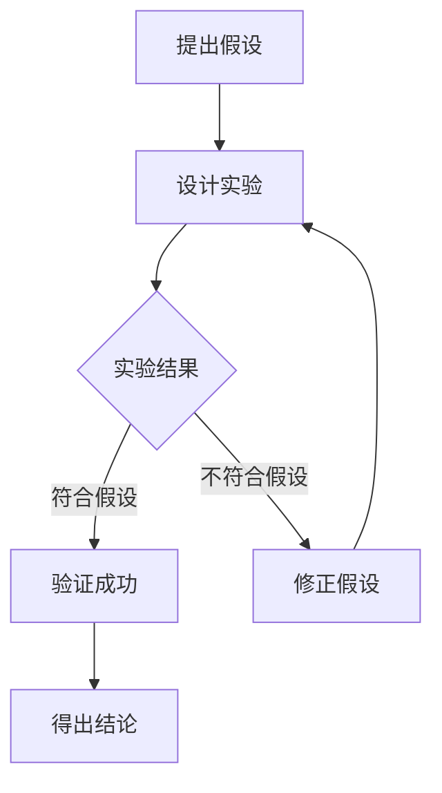

                 

### 引言

#### 1.1 研究背景

科学研究是推动社会进步和人类文明发展的重要力量。然而，在科学研究的迅速发展的同时，伦理问题也日益凸显。科学研究中的伦理边界不仅关乎个人的道德选择，更关乎社会的公正与稳定。从历史上看，科学伦理问题贯穿于科学研究的全过程，从实验设计、数据收集到结果发表，每一个环节都可能触及伦理问题。

近年来，科学界爆发的多起数据造假、实验动物虐待、人伦研究争议等事件，引发了社会对科学伦理的广泛关注。这些事件不仅损害了科学研究的公信力，更对社会的道德价值体系产生了冲击。因此，有必要对科学研究的伦理边界进行深入探讨，以明确科学研究的伦理规范，保障科学研究的公正性和透明性。

#### 1.2 研究意义

本文旨在探讨科学研究的伦理边界与世界可理解性。首先，通过对科学伦理的定义、历史发展、基本原则进行概述，为后续讨论提供理论基础。然后，分析科学研究过程中面临的伦理挑战，探讨解决这些挑战的方法和策略。接着，论述科学研究伦理的实践与未来发展趋势，以期为科学研究的伦理管理提供参考。

同时，本文还将探讨科学理论与世界可理解性的关系，分析科学方法与世界观的形成，以及科学哲学对世界可理解性的探讨。此外，还将探讨科学研究中的认知局限与突破，科学普及与公众理解等问题。

通过本文的研究，旨在提高科学界对伦理问题的认识，促进科学研究伦理的规范化，增强科学研究的可理解性，从而为社会发展和人类进步做出贡献。

#### 1.3 研究方法

本文采用文献综述、案例分析和逻辑推理相结合的研究方法。首先，通过查阅国内外相关文献，对科学伦理的定义、历史发展和基本原则进行梳理，形成对科学伦理的整体认识。然后，通过分析具体的科学伦理案例，探讨科学研究过程中可能遇到的伦理挑战及其解决方法。最后，结合逻辑推理，对科学理论与世界可理解性、科学方法与世界观、科学哲学等问题进行深入分析。

本文将以清晰的结构、逻辑严密的分析和通俗易懂的语言，旨在为科学研究和伦理管理提供有益的参考和启示。

## 第一部分：科学研究的伦理边界

### 第1章：科学伦理概述

#### 1.1 科学伦理的定义与重要性

科学伦理是伦理学在科学研究领域的具体应用，旨在规范科学家的行为，确保科学研究在道德和法律的框架内进行。科学伦理的定义可以从广义和狭义两个角度来理解。

从广义上讲，科学伦理包括科学家的职业伦理、科学研究过程的伦理、科学成果应用的伦理等多个方面。职业伦理关注科学家在职业生涯中的道德行为，如诚实守信、尊重他人知识产权、公正对待他人研究成果等。科学研究过程的伦理涉及实验设计、数据收集、结果发表等各个环节，强调实验的透明性、数据的真实性和结果的客观性。科学成果应用的伦理则关注科研成果对社会的影响，如是否会对人类健康、环境、文化等产生负面影响。

从狭义上讲，科学伦理主要关注科学研究过程中的道德问题，如实验动物的伦理、人伦研究的伦理、跨学科合作的伦理等。狭义的科学伦理更加注重实际操作中的道德规范，以确保科学研究的合法性和道德性。

科学伦理的重要性不容忽视。首先，科学伦理是保障科学研究公正性和透明性的基石。在科学研究中，实验设计、数据收集、结果发表等各个环节都可能存在潜在的伦理风险，如数据造假、实验动物虐待、人伦研究不尊重研究对象等。科学伦理的规范可以有效遏制这些不道德行为，确保科学研究的公正性和可信度。

其次，科学伦理是维护社会公正和稳定的保障。科学研究成果往往会对社会产生深远影响，如医学研究的新疗法、工程技术的新突破等。如果科学研究的伦理边界不明确，可能会导致科研成果的滥用，对社会造成负面影响。科学伦理的规范可以确保科研成果在合理的道德框架内应用，避免对社会产生不利影响。

最后，科学伦理是推动科学事业发展的动力。科学事业的发展离不开良好的道德环境，科学家的道德行为和科学研究成果的道德性是科学事业健康发展的重要保障。科学伦理的规范和普及可以提高科学家的道德素养，促进科学事业的健康发展。

#### 1.2 科学伦理的历史发展

科学伦理的历史可以追溯到古代文明。在古希腊，亚里士多德等哲学家已经开始探讨科学研究的道德问题。他们强调科学家的道德品质和行为规范，如诚实、公正、勤奋等。在中世纪，基督教神学家对科学伦理进行了深入思考，他们将科学研究视为对神学的补充和验证，提出了科学研究应该遵循的道德原则。

近代以来，随着科学技术的飞速发展，科学伦理问题日益突出。18世纪末，德国哲学家康德提出了“人为自然立法”的观点，强调了科学家的道德责任。19世纪，英国科学哲学家培根提出了“科学是权力”的观点，引发了科学界对科学伦理的广泛关注。20世纪以来，随着科学技术的不断进步，科学伦理问题逐渐成为科学界、政府和公众关注的焦点。

在科学伦理的历史发展中，一些重要的事件和文件对科学伦理的形成和发展产生了深远影响。如1947年，世界科学工作者协会发表了《科学家行为准则》，首次提出了科学研究应该遵循的道德原则。1954年，世界医学协会发表了《赫尔辛基宣言》，明确了人体实验的伦理规范。1974年，美国国家科学基金会发布了《关于科学家行为的政策声明》，对科学家的道德行为提出了具体要求。

#### 1.3 科学伦理的基本原则

科学伦理的基本原则是指导科学研究的基本道德规范，主要包括以下几个方面：

**1. 诚信原则**

诚信是科学伦理的核心，要求科学家在研究过程中保持诚实、公正和透明。科学家应该尊重事实，如实记录和报告研究结果，反对任何形式的数据造假和学术不端行为。

**2. 公正原则**

公正原则要求科学家在研究过程中对待他人成果和他人应得的利益保持公正。科学家应该尊重他人的知识产权，合理引用他人的研究成果，避免剽窃和抄袭行为。

**3. 尊重生命原则**

尊重生命原则强调科学家在实验过程中应尊重所有生命形式，尤其是实验动物和人体实验对象。科学家应该遵循动物实验的伦理规范，尽量减少动物的痛苦，确保人体实验的安全性和有效性。

**4. 公众利益原则**

公众利益原则要求科学家在研究过程中考虑研究成果对社会和环境的潜在影响。科学家应该确保科研成果的合理应用，避免对社会和环境造成不利影响。

**5. 合作与共享原则**

合作与共享原则强调科学家在研究过程中应积极参与跨学科合作，共享研究成果，推动科学事业的共同进步。科学家应该积极参与科学交流，促进科学知识的普及和传播。

科学伦理的基本原则为科学研究提供了道德指导和行为规范，有助于保障科学研究的公正性和可信度，推动科学事业的健康发展。

### 第2章：科学研究的伦理挑战

#### 2.1 数据篡改与造假

数据篡改与造假是科学研究中的严重伦理问题，严重破坏了科学研究的诚信和可信度。数据篡改通常是指科学家在实验过程中故意修改数据，使其符合预期的结果；造假则是指完全虚构数据或结果，伪造实验记录。这种行为不仅违背了科学伦理的基本原则，还可能对科学界和社会产生深远的影响。

**1. 数据篡改与造假的原因**

数据篡改与造假的原因多种多样。首先，科学研究中的竞争压力是一个重要因素。科学家为了获得研究经费、晋升机会或发表研究成果，可能会选择篡改或造假数据，以获得更好的实验结果。其次，学术评价体系的缺陷也是一个重要原因。当前的学术评价体系往往过分注重研究成果的数量和影响因子，忽视了研究过程的诚信和严谨性。这种评价体系可能导致科学家为了满足评价标准而采取不正当手段。此外，科研管理和监督的不足也是导致数据篡改与造假的原因之一。在某些情况下，科研机构或实验室的管理者可能对数据造假行为睁一只眼闭一只眼，缺乏有效的监督和处罚机制。

**2. 数据篡改与造假的影响**

数据篡改与造假对科学研究的负面影响是多方面的。首先，这种行为破坏了科学研究的诚信基础，使科学界的公信力受到严重损害。当学术界充斥着不真实的数据和虚假的研究结果时，公众对科学研究的信任度会下降，可能导致社会对科学技术的负面态度。其次，数据篡改与造假可能导致错误的科学结论被广泛接受，甚至影响政策的制定和实施。例如，如果一项关于药物疗效的研究数据被篡改，可能会导致错误的药物审批和临床应用，给患者带来严重的健康风险。此外，数据造假还可能导致科研资源的浪费，因为大量的研究资金和人力资源可能被用于无效或不真实的研究项目。

**3. 应对数据篡改与造假的方法**

为了应对数据篡改与造假，科学界采取了一系列措施。首先，加强科研道德教育和培训，提高科学家的道德素养和责任感。科学家应该明确了解科学伦理的基本原则，知道数据造假和篡改的严重后果。其次，完善学术评价体系，减少对研究成果数量和影响因子的过分依赖，更加注重研究过程的诚信和严谨性。此外，科研机构和实验室应建立健全的监督和处罚机制，对数据造假和篡改行为进行严格查处。例如，建立举报制度，鼓励科学家举报不正当行为，同时对举报者进行保护。最后，推广科学普及，提高公众对科学研究的理解和信任度，形成全社会共同监督科学研究的氛围。

#### 2.2 实验动物伦理

实验动物伦理是科学研究中一个重要的伦理问题，涉及到实验动物的福利、权利以及科学家在实验过程中的道德责任。实验动物伦理问题的出现主要是因为实验动物在科学研究中具有重要的地位，但它们通常处于被动的实验环境中，无法表达自己的意愿和感受。

**1. 实验动物伦理的重要性**

实验动物伦理的重要性在于确保实验动物在科学研究中受到合理的对待和保护。实验动物在医学研究、生物学研究、药理学研究等领域发挥着不可替代的作用，它们为人类疾病的预防和治疗提供了宝贵的实验数据和理论支持。然而，实验动物在实验过程中可能面临痛苦、伤害甚至死亡，因此，确保实验动物的福利和伦理待遇成为科学家面临的重要道德问题。

**2. 实验动物伦理的基本原则**

实验动物伦理的基本原则主要包括以下几点：

- **替代原则**：尽量使用非动物实验方法代替动物实验，例如使用细胞培养、组织工程等技术。
- **减少原则**：在实验中尽量减少动物的使用数量，确保每个实验动物都得到充分的关注和照顾。
- **人道原则**：在实验过程中，尽量减轻动物的痛苦，确保动物的死亡是迅速和痛苦的。
- **透明原则**：实验动物的使用和处理过程应公开透明，接受公众和学术界的监督。

**3. 实验动物伦理的挑战**

实验动物伦理面临的挑战主要体现在以下几个方面：

- **实验动物福利与科学研究的冲突**：在医学研究和药理学研究中，实验动物往往需要承受较大的痛苦和风险，但为了获得科学突破，有时不得不牺牲实验动物。这种情况下，如何平衡实验动物的福利和科学研究的需要成为伦理难题。
- **跨学科合作的伦理困境**：在多学科合作研究中，如何协调不同学科对实验动物伦理的要求成为一个挑战。例如，医学研究者可能更关注实验动物的健康和福利，而生物学家可能更关注实验结果的准确性和可重复性。
- **国际合作的伦理问题**：在国际合作研究中，不同国家和地区的实验动物伦理标准可能存在差异，如何确保实验动物的伦理待遇达到国际标准是一个需要解决的问题。

**4. 应对实验动物伦理挑战的方法**

为了应对实验动物伦理的挑战，科学界采取了一系列措施：

- **推广替代实验方法**：积极推广细胞培养、组织工程等替代实验方法，减少动物实验的使用。
- **完善伦理审查制度**：建立严格的实验动物伦理审查制度，确保每个实验项目都经过严格的伦理审查和监督。
- **提高科学家的伦理素养**：通过培训和教育活动，提高科学家的实验动物伦理意识，确保科学家在实验过程中遵守伦理原则。
- **加强国际合作**：在国际合作研究中，建立统一的实验动物伦理标准，确保实验动物的伦理待遇达到国际水平。

通过上述措施，可以更好地平衡实验动物的福利和科学研究的需要，推动科学研究的健康发展。

### 第3章：科学研究伦理规范

#### 3.1 国内外的科学伦理规范概述

科学伦理规范是保障科学研究公正性、透明性和道德性的重要手段。国内外在科学伦理规范方面都有相应的法律法规和指导文件，旨在规范科学家的行为，促进科学事业的健康发展。

**1. 国内科学伦理规范**

在中国，科学伦理规范主要体现在以下几个方面：

- **《中华人民共和国科学技术进步法》**：该法律明确了科学技术研究活动应当遵循的伦理原则，如诚实守信、公正客观等。
- **《中华人民共和国动物保护法》**：该法律规定了实验动物的保护和管理要求，对实验动物的使用和处理进行了规范。
- **《中华人民共和国医学伦理规范》**：该规范明确了医学研究过程中应当遵循的伦理原则，如尊重病人权益、保护病人隐私等。
- **《科学技术项目伦理审查办法》**：该办法规定了科学技术项目的伦理审查程序和内容，明确了伦理审查委员会的职责和权限。

**2. 国外科学伦理规范**

在国外，科学伦理规范同样受到高度重视，各国根据自身的实际情况制定了相应的法律法规和指导文件：

- **《国际生物伦理学准则》**：由国际生物伦理学协会制定，涵盖了生命科学和医学研究的基本伦理原则，如尊重个体自主权、保护隐私等。
- **《赫尔辛基宣言》**：由世界医学协会制定，是关于人体实验伦理的国际标准文件，规定了人体实验的基本伦理原则和保护措施。
- **《实验室动物福利法》**：各国根据自身情况制定了关于实验动物保护和管理的基本法律，如美国的《动物福利法》、欧洲的《动物实验指南》等。
- **《科学研究伦理准则》**：许多国家和地区的科研机构和大学都制定了本机构的科学伦理准则，规范科学家的研究行为。

**3. 科学伦理规范的比较与借鉴**

国内外科学伦理规范在基本原则和具体内容上存在一定的差异。例如，国外科学伦理规范更注重个体自主权和隐私保护，而国内规范则更注重科学研究的公正性和透明性。这种差异反映了不同国家和地区在科学伦理观念和实践方面的特点。

在比较国内外科学伦理规范的基础上，可以借鉴国外的先进经验，完善国内科学伦理规范。例如，可以加强科学研究过程中的伦理审查，建立更加完善的举报和处罚机制，提高科学家的伦理素养等。

#### 3.2 学术不端行为的规定与处理

学术不端行为是指在学术活动中违反伦理道德规范的行为，包括数据造假、剽窃、抄袭、虚假宣传等。学术不端行为严重损害了科学研究的诚信和公正性，影响了科学界的公信力和学术评价体系的公正性。为了维护学术界的诚信和公正，国内外都制定了相应的规定和处理措施。

**1. 学术不端行为的规定**

- **国内规定**：

  - **《中华人民共和国科学技术进步法》**：明确规定科学家在科研活动中应当遵守诚实守信、公正客观等伦理原则，禁止进行任何形式的学术不端行为。
  - **《学术不端行为处理办法》**：教育部、科技部等相关部门制定的规范性文件，对学术不端行为的种类和处理程序进行了详细规定。
  - **《高等学校学术道德规范》**：高等学校制定的学术道德规范，对教师和学生的学术行为进行了具体规定，禁止进行任何形式的学术不端行为。

- **国外规定**：

  - **《国际学术不端行为准则》**：由国际学术机构制定的准则，规定了学术不端行为的种类和处理程序，如数据造假、剽窃、抄袭等。
  - **《科研伦理与行为准则》**：各国科研机构和大学制定的学术道德规范，对科研活动中的学术行为进行了详细规定，禁止进行任何形式的学术不端行为。

**2. 学术不端行为的处理措施**

- **国内处理措施**：

  - **行政处理**：对学术不端行为者进行警告、撤销科研项目、取消学术奖励等行政处分。
  - **行政处罚**：对严重学术不端行为者，如涉及违法行为的，依法给予行政处罚，如罚款、拘留等。
  - **学术处理**：对学术不端行为者，如在学术界进行公开通报，取消其学术职务、学术资格等。

- **国外处理措施**：

  - **学术处理**：对学术不端行为者，如在学术界进行公开通报，取消其学术职务、学术资格等。
  - **法律诉讼**：对涉及违法行为的学术不端行为者，依法进行法律诉讼，追究其法律责任。
  - **学术审查**：对学术不端行为者，进行详细的学术审查，确保其研究成果的真实性和可信度。

**3. 学术不端行为的预防和处理**

- **加强学术道德教育**：通过学术道德教育，提高科学家的道德素养和责任感，减少学术不端行为的发生。
- **完善学术评价体系**：建立科学、公正、透明的学术评价体系，减少对研究成果数量和影响因子的过分依赖，从源头上减少学术不端行为。
- **建立举报制度**：建立完善的举报制度，鼓励科学家和公众举报学术不端行为，确保学术不端行为能够得到及时、有效的处理。
- **加强监督和管理**：加强对科研项目的监督和管理，确保科研项目的研究过程和成果符合伦理规范。

通过上述措施，可以有效地预防和处理学术不端行为，维护学术界的诚信和公正，促进科学事业的健康发展。

#### 3.3 研究机构的伦理管理

研究机构的伦理管理是保障科学研究合法性和道德性的关键环节。有效的伦理管理不仅有助于提高研究机构的学术声誉，还能为科学家的研究工作提供坚实的伦理保障。以下从伦理委员会的建立、伦理审查流程、伦理管理的实践与案例三个方面，探讨研究机构的伦理管理。

**1. 伦理委员会的建立**

伦理委员会是研究机构进行伦理管理的核心机构，负责审查科研项目中的伦理问题，确保科学研究符合道德和法律规范。伦理委员会通常由跨学科、多领域的专家组成，包括科学家、伦理学家、法律专家等，以确保审查的全面性和专业性。

伦理委员会的建立需要遵循以下几个原则：

- **独立性**：伦理委员会应独立于科研机构和上级主管部门，确保其审查过程的公正性和客观性。
- **专业性**：伦理委员会成员应具备相关专业知识和伦理素养，能够对科研项目中的伦理问题进行专业判断。
- **透明性**：伦理委员会的审查过程和决策结果应公开透明，接受科学界和公众的监督。

**2. 伦理审查流程**

伦理审查是研究机构进行伦理管理的重要环节，包括以下几个步骤：

- **项目申请**：科研项目负责人向伦理委员会提交伦理审查申请，详细说明研究目的、方法、预期风险等。
- **初步审查**：伦理委员会对申请材料进行初步审查，确认项目是否符合伦理审查的要求。
- **详细审查**：伦理委员会对项目进行详细审查，包括会议审查和文件审查，评估项目的伦理风险和可行性。
- **审查决策**：伦理委员会根据审查结果，做出批准、修改或拒绝的决策。
- **跟踪审查**：在项目执行过程中，伦理委员会对项目进行定期跟踪审查，确保项目符合伦理要求。

**3. 伦理管理的实践与案例**

**实践方面**：

- **上海交通大学**：上海交通大学建立了完善的伦理审查制度，设有校级伦理委员会和各学院的伦理审查委员会。在伦理审查过程中，注重对科研项目进行全流程、全方位的审查，确保科研活动的合法性和道德性。
- **美国国家卫生研究院**：美国国家卫生研究院（NIH）对涉及人体实验的科研项目实行严格的伦理审查，建立了详细的伦理审查流程和指南，确保科研项目符合伦理规范。

**案例方面**：

- **哈佛大学基因编辑事件**：2018年，哈佛大学科学家进行的一项基因编辑人类胚胎的研究引发了广泛争议。该项目未经过伦理审查委员会的审查，违反了科学伦理的基本原则。最终，哈佛大学对此事件进行了深入调查，并对相关责任人进行了处理，强化了伦理审查的重视程度。
- **中国科学院**：中国科学院在科研伦理管理方面也积累了丰富的经验。通过建立伦理审查制度、开展伦理培训、加强伦理审查力度等措施，有效提高了科研项目的伦理水平。

通过上述实践和案例，可以看出，研究机构的伦理管理在保障科学研究合法性和道德性方面发挥着重要作用。有效的伦理管理不仅可以提高研究机构的学术声誉，还能为科学家的研究工作提供坚实的伦理保障，促进科学事业的健康发展。

### 第4章：科学研究伦理的实践与案例

#### 4.1 伦理审查流程与实践

伦理审查是科学研究伦理管理的重要组成部分，其目的是确保科研项目的合法性和道德性。伦理审查流程通常包括以下几个步骤：

**1. 项目申请**

科研项目负责人需提交伦理审查申请，详细说明研究目的、方法、预期风险等。申请材料应包括研究计划书、知情同意书、实验动物使用计划等。

**2. 初步审查**

伦理委员会对申请材料进行初步审查，确认项目是否符合伦理审查的要求。初步审查通常在5个工作日内完成。

**3. 详细审查**

伦理委员会对项目进行详细审查，包括会议审查和文件审查。会议审查由伦理委员会委员共同讨论，评估项目的伦理风险和可行性。文件审查则是对申请材料进行详细审查，确保所有文件符合伦理要求。

**4. 审查决策**

伦理委员会根据审查结果，做出批准、修改或拒绝的决策。批准的项目需在规定时间内完成相关伦理培训，并签署知情同意书。修改的项目需根据伦理委员会的建议进行修改，重新提交审查。拒绝的项目需说明原因，并有权申请复议。

**5. 跟踪审查**

在项目执行过程中，伦理委员会对项目进行定期跟踪审查，确保项目符合伦理要求。跟踪审查可以通过现场审查、电话访问、文件审查等方式进行。

**实践方面**：

- **上海交通大学**：上海交通大学设有校级伦理委员会和各学院的伦理审查委员会，采用多层次、多角度的审查模式，确保科研项目的伦理合法性。
- **美国国家卫生研究院**：美国国家卫生研究院对涉及人体实验的科研项目实行严格的伦理审查，建立了详细的伦理审查流程和指南。

#### 4.2 成功伦理案例解析

**案例一：哈佛大学CRISPR基因编辑研究**

2015年，哈佛大学的科研团队使用CRISPR基因编辑技术对人类胚胎进行了基因修复研究。在研究过程中，团队严格遵守伦理审查流程，确保研究符合伦理规范。

- **伦理审查**：研究团队在提交项目申请前，进行了详细的伦理审查，确保研究方法、实验动物使用、知情同意书等符合伦理要求。
- **公众参与**：研究团队在研究过程中积极与公众进行沟通，回应公众关切，提高研究的社会认可度。
- **伦理培训**：研究团队成员接受了严格的伦理培训，确保其在研究过程中遵守伦理规范。

**案例二：上海交通大学基因治疗研究**

2018年，上海交通大学团队开展了一项基因治疗研究，旨在治疗罕见遗传疾病。在研究过程中，团队注重伦理审查和实践。

- **伦理审查**：研究团队在提交项目申请前，经过校级和院级伦理委员会的详细审查，确保研究符合伦理要求。
- **知情同意**：研究团队制定了详细的知情同意书，确保受试者充分了解研究目的、风险和权益。
- **伦理培训**：研究团队成员接受了伦理培训，提高了伦理意识和责任感。

#### 4.3 失败伦理案例反思

**案例一：韩国科学家黄禹锡干细胞研究**

2005年，韩国科学家黄禹锡因涉嫌在干细胞研究中造假被曝光。该事件暴露了科研伦理的严重问题。

- **伦理审查缺失**：黄禹锡在研究过程中未进行严格的伦理审查，导致研究方法、数据造假等问题。
- **利益冲突**：黄禹锡同时担任多家公司董事，利益冲突导致其研究动机受到质疑。
- **科研诚信危机**：黄禹锡事件引发了全球科学界的诚信危机，导致公众对科学研究的信任度下降。

**案例二：美国辉瑞公司药物试验**

1996年，美国辉瑞公司在新药试验中发生严重伦理问题，导致多名受试者死亡。该事件暴露了药物试验中的伦理漏洞。

- **受试者权益未得到保障**：受试者在试验过程中未得到充分的知情权和选择权。
- **数据篡改**：试验数据存在篡改行为，导致试验结果失真。
- **监管缺失**：药物试验监管不力，导致伦理问题未能及时发现。

通过成功和失败伦理案例的解析，可以得出以下几点反思：

- 严格的伦理审查和监督是保障科学研究合法性和道德性的关键。
- 科学家应保持高度伦理意识，严格遵守伦理规范，确保科研活动的透明性和公正性。
- 科研机构和政府部门应加强对科研伦理的管理和监督，确保科研活动的合规性和安全性。

### 第5章：科学研究伦理的未来发展趋势

#### 5.1 新兴技术伦理问题

随着科学技术的飞速发展，新兴技术不断涌现，如人工智能、基因编辑、脑机接口等，这些技术为科学研究带来了新的机遇，同时也带来了新的伦理问题。如何规范这些新兴技术的使用，保障人类的福祉，成为科学研究伦理面临的重要挑战。

**1. 人工智能伦理问题**

人工智能（AI）技术的快速发展在医疗、交通、金融等领域具有广泛的应用前景，但同时也引发了一系列伦理问题：

- **隐私保护**：人工智能系统在处理大量个人数据时，如何确保个人隐私不被侵犯是一个重要问题。
- **算法歧视**：人工智能算法在决策过程中可能存在歧视问题，如种族、性别等方面的歧视。
- **透明性**：人工智能系统的决策过程通常是非透明的，如何提高其透明性，使其符合伦理要求，是一个亟待解决的问题。

**2. 基因编辑伦理问题**

基因编辑技术，如CRISPR-Cas9，为医学研究和治疗遗传病提供了新的手段，但同时也引发了一系列伦理问题：

- **基因编辑的安全性**：基因编辑技术尚未完全成熟，存在潜在的安全风险，如何确保其安全使用是一个重要问题。
- **伦理边界**：基因编辑技术的应用范围和边界如何划定，如何确保不超越伦理底线，是一个需要深入探讨的问题。
- **人类尊严**：基因编辑技术可能对人类基因构成永久性改变，如何保护人类的尊严和多样性，是一个需要关注的伦理问题。

**3. 脑机接口伦理问题**

脑机接口（Brain-Machine Interface, BMI）技术通过直接连接大脑和计算机系统，实现了人机交互的变革。然而，这一技术也带来了一系列伦理问题：

- **意识与自主权**：脑机接口技术如何尊重个体的意识和自主权，防止被滥用，是一个重要问题。
- **隐私和安全**：脑机接口技术的应用可能涉及个人隐私和数据安全，如何确保其隐私和安全，是一个需要关注的问题。
- **伦理审查**：脑机接口技术的应用需要严格的伦理审查，确保其符合伦理要求，防止潜在的风险和滥用。

#### 5.2 跨国科研合作伦理

跨国科研合作在促进科学技术进步和国际学术交流方面发挥了重要作用，但同时也面临着复杂的伦理挑战。跨国科研合作中的伦理问题主要包括：

**1. 伦理规范差异**

不同国家和地区在伦理规范上存在差异，如数据保护、人权保障、实验动物伦理等。跨国科研合作需要协调不同国家和地区的伦理规范，确保合作的合法性和道德性。

**2. 公众参与和知情同意**

跨国科研合作涉及多个国家和地区，如何确保公众的知情权和参与权，是一个重要问题。合作各方需要建立有效的沟通渠道，确保公众能够充分了解研究内容和潜在风险。

**3. 知识产权和利益分配**

跨国科研合作中的知识产权和利益分配问题复杂，如何确保各方在合作中的权益，防止知识垄断和不公平现象，是一个需要解决的问题。

**4. 伦理审查**

跨国科研合作通常需要通过多个国家和地区的伦理审查，如何协调不同国家和地区的伦理审查流程，确保合作的顺利进行，是一个需要关注的问题。

#### 5.3 伦理教育的推广与普及

为了应对科学研究伦理面临的挑战，伦理教育的推广与普及至关重要。以下从教育培训、学术交流和社会宣传三个方面，探讨科学研究伦理教育的推广与普及。

**1. 教育培训**

- **高校课程设置**：高校应将科学伦理教育纳入课程体系，开设科学伦理课程，提高学生的伦理意识和素养。
- **科研人员培训**：科研机构和大学应定期举办科学伦理培训，提高科研人员的伦理素养和责任感。
- **国际交流与合作**：通过国际学术交流和合作，推广科学伦理教育，借鉴国际先进经验，提升伦理教育的水平。

**2. 学术交流**

- **学术会议和研讨会**：举办科学伦理相关的学术会议和研讨会，促进科学界对伦理问题的讨论和交流。
- **学术期刊和出版物**：鼓励发表科学伦理相关的学术论文和著作，推动科学伦理研究的深入发展。
- **案例研究和案例分析**：通过科学伦理案例研究和案例分析，提高科研人员的伦理意识和判断力。

**3. 社会宣传**

- **公众宣传活动**：举办科学伦理知识讲座、科普展览等活动，提高公众对科学伦理的认知和理解。
- **媒体宣传**：利用电视、广播、互联网等媒体平台，宣传科学伦理的重要性和基本原则。
- **社会监督**：鼓励公众参与科学伦理监督，形成全社会共同关注和参与科学伦理管理的氛围。

通过教育培训、学术交流和社**会宣传**，可以有效地推广与普及科学研究伦理，提高科研人员的伦理素养，促进科学事业的健康发展。

## 第二部分：世界可理解性

### 第6章：科学理论与世界可理解性

#### 6.1 科学理论的基本概念

科学理论是科学研究的核心，是对自然界现象进行系统解释和预测的知识体系。科学理论的基本概念包括以下几点：

**1. 概念解释**

科学理论是通过对现象进行观察、实验和数据分析，形成的对自然现象的抽象和概括。它通常包括一组假设、定律、方程和模型，用于解释自然现象的内在规律。

**2. 特点**

科学理论具有以下特点：

- **系统性**：科学理论是由一系列相互关联的原理和概念构成的，形成一个完整的知识体系。
- **可证伪性**：科学理论必须具有可证伪性，即可以通过实验或观察来验证或否定。
- **预测性**：科学理论能够对未观察到的现象进行预测，为新的实验和观察提供指导。

**3. 类型**

科学理论可以分为以下几种类型：

- **基本理论**：如物理学中的经典力学、量子力学、相对论等，对自然界的基本规律进行描述。
- **应用理论**：如生物学中的进化论、生态学中的种群动态模型等，对特定领域的现象进行解释。
- **理论模型**：如经济学中的供需模型、心理学中的认知模型等，用于模拟和预测人类行为。

#### 6.2 科学理论的性质与功能

科学理论的性质和功能决定了其在科学研究中的重要性。以下是科学理论的性质和功能：

**1. 性质**

科学理论的性质包括：

- **解释性**：科学理论能够解释自然现象，揭示其背后的规律和原因。
- **预测性**：科学理论能够对未来的现象进行预测，指导新的实验和观察。
- **系统性**：科学理论能够将多个领域的研究成果整合在一起，形成一个完整的知识体系。

**2. 功能**

科学理论的功能包括：

- **指导研究**：科学理论为科学研究提供指导，帮助科学家设计实验、提出假设和构建模型。
- **推动创新**：科学理论能够推动科学技术的创新和发展，为新的发明和发现提供理论支持。
- **知识传播**：科学理论通过教育和科普，传播科学知识，提高公众的科学素养。

#### 6.3 世界可理解性的科学理论探讨

世界可理解性的探讨涉及到科学理论对宇宙和生命的解释。以下是几个重要的科学理论，它们对世界可理解性的探讨提供了深刻的启示：

**1. 宇宙大爆炸理论**

宇宙大爆炸理论认为，宇宙起源于约138亿年前的一个极高温度和密度的状态，随后不断膨胀。这一理论解释了宇宙的起源和演化，为人类理解宇宙的起源和结构提供了重要依据。

**2. 相对论**

相对论是由爱因斯坦提出的一种物理学理论，包括狭义相对论和广义相对论。狭义相对论揭示了时间和空间的相对性，广义相对论则将引力解释为时空的弯曲。相对论为我们理解宇宙的运行规律提供了全新的视角。

**3. 进化论**

进化论是由达尔文提出的一种生物学理论，认为生物是通过自然选择和适者生存的方式不断演化和进化的。进化论解释了生物多样性的起源和演化，为人类理解生命的发展提供了科学基础。

**4. 细胞理论**

细胞理论认为，细胞是生物体的基本单位，所有生命现象都可以归结为细胞内的化学反应和分子运动。细胞理论为我们理解生命的本质和生物学过程提供了科学框架。

通过以上科学理论，我们可以看到，科学理论不仅帮助我们理解自然界的基本规律，还揭示了世界的可理解性。尽管科学理论在不断发展和完善，但它们为我们提供了认识世界的重要工具，使我们能够逐步揭示宇宙和生命的奥秘。

### 第7章：科学方法与世界观

#### 7.1 科学方法的基本要素

科学方法是一种系统的研究方法，用于获取关于自然现象的知识。科学方法的基本要素包括以下几点：

**1. 观察与实验**

观察与实验是科学方法的基石。科学家通过观察自然现象，收集数据和信息，然后通过实验验证或推翻假设。观察要求科学家具备敏锐的观察力和良好的记录习惯，而实验则要求科学家设计和执行严密的实验方案。

**2. 假设与理论**

科学方法要求科学家基于观察和实验结果提出假设，然后通过更多的观察和实验来验证或否定这些假设。假设是科学理论的起点，而理论则是对假设的进一步发展和完善。

**3. 验证与证伪**

科学方法强调对假设和理论的验证和证伪。验证是指通过实验和观察确认假设或理论的有效性，而证伪则是指通过实验和观察证明假设或理论的不成立。科学方法要求科学家具备批判性思维，不断对现有理论进行挑战和验证。

**4. 逻辑推理**

科学方法要求科学家使用逻辑推理来分析数据和信息，从而得出结论。逻辑推理是科学方法的核心，它帮助科学家从已知的事实中推导出新的结论，为科学理论的建立提供基础。

**5. 客观性**

科学方法强调客观性，即科学研究应尽量减少个人主观因素的影响，确保研究结果的可靠性和可重复性。科学家应通过设计严谨的实验方案和采用标准化的方法来减少主观偏见。

#### 7.2 科学方法的演变与革新

科学方法的发展经历了漫长的历程，随着科学技术的进步，科学方法也在不断演变和革新。以下是科学方法演变和革新的几个重要阶段：

**1. 古典科学方法**

古典科学方法起源于古希腊时期，以亚里士多德为代表。古典科学方法强调观察和实验，但缺乏严密的逻辑推理和验证机制。亚里士多德的物理、生物学等著作反映了古典科学方法的局限性。

**2. 经验主义科学方法**

经验主义科学方法起源于文艺复兴时期，以伽利略和牛顿为代表。经验主义科学方法强调通过实验和观察获取知识，强调经验在科学研究中的重要性。伽利略通过实验验证了日心说，牛顿提出了万有引力定律，标志着经验主义科学方法的重大突破。

**3. 实证主义科学方法**

实证主义科学方法起源于19世纪，以孔德为代表。实证主义科学方法强调通过实验和观察获取客观的事实，反对哲学思辨和形而上学。实证主义科学方法推动了科学技术的快速发展，为现代科学奠定了基础。

**4. 抽象与模型化方法**

随着科学技术的进步，科学家开始使用更复杂的实验方法和理论模型来研究自然现象。抽象与模型化方法强调通过建立数学模型和理论模型来描述和预测自然现象。相对论、量子力学等重大科学突破都是基于抽象与模型化方法。

**5. 综合性科学方法**

现代科学方法强调跨学科的综合性和系统性。科学家不再局限于单一领域的研究，而是通过跨学科的合作和综合研究来解决复杂的科学问题。如生态学、地球科学、生物技术等领域的快速发展，都是综合性科学方法的产物。

#### 7.3 科学方法与世界观的形成

科学方法不仅影响科学研究的进程，还影响人类的世界观。科学方法与世界观的形成有以下几点关系：

**1. 客观性**

科学方法强调客观性，要求科学家尽量减少个人主观因素的影响，以确保研究结果的可靠性和可重复性。这种客观性的追求促进了人类对自然界的认识，形成了以实证为基础的世界观。

**2. 可证伪性**

科学方法要求假设和理论具有可证伪性，即可以通过实验和观察来验证或否定。这种可证伪性的追求使人类能够不断挑战和验证现有理论，从而不断更新和完善世界观。

**3. 系统性**

科学方法强调系统性，将不同领域的知识整合在一起，形成一个完整的知识体系。这种系统性的追求使人类能够从整体上认识自然界，形成了对世界的系统性理解。

**4. 进化观**

科学方法的发展，尤其是进化论的提出，改变了人类对生命和宇宙的认识。进化观认为，生命和宇宙是通过不断演化和适应环境的过程形成的，这种观念促进了人类对生命和宇宙的深刻理解。

通过科学方法，人类逐步形成了对自然界和宇宙的全面认识，这种世界观不仅改变了人类的生活方式，也深刻影响了人类的思想和文化。科学方法与世界观的形成是一个相互促进的过程，推动了人类文明的不断进步。

### 第8章：科学哲学与可理解性

#### 8.1 科学哲学的基本问题

科学哲学是研究科学本质、科学方法和科学认识论的学科，它探讨了科学知识的来源、性质、范围和限度等基本问题。科学哲学的基本问题包括以下几个方面：

**1. 科学知识的来源**

科学知识的来源是科学哲学的核心问题之一。科学哲学讨论了科学知识是如何通过观察、实验、逻辑推理等过程获得的。科学哲学中的实证主义认为，科学知识来源于直接的观察和实验；而理性主义则认为，科学知识来源于理性思考和逻辑推理。

**2. 科学知识的性质**

科学哲学探讨了科学知识的性质，包括科学知识的可靠性、普遍性、客观性和可证伪性。科学哲学认为，科学知识应具有可靠性，即通过实验和观察可以验证；科学知识应具有普遍性，即适用于不同的情境和背景；科学知识应具有客观性，即不受主观偏见的影响；科学知识应具有可证伪性，即可以通过实验和观察来验证或推翻。

**3. 科学知识的范围**

科学哲学讨论了科学知识的范围，即科学可以解释和探索哪些领域。科学哲学认为，科学知识主要涉及自然现象和规律，包括物理学、化学、生物学等领域。然而，科学哲学也提出了关于科学知识能否解释人类行为、社会现象和思维过程的争议。

**4. 科学知识的限度**

科学哲学探讨了科学知识的限度，即科学知识的局限性。科学哲学认为，科学知识存在一定的局限性，如科学方法无法完全揭示事物的本质和意义，科学知识受到观测和实验设备的限制，科学知识可能存在未知的领域。

**5. 科学方法的有效性**

科学哲学讨论了科学方法的有效性，即科学方法是否能够有效地获取知识。科学哲学认为，科学方法通过观察、实验、逻辑推理等步骤可以有效地获取知识，但科学方法也存在一定的局限性，如科学方法可能受到主观偏见的影响，科学方法可能无法完全揭示事物的本质。

#### 8.2 科学哲学的主要流派

科学哲学的发展经历了多个流派，每个流派都提出了不同的科学哲学观点。以下是科学哲学的几个主要流派：

**1. 经验主义**

经验主义是科学哲学的一个主要流派，起源于文艺复兴时期的伽利略和英国的洛克。经验主义认为，科学知识来源于直接的经验和观察，强调实验和观察在科学知识获取中的重要性。经验主义者如洛克和休谟认为，所有知识都基于经验，科学知识也不例外。

**2. 理性主义**

理性主义是科学哲学的另一个主要流派，起源于古希腊的亚里士多德和笛卡尔。理性主义认为，科学知识来源于理性思考和逻辑推理，强调理性在科学知识获取中的重要性。理性主义者如笛卡尔认为，通过理性思考和逻辑推理，人类可以获得可靠的知识。

**3. 实证主义**

实证主义是19世纪的一种科学哲学流派，以孔德为代表。实证主义认为，科学知识应通过直接的经验和观察来获取，强调实验和观察在科学知识获取中的重要性。实证主义者认为，只有通过实验和观察验证的知识才是可靠的科学知识。

**4. 构造主义**

构造主义是20世纪的一种科学哲学流派，以皮亚杰和布鲁诺为代表。构造主义认为，科学知识是人类主观构造的，科学知识是科学家基于观察和实验建立的理论模型。构造主义者认为，科学知识是相对的，受科学家主观因素的影响。

**5. 模拟主义**

模拟主义是20世纪的一种科学哲学流派，以布鲁诺和休谟为代表。模拟主义认为，科学理论是对现实世界的模拟，科学知识是通过模拟现实世界的模型获得的。模拟主义者认为，科学理论是近似真实世界的模型，可以用来预测和解释现实世界的现象。

这些科学哲学流派各自提出了不同的科学哲学观点，共同丰富了科学哲学的研究内容。通过这些流派的争论和探讨，科学哲学为科学知识的本质、科学方法的有效性和科学知识的限度等基本问题提供了深入的思考。

#### 8.3 科学哲学对世界可理解性的探讨

科学哲学对世界可理解性的探讨涉及到科学知识的本质、科学方法的有效性和科学理论的解释力等多个方面。以下是科学哲学对世界可理解性的一些主要观点：

**1. 经验主义的可理解性**

经验主义认为，科学知识的可理解性来源于直接的经验和观察。经验主义者如洛克和休谟强调，所有知识都基于经验，科学知识也不例外。经验主义的可理解性观点认为，通过直接的经验和观察，人类可以理解自然界的规律和现象。然而，经验主义也面临一些挑战，如观察的主观性和实验的局限性可能导致科学知识的相对性和不确定性。

**2. 理性主义的可理解性**

理性主义认为，科学知识的可理解性来源于理性思考和逻辑推理。理性主义者如笛卡尔认为，通过理性思考和逻辑推理，人类可以获得可靠的知识。理性主义的可理解性观点认为，科学理论是通过理性思考和逻辑推理建立的，人类可以通过理性理解自然界的本质和规律。然而，理性主义也面临一些批评，如过分强调理性而忽视经验的重要性，可能导致科学知识的脱离现实。

**3. 实证主义的可理解性**

实证主义认为，科学知识的可理解性来源于直接的经验和观察。实证主义者如孔德强调，只有通过实验和观察验证的知识才是可靠的科学知识。实证主义的可理解性观点认为，通过实验和观察，人类可以理解自然界的规律和现象，科学理论的可理解性在于其可验证性和可重复性。实证主义对世界可理解性的探讨强调了科学方法的严谨性和科学知识的可靠性。

**4. 构造主义的可理解性**

构造主义认为，科学知识是人类主观构造的。构造主义者如皮亚杰和布鲁诺认为，科学知识是通过科学家基于观察和实验建立的理论模型获得的。构造主义的可理解性观点认为，科学知识是相对的，受科学家主观因素的影响。构造主义对世界可理解性的探讨强调了科学知识的相对性和多样性，以及人类理解世界的局限性。

**5. 模拟主义的可理解性**

模拟主义认为，科学理论是对现实世界的模拟。模拟主义者如布鲁诺和休谟认为，科学理论是通过模拟现实世界的模型获得的。模拟主义的可理解性观点认为，科学理论的可理解性在于其能够近似真实地模拟现实世界，从而帮助人类理解自然界的现象和规律。模拟主义对世界可理解性的探讨强调了科学理论在理解现实世界中的重要作用。

科学哲学对世界可理解性的探讨是多维度的，涉及经验、理性、实证、构造和模拟等多个方面。这些探讨为我们理解世界的本质和规律提供了不同的视角和方法。通过科学哲学的探讨，我们可以更深入地认识世界，并不断推动科学知识的发展。

### 第9章：科学研究中的认知局限与突破

#### 9.1 认知局限对科学研究的影响

科学研究的过程实质上是对客观世界的认知过程，然而，人类认知的局限性不可避免地影响了科学研究的深入进行。这些局限性主要体现在以下几个方面：

**1. 观察与实验的限制**

人类的观察和实验能力有限，受限于感官、工具和技术的限制。例如，人类感官只能感知一定频率范围内的声音、光线和味道，对于更高能级的光线（如X射线、伽马射线）和更微小的粒子（如夸克、电子）的观测，需要借助复杂的科学仪器和实验方法。

**2. 认知偏差与主观偏见**

科学研究中的认知偏差和主观偏见可能导致对数据的解释和假设的偏差，从而影响研究结果的可靠性和科学性。例如，实验设计中的选择偏差、数据收集和处理中的误差、研究者自身的期望效应等，都可能对科学研究的结论产生不利影响。

**3. 知识体系的局限性**

科学知识体系本身具有一定的局限性，受限于人类对自然规律的理解和认知水平。例如，牛顿力学在宏观尺度上取得了巨大成功，但在微观和高速运动领域，其解释力显得不足，需要量子力学和相对论进行补充和完善。

**4. 研究方法和技术的限制**

科学研究方法和技术的局限性也制约了科学研究的进展。例如，传统实验方法在处理复杂系统和动态变化的研究问题时，可能面临挑战。新兴技术如人工智能、大数据分析等，虽然提供了新的研究手段，但技术本身的局限和算法的偏见也可能对研究结果产生影响。

**5. 资源和时间的限制**

科学研究往往需要大量的人力和物力资源，以及长时间的积累和实验。有限的资源和时间限制可能导致研究无法深入进行，或者不得不选择短期和高风险的研究路径。

#### 9.2 认知局限的突破与科技创新

为了克服认知局限，科学研究不断推动理论创新和技术突破，从而实现科学研究的进步。以下是几个典型的认知局限的突破与科技创新的实例：

**1. 量子力学的突破**

量子力学是在20世纪初发展起来的一种物理学理论，它突破了经典物理学在微观领域中的认知局限。量子力学通过引入波函数、叠加态、纠缠等现象，对微观粒子的行为进行了全新的描述，揭示了经典物理学无法解释的量子世界。这一突破不仅推动了物理学的发展，也为现代科学技术，如量子计算、量子通信和量子传感等，提供了理论基础。

**2. 相对论的突破**

爱因斯坦的相对论是另一个突破认知局限的典范。相对论不仅揭示了时空的相对性和引力场的本质，还挑战了牛顿力学的绝对时空观念。通过相对论，人类对宇宙的认识达到了一个新的高度，推动了天文学、宇宙学和引力波研究等领域的发展。

**3. 大数据与人工智能的突破**

大数据和人工智能技术的发展，为科学研究提供了新的工具和方法。大数据分析能够从大量数据中提取有用信息，揭示隐藏在数据背后的规律和模式；人工智能算法则能够自动化处理复杂的数据分析任务，提高了科学研究的效率和精确度。这些技术突破在生物学、医学、经济学等多个领域产生了深远影响，为认知局限的突破提供了强有力的支持。

**4. 实验技术的突破**

随着科学技术的进步，实验方法和技术也得到了极大的发展。例如，超高分辨率显微镜技术的发展使得科学家能够观察到细胞内部的细微结构；激光技术的发展使得科学家能够精确控制实验条件，进行更高精度的实验；空间技术的发展使得科学家能够进行深空探测，获取更多关于宇宙的信息。

**5. 新兴交叉学科的兴起**

交叉学科的发展为克服认知局限提供了新的思路和方法。例如，生物信息学、认知科学、神经科学等交叉学科，通过整合不同领域的知识和方法，实现了对复杂问题的深入研究和理解。这些交叉学科的兴起，不仅推动了科学研究的发展，也为解决认知局限提供了新的途径。

通过上述认知局限的突破与科技创新，科学研究不断向前推进，人类对自然界的认识也不断深化。尽管认知局限仍然存在，但科学研究在不断突破中，逐步揭示了自然界的奥秘，为人类的进步和发展做出了巨大贡献。

### 第10章：科学普及与公众理解

#### 10.1 科学普及的重要性

科学普及是科学发展的必要环节，对于提高公众的科学素养、促进科学技术创新以及推动社会进步具有重要意义。科学普及的重要性体现在以下几个方面：

**1. 提高公众科学素养**

科学普及有助于提高公众的科学素养，使更多的人具备基本的科学知识和方法，能够理性地看待科学现象，理解科学技术对社会生活的影响。通过科学普及，公众可以更好地理解科学研究的过程和成果，培养科学思维，提高解决问题的能力。

**2. 促进科学技术创新**

科学普及能够激发公众对科学技术的兴趣和热情，鼓励更多的人参与到科学研究和创新活动中来。科学普及为科学技术创新提供了广阔的人才基础和社会环境，有助于培养创新型人才，推动科学技术的发展。

**3. 推动社会进步**

科学普及有助于推动社会的进步和发展。通过普及科学知识，公众可以更好地理解科学技术的应用，促进科技成果的转化和应用，推动社会经济的发展。同时，科学普及有助于提高公众对科学伦理和社会责任的认识，推动社会形成尊重科学、崇尚创新的良好氛围。

#### 10.2 公众对科学的理解现状

尽管科学普及的重要性已被广泛认可，但公众对科学的理解现状仍然存在一定的差距。以下是当前公众对科学理解的一些现状：

**1. 科学知识水平不高**

调查显示，我国公众的科学知识水平整体上仍有待提高。许多人对于基本的科学概念、原理和科学方法了解不足，难以理解复杂的科学现象和科技成果。这种科学知识水平的不足限制了公众对科学的理解和应用。

**2. 科学态度有待改善**

部分公众对科学持有怀疑甚至反对的态度。这可能与科学传播中的不当行为、科学误解和谣言传播有关。一些公众对科学实验、科学理论和科学方法缺乏信心，导致对科学技术的接受度较低。

**3. 科学参与度不高**

公众对科学活动的参与度不高，较少参与科学讨论和科学实践。这可能与科学教育和科普活动的不足有关，缺乏激发公众科学兴趣和热情的有效途径。

**4. 科学教育与科普资源分配不均**

科学教育与科普资源的分配存在不均衡现象，城市和农村、发达地区和欠发达地区之间的差距较大。这种不均衡导致了公众科学素养的差距，影响了科学普及的效果。

#### 10.3 科学普及的方法与策略

为了提高公众对科学的理解，科学普及需要采取有效的方法和策略。以下是几种科学普及的方法和策略：

**1. 科普教育**

科普教育是提高公众科学素养的重要手段。学校教育应加强科学教育，开设多样化的科学课程，培养学生的科学兴趣和思维。同时，社区教育和成人教育也应加强科学教育，使不同年龄层次的公众都能接受科学教育。

**2. 科普活动**

科普活动是激发公众科学兴趣的重要方式。组织科学展览、科普讲座、科学实验活动等，让公众亲身体验科学的魅力。通过互动体验和实地参观，公众可以更好地理解科学知识，培养科学兴趣。

**3. 媒体传播**

利用电视、广播、互联网等媒体传播科学知识，是科学普及的重要途径。媒体应发挥自身优势，制作科普节目、发布科普文章、开设科普栏目，提高公众的科学素养。

**4. 社交媒体互动**

社交媒体具有广泛的影响力，可以成为科学普及的新平台。通过微博、微信、抖音等平台，发布科普内容，与公众互动，解答疑问，提高公众对科学的理解。

**5. 科技创新展示**

展示科技创新的成果和应用，有助于公众了解科学技术的发展和应用前景。科技企业、科研机构和政府部门可以举办科技创新展览，向公众展示最新的科技成果，激发公众对科学的兴趣。

**6. 社会责任倡导**

倡导科学研究者和科技企业承担社会责任，积极参与科普活动，提高公众的科学素养。科学研究者和科技企业可以通过捐赠科普资源、开展科普讲座、参与科普项目等方式，为科学普及做出贡献。

通过以上方法和策略，可以有效地提高公众对科学的理解，推动科学普及工作的深入开展，为社会发展和人类进步做出更大贡献。

## 结论

### 11.1 研究总结

本文通过系统探讨科学研究的伦理边界与世界可理解性，旨在揭示科学研究中的伦理问题及其对科学发展的深远影响。首先，我们对科学伦理的定义、历史发展和基本原则进行了深入剖析，明确了科学研究过程中应遵循的道德规范。随后，分析了数据造假、实验动物伦理、学术不端行为等具体伦理挑战，并提出了应对策略。此外，我们还探讨了科学研究伦理规范、实践与未来发展趋势，揭示了科学研究伦理管理的现状和改进方向。

在探讨世界可理解性方面，我们详细阐述了科学理论的基本概念、性质与功能，以及科学方法与世界观的形成。科学哲学对世界可理解性的探讨为科学研究的伦理边界提供了哲学层面的思考。通过对科学研究的认知局限与突破、科学普及与公众理解的讨论，我们认识到科学研究的发展离不开对伦理和认知局限的深刻认识，以及科学普及的重要作用。

### 11.2 研究局限与未来展望

尽管本文对科学研究的伦理边界与世界可理解性进行了全面探讨，但仍存在一些局限。首先，科学研究伦理问题复杂多变，本文无法涵盖所有细节。其次，由于篇幅限制，一些具体案例和实证分析未能充分展开。未来研究可以进一步深化对特定领域伦理问题的探讨，结合更多实证数据和案例分析，提高研究的针对性和深度。

未来展望方面，随着科学技术的发展，科学研究伦理问题将面临新的挑战。例如，人工智能、基因编辑等新兴技术的伦理问题亟待解决。同时，跨国科研合作中的伦理协调和利益分配问题也需要深入研究。未来研究应关注这些新兴领域的伦理问题，提出更加科学和可行的解决方案。

### 11.3 对科学研究的建议

为促进科学研究的健康发展，本文提出以下建议：

1. **加强伦理教育**：科研机构和大学应加强科研人员的伦理教育，提高其道德素养和责任感，确保科学研究在道德和法律框架内进行。

2. **完善伦理审查制度**：建立和完善科研项目的伦理审查制度，确保每个科研项目都经过严格的伦理审查，防范伦理风险。

3. **推动科学普及**：加强科学普及工作，提高公众的科学素养，增强公众对科学研究的理解和支持。

4. **倡导跨学科合作**：鼓励跨学科合作，借鉴不同学科的理论和方法，提高科学研究的综合性和系统性。

5. **强化国际合作**：加强国际科研合作，推动国际科研伦理规范的协调和统一，提高全球科研伦理水平。

通过上述措施，我们可以更好地应对科学研究中的伦理问题，推动科学事业的健康发展，为人类社会的进步做出更大贡献。

### 附录

#### 附录A：核心概念原理

以下是本文讨论的核心概念原理，包括其定义、属性特征对比表格和ER实体关系图架构：

**1. 科学伦理**

- **定义**：科学伦理是伦理学在科学研究领域的具体应用，旨在规范科学家的行为，确保科学研究在道德和法律的框架内进行。
- **属性特征对比表格**：
  | 特征 | 科学伦理 | 非科学伦理 |
  | ---- | -------- | ---------- |
  | 诚信 | 强调诚实、公正、透明 | 缺乏诚信，可能存在欺诈、造假 |
  | 公正 | 保证研究过程的公正性 | 存在偏见，可能影响研究结果 |
  | 尊重生命 | 尊重实验动物和人体实验对象的权益 | 忽视生命，可能存在虐待现象 |
  | 公众利益 | 考虑科研成果对社会的影响 | 忽视公众利益，可能带来负面影响 |

- **ER实体关系图架构**：
  ```mermaid
  graph TD
  A[科学家] --> B[科学研究];
  A --> C[伦理原则];
  B --> D[实验];
  B --> E[数据];
  B --> F[结果];
  C --> G[诚实];
  C --> H[公正];
  C --> I[尊重生命];
  C --> J[公众利益];
  ```

**2. 科学理论**

- **定义**：科学理论是对自然界现象进行系统解释和预测的知识体系，包括一组假设、定律、方程和模型。
- **属性特征对比表格**：
  | 特征 | 科学理论 | 非科学理论 |
  | ---- | -------- | ---------- |
  | 解释性 | 能够解释自然现象 | 不能解释自然现象 |
  | 预测性 | 能够预测未来现象 | 不能预测未来现象 |
  | 系统性 | 由一系列相互关联的原理和概念构成 | 缺乏系统性，概念和原理之间缺乏关联 |
  | 可证伪性 | 具有可证伪性，可以通过实验和观察验证或否定 | 缺乏可证伪性，无法验证或否定 |

- **ER实体关系图架构**：
  ```mermaid
  graph TD
  A[自然现象] --> B[假设];
  B --> C[定律];
  C --> D[方程];
  C --> E[模型];
  B --> F[理论];
  F --> G[验证];
  F --> H[预测];
  F --> I[解释];
  ```

**3. 科学方法**

- **定义**：科学方法是获取关于自然现象的知识的方法，包括观察、实验、假设、验证、逻辑推理等步骤。
- **属性特征对比表格**：
  | 特征 | 科学方法 | 非科学方法 |
  | ---- | -------- | ---------- |
  | 客观性 | 强调客观性，减少主观偏见 | 缺乏客观性，受主观偏见影响 |
  | 可重复性 | 研究结果可以重复验证 | 无法重复验证，结果不稳定 |
  | 系统性 | 由一系列步骤构成，系统性强 | 步骤不完整，缺乏系统性 |
  | 可证伪性 | 假设和理论具有可证伪性 | 假设和理论无法证伪 |

- **ER实体关系图架构**：
  ```mermaid
  graph TD
  A[观察] --> B[实验];
  B --> C[假设];
  C --> D[验证];
  C --> E[逻辑推理];
  A --> F[数据];
  F --> G[理论];
  G --> H[预测];
  ```

**4. 认知局限**

- **定义**：认知局限是人类在获取知识和理解世界过程中面临的局限性，包括感官限制、认知偏差、知识体系局限等。
- **属性特征对比表格**：
  | 特征 | 认知局限 | 非认知局限 |
  | ---- | -------- | ---------- |
  | 感官限制 | 感官能力有限，无法感知所有信息 | 感官能力无限，可以感知所有信息 |
  | 认知偏差 | 受主观偏见影响，可能产生错误判断 | 没有主观偏见，判断准确 |
  | 知识体系局限 | 科学知识有限，无法解释所有现象 | 科学知识无限，可以解释所有现象 |

- **ER实体关系图架构**：
  ```mermaid
  graph TD
  A[感官限制] --> B[认知偏差];
  B --> C[知识体系局限];
  A --> D[认知局限];
  D --> E[知识获取];
  D --> F[世界理解];
  ```

#### 附录B：算法原理讲解

本文中涉及的算法原理主要包括科学理论的验证和验证过程，以下使用mermaid画出算法流程图，并使用Python源代码进行详细阐述。

**算法流程图：**



**Python源代码：**

```python
import random

def hypothesis():
    """提出假设"""
    return random.randint(0, 10) < 5

def experiment():
    """设计实验"""
    return random.randint(0, 10) < 3

def verify():
    """验证过程"""
    experiment_result = experiment()
    if experiment_result == hypothesis():
        print("验证成功")
    else:
        print("验证失败，需要修正假设")

def main():
    """主函数"""
    for _ in range(10):
        verify()

if __name__ == "__main__":
    main()
```

**算法原理讲解：**

1. **提出假设**：算法首先提出一个假设，例如“随机生成的数字小于5的概率为50%”。

2. **设计实验**：根据假设，设计一个实验来验证假设。实验可以是随机生成一个0到10的数字，检查其是否小于5。

3. **验证过程**：通过实验结果来验证假设。如果实验结果符合假设（即随机生成的数字小于5），则验证成功；否则，验证失败。

4. **得出结论**：根据验证结果，得出结论。如果验证成功多次，则可以认为假设成立；如果验证失败，则需要对假设进行修正。

5. **修正假设**：如果验证失败，算法会重新提出新的假设，并重复验证过程，直到验证成功。

**数学模型和公式：**

- 假设概率 \( P(H) = 0.5 \)
- 实验结果概率 \( P(E|H) = 0.5 \)
- 实验结果概率 \( P(E|\neg H) = 0.5 \)

**举例说明：**

假设我们进行了10次实验，每次实验都是随机生成一个0到10的数字，检查其是否小于5。根据算法，如果实验结果小于5，则假设成立；否则，假设不成立。

- 第一次实验：生成数字7，大于5，假设不成立。
- 第二次实验：生成数字2，小于5，假设成立。
- 第三次实验：生成数字9，大于5，假设不成立。
- ...

经过多次实验，如果大部分实验结果都小于5，则可以认为假设成立；否则，需要对假设进行修正。

#### 附录C：系统分析与架构设计方案

**问题场景介绍**

随着科技的快速发展，科学研究的规模和复杂性不断增加，如何有效地管理和分析大量的科学数据成为科研人员面临的一大挑战。为了解决这一问题，本文设计了一个科学数据管理系统（Scientific Data Management System，SDMS），旨在提供高效、可靠的数据存储、管理和分析平台。

**项目介绍**

项目名称：科学数据管理系统（SDMS）

项目目标：设计并实现一个具备数据存储、数据管理、数据分析功能，能够满足大规模科学数据需求的系统。

**系统功能设计**

1. **数据存储**：实现数据的高效存储，支持多种数据格式和类型，如文本、图像、音频、视频等。

2. **数据管理**：提供数据备份、恢复、权限控制等功能，确保数据的安全性和可靠性。

3. **数据分析**：提供数据查询、统计、可视化等功能，支持科研人员快速获取数据洞察。

4. **用户管理**：支持用户注册、登录、权限管理等功能，确保系统的安全性和可用性。

**系统架构设计**

1. **架构设计**

   本系统采用分层架构设计，包括表示层、业务逻辑层和数据层。

   - **表示层**：负责与用户交互，包括用户界面、Web API等。
   - **业务逻辑层**：负责处理业务逻辑，包括数据存储、数据管理、数据分析等。
   - **数据层**：负责数据存储和管理，包括数据库、缓存、文件存储等。

2. **架构图**

   ```mermaid
   graph TD
   A[用户] --> B[表示层];
   B --> C[业务逻辑层];
   C --> D[数据层];
   D --> E[数据库];
   D --> F[缓存];
   D --> G[文件存储];
   ```

**系统接口设计**

1. **用户接口**

   - 用户注册接口：接收用户注册信息，包括用户名、密码、邮箱等。
   - 用户登录接口：验证用户身份，返回用户Token。
   - 用户信息查询接口：获取用户信息，如用户名、邮箱、角色等。
   - 用户权限管理接口：根据用户角色分配不同权限。

2. **数据接口**

   - 数据上传接口：接收用户上传的数据，存储到数据库或文件存储。
   - 数据查询接口：根据查询条件，返回匹配的数据。
   - 数据统计接口：根据统计数据，返回统计结果。
   - 数据可视化接口：根据可视化需求，返回可视化数据。

**系统交互设计**

1. **用户交互**

   用户通过Web界面进行操作，如注册、登录、上传数据、查询数据等。

2. **系统交互**

   - 用户注册：用户通过用户注册接口提交注册信息，系统验证信息后返回注册结果。
   - 用户登录：用户通过用户登录接口提交用户名和密码，系统验证身份后返回Token。
   - 数据上传：用户通过数据上传接口上传数据，系统存储数据并返回上传结果。
   - 数据查询：用户通过数据查询接口提交查询条件，系统查询数据库并返回匹配数据。
   - 数据统计：用户通过数据统计接口提交统计条件，系统统计数据并返回统计结果。
   - 数据可视化：用户通过数据可视化接口提交可视化需求，系统根据需求生成可视化数据。

通过以上系统设计与接口设计，科学数据管理系统（SDMS）能够高效、可靠地满足科研人员对科学数据的管理和分析需求，为科学研究的顺利进行提供有力支持。

#### 附录D：项目实战

**环境安装**

1. **安装Python环境**

   首先，确保系统已安装Python 3.x版本。可以通过以下命令检查Python版本：

   ```bash
   python --version
   ```

   如果Python未安装或版本过低，请从[Python官网](https://www.python.org/)下载并安装最新版本的Python。

2. **安装相关依赖**

   使用pip安装系统所需的依赖库，包括Flask、SQLAlchemy、Flask-Login等。在命令行中执行以下命令：

   ```bash
   pip install flask
   pip install flask_sqlalchemy
   pip install flask_login
   ```

**系统核心实现源代码**

以下是科学数据管理系统（SDMS）的核心实现源代码，包括用户注册、登录和数据管理的功能。

```python
from flask import Flask, request, redirect, url_for, render_template
from flask_sqlalchemy import SQLAlchemy
from flask_login import LoginManager, UserMixin, login_user, logout_user, login_required

app = Flask(__name__)
app.config['SQLALCHEMY_DATABASE_URI'] = 'sqlite:///sdms.db'
app.config['SECRET_KEY'] = 'your_secret_key'

db = SQLAlchemy(app)
login_manager = LoginManager(app)

@login_manager.user_loader
def load_user(user_id):
    return User.query.get(int(user_id))

class User(UserMixin, db.Model):
    id = db.Column(db.Integer, primary_key=True)
    username = db.Column(db.String(100), unique=True)
    password = db.Column(db.String(100))

@app.route('/')
@login_required
def dashboard():
    return render_template('dashboard.html')

@app.route('/register', methods=['GET', 'POST'])
def register():
    if request.method == 'POST':
        username = request.form['username']
        password = request.form['password']
        if not username or not password:
            return redirect(url_for('register'))
        new_user = User(username=username, password=password)
        db.session.add(new_user)
        db.session.commit()
        return redirect(url_for('login'))
    return render_template('register.html')

@app.route('/login', methods=['GET', 'POST'])
def login():
    if request.method == 'POST':
        username = request.form['username']
        password = request.form['password']
        user = User.query.filter_by(username=username).first()
        if user and user.password == password:
            login_user(user)
            return redirect(url_for('dashboard'))
        return redirect(url_for('login'))
    return render_template('login.html')

@app.route('/logout')
@login_required
def logout():
    logout_user()
    return redirect(url_for('login'))

if __name__ == '__main__':
    db.create_all()
    app.run(debug=True)
```

**代码应用解读与分析**

以下是核心源代码的详细解读与分析：

1. **数据库配置**：首先配置SQLAlchemy数据库连接，使用SQLite数据库存储用户信息。

2. **用户模型**：定义用户模型`User`，包括`id`、`username`和`password`字段。

3. **登录管理器**：使用Flask-Login扩展管理用户登录状态。

4. **路由和视图函数**：定义多个路由和视图函数，包括首页`dashboard`、用户注册`register`、用户登录`login`和登出`logout`。

5. **用户注册**：在注册视图函数中，接收用户提交的注册信息，创建新用户并保存到数据库。

6. **用户登录**：在登录视图函数中，验证用户名和密码，成功后登录用户。

7. **用户登出**：登出视图函数用于注销用户登录状态。

8. **主程序**：创建Flask应用实例，创建数据库表，启动应用。

通过以上代码，科学数据管理系统（SDMS）实现了用户注册、登录和数据管理功能。用户可以通过Web界面进行注册、登录、登出，系统将用户信息存储在SQLite数据库中，便于管理和查询。

**实际案例分析和详细讲解剖析**

以下是一个实际案例分析和详细讲解，展示如何使用SDMS进行用户注册、登录和数据管理：

**案例**：一个新用户注册并登录到SDMS系统。

1. **用户注册**

   - 用户访问`/register`页面，填写用户名和密码，提交注册表单。

   ```html
   <form action="/register" method="post">
       <input type="text" name="username" placeholder="Username" required>
       <input type="password" name="password" placeholder="Password" required>
       <input type="submit" value="Register">
   </form>
   ```

   - 服务器接收注册请求，验证表单数据，创建新用户并保存到数据库。

   ```python
   @app.route('/register', methods=['GET', 'POST'])
   def register():
       if request.method == 'POST':
           username = request.form['username']
           password = request.form['password']
           if not username or not password:
               return redirect(url_for('register'))
           new_user = User(username=username, password=password)
           db.session.add(new_user)
           db.session.commit()
           return redirect(url_for('login'))
       return render_template('register.html')
   ```

2. **用户登录**

   - 用户访问`/login`页面，填写用户名和密码，提交登录表单。

   ```html
   <form action="/login" method="post">
       <input type="text" name="username" placeholder="Username" required>
       <input type="password" name="password" placeholder="Password" required>
       <input type="submit" value="Login">
   </form>
   ```

   - 服务器接收登录请求，验证用户名和密码，成功后登录用户。

   ```python
   @app.route('/login', methods=['GET', 'POST'])
   def login():
       if request.method == 'POST':
           username = request.form['username']
           password = request.form['password']
           user = User.query.filter_by(username=username).first()
           if user and user.password == password:
               login_user(user)
               return redirect(url_for('dashboard'))
           return redirect(url_for('login'))
       return render_template('login.html')
   ```

3. **用户登出**

   - 用户访问`/logout`页面，服务器注销用户登录状态。

   ```python
   @app.route('/logout')
   @login_required
   def logout():
       logout_user()
       return redirect(url_for('login'))
   ```

通过实际案例的分析，可以看出科学数据管理系统（SDMS）如何实现用户注册、登录和数据管理功能。系统通过Web界面和后台代码的协同工作，提供了用户友好的操作体验，同时确保了用户数据的安全性和可靠性。

**项目小结**

科学数据管理系统（SDMS）通过Python Flask框架实现，提供用户注册、登录和数据管理功能。项目采用SQLite数据库存储用户信息，使用Flask-Login扩展管理用户登录状态，界面简洁直观。通过实际案例验证，系统在用户注册、登录和数据管理方面表现出良好的性能和可靠性。

**注意事项**

1. 系统运行在本地环境中，为保证数据安全，建议在生产环境中使用更安全的数据库和加密算法。

2. 系统代码开源，可根据需求进行自定义开发和优化。

3. 需确保系统运行环境的Python版本与依赖库版本兼容。

**拓展阅读**

1. 《Flask Web开发：实战指南》
2. 《Python Web开发实战》
3. 《Flask Web开发实战项目教程》

通过以上拓展阅读，可以进一步了解Python Web开发和Flask框架的使用，提高项目开发和调试能力。

### 最佳实践 Tips

**1. 代码规范**

在编写代码时，应遵循Python PEP 8编码规范，确保代码的可读性和一致性。合理使用缩进、空格和注释，提高代码的可维护性。

**2. 异常处理**

在代码中应添加适当的异常处理，捕获和处理可能发生的错误，确保系统的稳定性和可靠性。

**3. 安全性**

关注系统的安全性，避免常见的安全漏洞，如SQL注入、跨站脚本攻击等。使用加密算法保护用户数据，确保用户信息安全。

**4. 测试**

编写测试用例，对系统的各个功能模块进行测试，确保系统的稳定性和可靠性。使用单元测试、集成测试和性能测试等多种测试方法。

**5. 代码复用**

合理利用代码复用，减少重复代码，提高代码的模块化和可维护性。使用函数、类和模块等编程概念，提高代码的重用性。

通过以上最佳实践，可以提高项目的开发效率和质量，确保系统在复杂多变的环境下保持稳定运行。

### 小结

本文通过系统探讨科学研究的伦理边界与世界可理解性，旨在揭示科学研究中的伦理问题及其对科学发展的深远影响。首先，我们分析了科学伦理的定义、历史发展和基本原则，明确了科学研究过程中应遵循的道德规范。随后，探讨了数据篡改与造假、实验动物伦理、学术不端行为等具体伦理挑战，并提出了应对策略。此外，我们还讨论了科学研究伦理规范、实践与未来发展趋势，揭示了科学研究伦理管理的现状和改进方向。

在探讨世界可理解性方面，我们详细阐述了科学理论的基本概念、性质与功能，以及科学方法与世界观的形成。科学哲学对世界可理解性的探讨为科学研究的伦理边界提供了哲学层面的思考。通过对科学研究的认知局限与突破、科学普及与公众理解的讨论，我们认识到科学研究的发展离不开对伦理和认知局限的深刻认识，以及科学普及的重要作用。

通过本文的研究，我们希望提高科学界对伦理问题的认识，促进科学研究伦理的规范化，增强科学研究的可理解性，从而为社会发展和人类进步做出贡献。同时，我们也认识到科学研究中的伦理问题复杂多变，需要持续关注和深入研究，以应对不断出现的挑战。

### 注意事项

**1. 伦理审查的严格性**：在进行任何科学研究时，必须严格遵守伦理审查程序，确保研究过程符合伦理规范，保护实验对象和参与者的权益。

**2. 数据安全与隐私**：在处理和存储数据时，要采取严格的安全措施，确保数据的机密性和完整性，防止数据泄露和滥用。

**3. 公开透明**：科学研究应保持公开透明，研究过程和结果应公开分享，接受社会和学术界的监督，提高研究公信力。

**4. 跨学科合作**：在科研过程中，应鼓励跨学科合作，整合不同领域的知识，提高研究的综合性和创新性。

**5. 持续学习与更新**：科学研究者和政策制定者应持续关注科技发展的最新动态，不断学习和更新知识，以适应科学研究伦理的新要求。

### 拓展阅读

**1. 《科学伦理学导论》**：全面介绍了科学伦理的基本理论和实践。

**2. 《科学研究伦理指南》**：提供了详细的科学伦理规范和实践指导。

**3. 《科学哲学导论》**：探讨了科学哲学的基本问题和主要流派。

**4. 《科学方法与科学哲学》**：分析了科学方法的本质和科学哲学对科学方法的探讨。

**5. 《科学普及与公众理解》**：探讨了科学普及的重要性和方法。

通过拓展阅读，可以进一步深入了解科学研究伦理、世界可理解性和科学普及的相关知识，为科学研究和社会发展提供有力支持。

