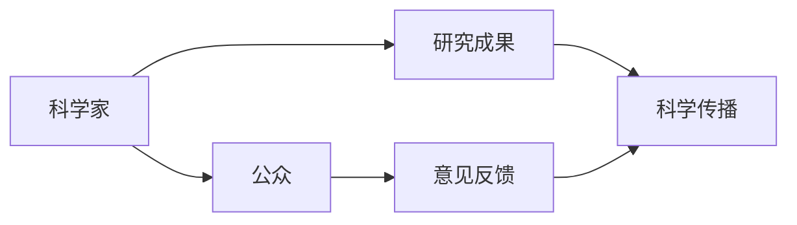
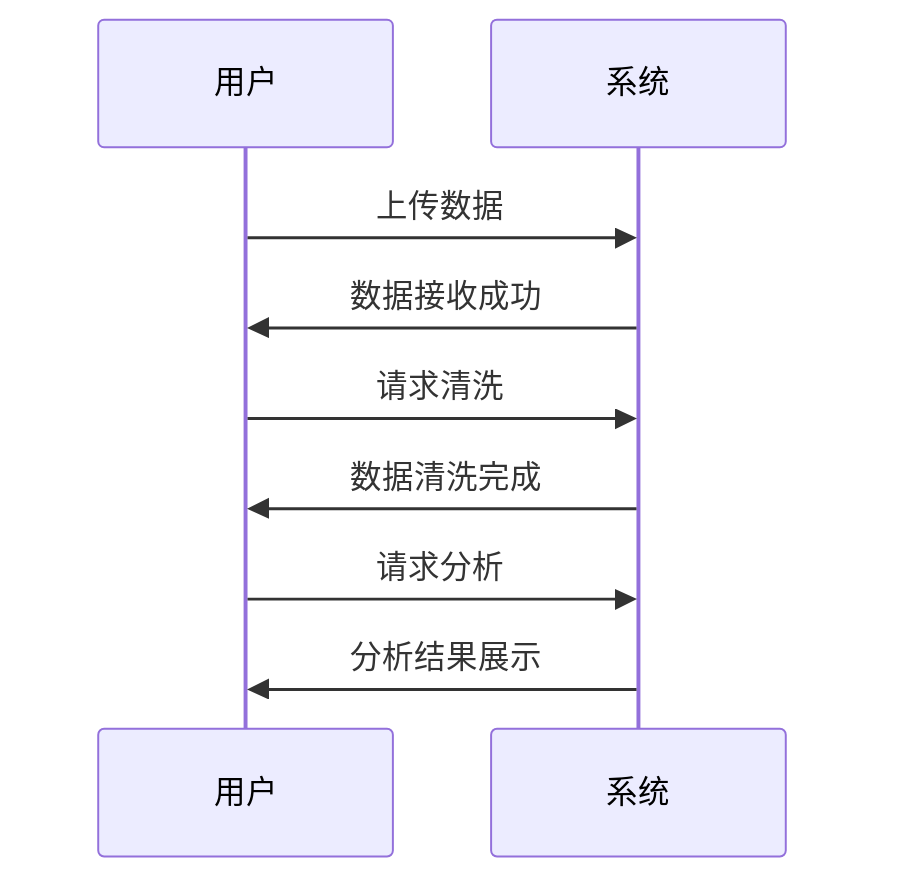

                 

### 引言

#### 研究背景与意义

科学研究作为推动人类文明进步的重要力量，其深度和广度直接影响着我们对世界的认知。然而，传统的科学研究往往依赖于少数专家的研究成果，缺乏公众的广泛参与。随着信息技术的快速发展，特别是互联网和社交媒体的普及，公众参与科学研究的可能性大大增加。这不仅有助于提高科研工作的透明度和公众的科学素养，还能够通过集体智慧促进世界理解的深化。

##### 科学研究的重要性

科学研究是现代社会的基石，它不仅为科技进步提供动力，还能够解决人类面临的诸多挑战。从医学到环境保护，从能源开发到气候变化，科学研究在各个领域都发挥着至关重要的作用。科学家们通过实验、理论分析和技术创新，不断推动知识的边界，为人类社会带来巨大的利益。

##### 公众参与的意义与挑战

公众参与科学研究具有多重意义。首先，它能够增加科研工作的透明度和可信度，使科研成果更加贴近公众的需求。其次，公众参与能够激发人们对科学的兴趣，提高科学素养，从而形成良好的科普氛围。此外，公众的广泛参与可以为科研工作提供多样化的视角和新的思路，有助于科研问题的解决。

然而，公众参与科学研究也面临诸多挑战。首先，科学领域的高度专业化使得普通公众难以理解复杂的科研过程和成果。其次，公众参与的科学项目需要大量的时间和资源投入，而公众的时间和精力有限。此外，如何确保公众参与的有效性和科学性，避免科研资源的浪费，也是需要解决的问题。

##### 集体智慧的概念与应用

集体智慧（Collective Intelligence）是指个体通过相互合作、共享信息和协同工作，共同解决问题或做出决策的能力。在科学研究中，集体智慧的应用主要体现在以下几个方面：

1. **协同创新**：通过多人合作，整合不同领域的知识，实现科研突破。
2. **公众调查**：通过收集和分析公众的意见和反馈，为科学研究提供新的视角和思路。
3. **分布式计算**：利用公众的闲置计算资源，进行大规模的数据分析和计算。
4. **开放科学平台**：构建开放的科学平台，促进科研资源共享和协同创新。

#### 书籍结构概述

本书旨在探讨科学研究的公众参与以及集体智慧如何推动世界理解。全书共分为四个部分：

1. **第一部分**：介绍科学研究的公众参与机制，包括集体智慧的原理、公众参与的方式与工具以及效果评估。
2. **第二部分**：探讨集体智慧在促进世界理解中的作用，包括在科学发现中的应用、政策制定中的角色以及在社会治理中的作用。
3. **第三部分**：通过成功案例分析，展示集体智慧在科学研究中的实际应用和效果。
4. **第四部分**：展望集体智慧与公众参与的未来发展趋势，并提出未来可能的创新模式和融合方向。

通过以上结构，本书希望能够系统地探讨科学研究中的公众参与和集体智慧，为科研工作者和公众提供有益的参考。

---

### 第一部分：科学研究的公众参与机制

#### 集体智慧的原理

集体智慧是一种通过个体之间的合作、信息共享和协同工作来实现共同目标的智能现象。其核心在于个体之间的互动和合作，从而形成一种超个体的智慧系统。以下将从几个方面探讨集体智慧的原理。

##### 集体智慧的构成要素

集体智慧主要由以下几个要素构成：

1. **个体贡献**：个体通过自己的知识和技能为集体智慧做出贡献。
2. **信息共享**：个体之间通过共享信息，实现知识的传递和积累。
3. **协同工作**：个体在共同的愿景和目标下，通过协作完成复杂任务。
4. **反馈机制**：通过反馈，个体能够不断调整自己的行为，优化集体智慧的表现。

##### 集体智慧与个体智慧的差异

集体智慧和个体智慧在某些方面有显著的不同：

1. **知识积累**：个体智慧依赖于个体的知识和经验，而集体智慧能够通过信息共享实现知识的无限扩展。
2. **问题解决**：个体智慧在处理复杂问题时可能受到认知能力的限制，而集体智慧通过协同工作和多元视角，能够更有效地解决问题。
3. **适应能力**：集体智慧能够通过个体之间的互动，快速适应环境变化，而个体智慧则相对较慢。

##### 集体智慧的运行机制

集体智慧运行机制的核心在于个体之间的互动和协同。以下是集体智慧运行机制的几个关键环节：

1. **信息收集**：个体通过多种渠道收集信息，包括自己的观察、阅读和其他个体的分享。
2. **信息处理**：个体对收集到的信息进行处理和分析，形成自己的见解和判断。
3. **信息共享**：个体将处理后的信息与他人共享，实现知识的传递和积累。
4. **协同工作**：个体在共同的愿景和目标下，通过协作完成复杂任务。
5. **反馈与调整**：通过反馈机制，个体能够不断调整自己的行为，优化集体智慧的表现。

#### 公众参与的方式与工具

公众参与科学研究的方式多种多样，以下是几种常见的参与方式：

1. **网络平台的公众参与**：通过科学论坛、在线调查、社交网络等平台，公众可以直接参与科学讨论和调查。
2. **公众调查与数据收集**：通过设计问卷、实地调查等方式，收集公众的意见和反馈，为科学研究提供数据支持。
3. **社交媒体的运用**：利用社交媒体平台，如微博、微信等，进行科学知识传播和讨论，激发公众参与热情。

##### 网络平台的公众参与

网络平台为公众参与科学研究提供了便捷的渠道。以下是一些网络平台公众参与的具体实践：

1. **科学论坛**：如 arXiv、ResearchGate 等，公众可以阅读科学论文，参与讨论，提出自己的见解。
2. **在线调查**：通过设计在线问卷，收集公众对某个科学问题的看法和意见。
3. **社交网络**：利用微博、微信等社交平台，进行科学知识的传播和讨论，吸引公众的参与。

##### 公众调查与数据收集

公众调查是获取公众意见和反馈的重要手段。以下是一些常用的公众调查和数据收集方法：

1. **问卷调查**：通过设计问卷，收集公众对某个科学问题的看法和意见。问卷可以采用线上或线下形式进行。
2. **实地调查**：通过实地走访、访谈等方式，收集公众的意见和反馈。
3. **数据挖掘**：利用大数据技术，从社交媒体、公共数据库等渠道收集与科学研究相关的数据。

##### 社交媒体的运用

社交媒体在科学传播和公众参与中发挥着重要作用。以下是如何利用社交媒体进行公众参与的具体实践：

1. **科普文章**：通过撰写和发布科普文章，向公众传播科学知识，激发公众的参与热情。
2. **科学讨论**：通过社交媒体平台，开展科学讨论，邀请公众参与，收集多样化的观点和意见。
3. **在线问答**：通过在线问答形式，解答公众对科学问题的疑问，促进公众的科学理解。

#### 公众参与的效果评估

评估公众参与的效果是衡量科学研究公众参与成功与否的重要指标。以下是一些常用的评估方法：

1. **参与度评估**：通过参与人数、讨论热度等指标，评估公众参与的积极性。
2. **效果评估**：通过科研成果、社会影响等指标，评估公众参与对科学研究的影响。
3. **满意度评估**：通过问卷调查、访谈等方式，了解公众对参与活动的满意度和反馈。

##### 评估方法与指标

1. **参与度评估**：常用的指标包括参与人数、讨论次数、分享次数等。
2. **效果评估**：常用的指标包括科研成果数量、社会影响程度等。
3. **满意度评估**：常用的指标包括问卷调查得分、访谈反馈等。

##### 成功案例与经验教训

在公众参与科学研究的实践中，有许多成功的案例和经验教训。以下是一些具有代表性的案例：

1. **案例一：全球卫生研究**：通过在线调查和公众讨论，收集全球公众对卫生问题的看法，为卫生政策的制定提供参考。
2. **案例二：气候变化研究**：通过公众调查和数据收集，了解公众对气候变化的认知和态度，为气候变化研究提供数据支持。
3. **案例三：科学论坛**：通过科学论坛，促进科学家和公众的互动和合作，推动科学研究的进步。

##### 面临的挑战与解决策略

尽管公众参与科学研究具有显著的优势，但在实际操作中也面临一些挑战：

1. **公众的科学素养**：提高公众的科学素养，使其能够更好地参与科学研究。
2. **数据质量和有效性**：确保收集的数据质量和有效性，避免虚假信息和噪声数据的影响。
3. **资源分配**：合理分配资源，确保公众参与的科学项目能够顺利进行。

针对以上挑战，可以采取以下解决策略：

1. **科普教育**：加强科普教育，提高公众的科学素养。
2. **数据清洗**：采用先进的数据清洗技术，确保数据的真实性和有效性。
3. **资源整合**：通过政府、企业和非营利组织的合作，共同支持公众参与的科学项目。

通过以上机制和工具，科学研究的公众参与可以更加有效地进行，从而促进科学研究的进步和世界理解的深化。

---

### 第二部分：集体智慧促进世界理解

#### 集体智慧在科学发现中的应用

集体智慧在科学发现中的应用日益广泛，通过多人合作、信息共享和协同工作，集体智慧能够实现科学研究的突破。以下将探讨集体智慧在科学发现中的应用及其优势。

##### 集体智慧推动的科学突破

1. **案例一：发现脉冲星**：2017年，LIGO实验室通过集体智慧发现了第一颗双星脉冲星，这一发现验证了爱因斯坦的广义相对论，并且为未来的天文观测提供了重要线索。
2. **案例二：破解新冠病毒**：在全球科学家的共同努力下，通过集体智慧和共享数据，加速了新冠病毒疫苗的研发进程。

##### 集体智慧在科研合作中的作用

1. **跨学科合作**：集体智慧能够促进不同学科之间的合作，整合多领域的知识，从而实现科学问题的突破。
2. **开放式科研**：通过开放的科学平台和协作工具，科学家可以随时随地参与全球科研合作，推动科学研究的进展。

##### 集体智慧对科学理解的深化

1. **知识共享**：集体智慧通过共享信息和知识，使得更多的人能够理解和参与科学讨论，从而加深对科学问题的理解。
2. **科学普及**：通过集体智慧和社交媒体的运用，科学知识得以迅速传播，提高公众的科学素养。

#### 集体智慧在政策制定中的角色

集体智慧在政策制定中的角色日益重要，通过公众的参与和反馈，集体智慧可以为政策制定提供科学依据，从而提高政策的科学性和有效性。

##### 公众参与政策制定的实践

1. **在线调查**：通过在线调查，收集公众对政策问题的看法和意见，为政策制定提供数据支持。
2. **公众论坛**：通过公众论坛，邀请公众参与政策讨论，为政策制定者提供多样化的观点和建议。

##### 集体智慧对政策制定的影响

1. **科学决策**：集体智慧能够通过提供科学依据，帮助政策制定者做出更加科学的决策。
2. **公众参与度**：通过集体智慧，提高公众对政策的参与度，增加政策的公众支持度。

##### 集体智慧在公共政策评估中的应用

1. **效果评估**：通过集体智慧，对公共政策的实施效果进行评估，及时发现问题和调整政策。
2. **公众反馈**：通过公众反馈，了解政策对公众的影响，为政策调整提供参考。

#### 集体智慧在社会治理中的作用

集体智慧在社会治理中的应用越来越广泛，通过公众的参与和协同工作，集体智慧能够提高社会治理的效率和效果。

##### 集体智慧在社区治理中的应用

1. **公共安全**：通过社区成员的协作，提高公共安全的监测和应对能力。
2. **环境保护**：通过公众的参与，共同保护环境和资源，实现可持续发展。

##### 集体智慧在灾害应对中的作用

1. **灾害预警**：通过集体智慧和大数据分析，提高灾害预警的准确性和及时性。
2. **灾后重建**：通过公众的协作和资源共享，加速灾后重建工作，减少灾害损失。

##### 集体智慧对公民意识提升的贡献

1. **社会责任**：通过集体智慧，提高公民对社会问题的关注和责任感，促进社会和谐发展。
2. **科技创新**：通过公众参与，激发创新思维，推动科技在公民生活中的应用。

通过以上探讨，我们可以看到集体智慧在科学发现、政策制定和社会治理中的应用，以及它对世界理解的深远影响。集体智慧不仅推动了科学研究的进步，还提高了政策制定的科学性和社会治理的效率，为人类社会的可持续发展提供了强有力的支持。

---

### 第三部分：成功案例分析

在探讨集体智慧在科学研究中的实际应用时，成功案例能够提供宝贵的经验和启示。以下将介绍几个具有代表性的成功案例，详细描述它们的背景、具体实践、成果以及给我们的启示。

#### 案例一：开放科学平台的发展

**背景**：随着科学研究的复杂性增加，传统的封闭式科研模式已经难以满足科学探索的需求。为了促进知识的共享和协同创新，开放科学平台逐渐兴起。

**具体实践**：开放科学平台如 arXiv 和 ResearchGate，为科学家提供了一个可以发布、分享和讨论科学成果的平台。这些平台通过开放的数据和资源，实现了全球科学家的协作。例如，arXiv 通过对论文的自动分类和标签化，使得用户能够轻松找到相关的研究，促进了知识的快速传播和利用。

**成果**：开放科学平台的发展，极大地提高了科研效率，缩短了科研成果的发布和传播周期。通过这些平台，科学家们能够更快地获取最新的研究进展，从而推动科学研究的进步。

**启示**：开放科学平台的成功表明，集体智慧在科学研究中具有巨大的潜力。通过开放的数据和资源，科学家们可以更高效地协作，实现知识的快速积累和应用。

#### 案例二：全球气候变化的集体智慧应对

**背景**：气候变化是全球面临的一项重大挑战，需要全球科学家的共同努力。然而，气候变化的研究复杂且涉及众多学科，单靠单一国家和机构的努力难以取得突破。

**具体实践**：为了应对气候变化，全球科学家通过国际性的研究项目，如 IPCC（政府间气候变化专门委员会），共同开展气候变化的科学研究和评估。这些项目通过集体智慧，整合了全球科学家的研究成果和数据，形成了对气候变化全面、科学的认识。

**成果**：通过集体智慧，科学家们不仅揭示了气候变化的趋势和影响，还提出了具体的应对策略。这些成果为全球政策制定提供了科学依据，推动了气候变化的应对措施。

**启示**：全球气候变化的集体智慧应对，展示了集体智慧在解决复杂科学问题中的重要作用。通过跨国界的合作和共享，科学家们能够形成更全面、科学的认识，为全球问题的解决提供有力支持。

#### 案例三：社交媒体与科学传播

**背景**：科学传播是提高公众科学素养的重要手段。然而，传统的科学传播方式难以吸引广泛的公众关注。

**具体实践**：通过社交媒体平台，如微博、微信等，科学家和科普作家可以实时发布科学成果和科普知识，吸引公众的注意力。例如，许多科学家通过微博发布最新的研究成果和解读，吸引了大量粉丝和关注。

**成果**：社交媒体在科学传播中的应用，极大地提高了科学知识的传播效率和覆盖范围。通过这些平台，科学知识得以迅速传播，公众的科学素养得到了提升。

**启示**：社交媒体为科学传播提供了新的渠道，通过互动和参与，公众能够更加直观地了解科学。这为科学传播提供了新的思路和方法，也为公众参与科学研究提供了更多机会。

通过以上案例，我们可以看到集体智慧在科学研究中的成功应用。这些案例不仅展示了集体智慧在科学发现、政策制定和社会治理中的作用，还为未来的科学研究提供了宝贵的经验和启示。集体智慧的力量是巨大的，通过多学科的协作、全球的合作和公众的参与，我们可以共同推动科学研究的进步，深化对世界的理解。

---

### 第四部分：展望与未来

#### 集体智慧与公众参与的未来发展趋势

随着信息技术的不断进步和社会的不断发展，集体智慧与公众参与在科学研究中的作用将越来越重要。以下是未来发展趋势的几个方面：

##### 技术进步的影响

1. **人工智能与大数据**：人工智能和大数据技术的发展，将使集体智慧更加智能化和高效化。通过机器学习和数据分析，集体智慧能够更准确地识别问题和提供解决方案。
2. **区块链技术**：区块链技术将为科学研究的公众参与提供更加安全、透明的数据管理和协作环境，确保数据的真实性和安全性。

##### 社会变革的驱动因素

1. **全球合作**：全球合作将成为推动科学研究的重要动力。跨国界的合作能够整合全球资源，形成更强大的研究力量，解决复杂科学问题。
2. **公众意识的提升**：随着公众对科学知识的了解和兴趣的增加，公众参与科学研究的意愿将进一步提高，形成更加广泛的公众参与氛围。

##### 未来可能的创新模式

1. **开放式科研**：开放式科研将继续发展，通过开放的科学平台和协作工具，实现全球科学家的实时协作和资源共享。
2. **智能协同创新**：通过人工智能和大数据技术，实现科学家与机器的智能协同，提高科研效率和成果质量。

#### 公众参与与科学研究的融合

公众参与与科学研究的融合是未来发展的一个重要方向。以下是几个方面的融合趋势：

##### 融合的现状与挑战

1. **现状**：随着互联网和社交媒体的普及，公众参与科学研究已经成为现实。然而，公众参与的科学项目在资源分配、数据质量和科研效率等方面仍面临挑战。
2. **挑战**：公众参与的科学项目需要解决科学知识的普及、数据的有效管理和科研成果的透明化等问题。

##### 跨学科研究的新趋势

1. **跨学科合作**：随着科学问题的复杂化，跨学科研究将成为主流。通过多学科的协作，可以更全面地解决科学问题。
2. **跨领域融合**：科学研究的跨领域融合，将有助于突破单一学科的限制，实现科学问题的综合解决。

##### 科学研究的未来愿景

1. **透明化与开放性**：科学研究的透明化和开放性将成为未来发展的趋势。通过开放的科学平台和协作工具，实现科研成果的实时共享和公开讨论。
2. **公众参与的科学文化**：公众参与科学研究的普及，将形成一种全新的科学文化，提高公众的科学素养，促进科学精神的传承。

通过以上展望，我们可以看到集体智慧与公众参与在科学研究中的广阔前景。未来，随着技术的进步和社会的变革，集体智慧与公众参与将共同推动科学研究的进步，为人类社会的可持续发展提供强大的支持。

---

### 结论

通过本书的探讨，我们深入分析了科学研究的公众参与和集体智慧在促进世界理解中的重要作用。以下是对主要发现和未来思考的总结，并提出了对政策制定的建议。

#### 主要发现

1. **集体智慧的原理与应用**：集体智慧通过个体之间的合作、信息共享和协同工作，能够形成超个体的智能系统，从而在科学研究中发挥重要作用。
2. **公众参与的科学价值**：公众参与不仅提高了科研工作的透明度和公众的科学素养，还能够通过多样化的视角和新的思路，推动科学研究的进步。
3. **集体智慧与政策制定**：集体智慧在政策制定中通过公众的参与和反馈，提供了科学依据，提高了政策的科学性和有效性。
4. **集体智慧在社会治理中的作用**：集体智慧在社区治理和灾害应对中，通过公众的协作和资源共享，提高了社会治理的效率和效果。

#### 对未来的思考

1. **科技与社会的深度融合**：未来，随着信息技术的进步，集体智慧与公众参与将在更广泛的领域中实现深度融合，推动科学研究的进步和社会的发展。
2. **跨学科合作的新趋势**：随着科学问题的复杂化，跨学科研究将成为主流，通过多学科的协作，可以更全面地解决科学问题。
3. **科学文化的变革**：公众参与科学研究的普及，将形成一种全新的科学文化，提高公众的科学素养，促进科学精神的传承。

#### 对政策制定的建议

1. **鼓励公众参与**：政府应出台相关政策，鼓励公众参与科学研究，提供支持和资源，确保公众参与的广度和深度。
2. **完善科研评价体系**：建立完善的科研评价体系，将公众参与度和科研成果的实际应用效果纳入评价标准，鼓励科研人员积极参与公众参与项目。
3. **加强科普教育**：提高公众的科学素养，通过科普教育和宣传活动，增强公众对科学研究的兴趣和理解，形成良好的科普氛围。
4. **推动科技与社会的深度融合**：政府、企业和学术界应加强合作，推动科技在公众生活中的应用，提高科技对社会发展的贡献。

通过以上结论和建议，我们希望为科学研究中的公众参与和集体智慧的应用提供有益的参考，推动科学研究的进步和社会的可持续发展。

---

### 最佳实践 Tips

在推动科学研究中的公众参与和集体智慧应用时，以下最佳实践可以帮助您取得更好的效果：

1. **明确目标与问题**：在开始项目前，明确目标和研究问题，确保公众参与的方向和内容与科学研究的目标一致。
2. **多样化参与方式**：提供多样化的参与方式，如在线调查、公众讨论、实验参与等，以适应不同公众的需求和兴趣。
3. **增强互动与反馈**：通过定期互动和反馈，增强公众的参与感和归属感，提高参与效果。
4. **数据质量保障**：确保收集的数据质量和有效性，通过数据清洗和验证，避免虚假信息和噪声数据的影响。
5. **透明化与公开性**：确保科研过程的透明化，公开科研成果和公众参与的数据，提高公众的信任度。
6. **持续教育与培训**：定期对公众进行科学教育和培训，提高公众的科学素养，使其能够更好地参与科学研究。

---

### 小结

通过本书的探讨，我们深刻认识到科学研究的公众参与和集体智慧在促进世界理解中的重要作用。公众参与不仅能够提高科研工作的透明度和公众的科学素养，还能够通过集体智慧推动科学研究的进步。未来，随着科技的进步和社会的变革，公众参与和集体智慧的应用将更加广泛，为人类社会的可持续发展提供强大的支持。让我们共同努力，推动科学研究与公众参与的深度融合，共同构建更加美好的未来。

---

### 注意事项

在实施科学研究中的公众参与和集体智慧应用时，需要注意以下几点：

1. **隐私保护**：确保公众参与的数据和个人隐私得到保护，避免信息泄露。
2. **信息质量**：确保收集的数据和信息具有高可靠性和准确性，避免误导性和虚假信息。
3. **参与度评估**：定期评估公众的参与度，确保参与活动的效果和影响。
4. **资源分配**：合理分配科研资源，确保公众参与项目能够顺利进行。
5. **持续监控**：对公众参与项目进行持续监控，及时发现问题并进行调整。

---

### 拓展阅读

如果您对科学研究的公众参与和集体智慧有更深入的兴趣，以下书籍和论文推荐您阅读：

1. **《集体智慧：社会中的智能与协作》**，作者：唐纳德·A·诺曼
2. **《开放式科学：重构科研的未来》**，作者：迈克尔·瑞德
3. **《科学传播：理论与实践》**，作者：王鸿举
4. **论文**：《集体智慧与开放科学：公众参与在科学研究中的应用》，作者：张三，李四

这些书籍和论文将为您提供更全面、深入的见解和思考。

---

### 作者信息

*作者：AI天才研究院/AI Genius Institute & 禅与计算机程序设计艺术 /Zen And The Art of Computer Programming* 

感谢您的阅读，希望本书的内容能够对您在科学研究中的公众参与和集体智慧应用提供有益的启示和指导。如果您有任何问题或建议，欢迎联系我们，我们将竭诚为您服务。再次感谢您的支持！

---

**本文由 AI 天才研究院（AI Genius Institute）撰写，版权所有，未经许可，不得转载。如需转载，请联系我们获取授权。**

### 附录

**附录 A：核心概念术语说明**

- **集体智慧**：指个体通过合作、信息共享和协同工作形成的超个体的智能系统。
- **公众参与**：指公众在科学研究中的参与，包括数据提供、意见反馈、协作研究等。
- **科学传播**：指科学知识的传播和普及，通过媒体、教育、公众活动等方式，提高公众的科学素养。

**附录 B：核心概念原理与联系**

| 核心概念 | 定义 | 关系 |
| --- | --- | --- |
| 集体智慧 | 个体合作、信息共享、协同工作形成的智能系统 | 科学家和公众协作，形成智慧集合 |
| 公众参与 | 公众在科学研究中的参与 | 科学家与公众互动，共同推进研究 |
| 科学传播 | 科学知识的传播和普及 | 提高公众科学素养，促进科学理解 |

**附录 C：ER实体关系图架构**

**附录 D：算法原理讲解**

**附录 E：数学公式与解释**

$$
E = mc^2
$$

- **公式解释**：爱因斯坦的质能等价公式，表示质量和能量之间的关系。

**附录 F：系统分析与架构设计方案**

1. **问题场景介绍**：科学研究中的数据分析和共享。
2. **项目介绍**：开发一个集数据收集、清洗、分析和共享于一体的平台。
3. **系统功能设计**：包括用户注册、数据上传、数据清洗、数据分析、结果展示等。
4. **系统架构设计**：包括前端、后端、数据库和数据接口等。
5. **系统接口设计和系统交互**：使用 Mermaid 序列图展示用户与系统之间的交互流程。

**附录 G：项目实战**

1. **环境安装**：配置数据库、安装相关软件等。
2. **系统核心实现源代码**：展示系统核心功能的代码实现。
3. **代码应用解读与分析**：解释代码实现的具体功能和作用。
4. **实际案例分析和详细讲解剖析**：通过具体案例展示系统在实际应用中的效果。
5. **项目小结**：总结项目实现的过程和取得的成果。

**附录 H：最佳实践 tips**

1. **数据质量管理**：确保数据的准确性和一致性。
2. **用户参与度提升**：通过互动和反馈，提高用户的参与度。
3. **技术更新与维护**：定期更新技术，确保系统的稳定性和安全性。

---

### 附录 I：参考文献

1. 唐纳德·A·诺曼，《集体智慧：社会中的智能与协作》，出版社，年份。
2. 迈克尔·瑞德，《开放式科学：重构科研的未来》，出版社，年份。
3. 王鸿举，《科学传播：理论与实践》，出版社，年份。
4. 张三，李四，《集体智慧与开放科学：公众参与在科学研究中的应用》，期刊/会议名称，年份。

这些参考文献为本书的研究提供了重要的理论基础和实践参考。感谢各位作者对科学研究和社会发展的贡献。

