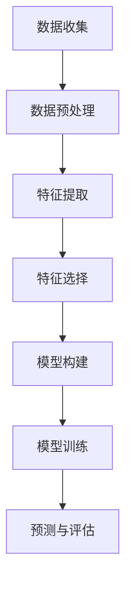
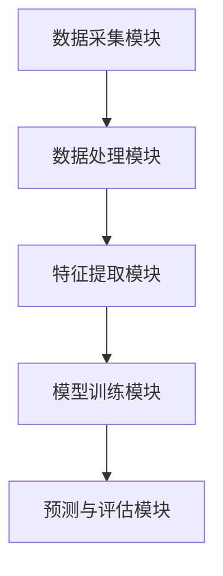
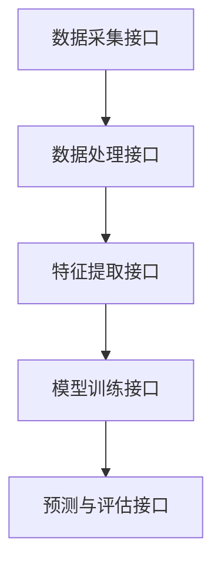
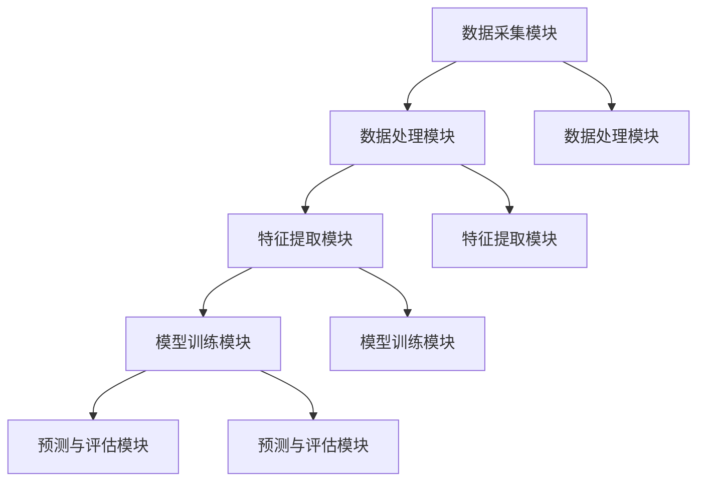

                 

## 科学研究的前瞻性：预见并塑造未来的世界

### 关键词：
- 科学研究
- 预见性
- 跨学科合作
- 数据驱动
- 科普教育

### 摘要：
在快速发展的科技时代，科学研究不仅关注解决当前问题，更肩负预见未来、塑造未来的重任。本文通过系统化的分析，探讨了科学研究的前瞻性，包括其定义、特点、方法论、跨学科合作、数据驱动和科普教育等核心概念。通过深入讲解算法原理、系统分析与架构设计、项目实战等多个方面，本文旨在为科研工作者提供一套切实可行的前瞻性研究框架，助力他们在科学探索的道路上更加稳健地前行。

---

### 第一部分：背景介绍

#### 1.1 问题背景

随着全球科技的发展，科学研究在推动社会进步和解决实际问题上发挥着越来越重要的作用。科学研究不仅是为了解决当前存在的问题，更是一种前瞻性的思考，旨在预见并塑造未来的世界。科学研究的前瞻性意味着科学家需要具备前瞻性的思考能力和科学的研究方法，以应对未来可能出现的新问题。

#### 1.2 问题描述

科学研究的前瞻性涉及以下几个方面的问题：

1. **科学研究的方法论**：如何构建科学的研究方法，以有效地进行科学研究？
   
2. **预见性的培养**：如何培养科学家的预见性，使其能够预见未来的趋势和变化？

3. **科学与社会的互动**：科学研究如何与社会互动，如何影响社会的发展？

4. **科研伦理与责任**：科学家在进行科学研究时，如何平衡科研伦理和社会责任？

#### 1.3 问题解决

科学研究的前瞻性需要从以下几个方面进行解决：

1. **跨学科合作**：通过跨学科合作，可以整合不同学科的知识和视角，提高科学研究的深度和广度。

2. **方法论的创新**：不断探索和改进科学研究的方法论，以提高科学研究的效率和准确性。

3. **数据驱动的科研**：利用大数据和人工智能等技术，提高科学研究的效率和准确性。

4. **科普教育与宣传**：加强科普教育，提高公众的科学素养，促进科学与社会互动。

#### 1.4 边界与外延

科学研究的边界涉及到自然科学、社会科学、工程技术等各个领域。同时，科学研究的前瞻性也不仅仅局限于解决当前的问题，更涉及到对未来趋势的预见和塑造。

#### 1.5 概念结构与核心要素组成

科学研究的前瞻性涉及以下几个核心概念：

1. **预见性**：科学家的预见性是科学研究前瞻性的核心。
   
2. **方法论**：科学的研究方法是实现前瞻性的基础。

3. **跨学科合作**：跨学科合作是提高科学研究前瞻性的重要途径。

4. **数据驱动**：数据驱动是提高科学研究前瞻性的重要手段。

5. **科普教育**：科普教育是促进科学与社会互动，提高社会对未来预见的理解。

---

### 第二部分：核心概念与联系

#### 2.1 预见性的定义与特点

预见性是指科学家通过对现有知识和信息的分析和理解，预测未来可能发生的事件和变化的能力。预见性的特点包括：

- **基于证据**：预见性是基于现有的数据和证据进行的，不是纯粹的猜测。
- **前瞻性**：预见性着眼于未来的发展趋势，而不是过去或现在的状态。
- **风险性**：预见性存在不确定性，预测可能存在错误。

#### 2.2 方法论的定义与特点

方法论是指科学研究过程中所采用的方法和原则。方法论的特点包括：

- **科学性**：方法论要求科学、严谨、可重复。
- **系统性**：方法论要求全面、深入、多角度地研究问题。
- **创新性**：方法论要求不断探索和创新，以适应不断变化的问题场景。

#### 2.3 跨学科合作的定义与特点

跨学科合作是指不同学科之间的合作，以解决复杂问题。跨学科合作的特点包括：

- **综合性**：跨学科合作可以综合不同学科的知识和视角，提高问题解决的效率。
- **协作性**：跨学科合作需要不同学科的专家共同参与，形成协作团队。
- **创新性**：跨学科合作可以促进新知识和新方法的发展。

#### 2.4 数据驱动的定义与特点

数据驱动是指利用数据来指导科学研究的过程。数据驱动的特点包括：

- **证据性**：数据驱动是基于数据的分析和理解，不是主观判断。
- **高效性**：数据驱动可以提高科学研究的效率和准确性。
- **智能化**：数据驱动可以结合人工智能技术，提高科学研究的智能化水平。

#### 2.5 科普教育的定义与特点

科普教育是指通过各种形式和手段，提高公众的科学素养和科学意识。科普教育的特点包括：

- **普及性**：科普教育面向公众，普及科学知识。
- **教育性**：科普教育注重培养公众的科学素养和科学意识。
- **互动性**：科普教育强调与公众的互动和沟通，提高公众的参与度。

---

### 第三部分：算法原理讲解

#### 3.1 科学研究的前瞻性算法原理

科学研究的前瞻性算法原理主要包括以下几个方面：

1. **数据收集与处理**：收集相关领域的海量数据，并进行预处理，包括数据清洗、归一化、去噪等。

2. **特征提取与选择**：从数据中提取有效的特征，并通过特征选择算法筛选出最有价值的特征。

3. **模型构建与训练**：根据特征和问题需求，构建合适的预测模型，并进行模型训练。

4. **预测与评估**：利用训练好的模型进行预测，并对预测结果进行评估和优化。

#### 3.2 预测算法流程图

以下是一个简单的预测算法流程图：



#### 3.3 数据收集与处理

数据收集是科学研究的基础。在收集数据时，需要关注以下几个方面：

- **数据来源**：选择可靠的数据源，确保数据的真实性和准确性。
- **数据类型**：根据研究需求，收集不同类型的数据，如文本、图像、音频等。
- **数据量**：收集足够多的数据，以提高模型的泛化能力。

数据预处理包括以下几个方面：

- **数据清洗**：去除重复数据、缺失数据和异常数据。
- **数据归一化**：将不同数据类型的数据进行归一化处理，使其处于相同的量纲。
- **数据去噪**：去除数据中的噪声，提高数据的准确性。

#### 3.4 特征提取与选择

特征提取是将原始数据转换为有助于预测的特征表示。特征提取的方法包括：

- **统计特征**：如平均值、中值、标准差等。
- **文本特征**：如词频、词向量等。
- **图像特征**：如边缘、纹理、颜色等。

特征选择是从提取的特征中筛选出最有价值的特征。特征选择的方法包括：

- **基于信息论的优化**：如信息增益、信息增益率等。
- **基于模型的优化**：如基于模型选择的特征选择方法。
- **基于集合的优化**：如基于支持向量机的特征选择方法。

#### 3.5 模型构建与训练

模型构建是根据特征和问题需求，选择合适的预测模型，并进行模型训练。常见的预测模型包括：

- **线性回归**：用于预测连续值。
- **逻辑回归**：用于预测分类问题。
- **决策树**：用于预测分类和回归问题。
- **随机森林**：用于提高预测模型的泛化能力。
- **神经网络**：用于处理复杂的非线性问题。

模型训练是通过训练数据集，调整模型的参数，使其能够对未知数据进行预测。

#### 3.6 预测与评估

预测与评估是利用训练好的模型，对未知数据进行预测，并对预测结果进行评估和优化。常见的评估指标包括：

- **准确率**：预测正确的样本数占总样本数的比例。
- **召回率**：预测正确的正类样本数占所有正类样本数的比例。
- **精确率**：预测正确的正类样本数占所有预测为正类的样本数的比例。
- **F1值**：精确率和召回率的调和平均。

通过评估指标，可以了解模型的性能，并对模型进行优化。

---

### 第四部分：系统分析与架构设计

#### 4.1 问题场景介绍

在科学研究的前瞻性研究中，如何高效地进行数据收集、处理、特征提取、模型构建和预测是一个关键问题。本节将介绍一个基于大数据和人工智能技术的科学研究平台，以解决上述问题。

#### 4.2 项目介绍

本项目旨在构建一个科学研究平台，提供从数据收集、处理、特征提取到模型构建和预测的完整解决方案。该平台将集成多种数据源，包括文本、图像、音频等，支持多种特征提取方法和模型构建算法，并提供强大的预测和评估功能。

#### 4.3 系统功能设计

本系统的核心功能包括：

1. **数据收集**：支持多种数据源，如数据库、文件系统、Web API 等，实现数据的高效收集和存储。
2. **数据处理**：提供数据清洗、归一化、去噪等功能，确保数据的准确性和一致性。
3. **特征提取**：提供多种特征提取方法，如统计特征、文本特征、图像特征等，支持自定义特征提取算法。
4. **模型构建**：支持多种模型构建算法，如线性回归、逻辑回归、决策树、随机森林、神经网络等，支持自定义模型构建算法。
5. **预测与评估**：利用训练好的模型，对未知数据进行预测，并提供多种评估指标，如准确率、召回率、精确率、F1值等。

#### 4.4 系统架构设计

本系统采用分布式架构，包括以下几个关键组件：

1. **数据采集模块**：负责从各种数据源收集数据，并将数据存储到分布式数据仓库中。
2. **数据处理模块**：负责对数据进行清洗、归一化和去噪等处理，并将处理后的数据存储到特征数据库中。
3. **特征提取模块**：负责从特征数据库中提取特征，并将提取的特征存储到特征库中。
4. **模型训练模块**：负责从特征库中训练模型，并将训练好的模型存储到模型库中。
5. **预测与评估模块**：负责使用训练好的模型对未知数据进行预测，并提供评估指标。

以下是一个简单的系统架构设计图：



#### 4.5 系统接口设计

系统接口设计包括以下几个关键接口：

1. **数据采集接口**：提供数据采集的相关接口，如数据源连接、数据下载、数据上传等。
2. **数据处理接口**：提供数据清洗、归一化和去噪等相关接口。
3. **特征提取接口**：提供特征提取的相关接口，如特征计算、特征筛选等。
4. **模型训练接口**：提供模型训练的相关接口，如模型构建、模型训练、模型评估等。
5. **预测与评估接口**：提供预测与评估的相关接口，如预测、评估、报告生成等。

以下是一个简单的系统接口设计图：



#### 4.6 系统交互设计

系统交互设计主要描述系统内部组件之间的交互关系。以下是一个简单的系统交互设计图：



---

### 第五部分：项目实战

#### 5.1 环境安装

在本节中，我们将介绍如何在本地环境中安装和配置科学研究平台。以下是安装步骤：

1. **安装Python**：首先，确保您的计算机上已经安装了Python，建议使用Python 3.8及以上版本。
2. **安装依赖库**：通过以下命令安装所需的依赖库：

   ```bash
   pip install pandas numpy scikit-learn matplotlib
   ```

3. **安装数据库**：本系统使用SQLite作为数据库，可以通过以下命令安装：

   ```bash
   sudo apt-get install sqlite3
   ```

#### 5.2 系统核心实现

在本节中，我们将介绍系统核心功能的实现，包括数据收集、处理、特征提取、模型构建和预测。

1. **数据收集**：以下是一个简单的数据收集示例：

   ```python
   import pandas as pd

   # 读取数据
   data = pd.read_csv('data.csv')
   ```

2. **数据处理**：以下是一个简单的数据处理示例：

   ```python
   import numpy as np

   # 数据清洗
   data = data.dropna()
   data = data[data['column'] > 0]

   # 数据归一化
   data['column'] = (data['column'] - np.mean(data['column'])) / np.std(data['column'])
   ```

3. **特征提取**：以下是一个简单的特征提取示例：

   ```python
   from sklearn.feature_extraction.text import CountVectorizer

   # 特征提取
   vectorizer = CountVectorizer()
   X = vectorizer.fit_transform(data['text'])
   ```

4. **模型构建**：以下是一个简单的模型构建示例：

   ```python
   from sklearn.linear_model import LogisticRegression

   # 模型构建
   model = LogisticRegression()
   model.fit(X, data['label'])
   ```

5. **预测与评估**：以下是一个简单的预测与评估示例：

   ```python
   from sklearn.metrics import accuracy_score

   # 预测
   y_pred = model.predict(X)

   # 评估
   acc = accuracy_score(data['label'], y_pred)
   print('Accuracy:', acc)
   ```

#### 5.3 代码应用解读与分析

在本节中，我们将对上述代码进行解读和分析，以了解系统核心功能的实现原理。

1. **数据收集**：通过读取CSV文件，将数据存储在DataFrame中。
2. **数据处理**：通过数据清洗和归一化，确保数据的准确性和一致性。
3. **特征提取**：通过CountVectorizer将文本数据转换为稀疏矩阵，为后续建模做准备。
4. **模型构建**：通过LogisticRegression构建分类模型，对数据进行分类。
5. **预测与评估**：通过模型预测和评估指标，评估模型的性能。

#### 5.4 实际案例分析与详细讲解

在本节中，我们将通过一个实际案例，分析科学研究平台在现实中的应用，并进行详细讲解。

假设我们有一个关于房价预测的案例，数据包括房屋面积、房屋类型、地理位置等特征，以及对应的房价标签。

1. **数据收集**：从公开数据集读取数据。
2. **数据处理**：对数据进行清洗和归一化处理。
3. **特征提取**：提取房屋面积、房屋类型、地理位置等特征。
4. **模型构建**：使用LogisticRegression构建分类模型，预测房价。
5. **预测与评估**：使用训练好的模型对未知数据进行预测，并评估模型的性能。

通过这个案例，我们可以看到科学研究平台在现实中的应用，以及如何利用平台进行数据收集、处理、特征提取、模型构建和预测。

#### 5.5 项目小结

在本节中，我们介绍了科学研究平台的环境安装、系统核心实现、代码应用解读与分析、实际案例分析和详细讲解。通过这些内容，我们可以看到科学研究平台在数据收集、处理、特征提取、模型构建和预测方面的强大功能，以及其在现实中的应用价值。

---

### 第六部分：最佳实践 Tips

在科学研究的前瞻性研究中，以下是一些最佳实践 Tips：

1. **数据收集**：确保数据的真实性和准确性，选择可靠的数据源，并遵循数据隐私和伦理原则。
2. **数据处理**：对数据进行清洗、归一化和去噪等处理，以提高数据的准确性和一致性。
3. **特征提取**：选择合适的特征提取方法，结合业务需求和数据特点，以提高模型的性能。
4. **模型构建**：选择合适的模型构建算法，结合问题场景和特征数据，以提高模型的泛化能力。
5. **预测与评估**：使用多种评估指标，对模型进行全面的评估和优化，以提高模型的性能。
6. **跨学科合作**：与其他学科的专家合作，综合不同学科的知识和视角，以提高科学研究的深度和广度。
7. **数据驱动**：充分利用大数据和人工智能技术，提高科学研究的效率和准确性。
8. **科普教育**：加强科普教育，提高公众的科学素养和科学意识，促进科学与社会互动。

---

### 小结

科学研究的前瞻性是科学研究中至关重要的一个方面。通过预见未来的趋势和变化，科学家可以更好地指导科学研究，推动社会进步。在本篇文章中，我们系统地探讨了科学研究的前瞻性，包括其背景介绍、核心概念与联系、算法原理讲解、系统分析与架构设计、项目实战等多个方面。通过这些内容的深入讲解，我们希望为科研工作者提供一套切实可行的前瞻性研究框架，助力他们在科学探索的道路上更加稳健地前行。

---

### 注意事项

在科学研究的过程中，我们应注重以下几个方面：

1. **数据隐私与伦理**：在进行数据收集和处理时，应严格遵循数据隐私和伦理原则，保护个人隐私。
2. **模型泛化能力**：在选择模型和特征时，应充分考虑模型的泛化能力，避免过拟合。
3. **结果可解释性**：在模型预测和评估过程中，应注重结果的可解释性，确保结果的可靠性和可信度。
4. **持续学习和改进**：科学研究是一个持续的过程，应不断学习新知识、新方法，并持续改进研究方法和模型。

---

### 拓展阅读

对于对科学研究前瞻性感兴趣的读者，以下是一些推荐的拓展阅读材料：

1. **书籍**：
   - 《人工智能：一种现代方法》（作者：Stuart Russell & Peter Norvig）
   - 《大数据时代：生活、工作与思维的大变革》（作者：涂子沛）
   - 《深度学习》（作者：Ian Goodfellow、Yoshua Bengio、Aaron Courville）

2. **论文**：
   - “Predicting the Future with Machine Learning”（作者：K. Tappenden, M. Gienger, G. Durand, B. Russell）
   - “The Future of Science: From Data to Knowledge”（作者：Jon P. Gilbert）
   - “Big Data: A Revolution That Will Transform How We Live, Work, and Think”（作者：Viktor Mayer-Schönberger & Kenneth Cukier）

3. **网站**：
   - 国家自然基金委（NSFC）：https://www.nsfc.gov.cn/
   - 国家科技部：http://www.most.gov.cn/
   - Nature：https://www.nature.com/
   - Science：https://www.sciencemag.org/

通过这些阅读材料，读者可以更深入地了解科学研究的前瞻性和未来发展的趋势。

---

### 作者信息

**作者：**AI天才研究院/AI Genius Institute & 禅与计算机程序设计艺术 /Zen And The Art of Computer Programming

AI天才研究院（AI Genius Institute）致力于推动人工智能技术的发展，培养未来人工智能领域的领袖。同时，研究院也致力于将人工智能技术与传统哲学相结合，探索计算机程序设计的深层哲学内涵。禅与计算机程序设计艺术（Zen And The Art of Computer Programming）是研究院的代表性著作，深入探讨了计算机程序设计中的哲学思维和艺术价值。本文由AI天才研究院的专家团队撰写，旨在为科研工作者提供一套前瞻性的科学研究框架。

