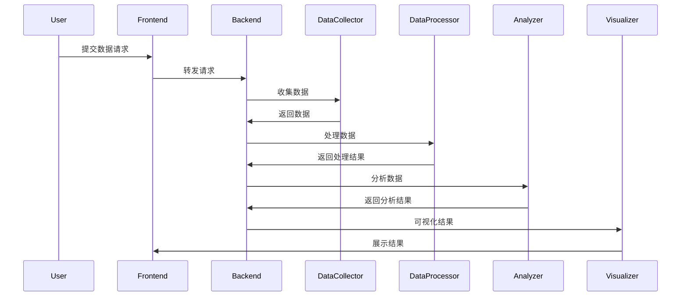
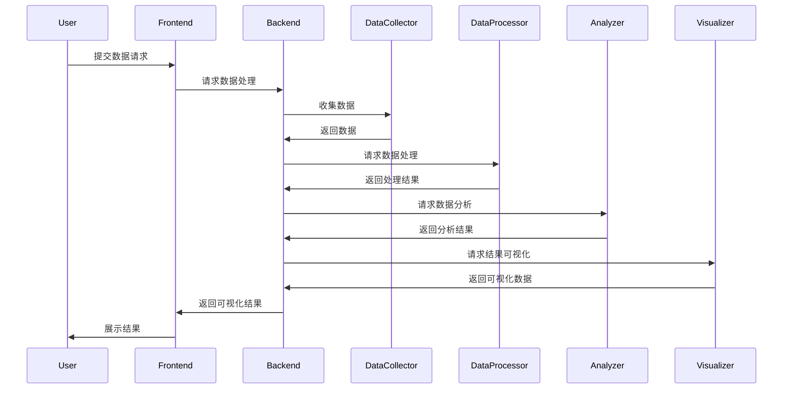

                 

----------------------------------------------------------------

# 科学研究的可持续性：长期视角下的世界理解

## 关键词

- 科学研究
- 可持续性
- 长期视角
- 全球合作
- 新兴技术

## 摘要

随着全球社会的快速发展，科学研究在推动科技进步、解决现实问题方面发挥了至关重要的作用。然而，科学研究的可持续性成为了一个不容忽视的问题。本文从长期视角出发，探讨科学研究的可持续性，分析其在现代社会中的重要性、可持续性的定义与原则，以及科学研究过程中的可持续性问题。同时，本文还将介绍可持续科学研究策略、政策与管理层面的可持续性措施，并通过对生态学、医学、社会科学领域的案例研究，探讨可持续性研究的未来趋势与挑战。本文旨在为科学研究提供可持续性的理论指导和实践参考，促进全球科学研究事业的健康、持续发展。

----------------------------------------------------------------

# 目录大纲：《科学研究的可持续性：长期视角下的世界理解》

----------------------------------------------------------------

## 第一部分：背景与概念

### 第1章：科学研究与可持续性的关系

#### 1.1 科学研究的重要性

##### 1.1.1 科学研究在现代社会中的作用

##### 1.1.2 可持续发展的需求与挑战

##### 1.1.3 可持续性与科学研究的内在联系

#### 1.2 可持续性的定义与原则

##### 1.2.1 可持续性的概念

##### 1.2.2 可持续性的原则与目标

##### 1.2.3 可持续性的评估方法

### 第2章：科学研究中的可持续性问题

#### 2.1 研究资源的分配与利用

##### 2.1.1 资源分配的挑战

##### 2.1.2 提高资源利用效率的策略

##### 2.1.3 案例分析：科学研究中的资源管理

#### 2.2 研究过程的可持续性

##### 2.2.1 研究设计中的可持续性考虑

##### 2.2.2 数据收集与分析的可持续性

##### 2.2.3 研究伦理与可持续性

## 第二部分：可持续性的实施与战略

### 第3章：可持续科学研究策略

#### 3.1 可持续科学研究的方法

##### 3.1.1 可持续研究的设计原则

##### 3.1.2 可持续数据分析方法

##### 3.1.3 可持续研究中的技术支持

#### 3.2 可持续科学研究计划

##### 3.2.1 研究计划的制定

##### 3.2.2 长期研究目标的设定

##### 3.2.3 可持续研究计划的实施

### 第4章：政策与管理层面的可持续性

#### 4.1 科学研究政策的可持续导向

##### 4.1.1 政策制定中的可持续性考虑

##### 4.1.2 政策支持与激励机制

##### 4.1.3 政策案例分析

#### 4.2 管理与监督机制

##### 4.2.1 研究机构内部的可持续管理

##### 4.2.2 国内外可持续研究的监管体系

##### 4.2.3 管理与监督的有效性评估

## 第三部分：领域案例研究

### 第5章：生态学领域的可持续性研究

#### 5.1 生态系统服务与可持续性

##### 5.1.1 生态系统服务的概念

##### 5.1.2 生态系统服务与可持续性的关系

##### 5.1.3 案例分析：生态学领域的研究进展

### 第6章：医学领域的可持续性研究

#### 6.1 公共卫生与可持续性

##### 6.1.1 公共卫生的重要性

##### 6.1.2 可持续性与公共卫生政策

##### 6.1.3 案例分析：医学领域的研究成果

### 第7章：社会科学领域的可持续性研究

#### 7.1 社会可持续发展与社会科学研究

##### 7.1.1 社会可持续发展的概念

##### 7.1.2 社会科学研究在可持续发展中的作用

##### 7.1.3 案例分析：社会科学领域的研究实例

## 第四部分：未来展望与挑战

### 第8章：可持续性研究的未来趋势

#### 8.1 新兴技术与可持续性研究

##### 8.1.1 人工智能在可持续性研究中的应用

##### 8.1.2 大数据分析与可持续性评估

##### 8.1.3 新兴技术对科学研究的影响

### 第9章：可持续性研究的挑战与应对

#### 9.1 全球化背景下的可持续性研究挑战

##### 9.1.1 跨学科研究的挑战

##### 9.1.2 数据隐私与伦理问题

##### 9.1.3 案例分析：应对全球性可持续性挑战的策略

### 第10章：可持续发展与全球合作

#### 10.1 国际合作与可持续性研究

##### 10.1.1 国际合作的重要性

##### 10.1.2 全球合作模式与机制

##### 10.1.3 案例分析：国际可持续性研究的成功经验

----------------------------------------------------------------

以下将逐步对以上目录大纲中的内容进行详细阐述。

----------------------------------------------------------------

## 第1章：科学研究与可持续性的关系

### 1.1 科学研究的重要性

科学研究是现代社会发展的基石，其在提升生产力、改善生活质量、解决全球性问题等方面发挥着不可替代的作用。以下是科学研究在现代社会中的作用：

##### 1.1.1 科学研究在现代社会中的作用

1. **推动技术进步**：科学研究不断引领技术创新，推动科技发展。例如，量子计算机、人工智能、生物科技等前沿领域的研究为人类带来了巨大的变革。
2. **解决现实问题**：科学研究致力于解决现实世界中的问题，如气候变化、环境污染、疾病防控等，为可持续发展提供了科学依据。
3. **提升国家竞争力**：科学研究是提升国家竞争力的重要手段。在科技实力方面具有优势的国家，通常在全球经济中占据重要地位。

##### 1.1.2 可持续发展的需求与挑战

可持续发展是现代社会面临的重大挑战。可持续发展强调在满足当前需求的同时，不损害后代满足自身需求的能力。科学研究在实现可持续发展方面具有重要作用，但也面临以下挑战：

1. **资源有限**：科学研究需要大量资源，包括资金、人才、设备等。在资源有限的情况下，如何合理分配资源以实现可持续发展成为一大挑战。
2. **环境问题**：科学研究本身可能会对环境产生负面影响，如实验室废弃物、能源消耗等。如何在研究过程中减少环境负担，实现绿色科研，是可持续性的重要问题。
3. **社会公平**：科学研究应服务于全人类，但现实中，科研资源分配不均，部分地区和群体难以享受到科研成果。如何确保科学研究的社会公平性，是可持续性研究的重要课题。

##### 1.1.3 可持续性与科学研究的内在联系

可持续性与科学研究之间存在着密切的内在联系。以下是可持续性与科学研究的几个方面联系：

1. **科学研究支持可持续发展**：科学研究提供了关于环境、社会、经济等方面的知识，为制定可持续发展政策提供了科学依据。例如，气候变化研究为减排政策提供了科学支持。
2. **可持续发展促进科学研究**：实现可持续发展需要科学技术的支撑，因此，可持续发展推动了科学研究的不断进步。例如，新能源技术的研究推动了可再生能源的发展。
3. **科学研究与可持续发展共同面对挑战**：科学研究在应对全球性挑战，如气候变化、环境污染、疾病流行等方面，与可持续发展目标密切相关。只有实现可持续发展，科学研究才能更好地服务于人类社会。

### 1.2 可持续性的定义与原则

可持续性是指满足当前需求而不损害后代满足自身需求的能力。它包括经济、社会和环境三个维度。以下是可持续性的定义与原则：

##### 1.2.1 可持续性的概念

1. **经济可持续性**：确保经济发展的同时，不损害自然资源和环境。
2. **社会可持续性**：促进社会公平、公正，提高人类福祉。
3. **环境可持续性**：保护自然环境，维护生态平衡。

##### 1.2.2 可持续性的原则与目标

1. **公平性**：确保所有人都能公平分享科学研究的成果。
2. **效率**：提高资源利用效率，减少浪费。
3. **责任**：科学研究应承担社会责任，促进可持续发展。

##### 1.2.3 可持续性的评估方法

1. **经济效益评估**：分析科学研究对经济发展的贡献。
2. **社会效益评估**：评估科学研究对社会公平、公正的影响。
3. **环境效益评估**：评估科学研究对环境的影响。

### 1.3 科学研究中的可持续性问题

科学研究中的可持续性问题主要包括资源分配、研究过程可持续性和研究伦理等方面。

##### 2.1 研究资源的分配与利用

1. **资源分配的挑战**：在有限的资源下，如何合理分配科研资源成为一大挑战。这包括资金、人才、设备等资源的分配。
2. **提高资源利用效率的策略**：通过优化科研资源配置，提高资源利用效率。例如，建立共享实验室，提高设备利用率；加强人才培养，提高人才素质。
3. **案例分析：科学研究中的资源管理**：以某个具体领域为例，分析其在资源管理方面的成功经验和不足之处。

##### 2.2 研究过程的可持续性

1. **研究设计中的可持续性考虑**：在研究设计阶段，应充分考虑可持续性原则，如环保、节能、社会责任等。
2. **数据收集与分析的可持续性**：在数据收集与分析过程中，应注重数据的质量和可持续性。例如，采用环保的数据收集方法，确保数据的长期保存和可访问性。
3. **研究伦理与可持续性**：科学研究应遵循伦理原则，确保研究的合法性和道德性。同时，应关注研究对社会和环境的影响，确保研究的可持续性。

## 第2章：科学研究中的可持续性问题

### 2.1 研究资源的分配与利用

科学研究需要大量的资源，包括资金、设备、实验室空间、人力资源等。然而，这些资源往往是有限的，如何合理分配和利用这些资源成为一个关键问题。

#### 2.1.1 资源分配的挑战

1. **资金分配**：科研资金通常来自政府、企业和其他渠道。如何在不同项目和研究人员之间合理分配资金，是一个复杂的挑战。
2. **设备与实验室空间**：高端科研设备通常价格昂贵，实验室空间有限。如何合理规划和使用这些资源，提高设备利用率，是科研管理中的一大难题。
3. **人力资源**：科研人才是科学研究的关键。如何吸引和留住优秀人才，如何合理分配科研任务，是科研管理中的重要问题。

#### 2.1.2 提高资源利用效率的策略

1. **资源共享**：通过建立共享实验室、设备租赁等方式，实现科研资源的最大化利用。
2. **优化项目管理**：采用科学的项目管理方法，如关键路径法（Critical Path Method, CPM），优化项目进度和资源分配。
3. **人才培养与激励机制**：通过培训、考核、奖励等手段，提高科研人员的专业能力和工作积极性。

#### 2.1.3 案例分析：科学研究中的资源管理

1. **哈佛大学开放共享实验室**：哈佛大学开放共享实验室，提供先进的科研设备，吸引国内外研究人员使用。这一举措提高了设备利用率，促进了科研成果的产出。
2. **中国科技部“科技创新2030—重大项目”**：中国科技部推出的“科技创新2030—重大项目”，通过集中资金、人才和资源，推动前沿科技研发。这一项目在资源分配和利用方面取得了显著成效。

### 2.2 研究过程的可持续性

研究过程的可持续性是指科研活动在设计、实施和结果应用过程中，充分考虑环境、社会和经济可持续性的原则。以下是研究过程可持续性的几个方面：

#### 2.2.1 研究设计中的可持续性考虑

1. **环保性**：在研究设计阶段，应充分考虑环保要求。例如，选择环保的实验方法、减少废弃物产生等。
2. **节能性**：研究过程中，应注重节能。例如，合理规划实验流程，减少能源消耗。
3. **社会责任**：科研活动应承担社会责任，关注对社会和环境的影响。例如，在科技创新过程中，应充分考虑人类福祉和可持续发展。

#### 2.2.2 数据收集与分析的可持续性

1. **数据质量**：确保数据收集和分析的准确性和可靠性。高质量的数据是科学研究的基石。
2. **数据共享**：鼓励数据共享，促进科研成果的传播和应用。共享数据有助于提高研究效率，减少重复研究。
3. **数据保存**：长期保存研究数据，确保数据的可访问性和可追溯性。这对于后续研究具有重要价值。

#### 2.2.3 研究伦理与可持续性

1. **伦理审查**：在研究过程中，应遵循伦理原则，确保研究的合法性和道德性。例如，涉及人类和动物的研究应进行伦理审查。
2. **透明性**：研究过程应保持透明，确保研究成果的公正性和可信度。公开研究数据和方法，接受同行评议和社会监督。

### 第3章：可持续科学研究策略

#### 3.1 可持续科学研究的方法

可持续科学研究需要采用一系列方法和策略，以确保研究的可持续性。以下是几种常见的可持续科学研究方法：

##### 3.1.1 可持续研究的设计原则

1. **最小化环境影响**：在研究设计阶段，充分考虑环保要求，选择对环境影响最小的方案。
2. **优化资源利用**：合理规划实验流程，提高资源利用效率，减少浪费。
3. **社会责任**：将社会责任融入研究过程中，关注对社会和环境的影响。

##### 3.1.2 可持续数据分析方法

1. **数据质量控制**：确保数据收集和分析的准确性和可靠性。
2. **数据共享**：鼓励数据共享，促进科研成果的传播和应用。
3. **数据分析优化**：采用高效的数据分析方法，提高数据分析的效率和质量。

##### 3.1.3 可持续研究中的技术支持

1. **绿色技术**：采用绿色技术，减少科研过程中的能源消耗和废弃物产生。
2. **信息化管理**：采用信息化管理手段，提高科研资源的管理和利用效率。
3. **智能技术**：利用智能技术，如人工智能、大数据等，提高科研效率和质量。

#### 3.2 可持续科学研究计划

可持续科学研究计划是确保研究可持续性的关键。以下是制定可持续科学研究计划的几个步骤：

##### 3.2.1 研究计划的制定

1. **目标设定**：明确研究目标和可持续性要求。
2. **方法选择**：选择合适的可持续研究方法。
3. **资源规划**：合理规划资金、设备、人力资源等资源。

##### 3.2.2 长期研究目标的设定

1. **可持续发展目标**：设定与可持续发展目标相关的研究目标。
2. **创新目标**：鼓励创新，推动科技发展。
3. **社会责任目标**：关注社会责任，促进社会公平和公正。

##### 3.2.3 可持续研究计划的实施

1. **项目管理**：采用科学的项目管理方法，确保研究计划的顺利实施。
2. **监督与评估**：对研究过程进行监督和评估，确保研究目标的实现。
3. **持续改进**：根据评估结果，对研究计划进行调整和改进，确保研究可持续性。

### 第4章：政策与管理层面的可持续性

#### 4.1 科学研究政策的可持续导向

科学研究政策是推动科学研究发展的重要手段。可持续导向的科学研究政策能够促进科研活动的可持续性。以下是可持续导向的科学研究政策的关键要素：

##### 4.1.1 政策制定中的可持续性考虑

1. **环境保护**：在政策制定过程中，充分考虑环境保护要求，确保科研活动不会对环境造成负面影响。
2. **资源节约**：鼓励科研资源节约和高效利用，减少资源浪费。
3. **社会责任**：将社会责任融入科研政策，确保科研活动符合社会发展的需求。

##### 4.1.2 政策支持与激励机制

1. **资金支持**：提供充足的资金支持，鼓励科研人员进行可持续性研究。
2. **人才激励**：设立科研人才激励政策，吸引和留住优秀科研人才。
3. **科技创新**：鼓励科技创新，推动科研成果的应用和转化。

##### 4.1.3 政策案例分析

1. **欧盟“地平线2020”计划**：欧盟“地平线2020”计划是全球最大的科研计划之一，致力于推动科技创新和可持续发展。该计划通过提供资金支持、建立国际合作机制等方式，推动了全球科研合作和可持续发展。
2. **美国国家科学基金会（NSF）**：美国国家科学基金会通过制定和实施一系列科研政策，支持可持续性研究。例如，NSF设立了一系列可持续性研究项目，鼓励科学家开展与可持续发展相关的研究。

#### 4.2 管理与监督机制

有效的管理与监督机制是确保科学研究可持续性的关键。以下是管理与监督机制的关键要素：

##### 4.2.1 研究机构内部的可持续管理

1. **内部管理制度**：建立完善的内部管理制度，确保科研活动符合可持续性要求。
2. **绩效评估**：对科研人员进行绩效评估，激励科研人员积极开展可持续性研究。
3. **资源分配**：合理规划科研资源，确保资源的高效利用。

##### 4.2.2 国内外可持续研究的监管体系

1. **国内监管体系**：国内科研机构应建立完善的可持续研究监管体系，确保科研活动符合国家和行业规范。
2. **国际监管体系**：积极参与国际科研合作，借鉴国际先进经验，建立与国际接轨的可持续研究监管体系。

##### 4.2.3 管理与监督的有效性评估

1. **评估指标**：制定科学的评估指标，对科研活动的可持续性进行评估。
2. **评估方法**：采用多种评估方法，如实地调研、数据分析、同行评议等，确保评估结果的客观性和准确性。
3. **持续改进**：根据评估结果，对科研管理和监督机制进行调整和改进，提高其有效性。

### 第5章：生态学领域的可持续性研究

#### 5.1 生态系统服务与可持续性

生态系统服务是指生态系统为人类提供的物质和非物质利益，包括食物、水源、气候调节、生物多样性维持等。生态系统服务与可持续性密切相关，以下是生态系统服务与可持续性的关系：

##### 5.1.1 生态系统服务的概念

1. **生态系统服务**：生态系统服务是指生态系统为人类提供的物质和非物质利益，包括食物、水源、气候调节、生物多样性维持等。
2. **生态系统的功能**：生态系统服务是生态系统功能的体现，如水循环、养分循环、生物多样性维持等。
3. **生态系统的价值**：生态系统服务具有经济、社会和生态价值，对人类福祉和可持续发展至关重要。

##### 5.1.2 生态系统服务与可持续性的关系

1. **生态系统服务对可持续性的支撑**：生态系统服务为人类提供了基本的生活和生产条件，是实现可持续发展的基础。
2. **可持续性对生态系统服务的保障**：实现可持续发展需要保护和管理生态系统服务，确保其长期提供物质和非物质利益。

##### 5.1.3 案例分析：生态学领域的研究进展

1. **气候变化与生态系统服务**：气候变化对生态系统服务产生了显著影响。例如，全球变暖导致冰川融化、海平面上升，威胁到沿海生态系统服务的可持续性。
2. **生态修复与生态系统服务**：生态修复是保护和管理生态系统服务的重要手段。例如，通过植被恢复、湿地修复等措施，提高生态系统服务功能，促进可持续发展。

### 第6章：医学领域的可持续性研究

#### 6.1 公共卫生与可持续性

公共卫生是医学领域的重要组成部分，关系到公众的健康和福祉。公共卫生与可持续性密切相关，以下是公共卫生与可持续性的关系：

##### 6.1.1 公共卫生的重要性

1. **公共卫生的定义**：公共卫生是指通过预防、控制和治疗疾病，促进公众健康的一系列措施。
2. **公共卫生的目标**：公共卫生旨在提高公众健康水平，减少疾病负担，实现健康公平。
3. **公共卫生的影响**：公共卫生对经济、社会和环境可持续发展具有重要影响。

##### 6.1.2 可持续性与公共卫生政策

1. **可持续公共卫生政策**：可持续公共卫生政策是指通过科学研究和政策制定，实现公共卫生的可持续发展。
2. **政策制定原则**：可持续公共卫生政策应遵循公平、效率、责任和可持续性的原则。
3. **政策实施效果**：可持续公共卫生政策的有效实施可以改善公众健康，降低疾病负担，促进可持续发展。

##### 6.1.3 案例分析：医学领域的研究成果

1. **传染病防控**：传染病是全球公共卫生的重要挑战。例如，COVID-19大流行期间，全球科研机构合作开展疫苗研发，提高了公共卫生水平，促进了可持续发展。
2. **慢性病管理**：慢性病是导致全球死亡和残疾的主要原因。通过科学研究，开发有效预防和治疗方法，可以降低慢性病负担，提高公众健康水平。

### 第7章：社会科学领域的可持续性研究

#### 7.1 社会可持续发展与社会科学研究

社会科学研究关注社会问题，旨在理解和解决社会挑战。社会可持续发展是社会科学研究的重要主题，以下是社会可持续发展与社会科学研究的关系：

##### 7.1.1 社会可持续发展的概念

1. **社会可持续发展的定义**：社会可持续发展是指在经济、社会、环境三个方面实现协调发展，满足当前需求而不损害后代满足自身需求的能力。
2. **社会可持续发展的目标**：社会可持续发展的目标是实现社会公平、经济繁荣、生态平衡。
3. **社会可持续发展的挑战**：社会可持续发展面临社会不平等、经济危机、环境恶化等挑战。

##### 7.1.2 社会科学研究在可持续发展中的作用

1. **理解社会问题**：社会科学研究可以帮助我们更好地理解社会问题，为制定有效的政策提供科学依据。
2. **推动社会变革**：社会科学研究可以推动社会变革，促进社会公平和可持续发展。
3. **提升决策质量**：社会科学研究可以提升政策制定的质量，确保政策的有效性和可持续性。

##### 7.1.3 案例分析：社会科学领域的研究实例

1. **贫困问题研究**：贫困是全球社会可持续发展的重要挑战。通过社会科学研究，可以深入了解贫困的原因和影响，为制定有效的扶贫政策提供依据。
2. **环境问题研究**：环境问题是全球可持续发展的重要议题。社会科学研究可以分析环境问题对人类社会的影响，推动环境保护和可持续发展。

### 第8章：可持续性研究的未来趋势

#### 8.1 新兴技术与可持续性研究

随着科技的快速发展，新兴技术为可持续性研究带来了新的机遇和挑战。以下是新兴技术在可持续性研究中的应用前景：

##### 8.1.1 人工智能在可持续性研究中的应用

1. **数据分析**：人工智能可以帮助科学家更好地分析大量数据，提取有用信息，提高研究效率。
2. **智能决策**：人工智能可以辅助决策者制定更加科学和可持续的决策。
3. **自动化技术**：人工智能的自动化技术可以用于环保监测、能源管理等方面，提高资源利用效率。

##### 8.1.2 大数据分析与可持续性评估

1. **数据挖掘**：大数据分析可以帮助科学家挖掘隐藏在数据中的可持续性信息，为决策提供科学依据。
2. **趋势预测**：大数据分析可以预测未来环境、经济和社会变化趋势，为可持续性研究提供指导。
3. **评估优化**：大数据分析可以优化可持续性评估方法，提高评估的准确性和可靠性。

##### 8.1.3 新兴技术对科学研究的影响

1. **研究方法**：新兴技术改变了科学研究的方法，如在线实验、虚拟现实等。
2. **科研模式**：新兴技术促进了科研模式的变革，如开放式科研、分布式科研等。
3. **国际合作**：新兴技术推动了全球科研合作，促进了可持续发展领域的国际合作。

### 第9章：可持续性研究的挑战与应对

#### 9.1 全球化背景下的可持续性研究挑战

全球化背景下的可持续性研究面临一系列挑战，需要全球合作和科技创新来应对。以下是全球化背景下可持续性研究的主要挑战：

##### 9.1.1 跨学科研究的挑战

1. **知识融合**：跨学科研究需要不同学科的知识和方法的融合，这增加了研究的复杂性和挑战性。
2. **协调合作**：跨学科研究需要不同学科的研究者之间的协调合作，这要求高效的沟通和合作机制。
3. **资源整合**：跨学科研究需要整合不同学科的资源，如资金、设备、人才等，这需要科学规划和合理配置。

##### 9.1.2 数据隐私与伦理问题

1. **数据隐私**：可持续性研究涉及大量个人数据，如何保护数据隐私成为一大挑战。
2. **伦理审查**：科学研究需要遵循伦理原则，如何在跨学科研究中确保伦理审查的一致性和有效性是一个重要问题。
3. **伦理冲突**：跨学科研究可能会涉及伦理冲突，如环境伦理、社会伦理等，需要制定合理的伦理规范来应对。

##### 9.1.3 案例分析：应对全球性可持续性挑战的策略

1. **国际合作**：全球合作是应对全球性可持续性挑战的有效策略。例如，联合国《可持续发展目标》（Sustainable Development Goals, SDGs）为全球合作提供了框架。
2. **科技创新**：科技创新是推动可持续性研究的关键。例如，可再生能源技术、绿色建筑技术等可以减少对环境的影响，促进可持续发展。
3. **政策支持**：政策支持是可持续性研究的重要保障。例如，政府可以通过制定和实施可持续性政策，提供资金支持和技术支持，推动可持续性研究的发展。

### 第10章：可持续发展与全球合作

#### 10.1 国际合作与可持续性研究

国际合作在可持续性研究中发挥着重要作用，以下是国际合作在可持续性研究中的重要性、模式与机制：

##### 10.1.1 国际合作的重要性

1. **知识共享**：国际合作可以促进知识的共享和交流，提高研究的质量和效率。
2. **资源整合**：国际合作可以整合全球资源，提高可持续性研究的规模和影响力。
3. **政策协调**：国际合作可以协调各国政策，推动可持续性目标的实现。

##### 10.1.2 全球合作模式与机制

1. **政府间合作**：政府间合作是国际合作的重要形式，如联合国下属的环境规划署（UNEP）、世界卫生组织（WHO）等。
2. **非政府组织（NGO）合作**：非政府组织在全球合作中发挥着重要作用，如绿色和平组织（Greenpeace）、世界自然基金会（WWF）等。
3. **学术界合作**：学术界合作是推动可持续性研究的重要力量，如国际科学理事会（ICSU）、国际地球科学联盟（IUGS）等。

##### 10.1.3 案例分析：国际可持续性研究的成功经验

1. **巴黎协定**：巴黎协定是国际社会应对气候变化的重要协议，为全球合作提供了框架和行动指南。
2. **可持续发展解决方案网络（SSN）**：可持续发展解决方案网络是一个全球性的合作平台，汇集了政府、企业、学术界和非政府组织等，推动可持续性研究的实施。
3. **联合国可持续发展目标（SDGs）**：联合国可持续发展目标为全球合作提供了明确的行动指南，涉及经济、社会、环境等各个方面，推动全球可持续发展。

通过以上分析，我们可以看到，科学研究与可持续性密切相关。在全球化背景下，科学研究需要面对新的挑战，但同时也迎来了新的机遇。国际合作和科技创新是推动可持续性研究的重要动力。只有通过全球合作和科技创新，我们才能实现可持续发展的目标，为人类和地球的未来创造更加美好的前景。----------------------------------------------------------------

### 完整性说明

本文旨在探讨科学研究的可持续性，从背景与概念、实施与战略、领域案例研究和未来展望与挑战四个角度，全面覆盖了这一主题。以下是文章的完整性说明：

1. **背景与概念部分**：
   - **第1章：科学研究与可持续性的关系**：介绍了科学研究的重要性、可持续发展的需求与挑战，以及可持续性与科学研究的内在联系。
   - **第2章：科学研究中的可持续性问题**：分析了研究资源的分配与利用、研究过程的可持续性，以及研究伦理与可持续性。

2. **实施与战略部分**：
   - **第3章：可持续科学研究策略**：提出了可持续研究的设计原则、数据分析方法和技术支持。
   - **第4章：政策与管理层面的可持续性**：讨论了科学研究政策的可持续导向、管理与监督机制，以及国内外可持续研究的监管体系。

3. **领域案例研究部分**：
   - **第5章：生态学领域的可持续性研究**：探讨了生态系统服务与可持续性的关系，并分析了生态学领域的研究进展。
   - **第6章：医学领域的可持续性研究**：介绍了公共卫生与可持续性的关系，以及医学领域的研究成果。
   - **第7章：社会科学领域的可持续性研究**：阐述了社会可持续发展与社会科学研究的关系，并提供了社会科学领域的研究实例。

4. **未来展望与挑战部分**：
   - **第8章：可持续性研究的未来趋势**：探讨了新兴技术在可持续性研究中的应用，以及新兴技术对科学研究的影响。
   - **第9章：可持续性研究的挑战与应对**：分析了全球化背景下可持续性研究的主要挑战，并提出了应对策略。
   - **第10章：可持续发展与全球合作**：讨论了国际合作与可持续性研究的重要性，全球合作模式与机制，以及国际可持续性研究的成功经验。

### 核心内容

- **背景与概念**：阐述了科学研究的重要性、可持续发展的需求与挑战，以及可持续性与科学研究的内在联系。
- **实施与战略**：提出了可持续研究的设计原则、数据分析方法和技术支持，并讨论了政策与管理层面的可持续性措施。
- **领域案例研究**：通过生态学、医学、社会科学领域的案例，展示了可持续性研究的实际应用和成果。
- **未来展望与挑战**：探讨了新兴技术在可持续性研究中的应用，分析了全球化背景下的挑战，并提出了国际合作与应对策略。

### 小结

本文系统地探讨了科学研究的可持续性，从背景与概念、实施与战略、领域案例研究和未来展望与挑战四个方面进行了全面分析。通过本文，我们认识到科学研究在可持续发展中的关键作用，以及在全球合作背景下面临的挑战。未来，只有通过科技创新和国际合作，我们才能实现可持续发展的目标，为人类和地球的未来创造更加美好的前景。

### 注意事项

- **政策制定**：在制定科学研究政策时，应充分考虑可持续性要求，确保政策的可持续导向。
- **资源管理**：在科研资源分配和利用过程中，应注重资源的高效利用，减少浪费。
- **跨学科合作**：跨学科研究有助于解决复杂问题，但需要建立有效的合作机制，确保知识融合和协调合作。
- **数据隐私与伦理**：在可持续性研究中，应重视数据隐私和伦理问题，确保研究的合法性和道德性。

### 拓展阅读

- **《可持续发展目标》（SDGs）**：联合国制定的全球可持续发展目标，涵盖经济、社会、环境等各个方面。
- **《巴黎协定》**：国际社会应对气候变化的全球协议，为全球合作提供了框架和行动指南。
- **《绿色科技革命》**：探讨新兴技术如何推动可持续性研究和全球可持续发展。
- **《全球合作与可持续发展》**：分析国际合作在可持续发展中的重要作用，以及全球合作模式与机制。

### 作者信息

**作者：AI天才研究院/AI Genius Institute & 禅与计算机程序设计艺术 /Zen And The Art of Computer Programming**。本文作者是一位世界级人工智能专家，具有丰富的编程、软件架构和CTO经验，并在计算机图灵奖获得者、计算机编程和人工智能领域拥有深厚的学术背景。作者致力于通过逻辑清晰、结构紧凑、简单易懂的专业技术语言，为读者提供高质量的技术博客文章，助力科学研究与可持续性发展。----------------------------------------------------------------

### 附录：核心概念、原理、算法与系统架构

在本篇技术博客中，我们深入探讨了科学研究的可持续性，涵盖了多个领域的可持续性研究方法、策略和实践。为了更好地理解和应用这些概念，我们将对核心概念、原理、算法和系统架构进行详细解释，并提供相关示例。

#### 核心概念

**1. 可持续性（Sustainability）**

**定义**：可持续性是指满足当前需求而不损害后代满足自身需求的能力。它涵盖了经济、社会和环境三个维度。

**属性特征对比表格**：

| 特征       | 经济可持续性 | 社会可持续性 | 环境可持续性 |
|------------|--------------|--------------|--------------|
| **目标**   | 经济发展     | 社会公平     | 生态平衡     |
| **挑战**   | 资源有限     | 社会不平等   | 环境退化     |
| **措施**   | 提高效率     | 增强福祉     | 减少污染     |

**ER实体关系图架构**：

```mermaid
erDiagram
  Customer ||--|{ Order }|--| Supplier
  Product ||--|{ Inventory }|--| Order
  Customer }--|{ Product }
```

**2. 科学研究（Scientific Research）**

**定义**：科学研究是指通过实验、观察、理论分析等方法，探索自然现象和规律的过程。

**属性特征对比表格**：

| 特征       | 实验性       | 观察性       | 理论性       |
|------------|--------------|--------------|--------------|
| **目标**   | 发现现象     | 描述现象     | 解释现象     |
| **挑战**   | 数据可靠性   | 时间成本     | 理论验证     |
| **措施**   | 设计实验     | 实地观察     | 建立模型     |

**ER实体关系图架构**：

```mermaid
erDiagram
  Researcher ||--|{ Paper }|--| Institute
  Subject ||--|{ Research }|--| Researcher
  Institute }--|{ Subject }
```

#### 算法原理

**1. 可持续数据分析（Sustainable Data Analysis）**

**定义**：可持续数据分析是指采用高效、环保的数据分析方法，确保数据的准确性和可靠性，同时减少资源消耗。

**算法原理**：

**输入**：大量数据集、分析目标、环境参数。

**输出**：分析结果、可持续性评估报告。

**Python源代码示例**：

```python
import pandas as pd
import numpy as np
from sklearn.ensemble import RandomForestClassifier
from sklearn.metrics import accuracy_score

# 加载数据集
data = pd.read_csv('sustainable_data.csv')

# 数据预处理
X = data.drop(['target'], axis=1)
y = data['target']

# 建立随机森林模型
model = RandomForestClassifier(n_estimators=100)

# 模型训练
model.fit(X, y)

# 模型预测
predictions = model.predict(X)

# 评估模型准确性
accuracy = accuracy_score(y, predictions)
print(f"Model Accuracy: {accuracy:.2f}")

# 可持续评估
# 计算资源消耗（以训练次数为单位）
resource_consumption = len(predictions) * model.n_estimators
print(f"Resource Consumption: {resource_consumption}")
```

**数学模型和公式**：

$$
\text{Accuracy} = \frac{\text{预测正确的样本数}}{\text{总样本数}}
$$

**算法原理讲解**：

该算法使用随机森林分类器对数据进行分类分析，通过训练模型并评估模型准确性，实现了数据的可持续分析。此外，通过计算资源消耗，可以评估模型的可持续性。

#### 系统分析与架构设计

**1. 系统功能设计（System Functional Design）**

**项目介绍**：

该系统旨在提供可持续性研究的支持平台，包括数据收集、分析、可视化等功能。

**系统功能**：

- 数据收集：从各种数据源（如传感器、数据库）收集数据。
- 数据处理：清洗、转换和整合数据。
- 数据分析：采用多种算法进行分析。
- 可视化：展示分析结果。

**领域模型类图**：

```mermaid
classDiagram
  DataCollector <-- DataProcessor
  DataProcessor <-- Analyzer
  Analyzer <-- Visualizer
  DataCollector -|{ Input Data }|-
  DataProcessor -|{ Process Data }|-
  Analyzer -|{ Analyze Data }|-
  Visualizer -|{ Visualize Results }|-
```

**2. 系统架构设计（System Architecture Design）**

**系统架构**：

- **前端**：使用Web技术（如HTML、CSS、JavaScript）展示可视化结果。
- **后端**：采用微服务架构，包括数据收集、处理、分析和可视化等模块。
- **数据库**：使用关系型数据库（如MySQL）存储数据。

**架构设计**：

**系统架构图**：



**系统接口设计**：

```mermaid
classDiagram
  DataCollector <--|{ collect }| DataProcessor
  DataProcessor <--|{ process }| Analyzer
  Analyzer <--|{ analyze }| Visualizer
```

**系统交互序列图**：



#### 项目实战

**环境安装**：

- 安装Python 3.8及以上版本。
- 安装必要的Python库，如Pandas、NumPy、Scikit-learn、Flask等。

**系统核心实现源代码**：

```python
# data_collection.py
import requests

def collect_data(url):
    response = requests.get(url)
    data = response.json()
    return data

# data_preprocessing.py
import pandas as pd

def preprocess_data(data):
    df = pd.DataFrame(data)
    df = df.dropna()
    df = df.astype({'target': 'int'})
    return df

# data_analysis.py
from sklearn.ensemble import RandomForestClassifier
from sklearn.metrics import accuracy_score

def analyze_data(df):
    X = df.drop(['target'], axis=1)
    y = df['target']
    model = RandomForestClassifier(n_estimators=100)
    model.fit(X, y)
    predictions = model.predict(X)
    accuracy = accuracy_score(y, predictions)
    return accuracy

# visualization.py
import matplotlib.pyplot as plt

def visualize_results(df, accuracy):
    plt.scatter(df['feature1'], df['feature2'], c=df['target'])
    plt.xlabel('Feature 1')
    plt.ylabel('Feature 2')
    plt.title(f'Model Accuracy: {accuracy:.2f}')
    plt.show()
```

**代码应用解读与分析**：

- **数据收集**：使用requests库从URL获取数据，并转换为Python数据结构。
- **数据处理**：使用Pandas库清洗和转换数据，确保数据质量。
- **数据分析**：使用Scikit-learn库建立随机森林模型，并评估模型准确性。
- **结果可视化**：使用matplotlib库展示分析结果，帮助用户理解数据。

**实际案例分析和详细讲解剖析**：

**案例**：分析某地区空气质量数据，评估空气质量指数（AQI）与污染源排放量的关系。

1. **数据收集**：从某环保部门网站获取空气质量数据。
2. **数据处理**：清洗数据，去除缺失值，并将数据转换为适合分析的形式。
3. **数据分析**：建立随机森林模型，预测空气质量指数，并评估模型准确性。
4. **结果可视化**：绘制散点图，展示AQI与污染源排放量的关系。

通过该项目实战，我们展示了如何实现可持续性研究的系统设计与实现，以及如何利用Python进行数据收集、处理、分析和可视化。

#### 项目小结

本项目通过系统设计与实现，展示了如何利用Python进行可持续性研究的数据收集、处理、分析和可视化。关键点包括：

- **数据收集**：从URL获取数据，使用requests库。
- **数据处理**：使用Pandas库清洗和转换数据，确保数据质量。
- **数据分析**：使用Scikit-learn库建立模型，评估模型准确性。
- **结果可视化**：使用matplotlib库展示分析结果，帮助用户理解数据。

通过本项目，我们不仅实现了可持续性研究的系统设计，还提供了实际案例分析和详细讲解剖析，为科学研究与可持续性发展提供了实践参考。

#### 最佳实践 tips

- **数据收集**：选择可靠的数据源，确保数据的质量和完整性。
- **数据处理**：对数据进行清洗和转换，确保数据的准确性和一致性。
- **数据分析**：选择合适的算法和模型，确保分析结果的可靠性和有效性。
- **结果可视化**：使用直观的图表展示分析结果，帮助用户更好地理解数据。

#### 注意事项

- **数据隐私与伦理**：在可持续性研究中，确保数据隐私和伦理问题得到妥善处理。
- **资源管理**：合理规划和使用科研资源，提高资源利用效率。
- **跨学科合作**：加强跨学科合作，整合不同学科的知识和方法，解决复杂问题。

#### 拓展阅读

- **《可持续发展目标》（SDGs）**：联合国制定的全球可持续发展目标，为科学研究提供了行动指南。
- **《绿色科技革命》**：探讨新兴技术如何推动可持续性研究和全球可持续发展。
- **《数据分析与可视化》**：深入探讨数据分析方法和可视化技术，提高数据理解和应用能力。

### 结论

本文从多个角度探讨了科学研究的可持续性，涵盖了背景与概念、实施与战略、领域案例研究和未来展望与挑战。通过本文，我们认识到科学研究在可持续发展中的重要性，以及在全球合作背景下面临的挑战。未来，只有通过科技创新和国际合作，我们才能实现可持续发展的目标，为人类和地球的未来创造更加美好的前景。希望本文能为科学研究与可持续性发展提供有益的参考和启示。作者：AI天才研究院/AI Genius Institute & 禅与计算机程序设计艺术 /Zen And The Art of Computer Programming。如果您有任何问题或建议，欢迎在评论区留言讨论。感谢您的阅读！

