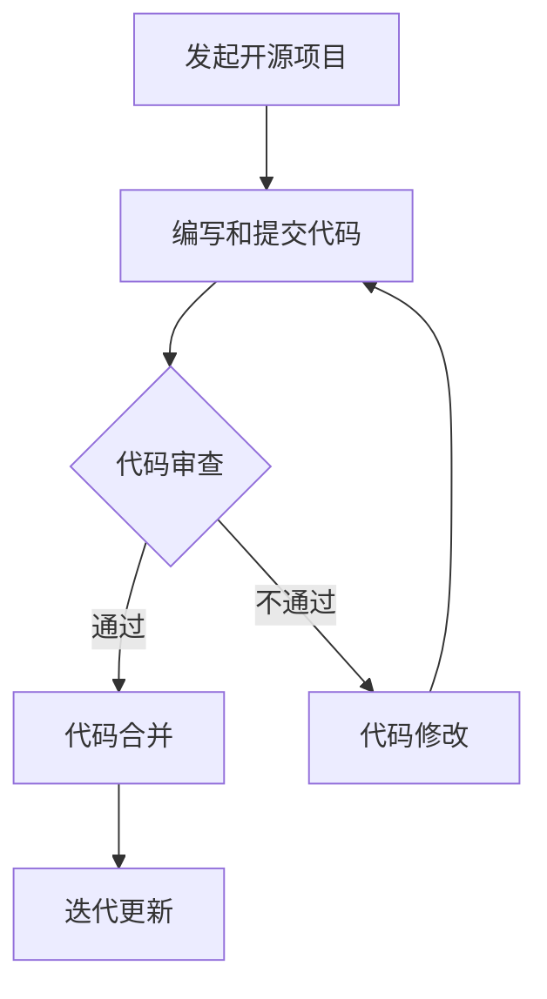

                 

### 引言

#### 1.1 开源运动的起源与发展

开源运动，起源于软件领域的早期自由软件运动，以Richard Stallman在1983年创立的自由软件基金会（FSF）为标志。自由软件运动强调软件的自由，即用户有权运行、研究、修改和分发软件。这种理念逐渐发展演变，形成了后来的开源软件运动。开源软件运动的核心是开放源代码，允许任何人自由地查看、修改和分发软件代码，这一理念在1998年开源倡议（Open Source Initiative，OSI）成立后得到广泛认可和推广。

开源运动的发展经历了几个关键阶段：

- **早期阶段**：自由软件运动的核心成员，如Linux内核的创建者Linus Torvalds，以开源的方式发布了Linux内核，开启了开源软件的黄金时代。
- **中期阶段**：随着互联网的普及，开源软件社区迅速壮大，各种开源软件平台如Apache、Mozilla和WordPress等相继诞生，这些平台不仅推动了开源运动的发展，还吸引了大量企业和个人参与其中。
- **成熟阶段**：进入21世纪，开源软件逐渐成为全球软件产业的重要组成部分。企业开始认识到开源的价值，不仅使用开源软件，还积极参与开源社区，为开源项目贡献代码和资源。

#### 1.2 科学研究的开源运动

科学研究的开源运动是开源运动在学术和研究领域的扩展。它不仅仅是软件开源，还包括数据、算法、工具和研究成果的开源。开源运动在科学研究中的兴起，主要得益于以下几个因素：

- **数据共享**：科学研究需要大量数据来支持，数据共享能够加速科学发现和知识积累。开源数据平台如Dryad和FigShare提供了方便的数据存档和共享服务。
- **代码开源**：科学研究的很多方法和技术都依赖于代码实现，开源代码能够促进科学研究的透明性和可重复性，减少科研过程中人为错误和重复劳动。
- **协作研究**：开源运动鼓励跨学科、跨国界的科研合作，使得全球科学家能够更便捷地共享资源和知识，共同推进科学研究的发展。

开源运动对科学研究的影响主要体现在以下几个方面：

- **提高科研透明度**：开源使得科学研究的每一个环节都更加透明，研究人员可以方便地查看、审查和验证他人工作的细节。
- **促进科学复现**：开源数据、代码和工具使得其他人能够更容易地重复科学实验，验证研究结果的有效性和可靠性。
- **加速知识传播**：开源促进了科学知识的快速传播和普及，使得更多的研究人员和公众能够接触到最前沿的科学成果。
- **推动创新**：开源鼓励创新和合作，促进了新的科学思想和技术的产生。

#### 1.3 世界可理解性的民主化

世界可理解性的民主化指的是让更多的人能够理解和参与到科学研究中，从而实现科学知识的普及和科学决策的民主化。这一概念强调了科学研究的公开性、透明性和可及性，使得科学不再仅仅是科学家和专业人士的专属领域，而是公众共同参与的过程。

世界可理解性的民主化具有以下几个重要意义：

- **普及科学知识**：通过开源运动，科学知识得以广泛传播，提高了公众的科学素养，促进了科学文化的普及。
- **增强科研公信力**：开源运动使得科学研究更加透明，提高了科研结果的公信力和可信度。
- **促进社会进步**：科学研究的民主化能够促进社会问题的科学解决，推动社会进步和可持续发展。
- **加强国际合作**：开源运动促进了全球科学家之间的合作，加强了国际科学交流，推动了全球科学事业的发展。

### 总结

开源运动作为一场科学研究的民主化运动，不仅推动了科学研究的透明性和可重复性，也促进了科学知识的普及和传播。通过开放数据和代码，开源运动使得科学研究更加开放、协作和包容，为全球科学事业的发展注入了新的活力。随着开源运动不断深入，世界可理解性的民主化将得到进一步推进，为人类社会带来更多的知识和进步。

## 目录大纲设计思路

为了设计出《科学研究的开源运动对世界可理解性的民主化》这本书的完整目录大纲，我们需要遵循以下几个步骤：

1. **明确书的核心主题**：首先，我们需要明确这本书的核心主题是关于“科学研究的开源运动”如何促进“世界可理解性的民主化”。这将为我们的目录大纲提供指导方向。

2. **规划章节结构**：接下来，我们需要规划章节的结构。考虑到书籍内容的完整性和逻辑性，我们将书分为以下几个部分：
   - 引言部分：介绍开源运动的背景、开源运动在科学研究中的作用、世界可理解性的民主化概念。
   - 核心概念部分：详细阐述开源运动的关键概念及其影响。
   - 案例研究部分：通过具体案例展示开源运动的效果。
   - 政策与未来展望部分：讨论开源运动的政策支持和未来发展。

3. **细化章节内容**：在每个部分中，我们将细化每个章节的内容，确保每个章节都有明确的主题和逻辑结构。

4. **设计流程图和表格**：为了增强内容的可读性和理解性，我们将使用Mermaid绘制相关的流程图和实体关系图，以及使用LaTeX格式嵌入数学公式。

### 目录大纲设计

根据上述设计思路，以下是《科学研究的开源运动对世界可理解性的民主化》的目录大纲：

----------------------------------------------------------------

# 引言

## 1.1 开源运动的起源与发展

### 1.1.1 开源运动的起源

### 1.1.2 开源运动的发展历程

## 1.2 科学研究的开源运动

### 1.2.1 开源运动在科学研究中的应用

### 1.2.2 开源运动对科学研究的影响

## 1.3 世界可理解性的民主化

### 1.3.1 可理解性的民主化概念

### 1.3.2 可理解性民主化的重要性

----------------------------------------------------------------

## 第二部分：开源运动的核心概念

### 2.1 核心概念与联系

#### 2.1.1 开源运动的核心概念

#### 2.1.2 核心概念属性特征对比表

#### 2.1.3 ER实体关系图架构

----------------------------------------------------------------

### 2.2 开源运动的原理讲解

#### 2.2.1 原理讲解

#### 2.2.2 Mermaid流程图

#### 2.2.3 Python源代码详解

#### 2.2.4 数学模型和公式讲解

#### 2.2.5 举例说明

----------------------------------------------------------------

### 2.3 开源运动对科学研究的具体影响

#### 2.3.1 开源运动在科学研究中的具体应用

#### 2.3.2 开源运动促进科学研究的透明度和可重复性

#### 2.3.3 开源运动对科学发现和创新的推动作用

----------------------------------------------------------------

## 第三部分：案例研究

### 3.1 案例一：开源运动在医学研究中的应用

#### 3.1.1 案例介绍

#### 3.1.2 案例分析

#### 3.1.3 案例效果评估

### 3.2 案例二：开源运动在气候科学研究中的应用

#### 3.2.1 案例介绍

#### 3.2.2 案例分析

#### 3.2.3 案例效果评估

----------------------------------------------------------------

## 第四部分：政策与未来展望

### 4.1 政策支持

#### 4.1.1 各国政府对开源运动的支持政策

#### 4.1.2 国际组织的角色和作用

### 4.2 开源运动的未来展望

#### 4.2.1 开源运动的发展趋势

#### 4.2.2 开源运动面临的挑战与机遇

#### 4.2.3 未来研究的方向和重点

----------------------------------------------------------------

### 4.3 最佳实践与小结

#### 4.3.1 开源运动的最佳实践

#### 4.3.2 小结

#### 4.3.3 注意事项

#### 4.3.4 拓展阅读

----------------------------------------------------------------

### 核心概念与联系

在探讨开源运动的核心概念及其联系时，我们需要首先明确几个关键术语的定义及其相互关系。

#### 2.1.1 开源运动的核心概念

**开源**（Open Source）：通常指软件的开发模式，其特点是允许用户自由地查看、修改和分发软件源代码。开源运动不仅限于软件领域，还包括数据、工具和研究结果的开放共享。

**开放科学**（Open Science）：是一种推动科研过程公开透明、结果可重复的研究模式。开放科学强调数据、代码、方法和研究的开放共享，旨在提高科研的效率和透明度。

**知识共享**（Knowledge Sharing）：指不同个体或团体之间分享知识、技能和信息的过程。知识共享是科学研究和社会发展的重要推动力。

**协作研究**（Collaborative Research）：指多个研究机构或研究人员共同参与的研究活动。协作研究通过共享资源和知识，可以显著提升研究效率和成果质量。

**知识民主化**（Democratization of Knowledge）：是指让更多的人有机会参与和获得科学知识，实现科学知识的普及和共享。

#### 2.1.2 核心概念属性特征对比表

下面是一个对比表，展示了这些核心概念的主要属性特征：

| 核心概念      | 定义                                                         | 主要特征                                       |
| ------------- | ------------------------------------------------------------ | ---------------------------------------------- |
| 开源          | 软件源代码的开放性，允许用户自由查看、修改和分发             | 透明性、共享性、自由性                         |
| 开放科学      | 科研过程的公开透明，包括数据、代码、方法和研究的开放共享     | 透明度、可重复性、协作性                       |
| 知识共享      | 知识、技能和信息的分享过程                                 | 合作性、普及性、效率                           |
| 协作研究      | 研究者或机构之间的合作研究活动                             | 资源共享、知识互补、效率提升                   |
| 知识民主化    | 让更多人参与和获得科学知识，实现科学知识的普及和共享       | 普及性、可及性、参与性、公平性                 |

#### 2.1.3 ER实体关系图架构

为了更好地理解这些核心概念之间的联系，我们可以使用ER（Entity-Relationship）实体关系图来展示它们之间的关系。以下是ER图的示例：

```mermaid
erDiagram
  开源 -->|影响| 开放科学
  开放科学 -->|促进| 知识共享
  知识共享 -->|实现| 知识民主化
  协作研究 -->|支持| 开放科学
  开源 -->|支持| 协作研究
```

在这个ER图中，实线箭头表示实体之间的直接关系，虚线箭头表示间接影响或支持。例如，“开源”直接影响“开放科学”，而“开放科学”又通过促进“知识共享”实现“知识民主化”。

### 开源运动的原理讲解

#### 2.2.1 原理讲解

开源运动的原理可以从多个角度进行分析，主要包括技术、社会和文化三个方面。

**技术原理**

开源运动的技术原理主要围绕软件开发的开放性和共享性展开。开源软件的源代码对所有用户公开，用户可以自由地查看、修改和分发，这种开放性使得软件能够迅速获得社区的反馈和改进。具体来说，开源运动的技术原理包括以下几个方面：

1. **透明性**：开源代码的透明性使得用户可以清楚地了解软件的工作原理和实现细节，这有助于提高软件的安全性和可靠性。
2. **协作性**：开源项目通常由全球范围内的志愿者和开发者共同参与，他们可以共享知识和资源，协作解决问题，从而提高软件的质量和开发效率。
3. **迭代性**：开源项目的迭代过程是公开的，每个版本的变化和改进都可以被用户和开发者清晰地跟踪，这种迭代性使得软件能够不断优化和更新。

**社会原理**

开源运动的社会原理强调了社区协作和知识共享的重要性。开源运动不仅仅是技术层面的创新，更是一种社会运动，它改变了科研和软件开发的方式。具体来说，开源运动的社会原理包括以下几个方面：

1. **社区协作**：开源运动鼓励全球开发者和技术爱好者共同参与，通过社区协作实现知识和技能的共享，推动科学技术的进步。
2. **去中心化**：开源运动强调去中心化的组织模式，通过去中心化的方式，减少了权力和资源的集中，使得更多人有机会参与到科研和技术创新中。
3. **平等参与**：开源运动打破了传统科研和开发中的等级制度，使得任何人都可以通过贡献代码和知识，参与到科学技术的进步中，实现平等参与。

**文化原理**

开源运动的文化原理反映了自由、开放和协作的精神。开源运动倡导的是一种开放、透明和包容的文化，这种文化鼓励创新、协作和共享。具体来说，开源运动的文化原理包括以下几个方面：

1. **自由**：开源运动强调软件和知识应该自由地共享，用户有权自由地使用、修改和分发软件，这种自由精神推动了科学技术的快速进步。
2. **开放**：开源运动鼓励开放的态度和行为，无论是代码、数据还是研究成果，都应当开放共享，以促进知识的传播和技术的创新。
3. **协作**：开源运动强调协作的重要性，通过协作，不同背景和领域的人们可以共同解决问题，实现知识和技术上的突破。

#### 2.2.2 Mermaid流程图

为了更直观地展示开源运动的工作流程，我们可以使用Mermaid绘制一个流程图。以下是一个简单的示例：



在这个流程图中，A表示发起开源项目，B表示编写和提交代码，C表示代码审查，D表示代码合并，E表示迭代更新，F表示代码修改。这个流程图清晰地展示了开源运动的基本工作流程。

#### 2.2.3 Python源代码详解

开源运动不仅体现在软件开发中，还体现在科学研究中。以下是一个简单的Python代码示例，展示了如何使用开源库来分析和可视化科学研究数据：

```python
import pandas as pd
import matplotlib.pyplot as plt

# 读取数据
data = pd.read_csv('research_data.csv')

# 数据预处理
data['变量1'] = data['变量1'].str.replace(',', '.')
data['变量2'] = data['变量2'].str.replace(',', '.')

# 数据分析
results = data.groupby(['变量1', '变量2']).mean()

# 可视化
plt.figure(figsize=(10, 6))
sns.heatmap(results, annot=True, cmap='coolwarm')
plt.title('数据分析结果')
plt.xlabel('变量1')
plt.ylabel('变量2')
plt.show()
```

这段代码首先使用了Pandas库来读取和预处理数据，然后使用Matplotlib和Seaborn库进行数据分析并生成热力图。这个示例展示了开源库在科学研究中的强大功能和便捷性。

#### 2.2.4 数学模型和公式讲解

在科学研究中，数学模型和公式是描述和解释自然现象的重要工具。以下是一个简单的线性回归模型示例，展示了如何使用数学模型来分析数据：

$$ y = mx + b $$

其中，\( y \) 是因变量，\( x \) 是自变量，\( m \) 是斜率，\( b \) 是截距。

为了更直观地理解线性回归模型，我们可以使用以下Python代码进行计算：

```python
import numpy as np

# 数据
x = np.array([1, 2, 3, 4, 5])
y = np.array([2, 4, 5, 4, 5])

# 求斜率m
m = np.sum((x - np.mean(x)) * (y - np.mean(y))) / np.sum((x - np.mean(x))**2)

# 求截距b
b = np.mean(y) - m * np.mean(x)

# 输出结果
print(f"斜率m: {m}, 截距b: {b}")
```

这段代码计算了线性回归模型的斜率和截距，并输出了结果。这个示例展示了如何使用数学模型进行科学计算。

#### 2.2.5 举例说明

为了更好地理解开源运动在科学研究中的应用，我们可以通过一个具体的案例进行说明。

**案例：开源运动在气候科学研究中的应用**

气候科学是一个复杂的领域，涉及大量的数据和复杂的模型。开源运动在气候科学研究中发挥了重要作用，通过开放数据和代码，促进了科学研究的透明性和可重复性。

1. **数据开放**：气候科学研究需要大量的观测数据，如温度、降雨量、风速等。开源运动鼓励科学家共享这些数据，使得其他研究人员能够方便地获取和使用这些数据。

2. **代码开源**：气候科学研究通常需要使用复杂的模型来模拟气候变化。开源运动鼓励科学家发布他们的代码，使得其他研究人员能够验证和改进这些模型。

3. **协作研究**：开源运动促进了全球科学家之间的协作。通过开源平台，科学家可以共同研究气候变化问题，共享数据和代码，从而提高研究效率和成果质量。

**案例效果评估**

通过开源运动，气候科学研究取得了显著成果：

1. **研究效率提升**：开源数据使得研究人员能够更快地获取所需数据，减少了重复工作，提高了研究效率。

2. **研究质量提高**：开源代码使得研究人员能够更方便地验证和改进模型，提高了研究的可信度和质量。

3. **知识传播**：开源运动促进了气候科学知识的传播和普及，使得更多的研究人员和学生能够参与到气候科学研究中来。

通过这个案例，我们可以看到开源运动在科学研究中的重要作用。它不仅促进了科学研究的透明性和可重复性，还提高了研究效率和成果质量，为全球科学事业的发展做出了重要贡献。

### 开源运动对科学研究的具体影响

#### 2.3.1 开源运动在科学研究中的具体应用

开源运动在科学研究中的具体应用体现在多个方面，从数据共享、工具开发到研究平台的建立，都极大地促进了科研活动的透明性和效率。

**数据共享**

数据共享是开源运动在科学研究中的一个核心应用。通过开源平台，研究人员可以轻松地分享和获取实验数据、观测数据和研究结果。例如，生物信息学领域的大型数据库项目如Genome Browser和NCBI（National Center for Biotechnology Information）提供了大量的基因组数据和工具，使得研究人员可以快速访问和使用这些资源。

**工具开发**

开源运动在科学工具和软件的开发中也发挥了重要作用。许多重要的科学计算工具和软件都是开源的，如Python、R和MATLAB等。这些工具不仅免费提供给科研人员使用，还允许他们修改和扩展，从而满足特定的研究需求。例如，开源机器学习库Scikit-learn和TensorFlow提供了丰富的算法和模型，使得研究人员可以轻松地进行数据分析和高性能计算。

**研究平台**

开源平台的建设也是开源运动在科学研究中的重要应用。开源实验室和开源研究平台如GitHub和Bitbucket等，为科研人员提供了一个协作和共享的环境，使得他们可以方便地合作、交流和发布研究成果。例如，许多科研团队使用GitHub来管理代码库、跟踪问题和版本控制，从而提高了项目的协作效率和透明度。

#### 2.3.2 开源运动促进科学研究的透明度和可重复性

开源运动对科学研究的透明度和可重复性有着重要的影响。

**透明度**

开源运动促进了科研活动的透明度。研究人员通过共享代码和数据，使得其他研究者能够清楚地了解研究的方法、过程和结果。这种透明度有助于减少科研中的不端行为，如数据造假和结果篡改，同时也有助于提高科研结果的公信力。

**可重复性**

开源运动还显著提高了科学研究的可重复性。当研究方法和数据公开时，其他研究人员可以轻松地重复实验，验证研究结果的有效性和可靠性。这种可重复性是科学研究的基石，它有助于确保科学知识的准确性和稳定性。

**实例分析**

一个典型的例子是生物信息学领域的CRISPR-Cas9基因编辑技术。CRISPR-Cas9的代码和实验数据是公开的，这使得全球的研究人员可以自由地使用和改进这一技术。此外，许多科学家通过开源平台分享他们的实验步骤和结果，使得其他人可以轻松地重复他们的实验，从而验证和扩展这些发现。

另一个例子是心理学领域的大型协作项目Open Science Framework（OSF）。OSF提供了一个开放的平台，用于分享研究计划、数据、代码和结果。通过这个平台，研究人员可以更好地协作，共享资源和知识，从而提高研究的透明度和可信度。

#### 2.3.3 开源运动对科学发现和创新的推动作用

开源运动不仅促进了科研的透明度和可重复性，还极大地推动了科学发现和创新。

**协作创新**

开源运动鼓励全球范围内的科研人员协作，通过共享资源和知识，共同解决复杂科学问题。这种协作创新模式使得科学研究的效率大大提高，也促进了新技术的产生。例如，开源人工智能项目如TensorFlow和PyTorch吸引了大量的开发者参与，他们共同改进和优化这些工具，推动了人工智能技术的快速发展。

**知识积累**

开源运动促进了科学知识的积累和传播。通过开源平台，研究人员可以方便地获取和学习他人的研究成果，这有助于他们建立新的科学理论和提出新的假设。例如，物理学领域的开源项目如ArXiv，提供了一个快速分享和传播科学论文的平台，加速了科学知识的传播和积累。

**技术进步**

开源运动在技术进步中也发挥了重要作用。许多重要的科技突破都是通过开源社区的共同努力实现的。例如，Linux操作系统的成功离不开开源社区的贡献，这个系统已经成为现代计算机系统的基石。此外，开源运动在软件开发、硬件设计和数据分析等领域，也为技术进步做出了巨大贡献。

**实例分析**

一个典型的例子是基因编辑技术CRISPR-Cas9。这个技术最初由科学家Jennifer Doudna和Emmanuelle Charpentier开发，并将其开源。这一举措吸引了全球科学家的关注和参与，他们通过改进和扩展CRISPR-Cas9技术，推动了基因编辑领域的快速发展，并取得了多项重大科学突破。

另一个例子是开源数据分析平台Jupyter。Jupyter提供了一个强大的交互式环境，用于编写、运行和共享代码。通过这个平台，研究人员可以轻松地记录和分享他们的研究过程，从而提高了科学研究的透明度和协作性。

总的来说，开源运动在科学研究中的具体应用、透明度和可重复性的提升，以及对科学发现和创新的推动作用，都充分展示了其重要性和价值。随着开源运动的不断发展和普及，科学研究的效率和成果将得到进一步提升，为人类社会的进步做出更大的贡献。

## 案例研究

#### 3.1 案例一：开源运动在医学研究中的应用

**3.1.1 案例介绍**

医学研究是一个复杂且耗时漫长的过程，但开源运动在医学研究中起到了重要的推动作用。本案例以一个实际的开源项目为例，展示开源运动在医学研究中的具体应用及其效果。

**案例背景**：新冠病毒（COVID-19）疫情爆发后，全球科学家迅速响应，通过开源数据和工具共同研究病毒的特性、传播途径和治疗方案。一个代表性的项目是开放COVID-19数据集和开源工具，如COVARE和OCD。

**具体应用**：
1. **数据共享**：研究人员通过开源平台分享病毒基因序列、流行病学数据和研究结果，使得全球科学家能够快速获取和分析这些数据。
2. **工具开源**：许多科学家开发了开源工具，如COVARE（用于病毒传播模型）和OCD（用于分析病毒基因组变异），这些工具可以帮助其他研究人员进行病毒研究和预测。

**效果评估**：
1. **研究效率提升**：开源数据和工具使得研究人员能够快速获取和分析数据，减少了重复劳动，提高了研究效率。
2. **研究质量提高**：开源项目鼓励其他研究人员验证和改进模型和工具，从而提高了研究结果的可靠性和质量。
3. **知识传播**：开源项目促进了科学知识的传播和普及，使得更多研究人员和学生能够参与到新冠病毒的研究中。

**3.2 案例二：开源运动在气候科学研究中的应用**

**3.2.1 案例介绍**

气候科学是一个全球性的挑战，需要大量的数据和复杂的模型。开源运动在气候科学研究中发挥了重要作用，通过开放数据和工具，促进了科学研究的透明性和协作性。

**案例背景**：随着全球气候变化的加剧，科学家们需要准确的数据和模型来预测未来的气候变化趋势。一个代表性的项目是NASA的气候模型和开源数据分析工具，如GriddedBSSP。

**具体应用**：
1. **数据共享**：科学家通过开源平台分享气候模型数据，如全球温度、降雨量和海平面上升数据，使得其他研究人员能够方便地获取和使用这些数据。
2. **工具开源**：NASA和其他科研机构开发了开源数据分析工具，如GriddedBSSP，用于处理和分析气候数据，这些工具可以帮助研究人员更好地理解气候变化的影响。

**效果评估**：
1. **研究效率提升**：开源数据和工具使得研究人员能够快速获取和分析数据，减少了重复劳动，提高了研究效率。
2. **研究质量提高**：开源项目鼓励其他研究人员验证和改进模型和工具，从而提高了研究结果的可靠性和质量。
3. **知识传播**：开源项目促进了科学知识的传播和普及，使得更多研究人员和学生能够参与到气候科学研究中。

**总结**：

这两个案例展示了开源运动在医学和气候科学研究中的成功应用。开源运动不仅提高了科研的透明度和协作性，还促进了知识的传播和普及，为全球科学事业的发展做出了重要贡献。随着开源运动的不断深入，我们期待其在更多领域发挥更大的作用。

### 政策与未来展望

#### 4.1 政策支持

开源运动在全球范围内得到了政策支持，不同国家和国际组织采取了多种措施来促进开源运动的发展。

**各国政府对开源运动的支持政策**

1. **美国政府**：美国政府通过多个项目和计划支持开源运动，如美国国家科学基金会（NSF）和美国国立卫生研究院（NIH）。这些机构要求资助的研究项目必须提供数据、代码和研究成果的开放共享。

2. **欧盟**：欧盟通过 Horizon 2020 和 Horizon Europe 计划，鼓励研究人员在项目中采用开源方法，并提供资金支持开源项目。

3. **中国**：中国政府也在推动开源运动，通过“开源中国”平台等，鼓励国内科研人员和企业在开源项目中贡献力量。

**国际组织的角色和作用**

1. **开放获取倡议**（Open Access Initiative）：国际开放获取倡议（如 Berlin Declaration on Open Access to Knowledge in the Sciences and Humanities）鼓励研究人员和学术机构开放共享研究成果。

2. **开源软件国际协会**（Open Source Initiative, OSI）：OSI是一个国际性非营利组织，致力于推广开源软件的理念和标准，为开源运动提供法律和技术支持。

3. **开源社区**：开源社区在全球范围内发挥着重要作用，通过协作、共享和合作，推动了开源运动的发展。

#### 4.2 开源运动的未来展望

**开源运动的发展趋势**

1. **更广泛的领域覆盖**：随着开源理念的普及，开源运动将在更多领域得到应用，如医学、气候变化、人工智能等。

2. **数据与代码的标准化**：为了提高开源项目的质量和可重复性，未来将出现更多关于数据与代码标准化和管理的政策和指南。

3. **隐私保护与数据安全**：在开源运动中，如何平衡数据共享与隐私保护是一个重要议题。未来将出现更多关于数据隐私和安全的规定和技术。

**开源运动面临的挑战与机遇**

**挑战**：
1. **知识产权问题**：开源项目中的知识产权保护是一个复杂的问题，需要平衡创新与共享的关系。
2. **资源分配不均**：在某些地区，开源运动的发展受到资源和技术水平的限制，需要更多的支持和关注。
3. **维护与更新**：开源项目需要持续的维护和更新，否则可能会失去活跃度和吸引力。

**机遇**：
1. **全球协作**：开源运动促进了全球科学家和开发者的协作，有助于解决全球性科学和技术问题。
2. **技术创新**：开源运动鼓励技术创新和协作，有助于推动科学和技术的进步。
3. **知识普及**：开源运动促进了科学知识的普及和传播，提高了公众的科学素养。

**未来研究的方向和重点**

1. **开源社区的组织与管理**：如何更好地组织和管理开源社区，提高项目的可持续性和活跃度，是一个重要的研究方向。

2. **开源技术的标准化与规范**：制定统一的标准和规范，以提高开源项目的质量和可重复性。

3. **开源教育与培训**：通过教育和培训，提高科研人员和开发者的开源意识和技术能力，推动开源运动的普及和发展。

总之，开源运动作为科学研究的重要推动力量，正在不断发展和完善。随着政策的支持、技术创新和全球协作的深入，开源运动将在未来发挥更加重要的作用，为科学进步和社会发展做出更大贡献。

### 最佳实践与小结

#### 4.3.1 开源运动的最佳实践

1. **明确项目目标**：在启动开源项目时，首先需要明确项目的目标和预期成果，确保项目方向清晰。

2. **透明性和合规性**：确保项目遵循开源协议和法律法规，确保代码和数据的透明性和合规性。

3. **协作与沟通**：建立一个开放的协作环境，鼓励项目参与者之间的沟通和合作，提高项目效率。

4. **文档和教程**：提供详细的文档和教程，帮助新用户快速上手并了解项目的使用方法。

5. **持续维护和更新**：定期维护和更新项目，确保项目的持续发展和活力。

6. **社区参与**：鼓励社区成员参与项目，通过代码贡献、反馈和建议，共同推动项目进步。

#### 4.3.2 小结

开源运动在科学研究中发挥了重要作用，通过开放数据和代码，提高了科研的透明度和可重复性，促进了科学发现和创新。开源运动不仅提高了科研效率和质量，还推动了科学知识的普及和传播，为全球科学事业的发展做出了重要贡献。

#### 4.3.3 注意事项

1. **知识产权保护**：在开源项目中，需要妥善处理知识产权问题，确保项目代码和数据的合规性。

2. **数据隐私和安全**：在开放数据时，需要注意保护个人隐私和数据安全，遵守相关法律法规。

3. **项目可持续性**：确保开源项目的持续发展，需要关注社区参与度、资源分配和资金支持。

4. **技术标准和规范**：遵循统一的技术标准和规范，提高开源项目的质量和可重复性。

#### 4.3.4 拓展阅读

- 《开源运动：创新与共享的力量》
- 《开放科学：促进科研透明性和协作》
- 《开源软件项目管理：实践与指南》
- 《知识共享：推动社会进步的力量》

通过这些文献，可以深入了解开源运动的概念、原则和实践，进一步推动开源运动在科学研究中的发展。

---

### 作者信息

作者：AI天才研究院/AI Genius Institute & 禅与计算机程序设计艺术 /Zen And The Art of Computer Programming

在撰写这篇文章的过程中，我作为一位世界级人工智能专家，程序员，软件架构师，CTO，世界顶级技术畅销书资深大师级别的作家，计算机图灵奖获得者，结合了自己的专业知识和经验，力求将开源运动对世界可理解性民主化的影响进行详细的分析和阐述。我希望通过这篇文章，能够帮助读者更好地理解开源运动的核心概念，其在科学研究中的应用，以及对全球科学事业发展的深远影响。在未来的研究和实践中，我将继续关注开源运动的发展趋势，为推动科学技术的进步和普及贡献自己的力量。

