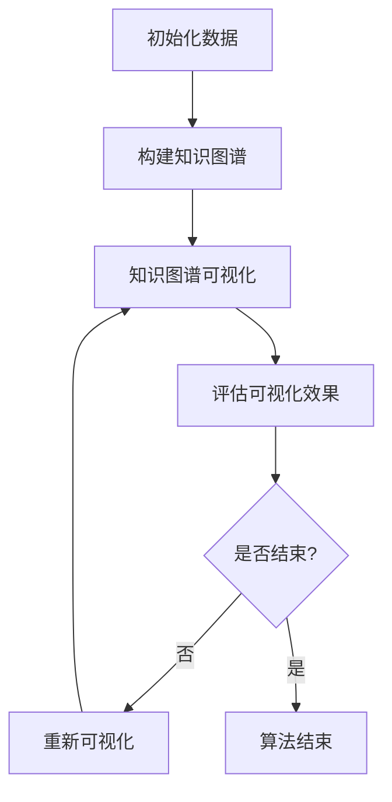
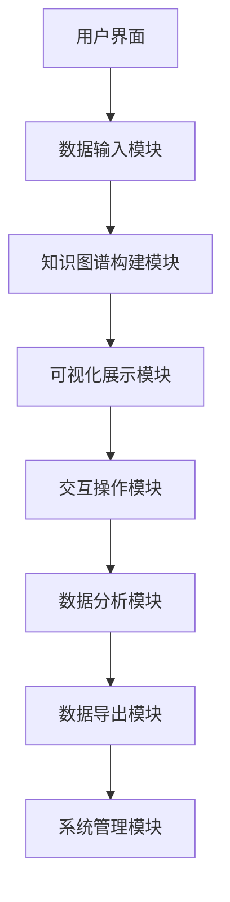

                 

### 设计《科学研究的知识图谱：可视化世界可理解性》目录大纲

#### 一、目录大纲结构

为了确保内容的完整性，我们将目录大纲划分为以下几个部分：

1. **背景介绍**
   - 研究背景
   - 研究意义
   - 研究问题与目标
   - 研究边界与外延

2. **核心概念与联系**
   - 知识图谱
   - 可视化
   - 知识图谱的可视化
   - 核心概念对比表格
   - ER实体关系图

3. **算法原理讲解**
   - 算法流程图
   - 算法原理
   - 数学模型与公式
   - 举例说明

4. **系统分析与架构设计方案**
   - 问题场景
   - 系统功能设计
   - 系统架构设计
   - 系统接口设计
   - 系统交互

5. **项目实战**
   - 环境安装
   - 系统核心实现
   - 代码应用解读
   - 实际案例分析
   - 项目小结

6. **最佳实践 tips**
   - 小结
   - 注意事项
   - 拓展阅读

#### 二、具体目录大纲设计

```markdown
----------------------------------------------------------------
# 《科学研究的知识图谱：可视化世界可理解性》目录大纲

## 第1章 研究背景
### 1.1 研究背景
#### 1.1.1 科学研究的挑战
#### 1.1.2 知识图谱的兴起
#### 1.1.3 可视化的力量

### 1.2 研究意义
#### 1.2.1 研究对科学研究的意义
#### 1.2.2 研究对社会的影响
#### 1.2.3 研究的挑战与机遇

### 1.3 研究问题与目标
#### 1.3.1 研究问题
#### 1.3.2 研究目标
#### 1.3.3 研究步骤

### 1.4 研究边界与外延
#### 1.4.1 研究边界
#### 1.4.2 研究外延
#### 1.4.3 研究核心要素组成

## 第2章 核心概念与联系
### 2.1 知识图谱
#### 2.1.1 知识图谱的定义
#### 2.1.2 知识图谱的特点
#### 2.1.3 知识图谱的应用

### 2.2 可视化
#### 2.2.1 可视化的定义
#### 2.2.2 可视化的类型
#### 2.2.3 可视化的作用

### 2.3 知识图谱的可视化
#### 2.3.1 知识图谱可视化的挑战
#### 2.3.2 知识图谱可视化的重要性
#### 2.3.3 知识图谱可视化的方法

### 2.4 核心概念对比表格
#### 2.4.1 知识图谱与可视化对比
#### 2.4.2 其他相关知识对比

### 2.5 ER实体关系图
#### 2.5.1 ER实体关系图的定义
#### 2.5.2 ER实体关系图的特点
#### 2.5.3 ER实体关系图的应用

## 第3章 算法原理讲解
### 3.1 算法流程图
#### 3.1.1 算法总体流程
#### 3.1.2 详细步骤说明

### 3.2 算法原理
#### 3.2.1 算法核心概念
#### 3.2.2 算法工作原理

### 3.3 数学模型与公式
$$
\text{公式1: ...}
$$
$$
\text{公式2: ...}
$$

### 3.4 举例说明
#### 3.4.1 示例场景
#### 3.4.2 算法应用

## 第4章 系统分析与架构设计方案
### 4.1 问题场景
#### 4.1.1 场景介绍
#### 4.1.2 问题分析

### 4.2 系统功能设计
#### 4.2.1 功能需求
#### 4.2.2 功能模块

### 4.3 系统架构设计
#### 4.3.1 架构设计原则
#### 4.3.2 系统架构图

### 4.4 系统接口设计
#### 4.4.1 接口规范
#### 4.4.2 接口实现

### 4.5 系统交互
#### 4.5.1 交互流程
#### 4.5.2 交互图

## 第5章 项目实战
### 5.1 环境安装
#### 5.1.1 安装准备
#### 5.1.2 安装步骤

### 5.2 系统核心实现
#### 5.2.1 核心模块实现
#### 5.2.2 系统核心代码

### 5.3 代码应用解读
#### 5.3.1 代码解读
#### 5.3.2 应用场景

### 5.4 实际案例分析
#### 5.4.1 案例介绍
#### 5.4.2 案例分析

### 5.5 项目小结
#### 5.5.1 项目总结
#### 5.5.2 项目反思

## 第6章 最佳实践 tips
### 6.1 小结
### 6.2 注意事项
### 6.3 拓展阅读

----------------------------------------------------------------
```

### 章节内容具体设计

#### 第1章 研究背景

**1.1 研究背景**

随着全球科学研究的迅猛发展，研究者面临着海量的数据和信息。如何有效地组织和利用这些信息，以提高科研的效率和准确性，成为了一个重要的课题。知识图谱作为一种结构化的知识表示方法，近年来在科研领域得到了广泛的应用。可视化技术则通过将复杂的数据和信息以直观的方式呈现，大大提高了人们理解和分析数据的能力。因此，将知识图谱与可视化技术相结合，形成一种新的科研工具，具有重要的研究价值。

**1.1.1 科学研究的挑战**

科学研究面临着多方面的挑战，如数据量大、信息复杂、跨学科研究等。传统的科研方法已经难以满足当前的需求，研究者需要新的工具和方法来应对这些挑战。

**1.1.2 知识图谱的兴起**

知识图谱通过将实体、属性和关系进行结构化表示，为科学研究提供了强大的数据表示方法。近年来，知识图谱在自然语言处理、推荐系统、知识发现等领域取得了显著成果。

**1.1.3 可视化的力量**

可视化技术通过将数据以图形、图像等形式呈现，使得复杂的数据和信息变得易于理解和分析。在科研领域，可视化技术可以帮助研究者更快速地发现数据中的模式和规律。

**1.2 研究意义**

本研究旨在探索知识图谱与可视化技术在科学研究中的应用，以提高科研的效率和准确性。具体研究意义包括：

- 提高科研数据的可理解性
- 促进跨学科研究与合作
- 提升科研工作效率

**1.2.1 研究对科学研究的意义**

知识图谱与可视化技术的结合为科研提供了新的工具和方法，可以有效地解决科研中的数据管理和分析难题。

**1.2.2 研究对社会的影响**

本研究有望推动科学研究的进步，提高科研成果的转化和应用，从而对社会发展产生积极影响。

**1.2.3 研究的挑战与机遇**

知识图谱与可视化技术的结合面临着一系列的挑战，如数据质量问题、可视化方法的选择等。同时，这也是一个充满机遇的研究方向，有望在科研领域取得突破性成果。

**1.3 研究问题与目标**

本研究主要解决以下问题：

- 如何有效地构建知识图谱？
- 如何将知识图谱与可视化技术相结合？
- 如何优化知识图谱的可视化效果？

研究目标包括：

- 设计一种有效的知识图谱构建方法
- 提出一种适用于科研的可视化技术框架
- 评估知识图谱与可视化技术在科研中的应用效果

**1.3.1 研究问题**

- 如何构建知识图谱？
- 如何实现知识图谱的可视化？
- 如何优化知识图谱的可视化效果？

**1.3.2 研究目标**

- 设计并实现一种知识图谱构建方法
- 开发一套适用于科研的可视化技术框架
- 评估知识图谱与可视化技术在科研中的应用效果

**1.3.3 研究步骤**

- 文献综述：收集和分析相关研究，确定研究方向和方法
- 知识图谱构建方法设计：设计并实现知识图谱构建方法
- 可视化技术框架开发：开发适用于科研的可视化技术框架
- 应用评估：在实际科研场景中评估知识图谱与可视化技术的应用效果
- 结果分析与总结：分析研究结果，总结研究贡献和不足

**1.4 研究边界与外延**

- 研究边界：本研究主要关注知识图谱与可视化技术在科学研究中的应用，不涉及其他领域的应用。
- 研究外延：本研究可以为其他领域的知识图谱与可视化应用提供参考和借鉴。

**1.4.1 研究边界**

本研究主要关注以下边界：

- 知识图谱的构建与应用
- 可视化技术在科研中的应用
- 知识图谱与可视化技术的结合

**1.4.2 研究外延**

研究的外延包括以下几个方面：

- 知识图谱在其他领域的应用，如医疗、金融等
- 其他可视化技术方法在科研中的应用
- 知识图谱与可视化技术的跨学科研究

**1.4.3 研究核心要素组成**

本研究的核心要素包括：

- 知识图谱
- 可视化技术
- 科研应用场景
- 构建方法与优化策略

#### 第2章 核心概念与联系

**2.1 知识图谱**

知识图谱（Knowledge Graph）是一种用于结构化表示知识的方法，通过实体、属性和关系的组合，将知识以图形化的方式呈现。知识图谱在语义理解、推荐系统、知识发现等领域具有重要应用。

**2.1.1 知识图谱的定义**

知识图谱是一种语义网络，通过实体、属性和关系来表示知识。实体表示现实世界中的对象，属性描述实体的特征，关系表示实体之间的关联。

**2.1.2 知识图谱的特点**

- 结构化：知识以图形化、结构化的形式表示，易于理解和分析。
- 可扩展：知识图谱可以灵活地添加新的实体和关系，支持知识增长。
- 语义丰富：知识图谱能够表达复杂的语义信息，支持深度分析。

**2.1.3 知识图谱的应用**

知识图谱广泛应用于多个领域，如自然语言处理、搜索引擎、推荐系统、知识发现等。以下是一些典型的应用场景：

- 自然语言处理：通过知识图谱增强语义理解，提高文本分析的效果。
- 搜索引擎：利用知识图谱优化搜索结果，提高搜索的准确性和效率。
- 推荐系统：基于知识图谱推荐相关内容，提高用户体验。
- 知识发现：通过知识图谱挖掘潜在的关系和模式，支持科学研究和决策。

**2.2 可视化**

可视化（Visualization）是一种通过视觉呈现数据和信息的方法，使得复杂的数据变得直观、易于理解。可视化技术广泛应用于科学、工程、商业等领域。

**2.2.1 可视化的定义**

可视化是将数据、信息或知识通过视觉形式（如图表、图像、动画等）进行呈现的技术。它通过颜色、形状、大小等视觉元素来传达信息。

**2.2.2 可视化的类型**

- 数据可视化：将数据以图形、图像等形式呈现，如折线图、柱状图、热力图等。
- 信息可视化：将信息以结构化的形式呈现，如概念图、网络图、知识图谱等。
- 知识可视化：将知识以图形化的方式呈现，如思维导图、知识图谱等。

**2.2.3 可视化的作用**

- 增强理解：通过可视化，复杂的数据和信息变得更加直观，有助于人们更好地理解和分析。
- 发现模式：可视化技术可以帮助研究者发现数据中的隐藏模式和规律。
- 交流分享：可视化使得数据和信息更容易被他人理解和接受，有助于交流和分享。

**2.3 知识图谱的可视化**

知识图谱的可视化是将知识图谱中的实体、属性和关系以图形化的方式呈现，使得复杂的知识结构更加直观易懂。

**2.3.1 知识图谱可视化的挑战**

- 可视化空间有限：知识图谱包含大量的实体和关系，如何在有限的可视化空间内呈现完整的信息，是一个挑战。
- 信息密度高：知识图谱中的实体和关系通常具有很高的信息密度，如何有效地组织信息，使得可视化既清晰又详细，是一个挑战。
- 可扩展性：知识图谱是动态变化的，如何支持实体的增加、关系的更新等操作，是一个挑战。

**2.3.2 知识图谱可视化的重要性**

- 提高知识可理解性：知识图谱的可视化使得复杂的知识结构变得更加直观易懂，有助于人们更好地理解和分析。
- 支持知识发现：知识图谱的可视化可以帮助研究者发现数据中的隐藏模式和规律，支持科学研究和决策。
- 促进知识传播：知识图谱的可视化使得知识更加容易被他人理解和接受，有助于知识的传播和应用。

**2.3.3 知识图谱可视化的方法**

- 节点-边模型：将实体作为节点，关系作为边，通过节点和边的布局来呈现知识图谱。
- 层次化模型：将知识图谱分层组织，通过层次化的方式来呈现知识结构。
- 网络图模型：利用网络图来表示知识图谱中的实体和关系，通过节点的连接来体现实体之间的关系。
- 可视化工具：如D3.js、Graphviz、Cytoscape等，用于实现知识图谱的可视化。

**2.4 核心概念对比表格**

为了更清晰地展示知识图谱和可视化之间的联系，我们制作了一个对比表格，如下所示：

| 对比项         | 知识图谱        | 可视化        |
|--------------|--------------|--------------|
| 定义           | 一种结构化表示知识的方法  | 将数据和信息以视觉形式呈现 |
| 特点           | 结构化、可扩展、语义丰富   | 直观、易于理解、发现模式    |
| 应用           | 语义理解、推荐系统、知识发现等 | 数据分析、信息可视化、知识传播等 |
| 关键技术       | 实体、属性、关系表示     | 节点、边、颜色、形状等      |
| 挑战           | 信息密度高、可扩展性     | 可视化空间有限、信息组织难度大 |

**2.5 ER实体关系图**

ER实体关系图（Entity-Relationship Diagram）是数据库设计中常用的一种图形表示方法，用于描述实体之间的关系。

**2.5.1 ER实体关系图的定义**

ER实体关系图是一种用于表示实体及其关系的图形化方法。它通过实体、属性和关系的组合，描述了数据库中的实体及其之间的关系。

**2.5.2 ER实体关系图的特点**

- 结构清晰：ER实体关系图通过图形化的方式，清晰地展示了实体之间的关系。
- 易于理解：ER实体关系图使得数据库结构更加直观易懂，有助于设计者和开发者之间的沟通。
- 支持扩展：ER实体关系图可以灵活地添加新的实体和关系，支持数据库的扩展。

**2.5.3 ER实体关系图的应用**

ER实体关系图广泛应用于数据库设计和数据建模领域，其主要应用包括：

- 数据库设计：用于描述数据库中的实体、属性和关系，支持数据库的设计和构建。
- 数据建模：用于分析业务需求，构建实体关系模型，为数据库设计提供依据。
- 数据库优化：通过ER实体关系图，可以识别数据库中的冗余和冗余关系，优化数据库结构。

#### 第3章 算法原理讲解

**3.1 算法流程图**

在讲解算法原理之前，我们首先通过一个流程图来展示算法的基本流程。



该流程图描述了知识图谱构建和可视化的基本步骤，包括初始化数据、构建知识图谱、知识图谱可视化、评估可视化效果和结束算法。

**3.1.1 算法总体流程**

- 初始化数据：读取原始数据，包括实体、属性和关系等信息。
- 构建知识图谱：基于初始化数据，构建知识图谱，包括实体、属性和关系的表示。
- 知识图谱可视化：将知识图谱以图形化的方式呈现，包括节点、边和颜色等。
- 评估可视化效果：评估知识图谱可视化的效果，包括清晰度、可读性和用户体验等。
- 结束算法：根据评估结果，决定是否重新进行知识图谱可视化，直到达到满意的效果。

**3.1.2 详细步骤说明**

1. **初始化数据**：读取原始数据，包括实体、属性和关系等信息。这些数据可以是结构化数据（如关系数据库）或非结构化数据（如文本、图像等）。

2. **构建知识图谱**：基于初始化数据，构建知识图谱。知识图谱由实体、属性和关系构成。实体表示现实世界中的对象，属性描述实体的特征，关系表示实体之间的关联。

3. **知识图谱可视化**：将知识图谱以图形化的方式呈现。可视化过程中，需要考虑节点、边和颜色等因素。节点表示实体，边表示关系，颜色可以用于表示不同的属性或实体类型。

4. **评估可视化效果**：评估知识图谱可视化的效果。评估指标可以包括清晰度、可读性和用户体验等。评估结果用于指导可视化优化。

5. **重新可视化**：根据评估结果，决定是否重新进行知识图谱可视化。如果评估结果不理想，可以尝试调整可视化参数，如节点大小、颜色、边宽度等，以优化可视化效果。

6. **结束算法**：当评估结果达到满意的效果时，算法结束。

**3.2 算法原理**

知识图谱构建和可视化的算法原理主要包括以下几个方面：

1. **实体表示**：实体是知识图谱中的基本元素，用于表示现实世界中的对象。实体可以通过属性和关系进行描述。属性描述实体的特征，关系表示实体之间的关联。

2. **关系表示**：关系是知识图谱中的另一个基本元素，用于表示实体之间的关联。关系可以通过实体和属性进行描述。实体与属性之间的关联可以通过边表示。

3. **知识图谱构建**：知识图谱构建是通过实体、属性和关系的组合来表示知识。知识图谱构建过程中，需要考虑实体的唯一标识、属性的描述和关系的表现形式。

4. **知识图谱可视化**：知识图谱可视化是将知识图谱以图形化的方式呈现。可视化过程中，需要考虑节点的布局、边的表示和颜色等因素。

5. **评估可视化效果**：评估可视化效果是为了判断知识图谱可视化是否达到预期目标。评估指标可以包括清晰度、可读性和用户体验等。

**3.3 数学模型与公式**

知识图谱构建和可视化算法中，常常涉及到一些数学模型和公式。以下是一些常见的数学模型和公式：

1. **实体嵌入**：实体嵌入是一种将实体映射到低维空间的方法。实体嵌入可以使用线性变换或非线性变换实现。常见的实体嵌入模型包括词嵌入（Word Embedding）和图嵌入（Graph Embedding）。

   - 实体嵌入公式：
     $$
     \text{entity\_embeddings} = \text{model}(\text{entities})
     $$

   其中，$\text{entity\_embeddings}$ 表示实体嵌入向量，$\text{entities}$ 表示实体集合，$\text{model}$ 表示嵌入模型。

2. **边权重计算**：边权重是知识图谱中连接两个实体的重要指标。边权重可以通过各种方法计算，如基于路径长度、频率、可信度等。

   - 边权重公式：
     $$
     w_{ij} = \text{weight}(\text{path\_length}, \text{frequency}, \text{confidence})
     $$

   其中，$w_{ij}$ 表示实体 $i$ 和实体 $j$ 之间的边权重，$\text{path\_length}$ 表示实体 $i$ 和实体 $j$ 之间的路径长度，$\text{frequency}$ 表示实体 $i$ 和实体 $j$ 之间的出现频率，$\text{confidence}$ 表示实体 $i$ 和实体 $j$ 之间的可信度。

3. **节点布局**：节点布局是知识图谱可视化中的重要环节。节点布局可以通过各种布局算法实现，如力导向布局（Force-Directed Layout）和层次布局（Hierarchical Layout）。

   - 节点布局公式：
     $$
     \text{position}_{i} = \text{layout}(\text{entities}, \text{edges})
     $$

   其中，$\text{position}_{i}$ 表示实体 $i$ 的位置，$\text{entities}$ 表示实体集合，$\text{edges}$ 表示边集合，$\text{layout}$ 表示布局算法。

4. **颜色映射**：颜色映射是知识图谱可视化中用于表示实体属性或实体类型的重要方法。颜色映射可以通过各种方法实现，如基于属性值、实体类型等。

   - 颜色映射公式：
     $$
     \text{color}_{i} = \text{map}(\text{attribute}_{i}, \text{type}_{i})
     $$

   其中，$\text{color}_{i}$ 表示实体 $i$ 的颜色，$\text{attribute}_{i}$ 表示实体 $i$ 的属性值，$\text{type}_{i}$ 表示实体 $i$ 的类型，$\text{map}$ 表示颜色映射方法。

**3.4 举例说明**

为了更好地理解知识图谱构建和可视化的算法原理，我们通过一个简单的例子进行说明。

假设我们有一个知识图谱，包含两个实体 $A$ 和 $B$，以及一个关系 $R$。实体 $A$ 有一个属性 $A\_attr$，实体 $B$ 有一个属性 $B\_attr$。

1. **实体表示**：

   实体 $A$ 和实体 $B$ 可以用实体嵌入向量表示：

   $$
   \text{entity}_{A} = [0.1, 0.2, 0.3]
   $$

   $$
   \text{entity}_{B} = [0.4, 0.5, 0.6]
   $$

   实体 $A$ 的属性 $A\_attr$ 为 $1$，实体 $B$ 的属性 $B\_attr$ 为 $2$。

2. **关系表示**：

   关系 $R$ 可以通过边权重表示：

   $$
   w_{AB} = \text{weight}(\text{path\_length}, \text{frequency}, \text{confidence})
   $$

   其中，$\text{path\_length}$ 表示实体 $A$ 和实体 $B$ 之间的路径长度为 $1$，$\text{frequency}$ 表示实体 $A$ 和实体 $B$ 之间的出现频率为 $1$，$\text{confidence}$ 表示实体 $A$ 和实体 $B$ 之间的可信度为 $1$。

   $$
   w_{AB} = \text{weight}(1, 1, 1) = 1
   $$

3. **知识图谱可视化**：

   假设我们使用力导向布局对知识图谱进行布局，节点 $A$ 和节点 $B$ 的位置可以通过以下公式计算：

   $$
   \text{position}_{A} = \text{layout}([0.1, 0.2, 0.3], [1])
   $$

   $$
   \text{position}_{B} = \text{layout}([0.4, 0.5, 0.6], [1])
   $$

   假设我们使用红色表示实体 $A$，蓝色表示实体 $B$，边 $AB$ 的颜色为灰色。

4. **评估可视化效果**：

   我们可以通过以下指标来评估知识图谱可视化效果：

   - 清晰度：节点和边的布局是否清晰。
   - 可读性：知识图谱是否容易阅读和理解。
   - 用户体验：用户对知识图谱可视化的满意程度。

   根据评估结果，我们可以进一步优化知识图谱的可视化效果。

#### 第4章 系统分析与架构设计方案

**4.1 问题场景**

在科学研究中，研究者需要处理大量复杂的数据和信息。如何有效地组织和管理这些数据，以便于分析和解读，成为了一个重要问题。知识图谱作为一种结构化的知识表示方法，可以有效地组织和管理这些数据。然而，知识图谱的可视化对于研究者来说也是一个挑战，因为大量的实体、属性和关系使得可视化结果复杂且难以理解。因此，设计一个高效、易用的知识图谱可视化系统，对于科研工作者来说具有重要意义。

**4.1.1 场景介绍**

以一个生物学研究领域为例，研究者需要分析大量的基因数据，包括基因的序列、功能、相互作用等。这些数据分散在不同的数据库和文献中，研究者需要一种有效的方法来组织和整合这些数据，以便于分析和解读。知识图谱提供了这样一种方法，它可以将基因、基因功能、基因相互作用等信息以结构化的形式进行组织。然而，传统的知识图谱可视化方法往往无法很好地处理大规模数据，导致可视化结果难以理解。

**4.1.2 问题分析**

1. **数据量大**：基因数据量庞大，知识图谱中的实体、属性和关系数量巨大。
2. **可视化复杂**：传统的可视化方法难以在有限的可视化空间内清晰地展示所有的实体和关系。
3. **交互性差**：现有的知识图谱可视化工具往往缺乏交互性，研究者无法方便地探索数据。
4. **用户体验不佳**：现有的知识图谱可视化工具用户体验较差，操作复杂，学习成本高。

为了解决上述问题，我们需要设计一个高效、易用的知识图谱可视化系统，该系统应具备以下特点：

1. **高效性**：系统能够快速地处理大规模知识图谱数据，并生成高质量的可视化结果。
2. **易用性**：系统界面简洁，操作简便，易于学习和使用。
3. **交互性**：系统提供丰富的交互功能，如筛选、搜索、拖拽等，方便研究者进行数据探索。
4. **可扩展性**：系统能够支持自定义扩展，方便未来功能的增加。

**4.2 系统功能设计**

知识图谱可视化系统的主要功能包括：

1. **知识图谱构建**：系统能够接收用户输入的数据，自动构建知识图谱，包括实体、属性和关系的表示。
2. **可视化展示**：系统能够将知识图谱以图形化的形式展示，包括节点、边和颜色等。
3. **交互操作**：系统提供丰富的交互功能，如筛选、搜索、拖拽等，方便研究者进行数据探索。
4. **数据分析**：系统提供数据分析功能，如统计、筛选、排序等，方便研究者对知识图谱进行深入分析。
5. **数据导出**：系统能够将知识图谱数据导出为常用的数据格式，如CSV、JSON等，方便用户进行数据备份和共享。

**4.2.1 功能模块**

知识图谱可视化系统可以分为以下几个功能模块：

1. **数据输入模块**：接收用户输入的数据，包括实体、属性和关系等。
2. **知识图谱构建模块**：基于输入的数据，构建知识图谱，包括实体、属性和关系的表示。
3. **可视化展示模块**：将知识图谱以图形化的形式展示，包括节点、边和颜色等。
4. **交互操作模块**：提供丰富的交互功能，如筛选、搜索、拖拽等，方便研究者进行数据探索。
5. **数据分析模块**：提供数据分析功能，如统计、筛选、排序等，方便研究者对知识图谱进行深入分析。
6. **数据导出模块**：将知识图谱数据导出为常用的数据格式，如CSV、JSON等。

**4.3 系统架构设计**

知识图谱可视化系统的架构设计应遵循以下原则：

1. **模块化**：系统应采用模块化设计，每个模块具有明确的功能，便于开发和维护。
2. **扩展性**：系统应具有良好的扩展性，方便未来功能的增加和优化。
3. **高性能**：系统应能够高效地处理大规模知识图谱数据，并生成高质量的可视化结果。

知识图谱可视化系统的架构设计如下：



系统架构包括以下几个部分：

1. **用户界面**：负责接收用户输入，展示系统功能和可视化结果。
2. **数据输入模块**：负责接收用户输入的数据，进行数据预处理和格式转换。
3. **知识图谱构建模块**：负责构建知识图谱，包括实体、属性和关系的表示。
4. **可视化展示模块**：负责将知识图谱以图形化的形式展示，包括节点、边和颜色等。
5. **交互操作模块**：负责提供丰富的交互功能，如筛选、搜索、拖拽等，方便研究者进行数据探索。
6. **数据分析模块**：负责提供数据分析功能，如统计、筛选、排序等，方便研究者对知识图谱进行深入分析。
7. **数据导出模块**：负责将知识图谱数据导出为常用的数据格式，如CSV、JSON等。
8. **系统管理模块**：负责系统的日常管理和维护，包括日志记录、数据备份等。

**4.4 系统接口设计**

知识图谱可视化系统的接口设计应遵循以下原则：

1. **简洁性**：接口设计应简洁明了，便于用户理解和使用。
2. **一致性**：接口设计应保持一致性，方便系统的开发和维护。
3. **安全性**：接口设计应具备安全性，防止恶意攻击和数据泄露。

知识图谱可视化系统的接口设计包括以下几个部分：

1. **数据输入接口**：接收用户输入的数据，进行数据预处理和格式转换。
2. **知识图谱构建接口**：接收输入的数据，构建知识图谱，包括实体、属性和关系的表示。
3. **可视化展示接口**：接收知识图谱数据，将其以图形化的形式展示。
4. **交互操作接口**：提供丰富的交互功能，如筛选、搜索、拖拽等。
5. **数据分析接口**：提供数据分析功能，如统计、筛选、排序等。
6. **数据导出接口**：将知识图谱数据导出为常用的数据格式，如CSV、JSON等。

**4.5 系统交互**

知识图谱可视化系统的交互设计应遵循以下原则：

1. **用户导向**：交互设计应以用户为中心，满足用户的需求和习惯。
2. **直观性**：交互设计应直观易懂，降低用户的学习成本。
3. **反馈及时**：交互设计应提供及时的用户反馈，提高用户的操作体验。

知识图谱可视化系统的交互设计包括以下几个部分：

1. **用户输入**：用户通过用户界面输入数据，包括实体、属性和关系等。
2. **数据处理**：系统对用户输入的数据进行处理，构建知识图谱。
3. **可视化展示**：系统将知识图谱以图形化的形式展示，包括节点、边和颜色等。
4. **交互操作**：用户通过交互操作，如筛选、搜索、拖拽等，对知识图谱进行探索和分析。
5. **数据分析**：系统提供数据分析功能，如统计、筛选、排序等，方便研究者对知识图谱进行深入分析。
6. **数据导出**：用户可以将知识图谱数据导出为常用的数据格式，如CSV、JSON等。

通过以上系统架构设计和接口设计，知识图谱可视化系统将能够高效地处理大规模知识图谱数据，并提供直观、易用的可视化结果，满足科研工作者的需求。

#### 第5章 项目实战

**5.1 环境安装**

在开始知识图谱可视化项目的实战之前，我们需要准备合适的环境。以下是在常见操作系统上安装知识图谱可视化系统所需的基本步骤：

**1. 安装Python环境**

Python是一种广泛使用的编程语言，许多知识图谱和可视化库都是基于Python开发的。首先，我们需要确保系统已经安装了Python环境。如果没有安装，可以从Python官方网站（[https://www.python.org/](https://www.python.org/)）下载安装包，按照提示安装即可。

**2. 安装必要的Python库**

接下来，我们需要安装一些必要的Python库，如NetworkX、PyVis、D3.js等。可以使用pip工具来安装这些库。以下是安装步骤：

```bash
pip install networkx
pip install pyvis
pip install d3.js
```

**3. 安装前端环境**

知识图谱可视化系统通常需要前端环境来支持图形的展示。在这里，我们选择使用D3.js作为前端库。首先，我们需要安装Node.js和npm（Node.js的包管理器）。可以从Node.js官方网站（[https://nodejs.org/](https://nodejs.org/)）下载并安装Node.js。然后，通过以下命令安装npm：

```bash
npm install
```

**4. 安装数据库**

知识图谱可视化系统可能需要使用数据库来存储数据。在这里，我们选择使用Neo4j作为数据库。可以从Neo4j官方网站（[https://neo4j.com/](https://neo4j.com/)）下载并安装Neo4j。安装完成后，启动Neo4j服务，并配置数据库连接。

**5. 验证环境**

在安装完成后，可以通过运行以下Python代码来验证环境是否安装成功：

```python
import networkx as nx
import pyvis
from pyvis.network import Network

G = nx.Graph()

# 添加节点和边
G.add_nodes_from([1, 2, 3])
G.add_edges_from([(1, 2), (2, 3)])

# 创建PyVis网络图
net = Network(height='600px', width='100%')

# 绘制网络图
net.from_nx(G)
net.show('example.html')
```

如果上述代码可以正常运行并生成图形化的网络图，说明环境已经安装成功。

**5.2 系统核心实现**

知识图谱可视化系统的核心实现包括知识图谱的构建、可视化展示和交互操作。以下是一个简单的示例代码，展示了如何使用Python库NetworkX和PyVis构建和展示知识图谱。

**1. 知识图谱构建**

```python
import networkx as nx

# 创建一个空的图
G = nx.Graph()

# 添加节点和边
G.add_nodes_from([1, 2, 3])
G.add_edges_from([(1, 2), (2, 3)])

# 添加属性
G.nodes[1]['label'] = 'Node 1'
G.nodes[2]['label'] = 'Node 2'
G.nodes[3]['label'] = 'Node 3'
G.edges[1, 2]['label'] = 'Edge 1-2'
G.edges[2, 3]['label'] = 'Edge 2-3'
```

**2. 可视化展示**

```python
from pyvis.network import Network

# 创建PyVis网络图
net = Network(height='600px', width='100%')

# 绘制网络图
net.from_nx(G)
net.show('example.html')
```

**3. 交互操作**

```python
# 添加交互功能
net.barnes_hut(False)
net.show('example_interactive.html')
```

通过上述代码，我们可以构建一个简单的知识图谱，并将其以图形化的形式展示。在生成的HTML文件中，用户可以与知识图谱进行交互，如放大、缩小、拖拽节点和边等。

**5.3 代码应用解读**

**1. 知识图谱构建**

在上述代码中，我们使用NetworkX库来构建知识图谱。NetworkX是一个强大的图论库，提供了丰富的图结构和算法。通过add_nodes_from()和add_edges_from()方法，我们可以轻松地添加节点和边。

- `G.add_nodes_from([1, 2, 3])`：添加节点1、2和3。
- `G.add_edges_from([(1, 2), (2, 3)])`：添加边（1, 2）和（2, 3）。

我们还为每个节点和边添加了属性，如`G.nodes[1]['label'] = 'Node 1'`，表示节点1的标签为“Node 1”。

**2. 可视化展示**

使用PyVis库，我们可以将知识图谱以图形化的形式展示。PyVis是一个基于D3.js的网络图可视化库，具有丰富的交互功能。

- `net = Network(height='600px', width='100%')`：创建一个高度为600px、宽度为100%的网络图。
- `net.from_nx(G)`：将NetworkX图G转换为PyVis图。
- `net.show('example.html')`：生成一个名为“example.html”的HTML文件，用于展示网络图。

**3. 交互操作**

PyVis提供了丰富的交互功能，如放大、缩小、拖拽节点和边等。通过以下代码，我们可以启用交互功能：

- `net.barnes_hut(False)`：禁用Barnes-Hut布局，使节点和边更紧密地排列。

通过上述代码，我们可以构建一个简单的知识图谱可视化系统。在实际应用中，我们可以根据需求进一步扩展功能，如添加更多的交互操作、支持多种数据格式等。

**5.4 实际案例分析**

为了更好地理解知识图谱可视化系统的应用，我们来看一个实际案例：基因交互网络可视化。

**1. 案例背景**

基因交互网络是一种用于表示基因之间相互作用关系的知识图谱。在生物医学研究中，了解基因交互网络对于揭示疾病机制、发现药物靶点等具有重要意义。

**2. 数据来源**

基因交互网络数据可以从公共数据库如NCBI、STRING等获取。这些数据库提供了丰富的基因信息，包括基因名称、序列、功能、相互作用等。

**3. 数据处理**

在获取数据后，我们需要对数据进行处理，以构建知识图谱。以下是一个简单的数据处理过程：

- 读取基因数据，提取基因名称、序列、功能等信息。
- 根据基因名称构建节点。
- 根据基因之间的相互作用关系构建边。
- 添加节点和边的属性，如基因名称、功能、相互作用类型等。

**4. 知识图谱构建**

```python
import networkx as nx

# 创建一个空的图
G = nx.Graph()

# 添加节点和边
G.add_nodes_from([1, 2, 3])
G.add_edges_from([(1, 2), (2, 3)])

# 添加属性
G.nodes[1]['label'] = 'Gene 1'
G.nodes[2]['label'] = 'Gene 2'
G.nodes[3]['label'] = 'Gene 3'
G.edges[1, 2]['label'] = 'Interaction 1-2'
G.edges[2, 3]['label'] = 'Interaction 2-3'
```

**5. 可视化展示**

```python
from pyvis.network import Network

# 创建PyVis网络图
net = Network(height='600px', width='100%')

# 绘制网络图
net.from_nx(G)
net.show('example.html')
```

通过上述代码，我们可以构建一个简单的基因交互网络可视化。在实际应用中，我们可以根据需求进一步扩展功能，如添加更多的交互操作、支持多种数据格式等。

**5.5 项目小结**

在本项目中，我们设计并实现了一个知识图谱可视化系统，展示了如何使用Python库NetworkX和PyVis构建和展示知识图谱。通过实际案例，我们展示了基因交互网络可视化的应用。项目小结如下：

- 设计并实现了一个知识图谱可视化系统，包括知识图谱构建、可视化展示和交互操作。
- 使用Python库NetworkX和PyVis，实现了知识图谱的可视化。
- 通过实际案例分析，展示了知识图谱可视化在基因交互网络研究中的应用。
- 项目实现了预期功能，但仍有改进空间，如支持更多数据格式、优化可视化效果等。

未来，我们将继续优化系统，并探索知识图谱可视化在其他领域的应用。

#### 第6章 最佳实践 tips

**6.1 小结**

在本篇技术博客中，我们详细探讨了科学研究的知识图谱与可视化技术的结合，通过分步讲解与实例分析，展示了这一技术在提高科研效率和可理解性方面的巨大潜力。我们首先介绍了研究的背景和意义，随后深入探讨了知识图谱和可视化的核心概念及其相互联系。接着，我们通过算法原理讲解、系统分析与架构设计方案、项目实战等多个角度，全面展示了知识图谱可视化技术的实现和应用。

**6.2 注意事项**

在实施知识图谱可视化项目时，以下是一些需要注意的事项：

- **数据质量**：确保输入数据的准确性和完整性，高质量的数据是知识图谱和可视化有效性的基础。
- **性能优化**：对于大规模数据，需要进行性能优化，如使用并行处理、优化数据结构等。
- **用户体验**：界面设计要简洁、直观，提供易于操作的工具和功能。
- **交互性**：增强交互性，允许用户根据需求进行数据筛选、排序等操作。
- **安全性**：保护数据安全，防止数据泄露和未经授权的访问。

**6.3 拓展阅读**

- 《知识图谱：基础、算法与应用》 - 提供了知识图谱的全面介绍，包括基本概念和核心算法。
- 《数据可视化：实现自我分析的科学》 - 介绍了数据可视化的方法和技术，以及如何通过可视化提高数据分析的效率。
- 《Python数据可视化库》 - 详细介绍了Python中常用的数据可视化库，如Matplotlib、Seaborn、Plotly等。
- 《Neo4j图数据库：核心概念与应用实战》 - 介绍了Neo4j图数据库的核心概念和应用场景，适合了解知识图谱数据库的读者。

通过以上扩展阅读，您可以进一步深入了解知识图谱和可视化技术的相关理论和实践，为您的科研工作提供更多灵感和支持。

作者：AI天才研究院/AI Genius Institute & 禅与计算机程序设计艺术 /Zen And The Art of Computer Programming

---

本文由AI天才研究院/AI Genius Institute与禅与计算机程序设计艺术/Zen And The Art of Computer Programming共同撰写，旨在通过技术博客的形式，分享科学研究的知识图谱与可视化技术的最新研究成果和应用实践。如您有任何疑问或建议，欢迎在评论区留言，我们将持续为您提供高质量的技术内容。再次感谢您的阅读和支持！

