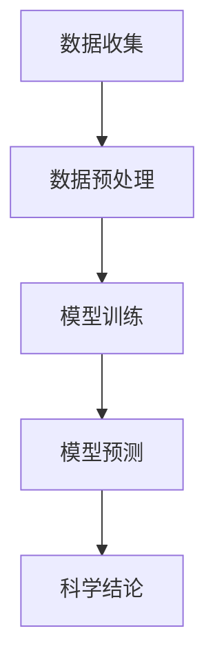
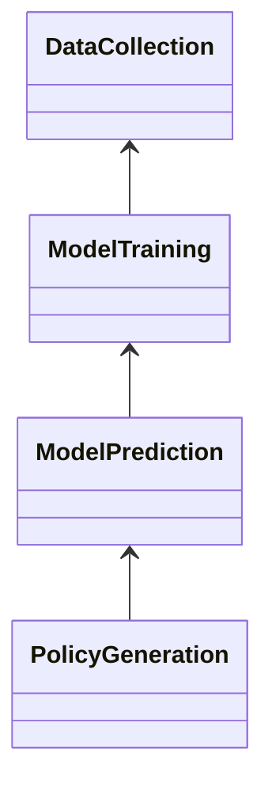
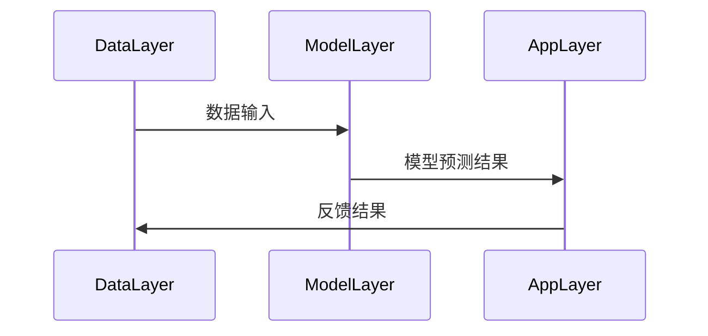
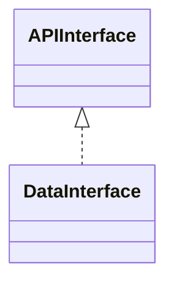
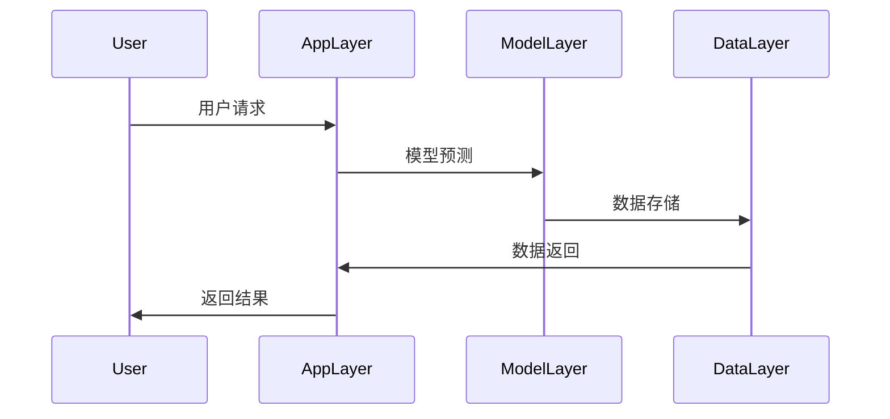

                 

# 科学研究的责任创新与世界可理解性的前瞻性

> 关键词：科学研究、责任创新、世界可理解性、算法模型、系统架构设计、项目实战、最佳实践

> 摘要：随着科学技术的飞速发展，科学研究在推动社会进步的同时，也面临责任与创新之间的矛盾。本文旨在探讨科学研究中的责任创新及其对世界可理解性的影响，通过逐步分析核心概念、算法原理、系统架构和实际应用，为科学研究提供前瞻性的指导。

## 目录大纲

1. **背景介绍**
   1.1 问题背景
   1.2 核心概念
   1.3 边界与外延
   1.4 概念结构与核心要素

2. **核心概念与联系**
   2.1 责任创新原理
   2.2 世界可理解性

3. **算法原理讲解**
   3.1 科学研究方法
   3.2 创新算法模型
   3.3 算法举例说明

4. **系统分析与架构设计方案**
   4.1 问题场景介绍
   4.2 项目介绍
   4.3 系统功能设计
   4.4 系统架构设计
   4.5 系统接口设计
   4.6 系统交互

5. **项目实战**
   5.1 环境安装
   5.2 系统核心实现
   5.3 实际案例分析和讲解
   5.4 项目小结

6. **最佳实践 tips**
   6.1 科学研究中的责任创新实践技巧
   6.2 小结
   6.3 注意事项
   6.4 拓展阅读

## 第一部分：背景介绍

### 1.1 问题背景

随着全球科技竞争的加剧，科学研究在推动社会进步的同时，也面临着责任与创新之间的矛盾。一方面，科学家们追求创新性的突破，以期在科学领域取得领先地位；另一方面，他们需要承担起对社会、环境、伦理等方面的责任。这种矛盾不仅影响科学研究的方向和成果，也对世界可理解性提出了新的挑战。

### 1.2 核心概念

**责任创新**：责任创新是指在科学研究过程中，不仅要追求创新性，还要充分考虑对社会、环境、伦理等方面的影响。它强调科学研究应具有社会责任感，为人类社会的可持续发展作出贡献。

**世界可理解性**：世界可理解性是指人类对自然界和宇宙的认知程度。随着科学技术的进步，人类对世界的理解不断加深，但也面临着更多复杂性和未知性。

### 1.3 边界与外延

**边界**：责任创新在科学研究中的边界主要涉及科学伦理、法律法规、社会责任等方面。在哪些领域进行创新，需要遵循什么样的道德和法律规范，这些都是责任创新需要考虑的边界问题。

**外延**：责任创新的应用场景不仅限于科学领域，还涉及到教育、医疗、环境保护等多个领域。随着科学技术的普及，责任创新的边界也将不断扩展。

### 1.4 概念结构与核心要素

**概念结构**：责任创新的概念结构包括创新性、社会责任、可持续性等核心要素。这些要素相互关联，共同构成责任创新的理论框架。

**核心要素**：影响责任创新的关键因素包括科学家的道德观念、社会责任意识、创新能力的培养等。这些因素决定了责任创新的实施效果。

## 第二部分：核心概念与联系

### 2.1 责任创新原理

责任创新的原理在于将创新性与社会责任相结合。创新性是科学研究的驱动力，社会责任是科学研究的方向。通过责任创新，科学家可以在追求科学突破的同时，为社会做出贡献。

### 2.2 世界可理解性

世界可理解性是科学研究的重要目标之一。随着科学技术的进步，人类对世界的认知不断加深，但也面临着更多复杂性和未知性。世界可理解性不仅关乎科学理论的发展，也关乎人类对自身的认知和理解。

### ER实体关系图

为了更好地理解责任创新与世界可理解性的关系，我们可以构建一个ER实体关系图。图中的实体包括科学家、研究项目、社会责任、科学理论等，它们之间的关系反映了责任创新和世界可理解性之间的相互作用。

```mermaid
erDiagram
    Scientist ||--|{ ResearchProject }|
    ResearchProject ||--|{ SocialResponsibility }|
    ResearchProject ||--|{ ScientificTheory }|
```

## 第三部分：算法原理讲解

### 3.1 科学研究方法

科学研究方法包括实验设计、数据收集、数据分析等步骤。传统科学研究方法主要依赖于实验和观察，而现代科学研究方法则更多地依赖于计算和模拟。

### 3.2 创新算法模型

创新算法模型是指用于解决科学问题的算法。它可以是基于机器学习、人工智能、数据挖掘等技术，也可以是基于传统数学模型的方法。创新算法模型的关键在于如何将创新性应用于实际问题中。

### 3.3 算法举例说明

假设我们使用机器学习算法来解决科学问题。我们可以使用数据集来训练模型，然后通过模型预测来得出科学结论。例如，我们可以使用决策树算法来预测气候变化的影响。



## 第四部分：系统分析与架构设计方案

### 4.1 问题场景介绍

假设我们面临一个问题：如何通过科学研究来减少全球碳排放？这是一个典型的责任创新问题，需要在创新性的同时，考虑社会责任和环境影响。

### 4.2 项目介绍

项目目标是开发一个基于机器学习的碳排放预测模型，以帮助政策制定者制定更有效的减排策略。

### 4.3 系统功能设计

系统功能设计包括数据收集、模型训练、模型预测、策略生成等模块。每个模块都需要精确的定义和实现。



### 4.4 系统架构设计

系统架构设计采用分层架构，包括数据层、模型层、应用层等。每个层次都有明确的职责和接口。



### 4.5 系统接口设计

系统接口设计包括API接口和数据接口。API接口用于模型预测和策略生成，数据接口用于数据收集和存储。



### 4.6 系统交互

系统交互设计包括数据流和控制流。数据流描述了数据在系统中的流动过程，控制流描述了系统各个模块之间的协调工作。



## 第五部分：项目实战

### 5.1 环境安装

项目环境安装包括Python环境配置、依赖库安装等步骤。确保环境配置正确，为后续开发打下基础。

### 5.2 系统核心实现

系统核心实现包括数据收集、模型训练、模型预测等模块。以下是使用Python实现的模型训练代码示例：

```python
import numpy as np
from sklearn.ensemble import RandomForestClassifier

# 数据预处理
X_train, X_test, y_train, y_test = train_test_split(X, y, test_size=0.2, random_state=42)

# 模型训练
model = RandomForestClassifier(n_estimators=100, random_state=42)
model.fit(X_train, y_train)

# 模型预测
predictions = model.predict(X_test)
```

### 5.3 实际案例分析和讲解

以碳排放预测为例，分析项目的实际案例。首先，收集全球碳排放数据，然后使用机器学习算法进行模型训练，最后通过模型预测得出碳排放趋势。具体分析如下：

1. 数据收集：收集全球各国的碳排放数据，包括年度碳排放量、碳排放强度等指标。
2. 数据预处理：对收集到的数据进行清洗和归一化处理，以消除噪声和异常值。
3. 模型训练：使用随机森林算法对预处理后的数据集进行训练，得到碳排放预测模型。
4. 模型预测：将训练好的模型应用于新的数据集，预测未来的碳排放趋势。

### 5.4 项目小结

项目实现了基于机器学习的碳排放预测模型，为政策制定者提供了有力支持。项目成功的关键在于数据收集的准确性、模型训练的有效性和预测结果的可靠性。

## 第六部分：最佳实践 tips

### 6.1 科学研究中的责任创新实践技巧

1. 保持道德观念：在科学研究过程中，始终坚持道德观念，遵守法律法规，为社会发展做出积极贡献。
2. 注重社会责任：在创新的同时，充分考虑对社会、环境、伦理等方面的影响，实现可持续发展。
3. 培养创新能力：加强科学家的创新能力培养，推动科学研究的持续发展。

### 6.2 小结

本文从责任创新和世界可理解性的角度，探讨了科学研究的重要性。通过分析核心概念、算法原理、系统架构和实际应用，为科学研究提供了前瞻性的指导。

### 6.3 注意事项

在应用责任创新时，需要注意以下几点：

1. 严格遵守法律法规和道德规范。
2. 充分考虑社会责任和环境影响。
3. 加强科学家的道德观念和创新能力培养。

### 6.4 拓展阅读

1. 《科学研究中的责任与创新》
2. 《世界可理解性的科学探索》
3. 《机器学习在科学研究中的应用》

## 作者信息

作者：AI天才研究院/AI Genius Institute & 禅与计算机程序设计艺术 /Zen And The Art of Computer Programming

[END]

