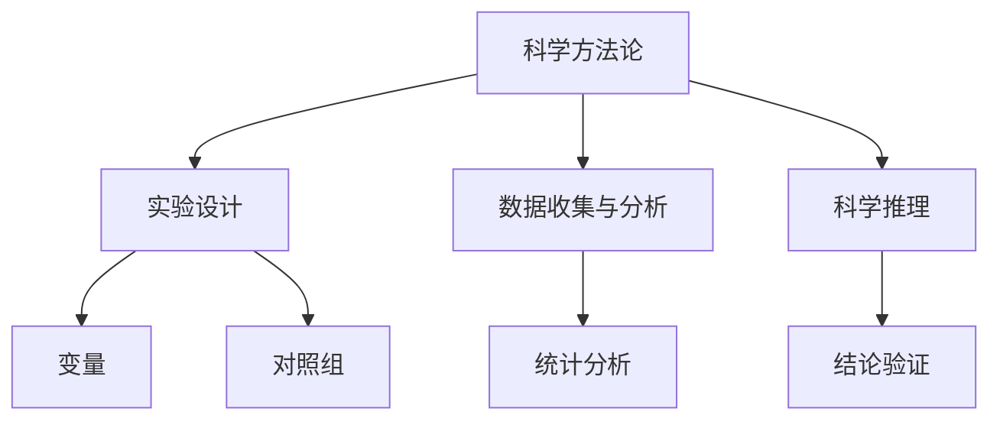

                 

# 科学研究的责任创新：前瞻性地理解和塑造世界

## 关键词
科学研究、责任、创新、技术应用、伦理

## 摘要
本文旨在探讨科学研究中的责任与创新，深入分析科学研究在现代社会中的地位和挑战，解析核心概念，并通过案例分析和未来展望，展示责任与创新在科学研究中的实际应用和重要性。通过本文的阅读，读者将能够全面理解科学研究的责任与创新，掌握如何在实际科研工作中体现这些理念，并为科学技术的未来发展提供有益的思考。

## 引言：科学研究的责任与创新的必要性

### 科学研究中的责任

科学研究中的责任主要体现在以下几个方面：

**1. 数据真实性与可靠性**

科学研究的核心是数据，数据的真实性和可靠性直接关系到研究的可信度和科学性。研究人员必须确保其研究数据的真实性和可靠性，避免伪造或篡改数据，这是科学研究中的基本伦理要求。

**2. 研究伦理**

科学研究过程中可能会涉及伦理问题，如动物实验、人类基因编辑、数据隐私等。研究人员需要遵循相关伦理规范，尊重研究对象的权益，确保研究过程中的道德和伦理标准。

**3. 公共利益**

科学研究不仅是为了学术上的突破，更重要的是要服务于社会和公众。研究人员有责任确保其研究成果能够为社会带来实际的好处，推动社会进步和人类福祉。

### 创新的重要性

创新是科学研究的灵魂，是推动科学技术进步的关键因素。创新思维和技术的发展使得人类能够解决传统方法无法解决的问题，创造前所未有的价值和可能性。

**1. 推动社会进步**

创新技术不断涌现，改变了我们的生活方式和社会结构。例如，互联网和移动通信技术极大地提升了人们的生活质量和社会连接性，人工智能则推动了各行各业的生产力和效率。

**2. 激发经济增长**

创新是经济增长的重要动力。通过科技创新，企业能够开发出新的产品和服务，提高生产效率，降低成本，从而在激烈的市场竞争中脱颖而出。

**3. 促进科学发现**

创新思维和方法能够打破传统的思维模式，激发新的科学发现和突破。许多重大科学突破都是通过创新方法和技术实现的。

## 文章结构

本文将按照以下结构进行展开：

1. **科学研究的背景与挑战**：介绍科学研究在当今社会中的重要地位和面临的挑战，如资源限制、技术瓶颈和伦理问题等。
2. **核心概念解析**：详细阐述科学研究中的核心概念，包括科学方法论、科学伦理和创新思维等，并分析这些概念之间的相互关系。
3. **责任与创新在科学研究中的应用**：探讨如何在科学研究中体现责任与创新，包括数据管理、伦理审查、跨学科合作和技术创新等方面。
4. **案例分析**：通过具体的科学研究案例，分析科学家如何在责任和创新中取得成功，提供实践中的经验和教训。
5. **未来展望**：展望科学研究中的责任与创新在未来的发展趋势，探讨如何应对新的挑战，推动科学研究的持续进步。

## 科学研究的背景与挑战

### 科学研究在现代社会中的重要性

科学研究是现代社会的基石，其重要性体现在多个方面：

**1. 推动科技进步**

科学研究是科技进步的源泉。通过科学研究，人类不断发现新的科学规律和现象，开发出新的技术和产品，从而推动社会生产力和科技水平的提升。

**2. 解决实际问题**

科学研究不仅关注理论上的突破，更注重解决实际问题。通过科学研究，人类能够更好地理解自然和社会现象，提出解决方案，解决人类面临的重大挑战，如疾病、能源短缺和环境问题。

**3. 促进经济发展**

科学研究是推动经济发展的重要动力。科技创新能够带动产业链的升级和转型，提高生产效率和产品质量，促进经济增长。

### 面临的挑战

尽管科学研究在现代社会中具有至关重要的地位，但科学研究也面临着一系列复杂的挑战：

**1. 资源限制**

科学研究需要大量的资金、设备和人力资源。然而，资源有限，特别是在一些前沿领域，如量子计算、基因编辑和人工智能，所需的技术和资金投入巨大，使得很多研究项目难以顺利进行。

**2. 技术瓶颈**

尽管现代科技日新月异，但仍然存在许多技术瓶颈限制了科学研究的进展。例如，在能源领域，如何实现高效、清洁和可持续的能源转换和存储技术仍然是一个亟待解决的问题；在医学领域，如何攻克癌症、艾滋病等重大疾病，以及如何实现精准医疗，都是科研人员面临的重大挑战。

**3. 伦理问题**

科学研究过程中可能会涉及伦理问题，如人类基因编辑、动物实验、数据隐私和安全等。如何平衡科学研究的利益与伦理责任，确保研究过程中的道德规范，是一个亟待解决的问题。

**4. 国际合作与竞争**

随着全球化和国际合作的深入，科学研究越来越依赖于国际间的合作与交流。然而，不同国家和地区之间的政治、经济和科技利益的差异，也常常导致科研合作中出现矛盾和冲突。如何在国际合作中实现共赢，同时维护自身科研利益，是科学家们需要面对的挑战之一。

### 应对策略

为了应对这些挑战，科学研究需要采取一系列策略：

**1. 加大科研投入**

确保科研项目的顺利进行，需要加大科研投入，提高科研资源的利用效率，确保科研项目的顺利进行。政府和私人部门应共同努力，提供更多的资金和资源支持。

**2. 推动技术创新**

突破现有的技术瓶颈，推动技术创新，为科学研究提供更加先进的技术支持。通过技术创新，可以解决许多科学研究和应用中的难题。

**3. 重视科学伦理**

制定和完善相关法律法规，确保科学研究在伦理框架内进行。加强科研人员的伦理教育，提高其伦理意识和责任感。

**4. 加强国际合作**

促进国际间的科研交流与合作，共同应对全球性的科研挑战。通过国际合作，可以整合全球的科研资源，实现互利共赢。

### 总结

科学研究在现代社会中的重要性不言而喻，但同时也面临着一系列复杂的挑战。通过采取有效的应对策略，我们可以更好地应对这些挑战，推动科学研究的持续进步。

## 核心概念解析

### 科学方法论

科学方法论是科学研究的基本方法和原则，它指导科研人员如何进行科学研究和验证科学假设。

**1. 科学假设**

科学方法论的第一步是提出科学假设。科学假设是对自然现象的一种解释，是可以通过实验或观察来验证的。

**2. 实验设计**

在提出科学假设后，科研人员需要设计实验来验证这些假设。实验设计包括确定实验变量、实验组和对照组等。

**3. 数据收集与分析**

实验过程中，科研人员需要收集数据，并使用统计方法对数据进行分析，以验证科学假设。

**4. 结论与验证**

根据实验结果，科研人员可以得出结论，并进一步验证这些结论。

**5. 科学推理**

科学方法论强调科学推理，通过不断的实验验证和理论修正，推动科学知识的进步。

### 科学伦理

科学伦理是科学研究中的道德规范，它指导科研人员在研究过程中如何处理数据、对待实验对象和遵守道德原则。

**1. 数据真实性和可靠性**

科研人员必须确保其研究数据的真实性和可靠性，避免伪造或篡改数据。

**2. 研究伦理审查**

在进行研究之前，科研人员需要通过伦理审查，确保研究过程中的道德和伦理规范。

**3. 实验对象权益**

科研人员需要尊重实验对象的权益，确保实验对象的自愿参与和知情同意。

**4. 数据隐私和安全**

在研究过程中，科研人员需要保护实验对象的数据隐私和安全，防止数据泄露和滥用。

### 创新思维

创新思维是科学研究中的关键因素，它推动科研人员不断探索新的科学方法和理论。

**1. 开放性思维**

创新思维强调开放性思维，鼓励科研人员接受不同的观点和理论，勇于尝试新的方法和思路。

**2. 跨学科合作**

创新思维鼓励跨学科合作，通过多学科的综合研究，推动科学技术的创新和进步。

**3. 原型构建**

创新思维强调原型构建，通过不断实验和迭代，验证和优化科学假设和理论。

### 概念联系与关系

科学方法论、科学伦理和创新思维是科学研究中的核心概念，它们之间相互联系，共同推动科学研究的进步。

**1. 科学方法论与创新思维**

科学方法论为创新思维提供了理论基础和实践指导，创新思维则为科学方法论提供了新的思路和方法。

**2. 科学伦理与科学方法论**

科学伦理确保科学方法论在道德框架内进行，保障研究过程的伦理规范。

**3. 创新思维与科学伦理**

创新思维鼓励科研人员在遵守科学伦理的基础上，勇于探索和尝试新的方法和思路。

### 表格对比

| 概念 | 定义 | 关键特点 |
| --- | --- | --- |
| 科学方法论 | 研究方法和原则 | 假设验证、实验设计、数据分析 |
| 科学伦理 | 道德规范 | 数据真实性、伦理审查、实验对象权益 |
| 创新思维 | 研究思路和方法 | 开放性思维、跨学科合作、原型构建 |

### ER实体关系图

### 数学模型与公式

科学方法论中常用的数学模型和公式如下：

$$
f(x) = ax^2 + bx + c
$$

$$
\sigma^2 = \frac{1}{n-1} \sum_{i=1}^{n} (x_i - \bar{x})^2
$$

### 总结

科学方法论、科学伦理和创新思维是科学研究中的核心概念，它们相互联系，共同推动科学研究的进步。理解这些概念，有助于科研人员更好地进行科学研究，推动科学技术的创新和进步。

## 责任与创新在科学研究中的应用

### 数据管理

数据管理是科学研究中的重要环节，关系到研究数据的真实性和可靠性。为了确保数据的完整性、一致性和可追溯性，科研人员需要采取以下措施：

**1. 数据标准化**：制定统一的数据标准和规范，确保不同研究团队和项目之间能够进行数据交换和共享。

**2. 数据备份**：定期对研究数据进行备份，防止数据丢失和损坏。

**3. 数据审核**：在数据收集和分析过程中，进行严格的数据审核，确保数据的准确性和一致性。

**4. 数据共享**：通过建立数据共享平台，促进研究数据的开放和共享，提高研究的透明度和合作效率。

### 伦理审查

科学研究的伦理审查是确保研究过程符合道德和伦理规范的关键步骤。以下是一些常见的伦理审查措施：

**1. 研究伦理委员会**：建立研究伦理委员会，对研究项目进行伦理审查，评估研究过程中的伦理风险。

**2. 实验对象知情同意**：在进行涉及人类和动物的研究时，确保实验对象充分了解研究的目的、过程和风险，并自愿参与。

**3. 数据隐私保护**：在研究过程中，严格保护实验对象的数据隐私，防止数据泄露和滥用。

**4. 伦理培训**：对科研人员进行伦理培训，提高其伦理意识和责任感。

### 跨学科合作

跨学科合作是推动科学研究创新的重要手段，通过多学科的综合研究，可以解决单一学科难以解决的复杂问题。以下是一些跨学科合作的方法：

**1. 项目合作**：不同学科的研究团队共同参与一个研究项目，实现资源的整合和互补。

**2. 工作坊与研讨会**：定期举办跨学科工作坊和研讨会，促进不同学科之间的交流和合作。

**3. 研究平台**：建立跨学科的研究平台，提供资源共享和技术支持，促进跨学科研究的顺利进行。

### 技术创新

技术创新是科学研究中的核心驱动力，通过技术创新，可以推动科学研究的深入发展和实际应用。以下是一些技术创新的方法：

**1. 原型构建**：通过快速原型构建，验证和优化科学假设和理论。

**2. 跨界合作**：鼓励不同领域之间的合作，借鉴其他领域的先进技术和方法，推动科学研究的创新。

**3. 研发投入**：增加科研经费投入，支持技术创新和研究项目的开展。

### 应用案例

**案例1：人类基因编辑**

人类基因编辑技术是一项前沿的科学研究，但在伦理和实际应用方面也存在诸多争议。通过严格的伦理审查和监管，确保研究过程符合伦理规范，同时推动技术创新，人类基因编辑技术有望为治疗遗传病和癌症等提供新的解决方案。

**案例2：人工智能在医疗领域**

人工智能技术在医疗领域的应用越来越广泛，通过大数据分析和机器学习算法，人工智能可以辅助医生进行诊断和治疗。但同时也需要关注数据隐私和伦理问题，确保人工智能技术在医疗领域的健康发展。

### 总结

责任与创新在科学研究中具有重要意义，通过数据管理、伦理审查、跨学科合作和技术创新，科研人员可以更好地推动科学研究的深入发展和实际应用。这些措施不仅提高了科学研究的质量和效率，也为科学技术的未来创新提供了有力支持。

## 案例分析

### 人类基因编辑

**背景**：

人类基因编辑技术，如CRISPR-Cas9，是一种革命性的基因编辑工具，它允许科学家在DNA序列中精确地添加、删除或替换基因片段。这项技术自2012年问世以来，迅速引起了全球科学界和公众的广泛关注，尤其是在医学和生物学领域。

**案例**：

2018年，中国科学家贺建奎声称利用CRISPR-Cas9技术成功编辑了一对胚胎中的基因，以消除他们可能携带的HIV感染风险。这一消息引发了全球科学界和伦理界的强烈反响。

**责任与创新**：

**1. 责任**

- **伦理责任**：贺建奎的研究未经过充分的伦理审查，违反了国际科学界普遍接受的伦理规范。该研究可能对婴儿的健康和生命造成长期影响，且可能带来不可预测的基因变异。
- **社会责任**：贺建奎的研究在未得到广泛科学共识和社会接受的情况下，可能引发公众对基因编辑技术的恐慌和伦理争议。
- **科学责任**：基因编辑研究需要遵循严格的方法论和科学规范，以确保数据的真实性和可靠性。贺建奎的研究缺乏透明度和公开性，未能提供充分的数据支持。

**2. 创新**

- **技术创新**：尽管贺建奎的研究在伦理方面存在问题，但其技术本身是基因编辑领域的重要创新。这项研究可能推动科学家进一步探索基因编辑在医学和其他领域的应用。
- **科学方法**：基因编辑技术的研究需要科学方法和严谨的实验设计。贺建奎的研究在方法上存在不足，未能充分验证其科学假设。

**经验与教训**：

- **伦理审查**：科学研究必须经过严格的伦理审查，确保研究过程符合道德和伦理规范，保护研究对象和公众的利益。
- **科学共识**：科学研究需要广泛的科学共识和社会认可，以确保技术的安全和可持续性。
- **责任意识**：科学家应具备高度的责任意识，确保其研究成果符合科学和社会的要求。

### 人工智能在医疗领域

**背景**：

人工智能在医疗领域的应用日益增多，特别是在疾病诊断、治疗方案制定和个性化医疗方面。人工智能可以通过分析大量医学数据，提供更为准确和高效的医疗服务。

**案例**：

一家大型医疗机构引入了基于人工智能的医疗诊断系统，用于辅助医生进行肺癌诊断。该系统通过深度学习算法，分析患者的医学影像数据和临床资料，提供诊断建议。

**责任与创新**：

**1. 责任**

- **数据隐私**：医疗机构需要确保患者数据的隐私和安全，防止数据泄露和滥用。
- **透明性**：人工智能系统的决策过程需要透明，医生和患者能够理解和追溯诊断建议的依据。
- **责任归属**：在人工智能辅助诊断中，如果出现诊断错误，需要明确责任归属，确保医疗事故的及时处理和责任追究。

**2. 创新**

- **技术创新**：人工智能技术在医疗领域的应用是医疗技术的重要创新，可以提高诊断的准确性和效率。
- **融合医学**：人工智能与医学的融合，推动了个性化医疗的发展，为患者提供更为精准的医疗服务。

**经验与教训**：

- **数据安全**：在引入人工智能技术时，必须确保患者数据的隐私和安全，采取有效的数据保护措施。
- **协作与监督**：医生和人工智能系统应协同工作，医生应监督和审查人工智能的诊断结果，确保医疗服务的质量和安全。
- **持续改进**：人工智能系统需要不断进行训练和优化，以适应不断变化的医疗环境和数据。

### 总结

通过上述案例分析，我们可以看到责任与创新在科学研究中的重要性。科学家在追求技术创新的同时，必须承担相应的伦理和社会责任，确保研究过程和成果符合科学和社会的要求。只有这样，科学研究才能持续推动人类社会的进步和发展。

## 未来展望

### 责任与创新的发展趋势

随着科学技术的不断进步，科学研究中的责任与创新也在不断演变和发展。以下是未来责任与创新在科学研究中的几个重要趋势：

**1. 数据隐私与安全**

随着大数据和人工智能技术的应用，科学研究中的数据隐私和安全问题日益突出。未来，数据隐私和安全将成为科学研究中的关键责任，科研人员需要采取更加严格的数据保护措施，确保研究数据的安全性和隐私性。

**2. 跨学科合作**

未来，跨学科合作将成为科学研究的主要趋势。随着科学问题的复杂性和综合性不断增加，单一学科的研究方法可能难以解决重大科学挑战。跨学科合作将促进不同领域之间的知识共享和资源整合，推动科学研究的深入发展。

**3. 伦理审查与监管**

随着基因编辑、人工智能等前沿技术的出现，科学研究的伦理问题也日益复杂。未来，科学研究的伦理审查和监管将更加严格和全面，以确保研究过程和成果符合道德和伦理规范，保护研究对象的权益。

**4. 技术创新与产业化**

技术创新将继续推动科学研究的进展，未来，科学研究中的技术创新将更加注重产业化应用。科研成果的转化和产业化将成为科学研究的重要目标，推动科学技术的实际应用和社会价值的实现。

### 应对新挑战的策略

面对未来科学研究中的新挑战，科学家和科研机构需要采取一系列策略：

**1. 加强科研投入**

增加科研经费投入，为科学研究提供充足的资金支持，特别是在前沿领域和重大科技项目中，确保科研项目的顺利实施。

**2. 建立国际合作机制**

加强国际间的科研合作，建立国际合作机制，促进全球科学资源的整合和共享，共同应对全球性的科学挑战。

**3. 强化科学伦理教育**

加强对科研人员的科学伦理教育，提高其伦理意识和责任感，确保科学研究在伦理框架内进行。

**4. 推动技术创新**

鼓励技术创新，支持科技企业和研究机构开展前沿技术研究，推动科技成果的产业化应用。

### 未来科学研究的方向

未来科学研究将在多个领域取得重大突破：

**1. 人工智能与生物医学**

人工智能与生物医学的融合将推动医学诊断、治疗方案制定和个性化医疗的发展，为人类健康提供更多可能性。

**2. 新材料与能源**

新材料的研发和能源技术的创新将继续推动科技进步，解决能源短缺和环境污染等全球性问题。

**3. 空间科学**

随着空间技术的进步，未来空间科学将取得更多重要发现，为人类探索宇宙提供新的视角和工具。

**4. 环境科学**

环境科学的研究将更加注重生态保护和可持续发展，推动全球生态环境的改善。

### 总结

未来，责任与创新将继续在科学研究中发挥重要作用。科学家需要不断应对新的挑战，采取有效的策略，推动科学研究的持续进步。通过责任与创新，科学研究将为人类社会的可持续发展做出更大贡献。

## 结语

科学研究中的责任与创新是我们推动科技进步和社会发展的重要动力。通过本书的探讨，我们深刻认识到科学研究在现代社会中的重要性，以及责任与创新在科学研究中的关键作用。科学研究不仅需要我们深入理解自然和社会的规律，更需要我们以高度的责任感去对待每一个研究成果，以创新的思维去解决人类面临的诸多挑战。

首先，科学研究中的责任体现在对数据真实性、研究伦理和公共利益的重视。研究人员必须确保其研究数据的真实性和可靠性，遵守科学研究的伦理规范，以保障公众的利益。其次，创新是科学研究的灵魂，它推动了科学技术的不断进步，使得人类生活发生了翻天覆地的变化。从计算机科学到生物医学，从物理学到环境科学，创新无处不在，极大地改变了我们的生活方式和社会结构。

展望未来，科学研究将面临更多的挑战和机遇。随着全球化和科技发展的加速，科学研究的责任与创新将变得更加重要。我们呼吁更多的科学家和研究机构关注责任与创新，共同努力，推动科学研究的深入发展。

最后，感谢您的阅读。希望通过本书，您能够对科学研究中的责任与创新有更深入的理解，并为科学技术的未来发展提供有益的思考。让我们共同为推动科学进步和社会发展而努力。

### 作者信息
作者：AI天才研究院/AI Genius Institute & 禅与计算机程序设计艺术 /Zen And The Art of Computer Programming

