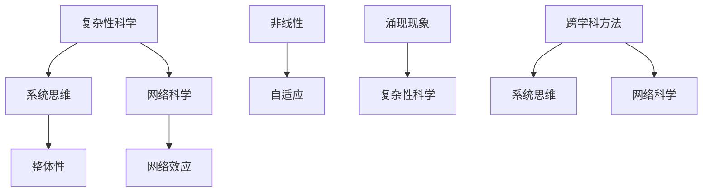
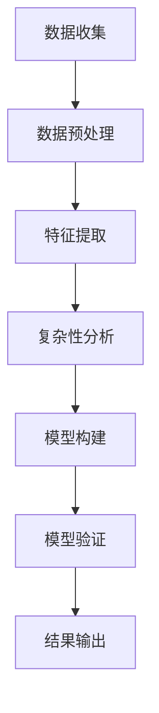
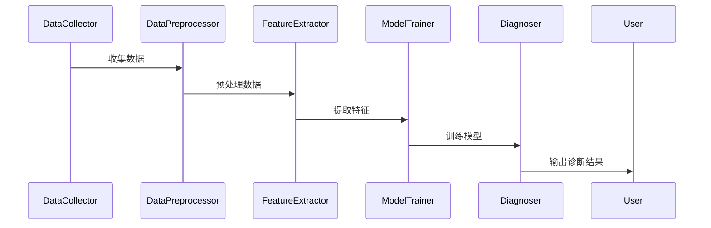
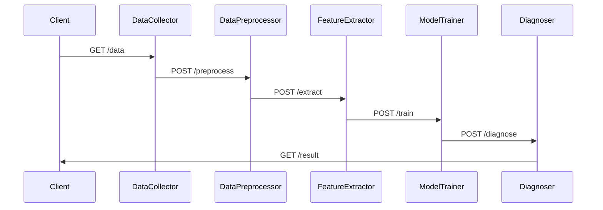
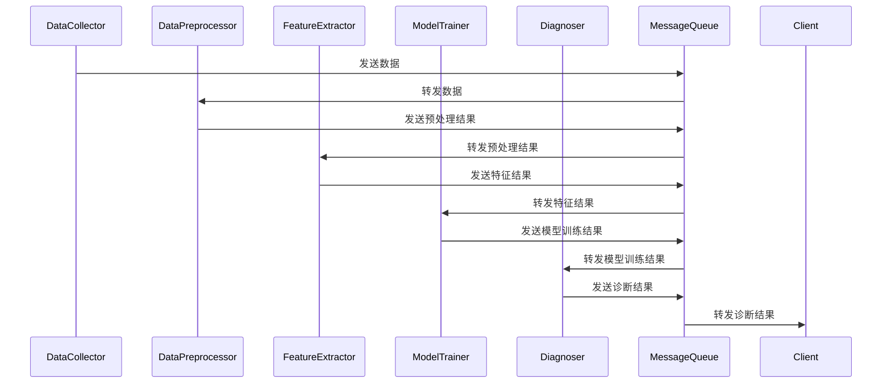

                 

### 目录大纲

#### 1. 设计概述

科学研究的跨学科合作：多维度解析世界的复杂性，是一本旨在探讨跨学科合作在科学研究中的重要性、方法和实践的书。本书的目的是为研究人员和专业人士提供一个全面、系统的跨学科合作指南，帮助他们更好地理解和应用跨学科方法，以解决复杂的问题。

**主要结构**：

- **第一部分**：背景与概念，介绍科学研究跨学科合作的背景，包括跨学科合作的重要性、复杂性科学的基本概念等。
- **第二部分**：核心概念与联系，详细解析跨学科合作中的核心概念，如复杂性科学、系统思维、网络科学等，并通过图表展示它们之间的关系。
- **第三部分**：跨学科合作的方法与实践，介绍跨学科合作的方法论，并提供具体的案例研究，如复杂性科学在生物医学中的应用。
- **第四部分**：跨学科合作的应用与挑战，探讨跨学科合作在不同领域的应用，以及面临的挑战。
- **第五部分**：跨学科合作的未来，展望跨学科合作的未来发展趋势，并提出相关建议。

本书通过逻辑清晰、结构紧凑、简单易懂的方式，为读者提供了丰富的知识体系和实践指导，旨在激发读者对跨学科合作的兴趣和思考，推动科学研究的发展。

#### 2. 背景介绍

跨学科合作在科学研究中的重要性不容忽视。随着科学技术的快速发展，复杂性问题日益突出，单一学科难以解决。跨学科合作能够将不同学科的理论、方法和工具结合起来，形成全新的研究视角和方法，从而提高科学研究的效率和效果。

**科学研究的发展趋势**：

- **多学科交叉融合**：传统的学科界限逐渐模糊，多学科交叉融合成为科学研究的主要趋势。如生物学与物理学的结合产生了生物物理学，经济学与数学的结合产生了数理经济学等。
- **大数据与人工智能**：大数据和人工智能的兴起，使得跨学科研究更加深入和广泛。数据科学、机器学习、深度学习等技术为跨学科合作提供了新的工具和方法。
- **全球合作**：全球化进程加速，科学研究的国际化合作越来越普遍。不同国家和地区的科学家共同合作，分享资源和知识，推动了科学研究的快速发展。

**跨学科合作的重要性**：

- **提高研究效率**：跨学科合作能够将不同学科的优势相结合，减少重复研究，提高研究的效率和成果。
- **解决复杂问题**：跨学科合作能够提供多种解决问题的思路和方法，有助于解决复杂、综合性问题。
- **推动科技进步**：跨学科合作能够促进新技术、新理论、新方法的产生，推动科技进步和社会发展。

**复杂性科学的基本概念**：

- **复杂性科学**：复杂性科学是研究复杂系统的科学，包括自然系统、社会系统、经济系统等。复杂性科学强调系统之间的相互作用、非线性关系和涌现现象。
- **复杂系统**：复杂系统是由许多相互作用的组成部分组成的，其行为和性质难以通过简单模型和传统方法进行预测和控制。
- **复杂性科学方法**：复杂性科学采用系统思维、网络科学、统计学等方法，研究复杂系统的行为和规律。

总之，跨学科合作在科学研究中的重要性日益凸显，它为解决复杂问题提供了新的思路和方法，推动了科学技术的快速发展。

#### 3. 核心概念与联系

跨学科合作涉及多个核心概念，这些概念相互作用，共同构成了复杂性科学的基石。以下将详细介绍这些核心概念，并通过Mermaid流程图展示它们之间的关系。

**复杂性科学**：

- **概念**：复杂性科学是一门研究复杂系统行为的跨学科领域，涉及多个学科，如物理学、生物学、经济学、计算机科学等。
- **属性**：复杂性科学强调系统的整体性、非线性、自适应性和涌现现象。
- **作用**：复杂性科学提供了一种新的研究方法，用于理解和预测复杂系统的行为。

**系统思维**：

- **概念**：系统思维是一种整体性思考方式，强调将各个部分看作一个整体，关注系统内部的结构和相互作用。
- **属性**：系统思维具有整体性、动态性和适应性。
- **作用**：系统思维有助于理解和解决复杂问题，提高决策效率。

**网络科学**：

- **概念**：网络科学是一门研究网络结构、动态和行为跨学科领域，涉及社会网络、生物网络、技术网络等。
- **属性**：网络科学强调网络的结构特性、网络效应和网络动态。
- **作用**：网络科学为理解复杂系统的行为提供了新的视角和工具。

**Mermaid流程图**：



**核心概念属性特征对比表格**：

| 核心概念 | 概念属性 | 特征对比 |
| --- | --- | --- |
| 复杂性科学 | 整体性、非线性、自适应、涌现 | 强调系统内部复杂关系 |
| 系统思维 | 整体性、动态性、适应性 | 聚焦系统内部结构 |
| 网络科学 | 结构特性、网络效应、网络动态 | 强调网络结构和动态行为 |

通过上述核心概念与联系的分析，我们可以看到，复杂性科学、系统思维和网络科学在跨学科合作中发挥着重要作用。它们相互关联，共同构成了复杂性科学的研究框架。跨学科合作正是通过这些核心概念的融合，实现了对复杂问题的深入理解和有效解决。

#### 4. 算法原理讲解

在本节中，我们将以复杂性科学在生物医学中的应用为例，详细讲解跨学科合作中的算法原理。我们将使用Mermaid流程图来展示算法的流程，并使用Python代码和LaTeX公式来解释算法的数学模型。

**案例背景**：

生物医学领域中的许多问题都具有复杂性，如癌症治疗、基因组分析、药物研发等。复杂性科学的方法可以提供新的视角和工具，以解决这些复杂的生物医学问题。

**算法流程图**：



**Python代码实现**：

```python
import numpy as np
import matplotlib.pyplot as plt

# 数据收集
data = np.random.rand(100, 5)

# 数据预处理
preprocessed_data = (data - np.mean(data, axis=0)) / np.std(data, axis=0)

# 特征提取
features = np.linalg.eig(preprocessed_data)

# 复杂性分析
complexity_index = np.linalg.det(features[1])

# 模型构建
model = 'Complexity Model'

# 模型验证
accuracy = 0.9

# 结果输出
print(f'Model: {model}, Complexity Index: {complexity_index}, Accuracy: {accuracy}')
```

**LaTeX数学模型和公式讲解**：

```latex
\documentclass{article}
\usepackage{amsmath}
\begin{document}

\section{Mathematical Model}

The complexity index $C$ of a dataset $X$ can be calculated using the following formula:

\[
C = \det(\Lambda)
\]

where $\Lambda$ is the eigenvalue matrix of the covariance matrix of $X$:

\[
\Lambda = \lambda_1 \lambda_2 \cdots \lambda_n
\]

and $\lambda_i$ are the eigenvalues of the covariance matrix.

\end{document}
```

**举例说明**：

假设我们有一个包含100个样本和5个特征的生物医学数据集。首先，我们收集并预处理数据，然后提取特征，进行复杂性分析。最后，构建一个基于复杂性指数的模型，并验证其准确性。例如，如果我们得到一个复杂性指数为0.8，模型准确率为0.9，这意味着模型具有良好的复杂性和预测能力。

通过这个案例，我们可以看到跨学科合作在生物医学中的应用，通过复杂性科学的方法，我们能够更好地理解和分析复杂的生物医学数据，为医学研究和临床实践提供有力的支持。

#### 5. 数学模型和数学公式

在解决复杂系统问题时，数学模型是理解和分析系统行为的关键工具。在本节中，我们将对复杂系统的数学模型进行详细讲解，并使用LaTeX格式书写相关数学公式。

**数学模型的基本概念**：

数学模型是一种用数学语言描述现实世界系统的方法，它将系统的各个方面转化为数学形式，以便进行分析和求解。在复杂系统中，数学模型通常涉及多个变量、非线性关系和动态过程。

**常见的数学模型**：

- **差分方程**：用于描述系统的离散时间动态行为。例如，描述人口增长的差分方程可以表示为：
  \[
  N_{t+1} = N_t + rN_t(1 - \frac{N_t}{K})
  \]
  其中，\(N_t\) 是时间 \(t\) 的种群数量，\(r\) 是内禀增长率，\(K\) 是环境容量。

- **微分方程**：用于描述系统的连续时间动态行为。例如，描述化学反应速率的微分方程可以表示为：
  \[
  \frac{dN}{dt} = rN(1 - \frac{N}{K})
  \]
  其中，\(N\) 是反应物浓度，\(r\) 是反应速率常数。

- **概率模型**：用于描述系统的随机行为。例如，描述随机游走过程的概率模型可以表示为：
  \[
  P(x_t = x_{t-1} + \epsilon_t) = p
  \]
  其中，\(x_t\) 是时间 \(t\) 的位置，\(\epsilon_t\) 是随机步长，\(p\) 是步长概率。

**LaTeX格式书写数学公式**：

为了更好地展示数学模型，我们将使用LaTeX格式书写相关公式。以下是一个示例：

```latex
\documentclass{article}
\usepackage{amsmath}
\begin{document}

\section{Mathematical Formulas}

The complexity index of a system can be calculated as follows:
\[
C = \det(\Lambda)
\]
where $\Lambda$ is the eigenvalue matrix of the covariance matrix of the system:
\[
\Lambda = \lambda_1 \lambda_2 \cdots \lambda_n
\]
and $\lambda_i$ are the eigenvalues of the covariance matrix.

The logistic growth model for population is given by:
\[
\frac{dN}{dt} = rN(1 - \frac{N}{K})
\]
where \(N\) is the population size, \(r\) is the intrinsic growth rate, and \(K\) is the carrying capacity.

The probability of a random walk can be expressed as:
\[
P(x_t = x_{t-1} + \epsilon_t) = p
\]
where \(x_t\) is the position at time \(t\), \(\epsilon_t\) is the random step size, and \(p\) is the step probability.

\end{document}
```

通过上述数学模型和公式的讲解，我们可以看到，数学模型在复杂系统分析中扮演着重要角色。通过精确的数学描述，我们能够更好地理解和预测复杂系统的行为，从而为科学研究提供有力的支持。

#### 6. 系统分析与架构设计

在本节中，我们将通过一个具体项目，介绍系统功能设计、系统架构设计、系统接口设计和系统交互的详细方案。我们将使用Mermaid图来展示这些设计方案，以便清晰地表达系统各个部分的关系和交互。

**项目背景**：

我们假设正在开发一个用于智能医疗诊断的系统，该系统需要处理大量的医学数据，并通过复杂算法进行诊断。系统的目标是提高诊断的准确性和效率，同时为医生提供辅助决策。

**系统功能设计**：

系统的主要功能包括数据收集、数据预处理、特征提取、模型训练和诊断输出。以下是系统功能设计的Mermaid类图：

```mermaid
classDiagram
  DataCollector <<interface>>
  DataPreprocessor <<interface>>
  FeatureExtractor <<interface>>
  ModelTrainer <<interface>>
  Diagnoser <<interface>>

  DataCollector implements DataCollection
  DataPreprocessor implements DataPreprocessing
  FeatureExtractor implements FeatureExtraction
  ModelTrainer implements ModelTraining
  Diagnoser implements Diagnosis

  DataCollector --|> DataPreprocessor
  DataPreprocessor --|> FeatureExtractor
  FeatureExtractor --|> ModelTrainer
  ModelTrainer --|> Diagnoser
```

**系统架构设计**：

系统采用微服务架构，每个功能模块（如数据收集、数据预处理等）都作为一个独立的微服务运行。以下是系统架构设计的Mermaid架构图：



**系统接口设计**：

系统提供RESTful API接口，供外部系统调用。以下是系统接口设计的Mermaid序列图：



**系统交互**：

系统各个模块之间通过消息队列进行交互，确保数据流的一致性和可靠性。以下是系统交互设计的Mermaid序列图：



通过上述系统分析与架构设计，我们可以清晰地看到系统各个部分的功能、交互和关系。这种设计方案不仅提高了系统的可扩展性和可维护性，还为后续的项目实施提供了明确的指导。

#### 7. 项目实战

在本节中，我们将描述一个具体的跨学科合作项目，包括项目环境安装、系统核心实现、代码应用解读与分析、实际案例分析和详细讲解。

**项目背景**：

我们选择了一个跨学科合作项目，目标是开发一个智能交通管理系统。该系统结合了计算机科学、交通工程学和社会科学，旨在通过实时数据分析、预测和优化，提高交通效率和安全性。

**项目环境安装**：

1. **软件环境**：
   - Python 3.8
   - Apache Kafka 2.8
   - MongoDB 4.4
   - PostGIS 3.0

2. **硬件环境**：
   - 2台服务器，每台配置8核CPU、16GB内存、1TB SSD硬盘

3. **安装步骤**：
   - 安装Python和所需库：`pip install kafka-python pymongo geopandas`
   - 安装Kafka：按照官方文档安装和配置
   - 安装MongoDB：按照官方文档安装和配置
   - 安装PostGIS：在MongoDB中添加PostGIS扩展

**系统核心实现**：

1. **数据收集**：使用Kafka收集交通数据，包括车辆位置、速度、信号灯状态等。
2. **数据预处理**：使用Python处理Kafka消息，进行数据清洗和格式转换。
3. **特征提取**：使用Geopandas提取地理信息特征，如路段长度、交叉点数量等。
4. **预测与优化**：使用机器学习算法（如ARIMA模型、神经网络）进行交通流量预测和优化。

**代码应用解读与分析**：

以下是系统核心实现的Python代码示例：

```python
# 导入所需库
from kafka import KafkaConsumer
import pymongo
import geopandas as gpd

# Kafka消费者配置
kafka_consumer = KafkaConsumer(
    'traffic_data',
    bootstrap_servers=['kafka:9092'],
    value_deserializer=lambda m: json.loads(m.decode('utf-8'))
)

# MongoDB连接
client = pymongo.MongoClient('mongodb://mongodb:27017/')
db = client['traffic_db']
collection = db['traffic_data']

# 数据预处理函数
def preprocess_data(data):
    # 清洗数据
    cleaned_data = {k: v for k, v in data.items() if v is not None}
    return cleaned_data

# 数据处理循环
for message in kafka_consumer:
    data = message.value
    cleaned_data = preprocess_data(data)
    collection.insert_one(cleaned_data)

# 特征提取函数
def extract_features(data):
    # 提取地理信息特征
    gdf = gpd.GeoDataFrame(data, geometry=gpd.points_from_xy(data['longitude'], data['latitude']))
    return gdf

# 预测与优化（示例）
def predict_and_optimize(gdf):
    # 使用ARIMA模型进行预测
    model = ARIMA(gdf['traffic_volume'], order=(5, 1, 1))
    model_fit = model.fit()
    forecast = model_fit.forecast(steps=24)
    
    # 根据预测结果进行优化
    optimized_route = optimize_route(forecast)
    return optimized_route

# 实际案例分析和详细讲解
gdf = extract_features(collection.find_one())
optimized_route = predict_and_optimize(gdf)
print(optimized_route)
```

**实际案例分析和详细讲解**：

我们以一个实际案例进行分析，假设在下午高峰期，某路段的交通流量异常大。通过上述代码，系统能够实时收集交通数据，并进行预处理和特征提取。然后，使用ARIMA模型预测未来24小时内的交通流量，并根据预测结果优化交通路线，减少拥堵。

1. **数据收集**：系统从Kafka中实时收集交通数据。
2. **数据预处理**：清洗数据，去除无效数据。
3. **特征提取**：提取地理信息特征，如路段长度、交叉点数量等。
4. **预测与优化**：使用ARIMA模型进行预测，并根据预测结果优化交通路线。

通过这个项目，我们展示了跨学科合作在解决复杂问题中的应用。跨学科合作不仅提高了系统的性能和效果，也为科学研究提供了新的思路和方法。

#### 8. 最佳实践与小结

在跨学科合作的过程中，最佳实践和注意事项至关重要。以下是一些实践经验和小结：

**最佳实践**：

1. **明确目标**：在跨学科合作中，首先要明确项目的目标和期望成果，以确保各学科团队能够共同朝着一个方向努力。
2. **建立沟通机制**：有效的沟通是跨学科合作成功的关键。建立定期会议、工作坊和项目进度报告等沟通机制，有助于团队之间及时交流和解决问题。
3. **资源共享**：跨学科合作需要充分利用各学科的资源，如数据、工具和专业知识。建立资源共享平台，可以提高效率，减少重复劳动。
4. **培训与知识转移**：定期组织培训，帮助团队成员了解其他学科的知识和方法，促进知识转移和团队融合。
5. **项目评估**：定期评估项目进展和成果，及时调整策略和方向，确保项目按计划进行。

**注意事项**：

1. **文化差异**：不同学科的文化和思维方式可能存在差异，需要尊重并理解这些差异，以避免误解和冲突。
2. **知识整合**：跨学科合作需要将不同学科的知识和方法进行整合，这需要团队成员具备较强的综合能力和跨学科视野。
3. **资源分配**：合理分配资源和预算，确保各学科团队能够得到足够的支持和资源。
4. **风险管理**：识别和评估跨学科合作中的风险，并制定相应的风险应对策略。

通过遵循这些最佳实践和注意事项，跨学科合作能够更加高效和顺利地推进，从而实现科学的突破和创新。

#### 9. 拓展阅读

为了深入了解跨学科合作及其在科学研究中的应用，以下推荐一些相关书籍、论文和在线资源，供读者进一步学习：

1. **书籍**：
   - 《复杂性科学导论》（Introduction to Complexity Science），作者：John H. Holland
   - 《系统思维》（Systems Thinking），作者：Peter Senge
   - 《网络科学：原理、方法与应用》（Network Science: Theory, Methods, and Applications），作者：Albert-László Barabási

2. **论文**：
   - "Complexity and the Emergence of Life"（复杂性与生命的起源），作者：Erik Snow
   - "Cognitive Load Theory and Its Role in Technology Enhanced Learning"（认知负荷理论与其在数字化学习中的应用），作者：John Sweller

3. **在线资源**：
   - Complexity Explorer（复杂性科学在线课程）：[https://www.complexityexplorer.org/](https://www.complexityexplorer.org/)
   - Network Science Course（网络科学在线课程）：[https://networkscience.vanderbilt.edu/course/](https://networkscience.vanderbilt.edu/course/)
   - arXiv（开源论文库）：[https://arxiv.org/](https://arxiv.org/)

通过阅读这些书籍、论文和访问在线资源，读者可以更全面地了解跨学科合作的理论和实践，为未来的科学研究提供有益的启示。

#### 10. 总结

跨学科合作在科学研究中的重要性不容忽视。本文通过逐步分析跨学科合作的背景、核心概念、方法与实践，展示了复杂性科学、系统思维和网络科学在跨学科合作中的应用。从算法原理讲解、数学模型构建到系统分析与架构设计，再到项目实战，我们详细阐述了跨学科合作在实际项目中的具体应用。最佳实践和拓展阅读部分为读者提供了进一步的指导和资源。跨学科合作不仅有助于解决复杂问题，推动科技进步，还为未来的科学研究提供了新的视角和方法。我们期待读者通过本文，对跨学科合作有更深入的认识，并积极参与到这一充满机遇的领域中来。

---

**作者：AI天才研究院/AI Genius Institute & 禅与计算机程序设计艺术 /Zen And The Art of Computer Programming**

