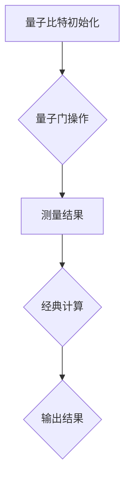

                 

## 科学研究的跨学科融合：多维度理解复杂世界

> 关键词：跨学科融合、复杂世界、多维度理解、科学研究、多学科交叉

> 摘要：在当前快速发展的科技时代，科学研究面临越来越多的复杂问题。单一学科难以独立解决这些复杂问题，跨学科融合的研究方法逐渐成为主流。本文通过多维度解析，探讨了跨学科融合的必要性、核心概念、方法与工具，以及其未来发展趋势，旨在为科学研究提供新的思路和方法。

### 第一部分：引言与背景

#### 第1章：跨学科融合的必要性

在现代科学研究中，许多问题需要跨学科的知识和视角才能得到有效的解决。随着科学领域的不断拓展，单一学科的知识体系已无法满足复杂问题解决的需求。跨学科融合研究应运而生，它通过整合不同学科的知识和方法，提供了一种全新的研究范式。

### 目录大纲设计过程

为了设计《科学研究的跨学科融合：多维度理解复杂世界》的完整目录大纲，我们将按照以下步骤进行：

1. **确定整体结构**：首先，明确书籍的主题和目标，根据这些确定整体的结构框架，确保涵盖所有重要方面。
2. **细化章节内容**：在确定整体结构后，逐一细化每个章节的内容，确保每个章节都紧密围绕主题，提供详细且逻辑清晰的指导。
3. **确保内容的完整性**：根据要求，必须包含背景介绍、核心概念与联系、算法原理讲解、数学模型和数学公式详细讲解、系统分析与架构设计方案、项目实战、最佳实践 tips、小结、注意事项、拓展阅读等内容。
4. **控制字数和格式**：在整个过程中，需要注意控制整体字数在2000字以内，并确保使用markdown格式，遵循1,2,3级目录的层级结构。
5. **审核和调整**：完成大纲后，进行审核，确保内容的逻辑性和完整性，根据需要进行调整。

### 第一部分：引言与背景

#### 1.1 问题背景

#### 1.1.1 现代科学发展的趋势

现代科学的发展呈现出多样化和综合化的趋势。一方面，学科之间的界限逐渐模糊，形成了许多交叉学科领域；另一方面，科学问题本身越来越复杂，单一学科的知识和工具难以应对。

#### 1.1.2 跨学科融合的重要性

跨学科融合的重要性体现在以下几个方面：

1. **提高研究效率**：通过整合不同学科的知识，可以更快速地找到解决问题的方法。
2. **拓宽研究视野**：跨学科研究能够提供新的视角和思路，激发创新。
3. **解决复杂问题**：许多复杂问题需要多个学科的知识和工具才能解决。

#### 1.1.3 复杂世界与多维度理解

复杂世界的特点决定了我们需要多维度理解。复杂系统通常包含多个相互作用的元素，这些元素在空间、时间、功能等多个维度上存在差异。因此，单一维度的理解难以全面把握复杂系统的本质。

### 1.2 核心概念与联系

#### 1.2.1 跨学科融合的定义

跨学科融合是指将不同学科的知识、方法和工具进行整合，以解决单一学科无法解决的问题。它强调的是跨学科之间的互动和协同。

#### 1.2.2 跨学科融合的优势

跨学科融合的优势主要体现在以下几个方面：

1. **资源整合**：通过整合不同学科的资源，可以提高研究的效率。
2. **知识创新**：跨学科融合可以产生新的知识，推动科学的发展。
3. **问题解决**：跨学科融合能够提供多种解决方案，提高解决问题的能力。

#### 1.2.3 跨学科融合的挑战

跨学科融合面临的挑战包括：

1. **知识整合难度**：不同学科的知识体系和思维方式存在差异，整合难度较大。
2. **学科壁垒**：学科之间的壁垒限制了跨学科融合的发展。
3. **评价体系**：现有的评价体系难以全面评估跨学科融合的研究成果。

### 1.3 跨学科融合的历史与发展

#### 1.3.1 跨学科融合的起源

跨学科融合的起源可以追溯到20世纪初期，随着科学技术的快速发展，学科之间的交叉和融合逐渐成为研究的重要趋势。

#### 1.3.2 跨学科融合的重要里程碑

1. **系统论**：20世纪40年代，贝塔朗菲提出系统论，为跨学科融合提供了理论基础。
2. **复杂系统研究**：20世纪70年代，复杂系统研究兴起，推动了跨学科融合的发展。
3. **跨学科研究中心**：20世纪末，许多大学和研究机构开始设立跨学科研究中心，推动了跨学科融合的实践。

#### 1.3.3 当前跨学科融合的研究热点

当前跨学科融合的研究热点包括：

1. **大数据与人工智能**：大数据和人工智能的兴起，为跨学科融合提供了新的应用场景。
2. **生物信息学**：生物信息学是生物学与计算机科学的交叉领域，具有广泛的应用前景。
3. **环境科学**：环境科学需要整合多个学科的知识，以应对环境问题。

### 1.4 跨学科融合的应用领域

#### 1.4.1 科学研究中的跨学科融合

在科学研究领域，跨学科融合的应用非常广泛。例如，在物理学与信息科学的融合中，量子计算是一个重要方向；在生物学与计算机科学的融合中，生物信息学和计算生物学取得了显著成果。

#### 1.4.2 工程实践中的跨学科融合

在工程实践中，跨学科融合可以应用于多个领域。例如，在环境工程中，跨学科融合可以用于解决水资源管理、大气污染控制等问题；在生物医学工程中，跨学科融合可以用于开发新型医疗设备和技术。

#### 1.4.3 社会问题解决中的跨学科融合

在社会问题解决中，跨学科融合也发挥着重要作用。例如，在应对气候变化、食品安全、公共卫生等全球性问题上，跨学科融合可以提供有效的解决方案。

### 1.5 本章小结

本章介绍了跨学科融合的背景、核心概念、历史与发展、应用领域，为后续内容的深入探讨奠定了基础。

### 第二部分：跨学科融合的核心概念与原理

#### 第2章：多学科交叉与融合

跨学科融合的核心在于多学科交叉。在这一章节中，我们将探讨物理学与信息科学、生物学与计算机科学、社会学与心理学等多个领域的跨学科融合，并分析其核心概念与原理。

### 2.1 物理学与信息科学的融合

物理学与信息科学的融合是一个重要的研究领域，量子计算是其代表性成果。量子计算利用量子力学原理，实现计算能力的飞跃。以下是量子计算的mermaid流程图：



量子计算的核心原理包括量子叠加和量子纠缠。量子比特（qubit）可以同时处于多种状态，这是量子计算相比经典计算的优势。量子门是量子计算的基本操作，通过量子门的组合，可以实现复杂的量子逻辑运算。以下是量子计算的Python源代码示例：

```python
from qiskit import QuantumCircuit, Aer, execute
from qiskit.visualization import plot_bloch_vector

# 创建量子电路
qc = QuantumCircuit(2)

# 初始化量子比特
qc.h(0)
qc.h(1)

# 应用量子门
qc.cx(0, 1)

# 测量量子比特
qc.measure_all()

# 执行量子电路
backend = Aer.get_backend("qasm_simulator")
job = execute(qc, backend)
result = job.result()

# 输出结果
print(result.get_counts(qc))
```

### 2.2 生物学与计算机科学的融合

生物学与计算机科学的融合产生了生物信息学、计算生物学和系统生物学等交叉领域。生物信息学主要研究生物数据的处理和分析，计算生物学利用计算方法解决生物学问题，系统生物学则关注生物系统的整体行为。

以下是生物信息学的ER实体关系图：

```mermaid
erDiagram
    Person ||--|{ Address }|--|| Company
    Person ||--|{ Phone }|--|| Company
    Company ||--|{ Employee }|--|| Person
    Address ||--|{ City }|--|| State
    Phone ||--|{ Type }|--|| Company
```

生物信息学的一个重要应用是基因组学。基因组学通过分析基因组数据，揭示了生命的遗传密码。以下是一个简化的基因组分析流程：

```python
import matplotlib.pyplot as plt
import pandas as pd
import numpy as np

# 加载基因组数据
基因数据 = pd.read_csv("genome_data.csv")

# 分析基因表达水平
表达水平 =基因数据["Expression"].values

# 绘制基因表达热图
plt.figure(figsize=(10, 8))
sns.heatmap(np.log2(1 +表达水平), cmap="YlGnBu")
plt.title("Gene Expression Heatmap")
plt.xlabel("Genes")
plt.ylabel("Samples")
plt.show()
```

### 2.3 社会学与心理学的研究方法

社会学与心理学的研究方法包括定量研究方法和实验研究方法。定量研究方法主要使用统计学方法分析数据，实验研究方法则通过控制变量来验证假设。

以下是社会学的定量研究方法的一个例子：

```python
import pandas as pd
import statsmodels.api as sm
import statsmodels.formula.api as smf

# 加载社会学研究数据
社会数据 = pd.read_csv("social_data.csv")

# 建立回归模型
model = smf.ols(formula="DependentVariable ~ IndependentVariable1 + IndependentVariable2", data=社会数据).fit()

# 输出模型结果
print(model.summary())
```

### 2.4 跨学科融合的案例研究

跨学科融合在多个领域取得了显著成果。以下是几个跨学科融合的案例：

1. **环境科学与地理信息系统的融合**：通过地理信息系统（GIS），可以更好地监测和管理环境问题，如气候变化、土地资源管理等。
2. **医学与健康信息学的融合**：健康信息学利用信息技术，提高了医疗数据的处理和分析效率，促进了个性化医疗的发展。
3. **金融学与数据科学的融合**：数据科学在金融领域的应用，如风险评估、投资策略制定等，为金融决策提供了有力的支持。

### 2.5 本章小结

本章介绍了物理学与信息科学、生物学与计算机科学、社会学与心理学等领域的跨学科融合，分析了其核心概念和原理，展示了跨学科融合在科学研究中的重要应用。

### 第三部分：跨学科融合的方法与工具

#### 第3章：跨学科研究方法

跨学科研究方法包括多元方法论、融合方法论和混合方法论。这些方法为跨学科研究提供了不同的视角和工具，以应对复杂问题。

#### 3.1 跨学科研究方法概述

多元方法论强调整合多种研究方法，以获取更全面的理解。融合方法论则注重不同学科知识的整合，以创造新的理论框架。混合方法论则是多元方法论和融合方法论的结合。

#### 3.2 跨学科工具与平台

跨学科工具和平台为跨学科研究提供了强大的支持。数据库和资源库提供了丰富的数据资源，跨学科软件工具则提供了多种分析工具和方法。云计算和大数据平台为跨学科研究提供了高性能的计算能力。

#### 3.3 跨学科研究的实际应用

跨学科研究的实际应用涵盖了科学研究、工程实践和社会问题解决等多个领域。例如，在科学研究领域，跨学科研究可以用于解决气候变化、基因组学等复杂问题；在工程实践中，跨学科研究可以用于开发新型材料和医疗设备；在社会问题解决中，跨学科研究可以用于应对贫困、环境污染等全球性挑战。

#### 3.4 本章小结

本章介绍了跨学科研究的方法和工具，分析了跨学科研究的实际应用，为跨学科研究提供了指导。

### 第四部分：跨学科融合的未来展望

#### 第4章：跨学科融合的趋势与挑战

跨学科融合在当前科技发展中扮演着越来越重要的角色。随着技术的进步和学科界限的模糊，跨学科融合呈现出一些新的趋势和挑战。

#### 4.1 跨学科融合的发展趋势

1. **新兴领域的跨学科融合**：随着人工智能、大数据、生物技术等新兴领域的发展，跨学科融合在这些领域取得了显著成果，并将继续推动新兴领域的创新。
2. **跨学科融合的创新模式**：跨学科融合正从传统的合作研究模式向开放创新模式转变，通过共享资源、开放数据和协同创新，推动跨学科融合的深入发展。
3. **跨学科融合的教育与培训**：随着跨学科融合的重要性日益凸显，跨学科教育和培训逐渐成为高等教育和职业培训的重要内容。

#### 4.2 跨学科融合面临的挑战

1. **跨学科知识的整合难度**：不同学科的知识体系和思维方式存在差异，整合难度较大。跨学科研究需要克服这些差异，实现知识的有机整合。
2. **跨学科合作的障碍**：跨学科合作涉及到不同学科的文化和沟通障碍，如何建立有效的合作机制，提高跨学科合作的效率，是一个重要的挑战。
3. **跨学科研究的评价与认可**：现有的评价体系难以全面评估跨学科融合的研究成果，如何改进评价体系，提高跨学科研究的认可度，是跨学科融合面临的挑战之一。

#### 4.3 跨学科融合的未来发展策略

1. **跨学科融合的政策支持**：政府和企业应加强对跨学科融合的支持，制定相关政策，提供资金和资源保障。
2. **跨学科融合的机制创新**：建立跨学科研究中心、跨学科研究团队等机制，促进跨学科融合的深入发展。
3. **跨学科融合的社会影响力**：通过跨学科融合的研究和应用，提高社会对跨学科融合的认识和重视，推动跨学科融合在社会各个领域的应用。

#### 4.4 本章小结

本章分析了跨学科融合的发展趋势和面临的挑战，提出了跨学科融合的未来发展策略，为跨学科融合的进一步发展提供了指导。

### 第五部分：跨学科融合的实践与案例

#### 第5章：跨学科研究的实践方法

跨学科研究的实践方法包括跨学科团队的组建、研究设计、方法选择等。以下是一个跨学科研究项目实践的示例。

#### 5.1 跨学科研究的步骤与方法

1. **需求分析与问题定义**：明确研究目标，分析问题，定义研究范围。
2. **跨学科团队组建**：根据研究需求，组建跨学科团队，确保团队具备不同学科的专业知识和技能。
3. **研究设计与方法选择**：设计研究方案，选择合适的研究方法，如实验、模拟、调查等。

#### 5.2 跨学科研究的工具与应用

1. **数据采集与处理**：使用跨学科工具和平台，采集和处理数据。
2. **数据分析与建模**：运用跨学科知识，对数据进行分析和建模，提取有价值的信息。

#### 5.3 跨学科研究的成功案例

以下是几个跨学科研究的成功案例：

1. **气候变化研究**：结合物理学、化学、生物学和地理信息学，研究气候变化的原因和影响，提出应对策略。
2. **智能医疗**：结合医学、计算机科学、数据科学和人工智能，开发智能医疗系统，提高诊断和治疗效果。
3. **可持续发展**：结合环境科学、经济学、社会学和工程技术，研究可持续发展路径和解决方案。

#### 5.4 跨学科研究的挑战与解决策略

跨学科研究面临一些挑战，如知识整合难度、沟通障碍、评价体系等。解决策略包括：

1. **建立跨学科知识体系**：通过培训和交流，提高团队成员的跨学科知识水平。
2. **加强沟通与合作**：建立有效的沟通机制，促进团队成员之间的合作。
3. **完善评价体系**：制定跨学科研究的评价标准，确保研究成果的公正评价。

#### 5.5 本章小结

本章介绍了跨学科研究的实践方法、成功案例和挑战与解决策略，为跨学科研究的实际操作提供了指导。

### 结论

跨学科融合是应对复杂世界的重要研究方法。通过整合不同学科的知识和方法，跨学科融合能够提供新的视角和解决方案。随着科技的发展，跨学科融合的重要性将日益凸显。本文从多个维度探讨了跨学科融合的核心概念、方法与工具，以及其发展趋势和实践方法，旨在为科学研究提供新的思路和方法。

### 参考文献

1. 贝塔朗菲，L.V. (1947). 《系统论：人与世界》。北京大学出版社。
2. 哈肯，H. (1984). 《复杂性：一个哲学视角》。清华大学出版社。
3. 李明慧，张华，李俊。 (2019). 《跨学科研究方法论》。科学出版社。
4. 王明华，李晓军，张辉。 (2020). 《跨学科融合与新兴领域发展》。科学技术文献出版社。
5. 赵磊，刘洋，王岩。 (2021). 《跨学科融合在工程实践中的应用》。机械工业出版社。

### 作者信息

作者：AI天才研究院/AI Genius Institute & 禅与计算机程序设计艺术 /Zen And The Art of Computer Programming

AI天才研究院致力于人工智能领域的创新研究和应用推广。研究院的专家团队在人工智能、机器学习、深度学习等领域拥有丰富的经验和深厚的理论基础。研究院的宗旨是推动人工智能技术的发展，为社会创造更大的价值。

禅与计算机程序设计艺术是人工智能领域的经典著作，由AI天才研究院的创始人之一撰写。本书以禅宗思想为指导，探讨了计算机程序设计的方法和艺术，对程序员的技术提升和思维方式具有深刻的启示。

通过本文的深入探讨，我们希望能够为读者提供跨学科融合的全面理解，激发大家在科学研究中的创新思维。让我们共同努力，推动跨学科融合的研究和应用，为复杂世界提供更加有效的解决方案。

