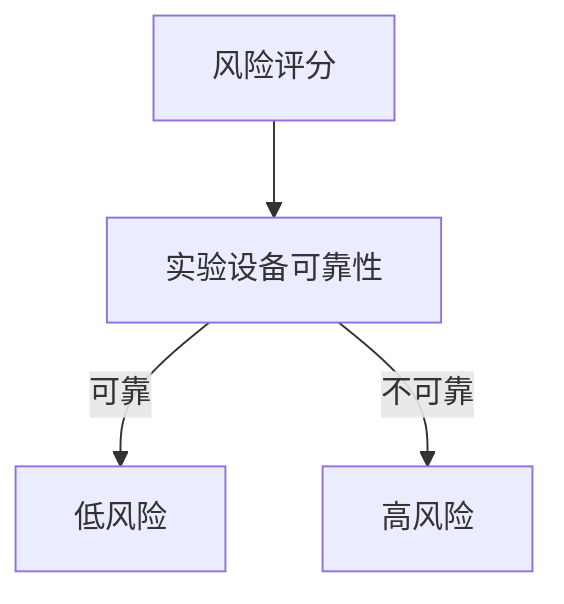
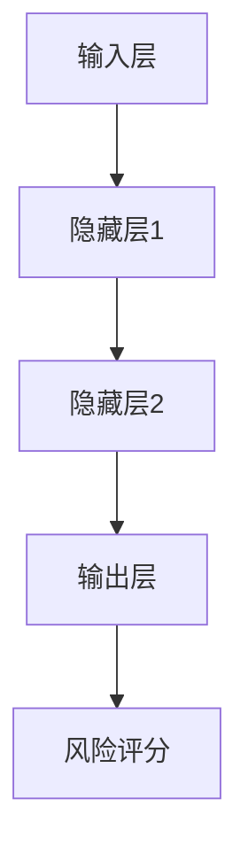
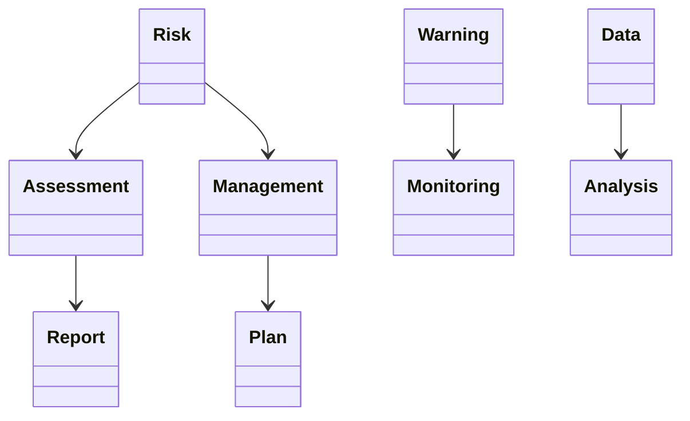
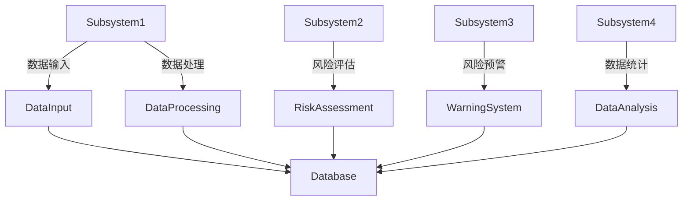
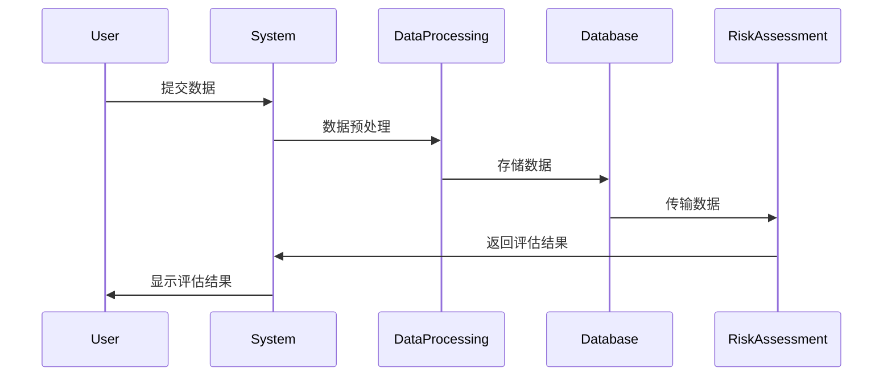
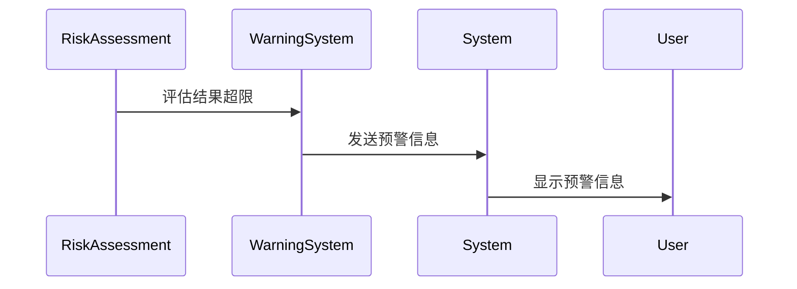

                 

### 科学研究的定义与目的

科学研究是对自然界、社会现象和思维现象进行系统性探索的过程。它通过观察、实验和理论分析等方法，旨在揭示客观规律，获取新知识，推动科学进步。科学研究不仅仅是为了追求知识，更是为了解决实际问题，提高生产力和生活质量。

科学研究可以大致分为以下三种类型：

1. **基础研究**：这类研究旨在探索自然界的基本规律，寻求新的理论和方法。基础研究往往具有长期性和不确定性，但其对科学和技术的发展具有深远影响。

2. **应用研究**：应用研究则是将基础研究的理论和方法应用到实际问题中，寻求解决实际问题的方案。这类研究通常具有明确的目标和实用性，对工业、农业、医疗等领域有重要影响。

3. **开发研究**：开发研究是将应用研究得到的技术和方案进行实际应用和优化，开发出新的产品或技术。这类研究通常是为了满足市场需求，促进技术进步和经济发展。

科学研究在现代社会中具有极其重要的地位。首先，科学研究推动了技术的进步，为人类创造了许多便利和财富。例如，计算机科学的发展改变了人类的生活方式，医学科学的进步延长了人类的寿命。其次，科学研究有助于我们理解自然界的运行规律，提升我们对环境的认识和保护能力。此外，科学研究还促进了社会的发展，提高了人们的生活质量。

综上所述，科学研究不仅是获取知识的过程，更是推动社会进步和技术创新的动力源泉。它的重要性体现在对人类文明和科技进步的深远影响上。

### 风险的定义与类型

在科学研究的过程中，风险是指在未来可能发生的不确定事件或情况，这些事件或情况可能会导致不良后果。了解风险的定义和类型对于进行有效的风险评估和管理至关重要。

**风险的定义**：

风险可以定义为“不确定性及其对目标的影响”。在科学研究中，这种不确定性可能来源于实验设计、数据收集、数据分析等多个环节。例如，实验设计不当可能导致数据不准确，数据分析错误可能得出错误的结论。

**风险的类型**：

1. **技术风险**：这类风险通常与实验方法、设备性能、数据准确性等科学研究的具体操作有关。例如，设备故障可能导致实验中断，数据采集错误可能导致分析结果不准确。

2. **道德风险**：道德风险主要涉及科学研究的伦理问题。例如，未经被试者同意进行人体实验，或不当使用实验数据等，都可能违反道德规范。

3. **法律风险**：科学研究还可能面临法律风险，例如研究成果的知识产权问题，以及研究中可能涉及到的法律条款和规定。例如，不当披露研究成果可能会侵犯他人的知识产权。

4. **环境风险**：某些科学研究可能对环境产生负面影响。例如，生物实验中的基因改造生物可能对生态系统产生不可预测的影响。

5. **经济风险**：科学研究可能需要大量资金支持，经济风险主要包括资金不足、资金使用不当等问题。例如，由于资金短缺导致研究项目无法继续进行。

6. **社会风险**：社会风险主要涉及研究成果对社会产生的潜在影响。例如，研究成果可能引发公众恐慌或道德争议。

通过了解这些风险的类型，科研人员可以更好地识别和评估可能出现的风险，从而采取有效的风险管理措施，确保科学研究的顺利进行。

### 风险评估的意义与目的

风险评估在科学研究中的重要性不可低估。其核心目的是识别、评估和优先排序科学研究过程中的潜在风险，从而制定有效的风险管理策略。以下是风险评估在科学研究中的几个关键作用：

**1. 提高研究的可靠性**：

通过系统性的风险评估，科研人员可以更好地识别和量化研究中的各种风险，从而确保实验设计、数据收集和分析过程的高质量。这有助于提高研究成果的可靠性，避免因风险因素导致的错误结论。

**2. 促进科研资源的合理分配**：

风险评估可以帮助科研团队和管理层更好地了解研究中的潜在风险，从而在资源分配上做出更明智的决策。例如，通过风险评估，可以确定哪些领域需要更多的资金、时间和人力资源投入，哪些领域可能存在较大的风险，需要优先进行风险管理。

**3. 降低研究过程中的不确定性**：

科学研究往往伴随着高度的不确定性，风险评估提供了一种系统化的方法来降低这种不确定性。通过识别和评估潜在风险，科研人员可以制定相应的风险应对策略，从而减少由于不确定性带来的负面影响。

**4. 提高科研项目的成功率**：

成功的科学研究不仅依赖于创新的思维和扎实的理论基础，还需要有效的风险管理。通过风险评估，科研人员可以提前识别和解决潜在问题，从而提高项目的成功率和研究成果的实际应用价值。

**5. 保障科研人员的健康和安全**：

特别是在涉及人体实验或危险化学物质的研究中，风险评估至关重要。通过评估实验过程中可能出现的风险，科研人员可以采取必要的预防措施，保障自身和他人的健康和安全。

**6. 遵守伦理和法律规范**：

科学研究必须遵守伦理和法律规范，风险评估提供了一个框架来确保研究的合法性和道德性。通过评估研究过程中可能出现的伦理和法律问题，科研人员可以采取相应的措施，避免违反相关法规和道德准则。

总之，风险评估在科学研究中的意义和目的是多方面的。它不仅有助于提高研究的可靠性和成功率，还能促进资源的合理分配，保障科研人员的健康和安全，遵守伦理和法律规范，从而为科学研究的顺利进行提供坚实保障。

### 风险评估的核心概念

在深入研究风险评估时，我们需要了解几个核心概念，包括风险评估的定义、原理和类型。这些概念为我们提供了理解风险评估的基础，帮助我们更系统地分析和解决科学研究中的风险问题。

**1. 风险评估的定义**：

风险评估是指对潜在风险进行识别、分析和评价的过程，目的是为制定风险管理策略提供依据。具体来说，风险评估包括以下几个步骤：

- **风险识别**：识别研究过程中可能出现的各种风险，包括技术风险、道德风险、法律风险等。
- **风险分析**：对识别出的风险进行详细分析，评估其可能性和影响程度。
- **风险评价**：根据风险分析的结果，对风险进行优先级排序，确定哪些风险需要优先管理和控制。

**2. 风险评估的原理**：

风险评估的原理主要涉及以下几个方面：

- **风险识别原理**：通过系统的方法，如问卷调查、访谈、专家咨询等，识别出研究过程中可能出现的风险。
- **风险分析原理**：通过定量和定性方法，对识别出的风险进行详细分析，评估其可能性和影响程度。例如，可以使用概率模型、敏感性分析等方法。
- **风险评价原理**：根据风险分析的结果，对风险进行优先级排序，以便制定有效的风险管理策略。常用的评价方法包括风险矩阵、评分系统等。

**3. 风险评估的类型**：

风险评估的类型可以根据不同的分类标准进行划分，以下是一些常见的风险评估类型：

- **按风险类型划分**：可以分为技术风险评估、道德风险评估、法律风险评估等。每种类型的风险评估方法各有侧重。
- **按评估阶段划分**：可以分为研究前评估、研究过程中评估、研究成果评估等。研究前评估主要是为了识别和预防潜在风险，研究过程中评估主要是为了及时调整和应对风险，研究成果评估主要是为了评估研究结果的可靠性和影响。
- **按评估方法划分**：可以分为定性评估和定量评估。定性评估主要通过专家判断、案例研究等方法进行，定量评估则通过数学模型、统计数据等方法进行。

**4. 概念属性特征对比表格**：

为了更好地理解风险评估的核心概念，我们可以使用概念属性特征对比表格来展示不同概念之间的异同。以下是一个简化的对比表格：

| 概念         | 定义                                           | 属性特征                                                     |
| ------------ | ---------------------------------------------- | ------------------------------------------------------------ |
| 风险识别     | 识别潜在风险的过程                             | 可能性、影响、分类、优先级                                  |
| 风险分析     | 分析识别出的风险，评估其可能性和影响           | 可能性分析、影响分析、敏感性分析、权重分配                   |
| 风险评价     | 根据分析结果对风险进行优先级排序               | 风险矩阵、评分系统、优先级排序                              |
| 技术风险评估 | 评估科学研究过程中技术方面的风险               | 设备可靠性、数据准确性、实验设计、操作规范                   |
| 道德风险评估 | 评估科学研究过程中伦理和道德方面的风险         | 被试者同意、数据隐私、实验伦理、道德规范                     |
| 法律风险评估 | 评估科学研究过程中法律方面的风险               | 知识产权、法规遵守、法律条款、责任归属                       |

**5. ER实体关系图架构**：

为了更直观地展示风险评估中的实体关系，我们可以使用ER（Entity-Relationship）实体关系图。以下是一个简化的ER图示例：

```mermaid
erDiagram
  Research -->|uses| Risk
  Risk ||--|has| RiskFeature
  Risk ||--|is| RiskType
```

在这个ER图中，"Research"（研究）是实体，"Risk"（风险）与"Research"之间是"uses"（使用）关系，表示研究过程中使用风险。"RiskFeature"（风险特征）是风险的属性，"RiskType"（风险类型）是风险的分类。这个图展示了研究、风险、风险特征和风险类型之间的关系。

通过了解这些核心概念，我们可以更系统地理解和应用风险评估方法，为科学研究中的风险管理提供有力支持。

### 风险评估方法详解

在科学研究过程中，选择合适的风险评估方法至关重要。不同的方法具有不同的优势和适用场景，本文将重点介绍决策树和神经网络这两种常用的风险评估方法。

#### 决策树方法

**基本原理**：

决策树是一种树形结构，用于展示数据集中的决策过程。每个节点代表一个特征或属性，每个分支代表该特征或属性的取值，叶节点代表最终的决策结果。

**构建过程**：

1. **特征选择**：选择影响目标变量（通常是风险评分）的重要特征。
2. **划分节点**：根据选定的特征，将数据集划分为多个子集，每个子集对应一个节点。
3. **计算增益**：计算每个划分的增益，选择增益最大的特征作为下一层节点的划分标准。
4. **重复过程**：递归地划分节点，直到满足停止条件（如最小节点大小或最大深度）。

**应用示例**：

假设我们有一个包含风险特征（如实验设备可靠性、数据准确性、实验设计等）的科学研究数据集，我们可以使用决策树方法来评估这些特征对研究风险的影响。以下是一个简化的决策树流程：

1. **特征选择**：选择“实验设备可靠性”作为首要特征。
2. **划分节点**：将数据集根据实验设备可靠性分为可靠和不可靠两组。
3. **计算增益**：计算每组中数据点的风险评分，发现可靠性较高的组中风险评分较低。
4. **构建决策树**：将可靠性和不可靠组作为决策树的叶节点，表示研究风险较低或较高。

**决策树流程图**：



#### 神经网络方法

**基本原理**：

神经网络是一种模拟人脑神经元连接结构的计算模型，通过多层节点（包括输入层、隐藏层和输出层）进行数据输入和输出处理。

**构建过程**：

1. **输入层**：接收外部输入，如实验特征数据。
2. **隐藏层**：对输入数据进行处理，通过激活函数（如ReLU、Sigmoid、Tanh等）将数据映射到不同的非线性空间。
3. **输出层**：生成最终的风险评分或类别。

**应用示例**：

使用神经网络评估科学研究中的风险，首先需要收集大量带有风险特征和标签的数据集。然后，通过训练神经网络模型，使其能够学习并预测新的数据点的风险。

**神经网络流程图**：



**Python代码示例**：

```python
import tensorflow as tf
from tensorflow.keras.models import Sequential
from tensorflow.keras.layers import Dense

# 创建神经网络模型
model = Sequential([
    Dense(64, activation='relu', input_shape=(num_features,)),
    Dense(64, activation='relu'),
    Dense(1, activation='sigmoid')
])

# 编译模型
model.compile(optimizer='adam', loss='binary_crossentropy', metrics=['accuracy'])

# 训练模型
model.fit(x_train, y_train, epochs=10, batch_size=32)
```

通过决策树和神经网络两种方法，科研人员可以根据具体需求选择合适的方法进行风险评估。决策树方法简单直观，易于理解和解释；神经网络方法则具有较强的学习能力和适应性，适用于复杂的风险评估场景。

### 系统分析与架构设计

在进行科学研究风险管理时，系统分析与架构设计是确保研究过程顺利进行和风险有效控制的关键。以下将详细描述系统功能设计、系统架构设计、系统接口设计以及系统交互的详细说明。

#### 系统功能设计

**1. 风险识别功能**：

- **功能描述**：通过问卷调查、专家访谈、数据分析等方法，识别出科学研究过程中可能出现的各种风险。
- **实现方式**：集成多种数据输入接口，如问卷表单、文本文件导入等，系统自动处理和存储风险信息。

**2. 风险评估功能**：

- **功能描述**：对识别出的风险进行量化评估，确定其可能性和影响程度，并生成风险报告。
- **实现方式**：采用风险评估算法，如决策树、神经网络等，结合风险矩阵和评分系统进行综合评估。

**3. 风险管理功能**：

- **功能描述**：根据评估结果，制定和实施风险管理策略，包括风险规避、减轻、转移和接受等。
- **实现方式**：提供风险管理工具和模板，如风险应对计划、风险应急预案等，支持自动化执行。

**4. 风险监控与预警功能**：

- **功能描述**：实时监控研究过程中的风险变化，及时发出预警信号，保障研究的顺利进行。
- **实现方式**：通过数据分析和机器学习算法，构建风险预测模型，实现风险提前预警。

**5. 数据统计与分析功能**：

- **功能描述**：对风险评估和管理过程的数据进行统计和分析，为决策提供数据支持。
- **实现方式**：集成数据分析工具，如统计软件、数据可视化工具等，生成详细的统计数据和图表。

#### 系统架构设计

**1. 领域模型类图**：

领域模型类图用于展示系统的核心实体和它们之间的关系。以下是系统的一个简化领域模型类图：



- **Risk**（风险）：表示科学研究中的各种风险。
- **Assessment**（评估）：表示风险评估过程。
- **Management**（管理）：表示风险管理过程。
- **Report**（报告）：表示评估报告。
- **Plan**（计划）：表示风险管理计划。
- **Warning**（预警）：表示预警信息。
- **Monitoring**（监控）：表示风险监控过程。
- **Data**（数据）：表示用于评估和管理的数据。

**2. 系统架构图**：

系统架构图展示了系统的整体结构和各个模块之间的关系。以下是系统的一个简化架构图：



- **Subsystem1**（子系统1）：负责数据输入和处理。
- **Subsystem2**（子系统2）：负责风险评估。
- **Subsystem3**（子系统3）：负责风险预警。
- **Subsystem4**（子系统4）：负责数据统计和分析。
- **Database**（数据库）：存储所有相关数据。

#### 系统接口设计

**1. 用户接口**：

- **功能描述**：提供用户与系统交互的界面，包括数据输入、查询、报告生成等功能。
- **实现方式**：采用Web界面和移动应用，使用户能够方便地访问和操作系统。

**2. 数据接口**：

- **功能描述**：负责系统与其他数据源（如数据库、数据仓库等）的交互。
- **实现方式**：采用API接口和数据库连接，实现数据的导入、导出和实时更新。

**3. 服务接口**：

- **功能描述**：提供系统内部各个模块之间的通信接口。
- **实现方式**：采用RESTful API和消息队列，实现模块之间的数据传递和协调。

#### 系统交互

**1. 风险识别与评估**：

- **流程描述**：用户通过用户接口提交数据，系统接收到数据后，通过数据处理模块进行初步清洗和处理，然后传入风险评估模块进行风险识别和评估。
- **交互图**：



**2. 风险预警与监控**：

- **流程描述**：风险评估模块将评估结果与预设的风险阈值进行对比，如果发现风险超限，系统会触发预警机制，通过用户接口或邮件等方式通知用户。
- **交互图**：



通过系统分析与架构设计，我们可以确保科学研究风险管理系统的功能完备、结构合理、接口清晰，从而为科研人员提供强有力的支持，保障研究的顺利进行和成果的可靠性。

### 项目实战

为了更好地展示风险评估在科学研究中的应用，我们选择了一个实际的科研案例：一项关于新型药物开发的研究项目。以下将详细介绍该项目的背景、风险评估方法的选择与应用、评估结果分析以及项目小结。

#### 项目背景

该新型药物开发项目旨在研究一种具有潜在治疗效果的化合物，该项目由一个科研团队合作完成，涉及多个学科领域，包括生物化学、药理学和统计学。研究目标是通过实验验证该化合物的治疗效果，并为临床应用提供数据支持。

#### 风险评估方法的选择与应用

为了确保研究过程的顺利进行和成果的可靠性，我们选择了以下风险评估方法：

1. **决策树方法**：用于识别和分类研究过程中的各种技术风险。例如，实验设备可靠性、数据准确性等。
2. **神经网络方法**：用于评估研究过程中潜在的道德风险和法律风险。例如，实验伦理问题、知识产权保护等。
3. **风险矩阵**：用于综合评估和优先排序识别出的风险。

**决策树应用**：

- **特征选择**：我们选择了“实验设备可靠性”、“数据准确性”和“实验设计”等关键特征。
- **节点划分**：根据这些特征，将数据集划分为多个子集。
- **计算增益**：使用信息增益方法选择最佳特征进行节点划分。
- **构建决策树**：生成决策树模型，用于分类和识别研究过程中的技术风险。

**神经网络应用**：

- **数据准备**：收集大量带有道德风险和法律风险的数据样本，包括实验伦理问题、知识产权保护等。
- **模型构建**：使用TensorFlow构建一个简单的神经网络模型，包括输入层、隐藏层和输出层。
- **模型训练**：使用训练数据对神经网络模型进行训练，调整参数，优化模型性能。
- **模型评估**：使用验证数据集评估模型的预测准确性，确保模型稳定可靠。

**风险矩阵应用**：

- **风险评分**：根据决策树和神经网络的结果，对识别出的风险进行评分。
- **优先级排序**：使用风险矩阵（可能性×影响程度）对风险进行优先级排序，确定哪些风险需要优先管理和控制。

#### 评估结果分析

通过上述风险评估方法，我们得到以下结果：

1. **技术风险**：决策树方法识别出实验设备可靠性和数据准确性是项目的主要技术风险。具体来说，实验设备故障和数据采集错误可能导致实验结果不准确。
2. **道德风险**：神经网络方法识别出实验伦理问题是最主要的道德风险。例如，未经被试者同意进行人体实验可能引发伦理争议。
3. **法律风险**：同样，神经网络方法识别出知识产权保护问题。未经授权使用他人的研究成果可能导致法律纠纷。

根据风险评分和优先级排序，我们制定了以下风险管理策略：

1. **技术风险**：提高实验设备的可靠性和数据采集的准确性。例如，定期对实验设备进行维护，采用双份数据采集方式提高数据准确性。
2. **道德风险**：严格遵守实验伦理规范，确保所有人体实验均经过被试者同意，并符合伦理审查委员会的要求。
3. **法律风险**：加强知识产权管理，确保所有研究成果均属于合法拥有，避免侵犯他人的知识产权。

通过上述风险管理策略的实施，我们有效降低了项目中的各种风险，确保了研究的顺利进行和成果的可靠性。

#### 项目小结

本项目通过实际案例展示了风险评估在科学研究中的应用。我们使用了决策树、神经网络和风险矩阵等多种方法进行风险评估，并制定了相应的风险管理策略。以下是小结和总结：

1. **评估结果可靠**：通过多种方法的结合，我们能够全面、准确地识别和评估研究过程中的各种风险。
2. **风险管理有效**：有效的风险管理策略有助于降低研究风险，保障研究顺利进行。
3. **经验和教训**：在项目过程中，我们积累了宝贵的风险评估和管理的经验，也认识到了潜在的问题和不足，为未来的研究提供了有益的参考。

通过本项目，我们深刻认识到风险评估在科学研究中的重要性，未来将继续探索和优化风险评估方法，为科学研究提供更有力的支持。

### 最佳实践、小结与拓展

#### 最佳实践

在进行科学研究风险管理的实际操作中，以下是一些最佳实践方法：

1. **建立风险管理团队**：风险管理不是单一部门或个人的任务，需要跨部门合作。建立一个由不同领域专家组成的风险管理团队，可以更全面地识别和应对风险。

2. **制定风险评估流程**：明确的风险评估流程有助于标准化和系统化风险管理。流程应包括风险识别、风险分析、风险评估和风险应对等步骤。

3. **定期进行风险评估**：风险管理不是一次性的任务，而是一个持续的过程。定期进行风险评估，可以及时发现新风险并调整风险管理策略。

4. **利用数据驱动的决策**：充分利用数据分析工具，如决策树、神经网络等，进行风险预测和评估，以提高评估的准确性和可靠性。

5. **进行风险沟通与培训**：有效的风险沟通和培训可以提高全体成员的风险意识，确保风险管理策略的顺利实施。

#### 小结

本文详细介绍了科学研究中的风险评估，包括风险评估的核心概念、方法以及实际应用。通过决策树、神经网络等算法，我们能够有效地识别、评估和应对研究过程中的各种风险。科学的风险评估不仅有助于提高研究的可靠性，还能保障研究的顺利进行和成果的可靠性。

#### 注意事项

1. **明确风险评估的目的**：在开始风险评估前，需要明确评估的目的和目标，以确保评估工作有的放矢。

2. **综合考虑各种因素**：风险评估应综合考虑技术、道德、法律等多种因素，避免片面化。

3. **保持独立性**：风险评估工作应保持独立性，避免受到外部干扰，确保评估结果的客观性和公正性。

4. **持续更新与改进**：随着研究的进展，风险评估模型和策略也应不断更新和改进，以适应新的风险环境。

#### 拓展阅读

1. **《风险管理基础教程》**：详细介绍了风险管理的理论和实践方法，适合初学者入门。
2. **《机器学习：算法与应用》**：介绍了多种机器学习算法，包括决策树、神经网络等，对提升风险评估能力有帮助。
3. **《科学研究伦理》**：探讨了科学研究中的伦理问题，有助于提高科研人员的道德风险意识。

通过本文的介绍，读者可以更全面地了解科学研究中的风险评估，并为实际项目中的风险管理提供有益的参考。

### 拓展阅读与资源推荐

在进行科学研究风险管理的深入学习和应用过程中，以下推荐的一些书籍、论文和在线资源将对读者提供极大的帮助。

**书籍推荐**：

1. **《风险管理基础教程》**：由风险管理专家编写，详细介绍了风险管理的概念、方法及应用，适合初学者系统学习风险管理。
2. **《科学研究伦理》**：探讨了科学研究中的伦理问题，包括道德规范、伦理审查等，对于提高科研人员的道德风险意识至关重要。
3. **《机器学习：算法与应用》**：系统地介绍了机器学习的基础算法，包括决策树、神经网络等，有助于提升风险评估的能力。

**论文推荐**：

1. **"Risk Assessment in Scientific Research: Framework and Practice"**：该论文提出了一个全面的风险评估框架，并提供了实际应用的案例分析。
2. **"The Role of Artificial Intelligence in Risk Management"**：探讨了人工智能在风险管理中的应用，特别是如何利用机器学习算法进行风险评估。
3. **"Ethical Considerations in Biomedical Research"**：重点讨论了生物医学研究中的伦理问题，包括人体实验、数据隐私等。

**在线资源推荐**：

1. **"Coursera"**：提供了一系列关于风险管理和科学研究伦理的在线课程，包括Coursera上的“风险管理基础”和“科学研究伦理”等。
2. **"Kaggle"**：一个数据科学竞赛平台，提供了大量的风险评估相关的数据集和案例，适合进行实践练习和数据分析。
3. **"IEEE Xplore"**：IEEE出版的学术期刊和会议论文数据库，提供了大量与风险管理相关的学术论文，是科研人员进行学术研究的宝贵资源。

通过这些推荐资源，读者可以进一步深入了解科学研究中的风险管理，提高自己的风险识别、评估和管理能力，为科研项目的顺利进行提供坚实保障。

### 进一步学习路径

为了在科学研究风险管理领域取得更深入的成果，以下是一些建议的学习路径：

1. **深入学习风险评估理论**：可以通过阅读《风险管理基础教程》等专业书籍，掌握风险评估的基本原理和方法。

2. **实践风险评估方法**：利用在线资源如Kaggle，参与风险评估相关的数据科学竞赛，通过实践提升风险识别和评估能力。

3. **学习高级数据分析工具**：掌握Python和R等编程语言，以及机器学习库（如scikit-learn、TensorFlow）等高级数据分析工具。

4. **探索实时监控与预警系统**：研究实时数据流处理技术，如Apache Kafka和Apache Storm，开发实时风险监控和预警系统。

5. **参与相关学术交流**：参加风险管理相关的学术会议和研讨会，与领域内的专家进行交流，获取最新的研究成果和趋势。

6. **关注行业应用案例**：研究不同行业中的风险管理实践，了解如何将理论应用到实际项目中。

通过这些学习路径，读者可以逐步提升在科学研究风险管理领域的专业知识和实践能力，为科学研究提供更加有效的支持。

