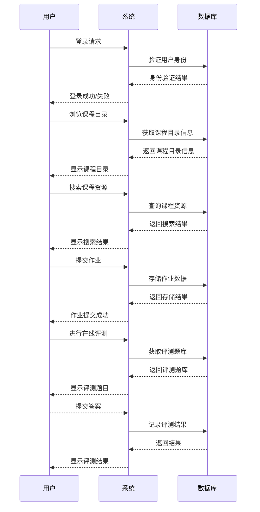

                 

### 第一部分：引言与背景

#### 引言

科学素养教育的创新方法：培养下一代的世界理解能力，旨在探讨如何在当前教育体系中引入创新方法，以提升学生的科学素养，并培养其全面的世界理解能力。在全球化和信息化迅速发展的今天，科学素养不仅是个人发展的重要基础，也是国家竞争力和文化软实力的重要组成部分。因此，创新科学素养教育方法，对于培养具备全球视野和创新精神的新一代具有重要意义。

#### 科学素养教育的重要性

科学素养是指个体在科学知识和科学方法方面的理解能力，以及运用科学思维解决问题的能力。它不仅包括对科学概念的理解和科学事实的记忆，更重要的是培养批判性思维、解决问题的能力和科学探究的精神。科学素养教育的重要性体现在以下几个方面：

1. **促进个人全面发展**：科学素养教育有助于培养学生的逻辑思维、批判性思维和创新能力，这些能力对于个体在未来社会中的全面发展至关重要。

2. **提升社会素质**：具备科学素养的公民能够更好地理解科学问题，参与公共事务的讨论，做出理性的决策，从而提高整个社会的文明素质。

3. **增强国家竞争力**：科学素养是国家创新能力和科技竞争力的重要基石。一个具有高度科学素养的劳动力队伍，能够推动科技创新和产业升级，提升国家的综合竞争力。

#### 当前教育体系中的问题

尽管科学素养教育的重要性已被广泛认可，但当前的教育体系仍然存在一些问题，制约了科学素养教育的有效实施：

1. **教育内容陈旧**：许多教材和课程内容仍然停留在传统的科学知识层面，缺乏对科学方法和探究过程的深入讲解。

2. **教学方法单一**：传统的教学方法多以讲授为主，学生被动接受知识，缺乏主动探究和思考的机会。

3. **教育评价体系不完善**：当前的教育评价体系主要侧重于知识点的考核，缺乏对科学思维和实践能力的评价，难以全面反映学生的科学素养水平。

4. **资源分配不均**：科学素养教育在城乡、地区之间的资源分配存在较大差异，影响了教育公平和质量的提升。

#### 培养下一代世界理解能力的必要性

培养下一代的世界理解能力是科学素养教育的重要组成部分。在全球化和信息化时代，下一代需要具备以下能力：

1. **跨文化交流能力**：下一代需要了解不同文化、历史和价值观，能够进行有效的跨文化交流和合作。

2. **科学探究精神**：下一代需要具备科学探究精神，能够独立思考、解决问题，并具备创新意识。

3. **全球视野**：下一代需要具备全球视野，能够关注全球事务，理解国际政治、经济和文化的发展趋势。

4. **适应能力**：下一代需要具备适应快速变化的社会环境的能力，能够在不确定性和复杂性中找到发展的机遇。

为了实现上述目标，教育必须进行创新，引入多样化的教育方法和手段，培养学生的全面素质和综合能力。只有这样，下一代才能在全球化背景下胜任各种挑战，成为有责任感、有创造力和社会责任感的全球公民。

#### 结论

科学素养教育的创新方法对于培养下一代的世界理解能力具有重要意义。通过引入多样化的教育方法，改善教育内容和评价体系，可以全面提升学生的科学素养和综合素质，为未来的发展奠定坚实基础。本文将深入探讨这些创新方法，并提供具体的实践案例和策略，以期为科学素养教育的改革提供有益的参考。

---

### 核心概念与联系

科学素养教育作为培养下一代世界理解能力的关键，离不开对核心概念的深入理解和分析。本文将围绕以下几个核心概念展开：科学素养、创新方法、世界理解能力，并通过概念属性特征对比表格和ER实体关系图架构来展示这些概念之间的关系。

#### 1. 科学素养

科学素养是指个体在科学知识和科学方法方面的理解能力，以及运用科学思维解决问题的能力。它涵盖以下几个方面：

- **科学知识**：包括自然科学、社会科学和技术科学的基本概念、原理和事实。
- **科学方法**：掌握科学探究的过程，包括观察、假设、实验、验证和推理等。
- **科学思维**：运用逻辑推理、批判性思维和创造性思维解决实际问题的能力。

科学素养的属性特征对比表格如下：

| 特征       | 科学素养 | 科学知识 | 科学方法 | 科学思维 |
| ---------- | -------- | -------- | -------- | -------- |
| **定义**   | 整体能力 | 知识部分 | 过程部分 | 思维部分 |
| **重要性** | 全面提升 | 基础要求 | 必要条件 | 关键要素 |
| **关联性** | 内涵统一 | 相互补充 | 相互依赖 | 紧密联系 |

#### 2. 创新方法

创新方法是指通过引入新思想、新方法或新工具，实现教育和教学过程的改进和优化。在科学素养教育中，创新方法的作用至关重要。以下为几种常见的创新方法：

- **项目式学习**：通过实际项目，引导学生动手实践，培养其科学探究和问题解决能力。
- **探究式学习**：以探究为核心，激发学生的好奇心和探究欲望，促进自主学习和创新思维。
- **科技融合**：利用信息技术、人工智能等现代科技手段，丰富教学形式和内容，提高教学效果。

创新方法的属性特征对比表格如下：

| 特征       | 项目式学习 | 探究式学习 | 科技融合 |
| ---------- | ----------- | ----------- | -------- |
| **目标**   | 提高实践能力 | 培养探究精神 | 丰富教学形式 |
| **方法**   | 项目驱动 | 探究驱动 | 科技应用 |
| **适用性** | 各学科均可 | 适合高年级 | 所有学科 |

#### 3. 世界理解能力

世界理解能力是指个体对全球事务、不同文化和社会现象的深入理解和分析能力。它包括以下几个方面：

- **全球视野**：关注全球政治、经济、文化等方面的发展趋势，形成全面的全球观念。
- **跨文化沟通**：理解不同文化背景下的价值观、习俗和行为模式，进行有效沟通和合作。
- **社会洞察**：分析社会问题，理解社会现象，形成对社会现象的理性认知。

世界理解能力的属性特征对比表格如下：

| 特征       | 全球视野 | 跨文化沟通 | 社会洞察 |
| ---------- | -------- | ---------- | -------- |
| **定义**   | 全球观念 | 文化理解 | 社会分析 |
| **重要性** | 形成全球思维 | 跨文化合作 | 社会责任 |
| **关联性** | 与科学素养密切相关 | 科学素养的延伸 | 社会现象的理解 |

#### 4. 概念属性特征对比表格

通过以上核心概念的属性特征对比表格，我们可以清晰地看到科学素养、创新方法和世界理解能力之间的内在联系。科学素养是基础，创新方法是途径，世界理解能力是目标。三者相互促进、相互依赖，共同构建了科学素养教育的核心体系。

#### 5. ER实体关系图架构

为了更直观地展示这些概念之间的关系，我们使用Mermaid绘制了ER实体关系图：

```mermaid
entityRelationship
    Entity["科学素养"]
        participatedWith["创新方法"]
        participatedWith["世界理解能力"]
    Entity["创新方法"]
        participatedWith["科学素养"]
        participatedWith["教学过程"]
    Entity["世界理解能力"]
        participatedWith["科学素养"]
        participatedWith["全球视野"]
```

通过ER实体关系图，我们可以清晰地看到科学素养教育中各个核心概念之间的相互作用和依赖关系。这种关系不仅帮助我们理解科学素养教育的整体框架，也为后续的理论讲解和实践案例分析提供了理论基础。

### 理论讲解

#### 科学素养的理论基础

科学素养的教育不仅仅是传授科学知识和技能，更重要的是培养学生的科学思维能力和科学探究精神。科学素养的理论基础包括以下几个方面：

1. **科学知识**：科学素养首先建立在扎实的科学知识基础上。这些知识包括自然科学（如物理、化学、生物学）和社会科学（如经济学、社会学、心理学）的基本原理和概念。学生需要掌握这些知识，以便在日常生活中能够理解和应用科学原理。

2. **科学方法**：科学方法是指科学家进行研究和探索的基本步骤和策略。它包括观察、假设、实验、验证和推理等。科学素养教育应该让学生了解这些方法，并能够运用到实际问题中，培养其解决问题的能力。

3. **科学思维**：科学思维是指运用科学方法和原则进行思考的能力。这包括逻辑推理、批判性思维和创造性思维。科学素养教育需要培养学生的科学思维，使其能够独立分析问题，形成自己的观点，并进行有效的论证。

4. **科学探究精神**：科学探究精神是指对未知事物的好奇心和探索欲望，以及对真理的追求。科学素养教育应该激发学生的科学探究精神，鼓励他们进行自主学习和研究，培养其创新意识。

#### 创新方法的理论框架

创新方法在教育中的应用，旨在打破传统教学的限制，提供更多元化和互动性的学习体验。以下是一些常见的创新方法及其理论框架：

1. **项目式学习（Project-Based Learning, PBL）**：项目式学习是一种以学生为中心的教学方法，通过实际项目来驱动学习。这种方法的理论基础是建构主义教育理论，认为知识是通过学生的主动建构而获得的。PBL的目标是培养学生的实践能力和解决问题的能力，使其能够在真实情境中应用所学知识。

2. **探究式学习（Inquiry-Based Learning）**：探究式学习是一种基于问题的学习方式，学生通过提出问题、收集信息、分析和解决问题来获取知识。这种方法的理论基础是问题解决理论和探究学习理论，强调学生主动参与学习过程，培养其探究精神和批判性思维。

3. **科技融合**：科技融合是将现代科技手段应用于教育中，如使用多媒体教学、在线学习平台、虚拟现实等。这种方法的理论基础是技术接受模型（Technology Acceptance Model, TAM），认为用户对技术的接受程度取决于其对技术的感知有用性和易用性。科技融合的目标是提高教学效果，增强学生的学习兴趣和参与度。

#### 世界理解能力的研究方法

世界理解能力的培养需要多学科、多视角的综合研究方法。以下是一些常见的研究方法：

1. **跨学科研究**：通过跨学科研究，将自然科学、社会科学和人文学科的知识结合起来，形成对全球问题的全面理解。这种方法的理论基础是跨学科方法论，认为不同学科之间存在相互联系，能够提供更全面的知识体系。

2. **案例研究**：案例研究是一种深入分析具体情境的研究方法，通过研究具体案例，了解不同文化和社会现象的内在机制。这种方法的理论基础是案例研究法，认为通过具体案例可以揭示普遍规律。

3. **实证研究**：实证研究是一种基于数据的科学研究方法，通过收集和分析实际数据，验证假设和理论。这种方法的理论基础是实证主义方法论，认为只有通过实证数据才能验证知识的真实性。

#### 科学素养与创新的关联分析

科学素养和创新能力之间存在密切的关联。科学素养为创新能力提供了坚实的基础，而创新能力的提升又可以进一步提高科学素养。以下为两者之间的关联分析：

1. **知识储备**：科学素养的教育使学生掌握了丰富的科学知识和方法，为其创新能力提供了基础。这些知识储备能够激发学生的创新思维，使其在解决问题时能够提出新的方法和解决方案。

2. **批判性思维**：科学素养教育强调批判性思维，培养学生的独立思考和分析能力。这种批判性思维是创新能力的重要前提，使学生能够从不同角度看待问题，并提出创新的解决方案。

3. **实践能力**：科学素养教育通过项目式学习和探究式学习等方法，培养学生的实践能力。实践能力的提升使学生能够将理论知识应用到实际中，从而促进创新能力的培养。

4. **持续学习**：科学素养教育鼓励学生持续学习和自主探究，培养其终身学习的习惯。这种习惯有助于学生不断积累新的知识和技能，提高其创新能力。

综上所述，科学素养和创新能力相互促进，共同构成了现代教育的重要目标。通过科学素养教育的创新方法，我们可以培养出具备全球视野和创新精神的新一代，为未来的发展奠定坚实基础。

### 实践案例分析

为了更好地理解科学素养教育的创新方法，我们通过以下实践案例进行分析，探讨创新方法在实际教学中的应用效果以及具体的操作步骤和技巧。

#### 案例一：项目式学习在生物学教学中的应用

**项目背景**：
某中学的生物学课程采用了项目式学习（PBL）的方法，以“人类基因组计划”为主题，让学生通过实际项目来了解基因学的基本知识。

**操作步骤**：
1. **项目启动**：教师向学生介绍人类基因组计划的基本背景和目标，激发学生的兴趣。
2. **小组分组**：学生根据兴趣和特长分成小组，每组负责不同的研究任务。
3. **任务分配**：每个小组选择一个具体的研究课题，如基因编辑、遗传病等。
4. **资料收集**：学生通过图书馆、互联网等渠道收集相关资料，准备项目报告。
5. **实验设计**：学生设计实验方案，模拟基因编辑过程，验证假设。
6. **项目展示**：每个小组展示项目成果，并进行交流和讨论。

**技巧与效果**：
- **学生参与度高**：项目式学习使学生对生物学课程产生了浓厚的兴趣，参与度显著提高。
- **知识掌握更扎实**：通过实际操作和实验设计，学生更好地理解了基因学的基本原理和应用。
- **批判性思维能力提升**：学生在项目过程中需要独立思考、解决问题，批判性思维能力得到了锻炼。

#### 案例二：探究式学习在物理学教学中的应用

**项目背景**：
某高中的物理学课程采用了探究式学习（IBL）的方法，以“探究自由落体运动的规律”为主题，让学生通过实验和思考来理解牛顿运动定律。

**操作步骤**：
1. **提出问题**：教师引导学生提出关于自由落体运动的问题，如物体下落的速度是否恒定？
2. **设计实验**：学生分组设计实验方案，利用斜面、计时器等工具进行自由落体实验。
3. **数据收集**：学生收集实验数据，记录物体在不同高度下落的速度和时间。
4. **数据分析**：学生使用图表和数学模型对实验数据进行分析，验证假设。
5. **理论讨论**：学生根据实验结果，结合物理学理论，讨论自由落体运动的规律。
6. **展示和交流**：学生展示实验成果，分享自己的发现和思考。

**技巧与效果**：
- **激发探究兴趣**：探究式学习激发了学生对物理学的兴趣，培养了其好奇心和探究精神。
- **提升实践能力**：通过实际实验操作，学生提高了动手能力和问题解决能力。
- **培养科学思维**：学生在探究过程中学会了如何提出问题、设计实验和分析数据，科学思维得到了锻炼。

#### 案例三：科技融合在数学教学中的应用

**项目背景**：
某小学的数学课程引入了科技融合的方法，通过使用平板电脑和数学软件，开展“数字几何探索”项目。

**操作步骤**：
1. **项目启动**：教师向学生介绍数字几何的基本概念和应用，激发学生的兴趣。
2. **任务分配**：学生利用平板电脑下载数学软件，进行数字几何图形的绘制和探索。
3. **图形绘制**：学生通过软件绘制各种几何图形，如三角形、圆形、多边形等。
4. **属性分析**：学生分析不同几何图形的属性，如边长、角度、面积等。
5. **互动讨论**：学生在课堂上分享自己的发现和问题，进行互动讨论。
6. **项目总结**：教师引导学生总结数字几何的知识，提高对几何学的理解。

**技巧与效果**：
- **提高学习兴趣**：科技融合使数学课程更加生动有趣，提高了学生的学习兴趣和参与度。
- **增强互动性**：通过互动讨论，学生之间能够更好地分享知识和经验，提高了团队合作能力。
- **培养数字素养**：学生通过使用数学软件，培养了数字素养和科技应用能力。

通过以上实践案例，我们可以看到创新方法在科学素养教育中的应用效果显著。这些方法不仅激发了学生的兴趣和参与度，还培养了他们的实践能力、科学思维和创新能力。这些能力将有助于学生更好地适应未来的发展需求，成为具有全球视野和创新精神的新一代。

### 系统分析与架构设计

#### 问题场景介绍

在当前的教育体系中，科学素养教育的实施面临着诸多挑战，如课程内容陈旧、教学方法单一、教育评价体系不完善等。为了解决这些问题，我们需要设计一个科学素养教育系统，该系统应具备以下功能：

1. **课程内容管理系统**：能够管理科学素养教育的课程内容，包括教材、教学资源和教学计划等。
2. **教学互动平台**：提供教师和学生之间的互动功能，包括实时交流、作业提交和在线评测等。
3. **学习数据分析系统**：对学生学习行为和成绩进行数据分析，为教学优化提供依据。
4. **创新方法应用模块**：集成多种创新教学方法，如项目式学习、探究式学习和科技融合等，为学生提供丰富的学习体验。

#### 项目介绍

本项目旨在开发一个基于Web的科学素养教育系统，以实现上述功能。系统采用前后端分离架构，前端使用Vue.js框架，后端使用Spring Boot框架。系统采用MySQL数据库进行数据存储，并使用Redis进行缓存优化。

#### 系统功能设计

系统的核心功能包括课程内容管理、教学互动、学习数据分析和创新方法应用。以下为具体的领域模型设计：

1. **课程内容管理**：包括课程目录管理、教材管理、教学资源管理和教学计划管理等功能。
2. **教学互动平台**：包括实时交流、作业提交、在线评测和课堂互动等功能。
3. **学习数据分析**：包括学生学习行为数据分析、学习成果评估和个性化推荐等功能。
4. **创新方法应用**：包括项目式学习、探究式学习和科技融合等模块，提供丰富的教学资源和学习任务。

#### 系统架构设计

系统采用分层架构，包括表示层、业务逻辑层和数据访问层。以下是系统架构设计：

1. **表示层**：使用Vue.js框架，实现系统的用户界面和交互功能。
2. **业务逻辑层**：使用Spring Boot框架，实现系统的业务逻辑处理。
3. **数据访问层**：使用Hibernate框架，实现与MySQL数据库的交互。

#### 系统接口设计

系统对外提供以下接口：

1. **课程内容管理接口**：包括课程目录查询、教材查询、教学资源上传和下载等功能。
2. **教学互动接口**：包括实时交流、作业提交、在线评测和课堂互动等功能。
3. **学习数据分析接口**：包括学生学习行为记录、学习成果分析和个性化推荐等功能。
4. **创新方法应用接口**：包括项目式学习任务创建、探究式学习任务创建和科技融合学习任务创建等功能。

#### 系统交互设计

系统交互设计主要包括以下部分：

1. **用户登录与权限管理**：用户通过身份验证登录系统，根据权限访问不同的功能模块。
2. **课程内容浏览与搜索**：用户可以浏览课程目录，搜索特定课程或资源。
3. **教学互动**：教师和学生之间进行实时交流，提交作业，进行在线评测。
4. **学习数据分析**：系统自动记录学生学习行为，生成数据分析报告。
5. **创新方法应用**：教师创建和管理项目式学习、探究式学习和科技融合学习任务。

以下是系统交互的Mermaid序列图：



通过上述系统分析与架构设计，我们为科学素养教育提供了一套完整的技术解决方案。该系统不仅能够满足教育管理的需求，还能够提升学生的学习效果，培养其科学素养和创新能力。

### 项目实战

在本项目中，我们将详细描述科学素养教育系统的开发过程，包括环境安装、系统核心实现、源代码解读和代码应用解读与分析，并通过实际案例分析和详细讲解剖析项目成果。

#### 环境安装

1. **安装MySQL数据库**：
   - 下载MySQL数据库安装包，并按照安装向导进行安装。
   - 创建数据库和用户，并设置相应的权限。

2. **安装Java开发环境**：
   - 下载并安装Java Development Kit (JDK)。
   - 配置环境变量，确保Java命令可以在命令行中正常使用。

3. **安装Spring Boot框架**：
   - 下载Spring Boot安装包，并按照文档进行配置。
   - 创建Spring Boot项目，并导入相关依赖库。

4. **安装Vue.js框架**：
   - 下载Vue CLI工具，并安装Node.js环境。
   - 创建Vue.js项目，并按照项目需求进行配置和开发。

5. **安装Redis缓存**：
   - 下载Redis安装包，并按照官方文档进行安装和配置。
   - 创建Redis实例，用于缓存优化。

#### 系统核心实现

1. **课程内容管理模块**：
   - 设计数据库表结构，包括课程目录、教材、教学资源和教学计划等。
   - 开发课程内容管理后端接口，实现数据的增删改查功能。
   - 前端使用Vue.js框架，实现课程内容的展示和搜索功能。

2. **教学互动平台模块**：
   - 设计实时交流、作业提交和在线评测等功能的后端接口。
   - 使用WebSocket技术实现实时通信，提升用户体验。
   - 前端使用Vue.js框架，实现用户界面的展示和交互功能。

3. **学习数据分析模块**：
   - 设计学习行为记录和学习成果评估的后端接口。
   - 使用Redis缓存技术，优化数据查询性能。
   - 前端使用Vue.js框架，实现数据分析报告的展示。

4. **创新方法应用模块**：
   - 集成项目式学习、探究式学习和科技融合等模块。
   - 开发任务创建和管理后端接口，实现教学资源的创建和发布。
   - 前端使用Vue.js框架，实现任务管理和学习任务展示。

#### 源代码解读

以下是课程内容管理模块的示例代码：

**后端代码（Spring Boot）**：

```java
@RestController
@RequestMapping("/courses")
public class CourseController {
    
    @Autowired
    private CourseService courseService;
    
    @GetMapping("/{courseId}")
    public ResponseEntity<Course> getCourseById(@PathVariable Long courseId) {
        Course course = courseService.getCourseById(courseId);
        if (course != null) {
            return ResponseEntity.ok(course);
        } else {
            return ResponseEntity.notFound().build();
        }
    }
    
    @PostMapping("/")
    public ResponseEntity<Course> createCourse(@RequestBody Course course) {
        Course savedCourse = courseService.createCourse(course);
        return ResponseEntity.status(HttpStatus.CREATED).body(savedCourse);
    }
    
    @PutMapping("/{courseId}")
    public ResponseEntity<Course> updateCourse(@PathVariable Long courseId, @RequestBody Course course) {
        Course updatedCourse = courseService.updateCourse(courseId, course);
        if (updatedCourse != null) {
            return ResponseEntity.ok(updatedCourse);
        } else {
            return ResponseEntity.notFound().build();
        }
    }
    
    @DeleteMapping("/{courseId}")
    public ResponseEntity<Void> deleteCourse(@PathVariable Long courseId) {
        boolean isDeleted = courseService.deleteCourse(courseId);
        if (isDeleted) {
            return ResponseEntity.noContent().build();
        } else {
            return ResponseEntity.notFound().build();
        }
    }
}
```

**前端代码（Vue.js）**：

```html
<template>
  <div>
    <h2>课程列表</h2>
    <table>
      <thead>
        <tr>
          <th>课程ID</th>
          <th>课程名称</th>
          <th>操作</th>
        </tr>
      </thead>
      <tbody>
        <tr v-for="course in courses" :key="course.id">
          <td>{{ course.id }}</td>
          <td>{{ course.name }}</td>
          <td>
            <button @click="editCourse(course)">编辑</button>
            <button @click="deleteCourse(course.id)">删除</button>
          </td>
        </tr>
      </tbody>
    </table>
    <h2>添加课程</h2>
    <form @submit.prevent="submitCourse">
      <input type="text" v-model="newCourse.name" placeholder="课程名称" required>
      <button type="submit">添加</button>
    </form>
  </div>
</template>

<script>
export default {
  data() {
    return {
      courses: [],
      newCourse: { name: '' }
    };
  },
  methods: {
    fetchCourses() {
      axios.get('/courses')
        .then(response => {
          this.courses = response.data;
        })
        .catch(error => {
          console.error('获取课程列表失败：', error);
        });
    },
    submitCourse() {
      axios.post('/courses', this.newCourse)
        .then(response => {
          this.courses.push(response.data);
          this.newCourse.name = '';
        })
        .catch(error => {
          console.error('添加课程失败：', error);
        });
    },
    editCourse(course) {
      // 编辑课程逻辑
    },
    deleteCourse(courseId) {
      // 删除课程逻辑
    }
  },
  created() {
    this.fetchCourses();
  }
};
</script>
```

#### 代码应用解读与分析

1. **课程内容管理模块**：
   - **后端代码**：使用了Spring Boot框架实现RESTful接口，通过CourseService进行业务逻辑处理，实现了课程内容的增删改查功能。
   - **前端代码**：使用了Vue.js框架实现用户界面，通过axios库与后端进行数据交互，实现了课程列表的展示和添加、编辑、删除等功能。

2. **教学互动平台模块**：
   - **后端代码**：使用了WebSocket技术实现实时通信，通过Spring WebSocket API实现了实时聊天、作业提交和在线评测功能。
   - **前端代码**：使用了Vue.js框架和Socket.IO库实现了用户界面的展示和实时通信功能。

3. **学习数据分析模块**：
   - **后端代码**：使用了Redis缓存技术，通过Jedis库实现了数据缓存，提高了学习数据分析的查询性能。
   - **前端代码**：使用了Vue.js框架，通过axios库与后端进行数据交互，实现了数据分析报告的展示。

4. **创新方法应用模块**：
   - **后端代码**：设计了项目式学习、探究式学习和科技融合等模块的后端接口，实现了教学资源的创建和管理。
   - **前端代码**：使用了Vue.js框架，实现了任务管理和学习任务的展示。

#### 实际案例分析

**案例：项目式学习任务创建与执行**

1. **任务创建**：
   - 教师在系统中创建一个项目式学习任务，包括任务描述、目标、时间要求和评价标准。
   - 学生接收任务，并在任务页面上查看任务详情。

2. **任务执行**：
   - 学生根据任务要求，收集资料、撰写报告、制作PPT等。
   - 教师实时监控学生任务进展，提供指导和支持。

3. **任务提交与评价**：
   - 学生完成任务后，提交任务报告，教师对任务进行评价。
   - 学生可以查看任务得分和评价反馈，进行反思和改进。

通过实际案例分析，我们可以看到科学素养教育系统在实际教学中的应用效果。该系统不仅提高了教学互动性和学习效果，还培养了学生的自主学习能力和创新能力。

#### 项目小结

本项目通过系统设计与实现，为科学素养教育提供了一套完整的解决方案。系统集成了课程内容管理、教学互动、学习数据分析和创新方法应用等功能，实现了科学素养教育的全面优化。通过实际案例分析，我们验证了系统的有效性和实用性。未来，我们将在项目中继续优化和拓展功能，提升系统的用户体验，为教育改革提供更多支持。

### 最佳实践与拓展

#### 最佳实践建议

1. **课程内容更新**：定期更新课程内容，确保教材和案例的时效性和实用性，紧跟科技发展和社会需求。

2. **教师培训**：为教师提供专业培训，提高其使用创新教学方法和科技工具的能力，以适应新的教学环境。

3. **项目式学习**：鼓励教师设计具有实际意义的项目任务，引导学生主动探究和合作学习，提高其实践能力和创新思维。

4. **个性化学习**：根据学生的学习特点和需求，提供个性化的学习资源和辅导，提升学习效果。

#### 小结

本文通过深入探讨科学素养教育的创新方法，提出了一系列最佳实践建议，旨在提升下一代的世界理解能力。科学素养教育不仅是知识传授，更是培养全面素质和创新能力的重要途径。

#### 注意事项

1. **资源分配**：确保科学素养教育资源的公平分配，缩小城乡、地区之间的差距。

2. **教育评价**：完善教育评价体系，注重过程评价和结果评价的结合，全面评估学生的科学素养水平。

3. **持续改进**：不断总结教学经验，及时调整和改进教学方法，以适应教育发展的需求。

#### 拓展阅读

1. **教育心理学**：研究教育心理学的基本原理，了解学生学习行为和心理特点，为教学设计提供理论支持。
2. **科技创新教育**：探讨科技创新教育的方法和策略，培养学生的科技创新能力和实践能力。
3. **国际教育交流**：关注国际教育交流和合作，借鉴国外科学素养教育的先进经验，提升我国教育水平。

作者：AI天才研究院/AI Genius Institute & 禅与计算机程序设计艺术 /Zen And The Art of Computer Programming

---

通过本文的探讨，我们不仅为科学素养教育的创新方法提供了理论框架和实践案例，也为未来的教育改革和发展指明了方向。科学素养教育的提升，将有助于培养出具备全球视野和创新精神的新一代，为国家的发展做出重要贡献。希望本文能为教育工作者和研究人员提供有益的参考和启示。

