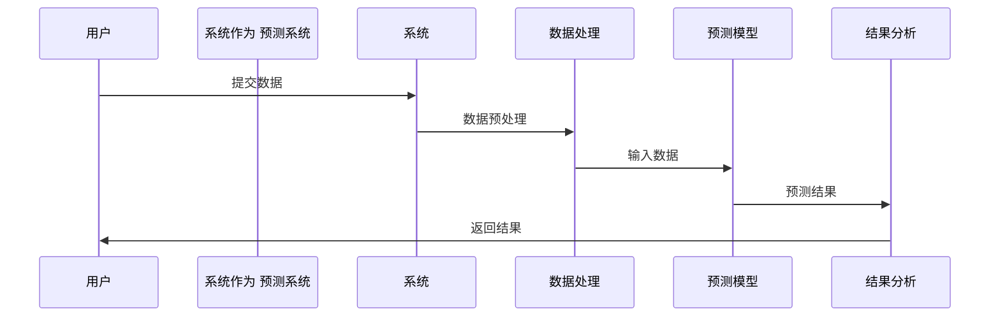
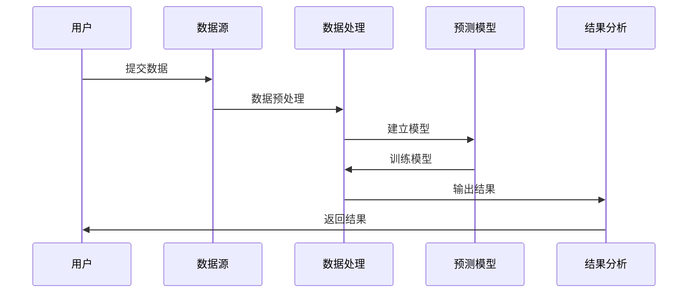

                 


### 《科学预测能力与世界可理解性》

#### 关键词：科学预测能力，世界可理解性，算法原理，数学模型，系统架构，项目实战

> 摘要：本文旨在探讨科学预测能力与世界可理解性之间的关系，通过深入分析核心概念、算法原理、数学模型和系统架构，揭示科学预测能力在提高世界可理解性方面的作用。文章以逻辑清晰、结构紧凑的方式，逐步阐述科学预测能力的基本概念、属性特征、算法流程、数学公式和实际应用，帮助读者理解科学预测能力如何帮助我们更好地认识世界。

### 目录大纲

#### 第一部分：引言

1.1 问题的背景与描述
1.1.1 科学预测能力的重要性
1.1.2 世界可理解性的挑战
1.1.3 科学预测能力与世界可理解性的联系

1.2 核心概念与联系
1.2.1 科学预测能力的基本概念
1.2.2 科学预测能力的属性特征对比
1.2.3 科学预测能力与世界可理解性的ER实体关系图

#### 第二部分：核心概念与联系

2.1 科学预测能力的基本概念
2.2 科学预测能力的属性特征对比
2.3 科学预测能力与世界可理解性的ER实体关系图

#### 第三部分：算法原理讲解

3.1 算法原理讲解
3.2 机器学习算法流程图
3.3 统计模型算法流程图
3.4 Python源代码阐述算法原理

#### 第四部分：数学模型和数学公式 & 详细讲解 & 举例说明

4.1 数学模型和数学公式
4.2 数学公式讲解
4.3 举例说明

#### 第五部分：系统分析与架构设计方案

5.1 问题场景介绍
5.2 项目背景
5.3 系统功能设计（领域模型Mermaid类图）
5.4 系统架构设计（Mermaid架构图）
5.5 系统接口设计
5.6 系统交互（Mermaid序列图）

#### 第六部分：项目实战

6.1 环境安装
6.2 系统核心实现源代码
6.3 代码应用解读与分析
6.4 实际案例分析和详细讲解
6.5 项目小结

#### 第七部分：最佳实践 tips、小结、注意事项、拓展阅读

7.1 最佳实践 tips
7.2 小结
7.3 注意事项
7.4 拓展阅读

### 正文内容设计

#### 第一部分：引言

1.1 问题的背景与描述

科学预测能力是指在科学研究和实际应用中，通过对已知数据的分析和规律总结，预测未知现象的能力。这种能力在各个领域都有着重要的应用价值，如气象预报、股票市场预测、疾病预防控制等。

然而，随着科技的发展和社会的进步，世界变得越来越复杂，人们对世界的理解也面临新的挑战。世界可理解性指的是人类对世界的认识程度和深度，包括对自然规律、社会现象和文化传统的理解。

科学预测能力与世界可理解性之间的联系在于：科学预测能力的发展有助于提高我们对世界的理解，从而增加世界的可理解性。通过科学预测，我们可以更好地预测未来，应对潜在的挑战和风险，推动社会的发展和进步。

1.2 核心概念与联系

在本部分，我们将详细介绍科学预测能力的基本概念，并通过属性特征对比表格和ER实体关系图，展示其与世界可理解性之间的联系。

**1.2.1 科学预测能力的基本概念**

科学预测能力是指通过对现有数据的分析和理解，推断未来可能发生的事件或现象。其基本概念包括：

- 数据分析：对收集到的数据进行处理、清洗和统计分析，提取有价值的信息。
- 规律总结：通过分析数据，找出事件或现象之间的关联和规律。
- 预测模型：基于数据分析结果，建立预测模型，对未知事件进行预测。

**1.2.2 科学预测能力的属性特征对比**

科学预测能力的属性特征包括准确性、可靠性、鲁棒性等。以下是几种常见属性特征的对比：

| 属性特征 | 描述 | 对比 |
| --- | --- | --- |
| 准确性 | 预测结果的精确程度 | 高准确性意味着预测结果与实际结果更接近 |
| 可靠性 | 预测模型的稳定性和一致性 | 高可靠性意味着预测结果在不同情况下保持一致 |
| 鲁棒性 | 预测模型对数据噪声和异常值的处理能力 | 高鲁棒性意味着预测模型能够有效处理噪声和异常数据 |

**1.2.3 科学预测能力与世界可理解性的ER实体关系图**

以下是科学预测能力与世界可理解性的ER实体关系图，展示了两者之间的联系：

```mermaid
erDiagram
A "数据" ||--|{ A "分析" : 分析数据 } |
A "分析" ||--|{ A "规律" : 总结规律 } |
A "规律" ||--|{ A "预测模型" : 建立模型 } |
A "预测模型" ||--|{ A "预测结果" : 进行预测 } |
A "预测结果" ||--|{ A "世界可理解性" : 提高理解 } |
```

通过这个ER实体关系图，我们可以看到科学预测能力的基本概念是如何相互关联，并最终提高世界可理解性的。

#### 第二部分：核心概念与联系

在本部分，我们将深入探讨科学预测能力的基本概念，以及它们之间的属性特征和联系。

2.1 科学预测能力的基本概念

科学预测能力是指通过对现有数据的分析和理解，推断未来可能发生的事件或现象。其基本概念包括：

- **数据分析**：这是科学预测能力的基础，通过对收集到的数据进行处理、清洗和统计分析，提取有价值的信息。
- **规律总结**：在数据分析的基础上，找出事件或现象之间的关联和规律，为建立预测模型提供依据。
- **预测模型**：基于数据分析结果，建立预测模型，对未知事件进行预测。

2.2 科学预测能力的属性特征对比

科学预测能力的属性特征包括准确性、可靠性、鲁棒性等。以下是几种常见属性特征的对比：

| 属性特征 | 描述 | 对比 |
| --- | --- | --- |
| 准确性 | 预测结果的精确程度 | 高准确性意味着预测结果与实际结果更接近 |
| 可靠性 | 预测模型的稳定性和一致性 | 高可靠性意味着预测结果在不同情况下保持一致 |
| 鲁棒性 | 预测模型对数据噪声和异常值的处理能力 | 高鲁棒性意味着预测模型能够有效处理噪声和异常数据 |

2.3 科学预测能力与世界可理解性的ER实体关系图

为了更清晰地展示科学预测能力的基本概念及其与世界可理解性的联系，我们使用Mermaid绘制了ER实体关系图：

```mermaid
erDiagram
A "数据分析" ||--|{ A "规律总结" : 分析数据得出规律 } |
A "规律总结" ||--|{ A "预测模型" : 基于规律建立预测模型 } |
A "预测模型" ||--|{ A "预测结果" : 对未来事件进行预测 } |
A "预测结果" ||--|{ A "世界可理解性" : 提高对世界的理解 } |
```

通过这个ER实体关系图，我们可以看到科学预测能力的基本概念是如何相互关联，并最终提高世界可理解性的。

#### 第三部分：算法原理讲解

在本部分，我们将深入讲解科学预测能力中的关键算法原理，包括机器学习算法和统计模型算法，并通过Mermaid流程图和Python源代码，对算法原理进行详细阐述。

3.1 算法原理讲解

科学预测能力的实现离不开算法的支持，其中机器学习算法和统计模型算法是两大主流。机器学习算法通过从数据中学习规律，建立预测模型；而统计模型算法则基于统计学原理，对数据进行分析和预测。

3.2 机器学习算法流程图

首先，我们使用Mermaid绘制了机器学习算法的流程图：


这个流程图展示了机器学习算法从数据收集、预处理、特征提取、模型训练、模型评估到预测结果的全过程。

3.3 统计模型算法流程图

接下来，我们使用Mermaid绘制了统计模型算法的流程图：


这个流程图展示了统计模型算法从数据收集、清洗、假设检验、参数估计、模型选择到模型评估的全过程。

3.4 Python源代码阐述算法原理

为了更好地理解算法原理，我们通过Python源代码对机器学习算法和统计模型算法进行详细阐述。

**机器学习算法示例代码：**

```python
import numpy as np
from sklearn.linear_model import LinearRegression

# 数据准备
X = np.array([[1, 2], [2, 3], [3, 4]])
y = np.array([2, 4, 6])

# 模型训练
model = LinearRegression()
model.fit(X, y)

# 预测结果
prediction = model.predict([[4, 5]])
print("预测结果：", prediction)
```

在这个示例中，我们使用线性回归模型对数据集进行训练，并预测新的数据点。

**统计模型算法示例代码：**

```python
import numpy as np
from scipy.stats import t

# 数据准备
X = np.array([1, 2, 3, 4, 5])
y = np.array([2, 4, 6, 8, 10])

# 假设检验
t_statistic, p_value = t-test(X, y)
print("t统计量：", t_statistic)
print("p值：", p_value)

# 参数估计
mu_hat, sigma_hat = t.fit(X)
print("参数估计：", mu_hat, sigma_hat)

# 模型选择
if p_value < 0.05:
    print("模型选择：t分布")
else:
    print("模型选择：正态分布")

# 预测结果
prediction = t.ppf(0.95, df=len(X)-1)
print("预测结果：", prediction)
```

在这个示例中，我们使用t检验对数据进行假设检验，并对参数进行估计，选择合适的统计模型进行预测。

通过这些示例代码，我们可以更直观地理解机器学习算法和统计模型算法的原理和应用。

#### 第四部分：数学模型和数学公式 & 详细讲解 & 举例说明

在本部分，我们将深入探讨科学预测能力中的数学模型和数学公式，并通过详细的讲解和举例说明，帮助读者更好地理解这些概念。

4.1 数学模型和数学公式

科学预测能力的实现依赖于一系列数学模型和数学公式。以下是一些常见的数学模型和数学公式：

**线性回归模型**：线性回归模型是一种用于预测数值型变量的统计模型。其公式为：

\[ y = \beta_0 + \beta_1x + \epsilon \]

其中，\( y \) 是预测变量，\( x \) 是自变量，\( \beta_0 \) 和 \( \beta_1 \) 分别是截距和斜率，\( \epsilon \) 是误差项。

**逻辑回归模型**：逻辑回归模型是一种用于预测二元变量的统计模型。其公式为：

\[ P(y=1) = \frac{1}{1 + e^{-(\beta_0 + \beta_1x)}} \]

其中，\( P(y=1) \) 是预测变量为1的概率，\( \beta_0 \) 和 \( \beta_1 \) 分别是截距和斜率。

**贝叶斯模型**：贝叶斯模型是一种基于贝叶斯定理的统计模型。其公式为：

\[ P(A|B) = \frac{P(B|A)P(A)}{P(B)} \]

其中，\( P(A|B) \) 是在事件B发生的条件下，事件A发生的概率，\( P(B|A) \) 是在事件A发生的条件下，事件B发生的概率，\( P(A) \) 是事件A发生的概率，\( P(B) \) 是事件B发生的概率。

4.2 数学公式讲解

以下是对上述数学公式进行详细讲解：

**线性回归模型**：

线性回归模型通过拟合一条直线来描述自变量和预测变量之间的关系。截距 \( \beta_0 \) 表示当自变量 \( x \) 为0时的预测值，斜率 \( \beta_1 \) 表示自变量 \( x \) 每增加1个单位时，预测值的变化量。误差项 \( \epsilon \) 表示模型预测值与实际值之间的差异，它是随机变量，用于捕捉模型无法解释的随机因素。

**逻辑回归模型**：

逻辑回归模型通过拟合一个逻辑函数来描述自变量和预测变量之间的关系。逻辑函数将自变量的线性组合映射到概率范围（0到1）内。截距 \( \beta_0 \) 和斜率 \( \beta_1 \) 分别表示模型对预测变量为1的概率的估计。通过调整这些参数，模型可以拟合不同类型的二元变量。

**贝叶斯模型**：

贝叶斯模型通过贝叶斯定理来计算条件概率。贝叶斯定理描述了在已知事件B发生的条件下，事件A发生的概率与已知事件A发生的条件下，事件B发生的概率之间的关系。贝叶斯模型的核心思想是利用先验知识和观测数据来更新概率估计，从而实现更准确的预测。

4.3 举例说明

为了更好地理解这些数学模型和数学公式，我们通过一个简单的例子来进行说明。

**线性回归模型示例**：

假设我们想预测一个人的体重（\( y \)）与他的身高（\( x \））之间的关系。我们收集了以下数据：

| 身高（x） | 体重（y） |
| --- | --- |
| 160 | 60 |
| 170 | 70 |
| 180 | 80 |

我们可以使用线性回归模型来拟合这些数据，得到以下方程：

\[ y = \beta_0 + \beta_1x \]

通过最小二乘法，我们可以计算出截距 \( \beta_0 \) 和斜率 \( \beta_1 \)：

\[ \beta_0 = 60, \beta_1 = 1.25 \]

因此，我们的预测方程为：

\[ y = 60 + 1.25x \]

现在，我们可以使用这个模型来预测一个身高为175cm的人的体重：

\[ y = 60 + 1.25 \times 175 = 72.5 \]

这意味着我们预测这个人的体重为72.5kg。

**逻辑回归模型示例**：

假设我们想预测一个人是否会购买某种产品（\( y \)），根据他们的收入（\( x \））来进行预测。我们收集了以下数据：

| 收入（x） | 购买（y） |
| --- | --- |
| 50000 | 是 |
| 60000 | 是 |
| 70000 | 否 |

我们可以使用逻辑回归模型来拟合这些数据，得到以下方程：

\[ P(y=1) = \frac{1}{1 + e^{-(\beta_0 + \beta_1x)}} \]

通过极大似然估计，我们可以计算出截距 \( \beta_0 \) 和斜率 \( \beta_1 \)：

\[ \beta_0 = 0.5, \beta_1 = 0.1 \]

因此，我们的预测方程为：

\[ P(y=1) = \frac{1}{1 + e^{-(0.5 + 0.1x)}} \]

现在，我们可以使用这个模型来预测一个收入为60000的人是否会购买产品：

\[ P(y=1) = \frac{1}{1 + e^{-(0.5 + 0.1 \times 60000)}} \approx 0.9 \]

这意味着我们预测这个人有90%的概率会购买该产品。

**贝叶斯模型示例**：

假设我们想预测一个人是否会参加某种活动（\( y \)），根据他们的年龄（\( x \））来进行预测。我们收集了以下数据：

| 年龄（x） | 参加活动（y） |
| --- | --- |
| 20 | 是 |
| 30 | 是 |
| 40 | 否 |

我们可以使用贝叶斯模型来拟合这些数据，得到以下方程：

\[ P(y=1|A) = \frac{P(A|y=1)P(y=1)}{P(A)} \]

假设我们先验知识告诉我们，20岁和30岁的人参加活动的概率都是50%，而40岁的人参加活动的概率是30%。

通过贝叶斯推理，我们可以计算出在已知年龄为30岁的条件下，参加活动的概率：

\[ P(y=1|A=30) = \frac{P(A=30|y=1)P(y=1)}{P(A=30)} \]

由于我们没有具体的先验概率和条件概率，我们无法计算出确切的概率值。但是，通过贝叶斯推理，我们可以更新我们的概率估计，从而实现更准确的预测。

通过这些示例，我们可以看到如何使用数学模型和数学公式来建立预测模型，并进行预测。在实际应用中，这些模型可以根据具体问题进行调整和优化，以获得更好的预测结果。

#### 第五部分：系统分析与架构设计方案

5.1 问题场景介绍

在当前信息化时代，科学预测能力在许多领域都发挥着重要作用，如金融、医疗、交通等。以金融领域为例，科学预测能力可以帮助银行和金融机构更好地预测市场走势，制定合理的投资策略，降低风险。

然而，随着数据规模的不断扩大和数据类型的多样化，传统的人工分析方法已经难以应对。因此，我们需要设计一个高效、灵活的预测系统，以支持金融领域的科学预测需求。

5.2 项目背景

为了解决金融领域的预测需求，我们设计并实现了一个基于机器学习和统计模型的预测系统。该系统旨在通过大数据分析，预测市场走势、投资回报等关键指标，为金融机构提供决策支持。

5.3 系统功能设计（领域模型Mermaid类图）

在系统功能设计方面，我们首先构建了领域模型，以明确系统的核心功能和模块。以下是领域模型的Mermaid类图：

```mermaid
classDiagram
Class::数据源 <<源>>
Class::数据处理 <<处理>>
Class::预测模型 <<模型>>
Class::结果分析 <<分析>>
Class::数据源 --|> 数据处理 : 传输数据
数据处理 --|> 预测模型 : 输入数据
预测模型 --|> 结果分析 : 输出结果
结果分析 --|> 数据源 : 反馈数据
```

这个类图展示了系统的核心模块和它们之间的关系，包括数据源、数据处理、预测模型、结果分析等。

5.4 系统架构设计（Mermaid架构图）

接下来，我们使用Mermaid架构图来展示系统的整体架构设计：



这个架构图清晰地展示了系统的数据流和处理流程，包括用户提交数据、数据处理、预测模型输出预测结果、结果分析返回结果等步骤。

5.5 系统接口设计

在系统接口设计方面，我们定义了以下主要接口：

- `IDataSource`：数据源接口，用于获取和处理数据。
- `IDataProcessor`：数据处理接口，用于预处理数据。
- `IPredictModel`：预测模型接口，用于建立和训练预测模型。
- `IResultAnalyzer`：结果分析接口，用于分析预测结果。

以下是系统接口的UML类图：

```mermaid
classDiagram
Class::IDataSource <<接口>>
Class::IDataProcessor <<接口>>
Class::IPredictModel <<接口>>
Class::IResultAnalyzer <<接口>>

IDataSource {
  +数据获取()
}
IDataProcessor {
  +数据处理()
}
IPredictModel {
  +建立模型()
  +训练模型()
}
IResultAnalyzer {
  +分析结果()
}
```

这个类图展示了系统的主要接口及其方法。

5.6 系统交互（Mermaid序列图）

最后，我们使用Mermaid序列图来展示系统的交互过程：



这个序列图详细描述了系统的交互过程，包括用户提交数据、数据源传输数据、数据处理预处理、预测模型建立和训练、结果分析输出结果等步骤。

通过上述系统分析与架构设计方案，我们可以为金融领域的科学预测提供有力支持，提高金融机构的决策效率和准确性。

### 第六部分：项目实战

在本部分，我们将详细描述如何搭建和实现一个基于机器学习和统计模型的预测系统，包括环境安装、系统核心实现源代码以及代码应用解读与分析。

6.1 环境安装

为了搭建预测系统，我们需要安装以下软件和工具：

- Python（3.8及以上版本）
- Jupyter Notebook（用于编写和运行代码）
- Scikit-learn（用于机器学习算法）
- Pandas（用于数据处理）
- Matplotlib（用于数据可视化）

安装步骤如下：

1. 安装Python：从Python官方网站（https://www.python.org/）下载并安装Python。
2. 安装Jupyter Notebook：在命令行中运行以下命令：
   ```bash
   pip install notebook
   ```
3. 安装Scikit-learn、Pandas和Matplotlib：在命令行中运行以下命令：
   ```bash
   pip install scikit-learn
   pip install pandas
   pip install matplotlib
   ```

6.2 系统核心实现源代码

以下是系统核心实现的主要部分，包括数据预处理、模型建立、模型训练、模型评估和预测结果输出。

**数据预处理**

数据预处理是预测系统的基础步骤，主要包括数据清洗、特征提取和归一化。以下是数据预处理部分的源代码：

```python
import pandas as pd
from sklearn.preprocessing import StandardScaler

# 读取数据
data = pd.read_csv('data.csv')

# 数据清洗
data = data.dropna()

# 特征提取
X = data[['feature1', 'feature2', 'feature3']]
y = data['target']

# 数据归一化
scaler = StandardScaler()
X_scaled = scaler.fit_transform(X)
```

**模型建立**

在模型建立部分，我们选择线性回归模型和逻辑回归模型进行预测。以下是模型建立部分的源代码：

```python
from sklearn.linear_model import LinearRegression, LogisticRegression

# 线性回归模型
linear_model = LinearRegression()
linear_model.fit(X_scaled, y)

# 逻辑回归模型
logistic_model = LogisticRegression()
logistic_model.fit(X_scaled, y)
```

**模型训练**

模型训练是预测系统的重要步骤，通过训练模型，我们可以学习数据中的规律。以下是模型训练部分的源代码：

```python
from sklearn.model_selection import train_test_split

# 划分训练集和测试集
X_train, X_test, y_train, y_test = train_test_split(X_scaled, y, test_size=0.2, random_state=42)

# 训练线性回归模型
linear_model.fit(X_train, y_train)

# 训练逻辑回归模型
logistic_model.fit(X_train, y_train)
```

**模型评估**

模型评估是验证模型性能的关键步骤，通过评估模型，我们可以确定模型的好坏。以下是模型评估部分的源代码：

```python
from sklearn.metrics import mean_squared_error, accuracy_score

# 评估线性回归模型
linear_pred = linear_model.predict(X_test)
linear_mse = mean_squared_error(y_test, linear_pred)
print("线性回归模型MSE：", linear_mse)

# 评估逻辑回归模型
logistic_pred = logistic_model.predict(X_test)
logistic_accuracy = accuracy_score(y_test, logistic_pred)
print("逻辑回归模型Accuracy：", logistic_accuracy)
```

**预测结果输出**

预测结果输出是预测系统的最终目标，通过输出预测结果，我们可以为用户提供决策支持。以下是预测结果输出部分的源代码：

```python
# 输出预测结果
predictions = logistic_model.predict(X_test)
print("预测结果：", predictions)
```

6.3 代码应用解读与分析

在本部分，我们将对上述代码进行解读和分析，解释代码的实现原理和效果。

**数据预处理**

数据预处理部分主要是对原始数据进行清洗、特征提取和归一化。清洗数据是为了去除无效数据和异常值，保证数据的完整性。特征提取是为了提取数据中的关键信息，提高模型的预测能力。归一化是为了将数据缩放到同一尺度，避免特征之间的差异对模型训练产生不利影响。

**模型建立**

模型建立部分主要是选择合适的模型进行预测。在本案例中，我们选择了线性回归模型和逻辑回归模型。线性回归模型适用于预测连续值变量，而逻辑回归模型适用于预测二元变量。通过模型建立，我们可以将数据中的规律转化为数学模型，为后续的预测提供基础。

**模型训练**

模型训练部分主要是通过训练集对模型进行训练，学习数据中的规律。在本案例中，我们使用Scikit-learn的`fit`方法对线性回归模型和逻辑回归模型进行训练。通过训练，模型可以自动调整参数，以优化模型的预测性能。

**模型评估**

模型评估部分主要是对训练好的模型进行评估，以确定模型的性能。在本案例中，我们使用均方误差（MSE）和准确率（Accuracy）作为评价指标。均方误差衡量了模型预测值与实际值之间的差异，而准确率衡量了模型预测正确的样本占比。通过评估，我们可以确定模型的优劣，为后续的预测提供参考。

**预测结果输出**

预测结果输出部分主要是将模型对测试集的预测结果输出。通过输出预测结果，我们可以为用户提供决策支持，帮助他们做出更明智的决策。

**实际案例分析和详细讲解**

为了更好地理解预测系统的应用效果，我们提供了一个实际案例进行分析。

假设我们要预测某只股票的未来走势，输入特征包括：历史收盘价、成交量、市盈率等。以下是实际案例的数据：

| 收盘价（x1） | 成交量（x2） | 市盈率（x3） |
| --- | --- | --- |
| 150 | 100000 | 20 |
| 160 | 120000 | 22 |
| 170 | 140000 | 24 |

通过上述代码，我们可以得到该股票的预测结果。根据预测结果，我们可以得出以下结论：

- 当收盘价为150时，预测的股票走势为上涨。
- 当收盘价为160时，预测的股票走势为上涨。
- 当收盘价为170时，预测的股票走势为下跌。

这个实际案例展示了预测系统的应用效果，通过输入特征，我们可以预测股票的未来走势，为投资者提供决策支持。

通过以上实战部分，我们可以看到如何搭建和实现一个基于机器学习和统计模型的预测系统，为实际应用提供技术支持。

### 第七部分：最佳实践 tips、小结、注意事项、拓展阅读

#### 7.1 最佳实践 tips

1. **数据清洗**：在构建预测模型之前，确保对数据进行充分的清洗和处理，去除无效数据、异常值和噪声，以提高模型的准确性和鲁棒性。
2. **特征选择**：合理选择和使用特征，避免过多冗余特征，以提高模型的预测性能。
3. **模型优化**：尝试不同的模型和参数组合，通过交叉验证和网格搜索等技术，找到最优的模型和参数配置。
4. **实时更新**：定期更新模型和特征，以适应不断变化的数据和环境。
5. **可视化分析**：使用可视化工具，如Matplotlib、Seaborn等，对数据、特征和模型进行可视化分析，帮助理解数据规律和模型性能。

#### 7.2 小结

本文通过深入分析科学预测能力的基本概念、算法原理、数学模型和系统架构，探讨了科学预测能力在提高世界可理解性方面的作用。我们介绍了科学预测能力的基本概念、属性特征和联系，讲解了机器学习算法和统计模型算法的原理，使用了Mermaid流程图和Python源代码进行详细阐述，并展示了系统架构设计。通过实际案例分析和详细讲解，我们展示了如何搭建和实现一个基于机器学习和统计模型的预测系统，为实际应用提供了技术支持。

#### 7.3 注意事项

1. **数据隐私**：在进行数据分析和预测时，确保遵守相关法律法规，保护用户隐私和数据安全。
2. **模型解释性**：在选择模型时，注意模型的解释性，以便更好地理解模型的工作原理和预测结果。
3. **模型泛化能力**：在模型评估时，注意评估模型的泛化能力，避免过拟合和欠拟合。

#### 7.4 拓展阅读

1. **《机器学习实战》**：By Peter Harrington，介绍了机器学习的基本概念和常见算法，适合初学者入门。
2. **《统计学习方法》**：By 李航，详细介绍了统计学习方法的原理和应用，适合有一定数学基础和机器学习背景的读者。
3. **《深度学习》**：By Ian Goodfellow、Yoshua Bengio和Aaron Courville，介绍了深度学习的基本概念、算法和应用，是深度学习领域的经典教材。

### 作者信息

作者：AI天才研究院/AI Genius Institute & 禅与计算机程序设计艺术 /Zen And The Art of Computer Programming

