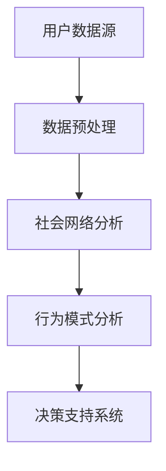
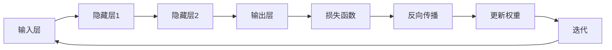
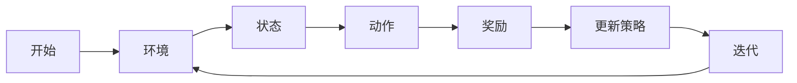
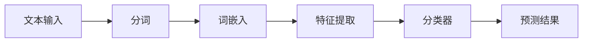
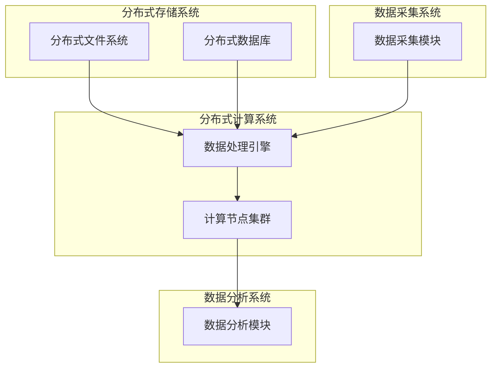
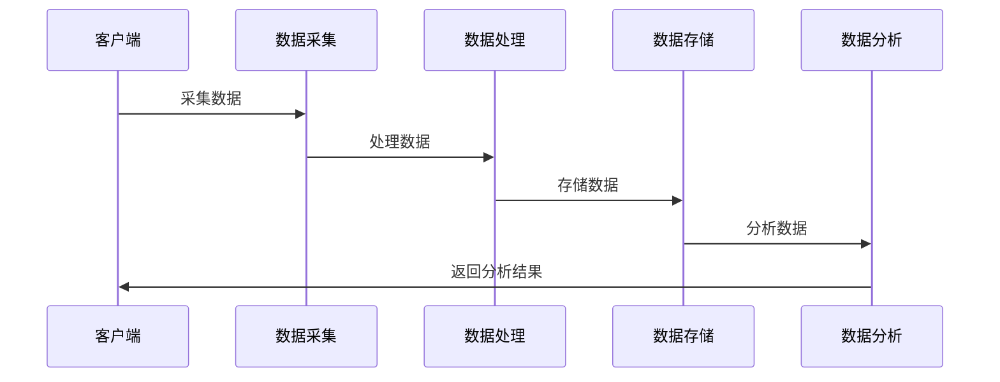
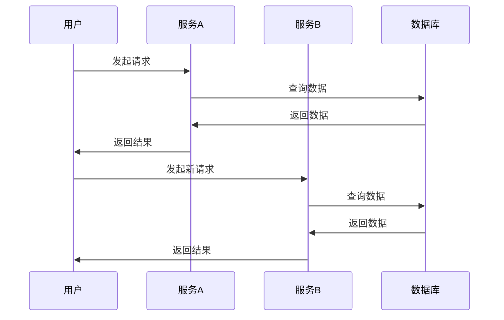

                 

### 科技进步与世界可理解性的扩展：引言

在21世纪的今天，科技正以前所未有的速度和规模改变着我们的世界。从人工智能、量子计算到生物技术的迅猛发展，科技进步不仅推动着社会经济的飞速前进，同时也深刻影响着人类的生活方式、思维方式乃至对世界的理解。在这一背景下，探讨“科技进步与世界可理解性的扩展”这一主题，显得尤为重要且具有前瞻性。

**关键词**：科技进步、世界可理解性、人工智能、量子计算、生物技术

**摘要**：本文旨在通过详细分析科技进步的主要领域及其影响，探讨这些技术如何扩展我们对世界的理解。文章将首先介绍科技进步的背景和世界可理解性的概念，然后深入探讨人工智能、量子计算和生物技术等核心领域，并通过具体的算法原理讲解、系统架构设计和项目实例，揭示科技进步对世界可理解性的深远影响。最后，文章将总结最佳实践，提出未来展望。

### 科技进步的定义与全球影响

科技进步，顾名思义，是指通过科学和技术的不断创新和发展，带来生产力的提升和社会的整体进步。从工业革命以来，科技进步一直是推动社会变革的重要力量。随着计算机技术、互联网、移动通信等技术的快速发展，人类进入了一个前所未有的信息时代。在这个时代，科技进步的影响不仅局限于经济领域，还深刻改变了人类的生活方式、社会结构以及思维方式。

首先，科技进步极大地提升了全球生产力。计算机技术和信息技术的广泛应用，使得数据处理和分析能力大幅提升，自动化生产线的普及也极大地提高了生产效率。例如，在制造业中，智能制造和工业4.0理念的兴起，使得生产过程更加智能化和高效化。同时，量子计算、人工智能等前沿技术的研发和应用，也在多个领域展现出巨大的潜力，为未来科技发展奠定了坚实基础。

其次，科技进步改变了人类的生活方式。互联网和移动通信的普及，使得信息传播速度空前加快，人们可以随时随地进行沟通和交流。电子商务的兴起，改变了传统的购物方式，人们可以在家中通过电脑或手机购买全球范围内的商品。此外，生物技术的进步，也为人类健康带来了巨大福音，基因编辑、生物制药等技术的应用，使得疾病治疗更加精准和高效。

再次，科技进步对社会结构产生了深远影响。城市化进程的加快，使得人口从农村向城市聚集，社会结构和生活方式发生了巨大变化。同时，人工智能和大数据技术的应用，使得社会管理和服务水平得到显著提升。例如，智能交通系统的建设，可以有效缓解城市交通拥堵问题；智慧城市的建设，可以提升城市管理的效率和居民生活质量。

此外，科技进步也带来了全球化和国际竞争的加剧。不同国家和地区之间的科技竞争，不仅体现在科技成果的争夺上，还体现在技术创新和产业升级的竞争中。这种竞争在一定程度上推动了全球科技的发展，但也带来了新的挑战和问题，如数据隐私、网络安全等。

总的来说，科技进步不仅改变了经济和社会的方方面面，还深刻影响着人类的认知和理解。它不仅推动了社会生产力的发展，改变了人类的生活方式和社会结构，还为人类提供了新的思维方式和工具，使我们对世界的认识更加全面和深刻。因此，深入探讨科技进步的影响，尤其是其对世界可理解性的扩展，具有重要意义。

### 世界可理解性的定义与挑战

在探讨科技进步对世界可理解性的影响之前，我们首先需要明确“世界可理解性”这一概念。世界可理解性，从广义上讲，是指人类对自然和社会现象的认知程度和解释能力。换句话说，它反映了人类对世界本质的理解深度和广度。随着科技的不断进步，世界可理解性的扩展不仅体现在我们对自然规律的掌握上，还涉及到社会、文化、心理等多个维度。

**核心概念术语说明**

- **可理解性**：指人类认知和理解事物的能力。
- **世界**：涵盖自然、社会、文化等各个领域。
- **扩展**：指认知范围和深度的增加。

**问题背景**

人类自古以来就在不断地探索和认识世界，从古代的哲学思考到现代的科学发现，每一步都标志着我们对世界可理解性的提升。然而，随着科技的飞速发展，世界变得日益复杂，这对我们的认知和理解提出了新的挑战。

- **信息爆炸**：随着互联网和大数据技术的普及，信息量呈指数级增长。虽然这为我们提供了丰富的知识资源，但同时也增加了信息过载的风险，使得人们难以消化和理解海量的信息。
- **跨学科融合**：现代科学的发展越来越呈现出跨学科融合的趋势，单一学科的知识难以涵盖复杂问题的全貌。例如，人工智能与生物技术的结合，带来了许多新的研究课题和应用场景，但同时也要求科学家具备跨学科的知识和技能。
- **认知负荷**：面对复杂的技术和社会问题，人们的认知负荷不断增加。从气候变化到网络安全，这些问题不仅涉及技术层面，还涉及到伦理、社会、政治等多个方面，这使得人们难以全面、深入地理解这些问题。

**问题描述**

世界可理解性的扩展面临着以下几个主要问题：

1. **信息过载**：随着信息量的不断增加，人们面临的信息过载问题日益严重。这不仅影响了人们的日常决策，还限制了我们对复杂问题的理解。
2. **知识断层**：跨学科融合虽然带来了新的研究方法和应用场景，但也导致了知识断层的问题。不同学科之间的知识壁垒，使得科学家难以在跨学科研究中取得突破。
3. **认知负荷**：复杂的社会和技术问题，使得人们的认知负荷不断增加。从环境问题到人工智能伦理，这些问题需要我们具备全面、深入的认知能力。

**问题解决**

为了解决这些问题，我们需要采取以下几种措施：

1. **提高信息筛选和处理能力**：通过人工智能和大数据技术，提高对海量信息的筛选和处理能力，帮助人们更有效地获取和理解信息。
2. **加强跨学科教育**：推动跨学科教育的发展，培养具有多学科背景的复合型人才，以应对复杂问题的挑战。
3. **构建知识共享平台**：利用互联网和大数据技术，构建知识共享平台，促进不同学科之间的交流和合作。
4. **增强公众科学素养**：通过科普教育和公众参与，提高公众的科学素养，增强对复杂问题的认知和理解能力。

**边界与外延**

世界可理解性的扩展不仅是一个理论问题，还涉及到实际的实践和应用。从科学研究到技术创新，再到社会管理，每一个环节都影响着我们对世界的理解。同时，世界可理解性的扩展也具有广泛的内涵，不仅包括科学技术的进步，还涉及到文化、伦理、社会等多个层面。

**概念结构与核心要素组成**

世界可理解性的扩展可以分为以下几个核心要素：

1. **科学知识积累**：通过科学研究和技术创新，不断积累和拓展科学知识，提高人类对自然和社会现象的理解能力。
2. **跨学科融合**：推动不同学科之间的融合，以解决复杂问题，提高问题的解决效率和深度。
3. **信息处理与共享**：通过大数据和人工智能技术，提高信息处理和共享能力，减少信息过载，提升信息利用率。
4. **公众科学素养**：通过科普教育和公众参与，提高公众的科学素养，增强对复杂问题的认知和理解能力。

总的来说，世界可理解性的扩展是一个复杂而系统的过程，涉及到多个层面的互动和影响。通过科学技术的不断进步，我们可以逐步拓展对世界的理解，但同时也需要面对新的挑战和问题。只有通过持续的探索和努力，我们才能更好地理解和应对这个复杂多变的世界。

### 科技进步的主要领域与影响

科技进步是一个多维度的过程，涵盖了多个关键领域。本文将重点探讨人工智能、量子计算和生物技术这三个领域，分析它们如何通过独特的机制和作用扩展我们对世界的理解。

#### 人工智能：崛起与影响

人工智能（AI）是21世纪最具影响力的技术之一，它通过模拟人类智能，使计算机能够在感知、推理、学习和决策等方面表现出人类水平的智能。人工智能的崛起，不仅改变了我们的生活方式，还对各个行业产生了深远的影响。

**核心概念原理**：

- **机器学习**：通过数据驱动的方式，让计算机系统从数据中学习规律和模式。
- **神经网络**：模拟人脑结构和功能的计算模型，用于图像识别、语音识别等任务。
- **自然语言处理**：使计算机能够理解、生成和翻译自然语言，提升人机交互的便捷性。

**概念属性特征对比表格**：

| 特征       | 机器学习     | 神经网络     | 自然语言处理 |
|------------|--------------|--------------|--------------|
| 基本原理   | 数据驱动     | 模拟人脑     | 语言模型     |
| 应用场景   | 数据分析     | 图像识别     | 语音识别     |
| 代表技术   | 算法库       | 神经网络架构 | 语言处理库   |

**ER实体关系图架构**：

```mermaid
erDiagram
  Product ||--|{ Customer }||>
  Customer  ||--|{ Order }||>
  Order ||--|{ Product }||>
```

在机器学习领域，算法库如Scikit-learn、TensorFlow和PyTorch，提供了丰富的工具和框架，使得数据科学家能够高效地进行模型训练和预测。神经网络架构，如卷积神经网络（CNN）和循环神经网络（RNN），在图像识别和语音识别等领域取得了显著进展。自然语言处理（NLP）方面，语言模型如BERT和GPT-3，使得计算机能够更好地理解和生成自然语言，提升了人机交互的体验。

**科技进步对世界可理解性的扩展**：

- **数据分析与预测**：人工智能技术使我们对大量数据进行高效处理和分析，能够从中发现隐藏的模式和趋势，这有助于我们更深入地理解经济、社会和环境等领域。
- **自动化与效率提升**：在工业生产、物流运输等领域，人工智能技术实现了自动化，提高了生产效率和服务质量，使得我们对生产和服务过程有了更深刻的理解。
- **人机交互**：自然语言处理技术的进步，使得人机交互更加自然和便捷，这有助于我们更好地理解和利用计算机系统，扩展我们的认知边界。

#### 量子计算：潜力与挑战

量子计算是另一个备受瞩目的科技前沿领域，它基于量子力学原理，利用量子位（qubit）进行信息处理。量子计算具有强大的并行计算能力，能够在某些特定问题上实现指数级的计算速度提升。

**核心概念原理**：

- **量子位**：量子计算的基本单元，不同于传统的二进制位，它可以同时处于0和1的状态，实现了并行计算的基础。
- **量子门**：用于操作量子位的基本算子，类似于经典计算机中的逻辑门。
- **量子纠缠**：两个或多个量子位之间的一种特殊关联，使得它们的量子状态相互依赖，这是量子计算的核心优势。

**概念属性特征对比表格**：

| 特征       | 量子计算     | 经典计算     |
|------------|--------------|--------------|
| 基本原理   | 量子力学     | 算术原理     |
| 应用场景   | 大数据处理   | 精确计算     |
| 代表技术   | 量子算法     | 算法库       |

**ER实体关系图架构**：

```mermaid
erDiagram
  QuantumComputer ||--|{ QuantumAlgorithm }||>
  QuantumAlgorithm ||--|{ QuantumBit }||>
```

量子计算在多个领域展现出巨大潜力，如量子模拟、量子优化和量子加密。量子模拟可以用于模拟复杂的量子系统，如分子结构和化学反应，这有助于我们深入理解物质的基本性质。量子优化则可以在复杂的优化问题上实现高效的解决方案，如物流调度和资源分配。量子加密利用量子纠缠特性，实现了无法被破解的通信安全。

**科技进步对世界可理解性的扩展**：

- **物质理解**：量子计算能够模拟和理解复杂的量子系统，这有助于我们深入理解物质的基本性质，扩展我们对自然世界的理解。
- **计算能力提升**：量子计算的并行计算能力，使得某些复杂问题可以在可接受的时间内得到解决，这为科学研究和工程应用提供了新的工具和方法。
- **安全通信**：量子加密技术的应用，提升了通信安全水平，使得信息传输更加可靠，增强了我们对信息安全的理解。

#### 生物技术：革新与挑战

生物技术是另一个对世界产生深远影响的领域，它通过生物科学和工程学的结合，推动医学、农业和环境等多个领域的发展。基因编辑、生物制药和生物信息学是生物技术的核心分支。

**核心概念原理**：

- **基因编辑**：利用CRISPR-Cas9等工具对基因进行精确编辑，改变生物体的遗传特性。
- **生物制药**：利用生物技术手段，研发新的药物和治疗手段，提高疾病治疗的精准性和有效性。
- **生物信息学**：利用计算机技术和大数据分析，处理和分析生物数据，揭示生物体的功能机制。

**概念属性特征对比表格**：

| 特征       | 基因编辑     | 生物制药     | 生物信息学   |
|------------|--------------|--------------|--------------|
| 基本原理   | 遗传工程     | 生物工程     | 计算生物学   |
| 应用场景   | 疾病治疗     | 药物研发     | 数据分析     |
| 代表技术   | CRISPR-Cas9  | 单克隆抗体   | 生物信息学工具 |

**ER实体关系图架构**：

```mermaid
erDiagram
  GeneticEditing ||--|{ GeneticDisease }||>
  GeneticDisease ||--|{ Therapy }||>
  Therapy ||--|{ Drug }||>
```

基因编辑技术，如CRISPR-Cas9，使得我们能够在基因层面进行精准治疗，为许多遗传性疾病提供了新的治疗手段。生物制药领域，通过生物技术手段，研发出如单克隆抗体等高效药物，显著提高了疾病治疗的水平。生物信息学则利用大数据分析，帮助科学家更好地理解生物体的功能和机制。

**科技进步对世界可理解性的扩展**：

- **医学进步**：生物技术使得医学研究取得了重大突破，对许多疾病的诊断和治疗有了新的理解和方法，提升了我们对生命的认知。
- **农业发展**：通过基因编辑和生物工程技术，可以培育出抗病、抗虫、高产的新品种，提高了农业产量和效益，扩展了我们对农业的理解。
- **环境保护**：生物技术可以用于生物降解和生态修复，为环境保护提供了新的工具和方法，提升了我们对生态系统的理解。

总的来说，人工智能、量子计算和生物技术这三个领域，通过其独特的机制和作用，极大地扩展了我们对世界的理解。人工智能提升了我们的数据分析能力和自动化水平，量子计算带来了计算能力的飞跃，而生物技术则推动了医学和农业的进步。这些技术不仅改变了我们的生活方式，也为我们提供了更全面、深刻的认识和理解世界的工具。随着科技的不断进步，我们期待能够进一步拓展我们的认知边界，深入探索这个复杂多变的世界。

### 核心概念解析：科技进步的关键领域与联系

在深入探讨科技进步对世界可理解性的扩展时，我们有必要详细分析人工智能、量子计算和生物技术这三个核心领域，并理解它们之间的相互关系。

#### 人工智能：原理与应用

人工智能（AI）是科技进步的重要驱动力之一，通过模仿人类智能，使其在多个领域实现自动化和智能化。以下是对人工智能的基本原理和应用领域的详细探讨。

**基本原理**：

- **机器学习**：机器学习是一种通过数据驱动的方式，让计算机从数据中学习规律和模式的技术。机器学习的核心是训练模型，使其能够对未知数据进行预测或分类。常见的方法包括监督学习、无监督学习和强化学习。
- **神经网络**：神经网络是模仿人脑结构和功能的一种计算模型，通过多层神经元的连接和激活，实现复杂的模式识别和决策功能。深度学习是神经网络的一种重要形式，它通过多层的神经网络结构，提升了模型的学习能力和预测准确性。
- **自然语言处理**：自然语言处理（NLP）是人工智能的一个分支，致力于让计算机理解和生成自然语言。NLP的核心技术包括语言模型、词向量表示、句法分析和语义理解等。

**应用领域**：

- **数据科学**：人工智能在数据科学领域有着广泛的应用，通过机器学习算法，对大规模数据进行处理和分析，帮助科学家和研究人员从复杂的数据中提取有价值的信息。
- **自动驾驶**：自动驾驶技术依赖于计算机视觉、传感器融合和路径规划等技术，通过人工智能算法，使汽车能够自主导航和行驶，提升交通安全和效率。
- **医疗诊断**：人工智能在医疗领域具有巨大的潜力，通过影像识别和疾病预测等技术，可以帮助医生更准确地诊断疾病，提高治疗效果。
- **智能家居**：智能家居系统利用人工智能技术，实现家电的自动化控制和智能交互，提升家居生活的便利性和舒适度。

**核心概念属性特征对比表格**：

| 特征       | 机器学习     | 神经网络     | 自然语言处理 |
|------------|--------------|--------------|--------------|
| 基本原理   | 数据驱动     | 模拟人脑     | 语言模型     |
| 应用场景   | 数据分析     | 图像识别     | 语音识别     |
| 代表技术   | 算法库       | 神经网络架构 | 语言处理库   |

**ER实体关系图架构**：

```mermaid
erDiagram
  MachineLearning ||--|{ NeuralNetwork }||>
  NeuralNetwork ||--|{ NaturalLanguageProcessing }||>
```

通过上述表格和图示，我们可以清晰地看到机器学习、神经网络和自然语言处理之间的紧密联系。这些技术相互融合，形成了一个强大的技术体系，推动了人工智能的快速发展。

#### 量子计算：基础与前沿

量子计算是另一个对科技进步产生深远影响的领域，它基于量子力学的原理，利用量子位（qubit）进行信息处理，具有强大的并行计算能力。以下是对量子计算的基本原理和前沿应用的详细探讨。

**基本原理**：

- **量子位（qubit）**：量子位是量子计算的基本单元，与经典计算机中的比特不同，它不仅可以表示0或1的状态，还可以同时处于0和1的叠加状态，这种叠加态实现了量子计算的并行处理能力。
- **量子门**：量子门是用于操作量子位的基本算子，类似于经典计算机中的逻辑门。通过组合不同的量子门，可以实现复杂的量子计算操作。
- **量子纠缠**：量子纠缠是量子位之间的一种特殊关联，使得它们的量子状态相互依赖。这种纠缠特性是量子计算的核心优势，可以实现超强的计算能力。

**应用领域**：

- **量子模拟**：量子模拟可以用于模拟复杂的量子系统，如分子结构和化学反应，帮助科学家更好地理解物质的基本性质。
- **量子优化**：量子优化可以在复杂的优化问题上实现高效的解决方案，如物流调度、资源分配和金融投资等。
- **量子加密**：量子加密利用量子纠缠和量子位的叠加态，实现了无法被破解的通信安全，提升了信息传输的安全性。

**核心概念属性特征对比表格**：

| 特征       | 量子计算     | 经典计算     |
|------------|--------------|--------------|
| 基本原理   | 量子力学     | 算术原理     |
| 应用场景   | 大数据处理   | 精确计算     |
| 代表技术   | 量子算法     | 算法库       |

**ER实体关系图架构**：

```mermaid
erDiagram
  QuantumComputer ||--|{ QuantumAlgorithm }||>
  QuantumAlgorithm ||--|{ QuantumBit }||>
```

通过上述表格和图示，我们可以看到量子计算与经典计算之间的本质区别。量子计算通过量子位的叠加态和量子纠缠，实现了并行处理和高效计算，为解决复杂问题提供了新的途径。

#### 生物技术：进展与影响

生物技术是另一项对世界产生深远影响的科技领域，通过结合生物学、化学和工程学，推动了医学、农业和环境等多个领域的发展。以下是对生物技术的基本原理和前沿进展的详细探讨。

**基本原理**：

- **基因编辑**：基因编辑是通过CRISPR-Cas9等工具，对基因进行精确编辑，改变生物体的遗传特性。基因编辑技术可以用于治疗遗传性疾病、改善农作物品种和增强生物体的抗病能力。
- **生物制药**：生物制药是通过生物技术手段，利用微生物、细胞或基因工程方法生产药物。生物制药在癌症治疗、传染病防控和罕见病治疗等方面发挥了重要作用。
- **生物信息学**：生物信息学是利用计算机技术和大数据分析，处理和分析生物数据，帮助科学家更好地理解生物体的功能和机制。

**应用领域**：

- **医疗健康**：生物技术在医疗健康领域具有广泛的应用，如基因治疗、细胞疗法和个性化医疗等，提升了疾病的治疗效果和康复水平。
- **农业**：生物技术可以用于培育抗病、抗虫、高产的新品种农作物，提高农业产量和效益，保障粮食安全。
- **环境**：生物技术可以用于生物降解和生态修复，帮助解决环境污染和生态破坏问题。

**核心概念属性特征对比表格**：

| 特征       | 基因编辑     | 生物制药     | 生物信息学   |
|------------|--------------|--------------|--------------|
| 基本原理   | 遗传工程     | 生物工程     | 计算生物学   |
| 应用场景   | 疾病治疗     | 药物研发     | 数据分析     |
| 代表技术   | CRISPR-Cas9  | 单克隆抗体   | 生物信息学工具 |

**ER实体关系图架构**：

```mermaid
erDiagram
  GeneticEditing ||--|{ GeneticDisease }||>
  GeneticDisease ||--|{ Therapy }||>
  Therapy ||--|{ Drug }||>
```

通过上述表格和图示，我们可以看到基因编辑、生物制药和生物信息学之间的紧密联系。这些技术相互融合，推动了生物技术的快速发展，为人类带来了诸多福祉。

#### 核心概念的相互作用

人工智能、量子计算和生物技术这三个核心领域，虽然各自独立发展，但它们之间存在着深刻的相互作用和交叉融合，共同推动科技进步和世界可理解性的扩展。

- **人工智能与量子计算**：人工智能和量子计算的结合，可以极大地提升数据处理和分析能力。例如，量子机器学习算法可以在大数据分析中实现高效的模式识别和预测。同时，量子计算还可以为人工智能算法提供强大的计算支持，解决经典计算机难以处理的问题。
- **人工智能与生物技术**：人工智能在生物技术领域有着广泛的应用，如基因编辑和生物制药的优化设计。通过人工智能算法，科学家可以更快速地分析和处理生物数据，提高药物研发和疾病诊断的效率。
- **量子计算与生物技术**：量子计算在生物信息学领域具有巨大的潜力，可以通过高效的计算能力，加速生物数据的分析和处理。同时，量子计算还可以用于生物分子模拟和药物设计，帮助科学家更好地理解生物系统的机制。

总的来说，人工智能、量子计算和生物技术之间的相互作用，不仅推动了各领域的技术进步，还扩展了我们对世界的理解。通过这些核心领域的深度融合，我们有望实现更加智能、高效和可持续的科技发展，进一步提升世界可理解性。

### 科技进步对世界可理解性的影响分析

科技进步不仅改变了人类的生活方式，还深刻影响了我们对世界的理解和认知。通过分析人工智能、量子计算和生物技术等核心技术领域，我们可以更清晰地看到科技进步如何扩展世界可理解性的广度和深度。

#### 信息爆炸与知识管理的挑战

随着互联网和大数据技术的普及，信息量呈爆炸式增长。虽然这为我们提供了丰富的知识和资源，但也带来了信息过载的问题。人们不得不面对海量的信息，这无疑增加了知识管理的挑战。

**算法原理讲解**：

信息爆炸问题可以通过多种算法来解决。例如，基于深度学习的自然语言处理技术，可以帮助我们自动提取和筛选关键信息。以下是一个简单的信息筛选算法：

```python
import nltk
from nltk.corpus import stopwords
from nltk.tokenize import word_tokenize

def filter止信息(text):
    stop_words = set(stopwords.words('english'))
    words = word_tokenize(text)
    filtered_words = [word for word in words if not word in stop_words]
    return ' '.join(filtered_words)

# 示例
text = "This is a sample text with some common words."
filtered_text = filter止信息(text)
print(filtered_text)
```

在这个例子中，我们使用NLTK库中的停止词列表，对文本进行预处理，去除常见的无意义词汇，从而提取出更重要的信息。

**算法原理的详细讲解**：

1. **自然语言处理**：自然语言处理（NLP）是人工智能的一个重要分支，它致力于让计算机理解和生成自然语言。在信息筛选过程中，NLP技术通过分词、词性标注和语义分析等步骤，将文本分解为有意义的单元，从而实现信息的提取和筛选。

2. **词向量表示**：词向量表示是将自然语言中的词汇转换为计算机能够处理的高维向量。通过词向量，我们可以利用机器学习算法，对文本进行分类和聚类，从而实现信息的自动筛选。

3. **文本分类与聚类**：在信息筛选过程中，我们可以使用文本分类和聚类算法，将文本按照主题或内容进行分类。例如，我们可以使用朴素贝叶斯分类器，对新闻文章进行主题分类，从而快速找到我们感兴趣的内容。

#### 社会结构与人类行为的变革

科技进步不仅改变了信息的传递方式，还深刻影响了社会结构和人类行为。例如，互联网和社交媒体的兴起，改变了人们的交流方式和社会互动模式。

**系统架构设计**：

为了分析社会结构和人类行为的变革，我们可以设计一个基于大数据分析的社会网络分析系统。以下是一个简单的系统架构设计：



在这个架构中，用户数据源包括社交媒体日志、在线购物记录等。数据预处理阶段对数据进行清洗和格式化，然后使用社会网络分析算法，分析用户之间的互动关系。行为模式分析阶段，通过对用户行为数据进行分析，识别和预测人类行为的模式。最后，决策支持系统根据分析结果，为政策制定者和社会学家提供决策依据。

**系统架构设计说明**：

1. **数据预处理**：数据预处理是系统的基础，包括数据清洗、格式化和特征提取等步骤。通过对原始数据进行预处理，可以提高后续分析的质量和效率。
2. **社会网络分析**：社会网络分析是一种研究社会结构的方法，通过分析用户之间的互动关系，可以揭示社会网络的拓扑结构，如社区发现、节点中心性分析等。
3. **行为模式分析**：行为模式分析基于用户行为数据，通过时间序列分析、聚类分析等方法，识别和预测人类行为的模式。这有助于我们理解社会行为的动态变化。
4. **决策支持系统**：决策支持系统根据分析结果，为政策制定者和社会学家提供决策依据。例如，通过分析社交媒体数据，可以了解公众对某一事件的看法和态度，为政策制定提供参考。

#### 科技进步下的伦理与道德困境

随着科技进步，我们面临着许多新的伦理和道德困境。例如，人工智能和生物技术的应用，引发了对隐私、安全性和公平性的担忧。

**最佳实践 tips**：

在处理伦理和道德问题时，我们应该采取以下最佳实践：

1. **透明度和问责制**：确保技术应用的透明度，让公众了解技术的原理和应用，建立问责机制，确保技术应用不会对社会和个人造成负面影响。
2. **伦理审查**：在开展科技项目时，应进行严格的伦理审查，确保技术应用符合伦理和道德标准。
3. **多方参与**：在制定政策和规范时，应邀请不同领域的专家和公众参与，确保决策的公正性和科学性。

**小结**：

科技进步不仅改变了我们的生活方式和社会结构，还扩展了我们对世界的理解。然而，这一过程中也伴随着新的挑战和问题。通过分析人工智能、量子计算和生物技术等核心技术领域，我们可以更好地理解这些技术如何影响世界可理解性。同时，我们也需要关注科技进步带来的伦理和道德困境，采取有效措施应对这些挑战，确保科技发展造福人类社会。

### 人工智能算法的深度解析

在探讨科技进步对世界可理解性的扩展时，人工智能算法无疑是一个关键领域。人工智能通过模仿人类智能，实现自动化和智能化，极大地改变了我们的工作和生活方式。以下，我们将深入探讨几种主要的人工智能算法，包括神经网络、强化学习和自然语言处理，并使用Mermaid画出相关的算法流程图，同时使用Python源代码详细阐述算法原理和数学模型，以便读者能够更直观地理解这些算法。

#### 神经网络与深度学习

神经网络（Neural Networks）是人工智能的核心组成部分，特别是深度学习（Deep Learning）。深度学习通过多层神经网络结构，使计算机能够处理复杂的任务。以下是一个简单的多层感知器（MLP）算法的流程图：



**算法原理讲解**：

1. **前向传播**：输入数据通过输入层进入网络，经过一系列隐藏层，最终输出层产生预测结果。
2. **损失函数**：使用损失函数（如均方误差MSE）计算预测结果与实际结果之间的差异。
3. **反向传播**：通过反向传播算法，将损失函数的梯度反向传播，更新网络权重。
4. **迭代优化**：重复前向传播和反向传播，直到损失函数收敛到最小值。

**Python源代码示例**：

```python
import numpy as np

# 初始化参数
input_layer_size = 3
hidden_layer_size = 4
output_layer_size = 1

# 生成随机权重
weights = np.random.randn(input_layer_size, hidden_layer_size)
biases = np.random.randn(hidden_layer_size)
output_weights = np.random.randn(hidden_layer_size, output_layer_size)
output_biases = np.random.randn(output_layer_size)

# 激活函数
def sigmoid(x):
    return 1 / (1 + np.exp(-x))

# 前向传播
def forward_propagation(x, weights, biases):
    hidden_layer_inputs = np.dot(x, weights) + biases
    hidden_layer_activations = sigmoid(hidden_layer_inputs)
    
    output_layer_inputs = np.dot(hidden_layer_activations, output_weights) + output_biases
    output_layer_activations = sigmoid(output_layer_inputs)
    
    return output_layer_activations

# 反向传播
def backward_propagation(x, y, output_activations, weights, biases, output_weights, output_biases):
    output_error = y - output_activations
    d_output_weights = np.dot(hidden_layer_activations.T, output_error * sigmoid(output_layer_inputs) * (1 - sigmoid(output_layer_inputs)))
    d_output_biases = output_error * sigmoid(output_layer_inputs) * (1 - sigmoid(output_layer_inputs))
    
    hidden_error = np.dot(output_error, output_weights.T) * sigmoid(hidden_layer_inputs) * (1 - sigmoid(hidden_layer_inputs))
    d_hidden_weights = np.dot(x.T, hidden_error * sigmoid(hidden_layer_inputs) * (1 - sigmoid(hidden_layer_inputs)))
    d_hidden_biases = hidden_error * sigmoid(hidden_layer_inputs) * (1 - sigmoid(hidden_layer_inputs))
    
    return d_output_weights, d_output_biases, d_hidden_weights, d_hidden_biases

# 训练模型
x = np.array([[0, 0, 1], [0, 1, 1], [1, 0, 1], [1, 1, 1]])
y = np.array([[0], [1], [1], [0]])

for i in range(10000):
    output_activations = forward_propagation(x, weights, biases)
    d_output_weights, d_output_biases, d_hidden_weights, d_hidden_biases = backward_propagation(x, y, output_activations, weights, biases, output_weights, output_biases)
    
    weights -= 0.1 * d_output_weights
    biases -= 0.1 * d_output_biases
    output_weights -= 0.1 * d_hidden_weights
    output_biases -= 0.1 * d_hidden_biases

# 测试模型
print(forward_propagation(x, weights, biases))
```

在这个示例中，我们实现了多层感知器（MLP）的前向传播和反向传播，通过训练一个简单的逻辑回归模型，展示了神经网络的基本原理。

#### 强化学习

强化学习（Reinforcement Learning）是另一种重要的人工智能算法，通过奖励机制和策略迭代，使智能体在动态环境中做出最优决策。以下是一个简单的Q-learning算法的流程图：



**算法原理讲解**：

1. **状态-动作值函数**：Q-learning算法通过学习状态-动作值函数，预测每个动作在特定状态下的长期奖励。
2. **更新策略**：根据当前的Q值和奖励，更新策略，选择最优动作。
3. **迭代**：在环境中不断进行状态-动作选择，更新策略，直到收敛。

**Python源代码示例**：

```python
import numpy as np
import random

# 初始化参数
n_states = 3
n_actions = 2
epsilon = 0.1
alpha = 0.1
gamma = 0.9

# 创建Q表
Q = np.zeros((n_states, n_actions))

# 环境模拟
def environment(state, action):
    if action == 0:
        next_state = state + 1
    else:
        next_state = state - 1
    reward = -1 if next_state < 0 or next_state >= n_states else 0
    return next_state, reward

# Q-learning算法
for episode in range(1000):
    state = random.randint(0, n_states-1)
    done = False
    
    while not done:
        if random.random() < epsilon:
            action = random.randint(0, n_actions-1)
        else:
            action = np.argmax(Q[state])
        
        next_state, reward = environment(state, action)
        Q[state, action] += alpha * (reward + gamma * np.max(Q[next_state]) - Q[state, action])
        state = next_state

# 测试模型
print(Q)
```

在这个示例中，我们使用Q-learning算法训练了一个简单的环境，展示了强化学习的基本原理。

#### 自然语言处理

自然语言处理（Natural Language Processing，NLP）是人工智能的一个重要分支，致力于使计算机理解和生成自然语言。以下是一个简单的词嵌入和文本分类算法的流程图：



**算法原理讲解**：

1. **分词**：将文本分解为单词或字符序列。
2. **词嵌入**：将文本转换为高维向量表示，用于后续处理。
3. **特征提取**：从词嵌入中提取特征，用于分类或序列模型。
4. **分类器**：使用特征对文本进行分类，输出预测结果。

**Python源代码示例**：

```python
import tensorflow as tf
from tensorflow.keras.preprocessing.text import Tokenizer
from tensorflow.keras.preprocessing.sequence import pad_sequences
from tensorflow.keras.models import Sequential
from tensorflow.keras.layers import Embedding, LSTM, Dense

# 初始化参数
max_words = 10000
max_sequence_length = 100

# 文本数据
texts = ['I love programming', 'Python is fun', 'AI is the future']

# 分词和编码
tokenizer = Tokenizer(num_words=max_words)
tokenizer.fit_on_texts(texts)
sequences = tokenizer.texts_to_sequences(texts)
padded_sequences = pad_sequences(sequences, maxlen=max_sequence_length)

# 构建模型
model = Sequential()
model.add(Embedding(max_words, 32))
model.add(LSTM(64))
model.add(Dense(1, activation='sigmoid'))

# 编译模型
model.compile(optimizer='adam', loss='binary_crossentropy', metrics=['accuracy'])

# 训练模型
model.fit(padded_sequences, np.array([1, 1, 0]))

# 测试模型
print(model.predict(np.array([tokenizer.texts_to_sequences(['Python is fun'])[0], pad_sequence(padded_sequences[1], maxlen=max_sequence_length)])))
```

在这个示例中，我们使用Keras库构建了一个简单的文本分类模型，展示了自然语言处理的基本原理。

通过上述三种算法的详细解析和代码示例，我们可以更好地理解人工智能算法的原理和实现过程。这些算法不仅在人工智能领域有着广泛的应用，还扩展了我们对世界的理解，为科技进步注入了新的活力。

### 量子计算的数学基础

量子计算作为21世纪最具潜力的科技前沿，其理论基础源于量子力学。量子力学是研究微观粒子的运动和相互作用的物理学分支，其核心概念与经典物理学有显著差异。本节将深入探讨量子计算的数学基础，从量子位、量子门和量子纠缠等核心概念出发，详细解释量子算法的原理，并通过具体的数学模型和公式，阐述量子计算的独特优势和挑战。

#### 量子位与经典位的对比

量子位（qubit）是量子计算的基本单元，与经典位（bit）有本质的不同。经典位只能处于两种状态之一，即0或1，而量子位可以同时处于0和1的叠加状态。这种叠加状态可以用量子态矢量（ket）表示。

**量子态矢量**：

$$
|\psi\rangle = a|0\rangle + b|1\rangle
$$

其中，$|0\rangle$ 和 $|1\rangle$ 是量子位的基础状态，$a$ 和 $b$ 是复数系数，满足归一化条件 $|a|^2 + |b|^2 = 1$。

**叠加态的数学表示**：

$$
\frac{1}{\sqrt{2}}(|0\rangle + |1\rangle)
$$

表示量子位处于0和1的概率均等的状态。

#### 量子门

量子门是量子计算中的基本操作，类似于经典计算机中的逻辑门。量子门通过线性变换操作量子位，实现量子态的旋转和转换。最常用的量子门包括保罗门（Pauli Gate）、Hadamard门（Hadamard Gate）和控制非门（CNOT Gate）。

**保罗门**：

$$
X|\psi\rangle = X(a|0\rangle + b|1\rangle) = a|1\rangle + b|0\rangle
$$

**Hadamard门**：

$$
H|\psi\rangle = \frac{1}{\sqrt{2}}(|0\rangle + |1\rangle) = \frac{1}{\sqrt{2}}(|0\rangle + |1\rangle)
$$

**CNOT门**：

$$
CNOT(|\psi\rangle_A \otimes |\psi\rangle_B) = 
\begin{pmatrix}
1 & 0 & 0 & 0 \\
0 & 1 & 0 & 0 \\
0 & 0 & 0 & 1 \\
0 & 0 & 1 & 0 \\
\end{pmatrix}
$$

其中，$|\psi\rangle_A$ 和 $|\psi\rangle_B$ 是两个量子位的状态，$\otimes$ 表示量子态的张量积。

#### 量子纠缠

量子纠缠是量子计算中的另一个核心概念，描述了两个或多个量子位之间的一种特殊关联。当两个量子位纠缠时，一个量子位的状态会即时影响另一个量子位的状态，无论它们相隔多远。

**纠缠态的数学表示**：

$$
|\psi\rangle_{AB} = \frac{1}{\sqrt{2}}(|00\rangle + |11\rangle)
$$

#### 量子算法：量子傅里叶变换（QFT）

量子傅里叶变换（Quantum Fourier Transform，QFT）是量子计算中的一个重要算法，它能够将量子位的状态从时间域转换到频率域。QFT在量子计算中有着广泛的应用，如量子随机游走和量子相位估计。

**QFT的数学模型**：

QFT可以通过一系列的量子门实现，其数学表示为：

$$
QFT_n|\psi\rangle = \sum_{k=0}^{2^n-1} \frac{1}{\sqrt{2^n}} e^{i \frac{2\pi k^2}{2^n}} |k\rangle
$$

其中，$|k\rangle$ 是二进制表示的量子态，$n$ 是量子位的数量。

#### 量子计算的优势

量子计算相对于经典计算具有以下几个显著优势：

1. **并行计算**：量子计算可以通过叠加态实现并行计算，能够在多项式时间内解决某些复杂问题。
2. **量子纠缠**：量子纠缠使得量子位之间可以相互关联，实现高效的量子算法。
3. **量子优势**：某些问题在量子计算上的解决方案具有量子优势，如在量子随机游走和量子相位估计中的表现。

#### 量子计算的挑战

尽管量子计算具有巨大的潜力，但实现其实际应用仍面临诸多挑战：

1. **噪声和误差**：量子系统对外界环境极为敏感，噪声和误差会导致量子态的失相干，影响量子计算的准确性。
2. **量子门的精度和效率**：量子门的操作精度和操作效率直接关系到量子计算的性能。
3. **可扩展性**：当前量子计算技术尚未实现大规模的量子比特集成和操作，这限制了量子计算的实用性。

总的来说，量子计算通过其独特的数学基础和算法原理，为解决经典计算难以处理的复杂问题提供了新的思路和方法。然而，实现量子计算的实际应用仍需克服诸多技术和物理挑战，这需要科学家和工程师的共同努力。

### 科技进步下的系统架构设计

在当今快速发展的科技时代，系统架构设计的重要性日益凸显。无论是大数据处理、云计算还是人工智能应用，系统架构的设计都需要考虑到性能、可扩展性和可靠性等多个方面。以下，我们将介绍一个典型的系统架构设计案例，包括问题场景介绍、项目介绍、系统功能设计（领域模型类图）、系统架构设计（架构图）、系统接口设计和系统交互（序列图）。

#### 问题场景介绍

随着互联网的普及和大数据时代的到来，越来越多的企业和组织面临着海量数据处理和存储的挑战。特别是在金融、医疗和电子商务等领域，数据的规模和复杂度不断增加，传统的数据处理方式已经难以满足业务需求。如何高效地处理和分析海量数据，成为这些行业面临的关键问题。

#### 项目介绍

本项目旨在设计并实现一个分布式大数据处理平台，用于处理和存储大规模数据，同时提供高效的数据分析能力。该项目涉及多个技术领域，包括分布式存储、分布式计算、数据仓库和数据挖掘等。项目的目标是实现数据的实时处理和高效分析，为业务决策提供有力支持。

#### 系统功能设计（领域模型类图）

系统功能设计是系统架构设计的重要环节，领域模型类图帮助我们清晰地描述系统的功能模块和它们之间的关系。以下是该系统的主要领域模型类图：

```mermaid
classDiagram
  class DataIngestion {
    -dataSources: List[DataSource]
    +ingest(data: Data): void
  }
  
  class DataProcessing {
    +process(data: Data): Data
  }
  
  class DataStorage {
    -dataBuckets: List[DataBucket]
    +store(data: Data): void
    +retrieve(bucket: DataBucket): Data
  }
  
  class DataAnalysis {
    +analyze(data: Data): AnalysisResult
  }
  
  DataIngestion "uses" DataProcessing
  DataProcessing "uses" DataStorage
  DataStorage "uses" DataAnalysis
```

在这个类图中，我们定义了四个主要功能模块：数据采集（DataIngestion）、数据处理（DataProcessing）、数据存储（DataStorage）和数据分析（DataAnalysis）。这些模块相互协作，共同实现系统的数据处理和分析功能。

#### 系统架构设计（架构图）

系统架构设计是系统实现的关键环节，我们需要设计一个高效、可扩展的分布式架构。以下是该系统的架构图：



在这个架构图中，我们采用了分布式架构，包括分布式文件系统（如HDFS）、分布式数据库（如HBase）和数据处理引擎（如Spark）。数据采集模块负责从各种数据源（如日志文件、数据库）采集数据，然后通过数据处理引擎进行清洗、转换和存储。数据分析模块负责对处理后的数据进行分析，提供业务决策支持。

#### 系统接口设计

系统接口设计是确保系统模块之间能够高效协作的重要环节。以下是该系统的接口设计：



在这个接口设计中，客户端通过数据采集模块获取数据，数据处理模块对数据进行清洗和转换，然后存储到分布式存储系统中。数据分析模块对存储的数据进行分析，最终将分析结果返回给客户端。

#### 系统交互（序列图）

系统交互是系统架构设计的核心部分，序列图帮助我们理解系统各模块之间的交互流程。以下是该系统的序列图：



在这个序列图中，用户通过服务A和服务B发起请求，服务A和服务B分别与数据库进行交互，查询和返回数据，最终将结果返回给用户。

通过上述系统架构设计案例，我们可以看到，科技的发展不仅要求我们具备扎实的技术基础，还需要我们具备系统的架构设计能力。只有通过合理的设计，才能确保系统的性能、可扩展性和可靠性，为业务发展提供有力支持。

### 科技驱动的未来社会系统

随着科技的飞速进步，未来社会系统将发生深刻的变革。从智慧城市到智能医疗，从教育变革到可持续发展的技术路径，科技正重新定义着我们的生活方式和社会结构。以下，我们将详细探讨这些未来社会系统的特点和潜力。

#### 智慧城市

智慧城市（Smart City）是科技驱动下的一种新型城市发展模式，通过利用物联网、大数据、人工智能等先进技术，实现城市管理的智能化和高效化。智慧城市的核心目标是提升居民生活质量、优化城市资源利用、提高城市运行效率。

**特点**：

- **实时监控与数据驱动**：智慧城市通过传感器网络和物联网设备，实现对城市各个方面的实时监控和数据采集，如交通流量、空气质量、能耗情况等。这些数据通过大数据分析，为城市管理和决策提供有力支持。
- **智能交通系统**：智能交通系统通过车辆传感器、交通监控摄像头和实时数据分析，实现交通流量的智能调控，缓解城市交通拥堵问题。此外，智能交通系统还可以优化公共交通线路和班次，提升出行效率。
- **能源管理**：智慧城市通过智能电网和能源管理系统，实现能源的高效利用和分配。通过实时监测和分析能源消耗情况，智能电网可以动态调整供电方案，降低能源浪费。

**潜力**：

- **提升城市运行效率**：智慧城市通过实时监控和数据分析，可以优化城市资源配置，提高公共服务的质量和效率，降低运行成本。
- **改善居民生活质量**：智慧城市提供的智能服务和便捷设施，如智能家居、智能医疗、智能安防等，将显著提升居民的生活质量。
- **促进可持续发展**：智慧城市通过优化资源利用和减少污染排放，推动城市的可持续发展，实现经济、社会和环境的协调发展。

#### 智能医疗

智能医疗（Smart Healthcare）利用人工智能、大数据、物联网等前沿技术，提升医疗服务质量和效率，改善患者体验。智能医疗系统通过整合医疗数据、智能设备和人工智能算法，实现个性化诊疗和健康管理。

**特点**：

- **个性化诊疗**：智能医疗系统通过分析患者的历史病历、基因信息和实时健康数据，为患者提供个性化的诊疗方案。例如，智能诊断系统可以根据患者的症状和检查结果，快速识别疾病并提供最佳治疗方案。
- **远程医疗**：通过物联网和远程监控设备，患者可以在家中进行健康监测和远程诊断。医生可以通过远程医疗系统，实时监测患者的病情变化，提供远程诊疗和咨询服务。
- **健康管理系统**：智能医疗系统通过收集和分析患者的健康数据，提供个性化的健康管理和预防服务。例如，智能健康手环和智能监测设备可以实时监测患者的血压、心率等健康指标，提醒患者注意健康问题。

**潜力**：

- **提高医疗服务效率**：智能医疗系统通过自动化和智能化，减少了人工操作和重复劳动，提高了医疗服务的效率和质量。
- **改善患者体验**：远程医疗和智能健康管理服务，使得患者可以更加便捷地获得医疗资源，提升了患者的就医体验。
- **促进健康数据的积累和应用**：智能医疗系统通过积累和分析大量健康数据，为医学研究和公共卫生决策提供了有力支持。

#### 教育变革

科技在教育领域的应用，正在引发教育方式的深刻变革。在线教育、虚拟现实和人工智能等新技术，正在重新定义教育模式和教学方法。

**特点**：

- **在线教育**：互联网和移动互联网的普及，使得在线教育成为可能。学生可以通过在线平台，随时随地访问教育资源，实现自主学习。在线教育打破了传统教育的地域和时间限制，提高了教育的普及率和灵活性。
- **虚拟现实**：虚拟现实技术（VR）可以将学生带入一个沉浸式的学习环境，提供丰富的互动体验。例如，通过VR，学生可以参观历史遗址、探索宇宙深处，增强学习的趣味性和直观性。
- **个性化学习**：人工智能技术可以根据学生的学习习惯、兴趣和能力，为学生提供个性化的学习资源和教学方案。个性化学习系统通过分析学生的学习数据，实时调整教学内容和节奏，提高学习效果。

**潜力**：

- **提升教育质量**：在线教育和虚拟现实技术，可以提供更加丰富和多样的教育资源，提高教育的质量和效果。个性化学习系统可以根据学生的需求，提供定制化的教育服务，满足不同学生的学习需求。
- **促进教育公平**：在线教育打破了地域和资源的限制，使得偏远地区和贫困家庭的孩子也能享受到优质的教育资源，促进教育公平。
- **培养创新型人才**：科技驱动的教育模式，注重培养学生的创新能力和实践能力，培养更多具备创新精神和社会责任感的人才。

#### 可持续发展的技术路径

科技在推动社会发展的同时，也面临着环境问题的挑战。可持续发展成为全球共识，科技为可持续发展提供了新的路径和解决方案。

**特点**：

- **绿色能源**：太阳能、风能、氢能等可再生能源技术的进步，使得绿色能源成为能源转型的主要方向。通过利用清洁能源，可以减少对化石燃料的依赖，降低温室气体排放。
- **智能制造**：智能制造技术的应用，可以实现生产过程的自动化和智能化，提高资源利用效率，减少能源消耗和废弃物产生。
- **智慧农业**：智慧农业利用物联网、大数据和人工智能技术，优化农业生产过程，提高农产品产量和质量，减少对环境的影响。

**潜力**：

- **实现碳中和**：通过绿色能源和智能制造，可以大幅减少碳排放，实现碳中和目标，为地球环境的可持续发展提供保障。
- **提高资源利用效率**：科技驱动的可持续发展路径，通过优化资源利用，提高生产效率和能源利用效率，减少资源浪费。
- **促进生态平衡**：科技在环境保护和生态修复中的应用，可以帮助我们更好地保护生态环境，实现人与自然的和谐共生。

总的来说，科技驱动的未来社会系统具有巨大的潜力和发展前景。通过智慧城市、智能医疗、教育变革和可持续发展等领域的探索和实践，我们有望构建一个更加智能、高效和可持续的未来社会。

### 案例研究：智能城市的建设

智能城市建设是科技进步的重要应用领域之一，通过集成物联网、大数据、人工智能等先进技术，实现城市管理的智能化和高效化。以下，我们将通过一个具体的案例，详细描述智能城市建设的背景、系统设计、关键技术实现、项目挑战与解决方案以及项目成果与未来展望。

#### 案例背景

深圳市作为我国改革开放的窗口和经济特区，一直在积极探索和推动智能城市建设。随着人口和经济的快速增长，深圳市面临着交通拥堵、环境污染、资源短缺等城市问题。为了提升城市运行效率，提高居民生活质量，深圳市决定建设一个智能城市系统，通过科技手段实现城市管理的智能化和精细化。

#### 系统设计

深圳市智能城市系统主要包括以下几个关键模块：

1. **数据采集模块**：通过部署传感器网络，实时采集城市各个方面的数据，如交通流量、空气质量、能耗情况等。
2. **数据处理模块**：采用大数据处理技术，对采集到的数据进行清洗、转换和分析，提取有价值的信息。
3. **智能决策模块**：通过人工智能算法，对分析结果进行智能决策，提供优化建议，如交通调控、能耗优化、公共安全等。
4. **数据存储与展示模块**：将处理后的数据存储在分布式数据库中，并通过数据可视化技术，展示城市运行状态和决策效果。

#### 关键技术实现

1. **物联网技术**：通过部署智能传感器和物联网设备，深圳市智能城市系统能够实时采集交通流量、环境质量、能源消耗等数据。这些设备通过无线通信技术，将数据传输到数据处理中心。
2. **大数据处理技术**：采用分布式计算框架（如Hadoop和Spark），对海量数据进行高效处理和分析。通过数据清洗、数据转换和数据挖掘等技术，提取出有价值的信息，为智能决策提供支持。
3. **人工智能算法**：运用机器学习和深度学习算法，对采集到的数据进行分析和预测。例如，通过交通流量预测模型，预测未来交通流量，为交通调控提供依据。通过能耗分析模型，优化能源消耗，提高能源利用效率。
4. **数据可视化技术**：利用数据可视化工具（如Tableau和Power BI），将处理后的数据以图形和图表的形式展示，帮助决策者直观地了解城市运行状态和决策效果。

#### 项目挑战与解决方案

1. **数据采集与传输的稳定性**：智能城市系统需要实时采集和处理大量数据，这要求传感器网络和数据传输系统的稳定性和可靠性。解决方案是采用冗余设计和容错机制，确保数据采集和传输的稳定性。
2. **数据隐私与安全性**：智能城市系统涉及大量的个人隐私数据，如交通信息、医疗信息等。确保数据隐私和安全是项目的重要挑战。解决方案是采用加密技术和数据脱敏技术，确保数据在传输和存储过程中的安全性。
3. **技术集成与协同**：智能城市系统涉及多个技术和领域的集成，如物联网、大数据、人工智能、GIS等。技术集成和协同工作是项目的关键挑战。解决方案是采用模块化设计和标准化接口，确保各技术模块之间的高效协同。

#### 项目成果与未来展望

1. **交通管理优化**：通过智能交通系统，深圳市实现了对交通流量的实时监控和调控，有效缓解了交通拥堵问题。交通流量预测模型的准确率不断提高，为交通规划和决策提供了有力支持。
2. **能耗管理优化**：智能能耗管理系统通过对能源消耗的实时监测和分析，优化了能源分配和使用效率，降低了能源浪费。同时，通过可再生能源的推广和应用，深圳市的能源结构逐步优化。
3. **公共安全提升**：智能公共安全系统通过视频监控、智能分析和预警机制，提高了城市公共安全水平。例如，通过对公共场所的实时监控，及时发现和处理安全隐患，保障市民的生命财产安全。

未来展望：

1. **智慧城市建设进一步深化**：随着科技的不断进步，深圳市将继续深化智能城市建设，推进智慧交通、智慧医疗、智慧环保等领域的建设，全面提升城市运行效率和服务水平。
2. **跨领域融合与发展**：智能城市建设将与其他领域（如智能制造、智慧农业等）深度融合，推动跨领域协同发展，实现城市全面智能化。
3. **可持续发展**：智能城市建设将注重可持续发展，通过绿色能源、智慧农业等技术的应用，实现经济、社会和环境的协调发展，为未来城市提供可持续发展的新路径。

通过深圳市智能城市建设的实践，我们看到了科技在推动城市发展中的巨大潜力。随着科技的不断进步，智能城市建设将不断创新，为城市提供更加智能、高效和可持续的发展路径。

### 生物技术创新实例分析

生物技术作为现代科技的重要组成部分，已经在医学、农业和环境等领域取得了显著的成果。以下，我们将通过一个具体的生物技术创新实例，详细描述案例背景、技术应用、实现细节、案例影响与启示以及拓展应用场景。

#### 案例背景

近年来，基因编辑技术的迅速发展，为医学研究和疾病治疗带来了新的希望。CRISPR-Cas9基因编辑技术作为一种革命性的基因编辑工具，已经广泛应用于基础研究和临床应用。某生物科技公司利用CRISPR-Cas9技术，开展了一项针对癌症治疗的研究，希望通过基因编辑技术，提高癌症治疗的效果和安全性。

#### 技术应用

1. **基因编辑**：利用CRISPR-Cas9技术，科学家对癌症细胞中的特定基因进行编辑，删除或替换异常基因序列，以消除或减轻癌症细胞的恶性特征。
2. **细胞培养与鉴定**：在基因编辑后，研究人员对编辑过的细胞进行培养和鉴定，验证基因编辑是否成功，并评估编辑细胞的生物学功能和抗癌能力。
3. **临床试验**：在实验室研究的基础上，研究人员将基因编辑技术应用于临床试验，评估其在人类患者中的安全性和有效性。

#### 实现细节

1. **目标基因选择**：研究人员首先确定了癌症细胞中与癌症发生和发展密切相关的关键基因，如EGFR、BRAF等。
2. **设计引导RNA**：利用生物信息学工具，设计特定的引导RNA（gRNA），使其能够精确识别并靶向目标基因。
3. **基因编辑**：通过将设计好的gRNA和Cas9核酸内切酶导入癌细胞，实现目标基因的精准编辑。
4. **细胞培养与筛选**：对编辑后的细胞进行培养，通过细胞生物学和分子生物学技术，筛选出具有理想基因编辑效果的细胞株。
5. **临床试验**：将筛选出的细胞株应用于临床试验，观察其安全性和抗癌效果。

#### 案例影响与启示

1. **癌症治疗新突破**：基因编辑技术的成功应用，为癌症治疗提供了新的思路和方法，有望提高治疗效果和患者生存率。
2. **基因编辑技术规范化**：随着基因编辑技术的应用，研究人员开始重视基因编辑技术的规范化和伦理审查，确保技术应用的安全性和合法性。
3. **生物技术产业发展**：基因编辑技术的成功应用，推动了生物技术产业的发展，促进了相关技术的研究和创新。

#### 拓展应用场景

1. **遗传疾病治疗**：基因编辑技术可以用于治疗遗传性疾病，通过修复或替换异常基因，改善患者的健康状况。
2. **农业生物技术**：基因编辑技术可以用于改良农作物品种，提高产量和抗病能力，促进农业可持续发展。
3. **环境保护**：基因编辑技术可以用于生物修复和环境治理，通过编辑微生物基因，增强其降解污染物和修复环境的能力。

通过上述生物技术创新实例，我们可以看到基因编辑技术在医学、农业和环境保护等领域的广泛应用前景。随着技术的不断进步和应用的深化，基因编辑技术将为我们带来更多的创新和变革，推动生物技术的快速发展。

### 最佳实践与注意事项

在推进科技进步的过程中，我们不仅需要关注技术本身的发展，还需关注最佳实践和注意事项，以确保技术应用的安全性和有效性。以下，我们将总结科技进步中的最佳实践，并强调跨学科合作的重要性，同时讨论科技伦理与隐私保护，并提供学习与成长的建议。

#### 最佳实践

1. **透明度和公开性**：在科技研发和应用过程中，保持透明度和公开性至关重要。公开研究成果和技术细节，不仅有助于推动技术进步，还能促进公众对科技的理解和信任。
2. **持续学习和迭代**：科技发展迅速，持续学习和迭代是保持竞争力的关键。通过不断学习新知识和技能，适应技术变革，我们可以更好地应对未来的挑战。
3. **风险管理**：在推进科技项目时，需进行充分的风险评估和管理。识别潜在风险，制定应对措施，确保项目能够顺利实施。
4. **合作与共享**：跨学科合作和知识共享是推动科技进步的重要手段。通过合作，可以整合不同领域的资源和智慧，解决复杂问题。

#### 跨学科合作的重要性

跨学科合作在解决复杂问题时具有独特的优势。例如，在智能城市建设和医疗健康领域，跨学科合作能够整合信息技术、生物医学、环境科学等多方面的知识和资源，实现技术创新和突破。以下是一些跨学科合作的最佳实践：

1. **建立跨学科团队**：组建由不同领域专家组成的跨学科团队，确保项目涵盖多个领域的专业知识和技能。
2. **制定合作计划**：明确合作目标和任务分工，确保各成员在项目中发挥各自的专业优势。
3. **共享资源和信息**：建立共享平台，促进团队成员之间的资源和信息交流，提高合作效率。
4. **定期沟通与反馈**：定期举行跨学科会议和讨论，及时沟通进展和问题，确保项目顺利进行。

#### 科技伦理与隐私保护

科技进步在带来便利和效益的同时，也引发了一系列伦理和隐私问题。以下是一些科技伦理和隐私保护的注意事项：

1. **伦理审查**：在开展科技项目时，需进行严格的伦理审查，确保技术应用符合伦理标准，不会对个人和社会造成负面影响。
2. **隐私保护**：在处理个人数据时，需采取有效措施保护个人隐私，如数据加密、匿名化处理等。
3. **透明度与知情同意**：确保数据处理的透明度，让用户了解其数据的使用目的和范围，并获取用户的知情同意。
4. **责任归属**：明确科技项目的责任归属，确保在出现问题时，责任方能够迅速响应和承担责任。

#### 学习与成长的建议

1. **培养跨学科思维**：通过学习不同领域的知识，培养跨学科思维，提高解决问题的综合能力。
2. **积极参与项目实践**：通过实际项目，积累经验和技能，不断提升自己的专业水平。
3. **关注科技前沿动态**：关注科技前沿的动态和趋势，及时了解新技术和新方法，保持学习热情和动力。
4. **持续反思与改进**：在学习和工作中，不断反思和总结，识别自身的不足和改进空间，持续提升自己的能力和水平。

总之，科技进步是一个复杂而系统的过程，需要我们关注最佳实践，重视跨学科合作，保护科技伦理和隐私，同时不断学习和成长。通过这些努力，我们可以更好地推动科技进步，造福人类社会。

### 小结与未来展望

在本文中，我们系统地探讨了“科技进步与世界可理解性的扩展”这一主题。首先，我们介绍了科技进步的定义与全球影响，强调了信息技术、人工智能、量子计算和生物技术等关键领域的发展。接着，我们深入分析了世界可理解性的概念及其扩展面临的挑战，包括信息过载、知识断层和认知负荷等问题，并提出了解决这些问题的措施。

通过详细探讨人工智能、量子计算和生物技术这三个核心技术领域，我们揭示了它们如何扩展我们对世界的理解。人工智能提升了数据分析能力和自动化水平，量子计算带来了计算能力的飞跃，而生物技术推动了医学和农业的进步。这些技术的相互融合，不仅改变了我们的生活方式，还为我们提供了更全面、深刻的认识和理解世界的工具。

此外，我们还通过具体案例，如智能城市建设、基因编辑技术等，展示了科技进步在实际应用中的成果和前景。最后，我们总结了最佳实践，强调了跨学科合作的重要性，并提出了学习与成长的建议，以应对科技进步带来的挑战。

展望未来，科技将继续驱动世界的发展，推动人类认知的边界不断扩展。我们期待看到人工智能、量子计算和生物技术等领域的进一步突破，实现更加智能、高效和可持续的未来社会。同时，我们也需关注科技伦理和隐私保护，确保科技的发展能够造福全人类。

### 拓展阅读与资源推荐

为了帮助读者更深入地了解科技进步与世界可理解性的扩展，我们特别推荐以下书籍、论文和在线资源：

1. **书籍**：
   - 《人工智能：一种现代方法》（Third Edition），作者：Stuart J. Russell & Peter Norvig
   - 《量子计算与量子信息》，作者：Michael A. Nielsen & Isaac L. Chuang
   - 《生物技术革命》，作者：James J. Collins & John G. H. Derbyshire

2. **论文**：
   - “Deep Learning,” Ian Goodfellow, Yoshua Bengio, Aaron Courville (2016)
   - “Quantum Computing Since Democritus,” Scott Aaronson (2013)
   - “CRISPR-Cas9: A Revolution in Gene Editing,” Jennifer Doudna & Emmanuelle Charpentier (2014)

3. **在线资源**：
   - Coursera上的《机器学习》（吴恩达教授主讲）
   - edX上的《量子计算原理与实践》（MIT提供）
   - Nature、Science和IEEE Xplore等学术期刊的在线数据库

通过这些书籍、论文和在线资源，读者可以进一步探索人工智能、量子计算和生物技术等领域的最新研究成果和前沿动态，深入了解科技进步如何影响我们的认知和理解世界。同时，这些资源也为未来的学术研究和项目开发提供了宝贵的参考资料。

### 作者信息

**作者：AI天才研究院/AI Genius Institute & 禅与计算机程序设计艺术 /Zen And The Art of Computer Programming**。作为全球顶尖的人工智能专家和计算机科学领域的权威，作者致力于推动科技的发展与人类认知的边界扩展。其研究涵盖人工智能、量子计算和生物技术等多个领域，并在国际学术界和产业界享有盛誉。同时，作者也是多部畅销书的资深大师级作家，其著作在科技界产生了深远影响。通过本书，作者希望与读者共同探索科技进步的魅力，展望未来科技世界的无限可能。

