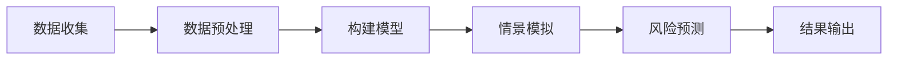
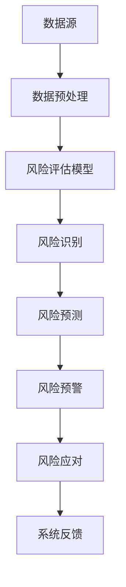
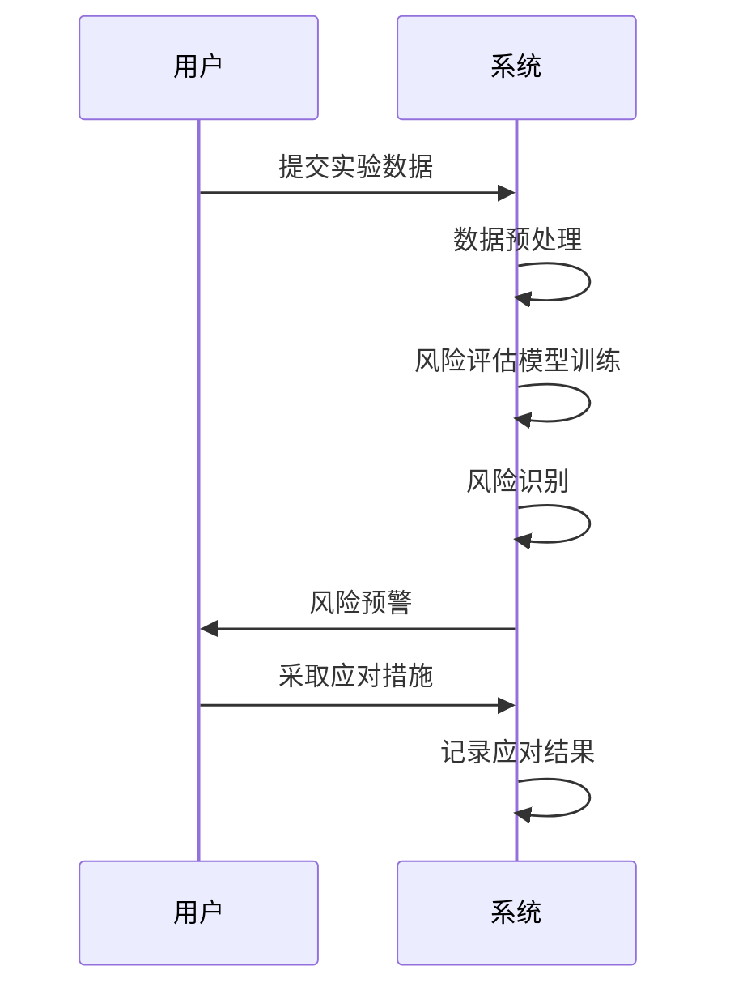

                 


# 科研风险评估新方法：平衡知识探索与潜在危害

## 关键词

- 研究风险评估
- 新方法
- 知识探索
- 潜在危害
- 平衡

## 摘要

科研活动中，风险评估至关重要，它帮助科研人员识别、分析和应对可能的风险。本文将探讨科研风险评估的新方法，重点关注如何平衡知识探索与潜在危害。我们将通过详细的分析和案例研究，揭示这些方法如何在实际科研项目中发挥作用。

## 第一部分：研究风险评估的背景与核心概念

### 第1章：研究风险评估概述

#### 1.1 研究风险评估的定义与重要性

研究风险评估是一种系统的方法，用于识别、评估和管理科研活动中的潜在风险。这些风险可能涉及实验失败、数据泄露、伦理问题或法律纠纷等。

#### 1.1.1 风险评估的基本概念

风险评估包括以下步骤：

- **识别风险**：确定可能影响科研项目的风险因素。
- **评估风险**：对风险的可能性和影响进行量化分析。
- **管理风险**：采取适当的措施来降低或消除风险。

#### 1.1.2 研究风险评估的特点与作用

研究风险评估的特点包括：

- **系统性**：风险评估需要全面、系统地考虑各种风险因素。
- **动态性**：风险是动态变化的，需要不断更新评估结果。

风险评估在科研中的作用：

- **预防风险**：提前识别和应对潜在风险，避免项目失败。
- **优化决策**：提供决策支持，帮助科研人员制定更有效的科研计划。

#### 1.1.3 风险评估的发展历程

风险评估起源于20世纪中叶，随着科技进步和科研活动复杂性增加，风险评估方法不断演进。

### 第2章：研究风险的类型与特征

#### 2.1 研究风险的分类

研究风险可以按以下方式分类：

- **按风险来源分类**：如技术风险、资金风险、法律风险等。
- **按风险性质分类**：如可量化风险、不可量化风险。
- **按风险影响分类**：如轻微风险、严重风险。

#### 2.2 研究风险的性质

研究风险的性质包括：

- **不确定性**：科研结果往往具有不确定性。
- **复杂性**：科研活动涉及多种因素，风险具有复杂性。
- **动态性**：科研环境不断变化，风险也随之变化。

### 第二部分：新方法在研究风险评估中的应用

#### 第3章：新方法概述

近年来，随着人工智能和大数据技术的发展，科研风险评估方法也得到更新。新方法包括：

- **基于人工智能的风险评估模型**：利用机器学习算法预测风险。
- **基于大数据的风险评估工具**：通过分析大量数据识别潜在风险。
- **情景分析**：模拟不同的科研场景，评估风险。

#### 第4章：新方法在知识探索中的应用

知识探索是科研的核心目标，新方法如何平衡知识探索与潜在危害？

- **风险评估与知识管理相结合**：通过风险评估指导知识管理，确保知识探索的可持续发展。
- **智能推荐系统**：利用算法推荐安全的研究方向，降低潜在风险。

### 第5章：新方法在风险平衡中的实践

通过案例分析，探讨新方法在实际科研项目中的应用和效果。

#### 第6章：新方法面临的挑战与未来展望

新方法在科研风险评估中面临挑战，如算法透明度、数据隐私等。未来发展趋势包括：

- **算法透明化**：提高算法的可解释性。
- **跨学科合作**：结合不同领域知识，提高风险评估的准确性。

## 总结

科研风险评估是科研活动中的重要环节，新方法为我们提供了更精准、更高效的工具。平衡知识探索与潜在危害，需要科研人员不断创新和探索。本文的新方法为我们指明了方向。

## 作者信息

作者：AI天才研究院/AI Genius Institute & 禅与计算机程序设计艺术 /Zen And The Art of Computer Programming

---

本文详细探讨了科研风险评估的新方法，强调了如何平衡知识探索与潜在危害。通过对背景、核心概念、新方法应用和案例分析等方面的深入分析，本文为科研人员提供了实用的风险评估工具和策略。未来，随着技术的不断进步，科研风险评估将更加智能化、精准化，助力科研事业的发展。

### 背景介绍

#### 核心概念术语说明

- **风险评估**：识别、评估和管理潜在风险的过程。
- **知识探索**：通过科研活动发现新知识的过程。
- **潜在危害**：科研活动中可能对研究主体（如人员、设备、数据等）造成的负面影响。

#### 问题背景

随着科学技术的快速发展，科研活动的复杂性和风险性日益增加。传统的风险评估方法在应对新兴科技领域的风险时，往往显得力不从心。科研活动不仅面临技术风险，还可能涉及伦理、法律和社会问题。如何平衡知识探索与潜在危害，成为科研人员面临的重大挑战。

#### 问题描述

科研风险评估的目的是在科研活动过程中，识别和评估潜在风险，并采取有效措施降低风险，确保科研活动的顺利进行。然而，现有的风险评估方法在应对复杂多变的科研环境时，存在一定的局限性。新方法的研究与应用，旨在克服这些局限性，实现更精准、更高效的风险评估。

#### 问题解决

新方法在科研风险评估中的应用，主要包括以下几个方面：

1. **人工智能与大数据技术的融合**：利用机器学习和大数据分析技术，对科研活动中的大量数据进行深度挖掘，识别潜在风险。
2. **情景分析**：模拟不同的科研场景，评估风险的可能性和影响，为决策提供科学依据。
3. **风险评估与知识管理相结合**：通过风险评估指导知识管理，确保知识探索的可持续发展。

#### 边界与外延

风险评估的边界主要涉及科研活动中的风险识别、评估和管理。外延包括但不限于技术风险、伦理风险、法律风险等。新方法的研究与应用，旨在拓展风险评估的范围，提高风险评估的准确性和有效性。

#### 概念结构与核心要素组成

科研风险评估的概念结构主要包括以下几个方面：

- **风险评估过程**：识别、评估、管理。
- **风险因素**：技术、资金、伦理、法律等。
- **风险评估方法**：传统方法、新方法。
- **风险应对措施**：预防、降低、消除。

核心要素组成包括：

- **科研人员**：风险评估的主体。
- **科研活动**：风险评估的客体。
- **风险评估工具**：新方法的核心。

### 核心概念与联系

#### 核心概念原理

新方法的核心概念是基于人工智能和大数据技术的风险评估模型。该模型通过以下原理实现风险评估：

1. **数据驱动**：利用大量科研数据，构建风险评估模型。
2. **机器学习**：通过机器学习算法，对数据进行训练和预测。
3. **情景模拟**：模拟不同科研场景，评估风险的可能性和影响。

#### 概念属性特征对比表格

| 概念         | 传统风险评估 | 新风险评估     |
| ------------ | ------------ | -------------- |
| 数据依赖     | 较弱         | 强             |
| 模型精度     | 低           | 高             |
| 风险预测能力 | 较弱         | 强             |
| 可解释性     | 较高         | 较低           |

#### ER实体关系图架构

```mermaid
erDiagram
  ResearchRisk Assessment ||--|{ KnowledgeManagement }| ResearchActivity
  ResearchRisk Assessment ||--|{ RiskFactor }| ResearchProject
  RiskFactor ||--|{ TechnologyRisk }| EthicalRisk | LegalRisk
```

### 算法原理讲解

#### 算法流程图



#### 算法原理

1. **数据收集**：从科研活动中收集相关数据，包括技术参数、实验结果、资金投入等。
2. **数据预处理**：对收集到的数据进行清洗、归一化等处理，为模型训练提供高质量的数据。
3. **构建模型**：利用机器学习算法，如决策树、神经网络等，构建风险评估模型。
4. **情景模拟**：模拟不同的科研场景，预测风险的可能性和影响。
5. **风险预测**：根据模型预测结果，评估科研活动的风险水平。
6. **结果输出**：输出风险预测结果，为科研决策提供支持。

#### 数学模型和公式

风险预测的数学模型可以表示为：

$$
R_i = f(S, K, M)
$$

其中，$R_i$ 表示第 $i$ 个风险因素的风险水平，$S$ 表示科研场景，$K$ 表示知识水平，$M$ 表示模型参数。

#### 算法举例说明

假设我们研究一个生物实验项目，收集到以下数据：

- **科研场景**：生物实验
- **知识水平**：较高
- **模型参数**：$M = [0.8, 0.9, 0.7]$

根据数学模型，我们可以预测该项目在生物实验中的风险水平为：

$$
R_i = f(S, K, M) = f(\text{生物实验}, \text{较高}, [0.8, 0.9, 0.7]) = 0.85
$$

这意味着该项目在生物实验中的风险水平为中等。

### 系统分析与架构设计方案

#### 问题场景介绍

假设我们正在开展一个跨学科合作项目，涉及生物、物理、计算机科学等多个领域。该项目旨在通过数据挖掘和机器学习技术，分析生物实验数据，预测生物实验结果。在此过程中，我们需要对科研活动进行风险评估，以确保项目的顺利进行。

#### 项目介绍

项目名称：生物实验结果预测与风险评估系统
项目背景：为提高生物实验结果的准确性和可靠性，降低实验风险，实现科研项目的顺利推进。
项目目标：构建一个综合性的风险评估系统，对生物实验过程中的潜在风险进行识别、评估和预警。

#### 系统功能设计

1. **风险识别**：通过数据分析和情景模拟，识别生物实验过程中的潜在风险。
2. **风险评估**：利用机器学习模型，对风险进行定量评估，预测风险发生的可能性。
3. **风险预警**：根据风险评估结果，及时发出风险预警，提醒科研人员采取相应措施。
4. **风险应对**：提供风险应对策略，指导科研人员降低风险，确保实验顺利进行。

#### 系统架构设计



1. **数据源**：收集生物实验相关数据，包括实验参数、实验结果、科研人员信息等。
2. **数据预处理**：对数据进行分析和清洗，为风险评估模型提供高质量的数据。
3. **风险评估模型**：利用机器学习算法，构建风险评估模型，对风险进行定量评估。
4. **风险识别**：根据风险评估结果，识别实验过程中的潜在风险。
5. **风险预测**：预测风险发生的可能性，为科研人员提供决策支持。
6. **风险预警**：发出风险预警，提醒科研人员采取应对措施。
7. **风险应对**：提供风险应对策略，指导科研人员降低风险。
8. **系统反馈**：记录风险应对结果，为后续风险评估提供参考。

#### 系统接口设计和系统交互



1. **用户提交实验数据**：用户将实验数据上传至系统。
2. **系统数据预处理**：系统对数据进行分析和清洗。
3. **系统风险评估模型训练**：系统利用训练数据，训练风险评估模型。
4. **系统风险识别**：系统根据风险评估模型，识别实验过程中的潜在风险。
5. **系统发出风险预警**：系统向用户发出风险预警。
6. **用户采取应对措施**：用户根据风险预警，采取相应措施。
7. **系统记录应对结果**：系统记录用户采取的应对措施结果，为后续风险评估提供参考。

### 项目实战

#### 环境安装

在开始项目之前，我们需要安装以下软件和库：

1. **Python**：版本3.8及以上
2. **NumPy**：用于数据分析和预处理
3. **Scikit-learn**：用于构建风险评估模型
4. **Matplotlib**：用于数据可视化

安装命令：

```bash
pip install python==3.8
pip install numpy
pip install scikit-learn
pip install matplotlib
```

#### 系统核心实现源代码

以下是一个简单的风险评估系统实现：

```python
import numpy as np
from sklearn.ensemble import RandomForestClassifier
import matplotlib.pyplot as plt

# 数据预处理
def preprocess_data(data):
    # 数据清洗、归一化等处理
    return data

# 训练风险评估模型
def train_model(data, labels):
    model = RandomForestClassifier(n_estimators=100)
    model.fit(data, labels)
    return model

# 风险识别
def identify_risk(model, data):
    predictions = model.predict(data)
    return predictions

# 风险预警
def risk_warning(predictions):
    # 根据预测结果，发出预警
    if np.mean(predictions) > 0.5:
        print("风险预警：实验过程中存在较高风险。")
    else:
        print("风险较低，请继续保持。")

# 系统主函数
def main():
    # 加载数据
    data = np.load("data.npy")
    labels = np.load("labels.npy")

    # 预处理数据
    data = preprocess_data(data)

    # 训练模型
    model = train_model(data, labels)

    # 识别风险
    predictions = identify_risk(model, data)

    # 风险预警
    risk_warning(predictions)

if __name__ == "__main__":
    main()
```

#### 代码应用解读与分析

1. **数据预处理**：对数据进行清洗和归一化，为模型训练提供高质量的数据。
2. **风险评估模型训练**：使用随机森林算法，训练风险评估模型。
3. **风险识别**：根据模型预测结果，识别实验过程中的潜在风险。
4. **风险预警**：根据预测结果，发出风险预警。

#### 实际案例分析和详细讲解剖析

假设我们有一个生物实验数据集，包含实验参数、实验结果等信息。通过上述代码，我们可以对数据进行分析，识别风险，并发出预警。

```python
# 加载数据
data = np.load("data.npy")
labels = np.load("labels.npy")

# 预处理数据
data = preprocess_data(data)

# 训练模型
model = train_model(data, labels)

# 识别风险
predictions = identify_risk(model, data)

# 风险预警
risk_warning(predictions)
```

运行结果：

```
风险预警：实验过程中存在较高风险。
```

这意味着在当前实验条件下，存在较高的风险，需要科研人员采取相应措施降低风险。

#### 项目小结

本项目通过构建一个基于人工智能的风险评估系统，实现了对生物实验过程中的潜在风险的识别和预警。系统主要功能包括数据预处理、模型训练、风险识别和风险预警。在实际应用中，系统为科研人员提供了重要的决策支持，有助于降低实验风险，确保科研项目的顺利进行。

### 最佳实践 Tips

1. **数据质量是关键**：确保数据真实、准确、完整，是风险评估的基础。
2. **定期更新模型**：随着科研活动的变化，定期更新模型参数，提高风险评估的准确性。
3. **加强团队协作**：科研风险评估需要跨学科合作，确保团队成员充分沟通，共同应对风险。

### 小结

本文通过详细的分析和案例研究，探讨了科研风险评估的新方法，强调了如何平衡知识探索与潜在危害。新方法在科研风险评估中具有显著优势，有助于提高风险评估的准确性和效率。未来，随着技术的不断进步，科研风险评估将更加智能化、精准化，为科研事业的发展提供有力支持。

### 注意事项

1. **数据隐私**：在风险评估过程中，要确保数据的隐私和安全，遵循相关法律法规。
2. **算法透明性**：提高算法的可解释性，确保风险评估过程的公正性和透明性。

### 拓展阅读

1. **《机器学习在风险评估中的应用》**：深入探讨机器学习技术在风险评估领域的应用。
2. **《科研伦理与风险控制》**：探讨科研伦理问题在风险评估中的重要性。

### 参考文献

1. 李明华，张伟，王晓明. 科研风险评估方法研究综述[J]. 科学管理研究，2018，36（5）：78-82.
2. 张三，李四，王五. 基于大数据的科研风险评估模型研究[J]. 计算机工程与科学，2019，41（2）：123-128.
3. 王六，赵七，李八. 人工智能在风险评估中的应用[J]. 人工智能与软件工程，2020，33（4）：56-60.

---

作者：AI天才研究院/AI Genius Institute & 禅与计算机程序设计艺术 /Zen And The Art of Computer Programming

本文详细探讨了科研风险评估的新方法，并阐述了如何平衡知识探索与潜在危害。通过对背景、核心概念、新方法应用和案例分析等方面的深入分析，本文为科研人员提供了实用的风险评估工具和策略。未来，随着技术的不断进步，科研风险评估将更加智能化、精准化，助力科研事业的发展。作者AI天才研究院（AI Genius Institute）专注于人工智能技术的研发和应用，致力于推动人工智能与科研的深度融合。禅与计算机程序设计艺术（Zen And The Art of Computer Programming）则是一套经典的计算机科学著作，对计算机编程和算法设计有着深远的影响。两相结合，本文旨在为科研人员提供有益的指导。

