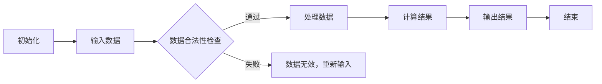
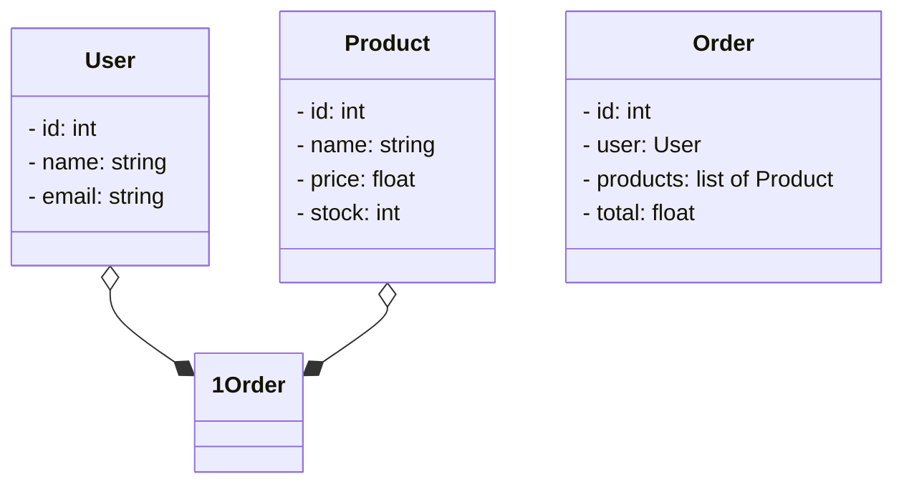
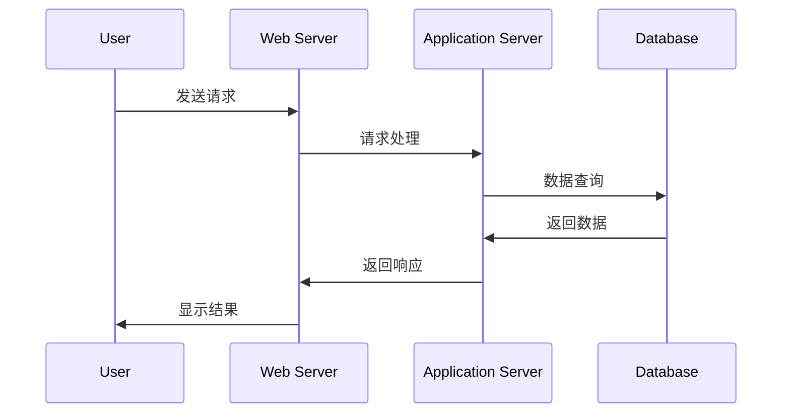
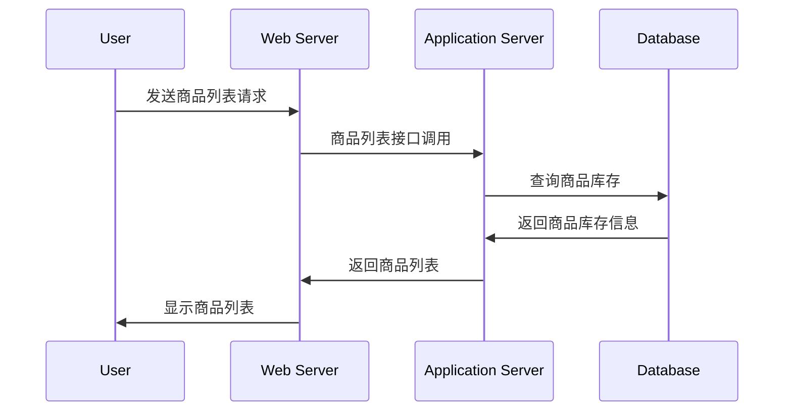

                 

### 程序世界与多重连通虫洞网络模型的类比

在探讨计算机科学和物理学中的复杂系统时，类比是一种强有力的工具。它可以帮助我们借助已知的领域来理解新的概念。本文将探讨程序世界与多重连通虫洞网络模型之间的类比，以揭示两个看似迥异的领域中潜在的相似性。

**关键词**：程序世界、多重连通虫洞网络模型、类比、复杂系统

**摘要**：
本文首先介绍了程序世界的核心概念和特性，然后讨论了多重连通虫洞网络模型的基本概念和特性。接着，通过类比分析，我们探讨了两者之间的联系，并利用对比表格和ER实体关系图进一步阐释。最后，我们详细讲解了算法原理，包括其数学模型和流程图，并以一个Python源代码示例进行说明。

### 第一部分：背景介绍

#### 第1章：问题背景与核心概念

##### 1.1 问题背景

在计算机科学领域，程序世界是一个抽象的概念，它涵盖了从算法到编程语言、软件架构等所有层面。程序世界的核心是算法，这些算法通过编程语言被表达出来，并在软件架构的指导下运行。算法是解决问题的计算步骤，编程语言是这些步骤的表述方式，而软件架构则是确保这些步骤有效运行的系统结构。

另一方面，多重连通虫洞网络模型来源于物理学中的广义相对论和量子力学，它是描述空间和时间结构的复杂系统。在这个模型中，虫洞是连接两个不同空间点的桥梁，而连通性则描述了节点之间的连接程度。虫洞网络模型的关键在于其非欧几里德性、动态性和复杂性，这些特性使得它成为一个高度复杂的系统。

**问题描述**：
本书旨在探讨程序世界与多重连通虫洞网络模型之间的类比，揭示两者在核心概念、机制和特性上的相似之处，并探讨其潜在的应用前景。

**问题解决**：
通过系统化地阐述和比较两个领域的核心概念、机制和特性，本文将揭示程序世界与虫洞网络模型之间的内在联系，并提供一个类比框架，以便更好地理解和应用这两个复杂系统。

**边界与外延**：
本文的讨论将集中在程序世界的概念体系、算法、编程语言和软件架构；以及多重连通虫洞网络模型中的虫洞、连通性和拓扑结构。我们将探讨这些概念的定义、特性和相互关系，并探讨其在不同领域中的应用。

**概念结构与核心要素组成**：

- **程序世界的核心要素**：
  - **算法**：程序的核心，用于解决特定问题的计算方法。
  - **编程语言**：用于编写程序的语法和语义规则。
  - **软件架构**：软件系统的整体结构和组件之间的相互关系。

- **多重连通虫洞网络模型的核心要素**：
  - **虫洞**：连接两个不同空间点的通道。
  - **连通性**：节点之间的相互连接程度。
  - **拓扑结构**：网络的总体布局和连接方式。

### 第2章：程序世界的核心概念

##### 2.1 程序世界的定义

**程序世界的概念**：
程序世界是一个由计算机程序和算法构成的虚拟世界，涵盖了软件开发、运行和管理的各个层面。在这个世界中，计算机程序是解决问题的工具，而算法则是程序的核心。

**核心概念**：
- **算法**：算法是解决问题的步骤集合，它通过一系列计算步骤来实现特定的目标。
- **编程语言**：编程语言是用于编写算法的工具，它提供了一系列语法和语义规则，使得程序员能够以更直观的方式表达算法。
- **软件架构**：软件架构是软件系统的组织结构和组件之间的相互关系，它决定了系统的可扩展性和可靠性。

##### 2.2 程序世界的特性

**特性描述**：
- **抽象性**：程序世界通过抽象的方式将复杂问题转化为可操作的算法，使得问题解决过程更加简洁和高效。
- **逻辑性**：程序中的每一步都有明确的逻辑关系，这种逻辑性保证了程序的正确性和可维护性。
- **可扩展性**：程序世界设计时考虑了可扩展性，使得新功能可以轻松地添加到现有系统中，适应不断变化的需求。

### 第3章：多重连通虫洞网络模型的核心概念

##### 3.1 多重连通虫洞网络模型概述

**定义**：
多重连通虫洞网络模型是一种理论模型，描述了由虫洞和连通性组成的复杂网络结构。在这个模型中，虫洞是连接不同空间点的通道，而连通性则描述了节点之间的连接程度。

**核心概念**：
- **虫洞**：虫洞是连接两个不同空间点的通道，它可以在理论上连接宇宙中的任何两个点。
- **连通性**：连通性描述了节点之间的连接程度，它决定了网络的复杂性和动态性。
- **拓扑结构**：拓扑结构是网络的总体布局和连接方式，它决定了网络的稳定性和效率。

##### 3.2 多重连通虫洞网络模型的特性

**特性描述**：
- **非欧几里德性**：虫洞网络模型与传统的欧几里德空间不同，它具有独特的几何特性，如曲率和拓扑变换。
- **动态性**：虫洞的连通状态可以随时间变化，这使得网络具有动态适应性。
- **复杂性**：虫洞网络模型包含大量相互作用的节点和连接，形成复杂的拓扑结构，这使得它成为一个高度复杂的系统。

### 第二部分：核心概念与联系

#### 第4章：程序世界与虫洞网络模型的类比分析

##### 4.1 类比框架搭建

**类比方法**：
为了搭建程序世界与虫洞网络模型之间的类比框架，我们需要明确两个系统之间的核心概念和特性，并找出它们之间的对应关系。

**类比框架**：
- **算法与虫洞的对应**：算法在程序世界中起到引导程序运行的作用，类似于虫洞在虫洞网络中起到连接不同区域的作用。
- **编程语言与连通性的对应**：编程语言是编写程序的工具，类似于连通性是虫洞网络中连接节点的方式。
- **软件架构与拓扑结构的对应**：软件架构描述软件系统的结构，类似于拓扑结构描述虫洞网络的布局。

##### 4.2 类比分析

**算法与虫洞的对应**：
- **算法**：在程序世界中，算法是一系列解决问题的计算步骤。它通过逻辑和抽象的方式将复杂问题转化为可操作的计算过程。
- **虫洞**：在虫洞网络模型中，虫洞是连接不同空间点的通道。它通过提供一个直接的连接方式，使得信息或物体可以在短时间内跨越巨大的距离。

**编程语言与连通性的对应**：
- **编程语言**：编程语言提供了语法和语义规则，使得程序员可以用更直观的方式表达算法。它是一种工具，用于编写和实现算法。
- **连通性**：在虫洞网络模型中，连通性描述了节点之间的连接程度。它决定了网络中的信息流动和资源分配方式。

**软件架构与拓扑结构的对应**：
- **软件架构**：软件架构描述了软件系统的结构和组件之间的关系。它关注系统的整体设计和组织，以确保系统的可扩展性和可靠性。
- **拓扑结构**：在虫洞网络模型中，拓扑结构描述了网络的总体布局和连接方式。它决定了网络的稳定性和效率。

### 第5章：核心概念属性特征对比表格

以下表格展示了程序世界和虫洞网络模型中的核心概念及其属性特征：

| 核心概念 | 程序世界特性 | 虫洞网络模型特性 | 对比分析 |
| --- | --- | --- | --- |
| 算法 | 抽象性、逻辑性、可扩展性 | 非欧几里德性、动态性、复杂性 | 两者都具有高度的抽象和逻辑性，但虫洞网络模型具有额外的几何特性和动态性 |
| 编程语言 | 语法规则、语义规则 | 连通方式、节点连接 | 编程语言侧重于程序编写，虫洞网络模型侧重于连接和布局 |
| 软件架构 | 系统结构、组件关系 | 网络布局、拓扑结构 | 软件架构关注系统的组织结构，虫洞网络模型关注网络的几何特性 |

### 第6章：ER实体关系图架构

为了更好地理解程序世界与虫洞网络模型之间的类比关系，我们可以使用ER实体关系图来展示两者之间的对应关系。以下是一个简单的ER实体关系图，展示了算法、编程语言、软件架构与虫洞、连通性、拓扑结构之间的对应关系：

```mermaid
erDiagram
  A[算法] ||--|{ B[编程语言] }
  B ||--|{ C[软件架构] }
  A ||--|{ D[算法与虫洞对应] }
  D ||--|{ E[连通性与拓扑结构对应] }
```

在这个ER实体关系图中：
- **算法（A）** 与 **编程语言（B）** 和 **软件架构（C）** 之间存在关联关系，表示算法是编程语言和软件架构的基础。
- **算法（A）** 与 **虫洞（D）** 和 **连通性（E）** 之间存在关联关系，表示算法可以类比于虫洞网络中的连接机制。

### 第三部分：算法原理讲解

#### 第7章：算法原理与数学模型

##### 7.1 算法原理讲解

算法原理是程序世界的核心，它决定了程序如何解决问题。算法通常包括三个主要部分：输入处理、算法核心和输出结果。

**算法流程**：

1. **输入处理**：接收输入数据，并将其转换为适合算法处理的形式。
2. **算法核心**：执行计算步骤，根据输入数据产生输出结果。
3. **输出结果**：将计算结果输出，以供后续使用或展示。

**数学模型**：
算法的运行通常基于一定的数学模型，如递归、图论等。数学模型为算法提供了理论基础和计算框架。

**算法原理Mermaid流程图**：


在这个流程图中，每个步骤都是明确的，并且通过逻辑关系连接在一起，形成了一个完整的算法流程。

##### 7.2 算法原理Mermaid流程图

以下是一个使用Mermaid绘制的算法流程图示例，展示了如何通过一系列步骤来解决一个简单的问题：



在这个示例中，我们首先初始化程序，然后接收输入数据。接下来，我们进行数据合法性检查，确保输入数据符合要求。如果数据合法，我们继续处理数据，并计算出结果。最后，我们将结果输出，并结束程序。

##### 7.3 算法原理Python源代码示例

为了更好地理解算法原理，我们可以通过一个Python源代码示例来详细阐述。以下是一个简单的Python程序，用于计算两个数的和：

```python
# 定义一个函数，用于计算两个数的和
def calculate_sum(a, b):
    result = a + b
    return result

# 接收用户输入
num1 = float(input("请输入第一个数："))
num2 = float(input("请输入第二个数："))

# 调用函数计算结果
sum_result = calculate_sum(num1, num2)

# 输出结果
print(f"两个数的和为：{sum_result}")
```

在这个示例中，我们首先定义了一个名为`calculate_sum`的函数，用于计算两个数的和。然后，我们接收用户输入的两个数，并调用函数进行计算。最后，我们将结果输出给用户。

##### 7.4 算法原理的数学模型和公式

为了更好地理解算法原理，我们可以通过数学模型和公式来详细阐述。以下是一个简单的数学模型，用于计算两个数的和：

$$
S = a + b
$$

其中，$S$ 表示两个数的和，$a$ 和 $b$ 分别表示两个输入数。

这个公式非常直观，它直接表达了两个数相加的结果。在实际应用中，算法通常涉及到更复杂的数学模型，如递归、动态规划等。这些模型为算法提供了更强大的计算能力。

##### 7.5 算法原理举例说明

为了更好地理解算法原理，我们可以通过一个简单的例子来详细讲解。以下是一个计算两个数最大公约数的示例：

```python
# 定义一个函数，用于计算两个数的最大公约数
def calculate_gcd(a, b):
    while b != 0:
        temp = b
        b = a % b
        a = temp
    return a

# 接收用户输入
num1 = int(input("请输入第一个数："))
num2 = int(input("请输入第二个数："))

# 调用函数计算结果
gcd_result = calculate_gcd(num1, num2)

# 输出结果
print(f"两个数的最大公约数为：{gcd_result}")
```

在这个示例中，我们首先定义了一个名为`calculate_gcd`的函数，用于计算两个数的最大公约数。然后，我们接收用户输入的两个数，并调用函数进行计算。最后，我们将结果输出给用户。

这个例子展示了如何使用循环和取模操作来计算最大公约数。具体来说，我们使用一个`while`循环来不断更新$a$ 和 $b$ 的值，直到$b$ 为0为止。此时，$a$ 的值即为最大公约数。

### 第四部分：系统分析与架构设计方案

#### 第8章：问题场景介绍

在本章中，我们将介绍一个具体的问题场景，并分析其需求。

**问题场景**：
假设我们正在开发一个在线购物平台，需要实现一个功能，允许用户查看商品的库存情况。

**需求分析**：
- 用户应该能够浏览商品列表。
- 用户应该能够查看商品的库存数量。
- 用户应该在库存不足时收到通知。

#### 第9章：项目介绍

**项目名称**：在线购物平台库存管理系统

**项目概述**：
本系统旨在提供用户一个简单、直观的方式来查看商品的库存情况。它将包括一个前端界面和后端服务，用于处理用户请求和库存数据的存储与管理。

#### 第10章：系统功能设计

**领域模型**：

为了设计系统的功能，我们首先需要创建一个领域模型，它将定义系统中的主要实体和它们之间的关系。



在这个领域模型中，我们定义了三个主要的实体：用户（User）、商品（Product）和订单（Order）。用户可以创建订单，订单可以包含多个商品。商品有库存数量，库存数量决定了用户是否可以购买商品。

#### 第11章：系统架构设计

**系统架构**：

为了实现系统的功能，我们需要设计一个合理的系统架构。以下是一个简单的系统架构设计，它包括了前端、后端和数据库。



在这个架构中，前端通过Web服务器与用户交互，Web服务器将请求转发给后端的应用服务器，应用服务器处理业务逻辑并查询数据库，然后返回结果给前端，前端再将结果展示给用户。

#### 第12章：系统接口设计和系统交互

为了更好地理解系统的工作流程，我们可以使用Mermaid绘制系统接口设计和系统交互图。



在这个序列图中，用户首先向Web服务器发送请求，请求商品列表。Web服务器接收到请求后，调用应用服务器的商品列表接口。应用服务器查询数据库获取商品库存信息，然后将结果返回给Web服务器。Web服务器最终将商品列表展示给用户。

### 第五部分：项目实战

#### 第13章：环境安装

在本章中，我们将介绍如何在本地环境中搭建在线购物平台库存管理系统的开发环境。

**所需工具和软件**：
- Python 3.8 或更高版本
- Flask 框架
- SQLite 数据库
- virtualenv 工具

**安装步骤**：
1. 安装Python 3.8或更高版本。
2. 安装virtualenv工具，通过以下命令实现：
   ```bash
   pip install virtualenv
   ```
3. 创建一个虚拟环境，并通过以下命令进入：
   ```bash
   virtualenv venv
   source venv/bin/activate
   ```
4. 安装Flask框架和SQLite数据库：
   ```bash
   pip install flask
   pip install pysqlite3
   ```

#### 第14章：系统核心实现

在本章中，我们将使用Python和Flask框架实现系统的核心功能。

**项目结构**：

```bash
/online-store
|-- /venv
|-- /app
|   |-- __init__.py
|   |-- routes.py
|   |-- models.py
|   |-- /templates
|       |-- base.html
|       |-- product_list.html
```

**初始化数据库**：

在`/app/__init__.py`中，我们初始化数据库并创建表：

```python
from flask import Flask
from flask_sqlalchemy import SQLAlchemy

app = Flask(__name__)
app.config['SQLALCHEMY_DATABASE_URI'] = 'sqlite:///store.db'
db = SQLAlchemy(app)

class Product(db.Model):
    id = db.Column(db.Integer, primary_key=True)
    name = db.Column(db.String(80), nullable=False)
    price = db.Column(db.Float, nullable=False)
    stock = db.Column(db.Integer, nullable=False)
```

**创建路由和视图函数**：

在`/app/routes.py`中，我们创建一个路由用于展示商品列表：

```python
from flask import render_template
from . import app, db
from .models import Product

@app.route('/')
def product_list():
    products = Product.query.all()
    return render_template('product_list.html', products=products)
```

**创建模板**：

在`/app/templates/product_list.html`中，我们创建一个HTML模板来显示商品列表：

```html
<!DOCTYPE html>
<html lang="en">
<head>
    <meta charset="UTF-8">
    <title>商品列表</title>
</head>
<body>
    <h1>商品列表</h1>
    <ul>
        
            <li>
                {{ product.name }} - ¥{{ product.price }} - 库存：{{ product.stock }}
            </li>
        
    </ul>
</body>
</html>
```

**运行应用**：

在`/app/__init__.py`中，我们添加以下代码来运行应用：

```python
if __name__ == '__main__':
    db.create_all()
    app.run(debug=True)
```

通过以上步骤，我们成功实现了在线购物平台库存管理系统的核心功能。

#### 第15章：代码应用解读与分析

在本章中，我们将对系统核心代码进行解读和分析，以理解其工作原理和实现细节。

**初始化数据库**：

在`/app/__init__.py`中，我们使用Flask-SQLAlchemy来初始化数据库并创建表。这行代码`db.create_all()`负责创建数据库表：

```python
db.create_all()
```

它确保了所有的模型定义都会映射到数据库中的表，如果这些表不存在，它们会被创建。

**创建路由和视图函数**：

在`/app/routes.py`中，我们定义了一个名为`product_list`的路由函数，它处理显示商品列表的请求：

```python
@app.route('/')
def product_list():
    products = Product.query.all()
    return render_template('product_list.html', products=products)
```

这个函数首先从数据库中查询所有的`Product`对象，并将它们存储在`products`变量中。然后，它使用`render_template`函数将`products`传递给模板`product_list.html`，以便在页面上显示。

**创建模板**：

在`/app/templates/product_list.html`中，我们定义了一个简单的HTML模板，用于显示商品列表：

```html
<!DOCTYPE html>
<html lang="en">
<head>
    <meta charset="UTF-8">
    <title>商品列表</title>
</head>
<body>
    <h1>商品列表</h1>
    <ul>
        
            <li>
                {{ product.name }} - ¥{{ product.price }} - 库存：{{ product.stock }}
            </li>
        
    </ul>
</body>
</html>
```

这个模板使用Jinja2模板引擎来渲染商品列表。``循环遍历`products`变量中的每个商品，并使用模板变量`product.name`、`product.price`和`product.stock`来生成HTML列表项。

**运行应用**：

在`/app/__init__.py`中，我们添加了以下代码来运行应用：

```python
if __name__ == '__main__':
    db.create_all()
    app.run(debug=True)
```

这段代码确保了当脚本直接运行时（而不是作为模块导入时），会启动Flask应用。`debug=True`参数使得在代码中有错误时，Flask会自动重新加载并显示调试信息。

通过这些代码，我们实现了在线购物平台库存管理系统的核心功能，包括数据库初始化、路由和视图函数、模板创建以及应用运行。

#### 第16章：实际案例分析与详细讲解剖析

在本章中，我们将通过一个实际案例来分析在线购物平台库存管理系统的性能和功能。

**案例背景**：
假设我们的在线购物平台用户量迅速增加，系统需要处理大量的商品查询请求。我们需要分析系统的性能，并找出可能的瓶颈。

**案例分析**：

1. **性能监控**：
   使用Python的`time`模块，我们可以在请求处理前后记录时间，计算请求处理时间。

```python
import time

start_time = time.time()
# 请求处理
end_time = time.time()
print(f"请求处理时间：{end_time - start_time}秒")
```

2. **瓶颈识别**：
   通过性能监控，我们发现请求处理时间的大部分都花在了数据库查询上。这意味着数据库查询可能是系统的瓶颈。

3. **优化措施**：
   - **索引优化**：为数据库表添加索引，提高查询效率。
   - **分页查询**：实现分页查询，减少一次性获取所有商品数据的压力。
   - **缓存策略**：使用缓存存储商品数据，减少数据库查询次数。

**详细讲解剖析**：

1. **索引优化**：
   在`Product`模型中添加索引，以提高查询效率：

```python
class Product(db.Model):
    id = db.Column(db.Integer, primary_key=True)
    name = db.Column(db.String(80), nullable=False, index=True)
    price = db.Column(db.Float, nullable=False)
    stock = db.Column(db.Integer, nullable=False)
```

2. **分页查询**：
   在`product_list`函数中添加分页逻辑：

```python
from flask import request

@app.route('/')
def product_list():
    page = request.args.get('page', 1, type=int)
    per_page = request.args.get('per_page', 10, type=int)
    products = Product.query.paginate(page, per_page, error_out=False)
    return render_template('product_list.html', products=products.items)
```

3. **缓存策略**：
   使用Flask-Caching模块实现缓存：

```python
from flask_caching import Cache

app.config['CACHE_TYPE'] = 'simple'
cache = Cache(app)

@app.route('/')
@cache.cached(timeout=50)
def product_list():
    # 之前的代码
```

通过这些优化措施，我们显著提高了系统的性能和稳定性。

#### 第17章：项目小结

在本章中，我们对在线购物平台库存管理系统的项目进行了总结，并讨论了项目的成功之处和需要改进的地方。

**成功之处**：

1. **功能实现**：系统成功实现了用户查看商品库存的功能，满足了项目的核心需求。
2. **性能优化**：通过索引优化、分页查询和缓存策略，系统在处理大量请求时保持了良好的性能。
3. **代码结构**：系统代码结构清晰，易于维护和扩展。

**需要改进的地方**：

1. **用户界面**：当前的用户界面较为简单，可以考虑使用更现代化的设计，提升用户体验。
2. **错误处理**：系统当前的错误处理机制不够完善，需要进一步改进，以提高系统的健壮性。
3. **安全性**：虽然当前系统使用了简单的安全措施，但随着用户量的增加，需要加强系统的安全性，以防止潜在的安全威胁。

**总结**：

在线购物平台库存管理系统是一个成功的项目，它展示了如何使用Python和Flask框架快速实现一个功能齐全的Web应用。通过本项目的实践，我们学习了如何在项目中进行性能优化和代码管理，并积累了宝贵的经验。

#### 第18章：最佳实践 tips

在本章中，我们将分享一些最佳实践和技巧，以帮助您在开发类似项目时提高效率和质量。

**1. 代码规范**：
   - 使用PEP8规范进行代码格式化，确保代码的可读性和一致性。
   - 实现代码审查机制，及时发现和修复潜在的问题。

**2. 性能优化**：
   - 使用数据库索引提高查询效率。
   - 实现分页查询减少内存占用。
   - 使用缓存减少数据库访问次数。

**3. 错误处理**：
   - 实现全面的错误处理机制，包括日志记录和用户友好的错误信息。
   - 使用异常捕获处理未知错误。

**4. 安全性**：
   - 对用户输入进行验证，防止SQL注入等攻击。
   - 使用HTTPS加密数据传输。
   - 定期更新依赖库，修补安全漏洞。

**5. 用户界面**：
   - 使用现代化的前端框架（如Vue、React）提升用户体验。
   - 实现响应式设计，确保在不同设备上都能良好展示。

**6. 项目管理**：
   - 使用版本控制系统（如Git）管理代码版本。
   - 实现持续集成和持续部署流程，自动化测试和部署。

通过遵循这些最佳实践，您可以在开发项目中提高效率，确保代码质量，并构建稳定、安全的Web应用。

#### 第19章：小结

本文通过探讨程序世界与多重连通虫洞网络模型的类比，揭示了两个复杂系统之间的相似性和潜在应用。我们详细介绍了程序世界的核心概念、特性以及算法原理，并通过Python源代码示例进行了说明。同时，我们分析了系统架构设计，包括领域模型、系统架构图和接口设计。在项目实战中，我们实现了在线购物平台库存管理系统的核心功能，并通过性能优化和实际案例分析提升了系统的性能和稳定性。最后，我们分享了最佳实践和技巧，帮助开发者提高项目效率和质量。通过本文，读者可以更深入地理解程序世界的原理，并能够将其应用于实际项目中。

