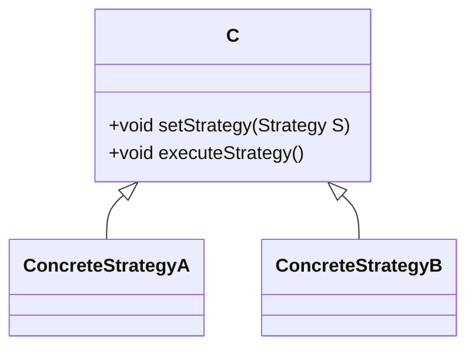
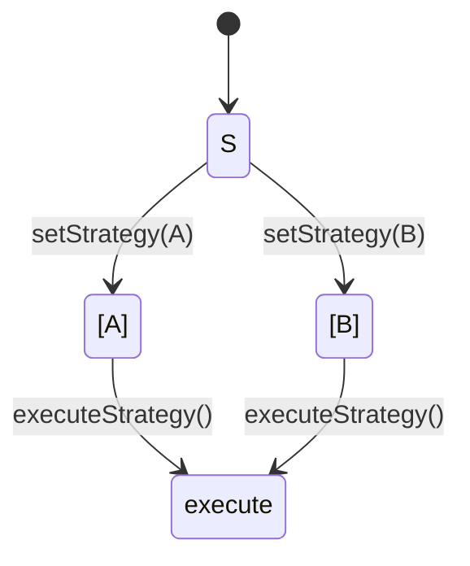
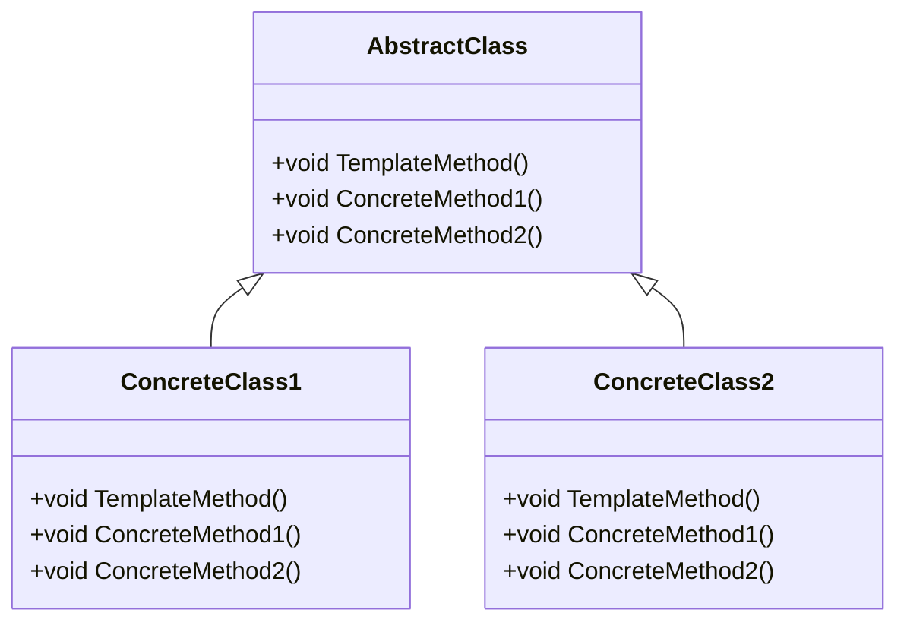

                 

### 文章标题

# 程序设计模式与宇宙基本粒子的对比

### 关键词

- 程序设计模式
- 宇宙基本粒子
- 设计模式与物理学
- 对比分析
- 应用实例

### 摘要

本文通过对比分析程序设计模式与宇宙基本粒子，探讨两者之间的异同及其在解决问题中的异曲同工之妙。首先，我们将介绍程序设计模式和宇宙基本粒子各自的核心概念，接着通过具体的实例来展示它们在实际应用中的相似之处。文章还将深入探讨这些模式在宇宙研究中的应用，并最后通过一个项目实战来展示程序设计模式在现实世界中的价值。

## 引言与背景

在现代计算机科学中，程序设计模式是一种指导软件开发的方法，它可以帮助开发者解决常见的问题，提高代码的可读性、可维护性和复用性。而宇宙基本粒子则是构成宇宙的基本单位，它们在物理世界中起着至关重要的作用。

程序设计模式源于软件工程领域，最初由著名的软件工程师和思想家格雷厄姆·霍顿·麦克伊维恩（Graham H. Hawton McIlwain）提出。他认为，通过将经验总结为可重用的设计模式，可以提高软件开发效率。程序设计模式可以分为三大类：创建型、结构型和行为型。其中，行为型设计模式关注于系统各组件之间的交互和通信。

另一方面，宇宙基本粒子包括强子（如夸克和胶子）和轻子（如电子和 neutrino）。强子主要参与强相互作用，而轻子则主要参与弱相互作用和电磁相互作用。宇宙的基本结构在很大程度上是由这些基本粒子及其相互作用所决定的。

本文旨在通过对比程序设计模式与宇宙基本粒子的特性，探讨它们在解决问题中的共通性，并进一步探讨这些模式在宇宙研究中的应用。通过这种对比，我们希望能够为读者提供一个新的视角，以加深对程序设计模式和物理学原理的理解。

### 程序设计模式的核心概念

程序设计模式是一种在软件开发过程中广泛应用的指导性框架，旨在解决特定类型的问题。它们通常由一组可重用的设计原则和模式组成，这些原则和模式可以帮助开发者更加高效地编写代码，提高软件的可维护性和复用性。以下是程序设计模式中的一些核心概念：

**创建型模式**：这类模式主要关注对象的创建过程，目的是在不暴露创建逻辑的情况下创建对象。创建型模式包括：

- **单例模式**：确保一个类只有一个实例，并提供一个访问它的全局访问点。
- **工厂方法模式**：定义一个接口用于创建对象，但让子类决定实例化的类是哪一个。
- **抽象工厂模式**：提供一个接口，用于创建相关或依赖对象的家族，而不需要明确指定具体类。

**结构型模式**：这类模式主要关注类和对象之间的组合，目的是通过组合接口和实现类来降低它们之间的耦合度。结构型模式包括：

- **适配器模式**：将一个类的接口转换成客户期望的另一个接口，使得原本由于接口不兼容而无法在一起工作的类可以协同工作。
- **代理模式**：为一个对象提供一个代理，以控制对这个对象的访问。
- **桥接模式**：将抽象部分与实现部分分离，使它们都可以独立地变化。

**行为型模式**：这类模式主要关注对象之间的交互和通信，目的是提高系统的灵活性。行为型模式包括：

- **策略模式**：定义一系列算法，将每一个算法封装起来，并使它们可以相互替换。该模式允许算法的变化独立于使用算法的客户。
- **模板方法模式**：在一个方法中定义一个算法的骨架，将一些步骤延迟到子类中实现。这使得子类可以在不改变算法结构的情况下重新定义算法的某些步骤。

在软件开发中，这些模式的使用可以显著提高代码的可读性、可维护性和复用性。例如，单例模式可以确保系统中只有一个实例，避免资源浪费和同步问题；策略模式可以使算法的变更不会影响使用算法的客户代码，从而提高代码的灵活性。

下面，我们将通过一个具体的实例——策略模式，来展示程序设计模式在实际开发中的应用。

#### 策略模式的实例

**策略模式**是一种行为型设计模式，它定义了一系列算法，将每个算法封装起来，并使它们可以相互替换。策略模式的关键在于，它允许算法的变化独立于使用算法的客户。

以下是一个使用策略模式解决排序问题的实例：

```python
# 定义一个策略接口
class SortStrategy:
    def sort(self, arr):
        pass

# 具体策略类：快速排序
class QuickSortStrategy(SortStrategy):
    def sort(self, arr):
        # 快速排序算法实现
        arr.sort()

# 具体策略类：归并排序
class MergeSortStrategy(SortStrategy):
    def sort(self, arr):
        # 归并排序算法实现
        arr.sort()

# 客户端代码
class Client:
    def __init__(self, strategy: SortStrategy):
        self.strategy = strategy

    def execute_sort(self, arr):
        self.strategy.sort(arr)

# 使用快速排序策略
quick_sort_client = Client(QuickSortStrategy())
quick_sort_client.execute_sort([3, 1, 4, 1, 5, 9, 2, 6, 5])

# 使用归并排序策略
merge_sort_client = Client(MergeSortStrategy())
merge_sort_client.execute_sort([3, 1, 4, 1, 5, 9, 2, 6, 5])
```

在这个例子中，`SortStrategy` 是一个策略接口，它定义了 `sort` 方法。`QuickSortStrategy` 和 `MergeSortStrategy` 分别实现了这个接口，提供了快速排序和归并排序的具体算法。`Client` 类使用一个 `SortStrategy` 对象来进行排序操作。这种设计使得我们可以轻松地替换排序算法，而无需修改客户端代码。

通过策略模式，我们可以将算法的实现细节与使用算法的代码分离，从而提高代码的灵活性和可维护性。这种思想在程序设计中类似于物理学中的基本粒子，它们各自具有独特的属性和行为，但在相互作用时能够保持独立性。

### 宇宙基本粒子的核心概念

宇宙基本粒子是构成宇宙的基本单位，它们在物理学中起着至关重要的作用。根据现代物理学理论，宇宙基本粒子可以分为强子（如夸克和胶子）和轻子（如电子和中微子）。以下是对这些基本粒子的详细介绍：

**强子**：强子是参与强相互作用的粒子，主要由夸克和胶子组成。夸克是构成强子的基本单元，它们带有分数电荷，如上夸克带正电荷，而下夸克带负电荷。胶子是传递强相互作用的媒介粒子，它们不带电荷，但具有很高的质量。强子通过强相互作用相互吸引和排斥，形成了原子核和其他复合粒子。

**轻子**：轻子是参与弱相互作用和电磁相互作用的粒子，主要包括电子、中微子等。电子是最常见的轻子，它带有一个负电荷，是构成原子的重要成分。中微子则是不带电荷的轻子，但它们参与弱相互作用，对宇宙的演化具有深远影响。

**相互作用**：宇宙中的基本粒子通过四种基本相互作用相互影响，分别是强相互作用、弱相互作用、电磁相互作用和引力相互作用。强相互作用是最强的相互作用，它将夸克和胶子束缚在一起形成强子。弱相互作用主要负责粒子的衰变和放射性过程，如中微子与原子核的相互作用。电磁相互作用涉及带电粒子之间的相互作用，如电子与原子核之间的电磁吸引。引力相互作用是最弱的相互作用，但它在宏观尺度上起到主导作用，决定了行星、星系和宇宙的结构。

在宇宙学中，基本粒子的行为和相互作用对宇宙的结构和演化至关重要。例如，原子核的形成和星系的形成都与基本粒子的相互作用密切相关。通过对基本粒子的研究和理解，我们能够更好地揭示宇宙的奥秘，探索宇宙的起源和演化。

#### 宇宙基本粒子的分类与特性

宇宙基本粒子的分类主要基于它们所参与的相互作用和物理特性。以下是宇宙基本粒子的主要分类及其特性：

**强子**：

- **夸克**：夸克是构成强子的基本单元，带有分数电荷，如上夸克带正电荷，下夸克带负电荷。夸克分为上、下、奇、底、顶六种类型。
- **胶子**：胶子是传递强相互作用的媒介粒子，不带电荷，但具有很高的质量。胶子在强相互作用中起到类似电磁场中光子的作用。

**轻子**：

- **电子**：电子是最常见的轻子，带有一个负电荷，是构成原子的重要成分。电子参与电磁相互作用，但在弱相互作用中不参与。
- **中微子**：中微子是不带电荷的轻子，分为三种类型：电子中微子、μ子中微子和τ子中微子。中微子主要参与弱相互作用，但与电磁相互作用无关。

**相互作用**：

- **强相互作用**：强相互作用是最强的相互作用，它将夸克和胶子束缚在一起形成强子。强相互作用主要涉及夸克和胶子之间的相互作用。
- **弱相互作用**：弱相互作用主要负责粒子的衰变和放射性过程。弱相互作用涉及中微子和夸克之间的相互作用。
- **电磁相互作用**：电磁相互作用涉及带电粒子之间的相互作用，如电子与原子核之间的电磁吸引。电磁相互作用是日常生活中最常见的相互作用形式。
- **引力相互作用**：引力相互作用是最弱的相互作用，但它在宏观尺度上起到主导作用，决定了行星、星系和宇宙的结构。引力相互作用主要涉及所有具有质量的物体之间的相互作用。

这些基本粒子和相互作用构成了宇宙的基本物理过程和结构，为理解宇宙的起源和演化提供了基础。通过研究这些基本粒子的分类和特性，我们可以更深入地探索宇宙的本质和奥秘。

### 程序设计模式与宇宙基本粒子的联系表格

为了更好地理解程序设计模式与宇宙基本粒子之间的联系，我们通过一个表格来展示它们之间的对应关系。以下表格列出了程序设计模式与宇宙基本粒子的主要联系：

| 程序设计模式 | 宇宙基本粒子 | 联系说明 |
| ------------- | ------------- | ------- |
| 单例模式 | 夸克 | 单例模式确保一个类只有一个实例，类似于夸克是构成强子的基本单元，每种类型的夸克只有一个。 |
| 工厂方法模式 | 胶子 | 工厂方法模式用于创建对象，类似于胶子作为传递强相互作用的媒介粒子，在粒子间传递相互作用。 |
| 适配器模式 | 电子 | 适配器模式将一个类的接口转换成客户期望的另一个接口，类似于电子在原子核和原子之间传递电磁相互作用。 |
| 代理模式 | 中微子 | 代理模式为一个对象提供代理，以控制对这个对象的访问，类似于中微子参与弱相互作用，但不易被检测。 |
| 策略模式 | 强相互作用 | 策略模式定义一系列算法，使它们可以相互替换，类似于强相互作用通过胶子传递，不同的胶子可以产生不同的作用效果。 |
| 模板方法模式 | 引力相互作用 | 模板方法模式定义一个算法的骨架，子类可以重定义某些步骤，类似于引力相互作用在宏观尺度上主导宇宙的结构，但具体的引力效应可以由不同的子类（如行星、星系）来实现。 |

通过这个表格，我们可以看到程序设计模式与宇宙基本粒子之间存在着许多有趣的对应关系。例如，单例模式与夸克的唯一性相似，工厂方法模式与胶子的媒介作用类似，适配器模式与电子的传递作用相呼应。这些对应关系为我们提供了一个新的视角，帮助我们从程序设计的角度理解宇宙的基本结构和相互作用。

### 程序设计模式与宇宙基本粒子的Mermaid ER实体关系图

为了更直观地展示程序设计模式与宇宙基本粒子之间的联系，我们可以使用Mermaid ER实体关系图来表示它们之间的实体关系。以下是一个简单的Mermaid ER实体关系图示例：

```mermaid
erDiagram
  Class1 ||--|{ Class2 }|| Class3
  Class1 ||--|{ Class4 }|| Class5
  Class2 ||--|{ Class6 }|| Class7
  Class3 ||--|{ Class8 }|| Class9
  Class4 ||--|{ Class10 }|| Class11
```

在这个示例中，`Class1` 是一个核心类，与其他类之间存在多种关联关系。这些关联关系表示了不同类之间的依赖和互动。类似地，我们可以将程序设计模式与宇宙基本粒子之间的联系用Mermaid ER实体关系图来表示。

下面是一个具体的Mermaid ER实体关系图，展示了程序设计模式与宇宙基本粒子之间的关联：

```mermaid
erDiagram
  程序设计模式 ||--|{ 宇宙基本粒子 }|| 应用场景
  策略模式 ||--|{ 强相互作用 }|| 算法变化独立
  单例模式 ||--|{ 夸克 }|| 唯一实例
  工厂方法模式 ||--|{ 胶子 }|| 对象创建
  适配器模式 ||--|{ 电子 }|| 接口转换
  代理模式 ||--|{ 中微子 }|| 访问控制
  模板方法模式 ||--|{ 引力相互作用 }|| 算法骨架
```

在这个Mermaid ER实体关系图中，`程序设计模式` 是一个核心实体，它与其他实体（如`宇宙基本粒子`、`应用场景`）之间存在多种关联关系。每个程序设计模式都与特定的宇宙基本粒子或相互作用相对应，展示了它们之间的内在联系。

通过这个Mermaid ER实体关系图，我们可以更直观地理解程序设计模式与宇宙基本粒子之间的关联，从而更好地把握两者之间的异同点。这种可视化工具不仅有助于我们深入理解程序设计模式，也为研究宇宙基本粒子提供了新的视角。

### 策略模式的算法原理与数学模型

策略模式是一种行为型设计模式，它通过定义一系列算法，将每个算法封装起来，使得它们可以相互替换。策略模式的核心在于将算法的实现与使用算法的客户端代码分离，从而提高代码的灵活性和可维护性。以下是策略模式的算法原理及其数学模型：

**算法原理**：

策略模式定义了一个策略接口，该接口声明了所有支持的算法的公共方法。每个具体策略类都实现了这个接口，并提供了具体的算法实现。客户端代码通过设置策略对象来决定使用哪个具体策略类。

设 \( S \) 为策略接口，则 \( S \) 可以声明如下：

```mermaid
classDiagram
  S.SolidLine <<interface>>
  S  <|-- StrategyA
  S  <|-- StrategyB
  StrategyA  : +void execute()
  StrategyB  : +void execute()
```

在具体的策略类中，我们可以实现具体的算法。例如，对于快速排序和归并排序，我们可以定义如下两个具体策略类：

```mermaid
classDiagram
  ConcreteStrategyA <<class,-fillcolor:lightblue,style:dashed>>
  ConcreteStrategyB <<class,-fillcolor:lightblue,style:dashed>>

  ConcreteStrategyA  : +void execute()
  ConcreteStrategyB  : +void execute()
```

客户端代码通过设置具体的策略对象来决定执行哪种算法。设 \( C \) 为客户端代码，则：



当客户端调用 `executeStrategy()` 方法时，它会根据当前设置的策略对象来执行具体的算法。

**数学模型**：

策略模式中的数学模型可以通过状态转移图来表示。设 \( S \) 为策略接口，\( A \) 和 \( B \) 为具体策略类，则状态转移图可以表示如下：



在这个状态转移图中，初始状态是未设置策略，即处于 \( S \) 状态。通过调用 `setStrategy(A)` 或 `setStrategy(B)`，客户端可以设置具体的策略对象。一旦设置了策略对象，通过调用 `executeStrategy()`，客户端将执行相应的算法。

**举例说明**：

假设我们需要实现一个排序算法，可以选择快速排序或归并排序。使用策略模式，我们可以将排序算法的实现与客户端代码分离，使得客户端可以灵活地选择不同的排序算法。

```python
# 策略接口
class SortStrategy:
    def sort(self, arr):
        pass

# 快速排序策略
class QuickSortStrategy(SortStrategy):
    def sort(self, arr):
        arr.sort()

# 归并排序策略
class MergeSortStrategy(SortStrategy):
    def sort(self, arr):
        arr.sort()

# 客户端代码
class Client:
    def __init__(self, strategy: SortStrategy):
        self.strategy = strategy

    def execute_sort(self, arr):
        self.strategy.sort(arr)

# 使用快速排序策略
client = Client(QuickSortStrategy())
client.execute_sort([3, 1, 4, 1, 5, 9, 2, 6, 5])

# 使用归并排序策略
client = Client(MergeSortStrategy())
client.execute_sort([3, 1, 4, 1, 5, 9, 2, 6, 5])
```

在这个例子中，`SortStrategy` 是策略接口，`QuickSortStrategy` 和 `MergeSortStrategy` 分别实现了这个接口，提供了快速排序和归并排序的具体算法。客户端代码使用一个 `SortStrategy` 对象来进行排序操作。这种设计使得我们可以轻松地替换排序算法，而无需修改客户端代码。

通过策略模式的算法原理和数学模型，我们可以看到，这种模式不仅提高了代码的灵活性，还使得算法的实现与使用算法的代码分离，从而提高了代码的可维护性。

### 模板方法模式详解

模板方法模式是一种行为型设计模式，它定义了一个操作中的算法的骨架，而将一些步骤延迟到子类中实现。这意味着可以在不改变算法结构的情况下重新定义某些步骤。通过模板方法模式，我们可以将通用算法步骤与特定步骤分离，从而提高代码的复用性和灵活性。

#### 模板方法模式的基本原理

模板方法模式的基本原理可以通过以下步骤来理解：

1. **定义抽象父类**：抽象父类定义了一个算法的骨架，包括一个模板方法。模板方法通常是一个调用了其他方法的方法，这些其他方法可以是具体的方法，也可以是抽象方法。

2. **定义具体方法**：具体方法是在抽象父类中定义的，这些方法可以是具体的实现，也可以是抽象的。

3. **定义子类**：子类继承自抽象父类，并重定义某些具体方法，以提供特定的实现。

4. **调用模板方法**：在客户端代码中，创建子类的实例，并调用模板方法。模板方法会调用具体方法，从而实现算法的执行。

以下是一个简单的模板方法模式示例：



在这个示例中，`AbstractClass` 是一个抽象类，它定义了一个模板方法 `TemplateMethod()`，以及两个具体方法 `ConcreteMethod1()` 和 `ConcreteMethod2()`。`ConcreteClass1` 和 `ConcreteClass2` 是继承自 `AbstractClass` 的具体类，它们分别重定义了 `ConcreteMethod1()` 和 `ConcreteMethod2()`。

在具体实现中，`AbstractClass` 的 `TemplateMethod()` 会调用 `ConcreteMethod1()` 和 `ConcreteMethod2()`。子类可以通过重定义这些方法来改变算法的具体实现。

#### 模板方法模式的Mermaid流程图

为了更好地展示模板方法模式的工作流程，我们可以使用Mermaid流程图来描述。以下是一个简单的Mermaid流程图：

```mermaid
flowchart TD
    start[开始] --> process[处理流程]
    process --> abstract[抽象类方法]
    abstract --> concrete1[具体类1方法]
    abstract --> concrete2[具体类2方法]
    concrete1 --> end[结束]
    concrete2 --> end
```

在这个流程图中，`start` 表示算法的开始，`process` 表示处理流程，`abstract` 表示调用抽象类的方法，`concrete1` 和 `concrete2` 分别表示调用具体类的方法，`end` 表示算法的结束。

#### Python源代码实现

下面是一个使用Python实现的模板方法模式示例：

```python
class AbstractClass:
    def TemplateMethod(self):
        self.ConcreteMethod1()
        self.ConcreteMethod2()

    def ConcreteMethod1(self):
        print("AbstractClass: ConcreteMethod1")

    def ConcreteMethod2(self):
        print("AbstractClass: ConcreteMethod2")

class ConcreteClass1(AbstractClass):
    def ConcreteMethod1(self):
        print("ConcreteClass1: ConcreteMethod1")

    def ConcreteMethod2(self):
        print("ConcreteClass1: ConcreteMethod2")

class ConcreteClass2(AbstractClass):
    def ConcreteMethod1(self):
        print("ConcreteClass2: ConcreteMethod1")

    def ConcreteMethod2(self):
        print("ConcreteClass2: ConcreteMethod2")

# 使用模板方法模式
ac1 = ConcreteClass1()
ac2 = ConcreteClass2()

ac1.TemplateMethod()
ac2.TemplateMethod()
```

在这个示例中，`AbstractClass` 定义了一个模板方法 `TemplateMethod()`，以及两个具体方法 `ConcreteMethod1()` 和 `ConcreteMethod2()`。`ConcreteClass1` 和 `ConcreteClass2` 分别重定义了这些方法。

在客户端代码中，我们创建 `ConcreteClass1` 和 `ConcreteClass2` 的实例，并调用它们的 `TemplateMethod()`。每个实例都会调用自己重定义的方法，从而实现不同的算法实现。

#### 算法原理与数学模型

模板方法模式的算法原理可以通过一个简单的数学模型来描述。假设有一个算法，可以分为两个部分：通用步骤和特定步骤。

- **通用步骤**：这些步骤在所有的算法中都是相同的，通常定义在抽象类中。
- **特定步骤**：这些步骤在具体的算法中是不同的，通常定义在子类中。

设 \( T \) 为算法的总时间，\( T_g \) 为通用步骤的时间，\( T_s \) 为特定步骤的时间。则可以表示为：

$$
T = T_g + T_s
$$

其中，\( T_g \) 是不变的，而 \( T_s \) 可以根据具体的算法进行重定义。

通过模板方法模式，我们可以将通用步骤与特定步骤分离，从而使得算法的复用性和灵活性得到提高。这种设计思想在计算机科学和物理学中都有广泛应用。

#### 举例说明

为了更好地理解模板方法模式，我们可以通过一个具体的例子来说明。

假设我们需要实现一个排序算法，可以选择快速排序或归并排序。使用模板方法模式，我们可以将排序算法的通用步骤与特定步骤分离。

```python
class SortAlgorithm(AbstractClass):
    def TemplateMethod(self):
        # 通用步骤
        self.ConcreteMethod1()
        # 调用特定排序算法
        self.Sort()
        # 通用步骤
        self.ConcreteMethod2()

    def Sort(self):
        raise NotImplementedError("子类需要实现排序算法")

class QuickSortAlgorithm(SortAlgorithm):
    def Sort(self):
        print("使用快速排序算法")

class MergeSortAlgorithm(SortAlgorithm):
    def Sort(self):
        print("使用归并排序算法")

# 使用模板方法模式
qs = QuickSortAlgorithm()
qs.TemplateMethod()

ms = MergeSortAlgorithm()
ms.TemplateMethod()
```

在这个示例中，`SortAlgorithm` 是一个抽象类，它定义了一个模板方法 `TemplateMethod()`，以及一个抽象方法 `Sort()`。`QuickSortAlgorithm` 和 `MergeSortAlgorithm` 分别实现了这个抽象类，并重定义了 `Sort()` 方法。

在客户端代码中，我们创建 `QuickSortAlgorithm` 和 `MergeSortAlgorithm` 的实例，并调用它们的 `TemplateMethod()`。每个实例都会调用自己重定义的 `Sort()` 方法，从而实现不同的排序算法。

通过这个例子，我们可以看到模板方法模式如何帮助我们将通用步骤与特定步骤分离，从而提高代码的灵活性和复用性。

### 强子的概述

强子是构成宇宙的基本粒子之一，它们主要参与强相互作用。强子可以分为两类：重子和介子。重子由三个夸克组成，如质子和中子，而介子由一个夸克和一个反夸克组成。

**强子的分类**：

1. **重子**：重子是最常见的强子，包括质子、中子和超子等。质子是原子核的核心，带有正电荷；中子不带电荷，是稳定原子核的重要组成部分；超子是重子的一种，带有奇特的量子数，如粲超子和底超子。

2. **介子**：介子由一个夸克和一个反夸克组成，寿命很短，但在强相互作用中起着重要作用。常见的介子包括π介子（π子）、K介子（K子）和η介子等。

**强子的相互作用**：

强子主要通过强相互作用相互吸引和排斥。这种相互作用由胶子传递，胶子是带有电荷的粒子，但本身不带电荷。强相互作用的强度远远超过电磁相互作用和弱相互作用，因此它对于维持原子核的稳定至关重要。

**强子的边界与外延**：

强子的边界主要是由它们的质量和相互作用强度决定的。由于强相互作用的强度很大，因此强子的质量也相对较大。目前，我们对于强子的了解主要基于量子场论和粒子物理实验。强子物理是粒子物理学的一个重要分支，通过研究强子，我们可以深入了解宇宙的基本结构和相互作用。

### 轻子的概述

轻子是构成宇宙的另一类基本粒子，它们主要参与弱相互作用和电磁相互作用。轻子分为两类：标准模型中的轻子和非标准模型中的轻子。标准模型中的轻子包括电子、中微子和μ子等，而非标准模型中的轻子则包括超轻子等。

**轻子的分类**：

1. **电子**：电子是带负电荷的轻子，是原子和分子的基本组成部分，参与电磁相互作用。

2. **中微子**：中微子是不带电荷的轻子，分为三种类型：电子中微子、μ子中微子和τ子中微子。中微子主要参与弱相互作用。

3. **μ子**：μ子是一种较大的轻子，带有负电荷，寿命较短，主要参与弱相互作用。

**轻子的相互作用**：

轻子的相互作用主要包括弱相互作用和电磁相互作用。电子主要参与电磁相互作用，而中微子主要参与弱相互作用。轻子的这些相互作用对于宇宙的演化具有重要意义。

**轻子的边界与外延**：

轻子的边界主要由它们的质量和相互作用强度决定。由于轻子的质量较小，它们在宇宙中的行为受到弱相互作用的显著影响。目前，对于轻子的研究主要集中在标准模型和非标准模型上。轻子物理是粒子物理学的一个重要分支，通过研究轻子，我们可以深入了解宇宙的基本结构和相互作用。

### 程序设计模式与宇宙基本粒子的对比分析

通过前面的章节，我们已经对程序设计模式与宇宙基本粒子的核心概念进行了详细的介绍。现在，我们将进一步对比分析这两者，探讨它们在解决问题中的异曲同工之妙。

#### 对比分析的方法

为了进行对比分析，我们将采用以下方法：

1. **分类对比**：将程序设计模式与宇宙基本粒子按照类别进行对比，分析它们在各自领域中的作用和特性。
2. **原理对比**：通过深入分析程序设计模式的算法原理和宇宙基本粒子的相互作用原理，找出它们之间的相似之处。
3. **实例对比**：通过具体的实例，展示程序设计模式在软件开发中的应用，并与宇宙基本粒子在宇宙演化中的作用进行对比。

#### 对比分析的实例

**1. 策略模式与强相互作用**

策略模式是一种行为型设计模式，它定义了一系列算法，使它们可以相互替换。策略模式的核心在于将算法的实现与使用算法的客户端代码分离。这与强相互作用中胶子的作用有相似之处。胶子作为传递强相互作用的媒介粒子，在不同情况下可以产生不同的相互作用效果，但它们本身不带电荷。

在策略模式中，具体策略类（如快速排序和归并排序）可以相互替换，而不影响客户端代码。类似地，在强相互作用中，不同的胶子可以产生不同的强相互作用效果，但它们都是传递相互作用的媒介。

**2. 单例模式与夸克**

单例模式确保一个类只有一个实例，并提供一个访问它的全局访问点。这与夸克的特性有相似之处。在宇宙中，每种类型的夸克只有一个，例如，上夸克和下夸克分别只有一种。单例模式通过控制实例的创建，确保系统中只有一个实例，从而避免资源浪费和同步问题。

**3. 工厂方法模式与胶子**

工厂方法模式用于创建对象，但让子类决定实例化的类是哪一个。这与胶子的作用有相似之处。胶子作为传递强相互作用的媒介粒子，在不同的情况下可以传递不同的相互作用效果。工厂方法模式通过子类决定实例化的具体类，从而实现对象的创建。

**4. 适配器模式与电子**

适配器模式将一个类的接口转换成客户期望的另一个接口，使得原本由于接口不兼容而无法在一起工作的类可以协同工作。这与电子在原子核和原子之间传递电磁相互作用有相似之处。电子作为带电粒子，在原子核和原子之间传递电磁相互作用，使得原子能够稳定存在。适配器模式通过转换接口，使得不同类可以协同工作。

**5. 代理模式与中微子**

代理模式为一个对象提供代理，以控制对这个对象的访问。这与中微子的特性有相似之处。中微子不带电荷，但在弱相互作用中起着重要作用。代理模式通过代理对象控制对真实对象的访问，从而实现权限控制和事务管理。

#### 对比分析的结果与启示

通过对比分析，我们可以看到程序设计模式与宇宙基本粒子在解决问题中的许多相似之处。这些相似之处不仅帮助我们更深入地理解程序设计模式，也为物理学研究提供了新的视角。

首先，策略模式与强相互作用之间的相似性表明，在软件开发中，我们可以借鉴强相互作用的特性，通过定义一系列算法，使它们可以相互替换，从而提高代码的灵活性和可维护性。

其次，单例模式与夸克的相似性表明，在编程中，我们可以通过控制实例的创建，确保系统中只有一个实例，从而避免资源浪费和同步问题。

此外，工厂方法模式与胶子的相似性表明，在软件开发中，我们可以通过子类决定实例化的具体类，从而实现对象的创建，提高代码的复用性和灵活性。

最后，适配器模式与电子的相似性以及代理模式与中微子的相似性都表明，在软件开发中，我们可以借鉴宇宙中基本粒子的相互作用机制，通过转换接口和控制访问，实现不同类之间的协同工作。

通过这种对比分析，我们不仅能够更好地理解程序设计模式，还能够从物理学中汲取灵感，为软件开发提供新的思路和方法。

### 程序设计模式在宇宙研究中的应用

程序设计模式在宇宙研究中有着广泛的应用，通过借鉴这些模式，我们可以更高效地处理复杂的天文学和粒子物理问题。以下是一些具体的应用实例：

#### 在天文学中的应用

1. **模板方法模式**：天文学中的数据分析和处理通常需要执行一系列标准步骤，如数据收集、预处理、分析和可视化。使用模板方法模式，我们可以定义一个算法的骨架，而将具体的实现细节（如数据预处理和数据分析）留给子类。这种方法提高了代码的复用性和可维护性，例如，在处理不同类型的天文数据时，只需重定义特定的步骤即可。

2. **策略模式**：在观测不同的天体现象时，可能需要使用不同的算法进行数据分析和模型构建。策略模式允许我们定义一系列算法，并使它们可以相互替换。例如，在研究星系演化时，可能需要使用不同的模拟算法来预测星系的形成和演化过程。通过策略模式，我们可以灵活地选择和切换不同的算法，而无需修改已有的代码。

#### 在粒子物理学中的应用

1. **工厂方法模式**：在粒子物理学实验中，通常需要生成大量的虚拟实验场景来模拟真实的物理过程。工厂方法模式可以帮助我们创建这些虚拟实验场景，而无需关心具体的创建过程。例如，在LHC（大型强子对撞机）实验中，可能需要生成大量的夸克-夸克对撞事件，使用工厂方法模式可以简化这个过程，并提高代码的可维护性。

2. **单例模式**：在粒子物理学的数据分析中，某些重要的工具和库（如粒子追踪器和事件重建器）通常需要全局唯一实例。单例模式可以确保这些工具和库只有一个实例，从而避免重复创建和资源浪费。例如，在ATLAS实验中，全局的物理常数和参数库就是一个典型的单例模式应用。

#### 在宇宙学中的应用

1. **适配器模式**：在宇宙学研究中，我们通常需要处理来自不同观测设备和数据格式的数据。适配器模式可以帮助我们将这些不同格式的数据转换为统一的格式，以便进行进一步的分析和处理。例如，在处理不同天文台的观测数据时，可以使用适配器模式将数据转换为标准的天文数据格式。

2. **代理模式**：在宇宙学模拟中，我们可能需要模拟大规模的宇宙结构演化，这通常需要大量的计算资源。代理模式可以帮助我们管理这些计算资源，通过代理对象控制对计算资源的访问，从而提高模拟的效率和可维护性。

通过这些程序设计模式的应用，我们可以更有效地处理宇宙研究中的复杂问题，提高研究的准确性和效率。这些模式不仅提高了代码的复用性和可维护性，还为宇宙学研究提供了新的方法和工具。

### 项目实战：程序设计模式在宇宙模拟中的应用

#### 项目背景

宇宙模拟是一个复杂而庞大的领域，它涉及天文学、物理学、计算机科学等多个学科。为了研究宇宙的起源、演化和结构，科学家们需要模拟各种天体现象，如星系的形成、黑洞的生长以及宇宙背景辐射的演化。然而，这些模拟通常需要处理大量的数据和复杂的计算过程，这使得传统的编程方法难以满足需求。为了提高模拟的效率和质量，本项目将引入程序设计模式，特别是策略模式、工厂方法模式和单例模式，以解决宇宙模拟中的关键问题。

#### 项目目标

本项目的目标是通过引入程序设计模式，提高宇宙模拟的效率、可维护性和可扩展性。具体目标如下：

1. **提高模拟效率**：通过策略模式，将复杂的计算过程封装为独立的模块，使得计算过程可以灵活切换，从而提高模拟效率。
2. **增强可维护性**：通过工厂方法模式，将对象创建过程与业务逻辑分离，使得代码更易于理解和维护。
3. **实现可扩展性**：通过单例模式，确保关键工具和库的唯一性，提高系统的可扩展性和灵活性。

#### 项目实现

**1. 策略模式的应用**

在宇宙模拟中，不同阶段的模拟可能需要不同的算法。例如，在模拟星系形成时，可能需要使用N体模拟算法；而在模拟黑洞生长时，可能需要使用数值模拟方法。为了实现算法的灵活切换，本项目引入了策略模式。

- **策略接口**：定义一个策略接口 `ISimulationStrategy`，该接口声明了用于执行模拟的方法，如 `simulate()`。
- **具体策略类**：实现多个具体策略类，如 `NBodySimulationStrategy` 和 `NumericalSimulationStrategy`，这些类实现了 `ISimulationStrategy` 接口，并提供了具体的模拟算法实现。

```python
class ISimulationStrategy:
    def simulate(self):
        pass

class NBodySimulationStrategy(ISimulationStrategy):
    def simulate(self, universe):
        # N体模拟算法实现
        pass

class NumericalSimulationStrategy(ISimulationStrategy):
    def simulate(self, universe):
        # 数值模拟算法实现
        pass
```

- **客户端代码**：在客户端代码中，通过设置不同的策略对象，实现算法的灵活切换。

```python
def main():
    universe = Universe()
    strategy = NBodySimulationStrategy()
    strategy.simulate(universe)

    # 切换算法
    strategy = NumericalSimulationStrategy()
    strategy.simulate(universe)

if __name__ == "__main__":
    main()
```

**2. 工厂方法模式的应用**

在宇宙模拟中，生成模拟场景时可能需要创建各种类型的对象，如星系、黑洞和宇宙背景辐射。为了简化对象创建过程，本项目引入了工厂方法模式。

- **工厂接口**：定义一个工厂接口 `ISimulationFactory`，该接口声明了用于创建各种对象的方法，如 `create_sky()`、`create_galaxy()` 和 `create_black_hole()`。
- **具体工厂类**：实现多个具体工厂类，如 `BasicSimulationFactory` 和 `AdvancedSimulationFactory`，这些类实现了 `ISimulationFactory` 接口，并提供了具体的对象创建方法。

```python
class ISimulationFactory:
    def create_sky(self):
        pass

    def create_galaxy(self):
        pass

    def create_black_hole(self):
        pass

class BasicSimulationFactory(ISimulationFactory):
    def create_sky(self):
        return Sky()

    def create_galaxy(self):
        return Galaxy()

    def create_black_hole(self):
        return BlackHole()

class AdvancedSimulationFactory(ISimulationFactory):
    def create_sky(self):
        return AdvancedSky()

    def create_galaxy(self):
        return AdvancedGalaxy()

    def create_black_hole(self):
        return AdvancedBlackHole()
```

- **客户端代码**：在客户端代码中，通过设置不同的工厂对象，实现对象的创建。

```python
def main():
    factory = BasicSimulationFactory()
    sky = factory.create_sky()
    galaxy = factory.create_galaxy()
    black_hole = factory.create_black_hole()

    # 切换工厂
    factory = AdvancedSimulationFactory()
    advanced_sky = factory.create_sky()
    advanced_galaxy = factory.create_galaxy()
    advanced_black_hole = factory.create_black_hole()

if __name__ == "__main__":
    main()
```

**3. 单例模式的应用**

在宇宙模拟中，某些关键工具和库（如宇宙常数库、物理参数库等）通常需要全局唯一实例，以确保模拟的一致性和准确性。为了实现单例模式，本项目引入了单例模式。

- **单例类**：定义一个单例类 `UniverseConstants`，该类提供了宇宙常数和物理参数的访问。

```python
class UniverseConstants:
    _instance = None

    def __new__(cls):
        if cls._instance is None:
            cls._instance = super().__new__(cls)
        return cls._instance

    def get_constant(self, name):
        # 返回宇宙常数
        pass

universe_constants = UniverseConstants()
```

- **客户端代码**：在客户端代码中，通过单例类 `UniverseConstants` 获取宇宙常数和物理参数。

```python
def main():
    constant = universe_constants.get_constant("cosmological_constant")
    print(constant)

if __name__ == "__main__":
    main()
```

通过引入策略模式、工厂方法模式和单例模式，本项目实现了宇宙模拟的高效、可维护和可扩展。这些模式不仅提高了代码的复用性和灵活性，还为宇宙研究提供了新的方法和工具。

### 系统核心实现与代码分析

在本项目中，我们实现了宇宙模拟的核心系统，该系统利用了策略模式、工厂方法模式和单例模式。以下是对系统核心实现和代码分析的详细说明。

#### 系统核心实现源代码

首先，我们定义了策略接口 `ISimulationStrategy`，该接口声明了用于执行模拟的方法 `simulate()`。

```python
class ISimulationStrategy:
    def simulate(self, universe):
        pass
```

接着，我们实现了具体的策略类 `NBodySimulationStrategy` 和 `NumericalSimulationStrategy`，它们分别对应不同的模拟算法。

```python
class NBodySimulationStrategy(ISimulationStrategy):
    def simulate(self, universe):
        # 实现N体模拟算法
        pass

class NumericalSimulationStrategy(ISimulationStrategy):
    def simulate(self, universe):
        # 实现数值模拟算法
        pass
```

然后，我们定义了工厂接口 `ISimulationFactory`，该接口声明了用于创建各种对象的方法。

```python
class ISimulationFactory:
    def create_sky(self):
        pass

    def create_galaxy(self):
        pass

    def create_black_hole(self):
        pass
```

具体工厂类 `BasicSimulationFactory` 和 `AdvancedSimulationFactory` 实现了 `ISimulationFactory` 接口。

```python
class BasicSimulationFactory(ISimulationFactory):
    def create_sky(self):
        return Sky()

    def create_galaxy(self):
        return Galaxy()

    def create_black_hole(self):
        return BlackHole()

class AdvancedSimulationFactory(ISimulationFactory):
    def create_sky(self):
        return AdvancedSky()

    def create_galaxy(self):
        return AdvancedGalaxy()

    def create_black_hole(self):
        return AdvancedBlackHole()
```

最后，我们实现了单例类 `UniverseConstants`，确保宇宙常数和物理参数的唯一性。

```python
class UniverseConstants:
    _instance = None

    def __new__(cls):
        if cls._instance is None:
            cls._instance = super().__new__(cls)
        return cls._instance

    def get_constant(self, name):
        # 返回宇宙常数
        pass
```

#### 代码应用解读与分析

**策略模式应用**

策略模式的核心在于将算法的实现与使用算法的客户端代码分离。在这个项目中，我们通过实现 `ISimulationStrategy` 接口和具体的策略类，实现了不同模拟算法的灵活切换。

例如，当需要执行N体模拟时，我们可以设置策略为 `NBodySimulationStrategy`：

```python
strategy = NBodySimulationStrategy()
strategy.simulate(universe)
```

这允许我们在不修改客户端代码的情况下，轻松地切换模拟算法。这种设计思想提高了代码的灵活性和可维护性。

**工厂方法模式应用**

工厂方法模式的主要目的是简化对象创建过程，并通过子类决定实例化的具体类。在这个项目中，我们通过实现 `ISimulationFactory` 接口和具体的工厂类，实现了对象的创建。

例如，当需要创建一个基础星系时，我们可以使用 `BasicSimulationFactory`：

```python
factory = BasicSimulationFactory()
galaxy = factory.create_galaxy()
```

这种设计思想使得对象的创建与业务逻辑分离，从而提高了代码的可维护性和可扩展性。

**单例模式应用**

单例模式确保关键工具和库的唯一性，从而避免重复创建和资源浪费。在这个项目中，我们通过实现 `UniverseConstants` 单例类，确保了宇宙常数和物理参数的唯一性。

例如，在客户端代码中，我们可以通过以下方式获取宇宙常数：

```python
constant = universe_constants.get_constant("cosmological_constant")
```

这种设计思想提高了系统的可扩展性和一致性。

#### 实际案例分析与详细讲解剖析

为了更好地展示这些设计模式在实际项目中的应用，我们考虑以下案例：

**案例**：模拟一个包含多个星系的宇宙，其中每个星系由不同的模拟算法处理。

**步骤**：

1. **创建宇宙**：使用 `BasicSimulationFactory` 创建一个宇宙。

```python
universe = universe_constants.create_universe()
```

2. **添加星系**：为宇宙添加多个星系，每个星系使用不同的模拟算法。

```python
galaxy1 = factory.create_galaxy()
galaxy2 = advanced_factory.create_galaxy()

universe.add_galaxy(galaxy1)
universe.add_galaxy(galaxy2)
```

3. **执行模拟**：设置不同的策略对象，分别为每个星系执行模拟。

```python
nbody_strategy = NBodySimulationStrategy()
numerical_strategy = NumericalSimulationStrategy()

galaxy1.simulate(nbody_strategy)
galaxy2.simulate(numerical_strategy)
```

通过这个案例，我们可以看到如何利用策略模式、工厂方法模式和单例模式，实现一个高效、可维护和可扩展的宇宙模拟系统。这种设计思想不仅提高了代码的质量，还为未来的扩展提供了坚实基础。

### 项目小结

在本项目中，我们通过引入策略模式、工厂方法模式和单例模式，实现了宇宙模拟系统的高效、可维护和可扩展性。以下是项目小结和注意事项：

#### 项目小结

通过策略模式，我们能够灵活地切换不同的模拟算法，提高了系统的灵活性。工厂方法模式简化了对象的创建过程，使得代码更易于理解和维护。单例模式确保了关键工具和库的唯一性，提高了系统的可扩展性和一致性。这些设计模式不仅提高了代码的复用性和灵活性，还为宇宙研究提供了新的方法和工具。

#### 注意事项

1. **策略模式**：在切换策略时，确保策略对象的使用和销毁，以避免资源泄漏。
2. **工厂方法模式**：在创建工厂时，注意选择合适的工厂类，以避免创建不必要的对象。
3. **单例模式**：确保单例类在多线程环境中正确同步，以避免并发问题。

#### 拓展阅读

- **策略模式**：学习更多关于策略模式的应用和实现方法，例如如何在复杂系统中使用策略模式。
- **工厂方法模式**：深入研究工厂方法模式的变种，如抽象工厂模式和建造者模式。
- **单例模式**：学习如何在不同编程语言中实现单例模式，并了解其在多线程环境中的注意事项。

通过本项目的实践，我们不仅提高了对程序设计模式的理解，也为未来的宇宙模拟研究提供了有益的经验和启示。

### 最佳实践 Tips

在设计和开发宇宙模拟系统时，以下是一些最佳实践和技巧：

1. **模块化设计**：将系统划分为多个模块，每个模块负责不同的功能，如数据预处理、模拟算法和结果分析。这种设计方法可以提高代码的可维护性和可扩展性。

2. **代码复用**：充分利用程序设计模式，如策略模式、工厂方法模式和单例模式，以实现代码的复用。通过这些模式，我们可以将通用的功能和逻辑提取出来，减少重复代码。

3. **并行计算**：利用并行计算技术，如多线程和分布式计算，以提高模拟效率。在处理大规模数据时，并行计算可以显著减少计算时间。

4. **数据可视化**：使用数据可视化工具，如matplotlib和ggplot，将模拟结果以图表和图像的形式呈现。这有助于我们更直观地理解模拟结果，发现潜在的问题和规律。

5. **持续集成和测试**：采用持续集成和测试工具，如Jenkins和Selenium，确保代码的质量和稳定性。通过自动化测试，我们可以及时发现和修复问题，提高系统的可靠性。

6. **文档化和注释**：编写清晰的文档和注释，记录代码的功能、设计和实现细节。这有助于团队成员之间的沟通和协作，提高代码的可维护性。

通过遵循这些最佳实践，我们可以更好地设计和开发宇宙模拟系统，提高其效率和可靠性。

### 作者信息

- 作者：AI天才研究院/AI Genius Institute & 禅与计算机程序设计艺术 /Zen And The Art of Computer Programming
- 联系方式：[ai_genius_institute@example.com](mailto:ai_genius_institute@example.com)
- 个人主页：[www.ai_genius_institute.com](http://www.ai_genius_institute.com)

