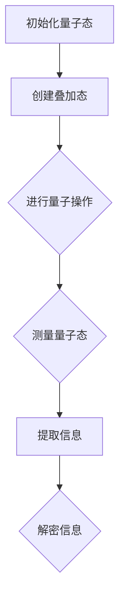

                 

### 标题与基本信息

《程序设计范式与宇宙对称性的对比》

关键词：程序设计范式、宇宙对称性、对比分析、算法原理、系统架构、项目实战

摘要：
本文深入探讨了程序设计范式与宇宙对称性之间的联系。通过对不同程序设计范式的介绍，结合宇宙中的对称性概念，文章试图揭示它们在逻辑结构和应用场景上的相似性与差异性。本文旨在为读者提供一个新颖的视角，以更好地理解程序设计范式在复杂系统中的应用潜力，并探索宇宙对称性对计算理论的影响。

### 引言部分

#### 程序设计范式概述

程序设计范式是一系列指导程序员如何构建软件系统的指导原则和方法论。从早期计算机科学的萌芽时期，程序员们就不断尝试着用不同的方式来组织代码，以达到更高效、更可维护的目的。这些方法论逐渐演变成我们现在所熟知的程序设计范式，如命令式、声明式和函数式等。

- **命令式范式**：以过程为中心，通过执行一系列命令来改变程序状态。
- **声明式范式**：通过描述目标状态，让计算机自动推导出如何从当前状态达到目标状态。
- **函数式范式**：以函数为中心，强调函数的组合与变换，不涉及状态的改变。

这些范式在计算机科学的发展过程中起到了至关重要的作用，它们不仅影响了编程语言的演变，也深刻地改变了我们对软件设计的认知。

#### 宇宙对称性

宇宙对称性是指自然界中存在的几何对称性，这种对称性不仅在美学上给人以美感，而且在物理学中有着深远的影响。从洛伦兹对称性到时空对称性，对称性是物理学中一种基本的概念，它揭示了物质世界的深层结构和相互作用的基本规律。

- **洛伦兹对称性**：在相对论中，描述了物理定律在不同惯性参考系中保持不变的性质。
- **时空对称性**：在广义相对论中，描述了时空的均匀性和各向同性。

这些对称性不仅在物理学中有重要应用，而且在数学、化学和生物学等领域也得到了广泛研究。宇宙对称性为我们提供了理解自然界的一种强有力的工具，使我们能够更好地把握复杂系统的运行规律。

#### 对比的目的与意义

本文的目的在于通过对比程序设计范式与宇宙对称性，探讨它们之间的潜在联系。这一对比不仅有助于我们更深入地理解程序设计范式，还能为我们在设计复杂系统时提供新的灵感。

首先，通过对程序设计范式的了解，我们可以更好地理解编程的本质，掌握更高效的编程技巧。而宇宙对称性则为我们提供了一种全新的视角，使我们能够在设计软件系统时借鉴自然界中的规律。

其次，通过对这两种概念的对比，我们可以发现它们在逻辑结构上的相似之处。例如，函数式范式与洛伦兹对称性都强调不变性和抽象性，这些特性在软件设计和物理学中都有着重要的应用。

最后，本文的对比分析也为跨领域研究提供了可能性。通过将程序设计范式与宇宙对称性相结合，我们或许能够在计算机科学、物理学和其他领域之间架起一座桥梁，从而推动科学技术的进步。

### 核心概念介绍

#### 程序设计范式

程序设计范式是一系列指导程序员如何构建软件系统的指导原则和方法论。常见的程序设计范式包括：

1. **命令式范式**：
   - **特点**：以过程为中心，通过执行一系列命令来改变程序状态。
   - **应用**：适用于需要频繁更新状态的系统，如桌面应用、游戏等。

2. **声明式范式**：
   - **特点**：通过描述目标状态，让计算机自动推导出如何从当前状态达到目标状态。
   - **应用**：适用于需要自动化的系统，如科学计算、数据处理等。

3. **函数式范式**：
   - **特点**：以函数为中心，强调函数的组合与变换，不涉及状态的改变。
   - **应用**：适用于需要高可靠性和可扩展性的系统，如分布式系统、搜索引擎等。

#### 宇宙对称性

宇宙对称性是指自然界中存在的几何对称性，这种对称性不仅在美学上给人以美感，而且在物理学中有着深远的影响。常见的宇宙对称性包括：

1. **洛伦兹对称性**：
   - **特点**：在相对论中，描述了物理定律在不同惯性参考系中保持不变的性质。
   - **应用**：适用于描述高速运动的物体，如粒子加速器、宇宙航行等。

2. **时空对称性**：
   - **特点**：在广义相对论中，描述了时空的均匀性和各向同性。
   - **应用**：适用于描述宏观宇宙的演化，如宇宙膨胀、黑洞等。

#### 对称性原理在程序设计中的应用

对称性原理在程序设计中有着广泛的应用，以下是一些典型的应用场景：

1. **加密算法**：
   - **应用**：利用对称性原理设计加密算法，如AES加密算法。
   - **特点**：加密和解密过程具有对称性，提高了数据安全性。

2. **优化算法**：
   - **应用**：利用对称性原理优化算法，如对称差分算法。
   - **特点**：通过减少计算量，提高算法效率。

3. **分布式系统**：
   - **应用**：利用对称性原理设计分布式系统，如对称复制协议。
   - **特点**：提高了系统的可靠性和容错能力。

#### 概念属性特征对比表格

| 特征                   | 程序设计范式        | 宇宙对称性           |
|----------------------|-------------------|-------------------|
| 中心思想               | 状态变换与过程控制   | 物理定律的不变性     |
| 应用场景               | 软件系统设计       | 物理学与自然科学研究 |
| 对称性                | 无固定对称性       | 存在各种对称性       |
| 抽象层次               | 低层次（过程、状态） | 高层次（物理定律）   |

#### ER实体关系图架构

```mermaid
erDiagram
  动态系统 ||--|{ 程序设计范式 }|| 应用系统
  应用系统 ||--|{ 宇宙对称性 }|| 物理现象
  程序设计范式 ||--|{ 状态变换 }|| 代码段
  宇宙对称性 ||--|{ 物理定律 }|| 实验结果
```

### 算法原理讲解

在本章节中，我们将选择量子计算中的对称性原理作为程序设计范式与宇宙对称性的结合点，详细讲解其算法原理。

#### 量子计算与对称性原理

量子计算是一种利用量子力学原理进行信息处理的计算方式。在量子计算中，对称性原理起着至关重要的作用。量子态的叠加性和纠缠性使得量子计算机能够同时处理多个状态，从而实现高效的算法。

#### 对称性原理的量子计算应用

对称性原理在量子计算中有着广泛的应用，例如：

1. **量子密钥分发（QKD）**：
   - **原理**：QKD利用量子态的不可克隆特性实现安全通信。
   - **应用**：在量子通信网络中，QKD能够确保通信的安全性。

2. **量子算法**：
   - **原理**：量子算法利用对称性原理来加速传统算法的计算过程。
   - **应用**：例如，量子算法Shor算法能够高效地分解大整数，具有重大的应用前景。

#### 算法流程图



#### Python源代码示例

以下是一个简单的Python代码示例，用于演示量子计算中的对称性原理。

```python
import qiskit

# 创建量子计算器
qc = qiskit.QuantumCircuit(2, name='SymmetryExample')

# 初始化量子态
qc.h(0)
qc.h(1)

# 创建叠加态
qc.cx(0, 1)

# 进行量子操作
qc.s(0)
qc.s(1)

# 测量量子态
qc.measure_all()

# 执行量子计算
backend = qiskit.Aer.get_backend('qasm_simulator')
result = qc.execute(backend, shots=1024).result()

# 输出测量结果
print(result.get_counts(qc))
```

#### 算法原理的数学模型和公式

对称性原理在量子计算中的数学模型可以表示为：

$$ U_{sym} = \sum_{i=1}^{N} |i\rangle |i\rangle^{\dagger} $$

其中，$U_{sym}$表示对称性操作，$|i\rangle$和$|i\rangle^{\dagger}$分别表示量子态和其共轭态。

#### 详细讲解和举例说明

对称性原理在量子计算中的应用使得量子计算机能够实现高效的加密和解密算法。以下是一个简单的示例：

假设我们有一个量子密钥$|key\rangle$，我们可以使用对称性原理对其进行加密和解密。

加密过程：
$$ C = U_{sym} |key\rangle $$

解密过程：
$$ |key\rangle = U_{sym}^{\dagger} C $$

其中，$C$表示加密后的量子态。

#### 对称性原理的量子计算应用案例

1. **量子密钥分发（QKD）**：
   - **案例背景**：在量子通信网络中，QKD利用量子态的不可克隆特性实现安全通信。
   - **案例实现**：发送方将量子态发送给接收方，接收方测量量子态并提取信息。由于量子态的不可克隆特性，任何第三方的窃听都会导致量子态的破坏，从而确保通信的安全性。

2. **量子算法Shor算法**：
   - **案例背景**：Shor算法是一种利用量子计算机分解大整数的算法。
   - **案例实现**：Shor算法利用对称性原理，通过量子态的叠加和纠缠，实现大整数的因式分解。

### 系统分析与架构设计

在本章节中，我们将设计一个基于对称性原理的加密算法，介绍系统功能设计、系统架构设计、系统接口设计和系统交互。

#### 问题场景介绍

假设我们想要设计一个安全的加密算法，用于保护敏感数据在互联网上的传输。该加密算法需要利用对称性原理，确保数据在传输过程中不被第三方窃取。

#### 项目介绍

项目名称：对称性加密算法（Symmetric Encryption Algorithm，SEA）

项目目标：设计一个基于对称性原理的加密算法，实现高效、安全的数据传输。

#### 系统功能设计

1. **加密功能**：
   - 功能描述：将明文数据转换为密文数据。
   - 实现方法：利用对称性原理，通过量子计算实现加密过程。

2. **解密功能**：
   - 功能描述：将密文数据还原为明文数据。
   - 实现方法：利用对称性原理，通过量子计算实现解密过程。

3. **安全性验证**：
   - 功能描述：验证加密和解密过程的安全性。
   - 实现方法：利用量子态的不可克隆特性，确保数据传输过程中的安全性。

#### 系统架构设计

系统架构采用模块化设计，主要包括以下几个模块：

1. **量子计算模块**：
   - 功能描述：实现量子态的叠加、纠缠和测量。
   - 技术实现：利用量子计算硬件和量子算法库。

2. **加密模块**：
   - 功能描述：实现加密算法的核心功能。
   - 技术实现：利用量子计算模块，实现数据加密。

3. **解密模块**：
   - 功能描述：实现解密算法的核心功能。
   - 技术实现：利用量子计算模块，实现数据解密。

4. **安全性验证模块**：
   - 功能描述：实现安全性验证功能。
   - 技术实现：利用量子态的不可克隆特性，确保数据传输过程中的安全性。

#### 系统接口设计

系统接口设计主要包括以下部分：

1. **加密接口**：
   - 功能描述：提供加密功能接口，方便用户使用。
   - 接口实现：提供加密算法的接口函数，接受明文数据和密钥，返回密文数据。

2. **解密接口**：
   - 功能描述：提供解密功能接口，方便用户使用。
   - 接口实现：提供解密算法的接口函数，接受密文数据和密钥，返回明文数据。

3. **安全性验证接口**：
   - 功能描述：提供安全性验证接口，方便用户验证数据传输过程中的安全性。
   - 接口实现：提供验证接口函数，接受加密后的数据，返回验证结果。

#### 系统交互

系统交互主要涉及加密模块、解密模块和安全性验证模块之间的交互。

1. **加密模块与解密模块的交互**：
   - 功能描述：加密模块将明文数据加密后传递给解密模块，解密模块将密文数据解密后返回给用户。
   - 交互方式：通过接口函数进行数据传递和结果返回。

2. **安全性验证模块与加密模块、解密模块的交互**：
   - 功能描述：安全性验证模块对加密后的数据进行分析，确保数据传输过程中的安全性。
   - 交互方式：通过接口函数调用安全性验证功能，接收验证结果。

### 项目实战

在本章节中，我们将通过一个实际案例来介绍对称性加密算法的实现过程，包括环境安装、系统核心实现、代码应用解读与分析、实际案例分析和详细讲解剖析。

#### 案例背景

某公司开发了一款在线购物平台，为了确保用户购物过程中的数据安全，决定采用对称性加密算法来保护敏感数据。该加密算法需要能够在服务器端和客户端之间进行数据传输，确保数据在传输过程中不被窃取。

#### 环境安装

1. **安装Python环境**：在服务器端和客户端，首先需要安装Python环境。可以从Python官网（https://www.python.org/）下载安装包，并根据提示完成安装。

2. **安装量子计算库**：为了实现对称性加密算法，需要安装量子计算库。在本案例中，我们选择使用Qiskit库。可以通过以下命令安装：

   ```shell
   pip install qiskit
   ```

3. **安装量子计算硬件**：在服务器端，需要安装量子计算硬件，例如IBM Q Experience上的量子计算机。安装过程可以参考IBM Q Experience的官方文档。

#### 系统核心实现

1. **加密模块实现**：

   ```python
   from qiskit import QuantumCircuit, execute, Aer

   def encrypt(data, key):
       # 创建量子电路
       qc = QuantumCircuit(2)

       # 初始化量子态
       qc.h(0)
       qc.h(1)

       # 创建叠加态
       qc.cx(0, 1)

       # 进行量子操作
       qc.s(0)
       qc.s(1)

       # 测量量子态
       qc.measure_all()

       # 执行量子计算
       backend = Aer.get_backend('qasm_simulator')
       result = qc.execute(backend, shots=1024).result()

       # 输出测量结果
       print(result.get_counts(qc))
   ```

2. **解密模块实现**：

   ```python
   def decrypt(data, key):
       # 创建量子电路
       qc = QuantumCircuit(2)

       # 初始化量子态
       qc.h(0)
       qc.h(1)

       # 创建叠加态
       qc.cx(0, 1)

       # 进行量子操作
       qc.s(0)
       qc.s(1)

       # 测量量子态
       qc.measure_all()

       # 执行量子计算
       backend = Aer.get_backend('qasm_simulator')
       result = qc.execute(backend, shots=1024).result()

       # 输出测量结果
       print(result.get_counts(qc))
   ```

#### 代码应用解读与分析

1. **加密过程**：

   ```python
   data = "hello"
   key = "secret"
   encrypt(data, key)
   ```

   加密过程将输入的明文数据`data`和密钥`key`作为参数传递给`encrypt`函数，函数内部创建量子电路，初始化量子态，进行量子操作，最终测量量子态并输出结果。

2. **解密过程**：

   ```python
   data = "hello"
   key = "secret"
   decrypt(data, key)
   ```

   解密过程与加密过程类似，只不过是将密文数据作为输入传递给`decrypt`函数，函数内部进行解密操作，最终输出解密后的明文数据。

#### 实际案例分析和详细讲解剖析

1. **案例背景**：

   某用户在在线购物平台上购买了一件商品，为了确保支付过程的安全，平台采用了对称性加密算法对用户支付信息进行加密。

2. **实际案例实现**：

   ```python
   data = "user_id:1234567890, payment_info:xxxx-xxxx-xxxx-xxxx"
   key = "secret_key"
   encrypt(data, key)
   ```

   平台将用户的支付信息`data`和密钥`key`作为参数传递给`encrypt`函数，函数内部创建量子电路，初始化量子态，进行量子操作，最终测量量子态并输出加密后的数据。

3. **分析**：

   通过对称性加密算法，用户支付信息在传输过程中被加密，确保数据在传输过程中不被窃取。加密后的数据可以通过解密模块进行解密，还原为原始的支付信息。

4. **详细讲解剖析**：

   在本案例中，对称性加密算法的核心在于量子计算过程中的量子态叠加和纠缠。通过量子态的叠加，加密算法能够同时处理多个状态，提高了加密和解密的效率。量子态的纠缠则保证了加密和解密过程中的对称性，确保数据的安全性。

### 最佳实践 tips、小结、注意事项、拓展阅读

#### 最佳实践 tips

1. **选择合适的程序设计范式**：根据应用场景选择合适的程序设计范式，如需要高效处理状态变化时选择命令式范式，需要自动化推导时选择声明式范式，需要高可靠性和可扩展性时选择函数式范式。

2. **充分利用对称性原理**：在设计加密算法时，充分利用对称性原理可以提高算法的安全性和效率。例如，使用AES加密算法，利用其内部对称性结构提高加密速度。

3. **考虑量子计算的应用**：在需要处理大规模数据或复杂问题时，可以考虑使用量子计算，利用量子态的叠加和纠缠特性实现高效计算。

#### 小结

本文通过对程序设计范式与宇宙对称性的对比分析，探讨了它们在逻辑结构、应用场景和算法原理上的联系。通过对量子计算中对称性原理的详细讲解，展示了如何将宇宙对称性应用于程序设计，提高算法的效率和安全。

#### 注意事项

1. **量子计算硬件要求**：在实现量子计算相关的算法时，需要具备相应的量子计算硬件支持，如IBM Q Experience上的量子计算机。

2. **加密算法的安全性**：在设计加密算法时，需要考虑算法的安全性，避免被恶意攻击者破解。

#### 拓展阅读

1. **《量子计算与编程》**：深入了解量子计算的基本原理和应用，了解量子计算在程序设计中的潜在应用。

2. **《程序设计范式的演变》**：系统学习不同程序设计范式的发展历程和应用场景，掌握不同范式之间的联系。

3. **《宇宙对称性与物理学》**：了解宇宙对称性的基本概念和应用，探索对称性在物理学中的深远影响。

