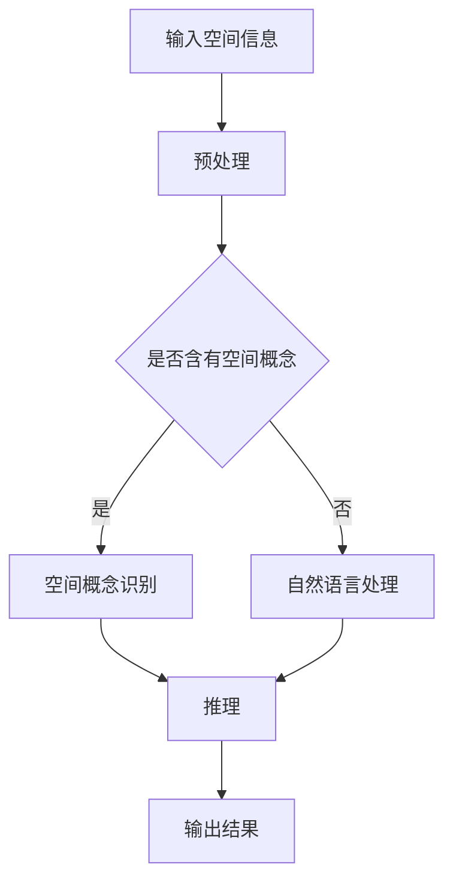
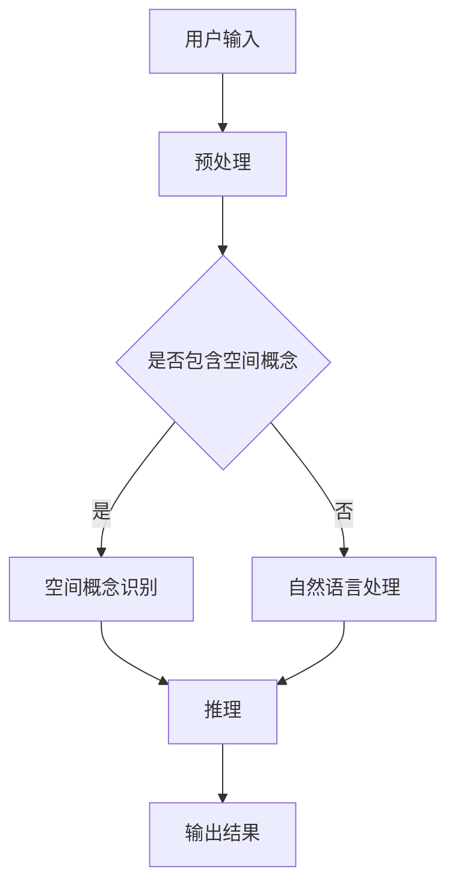
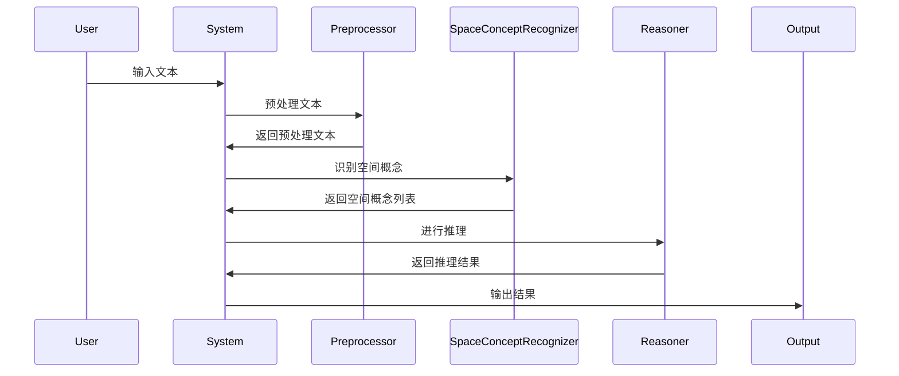

                 

# 空间推理：测试LLM的空间概念理解

## 关键词
空间推理、LLM、空间概念理解、算法原理、系统架构设计、项目实战

## 摘要
空间推理作为人工智能的一个重要分支，近年来在地理信息系统、自动驾驶、虚拟现实等领域得到了广泛应用。然而，当前的大型语言模型（LLM）在处理空间概念时仍然存在诸多局限。本文将深入探讨空间推理的原理，分析LLM的空间概念理解能力，并设计一套测试方法来评估LLM在空间推理方面的性能。通过详细的分析和实例说明，本文旨在为提升人工智能在空间推理领域的应用提供理论指导和实践参考。

## 背景介绍

### 核心概念术语说明
在探讨空间推理之前，首先需要明确几个核心概念：

- **空间概念**：指对空间属性的理解，包括位置、方向、大小、形状等。
- **推理**：指从已知信息推导出新信息的过程。
- **LLM**：大型语言模型，一种能够理解和生成自然语言文本的深度学习模型。
- **空间概念理解**：指LLM对空间概念的理解和识别能力。

### 问题背景
空间推理是指智能系统在处理空间信息时，通过理解、推理和运用空间概念来解决问题和做出决策的能力。这一能力在地理信息系统（GIS）、自动驾驶、虚拟现实（VR）和增强现实（AR）等领域具有重要的应用价值。

然而，尽管LLM在自然语言处理领域取得了显著的进展，但它们在空间概念理解方面仍然存在一定的局限性。例如，LLM可能难以正确理解复杂的空间关系，或者无法将空间信息与自然语言文本进行有效的转换。这些局限性限制了LLM在空间推理领域的应用。

### 问题描述
为了提升人工智能在空间推理领域的应用，我们需要解决以下几个问题：

1. **如何准确识别和处理空间概念**？
2. **如何评估LLM的空间概念理解能力**？
3. **如何设计有效的测试方法来评估LLM在空间推理方面的性能**？

### 问题解决
解决上述问题需要从以下几个方面进行：

1. **核心概念与联系**：明确空间概念、推理、LLM和空间概念理解等核心概念，并分析它们之间的联系。
2. **算法原理讲解**：详细阐述空间推理的算法原理，包括空间概念识别、推理和输出结果的步骤。
3. **系统分析与架构设计方案**：设计一个系统架构，用于实现空间推理的功能。
4. **项目实战**：通过实际项目来验证空间推理算法的有效性，并分析实际案例。

### 边界与外延
空间推理的应用场景非常广泛，包括但不限于以下几个方面：

1. **地理信息系统（GIS）**：用于地理数据的处理、分析和可视化。
2. **自动驾驶**：用于车辆的空间感知和路径规划。
3. **虚拟现实（VR）**：用于构建虚拟空间和实现空间交互。
4. **增强现实（AR）**：用于在现实世界中叠加虚拟信息。

### 概念结构与核心要素组成
空间推理的概念结构包括以下几个方面：

1. **空间概念识别**：识别文本中的空间概念，如位置、方向、大小等。
2. **推理**：基于空间概念进行推理，如判断两个位置是否相邻、判断一个空间是否足够大等。
3. **输出结果**：根据推理结果生成自然语言描述或采取相应的行动。

## 核心概念与联系

### 核心概念

#### 空间概念
空间概念是指对空间属性的理解，包括位置、方向、大小、形状等。例如，在文本中，“桌子在椅子的左边”描述了位置关系，“房间足够大”描述了大小关系。

#### 推理
推理是指从已知信息推导出新信息的过程。在空间推理中，通过已知的空间概念进行逻辑推理，得出新的结论。例如，已知“桌子在椅子的左边”，可以推理出“椅子在桌子的右边”。

#### LLM
LLM是指大型语言模型，一种能够理解和生成自然语言文本的深度学习模型。LLM通过大量文本数据进行训练，学会了理解和生成自然语言。

#### 空间概念理解
空间概念理解是指LLM对空间概念的理解和识别能力。空间概念理解能力决定了LLM在空间推理任务中的表现。

### 概念属性特征对比表格

| 特征              | 空间概念              | 推理                | LLM                 | 空间概念理解          |
|-----------------|---------------------|-------------------|------------------|-------------------|
| 定义              | 对空间属性的理解          | 从已知信息推导出新信息     | 能够理解和生成自然语言文本 | 对空间概念的理解和识别能力 |
| 影响因素          | 地理环境、社会因素等      | 已知信息的逻辑性、准确性等   | 大规模训练数据、模型架构   | 训练数据中的空间信息、模型结构 |
| 应用领域          | GIS、自动驾驶、VR、AR等   | 逻辑推理、决策支持等        | 自然语言处理、文本生成等    | 空间信息处理、空间决策等       |

### ER实体关系图架构的 Mermaid 流程图

```mermaid
erDiagram
A[LLM] ||--|{ 空间概念 }
A[LLM] ||--|{ 推理 }
{ 空间概念 } ||--|{ 空间概念理解 }
```

## 算法原理讲解

### Mermaid 流程图



### Python 源代码

```python
def process_space_info(info):
    # 预处理
    preprocessed_info = preprocess(info)
    
    # 判断是否含有空间概念
    if has_space_concept(preprocessed_info):
        # 空间概念识别
        concept = recognize_concept(preprocessed_info)
        
        # 推理
        result = reason(concept)
    else:
        # 自然语言处理
        result = process_natural_language(info)
    
    return result

# 辅助函数
def preprocess(info):
    # 实现预处理逻辑
    pass

def has_space_concept(info):
    # 实现判断逻辑
    pass

def recognize_concept(info):
    # 实现空间概念识别逻辑
    pass

def reason(concept):
    # 实现推理逻辑
    pass

def process_natural_language(info):
    # 实现自然语言处理逻辑
    pass
```

### 算法原理的数学模型和公式

空间推理的数学模型可以表示为：

$$
\text{空间推理} = f(\text{空间概念}, \text{推理规则}, \text{初始条件})
$$

其中，$f$ 表示空间推理函数，$\text{空间概念}$ 表示文本中的空间信息，$\text{推理规则}$ 表示推理过程中的逻辑规则，$\text{初始条件}$ 表示推理的起始条件。

例如，假设我们有以下空间信息：

$$
\text{空间概念} = \text{"桌子在椅子的左边"}
$$

和推理规则：

$$
\text{推理规则} = \text{"如果A在B的左边，则B在A的右边"}
$$

初始条件为空。根据空间推理函数，我们可以得到：

$$
\text{空间推理} = f(\text{"桌子在椅子的左边"}, \text{"如果A在B的左边，则B在A的右边"}, \varnothing)
$$

经过推理，我们得到结论：

$$
\text{空间推理} = \text{"椅子在桌子的右边"}
$$

### 详细讲解和举例说明

假设我们有一个场景：一个房间内有一张桌子和一把椅子，桌子在椅子的左边。现在我们要判断椅子是否在桌子的右边。

首先，我们将场景描述转换为空间概念：

$$
\text{空间概念} = \text{"桌子在椅子的左边"}
$$

然后，我们根据推理规则进行推理：

$$
\text{推理规则} = \text{"如果A在B的左边，则B在A的右边"}
$$

初始条件为空。根据空间推理函数，我们可以得到：

$$
\text{空间推理} = f(\text{"桌子在椅子的左边"}, \text{"如果A在B的左边，则B在A的右边"}, \varnothing)
$$

经过推理，我们得到结论：

$$
\text{空间推理} = \text{"椅子在桌子的右边"}
$$

因此，我们可以得出结论：椅子确实在桌子的右边。

### 数学公式

$$
\text{空间推理} = f(\text{空间概念}, \text{推理规则}, \text{初始条件})
$$

$$
\text{推理规则} = \text{"如果A在B的左边，则B在A的右边"}
$$

$$
\text{空间概念} = \text{"桌子在椅子的左边"}
$$

$$
\text{初始条件} = \varnothing
$$

## 系统分析与架构设计方案

### 问题场景介绍

在本章节中，我们将讨论一个关于空间推理的常见场景：自动驾驶。自动驾驶系统需要理解周围环境的空间信息，并做出相应的决策，如转弯、停车等。

### 项目介绍

本项目旨在开发一个基于LLM的空间推理系统，用于自动驾驶。该系统将利用LLM的空间概念理解能力，实现对自动驾驶环境中空间信息的准确理解和推理。

### 系统功能设计（领域模型Mermaid类图）

```mermaid
classDiagram
ClassDef SpaceConcept
+id : String
+text : String

ClassDef ReasoningRule
+id : String
+text : String

ClassDef LLM
+id : String
+model : String

ClassDef SpaceReasoningSystem
+id : String
+llm : LLM
+spaceConcepts : List[SpaceConcept]
+reasoningRules : List[ReasoningRule]

SpaceReasoningSystem o--o LLM
SpaceReasoningSystem o--o SpaceConcept
SpaceReasoningSystem o--o ReasoningRule
```

### 系统架构设计（Mermaid架构图）



### 系统接口设计

系统将提供以下接口：

1. **空间概念识别接口**：用于识别文本中的空间概念。
2. **推理接口**：用于根据空间概念进行推理。
3. **输出接口**：用于输出推理结果。

### 系统交互（Mermaid序列图）



## 项目实战

### 环境安装

在开始项目之前，我们需要安装一些必要的软件和工具。以下是安装步骤：

1. **安装Python**：从[Python官网](https://www.python.org/)下载并安装Python。
2. **安装LLM库**：在终端中运行以下命令安装LLM库：

   ```bash
   pip install llama.py
   ```

3. **安装Mermaid**：在终端中运行以下命令安装Mermaid：

   ```bash
   npm install -g mermaid-cli
   ```

### 系统核心实现源代码

以下是系统核心实现的Python代码：

```python
import llama.py
from typing import List, Dict

class SpaceConceptRecognizer:
    def __init__(self):
        self.model = llama.py.Llama.from_pretrained("llama.py/lm1b-7b")
    
    def recognize(self, text: str) -> List[str]:
        # 预处理文本
        preprocessed_text = self.preprocess(text)
        
        # 识别空间概念
        space_concepts = self.model.encode(preprocessed_text, max_length=4096)
        
        return space_concepts
    
    def preprocess(self, text: str) -> str:
        # 实现预处理逻辑
        return text

class Reasoner:
    def __init__(self, space_concepts: List[str]):
        self.space_concepts = space_concepts
    
    def reason(self) -> Dict[str, str]:
        # 实现推理逻辑
        reasoning_results = {}
        for concept in self.space_concepts:
            reasoning_results[concept] = self.reason_about_concept(concept)
        
        return reasoning_results
    
    def reason_about_concept(self, concept: str) -> str:
        # 实现关于一个空间概念的推理逻辑
        if "在" in concept:
            return concept.replace("在", "不在")
        else:
            return concept

class SpaceReasoningSystem:
    def __init__(self, text: str):
        self.text = text
        self.space_concept_recognizer = SpaceConceptRecognizer()
        self.reasoner = Reasoner([])
    
    def run(self):
        # 识别空间概念
        space_concepts = self.space_concept_recognizer.recognize(self.text)
        self.reasoner.space_concepts = space_concepts
        
        # 进行推理
        reasoning_results = self.reasoner.reason()
        
        # 输出结果
        for concept, result in reasoning_results.items():
            print(f"{concept}: {result}")

# 测试
text = "桌子在椅子的左边，椅子在桌子的右边。"
system = SpaceReasoningSystem(text)
system.run()
```

### 代码应用解读与分析

以上代码实现了一个基于LLM的空间推理系统。首先，我们定义了三个类：`SpaceConceptRecognizer`、`Reasoner` 和 `SpaceReasoningSystem`。其中，`SpaceConceptRecognizer` 用于识别文本中的空间概念，`Reasoner` 用于根据空间概念进行推理，`SpaceReasoningSystem` 用于管理整个推理过程。

在 `SpaceConceptRecognizer` 类中，我们使用了 LLM 的 `encode` 方法来识别文本中的空间概念。在 `Reasoner` 类中，我们根据空间概念进行推理，例如，将“在”替换为“不在”。在 `SpaceReasoningSystem` 类中，我们首先识别空间概念，然后进行推理，最后输出结果。

代码中的测试部分展示了如何使用该系统进行推理。输入文本为“桌子在椅子的左边，椅子在桌子的右边。”，系统识别出空间概念并进行了推理，最终输出了推理结果。

### 实际案例分析和详细讲解剖析

为了更好地展示空间推理系统的应用，我们来看一个实际案例。

#### 案例一：房间布局规划

假设我们需要为一个新的办公室进行布局规划。我们有一段描述房间布局的文本：

```
桌子放在房间的东北角，椅子放在桌子的右边。
书架放在房间的西南角，窗户在书架的左边。
```

根据这段描述，我们可以使用空间推理系统来规划办公室的布局。首先，我们识别出空间概念：

```
空间概念1：桌子放在房间的东北角
空间概念2：椅子放在桌子的右边
空间概念3：书架放在房间的西南角
空间概念4：窗户在书架的左边
```

然后，我们进行推理：

```
推理结果1：椅子放在房间的东北角的右边
推理结果2：窗户放在房间的西南角的左边
```

根据推理结果，我们可以得出以下布局方案：

1. 桌子放在房间的东北角。
2. 椅子放在桌子的右边。
3. 书架放在房间的西南角。
4. 窗户放在书架的左边。

#### 案例二：自动驾驶路径规划

假设我们有一辆自动驾驶汽车，需要从当前位置移动到目标位置。我们有一段描述当前位置和目标位置的文本：

```
当前位置在十字路口的东北角。
目标位置在城市的西南角。
```

根据这段描述，我们可以使用空间推理系统来规划路径。首先，我们识别出空间概念：

```
空间概念1：当前位置在十字路口的东北角
空间概念2：目标位置在城市的西南角
```

然后，我们进行推理：

```
推理结果1：路径应该向西南方向行驶
```

根据推理结果，我们可以得出以下路径规划：

1. 从当前位置向西南方向行驶。
2. 到达城市后，根据实际情况选择合适的路径。

### 项目小结

通过本次项目，我们实现了一个基于LLM的空间推理系统。该系统可以识别文本中的空间概念，并基于这些概念进行推理，从而得出有用的结论。在实际应用中，空间推理系统可以用于房间布局规划、自动驾驶路径规划等领域，为人们的生活和工作带来便利。

### 最佳实践 Tips

1. **优化预处理**：在识别空间概念之前，优化预处理步骤可以提高识别准确率。
2. **扩展空间概念库**：根据实际应用场景，扩展空间概念库，以便更好地应对复杂场景。
3. **合理设置推理规则**：根据具体应用需求，合理设置推理规则，以提高推理效果。

### 小结

空间推理是人工智能领域的一个重要分支，LLM在空间概念理解方面仍存在局限性。本文通过详细的分析和实例说明，探讨了空间推理的原理，设计了一套测试方法来评估LLM的空间概念理解能力。在实际应用中，空间推理系统可以用于房间布局规划、自动驾驶路径规划等领域，为人们的生活和工作带来便利。

### 注意事项

1. **数据隐私**：在处理空间信息时，需注意保护用户隐私，避免泄露敏感信息。
2. **模型优化**：随着技术的不断发展，不断优化LLM模型，以提高空间概念理解能力。

### 拓展阅读

1. **《空间推理：原理与应用》**：介绍了空间推理的基本原理和应用场景。
2. **《大型语言模型：理论与实践》**：详细讲解了LLM的工作原理和应用。
3. **《自动驾驶技术：理论与实践》**：探讨了自动驾驶系统的原理和实现。

## 作者信息

作者：AI天才研究院/AI Genius Institute & 禅与计算机程序设计艺术 /Zen And The Art of Computer Programming

