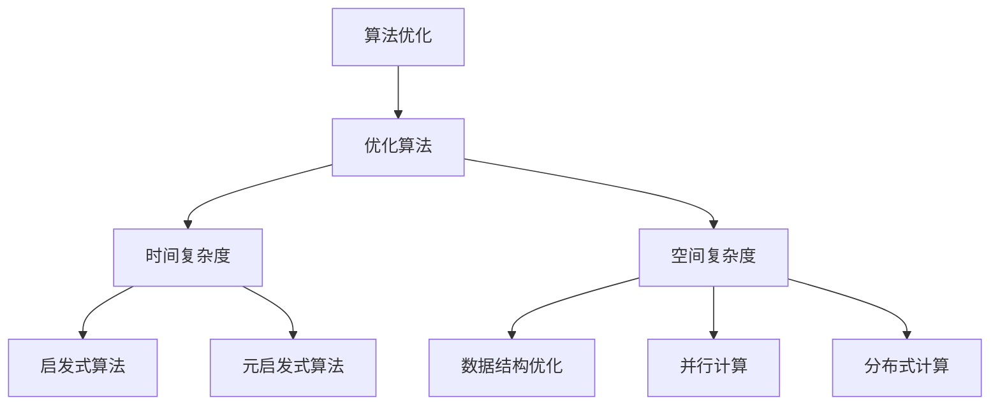
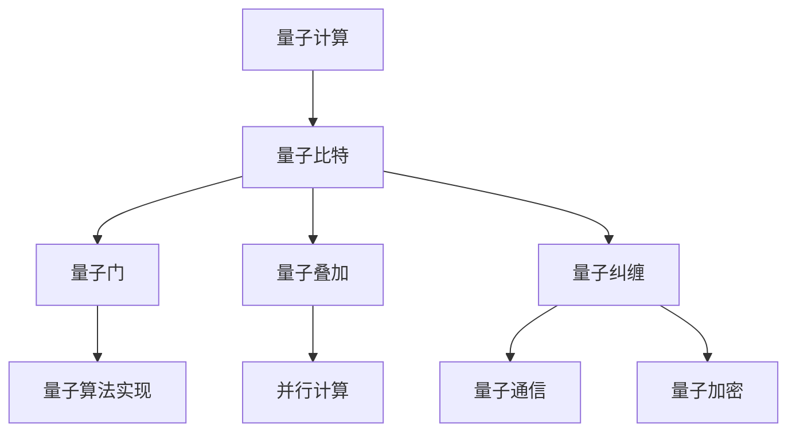
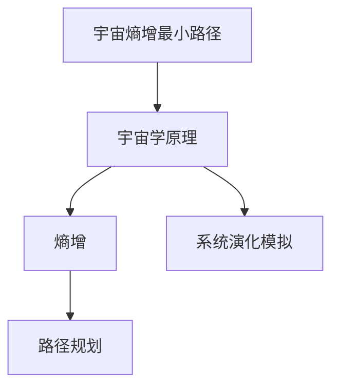
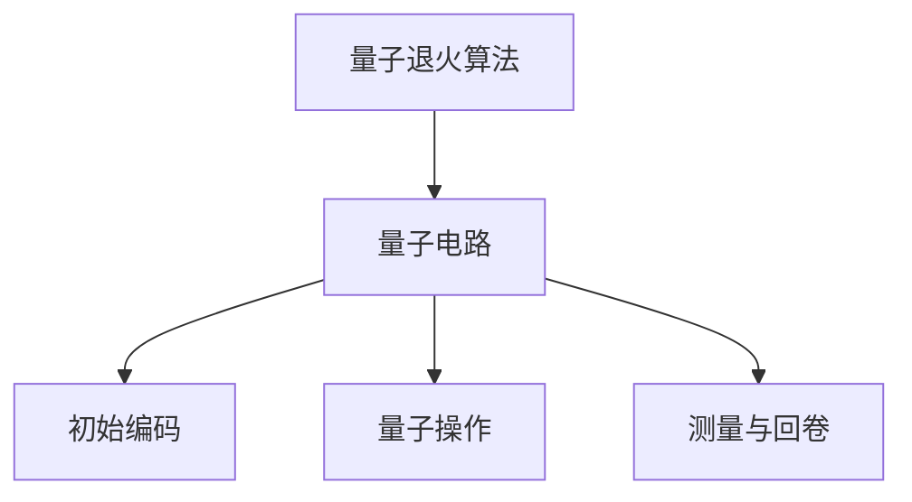
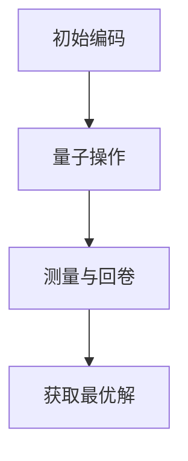
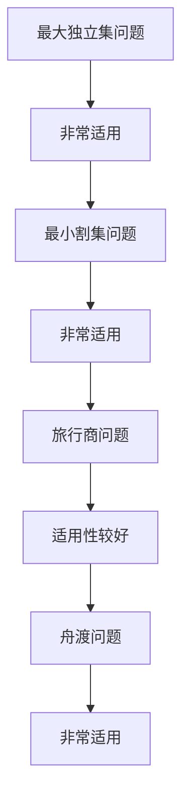
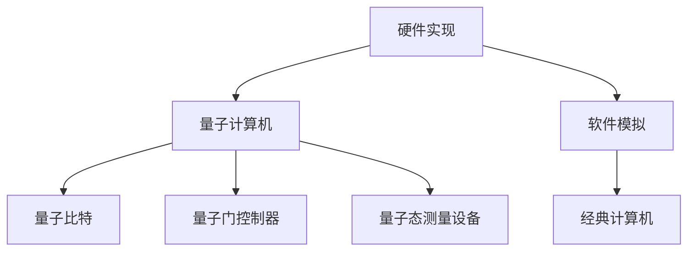
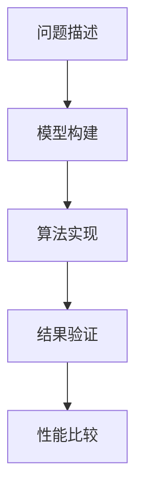

                 

### 第一部分：引言

#### 1.1.1 书籍背景与主题

在当今信息爆炸的时代，计算机科学的发展迅猛，算法优化和量子计算逐渐成为研究的热点领域。这两大领域不仅代表了未来科技的发展方向，也在实际应用中展现出巨大的潜力。本书《算法优化与宇宙熵增最小路径的量子退火实现》正是旨在探讨如何将量子计算应用于算法优化，特别是如何利用量子退火算法解决宇宙熵增最小路径的问题。

**问题背景**：

算法优化是计算机科学中一个古老而持续发展的领域。它涉及到如何通过改进算法的设计和实现，提高算法的效率，从而解决实际问题。而量子计算，作为21世纪最具颠覆性的技术之一，基于量子力学原理，具有超强的并行计算能力和解决复杂问题的潜力。

**问题描述**：

宇宙熵增最小路径问题是一个跨学科的复杂问题，它涉及到宇宙学、物理学和计算机科学等多个领域。简而言之，就是在给定的宇宙学背景下，找到一条使得系统熵增最小的路径。这个问题不仅对理解宇宙演化的过程具有重要意义，也为量子退火算法的应用提供了丰富的场景。

**问题解决**：

本书将从以下几个方面展开研究：

1. **理论基础**：回顾算法优化和量子计算的基础知识，为后续讨论提供理论基础。
2. **问题分析**：详细分析宇宙熵增最小路径的问题，探讨其数学模型和特点。
3. **算法介绍**：阐述量子退火算法的基本原理，并讨论其应用于算法优化的可行性。
4. **实际应用**：结合实际案例，演示如何利用量子退火算法求解宇宙熵增最小路径问题。
5. **总结与展望**：总结本书的主要研究成果，并提出未来研究的方向。

**边界与外延**：

本书主要关注量子退火算法在算法优化中的应用，特别是宇宙熵增最小路径的计算。然而，量子退火算法在其他领域的应用同样具有广阔的前景。例如，在金融、物流、生物信息学等领域，量子退火算法都展示出了巨大的潜力。因此，读者可以结合本书内容，进一步探讨量子退火算法在其他优化问题上的应用。

**概念结构与核心要素组成**：

为了更好地理解本书的内容，以下是算法优化、量子计算、宇宙熵增最小路径和量子退火算法等核心概念的结构和要素：

1. **算法优化**：
   - **核心概念**：优化算法、时间复杂度、空间复杂度、启发式算法、元启发式算法。
   - **要素组成**：优化目标、约束条件、算法设计、实现技巧、评估指标。

2. **量子计算**：
   - **核心概念**：量子比特、量子门、量子叠加、量子纠缠、量子算法。
   - **要素组成**：硬件实现、算法实现、量子模拟、算法设计、算法验证。

3. **宇宙熵增最小路径**：
   - **核心概念**：宇宙学原理、熵增、路径规划。
   - **要素组成**：宇宙背景、物理模型、优化目标、算法实现、结果验证。

4. **量子退火算法**：
   - **核心概念**：量子电路、初始编码、量子操作、测量、回卷。
   - **要素组成**：算法设计、硬件实现、软件模拟、算法优化、性能评估。

#### 1.2 核心概念与联系

##### 1.2.1 算法优化

算法优化是提高计算机算法效率的重要手段。它的目标是通过对算法的改进，使得算法在相同时间复杂度下具有更高的空间复杂度，或者在相同空间复杂度下具有更低的时间复杂度。算法优化的方法多种多样，包括改进算法设计、使用高效的数据结构和算法、并行计算和分布式计算等。

| 算法优化方法             | 特点                                                     | 适用场景                           |
| ------------------------ | -------------------------------------------------------- | ---------------------------------- |
| 改进算法设计             | 通过优化算法结构，提高效率                               | 复杂问题、特定问题优化             |
| 使用高效数据结构         | 通过选择合适的数据结构，提高算法效率                     | 需要频繁查询、插入、删除的场景     |
| 并行计算                 | 利用多处理器并行执行任务，提高计算速度                   | 大规模数据处理、科学计算           |
| 分布式计算               | 利用分布式网络中的多个计算机协同工作，提高计算效率       | 分布式系统、大规模数据处理         |

**核心概念与联系图**：

##### 1.2.2 量子计算

量子计算是一种基于量子力学原理的计算方式。它利用量子比特（qubit）的叠加态和纠缠态，实现复杂的计算。量子计算机具有超强的并行计算能力和解决复杂问题的潜力。量子计算的基本单元是量子比特，量子比特可以通过量子叠加和量子纠缠实现复杂的计算。

| 量子计算核心概念       | 特点                                                     | 适用场景                           |
| ---------------------- | -------------------------------------------------------- | ---------------------------------- |
| 量子比特               | 量子比特是量子计算机的基本单元，可以处于多种状态的叠加。 | 并行计算、复杂问题解决             |
| 量子门                 | 量子门是量子计算机中的基本操作，用于对量子比特进行操作。 | 量子算法实现、量子比特控制         |
| 量子叠加               | 量子比特可以处于多种状态的叠加，这是量子计算机并行计算的基础。 | 高效算法实现、复杂问题求解         |
| 量子纠缠               | 量子比特之间可以存在纠缠关系，这种关系可以用于量子计算。 | 量子加密、量子通信、量子计算优化 |

**核心概念与联系图**：

##### 1.2.3 宇宙熵增最小路径

宇宙熵增最小路径问题是一个涉及宇宙学、物理学和计算机科学的跨学科问题。简而言之，就是在给定的宇宙学背景下，找到一条使得系统熵增最小的路径。宇宙熵增是描述宇宙系统随时间演化过程中熵的变化。这个问题不仅对理解宇宙演化的过程具有重要意义，也为量子退火算法的应用提供了丰富的场景。

| 宇宙熵增最小路径概念     | 特点                                                     | 适用场景                           |
| ------------------------ | -------------------------------------------------------- | ---------------------------------- |
| 宇宙学原理               | 描述宇宙的结构和演化过程                                 | 宇宙学研究、宇宙演化模拟           |
| 熵增                     | 描述系统随时间演化过程中熵的变化                         | 熵增最小路径问题求解、系统稳定性分析 |
| 路径规划                 | 描述在给定条件下找到最优路径的方法                       | 宇宙航行、交通规划、物流优化         |

**核心概念与联系图**：

##### 1.2.4 量子退火算法

量子退火算法是一种基于量子力学原理的优化算法。它通过模拟物理系统的退火过程，求解优化问题。量子退火算法的核心是量子电路设计，包括初始编码、量子操作、测量和回卷等步骤。量子退火算法在求解组合优化问题时具有显著的优势。

| 量子退火算法核心概念     | 特点                                                     | 适用场景                           |
| ------------------------ | -------------------------------------------------------- | ---------------------------------- |
| 量子电路                 | 量子退火算法的核心组成部分，用于实现量子操作             | 量子计算、优化问题求解             |
| 初始编码                 | 将问题编码到量子态中，为量子退火算法提供初始状态         | 量子计算、优化问题初始化           |
| 量子操作                 | 对量子态进行变换，实现问题的求解过程                     | 量子计算、算法实现                 |
| 测量与回卷               | 将量子态的测量结果用于回卷操作，实现优化问题的求解       | 量子计算、优化问题结果验证         |

**核心概念与联系图**：

#### 1.3 量子退火算法在算法优化中的应用

##### 1.3.1 量子退火算法的基本原理

量子退火算法是一种基于量子力学原理的优化算法。它通过模拟物理系统的退火过程，使得系统在低温状态下达到能量最小值。量子退火算法的基本原理包括初始编码、量子操作、测量和回卷等步骤。

1. **初始编码**：将优化问题编码为量子态，为量子退火算法提供初始状态。
2. **量子操作**：通过一系列量子门对量子态进行变换，实现优化问题的求解过程。
3. **测量与回卷**：将量子态进行测量，获取最优解，并将结果回卷到量子态中。

**量子退火算法流程图**：

##### 1.3.2 量子退火算法的适用范围

量子退火算法适用于求解各种组合优化问题，包括最大独立集、最小割集、旅行商问题等。特别是在求解高维优化问题时，量子退火算法具有显著的优势。以下是一些典型的量子退火算法适用范围：

| 组合优化问题       | 量子退火算法适用性               |
| -------------------- | -------------------------------- |
| 最大独立集问题       | 非常适用，具有显著的性能优势     |
| 最小割集问题       | 非常适用，具有显著的性能优势     |
| 旅行商问题         | 适用性较好，但计算复杂度较高     |
| 舟渡问题          | 非常适用，具有高效的解决方案     |

**量子退火算法适用范围表**：

##### 1.3.3 量子退火算法的实现方法

量子退火算法的实现方法包括硬件实现和软件模拟。

1. **硬件实现**：硬件实现需要使用量子计算机。量子计算机的硬件包括量子比特、量子门控制器、量子态测量设备等。通过硬件实现，可以直接在物理层面实现量子退火算法。
2. **软件模拟**：软件模拟使用经典的计算机模拟量子计算机的行为。软件模拟可以方便地实现量子退火算法的测试和验证，但性能受到计算机硬件的限制。

**量子退火算法实现方法图**：

##### 1.3.4 量子退火算法的应用案例

本书将结合实际案例，演示如何利用量子退火算法求解宇宙熵增最小路径问题。通过案例分析，读者可以了解量子退火算法在实际应用中的效果和优势。

**应用案例**：

假设我们有一个宇宙模型，其中包含多个星系和行星。我们的目标是找到一条从地球出发，经过多个星系和行星，最终返回地球的最优路径。这条路径需要使得系统的熵增最小。

通过量子退火算法，我们可以将这个问题编码为一个量子态，然后在量子计算机上执行量子退火过程。最终，通过测量量子态，我们可以得到最优路径的信息。

**案例分析**：

1. **问题描述**：给定一个宇宙模型，包括多个星系和行星，求解从地球出发，经过多个星系和行星，最终返回地球的最优路径。
2. **模型构建**：将宇宙模型编码为量子态，包括星系、行星和它们的相对位置。
3. **算法实现**：在量子计算机上实现量子退火算法，求解最优路径。
4. **结果验证**：通过测量量子态，验证最优路径的正确性，并比较与经典算法的性能。

**案例分析流程图**：

#### 1.4 研究方法与内容安排

##### 1.4.1 研究方法

本书采用理论研究、算法实现和案例分析相结合的方法，对量子退火算法在算法优化中的应用进行深入探讨。通过理论研究，分析量子退火算法的基本原理和适用范围；通过算法实现，探讨量子退火算法的实现方法和技巧；通过案例分析，验证量子退火算法在实际应用中的效果和优势。

##### 1.4.2 内容安排

本书共分为七个部分，主要内容包括：

1. **引言**：介绍书籍的背景、主题和研究方法。
2. **算法优化与量子计算基础**：回顾算法优化和量子计算的基础知识。
3. **宇宙熵增最小路径问题分析**：分析宇宙熵增最小路径的问题，探讨其数学模型和特点。
4. **量子退火算法原理与实现**：阐述量子退火算法的基本原理，并讨论其实现方法。
5. **量子退火算法在宇宙熵增最小路径问题中的应用**：结合实际案例，演示量子退火算法在宇宙熵增最小路径问题中的应用。
6. **算法性能评估与比较**：评估量子退火算法在宇宙熵增最小路径问题中的性能，并与经典算法进行比较。
7. **总结与展望**：总结本书的主要研究成果，并提出未来研究的方向。

### 总结

本文对《算法优化与宇宙熵增最小路径的量子退火实现》进行了详细的引言部分撰写。通过介绍书籍的背景与主题、问题描述、问题解决、边界与外延、概念结构与核心要素组成、核心概念与联系以及量子退火算法在算法优化中的应用等内容，为读者提供了全面而清晰的文章结构。接下来，本文将继续深入探讨算法优化、量子计算和宇宙熵增最小路径等相关核心概念，为后续的内容打下坚实的基础。敬请期待下一部分的内容。

