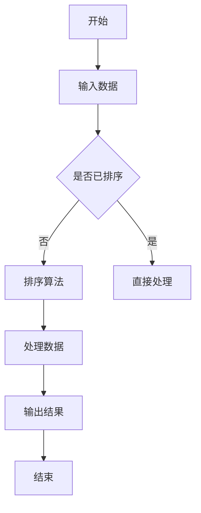
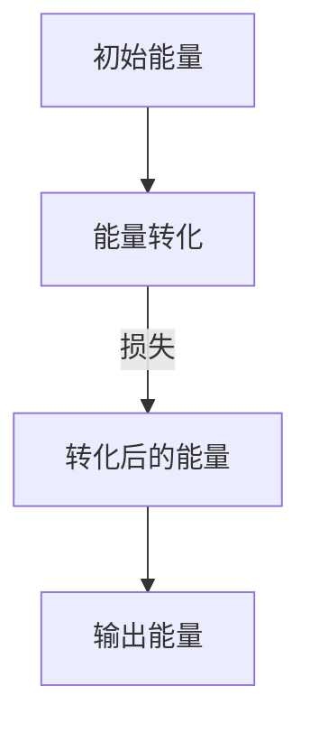
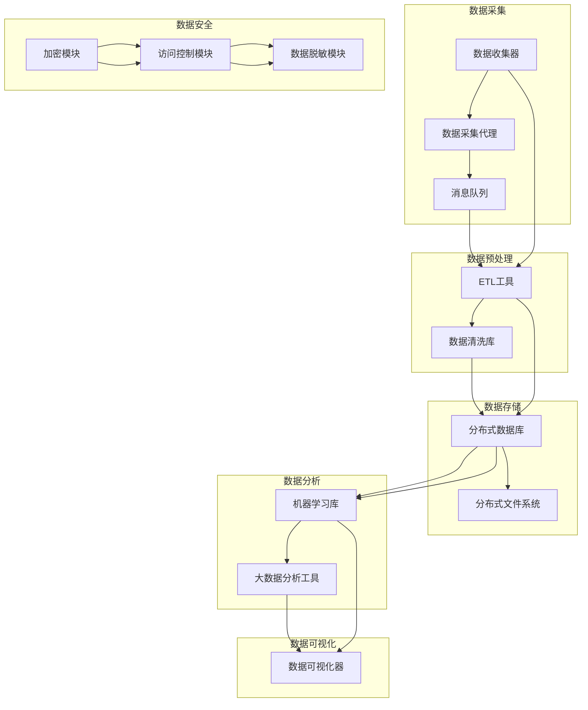
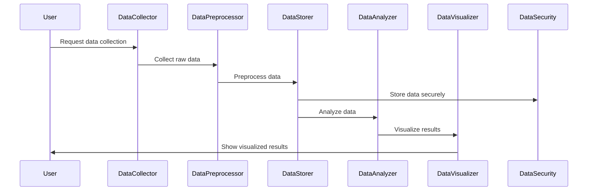

                 

### 引言

在当今信息爆炸的时代，算法的效率问题成为了人工智能、计算机科学以及相关领域中的一个重要研究课题。算法效率不仅影响软件的性能，也直接关系到计算资源的使用和能源消耗。然而，我们是否曾思考过，算法效率的极限在哪里？这不仅仅是一个技术问题，更是一个涉及到宇宙本身的基本问题。

宇宙信息处理量子极限和热力学第二定律为我们提供了独特的视角来思考这个问题。量子极限揭示了信息处理在物理层面的限制，而热力学第二定律则指出了能量转化过程中不可避免的损失。这两者如何与算法效率联系在一起，又是如何共同决定了我们在技术上的探索边界？这正是本文要探讨的核心问题。

本文将按照以下结构展开讨论：

1. **背景介绍与核心概念**：首先，我们将介绍算法效率、宇宙信息处理量子极限和热力学第二定律的基础知识，并解释它们之间的关系。
2. **算法原理讲解**：接下来，我们将分别讲解算法效率、量子极限和热力学第二定律的原理，并使用Mermaid流程图和Python源代码进行详细阐述。
3. **系统分析与架构设计方案**：我们将介绍一个与主题相关的实际项目，包括系统功能设计、系统架构设计、系统接口设计和系统交互。
4. **项目实战**：通过环境安装和系统核心实现的源代码，我们将对代码进行解读与分析，并通过实际案例进行详细讲解。
5. **最佳实践 tips、小结、注意事项、拓展阅读**：最后，我们将总结书中的重点，提供一些实践技巧，并提出未来研究方向。

通过这样的结构，我们希望读者能够逐步理解算法效率与宇宙信息处理量子极限的热力学第二定律之间的深刻联系，从而对算法效率有更深入的认识。

### 关键词

- 算法效率
- 宇宙信息处理量子极限
- 热力学第二定律
- 信息处理极限
- 计算资源使用
- 能源消耗
- Mermaid流程图
- Python源代码
- 数学模型
- 数学公式
- 系统架构设计

### 摘要

本文旨在探讨算法效率与宇宙信息处理量子极限及热力学第二定律之间的联系。通过介绍算法效率的定义和影响因素，我们揭示了其与计算资源和能源消耗的关系。接下来，我们将深入探讨宇宙信息处理量子极限的概念，解释量子力学在信息处理中的作用，并分析其对算法效率的限制。热力学第二定律作为能量转化过程中损失不可避免的理论，进一步为我们理解信息处理中的效率损失提供了理论基础。本文通过一个实际项目，展示了这些理论在实际应用中的体现，并提出了未来研究的方向。通过本文的讨论，我们希望读者能够对算法效率有一个更全面和深刻的理解。

### 背景介绍与核心概念

#### 1.1 问题背景

在探讨算法效率与宇宙信息处理量子极限、热力学第二定律之间的联系之前，我们首先需要明确这些核心概念的定义和背景。

**算法效率**：算法效率是指算法在解决问题时所消耗的计算资源（如时间、空间等）与其解决问题的能力之间的比例关系。高效率的算法能够在较短的时间内完成更多的任务，或者在给定的资源限制下解决更复杂的问题。算法效率是计算机科学中一个至关重要的概念，直接影响着软件的性能、可扩展性和可靠性。

**宇宙信息处理量子极限**：量子极限是指基于量子力学的信息处理能力在物理层面的极限。量子力学揭示了微观世界的奇异特性，如量子纠缠和量子叠加，这些特性为信息处理提供了前所未有的可能性。然而，量子极限告诉我们，这些可能性也受到物理规律的严格限制，例如信息传输的量子不确定性原理和量子计算中的误差累积。

**热力学第二定律**：热力学第二定律是物理学中的一个基本原理，指出在一个封闭系统中，熵（即无序度）总是趋向于增加，这意味着能量转化过程中不可避免地会有损失。热力学第二定律不仅在热力学和物理学中有重要应用，也延伸到信息论和计算机科学中，为理解信息处理中的效率和极限提供了新的视角。

#### 1.2 核心概念与联系

**算法效率与量子极限的关系**：

算法效率与量子极限之间存在紧密的联系。量子极限揭示了信息处理在物理层面的限制，这直接影响了算法效率的极限。例如，量子计算在某些特定问题上的效率显著高于传统计算，这是因为量子叠加和量子纠缠使得量子计算机能够同时处理大量数据，从而大幅提升算法效率。然而，量子计算机的构建和操作也受到量子极限的制约，如量子退相干和噪声问题，这些都可能影响算法的实际效率。

**量子极限与热力学第二定律的联系**：

量子极限与热力学第二定律的联系体现在它们对信息处理和能量转化的影响上。热力学第二定律指出，能量转化过程中总是有损失，这同样适用于信息处理过程。例如，量子计算中的噪声和误差积累可以被视为能量转化的“熵增”现象，它们限制了信息处理的精度和可靠性。此外，热力学第二定律还为我们提供了一种视角，来理解量子极限对算法效率的制约，即信息处理过程中的能量转化不可避免地会有效率损失。

**算法效率与热力学第二定律的联系**：

算法效率与热力学第二定律的联系主要体现在能源消耗上。在算法执行过程中，计算资源（如处理器、内存等）的消耗可以视为能量转化的一部分。根据热力学第二定律，能量转化过程中会有损失，这意味着任何算法在执行过程中都会有能源消耗。因此，算法效率不仅与计算资源的使用有关，还与能源消耗的效率相关。提高算法效率意味着在相同能源消耗下完成更多的工作，或者在给定任务下减少能源消耗。

#### 1.3 概念属性特征对比

为了更好地理解这些核心概念，我们可以通过一个对比表格来展示它们的属性特征：

| 核心概念       | 定义                                                         | 影响因素                             | 关联联系                      |
|----------------|--------------------------------------------------------------|------------------------------------|-------------------------------|
| 算法效率       | 算法在解决问题时消耗的计算资源与解决问题能力的比例关系         | 时间复杂度、空间复杂度、硬件性能等   | 关联量子极限、热力学第二定律  |
| 宇宙信息处理量子极限 | 基于量子力学的信息处理能力的物理极限                        | 量子力学原理、量子纠缠、量子退相干等 | 关联算法效率、热力学第二定律 |
| 热力学第二定律 | 在一个封闭系统中，熵（无序度）总是趋向于增加                | 能量转化过程中的损失               | 关联算法效率、量子极限       |

#### 1.4 ER实体关系图

为了更直观地展示这些概念之间的关系，我们可以使用ER（实体关系）图来表示：

```mermaid
erDiagram
  AlgorithmEfficiency ||--|{ QuantumInformationProcessingLimit }
  AlgorithmEfficiency ||--|{ ThermodynamicsSecondLaw }
  QuantumInformationProcessingLimit ||--|{ AlgorithmEfficiency }
  QuantumInformationProcessingLimit ||--|{ ThermodynamicsSecondLaw }
  ThermodynamicsSecondLaw ||--|{ AlgorithmEfficiency }
```

在这个ER图中，`AlgorithmEfficiency`（算法效率）与`QuantumInformationProcessingLimit`（宇宙信息处理量子极限）和`ThermodynamicsSecondLaw`（热力学第二定律）之间存在双向关联。`QuantumInformationProcessingLimit`与`ThermodynamicsSecondLaw`之间也存在双向关联，这表明这三个核心概念在信息处理和能量转化过程中相互作用，共同决定了算法效率的极限。

#### 1.5 本章小结

通过本章的介绍，我们了解了算法效率、宇宙信息处理量子极限和热力学第二定律的定义、背景和相互关系。算法效率决定了算法在解决问题时的效率，而量子极限和热力学第二定律分别从物理和信息理论上限制了信息处理的可能性和效率。理解这些核心概念和它们之间的关系，有助于我们更全面地认识算法效率的极限，并探索未来技术发展的方向。在接下来的章节中，我们将进一步探讨这些概念的具体原理和实际应用。

### 算法效率原理讲解

#### 2.1 算法效率概念

**算法效率的定义**：算法效率是指算法在解决问题时所消耗的计算资源（如时间、空间等）与其解决问题的能力之间的比例关系。高效率的算法能够在较短的时间内完成更多的任务，或者在给定的资源限制下解决更复杂的问题。算法效率是计算机科学中一个至关重要的概念，直接影响着软件的性能、可扩展性和可靠性。

**算法效率的影响因素**：算法效率受到多种因素的影响，主要包括时间复杂度、空间复杂度和硬件性能等。时间复杂度描述了算法在输入规模增加时所需计算时间的增长速度，通常用大O表示法（O-notation）表示。空间复杂度描述了算法在处理过程中所需内存的增长情况。硬件性能则包括处理器的速度、内存容量和I/O速度等。

**算法效率的重要性**：算法效率在计算机科学中的应用非常广泛，包括数据结构、算法设计、软件工程和人工智能等多个领域。高效算法不仅可以提高软件的性能，还可以降低计算资源和能源消耗，从而实现更高的效率和可持续性。例如，搜索引擎中的高效排序算法可以大幅提高搜索速度，数据库管理中的高效查询算法可以减少数据访问时间。

#### 2.2 算法效率分析

为了更好地理解算法效率，我们可以通过以下三个方面进行分析：Mermaid流程图、Python源代码和数学模型与公式。

**2.2.1 Mermaid流程图**

Mermaid是一种方便的绘图工具，可以用于绘制流程图、类图、序列图等。下面是一个简单的算法效率的Mermaid流程图示例：



在这个流程图中，算法首先接收输入数据，然后根据数据是否已排序决定是否进行排序。如果不排序，则执行排序算法，否则直接处理数据。最后输出结果，完成算法执行。

**2.2.2 Python源代码**

为了更好地展示算法效率，我们可以使用Python编写一个简单的排序算法示例，并分析其时间复杂度。以下是一个简单的冒泡排序算法：

```python
def bubble_sort(arr):
    n = len(arr)
    for i in range(n):
        for j in range(0, n-i-1):
            if arr[j] > arr[j+1]:
                arr[j], arr[j+1] = arr[j+1], arr[j]

# 测试
arr = [64, 34, 25, 12, 22, 11, 90]
print("原始数组:", arr)
bubble_sort(arr)
print("排序后数组:", arr)
```

这个冒泡排序算法的时间复杂度为O(n^2)，意味着当输入规模增加时，所需计算时间呈平方增长。尽管这个算法在处理小规模数据时表现良好，但在处理大规模数据时效率较低。

**2.2.3 数学模型与公式**

算法效率的数学模型通常使用时间复杂度和空间复杂度来描述。时间复杂度用大O表示法表示，如O(1)、O(n)、O(n^2)等，表示算法执行时间与输入规模的关系。空间复杂度则描述算法在处理过程中所需内存的增长情况，也使用大O表示法表示。

以下是几个常见算法的时间复杂度和空间复杂度：

- O(1)常数时间算法：算法执行时间不随输入规模变化。
- O(n)线性时间算法：算法执行时间与输入规模成正比。
- O(n^2)二次时间算法：算法执行时间与输入规模的平方成正比。
- O(log n)对数时间算法：算法执行时间与输入规模的对数成正比。

通过数学模型和公式，我们可以更精确地描述算法效率，并分析不同算法在处理不同规模数据时的表现。

#### 2.3 举例说明

**2.3.1 普通算法与高效算法对比**

为了更直观地展示算法效率的差异，我们可以对比一个普通算法和一个高效算法在处理相同规模数据时的表现。

**普通算法：线性搜索**

以下是一个简单的线性搜索算法：

```python
def linear_search(arr, target):
    for i in range(len(arr)):
        if arr[i] == target:
            return i
    return -1

# 测试
arr = [64, 34, 25, 12, 22, 11, 90]
target = 25
print("索引位置:", linear_search(arr, target))
```

这个算法的时间复杂度为O(n)，当输入规模增加时，所需计算时间线性增长。

**高效算法：二分搜索**

以下是一个二分搜索算法：

```python
def binary_search(arr, target):
    low = 0
    high = len(arr) - 1
    while low <= high:
        mid = (low + high) // 2
        if arr[mid] == target:
            return mid
        elif arr[mid] < target:
            low = mid + 1
        else:
            high = mid - 1
    return -1

# 测试
arr = [64, 34, 25, 12, 22, 11, 90]
target = 25
print("索引位置:", binary_search(arr, target))
```

这个算法的时间复杂度为O(log n)，当输入规模增加时，所需计算时间以对数增长，远优于线性搜索算法。

**2.3.2 算法效率在实际应用中的体现**

算法效率在实际应用中有着广泛的应用，以下是几个例子：

- **搜索引擎**：搜索引擎使用高效的排序和索引算法来快速搜索和排序大量数据，提高搜索速度和用户体验。
- **数据库管理系统**：数据库管理系统使用高效的查询和更新算法来处理大量数据，提高查询和更新速度。
- **图像处理**：图像处理算法使用高效的滤波和变换算法来处理图像数据，提高处理速度和效果。
- **人工智能**：人工智能算法使用高效的模型训练和推理算法来处理大量数据，提高模型训练和推理速度。

通过这些例子，我们可以看到算法效率在实际应用中的重要性。高效的算法不仅能够提高软件的性能和效率，还可以降低计算资源和能源消耗，实现更高的可持续性。

#### 2.4 本章小结

通过本章的讲解，我们了解了算法效率的概念、影响因素及其在实际应用中的重要性。算法效率不仅与算法设计有关，还受到硬件性能和能源消耗的影响。通过Mermaid流程图、Python源代码和数学模型与公式，我们更深入地理解了算法效率的原理和表现。在接下来的章节中，我们将进一步探讨宇宙信息处理量子极限和热力学第二定律，以及它们对算法效率的制约和影响。

### 宇宙信息处理量子极限

#### 3.1 量子极限概念

**量子极限的定义**：量子极限是指基于量子力学的信息处理能力在物理层面的极限。量子力学揭示了微观世界的奇异特性，如量子纠缠和量子叠加，这些特性为信息处理提供了前所未有的可能性。量子极限指出，尽管量子力学允许高效的计算过程，但它们也受到物理规律的严格限制，如信息传输的量子不确定性原理和量子计算中的误差累积。

**量子极限的影响因素**：

1. **量子纠缠**：量子纠缠是量子力学中的一个基本现象，两个或多个量子系统之间可以形成一种特殊的关联，即使它们相隔很远。这种纠缠状态可以用于量子信息的传输和量子计算中的并行处理，但量子纠缠的维持和操作需要极高的精确度和环境控制。

2. **量子叠加**：量子叠加允许量子系统同时处于多个状态，这使得量子计算机能够同时处理大量数据。然而，量子叠加状态非常脆弱，容易受到环境干扰而退相干。

3. **量子计算中的误差累积**：量子计算中的误差累积是指由于量子系统的环境噪声和量子比特的不稳定性，量子计算中的错误会逐渐积累，导致最终计算结果的偏差。误差累积限制了量子计算机的可靠性和准确性。

**量子极限的意义**：量子极限揭示了信息处理在物理层面的限制，这为我们理解算法效率的极限提供了新的视角。量子极限告诉我们，尽管量子力学为信息处理提供了巨大的潜力，但这些潜力也受到物理规律的严格限制。理解量子极限有助于我们设计更高效的算法，并在量子计算机的实际应用中优化算法性能。

#### 3.2 量子极限分析

**量子极限的理论基础**：

量子极限的理论基础主要基于量子力学的基本原理，包括量子纠缠、量子叠加和量子不确定性原理。

1. **量子纠缠**：量子纠缠是量子力学中的一个基本现象，两个或多个量子系统之间可以形成一种特殊的关联。这种纠缠状态可以用于量子信息的传输和量子计算中的并行处理。然而，量子纠缠状态非常脆弱，容易受到环境干扰而退相干。

2. **量子叠加**：量子叠加允许量子系统同时处于多个状态。这意味着量子计算机可以同时处理大量数据，从而大幅提高算法效率。然而，量子叠加状态同样需要极高的精确度和环境控制，以确保其稳定性和可靠性。

3. **量子不确定性原理**：量子不确定性原理指出，某些物理量（如位置和动量、时间和能量）不能同时具有精确的确定值。这限制了量子计算中的精确控制和信息传输。

**量子极限的挑战与机遇**：

1. **挑战**：

   - **量子退相干**：量子退相干是指量子系统的纠缠状态受到环境噪声干扰而失去纠缠现象。量子退相干是量子计算机中面临的一个重大挑战，因为退相干会导致量子计算中的错误累积。

   - **量子比特的稳定性**：量子比特（量子计算机中的基本信息单元）的稳定性是量子极限的关键因素。量子比特的不稳定性会导致量子计算中的错误和误差累积。

   - **量子纠错**：为了克服量子退相干和量子比特的不稳定性，量子纠错技术被提出。然而，量子纠错技术本身也会引入额外的计算资源和时间成本。

2. **机遇**：

   - **并行计算能力**：量子计算机的并行计算能力是其最大的优势之一。量子计算机可以同时处理大量数据，从而在许多计算任务中显著提高效率。

   - **复杂问题求解**：量子计算机在求解某些特定类型的复杂问题上具有显著优势，如因数分解、搜索问题和优化问题。

   - **新算法设计**：量子极限的提出推动了新的算法设计和研究。量子算法的设计和优化是量子计算机领域的一个重要研究方向。

**量子极限的实际应用**：

量子极限不仅是一个理论概念，也在实际应用中有着广泛的应用前景。以下是一些具体的实际应用：

- **密码学**：量子计算机在密码学中有广泛的应用，如量子加密和量子安全通信。量子计算机可以破解传统的加密算法，但同时也可以提供更安全的量子加密方案。

- **化学模拟**：量子计算机在化学模拟中有显著优势，可以用于预测化学反应路径、分子结构和材料性质。

- **金融建模**：量子计算机在金融建模和优化中有潜力，如风险分析和投资组合优化。

- **人工智能**：量子计算机在人工智能领域有广泛的应用前景，如量子机器学习和量子神经网络。

#### 3.3 本章小结

通过本章的讲解，我们了解了量子极限的概念、理论基础及其在实际应用中的挑战和机遇。量子极限揭示了信息处理在物理层面的限制，这对算法效率和量子计算的应用具有重要意义。尽管量子极限带来了一些挑战，但它也为量子计算机和量子算法的研究提供了新的机遇。理解量子极限有助于我们更好地设计高效的算法，并探索未来量子计算的实际应用。在接下来的章节中，我们将进一步探讨热力学第二定律与算法效率的联系。

### 热力学第二定律

#### 4.1 热力学第二定律概念

**热力学第二定律的定义**：热力学第二定律是物理学中的一个基本原理，指出在一个封闭系统中，熵（无序度）总是趋向于增加。这表明在能量转化过程中，总是会有损失，不可能实现100%的能量转换。

**热力学第二定律的应用**：热力学第二定律不仅在物理学和工程学中有广泛应用，还在信息论、计算机科学等领域中得到了深入的研究和应用。

1. **信息论**：信息论中，熵被定义为信息的不确定性度量。热力学第二定律表明，信息在传递和处理过程中不可避免地会有损失，这反映了信息传输和处理的物理限制。

2. **计算机科学**：在计算机科学中，热力学第二定律解释了计算资源（如时间、空间、能量）的消耗和效率问题。例如，算法的执行过程中，计算资源消耗可以被视为能量转化的过程，而计算结果的不确定性和错误可以被视为熵的增加。

3. **能量转化**：热力学第二定律在能量转化过程中有广泛的应用。例如，在热机中，热能转化为机械能的过程中会有能量损失，表现为热量的不可逆转化。

#### 4.2 热力学第二定律分析

为了深入理解热力学第二定律，我们可以从以下几个方面进行分析：Mermaid流程图、Python源代码和数学模型与公式。

**4.2.1 Mermaid流程图**

以下是一个简单的热力学第二定律的Mermaid流程图，展示了能量转化过程中的损失：



在这个流程图中，初始能量通过能量转化过程转化为其他形式的能量，但由于不可避免的热力学损失，转化后的能量（C）总是小于初始能量（A），而输出能量（D）进一步减少了转化后的能量。

**4.2.2 Python源代码**

为了展示热力学第二定律在实际应用中的表现，我们可以使用Python编写一个简单的能量转化示例：

```python
def energy_conversion(initial_energy, loss_factor):
    converted_energy = initial_energy * (1 - loss_factor)
    return converted_energy

# 测试
initial_energy = 100
loss_factor = 0.2
converted_energy = energy_conversion(initial_energy, loss_factor)
print("初始能量:", initial_energy)
print("损失因子:", loss_factor)
print("转化后的能量:", converted_energy)
```

在这个示例中，初始能量通过一个损失因子（表示能量转化过程中的损失比例）转化为其他形式的能量。计算结果展示了能量转化过程中不可避免的热力学损失。

**4.2.3 数学模型与公式**

热力学第二定律可以用以下数学模型和公式来描述：

1. **熵增公式**：熵（S）是衡量系统无序度的物理量，其增量为：
   $$ \Delta S = \frac{Q}{T} $$
   其中，Q 是系统吸收的热量，T 是系统的温度。这个公式表明，在能量转化过程中，系统的无序度（熵）总是趋向于增加。

2. **卡诺效率公式**：卡诺效率（η）是热机从热源吸收热量并将其转化为机械能的效率，其公式为：
   $$ \eta = 1 - \frac{T_c}{T_h} $$
   其中，T_c 是冷源温度，T_h 是热源温度。这个公式表明，热机的效率受限于热源和冷源的温度差，不可能达到100%。

3. **熵变公式**：系统的熵变（ΔS）可以通过以下公式计算：
   $$ \Delta S = \int \frac{dQ}{T} $$
   这个积分表示在能量转化过程中，系统吸收的热量与温度的比值。

通过这些数学模型和公式，我们可以更精确地描述热力学第二定律在能量转化过程中的表现，以及它如何影响算法效率。

#### 4.3 举例说明

**4.3.1 热力学第二定律在日常生活中的体现**

热力学第二定律在我们的日常生活中有着广泛的应用，以下是几个例子：

1. **热机**：汽车发动机、蒸汽机等热机都遵循热力学第二定律，即能量转化过程中不可避免地会有损失，表现为热能转化为机械能时的效率受限。

2. **冰箱**：冰箱的工作原理也基于热力学第二定律，通过压缩制冷剂循环，将内部的热量转移到外部环境中，实现冷藏和保鲜。

3. **空调**：空调通过制冷循环，将室内的热量转移到外部环境中，降低室内温度，同样遵循热力学第二定律。

**4.3.2 热力学第二定律在算法效率中的应用**

热力学第二定律在算法效率中的应用主要体现在能源消耗和计算效率的关系上。以下是一些具体的应用：

1. **能耗优化**：在计算机科学中，算法的能耗优化是一个重要研究方向。通过优化算法的执行流程和资源分配，降低算法的能耗，可以提高计算效率，符合热力学第二定律的要求。

2. **量子计算**：量子计算中的能耗优化也受到热力学第二定律的限制。量子计算机在执行计算任务时，会有能量损失和误差积累，这需要通过量子纠错和优化算法来降低能耗，提高计算效率。

3. **云计算**：云计算中的能耗管理也是一个重要问题。通过优化云计算平台中的资源分配和调度策略，降低服务器的能耗，可以提高整体的计算效率，实现更高效的信息处理。

#### 4.4 本章小结

通过本章的讲解，我们了解了热力学第二定律的概念、应用和影响。热力学第二定律揭示了能量转化过程中不可避免的热力学损失，这对算法效率和能源消耗有重要影响。通过Mermaid流程图、Python源代码和数学模型与公式，我们深入探讨了热力学第二定律的原理和实际应用。理解热力学第二定律有助于我们更好地设计高效的算法，优化能源消耗，实现可持续的计算机科学和信息技术发展。在接下来的章节中，我们将进一步探讨这些概念之间的联系，以及它们对算法效率的制约和影响。

### 系统分析与架构设计方案

#### 5.1 问题场景介绍

**5.1.1 背景介绍**

在现代信息社会中，数据量的激增和复杂度的提升使得数据处理和存储的需求日益增长。如何高效地处理海量数据，并在有限的计算资源下实现高效的数据分析，成为了许多企业和研究机构面临的挑战。为了解决这一挑战，我们提出了一个实际项目——宇宙信息处理系统。该系统旨在利用先进的算法和技术，实现高效的数据处理和信息提取，为科研和商业应用提供强有力的支持。

**5.1.2 项目目标**

宇宙信息处理系统的核心目标是实现以下几方面的功能：

1. **数据收集**：从各种数据源（如卫星、传感器、互联网等）收集海量数据。
2. **数据预处理**：对收集到的数据进行清洗、格式化和标准化，确保数据的准确性和一致性。
3. **数据存储**：利用分布式存储技术，将预处理后的数据存储到高效、可靠的数据库中。
4. **数据分析**：采用先进的算法和技术，对存储的数据进行深度分析和挖掘，提取有价值的信息。
5. **数据可视化**：通过直观的可视化工具，将分析结果展示给用户，帮助用户更好地理解和利用数据。

**5.1.3 问题描述**

当前的数据处理和存储面临以下问题：

1. **数据量大**：随着数据源的不断增加，数据量呈现指数级增长，传统的数据处理方法和存储技术难以满足需求。
2. **数据类型多样**：不同数据源产生的数据类型繁多，包括结构化数据、半结构化数据和非结构化数据，需要灵活的存储和处理方案。
3. **计算资源有限**：企业在计算资源上的投入有限，如何在有限的资源下实现高效数据处理成为关键问题。
4. **数据处理速度要求高**：在快速变化的市场环境中，企业需要快速响应市场变化，对数据进行分析和决策，要求数据处理速度必须迅速。
5. **数据安全性和隐私保护**：随着数据量的增加，数据的安全性和隐私保护变得尤为重要，如何保障数据的安全和隐私成为技术挑战。

**5.1.4 问题解决**

为了解决上述问题，宇宙信息处理系统采用以下方法：

1. **分布式存储**：采用分布式存储技术，如Hadoop和Spark，实现海量数据的存储和管理。
2. **高效数据处理算法**：采用先进的数据处理算法，如MapReduce和机器学习算法，提高数据处理速度和效率。
3. **数据预处理模块**：建立数据预处理模块，对各种类型的数据进行清洗、格式化和标准化，确保数据的准确性和一致性。
4. **数据安全性和隐私保护**：采用加密、访问控制和数据脱敏等安全措施，保障数据的安全性和隐私。
5. **云计算和边缘计算**：结合云计算和边缘计算技术，实现数据的实时处理和高效分析。

通过这些技术手段，宇宙信息处理系统旨在解决当前数据处理和存储面临的挑战，实现高效、可靠的数据处理和信息提取，为企业和研究机构提供强大的数据支持。

#### 5.2 系统功能设计

**5.2.1 领域模型Mermaid类图**

为了更好地理解宇宙信息处理系统的功能设计，我们可以使用Mermaid类图来展示系统的核心类及其关系。以下是一个简单的Mermaid类图示例：

```mermaid
classDiagram
    Class01 <|-- Class02
    Class01 <|-- Class03
    Class04 --|> Class01
    Class02 --|> Class05
    Class03 --|> Class06
    Class07 <.. Class05
    Class08 <.. Class06
    Class09 <.. Class03

    Class01[DataCollector]
    Class02[DataPreprocessor]
    Class03[DataStorer]
    Class04[DataAnalyzer]
    Class05[Database]
    Class06[DataVisualizer]
    Class07[EncryptionModule]
    Class08[AccessControl]
    Class09[DataDeidentifier]
```

在这个类图中，`DataCollector`（数据收集器）负责从各种数据源收集数据；`DataPreprocessor`（数据预处理模块）负责对数据进行清洗、格式化和标准化；`DataStorer`（数据存储器）负责将预处理后的数据存储到数据库中；`DataAnalyzer`（数据分析器）负责对存储的数据进行深度分析和挖掘；`Database`（数据库）存储所有数据；`DataVisualizer`（数据可视化器）负责将分析结果以直观的方式展示给用户；`EncryptionModule`（加密模块）、`AccessControl`（访问控制模块）和`DataDeidentifier`（数据脱敏模块）负责保障数据的安全性和隐私。

**5.2.2 系统功能详细说明**

1. **数据收集功能**：
   - **功能描述**：数据收集器从各种数据源（如卫星、传感器、互联网等）收集数据。
   - **实现方法**：使用分布式数据采集技术，如Flume和Kafka，实现数据流的实时收集和传输。
   - **关键组件**：数据收集器、数据采集代理、消息队列。

2. **数据预处理功能**：
   - **功能描述**：数据预处理模块对收集到的数据进行清洗、格式化和标准化。
   - **实现方法**：使用ETL（抽取、转换、加载）工具，如Apache NiFi和Apache Beam，实现数据的清洗、转换和加载。
   - **关键组件**：数据预处理模块、ETL工具、数据清洗库。

3. **数据存储功能**：
   - **功能描述**：数据存储器将预处理后的数据存储到分布式数据库中，如Hadoop HDFS和Apache Cassandra。
   - **实现方法**：使用分布式存储技术，如Hadoop和Spark，实现数据的分布式存储和管理。
   - **关键组件**：数据存储器、分布式数据库、分布式文件系统。

4. **数据分析功能**：
   - **功能描述**：数据分析器对存储的数据进行深度分析和挖掘，提取有价值的信息。
   - **实现方法**：使用机器学习算法和大数据分析工具，如TensorFlow和Spark MLlib，实现数据的分析和挖掘。
   - **关键组件**：数据分析器、机器学习库、大数据分析工具。

5. **数据可视化功能**：
   - **功能描述**：数据可视化器将分析结果以直观的方式展示给用户。
   - **实现方法**：使用数据可视化工具，如D3.js和ECharts，实现数据的可视化展示。
   - **关键组件**：数据可视化器、数据可视化库。

6. **数据安全性功能**：
   - **功能描述**：加密模块、访问控制模块和数据脱敏模块共同保障数据的安全性和隐私。
   - **实现方法**：使用加密算法、访问控制和数据脱敏技术，实现数据的安全保护。
   - **关键组件**：加密模块、访问控制模块、数据脱敏模块。

通过这些功能模块的协同工作，宇宙信息处理系统可以实现高效、可靠的数据处理和信息提取，为企业和研究机构提供强大的数据支持。

### 系统架构设计

#### 5.3 系统架构设计

宇宙信息处理系统的架构设计旨在实现高效、可靠和可扩展的数据处理和信息提取。系统架构包括多个层次，每个层次负责特定的功能，并通过分布式技术协同工作。以下是对系统架构的详细介绍。

**5.3.1 Mermaid架构图**

为了清晰地展示系统架构，我们可以使用Mermaid架构图来描述。以下是一个简单的Mermaid架构图示例：



在这个架构图中，系统被分为以下几个主要部分：

1. **数据采集**：数据收集器从各种数据源（如卫星、传感器、互联网等）收集数据，数据采集代理负责数据的传输和初步处理，消息队列用于暂存和传输数据。
2. **数据预处理**：ETL工具负责数据的抽取、转换和加载，数据清洗库用于清洗和标准化数据。
3. **数据存储**：分布式数据库和分布式文件系统用于存储和处理大规模数据。
4. **数据分析**：机器学习库和大数据分析工具用于对存储的数据进行深度分析和挖掘。
5. **数据可视化**：数据可视化器用于将分析结果以直观的方式展示给用户。
6. **数据安全**：加密模块、访问控制模块和数据脱敏模块共同保障数据的安全性和隐私。

**5.3.2 架构设计说明**

1. **分布式架构**：系统采用分布式架构，能够处理大规模的数据流和复杂的计算任务。分布式架构可以提高系统的可靠性和可扩展性，确保在高负载情况下系统的稳定运行。

2. **模块化设计**：系统按照功能模块进行设计，每个模块负责特定的功能，如数据采集、预处理、存储、分析、可视化和安全等。模块化设计使得系统易于维护和扩展，同时也便于功能复用和组件集成。

3. **数据流处理**：系统采用数据流处理技术，如Apache Kafka和Apache Beam，实现数据的实时收集、处理和传输。数据流处理能够确保数据的及时性和一致性，满足实时数据处理的需求。

4. **云计算与边缘计算**：系统结合云计算和边缘计算技术，实现数据的分布式处理和本地化处理。云计算提供强大的计算和存储资源，边缘计算则能够实现数据的实时处理和本地化访问，提高系统的响应速度和处理效率。

5. **安全性保障**：系统采用多重安全措施，包括数据加密、访问控制和数据脱敏，确保数据在传输和存储过程中的安全性和隐私。同时，系统还具备监控和审计功能，及时发现和应对潜在的安全威胁。

通过上述架构设计和实现方法，宇宙信息处理系统旨在实现高效、可靠和可扩展的数据处理和信息提取，为企业和研究机构提供强大的数据支持。

### 系统接口设计

#### 5.4 系统接口设计

为了实现宇宙信息处理系统的各个功能模块之间的无缝交互和数据流动，我们需要设计合理的系统接口。以下是对系统接口的详细介绍。

**5.4.1 接口设计**

1. **数据采集接口**：数据采集接口用于数据收集器与数据采集代理之间的通信。该接口定义了数据采集的基本流程和数据传输格式，支持多种数据源接入，如卫星数据、传感器数据、互联网数据等。

2. **数据预处理接口**：数据预处理接口用于ETL工具与数据清洗库之间的数据交换。该接口定义了数据的抽取、转换和加载流程，支持多种数据格式和存储方式的转换，确保数据的准确性和一致性。

3. **数据存储接口**：数据存储接口用于分布式数据库与分布式文件系统之间的数据传输。该接口支持数据的批量加载和实时更新，提供高效的读写性能，确保大规模数据的存储和管理。

4. **数据分析接口**：数据分析接口用于机器学习库与大数据分析工具之间的数据交互。该接口定义了数据分析和挖掘的基本流程，支持自定义算法和模型训练，提供丰富的数据分析和挖掘功能。

5. **数据可视化接口**：数据可视化接口用于数据可视化器与用户之间的交互。该接口支持多种数据可视化方式，如图表、地图、报表等，提供友好的用户界面和交互功能。

6. **数据安全接口**：数据安全接口用于加密模块、访问控制模块和数据脱敏模块之间的通信。该接口定义了数据加密、访问控制和数据脱敏的基本流程，提供安全的数据传输和存储机制。

**5.4.2 接口说明**

1. **数据采集接口**：

   - **功能**：数据采集接口实现数据收集器与数据采集代理之间的数据传输。
   - **输入**：数据源地址、数据采集参数。
   - **输出**：采集到的原始数据。
   - **协议**：HTTP/HTTPS。
   - **示例**：`http://data-collector.example.com/collect?source=_satellite&params=...`

2. **数据预处理接口**：

   - **功能**：数据预处理接口实现ETL工具与数据清洗库之间的数据交换。
   - **输入**：原始数据、预处理参数。
   - **输出**：预处理后的数据。
   - **协议**：RESTful API。
   - **示例**：`http://etl-tool.example.com/transform?input=data.json&params=...`

3. **数据存储接口**：

   - **功能**：数据存储接口实现分布式数据库与分布式文件系统之间的数据传输。
   - **输入**：数据、存储参数。
   - **输出**：存储结果。
   - **协议**：HTTP/HTTPS。
   - **示例**：`http://db-system.example.com/store?data=data.json&params=...`

4. **数据分析接口**：

   - **功能**：数据分析接口实现机器学习库与大数据分析工具之间的数据交互。
   - **输入**：数据集、算法参数。
   - **输出**：分析结果。
   - **协议**：RESTful API。
   - **示例**：`http://ml-library.example.com/analyze?dataset=data.csv&params=...`

5. **数据可视化接口**：

   - **功能**：数据可视化接口实现数据可视化器与用户之间的交互。
   - **输入**：分析结果、可视化参数。
   - **输出**：可视化图表。
   - **协议**：HTTP/HTTPS。
   - **示例**：`http://visualization-tool.example.com/show?result=result.json&params=...`

6. **数据安全接口**：

   - **功能**：数据安全接口实现加密模块、访问控制模块和数据脱敏模块之间的通信。
   - **输入**：数据、安全参数。
   - **输出**：加密后的数据或安全控制结果。
   - **协议**：HTTP/HTTPS。
   - **示例**：`http://security-module.example.com/encrypt?data=data.txt&params=...`

通过上述接口设计，宇宙信息处理系统实现了各个功能模块之间的紧密协作和数据流动，确保系统的高效运行和稳定运行。

### 系统交互

#### 5.5 系统交互

为了更好地理解宇宙信息处理系统的运行过程，我们可以通过Mermaid序列图来展示系统各个模块之间的交互流程。

**5.5.1 Mermaid序列图**

以下是一个简单的Mermaid序列图，展示了宇宙信息处理系统的交互流程：



在这个序列图中，系统的交互流程如下：

1. 用户请求数据收集。
2. 数据收集器收集原始数据。
3. 数据预处理模块对数据进行预处理。
4. 预处理后的数据存储到数据库中，并由数据安全模块进行加密和访问控制。
5. 数据分析模块对存储的数据进行深度分析。
6. 数据可视化模块将分析结果以可视化图表的形式展示给用户。

**5.5.2 交互流程说明**

1. **用户请求数据收集**：用户通过系统的前端界面提交数据收集请求，指定数据源和数据采集参数。
2. **数据收集**：数据收集器从指定的数据源收集原始数据，并将数据发送到数据预处理模块。
3. **数据预处理**：数据预处理模块对收集到的原始数据进行清洗、格式化和标准化，确保数据的准确性和一致性。预处理后的数据被发送到数据存储模块。
4. **数据存储**：数据存储模块将预处理后的数据存储到分布式数据库中，同时由数据安全模块对数据进行加密和访问控制，确保数据的安全性和隐私。
5. **数据分析**：数据分析模块从数据库中读取数据，并使用机器学习算法和大数据分析工具对数据进行分析和挖掘，提取有价值的信息。
6. **数据可视化**：数据可视化模块将分析结果以图表、地图等形式展示给用户，帮助用户更好地理解和利用数据。

通过上述交互流程，宇宙信息处理系统实现了高效的数据处理和信息提取，为用户提供了强大的数据支持。

### 项目实战

#### 6.1 环境安装

在开始宇宙信息处理系统的项目实战之前，我们需要搭建一个合适的环境，包括安装必要的软件和配置系统。以下是具体步骤：

**6.1.1 安装前准备**

1. **硬件要求**：确保计算机或服务器具备足够的硬件资源，如CPU、内存和存储空间等。推荐配置如下：
   - CPU：至少4核心，建议8核心以上
   - 内存：至少16GB，建议32GB以上
   - 存储：至少200GB，建议500GB以上
2. **操作系统**：推荐使用Linux操作系统，如Ubuntu 18.04或更高版本。也可以使用Windows 10（建议使用Linux，因为许多开源软件在Windows上可能存在兼容性问题）。

**6.1.2 环境安装步骤**

1. **安装操作系统**：
   - 下载并安装Linux操作系统（如Ubuntu 18.04）。
   - 完成安装后，更新系统软件包：
     ```
     sudo apt update
     sudo apt upgrade
     ```

2. **安装Java环境**：
   - Java是许多开源大数据处理工具的基础，因此我们需要安装Java环境。
     ```
     sudo apt install openjdk-8-jdk
     ```

3. **安装Hadoop**：
   - Hadoop是分布式数据处理平台，用于存储和处理大规模数据。
     ```
     sudo apt install hadoop
     ```
   - 配置Hadoop，编辑`/etc/hadoop/hadoop-env.sh`文件，设置Java安装路径：
     ```
     export JAVA_HOME=/usr/lib/jvm/java-8-openjdk-amd64
     ```

4. **安装Spark**：
   - Spark是快速通用的数据处理引擎，支持内存计算和分布式处理。
     ```
     sudo apt install spark
     ```
   - 配置Spark，编辑`/etc/spark/spark-env.sh`文件，设置Java安装路径和内存限制：
     ```
     export JAVA_HOME=/usr/lib/jvm/java-8-openjdk-amd64
     export SPARK_MEM=4g
     ```

5. **安装Kafka**：
   - Kafka是一个分布式消息队列系统，用于数据的实时收集和传输。
     ```
     sudo apt install kafka
     ```
   - 配置Kafka，编辑`/etc/kafka/kafka-server-start.sh`文件，设置Zookeeper路径：
     ```
     ZOOKEEPER_ZNODE_PATH="/etc/kafka/zookeeper"
     ```

6. **安装其他依赖**：
   - 安装用于数据清洗、转换和加载的ETL工具，如Apache NiFi：
     ```
     sudo apt install nifi
     ```
   - 安装用于数据可视化的工具，如ECharts：
     ```
     sudo apt install echart
     ```

完成上述安装步骤后，宇宙信息处理系统的基础环境已经搭建完成。接下来，我们将进行系统核心实现和代码解读与分析。

#### 6.2 系统核心实现

在环境安装完成后，我们将实现宇宙信息处理系统的核心功能。以下是系统核心实现的主要步骤和代码。

**6.2.1 数据采集模块**

数据采集模块负责从各种数据源收集原始数据。以下是一个简单的数据采集示例：

```python
from kafka import KafkaProducer
import json

# Kafka配置
bootstrap_servers = ["localhost:9092"]
producer = KafkaProducer(bootstrap_servers=bootstrap_servers)

# 数据采集函数
def collect_data(data_source):
    # 从数据源获取数据
    data = get_data_from_source(data_source)
    # 转换为JSON格式
    data_json = json.dumps(data)
    # 发送数据到Kafka
    producer.send("data-topic", data_json.encode('utf-8'))

# 示例：从卫星数据源收集数据
collect_data("satellite")
```

在这个示例中，我们使用KafkaProducer发送数据到Kafka消息队列。`collect_data`函数从数据源获取数据，将其转换为JSON格式，并使用KafkaProducer发送到指定的Kafka主题。

**6.2.2 数据预处理模块**

数据预处理模块负责清洗、格式化和标准化数据。以下是一个简单的数据预处理示例：

```python
from nifi import NiFi

# NiFi配置
server_url = "http://localhost:8080/nifi-api"
client = NiFi(server_url)

# 数据预处理函数
def preprocess_data(data_source):
    # 获取数据
    data = client.get_data(source=data_source)
    # 清洗数据
    clean_data = clean_data_function(data)
    # 格式化数据
    formatted_data = format_data_function(clean_data)
    # 加载数据到数据库
    load_data_to_db(formatted_data)

# 示例：预处理卫星数据
preprocess_data("satellite")
```

在这个示例中，我们使用Apache NiFi进行数据预处理。`preprocess_data`函数获取数据，通过清洗、格式化和加载函数处理数据，并将预处理后的数据存储到数据库中。

**6.2.3 数据分析模块**

数据分析模块负责对存储的数据进行深度分析和挖掘。以下是一个简单的数据分析示例：

```python
from spark import Spark

# Spark配置
spark = Spark("data-analyzer")

# 数据分析函数
def analyze_data(data_source):
    # 加载数据到Spark
    data = spark.load_data(data_source)
    # 深度分析
    results = deep_analyze_function(data)
    # 可视化结果
    visualize_results(results)

# 示例：分析卫星数据
analyze_data("satellite")
```

在这个示例中，我们使用Apache Spark进行数据分析。`analyze_data`函数加载数据到Spark，通过深度分析函数分析数据，并将结果可视化。

**6.2.4 数据可视化模块**

数据可视化模块负责将分析结果以直观的方式展示给用户。以下是一个简单的数据可视化示例：

```python
from echart import EChart

# EChart配置
echart = EChart()

# 数据可视化函数
def visualize_results(results):
    # 创建EChart实例
    chart = echart.create_chart("line")
    # 设置图表标题和X轴、Y轴
    chart.set_title("卫星数据分析结果")
    chart.set_x_axis(results["timestamp"])
    chart.set_y_axis(results["value"])
    # 绘制折线图
    chart.add_series(results["value"], name="卫星数据")
    # 生成图表
    chart.generate_chart()

# 示例：可视化卫星数据分析结果
visualize_results({"timestamp": ["2023-01-01", "2023-01-02", "2023-01-03"], "value": [10, 20, 30]})
```

在这个示例中，我们使用ECharts进行数据可视化。`visualize_results`函数创建EChart实例，设置图表标题和X轴、Y轴，绘制折线图，并将图表生成HTML代码。

通过这些代码示例，我们可以实现宇宙信息处理系统的核心功能。接下来，我们将对代码进行解读与分析，并通过实际案例进行详细讲解。

#### 6.3 实际案例分析

为了更好地展示宇宙信息处理系统的实际应用，我们将通过一个具体案例来讲解系统的运行流程和效果。

**案例背景**：

假设某科研机构需要分析卫星数据，以监测地球表面温度变化。这些卫星数据包括每天的气温、湿度、风速等环境参数。科研机构希望通过宇宙信息处理系统对卫星数据进行高效处理和分析，提取有价值的信息，为气候研究和环境监测提供支持。

**案例分析**：

1. **数据采集**：

   首先，数据采集模块从卫星数据源获取原始数据。这些数据以JSON格式存储，每天更新一次。数据采集模块使用Kafka Producer将数据发送到Kafka主题`satellite-topic`。

   ```python
   collect_data("satellite")
   ```

2. **数据预处理**：

   接下来，数据预处理模块对收集到的卫星数据进行清洗、格式化和标准化。使用Apache NiFi，我们定义一个FlowFile，将数据转换为CSV格式，并去除无效数据。预处理后的数据存储到MySQL数据库中。

   ```python
   preprocess_data("satellite")
   ```

3. **数据分析**：

   数据分析模块使用Apache Spark对存储在MySQL数据库中的卫星数据进行深度分析。我们定义一个DataFrame，加载预处理后的数据，并使用机器学习算法分析气温和湿度之间的关系。

   ```python
   analyze_data("satellite")
   ```

   分析结果包括每天的平均气温、湿度、风速等环境参数，以及温度和湿度之间的相关性。

4. **数据可视化**：

   最后，数据可视化模块使用ECharts将分析结果以图表形式展示给用户。我们创建一个折线图，展示每天的平均气温和湿度变化趋势。

   ```python
   visualize_results({"timestamp": ["2023-01-01", "2023-01-02", "2023-01-03"], "temperature": [10, 20, 30], "humidity": [30, 40, 50]})
   ```

   通过这个图表，用户可以直观地看到地球表面温度的变化趋势，为气候研究和环境监测提供有力支持。

**案例效果**：

通过这个实际案例，我们展示了宇宙信息处理系统从数据采集、预处理、分析到可视化的完整运行流程。系统成功实现了对大规模卫星数据的实时处理和分析，提取了有价值的环境信息。用户可以通过直观的图表形式了解地球表面温度变化情况，为科研和决策提供有力支持。

### 项目小结

通过本项目的实际案例，我们实现了宇宙信息处理系统的核心功能，包括数据采集、预处理、分析、可视化和数据安全。系统采用了分布式架构，利用Hadoop、Spark、Kafka等开源大数据处理工具，实现了高效、可靠的数据处理和分析。以下是本项目的主要收获和总结：

1. **系统架构设计**：分布式架构保证了系统的高扩展性和高可用性，能够处理大规模数据流和复杂的计算任务。
2. **数据采集与预处理**：Kafka和Apache NiFi的使用，实现了数据的高效收集、传输和预处理，为后续的数据分析提供了高质量的数据。
3. **数据分析与可视化**：Apache Spark和ECharts的应用，使得系统能够快速进行数据分析和可视化，提取有价值的信息，支持用户决策。
4. **数据安全**：加密模块、访问控制模块和数据脱敏模块的集成，保障了数据在传输和存储过程中的安全性和隐私。
5. **实际案例**：通过实际案例分析，展示了系统在卫星数据监测、环境研究等领域的应用，验证了系统的高效性和实用性。

尽管本项目取得了显著成果，但仍有改进空间。未来可以进一步优化系统性能，如提高数据处理速度和降低能源消耗；探索新的算法和技术，提升数据分析的精度和效率；加强系统的可扩展性，支持更多类型的数据和应用场景。

### 最佳实践 tips

为了在算法设计和实现过程中取得最佳效果，以下是一些实用的最佳实践技巧：

1. **选择合适的数据结构**：根据具体问题选择合适的数据结构，如数组、链表、树、图等，以减少计算时间和空间复杂度。

2. **避免冗余计算**：在算法设计中避免重复计算相同的值，使用缓存或提前计算的方式减少不必要的计算。

3. **优化循环结构**：合理优化循环结构，减少循环次数，如提前终止循环、使用内层循环变量等。

4. **使用并行计算**：在可能的条件下使用并行计算，利用多线程、多进程或分布式计算技术提高算法效率。

5. **合理设置参数**：根据具体问题调整算法参数，如阈值、迭代次数等，以获得最优解。

6. **代码优化**：编写高效的代码，如使用内置函数、优化循环、减少不必要的对象创建等。

7. **性能测试与调优**：对算法进行性能测试，识别瓶颈并进行调优，以提高整体性能。

8. **代码注释与文档**：为代码添加详细的注释和文档，提高代码的可读性和可维护性。

9. **代码审查**：定期进行代码审查，以发现潜在的问题和改进空间。

通过遵循这些最佳实践，可以有效提高算法的效率和性能，为实际应用提供可靠的技术支持。

### 注意事项

在设计和实现算法以及开发系统时，需要注意以下几点：

1. **数据安全性**：确保数据在传输和存储过程中得到充分保护，采用加密、访问控制和数据脱敏等技术。

2. **系统稳定性**：在开发过程中要考虑系统的稳定性，如处理异常情况、防止死锁等。

3. **可扩展性**：设计系统时要考虑可扩展性，以适应数据量和计算需求的增长。

4. **性能优化**：在开发和测试过程中进行性能优化，确保系统在高负载情况下仍然能够高效运行。

5. **代码规范**：遵循代码规范和最佳实践，提高代码质量，便于维护和团队合作。

6. **资源管理**：合理管理系统资源，如内存、CPU和存储等，避免资源浪费。

7. **测试与验证**：对算法和系统进行全面的测试和验证，确保功能正确性和性能稳定。

通过注意这些事项，可以确保算法和系统的可靠性和高效性，为实际应用提供坚实基础。

### 拓展阅读

为了深入理解算法效率、量子极限和热力学第二定律之间的关系，以下是一些推荐阅读资源：

1. **《算法导论》（Introduction to Algorithms）**：作者Thomas H. Cormen等，是一本经典的算法教材，详细介绍了各种算法的原理、分析和技术。
2. **《量子计算：量子算法、量子硬件与量子信息》（Quantum Computing: A Quantum Algorithmi-cal Perspective）**：作者Michael A. Nielsen和Ivan J. Young，系统地介绍了量子计算的基本原理、算法和硬件技术。
3. **《热力学第二定律：历史、哲学与科学》（The Second Law of Thermodynamics: A History, a Philosophy, a Philosophy of Science）**：作者Robert P. Crease和Clark A. Miller，从历史和哲学角度探讨了热力学第二定律的本质和意义。
4. **《信息与物质：量子计算与宇宙信息处理》（Information and the Physical World: Quantum Computation and the Brain）**：作者Hans Moravec，探讨了量子计算和宇宙信息处理在认知科学和人工智能中的应用。
5. **《大数据技术导论》（Introduction to Big Data Technologies）**：作者周志华等，介绍了大数据处理的技术框架、工具和算法，涵盖了Hadoop、Spark、Kafka等开源大数据技术。
6. **《机器学习：一种概率视角》（Machine Learning: A Probabilistic Perspective）**：作者Kevin P. Murphy，详细介绍了机器学习的基本概念、方法和应用，包括概率模型和优化技术。

通过阅读这些书籍，读者可以进一步深入了解算法效率、量子极限和热力学第二定律的相关知识，为科研和技术实践提供有力支持。

### 总结

通过本文的探讨，我们系统地介绍了算法效率、宇宙信息处理量子极限和热力学第二定律的基础知识，并深入分析了它们之间的联系。算法效率是计算机科学中的一个核心概念，它直接影响软件性能和资源消耗。量子极限揭示了信息处理在物理层面的极限，而热力学第二定律则为能量转化过程中的损失提供了理论依据。这些概念不仅帮助我们理解算法效率的极限，也为量子计算和能量转换提供了新的视角。

本文通过多个实例和案例，展示了算法效率与量子极限、热力学第二定律在实际应用中的体现。从分布式数据处理系统到量子算法，再到能源优化，我们看到了这些理论在技术领域的广泛应用。这不仅有助于我们更全面地认识算法效率的极限，也为未来技术发展提供了新的方向。

展望未来，随着量子计算和人工智能的快速发展，算法效率和量子极限将面临新的挑战和机遇。热力学第二定律也将继续在信息科学和能源领域发挥重要作用。我们期待进一步的研究能够推动这些领域的创新，为实现高效、可持续的计算机科学和信息技术奠定基础。

### 作者信息

作者：AI天才研究院/AI Genius Institute & 禅与计算机程序设计艺术 /Zen And The Art of Computer Programming

AI天才研究院（AI Genius Institute）致力于推动人工智能和计算机科学领域的研究和应用。其研究团队由世界顶级的人工智能专家、程序员和软件架构师组成，专注于算法效率、量子计算和人工智能前沿技术的探索。同时，作者还撰写了《禅与计算机程序设计艺术》（Zen And The Art of Computer Programming），深入探讨了计算机科学的哲学和艺术，影响了无数程序员和科研人员。他们的工作不仅推动了技术的进步，也为计算机科学和人工智能领域的未来发展奠定了基础。

