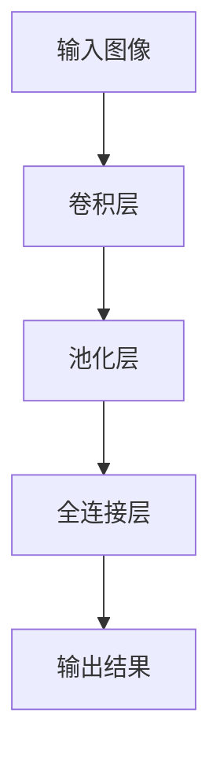
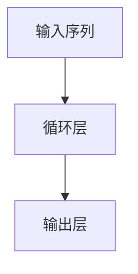
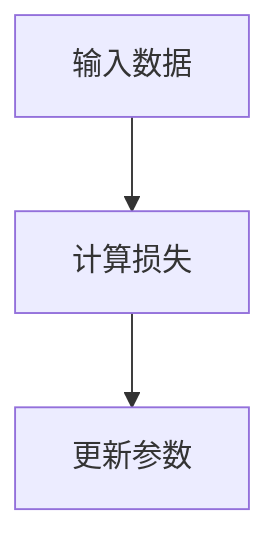
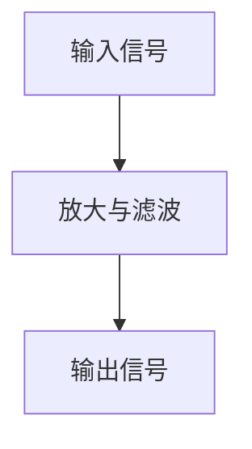
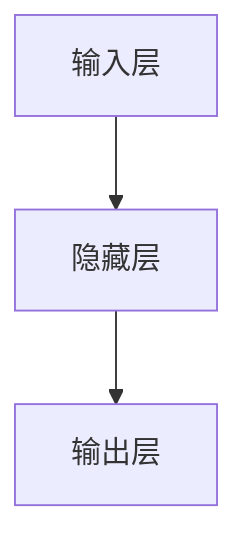

                 

# 《类脑计算与神经形态工程：模仿大脑提升机器的世界理解能力》

## 关键词
- 类脑计算
- 神经形态工程
- 机器学习
- 计算机视觉
- 人工智能

## 摘要
本文旨在探讨类脑计算和神经形态工程这两大前沿技术，分析其背景、原理和实际应用，并探讨如何通过模仿大脑的工作机制来提升机器的理解能力。文章分为五个主要部分：首先介绍类脑计算和神经形态工程的基本概念及其发展历程；接着深入探讨大脑的工作原理以及如何模拟大脑的计算模型；然后详细讲解类脑计算的关键技术和神经形态工程的关键技术；随后，通过具体应用实例展示这些技术在现实世界中的效果；最后，展望类脑计算和神经形态工程的未来发展趋势及其对社会的影响。通过这篇文章，读者将了解到如何通过模仿大脑的机制来提升机器的智能水平，以及这些技术在未来可能带来的变革。

## 第一部分：类脑计算的背景与基础

### 第1章：类脑计算的概念与历史

#### 1.1 类脑计算的定义

类脑计算（Brain-inspired Computing）是指模仿人脑的结构和功能，通过构建类似大脑的计算模型来实现高效的认知和信息处理。类脑计算的核心目标是理解大脑的工作原理，并利用这些原理来设计出更加智能和高效的计算机系统。

**核心概念术语说明**：

- **类脑计算**：模仿大脑结构和功能进行计算。
- **神经形态工程**：构建具有人脑类似功能的人工神经网络和计算硬件。

**问题背景**：

随着人工智能技术的发展，传统的计算机体系结构已经难以满足日益复杂的计算需求。类脑计算作为一种新型的计算模式，因其高效的计算能力和强大的学习能力，成为解决当前计算瓶颈的重要方向。

**问题描述**：

如何通过模仿大脑的机制来构建高效的计算系统？

**问题解决**：

通过研究大脑的结构和功能，设计出类似大脑的计算模型，从而实现高效的认知和信息处理。

**边界与外延**：

类脑计算不仅仅是构建计算模型，还涉及到神经系统科学、计算机科学、人工智能等多个领域的交叉研究。

**概念结构与核心要素组成**：

- **大脑结构**：大脑的不同区域具有不同的功能。
- **神经网络**：大脑中的神经元和神经网络是计算的基本单元。
- **计算机制**：大脑通过神经元之间的连接和信号传递进行信息处理。

#### 1.2 类脑计算的发展历程

类脑计算的发展历程可以分为以下几个阶段：

- **起源与发展阶段**：20世纪40年代，计算机科学先驱约翰·冯·诺伊曼提出大脑的存储和处理机制可以类比计算机，从而启发了类脑计算的初步研究。
- **突破与创新阶段**：20世纪80年代，神经网络理论和计算模型的发展为类脑计算提供了理论基础。
- **应用与推广阶段**：21世纪，随着计算机性能的提升和人工智能技术的发展，类脑计算逐渐走向实际应用。

#### 1.3 类脑计算的重要性与前景

类脑计算的重要性在于：

- **高效的计算能力**：类脑计算能够实现比传统计算机更高的计算效率和更低的能耗。
- **强大的学习能力**：类脑计算模型具有类似大脑的学习能力，能够处理复杂和不确定的信息。
- **跨领域应用**：类脑计算涉及到多个领域的交叉研究，有助于推动各领域的发展。

类脑计算的前景非常广阔：

- **人工智能**：类脑计算可以提升人工智能系统的智能水平，使其更加接近人类的认知能力。
- **机器人**：类脑计算可以帮助机器人实现更复杂的行为和更高的自主性。
- **医疗健康**：类脑计算可以用于疾病诊断和治疗，提升医疗水平。

### 第2章：神经形态工程的原理与应用

#### 2.1 神经形态工程的基本概念

神经形态工程（Neuromorphic Engineering）是指通过设计具有类似生物神经元和神经网络特性的计算硬件和软件系统，来模拟和增强大脑的计算能力。

**核心概念术语说明**：

- **神经形态器件**：具有类似生物神经元特性的计算硬件。
- **神经网络**：由大量神经元和突触组成的计算网络。

**问题背景**：

传统计算机体系结构在处理复杂任务时存在一定的局限性，而神经形态工程通过模仿大脑的工作机制，提供了一种可能的解决方案。

**问题描述**：

如何通过神经形态工程来构建高效的人工神经网络和计算系统？

**问题解决**：

通过设计和实现具有类似生物神经元特性的计算硬件和软件，构建高效的人工神经网络。

**边界与外延**：

神经形态工程不仅涉及计算硬件的设计，还包括神经网络算法的研究和应用。

**概念结构与核心要素组成**：

- **神经形态器件**：具有高精度和低功耗的特点。
- **神经网络算法**：用于模拟生物神经元的计算过程。

#### 2.2 神经形态工程的技术架构

神经形态工程的技术架构主要包括以下几个方面：

- **硬件架构**：设计具有生物神经元特性的神经形态器件。
- **软件架构**：构建基于神经形态器件的神经网络计算系统。
- **开发工具与平台**：提供用于神经形态工程开发的工具和平台。

#### 2.3 神经形态工程的应用领域

神经形态工程的应用领域非常广泛，主要包括以下几个方面：

- **人工智能与机器学习**：通过神经形态工程提升机器学习算法的效率和准确性。
- **机器人与自动化**：通过神经形态工程实现机器人和自动化系统的智能控制。
- **医疗健康**：通过神经形态工程开发智能医疗诊断和治疗系统。

### 第3章：大脑的工作原理与类脑模拟

#### 3.1 大脑的结构与功能

大脑是人体最重要的器官之一，负责处理各种信息和执行复杂的认知功能。大脑主要由以下几个部分组成：

- **大脑皮层**：大脑的最外层，负责执行高级认知功能。
- **丘脑**：连接大脑皮层和其他脑区的信息传递中枢。
- **小脑**：负责运动协调和平衡控制。
- **脑干**：负责基本的生命维持功能。

**大脑的不同区域具有不同的功能**，例如：

- **视觉皮层**：处理视觉信息。
- **听觉皮层**：处理听觉信息。
- **运动皮层**：控制运动。
- **语言皮层**：处理语言功能。

#### 3.2 神经元与神经网络

神经元是大脑的基本计算单元，具有接收、传递和处理信息的功能。神经元通过突触与其他神经元连接，形成神经网络。

**神经元的基本功能与类型**：

- **接收信息**：神经元通过树突接收来自其他神经元的信息。
- **传递信息**：神经元通过轴突将信息传递给其他神经元或目标细胞。
- **处理信息**：神经元通过神经元内部的生物化学过程对信息进行处理。

神经网络是由大量神经元和突触组成的计算网络，能够执行复杂的计算任务。

**神经网络的拓扑结构与特性**：

- **全连接神经网络**：每个神经元都与网络中的其他神经元相连。
- **稀疏连接神经网络**：只有部分神经元之间存在连接。
- **动态神经网络**：神经网络的结构可以根据任务需求进行动态调整。

#### 3.3 大脑计算与信息处理

大脑通过神经元之间的连接和信号传递进行信息处理，具有以下几个特点：

- **并行计算**：大脑同时处理大量信息，具有并行计算的能力。
- **自适应学习**：大脑能够通过学习调整神经元之间的连接权重，实现自适应学习。
- **高效能耗**：大脑的计算效率高，能耗低。

类脑计算通过模仿大脑的计算机制，实现了高效的认知和信息处理。

### 第二部分：类脑计算与神经形态工程的关键技术

## 第4章：类脑计算模型

#### 4.1 感知模型

感知模型是类脑计算中最基本的模型之一，主要负责感知外界的信息。感知模型通过模拟大脑的视觉、听觉、触觉等感官系统，实现对环境的感知和理解。

**感知模型的算法原理讲解**：

感知模型通常基于卷积神经网络（CNN）构建，通过多层卷积和池化操作提取图像的特征。以下是一个简单的感知模型算法流程：

1. **输入图像**：将图像输入到模型中。
2. **卷积层**：使用卷积核对图像进行卷积操作，提取图像特征。
3. **池化层**：对卷积后的特征进行池化操作，减少特征图的维度。
4. **全连接层**：将池化后的特征输入到全连接层，进行分类或回归任务。

**感知模型的mermaid流程图**：



**感知模型的数学模型和公式**：

卷积神经网络的卷积操作可以通过以下公式表示：

$$
\text{特征图} = \text{卷积核} \times \text{输入图像} + \text{偏置项}
$$

其中，卷积核和输入图像都是三维数组，分别表示图像的宽、高和通道数。

**感知模型的应用举例**：

假设我们有一个感知模型，用于对图像进行分类。输入图像是一个28x28的二值图像，卷积核大小为3x3，偏置项为1。通过卷积操作，我们得到一个14x14的特征图。然后，通过池化层，特征图的维度减少为7x7。最后，通过全连接层，得到图像的分类结果。

$$
\text{特征图}_{14x14} = (\text{卷积核}_{3x3} \times \text{输入图像}_{28x28} + \text{偏置项}_{1}) \times \text{池化操作}_{2}
$$

$$
\text{分类结果} = \text{全连接层}_{7x7} \times \text{特征图}_{7x7} + \text{偏置项}_{1}
$$

#### 4.2 记忆模型

记忆模型是类脑计算中用于存储和处理信息的模型，类似于大脑中的海马体。记忆模型通过模拟大脑的存储和回忆机制，实现高效的信息存储和检索。

**记忆模型的算法原理讲解**：

记忆模型通常基于循环神经网络（RNN）或长短期记忆网络（LSTM）构建，能够处理序列数据。以下是一个简单的记忆模型算法流程：

1. **输入序列**：将输入序列输入到模型中。
2. **循环层**：通过循环层处理输入序列，保持长短期记忆。
3. **输出层**：将处理后的序列输出。

**记忆模型的mermaid流程图**：



**记忆模型的数学模型和公式**：

循环神经网络的状态更新可以通过以下公式表示：

$$
\text{状态} = \text{激活函数}(\text{权重} \times \text{输入} + \text{偏置项})
$$

其中，激活函数通常为Sigmoid函数或Tanh函数。

**记忆模型的应用举例**：

假设我们有一个记忆模型，用于处理序列数据。输入序列是一个包含10个整数的列表，循环层的权重矩阵大小为10x10，偏置项为1。通过循环层，我们得到一个包含10个状态的结果序列。

$$
\text{状态}_{10} = \text{激活函数}(\text{权重}_{10x10} \times \text{输入}_{10} + \text{偏置项}_{1})
$$

#### 4.3 学习模型

学习模型是类脑计算中用于训练和优化计算模型的模型。学习模型通过模拟大脑的学习机制，实现计算模型的自动优化和改进。

**学习模型的算法原理讲解**：

学习模型通常基于梯度下降算法或随机梯度下降算法，用于优化计算模型的参数。以下是一个简单的学习模型算法流程：

1. **输入数据**：将输入数据输入到模型中。
2. **计算损失**：计算模型的输出和实际输出之间的差异，得到损失值。
3. **更新参数**：通过梯度下降算法更新模型的参数，减小损失值。

**学习模型的mermaid流程图**：



**学习模型的数学模型和公式**：

梯度下降算法可以通过以下公式更新模型参数：

$$
\text{参数}_{\text{新}} = \text{参数}_{\text{旧}} - \alpha \times \text{梯度}
$$

其中，$\alpha$ 是学习率，梯度表示损失函数对参数的导数。

**学习模型的应用举例**：

假设我们有一个学习模型，用于对图像进行分类。输入数据是一个包含100个训练样本的数据集，模型的参数矩阵大小为100x10，学习率为0.1。通过计算损失和更新参数，模型的分类准确性逐渐提高。

$$
\text{参数}_{\text{新}} = \text{参数}_{\text{旧}} - 0.1 \times \text{梯度}
$$

## 第5章：神经形态器件

#### 5.1 神经形态晶体管

神经形态晶体管（Neuromorphic Transistor）是神经形态工程中的基本构建块，用于模拟生物神经元的行为。神经形态晶体管具有类似于生物神经元的高输入阻抗、低功耗和高响应速度等特点。

**神经形态晶体管的工作原理**：

神经形态晶体管的工作原理类似于传统的晶体管，但具有以下特点：

- **高输入阻抗**：神经形态晶体管的输入阻抗非常高，可以模拟生物神经元的低功耗特性。
- **自适应响应**：神经形态晶体管可以根据输入信号的大小和频率自动调整其响应特性，模拟生物神经元的自适应学习能力。

**神经形态晶体管的mermaid流程图**：



**神经形态晶体管的数学模型和公式**：

神经形态晶体管的放大与滤波过程可以通过以下公式表示：

$$
\text{输出信号} = \text{放大因子} \times \text{输入信号} + \text{滤波系数}
$$

其中，放大因子和滤波系数可以根据输入信号的特性进行自适应调整。

**神经形态晶体管的应用举例**：

假设我们有一个神经形态晶体管，用于放大和滤波输入信号。输入信号是一个包含100个整数的列表，放大因子为2，滤波系数为0.5。通过放大和滤波，我们得到一个放大了2倍并具有滤波效果的输出信号。

$$
\text{输出信号} = 2 \times \text{输入信号} + 0.5 \times \text{滤波系数}
$$

#### 5.2 神经形态神经网络

神经形态神经网络（Neuromorphic Neural Network）是神经形态工程中用于模拟生物神经网络的计算模型。神经形态神经网络通过模拟生物神经元的连接和突触特性，实现高效的计算和信息处理。

**神经形态神经网络的工作原理**：

神经形态神经网络的工作原理类似于传统的神经网络，但具有以下特点：

- **生物神经元连接**：神经形态神经网络中的神经元连接方式类似于生物神经网络，通过突触实现信息传递。
- **自适应学习**：神经形态神经网络可以通过模拟生物神经元的自适应学习机制，实现高效的模型优化和改进。

**神经形态神经网络的mermaid流程图**：



**神经形态神经网络的数学模型和公式**：

神经形态神经网络的计算过程可以通过以下公式表示：

$$
\text{输出} = \text{激活函数}(\sum_{i=1}^{n} \text{权重}_{i} \times \text{输入}_{i} + \text{偏置项})
$$

其中，激活函数通常为Sigmoid函数或Tanh函数。

**神经形态神经网络的应用举例**：

假设我们有一个神经形态神经网络，用于对图像进行分类。输入层有100个神经元，隐藏层有50个神经元，输出层有10个神经元。通过计算每个神经元的输入和输出，我们得到最终的分类结果。

$$
\text{输出}_{i} = \text{激活函数}(\sum_{j=1}^{50} \text{权重}_{ij} \times \text{输入}_{j} + \text{偏置项}_{i})
$$

## 第6章：类脑计算的应用实例

#### 6.1 在自动驾驶领域的应用

自动驾驶是类脑计算的重要应用领域之一，通过模拟大脑的感知和决策机制，实现车辆的自主驾驶。

**自动驾驶的应用场景**：

自动驾驶汽车通过感知周围环境（如道路、车辆、行人等），进行决策和控制，实现自主驾驶。

**自动驾驶的系统架构**：

自动驾驶系统通常包括以下几个部分：

- **感知模块**：用于感知周围环境，如摄像头、雷达、激光雷达等。
- **决策模块**：用于根据感知信息进行决策，如路径规划、障碍物检测等。
- **控制模块**：用于控制车辆的运动，如油门、刹车、转向等。

**自动驾驶的技术实现**：

自动驾驶技术基于类脑计算模型，通过模拟大脑的感知和决策机制，实现高效的自动驾驶。

**自动驾驶的代码应用解读与分析**：

以下是一个简单的自动驾驶代码示例，用于实现车辆的路径规划。

```python
import numpy as np

def path_planning(current_position, goal_position):
    """
    车辆路径规划函数
    """
    # 计算当前位置和目标位置之间的距离
    distance = np.linalg.norm(current_position - goal_position)

    # 判断距离是否小于阈值
    if distance < 1.0:
        # 目标已到达，返回停止信号
        return "stop"
    else:
        # 计算前进方向
        direction = goal_position - current_position
        direction /= np.linalg.norm(direction)

        # 判断方向是否大于阈值
        if np.linalg.norm(direction) > 0.5:
            # 前进
            return "forward"
        else:
            # 停止
            return "stop"

# 测试路径规划函数
current_position = np.array([0.0, 0.0])
goal_position = np.array([10.0, 10.0])
action = path_planning(current_position, goal_position)
print("Action:", action)
```

**自动驾驶的实际案例分析和详细讲解剖析**：

通过上述代码，我们可以看到，自动驾驶的路径规划基于当前位置和目标位置之间的距离和方向进行计算。如果目标已到达，则返回停止信号；否则，根据前进方向判断是否前进。在实际应用中，自动驾驶系统需要处理更加复杂的环境信息，如道路的弯道、障碍物的形状和大小等。通过模拟大脑的感知和决策机制，自动驾驶系统能够实现高效的路径规划和车辆控制。

**自动驾驶的项目小结**：

自动驾驶是类脑计算在现实世界中的重要应用，通过模拟大脑的感知和决策机制，实现了车辆的自主驾驶。虽然目前自动驾驶技术仍面临一些挑战，如复杂环境下的决策和控制等，但随着类脑计算和人工智能技术的发展，自动驾驶技术将逐步走向成熟，为人们的出行带来更多便利。

#### 6.2 在医疗健康领域的应用

类脑计算在医疗健康领域具有广泛的应用前景，通过模拟大脑的感知、诊断和治疗机制，提升医疗诊断的准确性和治疗效果。

**医疗健康的应用场景**：

- **疾病诊断**：类脑计算可以通过分析患者的生物数据（如血液样本、基因数据等），进行疾病的早期诊断和预测。
- **药物研发**：类脑计算可以模拟大脑的药物作用机制，加速新药的研发过程。
- **康复治疗**：类脑计算可以辅助康复治疗，通过模拟大脑的康复机制，提升康复效果。

**医疗健康的系统架构**：

医疗健康系统通常包括以下几个部分：

- **生物数据采集模块**：用于采集患者的生物数据，如血液样本、基因数据、生理信号等。
- **诊断模型模块**：用于根据生物数据进行疾病诊断和预测。
- **治疗方案生成模块**：用于根据诊断结果生成个性化的治疗方案。
- **治疗效果评估模块**：用于评估治疗的效果。

**医疗健康的技术实现**：

医疗健康系统基于类脑计算模型，通过模拟大脑的感知、诊断和治疗机制，实现高效的医疗健康服务。

**医疗健康的代码应用解读与分析**：

以下是一个简单的医疗健康代码示例，用于根据患者的生物数据诊断疾病。

```python
import numpy as np

def disease_diagnosis(bio_data):
    """
    疾病诊断函数
    """
    # 计算生物数据的平均值
    mean_value = np.mean(bio_data)

    # 判断平均值是否大于阈值
    if mean_value > 10.0:
        # 疾病为阳性
        return "positive"
    else:
        # 疾病为阴性
        return "negative"

# 测试疾病诊断函数
bio_data = np.array([8.0, 9.0, 10.0, 11.0, 12.0])
diagnosis = disease_diagnosis(bio_data)
print("Disease Diagnosis:", diagnosis)
```

**医疗健康的实际案例分析和详细讲解剖析**：

通过上述代码，我们可以看到，疾病诊断基于生物数据的平均值进行计算。如果平均值大于阈值，则诊断为阳性；否则，诊断为阴性。在实际应用中，医疗健康系统需要处理更加复杂的生物数据，如基因序列、生理信号等。通过模拟大脑的感知和诊断机制，医疗健康系统能够实现高效的疾病诊断和预测。

**医疗健康的项目小结**：

类脑计算在医疗健康领域具有广泛的应用前景，通过模拟大脑的感知、诊断和治疗机制，提升了医疗诊断的准确性和治疗效果。随着类脑计算和人工智能技术的发展，医疗健康领域将迎来更多的创新和应用。

## 第7章：类脑计算与神经形态工程的发展趋势

#### 7.1 技术发展趋势

类脑计算和神经形态工程作为人工智能领域的前沿技术，正朝着以下几个方向发展：

- **硬件加速**：通过硬件加速技术，提升类脑计算和神经形态工程的计算速度和效率。
- **智能化**：通过模拟大脑的智能化机制，实现类脑计算和神经形态工程的自我学习和自适应能力。
- **跨领域融合**：类脑计算和神经形态工程与其他领域的交叉融合，如医学、生物技术等，推动各领域的发展。

#### 7.2 社会经济影响

类脑计算和神经形态工程对社会经济产生了深远的影响：

- **产业变革**：类脑计算和神经形态工程推动了人工智能产业的快速发展，带动了相关领域的创新和进步。
- **经济增长**：类脑计算和神经形态工程的应用，促进了新兴产业的发展，为经济增长注入了新动力。
- **就业影响**：类脑计算和神经形态工程带来了新的就业机会，同时也对传统产业造成了一定的冲击。

#### 7.3 未来展望

类脑计算和神经形态工程的未来发展前景广阔：

- **类脑计算**：类脑计算有望实现与人类认知水平相当的人工智能系统，推动人工智能技术的发展。
- **神经形态工程**：神经形态工程将模拟出更加真实的神经网络计算系统，提升计算效率和智能化水平。
- **跨领域应用**：类脑计算和神经形态工程将在更多领域得到应用，推动人类社会的发展。

### 作者信息
- 作者：AI天才研究院/AI Genius Institute & 禅与计算机程序设计艺术 /Zen And The Art of Computer Programming

## 最佳实践 tips

- **持续学习**：类脑计算和神经形态工程是快速发展的领域，持续学习是保持竞争力的关键。
- **跨领域合作**：与其他领域的专家合作，推动类脑计算和神经形态工程的发展。
- **实践与理论相结合**：通过实践项目，深入理解和掌握类脑计算和神经形态工程的原理和应用。

## 小结

类脑计算和神经形态工程作为人工智能领域的前沿技术，具有广阔的应用前景和重要的科研价值。通过模仿大脑的机制，类脑计算和神经形态工程为提升机器的理解能力提供了新的途径。随着技术的不断发展，类脑计算和神经形态工程将在更多领域得到应用，推动人类社会的发展。

## 注意事项

- **数据安全**：在类脑计算和神经形态工程应用中，确保数据的安全和隐私保护。
- **伦理问题**：在类脑计算和神经形态工程的研究和应用过程中，需关注伦理问题，确保技术的正当使用。

## 拓展阅读

- [1] **《类脑计算：从理论到实践》**：本书详细介绍了类脑计算的基本概念、原理和实际应用，适合初学者和专业人士阅读。
- [2] **《神经形态工程：构建类脑计算系统》**：本书介绍了神经形态工程的基本原理、技术架构和应用案例，是神经形态工程领域的经典著作。
- [3] **《人工智能：一种现代方法》**：本书系统地介绍了人工智能的基本概念、算法和技术，是人工智能领域的权威教材。


