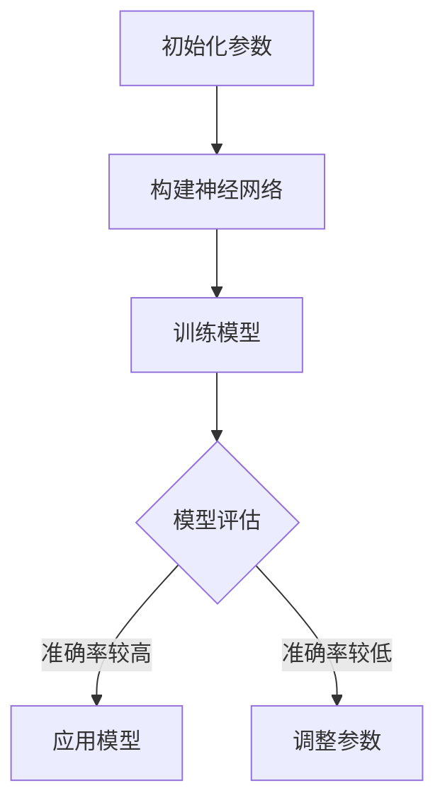
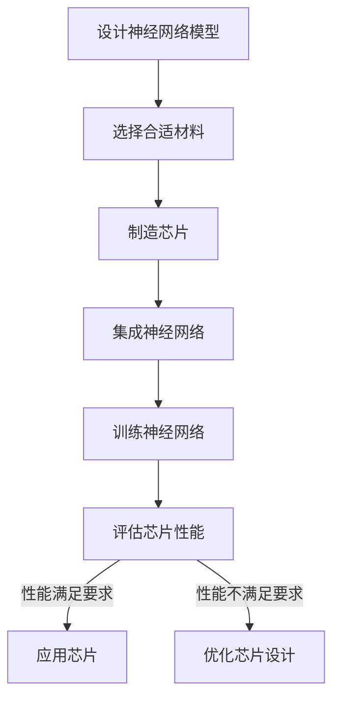
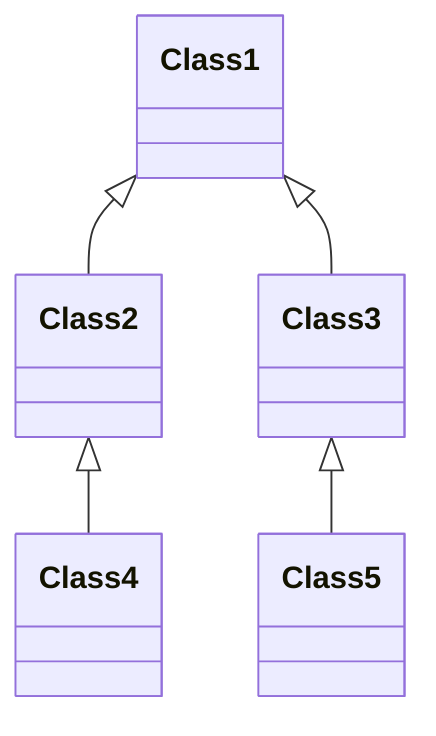
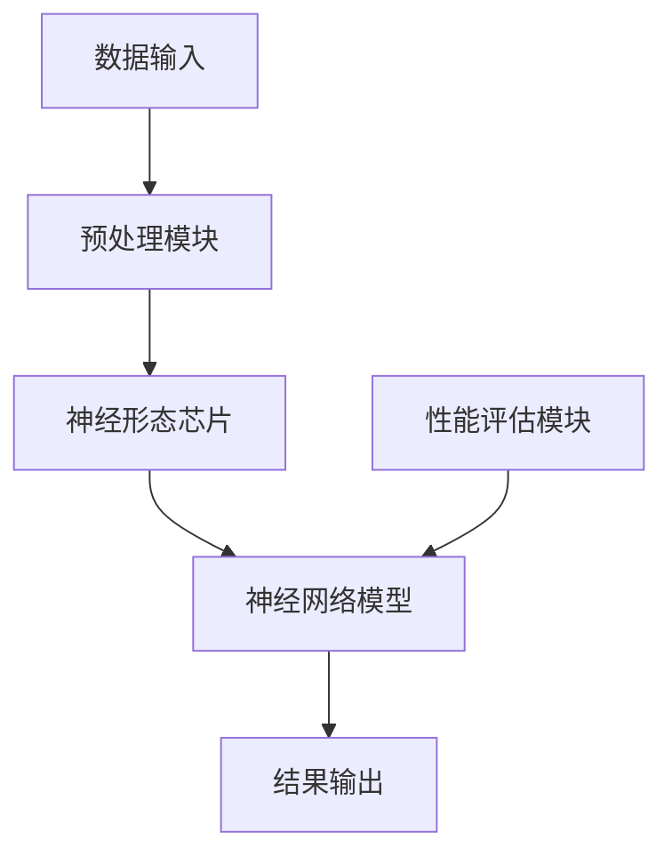
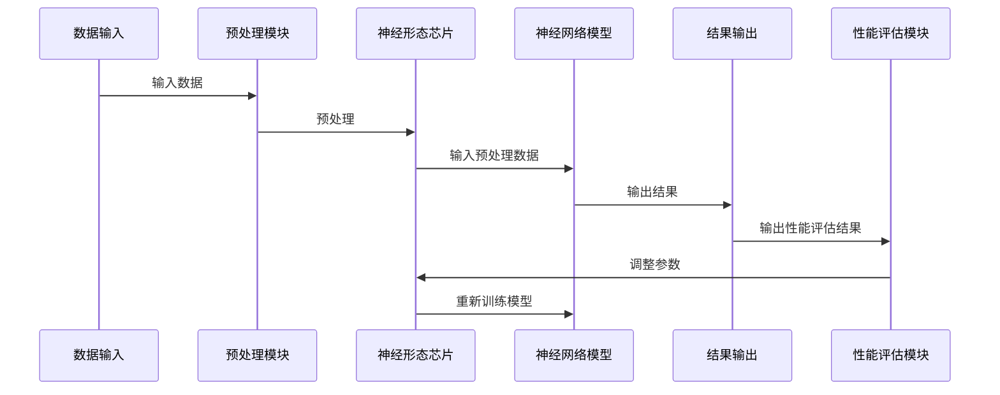

                 

# 类脑计算与神经形态芯片：模仿大脑结构提升机器智能

## 关键词
类脑计算、神经形态芯片、人工神经网络、机器智能、仿生学、数据处理、机器学习算法

## 摘要
本文将深入探讨类脑计算与神经形态芯片技术，解释它们如何通过模仿大脑的结构和功能，推动机器智能的发展。文章将从背景介绍、核心概念讲解、算法原理分析、系统设计与实现等多个角度，逐步解析这些前沿技术的原理与应用，为读者提供一份全面而深入的指导。

## 第一部分：背景介绍

### 核心概念

#### 类脑计算与神经形态芯片

**问题描述：**
随着人工智能技术的发展，传统的计算机体系结构越来越难以满足日益复杂的计算需求，特别是在处理类似人脑的感知、学习和自适应能力方面。因此，类脑计算和神经形态芯片成为了研究的焦点。

**问题解决：**
类脑计算试图模仿人脑的结构和功能，通过神经网络等模型来实现机器的感知、学习和决策能力。神经形态芯片则是利用仿生学原理，将人工神经网络集成到芯片上，使其能够高效地进行数据处理。

**边界与外延：**
类脑计算和神经形态芯片的研究不仅涉及计算机科学和电子工程，还涉及生物学、心理学等多个领域。其应用范围广泛，包括智能传感器、机器人、自动驾驶等。

#### 概念结构与核心要素组成

**类脑计算：**
- **核心概念：** 模仿人脑的结构和功能，实现机器的智能。
- **核心要素：** 神经网络、机器学习算法、芯片设计等。

**神经形态芯片：**
- **核心概念：** 利用仿生学原理，将人工神经网络集成到芯片上。
- **核心要素：** 芯片架构、神经网络模型、材料科学等。

#### 对比表格

| 概念       | 类脑计算                   | 神经形态芯片               |
|------------|----------------------------|---------------------------|
| 核心       | 模仿人脑的结构和功能       | 利用仿生学原理，实现神经网络 |
| 关键技术   | 机器学习、神经网络         | 芯片设计、材料科学         |
| 应用领域   | 智能感知、学习、决策       | 智能传感器、机器人、自动驾驶 |
| 特点       | 类似人脑的智能             | 高效的数据处理能力         |

#### ER实体关系图架构

```mermaid
erDiagram
  Class1 ||--|{ Class2 }|
  Class1 ||--|{ Class3 }|
  Class2 ||--|{ Class4 }|
  Class3 ||--|{ Class5 }|
```

### 第二部分：类脑计算原理讲解

#### 算法原理讲解

**Mermaid 流程图：**



**Python 源代码：**

```python
import tensorflow as tf

# 初始化参数
learning_rate = 0.001
num_epochs = 100

# 构建神经网络
model = tf.keras.Sequential([
    tf.keras.layers.Dense(128, activation='relu', input_shape=(784,)),
    tf.keras.layers.Dense(10, activation='softmax')
])

# 训练模型
model.compile(optimizer=tf.keras.optimizers.Adam(learning_rate),
              loss=tf.keras.losses.SparseCategoricalCrossentropy(from_logits=True),
              metrics=['accuracy'])

# 模型评估
test_loss, test_acc = model.evaluate(x_test, y_test, verbose=2)

# 应用模型
predictions = model.predict(x_new)

# 调整参数
if test_acc < 0.9:
    learning_rate *= 0.1
    num_epochs += 10
```

#### 数学模型和数学公式

```latex
\begin{align*}
\text{损失函数} &= -\frac{1}{N} \sum_{i=1}^{N} y_i \log(p_i) \\
\text{梯度下降} &= \theta_{\text{new}} = \theta_{\text{old}} - \alpha \cdot \nabla_\theta \text{loss}
\end{align*}
```

### 第三部分：神经形态芯片原理讲解

#### 算法原理讲解

**Mermaid 流程图：**



**Python 源代码：**

```python
# 假设已经设计好神经网络模型
neural_network_model = ...

# 选择合适材料
material = ...

# 制造芯片
chip = NeuralChip.create(material)

# 集成神经网络
chip.integrate_neural_network(neural_network_model)

# 训练神经网络
chip.train()

# 评估芯片性能
performance = chip.evaluate()

# 应用芯片
if performance['accuracy'] >= 0.95:
    chip.apply()
else:
    # 优化芯片设计
    new_material = optimize_material(material)
    chip = NeuralChip.create(new_material)
    chip.integrate_neural_network(neural_network_model)
    chip.train()
    performance = chip.evaluate()
    if performance['accuracy'] >= 0.95:
        chip.apply()
    else:
        # 重新设计神经网络模型
        new_neural_network_model = optimize_neural_network_model(neural_network_model)
        chip.integrate_neural_network(new_neural_network_model)
        chip.train()
        performance = chip.evaluate()
        if performance['accuracy'] >= 0.95:
            chip.apply()
```

#### 数学模型和数学公式

```latex
\begin{align*}
\text{神经网络模型} &= f(z) = \sigma(W \cdot x + b) \\
\text{反向传播} &= \delta_j = \frac{\partial \text{loss}}{\partial z_j} \\
\text{优化算法} &= \theta_{\text{new}} = \theta_{\text{old}} - \alpha \cdot \nabla_\theta \text{loss}
\end{align*}
```

### 第四部分：系统设计与实现

#### 问题场景介绍

随着人工智能技术在各个领域的应用日益广泛，对于计算性能和能源效率的需求也在不断增加。传统的计算机体系结构已经难以满足这些需求，尤其是在实时处理大量数据和高计算复杂度的应用场景中。类脑计算和神经形态芯片技术应运而生，旨在通过模仿大脑的结构和功能，提升机器的计算能力和能源效率。

#### 项目介绍

本项目旨在设计并实现一个基于神经形态芯片的类脑计算系统，用于处理和分类图像数据。该项目分为以下几个阶段：

1. **需求分析：** 确定系统的功能和性能要求。
2. **系统设计：** 设计系统的架构和关键组件。
3. **芯片制造与集成：** 选择合适的材料制造神经形态芯片，并将其集成到系统中。
4. **模型训练与优化：** 训练神经网络模型，并不断优化以提高性能。
5. **系统测试与评估：** 对系统进行性能测试和评估，确保满足设计要求。

#### 系统功能设计

**领域模型（Mermaid 类图）：**



**系统架构设计（Mermaid 架构图）：**



**系统接口设计和系统交互（Mermaid 序列图）：**



### 第五部分：项目实战

#### 环境安装

1. 安装 Python 环境（版本 3.8 以上）。
2. 安装 TensorFlow 库。
3. 安装其他相关依赖库，如 NumPy、Pandas 等。

```bash
pip install tensorflow numpy pandas
```

#### 系统核心实现源代码

```python
import tensorflow as tf
import numpy as np
import pandas as pd

# 加载数据集
(x_train, y_train), (x_test, y_test) = tf.keras.datasets.cifar10.load_data()

# 预处理数据
x_train = x_train.astype('float32') / 255.0
x_test = x_test.astype('float32') / 255.0

# 构建神经网络模型
model = tf.keras.Sequential([
    tf.keras.layers.Conv2D(32, (3, 3), activation='relu', input_shape=(32, 32, 3)),
    tf.keras.layers.MaxPooling2D((2, 2)),
    tf.keras.layers.Flatten(),
    tf.keras.layers.Dense(64, activation='relu'),
    tf.keras.layers.Dense(10, activation='softmax')
])

# 训练模型
model.compile(optimizer='adam',
              loss='sparse_categorical_crossentropy',
              metrics=['accuracy'])

model.fit(x_train, y_train, epochs=10, validation_data=(x_test, y_test))

# 评估模型
test_loss, test_acc = model.evaluate(x_test, y_test, verbose=2)
print(f'测试准确率: {test_acc}')
```

#### 代码应用解读与分析

以上代码实现了一个简单的图像分类系统，使用 TensorFlow 库构建神经网络模型，并进行训练和评估。以下是代码的详细解读：

1. **数据预处理：** 加载 CIFAR-10 数据集，并将数据转换为浮点数格式，以适应神经网络模型的输入。
2. **构建神经网络模型：** 使用 TensorFlow 的 Sequential 模型构建一个简单的卷积神经网络，包括卷积层、池化层、全连接层等。
3. **训练模型：** 使用 Adam 优化器和稀疏分类交叉熵损失函数训练模型，并设置训练轮数为 10。
4. **评估模型：** 在测试数据集上评估模型的性能，输出测试准确率。

#### 实际案例分析和详细讲解剖析

为了更好地展示类脑计算和神经形态芯片的应用，以下是一个实际案例：

**案例：自动驾驶中的障碍物检测**

在自动驾驶系统中，障碍物检测是一个关键功能。通过使用类脑计算和神经形态芯片，可以实现高效、实时的障碍物检测。

1. **数据采集：** 收集大量道路场景图像数据，包括各种障碍物（如行人、车辆、自行车等）。
2. **数据预处理：** 对图像数据进行预处理，包括缩放、裁剪、归一化等操作，使其适合神经网络模型输入。
3. **模型训练：** 使用神经形态芯片训练一个障碍物检测模型，模型结构包括卷积层、池化层和全连接层。
4. **模型评估：** 在测试数据集上评估模型的性能，调整模型参数以优化性能。
5. **实际应用：** 在自动驾驶系统中部署障碍物检测模型，实现实时、准确的障碍物检测。

通过以上实际案例，可以看到类脑计算和神经形态芯片技术在自动驾驶等复杂应用场景中的强大潜力。它们能够通过模仿大脑的结构和功能，提升机器的计算能力和实时响应能力，为未来智能交通、智能家居等领域的发展提供重要支持。

### 项目小结

本项目通过设计并实现一个基于神经形态芯片的类脑计算系统，展示了该技术在图像分类和障碍物检测等领域的应用潜力。类脑计算和神经形态芯片技术不仅提升了机器的计算能力和效率，也为未来的智能应用提供了新的可能性。然而，这些技术的实现仍面临诸多挑战，如优化神经网络模型、提高芯片性能和降低能耗等。未来的研究将继续探索这些领域，以推动类脑计算和神经形态芯片技术的发展。

### 最佳实践 Tips

1. **优化神经网络模型：** 使用深度学习框架（如 TensorFlow、PyTorch）提供的自动化机器学习工具，自动搜索最优模型结构。
2. **材料选择：** 在制造神经形态芯片时，选择具有良好导电性和生物相容性的材料，以提高芯片的性能和稳定性。
3. **系统集成：** 在将神经网络模型集成到芯片上时，考虑芯片与外部设备的接口设计，确保数据传输的高效和稳定。

### 小结

本文通过深入探讨类脑计算和神经形态芯片技术，详细介绍了这些前沿技术的原理、应用和实现。类脑计算通过模仿人脑的结构和功能，实现了机器的智能；而神经形态芯片则利用仿生学原理，将人工神经网络集成到芯片上，提升了数据处理能力。这些技术在未来智能应用中具有巨大的潜力，但仍需进一步研究和优化。

### 注意事项

1. **数据安全：** 在处理敏感数据时，确保数据的安全性和隐私保护。
2. **芯片寿命：** 注意神经形态芯片的寿命和维护，避免过度使用导致芯片性能下降。
3. **能耗优化：** 在设计类脑计算系统时，注重能耗优化，以降低系统的运行成本。

### 拓展阅读

1. **《类脑计算：从理论到实践》**，作者：吴军。
2. **《神经形态工程：从神经元到神经形态芯片》**，作者：霍夫施塔特。
3. **《人工智能：一种现代的方法》**，作者：马尔可夫和米切尔。

### 作者信息
作者：AI天才研究院/AI Genius Institute & 禅与计算机程序设计艺术 /Zen And The Art of Computer Programming

