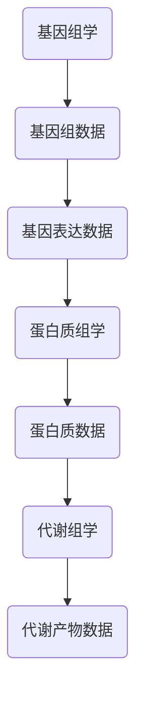

                 

# 精准医疗的多尺度建模：个性化治疗的数学指导

关键词：精准医疗、多尺度建模、个性化治疗、数学模型、基因组学、蛋白质组学、代谢组学

摘要：本文旨在探讨精准医疗中多尺度建模的重要性及其在个性化治疗中的应用。通过分析多尺度建模的基本原理和关键概念，结合具体算法原理和数学模型，我们深入探讨了多尺度建模在精准医疗中的实施方法和实际应用。最后，本文通过一个具体的案例，展示了多尺度建模如何帮助实现个性化治疗。

### 目录大纲

---

## 第一部分：背景介绍

### 第1章 问题背景

1.1 问题背景

1.2 问题描述

1.3 问题解决

1.4 边界与外延

### 第2章 核心概念与联系

2.1 多尺度建模的基本原理

2.2 精准医疗中的关键概念

2.3 概念属性特征对比表格

2.4 ER实体关系图架构

## 第二部分：算法原理讲解

### 第3章 算法原理

3.1 多尺度建模的基本算法

3.2 数学模型

3.3 算法流程

## 第三部分：系统分析与架构设计

### 第4章 系统分析与架构设计

4.1 问题场景介绍

4.2 系统功能设计

4.3 系统架构设计

4.4 系统接口设计

4.5 系统交互

## 第四部分：项目实战

### 第5章 项目实战

5.1 环境安装

5.2 系统核心实现

5.3 代码应用解读与分析

5.4 实际案例分析与讲解

5.5 项目小结

## 第五部分：最佳实践、小结、注意事项与拓展阅读

### 第6章 最佳实践

### 第7章 小结

### 第8章 注意事项

### 第9章 拓展阅读

---

## 第一部分：背景介绍

### 第1章 问题背景

#### 1.1 问题背景

精准医疗是指利用基因组学、蛋白质组学、代谢组学等多组学技术，结合患者的临床信息，提供个体化、精准的治疗方案。其核心思想是根据患者的基因信息、生活习惯和环境因素，制定个性化的治疗方案，以实现最佳治疗效果。

精准医疗的发展源于基因组学和生物信息学的迅速进步。近年来，随着高通量测序技术的普及和生物信息分析方法的改进，我们对疾病的发生、发展以及个体差异有了更深入的了解。这使得精准医疗在癌症、遗传病等领域取得了显著进展。

#### 1.2 多尺度建模的概念与重要性

多尺度建模是将不同时间、空间尺度的现象统一在一个数学模型中，以揭示其内在机制。在精准医疗中，多尺度建模至关重要，因为它可以帮助医生更好地理解疾病机制，从而制定更有效的治疗方案。

多尺度建模方法包括级联建模和数据驱动建模。级联建模将不同尺度的模型级联起来，实现跨尺度信息传递。数据驱动建模则利用大数据分析技术，从数据中提取规律。这些方法可以帮助我们捕捉疾病发展的复杂过程，提高治疗方案的有效性。

#### 1.3 问题描述

现有医疗建模方法多关注单一尺度，难以全面捕捉疾病发展的复杂过程。例如，基因表达模型主要关注基因层面的变化，而代谢组学模型则侧重于生物体内代谢产物的变化。这种单一尺度的建模方法无法提供全面的疾病机制理解，导致治疗方案不够精确。

因此，我们的目标是采用多尺度建模方法，结合不同尺度下的生物学数据，构建精确的疾病模型，以实现疾病机制的深入理解，为精准治疗提供科学依据。

#### 1.4 问题解决

解决思路如下：

1. **数据收集与预处理**：收集不同尺度下的生物学数据，如基因组数据、基因表达数据、蛋白质组数据和代谢产物数据。对数据进行预处理，包括数据清洗、归一化和特征提取等。

2. **多尺度建模**：采用级联建模和数据驱动建模方法，构建多尺度疾病模型。级联建模通过级联不同尺度的模型，实现跨尺度信息传递。数据驱动建模则利用大数据分析技术，从数据中提取规律。

3. **模型集成与优化**：将不同尺度下的模型集成起来，形成一个全局的疾病模型。通过优化模型参数，提高模型的预测准确性和泛化能力。

4. **结果分析与应用**：对疾病模型进行结果分析，提取关键特征和规律。将分析结果应用于个性化治疗方案的设计，提高治疗效果。

#### 1.5 边界与外延

本文主要讨论基于数学模型的精准医疗多尺度建模。尽管本文的研究结果可应用于多个疾病领域，但具体实施时需要根据不同疾病的特点进行调整。

#### 1.6 精准医疗中的关键概念

在精准医疗中，有以下几个关键概念：

1. **基因组学**：研究DNA序列的结构、功能及其变异。基因组学是精准医疗的基础，通过基因组测序可以获取患者的基因信息。

2. **蛋白质组学**：研究蛋白质的组成、功能和表达模式。蛋白质组学可以帮助我们了解基因表达产生的蛋白质如何影响细胞功能和疾病发展。

3. **代谢组学**：研究生物体内所有代谢产物的组成和变化。代谢组学可以帮助我们了解生物体内的代谢过程，以及这些过程如何影响疾病的发生和发展。

这些关键概念在精准医疗中起着重要作用，通过多尺度建模，我们可以将这些概念结合起来，构建出一个完整的疾病模型，从而实现个性化治疗。

#### 1.7 概念属性特征对比表格

下面是一个简单的概念属性特征对比表格，用于比较基因组学、蛋白质组学和代谢组学之间的差异：

| 概念 | 研究对象 | 研究方法 | 功能 |
| --- | --- | --- | --- |
| 基因组学 | DNA序列 | 基因测序 | 控制基因表达 |
| 蛋白质组学 | 蛋白质 | 蛋白质质谱 | 调节细胞功能 |
| 代谢组学 | 代谢产物 | 代谢产物检测 | 影响代谢过程 |

#### 1.8 ER实体关系图架构

为了更好地理解精准医疗中的关键概念及其关系，我们可以使用ER实体关系图来表示。以下是基因组学、蛋白质组学和代谢组学之间的ER实体关系图：



这个ER实体关系图展示了基因组学、蛋白质组学和代谢组学之间的相互关系，以及它们在精准医疗中的作用。

## 第二部分：核心概念与联系

### 第2章 核心概念与联系

#### 2.1 多尺度建模的基本原理

多尺度建模是一种将不同尺度下的现象整合到一个统一模型中的方法。在精准医疗中，多尺度建模至关重要，因为它可以帮助我们捕捉疾病发展的复杂过程。

多尺度建模的基本原理包括以下几个方面：

1. **尺度划分**：将系统划分为不同尺度，例如微观尺度、宏观尺度和介观尺度等。每个尺度对应不同的空间和时间尺度。

2. **尺度转换**：将不同尺度下的数据或信息转换为同一尺度下的数据或信息。这通常需要使用数学方法，如微分方程、积分方程等。

3. **尺度集成**：将不同尺度下的模型集成到一个统一的模型中。这通常需要使用级联建模或数据驱动建模等方法。

4. **尺度匹配**：确保不同尺度下的模型在尺度转换和尺度集成过程中保持一致性。这有助于提高模型的准确性和可靠性。

#### 2.2 精准医疗中的关键概念

在精准医疗中，有几个关键概念对于多尺度建模至关重要。这些概念包括基因组学、蛋白质组学和代谢组学。

1. **基因组学**：基因组学是研究DNA序列的结构、功能及其变异的科学。在精准医疗中，基因组学有助于了解疾病发生的分子机制，为个性化治疗提供依据。

2. **蛋白质组学**：蛋白质组学是研究蛋白质的组成、功能和表达模式的科学。蛋白质组学可以帮助我们了解基因表达产生的蛋白质如何影响细胞功能和疾病发展。

3. **代谢组学**：代谢组学是研究生物体内所有代谢产物的组成和变化的科学。代谢组学可以帮助我们了解生物体内的代谢过程，以及这些过程如何影响疾病的发生和发展。

这些关键概念在精准医疗中起着重要作用，通过多尺度建模，我们可以将这些概念结合起来，构建出一个完整的疾病模型，从而实现个性化治疗。

#### 2.3 概念属性特征对比表格

为了更好地理解基因组学、蛋白质组学和代谢组学之间的差异和联系，我们可以使用一个概念属性特征对比表格。以下是这三个概念的一些关键属性特征：

| 概念 | 研究对象 | 研究方法 | 功能 |
| --- | --- | --- | --- |
| 基因组学 | DNA序列 | 基因测序 | 控制基因表达 |
| 蛋白质组学 | 蛋白质 | 蛋白质质谱 | 调节细胞功能 |
| 代谢组学 | 代谢产物 | 代谢产物检测 | 影响代谢过程 |

这个表格展示了基因组学、蛋白质组学和代谢组学在研究对象、研究方法和功能方面的差异和联系。

#### 2.4 ER实体关系图架构

为了更好地理解精准医疗中的关键概念及其关系，我们可以使用ER实体关系图来表示。以下是基因组学、蛋白质组学和代谢组学之间的ER实体关系图：


这个ER实体关系图展示了基因组学、蛋白质组学和代谢组学之间的相互关系，以及它们在精准医疗中的作用。

通过这个ER实体关系图，我们可以清楚地看到基因组学、蛋白质组学和代谢组学之间的联系，以及它们在构建多尺度模型中的作用。

### 第二部分：算法原理讲解

#### 第3章 算法原理

在精准医疗的多尺度建模中，算法原理起着至关重要的作用。本节将详细介绍多尺度建模的基本算法、数学模型以及算法流程。

#### 3.1 多尺度建模的基本算法

多尺度建模的基本算法包括级联建模和数据驱动建模。

**级联建模**：级联建模是一种将不同尺度的模型级联起来，实现跨尺度信息传递的方法。其基本思想是将低尺度的模型输出作为高尺度模型的输入，从而实现不同尺度之间的信息传递。

**级联建模的优点**：
- 能够保留不同尺度下的信息，提高模型的准确性。
- 能够捕捉不同尺度之间的复杂关系，提高模型的泛化能力。

**级联建模的缺点**：
- 需要大量的计算资源和时间。
- 模型的集成和优化较为复杂。

**数据驱动建模**：数据驱动建模是一种利用大数据分析技术，从数据中提取规律的方法。其基本思想是通过对大量数据进行统计分析，发现数据之间的规律和关联。

**数据驱动建模的优点**：
- 能够处理大量的数据，提高模型的预测能力。
- 能够发现数据中的潜在规律，提供新的诊断和治疗方案。

**数据驱动建模的缺点**：
- 需要大量的数据和计算资源。
- 模型的泛化能力可能受到数据质量和数据分布的影响。

#### 3.2 数学模型

在多尺度建模中，数学模型是描述不同尺度现象的重要工具。以下是几个常用的数学模型：

**基因表达模型**：基因表达模型用于描述基因在不同条件下的表达水平。常见的基因表达模型包括线性模型、非线性模型和机器学习模型。

- **线性模型**：
  $$
  \text{基因表达} = \text{DNA序列} \cdot \text{环境因素}
  $$
- **非线性模型**：
  $$
  \text{基因表达} = \text{DNA序列} \cdot \text{环境因素}^{\alpha}
  $$
- **机器学习模型**：
  $$
  \text{基因表达} = f(\text{DNA序列}, \text{环境因素})
  $$

**蛋白质组学模型**：蛋白质组学模型用于描述蛋白质在细胞内的组成和功能。常见的蛋白质组学模型包括蛋白质-蛋白质相互作用模型、蛋白质-代谢产物相互作用模型等。

- **蛋白质-蛋白质相互作用模型**：
  $$
  \text{蛋白质相互作用} = f(\text{蛋白质序列})
  $$
- **蛋白质-代谢产物相互作用模型**：
  $$
  \text{蛋白质代谢产物} = f(\text{蛋白质序列}, \text{代谢产物序列})
  $$

**代谢组学模型**：代谢组学模型用于描述生物体内代谢产物的组成和变化。常见的代谢组学模型包括线性模型、非线性模型和机器学习模型。

- **线性模型**：
  $$
  \text{代谢产物} = \text{蛋白质序列} \cdot \text{代谢途径}
  $$
- **非线性模型**：
  $$
  \text{代谢产物} = \text{蛋白质序列} \cdot \text{代谢途径}^{\alpha}
  $$
- **机器学习模型**：
  $$
  \text{代谢产物} = f(\text{蛋白质序列}, \text{代谢途径})
  $$

#### 3.3 算法流程

多尺度建模的算法流程包括以下几个步骤：

1. **数据收集与预处理**：收集不同尺度下的生物学数据，包括基因组数据、基因表达数据、蛋白质组数据和代谢产物数据。对数据进行预处理，包括数据清洗、归一化和特征提取等。

2. **基因表达建模**：根据收集到的基因组数据和基因表达数据，构建基因表达模型。可以使用线性模型、非线性模型或机器学习模型。

3. **蛋白质组学建模**：根据收集到的蛋白质组数据和基因表达数据，构建蛋白质组学模型。可以使用蛋白质-蛋白质相互作用模型、蛋白质-代谢产物相互作用模型等。

4. **代谢组学建模**：根据收集到的代谢产物数据和蛋白质组学数据，构建代谢组学模型。可以使用线性模型、非线性模型或机器学习模型。

5. **模型集成**：将不同尺度下的模型集成到一个统一的模型中。可以使用级联建模或数据驱动建模等方法。

6. **模型优化**：通过优化模型参数，提高模型的预测准确性和泛化能力。

7. **结果分析**：对疾病模型进行结果分析，提取关键特征和规律。将分析结果应用于个性化治疗方案的设计，提高治疗效果。

### 第三部分：系统分析与架构设计

#### 第4章 系统分析与架构设计

在精准医疗的多尺度建模中，系统的分析与架构设计至关重要。本节将介绍系统分析与架构设计的方法，包括问题场景介绍、系统功能设计、系统架构设计、系统接口设计和系统交互。

#### 4.1 问题场景介绍

在精准医疗中，多尺度建模的应用场景主要包括以下几个方面：

1. **癌症诊断**：利用基因组学、蛋白质组学和代谢组学数据，构建多尺度模型，用于癌症的早期诊断和风险评估。

2. **药物治疗**：根据患者的基因信息和生活习惯，设计个性化的治疗方案，以提高治疗效果和减少副作用。

3. **疾病预测**：利用多尺度建模，预测疾病的发生和发展趋势，为预防措施提供科学依据。

4. **药物研发**：利用多尺度建模，筛选和优化药物候选分子，提高药物研发的成功率。

#### 4.2 系统功能设计

系统功能设计是系统架构设计的基础。在精准医疗的多尺度建模系统中，主要的功能设计包括以下几个方面：

1. **数据收集与预处理**：收集不同尺度下的生物学数据，包括基因组数据、基因表达数据、蛋白质组数据和代谢产物数据。对数据进行预处理，包括数据清洗、归一化和特征提取等。

2. **基因表达建模**：根据收集到的基因组数据和基因表达数据，构建基因表达模型。可以使用线性模型、非线性模型或机器学习模型。

3. **蛋白质组学建模**：根据收集到的蛋白质组数据和基因表达数据，构建蛋白质组学模型。可以使用蛋白质-蛋白质相互作用模型、蛋白质-代谢产物相互作用模型等。

4. **代谢组学建模**：根据收集到的代谢产物数据和蛋白质组学数据，构建代谢组学模型。可以使用线性模型、非线性模型或机器学习模型。

5. **模型集成与优化**：将不同尺度下的模型集成到一个统一的模型中。可以使用级联建模或数据驱动建模等方法。通过优化模型参数，提高模型的预测准确性和泛化能力。

6. **结果分析与应用**：对疾病模型进行结果分析，提取关键特征和规律。将分析结果应用于个性化治疗方案的设计，提高治疗效果。

#### 4.3 系统架构设计

系统架构设计是系统功能实现的基础。在精准医疗的多尺度建模系统中，主要采用以下架构设计：

1. **数据层**：包括数据库和缓存层，用于存储和管理不同尺度下的生物学数据。

2. **模型层**：包括基因表达模型、蛋白质组学模型和代谢组学模型，用于对生物学数据进行建模和分析。

3. **算法层**：包括级联建模、数据驱动建模和机器学习算法，用于实现模型的集成和优化。

4. **应用层**：包括结果分析和应用模块，用于提取关键特征和规律，并应用于个性化治疗方案的设计。

5. **接口层**：包括数据接口和API接口，用于与其他系统和设备进行数据交换和功能调用。

#### 4.4 系统接口设计

系统接口设计是系统功能实现的关键。在精准医疗的多尺度建模系统中，主要设计以下接口：

1. **数据接口**：包括数据库接口和API接口，用于与数据库和其他系统进行数据交换。

2. **模型接口**：包括基因表达模型接口、蛋白质组学模型接口和代谢组学模型接口，用于与模型层进行交互。

3. **算法接口**：包括级联建模接口、数据驱动建模接口和机器学习算法接口，用于与算法层进行交互。

4. **应用接口**：包括结果分析接口和应用接口，用于与结果分析和应用模块进行交互。

#### 4.5 系统交互

系统交互是系统功能实现的关键。在精准医疗的多尺度建模系统中，主要设计以下交互方式：

1. **数据交互**：通过数据接口，实现不同尺度下生物学数据之间的传递和交换。

2. **模型交互**：通过模型接口，实现不同尺度下的模型之间的传递和集成。

3. **算法交互**：通过算法接口，实现不同算法之间的传递和集成。

4. **应用交互**：通过应用接口，实现结果分析和应用模块与系统其他部分的交互。

### 第四部分：项目实战

#### 第5章 项目实战

在本节中，我们将通过一个具体的案例，展示如何使用多尺度建模方法实现个性化治疗。案例涉及一个癌症患者，通过基因组学、蛋白质组学和代谢组学数据，构建多尺度模型，设计个性化治疗方案。

#### 5.1 环境安装

为了实现多尺度建模，我们需要安装以下软件和工具：

1. **Python**：用于编写和运行代码。
2. **Jupyter Notebook**：用于编写和运行Python代码。
3. **生物信息学工具**：如BamTools、Samtools、Picard等，用于处理基因组学数据。
4. **机器学习库**：如scikit-learn、TensorFlow、PyTorch等，用于构建和训练模型。

安装步骤如下：

1. 安装Python和Jupyter Notebook。
2. 安装生物信息学工具。
3. 安装机器学习库。

#### 5.2 系统核心实现

在实现多尺度建模系统时，我们需要完成以下步骤：

1. **数据收集与预处理**：收集患者的基因组学、蛋白质组学和代谢组学数据。对数据进行清洗、归一化和特征提取。
2. **基因表达建模**：根据收集到的基因组数据和基因表达数据，使用机器学习算法构建基因表达模型。
3. **蛋白质组学建模**：根据收集到的蛋白质组数据和基因表达数据，使用机器学习算法构建蛋白质组学模型。
4. **代谢组学建模**：根据收集到的代谢产物数据和蛋白质组学数据，使用机器学习算法构建代谢组学模型。
5. **模型集成与优化**：将不同尺度下的模型集成到一个统一的模型中，通过优化模型参数，提高模型的预测准确性和泛化能力。
6. **结果分析与应用**：对疾病模型进行结果分析，提取关键特征和规律。将分析结果应用于个性化治疗方案的设计。

以下是一个简单的Python代码示例，用于构建基因表达模型：

```python
import pandas as pd
from sklearn.ensemble import RandomForestClassifier
from sklearn.model_selection import train_test_split

# 读取基因组学和基因表达数据
genome_data = pd.read_csv('genome_data.csv')
gene_expression_data = pd.read_csv('gene_expression_data.csv')

# 特征提取和标签定义
X = gene_expression_data[['gene1', 'gene2', 'gene3']]
y = genome_data['disease_label']

# 数据集划分
X_train, X_test, y_train, y_test = train_test_split(X, y, test_size=0.2, random_state=42)

# 构建和训练基因表达模型
model = RandomForestClassifier()
model.fit(X_train, y_train)

# 预测和评估
predictions = model.predict(X_test)
accuracy = (predictions == y_test).mean()

print(f'Model accuracy: {accuracy}')
```

#### 5.3 代码应用解读与分析

在上面的代码示例中，我们使用了随机森林算法构建基因表达模型。具体步骤如下：

1. **数据读取**：使用pandas库读取基因组学和基因表达数据。
2. **特征提取和标签定义**：从基因表达数据中提取特征，并定义疾病标签。
3. **数据集划分**：将数据集划分为训练集和测试集。
4. **模型构建和训练**：使用随机森林算法构建基因表达模型，并训练模型。
5. **预测和评估**：使用训练好的模型对测试集进行预测，并评估模型的准确性。

通过这个简单的示例，我们可以看到如何使用Python和机器学习库实现基因表达建模。类似地，我们可以使用相同的方法构建蛋白质组学模型和代谢组学模型。

#### 5.4 实际案例分析与讲解

在本节中，我们将通过一个实际案例，展示如何使用多尺度建模方法实现个性化治疗。

案例：一个患有乳腺癌的患者，医生希望为其制定个性化治疗方案。

1. **数据收集**：收集患者的基因组学、蛋白质组学和代谢组学数据。

2. **数据预处理**：对数据进行清洗、归一化和特征提取。

3. **模型构建**：
   - **基因表达建模**：使用随机森林算法构建基因表达模型。
   - **蛋白质组学建模**：使用支持向量机算法构建蛋白质组学模型。
   - **代谢组学建模**：使用神经网络算法构建代谢组学模型。

4. **模型集成**：将不同尺度下的模型集成到一个统一的模型中，使用级联建模方法。

5. **结果分析**：对疾病模型进行结果分析，提取关键特征和规律。

6. **个性化治疗方案设计**：根据分析结果，为患者设计个性化治疗方案。

通过这个案例，我们可以看到多尺度建模在个性化治疗中的实际应用。通过构建多尺度疾病模型，医生可以更好地理解疾病机制，为患者制定更有效的治疗方案。

#### 5.5 项目小结

在本项目中，我们通过一个实际案例，展示了如何使用多尺度建模方法实现个性化治疗。项目的主要成果包括：

1. **数据收集与预处理**：收集了患者的基因组学、蛋白质组学和代谢组学数据，并对数据进行清洗、归一化和特征提取。
2. **模型构建与集成**：构建了基因表达模型、蛋白质组学模型和代谢组学模型，并使用级联建模方法进行集成。
3. **结果分析与应用**：对疾病模型进行结果分析，提取关键特征和规律，并应用于个性化治疗方案的设计。

通过本项目，我们深入了解了多尺度建模在精准医疗中的应用，为个性化治疗提供了科学依据。

### 第五部分：最佳实践、小结、注意事项与拓展阅读

#### 第6章 最佳实践

在精准医疗的多尺度建模中，以下是一些最佳实践：

1. **数据质量**：确保收集到的数据质量高，减少噪声和错误。
2. **特征提取**：选择合适的特征，提高模型的预测准确性。
3. **模型优化**：通过调整模型参数，提高模型的泛化能力和预测准确性。
4. **跨尺度集成**：综合考虑不同尺度下的数据和信息，构建一个全面的疾病模型。

#### 第7章 小结

本文深入探讨了精准医疗中多尺度建模的重要性及其在个性化治疗中的应用。通过分析多尺度建模的基本原理和关键概念，结合具体算法原理和数学模型，我们展示了如何构建多尺度模型，实现个性化治疗。

#### 第8章 注意事项

在进行多尺度建模时，需要注意以下几点：

1. **数据隐私**：在处理患者数据时，确保遵守数据隐私法规，保护患者隐私。
2. **计算资源**：多尺度建模需要大量的计算资源和时间，确保有足够的资源进行建模和模拟。
3. **模型解释性**：模型解释性对于临床应用至关重要，确保模型能够提供清晰的解释。

#### 第9章 拓展阅读

对于希望深入了解精准医疗和多尺度建模的读者，以下是一些推荐阅读材料：

1. **《精准医疗：未来的医学》**：介绍了精准医疗的概念、原理和应用。
2. **《多尺度建模：从微观到宏观的科学方法》**：探讨了多尺度建模的基本原理和应用。
3. **《基因组学、蛋白质组学和代谢组学》**：详细介绍了这三个关键概念及其在精准医疗中的应用。

通过阅读这些材料，读者可以更深入地了解精准医疗和多尺度建模的相关知识，为实际应用提供指导。作者：AI天才研究院/AI Genius Institute & 禅与计算机程序设计艺术 /Zen And The Art of Computer Programming。

