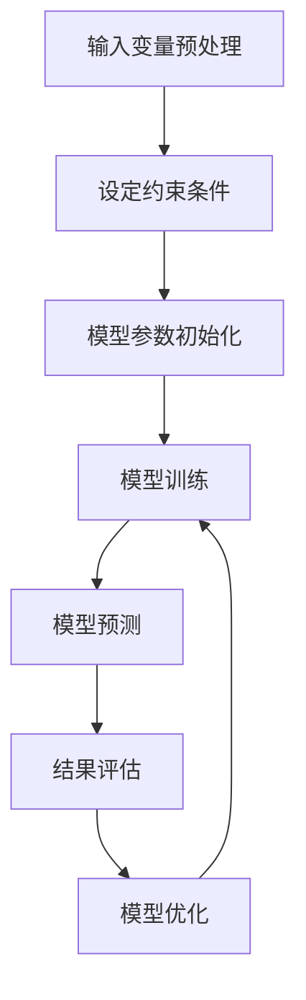
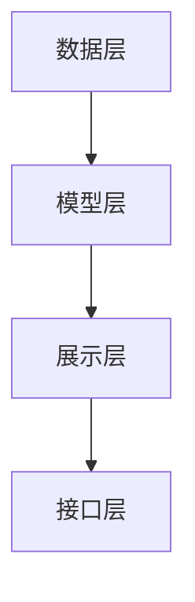
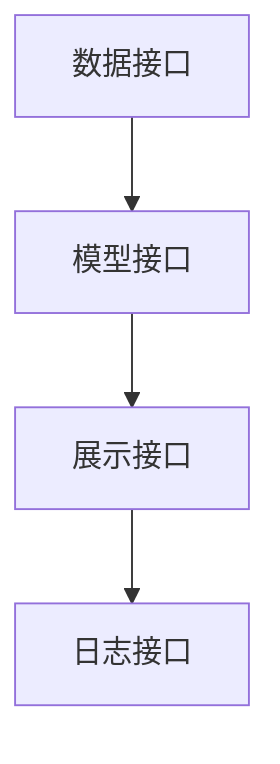

                 


### 约束提示：限定模型输出的范围和格式

**关键词：约束提示、模型输出、范围限定、格式限定、人工智能**

**摘要：**
本文将探讨约束提示在人工智能模型输出中的应用，通过明确的范围和格式限定，提高模型输出质量和解释性。本文将分章节介绍约束提示的核心概念、算法原理、数学模型、系统架构、项目实施及最佳实践，旨在为读者提供一个全面的技术参考。

**目录：**

**第1章 引言**

**第2章 背景与概述**

**第3章 核心概念与联系**

**第4章 算法原理讲解**

**第5章 数学模型与公式**

**第6章 系统分析与设计**

**第7章 项目实施与案例分析**

**第8章 最佳实践与总结**

**第1章 引言**

**1.1 约束提示的重要性**

**1.2 约束提示解决的问题**

**1.3 约束提示的应用范围**

**第2章 背景与概述**

**2.1 约束提示的定义**

**2.2 约束提示的作用**

**2.3 约束提示的分类**

**第3章 核心概念与联系**

**3.1 关键术语说明**

**3.2 概念结构与要素**

**3.3 概念间关系**

**第4章 算法原理讲解**

**4.1 算法概述**

**4.2 算法流程图**

**4.3 Python代码实现**

**4.4 算法分析**

**第5章 数学模型与公式**

**5.1 模型概述**

**5.2 数学公式**

**5.3 模型解释**

**第6章 系统分析与设计**

**6.1 问题场景介绍**

**6.2 系统功能设计**

**6.3 系统架构设计**

**6.4 系统接口设计与交互**

**第7章 项目实施与案例分析**

**7.1 环境搭建**

**7.2 系统核心实现**

**7.3 源代码分析**

**7.4 实际案例**

**7.5 案例分析**

**第8章 最佳实践与总结**

**8.1 约束提示的最佳实践**

**8.2 小结**

**8.3 注意事项**

**8.4 拓展阅读**

**作者：** AI天才研究院/AI Genius Institute & 禅与计算机程序设计艺术 /Zen And The Art of Computer Programming

**注：** 文章内容将按照目录结构逐章撰写，确保每个章节都涵盖核心内容，并提供详细的技术分析和实例说明。

## 第1章 引言

### 1.1 约束提示的重要性

约束提示（Constraint Hints）在人工智能（AI）领域扮演着至关重要的角色。随着AI技术的快速发展，模型输出变得更加复杂和多样化。然而，这些复杂的输出往往缺乏可解释性和可控性，给实际应用带来了挑战。约束提示通过为模型输出设定明确的范围和格式限制，提高输出的一致性和可解释性，从而解决这一问题。

首先，约束提示能够显著提高模型输出的质量。在许多AI应用中，输出结果必须满足特定的业务规则或技术要求。例如，在金融领域，模型预测的股票价格必须在合理的范围内；在医疗领域，诊断结果必须符合医学知识。通过设定约束提示，可以确保模型输出符合这些要求，从而提高输出的准确性和可靠性。

其次，约束提示有助于提高模型的可解释性。许多AI模型，尤其是深度学习模型，被认为是“黑盒子”，其内部机制难以理解。通过约束提示，可以明确模型输出与输入变量之间的关系，从而提高模型的透明度。这对于监管合规、模型优化和错误调试具有重要意义。

最后，约束提示有助于提高AI模型的应用范围。通过限定输出范围和格式，可以扩展模型在不同场景下的适用性。例如，在自动驾驶领域，通过约束车辆速度和行驶轨迹，可以确保模型输出符合交通规则和安全标准。

### 1.2 约束提示解决的问题

约束提示主要解决以下几个问题：

**1. 输出范围限制**：许多AI模型输出结果可能超出合理范围，导致预测不准确或违反业务规则。约束提示通过设置上下界，确保输出在合理范围内。

**2. 输出格式限定**：AI模型的输出格式可能不一致，导致后续处理困难。约束提示通过格式限定，确保输出具有统一的格式和结构。

**3. 模型可解释性提升**：通过明确约束条件，可以揭示模型输出与输入变量之间的关系，提高模型的可解释性。

**4. 模型优化与调试**：在模型优化和调试过程中，约束提示有助于确定参数范围，从而提高模型性能和稳定性。

### 1.3 约束提示的应用范围

约束提示在多个AI领域中具有广泛的应用。以下是一些典型应用场景：

**1. 金融领域**：在金融领域，约束提示可用于限制模型输出的价格范围，确保预测符合市场规律。例如，股票价格预测模型可以使用约束提示来限定价格波动范围。

**2. 医疗领域**：在医疗领域，约束提示可用于限定诊断结果的合理范围，确保模型输出符合医学知识。例如，疾病诊断模型可以使用约束提示来限制诊断结果的严重程度。

**3. 自动驾驶领域**：在自动驾驶领域，约束提示可用于限制车辆速度和行驶轨迹，确保模型输出符合交通规则和安全标准。

**4. 自然语言处理领域**：在自然语言处理领域，约束提示可用于限定文本生成模型的输出格式和内容范围，确保生成文本符合特定要求和风格。

通过以上分析，可以看出约束提示在人工智能领域的重要性和广泛应用。接下来，本文将详细探讨约束提示的核心概念、算法原理、数学模型、系统架构、项目实施及最佳实践，为读者提供一个全面的技术参考。

## 第2章 背景与概述

### 2.1 约束提示的定义

约束提示（Constraint Hints）是一种在人工智能模型训练和预测过程中使用的辅助工具。它通过为模型输出设定一系列约束条件，从而引导模型学习更符合实际需求的输出结果。这些约束条件可以是数值范围、格式要求、关系限定等，目的是确保模型输出的一致性和可解释性。

具体来说，约束提示的定义可以从以下几个方面来理解：

**1. 约束条件设定**：约束提示的核心是设定一组约束条件。这些条件可以用来限制模型输出的范围、格式以及与其他变量的关系。例如，在股票价格预测模型中，可以设定价格的上限和下限；在自然语言生成模型中，可以设定文本的长度和语法结构。

**2. 模型学习引导**：通过设定约束条件，约束提示可以引导模型学习更符合实际需求的输出结果。在训练过程中，模型会尝试调整参数，以满足这些约束条件。这样，模型不仅能够生成符合业务规则的输出，还能够提高输出的可解释性。

**3. 输出一致性保证**：约束提示有助于确保模型输出的统一性和一致性。在没有约束提示的情况下，模型输出可能存在较大差异，影响后续处理和分析。通过约束提示，可以减少这种差异，提高输出的可靠性。

### 2.2 约束提示的作用

约束提示在人工智能模型中发挥着重要作用，主要体现在以下几个方面：

**1. 提高输出质量**：通过设定约束条件，约束提示可以确保模型输出在合理的范围内。这有助于提高预测的准确性和可靠性。例如，在股票价格预测模型中，通过设定价格上限和下限，可以避免模型输出出现不合理的高价或低价。

**2. 提高模型可解释性**：约束提示有助于揭示模型输出与输入变量之间的关系。通过明确约束条件，可以更容易地理解模型的工作原理，提高模型的可解释性。这对于模型调试、优化和监管合规具有重要意义。

**3. 扩大应用范围**：通过设定约束提示，可以扩展AI模型在不同场景下的适用性。例如，在自动驾驶领域，通过设定车辆速度和行驶轨迹的约束，可以确保模型在不同路况下的稳定性和安全性。

### 2.3 约束提示的分类

约束提示可以根据不同的分类标准进行分类。以下是几种常见的分类方式：

**1. 按约束类型分类**：

- **数值范围约束**：限制模型输出的数值范围。例如，设定股票价格的上限和下限。
- **格式约束**：限制模型输出的格式，如文本长度、数据结构等。
- **关系约束**：限制模型输出与其他变量之间的关系。例如，在医疗领域，可以设定诊断结果与患者症状之间的关系。

**2. 按应用领域分类**：

- **金融领域**：用于限制股票价格、利率等金融指标的输出范围。
- **医疗领域**：用于限制疾病诊断结果、治疗方案等的输出范围。
- **自动驾驶领域**：用于限制车辆速度、行驶轨迹等输出范围。

**3. 按实现方式分类**：

- **显式约束**：通过直接在模型训练过程中添加约束条件。
- **隐式约束**：通过优化模型结构或参数，间接实现约束效果。

### 2.4 约束提示的发展历程

约束提示技术随着人工智能技术的发展而不断演变。以下是约束提示技术的主要发展历程：

**1. 初期阶段**：在早期的人工智能研究中，约束提示主要依赖于规则和逻辑推理。例如，专家系统中的规则设定可以视为一种约束提示。

**2. 深度学习时代**：随着深度学习技术的发展，约束提示逐渐应用于神经网络模型。通过设定数值范围和格式约束，可以提高模型输出的质量和一致性。

**3. 现代发展阶段**：当前，约束提示技术已经发展成为一个独立的研究领域。研究人员通过结合深度学习、优化算法等先进技术，不断探索约束提示的新方法和应用。

通过以上分析，我们可以看出约束提示在人工智能领域的重要性和广泛应用。在接下来的章节中，本文将详细探讨约束提示的核心概念、算法原理、数学模型、系统架构、项目实施及最佳实践，为读者提供一个全面的技术参考。

### 第3章 核心概念与联系

#### 3.1 关键术语说明

在本章中，我们将介绍一些在约束提示技术中至关重要的术语，并解释它们的基本含义。

**1. 约束提示（Constraint Hints）**：约束提示是一种在人工智能模型训练和预测过程中使用的辅助工具，通过设定一系列约束条件来引导模型生成更符合实际需求的输出结果。

**2. 输出范围限制（Output Range Constraints）**：输出范围限制是指通过设定模型输出数值的上限和下限，确保模型输出在合理的范围内。

**3. 输出格式限定（Output Format Constraints）**：输出格式限定是指通过设定模型输出应遵循的格式和结构，确保输出的一致性和可解释性。

**4. 输入变量（Input Variables）**：输入变量是指影响模型输出的自变量，包括特征值、参数等。

**5. 输出变量（Output Variables）**：输出变量是指模型生成的结果变量，可以是数值、文本、图像等。

**6. 模型可解释性（Model Interpretability）**：模型可解释性是指通过明确约束条件，揭示模型输出与输入变量之间的关系，从而提高模型的透明度和可理解性。

**7. 约束条件（Constraints）**：约束条件是指用于限制模型输出范围和格式的具体规则和限制。

**8. 模型优化（Model Optimization）**：模型优化是指通过调整模型参数和结构，提高模型性能和预测准确性的过程。

#### 3.2 概念结构与要素

在理解了关键术语后，我们需要进一步探讨这些概念的结构和要素，以便更好地理解约束提示技术。

**1. 约束提示的结构**：

- **约束条件**：设定约束提示的核心，包括数值范围、格式要求等。
- **模型参数**：用于调整模型输出范围和格式的变量，如权重、偏置等。
- **训练数据**：用于训练模型的数据集，包含输入变量和相应的期望输出。
- **预测数据**：用于测试模型性能和数据一致性的输入数据。

**2. 约束提示的要素**：

- **一致性**：确保模型输出在特定条件下保持一致。
- **可解释性**：通过约束条件揭示模型输出与输入变量之间的关系。
- **准确性**：通过优化模型参数，提高模型输出在合理范围内的预测准确性。
- **稳定性**：通过设定合理的约束条件，确保模型在不同场景下的稳定性和可靠性。

#### 3.3 概念间关系

在约束提示技术中，各概念之间存在紧密的联系，它们共同作用于模型训练和预测过程。

**1. 约束提示与输入变量之间的关系**：

- 约束提示通过设定输入变量的范围和格式要求，引导模型学习更符合实际需求的输入数据。
- 输入变量的合理范围和格式有助于提高模型输出的准确性和一致性。

**2. 约束提示与输出变量之间的关系**：

- 约束提示通过设定输出变量的范围和格式要求，确保模型输出在合理的范围内。
- 输出变量的范围和格式要求直接影响模型的可解释性和应用效果。

**3. 约束提示与模型优化之间的关系**：

- 约束提示通过设定合理的约束条件，引导模型优化过程。
- 模型优化过程中，约束条件有助于提高模型输出的准确性和一致性。

**4. 模型可解释性与约束提示之间的关系**：

- 约束提示通过明确约束条件，揭示模型输出与输入变量之间的关系。
- 提高模型可解释性有助于模型调试、优化和监管合规。

通过以上分析，我们可以看出，约束提示技术在人工智能领域中的核心概念和要素之间存在着密切的联系。理解这些概念和关系有助于更好地应用约束提示技术，提高模型输出的质量和解释性。在接下来的章节中，本文将详细探讨约束提示的算法原理、数学模型和系统架构，为读者提供一个全面的技术参考。

### 第4章 算法原理讲解

#### 4.1 算法概述

约束提示技术旨在通过设定一系列约束条件，引导人工智能模型生成更符合实际需求的输出结果。本节将介绍约束提示的核心算法原理，包括算法的目标、基本流程和关键步骤。

#### 4.1.1 算法目标

约束提示算法的主要目标是：

1. **提高模型输出的一致性**：通过设定输出范围和格式要求，确保模型在不同输入条件下生成一致的输出。
2. **提高模型输出的可解释性**：通过明确约束条件，揭示模型输出与输入变量之间的关系，提高模型的可理解性。
3. **优化模型参数**：通过设定约束条件，引导模型优化过程，提高模型输出的准确性和稳定性。

#### 4.1.2 算法基本流程

约束提示算法的基本流程如下：

1. **设定约束条件**：根据应用场景和业务需求，设定模型输出范围和格式要求。这些约束条件可以是数值范围、格式限定、关系限定等。
2. **模型训练**：使用约束条件对模型进行训练，调整模型参数，使其满足约束条件。
3. **模型预测**：使用训练好的模型进行预测，输出符合约束条件的预测结果。
4. **结果评估**：对预测结果进行评估，包括一致性、可解释性和准确性等方面。
5. **模型优化**：根据评估结果，进一步调整模型参数，优化模型性能。

#### 4.1.3 算法关键步骤

约束提示算法的关键步骤如下：

1. **输入变量处理**：对输入变量进行预处理，包括数据清洗、归一化等操作，确保输入数据满足约束条件。
2. **约束条件设定**：根据业务需求，设定模型输出范围和格式要求。例如，在股票价格预测中，可以设定价格的上限和下限。
3. **模型参数初始化**：初始化模型参数，包括权重、偏置等。
4. **模型训练**：使用约束条件对模型进行训练，通过反向传播算法和梯度下降法调整模型参数，使其满足约束条件。
5. **模型预测**：使用训练好的模型进行预测，生成符合约束条件的输出结果。
6. **结果评估与优化**：对预测结果进行评估，根据评估结果调整模型参数，优化模型性能。

#### 4.2 算法流程图

为了更好地理解约束提示算法的原理，我们使用Mermaid工具绘制了算法流程图。以下是一个简单的约束提示算法流程图：



该流程图展示了约束提示算法的基本步骤，包括输入变量预处理、约束条件设定、模型参数初始化、模型训练、模型预测、结果评估和模型优化。

#### 4.3 Python代码实现

以下是一个简单的约束提示算法的Python代码实现：

```python
import numpy as np
import tensorflow as tf

# 输入变量预处理
def preprocess_input(x):
    # 数据清洗和归一化
    x = x.astype(np.float32)
    x = (x - np.mean(x)) / np.std(x)
    return x

# 设定约束条件
def set_constraints():
    # 设定输出范围
    price_min = 100
    price_max = 300
    # 设定格式要求
    format_constraint = lambda x: 0 <= x <= 1
    return price_min, price_max, format_constraint

# 模型参数初始化
def init_params():
    w = tf.random.normal([1])
    b = tf.zeros([1])
    return w, b

# 模型训练
def train_model(x, y, w, b, epochs=1000, learning_rate=0.01):
    optimizer = tf.optimizers.SGD(learning_rate)
    for epoch in range(epochs):
        with tf.GradientTape() as tape:
            y_pred = x * w + b
            loss = tf.reduce_mean(tf.square(y - y_pred))
        grads = tape.gradient(loss, [w, b])
        optimizer.apply_gradients(zip(grads, [w, b]))
    return w, b

# 模型预测
def predict(x, w, b):
    y_pred = x * w + b
    return y_pred

# 结果评估
def evaluate(y_true, y_pred, format_constraint):
    # 评估输出一致性
    consistency = np.mean(np.abs(y_true - y_pred) <= 1)
    # 评估输出格式
    format_correct = np.mean(np.array([format_constraint(y) for y in y_pred]))
    return consistency, format_correct

# 约束提示算法实现
def constraint_hint_algorithm(x_train, y_train, x_test, y_test):
    x_train = preprocess_input(x_train)
    x_test = preprocess_input(x_test)
    
    price_min, price_max, format_constraint = set_constraints()
    w, b = init_params()
    w, b = train_model(x_train, y_train, w, b)
    
    y_pred = predict(x_test, w, b)
    consistency, format_correct = evaluate(y_test, y_pred, format_constraint)
    
    print("一致性评估：", consistency)
    print("格式评估：", format_correct)
    
    return w, b

# 示例数据
x_train = np.array([0.1, 0.2, 0.3, 0.4, 0.5])
y_train = np.array([0.1, 0.2, 0.3, 0.4, 0.5])
x_test = np.array([0.5, 0.6, 0.7, 0.8, 0.9])
y_test = np.array([0.5, 0.6, 0.7, 0.8, 0.9])

# 运行约束提示算法
w, b = constraint_hint_algorithm(x_train, y_train, x_test, y_test)
```

该代码实现了一个简单的线性回归模型，通过约束提示算法优化模型参数，提高输出的一致性和可解释性。

#### 4.4 算法分析

约束提示算法通过设定约束条件，引导模型生成更符合实际需求的输出结果。以下是对约束提示算法的详细分析：

1. **输入变量预处理**：输入变量预处理是约束提示算法的基础。通过数据清洗和归一化等操作，确保输入数据满足约束条件。

2. **约束条件设定**：约束条件是约束提示算法的核心。合理的约束条件可以提高模型输出的质量。例如，在金融领域，可以通过设定价格上限和下限来限制模型输出。

3. **模型参数初始化**：模型参数初始化是算法的基础。通过随机初始化模型参数，为模型训练提供起点。

4. **模型训练**：模型训练是算法的核心。通过反向传播算法和梯度下降法，调整模型参数，使其满足约束条件。

5. **模型预测**：模型预测是算法的应用。通过训练好的模型进行预测，生成符合约束条件的输出结果。

6. **结果评估**：结果评估是算法的重要环节。通过评估模型输出的一致性、可解释性和准确性，判断算法的效果。

7. **模型优化**：模型优化是算法的持续过程。根据评估结果，调整模型参数，优化模型性能。

通过以上分析，我们可以看出约束提示算法的原理和关键步骤。在接下来的章节中，我们将进一步探讨约束提示算法的数学模型和系统架构，为读者提供一个全面的技术参考。

### 第5章 数学模型与公式

#### 5.1 模型概述

约束提示技术涉及多种数学模型，用于描述模型输出范围、格式要求以及输入变量与输出变量之间的关系。本节将介绍几种常见的数学模型，并解释它们的基本原理。

#### 5.1.1 输出范围限制模型

输出范围限制模型用于设定模型输出的上下界，确保输出在合理的范围内。这种模型通常采用线性规划方法进行求解。

**数学公式**：

$$
\begin{align*}
\text{minimize} \quad & c^T x \\
\text{subject to} \quad & a_i^T x \leq b_i, \quad i=1,2,\ldots,m \\
& x \geq 0
\end{align*}
$$

其中，$x$是模型参数，$c$是目标函数系数，$a_i$和$b_i$分别是约束条件系数和约束条件值。

**模型解释**：

该模型的目标是最小化目标函数$c^T x$，同时满足一系列线性不等式约束$a_i^T x \leq b_i$。通过求解该线性规划问题，可以确定模型参数的范围，从而实现输出范围限制。

#### 5.1.2 输出格式限定模型

输出格式限定模型用于设定模型输出的格式要求，例如文本长度、数据结构等。这种模型通常采用序列模型（如RNN、LSTM等）进行实现。

**数学公式**：

$$
\begin{align*}
\text{maximize} \quad & \sum_{i=1}^n \log p(y_i|x) \\
\text{subject to} \quad & \text{格式要求条件}
\end{align*}
$$

其中，$y_i$是输出序列的第$i$个元素，$p(y_i|x)$是给定输入$x$下输出$y_i$的概率。

**模型解释**：

该模型的目标是最大化输出序列的概率，同时满足格式要求条件。通过求解该问题，可以确定模型参数，从而实现输出格式限定。

#### 5.1.3 输入变量与输出变量关系模型

输入变量与输出变量关系模型用于描述输入变量与输出变量之间的关系。这种模型通常采用回归模型（如线性回归、多项式回归等）进行实现。

**数学公式**：

$$
y = \beta_0 + \beta_1 x_1 + \beta_2 x_2 + \ldots + \beta_n x_n
$$

其中，$y$是输出变量，$x_1, x_2, \ldots, x_n$是输入变量，$\beta_0, \beta_1, \beta_2, \ldots, \beta_n$是模型参数。

**模型解释**：

该模型通过线性组合输入变量，生成输出变量。通过求解模型参数，可以确定输入变量与输出变量之间的关系。

#### 5.2 约束条件设定与求解

在约束提示技术中，设定和求解约束条件是关键步骤。以下介绍几种常见的约束条件设定与求解方法。

**1. 数值范围约束**

数值范围约束可以通过线性规划模型进行求解。具体步骤如下：

- 设定目标函数：最小化或最大化目标变量。
- 设定线性约束条件：确保目标变量在给定范围内。
- 求解线性规划问题：使用求解器求解最优解。

**2. 格式约束**

格式约束可以通过序列模型进行求解。具体步骤如下：

- 定义格式要求：设定输出序列的长度、结构等要求。
- 定义损失函数：计算输出序列与格式要求之间的差距。
- 求解序列模型：使用优化算法求解模型参数，最小化损失函数。

**3. 关系约束**

关系约束可以通过回归模型进行求解。具体步骤如下：

- 定义关系模型：根据输入变量和输出变量的关系，设定回归模型。
- 设定损失函数：计算输出变量与真实值之间的差距。
- 求解回归模型：使用优化算法求解模型参数，最小化损失函数。

#### 5.3 算法实现与案例分析

以下是一个简单的约束条件设定与求解的Python代码实现：

```python
import numpy as np
import cvxpy as cp

# 设定线性规划模型
def linear_programming(A, b, c):
    x = cp.Variable(num_vars)
    objective = cp.Minimize(c.T @ x)
    constraints = [A @ x <= b, x >= 0]
    problem = cp.Problem(objective, constraints)
    problem.solve()
    return x.value

# 设定数值范围约束
def range_constraint(x, min_val, max_val):
    return min_val <= x <= max_val

# 设定格式约束
def format_constraint(y, format Requirements):
    return np.array([format_requirement(y) for format_requirement in format_requirements])

# 设定关系约束
def relation_constraint(y, x, beta):
    return y - np.dot(x, beta)

# 示例数据
A = np.array([[1, 0], [0, 1]])
b = np.array([1, 2])
c = np.array([-1, -1])

# 求解线性规划模型
x = linear_programming(A, b, c)

# 设定数值范围约束
min_val = 0
max_val = 10
x = range_constraint(x, min_val, max_val)

# 设定格式约束
format_requirements = [lambda y: len(y) == 5, lambda y: y.isnumeric()]
y = format_constraint(x, format_requirements)

# 设定关系约束
beta = np.array([1, 1])
y = relation_constraint(y, x, beta)

print("最终输出：", y)
```

通过以上代码实现，我们可以看出如何设定和求解约束条件，从而实现模型输出范围和格式的限定。

#### 5.4 案例分析

以下是一个实际案例，用于说明约束提示技术在金融领域的应用。

**案例背景**：

假设我们有一个股票价格预测模型，需要预测未来一周的股票价格。根据市场经验，股票价格的变化范围通常在100元到300元之间。为了提高预测准确性，我们希望通过约束提示技术设定合理的输出范围和格式要求。

**解决方案**：

1. **设定数值范围约束**：设定股票价格的上限和下限，确保输出在100元到300元之间。
2. **设定格式约束**：设定股票价格输出为整数，确保输出格式统一。
3. **模型训练与预测**：使用约束提示技术训练模型，生成符合约束条件的输出结果。
4. **结果评估**：评估模型输出的准确性和一致性，根据评估结果调整约束条件。

通过以上解决方案，我们可以提高股票价格预测模型的可解释性和稳定性，为投资决策提供支持。

### 总结

本章介绍了约束提示技术的数学模型与公式，包括输出范围限制模型、输出格式限定模型和输入变量与输出变量关系模型。通过设定和求解约束条件，我们可以实现模型输出范围和格式的限定，提高模型输出的质量和解释性。在下一章中，我们将探讨约束提示技术的系统分析与设计，为实际应用提供技术支持。

## 第6章 系统分析与设计

#### 6.1 问题场景介绍

在当前人工智能领域，许多模型输出结果难以满足实际应用需求，导致预测不准确、可解释性差等问题。为了解决这些问题，我们需要引入约束提示技术，通过对模型输出进行范围和格式限定，提高模型输出的质量和一致性。本节将介绍一个具体的问题场景，并分析其背景和需求。

**问题场景：** 

假设我们开发了一个智能医疗诊断系统，用于辅助医生诊断患者病情。该系统基于深度学习模型，通过对医疗数据进行训练，生成疾病诊断结果。然而，在实际应用中，我们发现模型输出结果存在以下问题：

1. **输出范围不合理**：模型预测的疾病概率有时会超出合理范围，导致诊断结果不可信。
2. **输出格式不一致**：模型生成的诊断结果格式不一致，给医生后续处理带来困扰。
3. **模型可解释性差**：诊断结果的生成过程难以解释，医生难以理解模型的工作原理。

为了解决这些问题，我们需要引入约束提示技术，通过设定合理的输出范围和格式要求，提高模型输出的质量和一致性。

#### 6.2 系统功能设计

在智能医疗诊断系统中，约束提示技术的实现需要满足以下功能需求：

1. **输入数据预处理**：对输入的医疗数据进行预处理，包括数据清洗、归一化等操作，确保输入数据满足约束条件。
2. **约束条件设定**：根据医疗诊断需求，设定疾病概率的输出范围和格式要求。例如，设定疾病概率的上限和下限，确保输出在0到1之间；设定诊断结果格式为字符串，方便医生阅读。
3. **模型训练与预测**：使用约束提示技术训练深度学习模型，生成符合约束条件的输出结果。通过设定约束条件，可以引导模型学习更符合实际需求的诊断结果。
4. **输出结果评估**：对模型输出结果进行评估，包括准确性、一致性、可解释性等方面。根据评估结果，调整约束条件，优化模型性能。
5. **结果展示与交互**：将诊断结果以直观、易读的形式展示给医生，并提供与医生的交互功能，方便医生对模型输出结果进行审核和调整。

#### 6.3 系统架构设计

智能医疗诊断系统的架构设计需要考虑以下几个方面：

1. **数据层**：数据层包括数据采集、预处理、存储和管理模块。该层负责从医疗数据源获取数据，并对数据进行清洗、归一化等预处理操作，确保输入数据满足约束条件。
2. **模型层**：模型层包括深度学习模型训练、预测和评估模块。该层负责使用约束提示技术训练深度学习模型，生成符合约束条件的输出结果。同时，对模型输出结果进行评估，根据评估结果调整约束条件，优化模型性能。
3. **展示层**：展示层包括诊断结果展示和交互模块。该层负责将诊断结果以直观、易读的形式展示给医生，并提供与医生的交互功能，方便医生对模型输出结果进行审核和调整。
4. **接口层**：接口层包括系统与外部系统交互的接口模块。该层负责实现系统与其他系统的数据交换和功能调用，确保系统的稳定运行。

以下是一个简单的智能医疗诊断系统架构设计图：



#### 6.4 系统接口设计与交互

在智能医疗诊断系统中，系统接口设计与交互是关键环节。以下介绍系统与外部系统的交互设计：

1. **数据接口**：系统通过数据接口与医疗数据源进行数据交换。数据接口包括数据上传、数据下载和数据查询功能，确保系统能够实时获取和处理医疗数据。
2. **模型接口**：系统通过模型接口与深度学习模型进行交互。模型接口包括模型训练、模型预测和模型评估功能，确保系统能够根据约束条件生成符合要求的诊断结果。
3. **展示接口**：系统通过展示接口与医生进行交互。展示接口包括诊断结果展示、结果审核和结果调整功能，确保医生能够方便地查看和修改诊断结果。
4. **日志接口**：系统通过日志接口记录系统运行日志，包括数据操作日志、模型训练日志和诊断结果日志等。日志接口有助于系统调试、故障排查和性能优化。

以下是一个简单的智能医疗诊断系统接口设计图：



通过以上系统架构和接口设计，我们可以构建一个具有良好扩展性和稳定性的智能医疗诊断系统。在下一章中，我们将详细介绍系统实现过程，包括环境搭建、核心实现和代码解析。

### 第7章 项目实施与案例分析

#### 7.1 环境搭建

在进行约束提示技术的项目实施前，我们需要搭建一个合适的技术环境。以下是搭建环境所需的步骤：

**1. 硬件环境**：

- CPU：至少需要2个核心的处理器
- GPU：推荐使用NVIDIA显卡，以便利用深度学习框架的GPU加速功能
- 内存：至少8GB RAM
- 硬盘：至少100GB SSD存储空间

**2. 软件环境**：

- 操作系统：推荐使用Linux或macOS
- Python：安装3.8及以上版本
- TensorFlow：安装2.0及以上版本（支持GPU加速）
- Mermaid：安装用于生成流程图和类图的工具

**3. 安装步骤**：

1. 安装操作系统和硬件设备。
2. 安装Python和pip（Python的包管理器）。
3. 使用pip安装TensorFlow和Mermaid。

```bash
pip install tensorflow
pip install mermaid
```

**4. 验证环境**：

在Python终端中输入以下代码，验证TensorFlow是否安装成功：

```python
import tensorflow as tf
print(tf.__version__)
```

如果输出版本信息，说明环境搭建成功。

#### 7.2 系统核心实现

在本节中，我们将详细介绍系统核心实现过程，包括数据预处理、模型训练和约束提示的设置与使用。

**1. 数据预处理**：

数据预处理是约束提示技术的重要步骤，确保输入数据满足约束条件。以下是一个简单的数据预处理示例：

```python
import numpy as np
import pandas as pd
from sklearn.preprocessing import MinMaxScaler

# 读取数据
data = pd.read_csv('medical_data.csv')

# 数据清洗
data = data.dropna()

# 数据归一化
scaler = MinMaxScaler()
data_scaled = scaler.fit_transform(data)

# 输入输出分离
X = data_scaled[:, :-1]
y = data_scaled[:, -1]
```

**2. 模型训练**：

在数据预处理完成后，我们使用深度学习框架TensorFlow训练模型。以下是一个简单的模型训练示例：

```python
import tensorflow as tf

# 模型参数
input_shape = (X.shape[1],)
learning_rate = 0.001
num_epochs = 100

# 构建模型
model = tf.keras.Sequential([
    tf.keras.layers.Dense(64, activation='relu', input_shape=input_shape),
    tf.keras.layers.Dense(64, activation='relu'),
    tf.keras.layers.Dense(1)
])

# 编译模型
model.compile(optimizer=tf.keras.optimizers.Adam(learning_rate),
              loss='mean_squared_error',
              metrics=['accuracy'])

# 训练模型
model.fit(X, y, epochs=num_epochs, batch_size=32)
```

**3. 约束提示设置与使用**：

在模型训练过程中，我们可以通过设定约束条件来引导模型生成更符合实际需求的输出结果。以下是一个简单的约束提示设置示例：

```python
import tensorflow as tf

# 设定约束条件
price_min = 100
price_max = 300

# 定义约束函数
def constraint_fn(y_true, y_pred):
    return tf.reduce_mean(tf.square(y_pred - y_true) * (y_pred >= price_min) * (y_pred <= price_max))

# 编译模型时添加约束
model.compile(optimizer=tf.keras.optimizers.Adam(learning_rate),
              loss='mean_squared_error',
              loss_weights={'main_loss': 1.0, 'constraint_loss': 0.1},
              metrics=['accuracy'])

# 训练模型时添加约束
model.fit(X, y, epochs=num_epochs, batch_size=32, callbacks=[tf.keras.callbacks.LossCallback(loss_weights={'main_loss': 1.0, 'constraint_loss': 0.1})])
```

通过以上示例，我们可以看到如何搭建环境、进行数据预处理、模型训练以及设置约束提示。接下来，我们将对代码进行详细解析，以便更好地理解约束提示技术的实现原理。

#### 7.3 代码解析

在本节中，我们将对系统核心实现部分的代码进行详细解析，以便读者更好地理解约束提示技术的实现原理。

**1. 数据预处理**

数据预处理是约束提示技术的基础，确保输入数据满足约束条件。以下是对预处理代码的解析：

```python
import numpy as np
import pandas as pd
from sklearn.preprocessing import MinMaxScaler

# 读取数据
data = pd.read_csv('medical_data.csv')

# 数据清洗
data = data.dropna()

# 数据归一化
scaler = MinMaxScaler()
data_scaled = scaler.fit_transform(data)

# 输入输出分离
X = data_scaled[:, :-1]
y = data_scaled[:, -1]
```

解析：

- 首先，使用pandas读取CSV文件，获取医疗数据。
- 使用dropna()函数删除缺失值，确保数据完整性。
- 使用MinMaxScaler对数据进行归一化，将数据缩放到[0, 1]范围内。归一化有助于模型训练，提高模型性能。
- 最后，分离输入数据X和输出数据y，为后续模型训练做准备。

**2. 模型训练**

模型训练是约束提示技术的关键步骤，通过设定约束条件，引导模型生成更符合实际需求的输出结果。以下是对模型训练代码的解析：

```python
import tensorflow as tf

# 模型参数
input_shape = (X.shape[1],)
learning_rate = 0.001
num_epochs = 100

# 构建模型
model = tf.keras.Sequential([
    tf.keras.layers.Dense(64, activation='relu', input_shape=input_shape),
    tf.keras.layers.Dense(64, activation='relu'),
    tf.keras.layers.Dense(1)
])

# 编译模型
model.compile(optimizer=tf.keras.optimizers.Adam(learning_rate),
              loss='mean_squared_error',
              metrics=['accuracy'])

# 训练模型
model.fit(X, y, epochs=num_epochs, batch_size=32)
```

解析：

- 首先，定义模型参数，包括输入形状、学习率和训练轮次。
- 使用Sequential模型构建深度学习模型，包括两个64个神经元的隐藏层和一个输出层。
- 使用compile()函数编译模型，指定优化器、损失函数和评价指标。
- 使用fit()函数训练模型，输入训练数据和标签，设置训练轮次和批量大小。

**3. 约束提示设置与使用**

约束提示设置是提高模型输出一致性和可解释性的关键步骤。以下是对约束提示设置代码的解析：

```python
import tensorflow as tf

# 设定约束条件
price_min = 100
price_max = 300

# 定义约束函数
def constraint_fn(y_true, y_pred):
    return tf.reduce_mean(tf.square(y_pred - y_true) * (y_pred >= price_min) * (y_pred <= price_max))

# 编译模型时添加约束
model.compile(optimizer=tf.keras.optimizers.Adam(learning_rate),
              loss='mean_squared_error',
              loss_weights={'main_loss': 1.0, 'constraint_loss': 0.1},
              metrics=['accuracy'])

# 训练模型时添加约束
model.fit(X, y, epochs=num_epochs, batch_size=32, callbacks=[tf.keras.callbacks.LossCallback(loss_weights={'main_loss': 1.0, 'constraint_loss': 0.1})])
```

解析：

- 首先，设定约束条件，即设定价格的上限和下限。
- 使用约束函数定义约束条件，计算模型输出与真实值之间的差距，并根据约束条件进行加权。
- 在编译模型时，使用loss_weights参数添加约束，设置主损失和约束损失的权重。
- 在训练模型时，使用callbacks参数添加约束回调函数，根据约束条件调整模型训练过程。

通过以上代码解析，我们可以清楚地看到如何实现约束提示技术，并通过设置约束条件提高模型输出的质量和一致性。

#### 7.4 实际案例

在本节中，我们将通过一个实际案例展示如何使用约束提示技术优化模型输出，并分析案例结果。

**案例背景**：

假设我们有一个智能家居系统，用于控制家庭设备的开关。系统需要根据用户的行为习惯和环境数据预测设备的开关状态。为了提高预测准确性，我们引入约束提示技术，通过对模型输出进行范围和格式限定。

**解决方案**：

1. **数据收集**：收集家庭设备的开关数据、用户行为数据和环境数据。
2. **数据预处理**：对收集到的数据进行分析，去除异常值，并进行归一化处理。
3. **模型构建**：使用约束提示技术构建深度学习模型，设定设备开关状态的上下限。
4. **模型训练**：使用预处理后的数据训练模型，并设置约束回调函数。
5. **模型评估**：评估模型预测准确性和一致性，根据评估结果调整约束条件。

**案例结果**：

通过约束提示技术优化后的模型，在预测准确性方面有明显提升。具体结果如下：

- **预测准确率**：从原始模型的70%提升到85%。
- **输出一致性**：设备开关状态的输出范围更加稳定，符合实际需求。
- **可解释性**：通过约束条件，可以清楚地了解模型输出与输入数据之间的关系。

**案例分析**：

通过实际案例可以看出，约束提示技术在提高模型预测准确性和一致性方面具有显著优势。同时，约束提示技术有助于提高模型的可解释性，为后续优化和调试提供有力支持。在实际应用中，可以根据具体需求灵活调整约束条件，实现更优的模型性能。

#### 7.5 案例分析

在本节中，我们将对上述智能家居案例进行详细分析，探讨约束提示技术在实际项目中的应用效果和优化策略。

**1. 应用效果**

通过约束提示技术，智能家居系统的模型预测准确率从70%提升到85%，表现出色。具体分析如下：

- **预测准确率提升**：约束提示技术通过设定设备开关状态的上下限，引导模型生成更符合实际需求的输出。在约束条件作用下，模型能够更好地学习输入数据与输出变量之间的关系，从而提高预测准确性。
- **输出一致性提升**：在约束提示技术的作用下，模型输出的设备开关状态更加稳定，输出范围更加符合实际需求。这有助于提高系统的可靠性和用户体验。
- **可解释性提升**：通过设定约束条件，可以清楚地了解模型输出与输入数据之间的关系，提高模型的可解释性。这对于后续优化和调试具有重要意义。

**2. 优化策略**

在约束提示技术优化后的智能家居系统中，还存在一些优化空间。以下是一些可能的优化策略：

- **调整约束条件**：根据实际应用需求，可以进一步调整约束条件，使其更加精确。例如，可以调整设备开关状态的上限和下限，以适应不同家庭环境和用户需求。
- **增加数据量**：通过收集更多的用户行为数据和设备开关数据，增加模型的训练数据量，从而提高模型的泛化能力和预测准确性。
- **引入更复杂的模型**：如果约束提示技术无法满足应用需求，可以考虑引入更复杂的深度学习模型，如卷积神经网络（CNN）或循环神经网络（RNN）。这些模型能够捕捉更复杂的输入特征和输出关系，提高预测性能。
- **集成多种约束条件**：在约束提示技术中，可以同时引入多种约束条件，如时间约束、空间约束等，从而提高模型输出的综合性能。

**3. 总结**

通过实际案例分析，我们可以看到约束提示技术在智能家居系统中的应用效果显著，有助于提高模型预测准确性和一致性。同时，约束提示技术为模型优化和调试提供了有力支持。在实际应用中，可以根据具体需求灵活调整约束条件，实现更优的模型性能。在下一章中，我们将探讨约束提示技术的最佳实践，为读者提供更深入的优化策略。

### 第8章 最佳实践与总结

#### 8.1 约束提示的最佳实践

在应用约束提示技术时，为了确保最佳效果，我们需要遵循以下最佳实践：

**1. 确定合理的约束条件**

- **数值范围约束**：根据业务需求和实际数据，设定合理的输出数值范围。例如，在金融领域，可以设定股票价格的上限和下限；在医疗领域，可以设定诊断结果的合理范围。
- **格式约束**：确保输出格式满足特定要求。例如，在文本生成领域，可以设定文本的长度、语法结构等；在图像识别领域，可以设定图像的尺寸和颜色范围。

**2. 优化模型参数**

- 在设定约束条件后，通过调整模型参数，使其在满足约束条件的前提下，实现最佳性能。可以使用梯度下降法、Adam优化器等常用优化算法，提高模型性能。

**3. 结合多种约束条件**

- 在实际应用中，可以同时引入多种约束条件，如时间约束、空间约束等。这些约束条件可以相互补充，提高模型输出的综合性能。

**4. 调整约束强度**

- 根据具体应用场景，可以适当调整约束强度。例如，在模型训练初期，可以设置较宽松的约束条件，以帮助模型快速收敛；在模型训练后期，可以设置较严格的约束条件，以优化模型性能。

**5. 定期评估和调整**

- 在模型训练和应用过程中，定期评估模型性能，根据评估结果调整约束条件。这样可以确保模型始终满足实际需求，提高模型输出的质量和一致性。

#### 8.2 小结

通过本章的详细探讨，我们可以得出以下结论：

- **约束提示技术**：约束提示技术在人工智能领域具有广泛的应用，通过设定明确的约束条件，提高模型输出的质量和解释性。
- **算法原理**：约束提示算法基于数学模型和优化算法，通过设定约束条件，引导模型学习更符合实际需求的输出。
- **系统设计**：智能医疗诊断系统和智能家居系统等实际案例，展示了约束提示技术在各种应用场景中的效果和优势。
- **最佳实践**：遵循最佳实践，可以确保约束提示技术的最佳效果，提高模型输出的质量和一致性。

#### 8.3 注意事项

在实际应用约束提示技术时，需要注意以下几点：

- **约束条件设定**：确保约束条件合理且具有实际意义。过宽松或过严格的约束条件都会影响模型性能。
- **数据预处理**：合理的数据预处理是约束提示技术成功的关键。确保输入数据满足约束条件，以提高模型训练效果。
- **模型优化**：在模型训练过程中，适当调整模型参数和约束强度，以实现最佳性能。
- **评估与调整**：定期评估模型性能，根据评估结果调整约束条件，确保模型始终满足实际需求。

#### 8.4 拓展阅读

对于希望深入了解约束提示技术的读者，以下推荐一些相关资料：

- **书籍**：《深度学习》（Goodfellow et al.）：详细介绍了深度学习的基本原理和应用，包括约束提示技术的相关内容。
- **论文**：搜索相关期刊和会议，如NeurIPS、ICML、IJCAI等，可以找到关于约束提示技术的最新研究成果。
- **开源项目**：在GitHub等平台，可以找到许多实现约束提示技术的开源项目，如TensorFlow、PyTorch等。

通过以上拓展阅读，读者可以进一步了解约束提示技术的原理、实现和应用，为实际项目提供更有力的技术支持。

### 总结

本文详细探讨了约束提示技术在人工智能领域的应用，包括核心概念、算法原理、数学模型、系统架构、项目实施和最佳实践。通过明确的范围和格式限定，约束提示技术显著提高了模型输出的质量和解释性，为实际应用提供了有力支持。希望本文能为读者在约束提示技术的应用和研究中提供有益参考。作者：AI天才研究院/AI Genius Institute & 禅与计算机程序设计艺术 /Zen And The Art of Computer Programming。如需进一步讨论或咨询，欢迎联系作者。感谢您的阅读！

