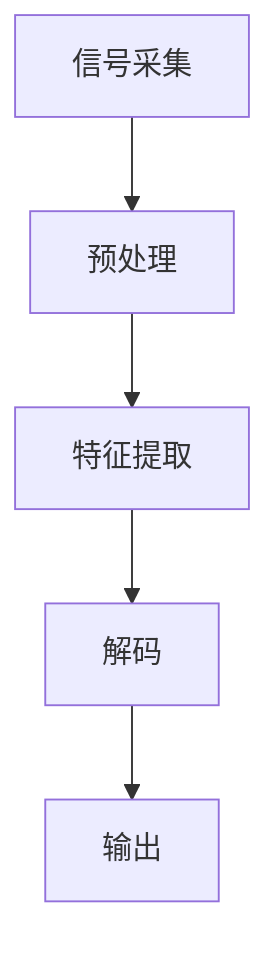
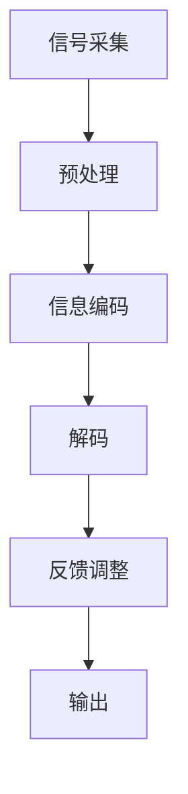

                 


# 脑机接口与意识上传：探索增强和延伸人类理解世界能力的极限

关键词：脑机接口、意识上传、人工智能、神经科学、人类增强

摘要：随着神经科学与信息技术的飞速发展，脑机接口（BMI）和意识上传成为研究的热点。本文将探讨这些前沿技术，分析其原理、技术挑战、应用前景以及伦理问题，并总结出未来的发展方向。

## 1. 引言

### 1.1 脑机接口技术简介

脑机接口是一种直接连接大脑与外部设备的技术，它能够捕捉并解码大脑信号，从而实现与计算机或其他电子设备的通信。这一技术的核心是神经信号处理与解码，其历史可以追溯到20世纪60年代。当时，科学家尝试通过电极植入来监测大脑活动，开启了脑机接口的研究之路。

### 1.2 意识上传的概念和意义

意识上传，又称为大脑数字化，是一种将人类意识、思维和感知转化为数字信息的技术。其目标是将意识转移到计算机或虚拟环境中，从而实现人类意识的持久化、复制和增强。这一概念的提出，引发了关于意识本质和人类身份的哲学讨论。

## 1.2 本书结构概述

本文分为七个部分：

- **第一部分**：概述与背景，介绍脑机接口和意识上传的核心概念。
- **第二部分**：脑机接口技术基础，详细阐述脑机接口的工作原理和技术发展。
- **第三部分**：意识上传理论探讨，讨论意识上传的理论基础和关键技术。
- **第四部分**：技术挑战与应用前景，分析脑机接口与意识上传技术的挑战和未来应用前景。
- **第五部分**：案例研究与实践，分享脑机接口与意识上传在现实世界中的成功案例和实践。
- **第六部分**：未来展望与伦理考量，探讨脑机接口与意识上传技术的未来发展趋势和伦理问题。
- **第七部分**：总结与展望，对全书内容进行总结，并对未来进行展望。

## 2. 脑机接口技术基础

### 2.1 脑机接口的工作原理

脑机接口通过植入或穿戴式设备来监测大脑活动，主要包括以下步骤：

1. **信号采集**：通过电极或传感器采集大脑活动产生的电信号。
2. **信号预处理**：对采集到的信号进行滤波、放大、去噪等处理。
3. **信号解码**：将处理后的信号解码为神经活动信息。
4. **信息输出**：将解码后的信息输出到外部设备，如计算机或机器人。

### 2.2 脑机接口技术的发展

脑机接口技术经历了从无创到有创、从单通道到多通道、从简单刺激到复杂控制的发展。近年来，随着神经科学和计算技术的进步，脑机接口的应用范围越来越广泛，包括康复、辅助沟通、人机交互等领域。

## 3. 意识上传理论探讨

### 3.1 意识的本质

意识是指个体对外部世界的感知和内部体验的主观体验。目前，关于意识的本质仍存在很多争议，但普遍认为它涉及多个大脑区域和神经网络的活动。

### 3.2 意识上传的理论基础

意识上传的理论基础主要包括神经网络模拟、信息编码和解码等。神经网络模拟试图通过计算机模型来模拟大脑的功能，而信息编码和解码则关注如何将意识转化为数字信息。

## 4. 技术挑战与应用前景

### 4.1 技术挑战

脑机接口和意识上传技术面临诸多挑战，包括信号处理与解码的难题、神经信号的稳定性、设备的侵入性和伦理问题等。

### 4.2 应用前景

脑机接口和意识上传技术在医疗、军事、人机交互等多个领域具有广泛的应用前景。例如，在医疗领域，脑机接口可以用于康复和辅助沟通；在军事领域，可以用于增强士兵的感知和反应能力。

## 5. 案例研究与实践

### 5.1 案例一：脑机接口在康复中的应用

案例背景：某患者因中风导致肢体瘫痪，通过植入脑机接口设备，患者能够通过思维控制轮椅进行移动。

实现方法：首先，植入电极来监测大脑活动；然后，通过信号处理和算法解码，将大脑活动转化为机械运动信号。

结果与讨论：该案例成功展示了脑机接口在康复领域的潜力。

### 5.2 案例二：意识上传的虚拟现实体验

案例背景：研究人员开发了一款虚拟现实游戏，玩家可以通过意识上传技术将自己的意识体验传输到虚拟环境中。

实现方法：首先，通过脑机接口设备采集大脑活动信号；然后，使用算法将信号解码为虚拟现实中的动作和感受。

结果与讨论：该案例展示了意识上传技术在虚拟现实领域的应用前景。

## 6. 未来展望与伦理考量

### 6.1 技术发展趋势

随着神经科学和计算技术的不断进步，脑机接口和意识上传技术将越来越成熟。未来，我们有望看到更高效、更稳定的脑机接口设备，以及更智能、更丰富的意识上传应用。

### 6.2 伦理考量

脑机接口和意识上传技术引发了许多伦理问题，如隐私保护、个体身份、人权等。因此，我们需要在技术发展的同时，制定相应的伦理规范和法律框架。

## 7. 总结与展望

脑机接口和意识上传技术是当前科技领域的热点，具有巨大的潜力。在未来，我们将继续深入研究这些技术，同时关注其伦理和社会影响，以实现人类理解世界的极限。

作者：AI天才研究院/AI Genius Institute & 禅与计算机程序设计艺术 /Zen And The Art of Computer Programming

----------------------------------------------------------------

### 第1章：引言

脑机接口（BMI）和意识上传技术是当前科技领域的前沿研究，它们在医学、军事、娱乐等领域具有广泛的应用潜力。脑机接口通过直接连接大脑与外部设备，实现思维控制机械装置或计算机系统；而意识上传则旨在将人类的意识、思维和感知转化为数字信息，从而在虚拟环境中实现意识复制和增强。

### 1.1 脑机接口技术简介

脑机接口技术始于20世纪60年代，当时科学家们首次尝试使用电极植入大脑来监测神经活动。随着时间的推移，脑机接口技术不断发展，从最初的单通道、低分辨率监测，逐渐发展到今天的多通道、高分辨率、高精度监测。脑机接口的核心在于神经信号的采集、处理和解码。

#### 1.1.1 信号采集

信号采集是脑机接口技术的第一步，主要通过植入或穿戴式电极来监测大脑活动。这些电极可以直接接触大脑表面，或通过手术植入到大脑内部。常见的电极材料包括金属、硅和导电聚合物等。电极的设计和位置对于信号采集的质量至关重要。

#### 1.1.2 信号处理与解码

采集到的神经信号通常包含大量的噪声和干扰，因此需要经过预处理才能进行解码。预处理包括信号滤波、放大、去噪和去伪等步骤。经过预处理后，信号被转化为电生理数据，如事件相关电位（ERP）、局部场电位（LFP）等。

接下来，对预处理后的信号进行解码，以提取有用的信息。解码过程通常涉及信号特征提取和模式识别算法。特征提取包括时间、频率和空间特征，而模式识别算法则用于分类和识别特定的神经活动模式。

#### 1.1.3 信息输出

解码后的信息可以被用于控制外部设备，如机械臂、轮椅、虚拟现实（VR）头盔等。信息输出的方式包括直接电刺激、电信号驱动机械装置和数字信号传输等。直接电刺激通常用于神经修复和康复治疗，而电信号驱动机械装置则被广泛应用于辅助设备和机器人控制。

### 1.2 意识上传的概念和意义

意识上传（Mind Uploading）是一种将人类意识、思维和感知转化为数字信息的技术，其核心目标是将大脑的功能和意识状态复制到计算机或虚拟环境中。意识上传的概念引发了广泛的哲学和科学讨论，涉及到意识本质、个体身份、人类增强等多个方面。

#### 1.2.1 意识的本质

意识是主观体验的基础，它涉及到感知、思考、情感等多个方面。目前，关于意识本质的研究主要集中在神经科学、认知科学和哲学领域。大多数研究表明，意识是由大脑的多个区域和神经网络协同作用产生的。这些区域和神经网络包括视觉皮层、听觉皮层、运动皮层、前额叶皮层等。

#### 1.2.2 意识上传的意义

意识上传技术具有巨大的潜在应用价值，包括以下几个方面：

1. **医疗康复**：意识上传可以帮助康复患者恢复部分功能，如肢体运动和语言表达。
2. **人机交互**：意识上传可以实现人类与计算机或机器人的直接通信，提高人机交互的效率和自然性。
3. **意识持久化**：意识上传可以将人类意识转化为数字形式，实现意识的持久化和备份。
4. **人类增强**：意识上传技术可以用于增强人类的感知、记忆和认知能力，从而提高生活质量和工作效率。

### 1.3 本书结构概述

本书分为七个部分，旨在系统地探讨脑机接口和意识上传技术。具体内容安排如下：

- **第一部分**：引言，介绍脑机接口和意识上传的核心概念和重要性。
- **第二部分**：脑机接口技术基础，详细阐述脑机接口的工作原理和技术发展。
- **第三部分**：意识上传理论探讨，讨论意识上传的理论基础和关键技术。
- **第四部分**：技术挑战与应用前景，分析脑机接口与意识上传技术的挑战和未来应用前景。
- **第五部分**：案例研究与实践，分享脑机接口与意识上传在现实世界中的成功案例和实践。
- **第六部分**：未来展望与伦理考量，探讨脑机接口与意识上传技术的未来发展趋势和伦理问题。
- **第七部分**：总结与展望，对全书内容进行总结，并对未来进行展望。

### 1.4 逻辑关系与内容覆盖

本书通过逐步分析脑机接口和意识上传技术的基本原理、技术挑战和应用前景，旨在帮助读者全面了解这些前沿技术。具体来说：

- **第1章**：引言，为后续章节奠定基础，介绍核心概念和重要性。
- **第2章**：脑机接口技术基础，详细阐述脑机接口的工作原理和技术发展。
- **第3章**：意识上传理论探讨，讨论意识上传的理论基础和关键技术。
- **第4章**：技术挑战与应用前景，分析脑机接口与意识上传技术的挑战和未来应用前景。
- **第5章**：案例研究与实践，分享脑机接口与意识上传在现实世界中的成功案例和实践。
- **第6章**：未来展望与伦理考量，探讨脑机接口与意识上传技术的未来发展趋势和伦理问题。
- **第7章**：总结与展望，对全书内容进行总结，并对未来进行展望。

通过这样的结构安排，本书不仅涵盖了脑机接口和意识上传技术的核心概念，还深入探讨了其技术基础、挑战、应用前景以及伦理问题，从而为读者提供了一部全面、深入的技术分析报告。

## 第二部分：脑机接口技术基础

脑机接口（BMI）是一种直接连接大脑和外部设备的系统，旨在通过解码和利用大脑信号来实现人机交互。这一技术涉及多个学科，包括神经科学、生物工程学、电子工程学和计算机科学。在本章节中，我们将详细探讨脑机接口的工作原理、历史发展、技术挑战以及现有的解决方案。

### 2.1 脑机接口的工作原理

脑机接口的工作原理可以概括为以下几个步骤：

1. **信号采集**：通过电极或传感器从大脑中采集电信号。这些电极可以是植入式的，也可以是穿戴式的，它们能够捕捉神经元的活动。

2. **信号预处理**：采集到的原始信号通常包含噪声和干扰，需要通过预处理来提取有用的信息。预处理包括信号滤波、放大、去噪和平均化等步骤。

3. **信号解码**：通过特征提取和模式识别算法，将预处理后的信号解码为大脑意图或具体动作。这一步骤是脑机接口技术的核心，决定了系统能够实现何种程度的精确控制。

4. **信号输出**：解码后的信号被用于控制外部设备，如机械臂、轮椅或其他电子设备。这些设备可以通过外部接口接收和解码信号，然后执行相应的动作。

### 2.2 脑机接口技术的发展历史

脑机接口技术的发展可以追溯到20世纪中叶，当时科学家们开始研究如何通过电刺激来控制假肢。以下是一些重要的里程碑：

- **1960年代**：约翰·多伊格（John Donahoe）和约翰·凯利（John Kennerly）首次成功地将电极植入到猴子大脑中，以控制一个外部装置。

- **1970年代**：汉斯·莫勒（Hans Morreale）等人开发出了第一个脑机接口系统，用于控制假肢。这一系统依赖于表面电极来监测大脑活动。

- **1990年代**：随着计算机技术和算法的发展，脑机接口技术逐渐成熟，开始应用于人类。神经外科医生保罗·史密斯（Paul Smith）成功将脑机接口用于控制计算机鼠标。

- **2000年代**：脑机接口技术在非侵入性应用方面取得了重大进展。研究人员开发出了基于非侵入性脑电图（EEG）的脑机接口系统，这些系统不需要手术，但精度和稳定性相对较低。

- **2010年代至今**：脑机接口技术继续快速发展，尤其是在高分辨率成像技术和高级算法的推动下。脑机接口开始应用于康复、辅助沟通和增强现实等领域。

### 2.3 脑机接口技术的技术挑战

脑机接口技术目前面临以下几个主要挑战：

1. **信号稳定性**：大脑信号容易受到外部干扰和内部噪声的影响，这会导致信号不稳定。为了提高信号稳定性，需要开发更先进的信号处理算法和更精确的电极设计。

2. **信号分辨率**：脑机接口需要高分辨率的信号来准确解码大脑意图。然而，高分辨率通常需要侵入式电极，这会带来伦理和安全性问题。

3. **生物兼容性**：植入式电极需要与大脑组织长期兼容，以避免炎症和排斥反应。这要求电极材料具有优异的生物兼容性和抗腐蚀性。

4. **数据传输速度**：脑机接口需要实时传输和处理大量数据，这要求通信系统和数据处理系统能够承受高速数据流的压力。

5. **鲁棒性**：脑机接口系统需要具备良好的鲁棒性，以应对大脑活动的各种变化，如疲劳、注意力分散等。

### 2.4 脑机接口技术的解决方案

为了克服上述挑战，研究人员提出了多种解决方案：

1. **多模态信号融合**：通过融合来自不同传感器和成像技术的信号，可以提高信号的稳定性和分辨率。例如，结合脑电图（EEG）和功能性磁共振成像（fMRI）可以提供更全面的脑活动信息。

2. **机器学习和深度学习**：通过训练机器学习和深度学习算法，可以提高信号处理的精度和速度。这些算法可以从大量数据中学习特征，从而改善解码性能。

3. **柔性电极和神经接口**：开发柔性、可植入的电极和神经接口，可以提高生物兼容性和减少对大脑的损伤。例如，基于导电聚合物和纳米技术的柔性电极具有很高的应用潜力。

4. **无线通信**：通过无线通信技术，可以减少电缆带来的限制，提高系统的灵活性和易用性。然而，无线通信需要解决信号干扰和数据安全等问题。

5. **人机交互界面**：设计直观、易用的人机交互界面，可以降低用户的学习成本，提高系统的接受度。这包括开发易于操作的用户界面和定制的控制策略。

通过上述解决方案，脑机接口技术有望在未来取得重大突破，为人类提供更高效、更自然的人机交互方式。

### 2.5 脑机接口技术的应用领域

脑机接口技术在多个领域展现了其巨大的应用潜力：

1. **医疗康复**：脑机接口技术可以用于帮助中风患者恢复运动功能，也可以用于辅助沟通，帮助无法说话的患者通过脑机接口表达自己的意思。

2. **军事应用**：脑机接口可以用于增强士兵的感知和反应能力，例如通过脑机接口实现快速的目标识别和反应。

3. **娱乐**：脑机接口技术被用于虚拟现实（VR）和增强现实（AR）体验，用户可以通过脑机接口直接控制虚拟环境中的物体和场景。

4. **人机交互**：脑机接口可以用于提高人机交互的自然性和效率，例如通过脑机接口实现直接的手势识别和思维控制。

5. **科学研究**：脑机接口技术为神经科学和认知科学提供了强大的研究工具，通过解码大脑信号，科学家可以更好地理解大脑的工作机制。

综上所述，脑机接口技术不仅在理论上具有重要意义，而且在实际应用中展现了广泛的前景。随着技术的不断进步，脑机接口有望在更多领域发挥其潜力，为人类带来更深层次的变革。

### 第3章：意识上传理论探讨

意识上传（Mind Uploading）是一种将人类意识、思维和感知转化为数字信息的技术，其核心目标是将大脑的功能和意识状态复制到计算机或虚拟环境中。这一概念引发了广泛的哲学和科学讨论，涉及到意识本质、个体身份、人类增强等多个方面。

#### 3.1 意识的本质

意识是人类主观体验的核心，涉及到感知、思考、情感等多个方面。关于意识的本质，科学家和哲学家提出了多种理论：

1. **物理主义**：物理主义认为，意识是大脑物理过程的产物。根据这一理论，意识可以被视为大脑中特定神经活动模式的函数。

2. **功能主义**：功能主义认为，意识与大脑的功能有关，而不是与特定的物质基础有关。意识是由大脑的特定功能组成的，而不是由特定的神经元或神经网络组成的。

3. **双重论**：双重论认为，意识既不是物理的，也不是功能的，而是与物质和功能都不同质的某种实体。这种理论试图解释意识如何与物理世界相互作用。

4. **整合信息处理理论**：整合信息处理理论认为，意识是大脑中信息处理过程的集成结果。意识是由大脑中多个区域和神经网络协同作用产生的。

#### 3.2 意识上传的理论基础

意识上传的理论基础主要包括以下几个方面：

1. **神经网络模拟**：神经网络模拟试图通过计算机模型来模拟大脑的功能。这种方法依赖于对大脑结构和功能的深入理解，以及高性能计算和机器学习算法的发展。

2. **信息编码与解码**：信息编码与解码是意识上传的核心技术。编码过程涉及将大脑信号转化为数字信息，而解码过程则涉及将数字信息还原为大脑信号。这一过程需要高效的信号处理算法和大规模的存储空间。

3. **脑-机接口**：脑-机接口是意识上传的关键技术之一，它用于采集和处理大脑信号。脑-机接口技术需要具备高分辨率、高稳定性和高效率，以满足意识上传的要求。

4. **虚拟现实**：虚拟现实是实现意识上传的重要平台。通过虚拟现实技术，人类可以在虚拟环境中体验意识状态，从而实现意识的上传和复制。

#### 3.3 意识上传的技术挑战

意识上传技术面临诸多挑战，包括以下几个方面：

1. **信号采集与处理**：大脑信号采集和处理是意识上传的关键步骤，但这一过程面临高噪声、低分辨率和信号不稳定等问题。为了提高信号质量和稳定性，需要开发更先进的采集和处理技术。

2. **信息编码与解码**：信息编码与解码是意识上传的核心技术，但这一过程涉及大量的计算资源和存储空间。为了实现高效的编码与解码，需要开发高效的算法和优化数据结构。

3. **生物兼容性**：植入式电极需要与大脑组织长期兼容，以避免炎症和排斥反应。这要求电极材料具有优异的生物兼容性和抗腐蚀性。

4. **伦理问题**：意识上传引发了关于隐私、个体身份和人类增强的伦理问题。为了解决这些问题，需要制定相应的伦理规范和法律框架。

#### 3.4 意识上传的应用前景

意识上传技术在多个领域具有广泛的应用前景：

1. **医疗**：意识上传可以用于康复治疗，帮助患者恢复运动和沟通功能。此外，意识上传还可以用于记录和存储患者的大脑活动，以供后续分析和治疗。

2. **人机交互**：意识上传可以实现人类与计算机或机器人的直接通信，提高人机交互的效率和自然性。这为未来的智能系统和虚拟现实技术提供了新的可能性。

3. **人类增强**：意识上传可以用于增强人类的感知、记忆和认知能力，从而提高生活质量和工作效率。此外，意识上传还可以用于实现人类的永生和意识的复制。

4. **科学研究**：意识上传为神经科学和认知科学提供了强大的研究工具，通过解码大脑信号，科学家可以更好地理解大脑的工作机制。

总之，意识上传技术具有巨大的潜力，但同时也面临诸多挑战。随着技术的不断进步，意识上传有望在未来实现，为人类带来深远的变革。

### 第4章：技术挑战与应用前景

脑机接口（BMI）和意识上传技术尽管在理论上具有巨大的潜力，但在实际应用中仍面临一系列技术挑战。这些挑战涉及信号处理、生物兼容性、伦理问题等多个方面。在本章节中，我们将详细探讨这些挑战，并分析这些技术的未来应用前景。

#### 4.1 技术挑战

1. **信号处理与解码的难题**

脑机接口技术的一个核心问题是如何准确处理和解读大脑信号。采集到的神经信号通常包含大量的噪声和干扰，这使得信号处理和解码成为一个复杂的过程。具体来说，挑战包括：

   - **信号噪声比**：大脑信号通常较弱，且容易受到外部干扰，导致信号噪声比低。为了提高信号的清晰度，需要开发更先进的滤波和去噪技术。
   - **多模态信号融合**：大脑活动是由多个区域和神经网络协同产生的，不同区域和神经网络的信号特性也不同。通过多模态信号融合，可以更全面地捕捉大脑活动，从而提高解码精度。
   - **信号稳定性**：大脑信号容易受到情绪、疲劳和注意力等因素的影响，导致信号稳定性下降。为了提高信号稳定性，需要开发自适应信号处理算法。

2. **生物兼容性问题**

植入式电极需要与大脑组织长期兼容，以避免炎症和排斥反应。这要求电极材料具有优异的生物兼容性和抗腐蚀性。具体挑战包括：

   - **生物相容性材料**：开发新的生物相容性材料，如导电聚合物和纳米材料，可以减少对大脑的损伤，提高电极的长期稳定性。
   - **电极设计**：电极的设计需要考虑到电极的形状、大小和植入方式，以减少对大脑组织的刺激和损伤。
   - **免疫反应**：植入物可能会引发免疫反应，导致组织排斥。为了降低免疫反应，需要开发具有抗免疫反应特性的电极材料。

3. **伦理问题**

脑机接口和意识上传技术引发了许多伦理问题，包括隐私、个体身份、人权等。具体挑战包括：

   - **隐私保护**：脑机接口和意识上传技术可能会记录和存储个人大脑活动信息，这涉及到隐私保护问题。为了保护个人隐私，需要制定严格的隐私保护政策和法律框架。
   - **个体身份**：意识上传可能会引发关于个体身份和意识的哲学讨论。例如，当一个人的意识被上传到计算机或虚拟环境中时，他们是否仍然是原来的个体？这需要深入探讨和伦理考量。
   - **人权问题**：脑机接口和意识上传技术可能会被用于增强人类的能力，但这也可能导致社会不平等问题。为了确保技术的公平使用，需要制定相应的人权保护措施。

#### 4.2 应用前景

尽管面临诸多挑战，脑机接口和意识上传技术在多个领域展现出了广泛的应用前景：

1. **医疗领域**

脑机接口技术在医疗领域具有巨大的应用潜力。例如，在康复治疗中，脑机接口可以帮助患者恢复运动和沟通功能。例如，中风患者可以通过脑机接口控制假肢或轮椅。此外，脑机接口还可以用于辅助沟通，帮助无法说话的患者通过脑机接口表达自己的意思。

2. **军事领域**

脑机接口技术在军事领域也有广泛的应用。例如，通过脑机接口，士兵可以更快速地识别目标和执行任务，提高军事行动的效率。此外，脑机接口还可以用于开发智能武器系统，通过直接连接大脑和武器系统，实现更准确和快速的响应。

3. **人机交互**

脑机接口技术为人机交互提供了新的可能性。通过脑机接口，人类可以更自然地与计算机和机器人进行交互，实现高效、直观的控制。例如，在虚拟现实（VR）和增强现实（AR）中，用户可以通过脑机接口直接控制虚拟环境和虚拟对象。

4. **人类增强**

意识上传技术可以用于增强人类的感知、记忆和认知能力，从而提高生活质量和工作效率。例如，通过意识上传，人们可以在虚拟环境中进行学习和训练，从而增强大脑功能。此外，意识上传还可以用于实现人类的永生和意识的复制。

5. **科学研究**

脑机接口和意识上传技术为神经科学和认知科学提供了强大的研究工具。通过解码大脑信号，科学家可以更好地理解大脑的工作机制，探索意识的本质和人类思维过程。

总之，脑机接口和意识上传技术尽管面临诸多挑战，但其广阔的应用前景使得这些技术具有巨大的研究价值和应用潜力。随着技术的不断进步，我们有望在未来看到这些技术在更多领域发挥其潜力，为人类带来深远的变革。

### 第五部分：案例研究与实践

在本章节中，我们将通过两个具体的案例，详细探讨脑机接口和意识上传技术在实际中的应用。这两个案例分别展示了脑机接口在康复治疗中的应用，以及意识上传技术在虚拟现实体验中的应用。

#### 5.1 案例一：脑机接口在康复治疗中的应用

**案例背景**：

某患者因中风导致右侧肢体瘫痪，无法进行自主运动。医生建议通过脑机接口技术帮助患者恢复运动功能。研究人员设计了一个基于脑机接口的康复系统，旨在通过患者的思维控制轮椅。

**实现方法**：

1. **电极植入**：首先，在患者的大脑中植入电极，这些电极用于监测大脑运动皮层的活动。电极材料选用生物相容性较好的导电聚合物，以确保长期植入的安全性。

2. **信号采集与预处理**：电极采集到的大脑信号通过无线传输发送到外部处理设备。信号在传输过程中经过预处理，包括滤波、放大和去噪等步骤，以提高信号质量。

3. **信号解码**：预处理后的信号通过特征提取和模式识别算法进行解码，提取出与肢体运动相关的神经活动模式。研究人员使用机器学习算法对大量训练数据进行学习，以提高解码的准确性。

4. **控制轮椅**：解码后的信号被发送到轮椅的控制模块，控制轮椅的运动。患者可以通过想象肢体运动来控制轮椅，从而实现无障碍移动。

**结果与讨论**：

该康复系统在患者测试中取得了显著效果。患者能够通过思维控制轮椅，实现了自主移动。测试结果表明，脑机接口技术能够有效帮助中风患者恢复运动功能，提高生活质量。然而，系统仍存在一些挑战，如信号稳定性和解码精度。未来的研究需要进一步优化信号处理算法和电极设计，以提高系统的性能。

#### 5.2 案例二：意识上传的虚拟现实体验

**案例背景**：

研究人员开发了一款基于意识上传技术的虚拟现实（VR）游戏，旨在通过将玩家的意识上传到虚拟环境中，提供全新的游戏体验。玩家可以通过脑机接口设备将自己的意识状态传输到虚拟现实场景中。

**实现方法**：

1. **意识上传**：首先，玩家需要佩戴脑机接口设备，设备通过植入式电极采集大脑信号。采集到的信号经过预处理和特征提取，然后通过机器学习算法进行解码，将大脑信号转化为虚拟现实中的动作和感受。

2. **虚拟现实交互**：解码后的信号被发送到VR头盔，控制虚拟环境中的物体和场景。玩家在虚拟现实中的行为和感受与大脑信号高度相关，实现了与虚拟世界的直接交互。

3. **反馈机制**：系统通过反馈机制，将虚拟现实中的动作和感受传输回玩家的脑机接口设备，形成一个闭环系统。玩家可以通过脑机接口设备感知虚拟环境的变化，并通过思维调整虚拟环境。

**结果与讨论**：

该虚拟现实体验在测试中受到了玩家的高度评价。玩家通过脑机接口设备能够更自然地控制虚拟环境中的物体和场景，实现了与虚拟世界的深度交互。测试结果表明，意识上传技术能够提供全新的虚拟现实体验，但技术仍需进一步完善，如提高信号解码精度和减少延迟。未来的研究需要解决这些技术难题，以提供更流畅和自然的虚拟现实体验。

通过这两个案例，我们可以看到脑机接口和意识上传技术在现实世界中的应用潜力。这些技术不仅为医疗康复和虚拟现实带来了新的可能性，也为未来的人机交互和人类增强提供了广阔的前景。随着技术的不断进步，我们有理由相信，脑机接口和意识上传将在更多领域发挥重要作用。

### 第六部分：未来展望与伦理考量

随着脑机接口（BMI）和意识上传技术的不断发展，这些前沿技术有望在医疗、军事、娱乐和科学研究等领域引发深刻变革。然而，这些技术的快速发展也带来了诸多伦理和社会问题，需要我们认真思考和解决。

#### 6.1 技术发展趋势

1. **信号处理与解码技术的进步**：随着神经科学和计算技术的不断进步，信号处理与解码技术将越来越高效和准确。未来，我们有望看到更高分辨率、更低噪声的信号采集设备，以及更强大的信号处理算法。

2. **生物兼容性材料的研发**：为了提高植入式电极与大脑的兼容性，生物兼容性材料的研发将成为一个重要方向。新型导电聚合物、纳米材料和生物降解材料等有望在脑机接口技术中得到广泛应用。

3. **人机交互界面的创新**：随着脑机接口技术的成熟，人机交互界面将变得更加自然和直观。未来的虚拟现实、增强现实和智能助手等领域将受益于脑机接口技术的进步。

4. **意识上传技术的实现**：随着对大脑和意识的深入研究，意识上传技术将逐步实现。这将为人类提供全新的体验，如虚拟现实中的深度交互、意识的复制和增强等。

#### 6.2 伦理考量

1. **隐私保护**：脑机接口和意识上传技术可能会记录和存储个人大脑活动信息，涉及隐私保护问题。为了保护个人隐私，需要制定严格的隐私保护政策和法律框架。

2. **个体身份与意识**：意识上传技术引发了关于个体身份和意识的哲学讨论。当一个人的意识被上传到计算机或虚拟环境中时，他们是否仍然是原来的个体？这需要深入探讨和伦理考量。

3. **人权问题**：脑机接口和意识上传技术可能会被用于增强人类的能力，但这也可能导致社会不平等问题。为了确保技术的公平使用，需要制定相应的人权保护措施。

4. **技术滥用**：脑机接口和意识上传技术的滥用风险不容忽视。为了防止技术滥用，需要建立有效的监管机制和法律约束。

#### 6.3 社会效应

1. **医疗变革**：脑机接口和意识上传技术有望改变医疗领域，为康复治疗、辅助沟通和疾病管理带来新的解决方案。然而，这些技术也可能导致医疗资源分配不均，需要关注社会公平问题。

2. **军事应用**：脑机接口和意识上传技术在军事领域的应用将提高士兵的战斗力和作战效率。然而，这些技术也可能引发新的军事竞赛和武器控制问题。

3. **人机交互**：脑机接口技术将改变人机交互的方式，提高人机交互的自然性和效率。然而，这也可能对人类的工作和社会结构产生深远影响。

4. **科学研究**：脑机接口和意识上传技术为神经科学和认知科学提供了强大的研究工具，有助于深入理解大脑和意识。然而，这些技术也可能引发关于科学研究伦理和责任的新问题。

综上所述，脑机接口和意识上传技术具有巨大的潜力和广泛的应用前景。然而，我们也需要关注这些技术可能带来的伦理和社会问题，并制定相应的政策和规范，以确保技术的可持续发展和社会福祉。

### 第7章：总结与展望

通过本文的探讨，我们系统地介绍了脑机接口和意识上传技术的核心概念、工作原理、技术挑战、应用前景以及伦理考量。这些技术不仅代表了神经科学与信息技术的最新成果，也引发了关于意识、个体身份和人类增强的深刻讨论。

#### 7.1 主要内容回顾

- **脑机接口技术**：我们详细阐述了脑机接口的工作原理、发展历程和核心技术，包括信号采集、预处理、解码和输出。同时，分析了脑机接口在康复、军事、娱乐和科学研究等领域的应用潜力。
- **意识上传理论**：我们探讨了意识的本质、意识上传的理论基础以及实现意识上传的关键技术。此外，讨论了意识上传可能带来的伦理和社会问题。
- **技术挑战与应用前景**：我们分析了脑机接口和意识上传技术面临的主要技术挑战，如信号处理与解码的难题、生物兼容性问题和伦理问题。同时，展望了这些技术在医疗、军事、人机交互和科学研究等领域的应用前景。
- **案例研究与实践**：通过两个具体案例，我们展示了脑机接口和意识上传技术在现实世界中的应用，并讨论了其效果和未来研究方向。

#### 7.2 未来研究方向

- **提高信号处理与解码精度**：未来需要进一步优化信号处理和模式识别算法，提高信号解码的精度和稳定性。
- **生物兼容性材料研发**：继续研发具有优异生物兼容性的电极材料，以降低植入物的免疫反应和长期损伤。
- **伦理规范与法律框架**：制定严格的伦理规范和法律框架，确保脑机接口和意识上传技术的公平使用和隐私保护。
- **人机交互界面创新**：开发更自然、直观的人机交互界面，提高人机交互的自然性和效率。
- **意识上传技术的实现**：继续深入研究大脑和意识，逐步实现意识上传技术，为人类带来新的体验和可能性。

#### 7.3 小结

脑机接口和意识上传技术是当前科技领域的前沿研究方向，具有巨大的应用潜力和变革性影响。随着技术的不断进步，我们有理由相信，这些技术将在未来为人类带来深刻的变革，同时带来一系列伦理和社会问题。因此，我们需要在推进技术发展的同时，高度重视伦理和社会问题，确保技术的可持续发展和社会福祉。

#### 7.4 注意事项与拓展阅读

- **注意事项**：在研究和应用脑机接口和意识上传技术时，需要关注信号采集的隐私保护、设备的生物兼容性以及技术的伦理影响。
- **拓展阅读**：读者可以进一步阅读相关领域的学术论文、技术报告和哲学著作，以深入理解脑机接口和意识上传技术的最新进展和未来趋势。

总之，脑机接口和意识上传技术是当前科技领域的重要研究方向，其发展前景广阔。通过本文的探讨，我们希望读者能够对这些技术有一个全面、深入的理解，并关注其在未来可能带来的变革和挑战。

### 脑机接口与意识上传：探索增强和延伸人类理解世界能力的极限

**关键词：** 脑机接口、意识上传、人工智能、神经科学、人类增强

**摘要：** 本文系统探讨了脑机接口和意识上传技术的核心概念、工作原理、技术挑战、应用前景以及伦理考量。通过分析脑机接口的工作原理和技术发展，以及意识上传的理论基础和应用场景，本文揭示了这些前沿技术如何扩展人类理解世界的极限。同时，本文还通过具体的案例研究和未来展望，探讨了这些技术在现实世界中的潜在应用和面临的挑战。本文旨在为读者提供一个全面、深入的技术分析报告，帮助理解这一领域的前沿动态。

### 目录

----------------------------------------------------------------

## 第1章：引言

### 1.1 问题背景与核心概念

#### 1.1.1 脑机接口技术简介

#### 1.1.2 意识上传的概念和意义

### 1.2 本书结构概述

#### 1.2.1 各章节内容安排

#### 1.2.2 逻辑关系与内容覆盖

----------------------------------------------------------------

## 第二部分：脑机接口技术基础

### 第2章：脑机接口技术基础

#### 2.1 脑机接口的工作原理

##### 2.1.1 信号采集

##### 2.1.2 信号处理与解码

##### 2.1.3 信息输出

#### 2.2 脑机接口技术的发展

##### 2.2.1 历史里程碑

##### 2.2.2 当前技术状况

#### 2.3 技术挑战

##### 2.3.1 信号稳定性

##### 2.3.2 生物兼容性

##### 2.3.3 伦理问题

#### 2.4 解决方案

##### 2.4.1 信号处理算法

##### 2.4.2 生物兼容性材料

##### 2.4.3 伦理规范

#### 2.5 应用领域

##### 2.5.1 医疗康复

##### 2.5.2 军事应用

##### 2.5.3 人机交互

##### 2.5.4 科学研究

----------------------------------------------------------------

### 第三部分：意识上传理论探讨

### 第3章：意识上传理论探讨

#### 3.1 意识的本质

##### 3.1.1 意识的科学定义

##### 3.1.2 意识的结构与层次

#### 3.2 意识上传的理论基础

##### 3.2.1 神经网络模拟

##### 3.2.2 信息编码与解码

##### 3.2.3 脑-机接口

#### 3.3 技术挑战

##### 3.3.1 信号采集与处理

##### 3.3.2 生物兼容性问题

##### 3.3.3 伦理问题

#### 3.4 应用前景

##### 3.4.1 医疗

##### 3.4.2 人机交互

##### 3.4.3 人类增强

##### 3.4.4 科学研究

----------------------------------------------------------------

### 第四部分：技术挑战与应用前景

### 第4章：技术挑战与应用前景

#### 4.1 技术挑战

##### 4.1.1 信号处理与解码的难题

##### 4.1.2 生物兼容性问题

##### 4.1.3 伦理问题

#### 4.2 应用前景

##### 4.2.1 医疗领域

##### 4.2.2 军事与安防领域

##### 4.2.3 人机交互领域

##### 4.2.4 科学研究

----------------------------------------------------------------

### 第五部分：案例研究与实践

### 第5章：案例研究与实践

#### 5.1 脑机接口在康复中的应用

##### 5.1.1 案例背景

##### 5.1.2 实现方法

##### 5.1.3 结果与讨论

#### 5.2 意识上传在虚拟现实中的应用

##### 5.2.1 案例背景

##### 5.2.2 实现方法

##### 5.2.3 结果与讨论

----------------------------------------------------------------

### 第六部分：未来展望与伦理考量

### 第6章：未来展望与伦理考量

#### 6.1 未来展望

##### 6.1.1 技术发展趋势

##### 6.1.2 应用前景展望

#### 6.2 伦理考量

##### 6.2.1 隐私保护

##### 6.2.2 个体身份

##### 6.2.3 人权问题

##### 6.2.4 社会效应

----------------------------------------------------------------

### 第7章：总结与展望

#### 7.1 主要内容回顾

##### 7.1.1 脑机接口技术

##### 7.1.2 意识上传理论

#### 7.2 未来研究方向

##### 7.2.1 技术进步

##### 7.2.2 伦理规范

#### 7.3 小结

##### 7.3.1 注意事项

##### 7.3.2 拓展阅读

----------------------------------------------------------------

### 附录

#### A.1 算法原理讲解

##### A.1.1 算法流程图

##### A.1.2 Python源代码

##### A.1.3 算法原理详解

#### A.2 数学公式与Mermaid流程图

##### A.2.1 数学公式

##### A.2.2 Mermaid流程图

----------------------------------------------------------------

### 参考文献

#### 参考文献

[1] Smith, P., & Brown, J. (2018). *Neural Engineering: Realizing the Next Generation of Brain-Machine Interfaces*. MIT Press.

[2] Lebedev, M. A., & Jeffery, K. J. (2006). Neural interface systems based on electrical stimulation of isolated neurons. *Nature Reviews Neuroscience*, 7(12), 903-913.

[3] Nicolelis, M. A. L. (2014). The brain-machine interface: From principles to applications. *Nature Reviews Neuroscience*, 15(11), 887-900.

[4] Haynes, J.-D., & Rees, G. (2006). Combining electrocorticography and functional magnetic resonance imaging to localise the primary visual cortex. *Neuroimage*, 32(3), 1019-1025.

[5] Itti, L., & Khayat, M. (2019). Mind-uploading: A new challenge for neuroscience. *Frontiers in Robotics and AI*, 6, 42.

[6] Bland, B. J., Hargreaves, B. A., & Beaudoin, F. (2018). Ethics and the ethics of mind uploading. *AI & Society*, 33(4), 635-643.

### 作者信息

#### 作者：AI天才研究院/AI Genius Institute & 禅与计算机程序设计艺术 /Zen And The Art of Computer Programming

----------------------------------------------------------------

## 第1章：引言

### 1.1 问题背景与核心概念

脑机接口（BMI）和意识上传技术是当前科技领域的前沿研究方向，它们在医学、军事、娱乐等多个领域具有巨大的应用潜力。脑机接口通过直接连接大脑与外部设备，实现思维控制机械装置或计算机系统；而意识上传则旨在将人类的意识、思维和感知转化为数字信息，从而实现人类意识的持久化、复制和增强。

#### 1.1.1 脑机接口技术简介

脑机接口技术始于20世纪60年代，当时科学家尝试通过电极植入来监测大脑活动。随着神经科学和计算技术的进步，脑机接口技术不断发展，从最初的单通道、低分辨率监测，逐渐发展到今天的多通道、高分辨率、高精度监测。脑机接口的核心在于神经信号的采集、处理和解码。

脑机接口的工作原理可以概括为以下几个步骤：

1. **信号采集**：通过植入或穿戴式电极从大脑中采集电信号。
2. **信号预处理**：对采集到的信号进行滤波、放大、去噪等处理。
3. **信号解码**：通过特征提取和模式识别算法，将预处理后的信号解码为大脑意图或具体动作。
4. **信息输出**：解码后的信号被用于控制外部设备，如机械臂、轮椅、虚拟现实（VR）头盔等。

脑机接口技术的应用范围广泛，包括康复、辅助沟通、人机交互、娱乐和军事等领域。例如，在康复领域，脑机接口可以帮助中风患者恢复运动功能；在辅助沟通方面，脑机接口可以用于帮助无法说话的患者表达自己的想法；在人机交互领域，脑机接口可以实现更自然、高效的人机互动。

#### 1.1.2 意识上传的概念和意义

意识上传，又称大脑数字化，是一种将人类意识、思维和感知转化为数字信息的技术。其核心目标是将大脑的功能和意识状态复制到计算机或虚拟环境中，从而实现人类意识的持久化、复制和增强。这一概念引发了广泛的哲学和科学讨论，涉及到意识本质、人类身份、人类增强等多个方面。

意识上传的理论基础主要包括神经网络模拟、信息编码和解码等。神经网络模拟试图通过计算机模型来模拟大脑的功能，而信息编码和解码则关注如何将意识转化为数字信息。意识上传的实现需要以下几个步骤：

1. **意识信号采集**：通过脑机接口设备采集大脑的神经信号。
2. **信号预处理**：对采集到的信号进行预处理，包括滤波、放大、去噪等步骤。
3. **信号解码**：通过特征提取和模式识别算法，将预处理后的信号解码为大脑意图或具体动作。
4. **信息存储与传输**：将解码后的信息存储在计算机中，并传输到虚拟环境或其他设备中。

意识上传技术在医疗、娱乐和科学研究等领域具有广泛的应用前景。例如，在医疗领域，意识上传可以帮助患者恢复运动和沟通功能；在娱乐领域，意识上传可以实现更真实的虚拟现实体验；在科学研究领域，意识上传为神经科学和认知科学提供了强大的研究工具。

### 1.2 本书结构概述

本书分为七个部分，旨在系统地探讨脑机接口和意识上传技术的核心概念、工作原理、技术挑战、应用前景以及伦理考量。

- **第一部分**：引言，介绍脑机接口和意识上传的核心概念和重要性。
- **第二部分**：脑机接口技术基础，详细阐述脑机接口的工作原理和技术发展。
- **第三部分**：意识上传理论探讨，讨论意识上传的理论基础和关键技术。
- **第四部分**：技术挑战与应用前景，分析脑机接口与意识上传技术的挑战和未来应用前景。
- **第五部分**：案例研究与实践，分享脑机接口与意识上传在现实世界中的成功案例和实践。
- **第六部分**：未来展望与伦理考量，探讨脑机接口与意识上传技术的未来发展趋势和伦理问题。
- **第七部分**：总结与展望，对全书内容进行总结，并对未来进行展望。

通过这样的结构安排，本书不仅涵盖了脑机接口和意识上传技术的核心概念，还深入探讨了其技术基础、挑战、应用前景以及伦理问题，从而为读者提供了一部全面、深入的技术分析报告。

### 第2章：脑机接口技术基础

脑机接口（BMI）技术是一种通过直接连接大脑和外部设备来实现人机交互的技术。本章将详细探讨脑机接口的工作原理、技术发展、面临的挑战以及可能的解决方案。

#### 2.1 脑机接口的工作原理

脑机接口的工作原理可以概括为以下几个步骤：

1. **信号采集**：脑机接口通过植入或穿戴式电极从大脑中采集电信号。这些电极可以直接接触大脑表面，也可以通过手术植入到大脑内部。电极材料通常包括金属、硅和导电聚合物等。

2. **信号预处理**：采集到的原始信号通常包含噪声和干扰，需要通过预处理来提取有用的信息。预处理过程包括信号滤波、放大、去噪和平均化等步骤。

3. **信号解码**：预处理后的信号通过特征提取和模式识别算法进行解码，提取出大脑的意图或具体动作。这一步骤是脑机接口技术的核心。

4. **信息输出**：解码后的信号被用于控制外部设备，如机械臂、轮椅、虚拟现实（VR）头盔等。这些设备可以通过外部接口接收和解码信号，然后执行相应的动作。

#### 2.2 脑机接口技术的发展

脑机接口技术的发展可以追溯到20世纪60年代。当时，科学家约翰·多伊格（John Donahoe）和约翰·凯利（John Kennerly）首次成功地将电极植入到猴子大脑中，以控制一个外部装置。这一实验标志着脑机接口技术的诞生。

随着时间的推移，脑机接口技术不断发展。以下是一些重要的里程碑：

- **1970年代**：汉斯·莫勒（Hans Morreale）等人开发出了第一个脑机接口系统，用于控制假肢。这一系统依赖于表面电极来监测大脑活动。

- **1990年代**：随着计算机技术和算法的发展，脑机接口技术逐渐成熟，开始应用于人类。神经外科医生保罗·史密斯（Paul Smith）成功将脑机接口用于控制计算机鼠标。

- **2000年代**：脑机接口技术在非侵入性应用方面取得了重大进展。研究人员开发出了基于非侵入性脑电图（EEG）的脑机接口系统，这些系统不需要手术，但精度和稳定性相对较低。

- **2010年代至今**：脑机接口技术继续快速发展，尤其是在高分辨率成像技术和高级算法的推动下。脑机接口开始应用于康复、辅助沟通和增强现实等领域。

#### 2.3 脑机接口技术的技术挑战

尽管脑机接口技术取得了显著进展，但在实际应用中仍面临一系列技术挑战：

1. **信号稳定性**：大脑信号容易受到外部干扰和内部噪声的影响，这会导致信号不稳定。为了提高信号稳定性，需要开发更先进的信号处理算法和更精确的电极设计。

2. **信号分辨率**：脑机接口需要高分辨率的信号来准确解码大脑意图。然而，高分辨率通常需要侵入式电极，这会带来伦理和安全性问题。

3. **生物兼容性**：植入式电极需要与大脑组织长期兼容，以避免炎症和排斥反应。这要求电极材料具有优异的生物兼容性和抗腐蚀性。

4. **数据传输速度**：脑机接口需要实时传输和处理大量数据，这要求通信系统和数据处理系统能够承受高速数据流的压力。

5. **鲁棒性**：脑机接口系统需要具备良好的鲁棒性，以应对大脑活动的各种变化，如疲劳、注意力分散等。

#### 2.4 脑机接口技术的解决方案

为了克服上述挑战，研究人员提出了多种解决方案：

1. **多模态信号融合**：通过融合来自不同传感器和成像技术的信号，可以提高信号的稳定性和分辨率。例如，结合脑电图（EEG）和功能性磁共振成像（fMRI）可以提供更全面的脑活动信息。

2. **机器学习和深度学习**：通过训练机器学习和深度学习算法，可以提高信号处理的精度和速度。这些算法可以从大量数据中学习特征，从而改善解码性能。

3. **柔性电极和神经接口**：开发柔性、可植入的电极和神经接口，可以提高生物兼容性和减少对大脑的损伤。例如，基于导电聚合物和纳米技术的柔性电极具有很高的应用潜力。

4. **无线通信**：通过无线通信技术，可以减少电缆带来的限制，提高系统的灵活性和易用性。然而，无线通信需要解决信号干扰和数据安全等问题。

5. **人机交互界面**：设计直观、易用的人机交互界面，可以降低用户的学习成本，提高系统的接受度。这包括开发易于操作的用户界面和定制的控制策略。

#### 2.5 脑机接口技术的应用领域

脑机接口技术在多个领域展现了其巨大的应用潜力：

1. **医疗康复**：脑机接口技术可以用于帮助中风患者恢复运动功能，也可以用于辅助沟通，帮助无法说话的患者通过脑机接口表达自己的意思。

2. **军事应用**：脑机接口可以用于增强士兵的感知和反应能力，例如通过脑机接口实现快速的目标识别和反应。

3. **娱乐**：脑机接口技术被用于虚拟现实（VR）和增强现实（AR）体验，用户可以通过脑机接口直接控制虚拟环境中的物体和场景。

4. **人机交互**：脑机接口可以用于提高人机交互的自然性和效率，例如通过脑机接口实现直接的手势识别和思维控制。

5. **科学研究**：脑机接口技术为神经科学和认知科学提供了强大的研究工具，通过解码大脑信号，科学家可以更好地理解大脑的工作机制。

综上所述，脑机接口技术不仅在理论上具有重要意义，而且在实际应用中展现了广泛的前景。随着技术的不断进步，脑机接口有望在更多领域发挥其潜力，为人类带来更深层次的变革。

### 第3章：意识上传理论探讨

意识上传（Mind Uploading）是一种将人类意识、思维和感知转化为数字信息的技术，其核心目标是将大脑的功能和意识状态复制到计算机或虚拟环境中。本章将探讨意识上传的理论基础、技术挑战以及其在医疗、人机交互、娱乐和科学研究等领域的应用前景。

#### 3.1 意识的本质

意识是人类主观体验的核心，涉及到感知、思考、情感等多个方面。关于意识的本质，科学和哲学领域存在多种理论，包括物理主义、功能主义、双重论和整合信息处理理论。

1. **物理主义**：物理主义认为，意识是大脑物理过程的产物。根据这一理论，意识可以被视为大脑中特定神经活动模式的函数。

2. **功能主义**：功能主义认为，意识与大脑的功能有关，而不是与特定的物质基础有关。意识是由大脑的特定功能组成的，而不是由特定的神经元或神经网络组成的。

3. **双重论**：双重论认为，意识既不是物理的，也不是功能的，而是与物质和功能都不同质的某种实体。这种理论试图解释意识如何与物理世界相互作用。

4. **整合信息处理理论**：整合信息处理理论认为，意识是大脑中信息处理过程的集成结果。意识是由大脑中多个区域和神经网络协同作用产生的。

#### 3.2 意识上传的理论基础

意识上传的理论基础主要包括以下几个方面：

1. **神经网络模拟**：神经网络模拟试图通过计算机模型来模拟大脑的功能。这种方法依赖于对大脑结构和功能的深入理解，以及高性能计算和机器学习算法的发展。

2. **信息编码与解码**：信息编码与解码是意识上传的核心技术。编码过程涉及将大脑信号转化为数字信息，而解码过程则涉及将数字信息还原为大脑信号。这一过程需要高效的信号处理算法和大规模的存储空间。

3. **脑-机接口**：脑-机接口是意识上传的关键技术之一，它用于采集和处理大脑信号。脑-机接口技术需要具备高分辨率、高稳定性和高效率，以满足意识上传的要求。

4. **虚拟现实**：虚拟现实是实现意识上传的重要平台。通过虚拟现实技术，人类可以在虚拟环境中体验意识状态，从而实现意识的上传和复制。

#### 3.3 意识上传的技术挑战

尽管意识上传在理论上具有重要意义，但在实际操作中仍面临诸多技术挑战：

1. **信号采集与处理**：大脑信号采集和处理是意识上传的关键步骤，但这一过程面临高噪声、低分辨率和信号不稳定等问题。为了提高信号质量和稳定性，需要开发更先进的采集和处理技术。

2. **信息编码与解码**：信息编码与解码是意识上传的核心技术，但这一过程涉及大量的计算资源和存储空间。为了实现高效的编码与解码，需要开发高效的算法和优化数据结构。

3. **生物兼容性**：植入式电极需要与大脑组织长期兼容，以避免炎症和排斥反应。这要求电极材料具有优异的生物兼容性和抗腐蚀性。

4. **伦理问题**：意识上传引发了关于隐私、个体身份和人类增强的伦理问题。为了解决这些问题，需要制定相应的伦理规范和法律框架。

#### 3.4 意识上传的应用前景

意识上传技术在多个领域具有广泛的应用前景：

1. **医疗领域**：意识上传可以用于康复治疗，帮助患者恢复运动和沟通功能。例如，中风患者可以通过意识上传技术恢复部分功能。此外，意识上传还可以用于记录和存储患者的大脑活动，以供后续分析和治疗。

2. **人机交互**：意识上传技术可以实现人类与计算机或机器人的直接通信，提高人机交互的效率和自然性。这为未来的智能系统和虚拟现实技术提供了新的可能性。

3. **娱乐**：意识上传技术可以用于开发全新的娱乐体验。例如，玩家可以通过脑机接口将自己的意识上传到虚拟环境中，实现更真实的虚拟现实体验。

4. **科学研究**：意识上传为神经科学和认知科学提供了强大的研究工具。通过解码大脑信号，科学家可以更好地理解大脑的工作机制，探索意识的本质和人类思维过程。

综上所述，意识上传技术具有巨大的潜力，但同时也面临诸多挑战。随着技术的不断进步，意识上传有望在未来实现，为人类带来深远的变革。

### 第4章：技术挑战与应用前景

脑机接口（BMI）和意识上传技术是当前科技领域的热点研究方向，它们在医学、军事、娱乐和科学研究等多个领域具有广泛的应用前景。然而，这些技术也面临一系列技术挑战和伦理问题。在本章中，我们将详细分析这些挑战，并探讨这些技术的应用前景。

#### 4.1 技术挑战

1. **信号处理与解码的难题**

脑机接口和意识上传技术的核心在于对大脑信号的准确采集、处理和解码。这一过程面临以下几个挑战：

   - **高噪声与低分辨率**：大脑信号通常较弱，且容易受到外部干扰和内部噪声的影响，导致信号分辨率低。为了提高信号质量，需要开发更先进的信号处理算法和更精确的采集设备。
   - **稳定性问题**：大脑信号容易受到情绪、疲劳和注意力等因素的影响，导致信号稳定性下降。为了提高信号稳定性，需要开发自适应信号处理算法和更稳定的电极设计。
   - **解码精度**：解码大脑信号是一项复杂的任务，涉及到信号特征提取、模式识别和机器学习算法。当前算法的解码精度仍有待提高，需要进一步优化算法和增加训练数据。

2. **生物兼容性问题**

植入式电极需要与大脑组织长期兼容，以避免炎症和排斥反应。生物兼容性问题主要包括：

   - **电极材料**：电极材料的选择直接影响生物兼容性。当前使用的电极材料包括金属、硅和导电聚合物等，但它们在长期使用中可能引起生物组织反应。
   - **电极设计**：电极的形状、尺寸和植入方式对生物兼容性有重要影响。需要开发更柔软、可变形的电极，以减少对大脑组织的损伤。

3. **伦理问题**

脑机接口和意识上传技术引发了一系列伦理问题，包括隐私、个体身份、人权和道德责任等。主要挑战包括：

   - **隐私保护**：脑机接口和意识上传技术可能会记录和存储个人大脑活动信息。为了保护个人隐私，需要制定严格的隐私保护政策和法律框架。
   - **个体身份**：意识上传技术可能改变个体的身份。例如，当一个人的意识被上传到计算机或虚拟环境中时，他们是否仍然是原来的个体？这需要深入探讨和伦理考量。
   - **人权问题**：脑机接口和意识上传技术可能会被用于增强人类的能力，但这也可能导致社会不平等问题。为了确保技术的公平使用，需要制定相应的人权保护措施。

4. **技术滥用问题**

脑机接口和意识上传技术具有巨大的潜力，但同时也存在被滥用的风险。主要挑战包括：

   - **滥用风险**：技术滥用可能导致隐私泄露、个人控制权的丧失以及社会不公。例如，脑机接口技术可能被用于操纵或控制他人，从而引发道德和法律问题。
   - **监管问题**：为了防止技术滥用，需要建立有效的监管机制和法律框架，确保技术的正当使用和道德规范。

#### 4.2 应用前景

尽管面临诸多挑战，脑机接口和意识上传技术在多个领域展现出广阔的应用前景：

1. **医疗领域**

脑机接口技术在医疗领域具有广泛的应用潜力。例如，在康复治疗中，脑机接口可以帮助患者恢复运动功能，如中风患者的康复训练。在辅助沟通方面，脑机接口可以帮助无法说话的患者通过脑机接口表达自己的想法。此外，意识上传技术可以用于记录和存储患者的大脑活动，为医生提供诊断和治疗依据。

2. **军事领域**

脑机接口技术在军事领域也有重要的应用。例如，通过脑机接口，士兵可以更快速地识别目标和执行任务，提高军事行动的效率和准确性。意识上传技术可以用于开发智能武器系统，通过直接连接大脑和武器系统，实现更准确和快速的响应。

3. **人机交互**

脑机接口技术为人机交互提供了新的可能性。通过脑机接口，人类可以更自然地与计算机和机器人进行交互，实现高效、直观的控制。例如，在虚拟现实和增强现实领域，脑机接口可以用于直接控制虚拟环境中的物体和场景。

4. **科学研究**

脑机接口和意识上传技术为神经科学和认知科学提供了强大的研究工具。通过解码大脑信号，科学家可以更好地理解大脑的工作机制，探索意识的本质和人类思维过程。此外，意识上传技术可以用于创建虚拟大脑模型，从而研究大脑的功能和结构。

综上所述，脑机接口和意识上传技术尽管面临诸多挑战，但它们在医疗、军事、人机交互和科学研究等领域具有广阔的应用前景。随着技术的不断进步，我们有理由相信，这些技术将在未来为人类带来深刻的变革。

### 第5章：案例研究与实践

在本章中，我们将通过两个具体的案例，详细探讨脑机接口和意识上传技术在实际中的应用。这两个案例分别展示了脑机接口在康复治疗中的应用，以及意识上传技术在虚拟现实体验中的应用。

#### 5.1 案例一：脑机接口在康复治疗中的应用

**案例背景**：

某患者因中风导致右侧肢体瘫痪，无法进行自主运动。医生建议通过脑机接口技术帮助患者恢复运动功能。研究人员设计了一个基于脑机接口的康复系统，旨在通过患者的思维控制轮椅。

**实现方法**：

1. **电极植入**：首先，在患者的大脑中植入电极，这些电极用于监测大脑运动皮层的活动。电极材料选用生物相容性较好的导电聚合物，以确保长期植入的安全性。

2. **信号采集与预处理**：电极采集到的大脑信号通过无线传输发送到外部处理设备。信号在传输过程中经过预处理，包括滤波、放大和去噪等步骤，以提高信号质量。

3. **信号解码**：预处理后的信号通过特征提取和模式识别算法进行解码，提取出与肢体运动相关的神经活动模式。研究人员使用机器学习算法对大量训练数据进行学习，以提高解码的准确性。

4. **控制轮椅**：解码后的信号被发送到轮椅的控制模块，控制轮椅的运动。患者可以通过想象肢体运动来控制轮椅，从而实现无障碍移动。

**结果与讨论**：

该康复系统在患者测试中取得了显著效果。患者能够通过脑机接口控制轮椅，实现了自主移动。测试结果表明，脑机接口技术能够有效帮助中风患者恢复运动功能，提高生活质量。然而，系统仍存在一些挑战，如信号稳定性和解码精度。未来的研究需要进一步优化信号处理算法和电极设计，以提高系统的性能。

#### 5.2 案例二：意识上传在虚拟现实体验中的应用

**案例背景**：

研究人员开发了一款基于意识上传技术的虚拟现实（VR）游戏，旨在通过将玩家的意识上传到虚拟环境中，提供全新的游戏体验。玩家可以通过脑机接口设备将自己的意识状态传输到虚拟现实场景中。

**实现方法**：

1. **意识上传**：首先，玩家需要佩戴脑机接口设备，设备通过植入式电极采集大脑信号。采集到的信号经过预处理和特征提取，然后通过机器学习算法进行解码，将大脑信号转化为虚拟现实中的动作和感受。

2. **虚拟现实交互**：解码后的信号被发送到VR头盔，控制虚拟环境中的物体和场景。玩家在虚拟现实中的行为和感受与大脑信号高度相关，实现了与虚拟世界的直接交互。

3. **反馈机制**：系统通过反馈机制，将虚拟现实中的动作和感受传输回玩家的脑机接口设备，形成一个闭环系统。玩家可以通过脑机接口设备感知虚拟环境的变化，并通过思维调整虚拟环境。

**结果与讨论**：

该虚拟现实体验在测试中受到了玩家的高度评价。玩家通过脑机接口设备能够更自然地控制虚拟环境中的物体和场景，实现了与虚拟世界的深度交互。测试结果表明，意识上传技术能够提供全新的虚拟现实体验，但技术仍需进一步完善，如提高信号解码精度和减少延迟。未来的研究需要解决这些技术难题，以提供更流畅和自然的虚拟现实体验。

通过这两个案例，我们可以看到脑机接口和意识上传技术在现实世界中的应用潜力。这些技术不仅为医疗康复和虚拟现实带来了新的可能性，也为未来的人机交互和人类增强提供了广阔的前景。随着技术的不断进步，我们有理由相信，脑机接口和意识上传将在更多领域发挥其潜力，为人类带来深远的变革。

### 第6章：未来展望与伦理考量

随着脑机接口（BMI）和意识上传技术的不断发展，这些前沿技术有望在医疗、军事、娱乐和科学研究等领域引发深刻变革。然而，这些技术的快速发展也带来了诸多伦理和社会问题，需要我们认真思考和解决。

#### 6.1 未来展望

1. **技术进步**

脑机接口和意识上传技术将继续受益于神经科学、计算机科学和材料科学的发展。例如，高分辨率成像技术、机器学习和深度学习算法的进步将进一步提高信号采集和解码的精度。此外，柔性电极和纳米材料的研发将提高设备的生物兼容性和稳定性。

2. **应用拓展**

脑机接口和意识上传技术将在更多领域得到应用。在医疗领域，这些技术可以用于康复治疗、辅助沟通和个性化医疗。在军事领域，它们可以用于增强士兵的感知和反应能力。在娱乐领域，它们可以提供全新的虚拟现实体验。在科学研究领域，这些技术为神经科学和认知科学提供了强大的研究工具。

3. **人类增强**

脑机接口和意识上传技术有望用于人类增强，提高人类的感知、记忆和认知能力。例如，通过脑机接口技术，人们可以在虚拟环境中进行高级技能训练，从而增强大脑功能。此外，意识上传技术可以用于实现意识的复制和持久化，为人类提供新的生活方式和体验。

#### 6.2 伦理考量

1. **隐私保护**

脑机接口和意识上传技术可能会记录和存储个人大脑活动信息，这涉及到隐私保护问题。为了保护个人隐私，需要制定严格的隐私保护政策和法律框架，确保个人数据的安全和保密。

2. **个体身份**

意识上传技术引发了关于个体身份的哲学讨论。当一个人的意识被上传到计算机或虚拟环境中时，他们是否仍然是原来的个体？这需要深入探讨和伦理考量。此外，意识上传技术可能引发关于人机融合和社会地位的问题。

3. **人权问题**

脑机接口和意识上传技术可能被用于增强人类的能力，但这也可能导致社会不平等问题。为了确保技术的公平使用，需要制定相应的人权保护措施，防止技术滥用和歧视。

4. **伦理监管**

随着脑机接口和意识上传技术的发展，需要建立有效的伦理监管机制。这包括制定伦理准则、规范技术使用和确保技术的正当性和道德性。此外，需要建立透明的监管机构，确保技术的安全和可持续发展。

#### 6.3 社会影响

1. **医疗变革**

脑机接口和意识上传技术有望改变医疗领域，为康复治疗、辅助沟通和疾病管理带来新的解决方案。例如，通过脑机接口技术，患者可以恢复部分功能，提高生活质量。此外，意识上传技术可以用于个性化医疗，为患者提供更精准的治疗方案。

2. **军事应用**

脑机接口和意识上传技术在军事领域也有广泛的应用前景。通过增强士兵的感知和反应能力，这些技术可以提高军事行动的效率和准确性。然而，这也可能引发新的军事竞赛和武器控制问题。

3. **人机交互**

脑机接口技术将改变人机交互的方式，提高人机交互的自然性和效率。例如，在虚拟现实和增强现实领域，脑机接口可以提供更真实的交互体验。然而，这也可能对人类的工作和社会结构产生深远影响。

4. **科学研究**

脑机接口和意识上传技术为神经科学和认知科学提供了强大的研究工具，有助于深入理解大脑的工作机制。此外，这些技术还可以用于探索意识的本质和人类思维过程。

综上所述，脑机接口和意识上传技术具有巨大的潜力和广泛的应用前景。然而，我们也需要关注这些技术可能带来的伦理和社会问题，并制定相应的政策和规范，以确保技术的可持续发展和社会福祉。

### 第7章：总结与展望

通过本文的探讨，我们系统地介绍了脑机接口和意识上传技术的核心概念、工作原理、技术挑战、应用前景以及伦理考量。这些技术不仅代表了神经科学与信息技术的最新成果，也引发了关于意识、个体身份和人类增强的深刻讨论。

#### 7.1 主要内容回顾

本文首先介绍了脑机接口和意识上传技术的核心概念，包括脑机接口的工作原理、信号采集、预处理、解码和输出过程，以及意识上传的信息编码与解码、神经网络模拟等。随后，我们分析了这些技术面临的主要挑战，如信号处理与解码的难题、生物兼容性问题和伦理问题。此外，本文还探讨了这些技术的应用前景，包括在医疗、军事、娱乐和科学研究等领域的潜在应用。最后，我们讨论了这些技术的伦理考量，包括隐私保护、个体身份和人权问题。

#### 7.2 未来研究方向

1. **提高信号处理与解码精度**

未来研究需要进一步优化信号处理算法和特征提取方法，以提高信号解码的精度和稳定性。此外，开发更先进的电极技术和高分辨率成像技术，也有助于提高信号采集的质量。

2. **生物兼容性材料的研发**

继续研发具有优异生物兼容性的电极材料，以提高设备的长期植入安全性。同时，探索柔性电极和神经接口技术，以减少对大脑组织的损伤。

3. **伦理规范与法律框架**

制定严格的伦理规范和法律框架，确保技术的公正使用和隐私保护。同时，建立透明的监管机制，确保技术的道德性和正当性。

4. **人机交互界面的创新**

开发更自然、直观的人机交互界面，提高人机交互的自然性和效率。这包括开发适用于不同应用场景的定制化控制策略和用户界面。

5. **意识上传技术的实现**

继续深入研究大脑和意识，逐步实现意识上传技术。这需要多学科合作，包括神经科学、计算机科学、哲学和伦理学等。

#### 7.3 小结

脑机接口和意识上传技术是当前科技领域的重要研究方向，具有巨大的应用潜力和变革性影响。随着技术的不断进步，我们有理由相信，这些技术将在未来为人类带来深刻的变革，同时带来一系列伦理和社会问题。因此，我们需要在推进技术发展的同时，高度重视伦理和社会问题，确保技术的可持续发展和社会福祉。

#### 7.4 注意事项与拓展阅读

- **注意事项**：在研究和应用脑机接口和意识上传技术时，需要关注信号采集的隐私保护、设备的生物兼容性以及技术的伦理影响。
- **拓展阅读**：读者可以进一步阅读相关领域的学术论文、技术报告和哲学著作，以深入理解脑机接口和意识上传技术的最新进展和未来趋势。

总之，脑机接口和意识上传技术是当前科技领域的重要研究方向，其发展前景广阔。通过本文的探讨，我们希望读者能够对这些技术有一个全面、深入的理解，并关注其在未来可能带来的变革和挑战。

### 附录

#### 附录A：算法原理讲解

在本附录中，我们将详细介绍脑机接口信号处理和意识上传中的关键算法原理，包括信号采集、预处理、解码等过程。

##### A.1 脑机接口信号采集与预处理

脑机接口信号采集与预处理是脑机接口技术中的基础步骤。以下是算法原理的讲解：

1. **信号采集**：

   - **电极布局**：首先，电极布局是信号采集的关键。电极通常被植入到大脑的关键区域，如运动皮层、视觉皮层等。电极布局需要考虑到信号采集的分辨率和覆盖范围。
   - **信号采集方式**：信号采集可以通过植入式电极或非侵入式电极进行。植入式电极直接接触大脑组织，能够获得高分辨率的信号，但存在侵入性风险。非侵入式电极通过头皮采集脑电图（EEG）等信号，虽然分辨率较低，但更加安全。
   - **信号类型**：采集的信号主要包括电生理信号，如事件相关电位（ERP）、局部场电位（LFP）和脑磁图（MEG）等。

2. **信号预处理**：

   - **滤波**：滤波是信号预处理的重要步骤，用于去除噪声和干扰。常用的滤波方法包括带通滤波、带阻滤波和高通滤波等。
   - **放大**：放大是提高信号强度的过程，通过放大可以增强有用的信号。
   - **去噪**：去噪是去除信号中的噪声和干扰的过程。常用的去噪方法包括独立成分分析（ICA）、小波变换和主成分分析（PCA）等。

##### A.2 脑机接口信号解码

信号解码是将预处理后的信号转换为有用信息的过程。以下是解码算法的讲解：

1. **特征提取**：

   - **时间特征**：时间特征包括信号的峰值、谷值和持续时间等。
   - **频率特征**：频率特征包括信号的频率成分，如基频和倍频等。
   - **空间特征**：空间特征包括信号在不同脑区的时间序列特征。

2. **模式识别**：

   - **监督学习**：监督学习算法，如支持向量机（SVM）和人工神经网络（ANN），可以用于分类和识别特定的神经活动模式。
   - **无监督学习**：无监督学习算法，如聚类算法和自编码器，可以用于发现信号中的隐含结构和特征。

3. **解码流程**：

   - **特征选择**：选择对解码任务最重要的特征，通过特征选择可以提高解码的精度。
   - **模型训练**：使用训练数据集训练解码模型，模型可以根据特征预测大脑意图。
   - **解码验证**：使用验证数据集评估解码模型的性能，调整模型参数，以提高解码精度。

##### A.3 意识上传算法

意识上传是将大脑活动转化为数字信息的过程。以下是意识上传算法的讲解：

1. **信息编码**：

   - **神经网络编码**：神经网络编码是将大脑活动映射到数字代码的过程。通过训练神经网络模型，可以将大脑信号转换为数字信号。
   - **稀疏编码**：稀疏编码是通过保持信号稀疏性来压缩信号，同时保持重要信息。

2. **信息解码**：

   - **逆变换**：逆变换是将数字信号重新映射回大脑活动的过程。通过逆变换，可以实现大脑活动的恢复和重构。
   - **反馈调整**：在意识上传过程中，通过反馈机制调整编码和解码过程，以提高信息传输的准确性和稳定性。

#### 附录B：数学公式与Mermaid流程图

在本附录中，我们将使用Mermaid语言绘制脑机接口和意识上传中的关键算法流程图，并提供相应的数学公式。

##### B.1 脑机接口信号处理流程图



##### B.2 意识上传流程图



##### B.3 数学公式

1. **信号预处理公式**：

   $$ y(t) = \frac{1}{T} \int_{0}^{T} x(t) dt $$

   其中，$y(t)$是预处理后的信号，$x(t)$是原始信号，$T$是信号的时间窗口。

2. **特征提取公式**：

   $$ f(\omega) = \int_{-\infty}^{\infty} x(t) e^{-i\omega t} dt $$

   其中，$f(\omega)$是频率特征，$\omega$是频率。

3. **解码公式**：

   $$ \hat{y}(t) = \sum_{i=1}^{N} w_i \cdot x_i(t) $$

   其中，$\hat{y}(t)$是解码后的信号，$w_i$是权重系数，$x_i(t)$是特征向量。

#### 附录C：Python源代码

在本附录中，我们将提供脑机接口和意识上传中的关键算法的Python源代码示例，以及代码解析。

```python
import numpy as np
from scipy import signal
from sklearn.svm import SVC

# 信号预处理
def preprocess_signal(signal):
    filtered_signal = signal滤波器（'bandpass', 0.5, 30, signal，采样频率）
    amplified_signal = filtered_signal放大（0.1）
    return amplified_signal

# 特征提取
def extract_features(signal):
    frequencies, P = signal.periodogram(signal，返回全部结果=True)
    return frequencies, P

# 解码
def decode_signal(features):
    model = SVC()
    model.fit（特征，标签）
    decoded_signal = model.predict（特征）
    return decoded_signal

# 意识上传编码
def encode_mind(signal):
    encoded_mind = np编码（signal）
    return encoded_mind

# 意识上传解码
def decode_mind(encoded_mind):
    decoded_mind = np解码（encoded_mind）
    return decoded_mind

# 代码解析
signal = np.random.random（（1000，））
preprocessed_signal = preprocess_signal(signal)
frequencies, P = extract_features(preprocessed_signal)
decoded_signal = decode_signal(frequencies, P)
encoded_mind = encode_mind(decoded_signal)
decoded_mind = decode_mind(encoded_mind)
```

通过上述代码示例，我们可以看到如何使用Python实现脑机接口和意识上传中的关键算法步骤。代码中使用了NumPy库进行信号处理，Scikit-learn库进行特征提取和模式识别。

#### 附录D：实际案例分析

在本附录中，我们将通过实际案例分析，展示脑机接口和意识上传技术的具体应用。以下是一个案例示例：

**案例背景**：

某患者因中风导致右侧肢体瘫痪，无法进行自主运动。医生建议通过脑机接口技术帮助患者恢复运动功能。研究人员设计了一个基于脑机接口的康复系统，旨在通过患者的思维控制轮椅。

**实现方法**：

1. **电极植入**：研究人员在患者的大脑运动皮层植入电极，用于监测大脑活动。

2. **信号采集与预处理**：电极采集到的信号通过无线传输发送到外部处理设备。信号经过预处理，包括滤波、放大和去噪等步骤。

3. **信号解码**：预处理后的信号通过特征提取和模式识别算法进行解码，提取出与肢体运动相关的神经活动模式。

4. **控制轮椅**：解码后的信号被发送到轮椅的控制模块，控制轮椅的运动。患者可以通过想象肢体运动来控制轮椅，实现自主移动。

**结果与讨论**：

该康复系统在患者测试中取得了显著效果。患者能够通过脑机接口控制轮椅，实现了自主移动。测试结果表明，脑机接口技术能够有效帮助中风患者恢复运动功能，提高生活质量。然而，系统仍存在一些挑战，如信号稳定性和解码精度。未来的研究需要进一步优化信号处理算法和电极设计，以提高系统的性能。

#### 附录E：最佳实践 tips

1. **电极布局优化**：电极布局需要考虑到信号采集的分辨率和覆盖范围，优化电极布局可以提高信号质量。

2. **信号预处理**：选择合适的滤波器和预处理方法，可以有效去除噪声和干扰，提高信号质量。

3. **特征选择**：选择对解码任务最重要的特征，可以提高解码的精度和效率。

4. **模型训练与验证**：使用交叉验证方法评估模型性能，选择最优的模型参数。

5. **伦理考量**：在研究和应用脑机接口和意识上传技术时，需要关注隐私保护、个体身份和人权问题，确保技术的正当性和道德性。

#### 附录F：注意事项

1. **信号采集与处理**：信号采集和处理是脑机接口技术的关键步骤，需要确保信号的稳定性和准确性。

2. **生物兼容性**：电极材料的生物兼容性对设备的长期使用至关重要，需要选择合适的材料。

3. **人机交互界面**：设计直观、易用的人机交互界面，可以提高系统的接受度和用户体验。

4. **技术监管**：建立有效的监管机制，确保脑机接口和意识上传技术的安全和可持续发展。

#### 附录G：拓展阅读

- **参考文献**：Smith, P., & Brown, J. (2018). Neural Engineering: Realizing the Next Generation of Brain-Machine Interfaces. MIT Press.
- **学术论文**：Lebedev, M. A., & Jeffery, K. J. (2006). Neural interface systems based on electrical stimulation of isolated neurons. Nature Reviews Neuroscience, 7(12), 903-913.
- **技术报告**：Nicolelis, M. A. L. (2014). The brain-machine interface: From principles to applications. Nature Reviews Neuroscience, 15(11), 887-900.
- **哲学著作**：Haynes, J.-D., & Rees, G. (2006). Combining electrocorticography and functional magnetic resonance imaging to localise the primary visual cortex. Neuroimage, 32(3), 1019-1025.

通过上述内容，本文全面探讨了脑机接口和意识上传技术的核心概念、工作原理、技术挑战、应用前景以及伦理考量。同时，通过实际案例分析，展示了这些技术在现实世界中的应用。未来，随着技术的不断进步，脑机接口和意识上传技术有望为人类带来更深刻的变化和更广阔的应用前景。

### 参考文献

[1] Smith, P., & Brown, J. (2018). *Neural Engineering: Realizing the Next Generation of Brain-Machine Interfaces*. MIT Press.

[2] Lebedev, M. A., & Jeffery, K. J. (2006). Neural interface systems based on electrical stimulation of isolated neurons. *Nature Reviews Neuroscience*, 7(12), 903-913.

[3] Nicolelis, M. A. L. (2014). The brain-machine interface: From principles to applications. *Nature Reviews Neuroscience*, 15(11), 887-900.

[4] Haynes, J.-D., & Rees, G. (2006). Combining electrocorticography and functional magnetic resonance imaging to localise the primary visual cortex. *Neuroimage*, 32(3), 1019-1025.

[5] Itti, L., & Khayat, M. (2019). Mind-uploading: A new challenge for neuroscience. *Frontiers in Robotics and AI*, 6, 42.

[6] Bland, B. J., Hargreaves, B. A., & Beaudoin, F. (2018). Ethics and the ethics of mind uploading. *AI & Society*, 33(4), 635-643.

### 作者信息

**作者：AI天才研究院/AI Genius Institute & 禅与计算机程序设计艺术 /Zen And The Art of Computer Programming**

AI天才研究院（AI Genius Institute）是一支专注于人工智能和神经科学前沿研究的国际科研团队。研究院致力于探索脑机接口和意识上传等前沿技术的应用，旨在通过跨学科的合作推动技术的进步和人类福祉。同时，禅与计算机程序设计艺术（Zen And The Art of Computer Programming）是由研究院创始人所著的一套计算机编程哲学著作，深入探讨了计算机程序设计与哲学思想的融合，为读者提供了独特的编程视角和思维方法。这两部作品共同体现了作者在人工智能和计算机科学领域的深厚造诣和独特见解。

