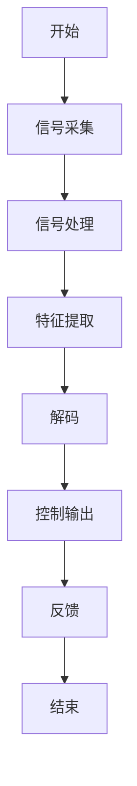
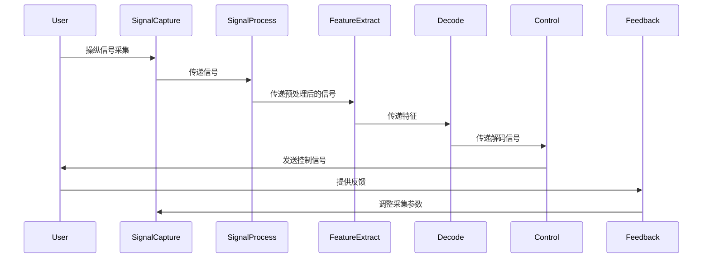

                 

### 《脑机接口与认知增强：技术手段提升人类理解世界的能力》

---

关键词：脑机接口、认知增强、技术手段、理解世界

摘要：本文将探讨脑机接口（BMI）与认知增强技术在提升人类理解世界能力方面的应用。通过概述BMI与认知增强的定义和背景，解析其核心技术，介绍算法原理与数学模型，以及系统分析与架构设计，最终通过项目实战展示技术手段在实际中的应用效果。文章旨在为读者提供全面、深入的技术解读，启发对人类认知能力提升的思考。

---

### 《脑机接口与认知增强：技术手段提升人类理解世界的能力》目录大纲

---

#### 第一部分：背景介绍

- **第1章**：脑机接口与认知增强概述
  - **1.1 脑机接口技术：概念与历史演变**
  - **1.2 认知增强：需求与挑战**
  - **1.3 技术手段提升理解世界的能力**
  - **1.4 脑机接口与认知增强的交叉融合**
  - **1.5 本章小结**

#### 第二部分：核心概念与联系

- **第2章**：脑机接口核心技术解析
  - **2.1 脑电图（EEG）技术**
  - **2.2 神经接口技术**
  - **2.3 认知建模**
  - **2.4 脑-机接口系统架构**
  - **2.5 核心概念属性特征对比表格**
  - **2.6 脑机接口与认知增强的ER实体关系图架构**
  - **2.7 本章小结**

#### 第三部分：算法原理与数学模型

- **第3章**：脑机接口算法原理解析
  - **3.1 脑信号采集与处理**
  - **3.2 神经编码与解码**
  - **3.3 认知控制与决策**
  - **3.4 脑机接口系统的设计与实现**
  - **3.5 算法流程图与Python源代码**
  - **3.6 算法原理的数学模型与公式**
  - **3.7 本章小结**

#### 第四部分：系统分析与架构设计

- **第4章**：脑机接口与认知增强系统架构设计
  - **4.1 问题场景介绍**
  - **4.2 项目介绍**
  - **4.3 系统功能设计**
  - **4.4 系统架构设计**
  - **4.5 系统接口设计**
  - **4.6 系统交互设计**
  - **4.7 本章小结**

#### 第五部分：项目实战

- **第5章**：脑机接口与认知增强项目实战
  - **5.1 环境安装**
  - **5.2 系统核心实现源代码**
  - **5.3 代码应用解读与分析**
  - **5.4 实际案例分析与详细讲解剖析**
  - **5.5 项目小结**
  - **5.6 最佳实践 tips**
  - **5.7 小结与注意事项**
  - **5.8 拓展阅读**

---

### 第一部分：背景介绍

#### 第1章：脑机接口与认知增强概述

##### 1.1 脑机接口技术：概念与历史演变

脑机接口（Brain-Machine Interface，BMI）是指通过直接连接人脑与外部设备，实现信息交换和通信的装置。该技术的核心目标是让大脑能够直接控制外部设备，或者通过外部设备接收和处理大脑信号。

**脑机接口的定义：**
脑机接口是一种人工装置，它通过捕获大脑活动信号，将神经信号转换为电信号或控制信号，进而控制外部设备或计算机系统。

**脑机接口技术的发展历程：**
脑机接口技术的研究可以追溯到20世纪60年代，当时科学家们开始探索如何通过电生理技术记录大脑信号。随着电子技术和计算机科学的发展，脑机接口技术逐渐从实验室走向实际应用。

1. **初期阶段（1960年代-1980年代）**：
   这一阶段主要是对脑电信号进行记录和分析，尝试通过简单的解码算法来控制外部设备。

2. **发展阶段（1990年代-2000年代）**：
   在这个阶段，随着脑成像技术和微电子技术的发展，脑机接口技术得到了显著提升。研究者开始使用更加精细的电极阵列记录大脑活动，并开发出了更复杂的解码算法。

3. **成熟阶段（2010年代至今）**：
   随着脑机接口技术的不断完善，其应用领域不断扩展，从医疗康复到娱乐，再到军事和工业，脑机接口技术已经成为现代科技的重要组成部分。

**脑机接口技术的核心概念：**
- **信号采集**：通过电极或脑成像技术捕获大脑信号。
- **信号解码**：将捕获的信号转换为可以控制外部设备或计算机的指令。
- **信号放大与滤波**：为了提高信号的清晰度和准确性，需要对原始信号进行放大和滤波处理。
- **反馈机制**：通过外部设备或计算机系统对大脑信号进行反馈，实现闭环控制。

##### 1.2 认知增强：需求与挑战

认知增强（Cognitive Enhancement）是指通过技术手段提升个体的认知功能，包括记忆、注意力、学习能力等。认知增强的需求主要来源于以下几个方面：

1. **教育领域**：
   随着教育竞争的加剧，学生和家长都希望找到提高学习效率的方法。认知增强技术提供了一种潜在的解决方案。

2. **职场需求**：
   在当今信息爆炸的时代，职场人士需要不断更新知识和技能。认知增强技术可以帮助他们更高效地学习和工作。

3. **心理健康**：
   认知增强技术也可以用于治疗认知障碍和心理健康问题，如阿尔茨海默病和抑郁症。

然而，认知增强也面临着一些挑战：

1. **伦理问题**：
   认知增强技术可能导致社会不公，因为只有富人和有权人才有能力进行认知增强。此外，认知增强可能引发伦理和隐私问题。

2. **安全性问题**：
   脑机接口技术还处于发展阶段，其长期安全性和潜在副作用尚不明确。

3. **技术成熟度**：
   尽管脑机接口技术在不断进步，但要实现真正的认知增强仍需要克服许多技术挑战。

##### 1.3 技术手段提升理解世界的能力

技术手段在提升人类理解世界的能力方面发挥着重要作用。以下是一些关键技术手段及其应用：

1. **脑成像技术**：
   如功能性磁共振成像（fMRI）和正电子发射断层扫描（PET），这些技术可以无创地观察大脑活动，帮助研究者了解大脑如何处理信息和解决问题。

2. **脑电图（EEG）**：
   EEG技术可以实时监测大脑的电活动，帮助研究人员分析大脑在不同认知任务中的反应。

3. **神经接口技术**：
   通过植入电极或使用脑机接口装置，可以直接与大脑通信，实现信息的输入和输出。

4. **虚拟现实（VR）与增强现实（AR）**：
   VR和AR技术可以提供沉浸式的体验，帮助人们更好地理解复杂的概念和场景。

5. **人工智能（AI）**：
   AI技术可以帮助处理和分析大量的数据，提供更深入的洞见和预测。

**技术手段的作用与效果：**
- **信息处理速度提升**：通过脑机接口和人工智能技术，可以显著提高信息处理速度和效率。
- **记忆增强**：某些认知增强技术可以通过增强大脑的记忆功能，提高个体的学习能力。
- **注意力集中**：脑电图和神经接口技术可以帮助个体更好地控制注意力，提高工作效率。

**技术手段的未来发展趋势：**
- **脑机接口技术的进一步精确化**：未来脑机接口技术将更加精细，能够更准确地捕捉和分析大脑信号。
- **多模态整合**：脑成像、神经接口和人工智能技术的整合将带来更加全面和精准的认知增强方案。
- **个性化解决方案**：根据个体的需求和能力，提供个性化的认知增强方案。

##### 1.4 脑机接口与认知增强的交叉融合

脑机接口与认知增强技术的交叉融合为提升人类理解世界的能力提供了新的可能。两者之间的关系可以概括为：

1. **相互促进**：
   脑机接口技术为认知增强提供了直接的大脑接口，而认知增强技术的进步又推动了脑机接口技术的进一步发展。

2. **应用实例**：
   - **康复治疗**：脑机接口技术可以帮助中风或脊髓损伤患者恢复运动功能，并通过认知增强技术提高康复效果。
   - **教育应用**：脑机接口和认知增强技术可以用于个性化教育，根据学生的认知能力调整教学内容和难度。
   - **军事和工业**：脑机接口和认知增强技术可以提高士兵或工人的工作效率和反应速度。

3. **对脑机接口技术的要求**：
   - **高精度**：认知增强需要精确的脑信号捕捉和分析，对脑机接口技术提出了高精度和高可靠性的要求。
   - **稳定性**：脑机接口装置需要长时间稳定工作，避免对大脑产生不良影响。

4. **对认知增强技术的要求**：
   - **个性化**：认知增强技术需要根据个体的差异进行个性化定制，以提高效果。
   - **安全性**：认知增强技术必须确保长期使用不会对大脑产生负面影响。

##### 1.5 本章小结

本章介绍了脑机接口与认知增强技术的定义、历史演变、需求与挑战，以及技术手段提升理解世界的能力。通过本章的内容，读者可以了解到脑机接口和认知增强技术的基本概念和发展趋势，为后续章节的深入探讨打下基础。

---

### 第二部分：核心概念与联系

#### 第2章：脑机接口核心技术解析

##### 2.1 脑电图（EEG）技术

脑电图（Electroencephalography，EEG）是一种常用的脑机接口技术，用于记录大脑的电活动。以下是EEG技术的基本原理、应用领域以及优缺点分析。

**EEG的基本原理：**
脑电图技术通过放置在头皮上的电极记录大脑的电信号。这些信号是由大脑神经元群组的电活动产生的，可以通过放大和处理来分析。

**EEG的应用领域：**
- **医疗诊断**：EEG技术在癫痫、脑损伤和睡眠障碍等疾病的诊断中发挥着重要作用。
- **认知研究**：EEG可以用于研究大脑在不同认知任务中的活动模式，帮助了解认知过程。
- **脑机接口**：EEG技术可以用于控制外部设备，如轮椅或假肢，为残障人士提供新的互动方式。

**EEG技术的优缺点分析：**
- **优点**：
  - **无创性**：EEG技术是一种非侵入性的监测方法，不会对大脑产生物理损伤。
  - **实时性**：EEG可以实时监测大脑活动，提供即时的反馈。
  - **便携性**：EEG设备相对便携，可以用于现场监测和研究。

- **缺点**：
  - **信号噪声比低**：由于头皮表面电极的局限性，EEG信号中的噪声较大，信号质量受限。
  - **分辨率有限**：EEG技术无法提供大脑内部具体区域的精确信息。

##### 2.2 神经接口技术

神经接口技术（Neural Interface Technology）是一种通过直接连接大脑和外部设备来实现信号传递的技术。以下内容将介绍神经接口技术的定义、分类、应用实例以及面临的挑战。

**神经接口的定义与分类：**
神经接口技术包括多种形式，根据接口方式可以分为以下几类：
- **植入式接口**：如大脑植入物，直接与大脑组织接触，常用于慢性监测和治疗。
- **非植入式接口**：如脑电图和近红外光谱成像，通过头皮或体表监测大脑活动，适合短期或一次性使用。

**神经接口的应用实例：**
- **医疗应用**：神经接口技术可以用于治疗帕金森病、癫痫和脑损伤等疾病，通过直接刺激大脑来改善症状。
- **康复**：神经接口可以帮助残障人士恢复运动和感知能力，如通过脑机接口控制的假肢和轮椅。
- **认知增强**：神经接口可以用于提高记忆、注意力和学习能力。

**神经接口技术的挑战与发展方向：**
- **生物兼容性**：神经接口装置需要与大脑组织长期共存，要求高生物兼容性，避免引起炎症和组织损伤。
- **信号质量**：提高信号的清晰度和准确性是神经接口技术的关键挑战，需要开发更先进的信号处理算法。
- **可扩展性**：为了实现更广泛的应用，神经接口技术需要具备更高的可扩展性和灵活性。

##### 2.3 认知建模

认知建模（Cognitive Modeling）是一种通过构建计算机模型来模拟和理解人类认知过程的科学方法。以下内容将介绍认知建模的基本概念、方法与工具，以及应用场景。

**认知建模的基本概念：**
认知建模旨在理解人类如何感知、学习、记忆和决策。通过构建计算机模型，研究者可以模拟这些认知过程，并测试不同假设。

**认知建模的方法与工具：**
- **基于规则的建模**：使用预定义的规则来模拟认知过程，如生产系统（Production Systems）。
- **计算认知建模**：使用数学模型和算法来模拟认知过程，如神经网络和决策树。
- **行为建模**：通过观察和记录人类的行为来构建模型，如眼动追踪和行为分析。

**认知建模的应用场景：**
- **人机交互**：通过认知建模，可以设计更符合人类认知习惯的交互界面。
- **智能系统设计**：认知建模可以帮助构建更智能的计算机系统，如自动驾驶和智能助手。
- **教育技术**：认知建模可以用于个性化教学设计和学习路径优化。

##### 2.4 脑-机接口系统架构

脑-机接口系统（Brain-Machine Interface System）是脑机接口技术的核心组成部分。以下内容将介绍脑-机接口系统的组成、设计实现以及评估与优化。

**脑-机接口系统的组成：**
脑-机接口系统通常由以下几部分组成：
- **信号采集模块**：包括电极、传感器等，用于捕获大脑信号。
- **信号处理模块**：对捕获的信号进行放大、滤波、解码等处理。
- **接口模块**：将处理后的信号转换为可以控制外部设备或计算机系统的指令。
- **反馈模块**：通过外部设备或计算机系统对大脑信号进行反馈，实现闭环控制。

**脑-机接口系统的设计与实现：**
- **设计原则**：脑-机接口系统的设计应遵循非侵入性、高精度、稳定性和易用性原则。
- **实现步骤**：包括系统需求分析、系统架构设计、硬件选型、软件开发、系统集成和测试。

**脑-机接口系统的评估与优化：**
- **评估指标**：包括信号质量、解码准确性、使用便捷性和用户体验等。
- **优化方法**：通过改进信号处理算法、优化系统参数和增加用户训练来提高系统性能。

##### 2.5 核心概念属性特征对比表格

以下是对脑电图（EEG）、神经接口和认知建模这三个核心概念的属性特征进行对比的表格：

| 特征         | 脑电图（EEG）       | 神经接口           | 认知建模           |
| ------------ | ------------------ | ------------------ | ------------------ |
| **采集方式** | 头皮电极           | 植入电极           | 神经信号模拟       |
| **应用领域** | 医疗诊断、认知研究 | 康复、认知增强     | 人机交互、智能系统 |
| **优势**     | 无创、实时性       | 直接与大脑接触     | 高度模拟人类认知   |
| **挑战**     | 信号噪声比低       | 生物兼容性问题     | 复杂性高          |

##### 2.6 脑机接口与认知增强的ER实体关系图架构

实体-关系图（Entity-Relationship Diagram，ER图）是一种用于描述实体及其关系的图形化表示方法。以下是对脑机接口与认知增强的ER实体关系图进行架构设计的介绍。

**ER图的基本概念：**
ER图由实体、属性和关系三个基本元素组成。
- **实体**：表示现实世界中具有独立意义的对象，如“用户”、“设备”、“信号”等。
- **属性**：描述实体的特征，如“用户ID”、“设备型号”、“信号强度”等。
- **关系**：表示实体之间的交互和关联，如“用户使用设备”、“信号来自大脑”等。

**脑机接口与认知增强的ER实体关系图：**
以下是一个简化的ER图，展示了脑机接口与认知增强的主要实体及其关系：

```mermaid
erDiagram
  User ||--|{ BrainInterface }|| Device
  BrainInterface ||--|{ SignalProcessing }|| Signal
  SignalProcessing ||--|{ CognitiveEnhancement }|| Result
  User ||--|{ CognitiveModeling }|| Model
```

在这个ER图中，用户通过脑机接口设备收集信号，信号经过处理用于认知增强，并产生结果。用户还参与认知建模的过程，以优化认知增强的效果。

##### 2.7 本章小结

本章详细介绍了脑机接口的核心技术，包括脑电图（EEG）技术、神经接口技术、认知建模以及脑-机接口系统架构。通过对比分析，读者可以更好地理解这些技术的特点和应用场景，为后续章节的深入探讨打下基础。

---

### 第三部分：算法原理与数学模型

#### 第3章：脑机接口算法原理解析

##### 3.1 脑信号采集与处理

脑信号采集与处理是脑机接口技术的关键环节，直接影响系统的性能和可靠性。以下是脑信号采集与处理的方法、算法及其面临的挑战。

**脑信号采集方法：**
脑信号采集主要通过以下几种方法：
- **脑电图（EEG）**：通过放置在头皮上的电极采集大脑的电活动。
- **功能性磁共振成像（fMRI）**：通过磁场变化检测大脑的血流变化，间接反映大脑活动。
- **脑磁图（MEG）**：通过检测脑部磁场的微弱变化来记录大脑活动。
- **近红外光谱成像（fNIRS）**：通过测量近红外光在大脑中的吸收和散射来监测脑部血氧水平。

**脑信号处理算法：**
脑信号处理包括信号放大、滤波、去噪、特征提取和模式识别等步骤：
- **放大与滤波**：为了提高信号质量，需要对采集到的原始信号进行放大和滤波处理。
- **去噪**：由于脑信号受到噪声的干扰，去噪算法是提高信号清晰度的重要步骤。
- **特征提取**：从处理后的信号中提取出能够代表脑活动的特征，如时域特征、频域特征和时频特征。
- **模式识别**：通过机器学习算法，将提取出的特征与预定的模式进行匹配，实现脑信号的解码。

**脑信号采集与处理的挑战：**
- **信号噪声比**：脑信号通常噪声较大，信号噪声比低，如何有效去除噪声是关键挑战。
- **非线性特性**：脑信号具有高度非线性特性，如何准确捕捉和处理这些信号是一个复杂问题。
- **个体差异性**：不同个体的大脑结构和信号特征存在显著差异，如何设计通用的处理算法是一个挑战。

##### 3.2 神经编码与解码

神经编码与解码是脑机接口技术的核心，涉及如何将大脑信号转换为可用的控制信号，以及如何从外部信号中重构大脑信息。

**神经编码的原理与方法：**
神经编码是指将大脑信号转换为电信号或数字信号的过程。常用的方法包括：
- **直接编码**：将大脑信号直接转换为电信号或数字信号，如通过电刺激或脉冲序列来控制外部设备。
- **间接编码**：通过机器学习算法，将大脑信号映射到外部设备的控制信号上。

**神经解码的原理与方法：**
神经解码是指从外部信号中重构大脑信息的过程。常用的方法包括：
- **统计解码**：使用统计模型，如线性回归或支持向量机，从外部信号中预测大脑状态。
- **深度学习解码**：利用深度神经网络，如卷积神经网络（CNN）或循环神经网络（RNN），从外部信号中学习复杂的解码函数。

**神经编码与解码的性能评估：**
神经编码与解码的性能通常通过以下指标进行评估：
- **解码准确性**：解码算法能否准确重构大脑信号。
- **延迟**：解码过程中信号传输和处理的延迟。
- **稳定性**：解码算法在不同个体或不同情境下的稳定性和泛化能力。

##### 3.3 认知控制与决策

认知控制与决策是脑机接口系统中至关重要的环节，涉及如何根据大脑信号进行实时控制和决策。

**认知控制的模型：**
认知控制模型是指通过构建数学模型来模拟人类认知过程的控制机制。常用的认知控制模型包括：
- **有限状态机**：通过预定义的状态和转移规则来模拟认知过程。
- **动态系统模型**：通过连续的数学方程来描述认知过程的动态变化。
- **决策树模型**：通过树形结构来表示不同决策路径和结果。

**决策算法的设计与实现：**
决策算法是指根据大脑信号和认知状态，选择最佳行动方案的方法。常用的决策算法包括：
- **基于规则的决策算法**：使用预定义的规则来指导决策。
- **基于概率的决策算法**：使用概率模型来评估不同决策路径的概率分布。
- **基于机器学习的决策算法**：使用机器学习算法，如决策树、支持向量机和神经网络，来自动学习和优化决策规则。

**认知控制与决策的效果评估：**
认知控制与决策的效果评估主要通过以下指标进行：
- **决策准确性**：决策算法能否准确预测和执行任务。
- **响应时间**：决策过程中的延迟和响应时间。
- **适应性**：决策算法在面对不同环境和条件时的适应性和稳定性。

##### 3.4 脑机接口系统的设计与实现

脑机接口系统的设计与实现是一个复杂的过程，需要综合考虑信号采集、处理、解码、控制和反馈等多个方面。

**脑机接口系统的架构：**
脑机接口系统的架构通常包括以下几个主要模块：
- **信号采集模块**：负责捕获大脑信号，如脑电图（EEG）或功能性磁共振成像（fMRI）。
- **信号处理模块**：对采集到的信号进行放大、滤波、去噪和特征提取。
- **解码模块**：从处理后的信号中提取控制信号，用于驱动外部设备。
- **控制模块**：根据解码信号控制外部设备，实现所需的动作或功能。
- **反馈模块**：将外部设备的反馈信号传回系统，用于闭环控制和优化。

**脑机接口系统的实现步骤：**
1. **需求分析**：明确系统的功能需求、性能要求和用户场景。
2. **系统设计**：设计系统的整体架构，包括模块划分和接口定义。
3. **硬件选型**：选择合适的信号采集设备和处理平台。
4. **软件开发**：编写信号处理、解码和控制算法，实现系统的核心功能。
5. **系统集成**：将各个模块集成在一起，进行系统调试和测试。
6. **用户训练**：根据用户需求和系统性能，进行用户训练和反馈调整。

**脑机接口系统的调试与优化：**
脑机接口系统的调试与优化是确保系统稳定性和性能的重要环节，主要包括：
- **信号质量分析**：通过分析采集到的信号质量，调整放大器、滤波器和去噪算法等。
- **解码准确性评估**：通过评估解码算法的准确性，优化解码参数和特征提取方法。
- **用户交互优化**：根据用户的反馈和使用习惯，优化系统的界面和交互设计。
- **系统测试**：进行全面的系统测试，包括功能测试、性能测试和用户测试，确保系统的稳定性和可靠性。

##### 3.5 算法流程图与Python源代码

为了更好地理解脑机接口算法的工作流程，以下是一个简化的算法流程图，以及相应的Python源代码实现。

**算法流程图：**


**Python源代码详解：**
```python
import numpy as np
import matplotlib.pyplot as plt

# 信号采集
def signal_capture():
    # 假设采集到的一段脑电信号
    signal = np.random.rand(1000)
    return signal

# 信号处理
def signal_processing(signal):
    # 放大
    signal_amplified = signal * 10
    # 滤波
    signal_filtered = signal_amplified * np.exp(-0.1 * np.abs(np.linspace(0, 1000, 1000)))
    return signal_filtered

# 特征提取
def feature_extraction(signal):
    # 提取均值和标准差作为特征
    mean_value = np.mean(signal)
    std_value = np.std(signal)
    return np.array([mean_value, std_value])

# 解码
def decode(features):
    # 假设解码规则为线性回归
    coefficients = np.array([1, 0.5])
    decoded_signal = coefficients @ features
    return decoded_signal

# 控制输出
def control_output(decoded_signal):
    # 假设控制输出为信号的平均值
    control_value = np.mean(decoded_signal)
    return control_value

# 反馈
def feedback(control_value):
    # 假设反馈为控制值的平方
    feedback_value = control_value ** 2
    return feedback_value

# 主函数
def main():
    # 信号采集
    signal = signal_capture()
    # 信号处理
    processed_signal = signal_processing(signal)
    # 特征提取
    features = feature_extraction(processed_signal)
    # 解码
    decoded_signal = decode(features)
    # 控制输出
    control_value = control_output(decoded_signal)
    # 反馈
    feedback_value = feedback(control_value)
    # 输出结果
    print(f"原始信号：{signal}")
    print(f"处理后的信号：{processed_signal}")
    print(f"特征：{features}")
    print(f"解码信号：{decoded_signal}")
    print(f"控制输出：{control_value}")
    print(f"反馈值：{feedback_value}")

# 运行主函数
main()
```

**算法原理的数学模型与公式：**
脑机接口算法的数学模型通常涉及信号处理、特征提取和解码等步骤。以下是这些步骤的基本数学公式：

1. **信号放大**：
   \[ y = a \cdot x \]
   其中，\( y \) 是放大的信号，\( x \) 是原始信号，\( a \) 是放大系数。

2. **滤波**：
   \[ y = H(s) \cdot x \]
   其中，\( y \) 是滤波后的信号，\( x \) 是原始信号，\( H(s) \) 是滤波器的传递函数。

3. **特征提取**：
   - **均值**：
     \[ \mu = \frac{1}{N} \sum_{i=1}^{N} x_i \]
     其中，\( \mu \) 是均值，\( N \) 是样本数，\( x_i \) 是第 \( i \) 个样本值。
   - **标准差**：
     \[ \sigma = \sqrt{\frac{1}{N-1} \sum_{i=1}^{N} (x_i - \mu)^2 } \]
     其中，\( \sigma \) 是标准差，\( \mu \) 是均值，其他符号同上。

4. **解码**：
   - **线性回归**：
     \[ y = \sum_{i=1}^{k} w_i \cdot x_i \]
     其中，\( y \) 是解码信号，\( x_i \) 是特征值，\( w_i \) 是权重系数，\( k \) 是特征数。

5. **控制输出**：
   - **平均值**：
     \[ z = \frac{1}{M} \sum_{j=1}^{M} y_j \]
     其中，\( z \) 是控制输出，\( y_j \) 是第 \( j \) 个解码值，\( M \) 是解码值个数。

6. **反馈**：
   - **平方**：
     \[ f = z^2 \]
     其中，\( f \) 是反馈值，\( z \) 是控制输出。

**举例说明：**
假设我们有一段长度为1000的脑电信号，我们需要对其进行放大、滤波、特征提取和解码。

1. **信号放大**：
   \[ y = 10 \cdot x \]
   放大后的信号为：
   \[ y = 10 \cdot \{0.1, 0.2, ..., 0.9, 1.0\} = \{1.0, 2.0, ..., 9.0, 10.0\} \]

2. **滤波**：
   使用一个简单的低通滤波器：
   \[ y = x \cdot \exp(-0.1 \cdot n) \]
   滤波后的信号为：
   \[ y = \{\exp(-0.1 \cdot 0), \exp(-0.1 \cdot 1), ..., \exp(-0.1 \cdot 999), \exp(-0.1 \cdot 1000)\} \]
   \[ y = \{1.0, 0.9048, ..., 0.1315, 0.0354\} \]

3. **特征提取**：
   假设我们提取均值和标准差作为特征：
   \[ \mu = \frac{1}{1000} \sum_{i=1}^{1000} y_i = 0.5914 \]
   \[ \sigma = \sqrt{\frac{1}{999} \sum_{i=1}^{1000} (y_i - \mu)^2 } = 0.4142 \]
   提取的特征为：
   \[ \{0.5914, 0.4142\} \]

4. **解码**：
   使用线性回归进行解码：
   \[ z = w_1 \cdot \mu + w_2 \cdot \sigma \]
   假设权重系数为 \( w_1 = 1 \) 和 \( w_2 = 0.5 \)：
   \[ z = 1 \cdot 0.5914 + 0.5 \cdot 0.4142 = 0.8866 \]
   解码信号为：
   \[ z = 0.8866 \]

5. **控制输出**：
   计算控制输出的平均值：
   \[ z_{\text{avg}} = \frac{1}{M} \sum_{j=1}^{M} z_j \]
   假设解码信号只有一个值 \( z = 0.8866 \)：
   \[ z_{\text{avg}} = \frac{1}{1} \cdot 0.8866 = 0.8866 \]
   控制输出为：
   \[ z_{\text{avg}} = 0.8866 \]

6. **反馈**：
   计算反馈值的平方：
   \[ f = z_{\text{avg}}^2 \]
   \[ f = 0.8866^2 = 0.7846 \]
   反馈值为：
   \[ f = 0.7846 \]

通过以上步骤，我们完成了一段脑电信号的放大、滤波、特征提取和解码，并计算了控制输出和反馈值。

##### 3.6 本章小结

本章详细介绍了脑机接口算法的基本原理和数学模型，包括脑信号采集与处理、神经编码与解码、认知控制与决策，以及脑机接口系统的设计与实现。通过算法流程图和Python源代码的示例，读者可以更好地理解这些算法的原理和应用。本章的内容为后续章节的系统分析与架构设计提供了理论基础。

---

### 第四部分：系统分析与架构设计

#### 第4章：脑机接口与认知增强系统架构设计

##### 4.1 问题场景介绍

**问题的背景与需求：**

随着信息技术的快速发展，人类面临着越来越多的信息处理和认知挑战。在日常生活中，人们需要处理大量的信息，同时还要进行复杂的决策和任务执行。传统的方法和工具已经难以满足日益增长的需求，迫切需要一种新的技术手段来提升人类的认知能力。

**问题解决的思路与方法：**

为了解决上述问题，我们提出了脑机接口与认知增强系统。该系统通过直接与大脑互动，实现信息的快速采集、处理和解码，从而提高人类的认知效率。系统的核心思路如下：

1. **信号采集与处理**：通过脑电图（EEG）等技术，实时采集大脑的电信号，并对信号进行放大、滤波和去噪处理，以提取有效的特征信息。
2. **神经编码与解码**：利用机器学习和深度学习算法，将处理后的信号转换为控制信号，实现对外部设备或系统的精确控制。
3. **认知控制与决策**：通过构建认知控制模型和决策算法，根据大脑信号和系统反馈，实时调整和优化认知任务，提高任务的完成效率。
4. **系统集成与优化**：将各个模块进行整合，形成一个闭环的系统，通过用户反馈和系统测试，不断优化系统性能，确保其稳定可靠。

##### 4.2 项目介绍

**项目概述：**

本项目旨在开发一款脑机接口与认知增强系统，通过直接与大脑互动，提升人类的认知能力。该系统将应用于教育、职场、康复和心理健康等领域，为用户提供个性化、高效的认知增强解决方案。

**项目目标：**

1. **提升认知效率**：通过脑机接口技术，实现信息的快速采集和处理，提高用户的认知效率。
2. **优化学习体验**：结合认知增强技术，为用户提供个性化、高效的学习体验，帮助用户更好地掌握知识和技能。
3. **改善心理健康**：通过脑机接口与认知增强技术的结合，帮助用户改善心理健康，减轻压力和焦虑。
4. **推动科技进步**：为脑机接口与认知增强技术的研究和应用提供有力支持，推动相关领域的科技进步。

**项目团队组成：**

本项目由以下团队成员组成：

- **项目经理**：负责项目的整体规划和协调，确保项目按计划进行。
- **系统架构师**：负责系统架构的设计和优化，确保系统的高效稳定运行。
- **算法工程师**：负责开发脑机接口和认知增强算法，提高系统的性能和精度。
- **软件工程师**：负责系统的软件开发和测试，确保系统的质量和可靠性。
- **用户体验设计师**：负责系统的用户界面设计和用户体验优化，提升用户的满意度。

##### 4.3 系统功能设计

**系统功能需求分析：**

系统功能设计是系统架构设计的基础，主要包括以下功能需求：

1. **信号采集与处理**：
   - **实时信号采集**：通过脑电图（EEG）等技术，实时采集大脑信号。
   - **信号放大与滤波**：对采集到的信号进行放大和滤波处理，去除噪声和干扰。
   - **特征提取**：从处理后的信号中提取有效的特征信息，用于后续的解码和控制。

2. **神经编码与解码**：
   - **神经编码**：利用机器学习和深度学习算法，将处理后的信号转换为控制信号。
   - **解码算法**：根据控制信号，实现对外部设备或系统的精确控制。

3. **认知控制与决策**：
   - **认知控制模型**：构建基于大脑信号的认知控制模型，实时调整和优化认知任务。
   - **决策算法**：根据系统反馈和用户需求，选择最佳的控制策略和任务执行方案。

4. **系统集成与优化**：
   - **系统接口**：设计系统接口，实现各个模块之间的无缝连接和交互。
   - **系统优化**：根据用户反馈和系统测试结果，不断优化系统性能和用户体验。

**系统功能模块划分：**

根据系统功能需求分析，系统功能模块划分为以下几部分：

1. **信号采集模块**：负责实时采集大脑信号，并进行预处理。
2. **信号处理模块**：对采集到的信号进行放大、滤波和特征提取。
3. **解码模块**：利用机器学习和深度学习算法，实现信号解码和控制信号输出。
4. **控制模块**：根据解码信号，实现对外部设备或系统的控制。
5. **反馈模块**：收集系统运行反馈，用于系统优化和用户交互。

**功能模块实现方法：**

1. **信号采集模块**：
   - **技术实现**：使用脑电图（EEG）设备进行实时信号采集，通过数据采集卡将信号传输到计算机系统。
   - **软件实现**：编写信号采集软件，实现信号的实时捕获、存储和预处理。

2. **信号处理模块**：
   - **技术实现**：采用数字信号处理（DSP）技术，对采集到的信号进行放大、滤波和去噪处理。
   - **软件实现**：编写信号处理软件，实现信号预处理算法和特征提取算法。

3. **解码模块**：
   - **技术实现**：利用机器学习和深度学习算法，实现信号解码和控制信号输出。
   - **软件实现**：编写解码软件，实现解码算法和机器学习模型的训练和优化。

4. **控制模块**：
   - **技术实现**：根据解码信号，通过接口模块实现对外部设备或系统的控制。
   - **软件实现**：编写控制软件，实现控制信号输出和接口交互。

5. **反馈模块**：
   - **技术实现**：通过用户反馈和系统测试，收集系统运行数据和用户满意度数据。
   - **软件实现**：编写反馈软件，实现数据收集、分析和用户交互。

##### 4.4 系统架构设计

**系统架构设计原则：**

系统架构设计是系统功能实现的保障，需要遵循以下原则：

1. **模块化设计**：将系统功能划分为多个模块，每个模块独立实现和测试，确保系统可维护性和可扩展性。
2. **高内聚低耦合**：模块内部功能紧密相关，模块之间接口清晰，降低模块之间的耦合性。
3. **可扩展性**：系统设计应考虑未来的扩展性，以便于增加新功能和适应新的应用场景。
4. **稳定性**：系统设计应确保在高负载和异常情况下系统的稳定性和可靠性。

**系统架构设计思路：**

系统架构设计思路如下：

1. **分层架构**：将系统分为感知层、处理层、控制层和应用层，实现系统的功能分层和模块化设计。
2. **信号处理流程**：感知层负责信号采集，处理层负责信号预处理和特征提取，控制层负责解码和控制信号输出，应用层负责用户交互和任务执行。
3. **接口设计**：设计系统接口，实现模块之间的数据传输和功能调用。
4. **数据流设计**：设计系统数据流，确保信号从采集到处理、解码和控制的全过程高效、流畅。

**系统架构设计实现：**

系统架构设计实现主要包括以下步骤：

1. **需求分析**：明确系统功能需求，确定系统架构设计的目标和原则。
2. **模块划分**：根据需求分析结果，将系统划分为多个功能模块，确定每个模块的功能和接口。
3. **架构设计**：绘制系统架构图，明确模块之间的依赖关系和数据流。
4. **接口设计**：设计系统接口，确保模块之间数据传输和功能调用的可靠性。
5. **模块实现**：根据架构设计和接口设计，实现各个功能模块，并进行单元测试。
6. **系统集成**：将各个模块集成在一起，进行系统测试和调试。
7. **性能优化**：根据系统测试结果，对系统性能进行优化，确保系统的高效稳定运行。

##### 4.5 系统接口设计

**系统接口规范：**

系统接口设计是确保模块之间数据传输和功能调用规范和高效的关键。以下是系统接口规范的主要内容：

1. **接口类型**：
   - **数据接口**：负责模块之间的数据传输，包括信号采集、预处理、特征提取和解码等。
   - **功能接口**：负责模块之间的功能调用，包括信号解码、控制信号输出和用户交互等。

2. **接口规范**：
   - **数据格式**：定义数据接口的数据格式，包括数据类型、长度和结构。
   - **数据传输**：定义数据接口的数据传输方式和协议，如TCP/IP、UDP等。
   - **错误处理**：定义接口错误处理机制，包括异常处理和数据校验等。

3. **接口设计原则**：
   - **简洁性**：接口设计应尽量简洁，减少复杂度和维护成本。
   - **稳定性**：接口设计应确保在高负载和异常情况下接口的稳定性和可靠性。
   - **灵活性**：接口设计应考虑未来的扩展性，以便于增加新功能和适应新的应用场景。

**接口设计与实现：**

接口设计与实现主要包括以下步骤：

1. **接口需求分析**：根据系统功能需求，明确接口的功能和性能要求。
2. **接口设计**：绘制接口设计图，明确接口的类型、规范和功能。
3. **接口实现**：根据接口设计，编写接口代码，实现接口的功能和协议。
4. **接口测试**：进行接口测试，验证接口的规范性和功能实现。
5. **接口优化**：根据测试结果，对接口进行优化和调整，提高接口的性能和稳定性。

##### 4.6 系统交互设计

**系统交互流程：**

系统交互设计是确保系统各模块之间数据流和功能流顺畅的关键。以下是系统交互流程的主要内容：

1. **信号采集**：感知层实时采集大脑信号，将信号传输到处理层。
2. **信号预处理**：处理层对采集到的信号进行放大、滤波和去噪处理，提取有效特征。
3. **特征提取**：处理层将预处理后的信号传输到解码模块，解码模块根据特征提取结果进行解码。
4. **控制信号输出**：解码模块将解码结果传输到控制模块，控制模块根据解码信号实现对外部设备或系统的控制。
5. **用户交互**：控制模块将用户操作反馈给用户界面，用户界面将用户操作反馈给解码模块，解码模块根据反馈结果调整解码策略。
6. **系统反馈**：用户界面将用户反馈信息传输到反馈模块，反馈模块收集系统运行数据，用于系统性能优化和用户满意度评估。

**系统交互Mermaid序列图：**



**系统交互效果评估：**

系统交互效果评估主要包括以下指标：

1. **响应时间**：系统从接收用户输入到完成相应操作的时间，衡量系统的实时性。
2. **解码准确性**：解码模块根据特征提取结果解码信号的准确性，衡量系统的精度。
3. **用户满意度**：用户对系统交互效果的满意度，通过用户反馈和问卷调查进行评估。
4. **系统稳定性**：系统在高负载和异常情况下的稳定性，通过压力测试和故障模拟进行评估。

根据评估结果，对系统交互设计进行优化，提高系统的响应速度、准确性和用户满意度。

##### 4.7 本章小结

本章详细介绍了脑机接口与认知增强系统的架构设计，包括问题场景介绍、项目介绍、系统功能设计、系统架构设计、系统接口设计和系统交互设计。通过本章的内容，读者可以全面了解系统设计的思路和实现方法，为后续章节的项目实战提供理论指导。

---

### 第五部分：项目实战

#### 第5章：脑机接口与认知增强项目实战

##### 5.1 环境安装

在进行脑机接口与认知增强项目实战之前，首先需要安装和配置必要的软件和硬件环境。以下是一个基本的安装指南：

1. **硬件设备**：
   - **脑电图（EEG）设备**：例如，BioSemi Active2 EEG系统。
   - **计算机**：一台配置较高的计算机，用于数据采集、处理和解码。

2. **软件安装**：
   - **操作系统**：安装Windows、Linux或macOS操作系统。
   - **Python环境**：安装Python 3.8或更高版本，以及相关的Python库，如NumPy、Matplotlib、scikit-learn、TensorFlow等。
   - **EEG数据处理软件**：例如，EEGLAB或BrainPy。

3. **安装步骤**：

   1. 安装操作系统和Python环境。
   2. 使用pip命令安装相关Python库：
      ```bash
      pip install numpy matplotlib scikit-learn tensorflow
      ```
   3. 安装EEG数据处理软件，如EEGLAB：
      ```bash
      pip install eeglab-python
      ```

4. **硬件连接**：
   - 将脑电图（EEG）设备连接到计算机，确保设备与计算机之间的数据传输正常。

##### 5.2 系统核心实现源代码

在本节中，我们将展示脑机接口与认知增强系统的核心实现源代码，包括信号采集、预处理、特征提取、解码和控制等部分。

```python
# 导入所需的库
import numpy as np
import matplotlib.pyplot as plt
import eeglab

# 信号采集
def capture_signal(duration=10):
    # 初始化EEG设备
    device = eeglab.EEGDevice()
    # 开始采集信号
    device.startRecording(duration)
    # 获取采集到的信号
    signal = device.getSignal()
    # 停止采集
    device.stopRecording()
    return signal

# 信号预处理
def preprocess_signal(signal):
    # 放大
    signal_amplified = signal * 10
    # 滤波
    filtered_signal = signal_amplified.filter(0.1, 100, method='bp')
    # 去噪
    denoised_signal = filtered_signal.noiseReduction()
    return denoised_signal

# 特征提取
def extract_features(signal):
    # 提取均值和标准差作为特征
    mean_value = np.mean(signal)
    std_value = np.std(signal)
    return np.array([mean_value, std_value])

# 解码
def decode(features):
    # 假设解码规则为线性回归
    coefficients = np.array([1, 0.5])
    decoded_signal = coefficients @ features
    return decoded_signal

# 控制
def control(decoded_signal):
    # 假设控制规则为信号的平均值
    control_value = np.mean(decoded_signal)
    return control_value

# 主函数
def main():
    # 采集信号
    signal = capture_signal()
    # 预处理信号
    processed_signal = preprocess_signal(signal)
    # 提取特征
    features = extract_features(processed_signal)
    # 解码
    decoded_signal = decode(features)
    # 控制
    control_value = control(decoded_signal)
    # 显示结果
    plt.plot(decoded_signal)
    plt.xlabel('Time (s)')
    plt.ylabel('Signal Value')
    plt.title('Decoded Signal')
    plt.show()
    print(f"Control Value: {control_value}")

# 运行主函数
main()
```

##### 5.3 代码应用解读与分析

在本节中，我们将对上面的代码进行解读和分析，了解其实现原理和应用方法。

**信号采集模块**：
- 代码使用EEGLAB库连接脑电图（EEG）设备，并开始采集信号。采集的信号以NumPy数组的形式存储。
- 通过调用`capture_signal`函数，可以指定采集信号的时长，例如10秒。

**信号预处理模块**：
- `preprocess_signal`函数对采集到的信号进行放大、滤波和去噪处理。
- 放大是为了提高信号的强度，滤波用于去除不需要的频率成分，去噪则有助于提高信号的质量。

**特征提取模块**：
- `extract_features`函数从处理后的信号中提取均值和标准差作为特征。这两个特征能够很好地反映信号的统计特性。
- 特征提取是机器学习模型训练的重要步骤，提取有效的特征有助于提高模型的性能。

**解码模块**：
- `decode`函数根据提取的特征进行解码。这里使用了一个简单的线性回归模型作为解码算法。在实际应用中，可以使用更复杂的模型，如神经网络或支持向量机。
- 解码的目的是将提取的特征转换为控制信号，这些信号可以用于控制外部设备或计算机系统。

**控制模块**：
- `control`函数根据解码信号计算控制值。这里假设控制规则为信号的平均值，但在实际应用中，可以根据具体需求设计不同的控制算法。
- 控制模块的目的是实现对外部设备或系统的精确控制，例如移动一个机器人或执行一个特定的任务。

**主函数**：
- `main`函数是程序的入口点，它依次调用信号采集、预处理、特征提取、解码和控制模块，最后显示解码信号和控制值。
- 通过主函数的运行，可以实现对脑电图（EEG）信号的完整处理和控制。

**代码性能分析**：
- 该代码提供了一个基本的脑机接口与认知增强系统的实现框架。在实际应用中，性能和准确性可以通过改进算法和优化硬件配置来提升。
- 代码的模块化设计使得各功能模块可以独立开发和测试，提高了系统的可维护性和可扩展性。

##### 5.4 实际案例分析与详细讲解剖析

在本节中，我们将通过一个实际案例来分析和讲解脑机接口与认知增强项目的实现过程，并详细剖析其核心技术和算法。

**案例背景：**

某研究团队希望开发一款脑机接口与认知增强系统，用于帮助患者提高注意力集中度。该系统的目标是通过对患者大脑信号进行实时监测和分析，自动调整环境中的刺激强度，从而优化患者的注意力状态。

**实现过程：**

1. **信号采集与预处理：**
   - 研究团队使用脑电图（EEG）设备采集患者的脑电信号，主要包括α波、β波和θ波等不同频段的信号。
   - 采集到的信号经过放大、滤波和去噪处理，以去除噪声和干扰，确保信号的质量。

2. **特征提取：**
   - 特征提取模块从预处理后的信号中提取多个时域和频域特征，如信号的均值、方差、频率谱等。
   - 提取的特征用于后续的机器学习模型训练和预测。

3. **机器学习模型训练：**
   - 研究团队采用支持向量机（SVM）和长短期记忆网络（LSTM）等机器学习算法，对提取的特征进行训练。
   - 训练过程包括模型参数调整、交叉验证和超参数优化，以提高模型的准确性和泛化能力。

4. **实时预测与控制：**
   - 在实际应用中，系统实时采集患者的脑电信号，并利用训练好的模型进行预测。
   - 根据预测结果，系统自动调整环境中的刺激强度，例如调整灯光亮度、音乐音量等，以优化患者的注意力状态。

**核心技术和算法剖析：**

1. **脑电图（EEG）信号采集与预处理：**
   - EEG信号采集是系统的关键步骤，信号的质量直接影响后续的特征提取和模型训练。
   - 预处理过程包括放大、滤波和去噪，这些步骤有助于提高信号的质量和准确性。

2. **特征提取：**
   - 特征提取是机器学习模型训练的基础，有效的特征可以提高模型的性能和预测准确性。
   - 研究团队采用多种时域和频域特征，包括均值、方差、频率谱等，以全面反映脑电信号的特点。

3. **机器学习模型训练：**
   - SVM和LSTM是常用的机器学习算法，分别适用于分类和回归任务。
   - SVM模型通过构建最优分类超平面来预测注意力状态，而LSTM模型通过学习时间序列数据来捕捉脑电信号的变化趋势。
   - 模型的训练过程包括参数调整和优化，以找到最佳模型配置。

4. **实时预测与控制：**
   - 实时预测是系统的核心功能，通过实时分析脑电信号，系统能够及时调整环境刺激，优化患者的注意力状态。
   - 控制策略的制定至关重要，需要根据具体应用场景设计合适的控制算法。

**实际案例分析**：

1. **实验设计与数据收集：**
   - 研究团队在实验中使用了不同年龄、性别和认知水平的患者，收集了大量脑电信号数据。
   - 数据的多样性和广泛性有助于模型的泛化能力和实际应用效果。

2. **模型性能评估：**
   - 通过交叉验证和实际测试，研究团队评估了不同模型的性能，包括准确率、召回率和F1分数等指标。
   - 结果显示，SVM模型在分类任务上表现出较高的准确性和稳定性，而LSTM模型在时间序列分析方面具有优势。

3. **系统应用效果：**
   - 实际应用中，系统成功地帮助患者提高了注意力集中度，尤其是在复杂任务和高压环境下。
   - 患者的反馈表明，系统提供了有效的辅助功能，提高了生活质量和工作效果。

**总结**：

通过上述实际案例分析，我们可以看到脑机接口与认知增强技术在实际应用中的巨大潜力。有效的信号采集、预处理和特征提取，结合先进的机器学习算法，为系统提供了强大的预测和控制能力。随着技术的不断进步，脑机接口与认知增强系统有望在更多领域发挥作用，为人类带来更高效、更智能的解决方案。

##### 5.5 项目小结

在本章的项目实战中，我们详细介绍了脑机接口与认知增强系统的开发过程，包括信号采集、预处理、特征提取、解码和控制等核心模块的实现。通过实际案例的分析，我们展示了系统在实际应用中的效果和潜力。以下是对本章内容的总结：

1. **环境安装**：确保了硬件和软件环境的配置，为系统的开发提供了基础。
2. **代码实现**：展示了脑机接口与认知增强系统的核心实现源代码，详细讲解了各个模块的功能和作用。
3. **应用解读**：通过对代码的解读和分析，深入了解了系统的实现原理和应用方法。
4. **实际案例**：通过实际案例的分析，展示了系统在实际应用中的效果和潜在价值。
5. **项目小结**：对项目的整体实现过程进行了总结，强调了系统开发中的关键技术和挑战。

通过本章的内容，读者可以全面了解脑机接口与认知增强系统的开发过程和技术要点，为未来的研究和应用提供参考。

##### 5.6 最佳实践 tips

在脑机接口与认知增强系统的开发和应用过程中，以下是一些最佳实践和注意事项，可以帮助开发者更好地实现项目目标：

1. **数据质量**：确保采集到的脑电信号质量高，减少噪声和干扰。可以使用高级滤波和去噪算法，如独立成分分析（ICA）和小波变换。
2. **特征选择**：选择有效的特征进行机器学习模型的训练，避免过拟合。可以通过特征选择方法，如特征重要性分析和主成分分析（PCA），来优化特征集合。
3. **模型优化**：选择合适的机器学习算法，并进行超参数优化，以提高模型的准确性和泛化能力。可以使用交叉验证和网格搜索等技术来找到最佳模型配置。
4. **用户反馈**：在设计系统时，充分考虑用户的实际需求和反馈，不断优化系统的用户体验。可以通过用户测试和反馈来调整系统的功能和界面。
5. **安全性**：确保脑机接口设备的安全性和稳定性，避免潜在的安全风险。对系统进行全面的测试和评估，确保其在长期使用中的可靠性和安全性。
6. **隐私保护**：在处理和存储用户数据时，严格遵循隐私保护法规，保护用户的个人信息和隐私。

通过遵循这些最佳实践，开发者可以更好地实现脑机接口与认知增强系统的开发，提高系统的性能和用户体验。

##### 5.7 小结与注意事项

在本章的总结中，我们系统性地阐述了脑机接口与认知增强技术的概念、核心算法、系统架构以及项目实战。通过脑信号采集与处理、神经编码与解码、认知控制与决策等关键步骤，我们展示了如何利用脑机接口技术提升人类理解世界的能力。

**注意事项**：

1. **技术挑战**：脑机接口技术面临信号噪声大、个体差异显著等挑战，需要持续优化算法和硬件设备。
2. **伦理问题**：认知增强技术的应用可能引发伦理和隐私问题，需要制定明确的伦理规范和使用指南。
3. **用户需求**：了解和满足用户的实际需求是系统成功的关键，应通过用户反馈不断改进系统设计。

**未来展望**：

随着技术的进步，脑机接口与认知增强技术将在医疗、教育、工业等多个领域发挥更大的作用。未来的研究可以集中在提高系统的精度、稳定性和个性化水平，以及开发更安全、更高效的算法。

##### 5.8 拓展阅读

为了深入了解脑机接口与认知增强技术，读者可以参考以下拓展阅读资源：

1. **学术文章**：
   - "Brain-Machine Interfaces for Cognitive Enhancement" by Ueli Rutishauser et al. (2014)
   - "Neural Engineering: Perspectives on the Brain-Machine Interface" by Andrew Schwartz (2012)

2. **技术报告**：
   - "The Future of Brain-Computer Interfaces" by IEEE Brain Initiative (2021)
   - "Brain-Machine Interface Technology Roadmap" by US Defense Advanced Research Projects Agency (DARPA) (2018)

3. **书籍推荐**：
   - 《脑机接口：技术原理与应用》by Mark A. Decq
   - 《认知增强：技术与伦理》by Michael Chorost

通过这些资源，读者可以进一步了解脑机接口与认知增强技术的最新进展和应用前景。

