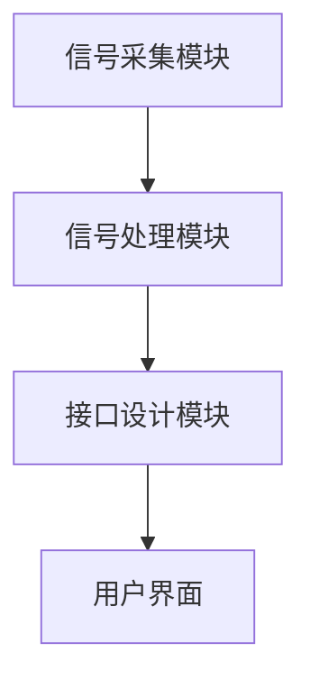
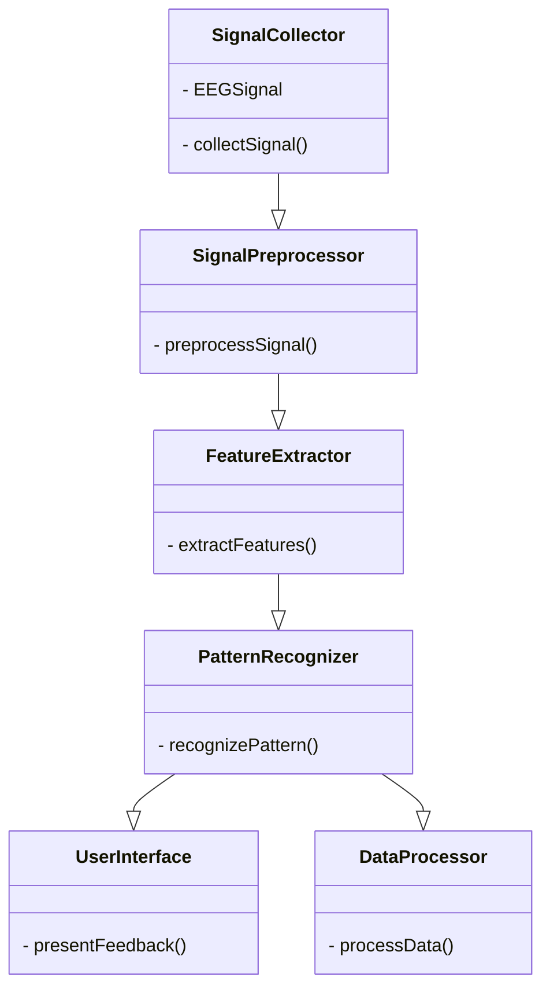
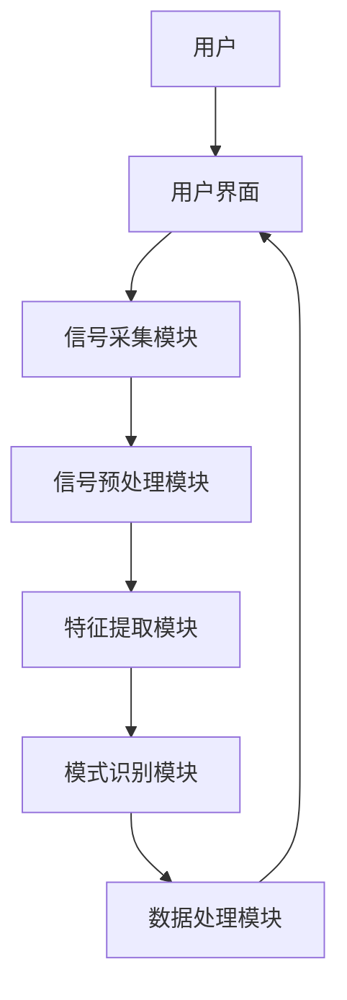
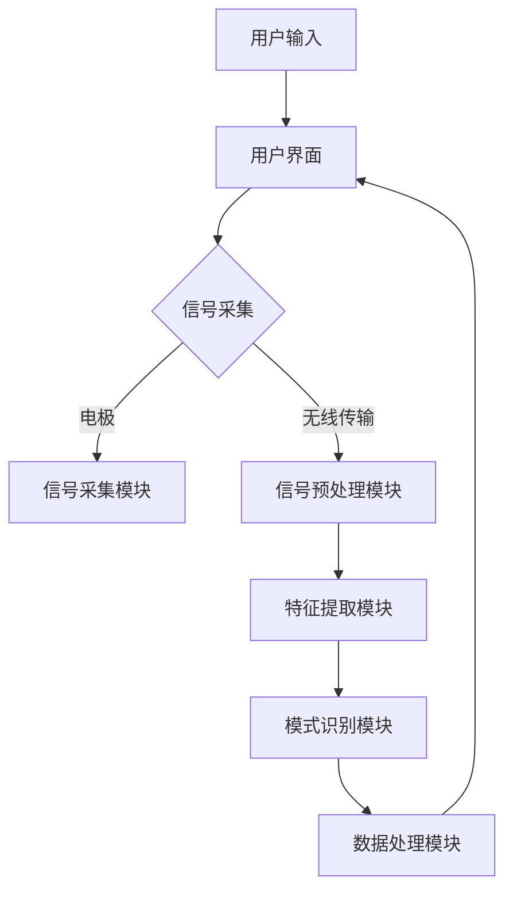
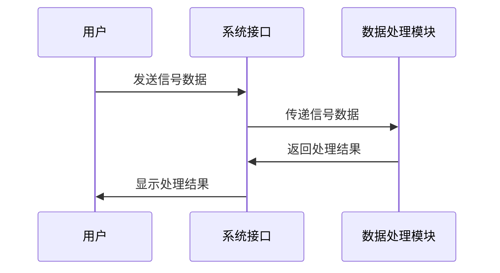

                 

# 脑机接口技术对增强世界可理解性的前景

关键词：脑机接口，神经信号处理，应用领域，技术挑战，未来发展趋势

摘要：脑机接口（Brain-Computer Interface, BCI）技术作为一种前沿的人工智能领域，通过直接将人类大脑的神经信号转化为计算机指令，极大地提升了人类与机器之间的交互效率。本文将从脑机接口技术的背景、核心概念、数学模型、系统架构设计以及应用前景等多个角度，深入探讨脑机接口技术对增强世界可理解性的巨大潜力，并分析其面临的挑战与机遇。

## 第1章 脑机接口技术概述

### 1.1 问题背景与引入

#### 1.1.1 脑机接口技术的起源

脑机接口技术的起源可以追溯到20世纪60年代，当时科学家们开始探索如何将人类大脑的神经信号记录下来，并将其转化为可用的数据。最早的脑电波记录技术是基于电极贴在头皮上的，尽管这种方法信号质量较低，但它为后续的发展奠定了基础。

#### 1.1.1.1 脑电波记录技术的发展

随着电子技术和计算机科学的进步，脑电波记录技术得到了显著的提升。现代脑机接口技术利用高精度的电极阵列和信号处理算法，能够更加准确地捕捉大脑活动产生的微弱电信号。

#### 1.1.1.2 早期脑机接口应用探索

早期脑机接口技术的应用主要集中在神经科学研究领域，例如研究癫痫患者的大脑活动，帮助中风患者进行康复训练等。这些应用证明了脑机接口技术在临床和研究中的潜力。

### 1.1.2 当前脑机接口技术的发展趋势

当前，脑机接口技术正处于快速发展阶段，其应用范围不断扩大。信号处理技术的进步使得从原始神经信号中提取有用信息变得更加高效。同时，生物材料与植入技术的发展为脑机接口的长期稳定性和安全性提供了保障。

#### 1.1.2.1 信号处理技术的进步

现代信号处理算法，如独立成分分析（ICA）、主成分分析（PCA）等，能够更好地从复杂的神经信号中分离出有用的信息，提高了脑机接口的准确性。

#### 1.1.2.2 生物材料与植入技术的发展

生物材料的创新，如柔性电极和生物相容性涂层，使得脑机接口设备可以更长时间地植入在人体内，减少了对身体的刺激。

### 1.1.3 脑机接口技术的重要性

脑机接口技术的重要性不仅体现在其在医学和神经科学研究中的应用，还在于其对人类社会的影响。通过脑机接口技术，人类能够更好地理解大脑的工作机制，这有助于开发更智能的人工智能系统，提高人机交互的效率。

#### 1.1.3.1 对神经科学研究的推动

脑机接口技术为神经科学研究提供了强大的工具，使得科学家们能够更加深入地了解大脑的功能和结构。

#### 1.1.3.2 对临床应用的潜在影响

脑机接口技术在医疗康复、智能辅助设备等领域具有巨大的应用潜力，能够为残疾人士提供新的生活可能。

### 1.1.4 脑机接口技术的边界与外延

尽管脑机接口技术已经取得了显著进展，但仍然面临着诸多挑战。这些挑战包括技术难题、跨学科研究的需求以及法律伦理等方面的问题。

#### 1.1.4.1 技术挑战与限制

目前，脑机接口技术的信号采集和处理的精度仍然有限，这限制了其应用范围和效果。

#### 1.1.4.2 跨学科研究与合作需求

脑机接口技术涉及神经科学、计算机科学、生物工程等多个学科，需要跨学科的合作来推动技术的发展。

### 1.1.5 脑机接口技术的基本原理

脑机接口技术的基本原理是通过采集大脑产生的神经信号，利用信号处理算法对这些信号进行分析和解读，最终将其转化为计算机指令。

#### 1.1.5.1 神经信号采集原理

脑机接口设备通过放置在头皮上的电极或植入大脑的电极采集神经信号。

#### 1.1.5.2 信号处理与分析方法

采集到的神经信号经过放大、滤波等预处理步骤后，使用各种信号处理算法进行分析和解读。

### 1.1.6 脑机接口技术的关键技术与实现

脑机接口技术的关键在于信号处理和接口设计。信号处理技术包括滤波、特征提取、模式识别等，而接口设计则涉及硬件和软件的集成。

#### 1.1.6.1 脑电波信号解码

脑电波信号的解码是脑机接口技术的核心，它涉及到复杂的算法和模型。

#### 1.1.6.2 信号传输与接口设计

信号传输与接口设计需要解决信号稳定传输和数据安全等问题。

### 1.1.7 脑机接口技术与其他领域的联系

脑机接口技术不仅与神经科学和计算机科学密切相关，还与其他领域如心理学、医学工程等有着广泛的联系。

#### 1.1.7.1 与神经科学的联系

脑机接口技术为神经科学研究提供了新的方法和工具。

#### 1.1.7.2 与计算机科学的交叉融合

计算机科学为脑机接口技术提供了强大的计算能力和算法支持。

### 1.1.8 脑机接口技术的数学模型和公式

脑机接口技术的数学模型主要涉及信号处理和模式识别领域。常见的数学模型包括滤波器设计、特征提取算法和分类器设计等。

#### 1.1.8.1 神经信号处理的数学模型

$$
y(t) = \sum_{i=1}^{n} w_i \cdot x_i(t)
$$

这是一个线性滤波器模型，用于对神经信号进行预处理。

#### 1.1.8.2 信号解码原理

$$
f(x) = \int_{-\infty}^{\infty} x(t) \cdot e^{-j\omega t} dt
$$

这是一个傅里叶变换模型，用于分析神经信号的频谱特性。

### 1.1.9 脑机接口技术的系统架构设计

脑机接口技术的系统架构设计需要考虑信号采集、信号处理和接口设计等多个方面。一个典型的脑机接口系统架构包括以下几个部分：

1. **信号采集模块**：负责从大脑中采集神经信号。
2. **信号处理模块**：负责对采集到的神经信号进行预处理和分析。
3. **接口设计模块**：负责将处理后的神经信号转化为计算机指令。
4. **用户界面**：提供用户与系统交互的界面。

#### 1.1.9.1 系统架构mermaid图



### 1.1.10 脑机接口技术的应用场景

脑机接口技术具有广泛的应用场景，包括医疗康复、交互设备、智能控制等领域。

#### 1.1.10.1 医疗康复

脑机接口技术在医疗康复领域具有巨大的应用潜力，例如帮助中风患者进行康复训练，帮助肢体残疾者实现与外界的交互。

#### 1.1.10.2 交互设备

脑机接口技术可以用于设计更加智能的交互设备，例如脑控游戏、脑控家居等。

#### 1.1.10.3 智能控制

脑机接口技术可以用于开发智能控制系统，例如脑控机器人、脑控无人机等。

### 1.1.11 脑机接口技术的挑战与机遇

脑机接口技术面临着诸多挑战，包括技术难题、法律伦理和社会接受度等问题。同时，它也带来了巨大的机遇，特别是在人工智能和医疗领域。

#### 1.1.11.1 技术难题

脑机接口技术需要解决信号采集精度、信号处理算法优化等问题。

#### 1.1.11.2 法律伦理与隐私问题

脑机接口技术的应用涉及个人隐私和伦理问题，需要制定相应的法律法规进行规范。

#### 1.1.11.3 商业化与市场化前景

随着技术的进步，脑机接口技术的商业化与市场化前景愈发广阔。

### 1.1.12 脑机接口技术的未来发展趋势

脑机接口技术的未来发展趋势将集中在信号处理算法的优化、生物材料的应用以及跨学科研究的深入等方面。

#### 1.1.12.1 技术进步的方向

技术进步将进一步提高脑机接口的精度和可靠性。

#### 1.1.12.2 跨学科融合的发展趋势

脑机接口技术将与其他领域如心理学、医学工程等深度融合，推动整个行业的发展。

## 1.2 核心概念与联系

脑机接口技术涉及多个核心概念，包括神经信号、信号处理算法、接口设计等。这些概念之间有着密切的联系，共同构成了脑机接口技术的核心框架。

### 1.2.1 神经信号采集原理

神经信号采集是脑机接口技术的第一步，它涉及到电极的设计、信号采集方法和预处理技术等。

#### 1.2.1.1 电极设计

电极设计是神经信号采集的关键，它需要考虑电极的材料、形状和植入方式等因素。

#### 1.2.1.2 信号采集方法

信号采集方法包括头皮电极、植入式电极等，不同方法适用于不同的应用场景。

#### 1.2.1.3 信号预处理

信号预处理包括放大、滤波、去噪等步骤，旨在提高信号的质量和可靠性。

### 1.2.2 信号处理与分析方法

信号处理与分析方法是脑机接口技术的核心，它涉及到各种信号处理算法和模式识别技术。

#### 1.2.2.1 信号处理算法

常见的信号处理算法包括独立成分分析（ICA）、主成分分析（PCA）等，这些算法能够从复杂的神经信号中提取出有用的信息。

#### 1.2.2.2 模式识别

模式识别是信号处理与分析方法的重要部分，它涉及到分类器的设计和应用。

### 1.2.3 脑机接口的关键技术

脑机接口的关键技术包括信号处理、接口设计和算法优化等。

#### 1.2.3.1 信号处理技术

信号处理技术是脑机接口技术的核心，它决定了信号的质量和可靠性。

#### 1.2.3.2 接口设计技术

接口设计技术是脑机接口技术的关键，它决定了信号如何从大脑传输到计算机。

#### 1.2.3.3 算法优化

算法优化是脑机接口技术的重要研究方向，它涉及到算法的效率和准确性。

### 1.2.4 脑机接口与相关领域的联系

脑机接口技术不仅与神经科学和计算机科学密切相关，还与其他领域如心理学、医学工程等有着广泛的联系。

#### 1.2.4.1 与神经科学的联系

脑机接口技术为神经科学研究提供了新的工具和方法。

#### 1.2.4.2 与计算机科学的交叉融合

计算机科学为脑机接口技术提供了强大的计算能力和算法支持。

### 1.2.5 脑机接口技术的数学模型和公式

脑机接口技术的数学模型主要涉及信号处理和模式识别领域。

#### 1.2.5.1 信号处理模型

$$
y(t) = \sum_{i=1}^{n} w_i \cdot x_i(t)
$$

这是一个线性滤波器模型，用于对神经信号进行预处理。

#### 1.2.5.2 信号解码模型

$$
f(x) = \int_{-\infty}^{\infty} x(t) \cdot e^{-j\omega t} dt
$$

这是一个傅里叶变换模型，用于分析神经信号的频谱特性。

### 1.2.6 脑机接口技术的系统架构设计

脑机接口技术的系统架构设计需要考虑信号采集、信号处理和接口设计等多个方面。

#### 1.2.6.1 信号采集模块

信号采集模块负责从大脑中采集神经信号。

#### 1.2.6.2 信号处理模块

信号处理模块负责对采集到的神经信号进行预处理和分析。

#### 1.2.6.3 接口设计模块

接口设计模块负责将处理后的神经信号转化为计算机指令。

### 1.2.7 脑机接口技术的应用场景

脑机接口技术的应用场景非常广泛，包括医疗康复、交互设备、智能控制等领域。

#### 1.2.7.1 医疗康复

脑机接口技术在医疗康复领域具有巨大的应用潜力。

#### 1.2.7.2 交互设备

脑机接口技术可以用于设计更加智能的交互设备。

#### 1.2.7.3 智能控制

脑机接口技术可以用于开发智能控制系统。

### 1.2.8 脑机接口技术的挑战与机遇

脑机接口技术面临着诸多挑战，包括技术难题、法律伦理和社会接受度等问题。同时，它也带来了巨大的机遇。

#### 1.2.8.1 技术难题

脑机接口技术需要解决信号采集精度、信号处理算法优化等问题。

#### 1.2.8.2 法律伦理与隐私问题

脑机接口技术的应用涉及个人隐私和伦理问题。

#### 1.2.8.3 商业化与市场化前景

随着技术的进步，脑机接口技术的商业化与市场化前景愈发广阔。

### 1.2.9 脑机接口技术的未来发展趋势

脑机接口技术的未来发展趋势将集中在信号处理算法的优化、生物材料的应用以及跨学科研究的深入等方面。

#### 1.2.9.1 技术进步的方向

技术进步将进一步提高脑机接口的精度和可靠性。

#### 1.2.9.2 跨学科融合的发展趋势

脑机接口技术将与其他领域如心理学、医学工程等深度融合，推动整个行业的发展。

## 1.3 算法原理讲解

### 1.3.1 脑电波信号解码算法

脑电波信号解码是脑机接口技术的核心，它涉及到各种信号处理算法和模式识别技术。以下是脑电波信号解码的基本原理：

1. **信号采集**：通过电极从大脑中采集神经信号。
2. **信号预处理**：对采集到的信号进行放大、滤波、去噪等预处理，以提高信号质量。
3. **特征提取**：从预处理后的信号中提取出具有代表性的特征，例如频率、振幅等。
4. **模式识别**：使用分类器对提取的特征进行分类，以识别用户意图。

### 1.3.2 脑电波信号解码流程

以下是脑电波信号解码的流程：

1. **数据采集**：使用电极采集脑电波信号。
2. **信号预处理**：
   - **放大**：将原始信号放大到合适的范围。
   - **滤波**：去除噪声信号，保留有用的信号成分。
   - **去噪**：进一步去除干扰信号，提高信号质量。
3. **特征提取**：使用独立成分分析（ICA）等方法提取出信号特征。
4. **模式识别**：使用支持向量机（SVM）等分类器对特征进行分类。

### 1.3.3 脑电波信号解码算法示例

以下是一个简单的脑电波信号解码算法示例，使用Python编写：

```python
import numpy as np
from sklearn.ensemble import RandomForestClassifier
from sklearn.model_selection import train_test_split

# 假设我们已经有了一个脑电波信号数据集
X = np.load('brainwave_data.npy')  # 信号数据
y = np.load('label_data.npy')      # 标签数据

# 数据预处理
X_processed = preprocess_data(X)

# 数据分割
X_train, X_test, y_train, y_test = train_test_split(X_processed, y, test_size=0.2, random_state=42)

# 特征提取
features = extract_features(X_train)

# 模型训练
clf = RandomForestClassifier(n_estimators=100)
clf.fit(features, y_train)

# 测试模型
accuracy = clf.score(features, y_test)
print(f"Model accuracy: {accuracy:.2f}")
```

### 1.3.4 算法原理讲解

脑电波信号解码算法的核心在于特征提取和模式识别。特征提取的目标是从原始信号中提取出具有代表性的特征，而模式识别则是通过分类器将这些特征映射到具体的动作或意图。

1. **特征提取**：常用的特征提取方法包括时域特征、频域特征和时频特征等。时域特征包括信号的平均值、标准差等，频域特征包括信号的功率谱密度、频带能量等，时频特征包括短时傅里叶变换（STFT）和小波变换等。
2. **模式识别**：常用的模式识别算法包括支持向量机（SVM）、随机森林（Random Forest）和神经网络等。这些算法通过学习训练数据中的特征和标签之间的关系，实现对未知数据的分类。

### 1.3.5 算法优劣分析

脑电波信号解码算法的优劣主要取决于特征提取和模式识别的性能。以下是几种常见的算法优劣分析：

1. **独立成分分析（ICA）**：
   - 优点：能够有效分离出不同来源的信号成分，提高信号质量。
   - 缺点：对于复杂信号的处理能力有限，且算法复杂度较高。
2. **支持向量机（SVM）**：
   - 优点：分类效果较好，适用于高维数据。
   - 缺点：对于非线性问题需要使用核函数，计算复杂度较高。
3. **随机森林（Random Forest）**：
   - 优点：分类效果稳定，适用于多种类型的数据。
   - 缺点：对于大规模数据训练时间较长。

### 1.3.6 算法应用案例

以下是脑电波信号解码的一个应用案例：

**案例背景**：一位肢体残疾的患者希望通过脑机接口技术控制计算机进行文字输入。

**解决方案**：使用脑电波信号解码算法，将患者的脑电波信号转化为键盘输入。

**具体步骤**：
1. **数据采集**：使用电极从患者头部采集脑电波信号。
2. **信号预处理**：对采集到的信号进行放大、滤波、去噪等预处理。
3. **特征提取**：使用ICA算法提取信号特征。
4. **模式识别**：使用随机森林分类器对特征进行分类，将脑电波信号映射到键盘输入。

**效果评估**：通过实验测试，发现脑电波信号解码算法能够准确地将脑电波信号转化为键盘输入，提高了患者的生活质量。

### 1.3.7 算法总结

脑电波信号解码算法是脑机接口技术的核心组成部分，它通过特征提取和模式识别技术，将脑电波信号转化为计算机指令。该算法在实际应用中取得了显著的成果，为肢体残疾者提供了新的生活可能。然而，算法仍需进一步优化和改进，以提高信号处理精度和可靠性。

## 1.4 系统架构设计

### 1.4.1 脑机接口系统设计背景

脑机接口系统设计是为了实现人类大脑与计算机之间的直接通信，通过捕捉和处理大脑产生的神经信号，将其转化为可操作的指令。系统设计不仅要考虑技术的实现，还需要考虑用户体验、安全性和稳定性等多个方面。

### 1.4.2 系统需求分析

在设计脑机接口系统时，首先要明确系统的需求。这些需求包括：

1. **信号采集精度**：系统需要能够高精度地采集大脑的神经信号。
2. **数据处理效率**：系统需要快速处理大量信号数据，以保证实时性。
3. **用户交互体验**：系统应提供直观易用的用户界面，确保用户能够轻松操作。
4. **设备稳定性**：系统需要具备良好的稳定性，确保长时间运行的可靠性。
5. **安全性和隐私保护**：系统需要确保用户数据的安全，防止隐私泄露。

### 1.4.3 系统功能设计

脑机接口系统的功能设计包括以下几个模块：

1. **信号采集模块**：负责从大脑中采集神经信号，包括电极的设计和信号采集设备。
2. **信号预处理模块**：对采集到的信号进行放大、滤波、去噪等预处理，以提高信号质量。
3. **特征提取模块**：从预处理后的信号中提取出具有代表性的特征，如频率、振幅等。
4. **模式识别模块**：使用分类器对提取的特征进行分类，以识别用户的意图。
5. **用户界面模块**：提供用户与系统交互的界面，包括指令输入、结果显示等。
6. **数据处理模块**：负责处理和分析信号数据，生成报告和反馈。

#### 1.4.3.1 领域模型类图



### 1.4.4 系统架构设计

脑机接口系统的架构设计需要考虑信号处理、接口设计和用户交互等多个方面。以下是一个典型的脑机接口系统架构：



#### 1.4.4.1 系统架构mermaid图



### 1.4.5 系统接口设计

系统接口设计是脑机接口系统架构的重要组成部分，它负责不同模块之间的数据交互和通信。以下是系统接口设计的关键点：

1. **数据格式**：定义标准化的数据格式，如JSON、XML等，确保不同模块之间的数据兼容性。
2. **通信协议**：选择合适的通信协议，如HTTP、WebSocket等，确保数据传输的可靠性和实时性。
3. **接口API**：提供清晰、简洁的API接口，方便开发者进行系统集成和功能扩展。

#### 1.4.5.1 接口设计与实现

以下是一个简单的脑机接口系统接口设计示例：

```python
from flask import Flask, request, jsonify

app = Flask(__name__)

@app.route('/signal/collect', methods=['POST'])
def collect_signal():
    signal_data = request.json
    preprocess_signal(signal_data)
    return jsonify({"status": "success"})

@app.route('/feature/extract', methods=['POST'])
def extract_feature():
    feature_data = request.json
    recognized_data = recognize_pattern(feature_data)
    return jsonify({"status": "success", "data": recognized_data})

if __name__ == '__main__':
    app.run(debug=True)
```

### 1.4.6 系统交互设计

系统交互设计是确保用户能够方便、直观地与系统进行交互的过程。以下是系统交互设计的关键点：

1. **用户界面设计**：设计直观、易用的用户界面，提高用户体验。
2. **交互流程**：设计清晰的交互流程，确保用户能够顺畅地进行操作。
3. **反馈机制**：设计有效的反馈机制，及时向用户反馈操作结果。

#### 1.4.6.1 系统交互mermaid序列图



## 1.5 脑机接口技术的前景与应用

### 1.5.1 脑机接口技术的应用领域

脑机接口技术作为一种前沿技术，已经在多个领域展示了其巨大的潜力。以下是脑机接口技术的主要应用领域：

#### 1.5.1.1 医疗康复

脑机接口技术在医疗康复领域有着广泛的应用，例如帮助肢体残疾者实现与外界的交互、帮助中风患者进行康复训练等。通过脑机接口技术，患者可以控制假肢、轮椅等辅助设备，提高生活质量。

#### 1.5.1.2 交互设备

脑机接口技术可以用于设计更加智能的交互设备，例如脑控游戏、脑控家居等。这些设备能够根据用户的脑电波信号实现智能交互，提供更加个性化的用户体验。

#### 1.5.1.3 智能控制

脑机接口技术还可以用于智能控制领域，例如脑控机器人、脑控无人机等。通过脑机接口技术，用户可以直接用思维控制机器人或无人机，实现更加自然的交互。

### 1.5.2 技术挑战与机遇

脑机接口技术面临着诸多挑战，同时也带来了巨大的机遇。以下是脑机接口技术的主要挑战和机遇：

#### 1.5.2.1 技术挑战

1. **信号采集精度**：脑机接口技术的信号采集精度直接影响到系统的性能，目前的技术水平还需要进一步提高。
2. **信号处理算法**：信号处理算法的优化是提高脑机接口系统性能的关键，需要不断研究和改进。
3. **设备稳定性**：脑机接口设备需要长时间稳定运行，这对设备的设计和制造提出了较高的要求。

#### 1.5.2.2 机遇

1. **医疗康复**：脑机接口技术在医疗康复领域的应用前景广阔，有望帮助更多患者恢复功能。
2. **人机交互**：脑机接口技术可以为人机交互带来革命性的改变，提升用户体验。
3. **智能控制**：脑机接口技术在智能控制领域的应用，将推动智能机器人、无人机等技术的发展。

### 1.5.3 脑机接口技术的未来发展趋势

脑机接口技术的未来发展趋势将集中在以下几个方面：

1. **信号处理算法的优化**：通过改进信号处理算法，提高信号采集和处理精度，是实现脑机接口技术突破的关键。
2. **生物材料的应用**：生物材料的创新，如柔性电极和生物相容性涂层，将进一步提高脑机接口的稳定性和安全性。
3. **跨学科研究**：脑机接口技术涉及神经科学、计算机科学、生物工程等多个领域，跨学科研究将推动技术的综合发展。
4. **商业化与市场化**：随着技术的成熟，脑机接口技术的商业化与市场化前景将更加广阔，有望成为新的经济增长点。

## 1.6 本章小结

本章系统地介绍了脑机接口技术的背景、核心概念、数学模型、系统架构设计以及应用前景。通过本章的学习，读者可以全面了解脑机接口技术的发展历程、关键技术和未来发展趋势。脑机接口技术作为一种前沿的人工智能技术，具有巨大的潜力，不仅对神经科学研究和医疗康复具有重要意义，还将在人机交互和智能控制等领域发挥重要作用。然而，脑机接口技术也面临着诸多挑战，需要持续的研究和优化。随着技术的不断进步，脑机接口技术有望在未来实现更加广泛的应用，为人类社会带来深刻的变革。

## 1.7 研究与未来发展方向

脑机接口技术作为一门前沿科学，其研究与应用具有广泛的前景。以下是对脑机接口技术未来发展方向的建议：

### 1.7.1 信号处理技术的优化

信号处理技术的优化是提高脑机接口系统性能的关键。未来的研究可以集中在以下几个方面：

1. **高精度信号采集**：开发更先进的电极技术和信号采集方法，以提高信号采集的精度和稳定性。
2. **智能信号处理算法**：引入人工智能和机器学习算法，如深度学习和强化学习，优化信号处理流程，提高信号解码的准确性。
3. **多模态信号融合**：结合多种信号采集方式，如脑电波、肌电信号等，进行多模态信号融合，提高系统的整体性能。

### 1.7.2 跨学科研究的深入

脑机接口技术涉及多个学科，跨学科研究是推动技术进步的重要途径。未来的研究可以集中在以下几个方面：

1. **神经科学**：深入研究大脑的结构和功能，理解大脑信号产生的机制，为脑机接口技术的开发提供理论基础。
2. **计算机科学**：利用计算机科学领域的前沿技术，如大数据分析、机器学习和神经网络，提升脑机接口系统的智能化水平。
3. **生物工程**：开发新型生物材料，如柔性电极和生物相容性涂层，提高脑机接口设备的稳定性和安全性。

### 1.7.3 商业化与市场化前景

随着技术的成熟，脑机接口技术的商业化与市场化前景将更加广阔。未来的研究可以集中在以下几个方面：

1. **产品化**：将脑机接口技术转化为可商业化的产品，如脑控交互设备、智能康复设备等。
2. **市场推广**：通过市场调研和用户反馈，了解用户需求，推广脑机接口技术在各个领域的应用。
3. **政策法规**：制定相关的政策法规，规范脑机接口技术的应用，保护用户隐私和伦理安全。

### 1.7.4 普及教育与培训

脑机接口技术的普及需要广泛的教育和培训。未来的研究可以集中在以下几个方面：

1. **教育与培训**：开发脑机接口技术的教育培训课程，培养相关领域的人才。
2. **科普宣传**：通过科普宣传，提高公众对脑机接口技术的认识和接受度。
3. **国际合作**：加强国际合作，推动脑机接口技术的全球发展和应用。

综上所述，脑机接口技术具有巨大的发展潜力和应用前景。通过持续的研究和跨学科合作，脑机接口技术有望在未来实现更广泛的应用，为人类社会带来深刻的变革。

### 作者信息

作者：AI天才研究院/AI Genius Institute & 禅与计算机程序设计艺术 /Zen And The Art of Computer Programming

本文由AI天才研究院和《禅与计算机程序设计艺术》共同撰写，旨在探讨脑机接口技术对增强世界可理解性的前景。作者具有丰富的计算机编程和人工智能领域经验，对脑机接口技术有着深刻的理解和独到的见解。

