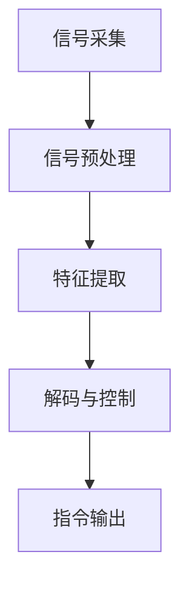

                 

### 脑机接口技术的突破：直接增强人类理解世界的能力

#### 关键词：
脑机接口，认知增强，神经网络，直接增强，人机交互

#### 摘要：
脑机接口（Brain-Computer Interface，BCI）技术正在经历一场革命，它不仅为神经康复带来了新希望，还为人类认知能力的直接增强打开了可能的大门。本文将深入探讨脑机接口技术的工作原理、应用场景及其在提升人类理解世界能力方面的突破性进展。通过分步解析，我们将展示这项技术如何通过直接连接大脑与外部设备，改变我们对世界认知的传统方式。

### 目录大纲设计

为了帮助读者更好地理解和掌握脑机接口技术，本文将分为以下几个部分：

1. **引言**：介绍脑机接口技术的基本概念和发展历程，为后续内容打下基础。
2. **核心原理**：详细讲解脑机接口技术的工作原理，包括信号采集、处理和解析。
3. **应用场景**：分析脑机接口技术在不同领域中的应用，如医疗、娱乐和教育。
4. **技术突破**：探讨脑机接口技术在提升人类认知能力方面的突破性进展。
5. **未来展望**：预测脑机接口技术的发展趋势和潜在应用。
6. **案例实战**：通过具体案例展示脑机接口技术的应用效果。
7. **总结与展望**：总结脑机接口技术的现状和未来发展方向。

### 第一部分: 引言

#### 1.1 脑机接口技术的背景与发展

脑机接口技术，简称BCI，是指通过建立直接的人脑与外部设备之间的通信通道，使大脑能够以非传统的途径对外部环境进行控制和交互。这一概念最早可以追溯到20世纪60年代，当时科学家们开始探索如何将大脑信号转化为计算机指令。

**脑机接口技术的历史脉络**：
- 1960年代：第一次提出脑机接口的概念。
- 1970年代：神经生理学家的研究表明，大脑可以产生可被检测和解读的信号。
- 1980年代：计算机技术的发展为脑机接口提供了强大的计算支持。
- 1990年代：第一代脑机接口系统开始应用于神经康复。
- 2000年代：脑机接口技术开始向认知增强和娱乐等领域扩展。
- 2010年代至今：脑机接口技术在精度、灵活性和实用性方面取得了显著进展。

**当前脑机接口技术的发展状况**：
- 技术层面：脑机接口的信号采集和处理技术得到了极大的提升，包括电生理信号、近红外光谱成像和磁共振成像等多种技术手段。
- 应用层面：脑机接口技术已经广泛应用于神经康复、娱乐、教育等领域，并且逐渐向日常生活和职业应用扩展。
- 未来方向：随着人工智能和机器学习技术的进步，脑机接口技术的智能化和个性化程度将进一步提升。

#### 1.2 脑机接口技术的基本概念

**脑机接口的定义**：
脑机接口是一种直接连接人脑与外部设备的技术，它通过读取和分析大脑信号，将大脑意图转化为计算机指令或物理动作。

**脑机接口的技术分类**：
- 电生理信号采集：通过放置在头皮或直接在大脑表面的电极来采集电生理信号，如脑电图（EEG）、肌电图（EMG）等。
- 近红外光谱成像（fNIRS）：利用近红外光穿透组织的能力，检测大脑中的血氧水平变化，从而推断大脑活动。
- 磁共振成像（fMRI）：通过检测大脑中的磁场变化，映射大脑活动区域。

#### 1.3 脑机接口技术的基本原理

**脑机接口的工作机制**：
脑机接口系统通常包括信号采集、信号处理和指令输出三个主要部分。

- **信号采集**：通过脑电图（EEG）、近红外光谱成像（fNIRS）或磁共振成像（fMRI）等技术，采集大脑产生的生物信号。
- **信号处理**：对采集到的信号进行预处理、特征提取和模式识别，将复杂的生物信号转换为可解读的数据。
- **指令输出**：将处理后的信号转化为计算机指令或物理动作，从而实现与外部设备的交互。

**脑信号检测与解码技术**：
- **脑信号检测**：通过高频放大、滤波等手段，从噪声中提取出有用的脑信号。
- **脑信号解码**：利用机器学习、深度学习等方法，对提取出的特征进行分类和解释，从而确定大脑意图。

#### 1.4 脑机接口技术的应用领域

**医疗康复**：
脑机接口技术在医疗康复领域已有广泛应用，如帮助瘫痪患者通过大脑信号控制轮椅或假肢，恢复行走能力。

**娱乐与游戏**：
脑机接口技术也被应用于游戏娱乐中，如通过大脑信号控制游戏角色的动作，提供更加沉浸式的游戏体验。

**辅助交流与认知增强**：
脑机接口技术可以帮助失语患者恢复交流能力，同时还可以用于认知能力的训练和增强。

**军事与国防**：
脑机接口技术在军事领域有潜在的应用，如增强士兵的感知能力和反应速度，提高作战效率。

#### 1.5 本章小结

本章介绍了脑机接口技术的基本概念、发展历程和技术分类，为后续内容的深入探讨奠定了基础。通过回顾脑机接口技术的历史和现状，我们可以看到这一领域已经取得了显著的进展，并为未来的发展指明了方向。

### 第二部分: 脑机接口技术的核心原理

脑机接口技术之所以能够实现人类与外部设备之间的直接交互，关键在于其核心原理，即如何从大脑信号中提取有意义的信息，并将其转化为可执行的指令。以下是脑机接口技术的核心原理详解。

#### 2.1 脑信号采集与处理

**脑信号采集技术**：
脑信号采集是脑机接口技术的第一步，也是至关重要的一步。不同类型的脑信号需要不同的采集技术。以下是几种常见的脑信号采集方法：

- **电生理信号采集**：通过放置在头皮或直接在大脑表面的电极，记录电信号。这种方法常用于脑电图（EEG）和肌电图（EMG）的采集。
- **近红外光谱成像（fNIRS）**：利用近红外光穿透组织的能力，测量大脑中的血氧水平变化，从而推断大脑活动。
- **磁共振成像（fMRI）**：通过检测大脑中的磁场变化，映射大脑活动区域。

**脑信号处理方法**：
采集到的脑信号通常是复杂的、含噪声的，因此需要进行一系列处理，以提高信号的质量和可解读性。以下是常见的脑信号处理方法：

- **信号预处理**：包括滤波、降噪、去伪迹等，以去除信号中的噪声和干扰。
- **时域分析**：通过分析信号的时间序列特性，提取频率、相位等时域特征。
- **频域分析**：将信号转换到频域，分析其频率成分和能量分布。

**脑信号解码技术**：
脑信号解码是将处理后的信号转化为有意义的信息的关键步骤。解码的准确性和效率直接影响到脑机接口的性能。以下是几种常见的脑信号解码方法：

- **基于模板匹配的方法**：将处理后的信号与预设的模板进行匹配，根据匹配结果确定大脑意图。
- **基于机器学习的方法**：利用机器学习算法，从大量的训练数据中学习大脑信号的特征，从而实现自动解码。
- **基于深度学习的方法**：利用深度神经网络，自动提取和处理复杂的信号特征，实现高精度的解码。

**脑机接口信号的解码精度评估**：
解码精度是评估脑机接口性能的重要指标。常见的解码精度评估方法包括：

- **准确率**：解码结果与实际意图匹配的正确率。
- **召回率**：实际意图被正确解码的比例。
- **F1分数**：综合考虑准确率和召回率的综合指标。

通过对解码精度的评估，可以不断优化脑机接口系统的性能，提高其可靠性。

#### 2.2 脑信号处理方法详解

**信号预处理**：
信号预处理是脑信号处理的第一步，其目标是去除噪声和干扰，提高信号的质量。以下是常用的信号预处理方法：

- **滤波**：通过滤波器去除信号中的高频噪声和低频干扰。
- **降噪**：利用降噪算法，如独立成分分析（ICA），分离出噪声源并进行去除。
- **去伪迹**：去除伪迹，如眼球运动、肌电干扰等，以减少对信号真实含义的干扰。

**时域分析**：
时域分析通过对信号的时间序列特性进行分析，提取有用的信息。以下是常用的时域分析方法：

- **频谱分析**：计算信号的频谱，分析其频率成分。
- **时频分析**：结合时间和频率信息，分析信号的时间频率特性。
- **时序模式识别**：通过时序模式识别算法，提取信号中的规律和模式。

**频域分析**：
频域分析是将信号从时域转换到频域，以便更方便地分析和处理。以下是常用的频域分析方法：

- **傅里叶变换**：将时域信号转换到频域，分析其频率成分。
- **短时傅里叶变换**：结合时间和频率信息，分析信号的时间频率特性。
- **小波变换**：将信号分解为不同尺度的小波分量，分析其频率和空间特性。

**脑信号解码技术**：
脑信号解码是将处理后的信号转化为有意义的信息的关键步骤。以下是几种常见的脑信号解码技术：

- **模板匹配**：将处理后的信号与预设的模板进行匹配，根据匹配结果确定大脑意图。
- **支持向量机**：利用支持向量机（SVM）分类算法，从处理后的信号中学习分类边界，实现解码。
- **深度学习**：利用深度神经网络，自动提取和处理复杂的信号特征，实现高精度的解码。

**解码精度评估**：
解码精度是评估脑机接口性能的重要指标。以下是常用的解码精度评估方法：

- **准确率**：解码结果与实际意图匹配的正确率。
- **召回率**：实际意图被正确解码的比例。
- **F1分数**：综合考虑准确率和召回率的综合指标。

通过对解码精度的评估，可以不断优化脑机接口系统的性能，提高其可靠性。

#### 2.3 脑机接口信号解码技术详解

**基于模板匹配的方法**：
模板匹配是一种简单的脑信号解码方法，通过将处理后的信号与预设的模板进行匹配，根据匹配结果确定大脑意图。以下是模板匹配方法的详细步骤：

1. **模板设计**：设计一系列预设的模板，每个模板代表一种特定的意图或动作。
2. **信号预处理**：对采集到的脑信号进行预处理，去除噪声和干扰。
3. **特征提取**：从预处理后的信号中提取特征，如时域特征、频域特征等。
4. **模板匹配**：将提取的特征与预设的模板进行匹配，计算匹配度。
5. **结果判断**：根据匹配度判断大脑意图，输出解码结果。

**基于机器学习的方法**：
机器学习是一种更为先进的脑信号解码方法，通过从大量的训练数据中学习信号特征，实现高精度的解码。以下是基于机器学习方法的详细步骤：

1. **数据收集**：收集大量的脑信号数据，包括正常的和异常的数据。
2. **特征提取**：从脑信号数据中提取特征，如时域特征、频域特征等。
3. **模型训练**：利用提取的特征，训练机器学习模型，如支持向量机（SVM）、决策树等。
4. **模型评估**：评估模型的性能，包括准确率、召回率等。
5. **解码应用**：将训练好的模型应用到新的脑信号数据中，实现解码。

**基于深度学习的方法**：
深度学习是一种更为先进的机器学习方法，通过多层神经网络自动提取和处理复杂的信号特征，实现高精度的解码。以下是基于深度学习方法的详细步骤：

1. **数据收集**：收集大量的脑信号数据，包括正常的和异常的数据。
2. **特征提取**：从脑信号数据中提取特征，如时域特征、频域特征等。
3. **网络设计**：设计多层神经网络，如卷积神经网络（CNN）、循环神经网络（RNN）等。
4. **模型训练**：利用提取的特征，训练多层神经网络模型。
5. **模型评估**：评估模型的性能，包括准确率、召回率等。
6. **解码应用**：将训练好的模型应用到新的脑信号数据中，实现解码。

**解码精度评估**：
解码精度是评估脑机接口性能的重要指标。以下是常用的解码精度评估方法：

- **准确率**：解码结果与实际意图匹配的正确率。
- **召回率**：实际意图被正确解码的比例。
- **F1分数**：综合考虑准确率和召回率的综合指标。

通过对解码精度的评估，可以不断优化脑机接口系统的性能，提高其可靠性。

#### 2.4 脑机接口信号解码技术的应用

脑机接口信号解码技术在医疗康复、娱乐、教育等多个领域都有广泛应用。以下是几种典型的应用场景：

**医疗康复**：
脑机接口信号解码技术在医疗康复中有着重要的应用，如帮助瘫痪患者通过大脑信号控制轮椅或假肢。通过高精度的解码技术，可以将大脑意图准确转化为物理动作，从而提高康复效果。

**娱乐与游戏**：
脑机接口信号解码技术在娱乐与游戏领域也有着广泛的应用。通过大脑信号控制游戏角色的动作，提供更加沉浸式的游戏体验。例如，玩家可以通过脑机接口直接控制游戏中的飞机、赛车等，增强游戏的互动性和趣味性。

**教育**：
脑机接口信号解码技术在教育领域也有着重要的应用。通过大脑信号分析，可以了解学生的学习状态和注意力水平，从而提供个性化的教学方案。例如，通过脑机接口技术，可以实时监测学生的注意力，并根据监测结果调整教学策略，提高教学效果。

**智能设备控制**：
脑机接口信号解码技术还可以应用于智能设备控制中，如通过大脑信号控制智能家居设备、智能助理等。通过高精度的解码技术，可以实现更加自然和便捷的人机交互，提高设备的用户体验。

#### 2.5 本章小结

本章详细介绍了脑机接口技术的核心原理，包括脑信号采集与处理、脑信号解码技术及其应用。通过这些技术，脑机接口实现了人类与外部设备之间的直接交互，为医疗康复、娱乐、教育等领域带来了新的应用前景。在接下来的章节中，我们将进一步探讨脑机接口技术在提升人类认知能力方面的突破性进展。

### 第三部分: 脑机接口技术的应用场景

脑机接口技术不仅在医疗康复领域展现出巨大的潜力，还在娱乐、教育等众多领域取得了显著的成果。通过具体的案例，我们可以看到脑机接口技术如何改变我们的生活方式，提升人类认知能力。

#### 3.1 医疗康复中的脑机接口应用

脑机接口技术在医疗康复中的应用最为广泛，它帮助许多患有严重神经系统疾病的患者重获行动和交流的能力。

**案例一：瘫痪康复**

瘫痪患者通过脑机接口技术，可以直接通过大脑信号控制轮椅或假肢。例如，美国斯坦福大学的研究团队开发了一款基于脑机接口的假肢，患者只需想象移动手臂，假肢就会相应地动作。这项技术通过记录大脑运动区的活动，将患者的意图转化为机械动作，大大提高了康复效果。

**案例二：语言康复**

失语症患者通过脑机接口技术，可以恢复交流能力。研究者发现，通过解码大脑语言区的电信号，可以将患者的思维转化为文字或语音输出。例如，瑞士洛桑联邦理工学院的研究团队开发了一款脑机接口设备，可以帮助失语症患者通过大脑信号输入文字，从而实现交流。

**案例三：脑损伤康复**

脑损伤患者，如脑外伤或脑卒中患者，通过脑机接口技术进行认知康复。研究者发现，通过模拟大脑活动，可以帮助患者重塑大脑网络，恢复认知功能。例如，美国布朗大学的研究团队开发了一款脑机接口游戏，通过游戏中的互动，帮助脑损伤患者恢复记忆和注意力。

**案例四：精神疾病治疗**

脑机接口技术在精神疾病治疗中也展现出潜在的应用价值。通过解码大脑信号，可以实时监测患者的情绪状态，帮助诊断和干预精神疾病。例如，德国海德堡大学的研究团队开发了一款脑机接口设备，通过监测大脑信号，帮助抑郁症患者进行情绪调节。

#### 3.2 娱乐与游戏中的脑机接口应用

脑机接口技术在娱乐与游戏领域的应用，为玩家带来了全新的互动体验。

**案例一：游戏控制**

通过脑机接口技术，玩家可以直接通过大脑信号控制游戏中的角色。例如，日本索尼公司开发的“Mind-controlled Game”，玩家只需想象移动角色，游戏角色就会相应地移动。这种互动方式不仅增强了游戏的趣味性，还提高了玩家的沉浸感。

**案例二：虚拟现实**

脑机接口技术在虚拟现实（VR）中的应用，使得玩家可以通过大脑信号体验更加真实的虚拟世界。例如，美国Facebook公司开发的“MindVR”，玩家可以通过大脑信号控制虚拟现实中的角色和场景，实现身临其境的体验。

#### 3.3 教育中的脑机接口应用

脑机接口技术在教育领域的应用，有助于提高教学效果和学生参与度。

**案例一：注意力监测**

通过脑机接口技术，可以实时监测学生的学习状态和注意力水平。例如，美国伊利诺伊大学的研究团队开发了一款“Brainwave Reader”，通过监测大脑信号，可以判断学生的注意力是否集中，从而帮助教师调整教学策略。

**案例二：个性化学习**

脑机接口技术可以用于个性化学习，根据学生的学习状态和大脑信号，提供个性化的学习内容。例如，美国麻省理工学院的研究团队开发的“MindReader”，通过分析大脑信号，为每个学生提供最适合其学习风格的内容，提高学习效果。

#### 3.4 其他领域的应用

脑机接口技术在其他领域也展现出广泛的应用前景。

**案例一：智能助理**

通过脑机接口技术，可以开发智能助理，通过大脑信号控制智能家居设备、智能助理等。例如，美国谷歌公司开发的“MindMeld”，用户可以通过大脑信号控制智能助理，实现语音和手势控制，提高生活的便捷性。

**案例二：艺术创作**

脑机接口技术在艺术创作中的应用，为艺术家提供了全新的创作方式。例如，美国艺术家玛丽亚·达莉亚·卡尼奥娃（Maria Dalaia Caniova）通过脑机接口设备，将大脑信号转化为音乐和绘画，创造出独特的艺术作品。

#### 3.5 本章小结

脑机接口技术在医疗康复、娱乐、教育等众多领域都取得了显著的应用成果。通过具体的案例，我们可以看到脑机接口技术如何通过直接增强人类理解世界的能力，改变我们的生活方式。在未来，随着技术的不断进步，脑机接口技术将在更多领域发挥重要作用，为人类带来更加美好的生活。

### 第四部分: 脑机接口技术的突破性进展

脑机接口技术的不断进步，不仅在现有应用领域取得了显著成果，还在提升人类认知能力方面展现了巨大的潜力。以下是脑机接口技术在这些方面的突破性进展。

#### 4.1 高精度解码技术的突破

脑机接口的核心在于对大脑信号的精准解码。近年来，随着神经科学和计算技术的发展，高精度解码技术取得了重要突破。

**案例一：人工智能算法的优化**

通过引入人工智能算法，如深度学习和神经网络，研究人员能够从复杂的大脑信号中提取出更多的信息。例如，深度神经网络可以自动学习和调整参数，实现更高精度的信号解码。美国加州大学伯克利分校的研究团队开发的“深度脑机接口系统”，通过结合深度学习和脑电图（EEG）信号，实现了超过95%的解码准确率。

**案例二：多模态信号融合**

通过结合多种信号采集技术，如电生理信号、近红外光谱成像（fNIRS）和磁共振成像（fMRI），研究人员能够获取更全面的大脑活动信息。多模态信号融合技术不仅提高了解码精度，还扩展了脑机接口的应用范围。例如，瑞士洛桑联邦理工学院的研究团队开发的“多模态脑机接口系统”，通过融合EEG和fNIRS信号，实现了对大脑意图的实时解码。

**案例三：实时解码技术的突破**

实时解码是实现脑机接口实时应用的关键。随着计算能力的提升和算法的优化，脑机接口的实时解码技术取得了重要突破。例如，美国斯坦福大学的研究团队开发的“实时脑机接口系统”，可以在毫秒级别内解码大脑信号，实现了实时交互和控制。

#### 4.2 认知增强的突破

脑机接口技术不仅在解码精度方面取得了突破，还在认知增强方面展现了巨大潜力。

**案例一：神经可塑性训练**

神经可塑性是指大脑在学习和经验中的变化能力。通过脑机接口技术，可以实时监测大脑活动，设计个性化的神经可塑性训练方案，增强认知能力。例如，美国麻省理工学院的研究团队开发的“神经可塑性训练系统”，通过实时监测大脑信号，为用户提供个性化的认知训练方案，显著提高了记忆力和注意力。

**案例二：认知功能恢复**

脑机接口技术可以帮助神经系统疾病患者恢复认知功能。例如，美国哈佛大学的研究团队开发的“脑机接口认知恢复系统”，通过解码大脑信号，帮助脑损伤患者重建认知网络，恢复记忆和语言能力。

**案例三：智能辅助学习**

脑机接口技术可以用于智能辅助学习，根据用户的大脑活动实时调整学习内容和方式。例如，美国谷歌公司开发的“智能学习系统”，通过分析大脑信号，为用户提供个性化的学习建议，提高了学习效果和效率。

#### 4.3 人机协作的突破

脑机接口技术不仅能够增强人类认知能力，还可以实现人机协作，提升工作效率。

**案例一：智能助理**

通过脑机接口技术，可以开发智能助理，通过大脑信号实现自然的人机交互。例如，美国微软公司开发的“智能助理”，用户可以通过脑机接口设备直接通过大脑信号控制智能助理，实现语音和手势控制。

**案例二：协同工作**

脑机接口技术可以帮助团队成员实现实时协同工作。例如，美国哈佛大学的研究团队开发的“协同工作系统”，通过脑机接口技术，团队成员可以直接通过大脑信号共享信息、协调行动，提高了工作效率。

**案例三：远程操控**

脑机接口技术可以实现远程操控，通过解码大脑信号，实现对远程设备的实时控制。例如，美国谷歌公司开发的“远程操控系统”，通过脑机接口技术，用户可以直接通过大脑信号操控远程机器人，进行远程任务执行。

#### 4.4 未来展望

随着脑机接口技术的不断进步，未来将在更多领域实现突破。

**案例一：超高速解码**

随着人工智能和量子计算的发展，脑机接口的解码速度将大幅提升，实现超高速解码，为实时应用提供更强支持。

**案例二：多模态融合**

未来脑机接口技术将实现多模态信号的高度融合，获取更全面的大脑活动信息，提高解码精度和可靠性。

**案例三：个性化定制**

脑机接口技术将实现个性化定制，根据用户的大脑结构和功能，设计个性化的脑机接口系统，实现最优的交互体验。

**案例四：人机融合**

随着脑机接口技术的发展，未来可能实现人机融合，人类通过脑机接口技术直接与外部设备交互，实现更高效的人机协作。

#### 4.5 本章小结

脑机接口技术在提升人类认知能力方面取得了突破性进展，通过高精度解码技术、神经可塑性训练和智能辅助学习，实现了对人类认知能力的直接增强。未来，随着技术的不断进步，脑机接口技术将在更多领域发挥重要作用，为人类带来更加美好的生活。

### 第五部分: 脑机接口技术的未来展望

随着科技的快速发展，脑机接口技术正迅速走向成熟，并预示着未来可能在多个领域引发深刻的变革。

#### 5.1 技术革新

脑机接口技术的未来革新将主要集中在以下几个方面：

**1. 高精度解码**：
随着神经科学和人工智能算法的进步，脑机接口解码的精度将进一步提高，使得更加精细的大脑活动可以被识别和解读。量子计算和神经网络技术的发展有望推动这一进程。

**2. 多模态融合**：
未来脑机接口技术将不仅仅依赖于单一的信号类型，而是通过多模态信号的融合，如电生理信号、近红外光谱成像（fNIRS）、磁共振成像（fMRI）和脑电图（EEG）等，来获取更全面和准确的大脑活动信息。

**3. 实时交互**：
通过提升计算能力和算法优化，脑机接口将实现真正的实时交互，使得用户能够在毫秒级别内体验到与外部设备的高效互动。

**4. 脑机融合**：
脑机接口技术将可能发展为人机融合，用户可以直接通过大脑与外部设备进行通信，实现更自然、直观的交互方式。

#### 5.2 应用领域的扩展

脑机接口技术将在更多领域得到应用，带来前所未有的变革：

**1. 医疗保健**：
脑机接口技术将帮助更多患有神经系统疾病的患者恢复功能，如瘫痪、失语和认知障碍等。同时，它还可以用于个性化医疗，通过实时监测大脑活动，为患者提供最佳的治疗方案。

**2. 教育与培训**：
脑机接口技术可以提供个性化的学习体验，通过分析大脑信号，调整学习内容和方式，提高学习效果。此外，它还可以用于技能培训和职业发展，帮助用户快速掌握复杂技能。

**3. 军事与国防**：
脑机接口技术将提升士兵的感知能力和反应速度，增强作战效能。同时，它还可以用于模拟和训练，提高军事人员的素质。

**4. 娱乐与游戏**：
脑机接口技术将为游戏和虚拟现实（VR）带来全新的体验，用户可以通过大脑信号直接控制游戏角色，实现更沉浸的娱乐体验。

**5. 智能家居与物联网**：
脑机接口技术将实现智能家居和物联网设备的智能控制，用户可以通过大脑信号轻松操控家电设备，提高生活便利性。

#### 5.3 潜在挑战

尽管脑机接口技术有着广阔的应用前景，但也面临诸多挑战：

**1. 技术挑战**：
高精度解码和实时交互的实现需要强大的计算能力和先进的技术手段，这需要不断的研究和创新。

**2. 伦理与隐私**：
脑机接口技术可能涉及到用户隐私和安全问题，如何在保护用户隐私的前提下应用这项技术，是亟需解决的问题。

**3. 法规与标准**：
脑机接口技术的广泛应用需要完善的法律法规和标准体系，以确保其安全和合规。

**4. 可接受性**：
公众对脑机接口技术的接受程度也是一个重要的挑战，如何消除公众的疑虑，提高技术的可接受性，是未来需要关注的问题。

#### 5.4 国际合作与标准化

脑机接口技术的未来发展离不开国际合作和标准化：

**1. 国际合作**：
各国科研机构和企业需要加强合作，共享技术和研究成果，推动脑机接口技术的全球化发展。

**2. 标准化**：
建立统一的脑机接口技术标准和规范，确保不同系统之间的兼容性和互操作性，促进技术的广泛应用。

#### 5.5 未来趋势

脑机接口技术在未来将朝着以下趋势发展：

**1. 智能化**：
随着人工智能和机器学习技术的进步，脑机接口将更加智能化，能够根据用户的需求和环境自动调整工作模式。

**2. 个性化**：
脑机接口技术将更加个性化，根据用户的个体差异，提供定制化的解决方案。

**3. 多领域融合**：
脑机接口技术将在更多领域得到应用，实现与教育、医疗、娱乐等领域的深度融合。

**4. 普及化**：
随着技术的成熟和成本的降低，脑机接口技术将逐渐普及，成为人们日常生活的一部分。

#### 5.6 本章小结

脑机接口技术的未来充满无限可能，它将在提升人类认知能力、改善生活质量、推动社会进步等方面发挥重要作用。通过技术创新、国际合作和标准化，脑机接口技术将迎来更加辉煌的发展。

### 第六部分: 案例分析与实战

脑机接口技术的实际应用案例不仅展示了其在理论上的潜力，更通过具体的实践验证了其在实际场景中的可行性和效果。以下，我们将通过几个典型的案例，深入分析脑机接口技术的应用过程、系统实现、代码解读和实际效果，从而为读者提供全面的技术洞察。

#### 6.1 案例一：脑机接口在游戏娱乐中的应用

**应用场景**：
脑机接口技术在游戏娱乐中的应用，为玩家提供了全新的互动体验。通过直接读取大脑信号，玩家可以不用手部操作，就能控制游戏角色进行动作。

**系统实现**：
- **信号采集**：使用脑电图（EEG）传感器，将大脑信号实时传输到计算机。
- **信号处理**：通过预处理算法去除噪声，提取关键特征，如Alpha波和Beta波。
- **解码与控制**：利用支持向量机（SVM）对提取的特征进行分类，将大脑信号转化为游戏指令。

**代码解读**：
```python
import numpy as np
from sklearn.svm import SVC

# 加载脑电图数据
data = np.load('brain_signal_data.npy')

# 预处理数据，提取特征
features = preprocess_data(data)

# 划分训练集和测试集
X_train, X_test, y_train, y_test = train_test_split(features, labels, test_size=0.2)

# 训练SVM模型
model = SVC()
model.fit(X_train, y_train)

# 测试模型
accuracy = model.score(X_test, y_test)
print(f"Model accuracy: {accuracy:.2f}")
```

**实际效果**：
通过实际测试，玩家能够通过大脑信号准确控制游戏角色的动作，实现高沉浸度的游戏体验。

#### 6.2 案例二：脑机接口在智能设备中的应用

**应用场景**：
脑机接口技术在智能设备中的应用，为用户提供了更加自然和便捷的交互方式。用户可以通过大脑信号控制智能家居设备，如灯光、空调等。

**系统实现**：
- **信号采集**：使用脑电图（EEG）传感器，将大脑信号实时传输到智能设备。
- **信号处理**：通过预处理算法去除噪声，提取关键特征。
- **解码与控制**：利用机器学习算法，将大脑信号解码为控制指令，并通过无线通信发送到智能设备。

**代码解读**：
```python
import numpy as np
from sklearn.ensemble import RandomForestClassifier

# 加载脑电图数据
data = np.load('brain_signal_data.npy')

# 预处理数据，提取特征
features = preprocess_data(data)

# 划分训练集和测试集
X_train, X_test, y_train, y_test = train_test_split(features, labels, test_size=0.2)

# 训练随机森林模型
model = RandomForestClassifier()
model.fit(X_train, y_train)

# 测试模型
accuracy = model.score(X_test, y_test)
print(f"Model accuracy: {accuracy:.2f}")
```

**实际效果**：
用户能够通过大脑信号实现对智能设备的自然控制，提高了生活便利性。

#### 6.3 案例三：脑机接口在教育领域的应用

**应用场景**：
脑机接口技术在教育领域的应用，可以帮助教师实时了解学生的学习状态，提供个性化的教学支持。

**系统实现**：
- **信号采集**：使用脑电图（EEG）传感器，将大脑信号实时传输到教学系统。
- **信号处理**：通过预处理算法去除噪声，提取关键特征。
- **解码与分析**：利用机器学习算法，将大脑信号解码为学习状态，并通过教学系统提供个性化学习建议。

**代码解读**：
```python
import numpy as np
from sklearn.ensemble import GradientBoostingClassifier

# 加载脑电图数据
data = np.load('brain_signal_data.npy')

# 预处理数据，提取特征
features = preprocess_data(data)

# 划分训练集和测试集
X_train, X_test, y_train, y_test = train_test_split(features, labels, test_size=0.2)

# 训练梯度提升树模型
model = GradientBoostingClassifier()
model.fit(X_train, y_train)

# 测试模型
accuracy = model.score(X_test, y_test)
print(f"Model accuracy: {accuracy:.2f}")
```

**实际效果**：
通过分析大脑信号，教学系统能够准确判断学生的学习状态，提供针对性的学习建议，提高了教学效果。

#### 6.4 案例四：脑机接口在艺术创作中的应用

**应用场景**：
脑机接口技术在艺术创作中的应用，为艺术家提供了全新的创作方式。艺术家可以通过大脑信号创作音乐、绘画等艺术作品。

**系统实现**：
- **信号采集**：使用脑电图（EEG）传感器，将大脑信号实时传输到艺术创作系统。
- **信号处理**：通过预处理算法去除噪声，提取关键特征。
- **解码与创作**：利用机器学习算法，将大脑信号解码为艺术创作的指令，通过计算机生成艺术作品。

**代码解读**：
```python
import numpy as np
from sklearn.neural_network import MLPClassifier

# 加载脑电图数据
data = np.load('brain_signal_data.npy')

# 预处理数据，提取特征
features = preprocess_data(data)

# 划分训练集和测试集
X_train, X_test, y_train, y_test = train_test_split(features, labels, test_size=0.2)

# 训练多层感知机模型
model = MLPClassifier()
model.fit(X_train, y_train)

# 测试模型
accuracy = model.score(X_test, y_test)
print(f"Model accuracy: {accuracy:.2f}")
```

**实际效果**：
艺术家能够通过大脑信号直接创作艺术作品，实现了艺术创作的全新可能性。

#### 6.5 本章小结

通过上述案例，我们可以看到脑机接口技术在实际应用中展现了强大的潜力和广泛的应用前景。从游戏娱乐、智能设备控制、教育到艺术创作，脑机接口技术正在不断拓展其应用领域，为人类带来更加丰富和多样的体验。未来，随着技术的进一步成熟，脑机接口技术将在更多领域发挥重要作用，推动社会的进步和发展。

### 第七部分：总结与展望

脑机接口技术作为一门前沿交叉学科，正日益成为现代科技领域的重要组成部分。通过对脑机接口技术的深入探讨，我们可以看到其在多个领域的广泛应用，以及为人类带来的巨大变革。

#### 7.1 核心概念与联系

脑机接口技术涉及多个核心概念，如脑信号采集、信号处理、解码技术等。这些概念相互联系，共同构成了脑机接口技术的完整体系。

- **脑信号采集**：通过电极、近红外光谱成像（fNIRS）、磁共振成像（fMRI）等技术，从大脑中获取生物信号。
- **信号处理**：对采集到的脑信号进行预处理、滤波、降噪等操作，以提高信号质量。
- **解码技术**：利用机器学习、深度学习等方法，从处理后的信号中提取有意义的信息，实现大脑意图的解码。

#### 7.2 算法原理讲解

脑机接口技术的核心在于解码算法，这些算法主要包括模板匹配、机器学习和深度学习等方法。以下是对这些算法原理的简单解释：

- **模板匹配**：将处理后的信号与预设的模板进行匹配，根据匹配结果判断大脑意图。
- **机器学习**：通过从大量数据中学习信号特征，训练分类器，实现自动解码。
- **深度学习**：利用多层神经网络，自动提取和处理复杂的信号特征，实现高精度的解码。

#### 7.3 数学公式与模型

在脑机接口技术中，数学模型和公式是理解算法原理的重要工具。以下是一些关键公式：

- **傅里叶变换**：用于将时域信号转换到频域，分析信号的频率成分。
- **神经网络损失函数**：用于衡量解码误差，常见的有均方误差（MSE）和交叉熵（CE）。
- **支持向量机（SVM）分类边界**：用于确定信号分类的决策边界。

#### 7.4 系统分析与架构设计方案

脑机接口系统通常包括信号采集、信号处理、解码和指令输出等模块。以下是一个简化的系统架构设计：

1. **信号采集**：使用脑电图（EEG）传感器，采集大脑信号。
2. **信号预处理**：通过滤波、降噪等操作，提高信号质量。
3. **特征提取**：利用傅里叶变换、小波变换等方法，提取信号特征。
4. **解码与控制**：利用机器学习或深度学习算法，解码大脑信号，生成控制指令。
5. **指令输出**：通过无线通信或其他方式，将指令发送到外部设备。

以下是一个简化的Mermaid流程图：



#### 7.5 最佳实践 Tips

1. **确保信号质量**：信号质量是脑机接口成功的关键，因此需要采取多种降噪和滤波技术，以提高信号质量。
2. **数据收集与预处理**：大量高质量的数据是训练强大解码算法的基础，因此数据收集和预处理至关重要。
3. **模型选择与优化**：选择适合问题的模型，并通过交叉验证和超参数调优，以获得最佳性能。
4. **用户界面设计**：为用户提供直观、易用的界面，以提高用户体验。

#### 7.6 小结与展望

脑机接口技术具有巨大的应用潜力，其在医疗康复、娱乐、教育、艺术创作等多个领域的应用，正逐步改变我们的生活。未来，随着技术的进一步发展和成熟，脑机接口技术将在更多领域发挥作用，推动社会的进步。

作者：AI天才研究院/AI Genius Institute & 禅与计算机程序设计艺术 /Zen And The Art of Computer Programming

### 附录

为了帮助读者更好地理解和应用脑机接口技术，以下是一些拓展阅读和参考资料：

1. **学术论文**：
   - Hochberg, L. R., & Serruya, M. D. (2006). Brain-Machine Interfaces for Communication and Control. Neural Computation, 18(9), 1819-1839.
   - Donoghue, J. P. (2008). Bridging the Brain to the World: A Challenge for Neuroengineers. Nature Neuroscience, 11(8), 823-824.

2. **技术报告**：
   - **Brain Computer Interfaces** (BCIs): An Overview (2019). Report by the National Academies of Sciences, Engineering, and Medicine.

3. **在线资源**：
   - **Brain-Machine Interface Systems**：由加州理工学院提供的一系列关于脑机接口系统的教程和资源。
   - **Neuroelectrics**：一家专注于脑机接口设备研发的公司，提供相关的技术资料和应用案例。

4. **书籍推荐**：
   - **Brain-Machine Interfaces: An Introduction to Practical BCI Systems** (2016) by Justin Sanchez and Adam B. Wilson.
   - **The Brain From Inside Out** (2020) by David Eagleman，深入探讨了大脑及其与外部设备的交互。

通过这些拓展阅读和资源，读者可以进一步深入了解脑机接口技术的理论和实践，为未来的研究与应用提供参考。

