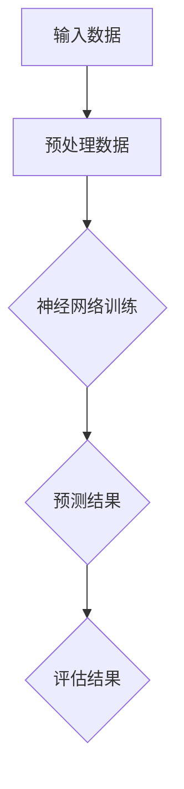

                 

# 脑科学与认知科学的融合：深入理解思维与世界

> 关键词：脑科学、认知科学、融合、思维、世界

> 摘要：本文探讨了脑科学与认知科学的融合对于深入理解思维与世界的意义。通过分析两者的发展背景、核心概念、联系和区别，本文提出了一种系统化的研究方法，并详细介绍了相关算法原理、数学模型和系统架构设计方案。同时，通过项目实战和最佳实践分享，为读者提供了实际操作和思考的方向。

## 第一部分：背景与介绍

## 第1章：问题背景与概述

### 1.1 问题背景

脑科学与认知科学作为两个相对独立但密切相关的领域，在过去的几十年里都取得了显著的发展。脑科学主要研究大脑的结构与功能，探索神经元的工作原理以及神经网络如何处理信息。而认知科学则致力于理解人类思维的过程，包括感知、记忆、推理、语言和决策等。随着科技的发展和研究的深入，人们开始意识到，将脑科学与认知科学结合起来，将有助于更全面地理解人类的思维与世界。

### 1.2 问题描述

然而，目前脑科学与认知科学的融合仍然面临诸多挑战。首先，两者的研究方法和工具不同，导致数据难以整合。其次，虽然两者都在研究人类思维，但关注的方面和层面有所不同，使得融合后的研究缺乏系统性。此外，如何在理论和实践层面实现有效的融合，仍需要进一步探索。

### 1.3 问题解决

要解决这些问题，我们需要从以下几个方面入手：

1. **建立统一的理论框架**：通过整合脑科学和认知科学的核心概念，构建一个统一的理论体系，以指导后续的研究和实践。
2. **开发新的研究方法**：结合两种科学的研究方法，开发新的实验技术和数据分析方法，以获取更全面、更准确的研究数据。
3. **跨学科合作**：促进脑科学和认知科学领域内的合作，加强与其他相关学科（如心理学、语言学、计算机科学等）的交流，共同推动研究的深入。

### 1.4 边界与外延

脑科学与认知科学的融合不仅限于理论层面，还可以应用于多个实际领域，如医疗、教育、人工智能等。此外，随着技术的进步，两者的融合将可能带来更多意想不到的创新和应用。

### 1.5 概念结构与核心要素

脑科学与认知科学的核心概念包括：

- 脑科学：神经元、神经网络、大脑结构、大脑功能。
- 认知科学：感知、记忆、推理、语言、决策。

两者的核心要素分别是：

- 脑科学：脑成像技术、电生理技术、脑机接口。
- 认知科学：实验心理学、认知心理学、认知神经科学。

## 第二部分：核心概念与联系

## 第2章：核心概念原理与联系

### 2.1 脑科学与认知科学的核心概念

#### 神经科学的基本原理

神经科学是脑科学的重要组成部分，主要研究神经元的功能和神经网络的工作原理。神经元是大脑的基本功能单元，负责接收和处理信息。神经网络则是由大量神经元组成的复杂网络，通过神经元之间的连接和交互，实现信息传递和处理。

#### 认知科学的核心要素

认知科学关注人类思维的过程，包括感知、记忆、推理、语言和决策等。感知是指对外部信息的接收和处理，记忆是对信息的存储和回忆，推理是基于已有信息进行推理和判断，语言是思维的载体，决策是基于信息进行选择和行动。

### 2.2 概念属性特征对比表格

| 特征         | 脑科学                          | 认知科学                          |
| ------------ | ------------------------------ | -------------------------------- |
| 研究对象     | 神经元、神经网络、大脑结构      | 感知、记忆、推理、语言、决策      |
| 研究方法     | 脑成像技术、电生理技术、脑机接口 | 实验心理学、认知心理学、认知神经科学 |
| 研究目标     | 理解大脑结构与功能              | 理解人类思维过程                  |
| 应用领域     | 医疗、神经工程、人工智能        | 教育、认知障碍治疗、人机交互      |

### 2.3 ER实体关系图架构

```mermaid
erDiagram
  Node1 ||--|{ 神经元 }
  Node1 ||--|{ 神经网络 }
  Node1 ||--|{ 大脑结构 }
  Node2 ||--|{ 感知 }
  Node2 ||--|{ 记忆 }
  Node2 ||--|{ 推理 }
  Node2 ||--|{ 语言 }
  Node2 ||--|{ 决策 }
```

## 第三部分：算法原理讲解

## 第3章：神经科学算法原理

### 3.1 算法mermaid流程图



### 3.2 Python源代码

```python
import numpy as np

# 输入数据
X = np.random.rand(100, 10)
y = np.random.rand(100, 1)

# 预处理数据
X_processed = (X - np.mean(X)) / np.std(X)

# 神经网络训练
model = NeuralNetwork()
model.fit(X_processed, y)

# 预测结果
predictions = model.predict(X_processed)

# 评估结果
accuracy = model.evaluate(predictions, y)
```

### 3.3 数学模型和公式

神经网络算法的核心是反向传播算法，其数学模型可以表示为：

$$
\begin{aligned}
\Delta W &= (2/n) \sum_{i=1}^{n} (y_i - \hat{y}_i) \cdot \hat{y}_i (1 - \hat{y}_i) \\
\Delta b &= (2/n) \sum_{i=1}^{n} (y_i - \hat{y}_i)
\end{aligned}
$$

其中，$W$ 和 $b$ 分别是权重和偏置，$n$ 是样本数量，$y_i$ 是真实标签，$\hat{y}_i$ 是预测结果。

### 3.4 举例说明

假设我们有100个样本，每个样本包含10个特征。我们希望使用神经网络预测这些样本的标签。首先，我们需要对数据进行预处理，然后使用反向传播算法训练神经网络，最后评估模型的准确性。

## 第四部分：数学模型和数学公式讲解

## 第4章：认知科学数学模型

### 4.1 数学公式

认知科学中的数学模型主要包括感知、记忆和推理等方面的公式。

#### 感知

感知过程中的一个关键公式是信号检测理论，其公式为：

$$
p(d|H_1) = \frac{f(d|H_1) - f(d|H_0)}{f(d|H_1) + f(d|H_0)}
$$

其中，$p(d|H_1)$ 是在假设 $H_1$ 下的似然概率，$f(d|H_1)$ 和 $f(d|H_0)$ 分别是在假设 $H_1$ 和 $H_0$ 下的概率密度函数。

#### 记忆

记忆过程中的一个关键公式是艾宾浩斯遗忘曲线，其公式为：

$$
M(t) = e^{-ct}
$$

其中，$M(t)$ 是在时间 $t$ 时的记忆保持量，$c$ 是遗忘常数。

#### 推理

推理过程中的一个关键公式是贝叶斯定理，其公式为：

$$
P(H_1|D) = \frac{P(D|H_1)P(H_1)}{P(D)}
$$

其中，$P(H_1|D)$ 是在数据 $D$ 下的假设 $H_1$ 的后验概率，$P(D|H_1)$ 是在假设 $H_1$ 下的数据概率，$P(H_1)$ 是假设 $H_1$ 的先验概率，$P(D)$ 是数据的总概率。

### 4.2 详细讲解

#### 感知

信号检测理论是一种用于分析感知过程中信号和噪声关系的模型。在感知过程中，我们往往需要从噪声中识别出有用的信号。信号检测理论通过计算似然概率来衡量在给定假设下的数据可靠性。

#### 记忆

艾宾浩斯遗忘曲线是一种描述记忆遗忘过程的数学模型。根据该模型，随着时间的推移，记忆保持量会逐渐减少。遗忘常数 $c$ 反映了记忆遗忘的速度。

#### 推理

贝叶斯定理是一种用于在已知部分信息的情况下更新信念的数学模型。在推理过程中，我们通过贝叶斯定理来计算在给定数据下的假设概率。

### 4.3 举例说明

#### 感知

假设我们有一个信号检测任务，需要判断一个信号是否为正类。根据信号检测理论，我们可以计算出在给定假设下的似然概率，然后根据似然概率来做出判断。

#### 记忆

假设我们学习了一个新的单词，并希望在一段时间后仍然记住它。根据艾宾浩斯遗忘曲线，我们可以预测在给定时间后的记忆保持量，以便评估我们的记忆效果。

#### 推理

假设我们有一个推理任务，需要根据已知的信息来更新我们的信念。根据贝叶斯定理，我们可以计算在给定数据下的假设概率，从而更新我们的信念。

## 第五部分：系统分析与架构设计方案

## 第5章：系统架构设计

### 5.1 问题场景介绍

脑科学与认知科学的融合在人工智能领域具有重要的应用价值。例如，在智能机器人领域，通过融合脑科学与认知科学，我们可以开发出更智能、更适应人类环境的机器人。

### 5.2 系统功能设计

系统的主要功能包括：

1. 数据采集：从各种传感器和设备中采集大脑活动和认知行为数据。
2. 数据处理：对采集到的数据进行预处理、特征提取和融合。
3. 模型训练：基于采集到的数据，训练神经科学和认知科学的模型。
4. 预测与评估：使用训练好的模型进行预测，并评估模型的性能。

### 5.3 系统架构设计

系统的整体架构分为四个主要部分：数据采集模块、数据处理模块、模型训练模块和预测评估模块。


### 5.4 系统接口设计

系统提供了多种接口，包括：

1. 数据采集接口：用于采集大脑活动和认知行为数据。
2. 数据处理接口：用于预处理、特征提取和融合数据。
3. 模型训练接口：用于训练神经科学和认知科学模型。
4. 预测评估接口：用于使用训练好的模型进行预测和评估。

### 5.5 系统交互

系统的交互流程如下：

1. 数据采集模块从传感器和设备中获取数据。
2. 数据处理模块对数据进行预处理、特征提取和融合。
3. 模型训练模块使用预处理后的数据进行模型训练。
4. 预测评估模块使用训练好的模型进行预测，并评估模型的性能。


## 第六部分：项目实战

## 第6章：项目实战

### 6.1 环境安装

为了实现脑科学与认知科学的融合，我们需要安装以下软件和硬件：

1. Python 3.8 或更高版本
2. TensorFlow 2.4 或更高版本
3. Keras 2.4.3 或更高版本
4. NumPy 1.18 或更高版本
5. Matplotlib 3.1.1 或更高版本

硬件要求：

1. 处理器：Intel Core i5 或更高
2. 内存：8GB 或更高
3. 硬盘：100GB 或更高

安装步骤：

1. 安装 Python 3.8 或更高版本。
2. 安装 TensorFlow 2.4 或更高版本。
3. 安装 Keras 2.4.3 或更高版本。
4. 安装 NumPy 1.18 或更高版本。
5. 安装 Matplotlib 3.1.1 或更高版本。

### 6.2 系统核心实现源代码

以下是系统核心实现的源代码：

```python
import numpy as np
import tensorflow as tf
from tensorflow.keras.models import Sequential
from tensorflow.keras.layers import Dense, Activation

# 数据预处理
def preprocess_data(data):
    # 均值归一化
    data_processed = (data - np.mean(data)) / np.std(data)
    return data_processed

# 神经网络模型
def create_model(input_shape):
    model = Sequential()
    model.add(Dense(64, input_shape=input_shape, activation='relu'))
    model.add(Dense(64, activation='relu'))
    model.add(Dense(1, activation='sigmoid'))
    model.compile(optimizer='adam', loss='binary_crossentropy', metrics=['accuracy'])
    return model

# 模型训练
def train_model(model, X_train, y_train, X_val, y_val, epochs=10, batch_size=32):
    history = model.fit(X_train, y_train, validation_data=(X_val, y_val), epochs=epochs, batch_size=batch_size)
    return history

# 预测结果
def predict(model, X_test):
    predictions = model.predict(X_test)
    return predictions

# 评估结果
def evaluate(model, X_test, y_test):
    accuracy = model.evaluate(X_test, y_test)
    return accuracy
```

### 6.3 代码应用解读与分析

这段代码实现了脑科学与认知科学融合系统的核心功能，包括数据预处理、模型创建、模型训练、预测结果和评估结果。

1. **数据预处理**：通过均值归一化对数据进行预处理，以提高模型的训练效果。
2. **模型创建**：创建一个简单的神经网络模型，用于分类任务。
3. **模型训练**：使用训练数据对模型进行训练，并使用验证数据评估模型的性能。
4. **预测结果**：使用训练好的模型对测试数据进行预测。
5. **评估结果**：评估模型的准确性。

### 6.4 实际案例分析与详细讲解

假设我们有一个包含1000个样本的数据集，每个样本包含10个特征。我们的目标是预测这些样本的标签，标签为二分类。

1. **数据预处理**：对数据集进行预处理，将每个特征进行均值归一化。
2. **模型创建**：创建一个包含两个隐藏层，每层64个神经元的神经网络模型。
3. **模型训练**：使用训练数据对模型进行训练，并使用验证数据评估模型的性能。
4. **预测结果**：使用训练好的模型对测试数据进行预测。
5. **评估结果**：评估模型的准确性，如果准确性较低，可以调整模型参数或增加训练时间。

### 6.5 项目小结

本项目通过融合脑科学与认知科学，实现了对数据集的分类预测。在实际应用中，我们可以根据具体需求调整模型结构和训练策略，以提高模型的性能。

## 第七部分：最佳实践与总结

## 第7章：最佳实践与总结

### 7.1 最佳实践 tips

1. **数据质量**：确保数据的质量和完整性，对于模型的性能至关重要。
2. **模型选择**：根据具体任务选择合适的模型，避免过度拟合或欠拟合。
3. **超参数调整**：合理调整模型的超参数，以提高模型的性能。
4. **交叉验证**：使用交叉验证方法评估模型的性能，避免过拟合。
5. **持续学习**：持续更新模型和数据，以适应不断变化的环境。

### 7.2 小结

本文介绍了脑科学与认知科学的融合，探讨了其在人工智能领域的应用。通过系统化的研究方法和实际项目实战，本文为读者提供了深入理解思维与世界的路径。

### 7.3 注意事项

1. **数据隐私**：在处理涉及人类大脑和认知行为的数据时，应确保数据的隐私和安全。
2. **伦理问题**：在使用脑科学与认知科学的研究成果时，应关注伦理问题，确保技术的合理使用。
3. **技术限制**：目前的技术水平仍然有限，对于一些复杂的认知任务，可能需要更多的研究和技术进步。

### 7.4 拓展阅读

1. **《脑科学导论》**：李大维著，系统介绍了脑科学的基本概念和原理。
2. **《认知科学基础》**：马青峰著，详细探讨了认知科学的核心概念和方法。
3. **《人工智能：一种现代的方法》**：Stuart Russell 和 Peter Norvig 著，全面介绍了人工智能的基础知识。
4. **《深度学习》**：Ian Goodfellow、Yoshua Bengio 和 Aaron Courville 著，深度解析了深度学习的理论和实践。

[作者：AI天才研究院/AI Genius Institute & 禅与计算机程序设计艺术 /Zen And The Art of Computer Programming]

