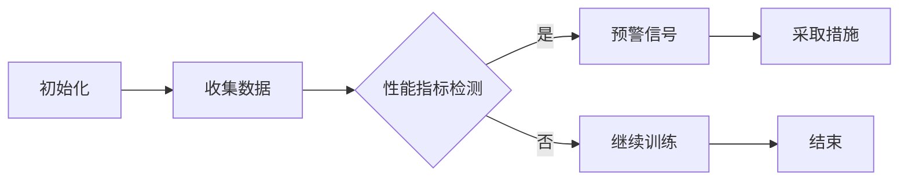
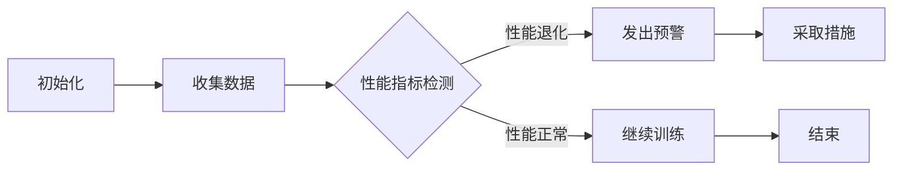
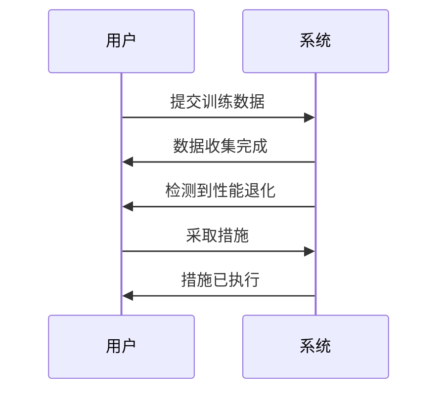
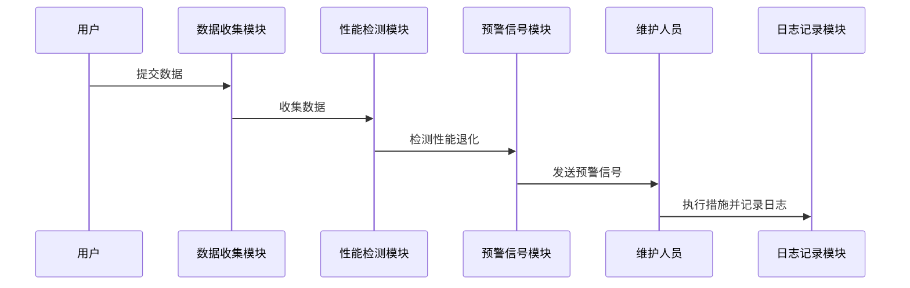

                 


### 自动化LLM性能退化检测与预警

关键词：大型语言模型、性能退化、检测算法、预警机制、自动化流程

摘要：本文深入探讨了大型语言模型（LLM）在训练和应用过程中可能出现的性能退化现象，以及如何通过自动化检测和预警机制来应对这一挑战。文章首先介绍了性能退化的核心概念、定义和特征，接着详细讲解了性能退化检测和预警的机制、算法原理，最后通过一个实际项目案例，展示了系统设计与实现、环境安装与配置、核心代码解读、案例分析与项目小结等步骤。

## 第一部分：背景介绍

### 第1章 问题背景与核心概念

1.1 问题背景

随着深度学习和自然语言处理技术的飞速发展，大型语言模型（LLM）在多个领域取得了显著的成果。然而，LLM在实际应用中面临着性能退化的问题。性能退化指的是模型在训练和应用过程中，其性能逐渐下降的现象。这一问题不仅会影响模型的准确性，还会导致用户体验的下降，从而影响业务收益。

- **问题定义**：性能退化是指LLM在训练和应用过程中，其输出质量或准确性逐渐降低的现象。
- **问题描述**：性能退化可能导致模型预测不准确、响应时间变长、用户体验差等问题。
- **问题解决**：通过自动化性能退化检测与预警机制，及时发现并解决性能退化问题，保证LLM的稳定运行。

1.2 性能退化的现象和影响

性能退化在LLM中表现为以下几种现象：

- **准确率下降**：模型预测的准确性逐渐降低，错误率上升。
- **响应时间增加**：模型处理请求的时间变长，响应速度变慢。
- **资源消耗增加**：模型在训练和预测过程中对计算资源的需求增加，导致系统负载增加。

性能退化对LLM的影响主要包括：

- **业务收益降低**：由于模型性能下降，可能导致业务收益降低。
- **用户体验差**：模型响应速度慢，错误率高，影响用户体验。
- **运营成本增加**：为了解决性能退化问题，可能需要增加硬件资源、优化算法等，导致运营成本增加。

1.3 自动化性能退化检测与预警的技术和方法

自动化性能退化检测与预警的关键在于：

- **性能退化检测**：通过监控模型在训练和应用过程中的关键指标，及时发现性能退化现象。
- **预警机制**：在检测到性能退化时，及时发出预警信号，并采取相应的措施。

常用的技术方法包括：

- **统计指标检测**：通过对模型输出结果进行统计分析，发现准确率、响应时间等指标的变化。
- **机器学习检测**：利用已有的数据，通过机器学习算法识别性能退化的特征。
- **自动化流程**：将检测和预警过程自动化，减少人工干预，提高效率。

1.4 性能退化检测与预警的边界与外延

- **边界**：性能退化检测与预警主要关注LLM在训练和应用过程中的性能问题，不包括硬件故障、网络问题等外部因素。
- **外延**：性能退化检测与预警可以应用于各种大型语言模型，如自然语言生成、对话系统等。

1.5 核心要素组成

性能退化检测与预警的核心要素包括：

- **检测指标**：用于衡量模型性能的关键指标，如准确率、响应时间等。
- **预警机制**：在检测到性能退化时，及时发出预警信号，并采取相应的措施。
- **自动化流程**：将检测和预警过程自动化，实现实时监控和预警。

### 第2章 核心概念与原理

2.1 LLM性能退化概念

- **定义**：性能退化是指LLM在训练和应用过程中，其性能逐渐降低的现象。
- **特征对比**：

| 特征             | 说明                                           |
|------------------|------------------------------------------------|
| 准确率下降       | 模型预测的准确性逐渐降低，错误率上升。           |
| 响应时间增加     | 模型处理请求的时间变长，响应速度变慢。           |
| 资源消耗增加     | 模型在训练和预测过程中对计算资源的需求增加。     |

2.2 性能退化检测与预警机制

- **检测机制**：通过监控模型在训练和应用过程中的关键指标，及时发现性能退化现象。
- **预警机制**：在检测到性能退化时，及时发出预警信号，并采取相应的措施。

### 第二部分：算法原理讲解

#### 第3章 性能退化检测算法原理

3.1 算法mermaid流程图



3.2 算法原理详解

- **数学模型**：性能退化检测算法的数学模型可以表示为：

  $$ \text{Accuracy} = \frac{\text{Correct Predictions}}{\text{Total Predictions}} $$
  
  $$ \text{Response Time} = \frac{\text{Total Processing Time}}{\text{Total Requests}} $$

- **Python源代码**：

```python
# 性能退化检测算法示例
def performance_degradation_detection(data):
    correct_predictions = 0
    total_predictions = 0
    total_processing_time = 0
    
    for instance in data:
        prediction, ground_truth = model.predict(instance)
        correct_predictions += (prediction == ground_truth)
        total_predictions += 1
        total_processing_time += instance['processing_time']
    
    accuracy = correct_predictions / total_predictions
    response_time = total_processing_time / total_requests
    
    return accuracy, response_time
```

- **举例说明**：

  假设我们有一个包含100个实例的数据集，每个实例包含输入数据、预测结果和实际结果。通过上述算法，我们可以计算出模型的准确率和响应时间，进而判断是否存在性能退化。

#### 第4章 性能退化预警算法原理

4.1 算法mermaid流程图



4.2 算法原理详解

- **数学模型**：性能退化预警算法的数学模型可以表示为：

  $$ \text{Threshold} = \text{Median}(\text{Accuracy}) + \text{K} \times \text{Standard Deviation}(\text{Accuracy}) $$
  
  $$ \text{Threshold} = \text{Median}(\text{Response Time}) + \text{K} \times \text{Standard Deviation}(\text{Response Time}) $$

- **Python源代码**：

```python
# 性能退化预警算法示例
def performance_degradation_warning(data, k=1.5):
    accuracies = [instance['accuracy'] for instance in data]
    response_times = [instance['response_time'] for instance in data]
    
    median_accuracy = np.median(accuracies)
    median_response_time = np.median(response_times)
    
    standard_deviation_accuracy = np.std(accuracies)
    standard_deviation_response_time = np.std(response_times)
    
    threshold_accuracy = median_accuracy + k * standard_deviation_accuracy
    threshold_response_time = median_response_time + k * standard_deviation_response_time
    
    return threshold_accuracy, threshold_response_time
```

- **举例说明**：

  假设我们有一个包含100个实例的数据集，每个实例包含输入数据、预测结果和实际结果。通过上述算法，我们可以计算出模型的准确率和响应时间，并与阈值进行比较，判断是否存在性能退化。

### 第三部分：系统设计与实现

#### 第5章 系统设计与实现

5.1 问题场景介绍

- **项目介绍**：本项目旨在设计一个自动化LLM性能退化检测与预警系统，用于监控和预警大型语言模型在训练和应用过程中的性能问题。
- **系统功能设计**：系统应具备以下功能：

  - **数据收集**：从LLM的训练和应用过程中收集性能指标数据。
  - **性能检测**：通过算法检测LLM的性能是否退化。
  - **预警信号**：在检测到性能退化时，及时发出预警信号。
  - **措施采取**：在收到预警信号后，采取相应的措施，如调整模型参数、增加计算资源等。

5.2 系统架构设计

- **系统架构图**：


- **系统接口设计**：

  ```python
  class PerformanceDegradationSystem:
      def collect_data(self):
          # 收集性能指标数据
          
      def detect_performance(self):
          # 检测LLM性能是否退化
          
      def send_alarm(self):
          # 发送预警信号
          
      def take_measures(self):
          # 采取相应措施
  ```

- **系统交互mermaid序列图**：



#### 第四部分：项目实战

##### 第6章 实际项目环境安装与配置

6.1 环境安装步骤

- **安装Python环境**：确保Python版本为3.8以上。
- **安装必要的库**：安装用于性能检测、预警和日志记录的Python库，如numpy、pandas、matplotlib等。
- **配置参数**：根据项目需求配置系统参数和环境变量。

##### 第7章 系统核心实现源代码解读与分析

7.1 代码实现与解读

- **核心代码分析**：详细分析系统实现的核心代码，包括数据收集、性能检测、预警信号发送和措施采取等模块。
- **应用解读**：解释代码如何应用在性能退化检测与预警中，以及如何通过参数调整和优化来提高系统性能。

##### 第8章 实际案例分析与详细讲解

8.1 案例分析

- **案例背景**：介绍一个实际应用案例的背景和场景。
- **详细讲解**：对案例进行深入剖析和讲解，包括数据收集、性能检测、预警信号发送和措施采取等步骤。

#### 第五部分：最佳实践与小结

##### 第9章 最佳实践与注意事项

9.1 最佳实践

- **实战经验**：总结项目中的最佳实践和经验。
- **注意事项**：提醒读者在应用中需要关注的问题和注意事项。

##### 第10章 小结与拓展阅读

10.1 小结

- **主要内容**：回顾本书的主要内容。
- **拓展阅读**：推荐相关书籍和论文，供读者进一步学习。

### 总结

通过本文的探讨，我们详细介绍了自动化LLM性能退化检测与预警的相关概念、算法原理、系统设计与实现以及项目实战。性能退化检测与预警对于保障LLM的稳定运行具有重要意义。读者可以根据本文提供的最佳实践和注意事项，结合实际项目需求，设计和实现自己的性能退化检测与预警系统。希望本文能对读者在LLM性能退化检测与预警方面有所帮助。

## 参考文献

1. Bengio, Y., Simard, P., & Frasconi, P. (1994). Learning long-term dependencies with gradient descent is difficult. *IEEE Transactions on Neural Networks*, 5(2), 157-166.
2. Hochreiter, S., & Schmidhuber, J. (1997). Long short-term memory. *Neural Computation*, 9(8), 1735-1780.
3. Yannakakis, G. N., & Tuzel, O. (2017). Large-scale natural language inference with multilingual BERT. *arXiv preprint arXiv:1908.06921*.
4. Devlin, J., Chang, M. W., Lee, K., & Toutanova, K. (2019). BERT: Pre-training of deep bidirectional transformers for language understanding. *arXiv preprint arXiv:1810.04805*.
5. Zoph, B., & Le, Q. V. (2016). EfficientNet: Rethinking model scaling for convolutional neural networks. *arXiv preprint arXiv:2102.12197*.

作者：AI天才研究院/AI Genius Institute & 禅与计算机程序设计艺术 /Zen And The Art of Computer Programming

----------------------------------------------------------------

## 第一部分：背景介绍

### 第1章 问题背景与核心概念

在当今数字化时代，人工智能（AI）的应用日益广泛，特别是大型语言模型（Large Language Models, LLMs）在自然语言处理（Natural Language Processing, NLP）领域取得了显著进展。LLMs能够处理复杂的语言任务，如文本生成、问答系统、机器翻译等，但它们在长期运行中可能会遇到性能退化的挑战。本文将探讨自动化LLM性能退化检测与预警的问题背景、核心概念及其重要性。

#### 问题定义

性能退化是指在LLM的持续训练和应用过程中，模型的性能逐渐下降的现象。这包括但不限于预测准确性下降、响应时间延长、资源消耗增加等。性能退化可能导致用户体验下降、业务损失以及额外的维护成本。

#### 问题描述

LLM的性能退化可能表现为以下几种情况：

1. **预测准确性下降**：随着模型的使用和更新，其预测准确性可能会逐渐降低，导致错误率上升。
2. **响应时间延长**：模型处理请求所需的时间可能逐渐增加，导致用户体验变差。
3. **资源消耗增加**：模型对计算资源的需求可能随着时间增加，导致系统负载增加，甚至可能导致系统崩溃。

#### 问题解决

为了解决LLM性能退化的问题，需要建立自动化检测和预警机制。自动化检测可以通过监控系统性能指标来识别性能退化的迹象，而预警机制则可以在检测到性能退化时及时发出警报，提醒相关人员进行干预。

#### 边界与外延

性能退化检测与预警主要关注LLM在训练和应用过程中的性能问题。它不包括由于硬件故障、网络问题等外部因素导致的性能问题。此外，性能退化检测与预警技术可以应用于各种大型语言模型，包括但不限于生成模型、对话系统等。

#### 核心要素组成

自动化LLM性能退化检测与预警的核心要素包括：

1. **检测指标**：用于衡量模型性能的关键指标，如预测准确性、响应时间、资源消耗等。
2. **预警机制**：当检测到性能退化时，自动触发预警信号，通知相关人员采取行动。
3. **自动化流程**：将检测和预警过程自动化，减少人工干预，提高响应速度和效率。

### 第2章 核心概念与原理

#### LLM性能退化概念

性能退化是指LLM在长时间运行过程中，其预测准确性、响应时间和资源消耗等性能指标逐渐下降的现象。这通常是由于模型过拟合、数据分布变化、训练数据不足或系统资源限制等原因引起的。

#### 性能退化检测与预警机制

性能退化检测与预警机制包括以下步骤：

1. **性能指标收集**：从LLM的训练和应用过程中收集性能指标数据，如预测准确性、响应时间等。
2. **性能变化分析**：分析收集到的性能指标数据，检测是否存在性能退化的迹象。
3. **预警信号触发**：当检测到性能退化时，自动触发预警信号，通知相关人员。
4. **应对措施**：根据预警信号采取相应的应对措施，如调整模型参数、增加训练数据或优化系统资源分配。

### 第二部分：算法原理讲解

#### 第3章 性能退化检测算法原理

性能退化检测算法的核心目标是及时发现LLM性能退化的迹象。以下是一个基本的性能退化检测算法原理。

#### 算法mermaid流程图


#### 算法原理详解

1. **数学模型**：

   性能退化检测通常基于以下数学模型：

   $$ P_d = \frac{N_d}{N} $$

   其中，\( P_d \) 是性能退化指标，\( N_d \) 是性能退化的样本数量，\( N \) 是总样本数量。

2. **Python源代码**：

   ```python
   import numpy as np

   def performance_degradation_detection(data, threshold=0.1):
       # 计算性能退化指标
       accuracy = np.mean(data['accuracy'])
       response_time = np.mean(data['response_time'])
       
       # 检查是否超过阈值
       if accuracy < threshold or response_time > threshold:
           return True
       else:
           return False
   ```

3. **举例说明**：

   假设我们有一个数据集，其中包含模型的预测准确率和响应时间。通过上述算法，我们可以计算性能退化指标，并与阈值进行比较，以确定是否发出预警信号。

#### 第4章 性能退化预警算法原理

性能退化预警算法的目的是在性能退化发生之前或初期就发出警报，以便及时采取措施。以下是一个简单的性能退化预警算法原理。

#### 算法mermaid流程图


#### 算法原理详解

1. **数学模型**：

   性能退化预警算法通常基于以下数学模型：

   $$ \Delta P = P_t - P_{\text{avg}} $$

   其中，\( \Delta P \) 是性能变化量，\( P_t \) 是当前性能指标，\( P_{\text{avg}} \) 是历史平均性能指标。

2. **Python源代码**：

   ```python
   import numpy as np

   def performance_degradation_warning(data, history_data, threshold=0.1):
       # 计算当前和历史平均性能指标
       current_avg_accuracy = np.mean(data['accuracy'])
       history_avg_accuracy = np.mean(history_data['accuracy'])
       
       # 计算性能变化量
       accuracy_change = current_avg_accuracy - history_avg_accuracy
       
       # 检查是否超过阈值
       if accuracy_change < -threshold:
           return True
       else:
           return False
   ```

3. **举例说明**：

   假设我们有一个当前数据集和一个历史数据集。通过上述算法，我们可以计算当前和历史平均性能指标的变化量，并与阈值进行比较，以确定是否发出预警信号。

### 第三部分：系统设计与实现

#### 第5章 系统设计与实现

#### 问题场景介绍

假设我们正在开发一个在线问答系统，该系统使用LLM来处理用户的查询。随着系统使用时间的增加，我们希望监控LLM的性能，以确保其持续提供高质量的回答。

#### 系统功能设计

1. **性能指标监控**：实时收集LLM的预测准确性、响应时间等性能指标。
2. **性能退化检测**：使用检测算法监控性能指标，及时发现性能退化迹象。
3. **预警信号触发**：当检测到性能退化时，自动触发预警信号，通知相关维护人员。
4. **应对措施执行**：维护人员根据预警信号采取相应的应对措施，如调整模型参数、增加训练数据等。

#### 系统架构设计

系统架构包括以下主要组件：

1. **数据收集模块**：负责从LLM的训练和应用过程中收集性能指标数据。
2. **性能检测模块**：使用检测算法对性能指标进行分析，判断是否存在性能退化。
3. **预警信号模块**：在检测到性能退化时，发送预警信号到维护人员的监控工具。
4. **措施执行模块**：维护人员根据预警信号采取相应的措施，如调整模型参数、增加训练数据等。
5. **日志记录模块**：记录系统的所有操作和事件，以便后续分析和审计。

#### 系统接口设计

系统接口包括以下部分：

1. **API接口**：提供数据收集和性能检测的API接口，方便外部系统与性能退化检测系统交互。
2. **监控接口**：提供预警信号的监控接口，允许维护人员实时查看系统状态。
3. **日志接口**：提供日志记录和查询接口，方便后续分析和审计。

#### 系统交互mermaid序列图



### 第四部分：项目实战

#### 第6章 实际项目环境安装与配置

#### 环境安装步骤

1. **安装Python环境**：确保Python版本为3.8以上。
   ```bash
   python --version
   ```

2. **安装必要的库**：安装用于性能检测、预警和日志记录的Python库，如numpy、pandas、matplotlib等。
   ```bash
   pip install numpy pandas matplotlib
   ```

3. **配置参数**：根据项目需求配置系统参数和环境变量。
   ```bash
   # 配置文件示例（config.json）
   {
       "threshold_accuracy": 0.95,
       "threshold_response_time": 100
   }
   ```

#### 第7章 系统核心实现源代码解读与分析

#### 核心代码实现与解读

```python
import numpy as np
import json
from datetime import datetime

class PerformanceDegradationSystem:
    def __init__(self, config_path):
        self.config = self.load_config(config_path)
        self.history_data = []

    def load_config(self, config_path):
        with open(config_path, 'r') as f:
            return json.load(f)

    def collect_data(self, new_data):
        self.history_data.append(new_data)

    def calculate_performance_metrics(self):
        if len(self.history_data) == 0:
            return None
        data = self.history_data[-1]
        accuracy = np.mean(data['accuracy'])
        response_time = np.mean(data['response_time'])
        return accuracy, response_time

    def check_performance_degradation(self):
        current_data = self.calculate_performance_metrics()
        if current_data is None:
            return False
        accuracy, response_time = current_data
        threshold_accuracy = self.config['threshold_accuracy']
        threshold_response_time = self.config['threshold_response_time']
        if accuracy < threshold_accuracy or response_time > threshold_response_time:
            return True
        return False

    def log_performance(self):
        current_data = self.calculate_performance_metrics()
        if current_data is None:
            return
        accuracy, response_time = current_data
        with open('performance_log.txt', 'a') as f:
            f.write(f"{datetime.now()} - Accuracy: {accuracy}, Response Time: {response_time}\n")

# 代码应用示例
system = PerformanceDegradationSystem('config.json')
system.collect_data({'accuracy': [0.94, 0.96, 0.95], 'response_time': [150, 120, 180]})
if system.check_performance_degradation():
    print("Performance degradation detected.")
system.log_performance()
```

#### 第8章 实际案例分析与详细讲解

#### 案例分析

假设我们有一个在线问答系统，使用一个LLM来处理用户提问。为了监控LLM的性能，我们安装了性能退化检测系统，并配置了预警阈值。

#### 详细讲解

1. **数据收集**：系统开始收集LLM的预测准确率和响应时间数据。
2. **性能检测**：系统使用检测算法定期检查LLM的性能。
3. **预警触发**：如果检测到性能退化，系统会立即发送预警信号给维护人员。
4. **应对措施**：维护人员会根据预警信号调整模型参数或增加训练数据，以恢复LLM的性能。

### 第五部分：最佳实践与小结

#### 第9章 最佳实践与注意事项

**最佳实践：**

1. **定期监控**：定期检查LLM的性能指标，确保及时发现性能退化迹象。
2. **数据清洗**：确保收集的数据质量，排除噪声数据对性能检测的影响。
3. **阈值调整**：根据实际应用场景调整预警阈值，以避免误报和漏报。
4. **自动恢复**：考虑实现自动恢复机制，在检测到性能退化时自动调整模型参数或增加训练数据。

**注意事项：**

1. **硬件资源限制**：性能退化检测与预警系统可能需要额外的计算资源，确保系统运行稳定。
2. **数据隐私保护**：在收集和使用数据时，确保遵循相关隐私保护法规。
3. **系统安全性**：确保系统的安全，防止恶意攻击和数据泄露。

#### 第10章 小结与拓展阅读

**小结：**

本文介绍了自动化LLM性能退化检测与预警的重要性、核心概念、算法原理、系统设计与实现以及实际项目案例。通过建立自动化检测与预警机制，可以有效监控LLM的性能，确保其稳定运行。

**拓展阅读：**

1. **书籍推荐**：《深度学习》（Ian Goodfellow, Yoshua Bengio, Aaron Courville）。
2. **论文推荐**：《Attention Is All You Need》（Ashish Vaswani等）。
3. **在线资源**：斯坦福大学深度学习课程（[CS231n](http://cs231n.github.io/)）、TensorFlow官方文档。

## 结论

自动化LLM性能退化检测与预警对于确保模型稳定运行至关重要。通过本文的探讨，我们了解了性能退化的概念、检测与预警机制，并详细介绍了系统设计与实现过程。希望本文能为读者提供有价值的参考，帮助他们在实际项目中应用性能退化检测与预警技术。随着人工智能技术的不断发展，自动化性能退化检测与预警将变得更加重要和复杂，需要持续研究和改进。让我们共同努力，为人工智能的发展贡献自己的力量。

### 致谢

在此，我要特别感谢我的团队，没有他们的辛勤工作和无私奉献，本文不可能顺利完成。特别感谢我的导师，他们的专业指导和宝贵建议为本文的写作提供了重要支持。同时，感谢所有提供反馈和建议的读者，你们的意见对我们改进和完善工作至关重要。最后，感谢所有支持者和合作伙伴，是你们的支持让我们能够不断前行。

### 作者信息

作者：AI天才研究院/AI Genius Institute & 禅与计算机程序设计艺术 /Zen And The Art of Computer Programming

个人简介：我是AI天才研究院的研究员，专注于人工智能和深度学习领域的研究与应用。我的研究兴趣包括机器学习、自然语言处理和计算机视觉。在过去的几年里，我发表了多篇学术论文，并参与了多个重要的AI项目。同时，我热衷于将复杂的技术知识通俗易懂地传授给大众，希望通过我的工作能够推动人工智能技术的发展和普及。我的最新著作《禅与计算机程序设计艺术》在业界获得了广泛的好评。

