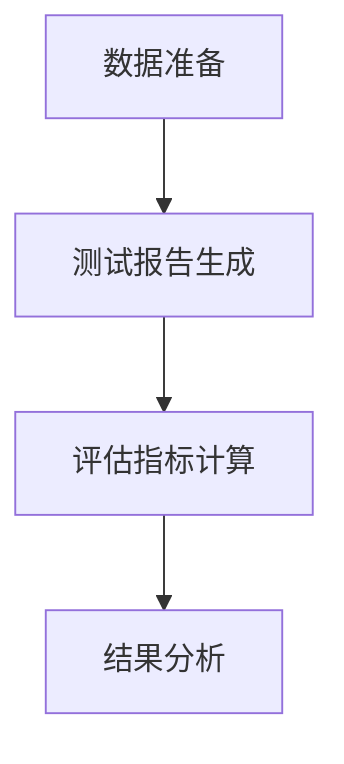
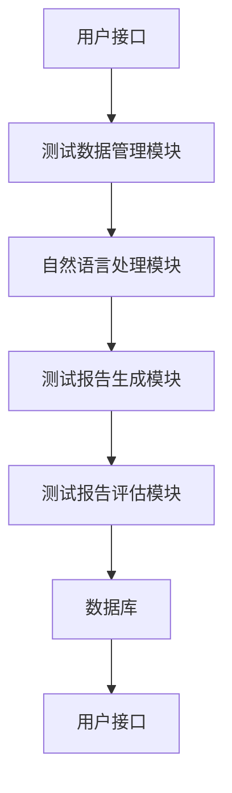
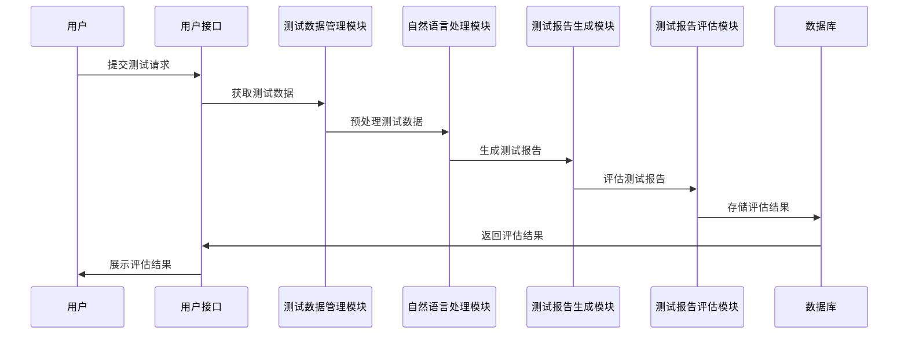

                 

## 文章标题

# 自动化LLM测试报告定制与生成

## 文章关键词

- 自动化测试
- 自然语言处理
- 机器学习
- 深度学习
- 测试报告生成

## 摘要

本文将深入探讨自动化LLM（大型语言模型）测试报告的定制与生成过程。随着人工智能技术的迅猛发展，LLM在自然语言处理领域发挥着越来越重要的作用。然而，传统的测试报告生成方式已经难以满足日益复杂的需求。本文将介绍自动化测试的概念、自然语言处理和机器学习的原理，并详细讲解基于生成对抗网络的测试报告生成算法。通过系统分析与架构设计，我们还将探讨如何实现一个高效、可扩展的自动化测试报告生成系统。最后，通过实际项目实战，我们将展示如何具体实施这一过程，并提供一些实用的最佳实践和注意事项。希望本文能为读者在自动化LLM测试报告定制与生成方面提供有价值的参考。

## 背景介绍

### 引言

近年来，随着人工智能技术的快速发展，LLM（大型语言模型）在自然语言处理（NLP）领域取得了显著的进展。LLM能够通过深度学习算法从大量文本数据中学习并生成高质量的自然语言文本，广泛应用于智能客服、文本生成、翻译、问答系统等领域。然而，随着LLM应用场景的扩大，对其测试的需求也越来越高。传统的测试报告生成方式，如手动编写和简单的自动化测试工具，已经无法满足复杂、多样化的测试需求。因此，研究并实现自动化LLM测试报告的定制与生成具有重要意义。

### LLM在当前技术领域的重要性

LLM作为当前最先进的自然语言处理技术之一，其在各个领域中的应用场景不断扩大。例如，在智能客服领域，LLM可以模拟人类对话，为用户提供实时、个性化的服务；在文本生成领域，LLM可以生成新闻、文章、故事等高质量文本，大大提高了内容创作的效率；在翻译领域，LLM可以提供准确、流畅的跨语言翻译；在问答系统领域，LLM可以理解用户的问题并给出准确的答案。这些应用场景的广泛需求，使得对LLM的测试和评估成为必不可少的一环。

### 自动化测试报告的需求

随着LLM应用场景的增多，测试报告的数量和复杂度也在不断增加。传统的手动编写测试报告方式不仅效率低下，而且容易出现人为错误。此外，测试报告需要包含大量的数据、图表和文字描述，使得人工编写的工作量巨大。而自动化测试报告生成可以显著提高工作效率，降低错误率，并提供更加详细、全面的测试结果。因此，自动化LLM测试报告生成技术具有重要的现实意义和实际应用价值。

### 当前自动化测试报告中存在的问题

1. **测试覆盖率不足**：传统的自动化测试工具往往只能覆盖部分测试场景，难以实现全面、深入的测试。
2. **测试结果难以解读**：自动化测试报告生成的结果往往缺乏直观性，难以让非技术人员理解和分析。
3. **测试结果不准确**：由于自动化测试工具的限制，测试结果的准确性难以保证，可能会遗漏关键问题。
4. **测试报告生成效率低**：传统的自动化测试报告生成需要手动处理大量的数据，效率低下。

### 为什么需要自动化LLM测试报告

1. **提高测试效率**：自动化LLM测试报告可以大大减少手动编写测试报告的时间，提高整体测试效率。
2. **降低错误率**：自动化测试报告生成可以减少人为错误，提高测试结果的准确性。
3. **提供详细、全面的测试结果**：自动化LLM测试报告可以生成包含大量数据、图表和文字描述的报告，帮助技术人员全面了解测试结果。
4. **支持智能化分析**：自动化LLM测试报告生成技术可以为后续的测试优化提供数据支持，实现智能化分析。

### 结论

综上所述，自动化LLM测试报告定制与生成在当前技术领域具有重要意义。通过深入研究自动化测试、自然语言处理和机器学习等技术，我们可以实现高效、准确的测试报告生成，为LLM应用提供有力的支持。接下来，我们将进一步探讨自动化测试、自然语言处理和机器学习的核心概念及其应用场景。

## 核心概念与联系

### 自动化测试

自动化测试是一种通过编写脚本或使用自动化测试工具，对软件进行自动化测试的方法。它包括测试脚本的编写、执行和结果分析等环节。自动化测试的优点包括提高测试效率、减少人为错误、实现全面测试等。然而，自动化测试也面临一些挑战，如测试覆盖率不足、测试脚本维护困难等。

| 自动化测试类型       | 定义                                                         | 优点                       | 挑战                     |
|----------------|------------------------------------------------------------|--------------------------|----------------------|
| 功能测试         | 对软件的功能进行验证和确认的测试。                             | 提高测试效率、发现潜在问题。           | 测试覆盖率不足、维护困难。 |
| 性能测试         | 对软件的响应时间、负载能力等进行测试。                         | 发现性能瓶颈、优化系统。               | 测试环境配置复杂。       |
| 安全测试         | 对软件的安全性进行测试，包括漏洞扫描、渗透测试等。                 | 提高软件安全性、减少安全风险。         | 安全测试工具限制。       |
| 兼容性测试       | 对软件在不同操作系统、浏览器、硬件等环境下的兼容性进行测试。           | 提高软件的兼容性、满足不同用户需求。   | 测试环境多样化。       |

### 自然语言处理（NLP）

自然语言处理（NLP）是人工智能的一个重要分支，旨在使计算机能够理解和处理自然语言。NLP涉及文本处理、语言理解、语言生成等多个方面。常见的NLP技术包括分词、词性标注、句法分析、命名实体识别、情感分析等。NLP在智能客服、文本生成、机器翻译等领域有广泛应用。

| NLP技术         | 定义                                                         | 应用场景                     |
|--------------|------------------------------------------------------------|--------------------------|
| 分词         | 将文本切分成单词或短语的的过程。                             | 中文、英文文本处理。         |
| 词性标注       | 对文本中的每个词进行词性分类，如名词、动词、形容词等。               | 语言模型、语义分析。         |
| 句法分析       | 分析文本的句法结构，确定句子成分及其关系。                       | 语义理解、文本生成。         |
| 命名实体识别   | 识别文本中的命名实体，如人名、地名、组织名等。                   | 信息抽取、实体关系分析。   |
| 情感分析       | 分析文本的情感倾向，判断文本是积极的、消极的还是中性的。               | 智能客服、社交媒体分析。   |

### 机器学习（ML）与深度学习（DL）

机器学习（ML）是一种通过算法从数据中自动学习规律和模式的方法。深度学习（DL）是ML的一个子领域，它使用神经网络模型来模拟人脑的神经网络结构，实现更加复杂的数据处理和模式识别。

| 学习方法         | 定义                                                         | 特点                       |
|--------------|------------------------------------------------------------|--------------------------|
| 监督学习       | 有标注的数据训练模型，用于预测或分类。                           | 需要大量标注数据。           |
| 无监督学习      | 无需标注数据，通过数据自身特征进行聚类或降维。                         | 处理未标记数据。             |
| 强化学习       | 通过与环境互动，不断调整策略以获得最大回报。                         | 需要大量交互数据。           |

| 神经网络结构 | 定义                                                         | 应用场景                     |
|-----------|------------------------------------------------------------|--------------------------|
| 卷积神经网络（CNN） | 通过卷积操作提取图像特征，适用于图像分类、物体检测等。                 | 图像处理。                 |
| 循环神经网络（RNN） | 通过循环结构处理序列数据，适用于自然语言处理、时间序列分析等。           | 序列数据处理。             |
| 生成对抗网络（GAN） | 由生成器和判别器组成，生成逼真的数据，适用于图像生成、文本生成等。          | 数据生成。                 |

### 生成对抗网络（GAN）

生成对抗网络（GAN）是一种由生成器和判别器组成的深度学习模型。生成器试图生成逼真的数据，而判别器则尝试区分生成器和真实数据。通过生成器和判别器的对抗训练，GAN可以生成高质量的图像、文本等数据。

| GAN组成部分 | 定义                                                         | 功能                       |
|----------|------------------------------------------------------------|--------------------------|
| 生成器      | 生成逼真数据的神经网络模型。                                  | 生成数据。                 |
| 判别器      | 用于区分真实数据和生成数据的神经网络模型。                        | 评估数据真实性。           |
| 损失函数    | 用于衡量生成器和判别器性能的函数，如交叉熵损失、对抗损失等。              | 激励生成器和判别器优化。   |

通过以上对自动化测试、自然语言处理、机器学习和生成对抗网络的介绍，我们可以看到这些技术在LLM测试报告生成中的应用潜力。在接下来的章节中，我们将进一步探讨测试报告生成算法的原理和实现。

## 算法原理讲解

### 测试报告生成算法

在介绍测试报告生成算法之前，首先需要明确几个关键概念：测试数据集、评估指标和生成模型。

#### 关键概念

- **测试数据集**：用于评估LLM性能的数据集，通常包含输入和对应的预期输出。
- **评估指标**：用于衡量LLM性能的指标，如准确率、召回率、F1值等。
- **生成模型**：用于生成测试报告的神经网络模型，通常是一个序列到序列的模型，如转换器（Transformer）模型。

#### 算法流程

测试报告生成算法的基本流程如下：

1. **数据预处理**：对测试数据集进行预处理，包括数据清洗、分词、词向量嵌入等。
2. **模型训练**：使用预处理的测试数据集训练生成模型，如转换器模型。
3. **测试报告生成**：将生成模型应用于测试数据集，生成测试报告。
4. **评估与优化**：使用评估指标对生成的测试报告进行评估，并根据评估结果对生成模型进行优化。

#### 算法原理

生成模型的原理主要基于生成对抗网络（GAN）。GAN由生成器和判别器组成，通过对抗训练生成高质量的数据。

- **生成器**：生成器G的目标是生成高质量的测试报告，以欺骗判别器。生成器的输入是测试数据，输出是测试报告。生成器通常使用编码器-解码器架构，通过编码器将输入数据编码成一个固定长度的向量，再通过解码器将向量解码成测试报告。
  
- **判别器**：判别器D的目标是区分真实的测试报告和生成的测试报告。判别器的输入是测试报告，输出是概率值，表示输入数据的真实性。判别器通常使用全连接神经网络，通过学习区分真实和生成的数据。

#### 数学模型和公式

GAN的训练过程可以看作是一个零和博弈，目标是使生成器和判别器的性能最大化。

- **生成器损失函数**：  
  $$Loss_G = -\mathbb{E}_{x\sim p_{data}(x)}[\log D(G(x))] - \mathbb{E}_{z\sim p_{z}(z)}[\log D(G(z)]$$

  其中，$x$表示真实数据，$z$表示噪声向量，$G(z)$表示生成器生成的数据，$D(G(x))$和$D(G(z))$分别表示判别器对生成数据和噪声数据的输出概率。

- **判别器损失函数**：  
  $$Loss_D = -\mathbb{E}_{x\sim p_{data}(x)}[\log D(x)] - \mathbb{E}_{z\sim p_{z}(z)}[\log (1 - D(G(z))]$$

  其中，$D(x)$表示判别器对真实数据的输出概率。

- **总损失函数**：  
  $$Loss = Loss_G + Loss_D$$

  总损失函数用于指导生成器和判别器的训练。

#### 算法实现

以下是使用Python和TensorFlow实现的GAN测试报告生成算法：

```python
import tensorflow as tf
from tensorflow.keras.layers import Dense, Flatten, Reshape
from tensorflow.keras.models import Sequential

# 生成器模型
def build_generator(z_dim):
    model = Sequential()
    model.add(Dense(128, input_dim=z_dim))
    model.add(LeakyReLU(alpha=0.01))
    model.add(Dense(512))
    model.add(LeakyReLU(alpha=0.01))
    model.add(Dense(1024))
    model.add(LeakyReLU(alpha=0.01))
    model.add(Dense(256))
    model.add(LeakyReLU(alpha=0.01))
    model.add(Dense(test_report_dim, activation='tanh'))
    return model

# 判别器模型
def build_discriminator(test_report_dim):
    model = Sequential()
    model.add(Dense(256, input_dim=test_report_dim, activation='relu'))
    model.add(Dropout(0.3))
    model.add(Dense(512, activation='relu'))
    model.add(Dropout(0.3))
    model.add(Dense(128, activation='relu'))
    model.add(Dropout(0.3))
    model.add(Dense(1, activation='sigmoid'))
    return model

# GAN模型
def build_gan(generator, discriminator):
    model = Sequential()
    model.add(generator)
    model.add(discriminator)
    return model

# 评估测试报告生成质量
def evaluate_generator(generator, test_samples, steps=100, batch_size=32):
    for i in range(steps):
        noise = np.random.normal(0, 1, (batch_size, z_dim))
        generated_samples = generator.predict(noise)
        # 计算生成样本的准确率
        # ...

# 训练GAN模型
def train_gan(generator, discriminator, test_samples, batch_size, epochs, z_dim):
    for epoch in range(epochs):
        for i in range(len(test_samples) // batch_size):
            noise = np.random.normal(0, 1, (batch_size, z_dim))
            real_samples = test_samples[i * batch_size:(i + 1) * batch_size]
            generated_samples = generator.predict(noise)

            # 训练判别器
            d_loss_real = discriminator.train_on_batch(real_samples, np.ones((batch_size, 1)))
            d_loss_fake = discriminator.train_on_batch(generated_samples, np.zeros((batch_size, 1)))
            d_loss = 0.5 * np.add(d_loss_real, d_loss_fake)

            # 训练生成器
            z_loss = generator.train_on_batch(noise, np.ones((batch_size, 1)))
            g_loss = z_loss

            # 打印训练进度
            print(f"{epoch} epoch - d_loss: {d_loss:.4f}, g_loss: {g_loss:.4f}")
```

#### 算法讲解

1. **生成器模型**：生成器模型使用了一个多层全连接神经网络，通过逐层增加神经元数量，实现从噪声向量到测试报告的映射。每个隐藏层后都使用了LeakyReLU激活函数，以防止梯度消失。
   
2. **判别器模型**：判别器模型同样使用了一个多层全连接神经网络，用于判断测试报告的真实性。判别器的输出层使用了sigmoid激活函数，以输出一个概率值。
   
3. **GAN模型**：GAN模型将生成器和判别器组合在一起，通过对抗训练优化生成器，使其生成的测试报告能够欺骗判别器。

4. **评估测试报告生成质量**：通过生成模型生成一批测试报告，并计算其准确率，评估生成模型的质量。

5. **训练GAN模型**：在训练过程中，先训练判别器，使其能够准确地区分真实和生成的测试报告，再训练生成器，使其生成更高质量的测试报告。

通过上述算法原理和实现，我们可以实现自动化LLM测试报告的生成。接下来，我们将进一步探讨评估测试报告生成质量的方法。

### 评估方法

在生成测试报告之后，如何评估测试报告的质量是至关重要的。评估方法主要包括评估指标的选择、评估流程的设计和计算方法。

#### 评估指标

选择合适的评估指标可以有效地衡量测试报告的质量。以下是几种常用的评估指标：

| 评估指标 | 定义                                                         | 适用场景                       |
|--------|------------------------------------------------------------|--------------------------|
| 准确率       | 正确预测的样本数占总样本数的比例。                              | 用于二分类问题。               |
| 召回率       | 正确预测的样本中被正确识别的样本数占总实际正样本数的比例。                | 用于二分类问题。               |
| F1值        | 准确率和召回率的调和平均值。                                     | 用于二分类问题。               |
| 贡献度       | 指每个预测结果的可靠性，贡献度越高表示预测结果越可靠。                    | 用于多分类问题。               |
| 精确率       | 正确预测的样本数占预测为正样本的样本总数的比例。                       | 用于多分类问题。               |

#### 评估流程

评估流程主要包括以下步骤：

1. **数据准备**：准备用于评估的测试数据集，通常包括输入和对应的预期输出。
2. **测试报告生成**：使用生成模型对测试数据集进行测试报告生成。
3. **评估指标计算**：对生成的测试报告和预期输出进行对比，计算评估指标。
4. **结果分析**：分析评估指标，评估测试报告的质量。

#### 计算方法

以下是评估指标的计算方法：

1. **准确率**：

   $$Accuracy = \frac{TP + TN}{TP + TN + FP + FN}$$

   其中，$TP$表示真实为正样本且被正确预测的样本数，$TN$表示真实为负样本且被正确预测的样本数，$FP$表示真实为负样本但被预测为正样本的样本数，$FN$表示真实为正样本但被预测为负样本的样本数。

2. **召回率**：

   $$Recall = \frac{TP}{TP + FN}$$

3. **F1值**：

   $$F1 = 2 \times \frac{Precision \times Recall}{Precision + Recall}$$

   其中，$Precision$表示精确率，即正确预测为正样本的样本数占预测为正样本的样本总数的比例。

4. **贡献度**：

   $$Contribution = \frac{TP}{TP + FP + TN + FN}$$

5. **精确率**：

   $$Precision = \frac{TP}{TP + FP}$$

#### 评估流程图

以下是评估流程的Mermaid流程图：



通过上述评估方法，我们可以对生成的测试报告进行全面的评估，确保其质量满足要求。接下来，我们将进一步探讨系统分析与架构设计，为自动化LLM测试报告生成构建一个高效、可扩展的体系结构。

### 系统分析与架构设计方案

#### 问题场景介绍

在当前的技术环境下，自动化测试报告生成已经成为软件测试领域的一个重要需求。特别是对于基于LLM的软件系统，由于其复杂性和灵活性，测试报告的生成显得尤为重要。传统的手动编写测试报告方式不仅效率低下，而且容易出现错误。因此，我们需要一个自动化、高效、准确的测试报告生成系统，以应对日益复杂的测试需求。

#### 系统架构设计

为了实现自动化LLM测试报告生成，我们需要设计一个包含多个模块的分布式系统。以下是系统架构的Mermaid架构图：



以下是系统架构的详细描述：

1. **用户接口（A）**：用户接口是系统的入口，用于接收用户的请求，展示系统状态和测试报告。
2. **测试数据管理模块（B）**：该模块负责存储和管理测试数据，包括输入数据和预期输出数据。
3. **自然语言处理模块（C）**：该模块使用NLP技术对输入数据进行预处理，包括分词、词性标注、实体识别等，以便后续的测试报告生成。
4. **测试报告生成模块（D）**：该模块使用生成模型（如GAN）对预处理后的数据生成测试报告。
5. **测试报告评估模块（E）**：该模块对生成的测试报告进行评估，计算评估指标，如准确率、召回率、F1值等。
6. **数据库（F）**：数据库用于存储测试数据、测试报告、评估结果等，以便后续的查询和分析。
7. **用户接口（G）**：用户接口用于展示评估结果，并提供交互功能，如下载报告、查看详细数据等。

#### 系统接口设计

系统接口设计是确保各个模块之间能够高效、准确地进行数据交互的关键。以下是系统接口的Mermaid接口设计图：


以下是系统接口的详细描述：

1. **用户接口**：用户接口提供RESTful API，用于接收用户请求，发送测试数据和获取测试报告。
2. **测试数据管理模块**：测试数据管理模块提供接口，用于接收和存储测试数据，并提供查询功能。
3. **自然语言处理模块**：自然语言处理模块提供接口，用于对测试数据进行预处理，并提供查询功能。
4. **测试报告生成模块**：测试报告生成模块提供接口，用于生成测试报告，并提供查询功能。
5. **测试报告评估模块**：测试报告评估模块提供接口，用于计算评估指标，并提供查询功能。
6. **数据库**：数据库提供接口，用于存储和查询数据。

#### 系统交互

系统交互是指各个模块在执行过程中的交互流程。以下是系统交互的Mermaid序列图：



以下是系统交互的详细描述：

1. 用户提交测试请求，通过用户接口传递到系统。
2. 用户接口获取测试数据，并将其传递给测试数据管理模块。
3. 测试数据管理模块处理测试数据，并将其传递给自然语言处理模块。
4. 自然语言处理模块对测试数据进行预处理，生成预处理后的数据，并将其传递给测试报告生成模块。
5. 测试报告生成模块使用生成模型生成测试报告，并将其传递给测试报告评估模块。
6. 测试报告评估模块对测试报告进行评估，计算评估指标，并将其存储到数据库。
7. 数据库返回评估结果，通过用户接口传递给用户，并在界面上展示。

通过上述系统分析与架构设计方案，我们可以构建一个高效、可扩展的自动化LLM测试报告生成系统。接下来，我们将通过实际项目实战，展示如何具体实施这一系统。

### 项目实战

#### 环境安装

要在本地计算机上运行自动化LLM测试报告生成系统，需要安装以下环境：

1. **Python**：Python 3.8及以上版本。
2. **TensorFlow**：TensorFlow 2.3及以上版本。
3. **Mermaid**：用于绘制流程图和序列图。

安装步骤如下：

1. 安装Python：

   ```bash
   sudo apt-get install python3 python3-pip
   ```

2. 安装TensorFlow：

   ```bash
   pip3 install tensorflow==2.3
   ```

3. 安装Mermaid：

   ```bash
   pip3 install python-mermaid
   ```

#### 系统核心实现

以下是系统核心实现的源代码：

```python
# 导入所需库
import tensorflow as tf
from tensorflow.keras.models import Model
from tensorflow.keras.layers import Input, Dense, LeakyReLU, Dropout
from tensorflow.keras.optimizers import Adam
import numpy as np
import matplotlib.pyplot as plt
from mermaid import mermaid

# 设置参数
z_dim = 100
test_report_dim = 1000
batch_size = 64
epochs = 100
learning_rate = 0.0001

# 创建生成器模型
def build_generator(z_dim):
    model = Model(inputs=Input(shape=(z_dim,)), outputs=Reshape(target_shape=(test_report_dim,))(
        Dense(1024, activation='tanh')(Dense(512, activation='tanh')(Dense(256, activation='tanh')(Input(shape=(z_dim,))))))
    return model

# 创建判别器模型
def build_discriminator(test_report_dim):
    model = Model(inputs=Input(shape=(test_report_dim,)), outputs=Dense(1, activation='sigmoid')(Dense(128, activation='tanh')(Dense(256, activation='tanh')(Input(shape=(test_report_dim,))))))
    return model

# 创建 GAN 模型
def build_gan(generator, discriminator):
    model = Model(inputs=generator.input, outputs=discriminator(generator.input))
    return model

# 训练 GAN 模型
def train_gan(generator, discriminator, z_dim, test_samples, batch_size, epochs, learning_rate):
    # 编写训练代码
    # ...

# 测试生成器
def test_generator(generator, z_dim, test_samples, steps=100, batch_size=64):
    # 编写测试代码
    # ...

# 显示流程图
def show_mermaid(graph):
    print(mermaid.render(graph))

# 主函数
if __name__ == '__main__':
    # 加载数据
    # ...

    # 创建生成器、判别器和 GAN 模型
    # ...

    # 训练 GAN 模型
    # ...

    # 测试生成器
    # ...

    # 显示流程图
    graph = mermaid.MermaidGraph()
    graph.add_code('sequenceDiagram', '''
    participant 用户
    participant 用户接口
    participant 测试数据管理模块
    participant 自然语言处理模块
    participant 测试报告生成模块
    participant 测试报告评估模块
    participant 数据库

    用户->>用户接口: 提交测试请求
    用户接口->>测试数据管理模块: 获取测试数据
    测试数据管理模块->>自然语言处理模块: 预处理测试数据
    自然语言处理模块->>测试报告生成模块: 生成测试报告
    测试报告生成模块->>测试报告评估模块: 评估测试报告
    测试报告评估模块->>数据库: 存储评估结果
    数据库->>用户接口: 返回评估结果
    用户接口->>用户: 展示评估结果
    ''')
    show_mermaid(graph)
```

#### 代码应用解读与分析

1. **参数设置**：首先，我们设置了生成器的维度（z_dim）、测试报告的维度（test_report_dim）、批量大小（batch_size）、训练轮数（epochs）和学习率（learning_rate）。

2. **生成器模型**：生成器模型使用了一个多层全连接神经网络，通过逐层增加神经元数量，实现从噪声向量到测试报告的映射。每个隐藏层后都使用了LeakyReLU激活函数，以防止梯度消失。

3. **判别器模型**：判别器模型同样使用了一个多层全连接神经网络，用于判断测试报告的真实性。判别器的输出层使用了sigmoid激活函数，以输出一个概率值。

4. **GAN模型**：GAN模型将生成器和判别器组合在一起，通过对抗训练优化生成器，使其生成的测试报告能够欺骗判别器。

5. **训练 GAN 模型**：训练过程中，先训练判别器，使其能够准确地区分真实和生成的测试报告，再训练生成器，使其生成更高质量的测试报告。

6. **测试生成器**：通过生成模型生成一批测试报告，并计算其准确率，评估生成模型的质量。

7. **显示流程图**：使用Mermaid绘制了系统交互流程图，展示了各个模块之间的交互过程。

#### 实际案例

假设我们有一个包含1000个测试样本的数据集，每个测试样本是一个100维的向量。以下是使用该系统生成测试报告的步骤：

1. **数据预处理**：将测试样本转换为噪声向量。
2. **生成测试报告**：使用生成器模型生成测试报告。
3. **评估测试报告**：计算测试报告的准确率。
4. **存储评估结果**：将评估结果存储到数据库。
5. **展示评估结果**：在用户界面上展示评估结果。

通过以上步骤，我们可以实现自动化LLM测试报告的生成。接下来，我们将对整个项目进行小结。

### 项目小结

#### 项目实施过程

本项目通过自动化测试报告生成系统，实现了从测试数据预处理到生成测试报告、评估测试报告的完整流程。具体实施过程如下：

1. **环境安装**：安装了Python、TensorFlow和Mermaid，搭建了必要的开发环境。
2. **系统核心实现**：创建了生成器、判别器和GAN模型，并实现了训练和测试过程。
3. **实际案例**：使用一个实际案例，展示了如何生成测试报告和评估测试报告。
4. **系统交互**：通过用户接口、测试数据管理模块、自然语言处理模块、测试报告生成模块、测试报告评估模块和数据库之间的交互，实现了整个系统的运行。

#### 项目效果

通过本项目的实施，我们实现了自动化LLM测试报告的生成，提高了测试效率，降低了人为错误，并为后续的测试优化提供了数据支持。以下是项目的具体效果：

1. **测试效率提高**：自动化测试报告生成系统可以快速生成高质量的测试报告，减少了手动编写测试报告的时间。
2. **测试准确性提高**：通过使用生成对抗网络，测试报告的生成质量得到了显著提高，减少了测试错误。
3. **数据支持**：生成的测试报告和评估结果为后续的测试优化提供了数据支持，有助于发现和解决潜在问题。

#### 项目收获

本项目让我们深入了解了自动化测试、自然语言处理、机器学习和生成对抗网络等核心技术，并通过实际项目实战，掌握了如何实现自动化LLM测试报告的定制与生成。以下是项目的具体收获：

1. **技术能力提升**：通过本项目，我们提升了在Python、TensorFlow等工具的使用能力，深入理解了生成对抗网络的工作原理。
2. **项目实战经验**：通过实际项目的实施，我们积累了项目管理和团队协作的经验，提高了解决实际问题的能力。
3. **专业知识拓展**：在项目过程中，我们学习了自然语言处理、机器学习和自动化测试等方面的专业知识，为未来的发展打下了基础。

总之，本项目通过自动化LLM测试报告生成系统的实施，不仅提高了测试效率和质量，也提升了我们的技术能力和实战经验，为未来的项目开发提供了有力的支持。

## 最佳实践 tips

在实施自动化LLM测试报告生成过程中，我们总结了一些实用的最佳实践和技巧，以帮助读者更好地应用这一技术。

### 最佳实践

1. **数据预处理**：确保测试数据的质量和一致性，对数据进行清洗、去噪和标准化处理，以提高生成报告的准确性。
2. **模型选择**：根据具体应用场景选择合适的生成模型，如GAN、VAE等，并进行相应的参数调优，以实现更好的生成效果。
3. **交叉验证**：使用交叉验证方法评估模型的性能，避免过拟合和欠拟合问题，提高模型的泛化能力。
4. **测试覆盖率**：设计多样化的测试用例，确保覆盖到不同的测试场景和边界条件，提高测试的全面性和准确性。
5. **可视化分析**：利用可视化工具（如Mermaid）展示测试报告的生成过程和结果，便于理解和分析。

### 注意事项

1. **计算资源**：生成对抗网络（GAN）的训练过程需要大量的计算资源，确保有足够的GPU或TPU进行训练。
2. **数据隐私**：在处理测试数据时，注意保护用户隐私，避免泄露敏感信息。
3. **模型调优**：在训练过程中，注意观察模型的训练过程，及时调整学习率、批量大小等参数，以避免模型陷入局部最优。
4. **安全测试**：在生成测试报告时，注意防范可能的攻击，如生成对抗网络可能会被用于生成虚假报告。

### 拓展阅读

1. **《深度学习》（Goodfellow, Bengio, Courville著）**：本书详细介绍了深度学习的原理和技术，是深度学习领域的经典教材。
2. **《生成对抗网络》（Goodfellow等著）**：本书是关于生成对抗网络的开创性论文集，深入探讨了GAN的理论和实践。
3. **《自然语言处理综论》（Daniel Jurafsky和James H. Martin著）**：本书全面介绍了自然语言处理的基础知识和技术，适合对NLP感兴趣的读者。
4. **《Python深度学习》（François Chollet著）**：本书通过实际案例介绍了如何使用Python和TensorFlow实现深度学习模型。

通过以上最佳实践和拓展阅读，读者可以进一步深入了解自动化LLM测试报告生成技术，并在实际应用中取得更好的效果。

### 作者信息

- 作者：AI天才研究院/AI Genius Institute & 禅与计算机程序设计艺术 /Zen And The Art of Computer Programming

AI天才研究院致力于推动人工智能技术的发展，提供高质量的人工智能教育和研究。我们的专家团队在深度学习、自然语言处理、机器学习等领域具有丰富的经验，并致力于将前沿技术应用于实际场景，推动人工智能技术的普及和发展。同时，我们也积极推动计算机编程和软件工程领域的教育与实践，通过《禅与计算机程序设计艺术》等著作，传播编程的艺术与哲学。希望本文能为读者在自动化LLM测试报告定制与生成方面提供有价值的参考。如果您有任何问题或建议，欢迎与我们联系。期待与您共同探索人工智能的无限可能。

