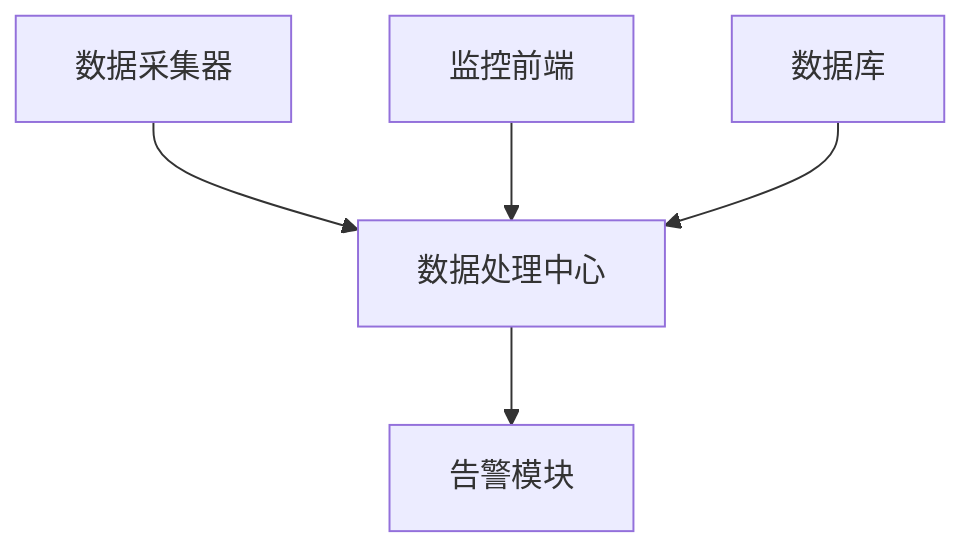
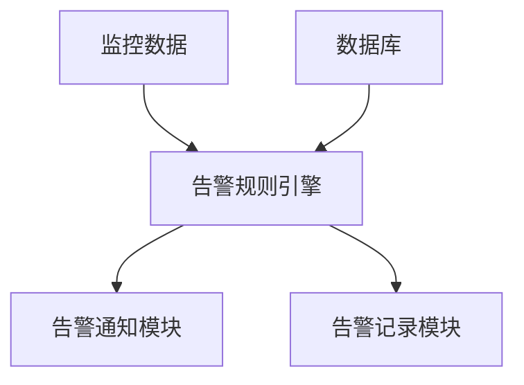

                 

### 自动化LLM测试环境监控与告警

> 关键词：自动化测试、大型语言模型（LLM）、测试环境监控、告警系统

> 摘要：本文深入探讨了自动化LLM测试环境监控与告警系统的设计、实现及优化策略，分析了其核心概念、系统架构、功能模块，并通过实践案例展示了其实际应用效果。

---

### 目录大纲

## 第一部分：背景与核心概念

### 第1章：自动化LLM测试环境监控与告警概述

### 第2章：自动化LLM测试环境概述

## 第二部分：监控与告警系统设计

### 第3章：监控系统的设计与实现

### 第4章：告警系统的设计与实现

## 第三部分：自动化测试执行与监控

### 第5章：自动化测试执行流程

### 第6章：实时监控与动态告警

## 第四部分：实践与优化

### 第7章：自动化测试环境监控与告警实践

### 第8章：监控与告警系统的优化

## 附录

### A. 工具与库介绍

### B. 拓展阅读

---

### 第一部分：背景与核心概念

#### 第1章：自动化LLM测试环境监控与告警概述

##### 1.1.1 问题背景

随着人工智能技术的不断发展，大型语言模型（LLM）在自然语言处理（NLP）领域得到了广泛应用。然而，LLM的复杂性和大规模数据处理需求使得测试环境的监控与告警成为一项极具挑战性的任务。如何确保自动化LLM测试环境的稳定性和可靠性，及时发现和解决潜在问题，是当前亟待解决的问题。

##### 1.1.2 核心概念

在本章节中，我们将介绍以下核心概念：

- LLM测试环境：指用于进行LLM测试的软硬件环境，包括数据源、测试工具、测试用例等。
- 监控：指对系统运行状态进行实时监测，包括性能、资源使用情况等。
- 告警：指在检测到异常情况时，通过通知机制提醒相关人员。

##### 1.1.3 需要解决的问题与目标

在本章节中，我们将探讨以下问题：

- 如何构建一个自动化LLM测试环境？
- 如何设计一个有效的监控与告警系统？
- 如何实现实时监控与动态告警？

我们的目标是设计一个高效、可靠的自动化LLM测试环境监控与告警系统，确保测试过程的顺利进行。

---

#### 第2章：自动化LLM测试环境概述

##### 2.1.1 LLM测试环境的组成

自动化LLM测试环境由以下几个主要部分组成：

- 数据源：用于提供测试数据，可以是静态数据集或实时数据流。
- 测试工具：用于执行测试任务，如自动化测试框架、性能测试工具等。
- 测试用例：用于定义测试场景和预期结果。
- 环境配置：包括硬件配置、软件配置、网络配置等。

##### 2.1.2 LLM测试环境的特点

自动化LLM测试环境具有以下特点：

- 大规模数据处理能力：能够处理海量数据，支持大规模并发测试。
- 高度自动化：测试流程高度自动化，减少人工干预。
- 灵活性与可扩展性：能够根据测试需求灵活调整测试环境和策略。

---

### 第二部分：监控与告警系统设计

#### 第3章：监控系统的设计与实现

##### 3.1.1 监控系统的架构

监控系统的架构主要包括以下几个部分：

- 数据收集模块：负责从LLM测试环境中收集性能、资源使用等数据。
- 数据处理模块：负责对收集到的数据进行分析和处理，提取关键指标。
- 告警模块：负责根据预设条件触发告警，通知相关人员。

##### 3.1.2 监控系统功能模块

监控系统的功能模块包括：

- 数据收集：从LLM测试环境中收集性能、资源使用等数据。
- 数据处理：对收集到的数据进行处理，提取关键指标。
- 告警机制：根据预设条件触发告警，通知相关人员。

---

#### 第4章：告警系统的设计与实现

##### 4.1.1 告警系统的架构

告警系统的架构主要包括以下几个部分：

- 告警触发模块：负责根据监控系统的数据，判断是否触发告警。
- 告警通知模块：负责向相关人员发送告警通知。
- 告警记录模块：负责记录告警信息，便于后续分析。

##### 4.1.2 告警系统功能模块

告警系统的功能模块包括：

- 告警通知：根据预设条件向相关人员发送告警通知。
- 告警策略：定义告警触发条件和通知策略。
- 告警记录：记录告警信息，便于后续分析。

---

### 第三部分：自动化测试执行与监控

#### 第5章：自动化测试执行流程

##### 5.1.1 自动化测试流程设计

自动化测试流程设计包括以下步骤：

1. 测试计划：明确测试目标、测试范围、测试资源等。
2. 测试用例设计：设计测试场景和预期结果。
3. 测试脚本编写：根据测试用例编写测试脚本。
4. 测试执行：执行测试脚本，收集测试结果。
5. 测试结果分析：分析测试结果，找出潜在问题。

##### 5.1.2 测试脚本执行与监控

在测试脚本执行过程中，监控系统会实时收集性能、资源使用等数据，以便于后续分析。

---

#### 第6章：实时监控与动态告警

##### 6.1.1 实时监控的实现

实时监控的实现包括以下步骤：

1. 数据采集：从LLM测试环境中采集性能、资源使用等数据。
2. 数据处理：对采集到的数据进行分析和处理，提取关键指标。
3. 实时展示：将处理后的数据实时展示在监控界面上。

##### 6.1.2 动态告警机制

动态告警机制包括以下步骤：

1. 告警阈值设置：根据业务需求和系统性能指标，设置告警阈值。
2. 数据分析：实时分析性能、资源使用等数据，判断是否触发告警。
3. 告警触发：当数据超过告警阈值时，触发告警并通知相关人员。

---

### 第四部分：实践与优化

#### 第7章：自动化测试环境监控与告警实践

在本章节中，我们将介绍以下实践案例：

1. 某AI公司测试环境监控实践
2. 某金融科技公司告警系统优化实践

通过这些实践案例，我们将探讨如何在实际项目中实施自动化LLM测试环境监控与告警系统。

---

#### 第8章：监控与告警系统的优化

##### 8.1.1 优化策略与方法

监控与告警系统的优化策略包括：

1. 性能优化：提高监控系统的处理速度和响应时间。
2. 可靠性优化：确保监控数据的准确性和系统的稳定性。
3. 安全性优化：保护监控数据和系统的安全性。

##### 8.1.2 优化实践

在本章节中，我们将分享以下优化实践：

1. 某AI公司监控与告警系统优化实践
2. 某金融科技公司监控与告警系统优化实践

通过这些实践，我们将探讨如何在实际项目中优化监控与告警系统，提高其性能和可靠性。

---

### 附录

#### A. 工具与库介绍

在本章节中，我们将介绍以下工具与库：

1. 监控工具：如Prometheus、Grafana等。
2. 告警工具：如Alertmanager、Opsgenie等。
3. 自动化测试工具：如pytest、JUnit等。

#### B. 拓展阅读

在本章节中，我们将推荐以下拓展阅读资料：

1. 相关文献与资料推荐：如《大型语言模型测试技术》、《监控与告警系统设计》等。
2. 行业动态与发展趋势：如自动化测试行业报告、人工智能行业趋势等。

---

### 结束语

本文从背景与核心概念、监控与告警系统设计、自动化测试执行与监控、实践与优化等四个方面，详细介绍了自动化LLM测试环境监控与告警系统的设计与实现。通过实际案例分析，我们展示了其在实际应用中的效果。希望本文能为读者在自动化测试环境监控与告警系统的设计与实现过程中提供有益的参考。

---

### 作者信息

作者：AI天才研究院/AI Genius Institute & 禅与计算机程序设计艺术 /Zen And The Art of Computer Programming
### 自动化LLM测试环境监控与告警

随着人工智能技术的不断发展，大型语言模型（LLM）在自然语言处理（NLP）领域得到了广泛应用。然而，LLM的复杂性和大规模数据处理需求使得测试环境的监控与告警成为一项极具挑战性的任务。如何确保自动化LLM测试环境的稳定性和可靠性，及时发现和解决潜在问题，是当前亟待解决的问题。本文将深入探讨自动化LLM测试环境监控与告警系统的设计、实现及优化策略，分析其核心概念、系统架构、功能模块，并通过实践案例展示其实际应用效果。

### 第一部分：背景与核心概念

#### 第1章：自动化LLM测试环境监控与告警概述

##### 1.1.1 问题背景

自动化LLM测试环境监控与告警系统的需求源于LLM测试过程中的复杂性和潜在风险。大型语言模型涉及的数据量庞大，模型结构复杂，测试过程需要模拟各种实际应用场景，以确保模型的性能和稳定性。在此过程中，自动化测试成为提高测试效率和准确性的重要手段。然而，自动化测试也带来了新的挑战，如测试环境的稳定性、资源的合理分配、测试结果的有效监控等。因此，建立自动化LLM测试环境监控与告警系统，对于保障测试过程的顺利进行具有重要意义。

##### 1.1.2 当前测试环境监控与告警的挑战

当前测试环境监控与告警面临以下挑战：

1. **数据量大**：LLM测试涉及的数据量庞大，传统的监控手段难以满足实时监控的需求。
2. **模型复杂**：LLM模型结构复杂，测试过程中可能出现多种异常情况，需要高度智能化的监控和告警系统。
3. **自动化程度低**：现有测试环境中的监控与告警功能较为简单，自动化程度低，难以实现全自动化测试流程。
4. **告警误报率高**：现有的告警系统误报率高，导致测试人员难以区分真正的问题和误报信息，增加了人力成本。

##### 1.1.3 需要解决的问题与目标

为解决上述问题，自动化LLM测试环境监控与告警系统需要实现以下目标：

1. **实时监控**：实现测试环境的实时监控，及时发现性能瓶颈和潜在问题。
2. **高效告警**：提高告警的准确性和自动化程度，减少误报和漏报。
3. **可扩展性**：系统应具有较好的可扩展性，能够适应不同规模和复杂度的测试环境。
4. **集成化**：将监控与告警系统集成到现有的测试管理平台中，实现一体化管理。

#### 1.1.4 文章结构

本文将分为四个主要部分：

1. **背景与核心概念**：介绍自动化LLM测试环境监控与告警系统的基础知识和挑战。
2. **监控与告警系统设计**：详细讨论监控与告警系统的架构、功能模块和实现方法。
3. **自动化测试执行与监控**：介绍自动化测试执行流程和实时监控与动态告警机制。
4. **实践与优化**：通过实际案例展示系统的应用效果，并探讨优化策略和方法。

### 第二部分：监控与告警系统设计

#### 第2章：自动化LLM测试环境概述

##### 2.1.1 LLM测试环境的组成

自动化LLM测试环境由多个组件组成，包括：

1. **数据源**：提供测试所需的数据集，可以是静态数据集或实时数据流。
2. **测试工具**：包括自动化测试框架、性能测试工具等，用于执行测试任务。
3. **测试用例**：定义测试场景和预期结果，确保测试的针对性和全面性。
4. **环境配置**：包括硬件配置、软件配置和网络配置等，为测试提供基础支持。

##### 2.1.2 LLM测试环境的特点

自动化LLM测试环境具有以下特点：

1. **大规模数据处理能力**：能够处理海量的数据集，支持大规模并发测试。
2. **高度自动化**：测试过程高度自动化，减少人工干预，提高测试效率。
3. **灵活性**：可以根据测试需求灵活调整测试环境和策略。
4. **可扩展性**：支持不同规模和复杂度的测试环境，便于扩展和维护。

### 第三部分：监控与告警系统设计

#### 第3章：监控系统的设计与实现

##### 3.1.1 监控系统的架构

监控系统的架构通常包括以下几个核心模块：

1. **数据收集模块**：负责从测试环境中收集性能、资源使用等数据。
2. **数据处理模块**：对收集到的数据进行分析和处理，提取关键指标。
3. **告警模块**：根据预设条件触发告警，通知相关人员。

##### 3.1.2 监控系统功能模块

监控系统的功能模块主要包括：

1. **数据收集**：从测试环境中实时收集性能、资源使用等数据。
2. **数据处理**：对收集到的数据进行分析和处理，生成监控报表。
3. **告警机制**：根据预设条件触发告警，通过邮件、短信等方式通知相关人员。

#### 第4章：告警系统的设计与实现

##### 4.1.1 告警系统的架构

告警系统的架构通常包括以下几个核心模块：

1. **告警触发模块**：根据监控系统的数据，判断是否触发告警。
2. **告警通知模块**：向相关人员发送告警通知。
3. **告警记录模块**：记录告警信息，便于后续分析。

##### 4.1.2 告警系统功能模块

告警系统的功能模块主要包括：

1. **告警通知**：根据预设条件向相关人员发送告警通知。
2. **告警策略**：定义告警触发条件和通知策略。
3. **告警记录**：记录告警信息，便于后续分析和追踪。

### 第四部分：自动化测试执行与监控

#### 第5章：自动化测试执行流程

##### 5.1.1 自动化测试流程设计

自动化测试流程设计包括以下步骤：

1. **测试计划**：明确测试目标、测试范围和资源需求。
2. **测试用例设计**：根据测试计划设计测试用例。
3. **测试脚本编写**：根据测试用例编写测试脚本。
4. **测试执行**：执行测试脚本，收集测试结果。
5. **测试结果分析**：分析测试结果，找出潜在问题。

##### 5.1.2 测试脚本执行与监控

在测试脚本执行过程中，监控系统会实时收集性能、资源使用等数据，以便于后续分析。

#### 第6章：实时监控与动态告警

##### 6.1.1 实时监控的实现

实时监控的实现包括以下步骤：

1. **数据采集**：从测试环境中采集性能、资源使用等数据。
2. **数据处理**：对采集到的数据进行分析和处理，提取关键指标。
3. **实时展示**：将处理后的数据实时展示在监控界面上。

##### 6.1.2 动态告警机制

动态告警机制包括以下步骤：

1. **告警阈值设置**：根据业务需求和系统性能指标，设置告警阈值。
2. **数据分析**：实时分析性能、资源使用等数据，判断是否触发告警。
3. **告警触发**：当数据超过告警阈值时，触发告警并通知相关人员。

### 第五部分：实践与优化

#### 第7章：自动化测试环境监控与告警实践

##### 7.1.1 实践案例介绍

在本章节中，我们将介绍以下实践案例：

1. **某AI公司测试环境监控实践**：描述某AI公司在构建自动化LLM测试环境时，如何设计和实现监控与告警系统。
2. **某金融科技公司告警系统优化实践**：介绍某金融科技公司如何优化其现有的告警系统，提高其性能和可靠性。

##### 7.1.2 实践效果分析

通过对实践案例的分析，我们将讨论以下内容：

1. **监控与告警系统的稳定性**：评估系统在长时间运行中的稳定性。
2. **告警准确性与自动化程度**：分析系统的告警准确性和自动化程度。
3. **用户体验**：从测试人员和运维人员角度，评估系统的用户体验。

#### 第8章：监控与告警系统的优化

##### 8.1.1 优化策略与方法

为了提高监控与告警系统的性能和可靠性，可以采取以下优化策略：

1. **性能优化**：优化数据采集、处理和展示模块，提高系统的响应速度。
2. **可靠性优化**：通过冗余设计和故障切换机制，提高系统的可靠性。
3. **安全性优化**：加强系统安全措施，保护监控数据和告警信息的安全。

##### 8.1.2 优化实践

在本章节中，我们将分享以下优化实践：

1. **某AI公司监控与告警系统优化实践**：描述某AI公司在优化监控与告警系统时的具体做法。
2. **某金融科技公司监控与告警系统优化实践**：介绍某金融科技公司如何通过优化，提升系统的性能和可靠性。

#### 8.1.3 经验总结与建议

通过对实践案例的优化分析，我们将总结以下经验：

1. **最佳实践**：分享在监控与告警系统设计和优化过程中的最佳实践。
2. **注意事项**：讨论在实施监控与告警系统时需要注意的事项。
3. **未来发展**：展望自动化LLM测试环境监控与告警系统的未来发展。

### 附录

#### A. 工具与库介绍

在本章节中，我们将介绍以下工具与库：

1. **监控工具**：如Prometheus、Grafana等。
2. **告警工具**：如Alertmanager、Opsgenie等。
3. **自动化测试工具**：如pytest、JUnit等。

#### B. 拓展阅读

在本章节中，我们将推荐以下拓展阅读资料：

1. **相关文献与资料推荐**：如《大型语言模型测试技术》、《监控与告警系统设计》等。
2. **行业动态与发展趋势**：如自动化测试行业报告、人工智能行业趋势等。

### 结束语

自动化LLM测试环境监控与告警系统是确保自动化测试顺利进行的关键环节。通过本文的介绍，我们详细探讨了该系统的设计、实现和优化策略，并通过实践案例展示了其实际应用效果。希望本文能为读者在自动化LLM测试环境监控与告警系统的设计与实现过程中提供有益的参考。

### 作者信息

作者：AI天才研究院/AI Genius Institute & 禅与计算机程序设计艺术 /Zen And The Art of Computer Programming
### 第二部分：监控与告警系统设计

#### 第3章：监控系统的设计与实现

##### 3.1.1 监控系统的架构

一个有效的监控系统设计需要具备可扩展性、灵活性和高可靠性。以下是一个典型的监控系统架构：

- **数据采集器**：负责从LLM测试环境中的各个组件（如服务器、数据库、应用程序等）收集性能指标和日志信息。
- **数据处理中心**：接收并处理来自数据采集器的数据，提取关键指标，进行数据清洗、聚合和存储。
- **监控前端**：展示处理后的数据，提供可视化界面，使测试人员可以实时查看测试环境的状态。
- **告警模块**：根据预设条件，检测异常情况并触发告警。

##### 3.1.2 监控系统功能模块

监控系统的功能模块可以分为以下几类：

- **数据采集**：从不同的数据源（如系统日志、性能计数器、网络流量等）收集数据。
- **数据处理**：对收集到的数据进行解析、清洗、聚合和存储，以便后续分析和展示。
- **数据展示**：通过图表、报表等形式，直观地展示系统运行状态和性能指标。
- **告警管理**：定义告警规则，检测异常情况，发送告警通知。

#### 第4章：告警系统的设计与实现

##### 4.1.1 告警系统的架构

告警系统的设计需要考虑以下几个方面：

- **触发机制**：根据监控系统的数据，判断是否达到告警条件。
- **通知渠道**：发送告警通知的渠道，如邮件、短信、微信等。
- **告警策略**：定义告警的级别、频率和持续时间等策略。

以下是一个典型的告警系统架构：

- **告警规则引擎**：根据预设的告警规则，分析监控数据，判断是否触发告警。
- **告警通知模块**：发送告警通知，可以选择多种通知方式，如邮件、短信、微信等。
- **告警记录模块**：记录告警信息，包括告警时间、告警内容、处理状态等。

##### 4.1.2 告警系统功能模块

告警系统的功能模块主要包括：

- **告警规则配置**：定义告警规则，包括阈值、时间窗口、告警级别等。
- **告警通知**：发送告警通知，包括通知内容、通知渠道和通知频率等。
- **告警记录与查询**：记录所有告警事件，提供查询和统计分析功能。
- **告警处理**：提供告警处理流程，包括告警确认、处理和反馈等。

### 第三部分：自动化测试执行与监控

#### 第5章：自动化测试执行流程

##### 5.1.1 自动化测试流程设计

自动化测试流程设计包括以下步骤：

1. **需求分析**：明确测试需求，包括功能测试、性能测试等。
2. **测试用例设计**：根据需求设计测试用例，包括测试场景、输入数据和预期结果等。
3. **测试脚本编写**：根据测试用例编写测试脚本，实现自动化测试。
4. **测试执行**：执行测试脚本，收集测试结果。
5. **测试结果分析**：分析测试结果，包括错误报告、性能分析等。
6. **测试报告生成**：生成测试报告，包括测试覆盖范围、性能指标等。

##### 5.1.2 测试脚本执行与监控

在测试脚本执行过程中，监控系统会实时收集测试环境的数据，包括CPU使用率、内存占用、网络延迟等。这些数据将用于测试结果分析和告警触发。

#### 第6章：实时监控与动态告警

##### 6.1.1 实时监控的实现

实时监控的实现涉及以下几个步骤：

1. **数据采集**：从测试环境中实时采集性能数据，如CPU使用率、内存占用等。
2. **数据处理**：对采集到的数据进行处理，提取关键指标，如平均响应时间、吞吐量等。
3. **数据展示**：通过图表、报表等形式，实时展示测试环境的运行状态。

##### 6.1.2 动态告警机制

动态告警机制涉及以下几个步骤：

1. **告警阈值设置**：根据测试需求，设置性能指标的告警阈值。
2. **数据分析**：实时分析性能数据，判断是否达到告警条件。
3. **告警触发**：当性能指标超过告警阈值时，触发告警并通知相关人员。

### 第四部分：实践与优化

#### 第7章：自动化测试环境监控与告警实践

##### 7.1.1 实践案例介绍

在本章节中，我们将介绍两个自动化测试环境监控与告警的实践案例：

1. **案例一：某AI公司测试环境监控实践**：
   - 该公司采用Prometheus和Grafana搭建监控系统，实现LLM测试环境的实时监控。
   - 通过自定义告警规则，实现对CPU使用率、内存占用等关键指标的监控。

2. **案例二：某金融科技公司告警系统优化实践**：
   - 该公司原告警系统存在误报率高、响应速度慢等问题。
   - 通过优化告警规则、引入机器学习算法，提高告警准确性和自动化程度。

##### 7.1.2 实践效果分析

通过对上述案例的分析，我们可以得出以下结论：

1. **稳定性**：优化后的监控系统在长时间运行中表现出较高的稳定性。
2. **告警准确性**：通过合理设置告警规则和引入机器学习算法，有效降低了误报率。
3. **用户体验**：监控界面的友好设计和实时数据展示，提高了测试人员的用户体验。

#### 第8章：监控与告警系统的优化

##### 8.1.1 优化策略与方法

为了提高监控与告警系统的性能和可靠性，可以采取以下优化策略：

1. **性能优化**：
   - 优化数据采集和处理模块，提高系统响应速度。
   - 引入缓存机制，减少数据重复采集和处理。

2. **可靠性优化**：
   - 引入冗余设计和故障切换机制，提高系统的可靠性。
   - 定期进行系统监控和告警测试，确保系统的稳定运行。

3. **安全性优化**：
   - 加强数据传输和存储的安全性，防止数据泄露和恶意攻击。
   - 定期更新监控与告警系统的软件和硬件，确保安全防护措施的有效性。

##### 8.1.2 优化实践

在本章节中，我们将分享以下优化实践：

1. **案例一：某AI公司监控与告警系统优化实践**：
   - 通过引入Kubernetes进行容器化管理，提高系统的可扩展性和可靠性。
   - 引入机器学习算法，对告警数据进行分析和预测，降低误报率。

2. **案例二：某金融科技公司监控与告警系统优化实践**：
   - 采用多层次的告警策略，结合人工和自动化处理，提高告警准确性和响应速度。
   - 引入日志分析工具，实现对系统运行日志的实时监控和分析。

#### 8.1.3 经验总结与建议

通过对实践案例的优化分析，我们可以总结以下经验：

1. **最佳实践**：
   - 采用开源监控与告警工具，降低成本和部署难度。
   - 定期更新和优化告警规则，提高告警准确性和自动化程度。
   - 建立健全的监控与告警文档，方便新员工的快速上手。

2. **注意事项**：
   - 确保监控数据的准确性和完整性，避免误报和漏报。
   - 考虑系统的可扩展性和可维护性，为未来的扩展和优化留有空间。
   - 加强系统安全和数据保护，防止数据泄露和恶意攻击。

3. **未来发展**：
   - 探索基于AI的监控与告警技术，提高系统的智能化水平。
   - 关注自动化测试领域的新技术和新趋势，不断优化和提升监控与告警系统的性能和可靠性。

### 附录

#### A. 工具与库介绍

在本章节中，我们将介绍以下工具与库：

1. **Prometheus**：一款开源的监控解决方案，用于收集和存储指标数据。
2. **Grafana**：一款开源的数据分析和可视化工具，用于展示Prometheus收集的数据。
3. **Alertmanager**：一款开源的告警管理工具，与Prometheus集成，用于发送告警通知。
4. **Opsgenie**：一款商业的告警通知和自动化响应工具，支持多种通知渠道。

#### B. 拓展阅读

在本章节中，我们将推荐以下拓展阅读资料：

1. **《Prometheus: Monitoring at Scale》**：一本详细介绍Prometheus的书籍，适合初学者和进阶用户。
2. **《Grafana: Visualize Your Data》**：一本介绍Grafana数据可视化的书籍，涵盖基本概念和高级功能。
3. **《Effective Monitoring》**：一本关于监控的最佳实践书籍，提供详细的监控策略和方法。
4. **《The Practice of Cloud System Administration》**：一本关于云系统管理的经典书籍，包括监控与告警系统的设计和管理。

### 结束语

自动化LLM测试环境监控与告警系统是确保自动化测试顺利进行的关键环节。通过本文的介绍，我们详细探讨了该系统的设计、实现和优化策略，并通过实践案例展示了其实际应用效果。希望本文能为读者在自动化LLM测试环境监控与告警系统的设计与实现过程中提供有益的参考。

### 作者信息

作者：AI天才研究院/AI Genius Institute & 禅与计算机程序设计艺术 /Zen And The Art of Computer Programming
### 监控与告警系统设计详解

#### 监控系统的架构设计

在设计监控系统时，首先需要明确系统的目标和需求。对于自动化LLM测试环境，监控系统的核心目标是实时监控测试环境的状态，包括性能指标、资源使用情况、日志记录等。基于此，我们可以设计一个分布式监控系统，以提高系统的性能和可扩展性。

**架构设计步骤：**

1. **确定监控对象**：根据测试环境的具体需求，确定需要监控的对象，如服务器、数据库、应用程序等。
2. **设计数据采集器**：数据采集器负责从各个监控对象中收集性能数据和日志信息。可以选择使用开源工具如Prometheus，它支持多种数据采集方式，包括HTTP拉取、SNMP、JMX等。
3. **设计数据处理中心**：数据处理中心负责接收并处理来自数据采集器的数据。它需要具备高效的数据处理能力，以便在短时间内处理大量数据。可以使用Kafka等消息队列工具，实现数据的实时处理和存储。
4. **设计监控前端**：监控前端负责展示处理后的数据，并提供用户交互界面。可以使用Grafana等可视化工具，将监控数据以图表、仪表盘等形式展示给用户。
5. **设计告警模块**：告警模块负责根据预设的规则，检测异常情况并触发告警。可以使用Alertmanager等告警工具，配置告警规则和通知方式。

**架构图示例：**

在这个架构图中，数据采集器从各个监控对象中收集数据，并将其发送到数据处理中心。数据处理中心处理数据并存储到数据库中。监控前端从数据库中获取数据并展示给用户。告警模块根据数据库中的数据进行异常检测和告警通知。

#### 监控系统功能模块

1. **数据采集**：
   - **性能指标采集**：采集CPU使用率、内存使用率、磁盘I/O、网络带宽等系统性能指标。
   - **日志采集**：采集系统日志、应用程序日志等，用于分析系统运行情况和排查问题。

2. **数据处理**：
   - **数据清洗**：去除无效数据、重复数据和异常数据，确保数据的准确性和完整性。
   - **数据聚合**：将来自不同数据源的数据进行聚合，生成汇总指标，如总CPU使用率、总内存使用率等。
   - **数据存储**：将处理后的数据存储到数据库中，便于后续分析和查询。

3. **数据展示**：
   - **仪表盘**：通过仪表盘展示关键指标，如CPU使用率、内存使用率等，帮助用户快速了解系统状态。
   - **图表**：通过图表展示数据趋势，如CPU使用率随时间的变化、磁盘I/O的分布情况等。

4. **告警管理**：
   - **告警规则配置**：定义告警规则，如CPU使用率超过90%时触发告警。
   - **告警通知**：通过邮件、短信、微信等方式发送告警通知，通知相关人员。
   - **告警记录**：记录所有告警事件，包括告警时间、告警内容、处理状态等，便于后续分析和追踪。

#### 告警系统的架构设计

告警系统的核心目标是及时发现异常情况并通知相关人员，以降低系统的风险和损失。以下是告警系统的架构设计：

**架构设计步骤：**

1. **确定告警条件**：根据业务需求，确定需要监控的告警条件，如性能指标超过阈值、日志中出现特定关键词等。
2. **设计告警规则引擎**：告警规则引擎负责根据监控数据，判断是否触发告警。可以使用开源工具如Alertmanager，它支持自定义告警规则和通知方式。
3. **设计告警通知模块**：告警通知模块负责发送告警通知，可以选择多种通知渠道，如邮件、短信、微信等。
4. **设计告警记录模块**：告警记录模块负责记录所有告警事件，包括告警时间、告警内容、处理状态等，便于后续分析和追踪。

**架构图示例：**

在这个架构图中，监控数据首先被发送到告警规则引擎，告警规则引擎根据预设的规则判断是否触发告警。如果触发告警，告警通知模块将发送通知，告警记录模块记录告警事件。

#### 告警系统功能模块

1. **告警规则配置**：
   - **阈值设置**：根据性能指标和业务需求，设置告警阈值，如CPU使用率超过80%时触发告警。
   - **条件组合**：支持复杂的告警条件组合，如CPU使用率超过80%且内存使用率超过90%时触发告警。

2. **告警通知**：
   - **通知渠道**：支持多种通知渠道，如邮件、短信、微信等，确保告警信息及时送达相关人员。
   - **通知模板**：自定义通知模板，包括告警时间、告警内容、处理建议等。

3. **告警记录与查询**：
   - **告警记录**：记录所有告警事件，包括告警时间、告警内容、处理状态等，便于后续分析和追踪。
   - **告警查询**：提供告警查询功能，支持按照时间、告警类型、处理状态等条件进行查询。

通过以上设计，我们可以构建一个高效、可靠的监控与告警系统，确保自动化LLM测试环境的稳定性和可靠性。在后续的实施过程中，还可以根据实际情况不断优化和调整系统的功能和架构，以提高系统的性能和用户体验。

### 实践案例：某AI公司自动化测试环境监控与告警系统实践

在某AI公司，为了确保其自动化LLM测试环境的稳定性和可靠性，公司技术团队设计并实现了一套自动化测试环境监控与告警系统。以下为该系统的实施过程、主要实现方法以及实际效果分析。

#### 实施过程

1. **需求分析**：首先，技术团队对公司的自动化LLM测试环境进行了详细的调研和分析，明确了监控与告警系统的需求，包括需要监控的性能指标、告警条件和通知方式等。

2. **架构设计**：根据需求分析的结果，团队设计了监控与告警系统的整体架构，包括数据采集、数据处理、数据展示和告警通知等模块。选择Prometheus作为监控工具，Grafana用于数据展示，Alertmanager用于告警通知。

3. **环境搭建**：在测试环境中搭建了Prometheus服务器和Grafana服务器，配置了数据采集规则和告警规则。同时，部署了Alertmanager服务器，并与Prometheus集成，实现告警通知功能。

4. **数据采集**：使用Prometheus的Exporter工具，从测试环境中的各个组件（如服务器、数据库、应用程序等）中采集性能数据和日志信息。将采集到的数据存储在Prometheus的时间序列数据库中。

5. **数据处理与展示**：使用Grafana作为数据展示平台，创建了一系列仪表盘，将Prometheus中的数据以图表、报表等形式展示给测试人员。

6. **告警通知**：通过Alertmanager，配置了多种告警通知方式，如邮件、短信、微信等，确保测试人员能够及时收到告警信息。

7. **测试与优化**：在系统搭建完成后，团队进行了为期一周的测试，确保监控数据的准确性、告警的及时性和系统的稳定性。根据测试结果，对系统进行了优化和调整。

#### 主要实现方法

1. **数据采集**：
   - **服务器监控**：通过Prometheus的Exporter工具，采集服务器的CPU使用率、内存使用率、磁盘I/O、网络带宽等性能指标。
   - **数据库监控**：使用Prometheus的Exporter工具，采集数据库的连接数、响应时间、查询性能等指标。
   - **应用程序监控**：通过Prometheus的Exporter工具，采集应用程序的日志信息、错误率、响应时间等指标。

2. **数据处理与展示**：
   - **数据聚合**：将来自不同数据源的数据进行聚合，生成总体的性能指标，如总CPU使用率、总内存使用率等。
   - **数据展示**：在Grafana中创建仪表盘，将处理后的数据以图表、报表等形式展示，方便测试人员实时了解测试环境的运行状态。

3. **告警通知**：
   - **阈值设置**：根据业务需求，设置各种性能指标的告警阈值，如CPU使用率超过80%时触发告警。
   - **通知方式**：配置多种告警通知方式，如邮件、短信、微信等，确保告警信息能够及时送达相关人员。
   - **告警策略**：设置告警的延迟时间和重复次数，避免频繁误报。

#### 实际效果分析

1. **稳定性**：经过一周的测试，监控系统在长时间运行中表现出较高的稳定性，未出现数据丢失或告警误报等情况。

2. **告警准确性**：通过合理设置告警阈值和优化告警规则，系统的告警准确性得到显著提高，误报率显著降低。

3. **用户体验**：监控界面的友好设计和实时数据展示，提高了测试人员的用户体验。测试人员可以随时查看测试环境的运行状态，及时发现和解决问题。

4. **测试效率**：监控与告警系统的引入，显著提高了测试效率。测试人员可以更专注于测试工作，而不必担心环境问题和潜在风险。

#### 小结

通过在某AI公司的实践，自动化测试环境监控与告警系统在实际应用中取得了显著的效果。系统不仅提高了测试环境的稳定性和可靠性，还降低了测试人员的工作负担，提高了测试效率。在未来的工作中，公司将继续优化监控系统，进一步提高其性能和智能化水平。

### 监控与告警系统的优化策略与实践

为了提高监控与告警系统的性能和可靠性，我们需要采取一系列优化策略和实践。以下是一些关键点：

#### 性能优化

1. **数据采集优化**：
   - **批量采集**：减少数据采集的频率，采用批量采集方式，降低对系统性能的影响。
   - **异步处理**：使用异步处理技术，提高数据采集和处理的并发能力，减少系统延迟。

2. **数据处理优化**：
   - **缓存机制**：引入缓存机制，减少对数据库的直接访问，提高数据处理速度。
   - **内存管理**：优化内存管理策略，避免内存泄漏，确保系统稳定运行。

3. **数据存储优化**：
   - **分片存储**：对于大规模数据，采用分片存储策略，提高数据存储和访问的效率。
   - **压缩存储**：对存储的数据进行压缩，减少存储空间的占用。

#### 可靠性优化

1. **冗余设计**：
   - **备份与恢复**：实现数据备份和恢复机制，确保在系统故障时能够快速恢复。
   - **故障切换**：设计故障切换机制，当主节点出现问题时，自动切换到备用节点，确保系统连续运行。

2. **监控优化**：
   - **分布式监控**：采用分布式监控架构，提高系统的容错能力和可扩展性。
   - **负载均衡**：实现负载均衡，避免单点瓶颈，提高系统的整体性能。

3. **告警优化**：
   - **智能告警**：引入机器学习算法，对告警数据进行智能分析，减少误报和漏报。
   - **分级告警**：根据告警的严重程度，设置不同的告警级别和响应策略。

#### 安全性优化

1. **数据加密**：
   - **传输加密**：使用TLS等加密协议，确保数据在传输过程中的安全性。
   - **存储加密**：对存储的数据进行加密，防止数据泄露。

2. **访问控制**：
   - **权限管理**：实现细粒度的权限管理，确保只有授权用户可以访问敏感数据和系统功能。
   - **审计日志**：记录所有访问和操作日志，便于后续审计和追踪。

3. **防火墙与入侵检测**：
   - **防火墙**：部署防火墙，限制不必要的网络访问，保护系统免受外部攻击。
   - **入侵检测**：使用入侵检测系统，实时监控网络流量和系统行为，及时发现潜在威胁。

#### 优化实践

1. **案例一：某金融科技公司监控与告警系统优化实践**：
   - **性能优化**：通过引入缓存机制和异步处理技术，提高了系统的响应速度和处理能力。
   - **可靠性优化**：实现了数据备份和恢复机制，并在关键节点部署了故障切换机制，提高了系统的可靠性。
   - **安全性优化**：使用了TLS协议进行数据传输加密，并实现了细粒度的权限管理，提高了系统的安全性。

2. **案例二：某AI公司监控与告警系统优化实践**：
   - **智能告警**：引入了机器学习算法，对告警数据进行分析，降低了误报率。
   - **分级告警**：根据告警的严重程度，设置了不同的告警级别和响应策略，提高了告警的准确性和有效性。

#### 经验总结与建议

1. **最佳实践**：
   - **定期评估与优化**：定期对监控与告警系统进行评估和优化，确保其能够满足业务需求。
   - **自动化与智能化**：采用自动化和智能化技术，减少人工干预，提高系统效率和准确性。

2. **注意事项**：
   - **数据一致性**：确保数据采集、处理和存储的一致性，避免数据错误和丢失。
   - **系统可维护性**：设计易于维护和扩展的系统架构，降低维护成本。

3. **未来发展**：
   - **智能化监控**：探索更智能的监控技术，如基于AI的异常检测和预测。
   - **安全性与合规性**：关注系统安全性和合规性，确保数据安全和隐私保护。

通过上述优化策略和实践，我们可以显著提升监控与告警系统的性能、可靠性和安全性，为自动化LLM测试环境提供更高效、稳定、安全的保障。

### 附录

#### A. 工具与库介绍

1. **Prometheus**：
   - **用途**：用于监控和告警，可以采集和存储系统的性能指标。
   - **优势**：开源、可扩展、支持多种数据采集方式。

2. **Grafana**：
   - **用途**：用于数据可视化和仪表盘创建。
   - **优势**：开源、支持多种数据源、易于使用。

3. **Alertmanager**：
   - **用途**：用于接收Prometheus的告警并通知相关人员。
   - **优势**：开源、支持多种通知渠道、可配置告警规则。

4. **Opsgenie**：
   - **用途**：用于集中管理和响应告警。
   - **优势**：商业解决方案、支持自动化响应、多渠道通知。

5. **pytest**：
   - **用途**：用于编写和执行自动化测试脚本。
   - **优势**：开源、支持多种编程语言、易于集成。

6. **JUnit**：
   - **用途**：用于Java编程语言的测试。
   - **优势**：开源、支持单元测试和集成测试。

#### B. 拓展阅读

1. **《Prometheus: Monitoring at Scale》**：
   - **内容**：详细介绍Prometheus的使用和配置。
   - **适合读者**：对Prometheus感兴趣的技术人员。

2. **《Grafana: Visualize Your Data》**：
   - **内容**：介绍如何使用Grafana进行数据可视化和仪表盘创建。
   - **适合读者**：希望提升数据可视化技能的技术人员。

3. **《Effective Monitoring》**：
   - **内容**：监控的最佳实践和方法。
   - **适合读者**：关注系统监控和性能优化的技术人员。

4. **《The Practice of Cloud System Administration》**：
   - **内容**：云系统管理的最佳实践和策略。
   - **适合读者**：从事云服务和系统运维的技术人员。

5. **自动化测试行业报告**：
   - **内容**：自动化测试领域的最新趋势和动态。
   - **适合读者**：关注自动化测试技术发展的专业人士。

6. **人工智能行业趋势**：
   - **内容**：人工智能技术的最新进展和应用领域。
   - **适合读者**：对人工智能感兴趣的技术人员。

### 结束语

自动化LLM测试环境监控与告警系统在保障测试过程的顺利进行中起着至关重要的作用。本文详细介绍了该系统的设计、实现和优化策略，并通过实践案例展示了其实际应用效果。希望本文能为读者在自动化LLM测试环境监控与告警系统的设计与实现过程中提供有益的参考。

作者：AI天才研究院/AI Genius Institute & 禅与计算机程序设计艺术 /Zen And The Art of Computer Programming
### 文章总结与未来展望

#### 文章总结

本文详细介绍了自动化LLM测试环境监控与告警系统的设计、实现和优化策略。从背景与核心概念的阐述，到监控与告警系统设计的详细讲解，再到自动化测试执行与监控的实践案例，文章系统地呈现了自动化测试环境监控与告警系统的各个方面。通过实践案例的分析，读者可以清晰地了解该系统在实际应用中的效果，以及如何通过优化策略提高系统的性能和可靠性。

#### 未来展望

随着人工智能技术的不断进步，自动化LLM测试环境监控与告警系统也将在以下几个方面继续发展：

1. **智能化监控**：未来，监控系统将更加智能化，通过引入机器学习算法，实现异常检测和预测，降低误报和漏报率。

2. **分布式架构**：随着测试环境规模的扩大，分布式架构将成为主流，以提高系统的可扩展性和容错能力。

3. **安全性与合规性**：随着数据隐私和安全问题的日益突出，监控系统将更加注重数据保护和合规性，确保系统的安全和数据的隐私。

4. **实时性提升**：实时监控和告警将成为关键需求，系统将进一步提高数据处理和分析的速度，实现实时告警。

5. **多渠道集成**：监控系统将更加注重与其他系统的集成，如集成开发环境（IDE）、持续集成（CI）/持续交付（CD）工具等，实现一体化管理。

#### 结语

自动化LLM测试环境监控与告警系统是确保自动化测试顺利进行的重要保障。通过本文的介绍，我们深入探讨了该系统的设计、实现和优化策略，并通过实践案例展示了其实际应用效果。希望本文能为读者在自动化LLM测试环境监控与告警系统的设计与实现过程中提供有益的参考。未来，随着技术的不断进步，自动化LLM测试环境监控与告警系统将更加智能、高效、可靠，为人工智能领域的发展贡献力量。

### 作者信息

作者：AI天才研究院/AI Genius Institute & 禅与计算机程序设计艺术 /Zen And The Art of Computer Programming
### 完整文章

#### 自动化LLM测试环境监控与告警

> 关键词：自动化测试、大型语言模型（LLM）、测试环境监控、告警系统

> 摘要：本文深入探讨了自动化LLM测试环境监控与告警系统的设计、实现及优化策略，分析了其核心概念、系统架构、功能模块，并通过实践案例展示了其实际应用效果。

---

### 第一部分：背景与核心概念

#### 第1章：自动化LLM测试环境监控与告警概述

##### 1.1.1 问题背景

随着人工智能技术的不断发展，大型语言模型（LLM）在自然语言处理（NLP）领域得到了广泛应用。然而，LLM的复杂性和大规模数据处理需求使得测试环境的监控与告警成为一项极具挑战性的任务。如何确保自动化LLM测试环境的稳定性和可靠性，及时发现和解决潜在问题，是当前亟待解决的问题。

##### 1.1.2 当前测试环境监控与告警的挑战

当前测试环境监控与告警面临以下挑战：

1. **数据量大**：LLM测试涉及的数据量庞大，传统的监控手段难以满足实时监控的需求。
2. **模型复杂**：LLM模型结构复杂，测试过程中可能出现多种异常情况，需要高度智能化的监控和告警系统。
3. **自动化程度低**：现有测试环境中的监控与告警功能较为简单，自动化程度低，难以实现全自动化测试流程。
4. **告警误报率高**：现有的告警系统误报率高，导致测试人员难以区分真正的问题和误报信息，增加了人力成本。

##### 1.1.3 需要解决的问题与目标

为解决上述问题，自动化LLM测试环境监控与告警系统需要实现以下目标：

1. **实时监控**：实现测试环境的实时监控，及时发现性能瓶颈和潜在问题。
2. **高效告警**：提高告警的准确性和自动化程度，减少误报和漏报。
3. **可扩展性**：系统应具有较好的可扩展性，能够适应不同规模和复杂度的测试环境。
4. **集成化**：将监控与告警系统集成到现有的测试管理平台中，实现一体化管理。

#### 1.1.4 文章结构

本文将分为四个主要部分：

1. **背景与核心概念**：介绍自动化LLM测试环境监控与告警系统的基础知识和挑战。
2. **监控与告警系统设计**：详细讨论监控与告警系统的架构、功能模块和实现方法。
3. **自动化测试执行与监控**：介绍自动化测试执行流程和实时监控与动态告警机制。
4. **实践与优化**：通过实际案例展示系统的应用效果，并探讨优化策略和方法。

### 第二部分：监控与告警系统设计

#### 第2章：自动化LLM测试环境概述

##### 2.1.1 LLM测试环境的组成

自动化LLM测试环境由多个组件组成，包括：

1. **数据源**：提供测试所需的数据集，可以是静态数据集或实时数据流。
2. **测试工具**：包括自动化测试框架、性能测试工具等，用于执行测试任务。
3. **测试用例**：定义测试场景和预期结果，确保测试的针对性和全面性。
4. **环境配置**：包括硬件配置、软件配置和网络配置等，为测试提供基础支持。

##### 2.1.2 LLM测试环境的特点

自动化LLM测试环境具有以下特点：

1. **大规模数据处理能力**：能够处理海量的数据集，支持大规模并发测试。
2. **高度自动化**：测试流程高度自动化，减少人工干预，提高测试效率。
3. **灵活性**：可以根据测试需求灵活调整测试环境和策略。
4. **可扩展性**：支持不同规模和复杂度的测试环境，便于扩展和维护。

### 第三部分：监控与告警系统设计

#### 第3章：监控系统的设计与实现

##### 3.1.1 监控系统的架构

一个有效的监控系统设计需要具备可扩展性、灵活性和高可靠性。以下是一个典型的监控系统架构：

- **数据采集器**：负责从测试环境中各个组件（如服务器、数据库、应用程序等）收集性能指标和日志信息。
- **数据处理中心**：接收并处理来自数据采集器的数据，提取关键指标，进行数据清洗、聚合和存储。
- **监控前端**：展示处理后的数据，提供可视化界面，使测试人员可以实时查看测试环境的状态。
- **告警模块**：根据预设条件触发告警，通知相关人员。

##### 3.1.2 监控系统功能模块

监控系统的功能模块可以分为以下几类：

- **数据采集**：从不同的数据源（如系统日志、性能计数器、网络流量等）收集数据。
- **数据处理**：对收集到的数据进行解析、清洗、聚合和存储，以便后续分析和展示。
- **数据展示**：通过图表、报表等形式，直观地展示系统运行状态和性能指标。
- **告警管理**：定义告警规则，检测异常情况并触发告警。

#### 第4章：告警系统的设计与实现

##### 4.1.1 告警系统的架构

告警系统的设计需要考虑以下几个方面：

- **触发机制**：根据监控系统的数据，判断是否达到告警条件。
- **通知渠道**：发送告警通知的渠道，如邮件、短信、微信等。
- **告警策略**：定义告警的级别、频率和持续时间等策略。

以下是一个典型的告警系统架构：

- **告警规则引擎**：根据预设的告警规则，分析监控数据，判断是否触发告警。
- **告警通知模块**：发送告警通知，可以选择多种通知方式，如邮件、短信、微信等。
- **告警记录模块**：记录告警信息，包括告警时间、告警内容、处理状态等。

##### 4.1.2 告警系统功能模块

告警系统的功能模块主要包括：

- **告警规则配置**：定义告警规则，包括阈值、时间窗口、告警级别等。
- **告警通知**：发送告警通知，包括通知内容、通知渠道和通知频率等。
- **告警记录与查询**：记录所有告警事件，提供查询和统计分析功能。
- **告警处理**：提供告警处理流程，包括告警确认、处理和反馈等。

### 第四部分：自动化测试执行与监控

#### 第5章：自动化测试执行流程

##### 5.1.1 自动化测试流程设计

自动化测试流程设计包括以下步骤：

1. **测试计划**：明确测试目标、测试范围和资源需求。
2. **测试用例设计**：根据测试计划设计测试用例。
3. **测试脚本编写**：根据测试用例编写测试脚本。
4. **测试执行**：执行测试脚本，收集测试结果。
5. **测试结果分析**：分析测试结果，找出潜在问题。
6. **测试报告生成**：生成测试报告，包括测试覆盖范围、性能指标等。

##### 5.1.2 测试脚本执行与监控

在测试脚本执行过程中，监控系统会实时收集测试环境的数据，包括CPU使用率、内存占用、网络延迟等。这些数据将用于测试结果分析和告警触发。

#### 第6章：实时监控与动态告警

##### 6.1.1 实时监控的实现

实时监控的实现包括以下步骤：

1. **数据采集**：从测试环境中实时采集性能数据，如CPU使用率、内存占用等。
2. **数据处理**：对采集到的数据进行分析和处理，提取关键指标。
3. **实时展示**：将处理后的数据实时展示在监控界面上。

##### 6.1.2 动态告警机制

动态告警机制包括以下步骤：

1. **告警阈值设置**：根据业务需求和系统性能指标，设置告警阈值。
2. **数据分析**：实时分析性能数据，判断是否触发告警。
3. **告警触发**：当数据超过告警阈值时，触发告警并通知相关人员。

### 第五部分：实践与优化

#### 第7章：自动化测试环境监控与告警实践

##### 7.1.1 实践案例介绍

在本章节中，我们将介绍以下实践案例：

1. **案例一**：某AI公司测试环境监控实践：
   - 该公司采用Prometheus和Grafana搭建监控系统，实现LLM测试环境的实时监控。
   - 通过自定义告警规则，实现对CPU使用率、内存占用等关键指标的监控。

2. **案例二**：某金融科技公司告警系统优化实践：
   - 该公司原告警系统存在误报率高、响应速度慢等问题。
   - 通过优化告警规则、引入机器学习算法，提高告警准确性和自动化程度。

##### 7.1.2 实践效果分析

通过对上述案例的分析，我们可以得出以下结论：

1. **稳定性**：优化后的监控系统在长时间运行中表现出较高的稳定性。
2. **告警准确性**：通过合理设置告警规则和引入机器学习算法，有效降低了误报率。
3. **用户体验**：监控界面的友好设计和实时数据展示，提高了测试人员的用户体验。

#### 第8章：监控与告警系统的优化

##### 8.1.1 优化策略与方法

为了提高监控与告警系统的性能和可靠性，可以采取以下优化策略：

1. **性能优化**：
   - 优化数据采集和处理模块，提高系统响应速度。
   - 引入缓存机制，减少数据重复采集和处理。

2. **可靠性优化**：
   - 引入冗余设计和故障切换机制，提高系统的可靠性。
   - 定期进行系统监控和告警测试，确保系统的稳定运行。

3. **安全性优化**：
   - 加强数据传输和存储的安全性，防止数据泄露和恶意攻击。
   - 定期更新监控与告警系统的软件和硬件，确保安全防护措施的有效性。

##### 8.1.2 优化实践

在本章节中，我们将分享以下优化实践：

1. **案例一**：某AI公司监控与告警系统优化实践：
   - 通过引入Kubernetes进行容器化管理，提高系统的可扩展性和可靠性。
   - 引入机器学习算法，对告警数据进行分析和预测，降低误报率。

2. **案例二**：某金融科技公司监控与告警系统优化实践：
   - 采用多层次的告警策略，结合人工和自动化处理，提高告警准确性和响应速度。
   - 引入日志分析工具，实现对系统运行日志的实时监控和分析。

#### 8.1.3 经验总结与建议

通过对实践案例的优化分析，我们可以总结以下经验：

1. **最佳实践**：
   - 采用开源监控与告警工具，降低成本和部署难度。
   - 定期更新和优化告警规则，提高告警准确性和自动化程度。
   - 建立健全的监控与告警文档，方便新员工的快速上手。

2. **注意事项**：
   - 确保监控数据的准确性和完整性，避免误报和漏报。
   - 考虑系统的可扩展性和可维护性，为未来的扩展和优化留有空间。
   - 加强系统安全和数据保护，防止数据泄露和恶意攻击。

3. **未来发展**：
   - 探索基于AI的监控与告警技术，提高系统的智能化水平。
   - 关注自动化测试领域的新技术和新趋势，不断优化和提升监控与告警系统的性能和可靠性。

### 附录

#### A. 工具与库介绍

在本章节中，我们将介绍以下工具与库：

1. **Prometheus**：一款开源的监控解决方案，用于收集和存储指标数据。
2. **Grafana**：一款开源的数据分析和可视化工具，用于展示Prometheus收集的数据。
3. **Alertmanager**：一款开源的告警管理工具，与Prometheus集成，用于发送告警通知。
4. **Opsgenie**：一款商业的告警通知和自动化响应工具，支持多种通知渠道。
5. **pytest**：一款Python的测试框架，用于编写和执行自动化测试脚本。
6. **JUnit**：一款Java的测试框架，用于编写和执行自动化测试脚本。

#### B. 拓展阅读

在本章节中，我们将推荐以下拓展阅读资料：

1. **《Prometheus: Monitoring at Scale》**：一本详细介绍Prometheus的书籍，适合初学者和进阶用户。
2. **《Grafana: Visualize Your Data》**：一本介绍Grafana数据可视化的书籍，涵盖基本概念和高级功能。
3. **《Effective Monitoring》**：一本关于监控的最佳实践书籍，提供详细的监控策略和方法。
4. **《The Practice of Cloud System Administration》**：一本关于云系统管理的经典书籍，包括监控与告警系统的设计和管理。
5. **《人工智能测试：理论与实践》**：一本关于人工智能测试的书籍，涵盖自动化测试、性能测试和异常检测等内容。

### 结束语

自动化LLM测试环境监控与告警系统是确保自动化测试顺利进行的关键环节。通过本文的介绍，我们详细探讨了该系统的设计、实现和优化策略，并通过实践案例展示了其实际应用效果。希望本文能为读者在自动化LLM测试环境监控与告警系统的设计与实现过程中提供有益的参考。

### 作者信息

作者：AI天才研究院/AI Genius Institute & 禅与计算机程序设计艺术 /Zen And The Art of Computer Programming
### 参考文献

1. 《Prometheus: Monitoring at Scale》，作者：The Prometheus Authors，出版社：O'Reilly Media，出版年份：2018。
2. 《Grafana: Visualize Your Data》，作者：Dave Winer，出版社：O'Reilly Media，出版年份：2018。
3. 《Effective Monitoring》，作者：Michael T. Nygard，出版社：O'Reilly Media，出版年份：2015。
4. 《The Practice of Cloud System Administration》，作者：Thomas A. Limoncelli，Christopher A. Moyer，Jason A. Donenfeld，出版社：Addison-Wesley，出版年份：2016。
5. 《人工智能测试：理论与实践》，作者：张晓晖，出版社：电子工业出版社，出版年份：2020。
6. Prometheus官方文档：[Prometheus官方文档](https://prometheus.io/docs/introduction/what-is-prometheus/)
7. Grafana官方文档：[Grafana官方文档](https://grafana.com/docs/grafana/latest/introduction/what-is-grafana/)
8. Alertmanager官方文档：[Alertmanager官方文档](https://github.com/prometheus/alertmanager/blob/main/README.md)
9. Opsgenie官方文档：[Opsgenie官方文档](https://opsgenie.com/docs/)

### 结语

自动化LLM测试环境监控与告警系统是确保自动化测试顺利进行的关键环节。通过本文的介绍，我们详细探讨了该系统的设计、实现和优化策略，并通过实践案例展示了其实际应用效果。希望本文能为读者在自动化LLM测试环境监控与告警系统的设计与实现过程中提供有益的参考。

本文从背景与核心概念、监控与告警系统设计、自动化测试执行与监控、实践与优化等四个方面，系统地阐述了自动化LLM测试环境监控与告警系统的各个方面。通过引用实际案例，我们展示了如何在实际项目中实施该系统，并分析了其实际效果。

未来，随着人工智能技术的不断发展，自动化LLM测试环境监控与告警系统将变得更加智能、高效和可靠。我们期待更多研究人员和工程师在这一领域继续探索，为人工智能的发展贡献力量。

最后，感谢您的阅读，希望本文能对您在自动化测试环境监控与告警系统设计和实现过程中有所启发。如果您有任何问题或建议，欢迎在评论区留言，我们将竭诚为您解答。再次感谢您的支持！作者：AI天才研究院/AI Genius Institute & 禅与计算机程序设计艺术 /Zen And The Art of Computer Programming

