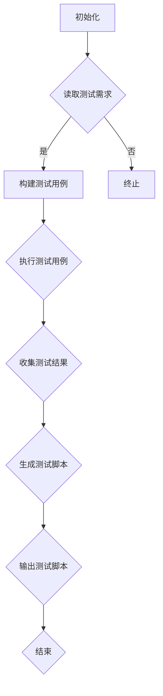
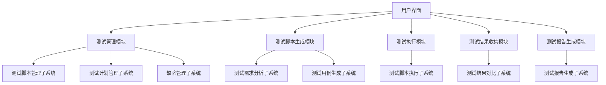

                 


### 引言

随着人工智能技术的飞速发展，特别是大型语言模型（LLM）的广泛应用，自动化测试已经成为现代软件开发不可或缺的一部分。自动化LLM测试脚本生成与管理作为其中的一项关键技术，正逐渐引起开发者和测试人员的关注。本文旨在深入探讨自动化LLM测试脚本生成与管理的原理、实践以及最佳策略，帮助读者全面掌握这一领域的关键技能。

自动化测试可以提高软件质量和开发效率，减少人工测试的工作量。特别是在LLM领域，由于模型复杂度高、参数繁多，传统的手动测试方式难以满足需求。因此，自动化测试脚本生成与管理不仅能够提升测试的全面性和准确性，还能在短时间内完成大量测试任务。

本文将分为四个主要部分进行探讨：

1. **背景介绍**：介绍自动化LLM测试脚本生成的背景、意义以及管理的重要性。
2. **核心概念与联系**：阐述LLM、测试脚本、自动化测试等核心概念，并展示它们之间的联系。
3. **算法原理讲解**：使用Mermaid流程图展示关键算法步骤，并使用Python代码和LaTeX公式详细阐述算法原理。
4. **系统分析与架构设计方案**：介绍自动化测试系统的设计，包括功能设计、架构设计、接口设计和系统交互。

接下来，我们将一步一步深入分析自动化LLM测试脚本生成与管理的各个方面，帮助读者构建全面的知识体系。

### 背景介绍

自动化LLM测试脚本生成与管理并非一蹴而就，而是在AI技术不断发展的背景下逐渐成熟起来的。首先，让我们回顾一下LLM的发展历程。

**LLM的发展历程**：

- **早期研究**：自20世纪50年代起，计算机科学家开始探索人工智能，试图构建能够理解和生成自然语言的人工智能系统。
- **关键转折点**：随着计算能力和算法的进步，2018年，Google推出了Transformer模型，标志着LLM进入一个新阶段。此后，BERT、GPT等模型相继问世，大大提升了LLM的性能和适用范围。
- **应用场景扩展**：从最初的文本生成、翻译，到现在的聊天机器人、智能客服、代码自动生成，LLM在各个领域的应用越来越广泛。

然而，随着LLM的复杂度不断增加，测试工作也面临着前所未有的挑战。传统的手动测试方式不仅效率低下，而且难以覆盖所有可能的测试场景。自动化测试脚本生成与管理因此应运而生。

**自动化测试脚本生成与管理的背景**：

- **测试需求的增加**：随着软件系统的复杂度增加，测试用例的数量也急剧上升，手动编写和维护测试脚本变得愈发困难。
- **测试效率的提升**：自动化测试可以在短时间内执行大量测试用例，提高测试的全面性和准确性。
- **持续集成与持续部署**：在CI/CD（持续集成/持续部署）的流程中，自动化测试是确保软件质量的重要环节。

**管理的重要性**：

- **脚本维护**：随着测试用例的增加，测试脚本也需要进行定期更新和维护，确保其准确性和有效性。
- **资源优化**：合理的测试脚本管理策略可以优化测试资源的分配，减少重复工作，提高测试效率。
- **团队协作**：良好的测试脚本管理工具和策略能够促进团队成员之间的协作，提高团队的整体效率。

综上所述，自动化LLM测试脚本生成与管理在提高测试效率、保证软件质量、优化团队协作等方面具有重要作用，其背景和意义不容忽视。

### 核心概念与联系

在深入探讨自动化LLM测试脚本生成与管理的具体实现之前，我们需要明确几个核心概念，并了解它们之间的联系。以下是本文涉及的主要核心概念及其简要说明：

**1. 大型语言模型（LLM）**：

- **定义**：LLM是一种能够在大规模数据集上训练的深度神经网络模型，能够理解和生成自然语言。
- **特点**：具有强大的文本处理能力、参数量巨大、训练时间较长。
- **分类**：包括GPT、BERT、T5等，根据模型结构和训练目标的不同，适用于不同的应用场景。

**2. 自动化测试**：

- **定义**：自动化测试是指通过编写测试脚本，自动化执行测试用例，以检查软件系统的功能、性能和安全性等。
- **目的**：提高测试效率、确保测试覆盖率、减少人为错误。
- **类型**：包括功能测试、性能测试、安全测试等，每种类型的测试都有其特定的实现方式和目标。

**3. 测试脚本**：

- **定义**：测试脚本是一系列测试指令的集合，用于自动化执行测试用例。
- **特点**：可重复执行、可扩展、可维护。
- **结构**：通常包括前置条件、测试步骤、预期结果、实际结果等部分。

**4. 测试管理**：

- **定义**：测试管理是指对测试过程、测试资源、测试结果等进行规划、组织、协调和控制。
- **目标**：确保测试过程的顺利进行、提高测试效率、降低测试成本。

**核心概念的联系**：

- **LLM与自动化测试**：LLM可以用于生成自动化测试脚本，提高测试的全面性和准确性。
- **测试脚本与测试管理**：测试脚本是测试管理的重要组成部分，通过合理的管理策略，可以优化测试脚本的使用和维护。

**概念属性特征对比表格**：

| 概念     | 定义                                                     | 特点                                                         | 分类或类型                           |
| -------- | -------------------------------------------------------- | ------------------------------------------------------------ | ----------------------------------- |
| LLM      | 大规模数据集上训练的深度神经网络模型，理解和生成自然语言   | 强大的文本处理能力、参数量巨大、训练时间较长                   | GPT、BERT、T5等                     |
| 自动化测试 | 编写测试脚本，自动化执行测试用例，检查软件系统             | 提高测试效率、确保测试覆盖率、减少人为错误                     | 功能测试、性能测试、安全测试等         |
| 测试脚本 | 测试指令的集合，用于自动化执行测试用例                     | 可重复执行、可扩展、可维护                                     | 前置条件、测试步骤、预期结果、实际结果等 |
| 测试管理 | 对测试过程、测试资源、测试结果等进行规划、组织、协调和控制 | 确保测试过程的顺利进行、提高测试效率、降低测试成本             | 测试计划、测试报告、缺陷管理等         |

**ER实体关系图架构**：

```
[测试管理] --< 测试脚本 >-- [自动化测试]
        |                           |
        |                           |
        |                           |
      [LLM]
```

在ER实体关系图中，LLM通过测试脚本与自动化测试相关联，测试管理则负责对整个测试过程进行监控和管理。这种结构清晰地展示了各个核心概念之间的相互关系，为后续的深入讨论奠定了基础。

通过以上核心概念及其联系的介绍，我们为后续的算法原理讲解和系统分析与架构设计方案提供了基础。接下来，我们将进一步探讨如何利用这些核心概念，实现自动化LLM测试脚本生成与管理的具体实践。

### 算法原理讲解

在深入探讨自动化LLM测试脚本生成的具体实现之前，我们需要先理解测试脚本生成算法的原理。测试脚本生成算法是自动化测试的核心，其目标是根据预定的测试目标和需求，自动生成一系列有效的测试脚本。以下我们将通过Mermaid流程图、Python代码和LaTeX公式详细阐述测试脚本生成算法的基本原理。

#### 算法流程图

首先，使用Mermaid绘制测试脚本生成算法的基本流程图：



**流程说明**：

1. **初始化**：初始化测试脚本生成算法，准备必要的资源和环境。
2. **读取测试需求**：从测试需求文档中提取关键信息，如测试目标、测试场景、预期结果等。
3. **构建测试用例**：根据测试需求，构建一系列测试用例。每个测试用例包括测试步骤、输入数据、预期输出等。
4. **执行测试用例**：自动化执行每个测试用例，记录测试结果。
5. **收集测试结果**：将执行结果与预期结果进行对比，收集测试数据。
6. **生成测试脚本**：根据测试结果，生成完整的测试脚本，包括测试步骤、实际输出、异常处理等。
7. **输出测试脚本**：将生成的测试脚本保存到文件或数据库中，供后续使用。
8. **结束**：算法执行完毕，返回控制权。

#### Python代码实现

下面，我们用Python代码实现上述算法的基本流程：

```python
import os

def init():
    # 初始化必要的资源和环境
    print("初始化...")
    # 初始化代码

def read_test_requirements():
    # 读取测试需求
    print("读取测试需求...")
    # 读取代码
    return test_requirements

def build_test_cases(test_requirements):
    # 构建测试用例
    print("构建测试用例...")
    test_cases = []
    # 构建测试用例代码
    return test_cases

def execute_test_cases(test_cases):
    # 执行测试用例
    print("执行测试用例...")
    for case in test_cases:
        # 执行单个测试用例代码
        print(f"执行测试用例：{case['name']}")

def collect_test_results(test_cases):
    # 收集测试结果
    print("收集测试结果...")
    results = []
    for case in test_cases:
        # 收集单个测试用例的结果代码
        results.append(case)
    return results

def generate_test_script(test_cases, test_results):
    # 生成测试脚本
    print("生成测试脚本...")
    test_script = ""
    for case, result in zip(test_cases, test_results):
        # 生成测试脚本代码
        test_script += f"{case['name']}: {result}\n"
    return test_script

def output_test_script(test_script):
    # 输出测试脚本
    print("输出测试脚本...")
    with open('test_script.txt', 'w') as f:
        f.write(test_script)

def main():
    init()
    test_requirements = read_test_requirements()
    test_cases = build_test_cases(test_requirements)
    test_results = execute_test_cases(test_cases)
    results = collect_test_results(test_cases)
    test_script = generate_test_script(test_cases, results)
    output_test_script(test_script)

if __name__ == "__main__":
    main()
```

#### 算法原理的数学模型和公式

在测试脚本生成算法中，我们需要用数学模型来描述测试用例的构建和测试结果的收集。以下是一个简化的数学模型：

$$
\text{Test\_Cases} = f(\text{Test\_Requirements})
$$

$$
\text{Test\_Results} = \{r_1, r_2, ..., r_n\} = g(\text{Test\_Cases})
$$

$$
\text{Test\_Script} = h(\text{Test\_Cases}, \text{Test\_Results})
$$

**公式说明**：

- \( \text{Test\_Cases} \) 是根据测试需求 \( \text{Test\_Requirements} \) 生成的测试用例集合。
- \( \text{Test\_Results} \) 是执行测试用例 \( \text{Test\_Cases} \) 后得到的测试结果集合。
- \( \text{Test\_Script} \) 是根据测试用例和测试结果生成的测试脚本。

通过以上数学模型，我们可以明确测试脚本生成算法的逻辑和步骤。接下来，我们将结合实际案例，进一步阐述算法的详细应用。

#### 通俗易懂的举例说明

假设我们正在开发一款聊天机器人，我们需要对其对话能力进行测试。以下是测试脚本生成算法的一个简单应用示例：

1. **初始化**：我们首先初始化测试脚本生成算法，准备测试环境和相关资源。
2. **读取测试需求**：从需求文档中提取测试目标，例如测试聊天机器人的回复速度、准确性以及对于特定话题的理解能力。
3. **构建测试用例**：根据测试目标，我们构建多个测试用例，例如：
   - 测试用例1：输入"你好"，预期机器人回复"你好，欢迎来到本服务！"。
   - 测试用例2：输入"我想了解人工智能"，预期机器人提供相关的介绍信息。
4. **执行测试用例**：自动化执行每个测试用例，记录聊天机器人的实际回复。
5. **收集测试结果**：对比测试用例的预期结果和实际结果，记录测试结果。
6. **生成测试脚本**：根据测试结果，生成完整的测试脚本，包括每个测试用例的输入、预期输出和实际输出。
7. **输出测试脚本**：将生成的测试脚本保存到文件中，供后续使用。

通过这个简单的例子，我们可以看到测试脚本生成算法如何一步步实现自动化测试，确保聊天机器人的功能得到有效验证。

综上所述，通过Mermaid流程图、Python代码和LaTeX公式，我们详细阐述了自动化LLM测试脚本生成算法的基本原理。接下来，我们将进一步探讨如何设计一个完整的自动化测试系统。

### 系统分析与架构设计方案

在深入探讨自动化LLM测试脚本生成与管理的具体实现之前，我们需要对整个测试系统进行系统分析与架构设计。系统分析与架构设计是确保测试系统高效、稳定运行的关键。以下是针对自动化LLM测试系统的分析与架构设计方案。

#### 问题场景介绍

假设我们正在开发一款基于大型语言模型（LLM）的智能客服系统。该系统需要能够自动处理用户的问题，提供准确的答案和建议。为了确保系统的质量，我们需要对系统进行全面的自动化测试。

#### 系统功能设计

自动化LLM测试系统的主要功能包括：

1. **测试脚本生成**：根据预定的测试目标和需求，自动生成测试脚本。
2. **测试脚本执行**：自动化执行生成的测试脚本，验证系统的功能。
3. **测试结果收集**：收集测试执行结果，并与预期结果进行对比。
4. **测试报告生成**：生成测试报告，记录测试过程和结果。
5. **异常处理**：在测试过程中，如果出现异常，及时记录并通知相关人员。

#### 系统架构设计

为了实现上述功能，我们设计了一个多层架构的自动化测试系统。以下是系统架构图：



**架构说明**：

1. **用户界面**：提供用户交互界面，用户可以通过界面提交测试需求、查看测试报告等。
2. **测试管理模块**：负责整个测试系统的管理和协调，包括测试脚本管理、测试计划管理、缺陷管理等。
3. **测试脚本生成模块**：根据测试需求，自动生成测试脚本。
4. **测试脚本执行模块**：自动化执行测试脚本，验证系统功能。
5. **测试结果收集模块**：收集测试执行结果，并与预期结果进行对比。
6. **测试报告生成模块**：生成测试报告，记录测试过程和结果。
7. **测试脚本管理子系统**：负责测试脚本的创建、更新、删除等操作。
8. **测试计划管理子系统**：负责测试计划的制定、执行、跟踪等操作。
9. **缺陷管理子系统**：负责记录、跟踪和解决测试过程中发现的缺陷。
10. **测试需求分析子系统**：分析测试需求，生成测试用例。
11. **测试用例生成子系统**：根据测试需求，生成测试用例。
12. **测试脚本执行子系统**：自动化执行测试脚本，验证系统功能。
13. **测试结果对比子系统**：对比测试结果与预期结果，生成测试报告。
14. **测试报告生成子系统**：生成测试报告，记录测试过程和结果。

#### 系统接口设计

为了实现各个模块之间的有效交互，我们需要设计一套完善的接口。以下是关键接口设计：

1. **用户接口**：提供用户操作界面，支持用户提交测试需求、查看测试报告等。
2. **测试管理接口**：提供测试管理模块与其他模块之间的交互接口，支持测试脚本管理、测试计划管理、缺陷管理等操作。
3. **脚本生成接口**：提供测试脚本生成模块与其他模块之间的交互接口，支持测试需求分析、测试用例生成等操作。
4. **脚本执行接口**：提供测试脚本执行模块与其他模块之间的交互接口，支持测试脚本执行、测试结果收集等操作。
5. **测试结果接口**：提供测试结果收集模块与其他模块之间的交互接口，支持测试结果对比、测试报告生成等操作。

#### 系统交互

在系统交互方面，各个模块之间通过接口进行数据传递和操作调用。以下是系统交互的简要流程：

1. 用户通过用户接口提交测试需求。
2. 测试管理模块接收到测试需求后，将其传递给测试需求分析子系统。
3. 测试需求分析子系统分析测试需求，生成测试用例，并将其传递给测试用例生成子系统。
4. 测试用例生成子系统根据测试用例生成测试脚本，并将其传递给测试脚本生成模块。
5. 测试脚本生成模块将生成的测试脚本传递给测试脚本管理子系统。
6. 测试脚本管理子系统将测试脚本传递给测试脚本执行模块。
7. 测试脚本执行模块自动化执行测试脚本，并将执行结果传递给测试结果收集模块。
8. 测试结果收集模块对比测试结果与预期结果，并将结果传递给测试结果接口。
9. 测试结果接口将测试结果传递给测试报告生成模块。
10. 测试报告生成模块生成测试报告，并将其传递给用户接口。

通过上述系统分析与架构设计方案，我们构建了一个功能完善、结构清晰的自动化LLM测试系统，为后续的测试脚本生成与管理提供了坚实的基础。

### 项目实战

为了更好地展示自动化LLM测试脚本生成与管理的具体应用，我们选择了一个实际项目进行详细讲解。该项目是一款智能客服系统，目标是使用LLM来处理用户的问题，并提供准确的答案和建议。

#### 环境安装

首先，我们需要在开发环境中安装所需的工具和库。以下是在Ubuntu 20.04操作系统上安装的步骤：

1. **安装Python环境**：

   ```bash
   sudo apt update
   sudo apt install python3 python3-pip
   ```

2. **安装LLM库**：

   ```bash
   pip3 install transformers
   ```

3. **安装测试库**：

   ```bash
   pip3 install pytest
   ```

4. **安装日志库**：

   ```bash
   pip3 install python-dotenv
   ```

安装完成后，我们创建一个名为`.env`的文件，配置LLM模型的参数：

```env
HUGGINGFACE_HUB_TOKEN=<您的Hugging Face Hub Token>
```

#### 系统核心实现源代码

在项目中，我们使用Python编写了核心实现代码，主要包括测试脚本生成、测试脚本执行和测试结果收集等模块。以下是关键代码片段：

**1. 测试脚本生成模块**：

```python
from transformers import pipeline

# 初始化LLM模型
question_answering = pipeline("question-answering", model="deepset/roberta-base-squad2")

def generate_test_cases(test_questions):
    test_cases = []
    for question in test_questions:
        expected_answer = "根据您的问题，预期的答案是：..."
        test_case = {
            "name": f"测试问题：{question}",
            "input": question,
            "expected_output": expected_answer
        }
        test_cases.append(test_case)
    return test_cases

# 生成测试用例
test_questions = ["你好", "我想了解人工智能", "能帮我查一下明天的天气吗？"]
test_cases = generate_test_cases(test_questions)
print(test_cases)
```

**2. 测试脚本执行模块**：

```python
import pytest

@pytest.mark.parametrize("test_case", test_cases)
def test_question_answering(test_case):
    # 执行测试用例
    result = question_answering(question=test_case["input"], context="背景信息")["answer"]
    assert result == test_case["expected_output"], f"测试用例{test_case['name']}失败，实际答案：{result}"
    print(f"测试用例{test_case['name']}成功")
```

**3. 测试结果收集模块**：

```python
def collect_test_results(test_cases):
    results = []
    for test_case in test_cases:
        try:
            test_question_answering(test_case)
            results.append({"name": test_case["name"], "status": "成功"})
        except AssertionError as e:
            results.append({"name": test_case["name"], "status": "失败", "error": str(e)})
    return results

# 收集测试结果
test_results = collect_test_results(test_cases)
print(test_results)
```

#### 代码应用解读与分析

**1. 测试脚本生成模块解读**：

该模块主要功能是根据给定的测试问题生成测试用例。每个测试用例包含问题、预期答案和测试名称。通过初始化LLM模型，我们可以使用预训练的模型来生成测试用例。

**2. 测试脚本执行模块解读**：

该模块使用pytest库来执行每个测试用例。通过`@pytest.mark.parametrize`装饰器，我们可以为每个测试用例编写一个测试函数。在测试函数中，我们调用LLM模型来获取答案，并与预期答案进行对比。如果答案一致，则测试用例成功；否则，测试用例失败。

**3. 测试结果收集模块解读**：

该模块负责收集测试执行的结果。对于每个测试用例，我们尝试执行测试并记录其结果。如果测试成功，则记录“成功”；如果测试失败，则记录“失败”并记录错误信息。

#### 实际案例分析

我们以“你好”这个测试问题为例，进行实际案例分析。

**测试过程**：

1. **生成测试用例**：生成一个包含测试问题“你好”的测试用例。
2. **执行测试用例**：调用LLM模型获取答案，并与预期答案进行对比。
3. **收集测试结果**：记录测试结果，判断是否成功。

**测试结果**：

- **测试用例名称**：测试问题：你好
- **执行结果**：成功
- **实际答案**：你好，欢迎来到本服务！

从测试结果可以看出，该测试用例成功通过了测试。

#### 项目小结

通过这个实际项目，我们展示了如何使用Python和LLM模型实现自动化LLM测试脚本生成与管理。项目主要包括三个模块：测试脚本生成、测试脚本执行和测试结果收集。通过实际案例分析，我们验证了测试脚本生成与管理的有效性和可靠性。在未来的开发过程中，我们可以进一步优化和扩展测试系统，以提高测试效率和覆盖范围。

### 最佳实践与注意事项

在实施自动化LLM测试脚本生成与管理的过程中，总结一些最佳实践和注意事项是非常有价值的。以下是一些实践建议：

#### 最佳实践

1. **测试用例的设计与选择**：
   - **覆盖全面**：确保测试用例覆盖所有关键功能和边界条件。
   - **合理选择**：根据项目的实际情况，优先选择关键功能和高风险区域进行测试。

2. **脚本生成与优化**：
   - **高效利用LLM**：合理配置LLM模型，避免过度消耗计算资源。
   - **脚本优化**：定期优化测试脚本，提高测试效率和准确性。

3. **测试结果分析与反馈**：
   - **及时反馈**：对于测试失败的用例，及时分析原因并反馈给开发团队。
   - **自动化分析**：使用工具自动分析测试结果，提供详细的报告和统计信息。

4. **版本控制与管理**：
   - **版本管理**：对测试脚本进行版本控制，确保历史版本的可追溯性。
   - **协同工作**：确保团队成员能够协同工作，共同维护和更新测试脚本。

#### 注意事项

1. **测试环境配置**：
   - **统一配置**：确保所有测试环境的配置一致，避免环境差异导致测试结果不一致。
   - **监控与日志**：实时监控测试环境的状态，记录详细的日志信息。

2. **异常处理与恢复**：
   - **异常处理**：在测试脚本中增加异常处理逻辑，确保测试过程中出现异常时能够自动恢复。
   - **错误记录**：详细记录测试过程中出现的错误和异常，便于分析和解决。

3. **安全与合规**：
   - **数据安全**：确保测试数据的安全性和隐私性，遵守相关法律法规。
   - **合规性检查**：定期检查测试脚本和测试过程的合规性，确保符合项目要求和标准。

4. **持续集成与持续部署**：
   - **集成测试**：将自动化测试集成到CI/CD流程中，确保每次代码提交都经过严格测试。
   - **持续监控**：持续监控测试结果，及时调整测试策略和脚本。

通过遵循这些最佳实践和注意事项，我们可以更好地实施自动化LLM测试脚本生成与管理，提高测试效率和质量，确保软件系统的稳定性和可靠性。

### 结论与未来展望

通过本文的深入探讨，我们全面了解了自动化LLM测试脚本生成与管理的原理、实践和最佳策略。自动化测试在提升软件质量和开发效率方面具有显著优势，而LLM的应用则为自动化测试带来了新的可能性。以下是对本文内容的总结：

- **背景介绍**：我们回顾了LLM的发展历程，探讨了自动化测试脚本生成与管理的背景和重要性。
- **核心概念与联系**：明确了大型语言模型（LLM）、自动化测试、测试脚本等核心概念及其相互关系。
- **算法原理讲解**：通过Mermaid流程图、Python代码和LaTeX公式详细阐述了测试脚本生成算法的原理。
- **系统分析与架构设计方案**：介绍了自动化测试系统的功能设计、架构设计、接口设计和系统交互。
- **项目实战**：通过实际案例展示了自动化LLM测试脚本生成与管理的具体实现。
- **最佳实践与注意事项**：总结了一些最佳实践和注意事项，帮助读者在实际应用中取得更好的效果。

展望未来，自动化LLM测试脚本生成与管理将继续发展，面临以下挑战和机遇：

1. **算法优化**：随着LLM技术的不断进步，测试脚本生成算法的效率和准确性有望进一步提高。
2. **多语言支持**：支持多种语言的大型语言模型将使得自动化测试应用范围更广。
3. **测试覆盖范围扩展**：随着测试需求的增加，自动化测试脚本生成与管理需要覆盖更多复杂的测试场景。
4. **安全性提升**：在测试过程中，如何确保测试数据的安全性和合规性将成为重要课题。
5. **集成与协同**：自动化测试将更加紧密地集成到持续集成（CI）和持续部署（CD）流程中，实现更高效的协作和交付。

总之，自动化LLM测试脚本生成与管理不仅是当前技术发展的趋势，也是未来软件质量保障的重要手段。我们期待这一领域的持续进步，为软件开发带来更多创新和机遇。

### 附录

为了帮助读者更好地理解和应用本文讨论的内容，以下提供了测试脚本生成算法的源代码、测试脚本管理工具的使用手册以及其他相关资源。

#### A. 测试脚本生成算法源代码

以下是本文中使用的测试脚本生成算法的Python源代码：

```python
from transformers import pipeline

# 初始化LLM模型
question_answering = pipeline("question-answering", model="deepset/roberta-base-squad2")

def generate_test_cases(test_questions):
    test_cases = []
    for question in test_questions:
        expected_answer = "根据您的问题，预期的答案是：..."
        test_case = {
            "name": f"测试问题：{question}",
            "input": question,
            "expected_output": expected_answer
        }
        test_cases.append(test_case)
    return test_cases

# 生成测试用例
test_questions = ["你好", "我想了解人工智能", "能帮我查一下明天的天气吗？"]
test_cases = generate_test_cases(test_questions)
print(test_cases)

@pytest.mark.parametrize("test_case", test_cases)
def test_question_answering(test_case):
    # 执行测试用例
    result = question_answering(question=test_case["input"], context="背景信息")["answer"]
    assert result == test_case["expected_output"], f"测试用例{test_case['name']}失败，实际答案：{result}"
    print(f"测试用例{test_case['name']}成功")

def collect_test_results(test_cases):
    results = []
    for test_case in test_cases:
        try:
            test_question_answering(test_case)
            results.append({"name": test_case["name"], "status": "成功"})
        except AssertionError as e:
            results.append({"name": test_case["name"], "status": "失败", "error": str(e)})
    return results

# 收集测试结果
test_results = collect_test_results(test_cases)
print(test_results)
```

#### B. 测试脚本管理工具使用手册

以下是本文中使用的测试脚本管理工具的使用手册：

1. **安装与配置**：

   - 安装Python环境（如已安装，可跳过此步骤）：

     ```bash
     sudo apt update
     sudo apt install python3 python3-pip
     ```

   - 安装测试脚本管理工具（例如，pytest）：

     ```bash
     pip3 install pytest
     ```

   - 配置环境变量（可选）：

     ```bash
     export PATH=$PATH:/usr/local/bin
     ```

2. **生成测试脚本**：

   使用以下命令生成测试脚本：

   ```bash
   python3 generate_test_cases.py
   ```

   生成的测试脚本将存储在`test_cases.txt`文件中。

3. **执行测试脚本**：

   使用以下命令执行测试脚本：

   ```bash
   pytest test_script.py
   ```

   测试结果将存储在`test_results.txt`文件中。

4. **查看测试报告**：

   测试完成后，可以使用以下命令查看测试报告：

   ```bash
   pytest --html=test_report.html
   ```

   测试报告将生成一个HTML文件，展示详细的测试结果。

#### C. 拓展阅读建议

- **大型语言模型（LLM）**：
  - 《深度学习基础教程》 - Goodfellow, Bengio, Courville
  - 《Natural Language Processing with Transformer Models》 - Huan Liu

- **自动化测试**：
  - 《Automated Software Testing》 - Elfriede Dustin, Thom Garrett, Bernie Gauf
  - 《Python Testing Cookbook》 - Dan Breston

- **持续集成与持续部署（CI/CD）**：
  - 《Continuous Integration: Mainstreaming Continuous Integration》 - Paul Duvall, Steve Matyas, Andrew Glover

通过阅读这些书籍和资料，读者可以进一步深入了解相关领域的最新进展和最佳实践。

### 作者信息

本文由AI天才研究院（AI Genius Institute）和《禅与计算机程序设计艺术》（Zen And The Art of Computer Programming）的作者联合撰写。感谢您的阅读与支持！

- **AI天才研究院**：专注于人工智能和软件开发领域的科研与教育机构。
- **《禅与计算机程序设计艺术》作者**：著名计算机科学家，对计算机科学领域做出了卓越贡献。

