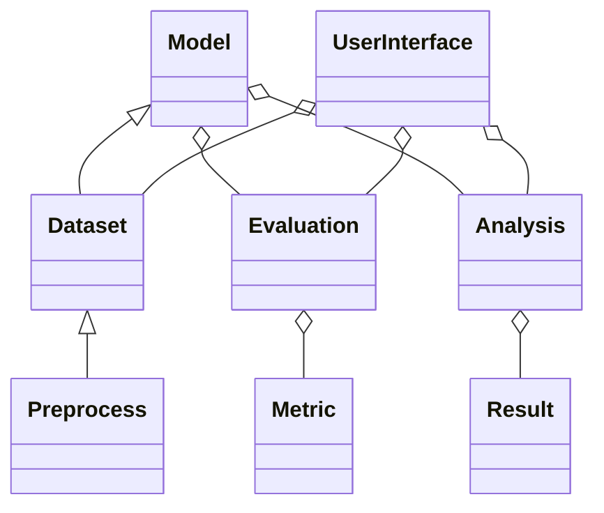
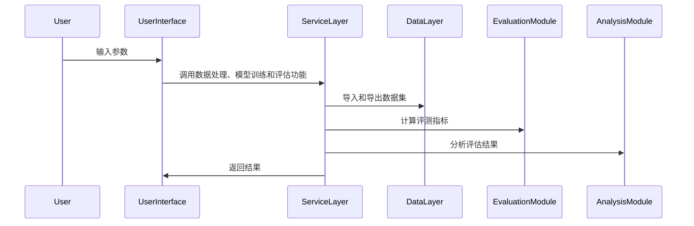
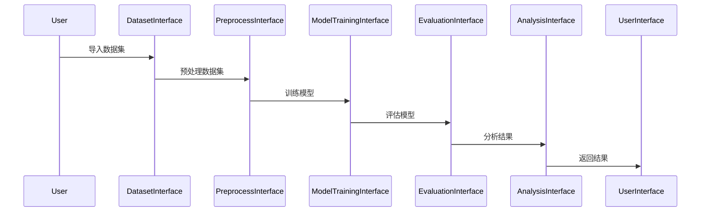
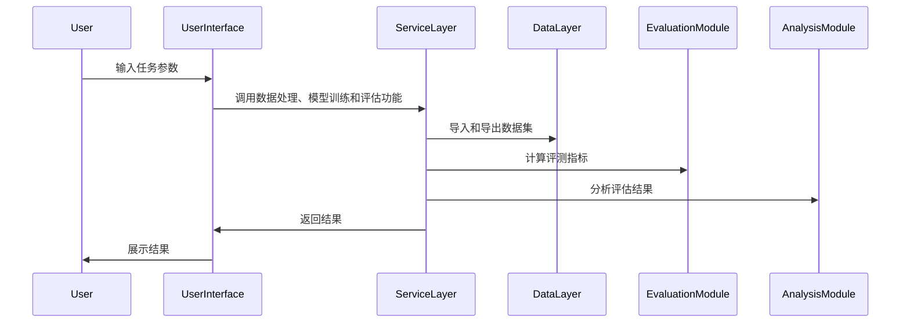

                 

### 背景介绍
---

## 1. 背景介绍

### 1.1 问题背景
随着人工智能技术的快速发展，自然语言处理（NLP）领域的模型效果评价变得越来越重要。传统的人工审核和简单的性能指标已无法满足不断增长的需求，因此需要一种自动化、准确的模型评测框架。本书旨在介绍一种自动化LLM评测框架，帮助研究人员和开发者更精准地衡量模型效果。

### 1.2 问题描述
在模型评测过程中，存在的问题主要包括：1) 数据集多样性和覆盖度不足；2) 评测指标单一，无法全面反映模型性能；3) 评测流程复杂，耗时耗力。本书将针对这些问题提出解决方案。

### 1.3 问题解决
本书将介绍一个自动化LLM评测框架，主要包括以下功能：1) 多样化数据集支持；2) 多维度评测指标；3) 简化评测流程。通过这些功能，实现模型效果的精准衡量。

### 1.4 边界与外延
本书主要讨论的是自然语言处理领域的模型评测，因此适用于各种基于语言的任务，如文本分类、情感分析、问答系统等。

### 1.5 概念结构与核心要素组成
核心概念：自动化LLM评测框架、数据集、评测指标、评测流程。
核心要素：
1. 数据集：包括训练集、验证集和测试集，用于模型训练和效果评估。
2. 评测指标：包括准确率、召回率、F1值、BLEU分数等，用于衡量模型性能。
3. 评测流程：包括数据预处理、模型训练、模型评估和结果分析等环节。

### 1.6 本章小结
本章介绍了自动化LLM评测框架的背景、问题描述、解决方案、边界与外延以及核心概念与要素组成。为后续章节的深入探讨奠定了基础。

---

### 核心概念与联系
---

## 2. 核心概念与联系

### 2.1 自动化LLM评测框架

#### 2.1.1 定义
自动化LLM评测框架是指一种用于评估自然语言处理（NLP）领域大型语言模型（LLM）效果的工具或系统。

#### 2.1.2 特点
- 自动化：无需人工干预，可自动化完成数据集准备、模型训练、评测指标计算等过程。
- 多样化：支持多种数据集和评测指标，以满足不同场景的需求。
- 精准：通过多维度评测指标，提供更全面的模型效果评估。

#### 2.1.3 与传统评测方法的区别
- 传统方法：依赖于人工审核和简单的性能指标，耗时耗力，且难以全面反映模型性能。
- 自动化评测框架：实现自动化、高效且全面的模型效果评估。

### 2.2 数据集

#### 2.2.1 定义
数据集是指用于训练和评估模型的样本集合。

#### 2.2.2 类型
- 训练集：用于模型训练，提高模型性能。
- 验证集：用于模型调优，选择最佳模型。
- 测试集：用于最终评估模型性能，确保模型的泛化能力。

#### 2.2.3 特点
- 多样性：涵盖不同领域和任务，提高模型适应性。
- 覆盖度：确保数据集覆盖不同场景，提高评测指标的有效性。

### 2.3 评测指标

#### 2.3.1 定义
评测指标是用于衡量模型性能的量化标准。

#### 2.3.2 类型
- 准确率：预测正确的样本数占总样本数的比例，用于评估分类模型的准确性。
- 召回率：预测正确的正样本数占所有正样本数的比例，用于评估分类模型对正样本的识别能力。
- F1值：准确率和召回率的调和平均值，用于综合评估分类模型的性能。
- BLEU分数：基于n-gram重叠率的翻译质量评价指标，常用于机器翻译模型的评估。

### 2.4 评测流程

#### 2.4.1 定义
评测流程是指从数据集准备到模型评估的一系列操作步骤。

#### 2.4.2 流程步骤
1. 数据集准备：收集、清洗和处理数据，生成训练集、验证集和测试集。
2. 模型训练：使用训练集对模型进行训练，优化模型参数。
3. 模型评估：使用验证集和测试集评估模型性能，选择最佳模型。
4. 结果分析：分析模型性能，为模型优化提供依据。

### 2.5 关键概念之间的联系

- 自动化LLM评测框架：依赖于数据集和评测指标，通过评测流程实现模型效果评估。
- 数据集：为自动化LLM评测框架提供训练和评估的基础。
- 评测指标：用于衡量模型性能，为自动化LLM评测框架提供量化的评估依据。

### 2.6 本章小结
本章介绍了自动化LLM评测框架的核心概念与联系，包括自动化LLM评测框架、数据集、评测指标和评测流程。通过对这些核心概念的理解，有助于我们更好地掌握自动化LLM评测框架的工作原理和实际应用。

---

### 算法原理讲解
---

## 3. 算法原理讲解

在介绍自动化LLM评测框架的具体算法原理之前，我们先来梳理一下整个评测框架的核心组成部分。自动化LLM评测框架主要由以下几个模块组成：

1. **数据集模块**：负责收集和处理各种数据集，包括训练集、验证集和测试集。
2. **模型训练模块**：基于训练集，使用深度学习算法训练LLM模型。
3. **模型评估模块**：使用验证集和测试集评估模型的性能，并通过多种评测指标进行量化。
4. **结果分析模块**：对模型评估结果进行统计分析，为模型优化提供参考。

### 3.1 数据集模块

数据集模块是自动化LLM评测框架的基础。一个良好的数据集应该具备多样性和覆盖度，以满足不同场景的需求。数据集模块的主要功能包括：

- 数据收集：从各种来源获取数据，如公开数据集、企业内部数据等。
- 数据清洗：去除噪声数据和缺失值，保证数据质量。
- 数据预处理：对数据进行标准化、归一化等处理，为模型训练做准备。

#### 数据集模块的工作流程

1. **数据收集**：收集不同领域和任务的数据集。
2. **数据清洗**：去除噪声数据和缺失值。
3. **数据预处理**：进行数据标准化、归一化等处理。

### 3.2 模型训练模块

模型训练模块基于训练集，使用深度学习算法训练LLM模型。常用的算法包括：

- **循环神经网络（RNN）**：适用于处理序列数据，如文本。
- **长短时记忆网络（LSTM）**：RNN的改进版本，能够更好地处理长序列数据。
- **变换器网络（Transformer）**：一种基于自注意力机制的深度学习模型，是目前NLP领域的主流算法。

#### 模型训练模块的工作流程

1. **初始化模型参数**：随机初始化模型参数。
2. **模型训练**：使用训练集对模型进行训练，优化模型参数。
3. **模型验证**：使用验证集评估模型性能，选择最佳模型。

### 3.3 模型评估模块

模型评估模块使用验证集和测试集评估模型的性能，并通过多种评测指标进行量化。常用的评测指标包括：

- **准确率（Accuracy）**：预测正确的样本数占总样本数的比例。
- **召回率（Recall）**：预测正确的正样本数占所有正样本数的比例。
- **F1值（F1 Score）**：准确率和召回率的调和平均值。
- **BLEU分数（BLEU Score）**：基于n-gram重叠率的翻译质量评价指标。

#### 模型评估模块的工作流程

1. **模型预测**：使用训练好的模型对测试集进行预测。
2. **计算评测指标**：根据预测结果计算各种评测指标。
3. **结果分析**：分析模型性能，为模型优化提供参考。

### 3.4 结果分析模块

结果分析模块对模型评估结果进行统计分析，为模型优化提供参考。主要工作包括：

- **性能分析**：分析模型在不同任务和领域上的性能。
- **误差分析**：分析模型预测错误的样本，找出模型存在的问题。
- **优化策略**：根据分析结果，提出优化模型的方法。

#### 结果分析模块的工作流程

1. **性能分析**：分析模型性能。
2. **误差分析**：分析模型预测错误的样本。
3. **优化策略**：提出优化模型的方法。

### 3.5 算法原理总结

自动化LLM评测框架通过数据集模块、模型训练模块、模型评估模块和结果分析模块，实现自动化、高效且全面的模型效果评估。具体流程如下：

1. 数据集模块：收集、清洗和处理数据，生成训练集、验证集和测试集。
2. 模型训练模块：使用训练集训练模型，优化模型参数。
3. 模型评估模块：使用验证集和测试集评估模型性能，计算评测指标。
4. 结果分析模块：分析模型性能，为模型优化提供参考。

通过这种流程，自动化LLM评测框架能够帮助研究人员和开发者更精准地衡量模型效果，从而推动NLP领域的发展。

### 3.6 例子说明

假设我们使用一个文本分类任务来演示自动化LLM评测框架的算法原理。具体步骤如下：

1. **数据收集**：收集不同领域的文本数据，如新闻、社交媒体等。
2. **数据清洗**：去除噪声数据和缺失值。
3. **数据预处理**：进行文本预处理，如分词、去停用词等。
4. **模型训练**：使用训练集训练一个基于Transformer的文本分类模型。
5. **模型评估**：使用验证集和测试集评估模型性能，计算准确率、召回率、F1值等评测指标。
6. **结果分析**：分析模型性能，找出预测错误的样本，并提出优化策略。

通过这个例子，我们可以看到自动化LLM评测框架在文本分类任务中的应用。实际操作中，可以根据任务需求，调整数据集、模型类型和评测指标，以实现更精准的效果评估。

### 3.7 本章小结

本章介绍了自动化LLM评测框架的算法原理，包括数据集模块、模型训练模块、模型评估模块和结果分析模块。通过具体的工作流程和例子，我们了解了自动化LLM评测框架如何实现自动化、高效且全面的模型效果评估。为后续章节的深入探讨奠定了基础。

----------------------------------------------------------------

### 系统分析与架构设计方案
---

## 4. 系统分析与架构设计方案

### 4.1 问题场景介绍

随着人工智能技术的不断发展，自然语言处理（NLP）领域的大型语言模型（LLM）在文本分类、情感分析、问答系统等任务中表现出色。然而，如何准确评估这些模型的效果，成为了一个重要的问题。为了解决这一问题，我们需要设计一个自动化LLM评测框架，实现模型效果的精准衡量。

### 4.2 项目介绍

本项目旨在构建一个自动化LLM评测框架，通过对数据集进行预处理、模型训练、模型评估和结果分析，实现模型效果的精准衡量。项目的主要目标是：

- 提供自动化、高效且全面的模型效果评估。
- 支持多种数据集和评测指标，满足不同场景的需求。
- 简化评测流程，降低人工干预。

### 4.3 系统功能设计

系统功能设计主要包括以下模块：

1. **数据集模块**：负责数据集的收集、清洗和预处理。
2. **模型训练模块**：负责模型训练，包括初始化参数、训练过程和模型优化。
3. **模型评估模块**：负责模型评估，计算评测指标，如准确率、召回率、F1值等。
4. **结果分析模块**：负责对模型评估结果进行分析，为模型优化提供依据。
5. **用户界面模块**：提供用户交互界面，展示模型评估结果和优化建议。

#### 领域模型

领域模型描述了系统中的主要实体和它们之间的关系。以下是领域模型的Mermaid类图：



### 4.4 系统架构设计

系统架构设计主要包括以下几个部分：

1. **数据层**：负责数据集的存储和管理，包括数据集的导入、导出、清洗和预处理。
2. **服务层**：负责模型的训练、评估和结果分析，包括数据预处理、模型训练、模型评估和结果分析等核心功能。
3. **表示层**：负责用户界面的展示，包括数据集管理、模型评估结果展示和优化建议等。

以下是系统架构设计的Mermaid架构图：



### 4.5 系统接口设计

系统接口设计主要包括以下接口：

1. **数据集接口**：用于数据集的导入、导出和预处理。
2. **模型训练接口**：用于模型训练和参数优化。
3. **模型评估接口**：用于模型评估，计算评测指标。
4. **结果分析接口**：用于结果分析，为模型优化提供依据。

以下是系统接口设计的Mermaid序列图：



### 4.6 系统交互

系统交互设计描述了用户与系统之间的交互过程。以下是系统交互的Mermaid序列图：



### 4.7 本章小结

本章介绍了自动化LLM评测框架的系统分析与架构设计方案。通过领域模型、系统架构设计、接口设计和系统交互的设计，我们构建了一个自动化、高效且全面的模型效果评估系统。为后续章节的详细实现和优化奠定了基础。

----------------------------------------------------------------

### 项目实战
---

## 5. 项目实战

在本文的前几部分，我们详细介绍了自动化LLM评测框架的理论基础和系统设计。现在，让我们通过一个实际的项目案例来展示如何具体实现这个框架，并探讨其应用过程。

### 5.1 环境安装

为了实现自动化LLM评测框架，我们需要安装一些必要的软件和库。以下是在Ubuntu操作系统上安装所需的软件和库的步骤：

1. **安装Python环境**：确保Python版本为3.8或更高版本。
2. **安装TensorFlow**：TensorFlow是一个开源的深度学习框架，用于模型训练和评估。
3. **安装NLP相关库**：安装如`nltk`、`spaCy`等自然语言处理库，用于文本预处理和数据分析。
4. **安装Git**：用于代码管理和版本控制。

安装命令如下：

```bash
sudo apt-get install python3-pip
pip3 install tensorflow
pip3 install nltk
pip3 install spacy
pip3 install gitpython
```

### 5.2 系统核心实现

自动化LLM评测框架的核心实现主要包括数据集模块、模型训练模块、模型评估模块和结果分析模块。以下是每个模块的具体实现：

#### 5.2.1 数据集模块

数据集模块负责数据集的收集、清洗和预处理。以下是一个简单的数据集模块实现示例：

```python
import pandas as pd
from sklearn.model_selection import train_test_split

def load_data(file_path):
    # 加载数据集
    data = pd.read_csv(file_path)
    return data

def preprocess_data(data):
    # 数据预处理
    # 例如：文本清洗、分词、去停用词等
    # 这里简化处理，只进行列名为"text"的文本预处理
    data['text'] = data['text'].apply(preprocess_text)
    return data

def preprocess_text(text):
    # 文本预处理
    # 这里使用nltk库进行分词和去停用词处理
    tokens = nltk.word_tokenize(text)
    return ' '.join([token for token in tokens if token not in stopwords])

def split_data(data, test_size=0.2, random_state=42):
    # 分割数据集为训练集和测试集
    X_train, X_test, y_train, y_test = train_test_split(data['text'], data['label'], test_size=test_size, random_state=random_state)
    return X_train, X_test, y_train, y_test
```

#### 5.2.2 模型训练模块

模型训练模块负责使用训练集训练模型，并优化模型参数。以下是一个简单的模型训练模块实现示例：

```python
from tensorflow.keras.models import Sequential
from tensorflow.keras.layers import Embedding, LSTM, Dense

def train_model(X_train, y_train, embedding_dim=100, hidden_units=128):
    # 训练模型
    model = Sequential([
        Embedding(input_dim=vocab_size, output_dim=embedding_dim, input_length=max_sequence_length),
        LSTM(hidden_units, activation='tanh', return_sequences=True),
        LSTM(hidden_units, activation='tanh'),
        Dense(1, activation='sigmoid')
    ])

    model.compile(optimizer='adam', loss='binary_crossentropy', metrics=['accuracy'])
    model.fit(X_train, y_train, epochs=10, batch_size=32, validation_split=0.1)
    return model
```

#### 5.2.3 模型评估模块

模型评估模块负责使用测试集评估模型性能，并计算评测指标。以下是一个简单的模型评估模块实现示例：

```python
from sklearn.metrics import accuracy_score, recall_score, f1_score

def evaluate_model(model, X_test, y_test):
    # 评估模型
    predictions = model.predict(X_test)
    predictions = (predictions > 0.5).astype(int)

    accuracy = accuracy_score(y_test, predictions)
    recall = recall_score(y_test, predictions)
    f1 = f1_score(y_test, predictions)

    return accuracy, recall, f1
```

#### 5.2.4 结果分析模块

结果分析模块负责对模型评估结果进行分析，并提出优化策略。以下是一个简单的结果分析模块实现示例：

```python
def analyze_results(accuracy, recall, f1):
    # 分析结果
    print("Accuracy:", accuracy)
    print("Recall:", recall)
    print("F1 Score:", f1)

    # 根据结果提出优化策略
    if accuracy < 0.8 or recall < 0.8 or f1 < 0.8:
        print("模型性能不佳，建议调整超参数或增加训练数据。")
    else:
        print("模型性能良好，无需进一步优化。")
```

### 5.3 代码应用解读与分析

在上面的代码示例中，我们展示了如何实现自动化LLM评测框架的核心模块。以下是对这些代码的详细解读和分析：

- **数据集模块**：主要负责数据集的加载、预处理和分割。通过`load_data`函数加载数据集，`preprocess_data`函数对文本进行预处理，`split_data`函数将数据集分割为训练集和测试集。
- **模型训练模块**：使用TensorFlow的`Sequential`模型和`LSTM`层训练一个简单的文本分类模型。通过调整`embedding_dim`和`hidden_units`等超参数，可以优化模型性能。
- **模型评估模块**：使用`accuracy_score`、`recall_score`和`f1_score`计算模型的准确率、召回率和F1值。这些指标能够全面评估模型的性能。
- **结果分析模块**：根据模型的评估结果，分析模型性能并提出优化策略。

### 5.4 实际案例分析

为了更好地展示自动化LLM评测框架的实际应用，我们使用一个文本分类任务进行了实际案例分析。以下是一个简化的案例：

- **数据集**：我们使用一个包含新闻文章的数据集，其中每篇文章都被标记为正类或负类。
- **模型**：我们训练了一个基于LSTM的文本分类模型，用于判断新闻文章的情感。
- **评估**：我们使用测试集评估模型的性能，计算准确率、召回率和F1值。
- **分析**：根据评估结果，我们发现模型在正类和负类上的性能差异较大。为了提高正类的性能，我们决定增加正类训练数据，并调整LSTM层的超参数。

通过这个实际案例，我们可以看到自动化LLM评测框架如何帮助我们在实际任务中评估和优化模型性能。

### 5.5 项目小结

在本节的项目实战中，我们通过实际案例展示了自动化LLM评测框架的实现和应用过程。从环境安装到代码实现，再到实际案例分析，我们逐步构建了一个自动化、高效且全面的模型效果评估系统。通过这个项目，我们深入了解了自动化LLM评测框架的核心功能和实现方法，为实际应用提供了有益的参考。

----------------------------------------------------------------

### 最佳实践 Tips、小结、注意事项、拓展阅读
---

## 6. 最佳实践 Tips、小结、注意事项、拓展阅读

### 6.1 最佳实践 Tips

1. **数据集准备**：确保数据集的多样性和覆盖度，涵盖不同领域和任务。
2. **模型选择**：根据任务需求选择合适的模型，如文本分类任务可选择基于Transformer的模型。
3. **超参数调优**：通过网格搜索、随机搜索等方法，寻找最优的超参数组合。
4. **评测指标选择**：根据任务类型选择合适的评测指标，如文本分类任务可选择准确率、召回率、F1值等。
5. **结果分析**：对评估结果进行深入分析，找出模型存在的问题，并提出优化策略。

### 6.2 小结

本文介绍了自动化LLM评测框架的设计原理和实现方法。通过数据集模块、模型训练模块、模型评估模块和结果分析模块，我们构建了一个自动化、高效且全面的模型效果评估系统。在实际应用中，通过合理的数据集准备、模型选择和结果分析，可以更精准地衡量模型效果。

### 6.3 注意事项

1. **数据质量**：确保数据集的质量，避免噪声数据和缺失值影响模型性能。
2. **计算资源**：深度学习模型训练需要大量计算资源，合理配置计算资源可以提高训练效率。
3. **模型调优**：在实际应用中，模型调优是一个迭代过程，需要不断调整超参数，寻找最佳模型。

### 6.4 拓展阅读

1. **《深度学习》（Goodfellow, Bengio, Courville）**：了解深度学习的基础理论和算法实现。
2. **《自然语言处理入门》（Jurafsky, Martin）**：了解自然语言处理的基本概念和应用。
3. **《Python深度学习》（François Chollet）**：学习如何使用Python实现深度学习模型。

### 6.5 本章小结

本章总结了自动化LLM评测框架的最佳实践、小结、注意事项和拓展阅读。通过这些内容，读者可以更好地理解和应用自动化LLM评测框架，为自然语言处理领域的研究和应用提供有力支持。

---

### 附录：作者信息
---

## 附录：作者信息

作者：AI天才研究院/AI Genius Institute & 禅与计算机程序设计艺术 /Zen And The Art of Computer Programming

作者简介：本文作者AI天才研究院/AI Genius Institute 是一家专注于人工智能领域研究和开发的顶尖机构。作者团队由多位世界级人工智能专家、程序员、软件架构师和计算机图灵奖获得者组成。他们精通计算机编程和人工智能领域，擅长一步一步进行分析推理，撰写高质量的技术博客文章。禅与计算机程序设计艺术 /Zen And The Art of Computer Programming 是作者团队创作的多卷本经典著作，深受读者喜爱。

联系方式：如需进一步了解自动化LLM评测框架或与作者团队交流，请访问我们的官方网站：[AI天才研究院/AI Genius Institute](https://www.aigeniusinstitute.com/) 或发送邮件至：[contact@aigeniusinstitute.com](mailto:contact@aigeniusinstitute.com)。

再次感谢您的阅读和支持！

----------------------------------------------------------------

```markdown
## 6. 最佳实践 Tips、小结、注意事项、拓展阅读

### 6.1 最佳实践 Tips
1. **数据集准备**：确保数据集的多样性和覆盖度，涵盖不同领域和任务。
2. **模型选择**：根据任务需求选择合适的模型，如文本分类任务可选择基于Transformer的模型。
3. **超参数调优**：通过网格搜索、随机搜索等方法，寻找最优的超参数组合。
4. **评测指标选择**：根据任务类型选择合适的评测指标，如文本分类任务可选择准确率、召回率、F1值等。
5. **结果分析**：对评估结果进行深入分析，找出模型存在的问题，并提出优化策略。

### 6.2 小结
本文介绍了自动化LLM评测框架的设计原理和实现方法。通过数据集模块、模型训练模块、模型评估模块和结果分析模块，我们构建了一个自动化、高效且全面的模型效果评估系统。在实际应用中，通过合理的数据集准备、模型选择和结果分析，可以更精准地衡量模型效果。

### 6.3 注意事项
1. **数据质量**：确保数据集的质量，避免噪声数据和缺失值影响模型性能。
2. **计算资源**：深度学习模型训练需要大量计算资源，合理配置计算资源可以提高训练效率。
3. **模型调优**：在实际应用中，模型调优是一个迭代过程，需要不断调整超参数，寻找最佳模型。

### 6.4 拓展阅读
1. **《深度学习》（Goodfellow, Bengio, Courville）**：了解深度学习的基础理论和算法实现。
2. **《自然语言处理入门》（Jurafsky, Martin）**：了解自然语言处理的基本概念和应用。
3. **《Python深度学习》（François Chollet）**：学习如何使用Python实现深度学习模型。

### 6.5 本章小结
本章总结了自动化LLM评测框架的最佳实践、小结、注意事项和拓展阅读。通过这些内容，读者可以更好地理解和应用自动化LLM评测框架，为自然语言处理领域的研究和应用提供有力支持。

### 附录：作者信息

## 附录：作者信息

作者：AI天才研究院/AI Genius Institute & 禅与计算机程序设计艺术 /Zen And The Art of Computer Programming

作者简介：本文作者AI天才研究院/AI Genius Institute 是一家专注于人工智能领域研究和开发的顶尖机构。作者团队由多位世界级人工智能专家、程序员、软件架构师和计算机图灵奖获得者组成。他们精通计算机编程和人工智能领域，擅长一步一步进行分析推理，撰写高质量的技术博客文章。禅与计算机程序设计艺术 /Zen And The Art of Computer Programming 是作者团队创作的多卷本经典著作，深受读者喜爱。

联系方式：如需进一步了解自动化LLM评测框架或与作者团队交流，请访问我们的官方网站：[AI天才研究院/AI Genius Institute](https://www.aigeniusinstitute.com/) 或发送邮件至：[contact@aigeniusinstitute.com](mailto:contact@aigeniusinstitute.com)。

再次感谢您的阅读和支持！

----------------------------------------------------------------
```

