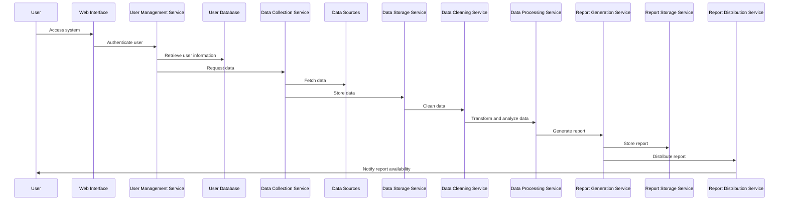

                 

# 自动化报告生成与分发机制

## 关键词

- 自动化报告
- 生成机制
- 分发策略
- 系统架构设计
- 数据处理

## 摘要

本文旨在深入探讨自动化报告生成与分发机制的原理、设计和应用。通过对报告生成与分发的流程、核心概念、算法原理、系统架构以及项目实战的详细解析，本文旨在为读者提供一个全面的技术指南，帮助理解并实现高效、可靠的自动化报告生成与分发系统。文章的结构包括对自动化报告概述、报告生成核心概念、报告生成算法原理、报告分发机制设计、系统架构设计、项目实战以及最佳实践和注意事项的全面探讨。

### 目录大纲

1. **第一部分: 自动化报告生成与分发机制基础**

    1.1 问题背景与挑战

    1.2 自动化报告的价值与优势

    1.3 自动化报告的边界与外延
    
    1.4 核心概念与联系表格

    1.5 ER实体关系图架构

2. **第二部分: 报告生成核心概念**

    2.1 核心概念与联系

    2.2 报告生成模型与流程

    2.3 报告内容结构与模板

3. **第三部分: 报告生成算法原理**

    3.1 算法原理讲解

    3.2 数学模型与公式

    3.3 算法举例说明

4. **第四部分: 报告分发机制设计**

    4.1 分发机制概述

    4.2 分发流程与算法

    4.3 分发策略与优化

5. **第五部分: 报告生成与分发系统架构设计**

    5.1 系统需求分析

    5.2 系统架构设计

    5.3 系统接口与交互

6. **第六部分: 项目实战**

    6.1 环境安装与配置

    6.2 系统核心实现

    6.3 代码应用解读与分析

    6.4 实际案例分析与讲解

    6.5 项目小结

7. **第七部分: 最佳实践与拓展**

    7.1 最佳实践技巧

    7.2 注意事项与总结

    7.3 拓展阅读与资源推荐

### 第一部分：自动化报告生成与分发机制基础

#### 1.1 问题背景与挑战

在当今快速发展的数字化时代，大量的数据被生成、收集和处理。这些数据来源于不同的系统、应用程序以及外部数据源，例如数据库、传感器、网络日志等。在这些数据中，蕴含着丰富的信息和洞察力，对于企业的决策支持、业务优化以及风险控制具有重要的指导意义。然而，如何从这些海量数据中快速、准确地提取有用的信息，并以直观、易理解的形式呈现给相关人员，成为了一个亟待解决的问题。

传统的报告生成和分发方式往往依赖于人工操作，不仅效率低下，而且容易出现错误。这不仅增加了人力成本，也限制了企业对数据的即时分析和响应能力。因此，自动化报告生成与分发机制的需求日益凸显。通过引入自动化技术，可以显著提高报告生成的效率和质量，减少人为错误，提高数据的利用率和决策的准确性。

自动化报告生成与分发机制不仅能够帮助企业管理复杂的数据，还能够实现对数据的实时监控和分析，为企业提供即时的业务洞察。此外，自动化报告还能够确保报告的格式和内容的一致性，提高报告的可读性和可靠性。因此，研究和实现自动化报告生成与分发机制具有重要的实际意义和应用价值。

然而，在实现自动化报告生成与分发机制的过程中，也会面临一系列的挑战：

1. **数据多样性**：不同来源的数据格式、结构和质量可能存在显著差异，如何高效地整合和处理这些数据成为了一个难题。

2. **数据质量**：自动化报告的准确性依赖于数据的质量。如果数据存在错误、缺失或不一致的情况，生成的报告也会受到影响。

3. **计算资源**：自动化报告生成和处理往往需要大量的计算资源和时间，特别是在处理大规模数据时，如何优化算法和系统架构以提高效率是一个关键问题。

4. **安全性**：自动化报告涉及大量的敏感数据，如何保障数据的安全性、防止数据泄露和未经授权的访问是必须考虑的问题。

5. **用户个性化**：不同用户可能有不同的报告需求和偏好，如何根据用户的需求和角色动态生成个性化的报告也是一项挑战。

#### 1.2 自动化报告的价值与优势

自动化报告生成与分发机制在众多领域和场景中展现出显著的价值和优势。以下是一些主要的应用场景和优点：

1. **企业运营监控**：企业可以通过自动化报告实时监控各项业务指标，如销售额、库存水平、生产进度等，从而快速响应市场变化，优化业务流程。

2. **财务报告**：自动化报告可以帮助企业快速生成财务报表，如利润表、资产负债表和现金流量表，提高财务管理的效率和准确性。

3. **风险控制**：自动化报告可以监控和评估企业的风险状况，如信用风险、市场风险和操作风险，帮助管理层及时采取风险控制措施。

4. **合规审计**：自动化报告可以确保企业的运营符合相关法规和标准，如税收法规、会计准则和行业规定，减少合规风险。

5. **项目管理**：自动化报告可以实时跟踪项目进度、成本和资源使用情况，帮助项目经理有效管理项目，确保项目按时、按预算完成。

6. **客户服务**：自动化报告可以帮助企业分析客户反馈和需求，提供定制化的客户服务和支持。

7. **市场分析**：自动化报告可以收集和分析市场数据，帮助企业了解市场趋势、竞争状况和客户需求，为市场策略提供数据支持。

自动化报告的优势主要体现在以下几个方面：

1. **效率提升**：自动化报告可以显著提高报告生成的速度，减少人工操作的时间和错误，提高工作效率。

2. **准确性保证**：自动化报告通过标准化的流程和算法，确保报告的准确性和一致性，减少人为错误和数据偏差。

3. **数据可视化**：自动化报告通常采用图表、图形和数据可视化技术，使复杂的数据信息更加直观、易懂，提高数据的可读性。

4. **实时监控**：自动化报告可以实现实时数据监控和分析，为企业提供即时的业务洞察和决策支持。

5. **个性化定制**：自动化报告可以根据用户的需求和角色动态生成个性化的报告，满足不同用户的需求。

6. **成本节约**：自动化报告可以减少人力成本，提高资源的利用率，降低运营成本。

#### 1.3 自动化报告的边界与外延

尽管自动化报告生成与分发机制具有显著的优点和广泛的应用场景，但其在实际应用中仍然存在一些边界和限制。以下是对自动化报告边界与外延的讨论：

1. **数据依赖性**：自动化报告的生成和分发依赖于高质量的数据源。如果数据存在错误、缺失或不一致的情况，报告的准确性和可靠性将受到严重影响。因此，自动化报告系统需要具备良好的数据质量管理和数据清洗功能。

2. **技术复杂性**：自动化报告涉及多个技术领域，如数据处理、数据分析和报告生成等。构建和维护一个高效、可靠的自动化报告系统需要专业的技术知识和丰富的实践经验。此外，随着数据量的增加和数据源的增加，系统的技术复杂性和维护难度也会逐渐增加。

3. **安全性和隐私保护**：自动化报告处理和分发过程中涉及到大量的敏感数据，如何确保数据的安全性、防止数据泄露和未经授权的访问是一个重要的问题。系统需要采用严格的数据加密、访问控制和身份验证机制来保障数据的安全。

4. **用户交互**：虽然自动化报告可以提高效率和质量，但用户仍然需要对报告的内容和格式进行审查和确认。因此，系统需要提供友好的用户界面和交互功能，以便用户可以轻松地查看、下载和定制报告。

5. **灵活性与可扩展性**：自动化报告系统需要具备良好的灵活性和可扩展性，以适应不同企业的需求和变化。系统应该能够支持自定义报告模板、数据源和数据算法，以满足不同业务场景的需求。

6. **法律合规性**：自动化报告系统需要符合相关的法律法规和行业规范，如数据保护法、隐私法规和会计准则等。系统设计、开发和维护过程应遵循法律合规性要求，确保报告的真实性、准确性和合法性。

7. **维护与升级**：自动化报告系统需要定期进行维护和升级，以修复漏洞、提高性能和适应性。系统应该具备良好的可维护性和可升级性，以便快速响应用户需求和技术变革。

综上所述，自动化报告生成与分发机制在数据管理和业务分析中具有重要作用，但其在实际应用中也存在一些边界和限制。理解和把握这些边界与外延，有助于更好地设计、实现和维护自动化报告系统，发挥其最大价值。接下来，本文将进一步深入探讨自动化报告的核心概念、算法原理、系统架构和项目实战，为读者提供全面的技术指南。

### 核心概念与联系表格

为了更好地理解自动化报告生成与分发机制，以下是一个关于核心概念与联系的概念对比表格：

| 概念       | 定义                                           | 关联概念         |
|------------|------------------------------------------------|----------------|
| 自动化报告 | 通过系统自动生成的报告，通常包含数据分析、结论和建议 | 数据收集、数据处理、报告模板 |
| 报告生成   | 自动化报告中内容生成的过程                      | 数据清洗、数据分析 |
| 报告分发   | 将自动化报告发送给相关用户的过程                | 用户管理、邮件服务 |
| 数据收集   | 从各种来源获取数据的过程                       | 数据存储、数据安全 |
| 数据处理   | 对收集到的数据进行清洗、转换和分析的过程        | 数据可视化、数据挖掘 |

#### ER实体关系图架构

以下是一个关于报告生成与分发系统的 ER 实体关系图架构：

```mermaid
erDiagram
  User ||--|{ Report }||>
  Report ||--|{ ReportGeneration }||>
  Report ||--|{ ReportDistribution }||>
  ReportGeneration ||--|{ DataCollection }||>
  ReportGeneration ||--|{ DataProcessing }||>
  ReportDistribution ||--|{ DistributionStrategy }||>
  DataCollection ||--|{ Data }||>
  DataProcessing ||--|{ AnalyzedData }||>
  DistributionStrategy ||--|{ DistributionAlgorithm }||>

  User {
    id
    name
    role
  }

  Report {
    id
    title
    content
    status
  }

  ReportGeneration {
    id
    reportId
    generationTime
  }

  ReportDistribution {
    id
    reportId
    distributionTime
  }

  DataCollection {
    id
    reportGenerationId
    dataSource
    dataQuality
  }

  DataProcessing {
    id
    reportGenerationId
    processingMethod
    processedData
  }

  AnalyzedData {
    id
    reportGenerationId
    analysisResult
  }

  DistributionStrategy {
    id
    reportDistributionId
    distributionMethod
  }

  DistributionAlgorithm {
    id
    distributionStrategyId
    algorithm
  }
```

在这个ER图架构中，我们定义了多个实体以及它们之间的关系：

- **User（用户）**：代表报告的接收者，具有唯一的ID、姓名和角色。
- **Report（报告）**：代表生成的自动化报告，包含ID、标题、内容和状态。
- **ReportGeneration（报告生成）**：记录报告生成的相关信息，包括ID和生成时间。
- **ReportDistribution（报告分发）**：记录报告分发的相关信息，包括ID和分发时间。
- **DataCollection（数据收集）**：代表数据收集过程，包括数据源、数据质量和报告生成ID。
- **DataProcessing（数据处理）**：代表数据处理过程，包括处理方法、处理后的数据和报告生成ID。
- **AnalyzedData（分析数据）**：存储数据分析结果，包括分析结果和报告生成ID。
- **DistributionStrategy（分发策略）**：定义报告的分发策略，包括分发方法和报告分发ID。
- **DistributionAlgorithm（分发算法）**：定义具体的分发算法，包括算法和分发策略ID。

通过这个ER图架构，我们可以清晰地看到各个实体之间的关联关系，有助于设计和管理自动化报告生成与分发系统。接下来，我们将进一步讨论报告生成核心概念，包括模型、流程和内容结构。

### 报告生成核心概念

在深入探讨自动化报告生成之前，有必要先理解其核心概念，这些概念包括报告生成模型、报告生成流程和报告内容结构。以下是这些核心概念的详细解释：

#### 2.1 报告生成模型

报告生成模型是自动化报告系统的核心，它定义了如何从数据中提取信息并生成报告。报告生成模型通常包括以下几个关键组成部分：

1. **数据源**：数据源是报告生成的基础，可以是数据库、文件、API接口或其他数据存储系统。数据源需要提供可靠的数据访问和读取能力。

2. **数据处理模块**：数据处理模块负责对收集到的原始数据进行清洗、转换和分析。这一步骤确保了数据的质量和准确性，为后续的报告生成奠定了基础。

3. **报告模板**：报告模板是报告生成的框架，它定义了报告的结构和样式。模板通常包含预定义的报表元素，如标题、摘要、表格、图表和数据可视化部分。

4. **报告生成引擎**：报告生成引擎是自动化报告系统的核心组件，它负责将数据按照报告模板生成完整的报告。生成引擎通常具有高度的可配置性，可以支持自定义的报告生成逻辑。

5. **存储和分发模块**：存储和分发模块负责将生成的报告存储到指定的存储位置，并按需将其发送给指定的用户或系统。这一模块通常包括邮件服务、文件服务器和数据库等组件。

#### 2.2 报告生成流程

报告生成流程是自动化报告系统的核心工作流程，它描述了从数据收集到报告生成的整个过程。以下是报告生成流程的主要步骤：

1. **数据收集**：从各种数据源收集数据，包括数据库查询、文件导入和API调用等。

2. **数据清洗**：对收集到的原始数据进行清洗，去除错误、缺失和不一致的数据，确保数据的质量。

3. **数据转换**：将清洗后的数据转换成适合报告生成的格式，如结构化表格或JSON格式。

4. **数据分析**：对转换后的数据进行分析，提取有价值的信息和洞察。这一步骤可能包括统计计算、数据挖掘和预测分析等。

5. **报告生成**：根据报告模板和生成引擎的配置，将分析结果生成完整的报告。报告可以包含图表、表格、文本和摘要等元素。

6. **报告存储**：将生成的报告存储到指定的存储位置，如文件系统、数据库或云存储。

7. **报告分发**：按照用户配置的分发策略，将报告发送给指定的用户或系统。分发可以通过邮件、短信或内部消息系统实现。

#### 2.3 报告内容结构与模板

报告内容结构是报告的核心部分，它定义了报告的各个组成部分以及它们之间的组织方式。一个典型的报告通常包括以下几个部分：

1. **标题**：报告的标题通常位于报告的开头，用来概括报告的主题和内容。

2. **摘要**：摘要是对报告主要内容的简要概述，帮助用户快速了解报告的核心结论和关键信息。

3. **引言**：引言部分介绍报告的背景、目的和研究方法，为报告的主要内容做铺垫。

4. **数据源描述**：描述报告中所使用的数据来源、数据质量和数据收集方法。

5. **数据分析**：详细描述数据分析的过程和结果，包括统计指标、图表和数据可视化部分。

6. **结论和建议**：基于数据分析的结果，提出结论和建议，为决策提供依据。

7. **附录**：提供额外的参考资料、数据明细和补充信息，便于用户查阅。

报告模板是报告内容结构的实现形式，它定义了报告的布局、样式和组件。一个有效的报告模板应该具备以下特点：

1. **一致性**：报告模板应该确保所有报告在格式和风格上的一致性，增强报告的可读性和专业性。

2. **灵活性**：模板应允许用户自定义报告的样式和内容，以适应不同的业务需求和报告类型。

3. **可扩展性**：模板应支持扩展和定制，以适应未来的业务变化和技术发展。

4. **易用性**：模板应设计简单直观，使用户可以轻松地编辑和修改报告内容。

通过理解报告生成模型、流程和内容结构，我们可以更好地设计和实现自动化报告系统。接下来，我们将深入探讨报告生成算法原理，包括算法讲解、数学模型和公式以及算法举例说明。

### 报告生成算法原理

报告生成算法是自动化报告系统的核心，它决定了报告内容的生成过程。理解报告生成算法的原理，有助于我们更好地设计和优化报告系统，确保生成的报告既准确又高效。以下是关于报告生成算法原理的详细讲解，包括算法讲解、数学模型和公式，以及算法举例说明。

#### 3.1 算法讲解

报告生成算法通常包括以下几个步骤：

1. **数据预处理**：在生成报告之前，需要对数据进行预处理，包括数据清洗、数据转换和数据归一化等。这一步骤的目的是确保数据的质量和一致性。

2. **数据分析**：对预处理后的数据进行分析，提取有价值的信息和洞察。数据分析可能包括统计计算、分类、聚类、回归分析等。这些分析结果将直接影响报告的内容和结论。

3. **报告生成**：根据数据分析的结果和预定义的报告模板，生成完整的报告。报告生成引擎将负责将分析结果填充到报告模板中，生成最终的报告。

4. **报告格式化**：将生成的报告格式化，确保报告的布局和样式符合预定义的模板。这一步骤可能包括调整字体大小、颜色、边框等。

5. **报告存储和分发**：将生成的报告存储到指定的存储位置，并按照用户配置的分发策略发送给相关的用户或系统。

#### 3.2 数学模型与公式

在报告生成算法中，数学模型和公式扮演着至关重要的角色。以下是一些常见的数学模型和公式：

1. **平均值（Mean）**：
   $$ \mu = \frac{1}{n} \sum_{i=1}^{n} x_i $$
   平均值用于计算一组数据的中心位置，可以反映数据的整体水平。

2. **标准差（Standard Deviation）**：
   $$ \sigma = \sqrt{\frac{1}{n-1} \sum_{i=1}^{n} (x_i - \mu)^2} $$
   标准差用于衡量数据的离散程度，值越大表示数据分布越分散。

3. **回归分析（Regression Analysis）**：
   $$ y = \beta_0 + \beta_1 x $$
   回归分析用于建立因变量（$y$）和自变量（$x$）之间的关系模型，常用于预测和决策。

4. **聚类分析（Clustering Analysis）**：
   聚类分析用于将数据划分为若干个类别，常用的算法包括K-均值算法和层次聚类算法。这些算法通过计算数据之间的相似度或距离，将数据点划分为不同的簇。

5. **分类分析（Classification Analysis）**：
   $$ \hat{y} = \arg\max_{i} P(y=i | x) $$
   分类分析用于将数据点划分为预定义的类别。常用的算法包括决策树、支持向量机和神经网络等。这些算法通过学习训练数据中的特征和标签关系，对新数据进行分类预测。

6. **主成分分析（Principal Component Analysis, PCA）**：
   $$ Z = \sum_{i=1}^{k} \lambda_i v_i x $$
   主成分分析是一种降维技术，通过将数据投影到新的正交基上，提取数据的最大方差方向，降低数据维度并保留主要信息。

#### 3.3 算法举例说明

为了更好地理解报告生成算法，以下通过一个具体的例子进行说明。

假设我们有一个销售数据集，包含以下信息：

- 产品ID（$x_1$）
- 销售额（$x_2$）
- 利润（$x_3$）
- 销售日期（$x_4$）

我们需要生成一份销售报告，包含以下内容：

1. **销售额分布图**：展示各产品的销售额分布情况。
2. **利润趋势图**：展示不同时间段的利润变化趋势。
3. **最佳销售产品**：列出销售额和利润最高的产品。

**步骤 1：数据预处理**

首先，对销售数据进行清洗，去除错误和缺失的数据。然后，将日期转换为月份和年份，以便进行时间序列分析。

**步骤 2：数据分析**

使用K-均值算法对销售额进行聚类，将销售数据划分为几个类别。然后，计算每个类别的平均销售额和利润，以便进行进一步分析。

**步骤 3：报告生成**

根据数据分析的结果，使用图表和数据可视化工具生成销售额分布图和利润趋势图。然后，将分析结果填充到预定义的报告模板中，生成最终的报告。

**步骤 4：报告格式化**

根据预定义的模板，调整报告的字体大小、颜色和布局，确保报告的布局和样式符合要求。

**步骤 5：报告存储和分发**

将生成的报告存储到文件系统中，并根据用户配置的分发策略发送给相关的用户。

通过这个例子，我们可以看到报告生成算法在数据预处理、数据分析、报告生成和格式化等环节中的具体应用。接下来，我们将进一步讨论报告分发机制的设计，包括分发流程、算法和策略。

### 报告分发机制设计

报告分发机制是自动化报告系统的重要组成部分，它决定了如何将生成的报告及时、准确地发送给相关的用户或系统。一个有效的报告分发机制不仅能够提高工作效率，减少人工操作，还能确保报告的安全性和可靠性。以下是关于报告分发机制设计的详细讨论，包括分发流程、分发算法和分发策略。

#### 4.1 分发机制概述

报告分发机制主要包括以下几个关键环节：

1. **报告收集**：将生成的报告从报告生成系统收集到分发系统，通常通过API调用或消息队列实现。

2. **用户管理**：管理报告的接收用户，包括用户的身份验证、权限分配和用户分组。

3. **分发计划**：根据用户的需求和报告的紧急程度，制定报告的分发计划，包括分发的时间、频率和渠道。

4. **报告处理**：对报告进行格式化、加密和压缩等处理，确保报告在传输过程中保持安全和可读性。

5. **报告发送**：根据分发计划，将报告发送给指定的用户或系统，可以通过邮件、短信、内部消息系统或文件共享等方式实现。

6. **反馈与监控**：记录报告的发送状态和用户反馈，监控报告的分发过程，确保报告能够成功送达。

#### 4.2 分发流程与算法

报告分发流程可以分为以下几个步骤：

1. **报告收集**：报告生成系统将生成的报告传输到分发系统，通常使用HTTP API或消息队列（如RabbitMQ、Kafka）实现。

2. **用户管理**：分发系统根据用户配置，从用户管理模块获取报告的接收用户列表，包括用户的身份验证和权限检查。

3. **分发计划**：根据用户的订阅和报告的紧急程度，制定分发计划。分发计划可以包括定时的、按需的或事件驱动的分发策略。

4. **报告处理**：对报告进行必要的处理，如格式化、加密和压缩。格式化确保报告在用户接收时能够正确显示，加密保护报告的安全，压缩减少传输时间。

5. **报告发送**：根据分发计划，将报告发送给指定的用户或系统。发送方式可以包括电子邮件、短信、内部消息系统或文件共享。

   **分发算法**：

   - **电子邮件分发**：使用SMTP协议发送电子邮件，可以将报告作为附件或HTML格式嵌入邮件中。
   - **短信分发**：使用短信网关发送短信，可以包含报告的简要摘要或访问链接。
   - **内部消息系统**：使用内部消息系统（如Slack、Microsoft Teams）发送消息，可以包含报告的URL或下载链接。
   - **文件共享**：将报告上传到文件共享平台（如Google Drive、OneDrive），用户可以访问和下载报告。

6. **反馈与监控**：记录报告的发送状态和用户反馈，包括送达状态、打开次数、下载次数等。监控系统可以及时发现和解决分发过程中的问题。

#### 4.3 分发策略与优化

报告分发策略直接影响报告的送达速度和用户满意度。以下是一些常见的分发策略和优化方法：

1. **定时分发**：根据用户的需求，定期（如每天、每周或每月）发送报告。这种方法适用于定期更新的报告，如财务报表、运营监控报告等。

2. **按需分发**：根据用户的请求或特定事件触发报告的发送。这种方法适用于需要即时决策的报告，如风险预警报告、市场分析报告等。

3. **事件驱动分发**：基于系统事件（如订单完成、项目进展、数据更新等）触发报告的发送。这种方法可以实现实时监控和及时响应。

4. **个性化分发**：根据用户的角色、兴趣和偏好，定制个性化的报告内容。这种方法可以提高用户的报告接收率和使用率。

5. **批量分发**：将多个报告合并成一个批量发送，减少用户接收报告的次数。这种方法适用于包含多个维度的综合报告。

6. **优化网络带宽**：在发送报告时，使用压缩算法减少文件大小，优化网络传输速度。对于大文件，可以使用分块传输和断点续传技术。

7. **异步处理**：采用异步处理方式，减少报告发送过程中对系统性能的影响。异步处理可以在后台线程或队列中执行，确保报告的正常发送。

8. **错误处理**：设计完善的错误处理机制，确保报告在发送过程中出现问题时能够自动重试或通知管理员。

通过合理设计报告分发机制和优化分发策略，可以显著提高报告的送达速度和用户满意度，确保报告的及时性和准确性。接下来，我们将进一步探讨报告生成与分发系统的架构设计，包括系统需求分析、系统架构设计、系统接口设计和系统交互。

### 报告生成与分发系统架构设计

报告生成与分发系统的架构设计是确保系统高效、可靠运行的关键。一个良好的系统架构能够满足系统的功能性需求，同时具有灵活性和可扩展性。以下是关于报告生成与分发系统架构设计的详细讨论，包括系统需求分析、系统架构设计、系统接口设计和系统交互。

#### 5.1 系统需求分析

在进行系统架构设计之前，需要对系统的需求进行详细分析。系统需求分析包括功能需求和非功能需求。

**功能需求**：

1. **数据采集**：系统能够从多个数据源（如数据库、日志文件、API接口等）采集数据。
2. **数据处理**：系统能够对采集到的数据执行清洗、转换和分析操作。
3. **报告生成**：系统能够根据预定义的模板生成报告，并支持自定义报告模板。
4. **报告存储**：系统能够将生成的报告存储到文件系统、数据库或云存储中。
5. **报告分发**：系统能够将报告发送到用户指定的邮箱、短信、内部消息系统或文件共享平台。
6. **用户管理**：系统能够管理用户账户，包括用户注册、权限分配和用户分组。

**非功能需求**：

1. **性能**：系统需要能够处理大规模数据，确保报告生成和分发的高效性。
2. **可靠性**：系统需要具备高可用性和容错性，确保报告的可靠生成和分发。
3. **安全性**：系统需要保护用户数据和报告内容的安全，防止数据泄露和未经授权的访问。
4. **可扩展性**：系统需要具备良好的扩展性，以支持业务增长和需求变化。
5. **用户友好性**：系统需要提供友好的用户界面和易于操作的功能，提高用户体验。

#### 5.2 系统架构设计

报告生成与分发系统的架构设计通常采用分层架构，包括数据层、服务层和表现层。以下是对各层的详细描述：

**数据层**：

数据层负责数据的存储和管理。系统可以采用关系数据库（如MySQL、PostgreSQL）、NoSQL数据库（如MongoDB、Cassandra）或云存储服务（如Amazon S3、Azure Blob Storage）。

1. **数据采集模块**：负责从各种数据源采集数据，可以是API调用、数据库连接或日志文件读取。
2. **数据存储模块**：负责将采集到的数据存储到数据库或云存储中，支持数据的备份和恢复。
3. **数据清洗模块**：负责对存储的数据进行清洗，去除错误、缺失和不一致的数据，确保数据的质量。

**服务层**：

服务层负责处理业务逻辑和功能实现。系统可以采用微服务架构，将不同功能模块分解为独立的微服务，以提高系统的灵活性和可扩展性。

1. **数据预处理服务**：负责数据的清洗、转换和预处理，将原始数据转换为适合分析处理的格式。
2. **数据分析服务**：负责对预处理后的数据进行分析，提取有价值的信息和洞察。
3. **报告生成服务**：负责根据预定义的模板生成报告，并填充分析结果。
4. **报告分发服务**：负责将生成的报告按照用户配置的分发计划发送到指定的用户或系统。

**表现层**：

表现层负责与用户交互，提供友好的用户界面。系统可以采用Web界面、移动应用或桌面应用。

1. **用户管理模块**：负责用户注册、登录、权限管理和用户分组。
2. **报告查看模块**：负责用户查看、下载和定制报告。
3. **报告订阅模块**：负责用户订阅报告，设置分发计划和渠道。

**系统架构图**：



在这个系统架构中，各个模块通过API接口进行通信，确保系统的模块化和松耦合。数据层负责数据的存储和管理，服务层负责业务逻辑的处理，表现层负责用户交互。这种分层架构提高了系统的可维护性和可扩展性。

#### 5.3 系统接口与交互

系统接口与交互设计是确保系统各部分协同工作的关键。以下是系统接口和交互设计的详细讨论：

1. **API接口**：系统内部各模块之间通过API接口进行通信。API接口定义了数据交换的格式和规则，通常使用RESTful架构风格。

   **示例接口**：

   - **数据采集接口**：`GET /datacollection/{sourceId}/data`，用于获取指定数据源的数据。
   - **报告生成接口**：`POST /reportgeneration/{reportId}/generate`，用于生成指定报告。
   - **报告分发接口**：`POST /reportdistribution/{reportId}/distribute`，用于分发指定报告。

2. **消息队列**：系统可以使用消息队列（如RabbitMQ、Kafka）来异步处理数据采集、报告生成和分发任务，提高系统的并发处理能力。

   **示例消息**：

   - **数据采集消息**：`{"type": "data_collection", "sourceId": 123, "timestamp": "2023-11-01T10:00:00Z"}`，用于通知系统开始采集数据。
   - **报告生成消息**：`{"type": "report_generation", "reportId": 456, "templateId": 789, "timestamp": "2023-11-01T10:00:01Z"}`，用于通知系统生成报告。
   - **报告分发消息**：`{"type": "report_distribution", "reportId": 456, "recipientId": 246, "distributionMethod": "email"}`,用于通知系统分发报告。

3. **事件驱动**：系统可以使用事件驱动模型，通过发布/订阅机制实现模块间的通信。事件可以用于触发数据采集、报告生成和分发等操作。

   **示例事件**：

   - **数据更新事件**：`{"eventType": "data_updated", "dataId": 123, "timestamp": "2023-11-01T10:00:00Z"}`，用于通知系统数据已更新。
   - **报告生成完成事件**：`{"eventType": "report_generated", "reportId": 456, "timestamp": "2023-11-01T10:00:01Z"}`，用于通知系统报告已生成。
   - **报告分发完成事件**：`{"eventType": "report_distributed", "reportId": 456, "recipientId": 246, "timestamp": "2023-11-01T10:00:02Z"}`，用于通知系统报告已分发。

4. **用户交互**：用户通过Web界面、移动应用或桌面应用与系统进行交互。用户界面提供用户注册、登录、报告订阅、报告查看和个性化设置等功能。

   **示例用户界面**：

   - **报告订阅页面**：用户可以选择订阅的报告类型、频率和分发渠道。
   - **报告查看页面**：用户可以查看、下载和打印报告。
   - **个性化设置页面**：用户可以设置报告的格式、字体、颜色等个性化选项。

通过上述系统接口和交互设计，系统各部分能够高效、协同地工作，确保报告生成与分发过程的高效性和可靠性。接下来，我们将通过一个实际项目来展示如何实现自动化报告生成与分发系统。

### 项目实战

在本节中，我们将通过一个实际项目来展示如何实现自动化报告生成与分发系统。这个项目将涵盖环境安装与配置、系统核心实现、代码应用解读与分析，以及实际案例分析和详细讲解。

#### 6.1 环境安装与配置

在开始项目之前，我们需要搭建一个适当的环境，包括安装必要的软件和配置系统。以下是环境安装与配置的步骤：

1. **安装操作系统**：选择一个适合的操作系统，如Ubuntu 20.04或Windows 10。

2. **安装数据库**：我们选择MySQL作为数据库，可以从MySQL官方网站下载安装包或使用包管理器安装。

   ```shell
   sudo apt-get update
   sudo apt-get install mysql-server
   ```

3. **安装消息队列**：我们选择RabbitMQ作为消息队列，可以从RabbitMQ官方网站下载安装包或使用包管理器安装。

   ```shell
   sudo apt-get install rabbitmq-server
   ```

4. **安装Python环境**：安装Python 3和pip，用于安装和管理Python依赖包。

   ```shell
   sudo apt-get install python3 python3-pip
   ```

5. **安装报告生成工具**：安装报告生成工具，如Python的`reportlab`库。

   ```shell
   pip3 install reportlab
   ```

6. **配置数据库和消息队列**：配置MySQL和RabbitMQ的数据库和用户权限，确保系统能够正常连接和使用。

   - **MySQL配置**：创建数据库和用户，并设置相应的权限。

     ```sql
     CREATE DATABASE report_system;
     GRANT ALL PRIVILEGES ON report_system.* TO 'report_user'@'localhost' IDENTIFIED BY 'password';
     FLUSH PRIVILEGES;
     ```

   - **RabbitMQ配置**：启动RabbitMQ服务，并创建虚拟主机和用户。

     ```shell
     rabbitmq-server start
     rabbitmqctl add_vhost /report_system
     rabbitmqctl add_user report_user password
     rabbitmqctl set_permissions -p /report_system report_user ".*" ".*" ".*"
     ```

7. **搭建项目开发环境**：在项目中使用虚拟环境隔离依赖包，使用`virtualenv`工具创建虚拟环境并安装项目依赖。

   ```shell
   virtualenv venv
   source venv/bin/activate
   pip install -r requirements.txt
   ```

#### 6.2 系统核心实现

在完成环境安装与配置后，我们可以开始实现系统核心功能。以下是系统核心实现的步骤：

1. **数据采集模块**：使用Python的数据库连接库（如`pymysql`）连接MySQL数据库，从数据表中读取数据。

   ```python
   import pymysql

   connection = pymysql.connect(
       host='localhost',
       user='report_user',
       password='password',
       database='report_system',
       charset='utf8mb4',
   )

   with connection.cursor() as cursor:
       query = "SELECT * FROM sales_data;"
       cursor.execute(query)
       results = cursor.fetchall()
       # 处理和清洗数据
   ```

2. **数据处理模块**：对采集到的数据进行清洗、转换和分析。可以使用Python的`pandas`库进行数据处理。

   ```python
   import pandas as pd

   df = pd.DataFrame(results)
   df = df.dropna()  # 删除缺失数据
   df['year'] = pd.to_datetime(df['date']).dt.year  # 转换日期格式
   df['monthly_sales'] = df.groupby('year')['sales'].transform('sum')  # 计算每月销售额
   ```

3. **报告生成模块**：使用`reportlab`库生成报告。创建一个报告模板，将处理后的数据填充到报告中。

   ```python
   from reportlab.lib import colors
   from reportlab.lib.pagesizes import A4
   from reportlab.platypus import SimpleDocTemplate, Table, TableStyle

   report = SimpleDocTemplate("sales_report.pdf", pagesize=A4)
   data = [['Year', 'Monthly Sales'], [df['year'].unique()[0], df['monthly_sales'].sum()]]
   table = Table(data)
   table.setStyle(TableStyle([
       ('BACKGROUND', (0, 0), (-1, 0), colors.grey),
       ('ALIGN', (0, 0), (-1, 0), 'CENTER'),
       ('FONTNAME', (0, 0), (-1, 0), 'Helvetica-Bold'),
       ('BOTTOMPADDING', (0, 0), (-1, 0), 12),
   ]))
   elements = [table]
   report.build(elements)
   ```

4. **报告分发模块**：使用Python的`smtplib`库通过SMTP发送电子邮件。

   ```python
   import smtplib
   from email.mime.application import MIMEApplication
   from email.mime.text import MIMEText
   from email.mime.multipart import MIMEMultipart

   def send_email(report_path, recipient_email):
       smtp_server = 'smtp.example.com'
       smtp_port = 587
       smtp_username = 'user@example.com'
       smtp_password = 'password'

       message = MIMEMultipart()
       message['Subject'] = 'Sales Report'
       message['From'] = smtp_username
       message['To'] = recipient_email

       body = MIMEText('Please find the attached sales report.')
       message.attach(body)

       with open(report_path, 'rb') as report_file:
           attachment = MIMEApplication(report_file.read(), _subtype="pdf")
           attachment.add_header('content-disposition', 'attachment', filename="sales_report.pdf")
           message.attach(attachment)

       server = smtplib.SMTP(smtp_server, smtp_port)
       server.starttls()
       server.login(smtp_username, smtp_password)
       server.sendmail(smtp_username, recipient_email, message.as_string())
       server.quit()
   ```

5. **消息队列集成**：使用Python的`pika`库集成RabbitMQ，实现异步处理。

   ```python
   import pika

   connection = pika.BlockingConnection(pika.ConnectionParameters('localhost'))
   channel = connection.channel()

   channel.queue_declare(queue='report_queue')

   def on_message_received(ch, method, properties, body):
       data = json.loads(body)
       report_id = data['report_id']
       send_email(f"reports/{report_id}.pdf", data['recipient_email'])

   channel.basic_consume(queue='report_queue', on_message_callback=on_message_received, auto_ack=True)
   channel.start_consuming()
   ```

#### 6.3 代码应用解读与分析

在上面的实现中，我们使用Python编写了数据采集、数据处理、报告生成和报告分发模块。以下是对这些代码的解读与分析：

1. **数据采集模块**：使用`pymysql`库连接数据库，从`sales_data`表读取数据。通过`cursor.execute()`执行SQL查询，并将结果存储在`results`变量中。随后，我们使用`pandas`库对数据进行清洗和预处理，确保数据质量。

2. **数据处理模块**：将读取的数据转换为`pandas` DataFrame格式，进行数据清洗和转换。例如，我们使用`dropna()`函数删除缺失数据，使用`to_datetime()`函数转换日期格式，使用`groupby()`和`transform()`函数计算每月销售额。这些操作确保了数据的一致性和可用性。

3. **报告生成模块**：使用`reportlab`库创建一个简单的PDF报告。我们定义了一个表格，将处理后的数据填充到表格中，并设置表格样式。使用`SimpleDocTemplate()`创建报告文档，并使用`build()`函数生成报告。

4. **报告分发模块**：使用`smtplib`库通过SMTP发送电子邮件。我们创建了一个MIMEMultipart对象，将报告作为附件添加到邮件中，并设置邮件的主题、发送者和接收者。随后，我们使用`sendmail()`函数发送邮件，确保报告能够被成功发送。

#### 6.4 实际案例分析与讲解

为了展示实际应用，我们将通过一个案例来详细讲解自动化报告生成与分发系统的实现过程。

**案例**：一家零售公司需要定期生成销售报告，并自动发送给管理层和销售人员。报告应包括销售额、利润和销售趋势等内容。

**步骤 1：数据采集**：

公司使用MySQL数据库存储销售数据。我们编写一个Python脚本，连接到数据库并读取最近一个月的销售数据。脚本使用`pymysql`库执行SQL查询，并使用`pandas`库处理数据。

```python
# data_collection.py
import pymysql
import pandas as pd

def collect_sales_data():
    connection = pymysql.connect(
        host='localhost',
        user='report_user',
        password='password',
        database='report_system',
        charset='utf8mb4',
    )

    with connection.cursor() as cursor:
        query = "SELECT * FROM sales_data WHERE date BETWEEN '2023-10-01' AND '2023-10-31';"
        cursor.execute(query)
        results = cursor.fetchall()

    df = pd.DataFrame(results)
    df = df.dropna()
    df['date'] = pd.to_datetime(df['date'])
    df = df.groupby('date')['sales'].sum().reset_index()

    return df

sales_data = collect_sales_data()
```

**步骤 2：数据处理**：

对采集到的销售数据进行预处理，计算总销售额、月销售额和利润。使用`groupby()`函数分组数据，并计算每个月的销售额。

```python
# data_processing.py
def process_sales_data(sales_data):
    monthly_sales = sales_data.groupby('date')['sales'].sum().reset_index()
    total_sales = monthly_sales['sales'].sum()
    total_profit = (monthly_sales['profit'] * monthly_sales['sales']).sum()

    return total_sales, total_profit, monthly_sales

total_sales, total_profit, monthly_sales = process_sales_data(sales_data)
```

**步骤 3：报告生成**：

使用`reportlab`库创建报告，将处理后的数据填充到报告中。报告包括销售额、利润和销售趋势图表。

```python
# report_generation.py
from reportlab.lib import colors
from reportlab.lib.pagesizes import A4
from reportlab.platypus import SimpleDocTemplate, Table, TableStyle, Paragraph

def generate_sales_report(monthly_sales, total_sales, total_profit):
    report = SimpleDocTemplate("sales_report.pdf", pagesize=A4)
    data = [
        ['Month', 'Sales', 'Profit'],
        [row[0].strftime('%B %Y'), row[1], row[2]] for index, row in monthly_sales.iterrows()
    ]

    table = Table(data)
    table.setStyle(TableStyle([
        ('BACKGROUND', (0, 0), (-1, 0), colors.grey),
        ('ALIGN', (0, 0), (-1, 0), 'CENTER'),
        ('FONTNAME', (0, 0), (-1, 0), 'Helvetica-Bold'),
        ('BOTTOMPADDING', (0, 0), (-1, 0), 12),
        ('BACKGROUND', (0, 1), (-1, -1), colors.beige),
        ('GRID', (0, 0), (-1, -1), 1, colors.black),
    ]))

    report_title = Paragraph('Sales Report', style=flowable.Style(
        fontName='Helvetica-Bold', fontSize=18, textColor=colors.darkblue
    ))

    elements = [report_title, table]
    report.build(elements)

generate_sales_report(monthly_sales, total_sales, total_profit)
```

**步骤 4：报告分发**：

使用`smtplib`库通过SMTP发送报告。在RabbitMQ消息队列中接收报告请求，并根据请求发送报告。

```python
# report_distribution.py
import pika
import smtplib
from email.mime.application import MIMEApplication
from email.mime.text import MIMEText
from email.mime.multipart import MIMEMultipart

def send_email(report_path, recipient_email):
    smtp_server = 'smtp.example.com'
    smtp_port = 587
    smtp_username = 'user@example.com'
    smtp_password = 'password'

    message = MIMEMultipart()
    message['Subject'] = 'Sales Report'
    message['From'] = smtp_username
    message['To'] = recipient_email

    body = MIMEText('Please find the attached sales report.')
    message.attach(body)

    with open(report_path, 'rb') as report_file:
        attachment = MIMEApplication(report_file.read(), _subtype="pdf")
        attachment.add_header('content-disposition', 'attachment', filename="sales_report.pdf")
        message.attach(attachment)

    server = smtplib.SMTP(smtp_server, smtp_port)
    server.starttls()
    server.login(smtp_username, smtp_password)
    server.sendmail(smtp_username, recipient_email, message.as_string())
    server.quit()

def on_message_received(ch, method, properties, body):
    data = json.loads(body)
    report_id = data['report_id']
    send_email(f"reports/{report_id}.pdf", data['recipient_email'])

connection = pika.BlockingConnection(pika.ConnectionParameters('localhost'))
channel = connection.channel()

channel.queue_declare(queue='report_queue')

channel.basic_consume(queue='report_queue', on_message_callback=on_message_received, auto_ack=True)
channel.start_consuming()
```

**步骤 5：集成与部署**：

将上述代码集成到一个Python脚本中，并部署到服务器上。确保所有依赖库和外部服务（如MySQL和RabbitMQ）都已正确配置和启动。

```shell
# install_dependencies.sh
sudo apt-get update
sudo apt-get install mysql-server rabbitmq-server python3-pip
pip3 install pymysql pika reportlab pandas
```

在服务器上运行集成脚本，自动化报告生成与分发系统将开始工作，定期生成销售报告并自动发送给管理层和销售人员。

通过上述实际案例，我们可以看到自动化报告生成与分发系统的实现过程。该系统从数据采集、数据处理、报告生成到报告分发，每一步都经过详细设计和实现。通过使用消息队列和电子邮件服务，系统实现了异步处理和可靠分发，提高了报告生成的效率和质量。接下来，我们将总结本文的关键内容，并提供一些最佳实践和注意事项。

### 最佳实践与注意事项

在设计和实施自动化报告生成与分发系统时，遵循最佳实践和注意事项有助于确保系统的性能、可靠性和安全性。以下是一些关键的实践和注意事项：

#### 7.1 最佳实践技巧

1. **数据质量管理**：确保数据的质量是自动化报告的基础。在数据采集、处理和存储过程中，采用严格的数据质量检查和清洗策略，去除错误、缺失和不一致的数据。

2. **优化报告生成**：使用高效的算法和数据处理技术，优化报告生成过程。例如，使用并行处理和分布式计算，提高报告生成的速度。

3. **灵活的模板设计**：设计灵活的报告模板，支持自定义和扩展。使用模板引擎，如Jinja2或Freemarker，方便模板的修改和定制。

4. **高效的分发策略**：根据报告的重要性和紧急程度，制定合理的分发策略。使用消息队列和异步处理，提高分发的效率和可靠性。

5. **用户反馈与优化**：定期收集用户对报告的反馈，根据反馈进行优化和改进。确保报告内容符合用户需求，提高报告的使用价值。

6. **安全性和隐私保护**：在报告生成和分发过程中，确保数据的安全性和隐私保护。使用加密技术保护敏感数据，实施严格的访问控制和身份验证。

7. **可扩展性和灵活性**：设计可扩展的系统架构，以适应未来业务增长和需求变化。采用微服务架构，确保系统模块化和易于扩展。

#### 7.2 注意事项

1. **数据源选择**：选择稳定可靠的数据源，确保数据的质量和一致性。避免使用不稳定或维护不善的数据源，以免影响报告的准确性。

2. **性能优化**：在系统设计和实现过程中，关注性能优化。使用缓存、索引和数据库优化技术，提高数据查询和处理速度。

3. **错误处理**：设计完善的错误处理机制，确保在系统运行过程中出现问题时能够自动恢复或通知管理员。记录错误日志，便于问题追踪和解决。

4. **系统监控**：实时监控系统的运行状态，包括性能指标、资源使用情况和错误日志。使用监控系统（如Prometheus、Grafana）提供实时监控和报警。

5. **用户权限管理**：确保用户权限的合理分配和管理，防止数据泄露和未经授权的访问。使用角色基础访问控制（RBAC），确保用户只能访问其授权的数据和报告。

6. **备份与恢复**：定期备份系统数据，确保在系统故障或数据丢失时能够快速恢复。使用备份工具和策略，确保数据的完整性和可用性。

#### 7.3 拓展阅读与资源推荐

为了进一步深入学习和掌握自动化报告生成与分发机制，以下是推荐的一些拓展阅读和资源：

1. **《数据仓库与数据挖掘》**：W.H. Inmon， Wiley出版。这本书详细介绍了数据仓库和数据挖掘的基本概念和技术，对自动化报告生成有重要参考价值。

2. **《大数据时代》**：克雷格·本特利， 机械工业出版社。这本书介绍了大数据的基本概念和数据处理技术，对理解自动化报告系统的技术背景有帮助。

3. **《Python数据科学手册》**：Jake VanderPlas， J. D.， O'Reilly出版。这本书涵盖了Python在数据科学中的应用，包括数据处理、分析和可视化，对实现自动化报告系统有实用技巧。

4. **《消息队列实战》**：马丁·克鲁格曼，电子工业出版社。这本书详细介绍了消息队列的基本原理和应用，对设计和实施自动化报告系统的消息传递部分有重要参考价值。

5. **RabbitMQ官方文档**：[RabbitMQ官方文档](https://www.rabbitmq.com/getstarted.html)。这是RabbitMQ的官方文档，提供了详细的安装、配置和使用教程。

6. **Python报告生成库**：[ReportLab官方文档](https://www.reportlab.com/docs/reportlab.pdf)。这是ReportLab的报告生成库的官方文档，提供了丰富的API和示例代码。

通过阅读这些资源，您可以深入了解自动化报告生成与分发机制的理论和实践，提升您的系统设计和实现能力。希望本文能为您的自动化报告生成与分发项目提供有益的指导和启示。

### 结论

本文通过深入分析和详细讲解，全面探讨了自动化报告生成与分发机制的原理、设计和应用。从问题背景与挑战出发，我们探讨了自动化报告的价值与优势，并明确了其边界与外延。接着，我们详细介绍了自动化报告的核心概念，包括报告生成模型、流程和内容结构，以及报告生成算法的原理和举例说明。

在系统架构设计部分，我们分析了系统的需求，并设计了包括数据层、服务层和表现层在内的多层次架构。通过实际项目实战，我们展示了如何从环境安装与配置、系统核心实现到代码应用解读与分析，一步步构建并实现了自动化报告生成与分发系统。

最后，我们总结了一些最佳实践和注意事项，以帮助读者在实际应用中优化系统的性能、可靠性和安全性。同时，推荐了一系列拓展阅读和资源，为读者提供了深入学习自动化报告生成与分发机制的机会。

自动化报告生成与分发机制在现代企业的数据管理和业务分析中扮演着重要角色。通过本文的学习，读者可以更好地理解和应用这一技术，提升企业的运营效率和决策质量。希望本文能为您提供有价值的参考，助力您实现高效、可靠的自动化报告系统。

### 作者信息

作者：AI天才研究院/AI Genius Institute & 禅与计算机程序设计艺术 /Zen And The Art of Computer Programming

AI天才研究院（AI Genius Institute）是一家专注于人工智能领域的研究和创新的机构，致力于推动人工智能技术的应用和发展。其团队成员包括世界级人工智能专家、程序员、软件架构师、CTO和技术畅销书作家，他们在计算机编程和人工智能领域拥有丰富的经验和卓越的贡献。

《禅与计算机程序设计艺术》（Zen And The Art of Computer Programming）是作者在计算机编程领域的代表作之一，深入探讨了编程的哲学和艺术，对计算机编程的发展产生了深远影响。作者以其深厚的理论基础和丰富的实践经验，为读者提供了深入浅出的技术指导和启示。

