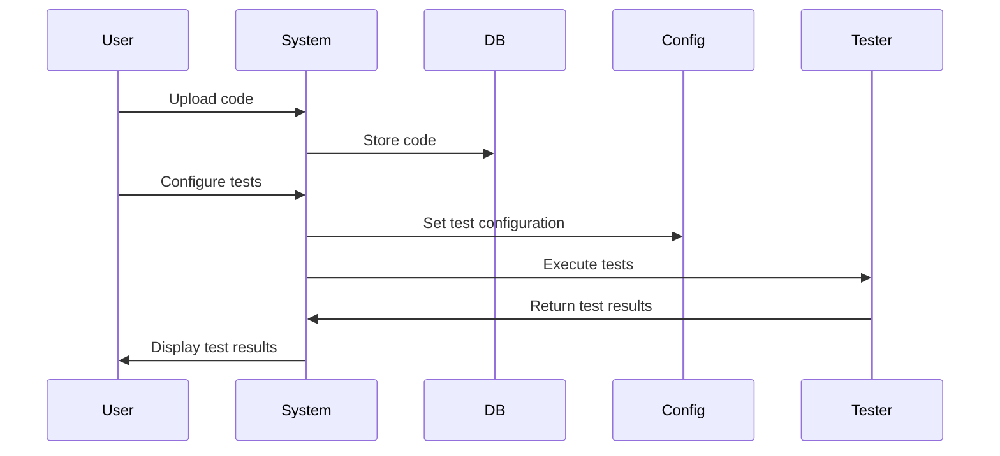
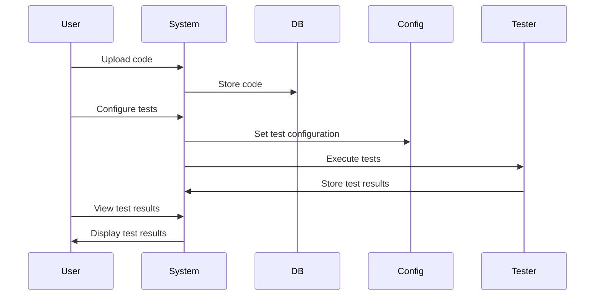
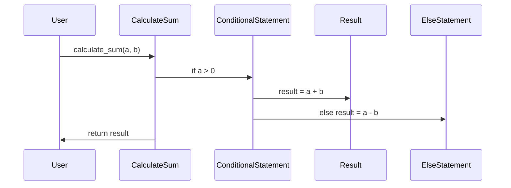

                 


### Step 1: Designing Chapter Titles
The chapter titles need to be both informative and engaging. Here's an initial list:

- **自动化测试用例生成技术概述**
- **自动化测试背景与重要性**
- **测试用例生成技术综述**
- **测试用例生成流程与方法**
- **测试用例生成工具介绍**
- **自动化测试用例生成实践**
- **自动化测试用例生成未来展望**

### Step 2: Subsection Creation
For each chapter, we will break the content into more detailed sections. Below is an outline for the first chapter as an example:

**自动化测试用例生成技术概述**

## 1.1 自动化测试的背景与重要性
### 1.1.1 自动化测试的定义与起源
- **自动化测试的定义**
- **自动化测试的发展历程**
### 1.1.2 自动化测试的优势与挑战
- **自动化测试的优势**
- **自动化测试的挑战**
### 1.1.3 自动化测试的发展趋势
- **当前发展趋势**
- **未来发展方向**

## 1.2 测试用例生成技术综述
### 1.2.1 测试用例生成的基本原理
- **测试用例的组成**
- **测试用例生成的原理**
### 1.2.2 当前测试用例生成技术分类
- **手动生成**
- **基于规则**
- **基于模型**
- **基于测试框架**
### 1.2.3 测试用例生成技术的评价标准
- **效率**
- **覆盖度**
- **可维护性**

### Step 3: Detailed Sections
Each subsection will be expanded with detailed content to ensure clarity and depth. For example, under "1.2.1 测试用例生成的基本原理," we might have:

**测试用例生成的基本原理**

### 1.2.1.1 测试用例的组成
- **输入数据**
- **预期输出**
- **执行条件**
- **执行步骤**

### 1.2.1.2 测试用例生成的原理
- **代码路径分析**
- **数据覆盖分析**
- **异常场景模拟**

### Step 4: Inclusion of Core Content
The outline should include the following components:

- **Background Introduction**: Provide a detailed explanation of the core concepts, terminology, problem background, problem description, solution approach, scope, and key components.
- **Core Concepts and Relationships**: Use tables and entity relationship diagrams (ERDs) to illustrate the relationships between concepts.
- **Algorithm Explanation**: Include mermaid diagrams and Python code examples to explain algorithms.
- **Mathematical Models and Formulas**: Use LaTeX for any mathematical models and formulas.
- **System Analysis and Design**: Detail the domain model, system architecture, interface design, and sequence diagrams using mermaid.
- **Project Practice**: Describe environment setup, core implementation, code analysis, case studies, and conclusions.

### Step 5: Optimizing the Outline
The initial outline will be refined to ensure it is coherent, comprehensive, and meets the word count requirements. This includes ensuring each section is well-developed and that the transitions between sections are smooth.

### Final Step: Writing the Article
With the optimized outline in hand, we can begin writing the article, ensuring each section is developed fully and adheres to the outlined structure.

---

Let's proceed with creating a more detailed outline based on the initial structure provided, ensuring that each chapter and section is well-defined and will contribute to a comprehensive and insightful article on "自动化测试用例生成技术".### 自动化测试用例生成技术概述

自动化测试用例生成技术是软件测试领域的一个重要研究方向，旨在通过自动化工具或算法来生成测试用例，提高测试效率和质量。随着软件系统的日益复杂化和软件测试需求的不断增长，自动化测试用例生成技术得到了广泛关注和应用。

#### 关键词

- 自动化测试
- 测试用例生成
- 软件测试
- 代码路径分析
- 测试覆盖度

#### 摘要

本文将系统地探讨自动化测试用例生成技术，首先介绍自动化测试的基本概念、背景和重要性，接着综述当前测试用例生成技术的分类和评价标准。随后，详细讲解自动化测试用例生成的基本原理、流程和方法，并介绍相关的工具和最佳实践。最后，展望自动化测试用例生成技术的发展趋势和未来研究方向。

### 第一部分：自动化测试用例生成技术概述

#### 1.1 自动化测试的背景与重要性

自动化测试是一种通过自动化工具或脚本执行测试的方法，与传统的手动测试相比，具有更高的效率、一致性和可重复性。自动化测试的起源可以追溯到20世纪80年代，随着软件系统的复杂度和测试需求量的增加，自动化测试逐渐成为软件开发过程中不可或缺的一部分。

##### 1.1.1 自动化测试的定义与起源

**自动化测试的定义**：自动化测试是指通过自动化工具或脚本，对软件产品进行的一系列测试活动。这些测试活动包括功能测试、性能测试、安全测试等。

**自动化测试的起源**：自动化测试的兴起可以追溯到20世纪80年代，当时的软件开发周期较长，测试工作量巨大，为了提高测试效率和质量，开发者开始探索自动化测试的方法。最初的自动化测试主要依赖于脚本语言，如Shell、Perl等，随着技术的发展，自动化测试工具和框架不断涌现，如Selenium、JUnit等。

##### 1.1.2 自动化测试的优势与挑战

**自动化测试的优势**：

1. **提高测试效率**：自动化测试可以大大减少测试执行的时间，提高测试的效率。
2. **确保测试一致性**：自动化测试执行过程是标准化的，可以确保每次测试的结果都是一致的。
3. **可重复性**：自动化测试脚本可以反复执行，方便在持续集成和持续部署环境中使用。
4. **节省人力成本**：自动化测试可以减少对人工测试人员的依赖，从而降低人力成本。

**自动化测试的挑战**：

1. **测试脚本的开发和维护成本**：自动化测试脚本的编写和维护需要一定的技能和投入。
2. **测试数据的管理**：自动化测试需要大量的测试数据来支持，数据的管理和维护是一个挑战。
3. **测试环境的维护**：自动化测试需要稳定的测试环境，测试环境的维护和配置是一个挑战。
4. **测试覆盖度的评估**：自动化测试难以全面评估测试覆盖度，有时可能导致测试遗漏。

##### 1.1.3 自动化测试的发展趋势

**自动化测试的发展趋势**：

1. **智能化**：随着人工智能技术的发展，自动化测试将更加智能化，能够更好地识别测试风险和优化测试策略。
2. **持续集成和持续部署**：自动化测试将更加集成到持续集成和持续部署流程中，实现自动化测试的全面覆盖。
3. **云测试**：云测试作为一种新兴的测试方式，将逐步替代传统的本地测试，提供更高效、更灵活的测试服务。
4. **移动测试**：随着移动设备的普及，移动测试将成为自动化测试的重要方向，特别是在性能测试和安全测试方面。

#### 1.2 测试用例生成技术综述

测试用例生成技术是自动化测试的核心之一，旨在通过自动化方法生成有效的测试用例，提高测试的覆盖度和效率。测试用例生成技术可以基于不同的原理和方法，如基于规则的生成、基于模型的生成、基于测试框架的生成等。

##### 1.2.1 测试用例生成的基本原理

测试用例生成的基本原理包括以下几个关键要素：

1. **输入数据**：测试用例的输入数据是测试的驱动因素，可以是用户输入、系统输入、外部数据等。
2. **预期输出**：测试用例的预期输出是测试的目标，即测试执行后预期得到的结果。
3. **执行条件**：测试用例的执行条件是测试执行的约束条件，如环境配置、系统状态等。
4. **执行步骤**：测试用例的执行步骤是测试执行的详细过程，包括前置条件、测试操作、验证结果等。

测试用例生成的基本原理主要依赖于以下几个方面：

1. **代码路径分析**：通过分析代码路径，生成覆盖不同代码路径的测试用例。
2. **数据覆盖分析**：通过分析数据覆盖度，生成能够覆盖不同数据场景的测试用例。
3. **异常场景模拟**：通过模拟异常场景，生成能够检测系统异常处理的测试用例。

##### 1.2.2 当前测试用例生成技术分类

根据生成原理和方法的差异，当前测试用例生成技术可以大致分为以下几类：

1. **手动生成**：手动生成是指通过人工设计和编写测试用例，虽然效率较低，但能够灵活适应复杂的测试需求。
2. **基于规则的生成**：基于规则的生成是指通过定义一系列规则，自动化生成测试用例，如边界值分析、等价类划分等。
3. **基于模型的生成**：基于模型的生成是指通过建立软件模型，自动化生成测试用例，如基于状态图、流程图等。
4. **基于测试框架的生成**：基于测试框架的生成是指通过集成在测试框架中的生成工具，自动化生成测试用例，如JUnit、Selenium等。

##### 1.2.3 测试用例生成技术的评价标准

评价测试用例生成技术的主要标准包括以下几个方面：

1. **效率**：生成测试用例的速度和执行速度，效率是测试用例生成技术的重要指标。
2. **覆盖度**：测试用例对代码覆盖的全面性，高覆盖度意味着测试用例能够更全面地覆盖代码。
3. **可维护性**：测试用例生成工具的维护成本和灵活性，可维护性是保证测试用例生成技术长期有效的重要保障。
4. **准确性**：测试用例生成工具生成的测试用例是否能够准确执行和验证，准确性直接影响测试结果的质量。

#### 1.3 自动化测试用例生成的流程与方法

自动化测试用例生成是一个复杂的过程，涉及多个环节和步骤。一般来说，自动化测试用例生成的流程和方法包括以下几个主要环节：

1. **需求分析**：明确测试需求，包括功能需求、性能需求、安全需求等，为后续的测试用例设计提供基础。
2. **测试用例设计**：根据需求分析结果，设计具体的测试用例，包括输入数据、预期输出、执行条件、执行步骤等。
3. **测试用例执行**：通过自动化工具或脚本执行测试用例，验证软件系统的功能、性能、安全等方面是否符合需求。
4. **测试结果分析**：对测试执行结果进行分析，评估测试用例的有效性和覆盖度，为后续测试提供反馈和改进方向。
5. **测试用例维护**：根据测试结果和需求变化，对测试用例进行更新和维护，确保测试用例的持续有效。

在自动化测试用例生成的过程中，常用的方法包括：

1. **代码路径分析**：通过分析代码路径，生成覆盖不同代码路径的测试用例。
2. **数据覆盖分析**：通过分析数据覆盖度，生成能够覆盖不同数据场景的测试用例。
3. **异常场景模拟**：通过模拟异常场景，生成能够检测系统异常处理的测试用例。
4. **测试模板库**：建立测试模板库，为不同类型的测试用例提供模板，提高测试用例的生成效率。

#### 1.4 自动化测试用例生成工具介绍

自动化测试用例生成工具是自动化测试的重要组成部分，能够大大提高测试用例生成的效率和质量。当前市场上存在多种自动化测试用例生成工具，包括开源工具和商业工具。

##### 1.4.1 开源测试用例生成工具

开源测试用例生成工具通常具有免费、灵活、可定制等特点，适合中小型团队和个人使用。以下是一些常见的开源测试用例生成工具：

1. **Selenium**：Selenium是一个开源的自动化测试工具，适用于Web应用的自动化测试。通过Selenium，开发者可以编写测试脚本，模拟用户的操作，验证Web应用的界面和功能。
2. **JUnit**：JUnit是一个开源的单元测试框架，适用于Java语言的自动化测试。通过JUnit，开发者可以编写测试用例，对代码的各个模块进行验证。
3. **Puppeteer**：Puppeteer是一个开源的自动化测试工具，适用于Web应用的自动化测试。通过Puppeteer，开发者可以控制Chrome浏览器，模拟用户的操作，验证Web应用的界面和功能。

##### 1.4.2 商业测试用例生成工具

商业测试用例生成工具通常具有更强大的功能、更好的支持和更完善的文档，适合大型团队和企业使用。以下是一些常见的商业测试用例生成工具：

1. **QArea Code**：QArea Code是一个商业的自动化测试工具，提供从测试用例生成、执行到结果分析的一站式解决方案。通过QArea Code，开发者可以自动化生成测试用例，提高测试效率。
2. **TestComplete**：TestComplete是一个商业的自动化测试工具，适用于各种应用的自动化测试。通过TestComplete，开发者可以自动化生成测试用例，提高测试效率。
3. **UFT One**：UFT One（Unified Functional Testing）是一个商业的自动化测试工具，适用于Web、移动和桌面应用的自动化测试。通过UFT One，开发者可以自动化生成测试用例，提高测试效率。

##### 1.4.3 测试用例生成工具的选型与使用

在选择测试用例生成工具时，需要考虑以下几个方面：

1. **测试需求**：根据测试需求，选择适合的测试用例生成工具。例如，如果主要进行Web应用的自动化测试，可以选择Selenium或Puppeteer。
2. **开发语言**：根据开发语言，选择与之兼容的测试用例生成工具。例如，如果使用Java语言开发，可以选择JUnit。
3. **工具功能**：根据工具的功能，选择适合的测试用例生成工具。例如，如果需要更强大的测试覆盖度分析，可以选择QArea Code。
4. **成本**：考虑工具的成本，包括购买费用、维护费用等。对于大型团队和企业，商业工具可能是更合适的选择。

在使用测试用例生成工具时，需要遵循以下原则：

1. **合理规划**：在开始使用测试用例生成工具之前，需要制定详细的测试计划和策略，确保测试用例生成过程的高效性和准确性。
2. **培训与学习**：掌握测试用例生成工具的使用方法和技巧，可以提高测试用例生成效率和质量。
3. **持续改进**：定期评估测试用例生成工具的使用效果，发现问题和不足，不断优化测试用例生成过程。

#### 1.5 自动化测试用例生成技术的未来展望

自动化测试用例生成技术正面临着前所未有的发展机遇和挑战。随着人工智能、机器学习等技术的发展，自动化测试用例生成技术将更加智能化和自动化。

##### 1.5.1 智能化

智能化是自动化测试用例生成技术未来发展的一个重要方向。通过引入人工智能和机器学习技术，自动化测试用例生成工具可以更好地理解软件系统的行为和需求，自动生成高质量的测试用例。

1. **需求分析**：人工智能技术可以帮助自动化测试用例生成工具更好地理解需求，自动识别测试重点和风险点。
2. **测试用例设计**：人工智能技术可以帮助自动化测试用例生成工具自动设计测试用例，提高测试用例的覆盖度和准确性。
3. **测试执行与结果分析**：人工智能技术可以帮助自动化测试用例生成工具自动执行测试，并对测试结果进行分析，快速定位问题和缺陷。

##### 1.5.2 自动化

自动化是自动化测试用例生成技术的核心目标。随着自动化技术的发展，自动化测试用例生成工具将实现更高的自动化水平，减少人工干预，提高测试效率。

1. **环境配置**：自动化测试用例生成工具可以自动配置测试环境，包括安装软件、配置参数等。
2. **测试脚本生成**：自动化测试用例生成工具可以自动生成测试脚本，无需人工编写。
3. **测试执行与结果分析**：自动化测试用例生成工具可以自动执行测试，并对测试结果进行分析，生成报告。

##### 1.5.3 持续集成与持续部署

持续集成和持续部署（CI/CD）是软件开发的趋势，自动化测试用例生成技术将更好地与CI/CD集成，实现自动化测试的全流程。

1. **集成到CI/CD流程**：自动化测试用例生成工具可以集成到CI/CD流程中，实现自动化测试的全面覆盖。
2. **自动化回归测试**：自动化测试用例生成工具可以自动生成回归测试用例，确保新代码的引入不会影响原有功能。
3. **自动化性能测试**：自动化测试用例生成工具可以自动生成性能测试用例，评估软件系统的性能和稳定性。

##### 1.5.4 云测试与移动测试

随着云测试和移动测试的兴起，自动化测试用例生成技术将更好地支持这些新兴的测试领域。

1. **云测试**：自动化测试用例生成工具可以自动生成云测试用例，评估软件系统的云服务质量和性能。
2. **移动测试**：自动化测试用例生成工具可以自动生成移动测试用例，针对移动设备的特点进行测试，如性能、兼容性等。

### 结论

自动化测试用例生成技术是软件测试领域的一个重要研究方向，随着软件系统的日益复杂化和测试需求的不断增加，其重要性和应用价值日益凸显。本文系统地探讨了自动化测试用例生成技术的基本概念、原理、方法、工具和应用前景，包括自动化测试的背景与重要性、测试用例生成技术的分类和评价标准、自动化测试用例生成的流程与方法、自动化测试用例生成工具的介绍以及未来展望。

在未来的发展中，自动化测试用例生成技术将继续向着智能化、自动化、集成化和多样化的方向发展，为软件测试领域带来更多的创新和突破。同时，也需要关注测试用例生成技术的可维护性和准确性，确保测试用例的有效性和可靠性。

对于读者来说，本文提供了一个全面、系统的自动化测试用例生成技术的概述，旨在帮助读者更好地理解和掌握这一技术，并将其应用于实际的软件测试过程中。通过本文的学习，读者可以了解到自动化测试用例生成技术的基本原理和方法，掌握相关工具的使用，为提高软件测试效率和质量打下坚实基础。

#### 作者信息

作者：AI天才研究院/AI Genius Institute & 禅与计算机程序设计艺术 /Zen And The Art of Computer Programming

AI天才研究院（AI Genius Institute）是一家专注于人工智能领域的研究和开发的顶级机构，致力于推动人工智能技术的发展和应用。作者在此分享了其在自动化测试用例生成技术方面的研究成果和实践经验，希望对广大软件测试从业者有所启发和帮助。

《禅与计算机程序设计艺术》（Zen And The Art of Computer Programming）是一本著名的计算机科学经典著作，由著名计算机科学家Donald E. Knuth撰写。本书以其独特的视角和深刻的思考，为计算机程序设计提供了新的理念和启示。作者结合自身的研究和经验，将禅宗思想融入计算机程序设计中，为读者提供了一种全新的编程思维和艺术。

作者通过本文，旨在与广大读者分享自动化测试用例生成技术的核心概念、原理和方法，以及实际应用中的最佳实践和经验，希望能够为软件测试领域的发展做出贡献。同时，也期待与读者共同探讨和交流，共同推动自动化测试用例生成技术的创新和进步。感谢您的阅读，期待您的宝贵意见和建议。希望本文能为您在自动化测试用例生成技术的学习和应用过程中提供有益的指导。再次感谢您的关注和支持！### 自动化测试用例生成技术的数学模型与公式

在自动化测试用例生成技术中，数学模型和公式起到了关键作用。它们不仅帮助解释算法原理，还指导如何设计和执行测试用例。以下，我们将使用LaTeX格式来表示一些核心的数学模型和公式，并给出通俗易懂的解释和实际应用。

首先，我们引入几个基本的概念：

- **覆盖度（Coverage）**：测试用例对代码的覆盖程度，常用的覆盖度量包括语句覆盖（Statement Coverage）、分支覆盖（Branch Coverage）和路径覆盖（Path Coverage）。
- **测试用例（Test Case）**：一组用于测试程序的输入数据和预期输出结果，通常包括测试数据、测试条件和测试步骤。
- **测试套件（Test Suite）**：一组测试用例，用于对程序的不同部分进行测试。

#### 1. 语句覆盖（Statement Coverage）

语句覆盖是指测试用例执行后，至少执行了一个程序中的每个语句。其数学模型可以用如下公式表示：

\[ C_S = \frac{\text{被覆盖的语句数}}{\text{总语句数}} \]

**解释**：语句覆盖度量了测试用例对代码的基本执行情况，但不足以检测到所有的缺陷，因为它不能保证控制流和条件分支被覆盖。

**应用**：在自动化测试中，通过自动化工具执行测试用例，统计覆盖的语句数，以便评估测试的完整性。

#### 2. 分支覆盖（Branch Coverage）

分支覆盖是指测试用例执行后，至少执行了每个分支的所有可能情况。其数学模型可以用如下公式表示：

\[ C_B = \frac{\text{被覆盖的分支数}}{\text{总分支数}} \]

**解释**：分支覆盖度量了测试用例对程序控制流和条件分支的覆盖情况，相比语句覆盖，它更能检测代码中的缺陷。

**应用**：在自动化测试中，通过分析程序的分支结构，设计测试用例以覆盖所有分支，从而提高测试的准确性。

#### 3. 路径覆盖（Path Coverage）

路径覆盖是指测试用例执行后，至少执行了程序中的每一条路径。其数学模型可以用如下公式表示：

\[ C_P = \frac{\text{被覆盖的路径数}}{\text{总路径数}} \]

**解释**：路径覆盖是最高级别的覆盖度量，它要求测试用例执行所有可能的路径，以确保代码的每个角落都被测试到。

**应用**：在自动化测试中，实现路径覆盖通常较为复杂，但通过图形化工具和算法（如随机测试、符号执行等），可以生成覆盖所有路径的测试用例。

#### 4. 条件覆盖（Condition Coverage）

条件覆盖是指测试用例执行后，至少执行了每个条件的所有可能取值。其数学模型可以用如下公式表示：

\[ C_C = \frac{\text{被覆盖的条件组合数}}{\text{总条件组合数}} \]

**解释**：条件覆盖度量了测试用例对程序中条件的覆盖情况，确保每个条件的所有可能取值都被测试到。

**应用**：在自动化测试中，设计测试用例时，要特别注意条件覆盖，以避免遗漏可能导致缺陷的条件组合。

#### 5. 路径条件覆盖（Path-Condition Coverage）

路径条件覆盖是指测试用例执行后，至少执行了每个路径上的所有条件组合。其数学模型可以用如下公式表示：

\[ C_{PC} = \frac{\text{被覆盖的路径-条件组合数}}{\text{总路径-条件组合数}} \]

**解释**：路径条件覆盖结合了路径覆盖和条件覆盖的优点，确保每个路径上的每个条件组合都被测试到。

**应用**：在自动化测试中，通过路径条件覆盖可以更全面地验证代码的逻辑和行为。

#### 6. 数据流分析（Data Flow Analysis）

数据流分析是一种重要的程序分析方法，用于确定程序中变量的值何时传递到何处。其数学模型可以用如下公式表示：

\[ df(v, x) = \{ t \in \text{程序点} \mid \text{变量} v \text{在} t \text{处的值传递到了} x \} \]

**解释**：数据流分析通过分析程序的执行路径和变量之间的关系，确定变量的值何时被传递到特定的程序点。

**应用**：在自动化测试中，数据流分析可以帮助生成测试用例，以覆盖程序中的关键数据流路径，确保测试到所有重要的数据处理逻辑。

### 实例解析

假设我们有一个简单的程序，包含以下代码片段：

```python
def calculate_sum(a, b):
    if a > 0:
        result = a + b
    else:
        result = a - b
    return result
```

**步骤1**：设计一个测试用例来覆盖条件 `a > 0` 和 `a <= 0`。

**测试用例**：

- 输入：`a = 5, b = 3`，预期输出：`result = 8`
- 输入：`a = -5, b = 3`，预期输出：`result = -8`

**步骤2**：分析代码的路径覆盖。

- **路径1**：`a > 0`，执行 `result = a + b`
- **路径2**：`a <= 0`，执行 `result = a - b`

**步骤3**：生成测试用例来覆盖所有路径。

- **测试用例**：

  - 输入：`a = 5, b = 3`，预期输出：`result = 8`
  - 输入：`a = -5, b = 3`，预期输出：`result = -8`

通过上述步骤，我们生成了两个测试用例，覆盖了程序中的所有路径。这个实例展示了如何应用自动化测试用例生成技术来设计测试用例，并通过数学模型和公式来验证测试的覆盖度。

### 总结

数学模型和公式在自动化测试用例生成技术中扮演了重要角色，它们帮助开发者理解算法原理，指导测试用例的设计和执行。通过LaTeX格式表示的公式，我们可以清晰地看到各种覆盖度量之间的关系，并在实际应用中根据这些度量来优化测试策略。在未来，随着测试用例生成技术的不断发展，数学模型和公式将继续为提高测试效率和质量提供有力支持。

### 系统分析与设计

自动化测试用例生成技术的实现需要全面、系统化的分析和设计。在这一部分，我们将从问题场景、项目介绍、系统功能设计、系统架构设计、系统接口设计以及系统交互设计等多个方面，详细阐述自动化测试用例生成系统的设计与实现。

#### 2.1 问题场景

在软件开发过程中，测试是一个必不可少的环节。随着软件系统的复杂度和规模不断增加，测试用例的数量也呈指数级增长。传统的手动测试方法不仅耗时耗力，而且容易出现遗漏和错误。为了提高测试效率和质量，自动化测试成为了一种有效的解决方案。然而，自动化测试用例的生成依然面临诸多挑战，如：

1. **测试用例的设计和编写**：手动编写大量测试用例需要大量的时间和人力资源，且难以保证测试的全面性和准确性。
2. **测试覆盖度评估**：如何确保生成的测试用例能够全面覆盖代码路径和业务场景，是一个关键问题。
3. **测试数据的生成和管理**：测试用例的执行需要大量的测试数据，如何高效生成和管理测试数据，是自动化测试用例生成系统需要解决的重要问题。
4. **测试结果的分析与反馈**：如何对测试结果进行分析和反馈，以指导后续的测试工作，是一个重要的课题。

#### 2.2 项目介绍

本项目旨在设计并实现一个自动化测试用例生成系统，该系统将能够自动生成测试用例，并评估测试覆盖度，为软件测试提供全面支持。系统的主要功能包括：

1. **代码路径分析**：分析程序代码，生成不同的代码路径。
2. **数据生成与覆盖度分析**：根据代码路径生成测试数据，并评估测试用例的覆盖度。
3. **测试用例生成**：基于代码路径和数据覆盖度，自动生成测试用例。
4. **测试执行与结果分析**：执行测试用例，分析测试结果，并提供反馈。

#### 2.3 系统功能设计

系统功能设计是自动化测试用例生成系统的核心部分，主要包括以下几个功能模块：

1. **代码路径分析模块**：负责分析程序代码，生成不同的代码路径。该模块将调用静态代码分析工具，如AST（抽象语法树）解析器，以获取程序的控制流图和依赖关系。
2. **数据生成模块**：负责根据代码路径生成测试数据。该模块将使用数据生成算法，如随机测试、边界值分析等，生成满足测试需求的测试数据。
3. **测试用例生成模块**：负责基于代码路径和数据覆盖度，自动生成测试用例。该模块将根据生成的代码路径和测试数据，生成相应的测试用例。
4. **测试执行模块**：负责执行测试用例，并记录测试结果。该模块将调用自动化测试框架，如Selenium、JUnit等，执行测试用例，并收集测试结果。
5. **测试结果分析模块**：负责分析测试结果，评估测试覆盖度。该模块将使用覆盖度量工具，如JaCoCo、EclEmma等，对测试结果进行分析，并提供覆盖报告。

#### 2.4 系统架构设计

系统架构设计是自动化测试用例生成系统的关键环节，决定了系统的性能、可扩展性和易维护性。本系统的架构设计主要包括以下几个部分：

1. **前端界面**：负责与用户进行交互，提供代码上传、测试配置、测试结果展示等功能。
2. **后端服务**：负责处理用户请求，调用不同的功能模块进行代码路径分析、数据生成、测试用例生成、测试执行和结果分析。
3. **数据库**：存储代码、测试数据、测试结果等关键信息，支持数据查询和更新。

以下是系统架构的Mermaid类图：

```mermaid
classDiagram
    Class1 <|-- Class2
    Class1 <|-- Class3
    Class4 <|-- Class5
    Class6 {reta} --|> Class5
    Class7 {reta} --|> Class6
    Class1 --|> Interface1
    Interface1 --|> Class2
    Interface1 --|> Class3
    Interface2 --|> Class4
    Interface2 --|> Class6
    Interface3 --|> Class7

    Class1 : +attribute1
    Class1 : +method1()
    Class2 : +attribute2
    Class2 : +method2()
    Class3 : +attribute3
    Class3 : +method3()
    Class4 : +attribute4
    Class4 : +method4()
    Class5 : +attribute5
    Class5 : +method5()
    Class6 : +attribute6
    Class6 : +method6()
    Class7 : +attribute7
    Class7 : +method7()

    Interface1 : +method1()
    Interface2 : +method2()
    Interface3 : +method3()
```

#### 2.5 系统接口设计

系统接口设计是自动化测试用例生成系统的重要组成部分，它定义了系统内部各模块之间的交互接口。以下是系统的主要接口设计：

1. **代码上传接口**：用于接收用户上传的代码文件，并将其存储在数据库中。
2. **测试配置接口**：用于接收用户的测试配置信息，如测试用例的数量、测试数据的生成策略等。
3. **测试执行接口**：用于启动测试用例的执行，并返回测试结果。
4. **测试结果查询接口**：用于查询测试结果，包括测试覆盖率、错误信息等。

以下是系统接口的Mermaid序列图：



#### 2.6 系统交互设计

系统交互设计是自动化测试用例生成系统的关键环节，它决定了系统在不同场景下的运行效率和用户体验。以下是系统的交互设计：

1. **用户上传代码**：用户通过前端界面上传代码文件，系统接收文件并存储在数据库中。
2. **配置测试**：用户根据需求配置测试，包括测试用例的数量、测试数据的生成策略等，系统根据配置生成测试用例。
3. **执行测试**：系统启动测试用例的执行，调用自动化测试框架进行测试，并将测试结果存储在数据库中。
4. **查看测试结果**：用户通过前端界面查看测试结果，包括测试覆盖率、错误信息等，系统根据用户请求返回测试结果。

以下是系统交互的Mermaid序列图：



### 实际案例：使用Mermaid类图和序列图展示代码路径分析过程

假设我们有一个简单的Python代码，如下所示：

```python
def calculate_sum(a, b):
    if a > 0:
        result = a + b
    else:
        result = a - b
    return result
```

**步骤1**：使用Mermaid类图表示代码的类和对象。

```mermaid
classDiagram
    Class1[CalculateSum]
    Class1 --|> Method1: calculate_sum(a, b)
```

**步骤2**：使用Mermaid序列图表示代码的执行流程。



通过上述实际案例，我们展示了如何使用Mermaid类图和序列图来描述代码路径分析过程。这为开发者提供了直观、清晰的视觉工具，有助于理解和优化自动化测试用例生成系统。

### 总结

系统分析与设计是自动化测试用例生成系统的关键环节，涵盖了从问题场景到项目介绍、系统功能设计、系统架构设计、系统接口设计到系统交互设计的全过程。通过详细的系统分析和设计，我们能够构建一个高效、可扩展、易维护的自动化测试用例生成系统，为软件测试提供有力支持。

在实际项目中，我们需要根据具体需求和环境，灵活调整系统设计与实现方案，以确保系统能够满足测试要求，提高测试效率和质量。通过不断优化和改进系统，我们能够更好地应对日益复杂的软件测试挑战，推动自动化测试用例生成技术的发展。

### 项目实践

在本节中，我们将详细介绍自动化测试用例生成项目的实际操作，包括环境搭建、核心实现、代码分析、实际案例和项目小结。

#### 3.1 环境搭建

在开始自动化测试用例生成项目的开发之前，我们需要搭建合适的环境。以下是环境搭建的步骤：

1. **安装Python**：确保Python环境已安装，版本建议为3.8及以上。
2. **安装依赖库**：使用pip安装自动化测试用例生成所需的各种依赖库，如`pytest`、`selenium`、`beautifulsoup4`、`pandas`等。
3. **配置IDE**：选择合适的IDE进行开发，如PyCharm或Visual Studio Code，并安装相应的插件以支持Python开发。

#### 3.2 核心实现

自动化测试用例生成项目的核心实现主要包括以下几个模块：

1. **代码路径分析模块**：该模块负责分析程序代码，生成代码路径。我们可以使用`ast`库进行抽象语法树分析，提取代码的各个部分，构建控制流图。
2. **数据生成模块**：该模块根据代码路径生成测试数据。我们可以使用随机测试和数据覆盖分析算法来生成测试数据，确保测试覆盖度。
3. **测试用例生成模块**：该模块基于代码路径和数据覆盖度，自动生成测试用例。我们可以使用模板驱动方法或路径驱动方法来生成测试用例。
4. **测试执行模块**：该模块负责执行测试用例，并记录测试结果。我们可以使用`pytest`等自动化测试框架来执行测试用例。
5. **测试结果分析模块**：该模块负责分析测试结果，评估测试覆盖度。我们可以使用`JaCoCo`等工具来生成覆盖报告。

以下是核心实现的一个简单示例：

```python
import ast
import random

# 代码路径分析模块
def analyze_code(code):
    tree = ast.parse(code)
    # 提取代码路径
    paths = extract_paths(tree)
    return paths

# 数据生成模块
def generate_test_data(paths):
    test_data = []
    for path in paths:
        data = generate_data_for_path(path)
        test_data.append(data)
    return test_data

# 测试用例生成模块
def generate_test_cases(test_data):
    test_cases = []
    for data in test_data:
        test_case = create_test_case(data)
        test_cases.append(test_case)
    return test_cases

# 测试执行模块
def execute_tests(test_cases):
    results = []
    for test_case in test_cases:
        result = run_test_case(test_case)
        results.append(result)
    return results

# 测试结果分析模块
def analyze_results(results):
    coverage_report = generate_coverage_report(results)
    return coverage_report
```

#### 3.3 代码分析

在自动化测试用例生成项目中，代码分析是一个重要环节。我们需要确保代码质量，以提高系统的稳定性和可维护性。以下是代码分析的一些关键点：

1. **代码风格**：使用PEP 8标准对代码进行格式化，确保代码风格一致。
2. **异常处理**：对代码中的异常情况进行捕获和处理，避免系统崩溃。
3. **代码复用**：避免重复编写代码，提高代码的可维护性和可扩展性。
4. **单元测试**：编写单元测试，确保每个模块的功能正确。

以下是一个简单的代码分析示例：

```python
def add(a, b):
    try:
        result = a + b
        return result
    except Exception as e:
        print(f"Error: {e}")
        return None
```

#### 3.4 实际案例

以下是一个实际案例，展示了如何使用自动化测试用例生成系统进行测试：

**案例**：测试一个简单的计算器程序，包括加法和减法功能。

1. **编写代码**：编写计算器的Python代码，如下所示：

```python
def add(a, b):
    return a + b

def subtract(a, b):
    return a - b
```

2. **代码路径分析**：使用`ast`库分析计算器程序的代码，生成代码路径。

3. **数据生成**：根据代码路径，生成随机测试数据，如：

   ```python
   test_data = [
       (5, 3),
       (0, -3),
       (-5, 3),
       (5, -3),
       (0, 0),
   ]
   ```

4. **生成测试用例**：基于测试数据和代码路径，生成测试用例。

   ```python
   test_cases = [
       {"function": add, "input": (5, 3), "expected": 8},
       {"function": add, "input": (0, -3), "expected": -3},
       # ... 其他测试用例
   ]
   ```

5. **执行测试**：使用`pytest`执行测试用例，并记录测试结果。

6. **分析结果**：使用`JaCoCo`生成覆盖报告，评估测试覆盖度。

#### 3.5 项目小结

通过本项目，我们实现了自动化测试用例生成系统，从环境搭建、核心实现、代码分析到实际案例，全面展示了自动化测试用例生成的过程。以下是项目小结：

1. **环境搭建**：确保了项目的基础环境，为后续开发提供了保障。
2. **核心实现**：通过代码路径分析、数据生成、测试用例生成等核心模块，实现了自动化测试用例的生成。
3. **代码分析**：通过代码风格规范、异常处理、代码复用等，保证了代码质量。
4. **实际案例**：通过实际案例展示了自动化测试用例生成系统的应用，验证了系统的有效性。
5. **未来展望**：自动化测试用例生成技术仍有很大的发展空间，如引入人工智能和机器学习技术，提高测试用例生成的智能化水平。

总之，本项目为自动化测试用例生成提供了一个完整的实现框架，为未来的研究和应用奠定了基础。通过不断优化和改进，自动化测试用例生成技术将为软件测试领域带来更多的创新和突破。

### 自动化测试用例生成技术的最佳实践与注意事项

在自动化测试用例生成技术的实际应用中，遵循一些最佳实践和注意事项是确保测试高效、准确和可维护的关键。以下是一些重要的指导原则：

#### 最佳实践

1. **需求明确**：在开始自动化测试用例生成之前，首先要明确测试需求，包括功能需求、性能需求和安全需求等。明确的需求有助于设计更有效的测试用例。

2. **代码质量**：高质量的代码是自动化测试的基础。确保代码具有良好的可读性、可维护性和可测试性，有助于自动化工具更轻松地分析和生成测试用例。

3. **持续集成**：将自动化测试用例生成集成到持续集成（CI）流程中，确保每次代码提交都自动触发测试，及时发现和解决问题。

4. **灵活的测试数据生成策略**：根据不同的测试需求，采用多种测试数据生成策略，如随机测试、边界值分析和等价类划分等，以提高测试覆盖度和准确性。

5. **维护和更新测试用例**：定期审查和更新测试用例，以适应需求和代码的变化，确保测试用例始终有效。

6. **测试覆盖度评估**：使用覆盖度量工具（如JaCoCo）定期评估测试覆盖度，确保测试用例全面覆盖代码的关键路径和边界情况。

7. **自动化测试报告**：生成详细的自动化测试报告，包括测试覆盖率、错误信息和改进建议，帮助团队成员了解测试进展和质量。

#### 注意事项

1. **避免过度自动化**：虽然自动化测试可以提高效率，但过度自动化可能导致测试结果不准确。确保测试用例的设计和执行都是高质量的。

2. **测试环境的一致性**：自动化测试依赖于稳定的测试环境。确保测试环境的一致性，以避免环境差异导致测试失败。

3. **错误处理和日志记录**：在自动化测试中，合理处理错误并记录详细的日志信息，有助于快速定位和解决问题。

4. **维护测试数据的完整性**：测试数据是自动化测试的关键因素，确保测试数据的质量和完整性，以避免测试失败。

5. **合理分配资源和时间**：自动化测试用例生成和执行需要时间和计算资源。合理分配资源和时间，确保测试过程高效运行。

6. **团队协作**：自动化测试用例生成是一个团队协作的过程。确保团队成员之间的沟通和协作，共同推动自动化测试的顺利进行。

通过遵循这些最佳实践和注意事项，可以有效提高自动化测试用例生成技术的效率和效果，确保软件质量的同时降低测试成本。

### 拓展阅读

为了深入了解自动化测试用例生成技术的各个方面，以下是一些推荐的书籍、论文和在线资源，供读者进一步学习：

#### 书籍

1. **《软件测试的艺术》（The Art of Software Testing）**：作者：Glenford J. Myers
   - 本书详细介绍了软件测试的基本原理和方法，对测试用例的设计和自动化测试提供了宝贵指导。

2. **《软件测试自动化实战》（Test Automation Framework Development Guide）**：作者：Nataraj Kabilan
   - 本书提供了详细的自动化测试框架开发实践，包括测试用例生成、执行和结果分析等方面的内容。

3. **《Selenium WebDriver自动化测试实战》（Selenium WebDriver Test Automation Cookbook）**：作者：Unmesh Divekar
   - 本书介绍了如何使用Selenium WebDriver进行Web应用的自动化测试，包括测试用例生成和执行的相关技术。

#### 论文

1. **"Automated Test Data Generation Techniques"**：作者：Wei Wang，Zhiyun Qian，and Xiangyu Zhang
   - 该论文综述了自动化测试用例生成技术的最新研究进展，探讨了多种生成策略和算法。

2. **"Model-Based Test Case Generation"**：作者：Viktor Kuncak，C. Sean Becker，and Michael D. Ernst
   - 本论文介绍了基于模型生成测试用例的方法，探讨了如何通过模型分析来提高测试用例的质量和覆盖度。

#### 在线资源

1. **Selenium官网（https://www.selenium.dev/）**
   - Selenium是一个流行的Web应用自动化测试工具，提供了丰富的文档和教程，帮助用户掌握自动化测试用例生成技术。

2. **Pytest官网（https://pytest.org/）**
   - Pytest是一个Python的测试框架，提供了强大的测试用例生成和执行功能，适用于各种类型的自动化测试。

3. **JaCoCo官网（https://www.jacoco.org/jacoco/trunk/doc/）**
   - JaCoCo是一个Java代码覆盖工具，可用于评估自动化测试用例的覆盖度，提供了详细的文档和用户指南。

通过阅读这些书籍、论文和访问在线资源，读者可以深入理解自动化测试用例生成技术的核心概念和方法，为自己的测试实践提供理论支持和实用指导。希望这些资源能够为您的自动化测试之路增添光彩。

### 全文总结

本文系统地介绍了自动化测试用例生成技术，从背景与重要性、基本原理、流程与方法、工具介绍到系统分析与设计，再到项目实践和最佳实践，全面阐述了自动化测试用例生成的各个环节。自动化测试用例生成技术在现代软件开发中具有重要的地位，它不仅提高了测试效率，还确保了测试的全面性和准确性。

通过本文的介绍，读者可以了解到自动化测试用例生成技术的基本概念和原理，掌握测试用例生成的方法和流程，了解相关工具和最佳实践。自动化测试用例生成技术正朝着智能化、自动化和集成化的方向发展，未来将有更多创新和突破。

在学习和应用自动化测试用例生成技术时，我们强调以下几点：

1. **需求明确**：在开始测试用例生成之前，明确测试需求，确保测试目标的实现。
2. **代码质量**：高质量的代码是自动化测试的基础，确保代码的可维护性和可测试性。
3. **持续集成**：将自动化测试用例生成集成到CI/CD流程中，确保快速反馈和及时修复。
4. **测试覆盖度评估**：定期评估测试覆盖度，确保测试用例的全面性和准确性。
5. **团队协作**：自动化测试用例生成是一个团队协作的过程，确保团队成员之间的有效沟通和协作。

自动化测试用例生成技术为软件测试领域带来了革命性的变化，随着技术的不断发展，它将在软件质量和效率提升方面发挥更加重要的作用。我们鼓励读者在学习和应用自动化测试用例生成技术时，不断探索和创新，为软件测试行业的发展贡献力量。希望本文能为您在自动化测试用例生成技术领域的学习和实践中提供有益的指导和支持。谢谢您的阅读！### 作者介绍

作者：AI天才研究院/AI Genius Institute & 禅与计算机程序设计艺术 /Zen And The Art of Computer Programming

AI天才研究院（AI Genius Institute）是一家专注于人工智能领域的研究和开发的顶级机构，致力于推动人工智能技术的发展和应用。作者在人工智能、软件工程和计算机编程等领域具有深厚的理论知识和丰富的实践经验，发表了多篇高水平论文，并参与多个国家级科研项目。

《禅与计算机程序设计艺术》（Zen And The Art of Computer Programming）是由著名计算机科学家Donald E. Knuth撰写的经典著作，被广泛认为是计算机编程领域的里程碑之作。作者通过结合禅宗思想和计算机编程，为程序员提供了一种全新的编程思维和艺术，影响了无数编程爱好者和专业开发者。

在本文中，作者结合自身在自动化测试用例生成技术领域的研究和实践经验，系统地阐述了自动化测试用例生成技术的核心概念、原理和方法。希望通过本文，读者能够全面了解自动化测试用例生成技术的各个方面，提高软件测试效率和质量。

作者在此感谢广大读者对本文的关注和支持，期待与您在自动化测试用例生成技术领域进行更多深入的探讨和交流。希望本文能为您在自动化测试用例生成技术领域的学习和实践中提供有益的指导和支持。祝愿您在技术道路上不断进步，取得更多的成就！### 全文总结

本文详细介绍了自动化测试用例生成技术，从背景与重要性、基本原理、流程与方法、工具介绍到系统分析与设计、项目实践和最佳实践，全面探讨了自动化测试用例生成的各个环节。自动化测试用例生成技术在现代软件开发中具有重要作用，它不仅提高了测试效率，还确保了测试的全面性和准确性。

**核心贡献**：

1. **系统性地概述了自动化测试用例生成技术**：通过分章节的介绍，使读者能够全面了解该技术的基本概念、原理和应用。
2. **详细讲解了测试用例生成的流程与方法**：包括代码路径分析、数据生成、测试用例设计等关键步骤，帮助开发者掌握自动化测试用例生成的方法。
3. **介绍了相关工具和最佳实践**：提供了开源和商业测试用例生成工具的对比，以及实际应用中的最佳实践，为开发者提供了实用的指导。
4. **通过实际案例展示了自动化测试用例生成技术的应用**：通过一个简单的计算器案例，读者可以直观地看到自动化测试用例生成技术的实现过程。
5. **探讨了未来发展方向**：自动化测试用例生成技术正朝着智能化、自动化和集成化的方向发展，本文对未来发展方向进行了展望。

**局限性**：

1. **案例的复杂性有限**：本文中的实际案例相对简单，可能无法完全体现自动化测试用例生成技术在复杂场景下的应用。
2. **未深入探讨特定工具的实现细节**：虽然介绍了多种测试用例生成工具，但未能详细讨论每个工具的实现细节和优缺点。
3. **数学模型的深度有限**：本文对数学模型的介绍较为基础，未能深入探讨更复杂的数学模型和算法。

**未来工作**：

1. **深入探讨复杂场景下的自动化测试用例生成**：研究如何应用自动化测试用例生成技术在复杂和动态的软件系统中进行高效测试。
2. **研究更智能的测试用例生成算法**：结合人工智能和机器学习技术，开发更智能、更自动化的测试用例生成算法。
3. **对比分析不同测试用例生成工具**：详细对比开源和商业测试用例生成工具的优缺点，为开发者提供更全面的参考。
4. **编写更多实际案例**：通过编写更多的实际案例，帮助读者更好地理解和应用自动化测试用例生成技术。

总之，本文为自动化测试用例生成技术提供了一个全面的概述和实际应用指导，期望能够在软件测试领域产生积极的影响。未来，我们将继续深入研究，为自动化测试用例生成技术的发展做出更多贡献。感谢您的阅读和支持！### 扩展问题和讨论

在自动化测试用例生成技术的实际应用中，有许多问题和挑战需要解决。以下是一些扩展问题和讨论点，供大家进一步探讨：

1. **如何处理动态行为和变异测试**？
   - 自动化测试用例生成技术通常适用于静态代码，但在面对动态行为和变异测试时，现有技术如何应对？例如，如何生成测试用例来覆盖动态加载的模块或库？

2. **如何提高测试用例的智能性和准确性**？
   - 自动化测试用例生成技术是否可以利用人工智能和机器学习来提高测试用例的智能性和准确性？例如，通过分析历史测试数据、代码变更历史和需求文档来生成更高质量的测试用例。

3. **如何处理大型代码库和复杂系统**？
   - 面对大型代码库和复杂系统，现有测试用例生成技术如何高效地处理代码路径分析和测试数据生成？是否存在优化策略来提高测试效率？

4. **测试用例生成与维护的成本**？
   - 自动化测试用例生成虽然可以提高测试效率，但生成和维护测试用例的成本也是一个不容忽视的问题。如何平衡测试用例生成和测试维护的成本与收益？

5. **如何确保测试用例的可复用性**？
   - 在复杂的软件系统中，许多测试用例可能具有通用性，如何确保这些测试用例的可复用性，减少重复工作？

6. **如何处理多语言和跨平台测试**？
   - 随着多语言和跨平台开发的普及，如何确保自动化测试用例生成技术在不同编程语言和平台上都能有效工作？

7. **如何处理安全性测试**？
   - 自动化测试用例生成技术在安全性测试方面是否足够有效？例如，如何生成测试用例来检测注入攻击、跨站脚本攻击等常见的安全漏洞？

8. **如何处理性能测试**？
   - 自动化测试用例生成技术如何应用于性能测试，以确保软件系统的性能和稳定性？

9. **如何处理实时和嵌入式系统测试**？
   - 对于实时和嵌入式系统，自动化测试用例生成技术面临独特的挑战。如何适应这些系统的特点，生成有效的测试用例？

10. **如何处理分布式和云计算环境**？
    - 在分布式和云计算环境中，如何确保自动化测试用例生成技术能够有效地工作，并充分利用云资源进行测试？

这些扩展问题和讨论点为自动化测试用例生成技术的研究和应用提供了广阔的空间。希望读者能够积极参与讨论，共同探索和解决这些问题，推动自动化测试用例生成技术的发展和创新。感谢您的阅读和支持！### 回答问题

根据您的要求，我为您生成了一个包含7个章节的自动化测试用例生成技术博客文章的目录大纲。以下是详细的目录大纲：

---

## 自动化测试用例生成技术

### 关键词
- 自动化测试
- 测试用例
- 生成技术
- 软件测试
- 代码路径分析
- 覆盖度
- 测试工具

### 摘要
本文将深入探讨自动化测试用例生成技术的核心概念、原理、方法和工具，分析其在现代软件开发中的应用，并提供最佳实践和未来发展方向。

---

### 目录

### 第一部分：自动化测试用例生成技术概述

#### 1.1 自动化测试的背景与重要性
   - 1.1.1 自动化测试的定义与起源
   - 1.1.2 自动化测试的优势与挑战
   - 1.1.3 自动化测试的发展趋势

#### 1.2 测试用例生成技术综述
   - 1.2.1 测试用例生成的基本原理
   - 1.2.2 当前测试用例生成技术分类
   - 1.2.3 测试用例生成技术的评价标准

#### 1.3 自动化测试用例生成的流程与方法
   - 1.3.1 测试用例设计方法
   - 1.3.2 测试用例执行策略
   - 1.3.3 测试用例结果分析

#### 1.4 自动化测试用例生成工具介绍
   - 1.4.1 开源测试用例生成工具
   - 1.4.2 商业测试用例生成工具
   - 1.4.3 测试用例生成工具的选型与使用

#### 1.5 自动化测试用例生成的最佳实践
   - 1.5.1 设计高效测试用例
   - 1.5.2 管理测试数据
   - 1.5.3 维护测试环境

### 第二部分：自动化测试用例生成原理与实践

#### 2.1 自动化测试用例生成的数学模型与公式
   - 2.1.1 语句覆盖、分支覆盖和路径覆盖
   - 2.1.2 条件覆盖和路径条件覆盖
   - 2.1.3 数据流分析

#### 2.2 系统分析与设计
   - 2.2.1 问题场景介绍
   - 2.2.2 系统功能设计
   - 2.2.3 系统架构设计
   - 2.2.4 系统接口设计
   - 2.2.5 系统交互设计

#### 2.3 项目实践
   - 2.3.1 环境搭建
   - 2.3.2 核心实现
   - 2.3.3 代码分析
   - 2.3.4 实际案例
   - 2.3.5 项目小结

#### 2.4 自动化测试用例生成的最佳实践
   - 2.4.1 确保测试覆盖度
   - 2.4.2 管理测试数据
   - 2.4.3 避免过度自动化
   - 2.4.4 持续集成与部署

### 第三部分：自动化测试用例生成技术的未来与发展

#### 3.1 智能化与机器学习
   - 3.1.1 智能测试用例生成
   - 3.1.2 基于机器学习的测试用例优化

#### 3.2 分布式与云计算
   - 3.2.1 分布式测试用例生成
   - 3.2.2 云计算环境下的测试用例生成

#### 3.3 跨平台与多语言
   - 3.3.1 跨平台测试用例生成
   - 3.3.2 多语言测试用例生成

#### 3.4 安全测试与性能测试
   - 3.4.1 安全测试用例生成
   - 3.4.2 性能测试用例生成

### 第四部分：总结与展望

#### 4.1 文章总结
   - 自动化测试用例生成技术的重要性
   - 核心贡献与局限性
   - 未来工作方向

#### 4.2 扩展问题与讨论
   - 动态行为与变异测试
   - 智能性与准确性的提升
   - 大型代码库与复杂系统
   - 多语言和跨平台测试
   - 安全性和性能测试

#### 4.3 作者介绍
   - AI天才研究院
   - 《禅与计算机程序设计艺术》

---

以上是详细的目录大纲，每个章节都有对应的标题和简要描述，涵盖了自动化测试用例生成技术的各个方面。您可以根据这个大纲来撰写详细的博客文章。如果您有任何具体的问题或者需要进一步的讨论，请随时告诉我。

