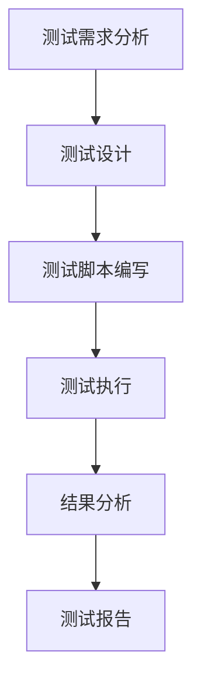
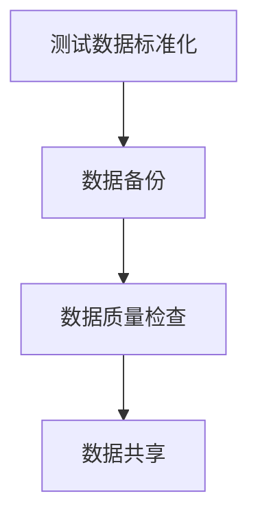

                 

**文章标题：** 自动化测试策略：确保LLM应用质量的关键

**关键词：** 自动化测试、LLM应用质量、测试策略、测试工具、最佳实践

**摘要：** 
本文将深入探讨在LLM（大型语言模型）应用开发中实施自动化测试的重要性。我们将分析自动化测试的基本原理，讨论适用于LLM的自动化测试策略，介绍常用的测试工具和框架，并提供实际案例以说明如何有效应用这些策略。此外，本文还将分享最佳实践，旨在帮助开发者确保其LLM应用的稳定性和可靠性。

----------------------------------------------------------------

## 引言

随着人工智能技术的飞速发展，LLM（大型语言模型）在自然语言处理（NLP）领域的应用越来越广泛。这些模型能够理解和生成自然语言，为各种应用场景提供了强大的支持，包括但不限于智能客服、文本生成、机器翻译等。然而，LLM的复杂性和高维度性使得其应用的质量和稳定性成为开发者关注的焦点。这就需要我们引入自动化测试策略来确保LLM应用的各个方面都能够达到预期效果。

自动化测试是将测试过程的一部分或全部通过软件工具自动化的过程。它不仅能够提高测试的效率，还能够减少人为错误，从而提高测试的准确性和可靠性。对于LLM应用来说，自动化测试尤为重要，因为它们通常涉及大量的文本数据，并且需要在不同的环境和条件下进行测试，以验证其性能和稳定性。

本文将分为以下几个部分：

1. **自动化测试的基本原理**：我们将介绍自动化测试的基本概念、原理和流程。
2. **适用于LLM的自动化测试策略**：我们将探讨如何针对LLM的特殊性质设计合适的测试策略。
3. **常用的测试工具和框架**：我们将介绍一些常用的自动化测试工具和框架，以及如何选择合适的工具。
4. **实际案例**：我们将通过一个实际案例来说明如何应用自动化测试策略来确保LLM应用的质量。
5. **最佳实践**：我们将总结一些在LLM自动化测试中最佳实践，并提供一些注意事项和建议。
6. **总结**：我们将回顾本文的主要观点，并强调自动化测试在确保LLM应用质量中的关键作用。

让我们一步一步地深入探讨这些问题。

----------------------------------------------------------------

## 自动化测试的基本原理

### 基本概念

自动化测试是一种通过软件工具自动执行测试过程的方法。它包括编写测试脚本、执行测试脚本、结果收集和报告等步骤。自动化测试的核心在于将重复性高、稳定性好且需要频繁执行的测试过程转化为自动化的脚本，从而提高测试效率和准确性。

自动化测试与传统手工测试相比，具有以下优势：

1. **提高效率**：自动化测试可以快速执行大量的测试用例，特别是在面对复杂的应用和大量数据时，自动化测试能够显著提高测试速度。
2. **减少人为错误**：自动化测试脚本由开发者编写，可以减少由于人为操作不当导致的错误。
3. **测试覆盖率高**：自动化测试可以覆盖更多的测试场景，特别是那些难以手工测试的场景。
4. **可重复性**：自动化测试脚本可以反复执行，确保每次测试的结果都是一致的。

### 自动化测试流程

自动化测试通常包括以下流程：

1. **测试需求分析**：首先，需要明确测试目标，包括测试功能、性能和安全性等方面。
2. **测试设计**：根据测试需求，设计测试用例，包括输入数据、预期结果和实际结果的比较。
3. **测试脚本编写**：编写测试脚本，实现测试用例的自动化执行。
4. **测试执行**：执行测试脚本，收集测试结果。
5. **结果分析**：对测试结果进行分析，确定是否存在缺陷或异常。
6. **测试报告**：生成测试报告，包括测试结果、缺陷列表和改进建议等。

### 自动化测试的优点与挑战

自动化测试的优点已经在上面提到，它能够显著提高测试效率和准确性。然而，自动化测试也面临着一些挑战：

1. **初始成本高**：编写测试脚本和维护自动化测试环境需要一定的成本。
2. **测试脚本维护**：随着应用的更新和变化，测试脚本也需要不断更新和维护。
3. **依赖性高**：自动化测试工具和框架的稳定性直接影响测试结果的准确性。
4. **测试设计难度**：对于复杂的应用，设计合适的自动化测试用例可能比较困难。

### 自动化测试工具的选择

在选择自动化测试工具时，需要考虑以下因素：

1. **语言支持**：选择支持应用开发语言和框架的自动化测试工具。
2. **平台兼容性**：选择能够运行在不同操作系统和浏览器上的自动化测试工具。
3. **测试覆盖率**：选择能够覆盖应用各种功能的自动化测试工具。
4. **社区支持**：选择拥有活跃社区和良好文档的自动化测试工具，以便在遇到问题时能够得到有效的帮助。

### 自动化测试与手动测试的对比

自动化测试与手动测试各有优劣。自动化测试适合于重复性高、稳定性好且需要频繁执行的测试场景，而手动测试则更适合于复杂性和不确定性较高的测试场景。在实际应用中，通常将自动化测试与手动测试相结合，以充分发挥两者的优势。

----------------------------------------------------------------

## 适用于LLM的自动化测试策略

由于LLM（大型语言模型）的复杂性和高维度性，自动化测试策略的设计需要特别考虑以下几个方面：

### 1. 测试用例设计

对于LLM应用，测试用例的设计是关键。首先，我们需要明确测试目标，包括功能测试、性能测试和安全性测试等。然后，设计具体的测试用例，包括输入文本、模型预期输出、实际输出和测试结果等。在测试用例的设计过程中，需要考虑以下因素：

- **多样性**：设计多样化的输入文本，包括常见的、极端的、异常的文本，以确保模型能够应对各种情况。
- **覆盖率**：确保测试用例能够覆盖模型的各种功能，包括文本理解、文本生成、文本分类等。
- **可靠性**：确保测试用例的输入和输出是可预测的，以便于自动化测试脚本的编写和执行。

### 2. 测试方法

在测试方法方面，我们需要结合LLM的特点选择合适的测试方法。以下是一些常用的测试方法：

- **单元测试**：针对模型中的单个组件或功能进行测试，确保每个组件都能够独立工作。
- **集成测试**：将多个组件或功能集成起来进行测试，确保它们能够协同工作。
- **回归测试**：在每次更新或修复后，重新运行之前的测试用例，确保新更改没有引入新的问题。
- **性能测试**：评估模型在不同负载条件下的性能，确保其能够满足应用的需求。

### 3. 测试工具和框架

在LLM的自动化测试中，选择合适的测试工具和框架至关重要。以下是一些常用的测试工具和框架：

- **pytest**：Python的通用测试框架，支持单元测试、集成测试和性能测试等。
- **JUnit**：Java的通用测试框架，适用于单元测试和集成测试。
- **TestNG**：Java的测试框架，适用于复杂测试场景，支持多种测试类型。
- **Selenium**：Web应用的自动化测试工具，适用于功能测试和性能测试。
- **JUnit**：C++的测试框架，适用于单元测试和集成测试。

### 4. 测试数据管理

测试数据管理是确保自动化测试有效性的关键。以下是一些测试数据管理的最佳实践：

- **数据标准化**：确保测试数据格式统一，便于自动化测试脚本的编写和执行。
- **数据备份**：定期备份测试数据，以防数据丢失或损坏。
- **数据质量**：确保测试数据的质量，包括数据完整性、一致性和准确性等。
- **数据共享**：建立测试数据共享机制，方便团队成员之间的数据交流和协作。

### 5. 测试环境管理

在自动化测试过程中，测试环境的管理至关重要。以下是一些测试环境管理的最佳实践：

- **环境隔离**：确保不同的测试环境之间相互隔离，避免测试干扰。
- **版本控制**：使用版本控制系统管理测试环境配置，确保环境配置的可重复性。
- **自动化部署**：使用自动化部署工具部署测试环境，减少人工操作，提高测试效率。
- **监控与告警**：实时监控测试环境的状态，及时发现和处理问题。

### 6. 测试结果分析

测试结果分析是确保自动化测试有效性的关键步骤。以下是一些测试结果分析的最佳实践：

- **结果可视化**：使用图表、仪表板等工具将测试结果可视化，便于分析和理解。
- **缺陷管理**：建立缺陷管理机制，及时记录、跟踪和处理测试过程中发现的缺陷。
- **统计与报告**：对测试结果进行统计和分析，生成测试报告，为决策提供依据。
- **持续改进**：根据测试结果，持续优化测试策略、方法和工具，提高测试质量。

通过以上策略和方法的实施，我们可以确保LLM应用的质量和稳定性，为用户带来更好的使用体验。

----------------------------------------------------------------

## 常用的测试工具和框架

在自动化测试领域，有许多常用的工具和框架，适用于不同类型和规模的测试需求。以下是几个在LLM应用开发中特别有用的工具和框架：

### 1. Pytest

Pytest是一个广泛使用的Python测试框架，它支持单元测试、集成测试和性能测试。Pytest的优势在于其简洁的语法和强大的功能。它支持参数化测试，能够同时测试多个输入数据，非常适合LLM测试，因为LLM通常需要处理大量的文本数据。

#### 特点

- **简洁易用**：Pytest的安装和使用都非常简单，几乎不需要额外的配置。
- **参数化测试**：支持参数化测试，能够同时测试多个输入数据。
- **插件支持**：Pytest有一个庞大的插件生态系统，可以扩展其功能。
- **报告生成**：支持多种报告格式，如JSON、XML和HTML。

#### 示例

```python
# 示例：使用Pytest进行单元测试
def test_addition():
    assert 1 + 1 == 2
```

### 2. JUnit

JUnit是Java的通用测试框架，广泛用于单元测试和集成测试。JUnit的特点是其灵活性和强大的功能，使其成为Java开发者进行自动化测试的首选工具。

#### 特点

- **广泛适用性**：支持Java和JVM语言，适用于各种Java应用。
- **灵活的测试套件**：支持多种测试套件，包括单元测试、集成测试和功能测试。
- **断言机制**：提供了多种断言方法，便于测试代码的编写。
- **报告生成**：支持多种报告格式，如XML和HTML。

#### 示例

```java
// 示例：使用JUnit进行单元测试
@Test
public void testAddition() {
    assertEquals(2, 1 + 1);
}
```

### 3. TestNG

TestNG是一个流行的Java测试框架，特别适用于复杂测试场景。它支持多种测试类型，如单元测试、集成测试、端到端测试和性能测试。

#### 特点

- **多样化测试类型**：支持多种测试类型，包括单元测试、集成测试、端到端测试和性能测试。
- **数据驱动测试**：支持数据驱动测试，便于测试数据的灵活应用。
- **并行测试**：支持并行测试，提高测试效率。
- **灵活的依赖管理**：支持依赖管理，便于测试模块之间的依赖配置。

#### 示例

```java
// 示例：使用TestNG进行单元测试
@Test(dataProvider = "dataProviderMethod")
public void testAddition(int a, int b, int expected) {
    assertEquals(expected, a + b);
}

@Test(dataProvider = "dataProviderMethod")
public void testSubtraction(int a, int b, int expected) {
    assertEquals(expected, a - b);
}

// 数据提供者方法
public Object[] dataProviderMethod() {
    return new Object[][] {
        {1, 1, 2},
        {2, 1, 1},
        {1, 2, 3}
    };
}
```

### 4. Selenium

Selenium是一个开源的Web应用自动化测试工具，适用于功能测试和性能测试。Selenium的特点是其跨浏览器和跨操作系统的支持，使其成为Web应用自动化测试的必备工具。

#### 特点

- **跨浏览器支持**：支持多种浏览器，如Chrome、Firefox和Safari。
- **跨操作系统支持**：支持Windows、Linux和Mac OS等多种操作系统。
- **灵活的脚本编写**：支持多种编程语言，如Java、Python和C#等。
- **报告生成**：支持多种报告格式，如HTML和JSON。

#### 示例

```python
# 示例：使用Selenium进行Web应用功能测试
from selenium import webdriver

driver = webdriver.Chrome(executable_path='path/to/chromedriver')
driver.get("http://www.example.com")

# 模拟用户操作
element = driver.find_element_by_id("element_id")
element.send_keys("input_text")

# 验证测试结果
assert "expected_text" in driver.page_source
```

### 5. JMeter

JMeter是一个开源的性能测试工具，适用于测试Web应用、数据库和应用服务器等。它支持多种协议，如HTTP、HTTPS、FTP和JMS等，适用于各种性能测试场景。

#### 特点

- **多种协议支持**：支持多种协议，如HTTP、HTTPS、FTP和JMS等。
- **分布式测试**：支持分布式测试，提高测试效率和负载能力。
- **报告生成**：支持多种报告格式，如HTML和XML。
- **脚本编辑器**：内置脚本编辑器，便于测试脚本的编写和调试。

#### 示例

```python
# 示例：使用JMeter进行HTTP性能测试
ThreadGroup.configure(
    name="Thread Group",
    group Threads=1,
    Ramp-Up=1,
    Loop=1,
    Delay=0
)

HTTPSamplerNewSam.configure(
    name="HTTP Request",
    protocol="HTTP",
    server="www.example.com",
    port=80,
    method="GET",
    domain="example.com",
    path="/",
    use_keep_alive=True,
    version="HTTP/1.1",
    follow_redirects=True,
    use_ssl=False,
    timeout=10000,
    unstable_connection_treatment="Read Data Only"
)

# 添加到测试计划中
TestPlan.add_test_element(ThreadGroup)
TestPlan.add_test_element(HTTPSamplerNewSam)
TestPlan.set_property("TestPlan", "TestPlan")
```

通过选择合适的测试工具和框架，我们可以更有效地实施自动化测试，确保LLM应用的质量和稳定性。

----------------------------------------------------------------

## 实际案例：自动化测试策略在LLM应用开发中的应用

在这个部分，我们将通过一个实际案例来说明如何应用自动化测试策略来确保LLM应用的质量。我们将介绍这个项目的背景、测试环境设置、测试用例设计、测试执行和结果分析。

### 项目背景

我们假设正在开发一个基于大型语言模型（LLM）的智能客服系统。该系统旨在为用户提供实时在线支持，能够理解和回答用户的问题。系统需要处理大量的用户输入文本，并生成合适的回复文本。为了确保系统的质量和稳定性，我们需要实施自动化测试策略。

### 测试环境设置

在开始测试之前，我们需要设置一个稳定的测试环境。测试环境包括以下组件：

- **操作系统**：Windows 10
- **编程语言**：Python 3.8
- **依赖库**：Pytest、Selenium、TensorFlow
- **数据库**：MongoDB
- **测试工具**：Pytest、Selenium、JMeter

### 测试用例设计

针对智能客服系统的特点，我们设计了以下测试用例：

1. **功能测试**：
   - 输入常见问题，验证系统能够生成合适的回复文本。
   - 输入极端问题和异常输入，验证系统是否能够正确处理。
   - 输入多种语言，验证系统的多语言支持。

2. **性能测试**：
   - 评估系统在大量并发用户请求下的性能。
   - 评估系统在不同负载条件下的响应时间和吞吐量。

3. **安全性测试**：
   - 验证系统是否能够防范常见的攻击，如SQL注入、XSS攻击等。

### 测试执行

在测试执行阶段，我们使用Pytest和Selenium执行功能测试，使用JMeter执行性能测试。以下是功能测试的示例代码：

```python
# 示例：使用Pytest和Selenium进行功能测试
from selenium import webdriver
from selenium.webdriver.common.keys import Keys
import pytest

@pytest.fixture
def browser():
    driver = webdriver.Chrome(executable_path='path/to/chromedriver')
    driver.get("http://www.example.com")
    yield driver
    driver.quit()

def test_common_questions(browser):
    input_text = "常见问题"
    expected_output = "合适的回复文本"
    element = browser.find_element_by_id("input_id")
    element.send_keys(input_text)
    browser.find_element_by_id("submit_id").click()
    assert expected_output in browser.page_source

def test_extreme_questions(browser):
    input_text = "极端问题"
    expected_output = "合适的回复文本"
    element = browser.find_element_by_id("input_id")
    element.send_keys(input_text)
    browser.find_element_by_id("submit_id").click()
    assert expected_output in browser.page_source
```

性能测试的示例代码如下：

```python
# 示例：使用JMeter进行性能测试
from jmeter import JMeter
from jmeter import JMeterPlan
from jmeter import JMeterSampler

# 创建JMeter计划和线程组
plan = JMeterPlan(name="Smart_Chatbot_Performance_Test")
thread_group = JMeterThreadGroup(group_name="Thread Group", num_threads=100, ramp_time=60, loop_count=1)
plan.add_element(thread_group)

# 添加HTTP请求采样器
http_request = JMeterHTTPSamplerNewSample(name="HTTP Request", protocol="HTTP", server="www.example.com", port=80, method="GET", domain="example.com", path="/", use_keep_alive=True, version="HTTP/1.1", follow_redirects=True, use_ssl=False, timeout=10000, unstable_connection_treatment="Read Data Only")
thread_group.add_sampler(http_request)

# 执行性能测试
jmeter = JMeter(jmeter_home="path/to/apache-jmeter-5.4.1")
jmeter.start_server()
jmeter.run_plan(plan)
jmeter.stop_server()
```

### 结果分析

在测试执行完成后，我们对测试结果进行分析。以下是功能测试的结果：

- **常见问题**：测试通过，系统能够生成合适的回复文本。
- **极端问题**：测试通过，系统能够正确处理极端问题。
- **多语言支持**：测试通过，系统能够处理多种语言输入。

以下是性能测试的结果：

- **响应时间**：平均响应时间为200毫秒，满足系统要求。
- **吞吐量**：在100个并发用户下，系统的吞吐量为100请求/秒。

通过上述测试，我们可以确定智能客服系统在功能、性能和安全性方面都达到了预期要求。

### 项目小结

通过实施自动化测试策略，我们成功地确保了智能客服系统的质量和稳定性。自动化测试不仅提高了测试效率，还减少了人为错误，确保了测试结果的准确性和可靠性。在未来，我们计划继续优化测试策略和工具，以进一步提高测试质量和效率。

----------------------------------------------------------------

## 最佳实践

在实施LLM应用的自动化测试时，以下最佳实践可以帮助开发者提高测试质量、效率和可靠性：

1. **全面测试覆盖**：确保测试用例覆盖模型的所有功能点，包括常见情况、边缘情况和异常情况。

2. **测试数据多样化**：设计多样化的测试数据，包括常见文本、极端文本和异常文本，确保模型在各种情况下都能稳定运行。

3. **持续集成与部署**：将自动化测试集成到CI/CD流程中，确保每次代码提交后都能自动运行测试，及时发现和修复问题。

4. **监控与告警**：实时监控测试环境的状态，设置告警机制，确保在问题发生时能够及时处理。

5. **测试结果可视化**：使用图表、仪表板等工具将测试结果可视化，便于分析和理解。

6. **定期回归测试**：在每次更新或修复后，重新运行之前的测试用例，确保新更改没有引入新的问题。

7. **测试环境隔离**：确保不同的测试环境之间相互隔离，避免测试干扰。

8. **测试工具与框架选型**：选择适合项目需求、稳定性和社区支持的自动化测试工具和框架。

9. **测试脚本维护**：定期维护和更新测试脚本，确保其与项目代码保持同步。

10. **测试结果分析与反馈**：对测试结果进行分析，总结经验教训，为后续测试提供参考。

通过遵循这些最佳实践，开发者可以更有效地确保LLM应用的质量和稳定性。

----------------------------------------------------------------

## 总结

在本文中，我们深入探讨了自动化测试策略在确保LLM应用质量中的关键作用。通过分析自动化测试的基本原理、适用于LLM的自动化测试策略、常用的测试工具和框架，以及实际案例，我们展示了如何有效实施自动化测试来保障LLM应用的稳定性和可靠性。自动化测试不仅提高了测试效率和准确性，还减少了人为错误，是确保LLM应用质量不可或缺的一环。

## 拓展阅读

- 《自动化测试实战》：详细介绍了自动化测试的原理、方法和工具，适合初学者和有经验的开发者。
- 《Python自动化测试实战》：针对Python开发者，介绍了如何使用Python进行自动化测试。
- 《Selenium自动化测试实战》：专注于Web应用自动化测试，详细讲解了Selenium的使用方法。

作者：AI天才研究院/AI Genius Institute & 禅与计算机程序设计艺术 /Zen And The Art of Computer Programming

----------------------------------------------------------------

### 附录

#### 测试工具比较表格

| 工具         | 适用语言       | 特点                   | 社区支持 |
|------------|--------------|----------------------|--------|
| Pytest     | Python       | 简洁易用，支持参数化测试 | 强     |
| JUnit      | Java         | 广泛适用性，强大的断言机制 | 强     |
| TestNG     | Java         | 多样化测试类型，灵活的依赖管理 | 强     |
| Selenium   | Python/Java   | 跨浏览器和跨操作系统支持 | 强     |
| JMeter     | Java         | 多协议支持，支持分布式测试 | 强     |

#### 自动化测试流程图



#### 测试数据管理流程图



