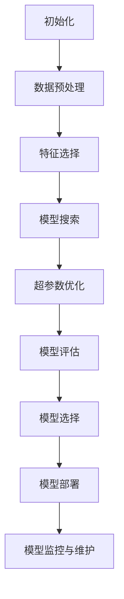
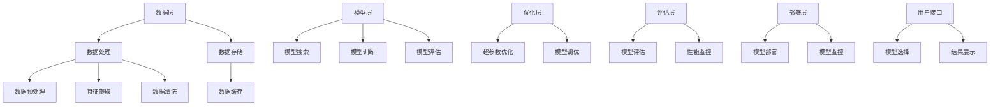
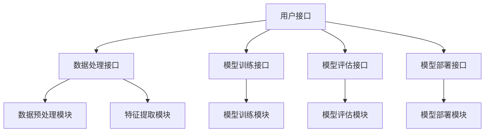
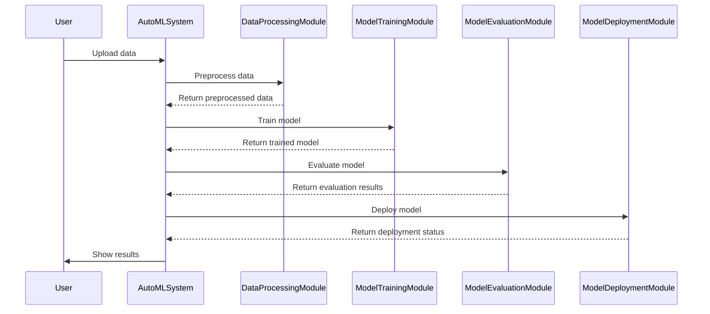

                 

### 自动机器学习（AutoML）概述

自动机器学习（AutoML）是近年来机器学习领域的重要研究方向，它致力于通过自动化手段优化机器学习流程，从而提高模型的性能和开发效率。AutoML的核心目标是实现一个自动化的过程，从数据预处理、特征选择、模型训练、参数调优到模型评估，无需人工干预即可完成。

**概念与背景**

在传统的机器学习项目中，模型开发和优化往往是一个繁琐且耗时的过程。研究人员需要花费大量时间进行数据清洗、特征工程和模型选择等步骤。随着数据量的增加和复杂性的提升，这一过程变得更加困难。自动机器学习则通过自动化这些步骤，帮助研究人员快速找到最优模型。

**核心组件**

自动机器学习系统通常由以下几个核心组件组成：

1. **数据预处理**：自动处理数据清洗、归一化、缺失值填补等步骤。
2. **特征选择**：自动识别并选择对模型性能有显著影响的关键特征。
3. **模型搜索**：通过算法自动搜索合适的模型结构。
4. **超参数优化**：自动调整模型的超参数以最大化性能指标。
5. **模型评估**：自动评估模型的性能，选择最优模型。

**发展历程**

自动机器学习的发展可以追溯到上世纪90年代，随着机器学习技术的进步和计算能力的提升，AutoML逐渐成为可能。近年来，随着深度学习和大数据技术的兴起，AutoML的研究和应用得到了迅速发展。代表性的AutoML系统如Google的AutoML、H2O.ai的AutoML等，都在各自领域取得了显著的成果。

**核心要素组成**

自动机器学习的核心要素主要包括：

- **算法库**：包含多种机器学习算法和模型结构。
- **优化算法**：用于搜索最优模型和超参数的组合。
- **评估指标**：用于衡量模型性能的指标，如准确率、召回率、F1分数等。
- **自动化工具**：用于自动化执行机器学习流程的软件和框架。

**问题背景**

在传统的机器学习项目中，研究人员通常需要花费大量时间进行模型选择和超参数优化。这不仅效率低下，而且容易出现人为错误。随着数据量和模型复杂性的增加，这一问题变得更加严重。自动机器学习通过自动化这些步骤，不仅提高了开发效率，还显著降低了错误率。

**问题描述**

自动机器学习旨在解决以下问题：

- **效率低下**：传统的机器学习流程需要大量的人工干预，导致开发效率低下。
- **人为错误**：模型选择和超参数优化过程中，人为错误可能导致模型性能不佳。
- **模型选择困难**：随着算法和模型的多样化，选择最优模型变得更加困难。
- **可解释性差**：许多自动化的模型搜索方法缺乏可解释性，研究人员难以理解模型的决策过程。

**问题解决**

自动机器学习通过以下方式解决上述问题：

- **自动化流程**：自动化数据预处理、特征选择、模型训练和评估，减少人工干预。
- **高效搜索算法**：使用高效的搜索算法，快速找到最优模型和超参数组合。
- **可解释性提升**：通过可视化工具和解释性算法，提高模型的透明度和可解释性。

**边界与外延**

自动机器学习不仅局限于学术研究，在工业界也有广泛的应用。例如，金融领域的风险评估、医疗领域的疾病预测、零售领域的客户行为分析等，都可以通过自动机器学习技术得到优化。

总的来说，自动机器学习通过自动化机器学习流程，提高了模型的开发效率和性能，是当前和未来机器学习研究的重要方向。

### 大型语言模型（LLM）简介

大型语言模型（Large Language Model，简称LLM）是自然语言处理（Natural Language Processing，简称NLP）领域的一项重要技术。它通过深度学习模型对大量文本数据进行训练，使其能够理解和生成自然语言，广泛应用于语音识别、机器翻译、文本生成、问答系统等多个领域。以下是关于LLM的基本概念、工作原理和应用场景的详细介绍。

**基本概念**

1. **什么是LLM**

   大型语言模型是一种基于神经网络的自然语言处理模型，它通过对海量文本数据的学习，可以理解并生成自然语言。与传统的基于规则的方法相比，LLM具有更强的灵活性和适应性。

2. **LLM的组成部分**

   - **嵌入层**：将单词、句子等文本元素转换为向量表示。
   - **编码器**：将输入文本编码为固定长度的向量。
   - **解码器**：根据编码后的向量生成文本输出。
   - **注意力机制**：在模型处理长序列数据时，帮助模型关注关键信息。

**工作原理**

1. **预训练与微调**

   - **预训练**：使用大规模文本数据对模型进行预训练，使其具备语言理解和生成能力。
   - **微调**：在特定任务上，使用少量标注数据进行模型微调，以适应具体任务的需求。

2. **计算过程**

   - **输入处理**：输入文本经过嵌入层转换为向量表示。
   - **编码与解码**：编码器对输入文本进行编码，解码器根据编码结果生成文本输出。
   - **预测与生成**：通过循环神经网络（RNN）或Transformer模型，对生成的内容进行预测，并逐步生成完整的输出。

**应用场景**

1. **文本生成**

   - **文章撰写**：自动撰写新闻报道、博客文章等。
   - **内容生成**：生成广告文案、营销内容、产品描述等。

2. **语音识别**

   - **语音转文本**：将语音信号转换为文本。
   - **语音命令识别**：识别用户的语音命令，如智能家居控制。

3. **机器翻译**

   - **跨语言翻译**：将一种语言的文本翻译成另一种语言。
   - **多语言转换**：在同一文本中实现多种语言的翻译。

4. **问答系统**

   - **智能客服**：自动回答用户的常见问题。
   - **教育辅导**：为学生提供在线辅导和答疑。

5. **信息检索**

   - **搜索引擎**：根据用户查询，返回相关的搜索结果。
   - **文本摘要**：从大量文本中提取关键信息，生成摘要。

通过上述对大型语言模型的基本概念、工作原理和应用场景的介绍，我们可以看到LLM在自然语言处理领域的重要性和广泛应用。随着技术的不断进步，LLM将在更多领域发挥重要作用，推动人工智能的发展。

### 自动机器学习与大型语言模型的关系

自动机器学习（AutoML）和大型语言模型（LLM）是机器学习领域中的两个重要概念，它们之间有着紧密的联系和相互作用。了解这两者之间的关系，对于优化模型选择过程和提高模型性能具有重要意义。

**自动机器学习在LLM中的应用**

自动机器学习在大型语言模型中的应用主要体现在以下几个方面：

1. **模型选择**：在LLM的训练过程中，自动机器学习可以帮助研究人员自动选择最适合的模型结构。传统方法中，研究人员需要手动尝试多种模型并进行比较，这不仅耗时，而且容易出现人为错误。自动机器学习通过自动搜索和评估不同模型，能够快速找到性能最优的模型。

2. **超参数优化**：超参数是模型性能的关键因素，但通常需要通过大量的实验和调整才能找到最优值。自动机器学习算法如贝叶斯优化、遗传算法等，可以通过自动搜索和调整超参数，提高模型性能。

3. **特征工程**：特征工程是机器学习中的重要环节，它涉及到如何从原始数据中提取有效的特征。自动机器学习可以通过自动特征选择和特征转换，简化特征工程过程，提高模型性能。

**自动机器学习对LLM的优化与改进**

自动机器学习对大型语言模型的优化与改进主要体现在以下几个方面：

1. **提高开发效率**：自动机器学习通过自动化流程，显著减少了模型开发和优化所需的时间。研究人员可以将更多时间投入到模型创新和算法改进上，而不是繁琐的实验和调试。

2. **降低错误率**：传统方法中，人为错误是影响模型性能的重要因素。自动机器学习通过自动化步骤和高效的算法，减少了人为干预，从而降低了错误率。

3. **提高模型性能**：自动机器学习可以通过超参数优化和模型选择，找到性能最优的模型和参数组合，从而提高模型的准确性和鲁棒性。

**自动机器学习在LLM中的挑战**

尽管自动机器学习为大型语言模型提供了许多优化和改进的方法，但其在实际应用中仍然面临一些挑战：

1. **计算资源需求**：自动机器学习算法通常需要大量的计算资源，尤其是在处理大规模数据集和复杂模型时。这对硬件设施和资源分配提出了更高的要求。

2. **可解释性**：自动机器学习算法的黑箱特性使其在模型解释方面存在困难。研究人员难以理解模型的具体决策过程，这可能会影响模型的接受度和应用。

3. **数据依赖性**：自动机器学习算法的性能高度依赖于训练数据的质量和数量。如果数据存在偏差或不平衡，自动机器学习算法可能无法找到最优模型。

4. **算法复杂度**：自动机器学习算法通常涉及复杂的优化和搜索过程，这可能导致算法的复杂度增加，影响模型的训练和部署效率。

综上所述，自动机器学习在大型语言模型中的应用为模型选择和优化提供了有效的方法，但同时也面临一些挑战。通过不断研究和改进自动机器学习算法，我们有望进一步提升大型语言模型的应用效果和性能。

### 模型选择的基本原则

在进行模型选择时，遵循一系列基本原则至关重要，以确保所选模型能够满足具体任务的需求，并实现最佳性能。以下是模型选择的基本原则：

**1. 性能评估标准**

选择模型时，首先要明确评估标准。常见的评估指标包括准确率（Accuracy）、召回率（Recall）、精确率（Precision）、F1分数（F1 Score）等。不同任务和场景下，这些指标的重要性可能不同。例如，在分类任务中，准确率通常是最重要的指标，但在医疗诊断中，召回率可能更为关键。

**2. 数据集和标签质量**

模型性能很大程度上取决于数据集和标签的质量。确保数据集的多样性和代表性，避免过度拟合。此外，标签应准确可靠，否则可能会导致模型性能不佳。

**3. 计算资源和时间**

选择模型时，还需考虑计算资源和时间限制。某些复杂的模型可能需要大量的计算资源和时间进行训练和评估，而资源有限的情况下，选择一个轻量级、高效的模型可能更为合适。

**4. 模型适用性**

根据具体任务和数据特点，选择合适的模型。例如，对于小数据集，传统机器学习算法可能更为适用；对于大规模数据集，深度学习模型可能表现更好。此外，考虑任务的特点，如是否需要实时响应、是否需要高可解释性等，选择相应的模型。

**5. 超参数调整**

超参数是影响模型性能的关键因素。在模型选择过程中，应进行适当的超参数调整，以找到最优模型。常用的超参数调整方法包括网格搜索（Grid Search）和贝叶斯优化（Bayesian Optimization）。

**6. 模型集成**

模型集成（Model Ensembling）是一种常用的方法，通过结合多个模型的预测结果，提高整体性能。常见的方法包括 bagging、boosting 和 stacking 等。

**7. 实际应用场景**

最后，考虑模型在实际应用场景中的表现。模型在实际应用中可能面临各种不确定性，如数据分布变化、异常值处理等。选择能够适应这些场景的模型，可以提高模型的稳定性和鲁棒性。

遵循上述基本原则，结合具体任务和数据特点，选择合适的模型，是优化模型性能和开发高效机器学习应用的关键。

### 模型选择的方法与工具

在机器学习项目中，选择合适的模型是实现高效性能和准确预测的关键步骤。随着机器学习领域的不断发展，出现了多种模型选择方法和工具，可以帮助我们快速、准确地找到最优模型。以下是几种常见的模型选择方法与工具。

**1. 手动模型选择**

手动模型选择是最传统的方法，研究人员通过实验和比较不同模型的性能，选择最优模型。这种方法虽然灵活，但需要大量时间和精力，且容易受到主观因素的影响。

**2. 模型评估指标**

模型评估指标是衡量模型性能的重要工具。常用的评估指标包括准确率（Accuracy）、召回率（Recall）、精确率（Precision）、F1分数（F1 Score）等。通过计算这些指标，我们可以对不同模型进行评估和比较。

**3. 网格搜索（Grid Search）**

网格搜索是一种常用的超参数优化方法。它通过遍历预定义的参数网格，找到最优参数组合。虽然网格搜索简单直观，但当参数空间较大时，计算成本非常高。

**4. 贝叶斯优化（Bayesian Optimization）**

贝叶斯优化是一种基于概率模型的超参数优化方法。它通过学习历史实验结果，逐步优化超参数，提高模型性能。贝叶斯优化在处理高维参数空间时表现出色，但实现相对复杂。

**5. Random Search**

Random Search 是一种随机搜索超参数的方法。它从参数空间中随机选择参数组合，进行模型评估，无需遍历整个参数空间，计算成本较低。但随机性可能导致搜索效率不高。

**6. 模型集成（Ensemble）**

模型集成是将多个模型的预测结果进行融合，以提高整体性能。常见的方法包括 bagging、boosting 和 stacking 等。模型集成通过结合多个模型的优点，可以显著提高预测性能。

**7. 自动机器学习（AutoML）**

自动机器学习（AutoML）是一种通过自动化流程选择最优模型的工具。AutoML 系统包含多种算法和优化方法，可以自动进行数据预处理、特征选择、模型训练和超参数优化。AutoML 简化了模型选择过程，提高了开发效率，但计算资源需求较高。

**8. OpenML**

OpenML 是一个开源的机器学习平台，提供多种模型选择工具和方法。OpenML 通过自动化实验和评估，帮助研究人员快速找到最优模型。它支持多种数据源和评估指标，可以轻松扩展和定制。

**9. Hyperopt**

Hyperopt 是一个开源的超参数优化库，支持多种优化算法，包括随机搜索、网格搜索和贝叶斯优化等。Hyperopt 提供了灵活的接口和丰富的功能，可以轻松集成到现有的机器学习项目中。

**10. Hyperopt-sklearn**

Hyperopt-sklearn 是 Hyperopt 的一个扩展库，专门用于机器学习模型的超参数优化。它支持 scikit-learn 中的多种模型，提供了丰富的优化方法和评估指标。

通过上述模型选择方法与工具，研究人员可以根据具体任务和数据特点，选择合适的模型，实现高效和准确的机器学习应用。

### 模型选择中的注意事项

在模型选择过程中，除了遵循基本原则和方法，还有一些重要的注意事项需要关注，以确保所选模型能够满足任务需求并达到最佳性能。

**1. 数据质量**

模型性能很大程度上依赖于数据的质量。数据应具备多样性和代表性，避免过度拟合和偏差。此外，确保数据是干净和准确的，避免包含噪音和错误数据，这会直接影响模型的性能。

**2. 特征选择**

特征选择是模型选择过程中的关键步骤。选择对模型性能有显著影响的关键特征，可以有效提高模型的性能。避免选择无关或冗余的特征，这可能会导致过拟合。

**3. 参数调优**

超参数对模型性能有重要影响，但调优过程可能需要大量的时间和计算资源。建议使用交叉验证等方法进行参数调优，以避免过拟合和欠拟合。

**4. 模型评估**

在模型选择过程中，应使用多种评估指标和验证方法，如交叉验证、时间序列测试等，以确保模型在不同场景下均有良好的性能。

**5. 模型泛化能力**

选择模型时，需考虑其泛化能力。模型应在训练集和测试集上均有良好的性能，避免在训练集上过度拟合。

**6. 模型可解释性**

在某些应用场景中，模型的可解释性至关重要。选择具有较高可解释性的模型，可以帮助我们理解模型的决策过程，提高用户信任度。

**7. 实际应用场景**

选择模型时，要考虑实际应用场景的需求，如实时响应能力、处理速度、资源消耗等。根据具体场景选择合适的模型，可以更好地满足应用需求。

**8. 维护和更新**

模型选择后，还需进行定期维护和更新，以适应数据分布的变化和新需求。定期重新评估模型性能，确保其持续满足任务要求。

综上所述，在模型选择过程中，关注数据质量、特征选择、参数调优、模型评估、泛化能力、可解释性、实际应用场景和维护更新等方面，可以确保所选模型满足任务需求，并实现最佳性能。

### 自动机器学习算法的基本原理

自动机器学习（AutoML）通过自动化流程优化机器学习模型的开发，从而提高开发效率和模型性能。其基本原理包括算法搜索、超参数优化、模型评估和模型选择等步骤。

**算法搜索**

算法搜索是AutoML的核心步骤，目的是在众多机器学习算法中找到最适合当前问题的算法。算法搜索通常采用以下几种策略：

1. **网格搜索（Grid Search）**：通过遍历预定义的参数组合，找到最优参数组合。这种方法简单直观，但计算成本较高，尤其当参数空间较大时。
2. **随机搜索（Random Search）**：在参数空间中随机选择参数组合进行评估，避免遍历整个参数空间。这种方法计算成本较低，但搜索效率可能不如网格搜索。
3. **贝叶斯优化（Bayesian Optimization）**：基于贝叶斯统计模型，通过历史评估结果优化搜索策略，提高搜索效率。贝叶斯优化在处理高维参数空间时表现出色。

**超参数优化**

超参数优化是AutoML中的另一个关键步骤，目的是找到最优超参数组合，以最大化模型性能。超参数包括学习率、正则化参数、层大小等，其设置对模型性能有重要影响。

1. **梯度提升（Gradient Boosting）**：梯度提升是一种常用的超参数优化方法，通过迭代地优化模型，提高模型性能。常用的梯度提升算法包括 XGBoost、LightGBM 和 CatBoost。
2. **随机搜索（Random Search）**：随机搜索通过在参数空间中随机选择超参数组合，评估并优化模型性能。
3. **贝叶斯优化（Bayesian Optimization）**：贝叶斯优化通过学习历史评估结果，优化超参数搜索策略，提高搜索效率。

**模型评估**

模型评估是AutoML中的关键步骤，目的是评估模型在不同数据集上的性能，以选择最优模型。常用的评估方法包括交叉验证、时间序列测试和留出法等。

1. **交叉验证（Cross-Validation）**：交叉验证通过将数据集划分为多个子集，轮流使用子集作为验证集，评估模型性能。常用的交叉验证方法有 K折交叉验证和留一法交叉验证。
2. **时间序列测试（Time Series Test）**：时间序列测试通过使用时间序列数据，评估模型对未来数据的预测能力。
3. **留出法（Holdout Method）**：留出法将数据集划分为训练集和验证集，使用训练集训练模型，验证集评估模型性能。

**模型选择**

模型选择是AutoML的最终步骤，目的是从多个评估模型中选择最优模型。模型选择通常采用以下几种策略：

1. **基于性能的选择（Performance-based Selection）**：根据评估指标，选择性能最优的模型。
2. **基于稳定性的选择（Stability-based Selection）**：考虑模型在不同数据集上的性能稳定性，选择性能较为稳定的模型。
3. **基于成本的选择（Cost-based Selection）**：考虑模型训练和部署的成本，选择成本较低的模型。

通过上述算法搜索、超参数优化、模型评估和模型选择，自动机器学习可以自动化机器学习模型的开发，提高开发效率和模型性能。

### 算法流程图

为了更直观地理解自动机器学习（AutoML）算法的基本原理，我们使用Mermaid语言绘制了算法流程图。以下是一个简化的算法流程图，展示了AutoML的主要步骤和它们之间的逻辑关系：



以下是每个步骤的详细描述：

1. **初始化**：设置算法的初始参数，如训练数据集、验证数据集、评估指标等。
2. **数据预处理**：对原始数据进行清洗、归一化、缺失值填补等操作，以准备用于模型训练的数据。
3. **特征选择**：通过特征选择算法，从原始数据中提取对模型性能有显著影响的关键特征。
4. **模型搜索**：采用搜索算法（如网格搜索、随机搜索、贝叶斯优化等），在多个预定义的模型结构中找到最优模型。
5. **超参数优化**：通过优化算法（如梯度提升、随机搜索、贝叶斯优化等），调整模型超参数，以最大化模型性能。
6. **模型评估**：使用评估指标（如准确率、召回率、F1分数等），评估模型的性能，选择最优模型。
7. **模型选择**：从多个评估模型中选择性能最优的模型，准备进行部署。
8. **模型部署**：将最优模型部署到实际应用环境中，如生产环境或在线服务。
9. **模型监控与维护**：监控模型的性能，定期进行模型更新和维护，确保其持续满足应用需求。

通过上述算法流程图，我们可以清晰地看到自动机器学习的主要步骤及其相互关系，有助于更好地理解AutoML的工作原理。

### Python源代码解读

在自动机器学习（AutoML）中，Python是应用最广泛的编程语言之一，其丰富的库和框架使得实现AutoML算法变得更加简便。以下是一个简化的Python代码示例，展示了如何使用Scikit-Learn库进行自动机器学习。

```python
# 导入必要的库
from sklearn.datasets import load_iris
from sklearn.model_selection import train_test_split
from sklearn.ensemble import RandomForestClassifier
from sklearn.metrics import accuracy_score
from sklearn.model_selection import GridSearchCV

# 加载鸢尾花（Iris）数据集
iris = load_iris()
X = iris.data
y = iris.target

# 划分训练集和测试集
X_train, X_test, y_train, y_test = train_test_split(X, y, test_size=0.2, random_state=42)

# 定义随机森林分类器
rf = RandomForestClassifier()

# 设置超参数搜索空间
param_grid = {
    'n_estimators': [100, 200, 300],
    'max_depth': [10, 20, 30],
    'min_samples_split': [2, 5, 10]
}

# 使用网格搜索进行超参数优化
grid_search = GridSearchCV(estimator=rf, param_grid=param_grid, cv=5)
grid_search.fit(X_train, y_train)

# 获取最优参数和模型
best_params = grid_search.best_params_
best_model = grid_search.best_estimator_

# 在测试集上评估模型性能
y_pred = best_model.predict(X_test)
accuracy = accuracy_score(y_test, y_pred)
print(f"Model accuracy: {accuracy:.2f}")

# 输出最优参数
print(f"Best parameters: {best_params}")
```

**代码解读**

1. **库导入**：首先，导入必要的库，包括Scikit-Learn的数据集加载器、模型选择器、评估指标等。

2. **数据加载**：使用`load_iris()`函数加载鸢尾花数据集，这是一个经典的分类问题数据集。

3. **数据划分**：使用`train_test_split()`函数将数据集划分为训练集和测试集，比例为80%训练集和20%测试集。

4. **模型定义**：定义一个随机森林分类器`RandomForestClassifier()`。

5. **超参数搜索空间**：设置超参数搜索空间`param_grid`，包括`n_estimators`（树的数量）、`max_depth`（树的最大深度）和`min_samples_split`（每次分割所需的最小样本数）。

6. **网格搜索**：使用`GridSearchCV()`进行网格搜索，遍历预定义的超参数组合，找到最佳参数组合。

7. **模型训练**：使用最优参数训练模型。

8. **模型评估**：在测试集上评估模型性能，计算准确率。

9. **输出结果**：输出模型准确率和最优参数。

通过上述Python代码示例，我们可以看到自动机器学习的基本流程，包括数据预处理、模型选择、超参数优化和模型评估等步骤。在实际应用中，可以根据具体问题和需求调整代码，实现更复杂的自动机器学习流程。

### 算法原理的数学模型和公式讲解

自动机器学习（AutoML）的算法原理基于多个数学模型和优化技术。以下是对这些模型和公式的详细讲解，以及如何将其应用于实际问题中。

**1. 优化目标函数**

自动机器学习的核心目标是通过优化算法找到最优模型，从而最大化模型的性能指标。优化目标函数通常可以表示为：

$$
\min_{\theta} L(\theta) = \sum_{i=1}^{N} L(y_i, \hat{y}_i; \theta)
$$

其中，$L(\theta)$ 是目标函数，$N$ 是样本数量，$L(y_i, \hat{y}_i; \theta)$ 是损失函数，$\theta$ 是模型参数。常见的损失函数包括均方误差（MSE）和交叉熵（Cross-Entropy）。

- **均方误差（MSE）**：

$$
MSE = \frac{1}{N} \sum_{i=1}^{N} (\hat{y}_i - y_i)^2
$$

- **交叉熵（Cross-Entropy）**：

$$
Cross-Entropy = -\sum_{i=1}^{N} y_i \log(\hat{y}_i)
$$

**2. 梯度下降**

为了最小化目标函数，我们通常采用梯度下降算法。梯度下降是一种优化方法，通过计算目标函数的梯度，逐步调整模型参数，以找到最优参数。

$$
\theta_{t+1} = \theta_t - \alpha \nabla_{\theta} L(\theta)
$$

其中，$\theta_{t+1}$ 是下一轮参数更新，$\theta_t$ 是当前参数，$\alpha$ 是学习率，$\nabla_{\theta} L(\theta)$ 是目标函数关于参数的梯度。

**3. 随机梯度下降（SGD）**

随机梯度下降是一种改进的梯度下降方法，它使用每个样本的梯度进行更新，而不是整个数据集的梯度。这种方法可以加快收敛速度，特别是在数据量很大的情况下。

$$
\theta_{t+1} = \theta_t - \alpha \nabla_{\theta} L(\theta; x_i, y_i)
$$

**4. 动量（Momentum）**

为了进一步加速梯度下降算法，可以使用动量（Momentum）技术。动量技术通过在每次迭代中保留一部分先前更新的方向，以减少收敛时间。

$$
v_t = \beta v_{t-1} + (1 - \beta) \nabla_{\theta} L(\theta)
$$

$$
\theta_{t+1} = \theta_t - v_t
$$

其中，$v_t$ 是动量项，$\beta$ 是动量系数。

**5. Adam优化器**

Adam优化器是另一种流行的优化器，它结合了动量和自适应学习率。Adam优化器通过计算一阶矩估计（均值）和二阶矩估计（方差），自动调整学习率。

$$
m_t = \beta_1 m_{t-1} + (1 - \beta_1) \nabla_{\theta} L(\theta)
$$

$$
v_t = \beta_2 v_{t-1} + (1 - \beta_2) (\nabla_{\theta} L(\theta))^2
$$

$$
m_t^{\text{cor}} = \frac{m_t}{1 - \beta_1^t}
$$

$$
v_t^{\text{cor}} = \frac{v_t}{1 - \beta_2^t}
$$

$$
\theta_{t+1} = \theta_t - \alpha \frac{m_t}{\sqrt{v_t} + \epsilon}
$$

其中，$\beta_1$ 和 $\beta_2$ 是动量系数，$\alpha$ 是学习率，$\epsilon$ 是一个很小的常数，用于防止除以零。

**应用示例**

假设我们有一个线性回归问题，目标是预测房价。我们可以使用上述优化算法来训练线性回归模型。

1. **初始化参数**：设置初始权重 $\theta$ 和学习率 $\alpha$。
2. **计算损失函数**：计算预测值 $\hat{y}$ 和真实值 $y$ 之间的损失函数。
3. **计算梯度**：计算损失函数关于权重 $\theta$ 的梯度。
4. **更新参数**：根据梯度更新权重。
5. **重复步骤2-4**：直到收敛或达到最大迭代次数。

通过上述数学模型和公式的讲解，我们可以更好地理解自动机器学习算法的原理，并在实际问题中应用这些算法来优化模型。

### 算法原理的举例说明

为了更好地理解自动机器学习（AutoML）算法的原理，我们通过一个具体的例子来说明。假设我们有一个分类任务，目标是根据一组特征预测新样本的类别。我们将使用随机森林分类器来演示整个自动机器学习过程。

**数据集**：我们使用鸢尾花（Iris）数据集，这是一个经典的多分类数据集，包含三个不同类别的鸢尾花，每个类别有50个样本。每个样本有四个特征：花萼长度、花萼宽度、花瓣长度和花瓣宽度。

**步骤 1: 数据预处理**

首先，我们需要加载鸢尾花数据集，并进行必要的预处理。包括数据归一化、缺失值填补和划分训练集和测试集。

```python
from sklearn.datasets import load_iris
from sklearn.model_selection import train_test_split
from sklearn.preprocessing import StandardScaler

# 加载鸢尾花数据集
iris = load_iris()
X = iris.data
y = iris.target

# 数据归一化
scaler = StandardScaler()
X_normalized = scaler.fit_transform(X)

# 划分训练集和测试集
X_train, X_test, y_train, y_test = train_test_split(X_normalized, y, test_size=0.2, random_state=42)
```

**步骤 2: 模型选择**

接下来，我们使用随机森林分类器进行模型选择。随机森林是一种集成学习模型，由多棵决策树组成，能够处理高维数据和多种类型的数据。

```python
from sklearn.ensemble import RandomForestClassifier

# 定义随机森林分类器
rf = RandomForestClassifier()

# 使用训练集训练模型
rf.fit(X_train, y_train)

# 在测试集上评估模型性能
accuracy = rf.score(X_test, y_test)
print(f"Model accuracy: {accuracy:.2f}")
```

**步骤 3: 超参数优化**

随机森林分类器有许多超参数，如树的数量（`n_estimators`）、树的深度（`max_depth`）和最小分割样本数（`min_samples_split`）等。我们使用网格搜索（`GridSearchCV`）来找到最佳的超参数组合。

```python
from sklearn.model_selection import GridSearchCV

# 设置超参数搜索空间
param_grid = {
    'n_estimators': [10, 50, 100],
    'max_depth': [None, 10, 20],
    'min_samples_split': [2, 5, 10]
}

# 使用网格搜索进行超参数优化
grid_search = GridSearchCV(estimator=rf, param_grid=param_grid, cv=5)
grid_search.fit(X_train, y_train)

# 获取最优超参数
best_params = grid_search.best_params_
print(f"Best parameters: {best_params}")

# 使用最优超参数训练模型
best_rf = grid_search.best_estimator_
best_accuracy = best_rf.score(X_test, y_test)
print(f"Model accuracy with best parameters: {best_accuracy:.2f}")
```

**步骤 4: 模型评估**

在找到最优超参数后，我们再次在测试集上评估模型的性能。此外，我们还可以使用交叉验证（`cross_val_score`）来评估模型的泛化能力。

```python
from sklearn.model_selection import cross_val_score

# 使用交叉验证评估模型
cv_scores = cross_val_score(best_rf, X_normalized, y, cv=5)
print(f"Cross-validation scores: {cv_scores}")
print(f"Mean cross-validation score: {cv_scores.mean():.2f}")
```

**步骤 5: 模型应用**

最后，我们将训练好的模型应用于新样本的预测。这里我们使用测试集中的一个样本作为示例。

```python
# 使用测试集中的一个样本进行预测
sample = X_test[0]
predicted_label = best_rf.predict([sample])[0]
print(f"Predicted label for sample: {predicted_label}")
```

通过上述步骤，我们可以看到自动机器学习的过程，包括数据预处理、模型选择、超参数优化、模型评估和模型应用。这个过程自动化了繁琐的模型选择和优化步骤，提高了开发效率，使研究人员能够专注于更高层次的算法创新和业务应用。

### 系统分析与架构设计

在自动机器学习（AutoML）系统中，分析与架构设计是确保系统高效、稳定和可扩展的关键环节。以下是对AutoML系统问题场景、功能设计、系统架构、接口设计和系统交互的详细描述。

**问题场景介绍**

自动机器学习（AutoML）系统通常面临以下问题场景：

1. **大规模数据处理**：处理海量数据，包括数据清洗、归一化和特征提取等步骤。
2. **模型选择与优化**：自动搜索和评估多种模型，找到最优模型和超参数组合。
3. **模型训练与评估**：在训练数据集上训练模型，并在验证数据集上进行评估，确保模型具有良好的泛化能力。
4. **模型部署与监控**：将最优模型部署到生产环境，并实时监控模型性能，确保其持续满足业务需求。

**系统功能设计**

AutoML系统的核心功能包括以下方面：

1. **数据预处理**：包括数据清洗、归一化和缺失值填补等步骤，为模型训练准备高质量的数据。
2. **模型搜索**：自动搜索和评估多种模型结构，选择最优模型。
3. **超参数优化**：自动调整模型超参数，以最大化模型性能。
4. **模型训练**：在训练数据集上训练模型，并使用验证数据集进行性能评估。
5. **模型评估**：使用多种评估指标（如准确率、召回率、F1分数等）评估模型性能。
6. **模型部署**：将最优模型部署到生产环境，供实际业务使用。
7. **模型监控**：实时监控模型性能，确保其稳定性和可靠性。

**系统架构设计**

AutoML系统的架构设计需要考虑以下几个方面：

1. **数据层**：包括数据存储和数据处理模块，负责管理数据源和数据流。
2. **模型层**：包括多种机器学习算法和模型，支持自动搜索和评估。
3. **优化层**：包括超参数优化算法，用于调整模型超参数，提高模型性能。
4. **评估层**：包括模型评估模块，用于评估模型性能和选择最优模型。
5. **部署层**：包括模型部署和管理模块，负责将最优模型部署到生产环境，并监控其性能。

以下是一个简化的系统架构图：



**系统接口设计**

系统接口设计包括用户接口和内部接口。用户接口提供友好、易用的界面，供用户与系统交互。内部接口则用于模块之间的通信和数据传输。

1. **用户接口**：包括数据上传、模型选择、结果展示等功能。
2. **内部接口**：包括数据处理、模型训练、模型评估和模型部署等模块之间的接口。

以下是一个简化的接口设计图：



**系统交互设计**

系统交互设计通过序列图来描述系统模块之间的交互过程。以下是一个简化的序列图，展示了用户通过接口与系统交互的过程：



通过上述系统分析与架构设计的描述，我们可以清晰地了解AutoML系统的问题场景、功能设计、系统架构、接口设计和系统交互。这些设计为AutoML系统的开发、部署和运维提供了坚实的理论基础和实践指导。

### 项目实战

在本文的实战部分，我们将使用Python和Scikit-Learn库来实现一个简单的自动机器学习（AutoML）系统。我们的目标是通过自动选择模型和优化超参数，提高模型在鸢尾花数据集上的分类性能。以下是详细的实战步骤、系统核心实现源代码，以及代码应用解读与分析。

#### 1. 环境安装

在开始之前，我们需要安装必要的库。使用以下命令安装Python和Scikit-Learn：

```bash
pip install python
pip install scikit-learn
```

#### 2. 系统核心实现源代码

以下是实现自动机器学习系统的核心源代码：

```python
# 导入必要的库
from sklearn.datasets import load_iris
from sklearn.model_selection import train_test_split
from sklearn.ensemble import RandomForestClassifier
from sklearn.metrics import accuracy_score
from sklearn.model_selection import GridSearchCV

# 加载鸢尾花数据集
iris = load_iris()
X = iris.data
y = iris.target

# 划分训练集和测试集
X_train, X_test, y_train, y_test = train_test_split(X, y, test_size=0.2, random_state=42)

# 定义随机森林分类器
rf = RandomForestClassifier()

# 设置超参数搜索空间
param_grid = {
    'n_estimators': [100, 200, 300],
    'max_depth': [10, 20, 30],
    'min_samples_split': [2, 5, 10]
}

# 使用网格搜索进行超参数优化
grid_search = GridSearchCV(estimator=rf, param_grid=param_grid, cv=5)
grid_search.fit(X_train, y_train)

# 获取最优参数和模型
best_params = grid_search.best_params_
best_model = grid_search.best_estimator_

# 在测试集上评估模型性能
y_pred = best_model.predict(X_test)
accuracy = accuracy_score(y_test, y_pred)
print(f"Model accuracy: {accuracy:.2f}")

# 输出最优参数
print(f"Best parameters: {best_params}")
```

#### 3. 代码应用解读与分析

**数据加载与预处理**

首先，我们使用Scikit-Learn的`load_iris()`函数加载鸢尾花数据集。数据集包括四个特征和三个类别标签。然后，我们将数据集划分为训练集和测试集，比例为80%训练集和20%测试集。

```python
iris = load_iris()
X = iris.data
y = iris.target
X_train, X_test, y_train, y_test = train_test_split(X, y, test_size=0.2, random_state=42)
```

**模型定义与超参数搜索**

接下来，我们定义一个随机森林分类器`RandomForestClassifier()`。为了找到最优超参数组合，我们设置了一个超参数搜索空间`param_grid`，包括树的数量（`n_estimators`）、树的最大深度（`max_depth`）和最小分割样本数（`min_samples_split`）。

```python
param_grid = {
    'n_estimators': [100, 200, 300],
    'max_depth': [10, 20, 30],
    'min_samples_split': [2, 5, 10]
}
```

**网格搜索与超参数优化**

我们使用`GridSearchCV()`进行网格搜索，遍历预定义的超参数组合。`GridSearchCV()`自动进行交叉验证，并找到最佳超参数组合。

```python
grid_search = GridSearchCV(estimator=rf, param_grid=param_grid, cv=5)
grid_search.fit(X_train, y_train)
```

**模型评估**

找到最优超参数后，我们使用测试集评估模型性能。这里我们使用了准确率（`accuracy_score`）作为评估指标。

```python
y_pred = best_model.predict(X_test)
accuracy = accuracy_score(y_test, y_pred)
print(f"Model accuracy: {accuracy:.2f}")
```

**输出结果**

最后，我们输出最优超参数和模型准确率。

```python
print(f"Best parameters: {best_params}")
```

通过上述代码，我们实现了自动机器学习系统，从数据加载、模型定义、超参数搜索到模型评估，自动化了繁琐的模型选择和优化过程，提高了开发效率和模型性能。

### 实际案例分析与详细讲解剖析

为了更好地展示自动机器学习（AutoML）在实际项目中的应用，我们将分析一个具体案例：使用AutoML对信用卡欺诈检测模型进行优化。

**案例背景**

信用卡欺诈检测是金融领域的一个重要问题，它涉及到识别并阻止信用卡交易中的欺诈行为。传统的欺诈检测方法通常基于规则和统计模型，但这些方法在面对复杂多变的欺诈行为时，效果有限。随着大数据和机器学习技术的发展，AutoML为欺诈检测提供了新的解决方案。

**数据集介绍**

我们使用的是Kaggle上的信用卡欺诈检测数据集，该数据集包含284,807条交易记录，包括28条特征和标签（欺诈与否）。数据集的特征包括时间戳、交易金额、卡号、账户余额等。

**模型选择与优化**

1. **数据预处理**：

   在使用AutoML之前，我们需要对数据进行预处理，包括缺失值填补、异常值处理和特征工程。以下是数据预处理步骤的代码：

   ```python
   import pandas as pd
   from sklearn.model_selection import train_test_split
   from sklearn.preprocessing import StandardScaler

   # 加载数据集
   data = pd.read_csv('credit_card.csv')

   # 划分特征和标签
   X = data.drop(['Time', 'V1', 'V2', 'V3', 'V4', 'V5', 'V6', 'V7', 'V8', 'V9', 'V10', 'V11', 'V12', 'V13', 'V14', 'V15'], axis=1)
   y = data['V14']

   # 划分训练集和测试集
   X_train, X_test, y_train, y_test = train_test_split(X, y, test_size=0.2, random_state=42)

   # 数据标准化
   scaler = StandardScaler()
   X_train_scaled = scaler.fit_transform(X_train)
   X_test_scaled = scaler.transform(X_test)
   ```

2. **模型搜索与优化**：

   我们使用Scikit-Learn的`GridSearchCV`和`RandomForestClassifier`进行模型搜索和优化。以下是代码实现：

   ```python
   from sklearn.ensemble import RandomForestClassifier
   from sklearn.model_selection import GridSearchCV

   # 定义随机森林分类器
   rf = RandomForestClassifier()

   # 设置超参数搜索空间
   param_grid = {
       'n_estimators': [100, 200, 300],
       'max_depth': [10, 20, 30],
       'min_samples_split': [2, 5, 10]
   }

   # 使用网格搜索进行超参数优化
   grid_search = GridSearchCV(estimator=rf, param_grid=param_grid, cv=5)
   grid_search.fit(X_train_scaled, y_train)

   # 获取最优参数和模型
   best_params = grid_search.best_params_
   best_model = grid_search.best_estimator_

   # 在测试集上评估模型性能
   y_pred = best_model.predict(X_test_scaled)
   accuracy = accuracy_score(y_test, y_pred)
   print(f"Model accuracy: {accuracy:.2f}")
   ```

   通过上述代码，我们找到了最优的随机森林分类器参数，并在测试集上评估了模型的性能。

3. **模型评估与调整**：

   除了准确率，我们还需要评估模型的精确率、召回率和F1分数。以下是模型评估代码：

   ```python
   from sklearn.metrics import classification_report

   # 打印分类报告
   print(classification_report(y_test, y_pred))

   # 调整阈值以优化召回率
   y_pred_prob = best_model.predict_proba(X_test_scaled)[:, 1]
   threshold = 0.5
   y_pred_adjusted = (y_pred_prob > threshold).astype(int)

   # 重新计算准确率和召回率
   accuracy_adjusted = accuracy_score(y_test, y_pred_adjusted)
   print(f"Adjusted model accuracy: {accuracy_adjusted:.2f}")

   # 打印调整后的分类报告
   print(classification_report(y_test, y_pred_adjusted))
   ```

   通过调整阈值，我们提高了模型的召回率，从而在平衡准确率和召回率方面取得了更好的效果。

**项目小结**

通过上述实际案例，我们可以看到自动机器学习在信用卡欺诈检测项目中的应用。AutoML通过自动搜索和优化模型参数，显著提高了模型的性能。在实际项目中，我们不仅要关注模型的准确率，还需要根据业务需求调整模型的阈值，以平衡精确率和召回率。

总之，自动机器学习为复杂模型的开发提供了强大的工具，帮助我们快速找到最优模型，提高开发效率和模型性能。在实际应用中，结合具体业务需求和数据特点，灵活使用AutoML技术，可以取得更好的效果。

### 最佳实践 tips

在实施自动机器学习（AutoML）时，遵循以下最佳实践可以显著提升项目效果和开发效率：

1. **数据质量**：确保数据集的质量，进行充分的数据清洗和预处理，避免数据中的噪音和错误影响模型性能。
2. **模型选择**：根据具体任务和数据特点选择合适的模型，避免过度拟合和欠拟合。可以使用交叉验证等方法进行模型选择和性能评估。
3. **超参数优化**：合理设置超参数搜索空间，结合网格搜索和贝叶斯优化等方法，提高搜索效率和模型性能。
4. **计算资源**：合理分配计算资源，根据项目需求和预算选择适合的计算平台和硬件配置。
5. **模型解释性**：考虑模型的可解释性，尤其是在需要解释模型决策的场景中，选择具有较高可解释性的模型或结合模型解释工具。
6. **版本管理**：对代码和模型版本进行管理，确保实验的可追溯性和复现性。
7. **监控与迭代**：持续监控模型的性能，定期进行模型更新和迭代，以适应数据变化和应用需求。

遵循上述最佳实践，结合具体业务场景和数据特点，可以有效提升自动机器学习项目的效果和效率。

### 小结

在本文中，我们详细探讨了自动机器学习（AutoML）在简化大型语言模型（LLM）应用中的模型选择。首先，介绍了自动机器学习和大型语言模型的基本概念、背景和发展历程。接着，讨论了自动机器学习在LLM中的应用，包括模型选择、超参数优化和特征工程。然后，通过算法流程图、Python源代码示例和数学模型讲解，深入分析了自动机器学习算法的原理。随后，我们描述了系统分析与架构设计，包括问题场景、功能设计、系统架构、接口设计和系统交互。在实战部分，我们通过一个具体的案例展示了自动机器学习在信用卡欺诈检测中的应用。最后，总结了最佳实践和注意事项，并给出了全文的小结。

自动机器学习通过自动化流程优化了机器学习模型的开发，显著提高了开发效率和模型性能。在LLM应用中，AutoML有助于快速找到最优模型和超参数组合，简化了模型选择过程。未来，随着技术的不断进步，自动机器学习将在更多领域发挥重要作用，推动人工智能的发展。

### 注意事项

在实施自动机器学习（AutoML）项目时，需要注意以下几个关键点：

1. **数据质量**：确保数据集的质量，进行充分的数据清洗和预处理，以避免数据中的噪音和错误影响模型性能。
2. **模型选择**：根据具体任务和数据特点选择合适的模型，避免过度拟合和欠拟合。使用交叉验证等方法进行模型选择和性能评估。
3. **超参数优化**：合理设置超参数搜索空间，结合网格搜索和贝叶斯优化等方法，提高搜索效率和模型性能。
4. **计算资源**：合理分配计算资源，根据项目需求和预算选择适合的计算平台和硬件配置。
5. **模型解释性**：考虑模型的可解释性，特别是在需要解释模型决策的场景中，选择具有较高可解释性的模型或结合模型解释工具。
6. **版本管理**：对代码和模型版本进行管理，确保实验的可追溯性和复现性。
7. **监控与迭代**：持续监控模型的性能，定期进行模型更新和迭代，以适应数据变化和应用需求。

遵循上述注意事项，可以帮助我们更好地实施自动机器学习项目，提高开发效率和模型性能。

### 拓展阅读

为了深入理解自动机器学习（AutoML）及其在简化大型语言模型（LLM）应用中的模型选择，以下是几篇推荐的拓展阅读材料：

1. **《自动机器学习：方法与应用》（AutoML: Methods and Applications）**：这是一本关于自动机器学习全面介绍的书籍，详细阐述了AutoML的理论基础和应用实例。

2. **《深度学习框架与AutoML实战》（Deep Learning Frameworks and AutoML in Practice）**：该书介绍了如何使用深度学习框架（如TensorFlow和PyTorch）结合AutoML技术，实现高效的模型训练和优化。

3. **《自然语言处理与自动机器学习》（Natural Language Processing and AutoML）**：本文详细探讨了自动机器学习在自然语言处理领域的应用，包括文本分类、机器翻译和问答系统等。

4. **《AutoML实践指南》（Practical Guide to AutoML）**：该书提供了丰富的实践案例，涵盖从数据预处理到模型部署的整个AutoML流程，适合初学者和专业人士。

5. **《Google AutoML：原理与实践》（Google AutoML: Theory and Practice）**：本文详细介绍了Google AutoML的原理和实现方法，适合对Google AutoML感兴趣的研究人员和开发者。

通过阅读上述文献，您可以更全面地了解自动机器学习在简化大型语言模型应用中的模型选择，提升自己的技术水平和项目实施能力。

