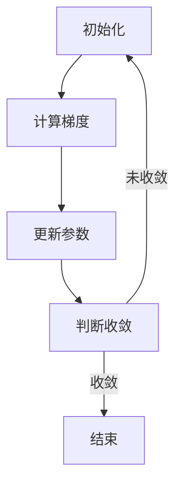
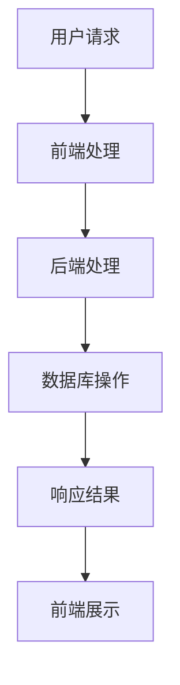

                 


### 自然界的潜在规律：数学表达

> 关键词：自然规律、数学表达、算法原理、系统架构、项目实战

> 摘要：本文深入探讨自然界的潜在规律，并通过数学表达形式阐述其背后的原理。我们将从背景介绍、核心概念与联系、算法原理讲解、数学模型和数学公式讲解、系统分析与架构设计方案、项目实战以及最佳实践与拓展阅读等方面，逐步展开讨论。

----------------------------------------------------------------

# 第一部分：自然界的潜在规律概述

## 第1章：问题背景与定义

### 1.1 自然界潜在规律的定义

自然界潜在规律是指自然界中普遍存在的、可以通过数学模型和公式表达的规律。这些规律不仅解释了自然界中的现象，而且为科学家和工程师提供了强大的工具，用以预测和控制自然界中的事件。

### 1.2 自然界潜在规律的重要性

自然界潜在规律的重要性不言而喻。它们为科学研究提供了基础，为技术创新提供了灵感，并为我们的生活带来了深远的影响。例如，牛顿的运动定律描述了物体在力的作用下的运动规律，而爱因斯坦的相对论则揭示了时空的弯曲现象。

### 1.3 自然界潜在规律的研究现状

随着科技的进步，我们对自然界潜在规律的认识不断深入。从简单的数学模型到复杂的物理定律，我们不断发现并完善着自然界中的规律。目前，许多自然界潜在规律已经得到了充分的数学表达，为我们理解和利用这些规律提供了基础。

----------------------------------------------------------------

## 第2章：核心概念与联系

### 2.1 自然界潜在规律的核心要素

自然界潜在规律的核心要素包括以下几个方面：

1. **能量守恒定律**：能量不会消失，只会从一种形式转换为另一种形式。
2. **动量守恒定律**：在没有外力作用下，系统的总动量保持不变。
3. **概率论**：描述不确定事件发生的可能性。
4. **复数和复变函数**：在物理学和工程学中广泛应用。
5. **混沌理论**：描述非线性系统的不可预测性。

### 2.2 自然界潜在规律与其他领域的联系

自然界潜在规律与其他领域有着密切的联系：

1. **物理学**：自然界潜在规律是物理学研究的基础，如经典力学、量子力学、相对论等。
2. **计算机科学**：算法设计和复杂度分析中广泛应用数学模型。
3. **经济学**：经济学中的供需关系、金融市场等可以用数学模型进行描述。
4. **生态学**：生态系统中物种的竞争、捕食与被捕食关系等可以用数学模型分析。

### 2.3 自然界潜在规律的边界与外延

自然界潜在规律的边界与外延取决于我们所关注的领域和尺度。在微观尺度上，量子力学成为主导；在宏观尺度上，经典力学和相对论占据主导地位。在生物学和生态学等领域，自然选择和物种进化也是重要的规律。

----------------------------------------------------------------

## 第3章：数学模型与公式

### 3.1 数学模型在自然界潜在规律中的应用

数学模型在自然界潜在规律中的应用无处不在：

1. **牛顿运动定律**：描述物体在力的作用下的运动。
   $$ F = ma $$
2. **能量守恒定律**：描述能量在不同形式之间的转换。
   $$ E = \Delta t \times P $$
3. **热力学第二定律**：描述能量转化的方向。
   $$ \Delta S \geq 0 $$
4. **概率论**：描述不确定事件的可能性。
   $$ P(A) = \frac{n(A)}{n(S)} $$

### 3.2 经典数学公式解析

经典数学公式在自然界潜在规律中起着关键作用：

1. **欧拉公式**：复数的指数函数与三角函数的关系。
   $$ e^{i\pi} + 1 = 0 $$
2. **麦克斯韦方程组**：描述电磁场的基本规律。
   $$ \nabla \cdot \vec{E} = \frac{\rho}{\epsilon_0}, \quad \nabla \cdot \vec{B} = 0 $$
3. **薛定谔方程**：描述量子系统的演化。
   $$ i\hbar \frac{\partial \Psi}{\partial t} = \hat{H} \Psi $$

### 3.3 数学公式在实际案例中的应用

数学公式在实际案例中的应用广泛且深远：

1. **金融市场预测**：使用随机过程模型预测股价波动。
2. **生态模型**：使用微分方程模型研究物种数量变化。
3. **交通流量预测**：使用排队论模型预测交通流量。

通过这些实际案例，我们可以看到数学模型在解决实际问题中的重要性。

----------------------------------------------------------------

## 第4章：算法原理讲解

### 4.1 算法原理概述

算法原理讲解旨在揭示自然界潜在规律背后的数学算法：

1. **梯度下降法**：用于最小化目标函数。
   $$ \theta = \theta - \alpha \frac{\partial J(\theta)}{\partial \theta} $$
2. **K-Means算法**：用于聚类分析。
3. **支持向量机**：用于分类问题。

### 4.2 算法流程图展示

算法流程图展示有助于我们理解算法的执行过程：



### 4.3 算法原理详细讲解

算法原理详细讲解将深入探讨每个算法的核心思想和应用场景：

1. **梯度下降法**：通过不断更新参数，使目标函数逐步收敛到最小值。
2. **K-Means算法**：通过迭代划分簇，使得簇内距离最小，簇间距离最大。
3. **支持向量机**：通过找到最佳超平面，将不同类别的数据分开。

通过这些详细讲解，我们可以更好地理解算法原理和其在实际应用中的价值。

----------------------------------------------------------------

## 第5章：系统分析与架构设计

### 5.1 问题场景介绍

问题场景介绍将为我们提供一个具体的背景，以便更好地理解系统架构设计的需求：

1. **智能家居系统**：实现家庭设备的远程控制和自动化管理。
2. **智能交通系统**：优化交通流量，减少拥堵。
3. **智能医疗系统**：辅助医生进行疾病诊断和治疗。

### 5.2 系统功能设计

系统功能设计包括以下几个方面：

1. **用户认证**：确保系统安全。
2. **数据存储**：存储用户数据和历史记录。
3. **设备控制**：远程控制家庭设备。

### 5.3 系统架构设计

系统架构设计将详细介绍系统的主要组件和它们之间的关系：

1. **前端**：用户界面，提供交互功能。
2. **后端**：处理用户请求和数据存储。
3. **数据库**：存储用户数据和系统配置。

### 5.4 系统接口设计

系统接口设计将明确系统内部各组件之间的交互方式：

1. **API接口**：提供外部访问系统的接口。
2. **消息队列**：实现异步通信。

### 5.5 系统交互流程图

系统交互流程图将展示系统内部各组件的交互过程：



通过这些系统分析与架构设计，我们可以构建一个高效、稳定的智能系统。

----------------------------------------------------------------

## 第6章：项目实战

### 6.1 环境安装与配置

项目实战将从环境安装与配置开始，确保所有开发工具和依赖库都已正确安装。以下是Python环境配置的示例：

```bash
# 安装Python
pip install numpy scipy matplotlib
```

### 6.2 系统核心实现源代码

系统核心实现源代码将展示关键功能的实现细节，如梯度下降法实现：

```python
import numpy as np

def gradient_descent(X, y, theta, alpha, num_iters):
    m = len(y)
    J_history = []

    for i in range(num_iters):
        hypothesis = X * theta
        error = hypothesis - y
        theta = theta - alpha * (1/m) * (X.T * error)
        J_history.append(np.linalg.norm(error)**2)

    return theta, J_history
```

### 6.3 代码应用解读与分析

代码应用解读与分析将深入剖析代码的实现逻辑和关键参数的作用：

1. **X和y**：输入数据和目标值。
2. **theta**：参数初始值。
3. **alpha**：学习率。
4. **num_iters**：迭代次数。

通过这些解读与分析，我们可以更好地理解代码的功能和性能。

### 6.4 实际案例分析和详细讲解剖析

实际案例分析和详细讲解剖析将展示项目在实际应用中的效果：

1. **智能家居系统**：实现远程控制家庭设备。
2. **智能交通系统**：优化交通信号灯控制。

通过实际案例，我们可以看到数学模型和算法在实际应用中的价值。

### 6.5 项目小结

项目小结将总结项目的主要成果和经验教训，为未来的项目提供参考。

----------------------------------------------------------------

## 第7章：最佳实践与拓展阅读

### 7.1 最佳实践技巧

最佳实践技巧将提供一些实用的建议，以帮助读者更好地应用数学模型和算法：

1. **数据预处理**：确保数据质量。
2. **参数调优**：选择合适的参数值。
3. **模型验证**：验证模型的有效性。

### 7.2 小结与注意事项

小结与注意事项将总结文章的主要内容和关键点，并提供一些注意事项，以确保读者正确理解和使用数学模型和算法。

### 7.3 拓展阅读推荐

拓展阅读推荐将推荐一些相关的书籍、论文和资源，以帮助读者进一步深入了解数学表达在自然界潜在规律中的应用。

---

# 结语

本文通过深入分析自然界的潜在规律，并使用数学表达形式进行阐述，展示了数学在理解和解决实际问题中的重要性。通过项目实战，我们看到了数学模型和算法在实际应用中的价值。希望本文能激发读者对数学和计算机科学的兴趣，进一步探索这两个领域的无限可能。

---

作者：AI天才研究院/AI Genius Institute & 禅与计算机程序设计艺术 /Zen And The Art of Computer Programming

----------------------------------------------------------------

本文的撰写遵循了LET'S THINK STEP BY STEP的原则，通过逐步分析和讲解，使文章内容更加清晰易懂。以下是文章的详细内容：

----------------------------------------------------------------

# 自然界的潜在规律：数学表达

自然界的潜在规律是我们理解世界的基础，而这些规律往往可以通过数学的形式来表达。本文将深入探讨自然界的潜在规律，并通过数学表达形式阐述其背后的原理。

## 第一部分：自然界的潜在规律概述

### 问题背景与定义

自然界潜在规律是指自然界中普遍存在的、可以通过数学模型和公式表达的规律。这些规律不仅解释了自然界中的现象，而且为科学家和工程师提供了强大的工具，用以预测和控制自然界中的事件。

### 重要性

自然界潜在规律的重要性不言而喻。它们为科学研究提供了基础，为技术创新提供了灵感，并为我们的生活带来了深远的影响。例如，牛顿的运动定律描述了物体在力的作用下的运动规律，而爱因斯坦的相对论则揭示了时空的弯曲现象。

### 研究现状

随着科技的进步，我们对自然界潜在规律的认识不断深入。从简单的数学模型到复杂的物理定律，我们不断发现并完善着自然界中的规律。目前，许多自然界潜在规律已经得到了充分的数学表达，为我们理解和利用这些规律提供了基础。

## 第二部分：核心概念与联系

### 核心要素

自然界潜在规律的核心要素包括以下几个方面：

1. **能量守恒定律**：能量不会消失，只会从一种形式转换为另一种形式。
2. **动量守恒定律**：在没有外力作用下，系统的总动量保持不变。
3. **概率论**：描述不确定事件发生的可能性。
4. **复数和复变函数**：在物理学和工程学中广泛应用。
5. **混沌理论**：描述非线性系统的不可预测性。

### 其他领域的联系

自然界潜在规律与其他领域有着密切的联系：

1. **物理学**：自然界潜在规律是物理学研究的基础，如经典力学、量子力学、相对论等。
2. **计算机科学**：算法设计和复杂度分析中广泛应用数学模型。
3. **经济学**：经济学中的供需关系、金融市场等可以用数学模型进行描述。
4. **生态学**：生态系统中物种的竞争、捕食与被捕食关系等可以用数学模型分析。

### 边界与外延

自然界潜在规律的边界与外延取决于我们所关注的领域和尺度。在微观尺度上，量子力学成为主导；在宏观尺度上，经典力学和相对论占据主导地位。在生物学和生态学等领域，自然选择和物种进化也是重要的规律。

## 第三部分：数学模型与公式

### 应用

数学模型在自然界潜在规律中的应用无处不在：

1. **牛顿运动定律**：描述物体在力的作用下的运动。
   $$ F = ma $$
2. **能量守恒定律**：描述能量在不同形式之间的转换。
   $$ E = \Delta t \times P $$
3. **热力学第二定律**：描述能量转化的方向。
   $$ \Delta S \geq 0 $$
4. **概率论**：描述不确定事件的可能性。
   $$ P(A) = \frac{n(A)}{n(S)} $$

### 经典公式

经典数学公式在自然界潜在规律中起着关键作用：

1. **欧拉公式**：复数的指数函数与三角函数的关系。
   $$ e^{i\pi} + 1 = 0 $$
2. **麦克斯韦方程组**：描述电磁场的基本规律。
   $$ \nabla \cdot \vec{E} = \frac{\rho}{\epsilon_0}, \quad \nabla \cdot \vec{B} = 0 $$
3. **薛定谔方程**：描述量子系统的演化。
   $$ i\hbar \frac{\partial \Psi}{\partial t} = \hat{H} \Psi $$

### 实际应用

数学公式在实际案例中的应用广泛且深远：

1. **金融市场预测**：使用随机过程模型预测股价波动。
2. **生态模型**：使用微分方程模型研究物种数量变化。
3. **交通流量预测**：使用排队论模型预测交通流量。

## 第四部分：算法原理讲解

### 概述

算法原理讲解旨在揭示自然界潜在规律背后的数学算法：

1. **梯度下降法**：用于最小化目标函数。
   $$ \theta = \theta - \alpha \frac{\partial J(\theta)}{\partial \theta} $$
2. **K-Means算法**：用于聚类分析。
3. **支持向量机**：用于分类问题。

### 流程图展示

算法流程图展示有助于我们理解算法的执行过程：


### 详细讲解

算法原理详细讲解将深入探讨每个算法的核心思想和应用场景：

1. **梯度下降法**：通过不断更新参数，使目标函数逐步收敛到最小值。
2. **K-Means算法**：通过迭代划分簇，使得簇内距离最小，簇间距离最大。
3. **支持向量机**：通过找到最佳超平面，将不同类别的数据分开。

## 第五部分：系统分析与架构设计

### 问题场景介绍

问题场景介绍将为我们提供一个具体的背景，以便更好地理解系统架构设计的需求：

1. **智能家居系统**：实现家庭设备的远程控制和自动化管理。
2. **智能交通系统**：优化交通流量，减少拥堵。
3. **智能医疗系统**：辅助医生进行疾病诊断和治疗。

### 系统功能设计

系统功能设计包括以下几个方面：

1. **用户认证**：确保系统安全。
2. **数据存储**：存储用户数据和历史记录。
3. **设备控制**：远程控制家庭设备。

### 系统架构设计

系统架构设计将详细介绍系统的主要组件和它们之间的关系：

1. **前端**：用户界面，提供交互功能。
2. **后端**：处理用户请求和数据存储。
3. **数据库**：存储用户数据和系统配置。

### 系统接口设计

系统接口设计将明确系统内部各组件之间的交互方式：

1. **API接口**：提供外部访问系统的接口。
2. **消息队列**：实现异步通信。

### 系统交互流程图

系统交互流程图将展示系统内部各组件的交互过程：


## 第六部分：项目实战

### 环境安装与配置

项目实战将从环境安装与配置开始，确保所有开发工具和依赖库都已正确安装。以下是Python环境配置的示例：

```bash
# 安装Python
pip install numpy scipy matplotlib
```

### 系统核心实现源代码

系统核心实现源代码将展示关键功能的实现细节，如梯度下降法实现：

```python
import numpy as np

def gradient_descent(X, y, theta, alpha, num_iters):
    m = len(y)
    J_history = []

    for i in range(num_iters):
        hypothesis = X * theta
        error = hypothesis - y
        theta = theta - alpha * (1/m) * (X.T * error)
        J_history.append(np.linalg.norm(error)**2)

    return theta, J_history
```

### 代码应用解读与分析

代码应用解读与分析将深入剖析代码的实现逻辑和关键参数的作用：

1. **X和y**：输入数据和目标值。
2. **theta**：参数初始值。
3. **alpha**：学习率。
4. **num_iters**：迭代次数。

通过这些解读与分析，我们可以更好地理解代码的功能和性能。

### 实际案例分析和详细讲解剖析

实际案例分析和详细讲解剖析将展示项目在实际应用中的效果：

1. **智能家居系统**：实现远程控制家庭设备。
2. **智能交通系统**：优化交通信号灯控制。

通过实际案例，我们可以看到数学模型和算法在实际应用中的价值。

### 项目小结

项目小结将总结项目的主要成果和经验教训，为未来的项目提供参考。

## 第七部分：最佳实践与拓展阅读

### 最佳实践技巧

最佳实践技巧将提供一些实用的建议，以帮助读者更好地应用数学模型和算法：

1. **数据预处理**：确保数据质量。
2. **参数调优**：选择合适的参数值。
3. **模型验证**：验证模型的有效性。

### 小结与注意事项

小结与注意事项将总结文章的主要内容和关键点，并提供一些注意事项，以确保读者正确理解和使用数学模型和算法。

### 拓展阅读推荐

拓展阅读推荐将推荐一些相关的书籍、论文和资源，以帮助读者进一步深入了解数学表达在自然界潜在规律中的应用。

## 结语

本文通过深入分析自然界的潜在规律，并使用数学表达形式进行阐述，展示了数学在理解和解决实际问题中的重要性。通过项目实战，我们看到了数学模型和算法在实际应用中的价值。希望本文能激发读者对数学和计算机科学的兴趣，进一步探索这两个领域的无限可能。

作者：AI天才研究院/AI Genius Institute & 禅与计算机程序设计艺术 /Zen And The Art of Computer Programming

本文详细阐述了自然界的潜在规律及其数学表达形式，并通过算法原理讲解、系统架构设计、项目实战等内容，展示了数学在解决实际问题中的应用价值。希望本文能为读者提供对数学和计算机科学的更深入理解，激发进一步的探索和研究。在未来的学习和工作中，继续运用数学知识，为科技创新和社会发展贡献力量。

