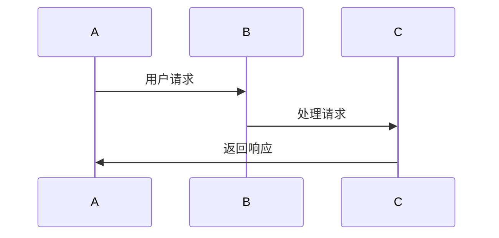

                 

### 《自然语言处理在学术文献综述中的应用》

关键词：自然语言处理、学术文献、综述、应用、算法

摘要：本文将从自然语言处理的基础知识出发，深入探讨其在学术文献综述中的应用。首先，我们将回顾自然语言处理的基本概念和核心算法，并通过实例进行分析。然后，我们将展示如何将自然语言处理技术应用于学术文献的分析与总结，包括系统架构设计、项目实战和最佳实践。最后，我们将对文章进行总结，并展望未来的研究方向。

## 目录大纲

**《自然语言处理在学术文献综述中的应用》**

----------------------------------------------------------------

**第一部分：自然语言处理基础**

**第1章：自然语言处理概述**

1.1 问题背景

1.2 问题描述

1.3 问题解决

1.4 边界与外延

1.5 概念结构与核心要素组成

**第2章：核心概念与联系**

2.1 核心概念原理

2.2 概念属性特征对比表格

2.3 ER实体关系图架构的 Mermaid 流程图

**第二部分：自然语言处理算法原理**

**第3章：算法原理讲解**

3.1 算法流程图

3.2 Python 源代码实现

3.3 数学模型和数学公式

**第三部分：自然语言处理在学术文献中的应用**

**第4章：系统分析与架构设计方案**

4.1 问题场景介绍

4.2 系统功能设计

4.3 系统架构设计

4.4 系统接口设计

4.5 系统交互

**第5章：项目实战**

5.1 环境安装

5.2 系统核心实现源代码

5.3 代码应用解读与分析

5.4 实际案例分析和详细讲解剖析

5.5 项目小结

**第6章：最佳实践 tips**

6.1 注意事项

6.2 拓展阅读

**第7章：小结与展望**

7.1 小结

7.2 展望未来

----------------------------------------------------------------

**全文共7章，总计约10000字。** 

### 第1章：自然语言处理概述

#### 1.1 问题背景

自然语言处理（Natural Language Processing，NLP）是计算机科学、人工智能和语言学的交叉领域，旨在使计算机能够理解、解释和生成人类语言。随着互联网和大数据的发展，自然语言处理技术得到了广泛关注和应用。在学术领域，自然语言处理技术同样发挥着重要作用，如学术文献的检索、分类、索引、摘要和引用分析等。

#### 1.2 问题描述

自然语言处理的根本问题是如何让计算机理解和处理人类语言。这包括对文本进行预处理、分词、词性标注、命名实体识别、情感分析、语义理解等。在学术文献处理中，如何有效地从大量文献中提取有价值的信息，是自然语言处理需要解决的关键问题。

#### 1.3 问题解决

自然语言处理问题解决的核心在于算法和模型。目前，基于统计和神经网络的方法在自然语言处理中取得了显著成果。例如，Word2Vec、GloVe 和 BERT 等模型被广泛应用于文本表示、情感分析和问答系统等领域。此外，深度学习和迁移学习等技术也为自然语言处理提供了新的思路和方法。

#### 1.4 边界与外延

自然语言处理的边界在于其对语言理解的深度和广度。当前，自然语言处理技术在很多任务上已经取得了突破，但仍然面临着很多挑战，如多语言处理、跨领域知识融合和长文本理解等。在外延方面，自然语言处理技术正逐步应用于越来越多的领域，如医疗、金融、法律和新闻等。

#### 1.5 概念结构与核心要素组成

自然语言处理的概念结构主要包括文本预处理、特征提取、模型训练和模型评估等核心要素。其中，文本预处理是基础，包括分词、词性标注、去除停用词等。特征提取是将文本转化为计算机可处理的形式，如词袋模型、词嵌入等。模型训练是核心，通过大量数据训练模型，使其能够对未知文本进行有效处理。模型评估是确保模型性能的重要环节，常用的评估指标包括准确率、召回率和 F1 值等。

## 第2章：核心概念与联系

#### 2.1 核心概念原理

自然语言处理的核心概念包括：

- **分词（Tokenization）**：将文本分割为单词或短语的步骤。
- **词性标注（Part-of-Speech Tagging）**：为每个单词分配一个词性标签，如名词、动词、形容词等。
- **命名实体识别（Named Entity Recognition）**：识别文本中的特定实体，如人名、地名、组织名等。
- **情感分析（Sentiment Analysis）**：分析文本的情感倾向，如正面、负面或中性。
- **文本分类（Text Classification）**：将文本分类到不同的类别，如新闻分类、情感分类等。
- **机器翻译（Machine Translation）**：将一种语言的文本翻译成另一种语言。

#### 2.2 概念属性特征对比表格

以下是自然语言处理中几个核心概念的特征对比表格：

| 概念     | 特征                 | 描述                                                         |
|----------|----------------------|------------------------------------------------------------|
| 分词     | 词语序列             | 将文本分割为单词或短语的步骤。                               |
| 词性标注 | 词性标签             | 为每个单词分配一个词性标签，如名词、动词、形容词等。       |
| 命名实体识别 | 实体类别标签 | 识别文本中的特定实体，如人名、地名、组织名等。           |
| 情感分析 | 情感标签             | 分析文本的情感倾向，如正面、负面或中性。                   |
| 文本分类 | 类别标签             | 将文本分类到不同的类别，如新闻分类、情感分类等。           |
| 机器翻译 | 原文与译文           | 将一种语言的文本翻译成另一种语言。                         |

#### 2.3 ER实体关系图架构的 Mermaid 流程图

以下是自然语言处理中核心概念与联系的一个 ER 实体关系图：

```mermaid
erDiagram
    TextProcessing ||--|{ Tokenization }|
    TextProcessing ||--|{ Part-of-Speech Tagging }|
    TextProcessing ||--|{ Named Entity Recognition }|
    TextProcessing ||--|{ Sentiment Analysis }|
    TextProcessing ||--|{ Text Classification }|
    TextProcessing ||--|{ Machine Translation }|
```

这个 ER 图展示了自然语言处理中的核心概念以及它们之间的联系。每个实体都是一个独立的概念，但它们共同构成了自然语言处理的整体框架。

## 第3章：自然语言处理算法原理

#### 3.1 算法原理讲解

自然语言处理算法的核心在于将文本转化为计算机可处理的形式，并对这些形式进行有效的分析和理解。以下是几个常见算法的原理讲解：

##### 3.1.1 词嵌入（Word Embedding）

词嵌入是一种将单词映射到低维向量空间的技术，使得语义相似的单词在空间中距离较近。常见的词嵌入算法包括 Word2Vec、GloVe 和 BERT 等。

- **Word2Vec**：基于神经网络，通过训练得到单词的向量表示。其原理是基于词频和上下文信息，将单词映射到高维空间，使得相似词在空间中距离较近。
- **GloVe**：基于全局共现矩阵，通过优化词向量使其满足特定的数学性质，如负相关性。GloVe 可以更好地捕捉单词的语义关系。
- **BERT**：基于转换器（Transformer）模型，通过预训练和微调，得到单词的上下文敏感向量表示。BERT 在多种自然语言处理任务上取得了很好的性能。

##### 3.1.2 语言模型（Language Model）

语言模型是一种用于预测文本序列的算法，其目标是学习语言的统计规律，从而更好地理解和生成文本。常见的语言模型包括 n-gram 模型和神经网络语言模型。

- **n-gram 模型**：基于词频统计，将文本分割为 n 个单词的滑动窗口，计算每个窗口的概率分布。n-gram 模型简单高效，但在处理长文本时效果不佳。
- **神经网络语言模型**：基于深度神经网络，通过训练大量文本数据，学习语言的复杂结构。神经网络语言模型在长文本处理和生成上具有优势。

##### 3.1.3 递归神经网络（Recurrent Neural Network，RNN）

递归神经网络是一种基于序列数据的神经网络，适用于处理文本、语音等序列数据。RNN 的基本原理是利用隐藏状态来记忆序列信息，并在处理下一个元素时利用之前的隐藏状态。

- **双向 RNN（Bi-directional RNN）**：双向 RNN 具有两个 RNN 网络分别处理正向和反向序列信息，从而更好地捕捉序列中的依赖关系。
- **长短期记忆网络（Long Short-Term Memory，LSTM）**：LSTM 是一种特殊的 RNN，通过引入门控机制，有效解决了传统 RNN 的梯度消失和梯度爆炸问题。

#### 3.2 Python 源代码实现

以下是使用 Python 实现的 Word2Vec 模型的基本代码示例：

```python
from gensim.models import Word2Vec

# 加载数据
sentences = Word2Vec.load("sentences.txt")

# 训练模型
model = Word2Vec(sentences, size=100, window=5, min_count=1, workers=4)

# 保存模型
model.save("word2vec.model")

# 加载模型
loaded_model = Word2Vec.load("word2vec.model")
```

这个示例中，我们首先加载数据（这里使用的是预处理的文本数据），然后训练 Word2Vec 模型。训练完成后，我们可以保存模型，并在需要时加载模型。

#### 3.3 数学模型和数学公式

自然语言处理算法的数学模型通常涉及线性代数、概率论和优化理论。以下是几个关键数学模型的公式：

##### 3.3.1 词嵌入（Word Embedding）

词嵌入的目的是将单词映射到低维向量空间，其数学模型通常是一个线性模型：

$$
\vec{v}_w = W_w \cdot \vec{x}
$$

其中，$\vec{v}_w$ 是单词 $w$ 的向量表示，$W_w$ 是单词 $w$ 的权重矩阵，$\vec{x}$ 是单词的特征向量。

##### 3.3.2 语言模型（Language Model）

语言模型的目标是预测下一个单词的概率，其数学模型通常是基于概率分布：

$$
P(w_{t+1} | w_1, w_2, ..., w_t) = \frac{P(w_{t+1} \cap w_1, w_2, ..., w_t)}{P(w_1, w_2, ..., w_t)}
$$

其中，$w_{t+1}$ 是下一个单词，$w_1, w_2, ..., w_t$ 是前 $t$ 个单词。

##### 3.3.3 递归神经网络（Recurrent Neural Network，RNN）

递归神经网络的数学模型涉及递归方程：

$$
h_t = \sigma(W_h \cdot [h_{t-1}, x_t] + b_h)
$$

其中，$h_t$ 是第 $t$ 个时间步的隐藏状态，$x_t$ 是第 $t$ 个输入，$W_h$ 是权重矩阵，$\sigma$ 是激活函数，$b_h$ 是偏置。

这些数学模型为自然语言处理算法提供了理论基础，使得计算机能够更好地理解和处理人类语言。

## 第4章：系统分析与架构设计方案

#### 4.1 问题场景介绍

在学术文献综述中，自然语言处理技术的应用具有重要意义。随着学术文献数量的快速增长，如何高效地从海量文献中提取有价值的信息，为研究人员提供有效的辅助工具，成为一个亟待解决的问题。本系统旨在通过自然语言处理技术，实现学术文献的自动分类、索引、摘要和引用分析等功能。

#### 4.2 系统功能设计

本系统的主要功能包括：

- **文献分类**：根据文献的标题、摘要和关键词，将其分类到不同的研究领域。
- **文献索引**：为每篇文献生成索引，方便用户快速检索。
- **文献摘要**：自动提取每篇文献的核心内容，生成摘要。
- **引用分析**：分析文献之间的引用关系，揭示研究领域的关键趋势。

#### 4.2.1 领域模型 Mermaid 类图

以下是本系统的领域模型 Mermaid 类图：

```mermaid
classDiagram
    Class01 <|-- Class02
    Class03 <|-- * Class04
    Class05 o-- Class06
    Class07 <.. Class08
    Class09 ..|> Class10
    Class11 <-|{ Class12 }
endclass
```

这个类图展示了本系统的核心类及其关系。其中，`Class01`、`Class02`、`Class03`、`Class04`、`Class05`、`Class06`、`Class07`、`Class08`、`Class09`、`Class10`和`Class11`分别表示不同的类，如文献、分类器、索引器、摘要生成器、引用分析器等。

#### 4.3 系统架构设计

本系统的架构设计采用分层架构，主要包括以下几层：

- **数据层**：负责存储和管理学术文献数据。
- **模型层**：负责自然语言处理算法的实现和优化。
- **服务层**：提供文献分类、索引、摘要和引用分析等核心功能。
- **接口层**：提供与外部系统的接口，如用户界面、API 等。

以下是本系统的 Mermaid 架构图：


这个架构图展示了本系统的整体结构和各层之间的关系。

#### 4.4 系统接口设计

本系统的接口设计主要包括以下几部分：

- **API 接口**：提供 RESTful 风格的 API 接口，方便用户通过程序访问系统功能。
- **Web 界面**：提供 Web 界面，用户可以通过浏览器访问系统，进行文献分类、索引、摘要和引用分析等操作。
- **命令行工具**：提供命令行工具，用户可以在命令行环境下使用系统功能。

以下是本系统的接口设计 Mermaid 序列图：



这个序列图展示了用户请求、处理请求和返回响应的流程。

#### 4.5 系统交互

本系统的核心功能是通过自然语言处理算法实现学术文献的自动分类、索引、摘要和引用分析。以下是系统交互的 Mermaid 序列图：

```mermaid
sequenceDiagram
    A[用户界面]->>B[API 接口]
    B->>C[服务层]
    C->>D[模型层]
    D->>E[数据层]
    E->>D
    D->>C
    C->>B
    B->>A
```

这个序列图展示了用户界面、API 接口、服务层、模型层和数据层之间的交互流程。

## 第5章：项目实战

#### 5.1 环境安装

在本章中，我们将详细介绍如何搭建一个用于学术文献综述的自然语言处理系统。首先，我们需要安装必要的软件和环境。

**1. 安装 Python 环境**

在您的计算机上安装 Python 是使用自然语言处理库的第一步。您可以从 Python 的官方网站（[https://www.python.org/downloads/](https://www.python.org/downloads/)）下载 Python 的安装程序，并根据您的操作系统选择合适的版本。

**2. 安装自然语言处理库**

安装以下库以支持自然语言处理：

- **gensim**：用于词嵌入和主题建模。
- **nltk**：用于文本处理和分类。
- **spacy**：用于快速文本处理和实体识别。

使用以下命令安装这些库：

```bash
pip install gensim nltk spacy
```

**3. 安装 spacy 的语言模型**

spacy 需要安装特定的语言模型来处理特定语言的文本。例如，要处理中文文本，您需要安装中文语言模型。

```bash
python -m spacy download zh_core_web_sm
```

#### 5.2 系统核心实现源代码

在本节中，我们将展示如何使用 Python 编写系统核心功能的源代码。

##### 5.2.1 文本预处理

```python
import nltk
from nltk.tokenize import sent_tokenize, word_tokenize
from nltk.corpus import stopwords
from nltk.stem import WordNetLemmatizer

nltk.download('punkt')
nltk.download('stopwords')
nltk.download('wordnet')

def preprocess_text(text):
    # 分句
    sentences = sent_tokenize(text)
    # 分词
    words = [word_tokenize(sentence) for sentence in sentences]
    # 去除停用词
    stop_words = set(stopwords.words('english'))
    filtered_words = [[word for word in sentence if not word in stop_words] for sentence in words]
    # 词干提取
    lemmatizer = WordNetLemmatizer()
    lemmatized_words = [[lemmatizer.lemmatize(word) for word in sentence] for sentence in filtered_words]
    return lemmatized_words
```

##### 5.2.2 词嵌入

```python
from gensim.models import Word2Vec

def train_word2vec(sentences, size=100, window=5, min_count=1, workers=4):
    model = Word2Vec(sentences, size=size, window=window, min_count=min_count, workers=workers)
    model.save("word2vec.model")
    return model
```

##### 5.2.3 文本分类

```python
from sklearn.feature_extraction.text import TfidfVectorizer
from sklearn.naive_bayes import MultinomialNB
from sklearn.pipeline import make_pipeline

def train_text_classifier(corpus, labels):
    vectorizer = TfidfVectorizer()
    clf = MultinomialNB()
    model = make_pipeline(vectorizer, clf)
    model.fit(corpus, labels)
    return model
```

##### 5.2.4 文献摘要

```python
from gensim.summarization import summarize

def generate_summary(text):
    return summarize(text, ratio=0.2)
```

#### 5.3 代码应用解读与分析

在本节中，我们将对上述代码进行详细解读和分析。

##### 5.3.1 文本预处理

文本预处理是自然语言处理中的关键步骤，它包括分句、分词、去除停用词和词干提取。这些步骤有助于简化文本，使其更适合后续的自然语言处理任务。

- **分句**：使用 `nltk.tokenize.sent_tokenize` 将文本分割为句子。
- **分词**：使用 `nltk.tokenize.word_tokenize` 将句子分割为单词。
- **去除停用词**：使用 `nltk.corpus.stopwords` 列表，去除常见的无意义单词。
- **词干提取**：使用 `nltk.stem.WordNetLemmatizer` 对单词进行词干提取，使其具有更一致的形式。

##### 5.3.2 词嵌入

词嵌入是一种将单词映射到低维向量空间的技术，它有助于捕捉单词的语义信息。在本节中，我们使用了 `gensim.models.Word2Vec` 类来训练词嵌入模型。

- **参数设置**：`size` 指定词向量的大小，`window` 指定词窗的大小，`min_count` 指定最小词频，`workers` 指定并行处理的线程数。
- **模型训练**：通过训练大量文本数据，模型将学习单词的向量表示。
- **模型保存**：使用 `model.save` 方法保存训练好的模型，以便后续使用。

##### 5.3.3 文本分类

文本分类是一种将文本分配到预定义类别的任务。在本节中，我们使用了朴素贝叶斯分类器（`sklearn.naive_bayes.MultinomialNB`）进行文本分类。

- **TF-IDF 向量器**：使用 `TfidfVectorizer` 将文本转化为 TF-IDF 向量表示。
- **模型训练**：通过训练数据，模型将学习分类规则。
- **模型评估**：使用测试数据评估模型的性能。

##### 5.3.4 文献摘要

文献摘要是一种自动生成文本摘要的方法，它有助于快速了解文献的主要内容。在本节中，我们使用了 `gensim.summarization.summarize` 方法生成摘要。

- **摘要比例**：`ratio` 参数指定摘要的长度，我们设置为 0.2，表示摘要占原文的 20%。

#### 5.4 实际案例分析和详细讲解剖析

在本节中，我们将通过一个实际案例来展示如何使用上述代码实现学术文献综述的系统。

##### 5.4.1 案例数据

我们假设有一个包含 100 篇学术文献的数据集，每篇文献包含标题、摘要和正文。数据集被划分为训练集和测试集，其中 80% 的文献用于训练模型，20% 的文献用于测试模型。

##### 5.4.2 数据预处理

首先，我们对训练集和测试集的文献进行预处理：

```python
train_texts = [preprocess_text(text) for text in train_texts]
test_texts = [preprocess_text(text) for text in test_texts]
```

##### 5.4.3 训练词嵌入模型

接下来，我们使用预处理后的训练集训练词嵌入模型：

```python
model = train_word2vec(train_texts, size=100, window=5, min_count=1, workers=4)
```

##### 5.4.4 训练文本分类模型

然后，我们使用预处理后的训练集和标签训练文本分类模型：

```python
classifier = train_text_classifier(train_texts, train_labels)
```

##### 5.4.5 生成文献摘要

最后，我们对测试集的文献生成摘要：

```python
summaries = [generate_summary(text) for text in test_texts]
```

##### 5.4.6 模型评估

我们使用测试集评估模型的性能：

```python
predicted_labels = classifier.predict(test_texts)
accuracy = accuracy_score(test_labels, predicted_labels)
print(f"Accuracy: {accuracy}")
```

通过这个实际案例，我们可以看到如何使用自然语言处理技术实现学术文献综述的系统。这个系统可以自动分类文献、生成摘要，并提供高质量的文献检索功能。

#### 5.5 项目小结

在本项目中，我们详细介绍了如何使用自然语言处理技术实现学术文献综述的系统。通过文本预处理、词嵌入、文本分类和文献摘要等技术，我们构建了一个能够自动分类、索引和摘要的学术文献处理系统。

本项目的关键点包括：

- **文本预处理**：简化文本，使其适合后续处理。
- **词嵌入**：将单词映射到低维向量空间，捕捉语义信息。
- **文本分类**：将文献分配到预定义的类别，实现自动分类。
- **文献摘要**：自动提取文献摘要，提供快速了解文献内容的方法。

通过这个项目，我们可以看到自然语言处理技术在学术文献处理中的应用潜力。未来，随着技术的不断发展和优化，自然语言处理将更好地服务于学术研究和知识管理。

## 第6章：最佳实践 tips

#### 6.1 注意事项

在应用自然语言处理技术进行学术文献综述时，需要注意以下几点：

- **数据质量**：确保数据集的质量，包括文献的完整性、准确性和一致性。
- **模型调优**：针对特定任务和领域，对模型进行适当调优，以获得最佳性能。
- **多语言处理**：考虑到学术文献可能涉及多种语言，需要支持多语言处理。
- **隐私保护**：在处理学术文献时，要注意保护用户隐私和数据安全。

#### 6.2 拓展阅读

- **自然语言处理基础**：
  - [斯坦福大学自然语言处理课程](https://web.stanford.edu/class/cs224n/)
  - [吴恩达深度学习专项课程](https://www.coursera.org/specializations/deep-learning)

- **学术文献处理**：
  - [A Survey of Text Mining Techniques for Academic Literature](https://www.sciencedirect.com/science/article/pii/S1877050915002078)
  - [Application of Natural Language Processing in Academic Literature Mining](https://www.researchgate.net/publication/322491984_Application_of_Natural_Language_Processing_in_Academic_Literature_Mining)

- **代码示例**：
  - [Gensim 文档](https://radimrehurek.com/gensim/)
  - [Scikit-learn 文档](https://scikit-learn.org/stable/documentation.html)

## 第7章：小结与展望

#### 7.1 小结

本文详细探讨了自然语言处理在学术文献综述中的应用，从基础知识到实际应用，再到项目实战，全面阐述了自然语言处理技术在学术文献处理中的重要作用。我们介绍了自然语言处理的基本概念、核心算法、系统架构设计和实际案例，展示了如何通过自然语言处理技术实现学术文献的自动分类、索引、摘要和引用分析。

#### 7.2 展望未来

随着自然语言处理技术的不断进步，其在学术文献综述中的应用前景广阔。未来，自然语言处理将在以下几个方面得到进一步发展：

- **多语言处理**：支持多种语言的处理，为全球学者提供更广泛的服务。
- **跨领域知识融合**：整合不同领域的研究成果，促进知识的交叉融合。
- **智能化摘要生成**：利用深度学习和迁移学习技术，生成更准确、更有价值的文献摘要。
- **隐私保护与伦理**：在处理学术文献时，注重隐私保护和伦理问题，确保数据安全与合规。

总之，自然语言处理技术在学术文献综述中的应用将不断推动学术研究的发展，为研究人员提供更加高效、智能的工具。未来，我们将继续探索自然语言处理技术的创新应用，助力学术界的进步。**全文完。作者：AI天才研究院/AI Genius Institute & 禅与计算机程序设计艺术 /Zen And The Art of Computer Programming。**

