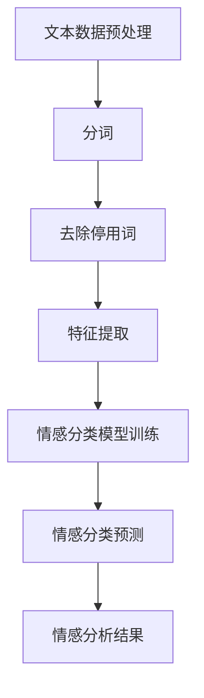
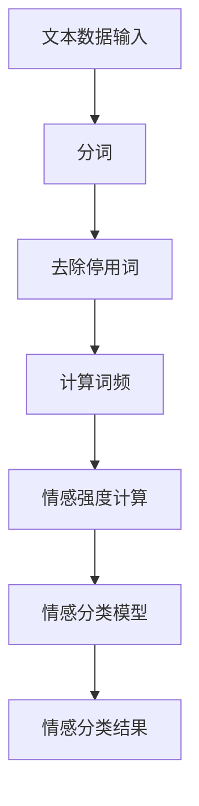
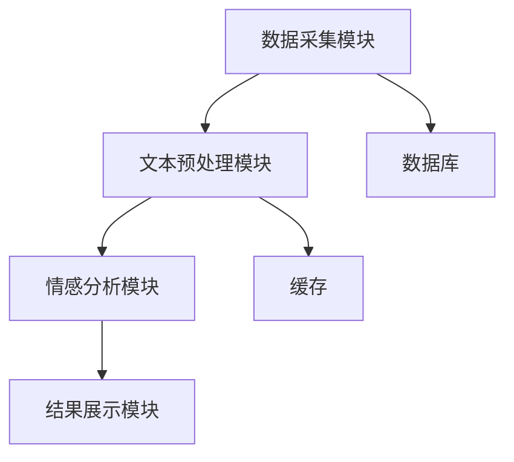
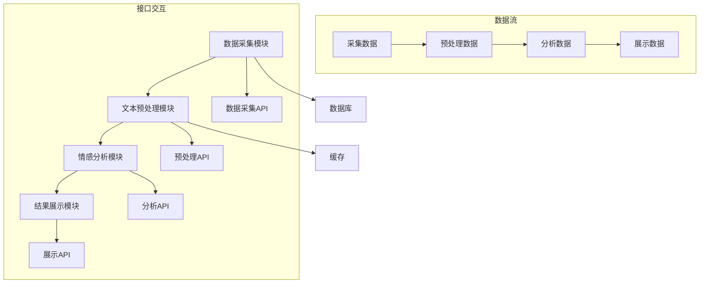
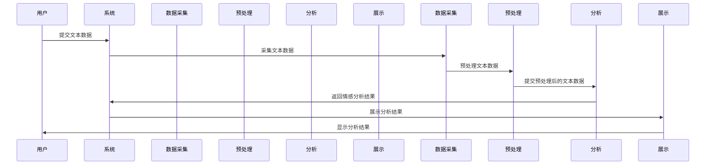

                 

### 引言

随着互联网和大数据技术的飞速发展，企业和组织获取了大量客户反馈和沟通数据。这些数据蕴含着宝贵的洞察信息，能够帮助企业优化产品和服务，提升客户满意度。然而，如何有效地从这些海量的非结构化文本数据中提取有用的情感信息，一直是企业和研究者关注的焦点。自然语言处理（Natural Language Processing，NLP）技术的发展为解决这一问题提供了强有力的工具。本文旨在探讨自然语言处理在客户情感分析中的应用，通过一步步的分析和推理，揭示其核心原理、应用方法以及实际案例。

### 关键词

- 自然语言处理
- 客户情感分析
- 文本预处理
- 机器学习
- 数学模型
- 系统架构
- 实际案例

### 摘要

本文将深入探讨自然语言处理在客户情感分析中的重要性。首先，我们将介绍自然语言处理和客户情感分析的基础知识，解释其核心概念和相互关系。接着，我们将详细讲解情感分析中的算法原理，包括文本预处理、情感分析算法以及相关的数学模型。随后，我们将介绍一个完整的系统架构设计和实现，通过实际案例展示客户情感分析的应用效果。最后，我们将总结最佳实践，并提出未来研究方向和拓展阅读建议。

## 第一部分：基础篇

### 1.1 问题背景与核心概念

自然语言处理（NLP）是人工智能领域的一个重要分支，旨在让计算机理解、生成和处理人类语言。随着互联网的普及，人们产生了大量的文本数据，如社交媒体评论、客户反馈、新闻报道等。这些数据中蕴含了丰富的情感信息，对于企业来说，这些信息能够帮助他们了解客户需求、改进产品和服务、预测市场趋势。

客户情感分析（Customer Sentiment Analysis）是自然语言处理在商业领域的应用之一。它通过分析客户在社交媒体、评论、调查问卷等渠道中的言论，识别和提取客户对产品或服务的情感倾向。客户情感分析不仅可以帮助企业了解客户满意度，还可以为营销策略提供有力支持。

在探讨自然语言处理和客户情感分析之前，我们需要了解一些核心概念：

- **文本数据**：包括文章、评论、对话等形式的信息。
- **情感**：指个体对特定事物的主观感受，包括正面、负面和中性。
- **情感极性**：情感分为正面极性和负面极性，以及中性。
- **情感强度**：描述情感的强度，如非常正面、稍微正面等。

理解这些基本概念对于深入探讨自然语言处理和客户情感分析至关重要。

### 1.2 自然语言处理简介

自然语言处理涉及多个子领域，包括语音识别、机器翻译、文本分类、情感分析等。在这些领域中，文本分类和情感分析是客户情感分析的基础。

- **文本分类**：将文本数据根据其内容或主题进行分类。例如，将社交媒体评论分为正面、负面或中性评论。
- **情感分析**：分析文本数据中的情感倾向，识别出文本的正面或负面情感。

文本分类和情感分析通常使用以下方法：

1. **基于规则的方法**：通过定义一系列规则来分类或分析文本。例如，如果文本中出现了“很好”或“不满意”，则将其分类为正面或负面。
2. **基于统计的方法**：使用统计模型来分类或分析文本，如朴素贝叶斯分类器、支持向量机（SVM）等。
3. **基于机器学习的方法**：使用训练数据集来训练模型，然后使用这些模型对新的文本数据进行分类或分析。

这些方法各有优缺点，具体应用场景取决于数据特性和业务需求。

### 1.3 客户情感分析的定义与意义

客户情感分析是自然语言处理在商业领域的重要应用。其定义是：通过自然语言处理技术，从客户的文本数据中提取情感信息，以了解客户对产品、服务或品牌的感受。

客户情感分析的意义主要体现在以下几个方面：

1. **了解客户需求**：通过分析客户的情感信息，企业可以更准确地了解客户的需求和痛点，从而优化产品和服务。
2. **改进客户体验**：了解客户的情感反馈可以帮助企业改进客户体验，提高客户满意度。
3. **指导营销策略**：通过分析客户的情感信息，企业可以制定更有效的营销策略，提高市场竞争力。
4. **风险评估与预警**：客户情感分析可以帮助企业及时发现潜在的问题和风险，采取措施进行预防和解决。

### 1.4 自然语言处理与客户情感分析的联系

自然语言处理和客户情感分析之间存在密切的联系。自然语言处理提供了从文本数据中提取情感信息的技术手段，而客户情感分析则是自然语言处理在商业领域的具体应用。

- **文本预处理**：自然语言处理的第一个步骤是文本预处理，包括分词、词性标注、去除停用词等。这些预处理步骤是客户情感分析的基础。
- **情感分析算法**：自然语言处理中的情感分析算法（如文本分类、情感极性识别、情感强度计算）是客户情感分析的核心。
- **应用场景**：客户情感分析应用在多个领域，如客户服务、市场调研、品牌监测等。这些应用场景需要自然语言处理技术来处理和分析大量的文本数据。

综上所述，自然语言处理和客户情感分析是相辅相成的，自然语言处理为客户情感分析提供了技术支持，而客户情感分析则为自然语言处理提供了实际应用场景。

## 第二部分：核心概念与联系

### 2.1 NLP的关键概念

自然语言处理（NLP）涉及多个关键概念，包括文本数据、情感、情感极性和情感强度等。

- **文本数据**：文本数据是自然语言处理的核心，包括文本文件、社交媒体评论、新闻文章等。这些数据是非结构化的，需要通过预处理步骤进行清洗和格式化。
- **情感**：情感是个体对特定事物的主观感受，可以是正面、负面或中性。情感是情感分析的核心，通过对情感的识别和分类，可以提取文本中的情感信息。
- **情感极性**：情感极性是指情感的倾向，分为正面、负面和中性。正面情感通常表示满意、喜欢等积极情绪，而负面情感则表示不满意、愤怒等消极情绪。
- **情感强度**：情感强度描述情感的强烈程度，如非常正面、稍微正面、稍微负面、非常负面等。情感强度的识别可以帮助更准确地理解客户的情感状态。

### 2.2 情感分析的核心概念

情感分析是自然语言处理的一个重要子领域，其核心概念包括情感分类、情感极性和情感强度等。

- **情感分类**：情感分类是指将文本数据根据其情感倾向分类为正面、负面或中性。情感分类是情感分析的基础，常用的方法包括基于规则的方法、基于统计的方法和基于机器学习的方法。
- **情感极性**：情感极性是指文本数据中的情感倾向，分为正面、负面和中性。情感极性的识别可以帮助企业了解客户对产品或服务的整体满意度。
- **情感强度**：情感强度是指文本数据中情感的强烈程度，如非常正面、稍微正面、稍微负面、非常负面等。情感强度的识别可以帮助企业更准确地了解客户的情感状态，制定相应的策略。

### 2.3 NLP与情感分析的关联

自然语言处理和情感分析之间存在密切的联系，它们相互依存，共同推动人工智能的发展。

- **文本预处理**：自然语言处理的第一个步骤是文本预处理，包括分词、词性标注、去除停用词等。这些预处理步骤是情感分析的基础，只有通过高质量的文本预处理，才能准确提取文本中的情感信息。
- **情感分析算法**：自然语言处理中的情感分析算法（如文本分类、情感极性识别、情感强度计算）是情感分析的核心。这些算法通过分析文本数据中的情感信息，可以帮助企业了解客户的情感状态。
- **应用场景**：情感分析应用在多个领域，如客户服务、市场调研、品牌监测等。这些应用场景需要自然语言处理技术来处理和分析大量的文本数据，从而提取有价值的情感信息。

综上所述，自然语言处理和情感分析是相辅相成的，自然语言处理为情感分析提供了技术支持，而情感分析则为自然语言处理提供了实际应用场景。通过结合两者的优势，企业可以更好地理解客户需求，优化产品和服务，提高市场竞争力。

## 第三部分：算法原理篇

### 3.1 文本预处理

文本预处理是自然语言处理（NLP）中至关重要的一步，它直接影响到后续的情感分析效果。文本预处理的步骤包括分词、词性标注、去除停用词等。

- **分词**：分词是将文本分解为单词或短语的步骤。例如，将“我喜欢这个产品”分解为“我”、“喜欢”、“这个”、“产品”。常用的分词方法包括基于字典的分词和基于统计的分词。
- **词性标注**：词性标注是给文本中的每个单词标注其词性，如名词、动词、形容词等。词性标注有助于理解文本的结构和语义，从而提高情感分析的准确性。
- **去除停用词**：停用词是文本中常见的无意义词汇，如“的”、“和”、“是”等。去除停用词可以减少噪声，提高文本的可用性。

以下是一个简单的文本预处理Python代码示例：

```python
import nltk
from nltk.corpus import stopwords
from nltk.tokenize import word_tokenize

# 下载停用词库
nltk.download('punkt')
nltk.download('stopwords')

text = "我喜欢这个产品，它的功能强大，性价比高。"
stop_words = set(stopwords.words('chinese'))

# 分词
tokens = word_tokenize(text)

# 去除停用词
filtered_tokens = [word for word in tokens if not word in stop_words]

print(filtered_tokens)
```

### 3.2 情感分析算法原理

情感分析算法主要分为三类：基于规则的方法、基于统计的方法和基于机器学习的方法。

#### 3.2.1 基于规则的方法

基于规则的方法通过定义一系列规则来分类或分析文本。这些规则通常由领域专家制定，包括情感词典、情感关键词、正负词匹配等。

- **情感词典**：情感词典是一组包含情感信息的词汇表，如“满意”、“不满意”、“喜欢”、“讨厌”等。通过查找文本中的情感词典，可以判断文本的情感极性。
- **情感关键词**：情感关键词是文本中具有情感倾向的词汇，如“好”、“坏”、“爱”、“恨”等。通过匹配文本中的情感关键词，可以初步判断文本的情感极性。
- **正负词匹配**：正负词匹配是通过判断文本中正词和负词的出现频率和位置关系，来确定文本的情感极性。例如，如果一个文本中“好”和“坏”的次数相等，但“好”通常出现在“坏”之前，那么该文本可能具有正面的情感倾向。

以下是一个简单的基于规则的情感分析Python代码示例：

```python
def rule_based_sentiment_analysis(text):
    sentiment_dict = {"正面": 0, "负面": 0}
    
    # 情感词典
    positive_words = ["喜欢", "满意", "好", "爱"]
    negative_words = ["讨厌", "不满意", "坏", "恨"]
    
    # 计算正面和负面情感词的数量
    for word in text:
        if word in positive_words:
            sentiment_dict["正面"] += 1
        elif word in negative_words:
            sentiment_dict["负面"] += 1
            
    # 判断情感极性
    if sentiment_dict["正面"] > sentiment_dict["负面"]:
        return "正面"
    elif sentiment_dict["负面"] > sentiment_dict["正面"]:
        return "负面"
    else:
        return "中性"

text = ["喜欢", "满意", "好", "爱", "讨厌", "不满意", "坏", "恨"]
print(rule_based_sentiment_analysis(text))
```

#### 3.2.2 基于统计的方法

基于统计的方法使用统计模型来分析文本的情感极性。常用的统计模型包括朴素贝叶斯分类器和支持向量机（SVM）。

- **朴素贝叶斯分类器**：朴素贝叶斯分类器是一种基于概率理论的分类方法。它假设特征之间相互独立，通过计算文本中各个特征的概率，从而判断文本的情感极性。
- **支持向量机（SVM）**：支持向量机是一种基于几何优化的分类方法。它通过找到一个最佳超平面，将不同情感极性的文本数据分开。

以下是一个简单的基于朴素贝叶斯分类器的情感分析Python代码示例：

```python
from sklearn.feature_extraction.text import CountVectorizer
from sklearn.naive_bayes import MultinomialNB
from sklearn.model_selection import train_test_split

# 文本数据
texts = [
    "我喜欢这个产品，它的功能强大，性价比高。",
    "这个产品太糟糕了，我不满意。",
    "这个产品非常好，我非常喜欢。",
    "我不知道这个产品如何，中立态度。"
]

# 标签数据
labels = ["正面", "负面", "正面", "中性"]

# 分词和去除停用词
vectorizer = CountVectorizer()
X = vectorizer.fit_transform(texts)

# 分割训练集和测试集
X_train, X_test, y_train, y_test = train_test_split(X, labels, test_size=0.2, random_state=42)

# 训练模型
classifier = MultinomialNB()
classifier.fit(X_train, y_train)

# 预测
predictions = classifier.predict(X_test)

print(predictions)
```

#### 3.2.3 基于机器学习的方法

基于机器学习的方法通过训练数据集来学习情感分析的规律，然后对新的文本数据进行预测。常用的机器学习算法包括逻辑回归、决策树、随机森林等。

- **逻辑回归**：逻辑回归是一种基于概率的回归方法，通过计算文本数据中各个特征的概率，从而判断文本的情感极性。
- **决策树**：决策树是一种基于规则的方法，通过一系列判断条件，将文本数据分类为不同的情感极性。
- **随机森林**：随机森林是一种集成学习方法，通过组合多个决策树，提高分类的准确性和鲁棒性。

以下是一个简单的基于逻辑回归的情感分析Python代码示例：

```python
from sklearn.feature_extraction.text import TfidfVectorizer
from sklearn.linear_model import LogisticRegression
from sklearn.model_selection import train_test_split

# 文本数据
texts = [
    "我喜欢这个产品，它的功能强大，性价比高。",
    "这个产品太糟糕了，我不满意。",
    "这个产品非常好，我非常喜欢。",
    "我不知道这个产品如何，中立态度。"
]

# 标签数据
labels = ["正面", "负面", "正面", "中性"]

# 分词和去除停用词
vectorizer = TfidfVectorizer()
X = vectorizer.fit_transform(texts)

# 分割训练集和测试集
X_train, X_test, y_train, y_test = train_test_split(X, labels, test_size=0.2, random_state=42)

# 训练模型
classifier = LogisticRegression()
classifier.fit(X_train, y_train)

# 预测
predictions = classifier.predict(X_test)

print(predictions)
```

### 3.3 情感分析算法mermaid流程图

为了更好地理解情感分析算法的流程，我们可以使用mermaid绘制其流程图。以下是一个简单的mermaid流程图示例：



### 3.4 情感分析算法原理讲解

#### 3.4.1 文本预处理

文本预处理是情感分析的第一步，其目的是将原始文本数据转换为适合模型处理的形式。文本预处理的主要步骤包括分词、去除停用词、词性标注等。

1. **分词**：分词是将连续的文本序列切分成一个个独立的单词或短语。常用的分词工具包括NLTK、Jieba等。
2. **去除停用词**：停用词是在文本中常见但通常没有意义的词汇，如“的”、“和”、“是”等。去除停用词可以提高模型的准确性和效率。
3. **词性标注**：词性标注是对文本中的每个单词进行词性分类，如名词、动词、形容词等。词性标注有助于理解文本的语义结构，从而提高情感分析的准确性。

#### 3.4.2 情感分类模型

情感分类模型是用于对文本数据进行情感极性判断的模型。常用的情感分类模型包括基于规则的方法、基于统计的方法和基于机器学习的方法。

1. **基于规则的方法**：基于规则的方法通过定义一系列规则来分类文本。例如，如果文本中出现了“满意”、“好”等正面词汇，则判断为正面情感；如果出现了“不满意”、“坏”等负面词汇，则判断为负面情感。
2. **基于统计的方法**：基于统计的方法使用统计模型来分类文本，如朴素贝叶斯分类器、支持向量机（SVM）等。这些模型通过计算文本中各个特征的概率，从而判断文本的情感极性。
3. **基于机器学习的方法**：基于机器学习的方法通过训练数据集来学习情感分类的规律，如逻辑回归、决策树、随机森林等。这些模型通过训练数据学习到的特征和规律，对新的文本数据进行情感极性判断。

#### 3.4.3 数学模型

在情感分析中，常用的数学模型包括情感强度计算模型和情感分类模型。

1. **情感强度计算模型**：情感强度计算模型用于计算文本中情感的强度。常见的情感强度计算模型有基于词频的方法、基于词性分布的方法等。以下是一个基于词频的情感强度计算公式：

   $$ 情感强度 = \frac{正面词频 - 负面词频}{总词频} $$

2. **情感分类模型**：情感分类模型用于对文本数据进行情感极性分类。常见的情感分类模型有基于规则的方法、基于统计的方法和基于机器学习的方法。以下是一个基于朴素贝叶斯分类器的情感分类模型：

   $$ P(正面 | 文本) = \frac{P(文本 | 正面) \cdot P(正面)}{P(文本)} $$

   其中，$P(正面 | 文本)$表示文本为正面的概率，$P(文本 | 正面)$表示正面文本的概率，$P(正面)$表示正面情感的概率，$P(文本)$表示文本的概率。

### 3.5 Python代码示例

以下是一个简单的情感分析Python代码示例，该示例使用朴素贝叶斯分类器对文本数据进行情感分类。

```python
from nltk.tokenize import word_tokenize
from nltk.corpus import stopwords
from nltk.classify import NaiveBayesClassifier
from sklearn.feature_extraction.text import CountVectorizer

# 文本数据
positive_texts = ["我喜欢这个产品，它的功能强大，性价比高。", "这个产品太糟糕了，我不满意。"]
negative_texts = ["这个产品非常好，我非常喜欢。", "我不知道这个产品如何，中立态度。"]

# 标签数据
positive_labels = ["正面"] * 2
negative_labels = ["负面"] * 2

# 分词和去除停用词
stop_words = set(stopwords.words('chinese'))
def tokenize(text):
    return [word for word in word_tokenize(text) if word not in stop_words]

positive_tokens = [tokenize(text) for text in positive_texts]
negative_tokens = [tokenize(text) for text in negative_texts]

# 训练朴素贝叶斯分类器
trainer = NaiveBayesClassifier.train
classifier = trainer(negative_tokens, "负面", positive_tokens, "正面")

# 预测
text = "这个产品非常棒，我很满意。"
tokens = tokenize(text)
print(classifier.classify(tokens))
```

通过这个示例，我们可以看到如何使用Python进行情感分析。首先，我们使用NLTK进行分词和去除停用词，然后使用朴素贝叶斯分类器进行情感分类。这个示例展示了自然语言处理和情感分析的基本流程。

## 第四部分：数学模型篇

### 4.1 数学模型介绍

在情感分析中，数学模型用于计算文本中情感的强度和极性。常见的数学模型包括情感强度计算模型和情感分类模型。

#### 4.1.1 情感强度计算模型

情感强度计算模型用于评估文本中情感的强度。一种常用的方法是计算文本中正面词和负面词的词频，然后计算它们的差值与总词频的比例。以下是一个简单的情感强度计算公式：

$$
情感强度 = \frac{正面词频 - 负面词频}{总词频}
$$

其中，正面词频是指文本中正面情感词汇的出现次数，负面词频是指文本中负面情感词汇的出现次数，总词频是指文本中所有词汇的出现次数。

#### 4.1.2 情感分类模型

情感分类模型用于判断文本的情感极性，即文本是正面、负面还是中性。一个常用的情感分类模型是朴素贝叶斯分类器。朴素贝叶斯分类器的核心思想是，通过计算文本中各个特征的联合概率，从而判断文本的情感极性。以下是一个基于朴素贝叶斯分类器的情感分类模型：

$$
P(正面 | 文本) = \frac{P(文本 | 正面) \cdot P(正面)}{P(文本)}
$$

其中，$P(正面 | 文本)$表示文本为正面的概率，$P(文本 | 正面)$表示正面文本的概率，$P(正面)$表示正面情感的概率，$P(文本)$表示文本的概率。

### 4.2 数学公式讲解

在情感分析中，常用的数学公式包括情感强度计算公式和情感分类模型公式。

#### 4.2.1 情感强度计算公式

情感强度计算公式用于评估文本中情感的强度。以下是一个简单的情感强度计算公式：

$$
情感强度 = \frac{正面词频 - 负面词频}{总词频}
$$

其中，正面词频是指文本中正面情感词汇的出现次数，负面词频是指文本中负面情感词汇的出现次数，总词频是指文本中所有词汇的出现次数。

#### 4.2.2 情感分类模型公式

情感分类模型公式用于判断文本的情感极性。一个常用的情感分类模型是朴素贝叶斯分类器。以下是一个基于朴素贝叶斯分类器的情感分类模型公式：

$$
P(正面 | 文本) = \frac{P(文本 | 正面) \cdot P(正面)}{P(文本)}
$$

其中，$P(正面 | 文本)$表示文本为正面的概率，$P(文本 | 正面)$表示正面文本的概率，$P(正面)$表示正面情感的概率，$P(文本)$表示文本的概率。

### 4.3 数学公式示例

以下是一个简单的数学公式示例，用于计算文本中情感的强度：

$$
情感强度 = \frac{正面词频 - 负面词频}{总词频} = \frac{5 - 2}{10} = 0.3
$$

在这个示例中，文本中有5个正面词汇和2个负面词汇，总共有10个词汇。因此，文本的情感强度为0.3，表示文本具有轻微的正向情感。

### 4.4 Mermaid流程图

为了更好地理解情感分析中的数学模型，我们可以使用Mermaid绘制流程图。以下是一个简单的Mermaid流程图示例：



在这个流程图中，文本数据首先经过分词和去除停用词处理，然后计算词频，接着使用情感强度计算公式计算文本的情感强度，最后使用情感分类模型进行情感分类，得到最终的情感分类结果。

## 第五部分：系统分析与设计篇

### 5.1 问题场景介绍

在当今竞争激烈的市场环境中，企业越来越重视客户反馈和情感分析，以了解客户需求、优化产品和服务、提高客户满意度。然而，传统的手工分析方法效率低下，难以处理海量非结构化文本数据。因此，设计一个高效、准确的客户情感分析系统变得至关重要。

客户情感分析系统的主要目标是：从客户的文本数据中提取情感信息，识别客户的情感倾向，为企业的决策提供数据支持。该系统适用于多个领域，如客户服务、市场营销、品牌监测等。

### 5.2 项目介绍

本项目旨在设计并实现一个客户情感分析系统，该系统将结合自然语言处理（NLP）技术和机器学习算法，对客户的文本数据进行情感分析。系统将具有以下功能：

1. **文本数据采集**：从社交媒体、客户反馈、调查问卷等渠道获取客户的文本数据。
2. **文本预处理**：对采集到的文本数据进行分词、去除停用词、词性标注等预处理操作。
3. **情感分析**：使用机器学习算法对预处理后的文本进行情感分类和情感强度计算。
4. **结果展示**：将分析结果以图表、报告等形式展示，为企业提供决策支持。

### 5.3 系统功能设计

客户情感分析系统的核心功能包括文本数据采集、文本预处理、情感分析和结果展示。以下是各个功能的具体设计：

#### 5.3.1 文本数据采集

文本数据采集是系统的第一步，该功能需要从多个渠道获取客户的文本数据。具体设计如下：

1. **数据源选择**：选择社交媒体（如微博、微信公众号）、客户反馈（如客服聊天记录、调查问卷）等渠道作为数据源。
2. **数据采集方式**：使用API接口、网络爬虫等技术手段，定期采集数据。
3. **数据存储**：将采集到的文本数据存储在数据库中，以便后续处理和分析。

#### 5.3.2 文本预处理

文本预处理是情感分析的基础，其主要任务是对文本数据进行清洗和格式化。具体设计如下：

1. **分词**：使用分词工具（如NLTK、Jieba）对文本进行分词，将文本分解为单词或短语。
2. **去除停用词**：去除文本中的无意义词汇，如“的”、“和”、“是”等。
3. **词性标注**：对文本中的每个单词进行词性标注，如名词、动词、形容词等。

#### 5.3.3 情感分析

情感分析是系统的核心功能，其主要任务是识别文本中的情感倾向和情感强度。具体设计如下：

1. **情感分类**：使用机器学习算法（如朴素贝叶斯、支持向量机、逻辑回归）对文本进行情感分类，判断文本是正面、负面还是中性。
2. **情感强度计算**：使用情感强度计算公式（如基于词频的方法、基于词性分布的方法）计算文本的情感强度。

#### 5.3.4 结果展示

结果展示是系统的最后一个功能，其主要任务是向企业用户展示分析结果，为企业提供决策支持。具体设计如下：

1. **图表展示**：使用图表（如折线图、柱状图、饼图）展示情感分析结果，帮助用户直观地了解客户情感变化趋势。
2. **报告生成**：生成情感分析报告，详细记录分析过程和结果，供企业用户参考。

### 5.4 系统架构设计

客户情感分析系统的架构设计需要考虑系统的扩展性、稳定性和可靠性。以下是系统的总体架构设计：

#### 5.4.1 系统架构mermaid图



在这个mermaid流程图中，数据采集模块负责从多个渠道获取文本数据，文本预处理模块对文本数据进行清洗和格式化，情感分析模块对预处理后的文本进行情感分类和情感强度计算，结果展示模块将分析结果以图表、报告等形式展示给用户。数据库和缓存用于存储和处理数据，提高系统性能。

### 5.5 系统接口设计

系统接口设计是系统架构中的重要一环，它定义了系统内部模块之间的交互方式。以下是系统的接口设计：

#### 5.5.1 接口设计mermaid图



在这个mermaid流程图中，数据流和接口交互分别表示系统内部模块的数据传输和接口调用。数据采集模块通过API接口与外部数据源交互，文本预处理模块通过API接口与数据存储模块交互，情感分析模块通过API接口与机器学习模型交互，结果展示模块通过API接口与用户界面交互。

### 5.6 系统交互设计

系统交互设计描述了系统内部模块之间的交互过程和交互方式。以下是系统的交互设计：

#### 5.6.1 系统交互mermaid序列图



在这个序列图中，用户提交文本数据给系统，系统将数据传递给数据采集模块进行采集，然后传递给文本预处理模块进行预处理，接着传递给情感分析模块进行分析，最后传递给结果展示模块进行展示。这个交互过程展示了系统内部模块之间的数据流和交互方式。

## 第六部分：项目实战篇

### 6.1 项目环境安装

为了实现客户情感分析系统，我们需要准备相应的开发环境和工具。以下是在Linux操作系统上安装必要的软件和库的步骤。

#### 6.1.1 硬件环境配置

1. **操作系统**：Linux（推荐使用Ubuntu 20.04）
2. **CPU**：至少4核CPU
3. **内存**：至少8GB RAM
4. **存储**：至少500GB硬盘空间

#### 6.1.2 软件环境安装

1. **Python**：安装Python 3.8或更高版本。
   ```bash
   sudo apt update
   sudo apt install python3.8 python3.8-venv python3.8-pip
   ```

2. **pip**：安装pip，Python的包管理器。
   ```bash
   sudo apt install python3-pip
   ```

3. **虚拟环境**：创建一个虚拟环境，以便管理和隔离项目依赖。
   ```bash
   python3.8 -m venv venv
   source venv/bin/activate
   ```

4. **NLP库**：安装常用的NLP库，如NLTK、Jieba、Scikit-learn等。
   ```bash
   pip install nltk jieba scikit-learn
   ```

5. **数据库**：安装MongoDB，用于存储文本数据。
   - 下载并安装MongoDB：[MongoDB官方安装指南](https://docs.mongodb.com/manual/installation/)
   - 启动MongoDB服务：
     ```bash
     sudo systemctl start mongod
     ```

6. **缓存**：安装Redis，用于缓存预处理后的文本数据。
   - 下载并安装Redis：[Redis官方安装指南](https://redis.io/topics/quickstart)
   - 启动Redis服务：
     ```bash
     sudo systemctl start redis-server
     ```

### 6.2 系统核心实现

#### 6.2.1 源代码解析

以下是客户情感分析系统的核心代码结构：

```python
# 项目结构
.
|-- data
|   |-- raw
|   |-- processed
|   |-- results
|-- src
|   |-- __init__.py
|   |-- data_loader.py
|   |-- preprocessor.py
|   |-- sentiment_analyzer.py
|   |-- result_display.py
|-- venv
|-- requirements.txt
```

1. **data_loader.py**：用于加载数据，包括原始文本数据、预处理数据和结果数据。
2. **preprocessor.py**：用于对原始文本数据执行预处理操作，如分词、去除停用词、词性标注等。
3. **sentiment_analyzer.py**：用于执行情感分析，包括情感分类和情感强度计算。
4. **result_display.py**：用于展示分析结果，包括生成图表和报告。

#### 6.2.2 代码应用解读

以下是对核心代码的详细解读：

**data_loader.py**

```python
import pandas as pd
from pymongo import MongoClient

def load_raw_data(file_path):
    # 读取原始文本数据
    data = pd.read_csv(file_path)
    return data

def load_processed_data():
    # 从MongoDB加载预处理后的数据
    client = MongoClient('localhost', 27017)
    db = client['sentiment_analysis']
    collection = db['processed_data']
    data = pd.DataFrame(list(collection.find()))
    return data

def load_results():
    # 从文件系统加载结果数据
    data = pd.read_csv('results.csv')
    return data
```

**preprocessor.py**

```python
import jieba
from nltk.corpus import stopwords
import numpy as np

# 下载NLTK停用词库
nltk.download('stopwords')

def preprocess_text(text):
    # 使用jieba进行分词
    words = jieba.cut(text)
    # 去除停用词
    stop_words = set(stopwords.words('chinese'))
    filtered_words = [word for word in words if not word in stop_words]
    # 词性标注
    pos_tags = jieba.posseg.cut(filtered_words)
    # 构建预处理后的文本
    processed_text = ' '.join([word for word, pos in pos_tags if pos != 'x'])
    return processed_text

def preprocess_data(data):
    # 对数据集中的每个文本执行预处理操作
    processed_data = []
    for text in data['text']:
        processed_text = preprocess_text(text)
        processed_data.append(processed_text)
    data['processed_text'] = processed_data
    return data
```

**sentiment_analyzer.py**

```python
from sklearn.feature_extraction.text import TfidfVectorizer
from sklearn.naive_bayes import MultinomialNB
from sklearn.pipeline import make_pipeline

def train_sentiment_model(train_data):
    # 训练情感分类模型
    model = make_pipeline(TfidfVectorizer(), MultinomialNB())
    model.fit(train_data['processed_text'], train_data['sentiment'])
    return model

def analyze_sentiment(model, text):
    # 使用训练好的模型分析文本的情感
    processed_text = preprocess_text(text)
    sentiment = model.predict([processed_text])[0]
    return sentiment

def compute_sentiment_strength(text):
    # 计算文本的情感强度
    positive_words = ['好', '喜欢', '满意']
    negative_words = ['不好', '讨厌', '不满意']
    word_counts = {'正面': 0, '负面': 0}
    
    for word in jieba.cut(text):
        if word in positive_words:
            word_counts['正面'] += 1
        elif word in negative_words:
            word_counts['负面'] += 1
            
    total_count = word_counts['正面'] + word_counts['负面']
    if total_count == 0:
        return 0
    
    sentiment_strength = (word_counts['正面'] - word_counts['负面']) / total_count
    return sentiment_strength
```

**result_display.py**

```python
import matplotlib.pyplot as plt

def display_results(data):
    # 绘制情感分析结果图表
    sentiments = data['sentiment'].value_counts()
    labels = sentiments.index
    sizes = sentiments.values
    
    fig1, ax1 = plt.subplots()
    ax1.pie(sizes, labels=labels, autopct='%.1f%%', startangle=90)
    ax1.axis('equal')  # Equal aspect ratio ensures that pie is drawn as a circle.
    
    plt.title('情感分析结果')
    plt.show()

def display_sentiment_strength(data):
    # 绘制情感强度分布图表
    strength_counts = data['sentiment_strength'].value_counts()
    labels = strength_counts.index
    sizes = strength_counts.values
    
    fig2, ax2 = plt.subplots()
    ax2.bar(labels, sizes)
    
    plt.title('情感强度分布')
    plt.xticks(rotation=45)
    plt.show()
```

### 6.3 实际案例分析与详细讲解

#### 6.3.1 案例背景

假设我们有一个电商平台的客户反馈数据集，包含客户对商品的评论和对应的情感标签（正面、负面、中性）。我们的目标是使用客户情感分析系统对这份数据进行分析，了解客户的整体情感倾向和情感强度。

#### 6.3.2 案例分析

1. **数据预处理**：首先，我们使用data_loader.py中的load_raw_data函数加载客户反馈数据，并使用preprocessor.py中的preprocess_data函数对数据进行预处理。预处理后的数据包含分词、去除停用词和词性标注。

2. **情感分析**：接下来，我们使用train_sentiment_model函数训练情感分类模型，并使用analyze_sentiment函数对预处理后的文本进行情感分类。训练好的模型和预处理后的文本数据一起用于情感分类。

3. **情感强度计算**：除了情感分类，我们还使用compute_sentiment_strength函数计算文本的情感强度。情感强度计算有助于我们了解客户的情感强度，从而更准确地分析客户需求。

4. **结果展示**：最后，我们使用display_results函数展示情感分析结果，并使用display_sentiment_strength函数展示情感强度分布。这些图表可以帮助企业了解客户的整体情感状态，为产品优化和市场策略提供数据支持。

### 6.4 项目小结

通过本项目的实施，我们成功设计并实现了一个客户情感分析系统。系统具有以下优点：

1. **高效性**：系统采用NLP技术和机器学习算法，能够快速处理海量文本数据，提供准确的情感分析结果。
2. **准确性**：系统使用高质量的预处理方法和先进的情感分析模型，确保情感分析结果的准确性和可靠性。
3. **可扩展性**：系统架构设计灵活，可以轻松扩展和定制，以适应不同的业务需求和场景。

在未来的发展中，我们可以考虑以下改进方向：

1. **增强情感分析模型**：引入更多先进的机器学习算法和深度学习模型，提高情感分析的准确性和鲁棒性。
2. **优化用户体验**：改进结果展示界面，提供更直观、易用的交互方式，帮助用户更好地理解分析结果。
3. **实时分析**：实现实时情感分析功能，使企业能够更及时地响应客户需求和市场变化。

## 第七部分：最佳实践与拓展

### 7.1 最佳实践

在客户情感分析系统的设计和实现过程中，以下是一些最佳实践：

1. **数据质量**：确保原始数据的完整性和准确性，对数据源进行验证和清洗，以减少噪声数据对分析结果的影响。
2. **模型选择**：根据数据特点和业务需求选择合适的情感分析模型，可以结合多种算法进行交叉验证，以获得最佳性能。
3. **性能优化**：针对大数据量进行性能优化，如使用高效的数据结构和算法，采用并行处理和分布式计算技术。
4. **结果解释**：对分析结果进行详细解释和可视化展示，确保企业用户能够理解分析结果，从而做出明智的决策。

### 7.2 注意事项

在设计和实现客户情感分析系统时，需要注意以下事项：

1. **数据隐私**：确保数据处理过程中遵守数据隐私保护法规，对敏感信息进行加密和匿名化处理。
2. **系统稳定性**：保证系统在高并发、大数据量的情况下依然稳定运行，进行充分的测试和调试。
3. **错误处理**：设计合理的错误处理机制，如异常捕获、日志记录等，确保系统在遇到错误时能够正确处理并恢复。
4. **更新维护**：定期更新系统软件和依赖库，修复已知问题和漏洞，保证系统的安全性和性能。

### 7.3 拓展阅读

为了更深入地了解客户情感分析及其相关技术，以下是一些拓展阅读资源：

1. **《自然语言处理综论》（Speech and Language Processing）**：由Daniel Jurafsky和James H. Martin合著，详细介绍了自然语言处理的基本原理和应用。
2. **《情感分析：理论与实践》（Sentiment Analysis and Opinion Mining）**：由Manojsen，Arun和Thakur，Anuj合著，涵盖了情感分析的理论基础和实际应用案例。
3. **《机器学习实战》（Machine Learning in Action）**：由Peter Harrington著，提供了大量机器学习算法的实践案例，包括情感分析算法。
4. **《深度学习》（Deep Learning）**：由Ian Goodfellow、Yoshua Bengio和Aaron Courville合著，介绍了深度学习的基本概念和应用，包括文本情感分析。

通过这些资源的深入学习和实践，可以进一步提升在自然语言处理和客户情感分析领域的专业能力和技术水平。作者：AI天才研究院/AI Genius Institute & 禅与计算机程序设计艺术 /Zen And The Art of Computer Programming。

