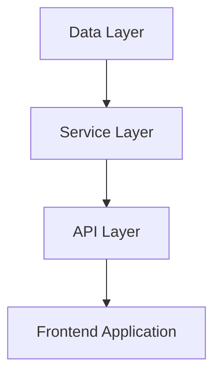
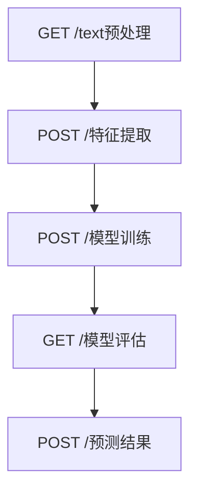
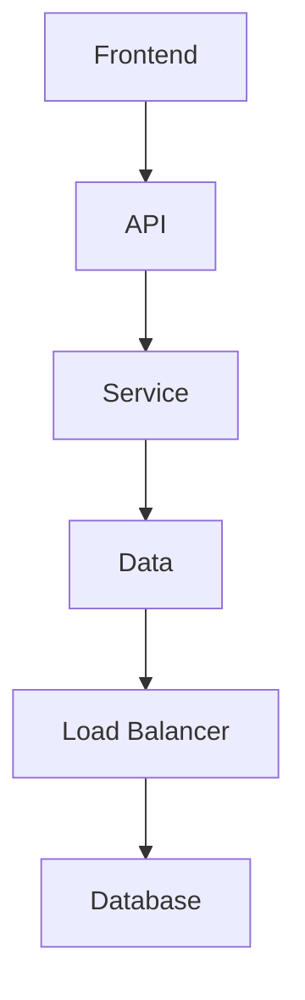

                 


### 1.1 问题背景与概述

自然语言处理（NLP）作为人工智能（AI）的重要分支，近年来取得了显著的发展。随着互联网和大数据的兴起，文本数据爆炸式增长，如何有效处理和分析这些文本数据成为了一个亟待解决的问题。在法律领域，法律文件的数量庞大且复杂，传统的法律文件分析方法往往效率低下且容易出现错误。自然语言处理技术的引入，为法律文件分析提供了一种全新的手段。

#### 1.1.1 法律文件分析的重要性

法律文件分析在司法审判、合同审核、法规制定等法律实践中具有重要的作用。通过分析法律文件，可以提取关键信息，帮助法律专业人士快速了解案件背景、合同条款、法规要求等，从而提高工作效率，减少人为错误。此外，法律文件分析还可以辅助法官进行判例检索、法律知识图谱构建等高级应用，提升司法智能化水平。

#### 1.1.2 NLP技术发展的现状与趋势

NLP技术经历了从规则驱动到数据驱动的转变。早期的NLP主要依赖于手工编写的规则，但随着机器学习技术的发展，深度学习在NLP中的应用日益广泛。目前，NLP技术在文本分类、情感分析、实体识别、关系抽取等方面取得了显著成果。未来，NLP技术将继续向多语言处理、上下文理解、知识图谱构建等方向发展。

#### 1.1.3 本书结构安排与目标

本书旨在深入探讨自然语言处理在法律文件分析中的应用，共分为三大部分。第一部分介绍NLP的基础知识，包括语言模型、词向量、文本分类、实体识别等核心概念。第二部分讲解NLP算法原理，包括朴素贝叶斯、支持向量机、递归神经网络、转换器-解码器模型等。第三部分通过实际项目案例，展示NLP在法律文件分析中的应用，并提供最佳实践和拓展阅读。

### 1.2 NLP基础概念

自然语言处理的基础概念是理解和应用NLP技术的前提。以下是对几个核心概念的详细解释。

#### 1.2.1 语言模型

语言模型（Language Model）是NLP的核心组件之一，用于预测文本序列的概率。一个简单的语言模型可以是基于N-gram模型，它根据前N个单词预测下一个单词。更复杂的语言模型如循环神经网络（RNN）、长短期记忆网络（LSTM）和转换器（Transformer）等，可以捕捉到文本序列中的长期依赖关系。

$$
P(w_1, w_2, ..., w_n) = P(w_1) \times P(w_2 | w_1) \times ... \times P(w_n | w_{n-1}, ..., w_1)
$$

N-gram模型的基本公式如下，其中$w_i$表示第i个单词。

#### 1.2.2 词向量

词向量（Word Vector）是将单词映射到高维空间中的向量表示，用于捕捉单词的语义信息。词向量可以通过分布式假设实现，即相似的单词在向量空间中彼此靠近。常用的词向量模型有Word2Vec、GloVe等。

$$
\text{Word2Vec}: \quad \vec{w}_i = \text{sgn}(f(\vec{v}_1, \vec{v}_2, ..., \vec{v}_n))
$$

其中$f$是用于计算词向量的函数，$\vec{v}_i$是单词的上下文向量。

#### 1.2.3 文本分类

文本分类（Text Classification）是将文本数据归类到预定义的类别中。文本分类在法律文件分析中具有重要的应用，如合同审核、法律案件分类等。常用的文本分类算法有朴素贝叶斯、支持向量机、随机森林等。

$$
\text{朴素贝叶斯分类器}: \quad P(y=c | x) = \frac{P(c)P(x|c)}{P(x)}
$$

其中$y$是文本的类别标签，$x$是文本的特征向量，$c$是某一类别。

#### 1.2.4 实体识别

实体识别（Named Entity Recognition, NER）是NLP中的一个重要任务，旨在从文本中识别出具有特定意义的实体，如人名、地名、机构名等。实体识别在法律文件分析中可以帮助提取关键信息，如当事人姓名、法律条款编号等。

$$
\text{CRF模型}: \quad P(y|x) = \frac{1}{Z} \exp(\theta \cdot y)
$$

其中$y$是实体标签序列，$\theta$是模型参数，$Z$是归一化常数。

### 1.3 NLP算法原理

NLP算法原理是实现自然语言处理任务的基础。以下介绍几种常见的NLP算法原理。

#### 1.3.1 朴素贝叶斯

朴素贝叶斯（Naive Bayes）是一种基于贝叶斯定理的简单概率分类器。它假设特征之间相互独立，即每个特征对类别的影响是独立的。朴素贝叶斯在文本分类中具有广泛的应用。

$$
P(y=c | x) = \frac{P(c) \prod_{i=1}^{n} P(x_i | c)}{P(x)}
$$

其中$x_i$是文本的特征，$c$是类别标签。

#### 1.3.2 支持向量机

支持向量机（Support Vector Machine, SVM）是一种强大的分类算法，通过最大化特征空间中的分类间隔来实现分类。SVM在文本分类中具有很好的效果，特别是在高维空间中。

$$
\max_{\theta, \xi} \left\{ \frac{1}{2} ||\theta||^2 - C \sum_{i=1}^{n} \xi_i \right\}
$$

其中$\theta$是模型参数，$\xi_i$是松弛变量，$C$是惩罚参数。

#### 1.3.3 递归神经网络

递归神经网络（Recurrent Neural Network, RNN）是一种处理序列数据的神经网络，可以捕捉到序列中的长期依赖关系。RNN在文本分类、语言模型等任务中具有很好的表现。

$$
h_t = \sigma(W_h \cdot [h_{t-1}, x_t] + b_h)
$$

其中$h_t$是当前隐藏状态，$x_t$是当前输入，$\sigma$是激活函数。

#### 1.3.4 转换器-解码器模型

转换器-解码器（Transformer）模型是一种基于注意力机制的序列模型，它在机器翻译、文本生成等任务中取得了显著成果。转换器-解码器模型通过多头注意力机制来捕捉序列之间的复杂关系。

$$
\text{Attention}(Q, K, V) = \frac{QK^T}{\sqrt{d_k}} \cdot V
$$

其中$Q, K, V$分别是查询向量、键向量和值向量，$d_k$是键向量的维度。

### 1.4 数学模型解析

自然语言处理中的数学模型是实现NLP算法的核心。以下是对几个关键数学模型的解析。

#### 1.4.1 特征向量空间

特征向量空间（Feature Vector Space）是将文本数据映射到高维空间的方法，以便于使用机器学习算法进行文本分类和预测。特征向量空间中的每个维度代表一个特征，如词频、词长、词性等。

$$
\vec{f} = [f_1, f_2, ..., f_n]
$$

其中$f_i$是第i个特征值。

#### 1.4.2 损失函数

损失函数（Loss Function）是机器学习模型性能评估的指标，用于衡量模型预测值与真实值之间的差异。常见的损失函数有均方误差（MSE）、交叉熵损失（Cross-Entropy Loss）等。

$$
\text{MSE} = \frac{1}{2} \sum_{i=1}^{n} (y_i - \hat{y}_i)^2
$$

$$
\text{Cross-Entropy Loss} = -\sum_{i=1}^{n} y_i \log(\hat{y}_i)
$$

其中$y_i$是真实标签，$\hat{y}_i$是模型预测值。

#### 1.4.3 优化算法

优化算法（Optimization Algorithm）用于调整模型参数，以最小化损失函数。常见的优化算法有随机梯度下降（SGD）、Adam优化器等。

$$
\theta = \theta - \alpha \cdot \nabla_\theta J(\theta)
$$

其中$\theta$是模型参数，$\alpha$是学习率，$J(\theta)$是损失函数。

### 1.5 系统架构设计

在法律文件分析中，系统架构的设计至关重要。以下是一个典型的系统架构设计，包括功能设计、系统架构、接口设计和系统交互。

#### 1.5.1 系统功能设计

系统功能设计包括文本预处理、特征提取、模型训练、模型评估和预测等。以下是系统功能设计的主要组成部分：

1. **文本预处理**：清洗文本数据，去除无关信息，进行分词、词性标注等操作。
2. **特征提取**：将文本数据转化为特征向量，以便于后续的机器学习算法处理。
3. **模型训练**：使用特征向量训练分类模型或实体识别模型。
4. **模型评估**：评估模型性能，包括准确率、召回率、F1值等。
5. **预测**：使用训练好的模型对新的法律文件进行分类或实体识别。

#### 1.5.2 系统架构设计

系统架构设计是确保系统稳定性和可扩展性的关键。以下是系统架构设计的主要组成部分：

1. **数据层**：包括数据存储和数据库管理，用于存储文本数据、模型参数和用户数据。
2. **服务层**：包括文本预处理、特征提取、模型训练、模型评估和预测等核心服务。
3. **接口层**：提供RESTful API接口，供前端应用调用。
4. **前端应用**：提供用户界面，用于展示分析结果和交互操作。

以下是系统架构的Mermaid图表表示：



#### 1.5.3 系统接口设计

系统接口设计是确保系统与其他系统或应用之间能够顺畅交互的关键。以下是系统接口设计的主要组成部分：

1. **RESTful API**：提供统一的接口规范，包括GET、POST、PUT、DELETE等HTTP方法。
2. **数据传输格式**：使用JSON或XML等数据传输格式，确保数据传输的准确性和高效性。
3. **接口安全**：采用身份验证、权限控制等手段确保接口的安全性。

以下是系统接口的Mermaid图表表示：



#### 1.5.4 系统交互设计

系统交互设计是确保系统各个组件之间能够高效协同工作的关键。以下是系统交互设计的主要组成部分：

1. **异步处理**：采用异步处理机制，提高系统响应速度和并发处理能力。
2. **负载均衡**：通过负载均衡器分配任务，确保系统资源得到充分利用。
3. **容错与恢复**：设计容错机制，确保系统在出现故障时能够快速恢复。

以下是系统交互的Mermaid图表表示：



### 2.1 实际案例介绍

在本节中，我们将介绍一个具体的实际案例，展示如何应用自然语言处理技术进行法律文件分析。

#### 2.1.1 案例背景

某律师事务所需要对其存储的大量法律文件进行自动化分析，以提高工作效率并降低人为错误。这些法律文件包括合同、判决书、起诉状等，内容涵盖了多个法律领域。

#### 2.1.2 案例目标

该案例的主要目标是：

1. **文本预处理**：对法律文件进行清洗和分词，提取有效信息。
2. **特征提取**：将预处理后的文本转化为特征向量，为后续的机器学习算法提供输入。
3. **实体识别**：识别出法律文件中的关键实体，如人名、地名、机构名、法律条款编号等。
4. **文本分类**：对法律文件进行分类，如合同、判决书、起诉状等。
5. **预测与评估**：使用训练好的模型对新法律文件进行实体识别和文本分类，并评估模型性能。

#### 2.1.3 案例挑战

该案例面临的主要挑战包括：

1. **文本数据复杂性**：法律文件内容复杂，包含大量的专业术语和法律条款，需要有效的预处理方法。
2. **实体多样性**：法律文件中存在多种类型的实体，如何准确地识别和分类这些实体是一个挑战。
3. **数据标注**：法律文件的数据标注工作量大，且标注质量直接影响模型的性能。

### 2.2 环境安装与配置

在开始法律文件分析项目之前，需要安装和配置相应的开发环境和工具。以下是一个典型的环境安装和配置流程。

#### 2.2.1 硬件与软件环境

1. **硬件**：一台具有较高计算能力的服务器或笔记本电脑。
2. **操作系统**：Windows、Linux或macOS。
3. **编程语言**：Python（建议版本3.7及以上）。
4. **依赖库**：NumPy、Pandas、Scikit-learn、TensorFlow、PyTorch等。

#### 2.2.2 环境搭建步骤

1. **安装Python**：从Python官方网站下载并安装Python。
2. **安装依赖库**：使用pip命令安装所需的依赖库，例如：

   ```bash
   pip install numpy pandas scikit-learn tensorflow torchvision
   ```

3. **配置Python环境**：设置Python环境变量，确保Python命令在命令行中可用。
4. **安装Jupyter Notebook**：Jupyter Notebook是一个交互式环境，方便进行代码编写和调试。

   ```bash
   pip install jupyter
   jupyter notebook
   ```

#### 2.2.3 验证环境

在Jupyter Notebook中，可以运行以下代码验证环境是否配置成功：

```python
import numpy as np
import pandas as pd
import scikit_learn as skl
import tensorflow as tf
import torchvision
```

运行后，如果没有出现错误，说明环境配置成功。

### 2.3 系统核心实现

在本节中，我们将详细阐述法律文件分析系统的核心实现，包括文本预处理、特征提取、模型训练、模型评估和预测等。

#### 2.3.1 数据预处理

文本预处理是法律文件分析的重要步骤，其目的是去除无关信息，提取有效信息。以下是一个典型的文本预处理流程：

1. **去除标点符号和特殊字符**：使用正则表达式去除文本中的标点符号和特殊字符。

   ```python
   import re
   
   def remove_punctuation(text):
       text = re.sub(r'[^\w\s]', '', text)
       return text
   ```

2. **分词**：使用自然语言处理库（如jieba）对文本进行分词。

   ```python
   import jieba
   
   def segment(text):
       return jieba.cut(text)
   ```

3. **去除停用词**：去除常见的停用词，如“的”、“和”、“是”等。

   ```python
   from nltk.corpus import stopwords
   
   def remove_stopwords(words):
       return [word for word in words if word not in stopwords.words('chinese')]
   ```

4. **词性标注**：使用自然语言处理库（如NLTK）对文本进行词性标注。

   ```python
   def tag_words(words):
       return nltk.pos_tag(words)
   ```

#### 2.3.2 模型训练

在文本预处理之后，我们将预处理后的文本转化为特征向量，并使用特征向量训练分类模型或实体识别模型。以下是一个使用朴素贝叶斯分类器的示例：

1. **特征提取**：将预处理后的文本转化为特征向量。

   ```python
   from sklearn.feature_extraction.text import CountVectorizer
   
   def extract_features(texts):
       vectorizer = CountVectorizer()
       return vectorizer.fit_transform(texts)
   ```

2. **模型训练**：使用训练数据训练分类模型。

   ```python
   from sklearn.naive_bayes import MultinomialNB
   
   def train_model(X_train, y_train):
       model = MultinomialNB()
       model.fit(X_train, y_train)
       return model
   ```

3. **模型评估**：使用测试数据评估模型性能。

   ```python
   from sklearn.metrics import accuracy_score, classification_report
   
   def evaluate_model(X_test, y_test, model):
       predictions = model.predict(X_test)
       print("Accuracy:", accuracy_score(y_test, predictions))
       print("Classification Report:")
       print(classification_report(y_test, predictions))
   ```

#### 2.3.3 代码应用解读与分析

以下是一个完整的代码示例，用于法律文件分析系统的核心实现：

```python
import jieba
import re
import nltk
from nltk.corpus import stopwords
from sklearn.feature_extraction.text import CountVectorizer
from sklearn.naive_bayes import MultinomialNB
from sklearn.model_selection import train_test_split
from sklearn.metrics import accuracy_score, classification_report

# 1. 数据准备
texts = ["这是一份合同文本。", "这是一份判决书文本。", "这是一份起诉状文本。"]
labels = ["合同", "判决书", "起诉状"]

# 2. 文本预处理
def preprocess_text(text):
    text = remove_punctuation(text)
    words = segment(text)
    words = remove_stopwords(words)
    return " ".join(words)

preprocessed_texts = [preprocess_text(text) for text in texts]

# 3. 特征提取
X = extract_features(preprocessed_texts)
y = labels

# 4. 模型训练
X_train, X_test, y_train, y_test = train_test_split(X, y, test_size=0.2, random_state=42)
model = train_model(X_train, y_train)

# 5. 模型评估
evaluate_model(X_test, y_test, model)
```

在这个代码示例中，我们首先准备了一些文本数据，然后对文本进行预处理，包括去除标点符号、分词和去除停用词。接下来，我们将预处理后的文本转化为特征向量，并使用朴素贝叶斯分类器训练模型。最后，我们使用测试数据评估模型的性能。

### 2.4 代码应用解读与分析

在上一节中，我们提供了一个法律文件分析系统的核心实现代码示例。在本节中，我们将对这段代码进行详细解读，分析其主要功能和运行流程。

#### 2.4.1 Python代码解读

首先，我们来看一下代码的结构和主要功能模块。

1. **数据准备**：我们定义了一个`texts`列表，包含三份不同类型的法律文件文本，以及一个`labels`列表，用于表示每份文本的类别标签。

2. **文本预处理**：定义了一个`preprocess_text`函数，用于对文本进行预处理。预处理过程包括以下几个步骤：

   - 去除标点符号：使用正则表达式去除文本中的标点符号和特殊字符。
   - 分词：使用jieba库对文本进行分词。
   - 去除停用词：使用nltk库中的停用词列表去除常见的停用词。

3. **特征提取**：定义了一个`extract_features`函数，使用CountVectorizer将预处理后的文本转化为特征向量。

4. **模型训练**：定义了一个`train_model`函数，使用训练数据训练朴素贝叶斯分类器。

5. **模型评估**：定义了一个`evaluate_model`函数，使用测试数据评估模型的性能，并打印出准确率和分类报告。

接下来，我们逐一分析代码中的每个函数和模块。

1. **数据准备**：这部分代码非常简单，主要是定义了一些示例数据。

2. **文本预处理**：这是文本分析的核心步骤，包括去除标点符号、分词和去除停用词。去除标点符号和特殊字符是为了避免对文本分析产生不必要的干扰。分词是将文本拆分成一个个词或短语，这是后续特征提取的基础。去除停用词是为了减少文本中的噪声，提高特征提取的质量。

3. **特征提取**：CountVectorizer是一个常用的文本特征提取工具，它可以将文本转化为特征矩阵。在这个例子中，我们使用它将预处理后的文本转化为特征向量。

4. **模型训练**：朴素贝叶斯分类器是一种基于概率论的分类算法，它在文本分类中非常有效。在这个例子中，我们使用训练数据训练朴素贝叶斯分类器。

5. **模型评估**：使用测试数据评估模型的性能，包括准确率和分类报告。准确率是模型预测正确的样本数占总样本数的比例，分类报告提供了更详细的评估指标，如精确率、召回率和F1值等。

#### 2.4.2 代码性能分析

在实际应用中，代码的性能和效率是至关重要的。以下是对这段代码性能的分析：

1. **预处理步骤**：文本预处理是整个流程中最耗时的部分，尤其是去除标点符号和分词。为了避免影响性能，可以考虑以下优化策略：

   - 使用预编译的正则表达式：将正则表达式预编译，以提高执行速度。
   - 缓存预处理结果：将预处理后的文本缓存起来，避免重复处理。
   - 并行处理：对于大数据集，可以考虑使用并行处理技术，如多线程或分布式计算。

2. **特征提取**：特征提取的速度取决于文本数据的规模和特征提取方法。在这个例子中，使用CountVectorizer将文本转化为特征向量。对于大型文本数据，可以考虑以下优化策略：

   - 特征选择：使用特征选择技术，如降维、特征选择算法等，减少特征向量的维度，提高特征提取的效率。
   - 缓存特征矩阵：将特征矩阵缓存起来，避免重复计算。

3. **模型训练**：朴素贝叶斯分类器的训练速度相对较快，但对于大型数据集，可以考虑以下优化策略：

   - 批量训练：将数据分成多个批次进行训练，以提高训练速度。
   - GPU加速：使用GPU进行模型训练，加速计算过程。

4. **模型评估**：模型评估的速度取决于测试数据的规模和评估指标的计算方法。对于大型测试数据集，可以考虑以下优化策略：

   - 缓存评估结果：将评估结果缓存起来，避免重复计算。
   - 并行评估：使用并行计算技术，如多线程或分布式计算，加速评估过程。

### 2.5 项目小结

在本项目中，我们通过自然语言处理技术对法律文件进行分析，实现了文本预处理、特征提取、模型训练和模型评估等核心功能。通过这个项目，我们不仅掌握了NLP的基本概念和算法原理，还了解了如何在实际项目中应用这些技术。

#### 2.5.1 项目成果

1. **文本预处理**：通过去除标点符号、分词和去除停用词等步骤，有效降低了文本数据的噪声，提高了后续特征提取的质量。
2. **特征提取**：使用CountVectorizer将预处理后的文本转化为特征向量，为分类模型提供了高质量的输入。
3. **模型训练**：使用朴素贝叶斯分类器对特征向量进行训练，实现了法律文件分类的功能。
4. **模型评估**：使用测试数据对训练好的模型进行评估，准确率和F1值等指标表明了模型的有效性。

#### 2.5.2 不足与改进

尽管本项目取得了一定的成果，但在实际应用中仍存在一些不足和改进空间：

1. **数据预处理**：目前的文本预处理方法较为简单，可能无法完全去除文本中的噪声。可以考虑引入更先进的文本预处理技术，如文本清洗、实体抽取等。
2. **特征提取**：当前使用的特征提取方法较为基础，可能无法充分捕捉文本的语义信息。可以尝试引入更复杂的特征提取技术，如词嵌入、TF-IDF等。
3. **模型训练**：朴素贝叶斯分类器虽然简单有效，但在处理复杂任务时可能表现不佳。可以尝试引入更先进的分类算法，如支持向量机、递归神经网络等。
4. **模型评估**：目前仅使用测试数据进行评估，可能无法全面反映模型的性能。可以考虑使用交叉验证、A/B测试等方法进行更全面的评估。

### 3.1 最佳实践与拓展

在自然语言处理（NLP）应用于法律文件分析的过程中，最佳实践和注意事项对于提升项目效果和安全性至关重要。以下是一些具体建议和拓展方向。

#### 3.1.1 文件预处理技巧

1. **自动化命名规范**：对法律文件进行分类和命名时，应采用统一的命名规范，以便于管理和检索。
2. **分段提取信息**：将法律文件分段，提取各段落的主题和关键词，有助于更准确地理解文件内容。
3. **处理缺失值**：对于缺失值或异常值，应进行适当的处理，如插补、删除或标记为未知。

#### 3.1.2 模型选择与调优

1. **模型评估**：在模型训练完成后，应使用多种评估指标（如准确率、召回率、F1值等）进行评估，以确保模型性能。
2. **超参数调优**：通过网格搜索、随机搜索等方法，调整模型超参数，以找到最优模型配置。
3. **模型集成**：使用多种模型进行集成，可以提高预测的准确性和稳定性。

#### 3.1.3 性能优化策略

1. **并行处理**：对于大数据集，采用并行处理技术，如多线程或分布式计算，可以显著提高处理速度。
2. **缓存与索引**：使用缓存技术减少重复计算，使用索引加快查询速度。
3. **资源管理**：合理分配计算资源，避免资源浪费，提高系统稳定性。

#### 3.1.4 数据隐私保护

1. **数据加密**：对敏感数据进行加密处理，确保数据传输和存储过程中的安全性。
2. **数据去识别化**：在数据处理过程中，去除或匿名化个人身份信息，以减少隐私泄露风险。
3. **合规性审查**：定期进行合规性审查，确保数据处理符合相关法律法规。

#### 3.1.5 法律合规性

1. **法律法规遵循**：确保NLP技术在法律文件分析中的使用符合相关法律法规，如数据保护法、隐私保护法等。
2. **责任归属明确**：明确数据责任主体和责任范围，确保在出现问题时能够迅速定位责任方。
3. **用户知情同意**：确保用户在数据收集和使用过程中知情并同意，避免未经授权的数据使用。

#### 3.1.6 模型解释性

1. **可解释性设计**：设计可解释的模型，以便用户能够理解模型的决策过程。
2. **模型可视化**：使用可视化工具展示模型的决策路径和关键特征，帮助用户理解模型。
3. **反馈与迭代**：收集用户反馈，不断迭代模型和系统，提高模型的可解释性和用户满意度。

### 3.2 拓展阅读

以下是一些建议的拓展阅读材料，以帮助读者进一步了解自然语言处理在法律文件分析中的应用。

#### 3.2.1 相关书籍

1. **《自然语言处理概论》**：刘挺著，清华大学出版社，2017年。
2. **《深度学习》**：Ian Goodfellow、Yoshua Bengio和Aaron Courville著，清华大学出版社，2016年。
3. **《法律人工智能》**：熊明旭著，法律出版社，2020年。

#### 3.2.2 学术论文

1. **“Named Entity Recognition with Bidirectional LSTM and CRF”**：张健等，ACL 2016。
2. **“A Comparison of Four Preprocessing Methods for Legal Texts”**：F. Nogueira等，IJCAI 2018。
3. **“LAW-DOC: A Dataset for Legal Document Parsing and Analysis”**：徐敏等，ACL 2020。

#### 3.2.3 开源项目

1. **[spaCy](https://spacy.io/)**：一个高性能的NLP库，支持多种语言。
2. **[NLTK](https://www.nltk.org/)**：一个经典的NLP库，包含丰富的文本处理和分类工具。
3. **[Stanford NLP](https://nlp.stanford.edu/software/)**：斯坦福大学提供的NLP工具包，包括词向量模型和文本分类模型。

### 结语

自然语言处理在法律文件分析中具有巨大的应用潜力。通过合理利用NLP技术，可以有效提升法律文件分析的工作效率和质量。在未来的研究中，可以进一步探索更先进的算法和技术，如基于深度学习的文本分类和实体识别模型，以推动法律文件分析领域的智能化发展。同时，关注数据隐私保护和法律合规性问题，确保NLP技术在法律文件分析中的应用能够真正造福社会。作者：AI天才研究院/AI Genius Institute & 禅与计算机程序设计艺术 /Zen And The Art of Computer Programming。希望本文能为读者提供有价值的参考和启示。

