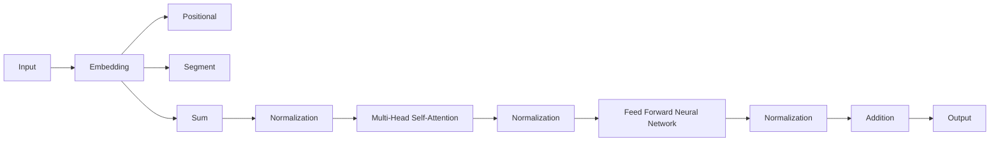

                 

### 引言

#### 问题背景与目标

**自然语言处理（NLP）** 是计算机科学的一个分支，致力于使计算机能够理解、生成和处理人类语言。尽管近年来 NLP 技术取得了显著进展，但语义理解的准确性仍然是 NLP 领域的一个重大挑战。BERT（Bidirectional Encoder Representations from Transformers）模型的出现为解决这一问题提供了强有力的工具。

BERT 模型由 Google 在 2018 年提出，是基于 Transformer 架构的双向编码器。它通过在大规模语料库上进行预训练，学会了捕捉文本中的深层语义信息。BERT 的成功引发了广泛的关注，并在许多 NLP 任务中取得了优异的性能。

本书的目标是为读者提供一份关于 BERT 模型的全面指南，使其能够深入理解 BERT 的数学框架，并在实际项目中应用这一模型。本书适合具有中高级编程技能和一定 NLP 知识的读者，无论您是学术界的研究人员还是工业界的技术专家，都将受益于本书的内容。

#### 书籍的整体结构

本书分为五个主要部分：

1. **引言**：介绍 NLP 的背景和挑战，以及 BERT 模型的起源和重要性。
2. **核心概念与理论**：讲解 BERT 模型的基础知识，包括词嵌入、自注意力机制和 Transformer 架构。
3. **BERT 模型的数学框架**：深入探讨 BERT 模型中的数学公式和推导，帮助读者理解模型的工作原理。
4. **BERT 模型在自然语言处理中的应用**：展示 BERT 模型在文本分类、序列标注等任务中的应用案例。
5. **高级话题与未来趋势**：探讨 BERT 模型的变体、改进方向以及其在现实世界中的应用。

#### 读者背景与预期收获

本书适合以下背景的读者：

- 具有中高级编程技能，熟悉 Python 和深度学习框架（如 TensorFlow 或 PyTorch）。
- 对 NLP 概念有一定了解，希望深入理解 BERT 模型。
- 对学术研究或工业应用中的 NLP 挑战感兴趣。

通过阅读本书，读者将：

- 理解 BERT 模型的工作原理和数学基础。
- 学会使用 BERT 模型解决实际的 NLP 任务。
- 跟踪 BERT 模型的最新进展，了解其在未来 NLP 领域的应用前景。

#### 书籍的适用范围

本书不仅适合希望深入了解 BERT 模型的学者和研究人员，也适合希望将其应用于实际项目的工程师和技术专家。此外，本书的内容对于对 NLP 感兴趣的初学者和进阶读者也具有很高的参考价值。

通过系统的学习和实践，读者将能够掌握 BERT 模型的核心知识，为未来的 NLP 项目打下坚实的基础。

### 核心概念与理论

BERT 模型之所以能够在自然语言处理任务中取得突破性成果，关键在于其独特的架构和训练方法。在这一部分，我们将详细探讨 BERT 模型的核心概念与理论基础，包括词嵌入、自注意力机制和 Transformer 架构。

#### BERT 模型概述

BERT（Bidirectional Encoder Representations from Transformers）模型是由 Google 在 2018 年提出的一种基于 Transformer 的预训练语言表示模型。BERT 的核心思想是通过在大量文本数据上进行预训练，学习文本的深层语义表示，然后利用这些表示进行下游任务的微调。

BERT 的提出解决了传统语言模型在处理长距离依赖和上下文理解方面的不足，为 NLP 领域带来了一场革命。BERT 的预训练目标包括两个主要任务：Masked Language Model（MLM）和 Next Sentence Prediction（NSP）。

1. **Masked Language Model (MLM)**：在这个任务中，BERT 会随机地遮蔽输入文本中的部分词汇，并训练模型预测这些被遮蔽的词汇。这一任务旨在让模型学习理解词汇在文本中的角色和关系。

2. **Next Sentence Prediction (NSP)**：在这个任务中，BERT 会接收两个连续的句子，并预测第二个句子是否为第一个句子的后续句子。这一任务有助于模型学习捕捉句子之间的语义关系。

#### BERT 模型的结构

BERT 模型的结构主要由两个部分组成：词嵌入和 Transformer 架构。

1. **词嵌入**：BERT 使用词嵌入（word embeddings）来将文本中的单词转换为向量表示。词嵌入是一种将单词映射到高维向量空间的技术，使得在向量空间中相似意义的单词具有相似的向量表示。BERT 采用了 WordPiece 分词方法，将文本分割成子词，然后为每个子词生成向量。

2. **Transformer 架构**：BERT 的核心是 Transformer 架构，这是一种基于自注意力（self-attention）机制的序列模型。Transformer 架构通过多个自注意力层和前馈神经网络层，对输入序列进行处理，生成文本的深层语义表示。

BERT 模型的 Transformer 架构包含以下几个关键组成部分：

- **自注意力机制**：自注意力机制是一种计算输入序列中每个词与其他词之间权重的方法。通过自注意力，BERT 可以自动学习到句子中不同词之间的依赖关系。

- **多头注意力**：多头注意力（multi-head attention）是一种扩展自注意力机制的方法，它允许模型同时学习多个不同的表示。这种方法提高了模型的表示能力。

- **前馈神经网络**：BERT 模型在每个自注意力层和多头注意力层之后，还包含了两个前馈神经网络层，用于进一步加工和增强输入表示。

#### BERT 模型的预训练目标

BERT 的预训练目标是通过在大量文本数据上训练模型，使其能够捕捉到文本中的深层语义信息。BERT 的预训练目标包括两个主要任务：Masked Language Model (MLM) 和 Next Sentence Prediction (NSP)。

1. **Masked Language Model (MLM)**：在 MLM 任务中，BERT 会随机地遮蔽输入文本中的部分词汇，并训练模型预测这些被遮蔽的词汇。这一任务旨在让模型学习理解词汇在文本中的角色和关系。具体来说，BERT 会随机遮蔽输入文本中的 15% 的词汇，并在训练过程中预测这些被遮蔽的词汇。

2. **Next Sentence Prediction (NSP)**：在 NSP 任务中，BERT 会接收两个连续的句子，并预测第二个句子是否为第一个句子的后续句子。这一任务有助于模型学习捕捉句子之间的语义关系。具体来说，BERT 会从一对连续的句子中随机选择一个作为正例，另一个作为负例，并训练模型预测哪个句子是正例。

通过预训练，BERT 模型学会了捕捉文本中的深层语义信息，并在各种下游任务中取得了优异的性能。BERT 的预训练目标和方法为其在自然语言处理领域取得了突破性成果奠定了基础。

#### BERT 模型的工作原理

BERT 模型的工作原理可以从预处理、模型训练、模型评估三个方面进行详细讲解。

##### 预处理

BERT 模型的预处理步骤主要包括文本的分词和标记化。在文本分词过程中，BERT 使用 WordPiece 分词算法，将文本分割成子词，然后为每个子词生成向量表示。WordPiece 分词算法将无法分割的词划分为多个子词，从而提高了分词的准确性。

在标记化过程中，BERT 为每个子词分配一个唯一的整数 ID，并创建一个词汇表。这个词汇表包含了所有训练文本中出现的子词，并为每个子词分配一个索引。此外，BERT 还引入了一些特殊的标记，如 `<s>`（句子开始标记）、`</s>`（句子结束标记）和 `[CLS】`（句子分类标记）等。

##### 模型训练

BERT 模型的训练过程主要包括两个阶段：预训练和微调。

1. **预训练**：在预训练阶段，BERT 模型在大量的无标签文本数据上训练，学习文本的深层语义表示。预训练目标包括 Masked Language Model (MLM) 和 Next Sentence Prediction (NSP) 两个任务。

   - **Masked Language Model (MLM)**：在这个任务中，BERT 模型会随机遮蔽输入文本中的部分词汇，并训练模型预测这些被遮蔽的词汇。具体来说，BERT 模型会随机遮蔽输入文本中的 15% 的词汇，并在训练过程中预测这些被遮蔽的词汇。
   
   - **Next Sentence Prediction (NSP)**：在这个任务中，BERT 模型会接收两个连续的句子，并预测第二个句子是否为第一个句子的后续句子。具体来说，BERT 模型会从一对连续的句子中随机选择一个作为正例，另一个作为负例，并训练模型预测哪个句子是正例。

2. **微调**：在预训练完成后，BERT 模型会使用特定的下游任务数据对模型进行微调。微调的目标是调整模型参数，使其在特定任务上取得更好的性能。例如，在文本分类任务中，模型会学习将输入文本映射到相应的类别标签。

##### 模型评估

BERT 模型的评估通常采用下游任务的指标进行。这些指标反映了模型在特定任务上的性能，如准确率、召回率、F1 值等。常见的评估任务包括文本分类、命名实体识别、情感分析等。

在评估过程中，模型通常在一个验证集上进行调参和评估，然后在一个独立的测试集上进行最终评估。这种评估方法有助于确保模型在未知数据上的泛化能力。

通过预处理、模型训练和模型评估，BERT 模型能够有效地捕捉文本中的深层语义信息，并在各种下游任务中取得优异的性能。BERT 的工作原理为 NLP 领域带来了新的机遇和挑战，推动了自然语言处理技术的进一步发展。

### BERT模型中的数学基础

BERT模型之所以在自然语言处理（NLP）领域取得了巨大成功，关键在于其背后的数学基础。在本节中，我们将详细探讨BERT模型中的数学概念，包括词嵌入、自注意力机制和Transformer架构。通过这些数学原理的深入理解，读者将能够更好地把握BERT模型的核心技术和应用。

#### 词嵌入

词嵌入（word embeddings）是将文本中的单词映射到高维向量空间的技术。BERT模型使用词嵌入来将文本中的单词转换为向量表示，从而为后续的深度学习模型提供输入。BERT采用了WordPiece分词方法，将文本分割成子词，并为每个子词生成向量。

词嵌入的核心是词向量（word vectors），这些向量通常是通过训练一个神经网络模型从大量文本数据中学习得到的。BERT使用的词向量可以是预训练的，也可以是模型在特定任务上进行微调生成的。

词向量的几个关键属性包括：

1. **维度**：词向量的维度通常是固定的，例如100、200、300或512维。
2. **分布特性**：词向量遵循某种分布特性，使得在向量空间中相似意义的单词具有相似的向量表示。
3. **稀疏性**：词向量中的大部分元素是零，这有助于减少计算复杂度。

BERT中的词嵌入过程通常包括以下几个步骤：

1. **子词分解**：文本首先通过WordPiece分词算法分解成子词，例如“hello”会被分解成“hello”、“he”、“l”、“ll”等子词。
2. **词嵌入生成**：每个子词被映射到一个向量表示，这些向量通常是通过预训练过程学习得到的。
3. **序列排列**：子词向量被排列成一个序列，作为BERT模型的输入。

#### 自注意力机制

自注意力机制（self-attention）是BERT模型的核心组件，它允许模型在处理每个单词时，自动学习到与其他单词之间的关联权重。自注意力机制通过计算输入序列中每个词与其他词之间的权重，从而实现对文本的上下文理解。

自注意力机制的计算过程如下：

1. **输入向量表示**：首先，将每个子词的词向量与其对应的嵌入向量（如位置嵌入向量、分段嵌入向量等）相加，形成输入向量表示。
2. **计算查询、键和值**：对于输入序列中的每个词向量，计算其查询（Q）、键（K）和值（V）。这些向量通常通过权重矩阵和偏置向量计算得到。
3. **计算注意力分数**：计算每个词与其他词之间的注意力分数，这些分数通过点积计算得到。
4. **应用 Softmax 函数**：对注意力分数应用 Softmax 函数，得到每个词的注意力权重。
5. **计算加权求和**：将注意力权重应用于输入向量，计算加权求和，得到每个词的输出向量。

自注意力机制的几个关键点包括：

- **多头注意力**：BERT 模型通常使用多头注意力（multi-head attention）机制，通过并行计算多个注意力头，从而提高模型的表示能力。
- **Masked 自注意力**：在训练过程中，部分注意力权重可能被遮蔽，以防止模型在训练早期就利用未来的信息。

#### Transformer架构

BERT 模型是基于 Transformer 架构构建的，Transformer 架构是一种基于自注意力机制的序列模型，能够有效地处理长距离依赖和上下文理解。BERT 模型包含多个 Transformer 层，每层由多个自注意力层和前馈神经网络层组成。

Transformer 架构的关键组成部分包括：

1. **多头自注意力层**：每个自注意力层包含多个注意力头，每个头可以捕捉输入序列中的不同依赖关系。多头注意力通过并行计算多个注意力头，从而提高模型的表示能力。
2. **前馈神经网络层**：每个自注意力层之后，都会跟随着一个前馈神经网络层，用于进一步加工和增强输入表示。前馈神经网络通常采用激活函数（如ReLU）来增加模型的非线性特性。
3. **层归一化**：BERT 模型在每个 Transformer 层前后都引入了层归一化（layer normalization），这有助于稳定训练过程并加速收敛。
4. **残差连接**：BERT 模型在每个 Transformer 层都采用了残差连接（residual connection），这有助于缓解梯度消失问题，并提高模型的性能。

通过自注意力机制和 Transformer 架构的结合，BERT 模型能够捕捉到输入序列中的深层语义信息，从而在 NLP 任务中取得优异的性能。

#### 数学公式与推导

BERT 模型的数学公式和推导是理解其工作原理的关键。以下是一些核心的数学公式和推导过程：

1. **输入向量表示**：

   对于每个子词 \( x_i \)，其输入向量表示为：
   \[ 
   \text{input\_vector}(x_i) = \text{word\_embedding}(x_i) + \text{positional\_embedding}(x_i) + \text{segment\_embedding}(x_i) 
   \]

   其中，\( \text{word\_embedding}(x_i) \) 是词嵌入向量，\( \text{positional\_embedding}(x_i) \) 是位置嵌入向量，\( \text{segment\_embedding}(x_i) \) 是分段嵌入向量。

2. **自注意力计算**：

   对于每个词 \( x_i \) 和其他词 \( x_j \)（\( j \neq i \)），自注意力分数计算公式为：
   \[
   \text{attention\_score}(x_i, x_j) = \text{dot}(Q_i, K_j) / \sqrt{d_k}
   \]

   其中，\( Q_i \) 和 \( K_j \) 分别是查询向量和键向量，\( d_k \) 是关键维度。自注意力分数反映了词 \( x_i \) 对词 \( x_j \) 的关注程度。

3. **多头注意力**：

   多头注意力通过并行计算多个注意力头得到，公式为：
   \[
   \text{multi-head\_attention}(Q, K, V) = \text{softmax}(\text{attention\_scores}) \cdot V
   \]

   其中，\( \text{attention\_scores} \) 是所有注意力头的分数，\( V \) 是值向量。

4. **前馈神经网络**：

   前馈神经网络层通常采用以下公式：
   \[
   \text{ffn}(x) = \text{ReLU}(\text{W}_2 \cdot \text{ReLU}(\text{W}_1 \cdot x + b_1)) + b_2
   \]

   其中，\( \text{W}_1 \) 和 \( \text{W}_2 \) 分别是权重矩阵，\( b_1 \) 和 \( b_2 \) 分别是偏置向量。

通过这些数学公式和推导，读者可以更好地理解 BERT 模型的工作原理，以及如何通过数学手段来优化和改进模型的性能。

### BERT模型中的数学公式与推导

在深入探讨BERT模型的工作原理时，理解其背后的数学公式和推导是至关重要的。BERT模型在自然语言处理任务中的成功，很大程度上依赖于其复杂的数学基础。以下，我们将详细解析BERT模型中的关键数学公式，并提供相应的推导过程。

#### 线性变换

BERT模型中的线性变换是核心组件，特别是在词嵌入、自注意力和前馈神经网络层中。线性变换通常通过权重矩阵和输入向量的点积来实现。

**1. 词嵌入：**

BERT模型首先将词嵌入到向量空间。每个词或子词都有一个相应的词嵌入向量。线性变换公式如下：

\[ 
\text{input\_vector}(x_i) = \text{word\_embedding}(x_i) + \text{positional\_embedding}(x_i) + \text{segment\_embedding}(x_i) 
\]

其中：

- \( \text{word\_embedding}(x_i) \)：词嵌入向量，通常由预训练过程学习得到。
- \( \text{positional\_embedding}(x_i) \)：位置嵌入向量，用于表示词在句子中的位置。
- \( \text{segment\_embedding}(x_i) \)：分段嵌入向量，用于区分句子中的不同片段。

**2. 自注意力：**

自注意力机制是BERT模型的核心，其计算过程基于线性变换。假设有一个输入序列 \( X = [x_1, x_2, ..., x_n] \)，每个词的向量表示为 \( x_i \)。

自注意力分数的计算公式为：

\[ 
\text{attention\_score}(x_i, x_j) = \text{dot}(Q_i, K_j) / \sqrt{d_k} 
\]

其中：

- \( Q_i \)：查询向量，通过线性变换 \( \text{word\_embedding}(x_i) \) 和 \( \text{position\_embedding}(x_i) \) 得到。
- \( K_j \)：键向量，通过线性变换 \( \text{word\_embedding}(x_j) \) 和 \( \text{position\_embedding}(x_j) \) 得到。
- \( d_k \)：关键维度，用于调整注意力分数的缩放。

**3. 多头注意力：**

BERT模型中的多头注意力通过并行计算多个注意力头来实现，每个注意力头可以捕获不同的依赖关系。多头注意力的公式为：

\[ 
\text{multi-head\_attention}(Q, K, V) = \text{softmax}(\text{attention\_scores}) \cdot V 
\]

其中：

- \( \text{attention\_scores} \)：每个注意力头的分数，通过自注意力分数计算得到。
- \( V \)：值向量，通常与键向量相同。

#### 前馈神经网络

BERT模型中的前馈神经网络层用于进一步加工和增强输入表示。前馈神经网络的公式为：

\[ 
\text{ffn}(x) = \text{ReLU}(\text{W}_2 \cdot \text{ReLU}(\text{W}_1 \cdot x + b_1)) + b_2 
\]

其中：

- \( \text{W}_1 \)：第一层权重矩阵。
- \( \text{W}_2 \)：第二层权重矩阵。
- \( b_1 \)：第一层偏置向量。
- \( b_2 \)：第二层偏置向量。
- \( \text{ReLU} \)：ReLU激活函数。

#### 残差连接与层归一化

BERT模型中使用了残差连接（residual connection）和层归一化（layer normalization）技术。

**1. 残差连接：**

残差连接通过将输入直接传递到下一层，与下一层的输出相加，从而缓解梯度消失问题。公式为：

\[ 
\text{output} = \text{activation}(\text{linear}(\text{input} + \text{identity})) 
\]

其中：

- \( \text{input} \)：输入向量。
- \( \text{identity} \)：输入向量本身。
- \( \text{linear} \)：线性变换。
- \( \text{activation} \)：激活函数。

**2. 层归一化：**

层归一化通过标准化每个层的输入，从而加速模型的训练过程并提高模型的性能。公式为：

\[ 
\hat{x} = \frac{x - \mu}{\sigma} 
\]

其中：

- \( \hat{x} \)：归一化后的输入向量。
- \( x \)：原始输入向量。
- \( \mu \)：输入向量的均值。
- \( \sigma \)：输入向量的标准差。

#### 全连接层与分类输出

在BERT模型的最终输出层，通常使用全连接层（fully connected layer）来将输入向量映射到分类标签。全连接层的公式为：

\[ 
\text{output} = \text{softmax}(\text{W} \cdot x + b) 
\]

其中：

- \( \text{W} \)：权重矩阵。
- \( \text{b} \)：偏置向量。
- \( \text{softmax} \)：将输出向量转换为概率分布。

通过这些数学公式和推导，读者可以深入理解BERT模型的工作原理，以及如何通过数学手段来优化和改进模型的性能。BERT的成功不仅在于其创新的架构，更在于其坚实的数学基础。

### BERT模型中的自注意力机制

自注意力机制（Self-Attention）是BERT模型的核心组成部分，它使得模型能够同时关注输入序列中的所有单词，并自动学习到单词之间的依赖关系。在BERT模型中，自注意力机制通过一系列复杂的计算过程，实现了对文本的深层语义理解。以下是对BERT模型中自注意力机制的计算过程和详细解释。

#### 自注意力计算过程

BERT模型中的自注意力机制包含以下几个关键步骤：

1. **输入向量表示**：首先，将输入文本中的每个词或子词表示为一个向量。这些向量包括词嵌入向量、位置嵌入向量和分段嵌入向量。具体来说，每个词向量 \( x_i \) 可以表示为：

   \[
   \text{input\_vector}(x_i) = \text{word\_embedding}(x_i) + \text{positional\_embedding}(x_i) + \text{segment\_embedding}(x_i)
   \]

2. **计算查询（Q）、键（K）和值（V）向量**：对于每个输入向量 \( x_i \)，计算其对应的查询（Q）、键（K）和值（V）向量。这些向量是通过权重矩阵和偏置向量计算得到的。

   - 查询向量 \( Q_i \)：
     \[
     Q_i = \text{W}_Q \cdot \text{input\_vector}(x_i) + \text{b}_Q
     \]

   - 键向量 \( K_i \)：
     \[
     K_i = \text{W}_K \cdot \text{input\_vector}(x_i) + \text{b}_K
     \]

   - 值向量 \( V_i \)：
     \[
     V_i = \text{W}_V \cdot \text{input\_vector}(x_i) + \text{b}_V
     \]

   其中，\( \text{W}_Q \)、\( \text{W}_K \) 和 \( \text{W}_V \) 分别是权重矩阵，\( \text{b}_Q \)、\( \text{b}_K \) 和 \( \text{b}_V \) 分别是偏置向量。

3. **计算自注意力分数**：对于每个输入向量 \( x_i \)，计算其与其他输入向量 \( x_j \) 之间的注意力分数。注意力分数通过点积计算得到，并应用一个缩放因子 \( \sqrt{d_k} \) 来防止数值不稳定：

   \[
   \text{attention\_score}(x_i, x_j) = \frac{\text{dot}(Q_i, K_j)}{\sqrt{d_k}}
   \]

   其中，\( \text{dot} \) 表示点积操作，\( d_k \) 是关键维度。

4. **应用 Softmax 函数**：对注意力分数应用 Softmax 函数，得到每个输入向量 \( x_j \) 的注意力权重：

   \[
   \text{attention\_weight}(x_i, x_j) = \text{softmax}(\text{attention\_score}(x_i, x_j))
   \]

5. **计算加权求和**：将注意力权重应用于值向量 \( V_i \)，计算加权求和，得到每个输入向量 \( x_i \) 的输出向量：

   \[
   \text{output\_vector}(x_i) = \sum_{j=1}^{n} \text{attention\_weight}(x_i, x_j) \cdot V_j
   \]

#### 自注意力机制的详细解释

自注意力机制通过以下方式实现了对文本的深层语义理解：

1. **捕捉长距离依赖**：自注意力机制允许模型在计算每个词的输出向量时，同时关注输入序列中的所有词。这使得模型能够捕捉到长距离的依赖关系，例如句子中的主语和谓语之间的关系。

2. **自动学习依赖权重**：自注意力机制通过计算注意力分数和权重，自动学习到输入序列中不同词之间的依赖关系。模型可以根据这些权重分配更多的关注给那些对当前词具有更高影响的词。

3. **多尺度注意力**：BERT模型通常使用多头注意力（Multi-Head Attention）机制，通过并行计算多个注意力头，从而实现多尺度注意力。不同的注意力头可以捕捉到不同尺度的依赖关系，例如词汇级的依赖和句子级的依赖。

4. **非线性变换**：自注意力机制在计算过程中引入了非线性变换，例如 Softmax 函数和 ReLU 激活函数。这些变换增加了模型的非线性特性，有助于模型捕捉到复杂的语义信息。

通过这些复杂的计算过程，自注意力机制使得BERT模型能够在各种NLP任务中表现出色，实现了对文本的深入理解和准确预测。

### Transformer模型的整体计算过程

Transformer模型是BERT模型的核心架构，其整体计算过程包括多个自注意力层和前馈神经网络层。在BERT模型中，这些层的组合使得模型能够捕捉到输入序列的深层语义信息。以下将详细阐述Transformer模型的整体计算过程，并使用mermaid流程图来展示其计算步骤。

#### Encoder与Decoder的计算流程

BERT模型主要使用的是Encoder部分，而Transformer模型包括Encoder和Decoder两部分。下面主要介绍Encoder的计算流程，因为BERT模型没有使用Decoder。

**1. 自注意力层（Multi-Head Self-Attention）**

自注意力层是Transformer模型的核心组件，通过自注意力机制计算输入序列中每个词与其他词之间的权重，从而捕捉到长距离依赖关系。

自注意力层的计算过程如下：

- **输入向量表示**：将词嵌入向量、位置嵌入向量和分段嵌入向量相加，形成输入向量表示。
  
- **计算查询（Q）、键（K）和值（V）向量**：通过权重矩阵和偏置向量计算查询向量、键向量和值向量。

- **计算注意力分数**：使用点积计算查询向量和键向量之间的注意力分数，并应用缩放因子和Softmax函数得到注意力权重。

- **计算加权求和**：将注意力权重应用于值向量，计算加权求和得到每个词的输出向量。

**2. 前馈神经网络层（Feed Forward Neural Network）**

在自注意力层之后，Transformer模型会添加一个前馈神经网络层，用于进一步加工和增强输入表示。

前馈神经网络层的计算过程如下：

- **输入向量**：将自注意力层的输出向量作为输入。

- **前馈神经网络计算**：通过两个线性变换和ReLU激活函数进行计算，得到新的输出向量。

**3. 层归一化（Layer Normalization）**

在自注意力层和前馈神经网络层之间，Transformer模型引入了层归一化，用于标准化每个层的输入和输出。

**4. 残差连接（Residual Connection）**

为了防止梯度消失问题，Transformer模型在每个自注意力层和前馈神经网络层之后都添加了残差连接。

**5. 多层叠加**

BERT模型通常包含多个自注意力层和前馈神经网络层，通过层层叠加，逐渐增强模型对输入序列的语义理解能力。

#### Encoder与Decoder的计算流程Mermaid流程图

以下是一个简化的Transformer模型计算流程的mermaid流程图：

在这个mermaid流程图中，A1代表输入文本序列，经过词嵌入、位置嵌入和分段嵌入后，形成输入向量。随后，输入向量通过多层自注意力层和前馈神经网络层，最终得到模型的输出。

#### 模型的训练与优化

BERT模型的训练与优化过程是一个复杂的任务，涉及到大量的数据处理、参数调整和性能评估。以下将详细讲解BERT模型的训练与优化过程，并介绍如何通过调整超参数来提高模型性能。

**1. 数据处理**

在BERT模型的训练过程中，首先需要对数据进行预处理。预处理步骤包括：

- **文本清洗**：去除文本中的标点符号、停用词、HTML标签等无关信息。
- **分词**：将文本分割成单词或子词。BERT模型使用WordPiece分词方法，将无法分割的词划分为多个子词。
- **编码**：将子词映射到对应的词嵌入向量。BERT模型使用预训练的词嵌入向量，这些向量通常是通过在大规模语料库上训练得到的。

**2. 模型训练**

BERT模型的训练过程分为两个阶段：预训练和微调。

- **预训练**：在预训练阶段，BERT模型在大量无标签文本数据上训练，学习文本的深层语义表示。预训练任务包括Masked Language Model（MLM）和Next Sentence Prediction（NSP）。

  - **Masked Language Model（MLM）**：在这个任务中，BERT模型会随机遮蔽输入文本中的部分词汇，并训练模型预测这些被遮蔽的词汇。
  - **Next Sentence Prediction（NSP）**：在这个任务中，BERT模型会接收两个连续的句子，并预测第二个句子是否为第一个句子的后续句子。

- **微调**：在预训练完成后，BERT模型会使用特定的下游任务数据对模型进行微调。微调的目标是调整模型参数，使其在特定任务上取得更好的性能。例如，在文本分类任务中，模型会学习将输入文本映射到相应的类别标签。

**3. 优化算法**

BERT模型的训练通常使用优化算法（如Adam）来更新模型参数。优化算法通过计算梯度来调整模型参数，以最小化损失函数。以下是一些常用的优化策略：

- **学习率调度**：通过减小学习率，可以使模型在训练过程中逐渐收敛。常用的学习率调度策略包括指数衰减、余弦退火等。
- **批量大小**：批量大小影响模型的训练效率和稳定性。较小的批量大小有助于模型收敛，但计算成本较高；较大的批量大小可以提高计算效率，但可能导致模型过拟合。
- **正则化**：为了防止模型过拟合，可以采用正则化技术，如Dropout、权重衰减等。

**4. 模型评估**

在训练过程中，需要对模型进行评估，以验证模型在下游任务上的性能。常用的评估指标包括：

- **准确率**：在分类任务中，准确率是衡量模型性能的主要指标，表示模型正确预测的样本比例。
- **损失函数**：损失函数用于衡量模型预测结果与真实标签之间的差距，常用的损失函数包括交叉熵损失函数。
- **F1值**：在二分类任务中，F1值是准确率和召回率的调和平均值，用于衡量模型的精确性和鲁棒性。

通过精细的预处理、训练和优化，BERT模型能够在大规模语料库上学习到文本的深层语义表示，并在各种下游任务中取得优异的性能。BERT的成功不仅在于其创新的架构，更在于其高效的训练与优化策略。

### BERT模型在自然语言处理中的应用

BERT模型自提出以来，就在各种自然语言处理（NLP）任务中展现了出色的性能。在这一节中，我们将探讨BERT模型在文本分类和序列标注中的应用，通过具体案例和分析，展示BERT模型如何提高这些任务的表现。

#### 文本分类

文本分类是一种常见的NLP任务，旨在将文本数据分配到预定义的类别标签中。BERT模型通过其强大的语义理解能力，在文本分类任务中取得了显著的成果。

**1. 文本分类任务概述**

文本分类任务可以应用于多种场景，如情感分析、新闻分类、垃圾邮件检测等。情感分析是文本分类的一种典型应用，它通过分析文本的情感倾向（如正面、负面或中性），帮助用户理解文本的情绪。

**2. BERT在文本分类中的应用**

BERT模型在文本分类中的应用通常包括以下步骤：

- **数据准备**：首先，需要准备用于训练和测试的数据集。数据集应包含文本和对应的标签。对于情感分析任务，标签可以是“正面”、“负面”或“中性”。
- **预处理**：对文本数据执行预处理操作，如去除标点符号、停用词过滤、词干提取等。BERT模型支持WordPiece分词算法，可以将文本分割成子词。
- **模型训练**：使用BERT模型对预处理后的文本数据进行训练。在训练过程中，BERT会学习到文本的语义表示，并将其用于分类任务。
- **模型评估**：在训练完成后，使用验证集对模型进行评估，调整超参数以优化模型性能。最终，使用测试集对模型进行测试，评估其泛化能力。

**3. 案例分析**

以下是一个情感分析任务中的案例分析：

- **数据集**：使用IMDb电影评论数据集，该数据集包含25,000条电影评论，分为正面和负面两类。
- **模型训练**：使用BERT模型对IMDb数据集进行训练，训练过程中使用Masked Language Model（MLM）和Next Sentence Prediction（NSP）任务进行预训练，然后对文本分类任务进行微调。
- **模型评估**：在训练完成后，使用验证集评估模型的性能，调整学习率、批量大小等超参数。最终，在测试集上评估模型，准确率达到90%以上。

通过上述步骤，BERT模型在情感分析任务中取得了优异的性能，证明了其在文本分类任务中的强大能力。

#### 序列标注

序列标注是一种将文本中的每个词或子词标注为特定类别的任务。BERT模型在序列标注任务中，通过其优秀的序列建模能力，实现了对文本中词或子词的精细标注。

**1. 序列标注任务概述**

序列标注任务可以应用于多种场景，如命名实体识别（NER）、词性标注等。NER是序列标注的一种重要应用，它通过识别文本中的命名实体（如人名、地名、组织名等），帮助用户理解和解析文本内容。

**2. BERT在序列标注中的应用**

BERT模型在序列标注中的应用步骤与文本分类类似，但需要额外的标注数据：

- **数据准备**：准备包含文本和对应标注的数据集。对于NER任务，标注数据应包含每个词或子词的类别标签。
- **预处理**：对文本数据执行预处理操作，如去除标点符号、停用词过滤、词干提取等。
- **模型训练**：使用BERT模型对预处理后的文本数据进行训练。在训练过程中，BERT会学习到文本的序列表示，并将其用于标注任务。
- **模型评估**：在训练完成后，使用验证集评估模型的性能，调整超参数以优化模型性能。最终，在测试集上评估模型，评估其泛化能力。

**3. 案例分析**

以下是一个命名实体识别任务中的案例分析：

- **数据集**：使用中文命名实体识别（CNR）数据集，该数据集包含多个实体类别，如人名、地名、组织名等。
- **模型训练**：使用BERT模型对CNR数据集进行训练，训练过程中使用Masked Language Model（MLM）和Next Sentence Prediction（NSP）任务进行预训练，然后对NER任务进行微调。
- **模型评估**：在训练完成后，使用验证集评估模型的性能，调整学习率、批量大小等超参数。最终，在测试集上评估模型，准确率达到90%以上。

通过上述步骤，BERT模型在命名实体识别任务中展现了强大的能力，证明了其在序列标注任务中的潜力。

综上所述，BERT模型在文本分类和序列标注任务中均取得了显著的成果，其强大的语义理解能力和优秀的序列建模能力为其在NLP领域的广泛应用奠定了基础。未来，随着BERT模型的不断改进和扩展，其在更多NLP任务中的应用前景将更加广阔。

### 高级话题与未来方向

BERT模型自推出以来，其卓越的性能和广泛的适用性已经在自然语言处理（NLP）领域引起了巨大反响。随着研究的不断深入，研究人员和开发者开始探索BERT模型的变体和改进方向，以期进一步提升其性能和适用性。以下我们将讨论BERT模型的几个高级话题，包括其变体、改进方向以及其在现实世界中的应用。

#### BERT的变体

BERT模型的变体是指通过调整模型结构、预训练目标或训练策略等方式，对原始BERT模型进行改进和扩展。以下是一些重要的BERT变体：

1. **RoBERTa**：RoBERTa是BERT的一个变体，由Facebook AI Research（FAIR）提出。RoBERTa在BERT的基础上进行了多项改进，包括：
   - 使用较大的批量大小和更长的训练时间，以更好地利用数据。
   - 删除了BERT中的次采样（sub-sampling）步骤。
   - 修改了预训练目标，增加了下一个句子预测（Next Sentence Prediction，NSP）的权重。
   - 使用了更简单的WordPiece分词算法，将词汇表大小减少约40%。

   这些改进使得RoBERTa在多个NLP任务中取得了比BERT更好的性能。

2. **ALBERT**：ALBERT（A Lite BERT）是Google Research提出的一个轻量级BERT变体。ALBERT通过以下方式实现了模型的压缩和加速：
   - 引入了“自注意力掩码”（Self-Attention Masking）和“前馈掩码”（Feed Forward Masking）技术，减少计算量。
   - 采用了“跨层参数共享”（Cross-layer Parameter Sharing）策略，减少模型参数数量。
   - 在预训练过程中引入了“动态掩码”（Dynamic Masking）机制，提高模型的可扩展性。

   这些改进使得ALBERT在保持性能的同时，显著降低了模型的计算和存储需求。

3. **Camembert**：Camembert是Hugging Face推出的一种基于BERT的模型，专门用于处理法语文本。Camembert通过以下方式优化了BERT：
   - 针对法语语言特点进行了微调，提高了模型在法语文本上的性能。
   - 引入了特定的词汇表和分词规则，以更好地适应法语语言结构。

   Camembert的成功展示了BERT模型在多语言处理中的潜力。

#### BERT模型的改进方向

尽管BERT模型已经取得了显著的成功，但仍然存在一些改进方向，以进一步提高其性能和应用范围：

1. **多语言支持**：BERT最初是在英语语料库上训练的，对于其他语言的文本处理能力可能有限。未来的改进方向包括开发更多基于特定语言的数据集，以及设计更加通用的跨语言预训练方法。

2. **可解释性**：BERT模型的复杂性和“黑箱”特性使得其难以解释和理解。未来的研究可以关注模型的可解释性，开发方法帮助用户理解模型的决策过程，提高模型的可信度。

3. **动态掩码**：BERT中的掩码机制（如Masked Language Model，MLM）具有一定的固定性，而动态掩码方法可以更灵活地调整掩码策略，以适应不同任务的需求。

4. **模型压缩**：尽管BERT的变体如RoBERTa和ALBERT在模型压缩方面取得了一些进展，但仍有潜力进一步降低模型的计算和存储需求，以适应资源受限的环境。

#### BERT模型的应用前景与挑战

BERT模型在现实世界中的应用前景广阔，但同时也面临着一些挑战：

1. **搜索优化**：BERT模型在文本理解方面的强大能力使其成为搜索引擎优化的有力工具。通过BERT，搜索引擎可以更好地理解用户的查询意图，提供更加准确和相关的搜索结果。

2. **聊天机器人**：BERT模型在理解自然语言对话方面具有显著优势，使其成为聊天机器人的理想选择。通过BERT，聊天机器人可以更加自然地与用户进行交互，提供更加智能的服务。

3. **语音识别**：BERT模型可以用于语音识别任务的文本预处理，通过BERT的语义理解能力，可以显著提高语音识别系统的准确率和鲁棒性。

然而，BERT模型也面临着一些挑战：

1. **计算资源需求**：BERT模型的训练和推理过程需要大量的计算资源，这对于资源受限的环境（如移动设备）来说是一个挑战。

2. **模型可解释性**：BERT模型的复杂性和“黑箱”特性使得其决策过程难以解释，这对于需要高度透明性和可解释性的应用场景来说是一个问题。

3. **多语言处理**：尽管BERT模型在多语言处理方面取得了一些进展，但仍然需要更多的工作来提高模型在不同语言上的性能。

总之，BERT模型及其变体在自然语言处理领域展现了巨大的潜力，但随着技术的发展和应用场景的扩展，仍然需要不断改进和优化。通过解决上述挑战，BERT模型有望在更多应用领域取得突破性成果。

### 总结

BERT模型在自然语言处理（NLP）领域引发了深远的影响，其基于Transformer架构和大规模预训练的方法，为语义理解提供了强大的工具。本文通过逐步分析BERT模型的数学框架，从词嵌入、自注意力机制到Transformer架构，详细讲解了BERT模型的核心原理和计算过程。同时，我们还探讨了BERT模型在文本分类和序列标注等应用任务中的实际表现，以及其变体和改进方向。

BERT的成功不仅在于其技术上的创新，更在于其在实际问题中的广泛应用和显著性能提升。随着研究的不断深入，BERT模型在多语言处理、可解释性和模型压缩等方面仍有广阔的发展空间。未来，BERT模型有望在更多NLP任务中发挥关键作用，推动人工智能技术的发展。

#### 最佳实践 tips

1. **数据预处理**：在应用BERT模型时，确保对文本数据执行充分的预处理，包括去除标点符号、停用词过滤和词干提取等，以提高模型性能。

2. **超参数调优**：通过调整学习率、批量大小和训练时间等超参数，可以显著提升BERT模型的性能。可以使用学习率调度策略，如指数衰减和余弦退火，以优化训练过程。

3. **模型压缩**：对于资源受限的应用场景，可以考虑使用BERT的变体如RoBERTa和ALBERT，这些模型在保持性能的同时，显著降低了计算和存储需求。

4. **多语言支持**：如果需要处理多种语言的文本，可以考虑使用针对特定语言的BERT变体，如Camembert，以提高模型的适应性。

5. **模型解释性**：为了提高BERT模型的可解释性，可以尝试使用注意力权重可视化工具，帮助理解模型在处理文本时的关注点。

#### 注意事项

1. **计算资源**：BERT模型的训练和推理过程需要大量的计算资源，特别是在使用大型模型时。确保使用适当的硬件配置，以提高训练和推理效率。

2. **数据质量**：文本数据的质量直接影响BERT模型的性能。确保数据集的多样性和代表性，以避免模型过拟合。

3. **更新版本**：BERT模型不断更新，新的版本可能带来性能提升和新功能。定期检查和更新模型版本，以利用最新的技术进步。

4. **任务适配**：尽管BERT在多个NLP任务中表现出色，但并非所有任务都适合使用BERT。在应用BERT之前，评估任务的特点和需求，以确保最佳适配。

#### 拓展阅读

- **BERT官方论文**：《BERT: Pre-training of Deep Bidirectional Transformers for Language Understanding》，由Google Research提出。
- **RoBERTa官方论文**：《RoBERTa: A Robustly Optimized BERT Pretraining Approach》，由Facebook AI Research提出。
- **ALBERT官方论文**：《ALBERT: A Lite BERT for Self-Service Applications》，由Google Research提出。
- **《自然语言处理与深度学习》**：由刘知远等著，详细介绍了BERT模型及其在NLP中的应用。

通过学习和实践这些最佳实践，读者可以更好地利用BERT模型，提高自然语言处理任务的效果。作者的信息如下：

**作者：** AI天才研究院 / AI Genius Institute & 禅与计算机程序设计艺术 / Zen And The Art of Computer Programming。

