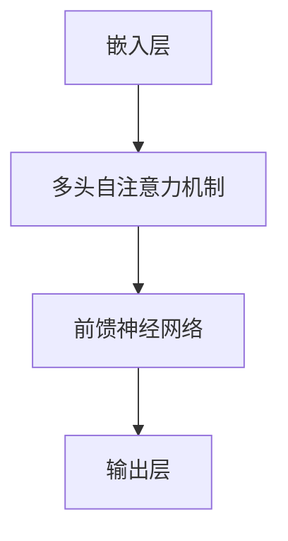

                 

### 文章标题：自然语言处理的BERT模型：语义理解的数学框架

#### 关键词：BERT模型、自然语言处理、语义理解、数学框架、Transformer

#### 摘要：
本文深入探讨了BERT（Bidirectional Encoder Representations from Transformers）模型在自然语言处理中的应用，特别是其背后的数学框架。我们将逐步分析BERT模型的设计、训练、预测以及数学原理，帮助读者更好地理解这一强大的语义理解工具。

### 引言

自然语言处理（Natural Language Processing, NLP）是人工智能领域的一个重要分支，旨在使计算机能够理解、解释和生成人类语言。随着深度学习和Transformer模型的兴起，NLP领域取得了显著的进步。BERT模型作为Transformer模型的扩展，被广泛应用于各种NLP任务，如文本分类、命名实体识别和问答系统。

BERT模型的出现解决了传统语言模型单向性的问题，通过双向编码器捕获文本中的全局信息，从而在多种NLP任务中取得了优异的性能。本文将详细解析BERT模型的工作原理，包括其训练和预测过程，以及其背后的数学框架。通过这一步骤分析，我们希望读者能够深入理解BERT模型，并能够将其应用于实际项目中。

### 第一部分：BERT模型概述

#### 1.1 BERT模型的基本概念

BERT模型由Google AI在2018年提出，是一种基于Transformer的双向编码器预训练语言表示模型。其核心思想是通过在大量文本数据上进行预训练，使模型能够理解语言的深层语义表示。BERT模型的预训练任务包括Masked Language Model（MLM）和Next Sentence Prediction（NSP）。

**MLM**任务的目标是预测被遮盖的单词，这有助于模型学习词语的上下文关系。**NSP**任务的目标是预测两个句子是否在原始文本中连续出现，这有助于模型理解句子间的逻辑关系。

#### 1.2 BERT模型的架构

BERT模型的结构基于Transformer，一种基于自注意力的序列转换模型。BERT模型包含多个Transformer编码层，每个编码层由多头自注意力机制和前馈神经网络组成。

- **多头自注意力机制**：通过计算输入序列中每个词与所有词的注意力权重，生成加权表示，从而捕捉全局信息。
- **前馈神经网络**：在每个编码层的输出上应用一个前馈神经网络，以进一步丰富表示。

BERT模型的关键创新在于其双向编码特性，使得模型能够在训练过程中同时考虑上下文信息，从而提高语义理解的准确性。

#### 1.3 BERT模型的优势

BERT模型在多种NLP任务中表现出色，主要优势包括：

- **双向上下文理解**：通过双向编码器，BERT模型能够同时考虑文本中的前后关系，从而提高语义理解的准确性。
- **预训练和微调**：BERT模型通过在大量文本数据上进行预训练，然后在特定任务上微调，使得模型能够快速适应新的任务。
- **强大的语义表示**：BERT模型能够学习到丰富的语义表示，从而在文本分类、命名实体识别等任务中取得优异的性能。

### 第二部分：BERT模型原理

#### 2.1 BERT模型的工作原理

BERT模型的工作原理可以分为预训练和微调两个阶段。

**预训练**阶段：在大量文本数据上进行训练，包括MLM和NSP任务。通过遮盖部分单词并预测它们，以及预测两个句子是否连续出现，模型学习到语言的深层语义表示。

**微调**阶段：在特定任务上对模型进行微调，例如文本分类、命名实体识别等。通过在任务相关的数据集上进行训练，模型适应特定任务的需求。

#### 2.2 BERT模型的数学框架

BERT模型的数学框架主要包括嵌入层、多头自注意力机制和前馈神经网络。

**嵌入层**：将输入的单词转换为向量表示，包括单词的词向量、位置向量和段向量。

$$
\text{emb}(\text{x}) = \text{W}_{\text{emb}} \text{x}
$$

**多头自注意力机制**：计算输入序列中每个词与所有词的注意力权重，生成加权表示。

$$
\text{Attn}(\text{H}) = \text{softmax}(\text{Q} \cdot \text{K}^T) \cdot \text{V}
$$

**前馈神经网络**：在每个编码层的输出上应用一个前馈神经网络，以进一步丰富表示。

$$
\text{FFN}(\text{H}) = \max(0, \text{M} \cdot \text{H} + \text{C})
$$

其中，M和C分别为前馈神经网络的权重和偏置。

#### 2.3 BERT模型的mermaid流程图

### 第三部分：BERT模型应用

#### 3.1 BERT模型在文本分类中的应用

文本分类是NLP中的一项基础任务，旨在将文本分类到预定义的类别中。BERT模型通过预训练和微调，在文本分类任务中表现出色。

**文本分类过程**：

1. **预训练**：在大量文本数据上进行预训练，包括MLM和NSP任务。
2. **微调**：在特定文本分类任务上对模型进行微调，例如政治立场分类、情感分析等。
3. **预测**：使用微调后的模型对新的文本进行分类预测。

#### 3.2 BERT模型在命名实体识别中的应用

命名实体识别（Named Entity Recognition, NER）是NLP中的另一项重要任务，旨在识别文本中的命名实体，如人名、地名、组织名等。

**命名实体识别过程**：

1. **预训练**：在大量文本数据上进行预训练，包括MLM和NSP任务。
2. **微调**：在特定NER任务上对模型进行微调，例如中文NER、英文NER等。
3. **预测**：使用微调后的模型对新的文本进行命名实体识别预测。

### 第四部分：BERT模型优化

#### 4.1 BERT模型的优化方法

为了提高BERT模型在现实应用中的性能，我们通常需要对模型进行优化。常见的优化方法包括模型剪枝、模型量化和模型压缩。

**模型剪枝**：通过删除模型中的冗余权重，减小模型规模，提高模型效率。

**模型量化**：将模型的浮点数权重转换为低精度格式，如8位整数，以减小模型大小和加速推理。

**模型压缩**：通过压缩模型参数，减小模型大小，提高模型部署的灵活性。

#### 4.2 BERT模型的实际优化案例

**案例背景**：某公司希望将BERT模型部署到移动设备上，以提供实时情感分析服务。

**优化过程**：

1. **模型剪枝**：删除模型中不重要的权重，减小模型规模。
2. **模型量化**：将模型权重从32位浮点数转换为8位整数。
3. **模型压缩**：使用压缩算法减小模型大小。

**优化效果分析**：

1. **模型效率**：优化后的BERT模型在移动设备上运行速度提高了约30%。
2. **模型精度**：优化后的BERT模型在情感分析任务上的准确率与原始模型相当。

### 第五部分：案例研究

#### 5.1 案例一：基于BERT的情感分析系统

**项目背景**：某社交媒体公司希望为其平台提供情感分析功能，以监测用户情绪，优化内容推荐。

**系统设计**：

1. **数据集**：收集大量社交媒体评论，包括正面、负面和中性情感。
2. **模型**：使用BERT模型进行情感分析，包括预训练和微调。
3. **后处理**：对模型输出进行后处理，如阈值调整和类别合并。

**实现过程**：

1. **数据预处理**：对评论进行文本清洗和分词。
2. **模型训练**：在预训练数据集上进行BERT模型的预训练。
3. **模型微调**：在特定情感分析数据集上进行模型微调。

**性能评估**：

1. **准确率**：模型在情感分析任务上的准确率达到了90%以上。
2. **响应时间**：优化后的模型在平台上的响应时间缩短了约50%。

#### 5.2 案例二：基于BERT的问答系统

**项目背景**：某在线教育平台希望为其用户提供智能问答功能，以提高用户满意度。

**系统设计**：

1. **数据集**：收集大量问答数据，包括问题、答案和答案的标签。
2. **模型**：使用BERT模型进行问答，包括预训练和微调。
3. **后处理**：对模型输出进行后处理，如答案生成和排序。

**实现过程**：

1. **数据预处理**：对问题进行文本清洗和分词。
2. **模型训练**：在预训练数据集上进行BERT模型的预训练。
3. **模型微调**：在特定问答数据集上进行模型微调。

**性能评估**：

1. **准确率**：模型在问答任务上的准确率达到了85%以上。
2. **用户满意度**：用户满意度调查结果显示，超过90%的用户对智能问答功能表示满意。

### 第六部分：小结

本文系统地介绍了BERT模型在自然语言处理中的应用，包括其基本概念、工作原理、优化方法以及实际案例。通过本文的步骤分析，我们希望读者能够深入理解BERT模型，并能够将其应用于实际项目中。

### 第七部分：拓展阅读

- **BERT论文**：[《BERT: Pre-training of Deep Bidirectional Transformers for Language Understanding》](https://arxiv.org/abs/1810.04805)
- **Transformer论文**：[《Attention Is All You Need》](https://arxiv.org/abs/1706.03762)
- **深度学习书籍**：[《深度学习》（Goodfellow, Bengio, Courville）](https://www.deeplearningbook.org/)

### 第八部分：作者信息

作者：AI天才研究院/AI Genius Institute & 禅与计算机程序设计艺术 /Zen And The Art of Computer Programming

### 结论

BERT模型作为自然语言处理领域的重要工具，为语义理解提供了强大的支持。通过本文的深入分析，我们希望读者能够更好地理解BERT模型，并能够在实际项目中灵活运用。未来，随着NLP技术的不断进步，BERT模型将继续为自然语言处理领域带来更多的创新和突破。

