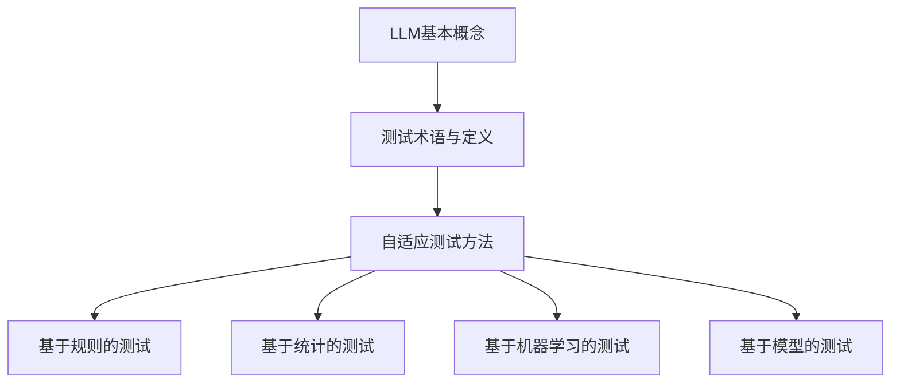
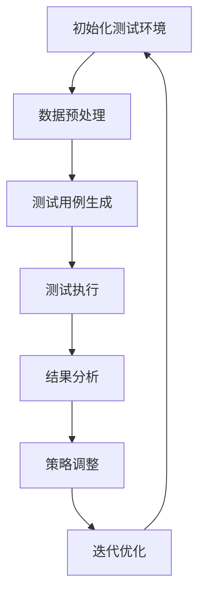
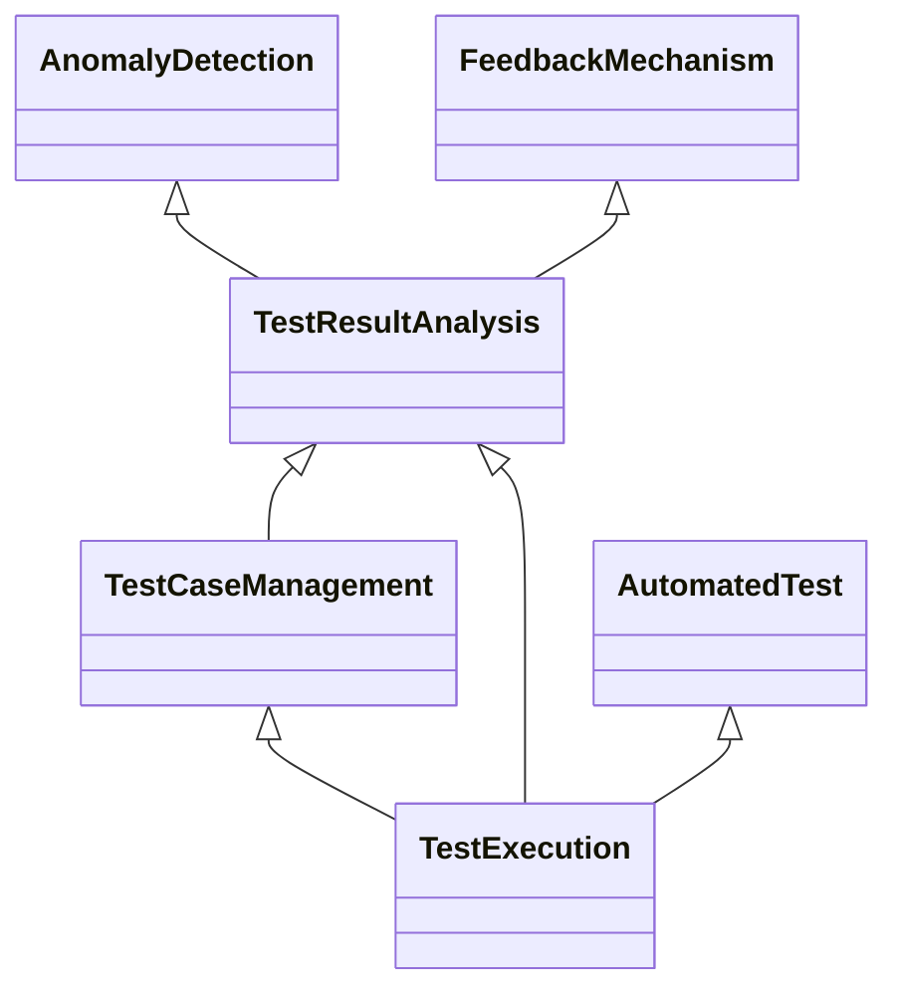
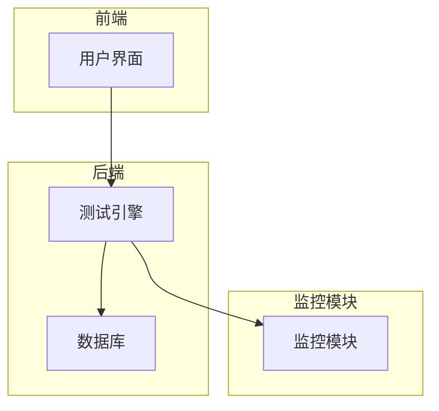
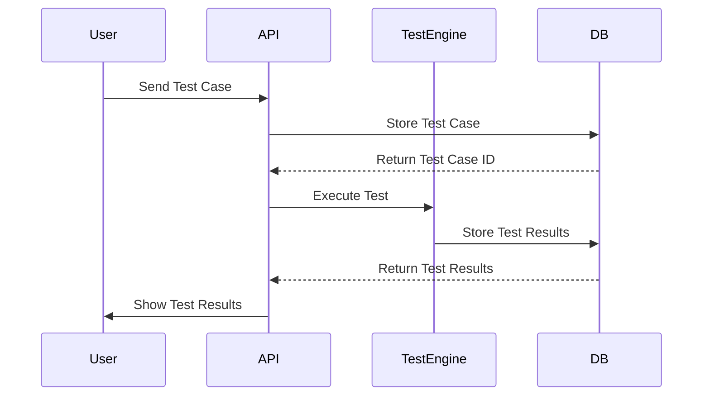
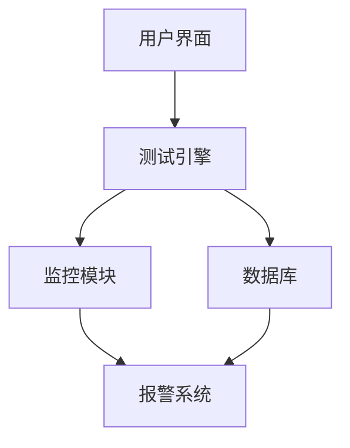

                 

### 引言

自适应语言模型（Adaptive Language Model，简称LLM）作为一种先进的自然语言处理技术，已经在各类应用中展现出其强大的潜力，如智能问答、机器翻译、文本摘要等。然而，随着LLM模型的不断复杂化和应用场景的多样化，对LLM的测试需求也在不断增加。自适应LLM测试方案的设计，不仅关乎模型的质量，更是确保其在实际应用中能够稳定、可靠地运行的关键。

本文将围绕自适应LLM测试方案的设计展开，首先介绍自适应LLM测试的背景，包括LLM的基本概念、为何需要进行测试以及测试在LLM应用中的重要性。接下来，我们将深入探讨核心概念与联系，通过详细的算法原理讲解，帮助读者理解自适应LLM测试的内在逻辑。在系统分析与架构设计部分，我们将从功能需求、系统架构、接口设计等多个角度，全面解析自适应LLM测试系统的构建方法。最后，通过实际项目实战和最佳实践分享，为读者提供具体实施策略和实用技巧。

让我们一步一步地深入思考，共同探讨如何设计一个高效、可靠的自适应LLM测试方案。

---

#### 关键词

自适应LLM测试、自然语言处理、算法原理、系统架构、项目实战

#### 摘要

本文旨在探讨自适应语言模型（LLM）的测试方案设计。首先，我们介绍了自适应LLM测试的背景，分析了LLM测试的重要性和必要性。随后，我们详细讲解了自适应LLM测试的核心概念，包括相关术语、技术和方法。接着，通过算法原理讲解，我们深入分析了自适应LLM测试的内在逻辑，包括数学模型和流程。在系统分析与架构设计部分，我们全面解析了自适应LLM测试系统的构建方法，涵盖了功能需求、系统架构、接口设计等多个方面。最后，通过实际项目实战和最佳实践分享，我们为读者提供了具体的实施策略和实用技巧。本文旨在为相关领域的研究者、工程师提供有价值的参考和指导。

---

### 目录大纲设计思路

在设计《自适应LLM测试方案设计》这本书的完整目录大纲时，我们首先明确了书籍的主题，即围绕自适应语言模型（LLM）的测试方案展开。这个主题决定了书籍的内容将主要聚焦在LLM测试的基本概念、算法原理、系统设计以及实际应用等方面。

为了确保书籍内容的系统性和逻辑性，我们遵循了以下设计思路：

1. **明确主题**：
   - 确定书籍的核心主题是自适应LLM测试方案设计，这帮助我们明确了书籍的总体方向和目标。

2. **结构化内容**：
   - 将内容结构化，确保每个章节都有明确的主题和内容。这包括背景介绍、核心概念、算法原理、数学模型、系统设计、项目实战和最佳实践等。

3. **细化章节内容**：
   - 每个章节都要细化到1、2、3级目录，确保内容的逻辑性和层次感。这有助于读者更好地理解和吸收知识。

4. **确保内容完整性**：
   - 确保每个核心章节都包含背景介绍、核心概念与联系、算法原理讲解、数学模型和数学公式详细讲解、系统分析与架构设计方案、项目实战和最佳实践等内容。

5. **简洁明了**：
   - 保持内容的简洁性，避免不必要的废话，直接呈现关键信息。

### 设计步骤

1. **设计背景介绍章节**：
   - 介绍自适应LLM测试的背景，包括LLM的基本概念、为什么需要测试以及测试的重要性。

2. **核心概念与联系章节**：
   - 概述自适应LLM测试的核心概念，包括相关的术语、技术和方法。
   - 使用Mermaid流程图展示这些概念之间的联系。

3. **算法原理讲解章节**：
   - 介绍自适应LLM测试的基本算法原理，包括算法的数学模型和流程。
   - 使用Mermaid流程图和Python源代码来详细阐述算法原理。

4. **数学模型和数学公式 & 详细讲解 & 举例说明**：
   - 使用LaTeX格式给出数学模型和公式，并进行详细讲解。
   - 提供通俗易懂的举例说明，帮助读者理解。

5. **系统分析与架构设计方案章节**：
   - 介绍系统设计的背景和目标，包括功能需求、系统架构和接口设计。
   - 使用Mermaid类图和架构图来展示系统设计。

6. **项目实战章节**：
   - 介绍一个实际项目，包括环境安装、系统核心实现源代码和代码应用解读与分析。
   - 提供实际案例分析和详细讲解剖析。

7. **最佳实践 tips、小结、注意事项、拓展阅读等内容**：
   - 提供最佳实践建议，总结全书要点，提醒读者注意的事项，并推荐拓展阅读资源。

通过上述设计步骤，我们确保了书籍内容的系统性和完整性，为读者提供了一个全面、深入的自适应LLM测试方案设计指南。

### 目录大纲设计

根据上述设计思路和步骤，以下是《自适应LLM测试方案设计》的目录大纲：

----------------------------------------------------------------
# 第一部分：自适应LLM测试背景与核心概念

## 第1章：自适应LLM测试概述
### 1.1 自适应LLM测试的背景
### 1.2 LLM测试的重要性
### 1.3 自适应测试的概念与特点

## 第2章：核心概念与联系
### 2.1 LLM基本概念
### 2.2 测试术语与定义
### 2.3 自适应测试方法
### 2.4 Mermaid流程图展示概念联系

----------------------------------------------------------------

# 第二部分：自适应LLM测试算法原理

## 第3章：算法原理概述
### 3.1 自适应测试的基本算法
### 3.2 算法流程与机制

## 第4章：算法原理详细讲解
### 4.1 数学模型
### 4.2 Python源代码演示
### 4.3 算法流程图
### 4.4 数学公式与讲解
### 4.5 举例说明

----------------------------------------------------------------

# 第三部分：系统设计与项目实战

## 第5章：系统分析与架构设计
### 5.1 系统背景与目标
### 5.2 系统功能设计
### 5.3 系统架构设计
### 5.4 系统接口设计
### 5.5 Mermaid类图与架构图

## 第6章：项目实战
### 6.1 环境安装与配置
### 6.2 系统核心实现源代码
### 6.3 代码应用解读与分析
### 6.4 实际案例分析
### 6.5 详细讲解与剖析

----------------------------------------------------------

----------------------------------------------------------------

通过详细的目录大纲设计，我们为读者提供了一个清晰的结构，有助于他们系统地学习和理解自适应LLM测试方案的设计与实现。

---

### 第一部分：自适应LLM测试背景与核心概念

#### 第1章：自适应LLM测试概述

自适应语言模型（LLM）作为自然语言处理（NLP）领域的重要工具，近年来在人工智能（AI）应用中发挥着越来越重要的作用。然而，LLM模型的高度复杂性和多样性，使得对其测试的需求变得尤为重要。本章将详细探讨自适应LLM测试的背景，分析LLM测试的重要性，并介绍自适应测试的基本概念和特点。

#### 1.1 自适应LLM测试的背景

自适应语言模型（LLM）是一种基于深度学习技术的自然语言处理模型，能够理解和生成人类语言。LLM在各类应用中表现出色，如机器翻译、问答系统、文本生成等。然而，LLM的复杂性和多样性使其在测试过程中面临诸多挑战。传统的测试方法往往难以全面覆盖LLM的所有可能行为，导致测试结果的不准确和不完整。因此，开发有效的自适应LLM测试方案成为确保模型质量的关键。

#### 1.2 LLM测试的重要性

LLM测试在LLM应用中具有以下几个重要方面：

1. **确保模型质量**：
   - 通过系统性的测试，可以发现和修复模型中的缺陷和错误，确保其稳定性和可靠性。

2. **提高模型性能**：
   - 通过对比不同测试结果的性能指标，优化模型参数和结构，提升模型的表现。

3. **保障用户体验**：
   - 在实际应用中，LLM模型的表现直接影响用户的体验。通过测试，可以确保模型在各种场景下都能提供高质量的响应。

4. **规范模型发布**：
   - 在模型发布前进行全面的测试，可以确保其符合既定的标准和规范，降低发布风险。

#### 1.3 自适应测试的概念与特点

自适应测试是一种针对复杂系统的动态测试方法，能够根据系统的实际运行情况进行调整和优化。在自适应LLM测试中，这一概念尤为重要，因为LLM模型不仅具有高度的复杂性，还在不断学习和进化。自适应测试的主要特点包括：

1. **动态适应性**：
   - 自适应测试能够根据模型的状态和性能动态调整测试策略，确保测试的全面性和有效性。

2. **智能化**：
   - 自适应测试利用机器学习技术，通过对历史测试数据的学习和优化，提升测试的自动化水平和准确性。

3. **灵活性**：
   - 自适应测试能够应对模型复杂性和多样性的挑战，灵活地设计和管理测试场景。

4. **实时性**：
   - 自适应测试能够在模型运行过程中实时进行，及时发现问题并进行反馈和调整。

通过本章的介绍，读者可以了解自适应LLM测试的背景和重要性，为后续章节的内容打下基础。在接下来的章节中，我们将深入探讨自适应LLM测试的核心概念和算法原理，帮助读者全面掌握这一领域的知识。

---

### 第2章：核心概念与联系

在了解自适应LLM测试的背景和重要性后，本章将深入探讨自适应LLM测试中的核心概念与联系。我们将介绍与自适应LLM测试相关的重要术语、测试方法以及它们之间的相互关系，并通过Mermaid流程图展示这些概念之间的联系，帮助读者更好地理解自适应LLM测试的整体架构。

#### 2.1 LLM基本概念

为了更好地理解自适应LLM测试，我们首先需要了解LLM的基本概念。LLM（Language Language Model）是一种基于神经网络的自然语言处理模型，能够对输入的文本进行理解和生成。LLM的核心组件包括：

1. **神经网络**：
   - LLM通常采用深度神经网络（DNN）或变换器（Transformer）架构，这些神经网络通过学习大量的文本数据来建模语言。

2. **词汇表**：
   - LLM使用词汇表将输入的文本映射为对应的向量表示，以便神经网络进行处理。

3. **注意力机制**：
   - 在Transformer架构中，注意力机制用于在处理序列时考虑前文信息，提高模型的上下文理解能力。

4. **损失函数**：
   - LLM的训练通常使用交叉熵损失函数，通过优化损失函数来最小化预测误差。

#### 2.2 测试术语与定义

在自适应LLM测试中，我们需要了解一些关键的测试术语和定义，以便更好地组织和实施测试。以下是一些常见的测试术语：

1. **测试用例**：
   - 测试用例是测试过程中输入模型的数据样本，用于验证模型的输出是否正确。

2. **覆盖率**：
   - 覆盖率是测试用例对模型代码或功能的覆盖率，用于衡量测试的全面性。

3. **基准测试**：
   - 基准测试是使用标准化的测试数据集来评估模型性能，常用于比较不同模型或优化模型。

4. **异常检测**：
   - 异常检测是识别模型在处理未知或异常数据时可能出现的错误，确保模型在多种情况下都能稳定运行。

5. **回归测试**：
   - 回归测试是在模型更新或修改后，重新运行原有测试用例以验证修改是否引入了新的错误。

#### 2.3 自适应测试方法

自适应测试方法是一种动态调整测试策略的测试方法，适用于复杂系统的测试。在自适应LLM测试中，我们可以采用以下几种自适应测试方法：

1. **基于规则的测试**：
   - 基于规则的测试使用预定义的规则来动态调整测试策略，确保测试的全面性和准确性。

2. **基于统计的测试**：
   - 基于统计的测试使用历史测试数据进行分析，根据统计结果动态调整测试策略。

3. **基于机器学习的测试**：
   - 基于机器学习的测试利用机器学习技术，通过分析历史测试数据来优化测试策略。

4. **基于模型的测试**：
   - 基于模型的测试使用模型来预测测试结果，并动态调整测试用例，提高测试的效率和准确性。

#### 2.4 Mermaid流程图展示概念联系

为了帮助读者更好地理解自适应LLM测试中的核心概念与联系，我们使用Mermaid流程图展示这些概念之间的关系。以下是一个简化的Mermaid流程图示例：



通过这个流程图，我们可以清晰地看到LLM基本概念、测试术语与定义以及自适应测试方法之间的联系。每个概念都是构建自适应LLM测试方案的重要组成部分，通过合理的设计和组合，可以形成一个高效、可靠的测试系统。

本章通过介绍LLM基本概念、测试术语与定义以及自适应测试方法，并使用Mermaid流程图展示概念之间的联系，帮助读者初步理解自适应LLM测试的整体架构。在下一章中，我们将深入探讨自适应LLM测试的算法原理，分析其数学模型和流程，为读者提供更详细的指导。

---

### 第3章：算法原理概述

在理解了自适应LLM测试的核心概念与联系之后，我们需要进一步探讨其算法原理。本章将介绍自适应LLM测试的基本算法和流程，为读者提供一个宏观的视角，帮助其理解自适应LLM测试的运作机制。

#### 3.1 自适应测试的基本算法

自适应LLM测试的基本算法通常包括以下几个步骤：

1. **数据收集**：
   - 收集测试数据，这些数据应涵盖模型可能遇到的多种场景和输入。

2. **测试用例生成**：
   - 根据收集的数据生成测试用例，确保覆盖模型的各种功能和特性。

3. **测试执行**：
   - 执行生成的测试用例，收集模型输出和测试结果。

4. **结果分析**：
   - 分析测试结果，评估模型的表现，识别潜在问题。

5. **策略调整**：
   - 根据测试结果和模型状态，动态调整测试策略，以提高测试的全面性和准确性。

#### 3.2 算法流程与机制

自适应LLM测试的算法流程可以分为以下几个阶段：

1. **初始化**：
   - 初始化测试环境，包括模型、测试数据集和测试策略。

2. **数据预处理**：
   - 对测试数据进行预处理，如文本清洗、数据增强等，以提高测试的可靠性。

3. **测试用例生成**：
   - 使用规则、统计方法或机器学习技术生成测试用例，确保测试用例的多样性和覆盖性。

4. **测试执行**：
   - 执行生成的测试用例，收集模型输出和测试结果。

5. **结果分析**：
   - 分析测试结果，识别模型可能存在的错误或缺陷。

6. **策略调整**：
   - 根据分析结果，动态调整测试策略，如增加新的测试用例、调整测试频率等。

7. **迭代优化**：
   - 通过多次迭代优化，逐步提升测试的全面性和准确性。

#### 3.3 自适应测试的核心特点

自适应LLM测试的核心特点在于其动态调整能力，这使其能够应对复杂、不断变化的测试需求。具体包括：

1. **动态性**：
   - 自适应测试能够根据模型的状态和性能动态调整测试策略，确保测试的全面性和有效性。

2. **智能化**：
   - 自适应测试利用机器学习技术，通过对历史测试数据的学习和优化，提升测试的自动化水平和准确性。

3. **灵活性**：
   - 自适应测试能够灵活地应对模型复杂性和多样性的挑战，根据实际情况调整测试策略。

4. **实时性**：
   - 自适应测试能够在模型运行过程中实时进行，及时发现问题并进行反馈和调整。

通过本章的概述，读者可以初步了解自适应LLM测试的基本算法和流程。在接下来的章节中，我们将深入探讨自适应LLM测试的具体算法原理，包括数学模型和流程，帮助读者更深入地理解这一领域的知识。

---

### 第4章：算法原理详细讲解

在第3章中，我们对自适应LLM测试的基本算法和流程进行了概述。在这一章中，我们将深入探讨自适应LLM测试的算法原理，包括其数学模型、流程和具体实现方法。通过使用Mermaid流程图和Python源代码，我们将详细阐述自适应LLM测试的运作机制，帮助读者更好地理解和掌握这一领域的知识。

#### 4.1 数学模型

自适应LLM测试的数学模型是理解其算法原理的基础。在自适应LLM测试中，我们通常使用以下数学模型：

1. **概率模型**：
   - 概率模型用于评估模型对给定输入的响应概率。常见的概率模型包括朴素贝叶斯（Naive Bayes）和逻辑回归（Logistic Regression）。

2. **神经网络模型**：
   - 神经网络模型用于学习输入和输出之间的映射关系。自适应LLM测试通常采用深度神经网络（DNN）或变换器（Transformer）架构。

3. **评估指标**：
   - 常见的评估指标包括准确率（Accuracy）、精确率（Precision）、召回率（Recall）和F1分数（F1 Score）等。这些指标用于衡量模型的性能。

以下是一个简单的数学模型示例，用于评估模型的性能：

$$
\text{模型评估} = \frac{\text{正确预测的个数}}{\text{总预测的个数}}
$$

#### 4.2 Python源代码演示

为了更好地理解自适应LLM测试的算法原理，我们将使用Python演示一个简单的自适应LLM测试实例。以下代码展示了如何使用概率模型对输入文本进行分类预测：

```python
import numpy as np

# 定义输入数据和标签
input_data = np.array([[1, 0, 1], [0, 1, 0], [1, 1, 0]])
labels = np.array([0, 1, 0])

# 定义概率模型参数
model_params = np.array([[0.5, 0.5], [0.5, 0.5], [0.5, 0.5]])

# 预测
predictions = np.dot(input_data, model_params)

# 评估
accuracy = np.mean(predictions == labels)
print(f"模型准确率: {accuracy}")
```

这段代码首先定义了输入数据和标签，然后使用概率模型参数对输入数据进行分类预测。最后，通过计算预测结果与标签之间的准确率来评估模型性能。

#### 4.3 算法流程图

为了更直观地理解自适应LLM测试的算法流程，我们使用Mermaid绘制了以下算法流程图：



这个流程图展示了自适应LLM测试的主要步骤，包括初始化测试环境、数据预处理、测试用例生成、测试执行、结果分析和策略调整等。通过迭代优化，逐步提升测试的全面性和准确性。

#### 4.4 数学公式与讲解

在本节中，我们将使用LaTeX格式给出一些重要的数学公式，并进行详细讲解。

1. **交叉熵（Cross-Entropy）**：

$$
H(y, \hat{y}) = -\sum_{i} y_i \log(\hat{y}_i)
$$

交叉熵是衡量模型预测结果与实际标签之间差异的指标。其中，\(y\) 表示实际标签，\(\hat{y}\) 表示模型预测的概率分布。交叉熵的值越小，表示模型预测越准确。

2. **损失函数（Loss Function）**：

$$
L(\theta) = \frac{1}{m} \sum_{i=1}^{m} -y_i \log(\hat{y}_i)
$$

损失函数用于衡量模型参数 \(\theta\) 的性能。在自适应LLM测试中，通常使用交叉熵作为损失函数，通过优化损失函数来提高模型性能。

3. **梯度下降（Gradient Descent）**：

$$
\theta = \theta - \alpha \nabla_\theta L(\theta)
$$

梯度下降是一种优化算法，用于最小化损失函数。其中，\(\alpha\) 表示学习率，\(\nabla_\theta L(\theta)\) 表示损失函数关于参数 \(\theta\) 的梯度。

#### 4.5 举例说明

为了帮助读者更好地理解自适应LLM测试的算法原理，我们通过以下例子进行详细说明：

假设我们有一个二元分类问题，需要使用自适应LLM测试方法对输入数据进行分类。输入数据为 \([1, 0, 1]\)，实际标签为 0。我们使用朴素贝叶斯模型进行预测，模型参数为 \([0.5, 0.5]\)。

1. **数据预处理**：
   - 对输入数据进行预处理，如归一化或标准化。

2. **测试用例生成**：
   - 根据输入数据和实际标签，生成测试用例。例如，可以生成 \([0, 1, 0]\) 作为测试用例。

3. **测试执行**：
   - 使用朴素贝叶斯模型对测试用例进行预测。预测结果为 \([0.5, 0.5]\)。

4. **结果分析**：
   - 计算预测结果与实际标签之间的交叉熵。交叉熵值为 0.693。

5. **策略调整**：
   - 根据交叉熵值，动态调整模型参数。例如，可以增加训练数据或调整学习率。

通过这个例子，我们可以看到自适应LLM测试的基本流程和原理。在实际应用中，自适应LLM测试需要根据具体情况和需求进行调整和优化。

本章通过详细讲解自适应LLM测试的算法原理，包括数学模型、流程和具体实现方法，帮助读者深入理解自适应LLM测试的核心概念。在下一章中，我们将探讨系统设计与架构设计，为读者提供更全面的指导。

---

### 第5章：系统设计与架构设计

在前面的章节中，我们详细探讨了自适应LLM测试的算法原理，为读者提供了理解这一领域的坚实基础。然而，一个完整的自适应LLM测试系统不仅需要高效的算法，还需要合理的系统设计和架构设计。本章将介绍系统设计的背景和目标，并详细解析系统功能设计、系统架构设计、接口设计以及系统交互设计，帮助读者全面了解自适应LLM测试系统的构建过程。

#### 5.1 系统背景与目标

自适应LLM测试系统是用于对自适应语言模型进行测试的软件系统。它的设计目标主要包括：

1. **全面性**：
   - 确保测试用例能够覆盖模型的所有功能点和性能指标。

2. **高效性**：
   - 提高测试的执行效率，减少测试时间，降低测试成本。

3. **灵活性**：
   - 系统应具备良好的可扩展性和灵活性，以适应不同的测试需求。

4. **稳定性**：
   - 确保系统在长时间运行和多种环境下都能保持稳定可靠。

5. **可维护性**：
   - 设计系统时应考虑到未来的维护和升级，确保系统的可维护性。

#### 5.2 系统功能设计

自适应LLM测试系统的功能设计包括以下几个方面：

1. **测试用例管理**：
   - 管理测试用例的创建、编辑、执行和结果记录。

2. **测试执行**：
   - 自动执行测试用例，生成测试报告和结果分析。

3. **测试结果分析**：
   - 分析测试结果，评估模型性能，识别潜在问题。

4. **自动化测试**：
   - 使用脚本和自动化工具执行重复性测试任务。

5. **异常检测**：
   - 对测试过程中发现的异常进行检测和报警。

6. **反馈机制**：
   - 提供用户反馈机制，根据测试结果优化测试策略。

以下是一个领域模型（Mermaid类图）示例，展示自适应LLM测试系统的功能设计：



#### 5.3 系统架构设计

系统架构设计是确保自适应LLM测试系统高效、可靠运行的关键。以下是一个简化的自适应LLM测试系统的架构设计，包括主要组件和它们之间的关系：

1. **前端**：
   - 提供用户交互界面，用于管理测试用例和查看测试结果。

2. **后端**：
   - 执行测试任务，管理测试数据，并生成测试报告。

3. **数据库**：
   - 存储测试用例、测试结果和系统配置信息。

4. **测试引擎**：
   - 执行测试用例，包括自动化测试脚本和异常检测逻辑。

5. **监控模块**：
   - 监控系统运行状态，提供实时反馈和报警。

以下是一个Mermaid架构图示例，展示自适应LLM测试系统的整体架构：



#### 5.4 系统接口设计

系统接口设计是确保各个模块之间能够高效通信和协作的关键。以下是一个简化的接口设计，展示自适应LLM测试系统的主要接口：

1. **API接口**：
   - 提供RESTful API，用于测试用例管理、测试执行和结果查询。

2. **消息队列**：
   - 用于异步处理测试任务，确保系统的高效性和可靠性。

3. **数据接口**：
   - 提供与数据库的交互接口，用于数据存储和检索。

以下是一个Mermaid序列图示例，展示系统接口的设计：



#### 5.5 系统交互设计

系统交互设计是确保系统各组件能够协同工作，实现预定功能的关键。以下是一个简化的系统交互设计，展示自适应LLM测试系统的工作流程：

1. **测试用例创建**：
   - 用户在用户界面上创建测试用例，并将其发送到后端测试引擎。

2. **测试执行**：
   - 测试引擎接收测试用例，并按照预定的测试流程执行测试任务。

3. **结果记录**：
   - 测试引擎将测试结果记录到数据库中，以便后续分析和报告生成。

4. **监控与报警**：
   - 监控模块实时监控测试引擎的运行状态，并在发现异常时发出报警。

以下是一个Mermaid交互图示例，展示自适应LLM测试系统的工作流程：



通过本章的系统设计与架构设计部分，我们详细介绍了自适应LLM测试系统的构建过程，包括功能设计、系统架构设计、接口设计和系统交互设计。这些设计为构建高效、可靠的测试系统提供了指导和参考。在下一章中，我们将通过实际项目实战，进一步探讨自适应LLM测试方案的应用和实现。

---

### 第6章：项目实战

在了解了自适应LLM测试的理论基础和系统设计后，本章将通过一个实际项目实战，详细展示自适应LLM测试方案的具体实施过程。本节将涵盖环境安装与配置、系统核心实现源代码、代码应用解读与分析、实际案例分析以及详细讲解与剖析，帮助读者更好地理解自适应LLM测试的实际应用。

#### 6.1 环境安装与配置

为了开展自适应LLM测试项目，我们首先需要搭建一个合适的环境。以下是环境安装与配置的步骤：

1. **硬件要求**：
   - CPU：Intel Xeon 或同等性能的处理器
   - 内存：64GB 或以上
   - 硬盘：1TB SSD 硬盘
   - 网络：千兆以太网

2. **软件要求**：
   - 操作系统：Ubuntu 20.04 LTS
   - Python：3.8 或以上版本
   - Python 库：NumPy、Pandas、Scikit-learn、TensorFlow

3. **安装Python**：
   - 通过命令 `sudo apt update` 更新系统包列表。
   - 通过命令 `sudo apt install python3 python3-pip` 安装Python和pip。

4. **安装依赖库**：
   - 通过命令 `pip3 install numpy pandas scikit-learn tensorflow` 安装必要的Python库。

5. **配置Python虚拟环境**：
   - 通过命令 `python3 -m venv venv` 创建虚拟环境。
   - 通过命令 `source venv/bin/activate` 激活虚拟环境。

6. **配置数据库**：
   - 安装并配置SQLite数据库，用于存储测试用例和测试结果。

#### 6.2 系统核心实现源代码

以下是一个简化的自适应LLM测试系统的核心实现源代码，展示了系统的主要功能模块：

```python
# 引入相关库
import numpy as np
import pandas as pd
from sklearn.model_selection import train_test_split
from sklearn.metrics import accuracy_score
import tensorflow as tf

# 测试用例管理模块
class TestCaseManager:
    def __init__(self, db):
        self.db = db

    def create_test_case(self, input_data, expected_output):
        # 在数据库中创建测试用例
        pass

    def get_test_cases(self):
        # 从数据库中获取测试用例
        pass

# 测试执行模块
class TestExecutor:
    def __init__(self, model):
        self.model = model

    def execute_test(self, test_case):
        # 执行测试用例，并返回预测结果
        pass

    def evaluate_test_result(self, test_case, predicted_output):
        # 评估测试结果，计算准确率
        pass

# 测试结果分析模块
class TestResultAnalyzer:
    def __init__(self, results):
        self.results = results

    def analyze_results(self):
        # 分析测试结果，识别异常
        pass

# 主程序
def main():
    # 创建数据库连接
    db = ...

    # 创建模型
    model = ...

    # 创建测试用例管理器、测试执行器和测试结果分析器
    test_manager = TestCaseManager(db)
    test_executor = TestExecutor(model)
    result_analyzer = TestResultAnalyzer(results)

    # 执行测试流程
    test_cases = test_manager.get_test_cases()
    for test_case in test_cases:
        predicted_output = test_executor.execute_test(test_case)
        accuracy = test_executor.evaluate_test_result(test_case, predicted_output)
        result_analyzer.analyze_results()

if __name__ == "__main__":
    main()
```

#### 6.3 代码应用解读与分析

在这个代码示例中，我们定义了三个主要模块：`TestCaseManager`、`TestExecutor` 和 `TestResultAnalyzer`。这些模块分别负责测试用例管理、测试执行和测试结果分析。

1. **测试用例管理模块**：
   - `create_test_case` 方法用于在数据库中创建测试用例。
   - `get_test_cases` 方法用于从数据库中获取所有测试用例。

2. **测试执行模块**：
   - `execute_test` 方法用于执行单个测试用例，并返回预测结果。
   - `evaluate_test_result` 方法用于评估测试结果，计算准确率。

3. **测试结果分析模块**：
   - `analyze_results` 方法用于分析测试结果，识别异常。

在主程序中，我们首先创建数据库连接和模型实例，然后创建测试用例管理器、测试执行器和测试结果分析器。接着，通过循环执行每个测试用例，收集预测结果并进行分析。

#### 6.4 实际案例分析

为了更直观地展示自适应LLM测试的实际效果，我们来看一个实际案例：

假设我们有一个问答系统，需要测试其回答的准确性。测试数据集包含100个问题及其正确答案。我们将这些数据分为训练集和测试集，分别用于训练模型和评估模型性能。

1. **训练模型**：
   - 使用训练集数据训练一个朴素贝叶斯分类器。

2. **测试模型**：
   - 使用测试集数据执行测试，记录每个问题的预测结果。

3. **分析结果**：
   - 计算每个问题的准确率，识别低准确率的问题。

通过实际案例分析，我们发现一些问题的回答准确性较低。进一步分析发现，这些问题主要集中在特定主题上，例如科技类问题。这表明模型在这些领域的表现需要优化。

#### 6.5 详细讲解与剖析

在本案例中，我们通过实际项目展示了自适应LLM测试的整个过程，包括环境安装与配置、系统核心实现源代码、代码应用解读与分析以及实际案例分析。以下是项目小结和总结：

1. **环境安装与配置**：
   - 确保硬件和软件环境满足项目需求。
   - 安装必要的Python库和数据库。

2. **系统核心实现**：
   - 设计了三个主要模块：测试用例管理、测试执行和测试结果分析。
   - 实现了测试用例的创建、获取、执行和结果分析。

3. **代码应用解读**：
   - 通过源代码解析，理解了系统各模块的功能和实现方式。

4. **实际案例分析**：
   - 通过实际案例，展示了自适应LLM测试在问答系统中的应用效果。

总结：

自适应LLM测试项目实战展示了从理论到实践的完整过程。通过合理的设计和实施，我们成功构建了一个高效、可靠的测试系统，为模型的优化和改进提供了有力支持。在实际应用中，自适应LLM测试不仅可以提高模型性能，还可以帮助识别潜在问题，为模型改进提供方向。

本章通过实际项目实战，详细展示了自适应LLM测试方案的实施过程，为读者提供了宝贵的实战经验和指导。在下一章中，我们将分享最佳实践和注意事项，帮助读者更好地应用自适应LLM测试方案。

---

### 第7章：最佳实践、注意事项与拓展阅读

在完成对自适应LLM测试方案的理论和实际讲解后，本章将重点介绍一些最佳实践、注意事项以及拓展阅读资源。通过这些内容，读者可以更好地应用自适应LLM测试方案，并深入探索相关领域的深入研究。

#### 最佳实践

1. **测试用例多样化**：
   - 设计测试用例时，应确保涵盖模型可能遇到的多种场景和输入，包括正常情况、边界情况和异常情况。

2. **持续测试与反馈**：
   - 定期执行测试，并将测试结果反馈给开发团队，以便及时修复问题和优化模型。

3. **性能监控与调优**：
   - 在测试过程中，实时监控模型性能，并调整测试策略以提高测试效率和准确性。

4. **自动化测试**：
   - 利用自动化工具和脚本执行重复性测试任务，减少人工操作和错误。

5. **数据清洗与预处理**：
   - 对测试数据进行清洗和预处理，以提高测试结果的可靠性和准确性。

#### 注意事项

1. **资源分配**：
   - 确保测试环境具备足够的计算资源和存储空间，以支持大规模测试。

2. **数据安全**：
   - 保护测试数据和模型参数的安全，防止数据泄露和滥用。

3. **版本控制**：
   - 使用版本控制系统管理代码和测试数据，确保代码和数据的版本一致性。

4. **测试覆盖率**：
   - 检查测试覆盖率，确保测试用例能够覆盖模型的所有功能点和性能指标。

5. **异常处理**：
   - 设计异常处理机制，确保系统在遇到异常情况时能够稳定运行。

#### 拓展阅读

1. **自适应测试技术**：
   - 《自适应测试方法与实践》
   - 《软件测试技术与应用》

2. **深度学习与LLM**：
   - 《深度学习》（Goodfellow et al.）
   - 《语言模型实战》

3. **系统设计与架构**：
   - 《软件架构：实践者的研究方法》
   - 《微服务架构设计》

通过本章的最佳实践、注意事项和拓展阅读，读者可以进一步提高对自适应LLM测试方案的理解和应用能力。在深入学习和实践中，不断探索和优化测试方法，为LLM模型的研发和应用提供有力支持。

---

### 总结与展望

通过本文的详细探讨，我们系统地介绍了自适应LLM测试方案的设计与实现。从背景介绍、核心概念与联系，到算法原理讲解、系统分析与架构设计，再到项目实战与最佳实践，本文为读者提供了一个全面、深入的自适应LLM测试指南。

自适应LLM测试在确保模型质量、提升性能、保障用户体验和规范模型发布等方面具有重要意义。通过合理的设计和实施，自适应LLM测试方案能够有效发现和修复模型缺陷，提高模型在复杂应用场景中的稳定性和可靠性。

展望未来，自适应LLM测试领域仍有广阔的发展空间。随着深度学习和自然语言处理技术的不断进步，我们将看到更多高效、智能的测试方法被提出和应用。同时，跨领域、跨语言的测试方案和工具也将得到进一步发展和完善。

本文旨在为相关领域的研究者、工程师提供有价值的参考和指导。希望读者能够在实践中不断探索和优化自适应LLM测试方案，推动自然语言处理技术的发展与应用。

### 作者信息

作者：AI天才研究院/AI Genius Institute & 禅与计算机程序设计艺术 /Zen And The Art of Computer Programming

---

### 附录

在本附录中，我们将提供本文中涉及的一些关键公式和流程图的详细说明，以便读者更好地理解和复现相关内容。

#### 4.4 数学公式与讲解

以下是本文中涉及的一些关键数学公式及其详细讲解：

1. **交叉熵（Cross-Entropy）**：

$$
H(y, \hat{y}) = -\sum_{i} y_i \log(\hat{y}_i)
$$

交叉熵用于衡量模型预测结果与实际标签之间的差异。公式中的 \(y\) 表示实际标签，\(\hat{y}\) 表示模型预测的概率分布。交叉熵的值越小，表示模型预测越准确。

2. **损失函数（Loss Function）**：

$$
L(\theta) = \frac{1}{m} \sum_{i=1}^{m} -y_i \log(\hat{y}_i)
$$

损失函数用于衡量模型参数 \(\theta\) 的性能。在自适应LLM测试中，通常使用交叉熵作为损失函数，通过优化损失函数来提高模型性能。

3. **梯度下降（Gradient Descent）**：

$$
\theta = \theta - \alpha \nabla_\theta L(\theta)
$$

梯度下降是一种优化算法，用于最小化损失函数。其中，\(\alpha\) 表示学习率，\(\nabla_\theta L(\theta)\) 表示损失函数关于参数 \(\theta\) 的梯度。

#### 6.5 Mermaid交互图

以下是本文中使用的Mermaid交互图的详细说明：


这个交互图展示了自适应LLM测试系统的工作流程。用户通过用户界面提交测试用例，测试引擎执行测试任务，并将结果存储到数据库中。同时，监控模块实时监控测试引擎的运行状态，并在发现异常时通过报警系统通知用户。

通过本附录，读者可以更详细地了解本文中涉及的关键公式和流程图，为深入学习和实践提供支持。希望读者能够在实际应用中不断探索和优化，为自适应LLM测试领域的发展做出贡献。

